# dbo.create_av_details_$sp

**Database:** auditworks_external  
**Server:** bedrockdb01  

## Architecture Diagram

```mermaid
flowchart LR
    SP["dbo.create_av_details_$sp"]
    authorization_detail(["authorization_detail"]) --> SP
    av_authorization_detail(["av_authorization_detail"]) --> SP
    av_customer(["av_customer"]) --> SP
    av_customer_detail(["av_customer_detail"]) --> SP
    av_discount_detail(["av_discount_detail"]) --> SP
    av_exception_reason(["av_exception_reason"]) --> SP
    av_if_rejection_reason(["av_if_rejection_reason"]) --> SP
    av_interface_control(["av_interface_control"]) --> SP
    av_line_note(["av_line_note"]) --> SP
    av_merchandise_detail(["av_merchandise_detail"]) --> SP
    av_payroll_detail(["av_payroll_detail"]) --> SP
    av_post_void_detail(["av_post_void_detail"]) --> SP
    av_return_detail(["av_return_detail"]) --> SP
    av_special_order_detail(["av_special_order_detail"]) --> SP
    av_stock_control_detail(["av_stock_control_detail"]) --> SP
    av_tax_detail(["av_tax_detail"]) --> SP
    av_tax_override_detail(["av_tax_override_detail"]) --> SP
    av_transaction_header(["av_transaction_header"]) --> SP
    av_transaction_line(["av_transaction_line"]) --> SP
    av_transaction_line_link(["av_transaction_line_link"]) --> SP
    common_error_handling__sp(["common_error_handling_$sp"]) --> SP
    customer(["customer"]) --> SP
    customer_detail(["customer_detail"]) --> SP
    discount_detail(["discount_detail"]) --> SP
    exception_reason(["exception_reason"]) --> SP
    if_rejection_reason(["if_rejection_reason"]) --> SP
    interface_control(["interface_control"]) --> SP
    line_note(["line_note"]) --> SP
    line_object_action_association(["line_object_action_association"]) --> SP
    merchandise_detail(["merchandise_detail"]) --> SP
    payroll_detail(["payroll_detail"]) --> SP
    post_void_detail(["post_void_detail"]) --> SP
    return_detail(["return_detail"]) --> SP
    special_order_detail(["special_order_detail"]) --> SP
    stock_control_detail(["stock_control_detail"]) --> SP
    tax_detail(["tax_detail"]) --> SP
    tax_override_detail(["tax_override_detail"]) --> SP
    tran_id_datatype(["tran_id_datatype"]) --> SP
    transaction_header(["transaction_header"]) --> SP
    transaction_line(["transaction_line"]) --> SP
    transaction_line_link(["transaction_line_link"]) --> SP
    work_av_header(["work_av_header"]) --> SP
```



## Table Dependencies

| Referenced Table |
|---|
| authorization_detail |
| av_authorization_detail |
| av_customer |
| av_customer_detail |
| av_discount_detail |
| av_exception_reason |
| av_if_rejection_reason |
| av_interface_control |
| av_line_note |
| av_merchandise_detail |
| av_payroll_detail |
| av_post_void_detail |
| av_return_detail |
| av_special_order_detail |
| av_stock_control_detail |
| av_tax_detail |
| av_tax_override_detail |
| av_transaction_header |
| av_transaction_line |
| av_transaction_line_link |
| common_error_handling_$sp |
| customer |
| customer_detail |
| discount_detail |
| exception_reason |
| if_rejection_reason |
| interface_control |
| line_note |
| line_object_action_association |
| merchandise_detail |
| payroll_detail |
| post_void_detail |
| return_detail |
| special_order_detail |
| stock_control_detail |
| tax_detail |
| tax_override_detail |
| tran_id_datatype |
| transaction_header |
| transaction_line |
| transaction_line_link |
| work_av_header |

## Stored Procedure Code

```sql
create proc dbo.create_av_details_$sp  @dayend_process_id int, -- stream number
 @multiplier        smallint = 1,
 @errmsg            nvarchar(255) OUTPUT,
 @update_timing	    smallint,
 @log_tax_detail    tinyint,
 @scaleout_flag	    int	= 0

AS

/* Procedure Name: create_av_details_$sp
** Description: Will insert all transaction details for store_audit_status = 355 into archive detail tables.
**              In scaleout environments, will update tables on consolidated except for the pre-audit av tables.
** 		Called from archive_posting_$sp

** As of SA5.1, this merged SA_EDIT version replaces the previous versions from modules SA_EDIT, SA_PERI and SA_PART

Please ensure that the proc script contains the following at the top in order to support scaleout:
SET ANSI_NULLS ON
SET ANSI_WARNINGS ON

HISTORY
Date     Name         Def# Desc
Feb18,15 Vicci   TFS-78137 Change tax_exception_transaction data transfer to consolidated to be dynamic SQL to avoid compilation issue on non-peripheral schemas.
Jul04,14 Vicci   TFS-74694 Log cost.
Feb27,14 Vicci       61711 Add av_tax_detail.applied_by_line_id.
Jul08,13 Vicci      139695 Add unit_of_measure logging.
Jul26,12 Paul       135013 scaleout: populate tax_exception_transaction on the consolidated server.
Mar20,12 Paul     1-48FEQB scaleout: update exception_flag in av_transaction_header on consolidated, improved error traps,
			  use from-to transaction_id range to maximize cross-server performance.
Mar18,11 Paul       121025 SA5.1: populate transaction_date in av tables even when partitioning is not used.
Feb11,11 Paul       105977 Uplift SA5 fixes to SA5.1 unicode
Dec14,10 Vicci      120654 Add tax_item_group_id, originating_date, fulfillment_store_no, above_threshold_flag fields.
Sep07,10 Paul       119817 scaleout: turn on xact abort setting only when needed since it aborts error logging
May14,09 Vicci      109078 Add track_tax to copy
Nov28,08 Paul       104990 Populate transaction_date in av_if_rejection_reason
Oct04,07 Phu         93464 Apply 93250 to SA5. Facilitate subledger posting when GL account is setup by tax jurisdiction.
Aug14,07 Paul      DV-1363 Apply 89487 to SA5
Dec05,06 Paul      DV-1347 Apply 77700 to SA5, pass in @log_tax_detail
Jul11,05 Sab	   DV-1295 For scaleout, check to see if rows exists prior to inserting the rows
May03,05 Maryam    DV-1202 insert into av_transaction_line_link. Rename from_line_id to line_id.
	 Sab		   Added update_timing. If the update_timing=1(edit),then archive tables will be built from interfaces.
Dec13,04 David     DV-1191 Improve performance by adding hints.
Sep24,04 David     DV-1146 Use updated_by_user_id instead of updated_by_user_name, added columns to inserts.
Jun28,05 ShuZ      DV-1071 Add without_receipt_flag when populating return_detail tables.
Jul18,07 Vicci       89487 Copy exception_reason.memo1 to archive
Sep28.06 Daphna      77700 do not insert to av_tax_detail when parameter is off
Sep19,03 Phu         15801 populate other_information, tab_delimited_token_list, sku_id, reason, imrd, style_reference_id
Apr23,03 Paul      1-KO2HY populate till_no
Apr15,03 Paul      AW-8249 populate entry_date_time in av_post_void_detail
Dec19,02 Phu          5327 Retrieve gl_effect
Nov20,02 Paul         5183 call common_error_handling_$sp with abort_flag = 3 when logging warnings
Jul04,02 Winnie    AW-8770 Insert process_id, lookup_key1 to av_if_reject_reason
Jun03,02 Vicci     1-DESPL Add display_def_id to stock_control_detail
Apr25,02 Phu       1-C9P5S Pre audit tax: insert into av_tax_detail
JAN16,02 Daphna    1-A91VP Insert to av_transaction_header, previously inserted in 
			          archive_posting_$sp (to match Oracle) . 
			          Insert to av_interface_control, previously inserted in 
			          archive_posting_$sp (to match Oracle).  
			          Add Handling of Duplicate Inserts (to match Oracle)
			          RETROFIT TO: 02.50.06 and 02.46.25 
Dec19,01 Paul		AW-4405 	Add R3 error handling, rename @process_id to @dayend_process_id
						for clarity and to match Oracle.
Sep24,01 ShuZ          8288	Add an originating_store_no to the stock_control_detail table 
						for use when head-office(or another store) enters a transacion 
						on behalf of another store
May28,01 Winnie	   8019 	Log pos_deptclass and upc_lookup_division to if_stock_control_detail table
May16,01 Shapoor       7813 	Add column originating_store_no to merchandise* tables to attribute 
		             		the sale/return to the store where the sale originated.
Feb22,01 DavidM  	   7391 	Add pos_identifier and pos_identifier_type fields to 
						av_stock_control_detail table.
Jan15,01 Maryam	   7205 	Archiving of tax_detail will be done in sales_tax_main proc.
Oct03,00 Maryam        6782 	Modify to log customer.pos_tax_jurisdiction_code, fax, and 
						email_address	and also archive the new tax_detail table.
Jun13,00 Paul		   6374 	ensure that archive_handling_method defaults to 1
Mar21,00 ShuZ		   6120   'full archive' when archive_handling_method = 1
Mar30,99 Paul		   4353 	Call lp module
Aug07,98 Daphna          ??	??
?        Phu			??	Author

*/

DECLARE

	@errno 				int,
	@from_transaction_id		tran_id_datatype,
	@lookup_segment_flag		tinyint,
	@object_name			nvarchar(255),
	@message_id			int,
	@operation_name			nvarchar(100),
	@process_name			nvarchar(100),
	@process_no 			smallint,
	@to_transaction_id		tran_id_datatype,
	@trace_msg			nvarchar(255),
	@warn_errmsg			nvarchar(255),
	@warn_errno			int,   
	@warn_operation_name		nvarchar(100),
	@sql_command			nvarchar(max)

SET ANSI_NULLS ON
SET ANSI_WARNINGS ON
     
SELECT 
	@process_no = 28,
	@process_name = 'create_av_details_$sp',
	@message_id = 201068,
	@warn_errno = 201062,
	@warn_operation_name = 'INSERT',
	@warn_errmsg = 'WARNING!! Duplicates found while inserting to the archived table were corrected automatically'

/* start of general error trap since using xact abort for scaleout. xact abort on would otherwise prevent error traps from firing. */
BEGIN TRY 
  SELECT  @object_name = 'work_av_header'

/* Determine range of av_transaction_id in batch in order to maximize scaleout cross-server performance */
SELECT @from_transaction_id = MIN(transaction_id),
	@to_transaction_id = MAX(transaction_id)
  FROM work_av_header
 WHERE process_id = @dayend_process_id

IF @scaleout_flag = 1
  BEGIN
	SELECT @trace_msg = nchar(13) + nchar(10) + ':LOG && populating av_interface_control : ' + CONVERT(nchar, getdate(), 8)
	PRINT @trace_msg
	SET XACT_ABORT ON
  END

/* def 1-A91VP: insert av_interface_control */
interface_control:

SELECT  @object_name = 'av_interface_control'

BEGIN TRY
INSERT av_interface_control (
		av_transaction_id,
		interface_id,
		interface_status_flag,
		transaction_date )
SELECT wa.av_transaction_id,
	  ic.interface_id,
	  interface_status_flag,
	  wa.transaction_date	
  FROM work_av_header wa WITH (NOLOCK), interface_control ic WITH (NOLOCK)
 WHERE process_id = @dayend_process_id
   AND wa.transaction_id = ic.transaction_id
   AND wa.archive_handling_method = 1

SELECT @errno = @@error
END TRY
BEGIN CATCH
	SELECT @errno = ERROR_NUMBER()
END CATCH
IF @errno = 2601  -- duplicate error on insert
BEGIN 
	  BEGIN TRY
	  DELETE av_interface_control
	    FROM work_av_header w WITH (NOLOCK),
	   	    av_interface_control a
	   WHERE w.process_id = @dayend_process_id
	     AND w.transaction_id = a.av_transaction_id
	     AND w.archive_handling_method = 1
	     AND a.av_transaction_id >= @from_transaction_id
	     AND a.av_transaction_id <= @to_transaction_id

	  SELECT @errno = @@error
	  END TRY
	  BEGIN CATCH
		SELECT @errno = ERROR_NUMBER()
	  END CATCH    
	  IF @errno <> 0
	  BEGIN
	    SELECT @errmsg = 'RE: duplicate error on insert',
	           @operation_name = 'DELETE'
	    GOTO error
	  END
	  -- log a warning
	  EXEC common_error_handling_$sp @process_no, @warn_errno, @warn_errmsg, 3, @warn_errno,
	        @process_name, @object_name, @warn_operation_name, 1, @dayend_process_id
        
	  SELECT @errno = 0
	  GOTO interface_control -- try again
END -- @errno = 2601 duplicate
IF @errno <> 0
BEGIN
  SELECT @errmsg = 'Unable to insert av_interface_control',
       @operation_name = 'INSERT'
  GOTO error
END


exception_reason:

  BEGIN TRY
SELECT @object_name = 'av_exception_reason'

INSERT av_exception_reason (
	av_transaction_id,
	line_id,
	violated_exception_rule,
	verified,
	exception_type,
	memo1,
	transaction_date )
SELECT
	av_transaction_id,
	line_id,
	violated_exception_rule,
	verified,
	exception_type,
	memo1,
	ah.transaction_date
   FROM work_av_header ah WITH (NOLOCK), exception_reason er WITH (NOLOCK)
  WHERE ah.transaction_id = er.transaction_id
    AND process_id = @dayend_process_id
    AND ah.archive_handling_method = 1    

  SELECT @errno = @@error
  END TRY
  BEGIN CATCH
	SELECT @errno = ERROR_NUMBER()
  END CATCH 
  IF @errno = 2601  -- duplicate error on insert
  BEGIN 
	  BEGIN TRY
	  DELETE av_exception_reason
	    FROM work_av_header w WITH (NOLOCK),
	   	    av_exception_reason a
	   WHERE w.process_id = @dayend_process_id
	     AND w.transaction_id = a.av_transaction_id
	     AND w.archive_handling_method = 1
	     AND a.av_transaction_id >= @from_transaction_id
	     AND a.av_transaction_id <= @to_transaction_id
     
	  SELECT @errno = @@error
	  END TRY
	  BEGIN CATCH
		SELECT @errno = ERROR_NUMBER()
	  END CATCH
	  IF @errno <> 0
	  BEGIN
	    SELECT @errmsg = 'RE: duplicate error on insert',
	           @operation_name = 'DELETE'
	    GOTO error
	  END
  
	  EXEC common_error_handling_$sp @process_no, @warn_errno, @warn_errmsg, 3, @warn_errno,
	        @process_name, @object_name, @warn_operation_name, 1, @dayend_process_id
        
	  SELECT @errno = 0
	  GOTO exception_reason -- try again
  END -- @errno = 2601 duplicate
IF @errno <> 0
BEGIN
  SELECT @errmsg = 'Failed to insert av_exception_reason',
         @operation_name = 'INSERT'
  GOTO error
END

/* If running on scaleout peripheral, then need to update consolidated */
 
IF @scaleout_flag = 1 
  BEGIN
	/* update exception_flag in av_transaction_header
	   (pre-audit archive) to match the current contents of transaction_header */

	SELECT @object_name = 'av_transaction_header'
	 BEGIN TRY
	UPDATE av_transaction_header
	 SET exception_flag = wa.exception_flag
	 FROM work_av_header wa, av_transaction_header th
	 WHERE th.av_transaction_id >= @from_transaction_id
	   AND th.av_transaction_id <= @to_transaction_id
	   AND th.av_transaction_id = wa.transaction_id

	SELECT @errno = @@error
	END TRY
	  BEGIN CATCH
		SELECT @errno = ERROR_NUMBER()
	  END CATCH
	IF @errno <> 0
	BEGIN
	  SELECT @errmsg = 'Failed to set exception_flag',
	         @operation_name = 'UPDATE'
	  GOTO error
	END

	tax_exception_transaction:
	
	/* copy to consolidated */
     SELECT @object_name = 'av_tax_exception_transaction',
 	    @errmsg = 'Failed to insert av_tax_exception_reason',
	    @operation_name = 'INSERT',
	    @errno = 0;
     SELECT @sql_command = '
	BEGIN TRY
	INSERT av_tax_exception_transaction (
             av_transaction_id,
             transaction_date,
             store_no,
             tax_level,
             tax_category,
             tax_jurisdiction,
             tax_rate_code,
             combined_tax_rate,
             tax_on_tax_level,
             tax_on_combined_rate,
             tax_amount_collected,
             tax_amount_expected,
             discrepancy_flag,
             track_tax )
	SELECT ah.transaction_id,
             ah.transaction_date, 
             ah.store_no, 
             tax_level, 
             tax_category, 
             tax_jurisdiction,
             tax_rate_code,
             combined_tax_rate,
      tax_on_tax_level,
             tax_on_combined_rate,
             tax_amount_collected,
             tax_amount_expected,
             discrepancy_flag,
             track_tax 
	FROM work_av_header ah WITH (NOLOCK), tax_exception_transaction te WITH (NOLOCK)
	WHERE ah.transaction_id = te.av_transaction_id
	    AND process_id = @dayend_process_id
	    AND ah.archive_handling_method = 1
	END TRY
	BEGIN CATCH
	  SELECT @errno = ERROR_NUMBER()
	END CATCH 
	IF @errno = 2601  -- duplicate error on insert
	BEGIN 
	  BEGIN TRY
	    DELETE av_tax_exception_transaction
	      FROM work_av_header w WITH (NOLOCK),
	           av_tax_exception_transaction a
	     WHERE w.process_id = @dayend_process_id
	       AND w.transaction_id = a.av_transaction_id
	       AND w.archive_handling_method = 1
	       AND a.av_transaction_id >= @from_transaction_id
	       AND a.av_transaction_id <= @to_transaction_id;
	   END TRY
	   BEGIN CATCH
	     SELECT @errno = ERROR_NUMBER(),
	            @errmsg = ''Failed to delete av_tax_exception transaction following duplicate error on insert.  ''+ ERROR_MESSAGE() + '' Line: '' + CONVERT(varchar, ERROR_LINE()),
		    @operation_name = ''DELETE'';
	   END CATCH
	 END -- @errno = 2601 duplicate
       '
       BEGIN TRY
         EXEC sp_executesql @sql_command, N'@dayend_process_id int, 
                                            @errno int OUT,
                                            @from_transaction_id numeric(14,0),
                                            @to_transaction_id numeric(14,0),
                                            @errmsg nvarchar(2000) OUT,
                                            @operation_name nvarchar(100) OUT', 
                                          @dayend_process_id, @errno OUT, @from_transaction_id, @to_transaction_id, @errmsg OUT, @operation_name OUT              


         IF @errno <> 0
         BEGIN
           IF @errno = 2601
           BEGIN
	     EXEC common_error_handling_$sp @process_no, @warn_errno, @warn_errmsg, 3, @warn_errno, 
	                                    @process_name, @object_name, @warn_operation_name, 1, @dayend_process_id
	     SELECT @errno = 0
	     GOTO tax_exception_transaction -- try again
	   END
	   ELSE
	   BEGIN
	     GOTO error
	   END
         END
       END TRY
       BEGIN CATCH
         SELECT @errno = ERROR_NUMBER(),
                @errmsg = @process_name + ':  ' + 'Failed to insert av_tax_exception_reason.  '+ ERROR_MESSAGE() + ' Line: ' + CONVERT(varchar, ERROR_LINE()),
                @operation_name = 'INSERT';
       END CATCH
       IF @errno <> 0
       BEGIN
	 GOTO error
       END

  END -- If @scaleout_flag = 1


reject_reason:

  BEGIN TRY
SELECT @object_name = 'av_if_rejection_reason'

INSERT av_if_rejection_reason (
	av_transaction_id,
	line_id,
	if_reject_reason,
	deferred,
	memo1,
	memo2,
	memo3,
	replace_upc_no,
	process_id,
	lookup_key1,
	other_information,
	tab_delimited_token_list,
	transaction_date )
SELECT
	av_transaction_id,
	line_id,
	if_reject_reason,
	deferred,
	memo1,
	memo2,
	memo3,
	replace_upc_no,
	ir.process_id,
	lookup_key1,
	other_information,
	tab_delimited_token_list,
	ah.transaction_date
   FROM work_av_header ah WITH (NOLOCK), if_rejection_reason ir WITH (NOLOCK)
  WHERE ah.transaction_id = ir.transaction_id
    AND ah.process_id = @dayend_process_id
    AND ir.deferred = 1
    AND ah.archive_handling_method = 1

  SELECT @errno = @@error
  END TRY
  BEGIN CATCH
	SELECT @errno = ERROR_NUMBER()
  END CATCH 
  IF @errno = 2601  -- duplicate error on insert
  BEGIN 
	  BEGIN TRY
	  DELETE av_if_rejection_reason
	    FROM work_av_header w WITH (NOLOCK),
	   	    av_if_rejection_reason a
	   WHERE w.process_id = @dayend_process_id
	     AND w.transaction_id = a.av_transaction_id
	     AND w.archive_handling_method = 1
	     AND a.av_transaction_id >= @from_transaction_id
	     AND a.av_transaction_id <= @to_transaction_id
     
	  SELECT @errno = @@error
	  END TRY
	  BEGIN CATCH
		SELECT @errno = ERROR_NUMBER()
	  END CATCH
	  IF @errno <> 0
	  BEGIN
	    SELECT @errmsg = 'RE: duplicate error on insert',
	           @operation_name = 'DELETE'
	    GOTO error
	  END
  
	  EXEC common_error_handling_$sp @process_no, @warn_errno, @warn_errmsg, 3, @warn_errno,
	       @process_name, @object_name, @warn_operation_name, 1, @dayend_process_id
        
	  SELECT @errno = 0
	  GOTO reject_reason -- try again
  END -- @errno = 2601 duplicate
  IF @errno <> 0
  BEGIN
	  SELECT @errmsg = 'Failed to insert av_if_rejection_reason',
	         @operation_name = 'INSERT'
	  GOTO error
  END

IF @scaleout_flag = 1
  BEGIN
   SET XACT_ABORT OFF
  END

END TRY /* end of general trap for blocks above */
BEGIN CATCH
	  SELECT @errno = ERROR_NUMBER()
END CATCH
IF @errno <> 0
BEGIN
  SELECT @errmsg = 'Failed to insert av table ' + @object_name,
         @operation_name = 'INSERT'
  GOTO error
END


/* If the update_timing is 1 (pre-audit archive), then rest of the archive tables have already been built from the interface tables */
IF @update_timing = 1 OR @scaleout_flag = 1
  RETURN

/* def 1-A91VP: insert av_transaction_header */

tran_header:

SELECT  @object_name = 'av_transaction_header'
INSERT av_transaction_header (
 		av_transaction_id,
		store_no,
		register_no,
		transaction_date,
		date_reject_id,
		transaction_series,
		transaction_no,
		entry_date_time,
		cashier_no,
		transaction_category,
		tender_total,
		transaction_void_flag,
		customer_info_exists,
		exception_flag,
		sa_rejection_flag,
		if_rejection_flag,
		deposit_declaration_flag,
		closeout_flag,
		media_count_flag,
		tax_override_flag,
		pos_tax_jurisdiction,
		edit_timestamp,
		employee_no,
		transaction_remark,
		last_modified_date_time,
		in_use_timestamp,
		updated_by_user_id,
		till_no )
SELECT	th.transaction_id,
		th.store_no,
		th.register_no,
		th.transaction_date,
		th.date_reject_id,
		th.transaction_series,
		th.transaction_no,
		th.entry_date_time,
		cashier_no,
		transaction_category,
		tender_total,
		transaction_void_flag,
		customer_info_exists,
		th.exception_flag,
		sa_rejection_flag,
		if_rejection_flag,
		deposit_declaration_flag,
		closeout_flag,
		media_count_flag,
		tax_override_flag,
		pos_tax_jurisdiction,
		th.edit_timestamp,
		employee_no,
		transaction_remark,
		last_modified_date_time,
		in_use_timestamp,
		updated_by_user_id,
		th.till_no
	FROM work_av_header wa WITH (NOLOCK),
		transaction_header th WITH (NOLOCK)
	WHERE wa.process_id = @dayend_process_id
	  AND wa.transaction_id = th.transaction_id
	  AND wa.archive_handling_method >= 1

SELECT @errno = @@error
IF @errno = 2601  -- duplicate error on insert
BEGIN 
  DELETE av_transaction_header
    FROM work_av_header wa WITH (NOLOCK),
   	 av_transaction_header th
   WHERE wa.process_id = @dayend_process_id
     AND wa.transaction_id = th.av_transaction_id

  SELECT @errno = @@error
  IF @errno <> 0
  BEGIN
    SELECT @errmsg = 'RE: duplicate error on insert',
           @operation_name = 'DELETE'
    GOTO error
  END
  
  EXEC common_error_handling_$sp @process_no, @warn_errno, @warn_errmsg, 3, @warn_errno,
        @process_name, @object_name, @warn_operation_name, 1, @dayend_process_id
        
  SELECT @errno = 0
  GOTO tran_header
END -- @errno = 2601 duplicate
IF @errno <> 0
BEGIN
  SELECT @errmsg = 'Unable to insert av_transaction_header',
         @operation_name = 'INSERT'
  GOTO error
END
 
auth:

SELECT  @object_name = 'av_authorization_detail'
INSERT av_authorization_detail (
	av_transaction_id,
	line_id,
	card_type,
	authorization_no,
	expiry_date,
	swipe_indicator,
	approval_message,
	license_no,
	pos_state_code,
	other_id_type,
	other_id,
	deferred_billing_date,
	deferred_billing_plan,
	signature,
	customer_signature_obtained,
	offline_flag,
	transaction_date )
SELECT
	av_transaction_id,
	line_id,
	card_type,
	authorization_no,
	expiry_date,
	swipe_indicator,
	approval_message,
	license_no,
	pos_state_code,
	other_id_type,
	other_id,
	deferred_billing_date,
	deferred_billing_plan,
	signature,
	customer_signature_obtained,
	offline_flag,
	ah.transaction_date
   FROM work_av_header ah WITH (NOLOCK), authorization_detail ad WITH (NOLOCK)
  WHERE ah.transaction_id = ad.transaction_id
    AND process_id = @dayend_process_id
    AND ah.archive_handling_method = 1

SELECT @errno = @@error
IF @errno = 2601  -- duplicate error on insert
BEGIN 
  DELETE av_authorization_detail
    FROM work_av_header w WITH (NOLOCK),
   	    av_authorization_detail a
   WHERE w.process_id = @dayend_process_id
     AND w.transaction_id = a.av_transaction_id
     AND w.archive_handling_method = 1
     
  SELECT @errno = @@error
  IF @errno <> 0
  BEGIN
    SELECT @errmsg = 'RE: duplicate error on insert',
           @operation_name = 'DELETE'
    GOTO error
  END
  
  EXEC common_error_handling_$sp @process_no, @warn_errno, @warn_errmsg, 3, @warn_errno,
        @process_name, @object_name, @warn_operation_name, 1, @dayend_process_id 

        
  SELECT @errno = 0
  GOTO auth
END -- @errno = 2601 duplicate
IF @errno <> 0
BEGIN
  SELECT @errmsg = 'Failed to insert av_authorization_detail',
         @operation_name = 'INSERT'
  GOTO error
END


customer:

SELECT @object_name = 'av_customer'
INSERT av_customer (
	av_transaction_id,
	line_id,
	customer_role,
	title,
	first_name,
	last_name,
	address_1,
	address_2,
	city,
	county,
	state,
	country,
	post_code,
	telephone_no1,
	telephone_no2,
	customer_no,
	pos_tax_jurisdiction_code, 
	fax,
	email_address,
	more_info_flag,
	transaction_date )
SELECT
	av_transaction_id,
	line_id,
	customer_role,
	title,
	first_name,
	last_name,
	address_1,
	address_2,
	city,
	county,
	state,
	country,
	post_code,
	telephone_no1,
	telephone_no2,
	customer_no,
	pos_tax_jurisdiction_code, 
	fax,
	email_address,
	more_info_flag,
	ah.transaction_date
   FROM work_av_header ah WITH (NOLOCK), customer cu WITH (NOLOCK)
  WHERE ah.transaction_id = cu.transaction_id
    AND process_id = @dayend_process_id
    AND ah.archive_handling_method = 1
    
SELECT @errno = @@error
IF @errno = 2601  -- duplicate error on insert
BEGIN 
  DELETE av_customer
    FROM work_av_header w WITH (NOLOCK),
   	    av_customer a
   WHERE w.process_id = @dayend_process_id
     AND w.transaction_id = a.av_transaction_id
     AND w.archive_handling_method = 1
     
  SELECT @errno = @@error
  IF @errno <> 0
  BEGIN
    SELECT @errmsg = 'RE: duplicate error on insert',
           @operation_name = 'DELETE'
    GOTO error
  END
  
  EXEC common_error_handling_$sp @process_no, @warn_errno, @warn_errmsg, 3, @warn_errno,
        @process_name, @object_name, @warn_operation_name, 1, @dayend_process_id 

        
  SELECT @errno = 0
  GOTO customer
END -- @errno = 2601 duplicate
IF @errno <> 0
BEGIN
  SELECT @errmsg = 'Failed to insert av_customer',
         @operation_name = 'INSERT'
  GOTO error
END


customer_detail:

SELECT @object_name = 'av_customer_detail'
INSERT av_customer_detail (
	av_transaction_id,
	line_id,
	customer_role,
	customer_info_type,
	customer_info,
	transaction_date )
SELECT
	av_transaction_id,
	line_id,
	customer_role,
	customer_info_type,
	customer_info,
	ah.transaction_date
   FROM work_av_header ah WITH (NOLOCK), customer_detail cd WITH (NOLOCK)
  WHERE ah.transaction_id = cd.transaction_id
    AND process_id = @dayend_process_id
    AND ah.archive_handling_method = 1    

SELECT @errno = @@error
IF @errno = 2601  -- duplicate error on insert
BEGIN 
  DELETE av_customer_detail
    FROM work_av_header w WITH (NOLOCK),
   	    av_customer_detail a
 WHERE w.process_id = @dayend_process_id
     AND w.transaction_id = a.av_transaction_id
     AND w.archive_handling_method = 1
     
  SELECT @errno = @@error
  IF @errno <> 0
  BEGIN
    SELECT @errmsg = 'RE: duplicate error on insert',
           @operation_name = 'DELETE'
    GOTO error
  END
  
  EXEC common_error_handling_$sp @process_no, @warn_errno, @warn_errmsg, 3, @warn_errno,
        @process_name, @object_name, @warn_operation_name, 1, @dayend_process_id
        
  SELECT @errno = 0
  GOTO customer_detail
END -- @errno = 2601 duplicate
IF @errno <> 0
BEGIN
  SELECT @errmsg = 'Failed to insert av_customer_detail',
         @operation_name = 'INSERT'
  GOTO error
END


discount:

SELECT @object_name = 'av_discount_detail'
INSERT av_discount_detail (
	av_transaction_id,
	line_id,
	applied_by_line_id,
	pos_discount_level,
	pos_discount_type,
	pos_discount_amount,
	applied_flag,
	pos_discount_serial_no,
	transaction_date )
SELECT
	av_transaction_id,
	line_id,
	applied_by_line_id,
	pos_discount_level,
	pos_discount_type,
	pos_discount_amount,
	applied_flag,
	pos_discount_serial_no,
	ah.transaction_date
   FROM work_av_header ah WITH (NOLOCK), discount_detail dd WITH (NOLOCK)
  WHERE ah.transaction_id = dd.transaction_id
    AND process_id = @dayend_process_id
    AND ah.archive_handling_method = 1
    
SELECT @errno = @@error
IF @errno = 2601  -- duplicate error on insert
BEGIN 
  DELETE av_discount_detail
    FROM work_av_header w WITH (NOLOCK),
   	    av_discount_detail a
   WHERE w.process_id = @dayend_process_id
   AND w.transaction_id = a.av_transaction_id
     AND w.archive_handling_method = 1
     
  SELECT @errno = @@error
  IF @errno <> 0
  BEGIN
    SELECT @errmsg = 'RE: duplicate error on insert',
           @operation_name = 'DELETE'
    GOTO error
  END
  
  EXEC common_error_handling_$sp @process_no, @warn_errno, @warn_errmsg, 3, @warn_errno,
        @process_name, @object_name, @warn_operation_name, 1, @dayend_process_id
        
  SELECT @errno = 0
  GOTO discount
END -- @errno = 2601 duplicate
IF @errno <> 0
BEGIN
  SELECT @errmsg = 'Failed to insert av_discount_detail',
         @operation_name = 'INSERT'
  GOTO error
END

line_note:

SELECT @object_name = 'av_line_note'
INSERT av_line_note (
	av_transaction_id,
	line_id,
	note_type,
	line_note,
	transaction_date )
SELECT 
	av_transaction_id,
	line_id,
	note_type,
	line_note,
	ah.transaction_date 
   FROM work_av_header ah WITH (NOLOCK), line_note ln WITH (NOLOCK)
  WHERE ah.transaction_id = ln.transaction_id
    AND process_id = @dayend_process_id
    AND ah.archive_handling_method = 1    

SELECT @errno = @@error
IF @errno = 2601  -- duplicate error on insert
BEGIN 
  DELETE av_line_note
    FROM work_av_header w WITH (NOLOCK),
   	    av_line_note a
   WHERE w.process_id = @dayend_process_id
     AND w.transaction_id = a.av_transaction_id
     AND w.archive_handling_method = 1
     
  SELECT @errno = @@error
  IF @errno <> 0
  BEGIN
  SELECT @errmsg = 'RE: duplicate error on insert',
    @operation_name = 'DELETE'
    GOTO error
  END
  
  EXEC common_error_handling_$sp @process_no, @warn_errno, @warn_errmsg, 3, @warn_errno,
      @process_name, @object_name, @warn_operation_name, 1, @dayend_process_id
       
  SELECT @errno = 0
  GOTO line_note
END -- @errno = 2601 duplicate
IF @errno <> 0
BEGIN
  SELECT @errmsg = 'Failed to insert av_line_note',
         @operation_name = 'INSERT'
  GOTO error
END


merch:

SELECT @object_name = 'av_merchandise_detail'
INSERT av_merchandise_detail (
	av_transaction_id,
	line_id,
	merchandise_category,
	upc_lookup_division,
	upc_no,
	units,
	salesperson,
	salesperson2,
	sku_id,
	style_reference_id,
	class_code,
	subclass_code,
	price_override,
	pos_iplu_missing,
	upc_on_file_flag,
	pos_deptclass,
	ticket_price,
	sold_at_price,
	plu_price,
	scanned,
	pos_identifier,
	pos_identifier_type,
	originating_store_no,
	source_store_no,
	fulfillment_store_no,
	cost,
	transaction_date )
SELECT
	av_transaction_id,
	line_id,
	merchandise_category,
	upc_lookup_division,
	upc_no,
	units * @multiplier,
	salesperson,
	salesperson2,
	sku_id,
	style_reference_id,
	class_code,
	subclass_code,
	price_override,
	pos_iplu_missing,
	upc_on_file_flag,
	pos_deptclass,
	ticket_price,
	sold_at_price,
	plu_price,
	scanned,
	pos_identifier,
	pos_identifier_type,
	originating_store_no,
	source_store_no,
	fulfillment_store_no,
	cost,
	ah.transaction_date
   FROM work_av_header ah WITH (NOLOCK), merchandise_detail md WITH (NOLOCK)
  WHERE ah.transaction_id = md.transaction_id
    AND process_id = @dayend_process_id
    AND ah.archive_handling_method = 1
    
SELECT @errno = @@error
IF @errno = 2601  -- duplicate error on insert
BEGIN 
  DELETE av_merchandise_detail
    FROM work_av_header w WITH (NOLOCK),
   	    av_merchandise_detail a
   WHERE w.process_id = @dayend_process_id
     AND w.transaction_id = a.av_transaction_id
     AND w.archive_handling_method = 1
     
  SELECT @errno = @@error
  IF @errno <> 0
  BEGIN
    SELECT @errmsg = 'RE: duplicate error on insert',
           @operation_name = 'DELETE'
    GOTO error
  END
  
  EXEC common_error_handling_$sp @process_no, @warn_errno, @warn_errmsg, 3, @warn_errno,
        @process_name, @object_name, @warn_operation_name, 1, @dayend_process_id
      
  SELECT @errno = 0
  GOTO merch
END -- @errno = 2601 duplicate
IF @errno <> 0
BEGIN
  SELECT @errmsg = 'Failed to insert av_merchandise_detail',
    @operation_name = 'INSERT'
  GOTO error
END


payroll:

SELECT @object_name = 'av_payroll_detail'
INSERT av_payroll_detail (
	av_transaction_id,
	line_id,
	employee_no,
	payroll_date,
	employee_payroll_id,
	employee_type,
	payroll_entry_type,
	transaction_date )
SELECT
	av_transaction_id,
	line_id,
	employee_no,
	payroll_date,
	employee_payroll_id,
	employee_type,
	payroll_entry_type,
	ah.transaction_date
   FROM work_av_header ah WITH (NOLOCK), payroll_detail pd WITH (NOLOCK)
  WHERE ah.transaction_id = pd.transaction_id
    AND process_id = @dayend_process_id
    AND ah.archive_handling_method = 1
    
SELECT @errno = @@error
IF @errno = 2601 -- duplicate error on insert
BEGIN 
  DELETE av_payroll_detail
    FROM work_av_header w WITH (NOLOCK),
         av_payroll_detail a
   WHERE w.process_id = @dayend_process_id
     AND w.transaction_id = a.av_transaction_id
     AND w.archive_handling_method = 1
     
  SELECT @errno = @@error
  IF @errno <> 0
  BEGIN
    SELECT @errmsg = 'RE: duplicate error on insert',
           @operation_name = 'DELETE'
    GOTO error
  END
  
  EXEC common_error_handling_$sp @process_no, @warn_errno, @warn_errmsg, 3, @warn_errno,
        @process_name, @object_name, @warn_operation_name, 1, @dayend_process_id
        
  SELECT @errno = 0
  GOTO payroll
END -- @errno = 2601 duplicate
IF @errno <> 0
BEGIN
  SELECT @errmsg = 'Failed to insert av_payroll_detail',
         @operation_name = 'INSERT'
  GOTO error
END


post_void:

SELECT @object_name = 'av_post_void_detail'
INSERT av_post_void_detail (
	av_transaction_id,
	line_id,
	post_voided_register,
	post_voided_trans_no,
	post_void_successful,
	post_void_reason_code,
	entry_date_time,
	transaction_date )
SELECT
	av_transaction_id,
	line_id,
	post_voided_register,
	post_voided_trans_no,
	post_void_successful,
	post_void_reason_code,
	pv.entry_date_time,
	ah.transaction_date
   FROM work_av_header ah WITH (NOLOCK), post_void_detail pv WITH (NOLOCK)
  WHERE ah.transaction_id = pv.transaction_id
    AND process_id = @dayend_process_id
    AND ah.archive_handling_method = 1
    
SELECT @errno = @@error
IF @errno = 2601  -- duplicate error on insert
BEGIN 
  DELETE av_post_void_detail
    FROM work_av_header w WITH (NOLOCK),
	    av_post_void_detail a
   WHERE w.process_id = @dayend_process_id
     AND w.transaction_id = a.av_transaction_id
     AND w.archive_handling_method = 1
     
  SELECT @errno = @@error
  IF @errno <> 0
  BEGIN
    SELECT @errmsg = 'RE: duplicate error on insert',
           @operation_name = 'DELETE'
    GOTO error
  END
  
  EXEC common_error_handling_$sp @process_no, @warn_errno, @warn_errmsg, 3, @warn_errno,
        @process_name, @object_name, @warn_operation_name, 1, @dayend_process_id
        
  SELECT @errno = 0
  GOTO post_void
END -- @errno = 2601 duplicate
IF @errno <> 0
BEGIN
  SELECT @errmsg = 'Failed to insert av_post_void_detail',
         @operation_name = 'INSERT'
  GOTO error
END


return_detail:

SELECT @object_name = 'av_return_detail'
INSERT av_return_detail (
	av_transaction_id,
	line_id,
	return_reason_message,
	return_reason_code,
	mdse_disposition_code,
	via_warehouse_flag,
	original_salesperson,
	original_salesperson2,
	return_from_store,
	return_from_reg,
	return_from_date,
	return_from_transno,
	without_receipt_flag,
	transaction_date )
SELECT
	av_transaction_id,
	line_id,
	return_reason_message,
	return_reason_code,
	mdse_disposition_code,
	via_warehouse_flag,
	original_salesperson,
	original_salesperson2,
	return_from_store,
	return_from_reg,
	return_from_date,
	return_from_transno,
	without_receipt_flag,
	ah.transaction_date
   FROM work_av_header ah WITH (NOLOCK), return_detail rd WITH (NOLOCK)
  WHERE ah.transaction_id = rd.transaction_id
    AND process_id = @dayend_process_id
    AND ah.archive_handling_method = 1
    
SELECT @errno = @@error
IF @errno = 2601  -- duplicate error on insert
BEGIN 
  DELETE av_return_detail
    FROM work_av_header w WITH (NOLOCK),
   	    av_return_detail a
   WHERE w.process_id = @dayend_process_id
     AND w.transaction_id = a.av_transaction_id
     AND w.archive_handling_method = 1
     
  SELECT @errno = @@error
  IF @errno <> 0
  BEGIN
    SELECT @errmsg = 'RE: duplicate error on insert',
           @operation_name = 'DELETE'
    GOTO error
  END
  
  EXEC common_error_handling_$sp @process_no, @warn_errno, @warn_errmsg, 3, @warn_errno,
        @process_name, @object_name, @warn_operation_name, 1, @dayend_process_id
        
  SELECT @errno = 0
  GOTO return_detail
END -- @errno = 2601 duplicate
IF @errno <> 0
BEGIN
  SELECT @errmsg = 'Failed to insert av_return_detail',
         @operation_name = 'INSERT'
  GOTO error
END


special_order:

SELECT @object_name = 'av_special_order_detail'
INSERT av_special_order_detail (
	av_transaction_id,
	line_id,
	units,
	salesperson,
	merchandise_description,
	expecting_delivery_on,
	color_description,
	size_description,
	width_description,
	vendor_name,
	vendor_style_description,
	spo_class_description,
	vendor_no,
	transaction_date )
SELECT
	av_transaction_id,
	line_id,
	units * @multiplier,
	salesperson,
	merchandise_description,
	expecting_delivery_on,
	color_description,
	size_description,
	width_description,
	vendor_name,
	vendor_style_description,
	spo_class_description,
	vendor_no,
	ah.transaction_date
   FROM work_av_header ah WITH (NOLOCK), special_order_detail sd WITH (NOLOCK)
  WHERE ah.transaction_id = sd.transaction_id
    AND process_id = @dayend_process_id
    AND ah.archive_handling_method = 1
    
SELECT @errno = @@error
IF @errno = 2601  -- duplicate error on insert
BEGIN 
  DELETE av_special_order_detail
    FROM work_av_header w WITH (NOLOCK),
   	    av_special_order_detail a
   WHERE w.process_id = @dayend_process_id
     AND w.transaction_id = a.av_transaction_id
     AND w.archive_handling_method = 1
     
  SELECT @errno = @@error
  IF @errno <> 0
  BEGIN
    SELECT @errmsg = 'RE: duplicate error on insert',
           @operation_name = 'DELETE'
    GOTO error
  END
  
  EXEC common_error_handling_$sp @process_no, @warn_errno, @warn_errmsg, 3, @warn_errno,
        @process_name, @object_name, @warn_operation_name, 1, @dayend_process_id
        
  SELECT @errno = 0
  GOTO special_order
END -- @errno = 2601 duplicate
IF @errno <> 0
BEGIN
  SELECT @errmsg = 'Failed to insert av_special_order_detail',
         @operation_name = 'INSERT'
  GOTO error
END


stock_control:

SELECT @object_name = 'av_stock_control_detail'
INSERT av_stock_control_detail (
	av_transaction_id,
	line_id,
	upc_no,
	merchandise_key,
	initiated_by_host,
	units,
	other_store_no,
	location_no,
	vendor_no,
	count_date,
	pos_identifier,
	pos_identifier_type,
	pos_deptclass,
	upc_lookup_division,
	originating_store_no,
	display_def_id,
	sku_id,
	reason,
	imrd,
	style_reference_id,
	transaction_date)
SELECT
	av_transaction_id,
	line_id,
	upc_no,
	merchandise_key,
	initiated_by_host,
	units * @multiplier,
	other_store_no,
	location_no,
	vendor_no,
	count_date,
	pos_identifier,
	pos_identifier_type,
	pos_deptclass,
	upc_lookup_division,
	originating_store_no,
	display_def_id,
	sku_id,
	reason,
	imrd,
	style_reference_id,
	ah.transaction_date
   FROM work_av_header ah WITH (NOLOCK), stock_control_detail sc WITH (NOLOCK)
  WHERE ah.transaction_id = sc.transaction_id
    AND process_id = @dayend_process_id
    AND ah.archive_handling_method = 1
    
SELECT @errno = @@error
IF @errno = 2601  -- duplicate error on insert
BEGIN 
  DELETE av_stock_control_detail
    FROM work_av_header w WITH (NOLOCK),
	    av_stock_control_detail a
   WHERE w.process_id = @dayend_process_id
     AND w.transaction_id = a.av_transaction_id
   AND w.archive_handling_method = 1
     
  SELECT @errno = @@error
  IF @errno <> 0
  BEGIN
    SELECT @errmsg = 'RE: duplicate error on insert',
           @operation_name = 'DELETE'
    GOTO error
  END
  
  EXEC common_error_handling_$sp @process_no, @warn_errno, @warn_errmsg, 3, @warn_errno,
        @process_name, @object_name, @warn_operation_name, 1, @dayend_process_id
        
  SELECT @errno = 0
  GOTO stock_control
END -- @errno = 2601 duplicate
IF @errno <> 0
BEGIN
  SELECT @errmsg = 'Failed to insert av_stock_control_detail',
         @operation_name = 'INSERT'
  GOTO error
END

tax_override:
SELECT @object_name = 'av_tax_override_detail'
INSERT av_tax_override_detail (
	av_transaction_id,
	line_id,
	tax_level,
	tax_category,
	taxable,
	exception_tax_jurisdiction,
	tax_exempt_no,
	transaction_date )
SELECT
	av_transaction_id,
	line_id,
	tax_level,
	tax_category,
	taxable,
	exception_tax_jurisdiction,
	tax_exempt_no,
	ah.transaction_date
   FROM work_av_header ah WITH (NOLOCK), tax_override_detail tod WITH (NOLOCK)
  WHERE ah.transaction_id = tod.transaction_id
    AND process_id = @dayend_process_id
    AND ah.archive_handling_method = 1
    
SELECT @errno = @@error
IF @errno = 2601  -- duplicate error on insert
BEGIN 
  DELETE av_tax_override_detail
    FROM work_av_header w WITH (NOLOCK),
         av_tax_override_detail a
   WHERE w.process_id = @dayend_process_id
     AND w.transaction_id = a.av_transaction_id
     AND w.archive_handling_method = 1
     
  SELECT @errno = @@error
  IF @errno <> 0
  BEGIN
    SELECT @errmsg = 'RE: duplicate error on insert',
           @operation_name = 'DELETE'
    GOTO error
  END
  
  EXEC common_error_handling_$sp @process_no, @warn_errno, @warn_errmsg, 3, @warn_errno,
        @process_name, @object_name, @warn_operation_name, 1, @dayend_process_id
        
  SELECT @errno = 0
  GOTO tax_override
END -- @errno = 2601 duplicate
IF @errno <> 0
BEGIN
  SELECT @errmsg = 'Failed to insert av_tax_override_detail',
  @operation_name = 'INSERT'
  GOTO error
END


tran_line:
SELECT @object_name = 'av_transaction_line'
INSERT av_transaction_line (
	av_transaction_id,
	line_id,
	line_sequence,
	line_object_type,
	line_object,
	line_action,
	gross_line_amount,
	pos_discount_amount,
	db_cr_none,
	attachment_qty,
	exception_flag,
	interface_rejection_flag,
	line_void_flag,
	voiding_reversal_flag,
	edit_timestamp,
	reference_type,
	reference_no,
	unit_of_measure,
	transaction_date )
SELECT
	av_transaction_id,
	line_id,
	line_sequence,
	line_object_type,
	line_object,
	line_action,
	gross_line_amount * @multiplier,
	pos_discount_amount * @multiplier,
	db_cr_none,
	attachment_qty,
	tl.exception_flag,
	interface_rejection_flag,
	line_void_flag,
	voiding_reversal_flag,
	edit_timestamp,
	reference_type,
	reference_no,
	tl.unit_of_measure,
	ah.transaction_date
   FROM work_av_header ah WITH (NOLOCK), transaction_line tl WITH (NOLOCK)
  WHERE ah.transaction_id = tl.transaction_id
    AND process_id = @dayend_process_id
    AND ah.archive_handling_method = 1
    
SELECT @errno = @@error
IF @errno = 2601  -- duplicate error on insert
BEGIN 
  DELETE av_transaction_line
    FROM work_av_header w WITH (NOLOCK),
   	    av_transaction_line a
   WHERE w.process_id = @dayend_process_id
     AND w.transaction_id = a.av_transaction_id
     AND w.archive_handling_method = 1
     
  SELECT @errno = @@error
  IF @errno <> 0
  BEGIN
    SELECT @errmsg = 'RE: duplicate error on insert',
           @operation_name = 'DELETE'
    GOTO error
  END
  
  EXEC common_error_handling_$sp @process_no, @warn_errno, @warn_errmsg, 3, @warn_errno,
        @process_name, @object_name, @warn_operation_name, 1, @dayend_process_id
        
  SELECT @errno = 0
  GOTO tran_line
END -- @errno = 2601 duplicate
IF @errno <> 0
BEGIN
  SELECT @errmsg = 'Failed to insert av_transaction_line',
         @operation_name = 'INSERT'
  GOTO error
END

-- Tax detail will be archived regardless of parameter setting if Tax stripping or G/L accounts by taxability are used

IF EXISTS (SELECT 1
             FROM line_object_action_association
            WHERE lookup_segment1 = 12
               OR lookup_segment2 = 12
               OR lookup_segment3 = 12
               OR lookup_segment4 = 12
               OR lookup_segment5 = 12
               OR lookup_segment6 = 12
               OR lookup_segment7 = 12
               OR lookup_segment8 = 12)
        SELECT @lookup_segment_flag = 1

SELECT @errno = @@error
IF @errno <> 0
BEGIN
  SELECT @errmsg = 'Unable to select from line_object_action_association (1).',
         @object_name = 'line_object_action_association',
         @operation_name = 'SELECT'
  GOTO error
END

tax_detail:
SELECT @object_name = 'av_tax_detail'
INSERT av_tax_detail (
	av_transaction_id,
	line_id,
	tax_level,
	tax_jurisdiction,
	tax_category,
	tax_rate_code,
	taxable_amount,
	tax_amount,
	combined_rate,
	nontaxable_amount,
	tax_amount_expected,
	tax_on_tax_level,
	tax_on_combined_rate,
	line_object_type,
	tax_strip_flag,
	gl_effect,
	max_applied_by_line_id,
	track_tax,
	tax_item_group_id,
	originating_date,
	fulfillment_store_no,  --store from which transfer of ownership passed to client
	above_threshold_flag,
	applied_by_line_id,
	transaction_date  )
SELECT
	av_transaction_id,
	line_id,
	tax_level,
	tax_jurisdiction,
	tax_category,
	tax_rate_code,
	taxable_amount,
	tax_amount,
	combined_rate,
	nontaxable_amount,
	tax_amount_expected,
	tax_on_tax_level,
	tax_on_combined_rate,
	line_object_type,
	tax_strip_flag,
	gl_effect,
	td.max_applied_by_line_id,
	td.track_tax,
	td.tax_item_group_id,
	td.originating_date,
	td.fulfillment_store_no,  --store from which transfer of ownership passed to client
	td.above_threshold_flag,
	applied_by_line_id,
	ah.transaction_date
   FROM work_av_header ah WITH (NOLOCK), tax_detail td WITH (NOLOCK)
  WHERE ah.transaction_id = td.transaction_id
    AND process_id = @dayend_process_id
    AND ah.archive_handling_method = 1
    AND (tax_strip_flag = 1
          OR @log_tax_detail = 1
          OR @lookup_segment_flag = 1)
 
SELECT @errno = @@error
IF @errno = 2601  -- duplicate error on insert
BEGIN 
  DELETE av_tax_detail
    FROM work_av_header w WITH (NOLOCK),
         av_tax_detail a
  WHERE w.process_id = @dayend_process_id
     AND w.transaction_id = a.av_transaction_id
     AND w.archive_handling_method = 1
     
  SELECT @errno = @@error
  IF @errno <> 0
  BEGIN
    SELECT @errmsg = 'RE: duplicate error on insert',
           @operation_name = 'DELETE'
GOTO error
  END
  
  EXEC common_error_handling_$sp @process_no, @warn_errno, @warn_errmsg, 3, @warn_errno,
        @process_name, @object_name, @warn_operation_name, 1, @dayend_process_id
        
  SELECT @errno = 0
  GOTO tax_detail
END -- @errno = 2601 duplicate
IF @errno <> 0
BEGIN
  SELECT @errmsg = 'Failed to insert av_tax_detail',
         @operation_name = 'INSERT'
  GOTO error
END


tran_line_link:

SELECT @object_name = 'av_transaction_line_link'
INSERT av_transaction_line_link (
	av_transaction_id,
	line_id,
	linked_line_id,
	transaction_date)
SELECT
	av_transaction_id,
	line_id,
	linked_line_id,
	ah.transaction_date
   FROM work_av_header ah WITH (NOLOCK), transaction_line_link lk WITH (NOLOCK)
  WHERE ah.transaction_id = lk.transaction_id
    AND process_id = @dayend_process_id
    AND ah.archive_handling_method = 1
    
SELECT @errno = @@error
IF @errno = 2601  -- duplicate error on insert
BEGIN 
  DELETE av_transaction_line_link
    FROM work_av_header w WITH (NOLOCK),
         av_transaction_line_link lk
   WHERE w.process_id = @dayend_process_id
     AND w.transaction_id = lk.av_transaction_id
     AND w.archive_handling_method = 1
     
SELECT @errno = @@error
  IF @errno <> 0
  BEGIN
    SELECT @errmsg = 'RE: duplicate error on insert',
           @operation_name = 'DELETE'
    GOTO error
  END
  
  EXEC common_error_handling_$sp @process_no, @warn_errno, @warn_errmsg, 3, @warn_errno,
        @process_name, @object_name, @warn_operation_name, 1, @dayend_process_id
        
  SELECT @errno = 0
  GOTO tran_line_link
END -- @errno = 2601 duplicate
IF @errno <> 0
BEGIN
  SELECT @errmsg = 'Failed to insert av_transaction_line_link',
      @operation_name = 'INSERT'
  GOTO error
END

RETURN

error:   /* Common error handler */
	IF @scaleout_flag = 1
	  BEGIN
	   SET XACT_ABORT OFF
	  END

	EXEC common_error_handling_$sp @process_no, @errno, @errmsg, 0, @message_id, 
	@process_name, @object_name, @operation_name, 1, @dayend_process_id

	RETURN
```

