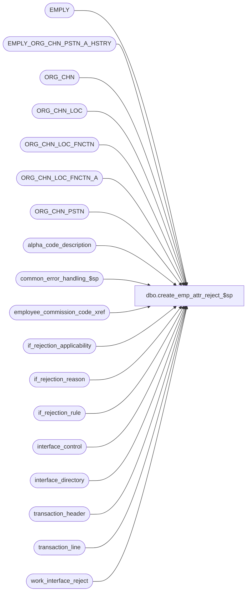

# dbo.create_emp_attr_reject_$sp

**Database:** auditworks_external  
**Server:** bedrockdb01  

## Architecture Diagram



## Table Dependencies

| Referenced Table |
|---|
| EMPLY |
| EMPLY_ORG_CHN_PSTN_A_HSTRY |
| ORG_CHN |
| ORG_CHN_LOC |
| ORG_CHN_LOC_FNCTN |
| ORG_CHN_LOC_FNCTN_A |
| ORG_CHN_PSTN |
| alpha_code_description |
| common_error_handling_$sp |
| employee_commission_code_xref |
| if_rejection_applicability |
| if_rejection_reason |
| if_rejection_rule |
| interface_control |
| interface_directory |
| transaction_header |
| transaction_line |
| work_interface_reject |

## Stored Procedure Code

```sql
create proc [dbo].[create_emp_attr_reject_$sp] ( @process_id               binary(16),
  @user_id                  int
)

AS

/*
Proc Name: create_emp_attr_reject_$sp
     Desc: This routine will create the employee attribute I/F rejects.
           The source table is #emp_trans_verified which is populated by mass_correct_employee_$sp.
           Called by mass_correct_employee_$sp.

 HISTORY:
Date     Name        Defect# Description
Apr19,11 Vicci        105917 Make logging of memo fields for I/F rejects consistent with that of edit_emp_attribute_$sp and other procs.
May14,08 Vicci        101197 Support effective date in commission code assigment.
Apr18,08 Phu           96766 Log IF rejects only if it's needed.
Jul16,07 Phu           88860 Initial development.

*/

DECLARE
  @base                           numeric(21,0),
  @emp_attr_need_validation       nchar(21), -- for 21 validations
  @errmsg                         nvarchar(255),
  @errno                          int,
  @if_reject_reason               tinyint,
  @message_id                     int,
  @min_reject_reason              smallint,
  @note_type                      smallint,
  @object_name                    nvarchar(255),
  @operation_name                 nvarchar(100),
  @potential_reject               int,
  @process_name                   nvarchar(100),
  @reject_diff                    tinyint,
  @reject_index                   tinyint,
  @rows                           int


SET CONCAT_NULL_YIELDS_NULL OFF

SELECT @base = 10, @reject_diff = 20, -- do not change values
       @process_name = 'create_emp_attr_reject_$sp',
       @message_id = 201068,
       @potential_reject = 0

-- See if_rejection_rule table for description of I/F reject 21 to 41.
-- If I/F reject 21 need to validate then the first byte in @emp_attr_need_validation is set to 1, otherwise 0.
-- If I/F reject 22 need to validate then the second byte in @emp_attr_need_validation is set to 1, otherwise 0, and so on.

-- IMPORTANT: For MSSQL, we need to split into 2 SQLs due to the limit of POWER(10, 18). We can keep 1 SQL for Oracle.
SELECT @emp_attr_need_validation = REVERSE(RIGHT('00000000000' + LTRIM(STR(SUM(POWER(@base, CONVERT(numeric(11,0), COALESCE(ir.if_rejection_reason - @reject_diff, 0)) - 1)), 11, 0)), 11))
FROM if_rejection_rule ir
WHERE ir.if_rejection_reason >= 21
AND ir.if_rejection_reason <= 31
AND ISNULL(ir.active_rejection_rule,1) = 1
AND EXISTS (SELECT 1 FROM if_rejection_applicability ia, interface_directory id
            WHERE ir.if_rejection_reason = ia.if_reject_reason
            AND ia.interface_id = id.interface_id
            AND id.update_timing > 0)

SELECT @errno = @@error
IF @errno != 0
BEGIN
  SELECT @errmsg = 'Unable to select for if_rejection_reason between 21 and 31',
         @object_name = 'if_rejection_rule',
         @operation_name = 'SELECT'
  GOTO error
END

SELECT @emp_attr_need_validation = SUBSTRING(@emp_attr_need_validation, 1, 11) + REVERSE(RIGHT('0000000000' + LTRIM(STR(SUM(POWER(@base, CONVERT(numeric(10,0), COALESCE(ir.if_rejection_reason - 31, 0)) - 1)), 10, 0)), 10))
FROM if_rejection_rule ir
WHERE ir.if_rejection_reason >= 32
AND ir.if_rejection_reason <= 41
AND ISNULL(ir.active_rejection_rule,1) = 1
AND EXISTS (SELECT 1 FROM if_rejection_applicability ia, interface_directory id
            WHERE ir.if_rejection_reason = ia.if_reject_reason
            AND ia.interface_id = id.interface_id
            AND id.update_timing > 0)

SELECT @errno = @@error
IF @errno != 0
BEGIN
  SELECT @errmsg = 'Unable to select for if_rejection_reason between 32 and 41',
         @object_name = 'if_rejection_rule',
         @operation_name = 'SELECT'
  GOTO error
END

IF CONVERT(numeric(21,0), @emp_attr_need_validation) = 0
  RETURN

IF NOT EXISTS (SELECT 1 FROM #emp_trans_verified)
  RETURN

SELECT @errno = @@error
IF @errno = 208 -- table not exist
BEGIN
  SELECT 'Warning: This stored procedure cannot be run directly.'
  RETURN
END
ELSE IF @errno != 0
BEGIN
  SELECT @errmsg = 'Unable to read temp table',
         @object_name = '#emp_trans_verified',
         @operation_name = 'SELECT'
  GOTO error
END

DELETE FROM work_interface_reject
WHERE process_id = @process_id
AND if_reject_reason >= 22
AND if_reject_reason <= 41

SELECT @errno = @@error
IF @errno != 0
BEGIN
  SELECT @errmsg = 'Unable to delete rows before evaluating employee attributes',
         @object_name = 'work_interface_reject',
         @operation_name = 'DELETE'
  GOTO error
END

SELECT @reject_index = 0
WHILE @reject_index < 21
  BEGIN
    SELECT @reject_index = @reject_index + 1
    IF SUBSTRING(@emp_attr_need_validation, @reject_index, 1) = '0'
      CONTINUE  

    SELECT @if_reject_reason = @reject_diff + @reject_index

    -- Invalid employee for user-defined employee role
    IF @if_reject_reason = 21
    BEGIN
      -- Do nothing, due to #emp_trans_verified is populated with valid employee only.
      SELECT @rows = 0
    END -- IF @if_reject_reason = 21


    -- Invalid commission code for user-defined employee role
    ELSE IF @if_reject_reason = 22
    BEGIN
      -- need to remove previous I/F reject because old employee might be replaced by replacement_employee_no,
      -- otherwise, it might result in duplicate error.
      DELETE if_rejection_reason
      FROM #emp_trans_verified t, if_rejection_reason ir
      WHERE ir.if_reject_reason = @if_reject_reason
      AND t.transaction_id = ir.transaction_id
      AND t.line_id = ir.line_id

      SELECT @errno = @@error
      IF @errno != 0
      BEGIN
        SELECT @errmsg = 'Unable to delete for invalid employee for user-defined employee role',
               @object_name = 'if_rejection_reason',
               @operation_name = 'DELETE'
        GOTO error
      END

      INSERT INTO work_interface_reject (
          process_id,
          transaction_id,
          line_id,
          if_reject_reason,
          memo1,
          memo2,
          memo3 )
      SELECT
          @process_id,
          t.transaction_id,
          t.line_id,
          @if_reject_reason,
          convert(nvarchar, ISNULL(t.replacement_employee_no, t.employee_no)),
          x.employee_commission_code,
          convert(nvarchar, t.note_type)
      FROM #emp_trans_verified t
           LEFT OUTER JOIN employee_commission_code_xref x WITH (NOLOCK)
             ON ISNULL(t.replacement_employee_no, t.employee_no) = x.employee_no
            AND t.transaction_date >= x.effective_from_date AND (t.transaction_date <= x.effective_to_date OR x.effective_to_date IS NULL)
           LEFT OUTER JOIN alpha_code_description a WITH (NOLOCK)
             ON a.code_type = 15
            AND a.code_status = 'U'
            AND a.code >= '-1'
            AND x.employee_commission_code = a.code
     WHERE t.if_reject_reason = 21  -- 21 and not 22, looking for user-defined employee
       AND ISNULL(t.replacement_employee_no, t.employee_no) IS NOT NULL
       AND a.code IS NULL
      SELECT @errno = @@error, @potential_reject = @potential_reject + @@rowcount
      IF @errno != 0
      BEGIN
        SELECT @errmsg = 'Unable to insert for invalid commission code for user-defined employee role',
               @object_name = 'if_rejection_reason',
               @operation_name = 'INSERT'
        GOTO error
      END
    END -- IF @if_reject_reason = 22
      

    -- Invalid primary position for user-defined employee role
    ELSE IF @if_reject_reason = 23
    BEGIN
      DELETE if_rejection_reason
      FROM #emp_trans_verified t, if_rejection_reason ir
      WHERE ir.if_reject_reason = @if_reject_reason
      AND t.transaction_id = ir.transaction_id
      AND t.line_id = ir.line_id

      SELECT @errno = @@error
      IF @errno != 0
      BEGIN
        SELECT @errmsg = 'Unable to delete for invalid primary position for user-defined employee role',
               @object_name = 'if_rejection_reason',
               @operation_name = 'DELETE'
        GOTO error
      END

      INSERT INTO work_interface_reject (
          process_id,
          transaction_id,
          line_id,
          if_reject_reason,
          memo1,
          memo2,
          memo3 )
      SELECT
          @process_id,
          t.transaction_id,
          t.line_id,
          @if_reject_reason,
          convert(nvarchar, ISNULL(t.replacement_employee_no, t.employee_no)),
          a.PSTN_CODE,
          convert(nvarchar, t.note_type)
      FROM #emp_trans_verified t
         LEFT OUTER JOIN EMPLY_ORG_CHN_PSTN_A_HSTRY a WITH (NOLOCK)
           ON ISNULL(t.replacement_employee_no, t.employee_no) = a.EMPLY_NUM
          AND t.transaction_date >= a.EFCTV_DATE AND (t.transaction_date < a.EXPRTN_DATE OR a.EXPRTN_DATE IS NULL)
          AND a.PRMRY_LOC_A = 1 
         LEFT OUTER JOIN ORG_CHN_PSTN ocp WITH (NOLOCK)
           ON a.PSTN_CODE = ocp.PSTN_CODE
      WHERE t.if_reject_reason = 21  -- 21 and not 23, looking for user-defined employee
        AND ocp.PSTN_CODE IS NULL 
      SELECT @errno = @@error, @potential_reject = @potential_reject + @@rowcount
      IF @errno != 0
      BEGIN
        SELECT @errmsg = 'Unable to insert for invalid primary position for user-defined employee role',
               @object_name = 'if_rejection_reason',
               @operation_name = 'INSERT'
        GOTO error
      END
    END -- IF @if_reject_reason = 23


    -- Invalid primary selling area for user-defined employee role
    ELSE IF @if_reject_reason = 24
    BEGIN
      DELETE if_rejection_reason
      FROM #emp_trans_verified t, if_rejection_reason ir
      WHERE ir.if_reject_reason = @if_reject_reason
      AND t.transaction_id = ir.transaction_id
      AND t.line_id = ir.line_id

      SELECT @errno = @@error
      IF @errno != 0
      BEGIN
        SELECT @errmsg = 'Unable to delete for invalid primary selling area for user-defined employee role',
               @object_name = 'if_rejection_reason',
               @operation_name = 'DELETE'
        GOTO error
      END

      INSERT INTO work_interface_reject (
          process_id,
          transaction_id,
          line_id,
          if_reject_reason,
          memo1,
          memo2,
          memo3 )
      SELECT DISTINCT
          @process_id,
          t.transaction_id,
          t.line_id,
          @if_reject_reason,
          convert(nvarchar, ISNULL(t.replacement_employee_no, t.employee_no)),
          convert(nvarchar, oclfx.FNCTN_NUM), 
          convert(nvarchar, t.note_type)
      FROM #emp_trans_verified t
          LEFT OUTER JOIN EMPLY_ORG_CHN_PSTN_A_HSTRY a WITH (NOLOCK)
           ON ISNULL(t.replacement_employee_no, t.employee_no) = a.EMPLY_NUM
          AND t.transaction_date >= a.EFCTV_DATE AND (t.transaction_date < a.EXPRTN_DATE OR a.EXPRTN_DATE IS NULL)
          AND a.PRMRY_LOC_A = 1 
         LEFT OUTER JOIN ORG_CHN_LOC ocl WITH (NOLOCK)
           ON a.PRMRY_LOC_ID = ocl.LOC_ID
         LEFT OUTER JOIN ORG_CHN_LOC_FNCTN_A oclfx WITH (NOLOCK)
           ON ocl.LOC_ID = oclfx.LOC_ID
          AND oclfx.PRMRY_LOC_FNCTN_A = 1
         LEFT OUTER JOIN ORG_CHN_LOC_FNCTN oclf WITH (NOLOCK)
           ON oclfx.FNCTN_NUM = oclf.FNCTN_NUM
          AND oclf.SYS_CODE = 'DISP'
    WHERE t.if_reject_reason = 21  -- 21 and not 24, looking for user-defined employee
      AND oclf.FNCTN_NUM IS NULL
 
    -- IF t.transaction_date < a.EFCTV_DATE OR t.transaction_date > a.EXPRTN_DATE,
    -- then it is logged as invalid primary position for user-defined employee role I/F reject.

      SELECT @errno = @@error, @potential_reject = @potential_reject + @@rowcount
      IF @errno != 0
      BEGIN
        SELECT @errmsg = 'Unable to insert for invalid primary selling area for user-defined employee role',
               @object_name = 'if_rejection_reason',
               @operation_name = 'INSERT'
        GOTO error
      END
    END -- IF @if_reject_reason = 24


    -- Invalid home store for user-defined employee role
    ELSE IF @if_reject_reason = 25
    BEGIN
      DELETE if_rejection_reason
      FROM #emp_trans_verified t, if_rejection_reason ir
      WHERE ir.if_reject_reason = @if_reject_reason
      AND t.transaction_id = ir.transaction_id
      AND t.line_id = ir.line_id

      SELECT @errno = @@error
      IF @errno != 0
      BEGIN
        SELECT @errmsg = 'Unable to delete for invalid home store for user-defined employee role',
               @object_name = 'if_rejection_reason',
               @operation_name = 'DELETE'
        GOTO error
      END

      INSERT INTO work_interface_reject (
          process_id,
          transaction_id,
          line_id,
          if_reject_reason,
          memo1,
          memo2,
          memo3 )
      SELECT
          @process_id,
          t.transaction_id,
          t.line_id,
          @if_reject_reason,
          convert(nvarchar, ISNULL(t.replacement_employee_no, t.employee_no)),
          convert(nvarchar, t.PRMY_ORG_CHN_NUM),
          convert(nvarchar, t.note_type)
      FROM #emp_trans_verified t
      	 LEFT OUTER JOIN EMPLY_ORG_CHN_PSTN_A_HSTRY a WITH (NOLOCK)
           ON ISNULL(t.replacement_employee_no, t.employee_no) = a.EMPLY_NUM
          AND t.transaction_date >= a.EFCTV_DATE AND (t.transaction_date < a.EXPRTN_DATE OR a.EXPRTN_DATE IS NULL)
          AND a.PRMRY_LOC_A = 1 
         LEFT OUTER JOIN ORG_CHN oc WITH (NOLOCK)
           ON COALESCE(a.ORG_CHN_NUM, t.PRMY_ORG_CHN_NUM) = oc.ORG_CHN_NUM
     WHERE t.if_reject_reason = 21  -- 21 and not 25, looking for user-defined employee
       AND oc.ORG_CHN_NUM IS NULL
      SELECT @errno = @@error, @potential_reject = @potential_reject + @@rowcount
      IF @errno != 0
      BEGIN
        SELECT @errmsg = 'Unable to insert for invalid home store for user-defined employee role',
               @object_name = 'if_rejection_reason',
               @operation_name = 'INSERT'
        GOTO error
      END
    END -- IF @if_reject_reason = 25


    -- Invalid commission code for salesperson
    ELSE IF @if_reject_reason = 26
    BEGIN
      DELETE if_rejection_reason
      FROM #emp_trans_verified t, if_rejection_reason ir
      WHERE ir.if_reject_reason = @if_reject_reason
      AND t.transaction_id = ir.transaction_id
      AND t.line_id = ir.line_id

      SELECT @errno = @@error
      IF @errno != 0
      BEGIN
        SELECT @errmsg = 'Unable to delete for invalid commission code for salesperson',
               @object_name = 'if_rejection_reason',
               @operation_name = 'DELETE'
        GOTO error
      END

      INSERT INTO work_interface_reject (
          process_id,
          transaction_id,
          line_id,
          if_reject_reason,
          memo1,
          memo2)
      SELECT
          @process_id,
          t.transaction_id,
          t.line_id,
          @if_reject_reason,
          CASE WHEN (ISNULL(t.replacement_employee_no, t.salesperson_no) IS NOT NULL AND a.code IS NULL) 
               THEN convert(nvarchar, ISNULL(t.replacement_employee_no, t.salesperson_no)) 
               ELSE convert(nvarchar, ISNULL(t.replacement_employee_no2, t.salesperson2_no)) END, 
          CASE WHEN (ISNULL(t.replacement_employee_no, t.salesperson_no) IS NOT NULL AND a.code IS NULL) 
               THEN x.employee_commission_code ELSE x2.employee_commission_code END 
      FROM #emp_trans_verified t
           LEFT OUTER JOIN employee_commission_code_xref x WITH (NOLOCK)
             ON ISNULL(t.replacement_employee_no, t.salesperson_no) = x.employee_no
            AND t.transaction_date >= x.effective_from_date AND (t.transaction_date <= x.effective_to_date OR x.effective_to_date IS NULL)
           LEFT OUTER JOIN alpha_code_description a WITH (NOLOCK)
             ON a.code_type = 15
            AND a.code_status = 'U'
            AND a.code >= '-1'
            AND x.employee_commission_code = a.code
           LEFT OUTER JOIN employee_commission_code_xref x2 WITH (NOLOCK)
             ON ISNULL(t.replacement_employee_no2, t.salesperson2_no) = x2.employee_no
            AND t.transaction_date >= x.effective_from_date AND (t.transaction_date <= x.effective_to_date OR x.effective_to_date IS NULL)
           LEFT OUTER JOIN alpha_code_description a2 WITH (NOLOCK)
             ON a2.code_type = 15
            AND a2.code_status = 'U'
            AND a2.code >= '-1'
            AND x2.employee_commission_code = a2.code
      WHERE t.if_reject_reason = 3 -- invalid salesperson
        AND (   (ISNULL(t.replacement_employee_no,  t.salesperson_no ) IS NOT NULL AND a.code IS NULL)
             OR (ISNULL(t.replacement_employee_no2, t.salesperson2_no) IS NOT NULL AND a2.code IS NULL))
      SELECT @errno = @@error, @potential_reject = @potential_reject + @@rowcount
      IF @errno != 0
      BEGIN
        SELECT @errmsg = 'Unable to insert for invalid commission code for salesperson',
               @object_name = 'if_rejection_reason',
               @operation_name = 'INSERT'
        GOTO error
      END

    END -- IF @if_reject_reason = 26


    -- Invalid primary position for salesperson
    ELSE IF @if_reject_reason = 27
    BEGIN
      DELETE if_rejection_reason
      FROM #emp_trans_verified t, if_rejection_reason ir
      WHERE ir.if_reject_reason = @if_reject_reason
      AND t.transaction_id = ir.transaction_id
      AND t.line_id = ir.line_id

      SELECT @errno = @@error
      IF @errno != 0
      BEGIN
        SELECT @errmsg = 'Unable to delete for invalid primary position for salesperson',
               @object_name = 'if_rejection_reason',
               @operation_name = 'DELETE'
        GOTO error
      END

      INSERT INTO work_interface_reject (
          process_id,
          transaction_id,
          line_id,
          if_reject_reason,
          memo1,
          memo2)
      SELECT
          @process_id,
          t.transaction_id,
          t.line_id,
          @if_reject_reason,
          CASE WHEN ISNULL(t.replacement_employee_no, t.salesperson_no) IS NOT NULL AND ocp.PSTN_CODE IS NULL 
               THEN convert(nvarchar, ISNULL(t.replacement_employee_no, t.salesperson_no)) 
               ELSE convert(nvarchar, ISNULL(t.replacement_employee_no2, t.salesperson2_no)) END,
          CASE WHEN ISNULL(t.replacement_employee_no, t.salesperson_no) IS NOT NULL AND ocp.PSTN_CODE IS NULL THEN a.PSTN_CODE ELSE a2.PSTN_CODE END 
      FROM #emp_trans_verified t
           LEFT OUTER JOIN EMPLY_ORG_CHN_PSTN_A_HSTRY a WITH (NOLOCK)
             ON ISNULL(t.replacement_employee_no, t.salesperson_no) = a.EMPLY_NUM
            AND t.transaction_date >= a.EFCTV_DATE AND (t.transaction_date < a.EXPRTN_DATE OR a.EXPRTN_DATE IS NULL)
            AND a.PRMRY_LOC_A = 1 
           LEFT OUTER JOIN ORG_CHN_PSTN ocp WITH (NOLOCK)
             ON a.PSTN_CODE = ocp.PSTN_CODE
           LEFT OUTER JOIN EMPLY_ORG_CHN_PSTN_A_HSTRY a2 WITH (NOLOCK)
             ON ISNULL(t.replacement_employee_no2, t.salesperson2_no) = a2.EMPLY_NUM
            AND t.transaction_date >= a2.EFCTV_DATE AND (t.transaction_date < a2.EXPRTN_DATE OR a2.EXPRTN_DATE IS NULL)
            AND a2.PRMRY_LOC_A = 1 
           LEFT OUTER JOIN ORG_CHN_PSTN ocp2 WITH (NOLOCK)
             ON a2.PSTN_CODE = ocp2.PSTN_CODE
      WHERE t.if_reject_reason = 3
        AND (   (ISNULL(t.replacement_employee_no,  t.salesperson_no ) IS NOT NULL AND ocp.PSTN_CODE IS NULL) 
             OR (ISNULL(t.replacement_employee_no2, t.salesperson2_no) IS NOT NULL AND ocp2.PSTN_CODE IS NULL))
      SELECT @errno = @@error, @potential_reject = @potential_reject + @@rowcount
      IF @errno != 0
      BEGIN
        SELECT @errmsg = 'Unable to insert for invalid primary position for salesperson',
               @object_name = 'if_rejection_reason',
               @operation_name = 'INSERT'
        GOTO error  
      END

    END -- IF @if_reject_reason = 27


    -- Invalid primary selling area for salesperson
    ELSE IF @if_reject_reason = 28
    BEGIN
      DELETE if_rejection_reason
      FROM #emp_trans_verified t, if_rejection_reason ir
      WHERE ir.if_reject_reason = @if_reject_reason
      AND t.transaction_id = ir.transaction_id
      AND t.line_id = ir.line_id

      SELECT @errno = @@error
      IF @errno != 0
      BEGIN
        SELECT @errmsg = 'Unable to delete for invalid primary selling area for salesperson',
               @object_name = 'if_rejection_reason',
               @operation_name = 'DELETE'
        GOTO error
      END

      INSERT INTO work_interface_reject (
          process_id,
          transaction_id,
          line_id,
          if_reject_reason,
          memo1,
          memo2)
      SELECT DISTINCT
          @process_id,
          t.transaction_id,
          t.line_id,
          @if_reject_reason,
          convert(nvarchar, ISNULL(t.replacement_employee_no, t.salesperson_no)),
          convert(nvarchar, oclfx.FNCTN_NUM)  -- different than 4.1
      FROM #emp_trans_verified t
          LEFT OUTER JOIN EMPLY_ORG_CHN_PSTN_A_HSTRY a WITH (NOLOCK)
            ON ISNULL(t.replacement_employee_no, t.salesperson_no) = a.EMPLY_NUM
           AND t.transaction_date >= a.EFCTV_DATE AND (t.transaction_date < a.EXPRTN_DATE OR a.EXPRTN_DATE IS NULL)
           AND a.PRMRY_LOC_A = 1 
          LEFT OUTER JOIN ORG_CHN_LOC ocl WITH (NOLOCK)
            ON a.PRMRY_LOC_ID = ocl.LOC_ID
          LEFT OUTER JOIN ORG_CHN_LOC_FNCTN_A oclfx WITH (NOLOCK)
            ON ocl.LOC_ID = oclfx.LOC_ID
           AND oclfx.PRMRY_LOC_FNCTN_A = 1
          LEFT OUTER JOIN ORG_CHN_LOC_FNCTN oclf WITH (NOLOCK)
            ON oclfx.FNCTN_NUM = oclf.FNCTN_NUM
           AND oclf.SYS_CODE = 'DISP'
      WHERE t.if_reject_reason = 3
        AND oclf.FNCTN_NUM IS NULL

    -- IF t.transaction_date < a.EFCTV_DATE OR t.transaction_date > a.EXPRTN_DATE,
    -- then it is logged as invalid primary position.

      SELECT @errno = @@error, @potential_reject = @potential_reject + @@rowcount
      IF @errno != 0
      BEGIN
        SELECT @errmsg = 'Unable to insert for invalid primary selling area for salesperson',
               @object_name = 'if_rejection_reason',
               @operation_name = 'INSERT'
        GOTO error
      END

      -- make sure either salesperson or salesperson2 (not both) is logged for the same transaction_id, line_id.
      INSERT INTO work_interface_reject (
          process_id,
          transaction_id,
          line_id,
          if_reject_reason,
          memo1,
          memo2)
      SELECT DISTINCT
          @process_id,
          t.transaction_id,
          t.line_id,
          @if_reject_reason,
          convert(nvarchar, ISNULL(t.replacement_employee_no2, t.salesperson2_no)),
          convert(nvarchar, oclfx.FNCTN_NUM)  -- different than 4.1
      FROM #emp_trans_verified t
          LEFT OUTER JOIN EMPLY_ORG_CHN_PSTN_A_HSTRY a WITH (NOLOCK)
            ON ISNULL(t.replacement_employee_no2, t.salesperson2_no) = a.EMPLY_NUM
           AND t.transaction_date >= a.EFCTV_DATE AND (t.transaction_date < a.EXPRTN_DATE OR a.EXPRTN_DATE IS NULL)
           AND a.PRMRY_LOC_A = 1 
          LEFT OUTER JOIN ORG_CHN_LOC ocl WITH (NOLOCK)
            ON a.PRMRY_LOC_ID = ocl.LOC_ID
          LEFT OUTER JOIN ORG_CHN_LOC_FNCTN_A oclfx WITH (NOLOCK)
            ON ocl.LOC_ID = oclfx.LOC_ID
           AND oclfx.PRMRY_LOC_FNCTN_A = 1
          LEFT OUTER JOIN ORG_CHN_LOC_FNCTN oclf WITH (NOLOCK)
            ON oclfx.FNCTN_NUM = oclf.FNCTN_NUM
           AND oclf.SYS_CODE = 'DISP'
      WHERE t.if_reject_reason = 3
        AND oclf.FNCTN_NUM IS NULL
        AND ISNULL(t.replacement_employee_no2, t.salesperson2_no) IS NOT NULL --
  AND NOT EXISTS (SELECT 1
                          FROM work_interface_reject ir
                         WHERE ir.process_id = @process_id
                           AND t.transaction_id = ir.transaction_id
                           AND t.line_id = ir.line_id
                           AND ir.if_reject_reason = @if_reject_reason)

      SELECT @errno = @@error, @potential_reject = @potential_reject + @@rowcount
      IF @errno != 0
      BEGIN
        SELECT @errmsg = 'Unable to insert for invalid primary selling area for salesperson2',
               @object_name = 'if_rejection_reason',
               @operation_name = 'INSERT'
        GOTO error
      END
    END -- IF @if_reject_reason = 28


    -- Invalid home store for salesperson
    ELSE IF @if_reject_reason = 29
    BEGIN
      DELETE if_rejection_reason
      FROM #emp_trans_verified t, if_rejection_reason ir
      WHERE ir.if_reject_reason = @if_reject_reason
      AND t.transaction_id = ir.transaction_id
      AND t.line_id = ir.line_id

      SELECT @errno = @@error
      IF @errno != 0
      BEGIN
        SELECT @errmsg = 'Unable to delete for invalid home store for salesperson',
               @object_name = 'if_rejection_reason',
               @operation_name = 'DELETE'
        GOTO error
      END

      INSERT INTO work_interface_reject (
          process_id,
          transaction_id,
          line_id,
          if_reject_reason,
          memo1,
          memo2)
      SELECT
          @process_id,
          t.transaction_id,
          t.line_id,
          @if_reject_reason,
          convert(nvarchar, ISNULL(t.replacement_employee_no, t.salesperson_no)), 
          convert(nvarchar, COALESCE(a.ORG_CHN_NUM, t.PRMY_ORG_CHN_NUM))
      FROM #emp_trans_verified t
          LEFT OUTER JOIN EMPLY_ORG_CHN_PSTN_A_HSTRY a WITH (NOLOCK)
            ON ISNULL(t.replacement_employee_no, t.salesperson_no) = a.EMPLY_NUM
           AND t.transaction_date >= a.EFCTV_DATE AND (t.transaction_date < a.EXPRTN_DATE OR a.EXPRTN_DATE IS NULL)
           AND a.PRMRY_LOC_A = 1 
          LEFT OUTER JOIN ORG_CHN oc WITH (NOLOCK)
            ON COALESCE(a.ORG_CHN_NUM, t.PRMY_ORG_CHN_NUM) = oc.ORG_CHN_NUM
      WHERE t.if_reject_reason = 3                       
        AND oc.ORG_CHN_NUM IS NULL
      SELECT @errno = @@error, @potential_reject = @potential_reject + @@rowcount
      IF @errno != 0
      BEGIN
        SELECT @errmsg = 'Unable to insert for invalid home store for salesperson',
               @object_name = 'if_rejection_reason',
               @operation_name = 'INSERT'
        GOTO error
      END

      -- make sure either salesperson or salesperson2 (not both) is logged for the same transaction_id, line_id.
      INSERT INTO work_interface_reject (
          process_id,
          transaction_id,
          line_id,
          if_reject_reason,
          memo1,
          memo2)
      SELECT
          @process_id,
          t.transaction_id,
          t.line_id,
          @if_reject_reason,
          convert(nvarchar, ISNULL(t.replacement_employee_no2, t.salesperson2_no)), 
          convert(nvarchar, COALESCE(a.ORG_CHN_NUM, t.PRMY_ORG_CHN_NUM))
      FROM #emp_trans_verified t
         INNER JOIN EMPLY e WITH (NOLOCK)  -- need to join EMPLY to get PRMY_ORG_CHN_NUM
            ON ISNULL(t.replacement_employee_no2, t.salesperson2_no) = e.EMPLY_NUM
         LEFT OUTER JOIN EMPLY_ORG_CHN_PSTN_A_HSTRY a WITH (NOLOCK)
           ON e.EMPLY_NUM = a.EMPLY_NUM
          AND t.transaction_date >= a.EFCTV_DATE AND (t.transaction_date < a.EXPRTN_DATE OR a.EXPRTN_DATE IS NULL)
          AND a.PRMRY_LOC_A = 1 
         LEFT OUTER JOIN ORG_CHN oc WITH (NOLOCK)
           ON COALESCE(a.ORG_CHN_NUM, e.PRMY_ORG_CHN_NUM) = oc.ORG_CHN_NUM
    WHERE t.if_reject_reason = 3
      AND ISNULL(t.replacement_employee_no2, t.salesperson2_no) IS NOT NULL
      AND oc.ORG_CHN_NUM IS NULL
      AND NOT EXISTS (SELECT 1
                      FROM work_interface_reject ir
                      WHERE ir.process_id = @process_id
                      AND t.transaction_id = ir.transaction_id
                      AND t.line_id = ir.line_id
                      AND ir.if_reject_reason = @if_reject_reason)

      SELECT @errno = @@error, @potential_reject = @potential_reject + @@rowcount
      IF @errno != 0
      BEGIN
        SELECT @errmsg = 'Unable to insert for invalid home store for salesperson2',
               @object_name = 'if_rejection_reason',
               @operation_name = 'INSERT'
        GOTO error
      END
    END -- IF @if_reject_reason = 29


    -- Invalid commission code for payroll employee
    ELSE IF @if_reject_reason = 30
    BEGIN        
      DELETE if_rejection_reason
      FROM #emp_trans_verified t, if_rejection_reason ir
      WHERE ir.if_reject_reason = @if_reject_reason
      AND t.transaction_id = ir.transaction_id
      AND t.line_id = ir.line_id

      SELECT @errno = @@error
      IF @errno != 0
      BEGIN
        SELECT @errmsg = 'Unable to delete for invalid commission code for payroll employee',
               @object_name = 'if_rejection_reason',
               @operation_name = 'DELETE'
        GOTO error
      END

      INSERT INTO work_interface_reject (
          process_id,
          transaction_id,
          line_id,
          if_reject_reason,
          memo1,
          memo2)
      SELECT
          @process_id,
          t.transaction_id,
          t.line_id,
          @if_reject_reason,
          convert(nvarchar, ISNULL(t.replacement_employee_no, t.employee_no)),
          x.employee_commission_code
      FROM #emp_trans_verified t
         LEFT OUTER JOIN employee_commission_code_xref x WITH (NOLOCK)
           ON ISNULL(t.replacement_employee_no, t.employee_no) = x.employee_no
          AND t.transaction_date >= x.effective_from_date AND (t.transaction_date <= x.effective_to_date OR x.effective_to_date IS NULL)
         LEFT OUTER JOIN alpha_code_description a WITH (NOLOCK)
           ON a.code_type = 15
          AND a.code_status = 'U'
          AND a.code >= '-1'
          AND x.employee_commission_code = a.code
    WHERE t.if_reject_reason = 82 -- invalid payroll employee
      AND a.code IS NULL
      SELECT @errno = @@error, @potential_reject = @potential_reject + @@rowcount
      IF @errno != 0
      BEGIN
        SELECT @errmsg = 'Unable to insert for invalid commission code for payroll employee',
               @object_name = 'if_rejection_reason',
               @operation_name = 'INSERT'
        GOTO error
      END
    END -- IF @if_reject_reason = 30
      

    -- Invalid primary position for payroll employee
    ELSE IF @if_reject_reason = 31
    BEGIN
      DELETE if_rejection_reason
      FROM #emp_trans_verified t, if_rejection_reason ir
      WHERE ir.if_reject_reason = @if_reject_reason
      AND t.transaction_id = ir.transaction_id
      AND t.line_id = ir.line_id

      SELECT @errno = @@error
      IF @errno != 0
      BEGIN
        SELECT @errmsg = 'Unable to delete for invalid primary position for payroll employee',
               @object_name = 'if_rejection_reason',
               @operation_name = 'DELETE'
        GOTO error
      END

      INSERT INTO work_interface_reject (
          process_id,
          transaction_id,
          line_id,
          if_reject_reason,
          memo1,
          memo2)
      SELECT
          @process_id,
          t.transaction_id,
          t.line_id,
          @if_reject_reason,
          convert(nvarchar, ISNULL(t.replacement_employee_no, t.employee_no)),
          a.PSTN_CODE
      FROM #emp_trans_verified t
           LEFT OUTER JOIN EMPLY_ORG_CHN_PSTN_A_HSTRY a WITH (NOLOCK)
             ON ISNULL(t.replacement_employee_no, t.employee_no) = a.EMPLY_NUM
            AND t.transaction_date >= a.EFCTV_DATE AND (t.transaction_date < a.EXPRTN_DATE OR a.EXPRTN_DATE IS NULL)
            AND a.PRMRY_LOC_A = 1 
           LEFT OUTER JOIN ORG_CHN_PSTN ocp WITH (NOLOCK)
             ON a.PSTN_CODE = ocp.PSTN_CODE
      WHERE t.if_reject_reason = 82
        AND ocp.PSTN_CODE IS NULL      
      SELECT @errno = @@error, @potential_reject = @potential_reject + @@rowcount
      IF @errno != 0
      BEGIN
        SELECT @errmsg = 'Unable to insert for invalid primary position for payroll employee',
               @object_name = 'if_rejection_reason',
               @operation_name = 'INSERT'
        GOTO error
      END
    END -- IF @if_reject_reason = 31


    -- Invalid primary selling area for payroll employee
    ELSE IF @if_reject_reason = 32
    BEGIN
      DELETE if_rejection_reason
      FROM #emp_trans_verified t, if_rejection_reason ir
      WHERE ir.if_reject_reason = @if_reject_reason
      AND t.transaction_id = ir.transaction_id
      AND t.line_id = ir.line_id

      SELECT @errno = @@error
      IF @errno != 0
      BEGIN
        SELECT @errmsg = 'Unable to delete for invalid primary selling area for payroll employee',
               @object_name = 'if_rejection_reason',
               @operation_name = 'DELETE'
        GOTO error
      END

      INSERT INTO work_interface_reject (
          process_id,
          transaction_id,
          line_id,
          if_reject_reason,
          memo1,
          memo2)
      SELECT DISTINCT
          @process_id,
          t.transaction_id,
          t.line_id,
          @if_reject_reason,
          convert(nvarchar, ISNULL(t.replacement_employee_no, t.employee_no)),
          oclfx.FNCTN_NUM 
      FROM #emp_trans_verified t
           LEFT OUTER JOIN EMPLY_ORG_CHN_PSTN_A_HSTRY a WITH (NOLOCK)
             ON ISNULL(t.replacement_employee_no, t.employee_no) = a.EMPLY_NUM
            AND t.transaction_date >= a.EFCTV_DATE AND (t.transaction_date < a.EXPRTN_DATE OR a.EXPRTN_DATE IS NULL)
            AND a.PRMRY_LOC_A = 1 
           LEFT OUTER JOIN ORG_CHN_LOC ocl WITH (NOLOCK)
             ON a.PRMRY_LOC_ID = ocl.LOC_ID
           LEFT OUTER JOIN ORG_CHN_LOC_FNCTN_A oclfx WITH (NOLOCK)
             ON ocl.LOC_ID = oclfx.LOC_ID
            AND oclfx.PRMRY_LOC_FNCTN_A = 1
           LEFT OUTER JOIN ORG_CHN_LOC_FNCTN oclf WITH (NOLOCK)
             ON oclfx.FNCTN_NUM = oclf.FNCTN_NUM
            AND oclf.SYS_CODE = 'DISP'
      WHERE t.if_reject_reason = 82
        AND oclf.FNCTN_NUM IS NULL

    -- IF t.transaction_date < a.EFCTV_DATE OR t.transaction_date > a.EXPRTN_DATE,
    -- then it is logged as invalid primary position.

      SELECT @errno = @@error, @potential_reject = @potential_reject + @@rowcount
      IF @errno != 0
      BEGIN
        SELECT @errmsg = 'Unable to insert for invalid primary selling area for payroll employee',
               @object_name = 'if_rejection_reason',
               @operation_name = 'INSERT'
        GOTO error
      END
    END -- IF @if_reject_reason = 32


    -- Invalid home store for payroll employee
    ELSE IF @if_reject_reason = 33
    BEGIN
      DELETE if_rejection_reason
      FROM #emp_trans_verified t, if_rejection_reason ir
      WHERE ir.if_reject_reason = @if_reject_reason
      AND t.transaction_id = ir.transaction_id
      AND t.line_id = ir.line_id

      SELECT @errno = @@error
      IF @errno != 0
      BEGIN
        SELECT @errmsg = 'Unable to delete for invalid home store for payroll employee',
               @object_name = 'if_rejection_reason',
               @operation_name = 'DELETE'
        GOTO error
      END

      INSERT INTO work_interface_reject (
          process_id,
          transaction_id,
          line_id,
          if_reject_reason,
          memo1,
 memo2)
      SELECT
          @process_id,
          t.transaction_id,
          t.line_id,
          @if_reject_reason,
          convert(nvarchar, ISNULL(t.replacement_employee_no, t.employee_no)),
          convert(nvarchar, COALESCE(a.ORG_CHN_NUM, t.PRMY_ORG_CHN_NUM))
      FROM #emp_trans_verified t
         LEFT OUTER JOIN EMPLY_ORG_CHN_PSTN_A_HSTRY a WITH (NOLOCK)
           ON ISNULL(t.replacement_employee_no, t.employee_no) = a.EMPLY_NUM
          AND t.transaction_date >= a.EFCTV_DATE AND (t.transaction_date < a.EXPRTN_DATE OR a.EXPRTN_DATE IS NULL)
          AND a.PRMRY_LOC_A = 1 
         LEFT OUTER JOIN ORG_CHN oc WITH (NOLOCK)
           ON COALESCE(a.ORG_CHN_NUM, t.PRMY_ORG_CHN_NUM) = oc.ORG_CHN_NUM
      WHERE t.if_reject_reason = 82             
        AND oc.ORG_CHN_NUM IS NULL
      SELECT @errno = @@error, @potential_reject = @potential_reject + @@rowcount
      IF @errno != 0
      BEGIN
        SELECT @errmsg = 'Unable to insert for invalid home store for payroll employee',
               @object_name = 'if_rejection_reason',
               @operation_name = 'INSERT'
        GOTO error
      END
    END -- IF @if_reject_reason = 33


    -- Invalid commission code for cashier
    ELSE IF @if_reject_reason = 34
    BEGIN
      DELETE if_rejection_reason
      FROM #emp_trans_verified t, if_rejection_reason ir
      WHERE ir.if_reject_reason = @if_reject_reason
      AND t.transaction_id = ir.transaction_id
      AND t.line_id = ir.line_id

      SELECT @errno = @@error
      IF @errno != 0
      BEGIN
        SELECT @errmsg = 'Unable to delete for invalid commission code for cashier',
               @object_name = 'if_rejection_reason',
               @operation_name = 'DELETE'
        GOTO error
      END

      INSERT INTO work_interface_reject (
          process_id,
          transaction_id,
          line_id,
          if_reject_reason,
          memo1,
          memo2)
      SELECT
          @process_id,
          t.transaction_id,
          t.line_id,
          @if_reject_reason,
          convert(nvarchar, t.cashier_no),
          x.employee_commission_code
      FROM #emp_trans_verified t
         LEFT OUTER JOIN employee_commission_code_xref x WITH (NOLOCK)
           ON t.cashier_no = x.employee_no
          AND t.transaction_date >= x.effective_from_date AND (t.transaction_date <= x.effective_to_date OR x.effective_to_date IS NULL)
         LEFT OUTER JOIN alpha_code_description a WITH (NOLOCK)
           ON a.code_type = 15
          AND a.code_status = 'U'
          AND a.code >= '-1'
          AND x.employee_commission_code = a.code
      WHERE t.if_reject_reason = 80 -- invalid cashier, no replacement_employee_no
        AND a.code IS NULL
      SELECT @errno = @@error, @potential_reject = @potential_reject + @@rowcount
      IF @errno != 0
      BEGIN
        SELECT @errmsg = 'Unable to insert for invalid commission code for cashier',
               @object_name = 'if_rejection_reason',
               @operation_name = 'INSERT'
        GOTO error
      END
    END -- IF @if_reject_reason = 34


    -- Invalid primary position for cashier
    ELSE IF @if_reject_reason = 35
    BEGIN
      DELETE if_rejection_reason
      FROM #emp_trans_verified t, if_rejection_reason ir
      WHERE ir.if_reject_reason = @if_reject_reason
      AND t.transaction_id = ir.transaction_id
      AND t.line_id = ir.line_id

      SELECT @errno = @@error
      IF @errno != 0
      BEGIN
        SELECT @errmsg = 'Unable to delete for invalid primary position for cashier',
               @object_name = 'if_rejection_reason',
               @operation_name = 'DELETE'
        GOTO error
      END

      INSERT INTO work_interface_reject (
          process_id,
          transaction_id,
          line_id,
          if_reject_reason,
          memo1,
          memo2)
      SELECT
          @process_id,
  t.transaction_id,
          t.line_id,
          @if_reject_reason,
          convert(nvarchar, t.cashier_no),
          a.PSTN_CODE
      FROM #emp_trans_verified t
          LEFT OUTER JOIN EMPLY_ORG_CHN_PSTN_A_HSTRY a WITH (NOLOCK)
            ON t.cashier_no = a.EMPLY_NUM
           AND t.transaction_date >= a.EFCTV_DATE AND (t.transaction_date < a.EXPRTN_DATE OR a.EXPRTN_DATE IS NULL)
           AND a.PRMRY_LOC_A = 1 
          LEFT OUTER JOIN ORG_CHN_PSTN ocp WITH (NOLOCK)
            ON a.PSTN_CODE = ocp.PSTN_CODE
      WHERE t.if_reject_reason = 80
        AND ocp.PSTN_CODE IS NULL
      SELECT @errno = @@error, @potential_reject = @potential_reject + @@rowcount
      IF @errno != 0
      BEGIN
        SELECT @errmsg = 'Unable to insert for invalid primary position for cashier',
               @object_name = 'if_rejection_reason',
               @operation_name = 'INSERT'
        GOTO error
      END
    END -- IF @if_reject_reason = 35


    -- Invalid primary selling area for cashier
    ELSE IF @if_reject_reason = 36
    BEGIN
      DELETE if_rejection_reason
      FROM #emp_trans_verified t, if_rejection_reason ir
      WHERE ir.if_reject_reason = @if_reject_reason
      AND t.transaction_id = ir.transaction_id
      AND t.line_id = ir.line_id

      SELECT @errno = @@error
      IF @errno != 0
      BEGIN
        SELECT @errmsg = 'Unable to delete for invalid primary selling area for cashier',
               @object_name = 'if_rejection_reason',
               @operation_name = 'DELETE'
        GOTO error
      END

      INSERT INTO work_interface_reject (
          process_id,
          transaction_id,
          line_id,
          if_reject_reason,
          memo1,
          memo2)
      SELECT DISTINCT
          @process_id,
          t.transaction_id,
          t.line_id,
          @if_reject_reason,
          convert(nvarchar, t.cashier_no),
          convert(nvarchar, oclfx.FNCTN_NUM)
      FROM #emp_trans_verified t
         LEFT OUTER JOIN EMPLY_ORG_CHN_PSTN_A_HSTRY a WITH (NOLOCK)
           ON t.cashier_no = a.EMPLY_NUM
          AND t.transaction_date >= a.EFCTV_DATE AND (t.transaction_date < a.EXPRTN_DATE OR a.EXPRTN_DATE IS NULL)
          AND a.PRMRY_LOC_A = 1 
         LEFT OUTER JOIN ORG_CHN_LOC ocl WITH (NOLOCK)
           ON a.PRMRY_LOC_ID = ocl.LOC_ID
         LEFT OUTER JOIN ORG_CHN_LOC_FNCTN_A oclfx WITH (NOLOCK)
           ON ocl.LOC_ID = oclfx.LOC_ID
          AND oclfx.PRMRY_LOC_FNCTN_A = 1
         LEFT OUTER JOIN ORG_CHN_LOC_FNCTN oclf WITH (NOLOCK)
           ON oclfx.FNCTN_NUM = oclf.FNCTN_NUM
          AND oclf.SYS_CODE = 'DISP'
    WHERE t.if_reject_reason = 80
      AND oclf.FNCTN_NUM IS NULL

    -- IF t.transaction_date < a.EFCTV_DATE OR t.transaction_date > a.EXPRTN_DATE,
    -- then it is logged as invalid primary position.

      SELECT @errno = @@error, @potential_reject = @potential_reject + @@rowcount
      IF @errno != 0
      BEGIN
        SELECT @errmsg = 'Unable to insert for invalid primary selling area for cashier',
               @object_name = 'if_rejection_reason',
               @operation_name = 'INSERT'
        GOTO error
      END
    END -- IF @if_reject_reason = 36


    -- Invalid home store for cashier
    ELSE IF @if_reject_reason = 37
    BEGIN
      DELETE if_rejection_reason
      FROM #emp_trans_verified t, if_rejection_reason ir
      WHERE ir.if_reject_reason = @if_reject_reason
      AND t.transaction_id = ir.transaction_id
      AND t.line_id = ir.line_id

      SELECT @errno = @@error
      IF @errno != 0
      BEGIN
        SELECT @errmsg = 'Unable to delete for invalid home store for cashier',
               @object_name = 'if_rejection_reason',
               @operation_name = 'DELETE'
        GOTO error
      END

      INSERT INTO work_interface_reject (
          process_id,
          transaction_id,
          line_id,
          if_reject_reason,
          memo1,
          memo2)
      SELECT
          @process_id,
          t.transaction_id,
          t.line_id,
          @if_reject_reason,
          convert(nvarchar, t.cashier_no),
          convert(nvarchar, COALESCE(a.ORG_CHN_NUM, t.PRMY_ORG_CHN_NUM))
      FROM #emp_trans_verified t
         LEFT OUTER JOIN EMPLY_ORG_CHN_PSTN_A_HSTRY a WITH (NOLOCK)
           ON t.cashier_no = a.EMPLY_NUM
          AND t.transaction_date >= a.EFCTV_DATE AND (t.transaction_date < a.EXPRTN_DATE OR a.EXPRTN_DATE IS NULL)
          AND a.PRMRY_LOC_A = 1 
         LEFT OUTER JOIN ORG_CHN oc WITH (NOLOCK)
           ON COALESCE(a.ORG_CHN_NUM, t.PRMY_ORG_CHN_NUM) = oc.ORG_CHN_NUM
    WHERE t.if_reject_reason = 80
      AND oc.ORG_CHN_NUM IS NULL

      SELECT @errno = @@error, @potential_reject = @potential_reject + @@rowcount
      IF @errno != 0
      BEGIN
        SELECT @errmsg = 'Unable to insert for invalid home store for cashier',
               @object_name = 'if_rejection_reason',
               @operation_name = 'INSERT'
        GOTO error
      END
    END -- IF @if_reject_reason = 37


    -- Invalid commission code for original salesperson
    -- make sure either original salesperson or original salesperson2 (not both) is logged for the same transaction_id, line_id.
    ELSE IF @if_reject_reason = 38
    BEGIN
      DELETE if_rejection_reason
      FROM #emp_trans_verified t, if_rejection_reason ir
      WHERE ir.if_reject_reason = @if_reject_reason
      AND t.transaction_id = ir.transaction_id
      AND t.line_id = ir.line_id

      SELECT @errno = @@error
      IF @errno != 0
      BEGIN
        SELECT @errmsg = 'Unable to delete for invalid commission code for original salesperson',
               @object_name = 'if_rejection_reason',
               @operation_name = 'DELETE'
        GOTO error
      END

      INSERT INTO work_interface_reject (
          process_id,
          transaction_id,
          line_id,
          if_reject_reason,
          memo1,
          memo2)
      SELECT
          @process_id,
          t.transaction_id,
          t.line_id,
          @if_reject_reason,
          CASE WHEN (ISNULL(t.replacement_employee_no, t.orig_salesperson_no) IS NOT NULL AND a.code IS NULL) 
               THEN convert(nvarchar, ISNULL(t.replacement_employee_no, t.orig_salesperson_no) )
               ELSE convert(nvarchar, ISNULL(t.replacement_employee_no2, t.orig_salesperson2_no)) END, 
          CASE WHEN (ISNULL(t.replacement_employee_no, t.orig_salesperson_no) IS NOT NULL AND a.code IS NULL) 
               THEN x.employee_commission_code ELSE x2.employee_commission_code END 
      FROM #emp_trans_verified t
           LEFT OUTER JOIN employee_commission_code_xref x WITH (NOLOCK)
             ON ISNULL(t.replacement_employee_no, t.orig_salesperson_no) = x.employee_no
            AND t.transaction_date >= x.effective_from_date AND (t.transaction_date <= x.effective_to_date OR x.effective_to_date IS NULL)
           LEFT OUTER JOIN alpha_code_description a WITH (NOLOCK)
             ON a.code_type = 15
            AND a.code_status = 'U'
            AND a.code >= '-1'
            AND x.employee_commission_code = a.code
           LEFT OUTER JOIN employee_commission_code_xref x2 WITH (NOLOCK)
             ON ISNULL(t.replacement_employee_no2, t.orig_salesperson2_no) = x2.employee_no
            AND t.transaction_date >= x.effective_from_date AND (t.transaction_date <= x.effective_to_date OR x.effective_to_date IS NULL)
           LEFT OUTER JOIN alpha_code_description a2 WITH (NOLOCK)
             ON a2.code_type = 15
            AND a2.code_status = 'U'
            AND a2.code >= '-1'
            AND x2.employee_commission_code = a2.code
      WHERE t.if_reject_reason = 81 -- invalid original salesperson
        AND (   (ISNULL(t.replacement_employee_no,  t.orig_salesperson_no ) IS NOT NULL AND a.code IS NULL)
      OR (ISNULL(t.replacement_employee_no2, t.orig_salesperson2_no) IS NOT NULL AND a2.code IS NULL))
      SELECT @errno = @@error, @potential_reject = @potential_reject + @@rowcount
      IF @errno != 0
      BEGIN
        SELECT @errmsg = 'Unable to insert for invalid commission code for original salesperson',
               @object_name = 'if_rejection_reason',
               @operation_name = 'INSERT'
        GOTO error
      END

    END -- IF @if_reject_reason = 38


    -- Invalid primary position for original salesperson
    -- make sure either original salesperson or original salesperson2 (not both) is logged for the same transaction_id, line_id.
    ELSE IF @if_reject_reason = 39
    BEGIN
      DELETE if_rejection_reason
      FROM #emp_trans_verified t, if_rejection_reason ir
      WHERE ir.if_reject_reason = @if_reject_reason
      AND t.transaction_id = ir.transaction_id
      AND t.line_id = ir.line_id

      SELECT @errno = @@error
      IF @errno != 0
      BEGIN
        SELECT @errmsg = 'Unable to delete for invalid primary position for original salesperson',
               @object_name = 'if_rejection_reason',
               @operation_name = 'DELETE'
        GOTO error
      END

      INSERT INTO work_interface_reject (
          process_id,
          transaction_id,
          line_id,
          if_reject_reason,
          memo1,
          memo2)
      SELECT
          @process_id,
          t.transaction_id,
          t.line_id,
          @if_reject_reason,
          CASE WHEN (ISNULL(t.replacement_employee_no, t.orig_salesperson_no) IS NOT NULL AND ocp.PSTN_CODE IS NULL) 
               THEN convert(nvarchar, ISNULL(t.replacement_employee_no, t.orig_salesperson_no)) 
               ELSE convert(nvarchar, ISNULL(t.replacement_employee_no2, t.orig_salesperson2_no)) END,
          CASE WHEN (ISNULL(t.replacement_employee_no, t.orig_salesperson_no) IS NOT NULL AND ocp.PSTN_CODE IS NULL) THEN a.PSTN_CODE ELSE a2.PSTN_CODE END 
      FROM #emp_trans_verified t
         LEFT OUTER JOIN EMPLY_ORG_CHN_PSTN_A_HSTRY a WITH (NOLOCK)
           ON ISNULL(t.replacement_employee_no, t.orig_salesperson_no) = a.EMPLY_NUM
          AND t.transaction_date >= a.EFCTV_DATE AND (t.transaction_date < a.EXPRTN_DATE OR a.EXPRTN_DATE IS NULL)
          AND a.PRMRY_LOC_A = 1 
         LEFT OUTER JOIN ORG_CHN_PSTN ocp WITH (NOLOCK)
           ON a.PSTN_CODE = ocp.PSTN_CODE
         LEFT OUTER JOIN EMPLY_ORG_CHN_PSTN_A_HSTRY a2 WITH (NOLOCK)
           ON ISNULL(t.replacement_employee_no2, t.orig_salesperson2_no) IS NOT NULL
          AND ISNULL(t.replacement_employee_no2, t.orig_salesperson2_no) = a2.EMPLY_NUM
          AND t.transaction_date >= a2.EFCTV_DATE AND (t.transaction_date < a2.EXPRTN_DATE OR a2.EXPRTN_DATE IS NULL)
          AND a2.PRMRY_LOC_A = 1 
         LEFT OUTER JOIN ORG_CHN_PSTN ocp2 WITH (NOLOCK)
           ON a2.PSTN_CODE = ocp2.PSTN_CODE
      WHERE t.if_reject_reason = 81
        AND (   (ISNULL(t.replacement_employee_no, t.orig_salesperson_no) IS NOT NULL AND ocp.PSTN_CODE IS NULL) 
             OR (ISNULL(t.replacement_employee_no2, t.orig_salesperson2_no) IS NOT NULL AND ocp2.PSTN_CODE IS NULL))
      SELECT @errno = @@error, @potential_reject = @potential_reject + @@rowcount
      IF @errno != 0
      BEGIN
        SELECT @errmsg = 'Unable to insert for invalid primary position for original salesperson',
               @object_name = 'if_rejection_reason',
               @operation_name = 'INSERT'
        GOTO error  
      END
    END -- IF @if_reject_reason = 39


    -- Invalid primary selling area for original salesperson
    ELSE IF @if_reject_reason = 40
    BEGIN
      DELETE if_rejection_reason
      FROM #emp_trans_verified t, if_rejection_reason ir
      WHERE ir.if_reject_reason = @if_reject_reason
      AND t.transaction_id = ir.transaction_id
      AND t.line_id = ir.line_id

      SELECT @errno = @@error
     IF @errno != 0
      BEGIN
        SELECT @errmsg = 'Unable to delete for invalid primary selling area for original salesperson',
               @object_name = 'if_rejection_reason',
               @operation_name = 'DELETE'
        GOTO error
    END

      INSERT INTO work_interface_reject (
          process_id,
          transaction_id,
          line_id,
          if_reject_reason,
          memo1,
          memo2)
      SELECT DISTINCT
          @process_id,
          t.transaction_id,
          t.line_id,
          @if_reject_reason,
          convert(nvarchar, ISNULL(t.replacement_employee_no, t.orig_salesperson_no)),
          convert(nvarchar, oclfx.FNCTN_NUM)
      FROM #emp_trans_verified t
         LEFT OUTER JOIN EMPLY_ORG_CHN_PSTN_A_HSTRY a WITH (NOLOCK)
           ON ISNULL(t.replacement_employee_no, t.orig_salesperson_no) = a.EMPLY_NUM
          AND t.transaction_date >= a.EFCTV_DATE AND (t.transaction_date < a.EXPRTN_DATE OR a.EXPRTN_DATE IS NULL)
          AND a.PRMRY_LOC_A = 1 
         LEFT OUTER JOIN ORG_CHN_LOC ocl WITH (NOLOCK)
           ON a.PRMRY_LOC_ID = ocl.LOC_ID
         LEFT OUTER JOIN ORG_CHN_LOC_FNCTN_A oclfx WITH (NOLOCK)
           ON ocl.LOC_ID = oclfx.LOC_ID
          AND oclfx.PRMRY_LOC_FNCTN_A = 1
         LEFT OUTER JOIN ORG_CHN_LOC_FNCTN oclf WITH (NOLOCK)
           ON oclfx.FNCTN_NUM = oclf.FNCTN_NUM
          AND oclf.SYS_CODE = 'DISP'
      WHERE t.if_reject_reason = 81
      AND oclf.FNCTN_NUM IS NULL
      SELECT @errno = @@error, @potential_reject = @potential_reject + @@rowcount
      IF @errno != 0
      BEGIN
        SELECT @errmsg = 'Unable to insert for invalid primary selling area for original salesperson',
               @object_name = 'if_rejection_reason',
               @operation_name = 'INSERT'
        GOTO error
      END

      -- make sure either original salesperson or original salesperson2 (not both) is logged for the same transaction_id, line_id.
      INSERT INTO work_interface_reject (
          process_id,
          transaction_id,
          line_id,
          if_reject_reason,
          memo1,
          memo2)
      SELECT DISTINCT
          @process_id,
          t.transaction_id,
          t.line_id,
          @if_reject_reason,
          convert(nvarchar, ISNULL(t.replacement_employee_no2, t.orig_salesperson2_no)),
          convert(nvarchar, oclfx.FNCTN_NUM)
      FROM #emp_trans_verified t
         LEFT OUTER JOIN EMPLY_ORG_CHN_PSTN_A_HSTRY a WITH (NOLOCK)
           ON ISNULL(t.replacement_employee_no2, t.orig_salesperson2_no) = a.EMPLY_NUM
          AND t.transaction_date >= a.EFCTV_DATE AND (t.transaction_date < a.EXPRTN_DATE OR a.EXPRTN_DATE IS NULL)
          AND a.PRMRY_LOC_A = 1 
         LEFT OUTER JOIN ORG_CHN_LOC ocl WITH (NOLOCK)
           ON a.PRMRY_LOC_ID = ocl.LOC_ID
         LEFT OUTER JOIN ORG_CHN_LOC_FNCTN_A oclfx WITH (NOLOCK)
           ON ocl.LOC_ID = oclfx.LOC_ID
          AND oclfx.PRMRY_LOC_FNCTN_A = 1
         LEFT OUTER JOIN ORG_CHN_LOC_FNCTN oclf WITH (NOLOCK)
           ON oclfx.FNCTN_NUM = oclf.FNCTN_NUM
          AND oclf.SYS_CODE = 'DISP'
    WHERE  t.if_reject_reason = 81
      AND ISNULL(t.replacement_employee_no2, t.orig_salesperson2_no) IS NOT NULL -- make sure that original_salesperson2 is provided
      AND oclf.FNCTN_NUM IS NULL
      AND NOT EXISTS (SELECT 1
                      FROM work_interface_reject ir
                      WHERE ir.process_id = @process_id
                      AND t.transaction_id = ir.transaction_id
                      AND t.line_id = ir.line_id
                      AND ir.if_reject_reason = @if_reject_reason)

      SELECT @errno = @@error, @potential_reject = @potential_reject + @@rowcount
      IF @errno != 0
      BEGIN
        SELECT @errmsg = 'Unable to insert for invalid primary selling area for original salesperson2',
               @object_name = 'if_rejection_reason',
 @operation_name = 'INSERT'
        GOTO error
      END
    END -- IF @if_reject_reason = 40


    -- Invalid home store for original salesperson
    ELSE IF @if_reject_reason = 41
    BEGIN
      DELETE if_rejection_reason
      FROM #emp_trans_verified t, if_rejection_reason ir
      WHERE ir.if_reject_reason = @if_reject_reason
      AND t.transaction_id = ir.transaction_id
      AND t.line_id = ir.line_id

      SELECT @errno = @@error
      IF @errno != 0
      BEGIN
        SELECT @errmsg = 'Unable to delete for invalid home store for original salesperson',
               @object_name = 'if_rejection_reason',
               @operation_name = 'DELETE'
        GOTO error
      END

      INSERT INTO work_interface_reject (
          process_id,
          transaction_id,
          line_id,
          if_reject_reason,
          memo1,
          memo2)
      SELECT
          @process_id,
          t.transaction_id,
          t.line_id,
          @if_reject_reason,
          convert(nvarchar, ISNULL(t.replacement_employee_no, t.orig_salesperson_no)),
          convert(nvarchar, COALESCE(a.ORG_CHN_NUM, t.PRMY_ORG_CHN_NUM))
      FROM #emp_trans_verified t
           LEFT OUTER JOIN EMPLY_ORG_CHN_PSTN_A_HSTRY a WITH (NOLOCK)
             ON ISNULL(t.replacement_employee_no, t.orig_salesperson_no) = a.EMPLY_NUM
            AND t.transaction_date >= a.EFCTV_DATE AND (t.transaction_date < a.EXPRTN_DATE OR a.EXPRTN_DATE IS NULL)
            AND a.PRMRY_LOC_A = 1 
           LEFT OUTER JOIN ORG_CHN oc WITH (NOLOCK)
             ON COALESCE(a.ORG_CHN_NUM, t.PRMY_ORG_CHN_NUM) = oc.ORG_CHN_NUM
      WHERE t.if_reject_reason = 81
        AND oc.ORG_CHN_NUM IS NULL
      SELECT @errno = @@error, @potential_reject = @potential_reject + @@rowcount
      IF @errno != 0
      BEGIN
        SELECT @errmsg = 'Unable to insert for invalid home store for original salesperson',
               @object_name = 'if_rejection_reason',
               @operation_name = 'INSERT'
        GOTO error
      END

      -- make sure either original salesperson or original salesperson2 (not both) is logged for the same transaction_id, line_id.
      INSERT INTO work_interface_reject (
          process_id,
          transaction_id,
          line_id,
          if_reject_reason,
          memo1,
          memo2)
      SELECT
          @process_id,
          t.transaction_id,
          t.line_id,
          @if_reject_reason,
          convert(nvarchar, ISNULL(t.replacement_employee_no2, t.orig_salesperson2_no)),
          convert(nvarchar, COALESCE(a.ORG_CHN_NUM, e.PRMY_ORG_CHN_NUM))
      FROM #emp_trans_verified t
          INNER JOIN EMPLY e WITH (NOLOCK)  -- need to join EMPLY to get PRMY_ORG_CHN_NUM
            ON ISNULL(t.replacement_employee_no2, t.orig_salesperson2_no) = e.EMPLY_NUM 
          LEFT OUTER JOIN EMPLY_ORG_CHN_PSTN_A_HSTRY a WITH (NOLOCK)
            ON e.EMPLY_NUM = a.EMPLY_NUM
           AND t.transaction_date >= a.EFCTV_DATE AND (t.transaction_date < a.EXPRTN_DATE OR a.EXPRTN_DATE IS NULL)
           AND a.PRMRY_LOC_A = 1 
          LEFT OUTER JOIN ORG_CHN oc WITH (NOLOCK)
            ON COALESCE(a.ORG_CHN_NUM, e.PRMY_ORG_CHN_NUM) = oc.ORG_CHN_NUM
      WHERE t.if_reject_reason = 81
      AND ISNULL(t.replacement_employee_no2, t.orig_salesperson2_no) IS NOT NULL -- make sure that original_salesperson2 is provided
      AND oc.ORG_CHN_NUM IS NULL
      AND NOT EXISTS (SELECT 1
                      FROM work_interface_reject ir
                      WHERE ir.process_id = @process_id
                      AND t.transaction_id = ir.transaction_id
                      AND t.line_id = ir.line_id
                      AND ir.if_reject_reason = @if_reject_reason)
      SELECT @errno = @@error, @potential_reject = @potential_reject + @@rowcount
      IF @errno != 0
      BEGIN
        SELECT @errmsg = 'Unable to insert for invalid home store for original salesperson2',
               @object_name = 'if_rejection_reason',
               @operation_name = 'INSERT'
        GOTO error
      END
    END -- IF @if_reject_reason = 41
  END -- while @reject_index < 21

IF @potential_reject > 0
BEGIN
  UPDATE work_interface_reject
  SET interface_affected_flag = 1
  FROM work_interface_reject wr, if_rejection_applicability ir,
       interface_control ic, interface_directory id
  WHERE wr.process_id = @process_id
  AND wr.if_reject_reason >= 22 -- starts with reject 22 and not 21
  AND wr.if_reject_reason <= 41
  AND wr.if_reject_reason = ir.if_reject_reason
  AND wr.transaction_id = ic.transaction_id
  AND ic.interface_id = ir.interface_id
  AND ic.interface_id = id.interface_id
  AND id.update_timing >= 1
  AND id.applicability_method = 0

  SELECT @errno = @@error
  IF @errno != 0
  BEGIN
    SELECT @errmsg = 'Failed to set interface_affected_flag = 1 for applicability_method = 0',
           @object_name = 'work_interface_reject',
           @operation_name = 'UPDATE'                
    GOTO error
  END

  UPDATE work_interface_reject
  SET interface_affected_flag = 1
  FROM work_interface_reject wr, if_rejection_applicability ir,
      interface_directory id
  WHERE wr.process_id = @process_id
  AND wr.if_reject_reason >= 22 -- starts with reject 22 and not 21
  AND wr.if_reject_reason <= 41
  AND wr.if_reject_reason = ir.if_reject_reason
  AND ir.interface_id = id.interface_id
  AND id.update_timing >= 1
  AND id.applicability_method >= 1

  SELECT @errno = @@error
  IF @errno != 0
  BEGIN
    SELECT @errmsg = 'Failed to set interface_affected_flag = 1 for applicability_method >= 1',
           @object_name = 'work_interface_reject',
           @operation_name = 'UPDATE'                
    GOTO error
  END

  UPDATE transaction_header
  SET if_rejection_flag = 1
  FROM work_interface_reject wr WITH (NOLOCK), transaction_header th
  WHERE wr.process_id = @process_id
  AND wr.interface_affected_flag = 1
  AND wr.transaction_id = th.transaction_id

  SELECT @errno = @@error
  IF @errno != 0
  BEGIN
     SELECT @errmsg = 'Failed to set if_rejection_flag = 1',
            @object_name = 'transaction_header',
            @operation_name = 'UPDATE'
     GOTO error
  END

  UPDATE transaction_line
  SET interface_rejection_flag = 1
  FROM work_interface_reject wr WITH (NOLOCK), transaction_line tl
  WHERE wr.process_id = @process_id
  AND wr.interface_affected_flag = 1
  AND wr.transaction_id = tl.transaction_id
  AND wr.line_id = tl.line_id

  SELECT @errno = @@error
  IF @errno != 0
  BEGIN
    SELECT @errmsg = 'Failed to set interface_rejection_flag = 1',
           @object_name = 'transaction_line',
           @operation_name = 'UPDATE'                
    GOTO error
  END

  INSERT INTO if_rejection_reason (transaction_id, line_id, if_reject_reason, memo1, memo2, memo3)
  SELECT DISTINCT transaction_id, line_id, if_reject_reason, memo1, memo2, memo3
  FROM work_interface_reject WITH (NOLOCK)
  WHERE process_id = @process_id
  AND interface_affected_flag = 1
  AND if_reject_reason >= 22 -- starts with reject 22 and not 21
  AND if_reject_reason <= 41

  SELECT @errno = @@error
  IF @errno != 0
  BEGIN
    SELECT @errmsg = 'Failed to insert if_rejection_reason (employee attributes)',
           @object_name = 'if_rejection_reason',
           @operation_name = 'INSERT'                
    GOTO error
  END

  DELETE FROM work_interface_reject
  WHERE process_id = @process_id
  AND if_reject_reason >= 22
  AND if_reject_reason <= 41

  SELECT @errno = @@error
  IF @errno != 0
  BEGIN
    SELECT @errmsg = 'Unable to delete rows after evaluating employee attributes',
           @object_name = 'work_interface_reject',
           @operation_name = 'DELETE'
    GOTO error
  END

END -- IF @potential_reject > 0


RETURN


error:
  EXEC common_error_handling_$sp 100, @errno, @errmsg, 0, @message_id, 
    @process_name, @object_name, @operation_name

  RETURN
```

