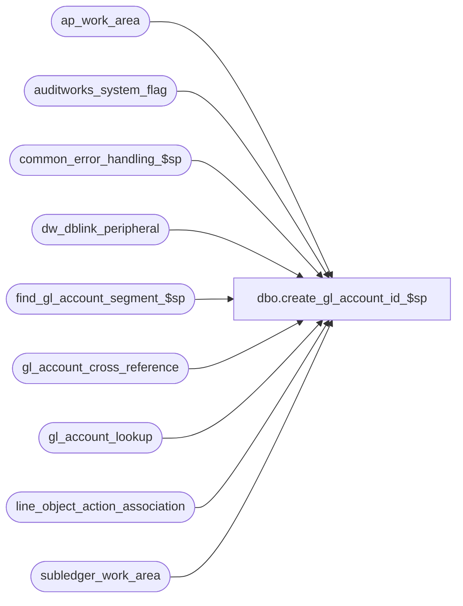

# dbo.create_gl_account_id_$sp

**Database:** auditworks_external  
**Server:** bedrockdb01  

## Architecture Diagram



## Table Dependencies

| Referenced Table |
|---|
| ap_work_area |
| auditworks_system_flag |
| common_error_handling_$sp |
| dw_dblink_peripheral |
| find_gl_account_segment_$sp |
| gl_account_cross_reference |
| gl_account_lookup |
| line_object_action_association |
| subledger_work_area |

## Stored Procedure Code

```sql
create proc dbo.create_gl_account_id_$sp ( @process_no 				smallint,
  @errmsg 				nvarchar(255) OUTPUT
)

AS

/* Proc name:   create_gl_account_id_$sp
** Description: Creates gl_account_id of a new G/L account no based on store_no, 
** transaction_category, line_object, line_action, class_code, tax_jurisdiction, 
** store_deposit_destination, discounted_line_object.
** Calls find_gl_account_segment_$sp to find partial G/L account number of each 
** lookup segment type.
** Called from build_subledger_$sp if @process_no = 20 or process_no = 162, or
** 	  from basic_ap_interface_$sp if @process_no = 206
**	  from build_subledger_direct_$sp if @process_no = 226

*** must script with ANSI_NULLS ON, ANSI_WARNINGS ON due to scaleout

HISTORY:
Date 	 Name         Def# Desc
Jan16,14 Vicci      149341 Support new Transaction G/L Account Reference lookup type 17
Jan02,14 Vicci      149121 Compensate for bug in new object/action TM by handling null G/L account segment lookup types as though they were set to 0.
Jun15,10 Vicci      102089 If the segment can't be found then log invalid segment lookup type/value and mark
                           G/L account 0 as invalid, to support subsequent issue list logging.
Sep09,09 Vicci       73379 Pass employee purchase flag to new sadw_create_gl_account_id_$sp
Jan09,09 Paul       107351 added error trap for missing scaleout config
Oct19,06 Tim       DV-1346 Apply 73379 to SA5
Sep01,06 Phu         76719 Want a non-null string when it's concatenated with null string.
Sep09,05 Paul      DV-1312 update history block
Jul11,05 Sab	   DV-1295 Scaleout changes to execute procedure sadw_create_gl_account_id_$sp
Feb07,05 Maryam      47662 apply 47390 to SA5
Dec13,04 David     DV-1191 Improve performance by adding hints.
Apr20,04 Sab	   DV-1068 Remove code where @process_no = 226
Jun12,06 Vicci        73379  New type 15 (Empl purch flag/ GL replacement)
Apr15,05 ShuZ/Maryam    1-1DHC8U/47390 Change the @process_no = 162 to @process_no in (160, 162, 163)
May03,02 Ian       1-CD0IX Add R3 Error Handling
Jan17,01 ShuZ      1-AB8TD A patch for 8032 when insert into gl_account_lookup
Jun11,01 ShuZ         8032 Transaction attribution to originating store
May14,01 Maryam       7444 Handle process_no = 162.
Feb07,01 Maryam       7281 add taxable column to gl_account_crsr
May25,00 John G       5864 Change '= NULL' to 'IS NULL' where applicable to mirror Oracle.
Mar01,00 Phu          5900 Change @@fetch_status > 0 to @@fetch_status <> 0 for MS SQL compatibility
Mar04,98 Shapoor
*/

DECLARE
	@db_name				nvarchar(30),
	@dblink_name				nvarchar(128),
	@card_type 				nchar(1),
	@class_code 				int,
	@cursor_open 				tinyint,
	@discounted_line_object 		int,
 	@empl_purch_flag			tinyint,
	@errno 					int,
	@gl_account_id 				int,
	@gl_account_no 				nvarchar(160),
	@gl_account_segment1 			nvarchar(20),
	@gl_account_segment2 			nvarchar(20),
	@gl_account_segment3 			nvarchar(20),
	@gl_account_segment4			nvarchar(20),
	@gl_account_segment5 			nvarchar(20),
	@gl_account_segment6 			nvarchar(20),
	@gl_account_segment7 			nvarchar(20),
	@gl_account_segment8 			nvarchar(20),
	@line_object 				smallint,
	@line_action 				tinyint,
	@lookup_segment1 			tinyint,
	@lookup_segment2 			tinyint,
	@lookup_segment3 			tinyint,
	@lookup_segment4 			tinyint,
	@lookup_segment5 			tinyint,
	@lookup_segment6 			tinyint,
	@lookup_segment7 			tinyint,
	@lookup_segment8 			tinyint,
	@return_from_store 			int,
	@rows 					int,
	@rows2					int,
	@scaleout_flag				int,
	@store_deposit_destination 		smallint,
	@store_no 				int,
	@string					nvarchar(500),
	@tax_jurisdiction 			nchar(5),
	@taxable				tinyint,
	@transaction_category 			tinyint,
	@originating_store_no                   int,
	@object_name				nvarchar(255),
	@process_name				nvarchar(100),
	@operation_name				nvarchar(100),
	@message_id				int,
	@log_flag 				tinyint,
	@failed_lookup_value			nvarchar(255),
	@failed_lookup_type			tinyint,
	@gl_account_reference			nvarchar(20) 

SET CONCAT_NULL_YIELDS_NULL OFF
SET ANSI_NULLS ON
SET ANSI_WARNINGS ON

SELECT	@process_name = 'create_gl_account_id_$sp',
	@message_id = 201068,
	@log_flag = 0,
        @cursor_open = 0

SELECT @scaleout_flag = CONVERT(int,flag_numeric_value)
  FROM auditworks_system_flag
 WHERE flag_name = 'scaleout_flag'

SELECT @rows = @@rowcount, @errno = @@error
IF @errno != 0 OR @rows = 0
  BEGIN
    SELECT @errmsg = 'Failed to select scaleout_flag from auditworks_system_flag',
         @object_name = 'auditworks_system_flag',
          @operation_name = 'SELECT'
GOTO error
  END

IF @process_no = 20 OR @process_no in (160, 162, 163) /* from build_subledger_$sp */
  BEGIN
	DECLARE gl_account_crsr CURSOR FAST_FORWARD
	FOR
	SELECT DISTINCT
		store_no,
		transaction_category,
		line_object,
		line_action,
		class_code,
		tax_jurisdiction,
		store_deposit_destination,
		discounted_line_object,
		return_from_store,
		card_type,
		taxable,
		originating_store_no,  --defect 8032		
		empl_purch_flag,  --defect DV-1346
		gl_account_reference --149341
	  FROM subledger_work_area WITH (NOLOCK)
	 WHERE gl_account_id = -1
  END
ELSE
IF @process_no = 206 /* from basic_ap_interface_$sp */
  BEGIN
	DECLARE gl_account_crsr CURSOR FAST_FORWARD
	FOR
	SELECT DISTINCT
		store_no,
		transaction_category,
		line_object,
		line_action,
		class_code,
		tax_jurisdiction,
		store_deposit_destination,
		discounted_line_object,
		return_from_store,
		card_type,
		null,
		null,
		0,
		null  --149341
	  FROM ap_work_area
	 WHERE gl_account_id = -1
  END

SELECT @errno = @@error
IF @errno <> 0
  BEGIN
	SELECT @errmsg = 'Failed to declare cursor gl_account_crsr',
               @object_name    = 'gl_account_crsr',
               @operation_name = 'DECLARE'	
	GOTO error
  END

OPEN gl_account_crsr

SELECT @errno = @@error
IF @errno != 0
BEGIN
  SELECT @errmsg         = ' Failed to open cursor gl_account_crsr',
         @object_name    = 'gl_account_crsr',
         @operation_name = 'OPEN'
  GOTO error
END

SELECT @cursor_open = 1

WHILE 1 = 1
  BEGIN
        FETCH gl_account_crsr INTO
	  @store_no,
	  @transaction_category,
	  @line_object,
	  @line_action,
	  @class_code,
	  @tax_jurisdiction,
	  @store_deposit_destination,
  	  @discounted_line_object,
	  @return_from_store,
	  @card_type,
	  @taxable,
	  @originating_store_no,
	  @empl_purch_flag, --defect DV-1346 
	  @gl_account_reference  --149341

    IF @@fetch_status <> 0
	BREAK

/* Find gl account no */

    SELECT @gl_account_no = NULL, @failed_lookup_type = null, @failed_lookup_value = null   
    SELECT @gl_account_segment1 = gl_account_segment1,
	@gl_account_segment2 = gl_account_segment2,
	@gl_account_segment3 = gl_account_segment3,
	@gl_account_segment4 = gl_account_segment4,
	@gl_account_segment5 = gl_account_segment5,
	@gl_account_segment6 = gl_account_segment6,
	@gl_account_segment7 = gl_account_segment7,
	@gl_account_segment8 = gl_account_segment8,
	@lookup_segment1 = COALESCE(lookup_segment1, 0),
	@lookup_segment2 = COALESCE(lookup_segment2, 0),
	@lookup_segment3 = COALESCE(lookup_segment3, 0),
	@lookup_segment4 = COALESCE(lookup_segment4, 0),
	@lookup_segment5 = COALESCE(lookup_segment5, 0),
	@lookup_segment6 = COALESCE(lookup_segment6, 0),
	@lookup_segment7 = COALESCE(lookup_segment7, 0),
	@lookup_segment8 = COALESCE(lookup_segment8, 0)
     FROM line_object_action_association
    WHERE transaction_category = @transaction_category
      AND line_object = @line_object
      AND line_action = @line_action

    SELECT @errno = @@error
    IF @errno <> 0
      BEGIN
	SELECT @errmsg = ' Failed to read table line_object_action_association',
               @object_name = 'line_object_action_association',
               @operation_name = 'SELECT'	
	GOTO error
      END

    IF @lookup_segment1 = 0
	SELECT @gl_account_no = @gl_account_segment1
    ELSE 
    IF @lookup_segment1 IS NOT NULL  
    BEGIN
	EXEC find_gl_account_segment_$sp @process_no,
					@lookup_segment1,
					@store_no,
					@line_object,
					@class_code,
					@discounted_line_object,
					@tax_jurisdiction,
					@store_deposit_destination,
					@return_from_store,
					@card_type,
					@taxable,
					@gl_account_no  OUTPUT,
					@errmsg OUTPUT,
					@originating_store_no, --defect 8032
					@empl_purch_flag, --defect DV-1346
					@failed_lookup_value OUTPUT,
					@failed_lookup_type OUTPUT,
					@gl_account_reference  --149341 
	SELECT @errno = @@error
	IF @errno <> 0
	  BEGIN
		IF @errmsg IS NULL
		  SELECT @errmsg = 'Failed to execute stored procedure find_gl_account_segment_$sp'
		SELECT @object_name    = 'find_gl_account_segment_$sp',
                       @operation_name = 'EXECUTE'
		GOTO error
	  END /* if @errno <> 0 */
      END /* if @lookup_segment1 <> null */

    IF @gl_account_no IS NOT NULL  
    BEGIN
	IF @lookup_segment2 = 0
	  SELECT @gl_account_no = @gl_account_no + @gl_account_segment2
	ELSE
	IF @lookup_segment2 IS NOT NULL  
	  BEGIN
		EXEC find_gl_account_segment_$sp @process_no,
						@lookup_segment2,
						@store_no,
						@line_object,
						@class_code,
						@discounted_line_object,
						@tax_jurisdiction,
						@store_deposit_destination,
						@return_from_store,
						@card_type,
						@taxable,
						@gl_account_no  OUTPUT,
						@errmsg OUTPUT,
						@originating_store_no,
						@empl_purch_flag,
						@failed_lookup_value OUTPUT,
						@failed_lookup_type OUTPUT,
						@gl_account_reference  --149341  
		SELECT @errno = @@error
		IF @errno <> 0
		  BEGIN
			IF @errmsg IS NULL
		SELECT @errmsg = 'Failed to execute stored procedure find_gl_account_segment_$sp'
			SELECT @object_name    = 'find_gl_account_segment_$sp',
	                       @operation_name = 'EXECUTE'
			GOTO error
		  END /* if @errno <> 0 */
	  END /* if @lookup_segment2 IS NOT null */
      END /* if @gl_account_no IS NOT null */


    IF @gl_account_no IS NOT NULL  
      BEGIN
	IF @lookup_segment3 = 0
		SELECT @gl_account_no = @gl_account_no + @gl_account_segment3
	ELSE
	IF @lookup_segment3 IS NOT NULL  
	  BEGIN

		EXEC find_gl_account_segment_$sp @process_no,
						@lookup_segment3,
						@store_no,
						@line_object,
						@class_code,
						@discounted_line_object,
						@tax_jurisdiction,
						@store_deposit_destination,
						@return_from_store,
						@card_type,
						@taxable,
						@gl_account_no  OUTPUT,
						@errmsg OUTPUT,
						@originating_store_no,
						@empl_purch_flag,
						@failed_lookup_value OUTPUT,
						@failed_lookup_type OUTPUT,
						@gl_account_reference  --149341  
		SELECT @errno = @@error
		IF @errno <> 0
		  BEGIN
			IF @errmsg IS NULL
		SELECT @errmsg = 'Failed to execute stored procedure find_gl_account_segment_$sp'
			SELECT @object_name    = 'find_gl_account_segment_$sp',
	                       @operation_name = 'EXECUTE'
			GOTO error
		  END /* if @errno <> 0 */
	    END /* if @lookup_segment3 IS NOT null */
      END /* if @gl_account_no IS NOT null */


    IF @gl_account_no IS NOT NULL  
      BEGIN
	IF @lookup_segment4 = 0
		SELECT @gl_account_no = @gl_account_no + @gl_account_segment4
	ELSE
	IF @lookup_segment4 IS NOT NULL  
	  BEGIN
		EXEC find_gl_account_segment_$sp @process_no,
						@lookup_segment4,
						@store_no,
						@line_object,
						@class_code,
						@discounted_line_object,
						@tax_jurisdiction,
						@store_deposit_destination,
						@return_from_store,
						@card_type,
						@taxable,
						@gl_account_no  OUTPUT,
						@errmsg OUTPUT,
						@originating_store_no,
						@empl_purch_flag,
						@failed_lookup_value OUTPUT,
						@failed_lookup_type OUTPUT,
						@gl_account_reference  --149341 
		SELECT @errno = @@error
		IF @errno <> 0
		  BEGIN
			IF @errmsg IS NULL
		SELECT @errmsg = 'Failed to execute stored procedure find_gl_account_segment_$sp'
			SELECT @object_name    = 'find_gl_account_segment_$sp',
	                       @operation_name = 'EXECUTE'
			GOTO error
		  END /* if @errno <> 0 */
	    END /* if @lookup_segment4 IS NOT null */
      END /* if @gl_account_no IS NOT null */


    IF @gl_account_no IS NOT NULL  
      BEGIN
	IF @lookup_segment5 = 0
		SELECT @gl_account_no = @gl_account_no + @gl_account_segment5
	ELSE
	IF @lookup_segment5 IS NOT NULL  
	  BEGIN
		EXEC find_gl_account_segment_$sp @process_no,
						@lookup_segment5,
						@store_no,
						@line_object,
						@class_code,
						@discounted_line_object,
						@tax_jurisdiction,
						@store_deposit_destination,
						@return_from_store,
						@card_type,
						@taxable,
						@gl_account_no  OUTPUT,
						@errmsg OUTPUT,
						@originating_store_no,
						@empl_purch_flag,
						@failed_lookup_value OUTPUT,
						@failed_lookup_type OUTPUT,
						@gl_account_reference  --149341 
		SELECT @errno = @@error
		IF @errno <> 0
		  BEGIN
			IF @errmsg IS NULL
		SELECT @errmsg = 'Failed to execute stored procedure find_gl_account_segment_$sp'
			SELECT @object_name    = 'find_gl_account_segment_$sp',
	                       @operation_name = 'EXECUTE'
			GOTO error
		  END /* if @errno <> 0 */
	    END /* if @lookup_segment5 IS NOT null */
  END /* if @gl_account_no IS NOT null */


    IF @gl_account_no IS NOT NULL
    BEGIN
	IF @lookup_segment6 = 0
		SELECT @gl_account_no = @gl_account_no + @gl_account_segment6
	ELSE
	IF @lookup_segment6 IS NOT NULL  
	  BEGIN
		EXEC find_gl_account_segment_$sp @process_no,
						@lookup_segment6,
						@store_no,
						@line_object,
						@class_code,
						@discounted_line_object,
						@tax_jurisdiction,
						@store_deposit_destination,
						@return_from_store,
						@card_type,
						@taxable,
						@gl_account_no  OUTPUT,
						@errmsg OUTPUT,
						@originating_store_no,
						@empl_purch_flag,
						@failed_lookup_value OUTPUT,
						@failed_lookup_type OUTPUT,
						@gl_account_reference  --149341 
		SELECT @errno = @@error
		IF @errno <> 0
		  BEGIN
			IF @errmsg IS NULL
			  SELECT @errmsg = 'Failed to execute stored procedure find_gl_account_segment_$sp'
			SELECT @object_name    = 'find_gl_account_segment_$sp',
	                       @operation_name = 'EXECUTE'
			GOTO error
		  END /* if @errno <> 0 */
	    END /* if @lookup_segment6 IS NOT null */
      END /* if @gl_account_no IS NOT null */


    IF @gl_account_no IS NOT NULL  
      BEGIN         
	IF @lookup_segment7 = 0
		SELECT @gl_account_no = @gl_account_no + @gl_account_segment7
	ELSE
	IF @lookup_segment7 IS NOT NULL  
	  BEGIN
		EXEC find_gl_account_segment_$sp @process_no,
						@lookup_segment7,
						@store_no,
						@line_object,
						@class_code,
						@discounted_line_object,
						@tax_jurisdiction,
						@store_deposit_destination,
						@return_from_store,
						@card_type,
						@taxable,
						@gl_account_no  OUTPUT,
						@errmsg OUTPUT,
						@originating_store_no,
						@empl_purch_flag,
						@failed_lookup_value OUTPUT,
						@failed_lookup_type OUTPUT,
						@gl_account_reference  --149341 
		SELECT @errno = @@error
		IF @errno <> 0
		  BEGIN
			IF @errmsg IS NULL
		SELECT @errmsg = 'Failed to execute stored procedure find_gl_account_segment_$sp'
			SELECT @object_name    = 'find_gl_account_segment_$sp',
	                       @operation_name = 'EXECUTE'
			GOTO error
		  END /* if @errno <> 0 */
	    END /* if @lookup_segment7 IS NOT null */
      END /* if @gl_account_no IS NOT null */


    IF @gl_account_no IS NOT NULL  
      BEGIN
	IF @lookup_segment8 = 0
		SELECT @gl_account_no = @gl_account_no + @gl_account_segment8
	ELSE
	IF @lookup_segment8 IS NOT NULL  
	  BEGIN
		EXEC find_gl_account_segment_$sp @process_no,
						@lookup_segment8,
						@store_no,
						@line_object,
						@class_code,
						@discounted_line_object,
						@tax_jurisdiction,
						@store_deposit_destination,
						@return_from_store,
						@card_type,
						@taxable,
						@gl_account_no  OUTPUT,
						@errmsg OUTPUT,
						@originating_store_no,
						@empl_purch_flag,
						@failed_lookup_value OUTPUT,
						@failed_lookup_type OUTPUT,
						@gl_account_reference  --149341 
		SELECT @errno = @@error
		IF @errno <> 0
		  BEGIN
			IF @errmsg IS NULL
		SELECT @errmsg = 'Failed to execute stored procedure find_gl_account_segment_$sp'
			SELECT @object_name    = 'find_gl_account_segment_$sp',
	                       @operation_name = 'EXECUTE'
			GOTO error
		  END /* if @errno <> 0 */
	    END /* if @lookup_segment8 IS NOT null */
      END /* if @gl_account_no IS NOT null */


    IF @gl_account_no IS NULL 
      SELECT @gl_account_no = '0'

    SELECT @gl_account_id = gl_account_id
      FROM gl_account_cross_reference
     WHERE gl_account_no = @gl_account_no
    SELECT @errno = @@error,
	   @rows = @@rowcount
    IF @errno <> 0
    BEGIN
      SELECT @errmsg = ' Failed to read table gl_account_cross_reference',
             @object_name = 'gl_account_cross_reference',
             @operation_name = 'SELECT'	
      GOTO error
    END

    IF @scaleout_flag IN (0,2)
    BEGIN
      BEGIN TRAN

      IF @rows < 1
      BEGIN
	SELECT @gl_account_id = MAX(gl_account_id)
	  FROM gl_account_cross_reference with (HOLDLOCK)

	SELECT @errno = @@error
	IF @errno <> 0
	  BEGIN
		SELECT @errmsg = ' Failed to read table gl_account_cross_reference',
	               @object_name = 'gl_account_cross_reference',
	               @operation_name = 'SELECT'	
		GOTO error	  
	  END

	IF @gl_account_id IS NULL  
	  SELECT @gl_account_id = 1
	ELSE
	  SELECT @gl_account_id = @gl_account_id + 1

	INSERT gl_account_cross_reference (
		gl_account_id,
		gl_account_no,
		gl_account_description,
		invalid_account_flag )
	VALUES (
		@gl_account_id,
		@gl_account_no,
		NULL,
		CASE WHEN @gl_account_no = '0' THEN 1 ELSE 0 END )

	SELECT @errno = @@error
	IF @errno <> 0
	  BEGIN
	        SELECT @errmsg = ' Failed to insert gl_account_cross_reference',
	               @object_name = 'gl_account_cross_reference',
	               @operation_name = 'INSERT'
	        GOTO error
	  END

      END /* if @rows < 1 */

      INSERT gl_account_lookup (
		store_no,
		transaction_category,
		line_object,
		line_action,
		class_code,
		tax_jurisdiction,
		store_deposit_destination,
		discounted_line_object,
		return_from_store,
		card_type,
		taxable,
		gl_account_id,
		originating_store_no,
		empl_purch_flag,
		failed_lookup_type,
		failed_lookup_value,
		gl_account_reference)  --149341 
    	VALUES (@store_no,
		@transaction_category,
		@line_object,
		@line_action,
		@class_code,
		@tax_jurisdiction,
		@store_deposit_destination,
		@discounted_line_object,
		@return_from_store,
		@card_type,
		@taxable,
		@gl_account_id,
		@originating_store_no,
		@empl_purch_flag,
		@failed_lookup_type,
		@failed_lookup_value,
		@gl_account_reference) --149341 
      SELECT @errno = @@error
      IF @errno <> 0
       BEGIN
        SELECT @errmsg = ' Failed to insert gl_account_lookup',
               @object_name = 'gl_account_lookup',
               @operation_name = 'INSERT'
        GOTO error
       END
      COMMIT TRAN
    END -- IF @scaleout_flag IN (0,2)
   ELSE
    IF @rows < 1
    BEGIN
      /* Get consolidated server connection information */
      SELECT @dblink_name = dblink_name,
	     @db_name = database_name
	FROM dw_dblink_peripheral
       WHERE instance_id = 0 -- value 0 is for the consolidated server

      SELECT @errno = @@error, @rows2 = @@rowcount
      IF @errno <> 0 OR @rows2 = 0
       BEGIN
        SELECT @errmsg = ' Failed to retrieve connection info for consolidated server',
               @object_name = 'dw_dblink_peripheral',
               @operation_name = 'SELECT'
        GOTO error
       END

     /* Build and execute the scaleout sadw_create_gl_account_id_$sp proc on the consolidated server to populate the tables
	gl_account_cross_reference and gl_account_lookup. */
     SET @string = N'EXEC ' + @dblink_name + '.' + @db_name + '.dbo.sadw_create_gl_account_id_$sp @store_no, @transaction_category, @line_object, @line_action, @class_code, @tax_jurisdiction, @store_deposit_destination, @discounted_line_object, @return_from_store, @card_type, @taxable, @gl_account_no, @originating_store_no, @process_no, @empl_purch_flag, @failed_lookup_type, @failed_lookup_value, @gl_account_reference '
     EXEC sp_executesql @string, 
          N'@store_no 				int,
	    @transaction_category 		tinyint,
	    @line_object 			smallint,
	    @line_action 			tinyint,
	    @class_code 			int,
	    @tax_jurisdiction 			nchar(5),
	    @store_deposit_destination 		smallint,
	    @discounted_line_object 		int,
	    @return_from_store 			int,
	    @card_type 				nchar(1),
	    @taxable				tinyint,
	    @gl_account_no 			nvarchar(160),
	    @originating_store_no               int,
	    @process_no 			smallint,
	    @empl_purch_flag			tinyint, 
	    @failed_lookup_type			tinyint, 
	    @failed_lookup_value		nvarchar(255),
	    @gl_account_reference		nvarchar(20)', 
	   @store_no, 
	   @transaction_category, 
	   @line_object, 
	   @line_action, 
	   @class_code, 
	   @tax_jurisdiction, 
	   @store_deposit_destination, 
	   @discounted_line_object, 
	   @return_from_store, 
	   @card_type, 
	   @taxable,
	   @gl_account_no, 
	   @originating_store_no, 
	   @process_no, 
	   @empl_purch_flag, 
	   @failed_lookup_type, 
	   @failed_lookup_value,
	   @gl_account_reference

     SELECT @errno = @@error
     IF @errno != 0
      BEGIN
	SELECT @errmsg = 'Failed to EXECUTE sadw_create_gl_account_id_$sp',
		@object_name = 'sadw_create_gl_account_id_$sp',
		@operation_name = 'EXECUTE'
	GOTO error
      END
    END
   ELSE  -- @rows < 1 for scaleout environment
    BEGIN
      INSERT gl_account_lookup (
		store_no,
		transaction_category,
		line_object,
		line_action,
		class_code,
		tax_jurisdiction,
		store_deposit_destination,
		discounted_line_object,
		return_from_store,
		card_type,
		taxable,
		gl_account_id,
		originating_store_no,
		empl_purch_flag,
		failed_lookup_type,
		failed_lookup_value,
		gl_account_reference)
    	VALUES (@store_no,
		@transaction_category,
		@line_object,
		@line_action,
		@class_code,
		@tax_jurisdiction,
		@store_deposit_destination,
		@discounted_line_object,
		@return_from_store,
		@card_type,
		@taxable,
		@gl_account_id,
		@originating_store_no,
		@empl_purch_flag,
		@failed_lookup_type,
		@failed_lookup_value,
		@gl_account_reference )

      SELECT @errno = @@error
      IF @errno <> 0
       BEGIN
        SELECT @errmsg = ' Failed to insert gl_account_lookup',
               @object_name = 'gl_account_lookup',
               @operation_name = 'INSERT'
        GOTO error
       END
    END
  END /* while 1 = 1 */

CLOSE gl_account_crsr
DEALLOCATE gl_account_crsr

RETURN


error:   /* Common error handler */
	IF @cursor_open <> 0
	  BEGIN
		CLOSE gl_account_crsr
		DEALLOCATE gl_account_crsr
	  END

	EXEC common_error_handling_$sp @process_no, @errno, @errmsg, 0, @message_id,
		@process_name, @object_name, @operation_name, @log_flag
	RETURN
```

