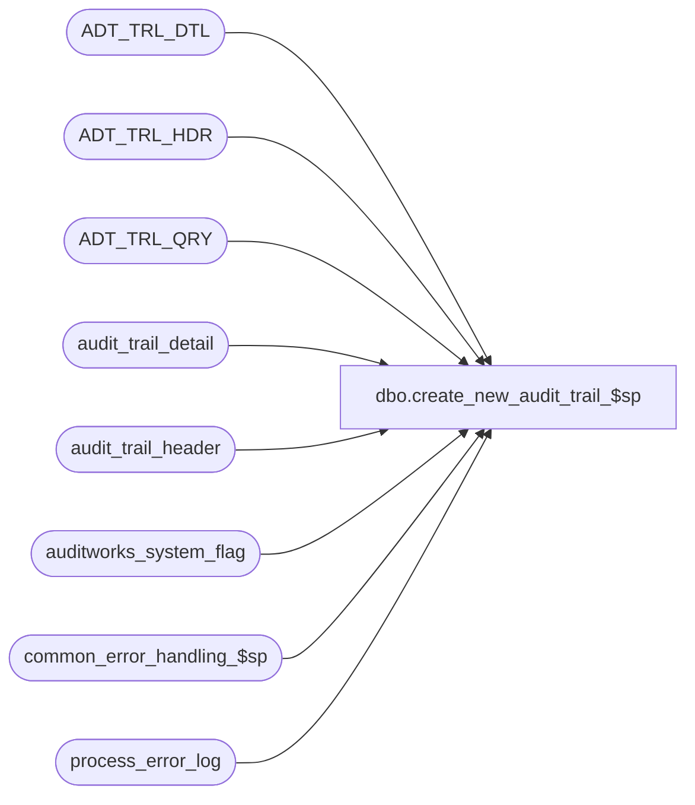

# dbo.create_new_audit_trail_$sp

**Database:** auditworks_external  
**Server:** bedrockdb01  

## Architecture Diagram



## Table Dependencies

| Referenced Table |
|---|
| ADT_TRL_DTL |
| ADT_TRL_HDR |
| ADT_TRL_QRY |
| audit_trail_detail |
| audit_trail_header |
| auditworks_system_flag |
| common_error_handling_$sp |
| process_error_log |

## Stored Procedure Code

```sql
create proc dbo.create_new_audit_trail_$sp 

@interface_id    tinyint = NULL -- this parameter is required by export.ict
AS

/* Proc Name: create_new_audit_trail_$sp
   Description: Insert new data from the old audit trail tables to the new audit trail tables for Table maintenance
		since TM is the only function that should be inserting records to the old audit trail tables.
		Functions other than TM will log an error/warning and will be skipped.
		Called from smartload script /ICT_EXPORT/export.ict

History:
Date     Name           Def# Action
Jan05,15 Vicci   Impediment-97988 Handle function 209 since UI change to log it to new audit trail will only be done in S/A 5.1
Sep23,13 Paul         146772 handle action 6 (avoid error) which is logged by log_audit_trail_$sp (Smartview viewer - settlement)
                              until log_audit_trail_$sp is modified for SA 5.0/5.1 compatability
Nov28,11 Paul       1-47YT6T avoid logging error when function_no = 43 (logged by PB Audit Trail report)
Mar14,07 Paul        DV-1356 avoid error when user_name is nonnumeric
Jun14,06 Tim         DV-1340 insert user_id into ADT_TRL_HDR
Jul07,05 David       DV-1294 Avoid conversion error when inserting process_error_log.
May25,05 Sab         DV-1263 Using wrong name for ROOT_TBL_KEY_RSRC_NAME when inserting into ADT_TRL_HDR
Mar29,05 Paul        DV-1218 insert KEY_PART_VAL_1 with value 300
Aug31,04 Maryam/Paul DV-1120 change the datatype of @table_key to nvarchar(255) from nnvarchar(255), add query key   
Aug06,04 Brett       DV-1071 Modify the insert into ADT_TRL_HDR to include APP_ID, FNCTN_NUM
Jun17,04 Brett       DV-1075 author. Copy records from the old audit trail tables to the new audit trail tables for TM.

*/

DECLARE @action_type		nvarchar(3),
	@errmsg			nvarchar(255),
	@errno			int,
	@function_no		tinyint,
	@last_entry_id		numeric(12,0),
	@message_id		int,
	@NEW_ID			UNIQUEIDENTIFIER,
	@process_name           nvarchar(100),
	@object_name		nvarchar(255),
	@operation_name         nvarchar(100),
	@rows			int,
	@table_name		nvarchar(255),
	@table_key		nvarchar(255),
	@table_key_descr		nvarchar(255),
	@user_id_calc		nvarchar(50),
	@user_name		nvarchar(50)

SELECT @process_name = 'create_new_audit_trail_$sp',
       @message_id = 201068,
       @function_no = 0; -- Table Maintenance

/* Get the last entry_id from the auditworks_system_flag that was already posted */
SELECT @last_entry_id = ISNULL(flag_numeric_value,0)
  FROM auditworks_system_flag
 WHERE flag_name = 'last_audit_trail_entry_id'

/* Setup issue if there are no rows in the auditworks_system_flag for last_audit_trail_entry_id */
SELECT @rows = @@rowcount;
IF @rows = 0
BEGIN
  SELECT @errmsg = 'Table auditworks_system_flag is missing a row for last_audit_trail_entry_id',
	 @object_name = 'auditworks_system_flag',
	 @operation_name = 'SELECT'
 GOTO error
END

WHILE 1 = 1
 BEGIN
   /* Get the next entry for processing */
   SELECT @last_entry_id = MIN(entry_id) 
     FROM audit_trail_header 
    WHERE entry_id > @last_entry_id;

   /* EXIT when there are no more rows to post */
   IF @last_entry_id IS NULL
     BREAK;

   /* Get the action type, table name and table key from header */
   SELECT @action_type = 
	    CASE [action] 
		WHEN 1 THEN 'A'
		WHEN 2 THEN 'M'
		WHEN 3 THEN 'D'
		WHEN 6 THEN 'VSD' -- view sensitive info
	    END,
	  @table_name = UPPER(table_name),
	  @table_key = table_key,
	  @function_no = function_no,
	  @table_key_descr = table_key_descr
     FROM audit_trail_header
    WHERE entry_id = @last_entry_id;

   SELECT @errno = @@error
   IF @errno <> 0
    BEGIN
      SELECT @errmsg = 'Unable to select from audit_trail_header',
	     @object_name = 'audit_trail_header',
	     @operation_name = 'SELECT'
      GOTO error
    END

   /* Verify whether the function_no is 0 indicating table maintenance. No SA functions should be logging entries 
      to the old audit trail other than TM except for 43.
      If old audit trail entries are received for function 209 (Release Interface previously held), then treat as tm since UI only being fixed in 5.1
      If old audit trail entries are received for functions 175, 176, 177 (Smartview Viewer), then treat as tm except for action_type.
      Otherwise, the function_no will be reported to the process_error_log and the entry will be skipped. */
   IF @function_no IN (0, 175, 176, 177, 209)
    BEGIN
	SELECT @NEW_ID = NEWID(), @user_id_calc = NULL;
	
	SELECT @user_id_calc = user_name,
		@user_name = user_name
	  FROM audit_trail_header ath
	  WHERE ath.entry_id = @last_entry_id;

	IF ISNUMERIC(@user_id_calc) = 0 OR @action_type = 'VSD'
	  SELECT @user_id_calc = NULL; -- system or user_id was not logged by PB tm
	ELSE
	  SELECT @user_name = NULL; -- don't need user name when user_id is available

	INSERT ADT_TRL_HDR (
		ENTRY_ID,
		ENTRY_DATE_TIME,
		USER_NAME,
		USER_ID,
		APP_ID,
		ROOT_TBL_NAME,
		ROOT_TBL_KEY,
		ROOT_TBL_KEY_RSRC_NAME,
		ROOT_TBL_KEY_RSRC_PRMS,
		FNCTN_NUM)
	SELECT @NEW_ID,
		entry_date,
		@user_name,
		CONVERT(int, @user_id_calc),
		300,
		UPPER(table_name),
		table_key,
		'TK_MAST_TABL',
		table_key_descr,
		0
	   FROM audit_trail_header ath
	  WHERE ath.entry_id = @last_entry_id;

	SELECT @errno = @@error
	IF @errno <> 0
	 BEGIN
	   SELECT @errmsg = 'Unable to insert to ADT_TRL_HDR',
		  @object_name = 'ADT_TRL_HDR',
		  @operation_name = 'INSERT'
	   GOTO error
	 END

       /* When action_type = 'A' or 'M' use the after_value field in audit_trail_detail. Use the before_value field 
	   in audit_trail_detail when action_type ='D' for delete. */
	INSERT ADT_TRL_DTL (
		ENTRY_ID,
		TBL_NAME,
		TBL_KEY,
		TBL_KEY_RSRC_NAME,
		TBL_KEY_RSRC_PRMS,
		ACTN_CODE,
		CLMN_NAME,
		OLD_VAL,
		NEW_VAL)
	SELECT @NEW_ID,
		@table_name,
		@table_key,
		'TK_MAST_TABL',
		@table_key_descr,
		@action_type,
		UPPER(column_name),
		before_value,
		after_value
	   FROM audit_trail_detail
	  WHERE entry_id = @last_entry_id;

	SELECT @errno = @@error
	IF @errno <> 0
	 BEGIN
	   SELECT @errmsg = 'Unable to insert to ADT_TRL_DTL',
		  @object_name = 'AST_TRL_DTL',
		  @operation_name = 'INSERT'
	   GOTO error
	 END

	INSERT ADT_TRL_QRY (
	     ENTRY_ID,
	     QRY_KEY_NUM,
	     KEY_PART_VAL_1)
	VALUES(@NEW_ID,
	     1,
	     '300');

	SELECT @errno = @@error
	IF @errno !=0
	  BEGIN
	   SELECT @errmsg = 'Unable to insert to ADT_TRL_QRY',
               @operation_name = 'INSERT',
               @object_name = 'ADT_TRL_QRY'
	   GOTO error
	  END
    END
   ELSE
    BEGIN
      IF @function_no NOT IN (43) -- Viewed Sensitive Data - Flash
        BEGIN
        -- report any unexpected function values to the error log and do not copy to new audit trail
	INSERT INTO process_error_log (
		process_no,
		error_code,
		error_timestamp,
		error_msg,
		verified)
	VALUES (0,
		201500,
		getdate(),
		'Function ' + CONVERT(nvarchar, @function_no) + ' cannot be copied to the new audit trail table. Call Epicor to remove this function from logging to the old audit trail tables',
		0);

	SELECT @errno = @@error
	IF @errno <> 0
	 BEGIN
	   SELECT @errmsg = 'Unable to insert to process_error_log',
		  @object_name = 'process_error_log',
		  @operation_name = 'INSERT'
	   GOTO error
	 END;
        END; -- If @function_no not in ...
    END; -- else of If @function_no in ...
    
    UPDATE auditworks_system_flag
       SET flag_numeric_value = @last_entry_id
     WHERE flag_name = 'last_audit_trail_entry_id';

    SELECT @errno = @@error
    IF @errno <> 0
     BEGIN
       SELECT @errmsg = 'Unable to insert to process_error_log',
	      @object_name = 'process_error_log',
	      @operation_name = 'INSERT'
       GOTO error
     END
END; -- WHILE 1=1

RETURN;

error:   /* Common error handler */
	EXEC common_error_handling_$sp 0, @errno, @errmsg, 0, @message_id, 
                                 @process_name, @object_name, @operation_name, 1
	RETURN;
```

