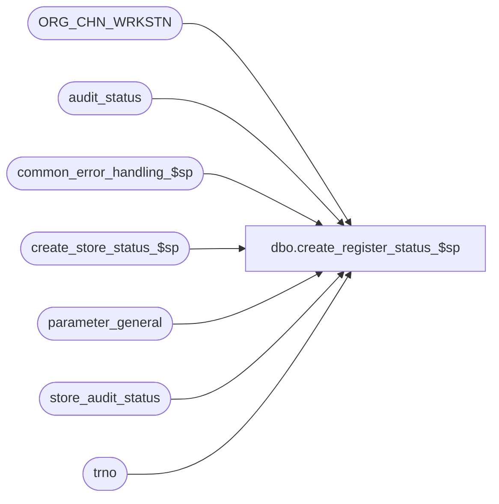

# dbo.create_register_status_$sp

**Database:** auditworks_external  
**Server:** bedrockdb01  

## Architecture Diagram



## Table Dependencies

| Referenced Table |
|---|
| ORG_CHN_WRKSTN |
| audit_status |
| common_error_handling_$sp |
| create_store_status_$sp |
| parameter_general |
| store_audit_status |
| trno |

## Stored Procedure Code

```sql
create proc dbo.create_register_status_$sp @process_id		        binary(16),
@user_id                        int,
@store_no			int,
@register_no			smallint,
@sales_date			smalldatetime,
@current_transaction_no		trno,
@date_reject_id			tinyint OUTPUT,
@status_reject_reason		tinyint OUTPUT,
@errmsg				nvarchar(2000) OUTPUT,
@edit_timestamp			float = 0,		--0=manual functions, 9/109=move, otherwise=Edit
@store_audit_status		smallint = 0,
@valid_qty			smallint = 0,
@sa_reject_qty			smallint = 0,
@if_reject_qty			smallint = 0,
@exception_qty			smallint = 0,
@completion_date_time		datetime = NULL,
@edit_process_no		tinyint = 1

AS

/* Proc Name: create_register_status_$sp

   Description : Look for a status row for a store-reg-date and determine status.
     	If not present, then create it.
   Called by edit_header_$sp, move_register_$sp, move_reg_media_rec_$sp, and Powerbuilder. 

HISTORY:
Date     Name		Def# Action
May05,15 Vicci    TFS-119660 When a store audit status record is missing, even if in move, in order to avoid integrity which otherwise results silently
                             (namely audit_status record with no corresponding store_audit_status record) allow the proc to error out 
                             so that issue is known and addressed rather than hidden.
Dec04,14 Paul      TFS-94103 use try catch
Jul10,14 Vicci     TFS-37538 Make sure audit status does not get left at 902 when called by archive transaction modify.
Sep09,05 Paul        DV-1312 apply 42694 to SA5, corrected comments
Aug10,05 Paul          57984 log sa reject for invalid date when store and date are both invalid (SA5 business rule)
Feb07,05 Paul        DV-1203 remove reference to sa reject type 10 since it should never happen (store would also be completed)
Nov16,04 Maryam      DV-1167 check for ACTV flag.
Sep28,04 David       DV-1146 Use user_id instead of user_name.
May14,04 Maryam      DV-1071 Hard code register_poll_id as this column does not exist in new ORG_CHN_WRKSTN table,
                             receive @process_id and @user_name and pass it to the sub procs.
Oct18,04 Maryam        42694 Remove @status_reject_reason = 10 and 12
Oct29,02 Winnie	     1-FGESD Add logic for Moved Invalid Register.
May31,02 Winnie      1-DDHQ0 setting the correct value to @store_audit_status when it is null for Sybase 12.5.
Jan30,02 Henry	     AW-7611 Keep original value of media_rec_verified flag in audit_status 
			     if store/reg/date is edited again. 
			     Do NOT reset media_rec_verified = 0 if audit_status entry already exists.
Dec20,01 Phu            8575 Logical trading dates, error handling
Sep19,01 Paul		8753 If date is invalid and reg is invalid, report rejects as invalid date
Jun19,01 ShuZ		8153 Modify error message in order to make difference
May02,01 Sab		7600 Try one more time when we get the duplicate key when insert audit_status
Apr20,01 David M	7587 Missing transactions by transaction Series version 1.0, removing
			     code for last_transaction_no.
Feb15,01 Paul		7091 Correctly check for nonexistent register.	
			     Register could exist but have a null register_poll_id.
Jan30,01 Henry		6765 Commented out redundant code for calculating missing trxns.
Jan09,01 Paul		7153 Do not unaccept register unless store is not yet accepted
Nov14,00 Paul		6948 Ensure that register_poll_id is set
Oct11,00 Paul		6825 Call create_store_status_$sp if store_audit_status does not exist
Oct03,00 Paul		6776 Pass back error message to indicate that status already existed
Feb11,00 Daphna F	5904 Included edit_timestamp = 109 for move
Sep29,99 Paul		5309 Reset verified flags to zero when audit_status already exists.
Jun08,99 Louise M.	4526 Added code to update trickle_in_progres_flag in table audit_status 
			     when trickle edit is used.
Feb15,99 Paul S
Nov07,96 Paul S		n/a  Creation
*/

DECLARE @audit_status			smallint,
	@dayend_in_progress		tinyint,
	@edited_date			smalldatetime,
	@errmsg2		 		nvarchar(2000),
	@errline				int,
	@errno				int,
	@media_short			money,
	@message_id			int,
	@missing_qty			numeric(12,0),
	@object_name			nvarchar(255),
	@operation_name			nvarchar(100),
	@orig_audit_status		smallint,
	@prev_transaction_no		trno,
	@prev_trickle_flag		tinyint,
	@prior_sales_date		smalldatetime,
	@process_name			nvarchar(100),
	@process_no			smallint,
	@register_poll_id		nvarchar(15),
	@rows				int,
	@status_row_exists		int,
	@trickle_in_progress_flag	tinyint,
	@trickle_polling_flag		tinyint,
	@orig_store_audit_status	smallint 

SELECT 	@process_name = 'create_register_status_$sp',
	@message_id = 201068,
	@register_poll_id = RIGHT ('0000' + CONVERT(nvarchar, @store_no),4) + '0001'

BEGIN TRY
   SELECT @errmsg = 'Failed to read parameter_general.',
          @object_name = 'parameter_general',
          @operation_name = 'SELECT';	
SELECT @trickle_polling_flag = ISNULL(trickle_polling_flag,0)
  FROM parameter_general;
  

   SELECT @errmsg = 'Failed to read audit_status.',
          @object_name = 'audit_status';
SELECT 	@orig_audit_status = audit_status,
	@media_short = media_short,
	@edited_date = edited_date,
	@prev_trickle_flag = ISNULL(trickle_in_progress_flag,0)
  FROM audit_status
 WHERE sales_date = @sales_date
   AND store_no = @store_no
   AND register_no = @register_no
   AND date_reject_id = @date_reject_id;

SELECT @status_row_exists = @@rowcount;

--Note : @edit_timestamp is equal to 9 or 109  when coming from the move  
IF @trickle_polling_flag >= 2  AND (@edit_timestamp > 0 AND @edit_timestamp NOT IN (9,109))
 SELECT  @trickle_in_progress_flag = 1;
ELSE
 SELECT  @trickle_in_progress_flag = 0;

--Keep original trickle flag for manual functions. 
IF @status_row_exists != 0 AND (@edit_timestamp = 0 OR @edit_timestamp IN (9,109) )
 SELECT @trickle_in_progress_flag = @prev_trickle_flag;

IF (@status_row_exists = 0
  OR @orig_audit_status IN (5, 200, 900, 901, 902, 903, 904, 905, 906))
    SELECT @audit_status = 100;
ELSE
    SELECT @audit_status = @orig_audit_status;

SELECT @orig_store_audit_status = NULL,
       @errmsg = 'Failed to select from store_audit_status (1).',
       @object_name = 'store_audit_status',
       @operation_name = 'SELECT';
SELECT @orig_store_audit_status = store_audit_status
  FROM store_audit_status
 WHERE @store_no = store_no
   AND @sales_date = sales_date
   AND @date_reject_id = date_reject_id;

IF COALESCE(@store_audit_status, 0) = 0
  SELECT @store_audit_status = @orig_store_audit_status;

/* safety check: if null it means there is a bug in the calling procedure, but
   compensate by creating store_audit_status. */

IF @orig_store_audit_status IS NULL /* then */
BEGIN
       SELECT @object_name = 'create_store_status_$sp',
              @operation_name = 'EXECUTE',
              @errmsg = 'Failed to exec create_store_status_$sp.';
    EXEC create_store_status_$sp @process_id, @user_id, @store_no, @sales_date,
      @date_reject_id OUTPUT, @status_reject_reason OUTPUT,
      @errmsg OUTPUT, @edit_timestamp;

      SELECT @errmsg = 'Failed to select from store_audit_status (2).',
             @object_name = 'store_audit_status',
             @operation_name = 'SELECT';
    SELECT @orig_store_audit_status = store_audit_status
      FROM store_audit_status
     WHERE @store_no = store_no
       AND @sales_date = sales_date
       AND @date_reject_id = date_reject_id;
       
    IF @orig_store_audit_status IS NULL
    BEGIN
      SELECT @errmsg = 'Failed to create missing store_audit_status record.';
      GOTO business_error;
    END;
    ELSE
      SELECT @store_audit_status = @orig_store_audit_status;
END;

IF @store_audit_status != 7
  BEGIN /* check whether store/reg is valid */
   IF @audit_status = 7 /* store/date now corrected */
     SELECT @audit_status = 100;

   IF NOT EXISTS (SELECT 1
                    FROM ORG_CHN_WRKSTN 
        WHERE ORG_CHN_NUM = @store_no
                     AND WRKSTN_NUM = @register_no
                     AND ACTV = 1)
    
    BEGIN -- register does not exist
     IF @status_reject_reason = 0 -- not invalid date
       SELECT @status_reject_reason = 1;

     IF @edit_timestamp = 0 -- manual add
       BEGIN
        SELECT @status_reject_reason = 1;
        RETURN;
       END;

     SELECT @audit_status = 8,
            @errmsg = 'Failed to update store_audit_status.',
            @object_name = 'store_audit_status',
            @operation_name = 'UPDATE';

     UPDATE store_audit_status
       SET store_audit_status = 8, -- invalid register
           trickle_in_progress_flag = @trickle_in_progress_flag
      WHERE store_no = @store_no
        AND sales_date = @sales_date
        AND date_reject_id = @date_reject_id;
    END; /* If not exists ... */
  END; /* If @store_audit_status != 7 */
ELSE
  BEGIN /* @store_audit_status = 7 */
   SELECT @audit_status = @store_audit_status;
   IF @status_reject_reason = 0 -- set to invalid store if not also an invalid date
     SELECT @status_reject_reason = 7;
  END;

IF (@edit_timestamp = 0 AND @status_reject_reason != 0)
  RETURN;

IF (@edit_timestamp IN (9,109) AND @status_reject_reason NOT IN (0, 99))
  RETURN;

IF @status_row_exists = 0
  BEGIN

   IF @edit_timestamp > 109
     SELECT @edited_date = getdate();
   ELSE
     SELECT @edited_date = NULL;

      SELECT @errmsg = 'Failed to insert audit_status (1).',
             @object_name = 'audit_status',
             @operation_name = 'INSERT',
             @errno = 0;

   BEGIN TRY
    INSERT audit_status (
	store_no,
	register_no,
	sales_date,
	date_reject_id,
	audit_status,
	status_date,
	status_set_by_user_id,
	valid_qty,
	sa_reject_qty,
	if_reject_qty,
	exception_qty,
	media_short,
	register_poll_id,
	edited_date,
	trickle_in_progress_flag,
	completion_date_time )
     VALUES (
	@store_no,
	@register_no,
	@sales_date,
	@date_reject_id,
	@audit_status,
	getdate(),
	NULL,
	@valid_qty,
	@sa_reject_qty,
	@if_reject_qty,
	@exception_qty,
	0,
	@register_poll_id,
	@edited_date,
	@trickle_in_progress_flag,
	@completion_date_time );
   END TRY
   BEGIN CATCH;
     SELECT @errno = ERROR_NUMBER(),
            @errline = ERROR_LINE();

     SELECT @errmsg = CONVERT(nvarchar, @errno) + ':' + @process_name + ':' + CONVERT(nvarchar, @errline) + ':'
               + 'Failed to insert audit_status (1).' + ':' + ERROR_MESSAGE();
   END CATCH;
   IF @errno NOT IN (0, 2601) -- skip possible duplicate error caused by multistream timing
      GOTO business_error;

   IF @edit_timestamp > 0
     RETURN;

   SELECT @status_reject_reason = 99; /* indicates that row was created */
   RETURN;
  END; /* @status_row_exists = 0 */

ELSE /* Audit_status already exists */
  BEGIN
   SELECT @errmsg = 'status already exists';
   IF @audit_status = 8
     BEGIN
      SELECT @status_reject_reason = 1;
      IF @edit_timestamp = 0
        RETURN;
     END;

   IF (@audit_status = 100 AND @edit_timestamp > 0)
     IF @edited_date IS NULL OR DATEADD(dd, 1, @edited_date) < getdate() /* orig edited_date is old */
        SELECT @edited_date = getdate();

   IF (@audit_status < 300 OR @audit_status >= 900)
      AND @edit_timestamp > 0  --Edit or Move
   BEGIN
       SELECT @errmsg = 'Failed to update audit_status',
              @object_name = 'audit_status',
              @operation_name = 'UPDATE';
     UPDATE audit_status
        SET audit_status = @audit_status,
            media_short = ISNULL(@media_short, 0),
            status_date = getdate(),
            edited_date = @edited_date,
            trickle_in_progress_flag = @trickle_in_progress_flag,
            exceptions_verified = 0,	-- Dev AW-7611. Removed media_rec_verified = 0.
            duplicate_verified = 0,
            translate_error_verified = 0,
missing_verified = 0,
            register_poll_id = @register_poll_id,
            completion_date_time = ISNULL(@completion_date_time, completion_date_time)
      WHERE @sales_date = sales_date
        AND @store_no = store_no
        AND @register_no = register_no
        AND @date_reject_id = date_reject_id;
        
     RETURN;
   END; -- If @audit_status < 300 OR @audit_status >= 900 ...

   IF (@audit_status < 300 OR @audit_status >= 900)
      AND @edit_timestamp = 0
   BEGIN
       SELECT @errmsg = 'Failed to update audit_status for manual functions other than move.  ',
              @object_name = 'audit_status',
              @operation_name = 'UPDATE';
     UPDATE audit_status
        SET audit_status = @audit_status,
            status_date = getdate(),
            exceptions_verified = 0 	-- Dev AW-7611. Removed media_rec_verified = 0.
      WHERE @sales_date = sales_date
        AND @store_no = store_no
        AND @register_no = register_no
        AND @date_reject_id = date_reject_id;  
     
     RETURN;
   END; -- If @audit_status < 300 OR @audit_status >= 900 ...

  END; -- Else (status exists)


IF @audit_status >= 300  /* register already accepted/completed */
  BEGIN
       SELECT @errmsg = 'Failed to select store_audit_status (3)',
              @object_name = 'store_audit_status',
              @operation_name = 'SELECT';
   SELECT @orig_audit_status = store_audit_status
     FROM store_audit_status 
    WHERE store_no = @store_no
      AND sales_date = @sales_date 
      AND date_reject_id = 0;

   IF @orig_audit_status >= 300 AND @orig_audit_status <= 899 AND @date_reject_id > 0
     RETURN; -- date_reject_id was already bumped by create_store_status_$sp

   /* Allow edit to unaccept reg as long as the store has not yet been accepted/completed */

   IF @audit_status = 300 AND @edit_timestamp > 200 AND @date_reject_id = 0
      AND (@orig_audit_status < 300 OR @orig_audit_status >= 900)
     BEGIN  -- register already accepted but store is not
         SELECT @errmsg = 'Failed to update audit_status (2)',
                @object_name = 'audit_status',
                @operation_name = 'UPDATE';
      UPDATE audit_status
        SET audit_status = 100,
	    completion_date_time = ISNULL(@completion_date_time, completion_date_time)
      WHERE sales_date = @sales_date 
        AND store_no = @store_no 
        AND register_no = @register_no 
        AND date_reject_id = @date_reject_id;

      RETURN;
     END;

   IF @edit_timestamp = 0  
     RETURN;

    /* Edit: create new rows in store_audit_status and audit_status
       when store is already accepted/completed */
       SELECT @errmsg = 'Failed to read store_audit_status (4)',
              @object_name = 'store_audit_status',
              @operation_name = 'SELECT';
    SELECT @date_reject_id = ISNULL(MAX(date_reject_id),0)
      FROM store_audit_status
     WHERE sales_date = @sales_date
       AND store_no = @store_no;

    IF @date_reject_id < 255
      SELECT @date_reject_id = @date_reject_id + 1;

       SELECT @object_name = 'create_store_status_$sp',
              @operation_name = 'EXECUTE',
              @errmsg = 'Failed to exec create_store_status_$sp.';
    EXEC create_store_status_$sp @process_id, @user_id, @store_no, @sales_date,
      @date_reject_id OUTPUT, @status_reject_reason OUTPUT,
      @errmsg OUTPUT, @edit_timestamp;

       SELECT @errmsg = 'Failed to insert audit_status (2).',
              @object_name = 'audit_status',
              @operation_name = 'INSERT',
              @errno = 0;
    BEGIN TRY
    INSERT audit_status (
	store_no,
	register_no,
	sales_date,
	date_reject_id,
	audit_status,
	status_date,
	status_set_by_user_id,
	media_short,
	register_poll_id,
	trickle_in_progress_flag,
	completion_date_time )
    VALUES (
	@store_no,
	@register_no,
	@sales_date,
	@date_reject_id,
	100,
	getdate(),
	NULL,
	0,
	@register_poll_id,
	@trickle_in_progress_flag,
	@completion_date_time);
    END TRY
    BEGIN CATCH
     SELECT @errno = ERROR_NUMBER(),
            @errline = ERROR_LINE();

     SELECT @errmsg = CONVERT(nvarchar, @errno) + ':' + @process_name + ':' + CONVERT(nvarchar, @errline) + ':'
               + 'Failed to insert audit_status (2).' + ':' + ERROR_MESSAGE();
    END CATCH;
    IF @errno NOT IN (0, 2601) -- skip possible duplicate error caused by multistream timing
      GOTO business_error;

  END; /* If @audit_status >= 300 */

RETURN;


business_error:   /* Business Rule handler. */

	SELECT @errmsg2 = @errmsg;

	/* Could include similar cleanup code to system error trap when needed (example is from move_store_$sp).
	   However, could also exclude the cleanup code here since the outer system error catch should fire again after the exec below. */

	EXEC common_error_handling_$sp 4, @errno, @errmsg, 0, @message_id, 
	@process_name, @object_name, @operation_name, 1, @edit_process_no,
	0, null, 0, null, null, null, null, null, null, 0, @process_id, @user_id;
	  /* Note: when the exec above raises an error, that action also fires the system error trap (below) */
	RETURN;
END TRY

BEGIN CATCH; -- trap system errors
    /* common error handling. Appending proc name here because a rollback could occur if called within a transaction. */

        SELECT @errno = ERROR_NUMBER(),
		@errline = ERROR_LINE();

        SELECT @errmsg = CONVERT(nvarchar, @errno) + ':' + @process_name + ':' + CONVERT(nvarchar, @errline) + ':'
               + COALESCE(@errmsg, ' ') + ':' + ERROR_MESSAGE();

	 /* this condition will only be true when raise error in traps above fire this general catch */
	IF @errmsg2 IS NOT NULL
	  SELECT @errmsg = @errmsg2;
	  
	EXEC common_error_handling_$sp 4, @errno, @errmsg, 0, @message_id, 
	@process_name, @object_name, @operation_name, 1, @edit_process_no,
	0, null, 0, null, null, null, null, null, null, 0, @process_id, @user_id;

	RETURN;
END CATCH;
```

