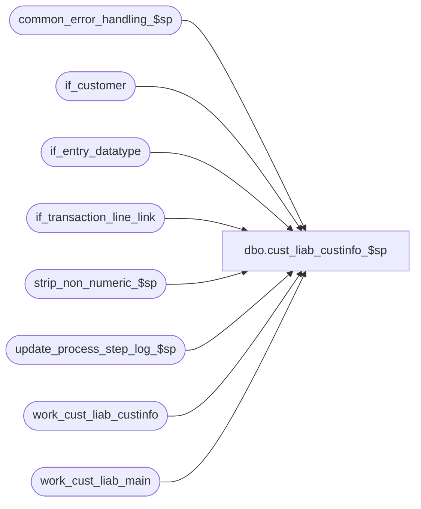

# dbo.cust_liab_custinfo_$sp

**Database:** auditworks_external  
**Server:** bedrockdb01  

## Architecture Diagram



## Table Dependencies

| Referenced Table |
|---|
| common_error_handling_$sp |
| if_customer |
| if_entry_datatype |
| if_transaction_line_link |
| strip_non_numeric_$sp |
| update_process_step_log_$sp |
| work_cust_liab_custinfo |
| work_cust_liab_main |

## Stored Procedure Code

```sql
create proc dbo.cust_liab_custinfo_$sp 
@process_id             binary(16),
@user_id		int,
@function_no		smallint,   -- DEF 1-BMK21           
@errmsg			nvarchar(255) OUTPUT,
@log_error_flag		tinyint = 0,  -- 1 if called by smartload
@edit_process_no 	tinyint = 1

AS

/*
**  Proc Name: cust_liab_custinfo_$sp
**  Description: Called by cust_liability_edit_$sp.
**               

HISTORY:
Date      Name          Defect#  Description
Sep07,12  Vicci          138148  Give precedence to customer role of C/L customer, then purchasing customer, then ship-to-customer, then bill-to customer,
                                 then rest and exclude "Fulfillment Store Address' role.  Expand selection key to support 14 digit if_entry_no.
Apr28,05  Maryam        DV-1202  Rename from_line_id to line_id. handle the indirect association via line links.
				     use if_entry_datatype (Paul)
Jan06,05  Paul          DV-1191  added locking hints
Sep23,04  David         DV-1146  Use user_id instead of user_name.
Apr23,04  Maryam        DV-1071  Receive @process_id and @user_name and pass it to the 
				 common_error_handling_$sp.
Oct27,03  David         17189    Performance enhancements
Feb05,03  ShuZ          5976     To facilitate voucher management name-based queries and 
                                 ensure they use the current index, store first name and 
                                 last name in upper case in the cust_liability table.  
MAY16,02  Vicci         1-BMK21  Avoid duplicate entries in work_cust... when multiple lines
				 with cust_update_flag on exist in same if_entry_no and are
				 associated with a customer, thus avoiding doubled up amounts
				 in work_cust_liab_final.
MAY10,02  Daphna        1-BMK21  Progress Monitor for function_no 4,5,11 and limit customer 
                                 cleanup to entries having more than 1 customer
Dec13,01  David C       AW-8415  R3 customer liability. receive @log_error_flag, @edit_process_no.

*/

DECLARE @errno				int,
	@cursor_open			tinyint,
	@c_if_entry_no			if_entry_datatype,
	@c_line_id			numeric(14,0),
	@c_telephone_no1		nvarchar(16),
	@c_telephone_no2		nvarchar(16), 
	@message_id			int,
	@object_name			nvarchar(255),
	@operation_name			nvarchar(100),
	@process_name			nvarchar(100),
	@process_no 			smallint,
	@rows				int,
        @stripped_string1		nvarchar(255),
        @stripped_string2		nvarchar(255)


SELECT @process_no = 228,
       @process_name = 'cust_liab_custinfo_$sp',
       @message_id = 201068


DELETE work_cust_liab_custinfo
 WHERE process_id  = @process_id

 SELECT @errno = @@error
 IF @errno !=0 
 BEGIN
   SELECT @errmsg='Failed to delete table work_cust_liab_custinfo',
          @object_name = 'work_cust_liab_custinfo',
          @operation_name = 'DELETE'
   GOTO error
 END

INSERT INTO work_cust_liab_custinfo (
	if_entry_no, 
	process_id,
	line_id, 
	reference_no, 
	reference_type, 
	key_store_no,
	selection_key,
	employee_no,
	function_no,
	title,
	first_name,
	last_name,
	address_1,
	address_2,
	city,
	county,
	state,
	country,
	post_code,
	telephone_no1,
	telephone_no2,
	customer_no,
	pos_tax_jurisdiction_code,
	fax,
	email_address  )
  SELECT DISTINCT 
	c.if_entry_no, 
	@process_id,
	c.line_id,
	original_reference_no,             
	w.reference_type, 
	original_key_store_no,
	CASE c.customer_role
	     WHEN   4 THEN 9  	--C/L
	     WHEN   1 THEN 8	--Purchasing
	     WHEN   2 THEN 7	--Send To
	     WHEN 200 THEN 6	--Pickup
	     WHEN 204 THEN 5	--Bill To
	     ELSE 0 END * 1000000000000000000000000
	     + (c.customer_role * 10000000000000000000) + (c.if_entry_no * 100000) + c.line_id,
	w.employee_no,
	w.function_no,
	c.title,
	UPPER(c.first_name),
	UPPER(c.last_name),
	c.address_1,
	c.address_2,
	c.city,
	c.county,
	c.state,
	c.country,
	c.post_code,
	c.telephone_no1,
	c.telephone_no2,
	c.customer_no,
	c.pos_tax_jurisdiction_code,
	c.fax,
	c.email_address
     FROM work_cust_liab_main w WITH (NOLOCK), if_customer c WITH (NOLOCK)
    WHERE w.rejected_status = 0 
      AND w.cust_update_flag = 1
      AND w.reversal_flag = 0
      AND w.transaction_void_flag = 0 
      AND w.if_entry_no = c.if_entry_no
      AND (w.line_id = c.line_id OR c.line_id = 0)
      AND w.process_id = @process_id
      AND c.customer_role <> 205
                
  SELECT @errno = @@error, @rows = @@rowcount
  IF @errno != 0
  BEGIN
    SELECT @errmsg = 'Failed to INSERT INTO work_cust_liab_custinfo',
     @object_name = 'work_cust_liab_custinfo',
          @operation_name = 'INSERT'
    GOTO error
  END

INSERT INTO work_cust_liab_custinfo (
	if_entry_no, 
	process_id,
	line_id, 
	reference_no, 
	reference_type, 
	key_store_no,
	selection_key,
	employee_no,
	function_no,
	title,
	first_name,
	last_name,
	address_1,
	address_2,
	city,
	county,
	state,
	country,
	post_code,
	telephone_no1,
	telephone_no2,
	customer_no,
	pos_tax_jurisdiction_code,
	fax,
	email_address  )
  SELECT DISTINCT 
	c.if_entry_no, 
	@process_id,
	c.line_id,
	original_reference_no,             
	w.reference_type, 
	original_key_store_no,
	CASE c.customer_role
	     WHEN   4 THEN 9  	--C/L
	     WHEN   1 THEN 8	--Purchasing
	     WHEN   2 THEN 7	--Send To
	     WHEN 200 THEN 6	--Pickup
	     WHEN 204 THEN 5	--Bill To
	     ELSE 0 END * 1000000000000000000000000
	     + (c.customer_role * 10000000000000000000) + (c.if_entry_no * 100000) + c.line_id,
	w.employee_no,
	w.function_no,
	c.title,
	UPPER(c.first_name),
	UPPER(c.last_name),
	c.address_1,
	c.address_2,
	c.city,
	c.county,
	c.state,
	c.country,
	c.post_code,
	c.telephone_no1,
	c.telephone_no2,
	c.customer_no,
	c.pos_tax_jurisdiction_code,
	c.fax,
	c.email_address
     FROM work_cust_liab_main w WITH (NOLOCK), if_transaction_line_link k WITH (NOLOCK), if_customer c WITH (NOLOCK)
    WHERE w.rejected_status = 0 
      AND w.cust_update_flag = 1
      AND w.reversal_flag = 0
      AND w.transaction_void_flag = 0 
      AND w.if_entry_no = k.if_entry_no
      AND w.line_id = k.line_id 
      AND k.if_entry_no = c.if_entry_no
      AND k.linked_line_id = c.line_id
      AND w.process_id = @process_id
      AND c.customer_role <> 205
                
  SELECT @errno = @@error, @rows = @rows + @@rowcount
  IF @errno != 0
  BEGIN
    SELECT @errmsg = 'Failed to INSERT INTO work_cust_liab_custinfo via transaction line link',
          @object_name = 'work_cust_liab_custinfo',
          @operation_name = 'INSERT'
    GOTO error
  END
  
IF @function_no IN (4,5,11)   -- increment completed workload 
BEGIN
  EXEC update_process_step_log_$sp @function_no, @edit_process_no, 5
  SELECT @errno = @@error
  IF @errno !=0 
  BEGIN
    SELECT @errmsg='first increment of completed workload for step_no 5',
           @object_name = 'update_process_step_log_$sp',
      @operation_name = 'EXECUTE'
    GOTO error
  END
END   --  @function_no IN (4,5)

IF @rows = 0
  RETURN

/* If multiple lines of customer information exists, pick the first of 
   customer_role/if_entry_no/line_id combination */
SELECT reference_type, reference_no, key_store_no, max_selection_key = MAX(selection_key)
  INTO #customer_selection
  FROM work_cust_liab_custinfo WITH (NOLOCK)
 WHERE process_id = @process_id
 GROUP BY reference_type, reference_no, key_store_no
 HAVING count(selection_key) > 1
  
  SELECT @errno = @@error
  IF @errno != 0
  BEGIN
    SELECT @errmsg = 'Failed to select into #customer_selection',
          @object_name = '#customer_selection',
          @operation_name = 'SELECT'
    GOTO error
  END
 
/* Keep the max selection_key, and get rid of the other lines */ 
DELETE work_cust_liab_custinfo
  FROM work_cust_liab_custinfo w, #customer_selection t WITH (NOLOCK)
 WHERE w.reference_type = t.reference_type
   AND w.reference_no = t.reference_no
   AND w.key_store_no = t.key_store_no
   AND w.selection_key != t.max_selection_key
   AND w.process_id = @process_id

  SELECT @errno = @@error
  IF @errno != 0
  BEGIN
    SELECT @errmsg = 'Failed to delete duplicates from cust_liab_custinfo',
          @object_name = 'cust_liab_custinfo',
          @operation_name = 'DELETE'
    GOTO error
  END

/* phone_cursor used to remove all formatting from the telephone fields
   so that FE can do searches */
DECLARE phone_cursor CURSOR FAST_FORWARD
 FOR
  SELECT if_entry_no,
         line_id, 
         telephone_no1,
         telephone_no2
    FROM work_cust_liab_custinfo WITH (NOLOCK)
   WHERE (telephone_no1 IS NOT NULL OR telephone_no2 IS NOT NULL)
     AND process_id = @process_id
    
OPEN phone_cursor

 SELECT @errno=@@error
 IF @errno != 0
 BEGIN
   SELECT @errmsg = 'Failed to open cursor phone_cursor',
          @object_name = 'phone_cursor',
          @operation_name = 'OPEN'
   GOTO error
 END

SELECT @cursor_open = 1

WHILE 1=1
BEGIN

  FETCH phone_cursor
   INTO	@c_if_entry_no,
   	@c_line_id,
   	@c_telephone_no1,
	@c_telephone_no2
	
  IF @@fetch_status != 0 BREAK

  SELECT @stripped_string1 = NULL,
  	@stripped_string2 = NULL --
  	
  IF @c_telephone_no1 IS NOT NULL /* then */
  BEGIN
    EXEC strip_non_numeric_$sp @c_telephone_no1, @stripped_string1 OUTPUT

    SELECT @errno = @@error
    IF @errno != 0
    BEGIN
      IF @errmsg IS NULL /* then */
        SELECT @errmsg = 'Failed to execute stored proc strip_non_numeric_$sp [1]'
        
      SELECT @object_name = 'strip_non_numeric_$sp',
             @operation_name = 'EXECUTE'
      GOTO error
    END
  END	

  IF @c_telephone_no2 IS NOT NULL /* then */
  BEGIN
    EXEC strip_non_numeric_$sp @c_telephone_no2, @stripped_string2 OUTPUT

    SELECT @errno = @@error
    IF @errno != 0
    BEGIN
      IF @errmsg IS NULL /* then */
        SELECT @errmsg = 'Failed to execute stored proc strip_non_numeric_$sp [2]'
        
      SELECT @object_name = 'strip_non_numeric_$sp',
             @operation_name = 'EXECUTE'
      GOTO error
    END
  END	

  -- Only update if 1 of the phone fields have been changed
  IF (@c_telephone_no1 <> @stripped_string1 OR @c_telephone_no2 <> @stripped_string2)
  BEGIN
    UPDATE work_cust_liab_custinfo
       SET telephone_no1 = @stripped_string1,
           telephone_no2 = @stripped_string2  
     WHERE process_id = @process_id
       AND if_entry_no = @c_if_entry_no
       AND line_id = @c_line_id

    SELECT @errno = @@error
    IF @errno != 0
    BEGIN
      SELECT @errmsg = 'Failed to update phone number fields in work_cust_liab_custinfo',
          @object_name = 'work_cust_liab_custinfo',
          @operation_name = 'UPDATE'
      GOTO error
    END
  END
       
END -- WHILE 1=1

CLOSE phone_cursor
DEALLOCATE phone_cursor

IF @function_no IN (4,5,11)   -- increment completed workload 
BEGIN
  EXEC update_process_step_log_$sp @function_no, @edit_process_no, 5
  SELECT @errno = @@error
  IF @errno !=0 
  BEGIN
    SELECT @errmsg='second increment of completed workload for step_no 5',
           @object_name = 'update_process_step_log_$sp',
           @operation_name = 'EXECUTE'
    GOTO error
  END
END   --  @function_no IN (4,5)

SELECT @cursor_open = 0

                    
RETURN


error:  

	IF @cursor_open = 1
	BEGIN
		CLOSE phone_cursor 
		DEALLOCATE phone_cursor 
	END

	EXEC common_error_handling_$sp @process_no, @errno, @errmsg, 0, @message_id, 
	@process_name, @object_name, @operation_name, @log_error_flag, @edit_process_no,
	0, null, 0, null, null, null, null, null, null, 0, @process_id, @user_id
	
	RETURN
```

