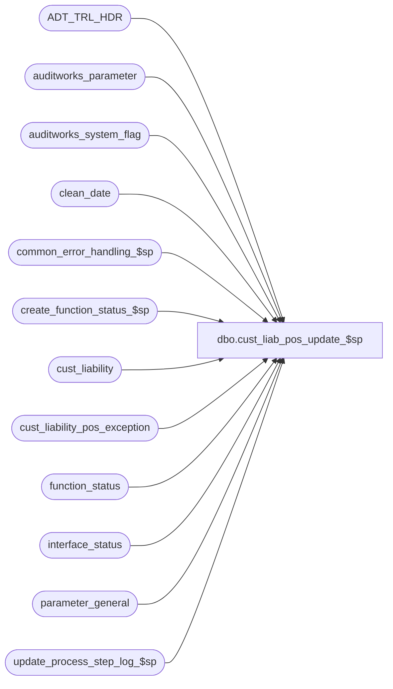

# dbo.cust_liab_pos_update_$sp

**Database:** auditworks_external  
**Server:** bedrockdb01  

## Architecture Diagram



## Table Dependencies

| Referenced Table |
|---|
| ADT_TRL_HDR |
| auditworks_parameter |
| auditworks_system_flag |
| clean_date |
| common_error_handling_$sp |
| create_function_status_$sp |
| cust_liability |
| cust_liability_pos_exception |
| function_status |
| interface_status |
| parameter_general |
| update_process_step_log_$sp |

## Stored Procedure Code

```sql
create proc dbo.cust_liab_pos_update_$sp 
@process_id             binary(16),
@user_id		int,
@function_no		smallint = 0,   -- called by function, 237 when called by FE
@edit_process_no 	smallint = 1,
@process_no		int = 237,   
@log_error_flag		tinyint = 0,
@errmsg			nvarchar(255) OUTPUT
  
AS

/* Proc name:   cust_liab_pos_update_$sp
** Description: Updates the pos fields in table cust_liability to synchronize with voucher tables.
**              Called by proc cust_liability_edit_$sp when glc_postable_used = 1 (voucher on same server)
**              Called by manual functions via cust_liability_edit_$sp
**              Called by F/E from Pos Exceptions Report
**              Based on edit_update_pos_table_$sp

HISTORY
Date      Name        Defect#  Desc
Feb18,13  Vicci        141913  Ensure that reversals of document write-offs or invalidations originating in
			       S/A are synchronized immediately.  
Apr08,08  Paul          97584  Uplift 1-3U32PO, 1-3QXQI6 (refix) to SA5
Aug31,07  Paul          91395  Apply 1-3QXQI6, 77420 to SA5
Aug02,06  Tim           69753  Apply 68078 to SA5
Aug23,05  Paul          51942  Apply 1-1CA2DY to SA5
Sep23,04  David       DV-1146  Use user_id
Jul27,04  Maryam      DV-1071  Modify the insert into ADT_TRL_HDR to include APP_ID, FNCTTN_NUM
Jul15,04  Sab	      DV-1071  Changed the logic to log to the new audit trail tables. Receive @process_id
Dec19,07  Vicci      1-3U32PO  Avoid issue with synch in progress being left on
Aug28,07  Paul       1-3QXQI6  Clean up function_status for previously aborted runs after current successful completion
Sep19.06  Daphna        77420  Ensure pos_amounts = 0 when no SA txn after cleandate
May01,06  Daphna        68078  Ensure pos_status = invalid when no SA txn after cleandate
Mar17,05  Vicci	     1-1CA2DY  Ensure that documents which are written-off or invalidate in
			       S/A are synchronized immediately.
NOV14,02  David          5146  Only log to audit-trail when function_no = 237
JUL24,02  David       1-ECSXT  Log into audit-trail when called from FE.
JUN05,02  Daphna      1-CYE1P  Allow user to start export and synch on Separate Server	
MAY01,02  Daphna      1-BMK21  Progress Monitor, use of clean_date for Multi Db,
                               use of synch_in_progress and function_status                      
Feb11,02  Daphna      AW-8415  New logic for synchronization of POS columns and AW columns
                               log synchronization to pos_exception_report
                               R3 Error Handling
*/


DECLARE
	@batch_size			int,
	@clean_date_used		tinyint,
	@errno				int,
	@glc_export_used		tinyint,
	@max_clean_date			smalldatetime,
	@new_min_date			datetime,
	@message_id			int,
	@object_name			nvarchar(255),
	@operation_name			nvarchar(100),	
	@online_voucher_lookup_used	tinyint,
	@process_name			nvarchar(100),
	@recover_process_id		binary(16),
	@rows				int,
	@synch_date			smalldatetime,
	@synch_in_progress		tinyint,
	@updated_rows			int,
	@voucher			tinyint,
        @function_name	        	varbinary(128),
        @db_id                        	int,
        @current_db_name              	nvarchar(30),

  -- new audit trail tables
	@ENTRY_ID                   uniqueidentifier

SELECT @online_voucher_lookup_used = 0,
       @synch_date = getdate(),
       @message_id = 201068, -- Db Error
       @process_name = 'cust_liab_pos_update_$sp',
       @process_no = 237,         -- C/L Synch
       @function_name = convert(varbinary(128), 'cust_liab_pos_update_$sp'),
       @current_db_name = db_name()

IF @function_no <= 5 AND @edit_process_no > 1 -- allow running only on edit stream 1 (safety check)
  RETURN

-- set voucher export to run if Separate Server
SELECT @voucher = glc_postable_used
FROM parameter_general

IF @voucher > 0
BEGIN
  SET CONTEXT_INFO @function_name

  IF @voucher = 2  --on other server
  BEGIN
    -- turn on export, will synch on POS server and export exceptions back to SA server
    UPDATE interface_status
       SET immediate_posting_requested  = 1
     WHERE interface_id = 30  -- VOUCHER export
  
    SELECT @errno = @@error
    IF @errno <> 0
    BEGIN
      SELECT @errmsg = 'voucher export requested  = 1',
             @object_name = 'interface_status',
             @operation_name = 'UPDATE'
       GOTO error   
    END  
    -- turn off synch      
    UPDATE interface_status
       SET immediate_posting_requested  = 0
     WHERE interface_id = 31  -- synch
       AND immediate_posting_requested = 1

    SELECT @errno = @@error
    IF @errno <> 0
    BEGIN
      SELECT @errmsg = 'synch requested  = 0',
             @object_name = 'interface_status',
             @operation_name = 'UPDATE'
       GOTO error   
    END  

    SELECT @function_name = convert(varbinary(128), 'Unknown')
    SET CONTEXT_INFO @function_name
    
    RETURN
  END
END
ELSE  -- ELSE of IF @voucher > 0, i.e. not used at all
 RETURN  
         
SELECT @synch_in_progress = CONVERT(tinyint, flag_numeric_value)
FROM auditworks_system_flag
WHERE flag_name = 'cl_synch_in_progress'

IF @synch_in_progress = 1
BEGIN
  SELECT @db_id = dbid
    FROM master..sysprocesses
   WHERE spid = @@spid

  SELECT @errno = @@error
  IF @errno != 0
  BEGIN
    SELECT @errmsg = 'Unable to select from master..sysprocesses',
           @object_name = 'master..sysprocesses',
           @operation_name = 'SELECT'
    GOTO error
  END
  IF NOT EXISTS (SELECT 1
                   FROM master..sysprocesses
                  WHERE context_info = @function_name
                    AND spid <> @@spid
                    AND dbid = @db_id
                    AND db_name(dbid) = @current_db_name)
  BEGIN
    SELECT @synch_in_progress = 0
  END
END

IF @synch_in_progress = 0 
BEGIN -- create for process_no 237
  EXEC create_function_status_$sp @process_id, @user_id, @process_no, 0, @errmsg OUTPUT 
  SELECT @errno = @@error
  IF @errno <> 0
  BEGIN
    SELECT @errmsg = '@synch_in_progress = 0',
           @object_name = 'create_function_status_$sp',
           @operation_name = 'EXECUTE'
     GOTO error   
  END
  
  UPDATE auditworks_system_flag
     SET flag_numeric_value = 1,  -- in progress
         flag_datetime_value = getdate()
   WHERE flag_name = 'cl_synch_in_progress'
     AND flag_numeric_value = 0
     
  SELECT @errno = @@error
  IF @errno <> 0 
  BEGIN
    SELECT @errmsg = 'cl_synch_in_progress = 1',
           @object_name = 'auditworks_system_flag',
           @operation_name = 'UPDATE'
    GOTO error
  END     
END  --IF @synch_in_progress = 0 
ELSE  -- <> 0
BEGIN
  IF @synch_in_progress = 1 -- not a recovery
  BEGIN 
    -- run synch via ad-hoc processes with a delay of up to 5 min
    UPDATE interface_status
       SET immediate_posting_requested  = 1
     WHERE interface_id = 31  -- CL Synchronization
  
    SELECT @errno = @@error
    IF @errno <> 0
    BEGIN
      SELECT @errmsg = '@synch_in_progress = 1: immediate_posting_requested  = 1',
             @object_name = 'interface_status',
             @operation_name = 'UPDATE'
       GOTO error   
    END   
    
    SELECT @function_name = convert(varbinary(128), 'Unknown')
    SET CONTEXT_INFO @function_name
    RETURN
  END  --IF @synch_in_progress = 1 
  
  IF @synch_in_progress = 2 -- recovery of halted process
  BEGIN
    SELECT @recover_process_id = process_id
    FROM function_status
    WHERE function_no = @process_no
    
    SELECT @errno = @@error
    IF @errno <> 0
    BEGIN
      SELECT @errmsg = '@recover_process_id = process_id', 
             @object_name = 'function_status',
             @operation_name = 'SELECT'
       GOTO error   
    END   
      
    IF @recover_process_id <> @process_id  -- NOT THE RECOVERY
    BEGIN  
          -- run synch via ad-hoc processes with a delay of up to 5 min
      UPDATE interface_status
         SET immediate_posting_requested  = 1
       WHERE interface_id = 31  -- CL Synchronization
  
 SELECT @errno = @@error
   IF @errno <> 0
    BEGIN
        SELECT @errmsg = 'NOT RECOVERY: immediate_posting_requested  = 1',
               @object_name = 'interface_status',
               @operation_name = 'UPDATE'
         GOTO error   
      END   
      
      SELECT @function_name = convert(varbinary(128), 'Unknown')
      SET CONTEXT_INFO @function_name
      RETURN
      
    END  -- NOT THE RECOVERY
  END  -- synch_in_progress = 2 (recovery)
END -- synch-in-progress <> 0

 
SELECT @batch_size = convert(integer,ISNULL(par_value,'2000'))
  FROM auditworks_parameter
 WHERE par_name = 'transactions_per_batch'

SELECT @errno = @@error
IF @errno !=0 
BEGIN
   SELECT @errmsg = 'Failed to get batch_size',
          @object_name = 'auditworks_parameter',
          @operation_name = 'SELECT'
   GOTO error
END 

-- are there any offline stores
SELECT @glc_export_used = glc_export_used
FROM parameter_general

SELECT @errno = @@error
IF @errno !=0 
BEGIN
   SELECT @errmsg = '@glc_export_used',
          @object_name = 'parameter_general',
          @operation_name = 'SELECT'
   GOTO error
END 


-- are there any online stores.  Note: this flag is set by cust_liability_edit_$sp.
SELECT @clean_date_used = CONVERT(tinyint, flag_numeric_value)
  FROM auditworks_system_flag
WHERE flag_name = 'auditworks_cleandate_used'

SELECT @errno = @@error
IF @errno !=0 
BEGIN
   SELECT @errmsg = '@clean_date_used',
          @object_name = 'auditworks_system_flag',
          @operation_name = 'SELECT'
   GOTO error
END 

IF @clean_date_used = 1 
BEGIN  -- DEF 1-BMK21: get earliest clean dates for Multi Db
  SELECT @max_clean_date = MIN(clean_date) 
    FROM clean_date

  SELECT @errno = @@error
  IF @errno !=0 
  BEGIN
    SELECT @errmsg='@max_clean_date = MIN(clean_date)',
           @object_name = 'clean_date',	
           @operation_name = 'SELECT'           
    GOTO error
  END
END
ELSE  --  use today's date, at 23:59
  SELECT @max_clean_date = DATEADD(mi,+59,DATEADD(hh,+23,CONVERT(smalldatetime, CONVERT(nchar(8),getdate(),112)) ))

-- 1-ECSXT
IF @function_no = 237 -- coming from FE
BEGIN 
  SELECT @ENTRY_ID = NEWID()

  INSERT ADT_TRL_HDR (
	 ENTRY_ID,
	 ENTRY_DATE_TIME,
	 USER_ID,
	 APP_ID,
	 ROOT_TBL_NAME,
	 FNCTN_NUM)
  SELECT @ENTRY_ID,
	 getdate(),
	 IsNull(@user_id,-1),
	 300,
	'CUST_LIABILITY',
	 @function_no

  SELECT @errno = @@error
  IF @errno != 0
  BEGIN
    SELECT @errmsg = 'Unable to insert ADT_TRL_HDR.',
	   @object_name = 'ADT_TRL_HDR',
	   @operation_name = 'INSERT'
    GOTO error
  END

END --IF @function_no = 237

WHILE 1=1
BEGIN
 
  SET rowcount @batch_size
  
/* new logic is:
   1.update pos column for offline vouchers 
   and for on-line vouchers that meet clean date criteria 
   2. do not update pos amounts for partial synch (synch_flag = 1)*/
  
  UPDATE cust_liability 
     SET pos_status = aw_status,
         pos_amount_1 = aw_amount_1 * SIGN(synch_flag - 1) +  --  = 0 if synch_flag = 1
                        c.pos_amount_1 * (1 - SIGN(synch_flag - 1)),  -- = 0 if synch_flag = 2
         pos_amount_2 = aw_amount_2 * SIGN(synch_flag - 1) + 
                        c.pos_amount_2 * (1 - SIGN(synch_flag - 1)),
         pos_amount_3 = aw_amount_3 * SIGN(synch_flag - 1) + 
                        c.pos_amount_3 * (1 - SIGN(synch_flag - 1)),   
         last_synched = @synch_date,
         last_modified_by_aw = @synch_date  -- to allow use of index in export
    FROM cust_liability_pos_exception e, 
         cust_liability c     
   WHERE e.reference_type = c.reference_type
     AND e.reference_no = c.reference_no
     AND e.key_store_no = c.key_store_no
     AND e.aw_status IS NOT NULL 
     AND e.aw_amount_1 IS NOT NULL 
     AND e.aw_amount_2 IS NOT NULL 
     AND e.aw_amount_3 IS NOT NULL 
     AND e.synch_flag > 0 -- NOT IN SYNCH
     AND e.last_modified < @synch_date
     AND (c.last_modified_by_pos <= @max_clean_date
	  OR c.last_modified_by_pos IS NULL
	  OR e.aw_status IN (20, 40, 50)  --stock stolen, stolen from customer, written-off
	  OR (c.last_synched > c.last_modified_by_pos AND c.pos_status in (20, 40, 50)) ) --reversal of stock stolen, stolen from customer, written-off

  SELECT @errno = @@error,
         @rows = @@rowcount
  IF @errno <> 0
  BEGIN
    SELECT @errmsg = 'synchronize POS columns',
           @object_name = 'cust_liability',
           @operation_name = 'UPDATE'
    GOTO error       
  END          
  
  
  -- set pos_status = 0  invalid when no SA txn received by cleandate
  -- def 77420 set pos_amounts = 0 when no SA txn received by cleandate
  
  UPDATE cust_liability 
     SET pos_status = 0, -- INVALID
         pos_amount_1 = 0,
         pos_amount_2 = 0,
         pos_amount_3 = 0,
         last_synched = @synch_date,
         last_modified_by_aw = @synch_date  -- to allow use of index in export
    FROM cust_liability_pos_exception e, 
         cust_liability c     
   WHERE e.reference_type = c.reference_type
     AND e.reference_no = c.reference_no
     AND e.key_store_no = c.key_store_no
     AND e.synch_flag > 0 -- NOT IN SYNCH
     AND e.aw_status IS NULL 
     AND e.aw_amount_1 IS NULL 
     AND e.aw_amount_2 IS NULL 
     AND e.aw_amount_3 IS NULL      
     AND e.last_modified < @synch_date
     AND c.last_modified_by_pos <= @max_clean_date

  SELECT @errno = @@error,
         @rows = @rows + @@rowcount
  IF @errno <> 0
  BEGIN
    SELECT @errmsg = 'invalidate status when no SA txn',
           @object_name = 'cust_liability',
           @operation_name = 'UPDATE'
    GOTO error       
  END        
  

  
  
  IF @rows <> 0  --  rows updated
  BEGIN  -- rows updated by synch
    
    SELECT @updated_rows = @rows
    
    UPDATE cust_liability_pos_exception
       SET last_synched_date = @synch_date,
           synch_flag = 0
      FROM cust_liability_pos_exception e, 
           cust_liability c    
     WHERE e.reference_type = c.reference_type
       AND e.reference_no = c.reference_no
       AND e.key_store_no = c.key_store_no       
       AND e.synch_flag > 0
       AND e.last_modified < @synch_date
       AND c.last_synched = @synch_date
       AND c.last_modified_by_aw = @synch_date
       
    SELECT @errno = @@error 
    IF @errno <> 0
    BEGIN
      SELECT @errmsg = 'set in_synch_flag, last_synched_date',
             @object_name = 'cust_liability_pos_exception',
             @operation_name = 'UPDATE'
      GOTO error       
    END       
  END --  @rows <> 0 - updated by synch    
  
  IF  @rows < @batch_size
    BREAK 
  
END /* WHILE 1=1 */               

 
SET rowcount 0 
 
-- offline stores exist and POS cols synched
IF (@updated_rows > 0 AND  @glc_export_used = 1)  
BEGIN  
    UPDATE parameter_general
       SET glc_export_required = 1
     
    SELECT @errno = @@error
    IF @errno !=0 
    BEGIN
      SELECT @errmsg='glc_export_required = 1',
             @object_name = 'parameter_general',
             @operation_name = 'UPDATE'
      GOTO error
    END     
END --  POS cols synched and offline stores exist

-- turn off synch
UPDATE interface_status
  SET immediate_posting_requested = 0
 WHERE interface_id = 31    -- synch
   AND immediate_posting_requested = 1

SELECT @errno = @@error
IF @errno <> 0 
BEGIN
  SELECT @errmsg = 'immediate_posting_requested = 0',
         @object_name = 'interface_status',
         @operation_name = 'UPDATE'
   GOTO error
END

-- sync succeeded so update flag

UPDATE auditworks_system_flag
   SET flag_numeric_value = 0 
 WHERE flag_name = 'cl_synch_in_progress'
     
SELECT @errno = @@error
IF @errno <> 0 
BEGIN
  SELECT @errmsg = 'cl_synch_in_progress = 0',
         @object_name = 'auditworks_system_flag',
         @operation_name = 'UPDATE'
   GOTO error
END     

-- increment completed workload
IF @function_no IN (4,5)
 BEGIN
  EXEC update_process_step_log_$sp @function_no,  @edit_process_no, 33
  SELECT @errno = @@error
  IF @errno <> 0
  BEGIN 
    SELECT @errmsg = 'increment completed workload for step_no = 33',
           @operation_name = 'EXECUTE',
           @object_name = 'update_process_step_log_$sp'
    GOTO error      
  END    

  -- Delete entry for current run and for any previously aborted edit/sync since the current edit run completed normally

  DELETE function_status
  WHERE function_no = 237 -- delete all sync requests since edit succeeded

  SELECT @errno = @@error
  IF @errno <> 0
  BEGIN 
	SELECT @errmsg = 'clean up edit entries',
		@operation_name = 'DELETE',
		@object_name = 'function_status'
	GOTO error      
  END 

 END -- If @function_no IN (4,5)
ELSE
 BEGIN
  DELETE function_status
  WHERE (function_no = @process_no
	  AND process_id = @process_id)
	OR function_no = 237 -- delete all sync requests 

  SELECT @errno = @@error
  IF @errno <> 0
  BEGIN 
	SELECT @errmsg = 'clean up non-edit entries',
		@operation_name = 'DELETE',
		@object_name = 'function_status'
	GOTO error      
  END
END -- else of if @function_no IN (4,5)

SELECT @function_name = convert(varbinary(128), 'Unknown')
SET CONTEXT_INFO @function_name
RETURN

error:

     SELECT @function_name = convert(varbinary(128), 'Unknown')
     SET CONTEXT_INFO @function_name

     SET rowcount 0
     
     EXEC common_error_handling_$sp @process_no, @errno, @errmsg, 0, @message_id,
          @process_name, @object_name, @operation_name, @log_error_flag, 1, 0, null,
          0, null, null, null, null, null, null, 0, @process_id, @user_id
	

	RETURN
```

