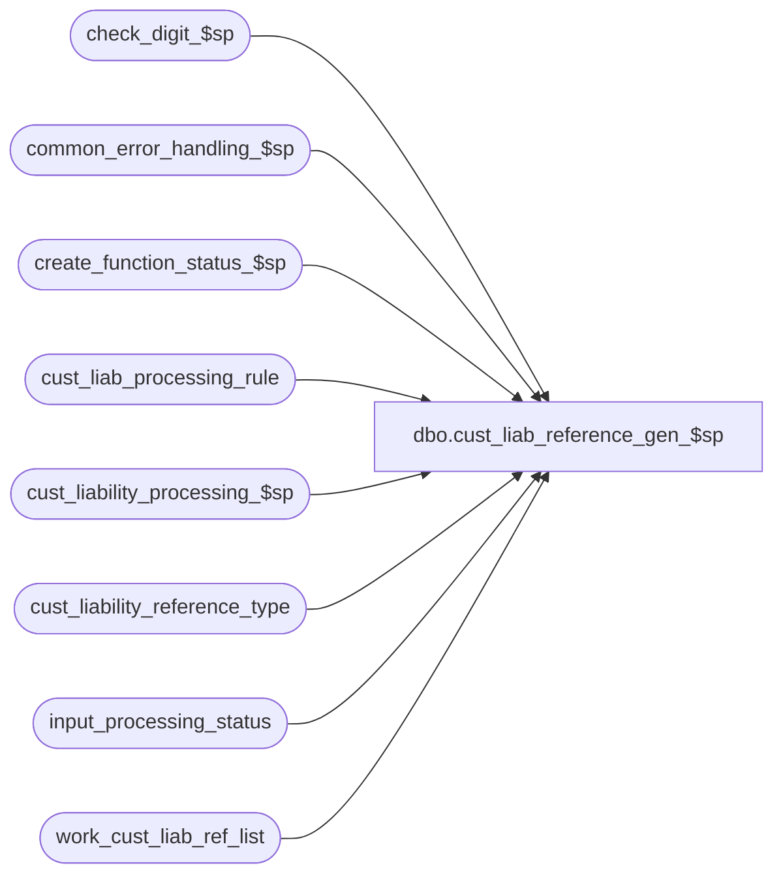

# dbo.cust_liab_reference_gen_$sp

**Database:** auditworks_external  
**Server:** bedrockdb01  

## Architecture Diagram



## Table Dependencies

| Referenced Table |
|---|
| check_digit_$sp |
| common_error_handling_$sp |
| create_function_status_$sp |
| cust_liab_processing_rule |
| cust_liability_processing_$sp |
| cust_liability_reference_type |
| input_processing_status |
| work_cust_liab_ref_list |

## Stored Procedure Code

```sql
create proc dbo.cust_liab_reference_gen_$sp 
  @process_id                   binary(16) = @@spid,
  @user_id			int = NULL,
  @rule_id			nvarchar(3), 
  @denomination			money, 
  @from_reference_no		nvarchar(20), 
  @to_reference_no		nvarchar(20),    --> either @to_reference_no is received
  @document_qty			numeric(12,0),  --  or @document_qty but not both
  @input_id			numeric(12,0)	OUTPUT, --> received as null
  @next_reference_no		nvarchar(20)	OUTPUT, -- SA5 front end will set to -1 as null value
  @errmsg			nvarchar(255)	OUTPUT,  --> received as null
  @expiry_days                  smallint = NULL
  
AS

/* 
PROC NAME: cust_liab_reference_gen_$sp
     DESC: Populates work_cust_liab_ref_list table with a list of sequentially 
           assigned reference numbers (or just 1 reference number in the case of 
           an Alpha reference type) for use by cust_liability_processing_$sp.
           Called by Front-end. 

HISTORY:
Date      Name         Defect#  Description
Nov01,12  Vicci         139296  Add optional input parameter for expiry_days
Aug20,08  Paul           87777  improved error messages
Feb22,08  Phu            98524  Allow SA5 front end to pass -1 (instead of null) value for i_input_id.
Mar20,06  David        DV-1332  Add defaults to process_id and user_id.
Sep23,04  David        DV-1146  Use user_id instead of user name.
Apr22,04  Maryam       DV-1071  Receive @process_id and pass it to the sub procs.
Oct18,02  David C      1-G1KTV  Call create_function_status_$sp.
Sep10,02  Paul S       1-F97LW  added remarks, captitalized commands
Jul22,02  David C      1-E24RQ  Avoid arithmetic overflow and make sure code works the same way in MSSQL as in Sybase.
Feb15,02  David C      AW-8415  Obtain input_id and populate work_cust_liab_ref_list table 
				  with a list of sequentially assigned reference numbers under this input_id.

*/


DECLARE	@check_digit_routine_number	tinyint, 
	@document_qty_generated		numeric(12,0),
	@entry_date_time		datetime,
	@errno				int,
	@from_reference_number		numeric(20,0),	
	@key_store_no			int,
	@message_id			int,
	@next_reference_number		numeric(20,0),
	@object_name			nvarchar(255),
	@operation_name			nvarchar(100),
	@process_name			nvarchar(100),
	@process_no 			smallint,
	@reference_number		numeric(20,0),
	@reference_type			tinyint,
	@reference_no_datatype		nchar(1),
	@reference_no_length 		tinyint, 
	@register_no			smallint,
	@rows				int,
	@store_no			int,
	@to_reference_number		numeric(20,0),	
	@transaction_category		tinyint,
	@transaction_date		smalldatetime
	

SELECT @process_no = 229,
       @process_name = 'cust_liab_reference_gen_$sp',
       @message_id = 201068,
       @transaction_date = CONVERT(smalldatetime, CONVERT(nvarchar, getdate(), 101))


-- Verify that a row exists for the passed in @rule_id	
SELECT  @reference_type = p.reference_type,
	@reference_no_datatype = r.reference_no_datatype,
	@reference_no_length = r.reference_no_length, 
	@check_digit_routine_number = r.check_digit_routine_number, 
	@store_no = p.store_no,
	@key_store_no = r.unique_by_store_key * p.store_no + (r.unique_by_store_key - 1),
	@transaction_category = p.transaction_category,
	@register_no = p.register_no
  FROM cust_liab_processing_rule p, cust_liability_reference_type r
 WHERE p.rule_id = @rule_id 
   AND p.reference_type = r.reference_type

SELECT @errno = @@error, @rows = @@rowcount
IF @errno != 0 OR @rows = 0
BEGIN
  SELECT @errmsg = 'Failed to select from cust_liab_processing_rule and cust_liability_reference_type',
         @object_name = 'cust_liab_processing_rule',
         @operation_name = 'SELECT'
  IF @rows = 0
    SELECT @errmsg = 'Configuration is incorrect for customer liability rule ' + CONVERT(nvarchar,@rule_id)
  GOTO error
END  


IF @input_id IS NULL OR @input_id = -1
BEGIN

  SELECT @entry_date_time = getdate()

  BEGIN TRANSACTION
  
  INSERT INTO input_processing_status (
  	process_start_datetime, 
  	process_no, 
  	processing_message, 
  	status  ) 
  VALUES (
  	@entry_date_time, 
  	@transaction_category, 
  	@rule_id, 
  	-2 )
  	
  SELECT @errno = @@error, @input_id = @@identity
  IF @errno != 0 
  BEGIN
    SELECT @errmsg = 'Failed to insert into input_processing_status',
           @object_name = 'input_processing_status',
           @operation_name = 'INSERT'
    GOTO error
  END  

  -- 1-G1KTV
  EXEC create_function_status_$sp @process_id = @process_id,  
		@user_id = @user_id,
		@function_no = @transaction_category,
		@transaction_id = @input_id,
		@errmsg	= @errmsg,
		@store_no = @store_no,
		@transaction_date = @transaction_date,
		@date_reject_id	= 0,
		@register_no = @register_no,
		@status = 0

    SELECT @errno = @@error
    IF @errno != 0
    BEGIN
        SELECT @errmsg = 'Failed to execute stored procedure create_function_status_$sp',
               @object_name = 'create_function_status_$sp',
               @operation_name = 'EXECUTE'
        GOTO error
    END
  
  COMMIT TRANSACTION
  
END --IF @input_id IS NULL OR @input_id = -1
ELSE
 BEGIN -- populated by gui and @input_id is passed in by gui
   SELECT @entry_date_time = process_start_datetime 
     FROM input_processing_status 
    WHERE input_id = @input_id

    SELECT @errno = @@error, @rows = @@rowcount
    IF @errno != 0 OR @rows = 0
    BEGIN
      SELECT @errmsg = 'Failed to select from input_processing_status ',
             @object_name = 'input_processing_status',
             @operation_name = 'SELECT'
      IF @rows = 0
        SELECT @errmsg = 'No row found in table input_processing_status for input_id ' + CONVERT(nvarchar,@input_id)
      GOTO error
    END 
 END -- populated by gui


IF @reference_no_datatype = 'N'
BEGIN

  SELECT @reference_number = CONVERT(numeric(20,0), @from_reference_no), 
	 @to_reference_number = CONVERT(numeric(20,0), @to_reference_no)

  IF @check_digit_routine_number <> 0 -- 1-E24RQ
  SELECT @reference_number = CONVERT(numeric(20,0),substring(@from_reference_no,1,LEN(@from_reference_no)-1)), 
	 @to_reference_number = CONVERT(numeric(20,0),substring(@to_reference_no,1,LEN(@to_reference_no)-1))

  IF @document_qty IS NULL OR @document_qty < 1
  SELECT @document_qty = @to_reference_number - @reference_number + 1

  SELECT @document_qty_generated = 0, 
  	 @next_reference_number = @reference_number

  WHILE @document_qty_generated <= @document_qty
  BEGIN
    
    IF @check_digit_routine_number > 0 
    BEGIN
      EXEC check_digit_$sp  @process_id, @user_id, @process_no, @check_digit_routine_number, @reference_number OUTPUT, @errmsg OUTPUT
    
      SELECT @errno = @@error
      IF @errno != 0 
      BEGIN
        IF @errmsg IS NULL /* then */
          SELECT @errmsg = 'Failed to execute stored proc check_digit_$sp '
          
        SELECT @object_name = 'check_digit_$sp',
               @operation_name = 'EXECUTE'
        GOTO error
      END  
    END -- IF @check_digit_routine_number > 0

    IF @document_qty_generated < @document_qty
    BEGIN
      INSERT INTO work_cust_liab_ref_list (
      		input_id, 
      		row_no, 
      		reference_type, 
      		reference_no, 
      		key_store_no, 
      		action_amount, 
      		issuing_store_no, 
      		date_issued, 
      		replacement_reference_no,
      		expiry_days  )
      VALUES ( 
      		@input_id, 
      		@document_qty_generated, 
      		@reference_type,
      		RIGHT('00000000000000000000' + CONVERT(nvarchar, @reference_number), @reference_no_length), 
      		@key_store_no, 
      		@denomination, 
      		@store_no, 
      		@entry_date_time, 
      		null,
      		@expiry_days )
      --note:  row_no must start at 0 and be sequential for subsequent transaction_no selection to work.

      SELECT @errno = @@error
      IF @errno != 0 
      BEGIN
        SELECT @errmsg = 'Failed to insert into work_cust_liab_ref_list (datatype numeric) ',
               @object_name = 'work_cust_liab_ref_list',
               @operation_name = 'INSERT'
       GOTO error
      END  

 SELECT @next_reference_number = @next_reference_number + 1
      SELECT @reference_number = @next_reference_number  
      --note:  need both reference_number and next_reference_number because of check_digitting
      
    END --IF @document_qty_generated < @document_qty
    
    SELECT @document_qty_generated = @document_qty_generated + 1
    
  END --WHILE @document_qty_generated <= @document_qty

END --if datatype numeric
ELSE 
 BEGIN
   INSERT INTO work_cust_liab_ref_list (
   	input_id, 
   	row_no, 
   	reference_type, 
   	reference_no, 
   	key_store_no, 
 	action_amount, 
   	issuing_store_no, 
   	date_issued, 
   	replacement_reference_no,
   	expiry_days  )
  VALUES (
   	@input_id, 
   	1, 
   	@reference_type,
   	RIGHT('00000000000000000000' + @from_reference_no, @reference_no_length), 
   	@key_store_no, 
   	@denomination, 
   	@store_no, 
   	@entry_date_time, 
   	null,
   	@expiry_days              )

   SELECT @errno = @@error
   IF @errno != 0 
   BEGIN
     SELECT @errmsg = 'Failed to insert into work_cust_liab_ref_list (datatype alpha) ',
            @object_name = 'work_cust_liab_ref_list',
            @operation_name = 'INSERT'
     GOTO error
   END  
 END -- datatype alpha

SELECT @next_reference_no = RIGHT('00000000000000000000' + CONVERT(nvarchar, @reference_number), @reference_no_length)

EXEC cust_liability_processing_$sp @process_id, @user_id, @input_id, -2, null, @next_reference_no, null, @errmsg OUTPUT

  SELECT @errno = @@error
  IF @errno != 0 	
  BEGIN
    IF @errmsg IS NULL /* then */ 
      SELECT @errmsg = 'Failed to execute stored proc cust_liability_processing_$sp '
      
    SELECT @object_name = 'cust_liab_processing_rule',
           @operation_name = 'EXECUTE'
    GOTO error
  END  

RETURN


error:  /* Common error handler */       

	EXEC common_error_handling_$sp @process_no, @errno, @errmsg, 0, @message_id, 
	@process_name, @object_name, @operation_name, 1, 1, 0, null, 0, 
        null, null, null, null, null, null, 0, @process_id, @user_id
        
	RETURN
```

