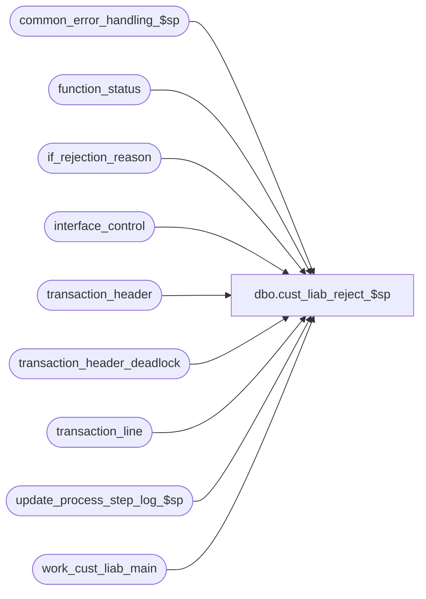

# dbo.cust_liab_reject_$sp

**Database:** auditworks_external  
**Server:** bedrockdb01  

## Architecture Diagram



## Table Dependencies

| Referenced Table |
|---|
| common_error_handling_$sp |
| function_status |
| if_rejection_reason |
| interface_control |
| transaction_header |
| transaction_header_deadlock |
| transaction_line |
| update_process_step_log_$sp |
| work_cust_liab_main |

## Stored Procedure Code

```sql
create proc [dbo].[cust_liab_reject_$sp] 
@process_id             binary(16),
@user_id		int,
@errmsg			nvarchar(255) OUTPUT,
@log_error_flag		tinyint = 0,  -- 1 if called by smartload
@edit_process_no 	tinyint = 1,
@function_no		smallint = 100  -- will be 4 or 5 from edit phase 1 or 2  
 
AS

/*
**  Name: cust_liab_reject_$sp
**  Description: Called by cust_liability_edit_$sp and modify_interface_$sp.
**               

HISTORY:
Date      Name          Defect#  Description
Sep20,07  Paul            86842  updated comments
Sep06,05  Paul          DV-1312  apply 43068 to SA5
Jan06,05  Paul          DV-1191  added locking hints
Sep23,04  David         DV-1146  Use user_id.
Apr23,04  Maryams       DV-1071  Receive @process_id and pass it to the common_error_handling_$sp
Oct21,04  Daphna 1-142R4U/43068  Do not log IF rejects for voided transactions (spec for 
                                 ref_no is void, numeric ref_no has alpha char)
Nov07,03  David     17860/17761  Make sure process_id is set in if_rejection_reason when doing mass-delete.
Oct18,02  David         1-G1KTR  Set memo2 = unformatted_reference_no if reference no is too long.
May10,02  Daphna        1-BMK21  Progress Monitor for functions 4,5,11	
                                 Move insert to if_rejection_reason (mass-delete) to edit. 
Feb11,02  David C       AW-8415  version with code 
Jan30,02  David C       1-9DI2T  Foundation for R3 customer liability.

*/

DECLARE 
	@errno				int,
	@message_id			int,
	@object_name			nvarchar(255),
	@operation_name			nvarchar(100),
	@process_name			nvarchar(100),
	@process_no 			smallint,
	@rows				int


SELECT @process_no = 228,
       @process_name = 'cust_liab_reject_$sp',
       @message_id = 201068

BEGIN TRANSACTION

  DELETE if_rejection_reason
    FROM work_cust_liab_main wm WITH (NOLOCK), if_rejection_reason i
   WHERE i.transaction_id = wm.transaction_id
     AND i.line_id = wm.line_id
     AND i.if_reject_reason = 100
     AND wm.process_id = @process_id
     
  SELECT @errno = @@error
  IF @errno !=0
  BEGIN
    SELECT @errmsg = 'Cannot delete duplicates from if_rejection_reason',
           @object_name = 'if_rejection_reason',
           @operation_name = 'DELETE'
    GOTO error
  END
     
  INSERT if_rejection_reason (
	 transaction_id,
	 line_id,
	 if_reject_reason,
	 memo1,
	 memo2,
	 memo3,
	 lookup_key1)
  SELECT transaction_id,
	 line_id,
	 100,
	 convert(nvarchar,rejected_validation_id),
	 reference_no, -- Used by FE to drill down for investigation
	 STR(ROUND(amount, 2), 12, 2),
	 reference_type
    FROM work_cust_liab_main WITH (NOLOCK)
   WHERE rejected_validation_id != 0
     and ref_no_too_long_flag = 0
     AND process_id = @process_id
     AND transaction_void_flag IN (0,8)

  SELECT @errno = @@error
  IF @errno !=0
  BEGIN
    SELECT @errmsg = 'Cannot insert rejections',
           @object_name = 'if_rejection_reason',
           @operation_name = 'INSERT'
    GOTO error
  END
  
  INSERT if_rejection_reason (
	 transaction_id,
	 line_id,
	 if_reject_reason,
	 memo1,
	 memo2,
	 memo3,
	 lookup_key1)
  SELECT transaction_id,
	 line_id,
	 100,
	 convert(nvarchar,rejected_validation_id),
	 unformatted_reference_no, -- Used by FE to display reference nos which are too long
	 STR(ROUND(amount, 2), 12, 2),
	 reference_type
    FROM work_cust_liab_main WITH (NOLOCK)
   WHERE rejected_validation_id != 0
     and ref_no_too_long_flag = 1
     AND process_id = @process_id
     AND transaction_void_flag IN (0,8)
     
  SELECT @errno = @@error
  IF @errno !=0
  BEGIN
    SELECT @errmsg = 'Cannot insert rejections for reference no too long',
           @object_name = 'if_rejection_reason',
           @operation_name = 'INSERT'
    GOTO error
  END

  -- If mass-delete, set process_id in if_rejection_reason to indicate 
  -- revalidation which if_rejects to revalidate.
  IF @function_no = 40
  BEGIN 
    UPDATE if_rejection_reason
       SET process_id = @process_id
      FROM work_cust_liab_main w WITH (NOLOCK), if_rejection_reason r
     WHERE w.transaction_id = r.transaction_id
       AND w.line_id = r.line_id
       AND convert(nvarchar,w.rejected_validation_id) = r.memo1
       AND if_reject_reason = 100
       AND w.rejected_validation_id != 0
       AND w.function_no = 40 
       AND w.process_id = @process_id
       AND w.transaction_void_flag IN (0,8)

    SELECT @errno = @@error
    IF @errno != 0
    BEGIN
      SELECT @errmsg = 'Failed to set process_id',
             @object_name = 'if_rejection_reason',
             @operation_name = 'UPDATE'
      GOTO error
    END
  END -- end if mass delete

  UPDATE interface_control
     SET interface_status_flag = 99
    FROM work_cust_liab_main wm WITH (NOLOCK), interface_control ic
   WHERE wm.transaction_id = ic.transaction_id
     AND ic.interface_id = 28
     AND wm.rejected_status != 0 
     AND wm.process_id = @process_id
     AND wm.transaction_void_flag IN (0,8)

  SELECT @errno = @@error
  IF @errno !=0
  BEGIN
    SELECT @errmsg='Cannot update interface_control with rejected status',
           @object_name = 'interface_control',
           @operation_name = 'UPDATE'
    GOTO error
  END

  /* simulate table lock to avoid deadlocks with archive posting */
  UPDATE transaction_header_deadlock
     SET function_no = 228,
         status_date = getdate()

    SELECT @errno = @@error
    IF @errno !=0
    BEGIN
      SELECT @errmsg='Cannot update transaction_header_deadlock',
      @object_name = 'transaction_header_deadlock',
             @operation_name = 'UPDATE'
      GOTO error
    END

  /* flag transaction_line(s) which caused error */
  UPDATE transaction_line
     SET interface_rejection_flag = 1
    FROM work_cust_liab_main wm WITH (NOLOCK), transaction_line tl
   WHERE rejected_validation_id != 0
     AND wm.transaction_id = tl.transaction_id
     AND wm.line_id = tl.line_id
     AND wm.process_id = @process_id
     AND tl.interface_rejection_flag != 1
     AND wm.transaction_void_flag IN (0,8)

  SELECT @errno = @@error
  IF @errno !=0
  BEGIN
    SELECT @errmsg='Cannot update transaction_line with reject status',
           @object_name = 'transaction_line',
           @operation_name = 'UPDATE'
    GOTO error
  END

  /* flag rejected trans */ 
  UPDATE transaction_header
     SET if_rejection_flag = 1
    FROM work_cust_liab_main wm WITH (NOLOCK), transaction_header th
   WHERE wm.transaction_id = th.transaction_id
     AND wm.rejected_status != 0 
     AND wm.process_id = @process_id
     AND th.if_rejection_flag != 1 -- not already flagged as i/f reject
     AND wm.transaction_void_flag IN (0,8)

  SELECT @errno = @@error
  IF @errno !=0
  BEGIN
    SELECT @errmsg='Cannot update transaction_header with rejected status',
           @object_name = 'transaction_header',
           @operation_name = 'UPDATE'
    GOTO error
  END

  UPDATE function_status
     SET status = 30
   WHERE process_id = @process_id
     AND function_no = @process_no

  SELECT @errno = @@error
  IF @errno !=0
  BEGIN
    SELECT @errmsg='Cannot set status = 30',
           @object_name = 'function_status',
           @operation_name = 'UPDATE'
    GOTO error
  END

-- increment completed workload 
IF @function_no IN (4,5,11)
BEGIN
  EXEC update_process_step_log_$sp @function_no,  @edit_process_no, 24
  SELECT @errno = @@error
  IF @errno <> 0
  BEGIN 
    SELECT @errmsg = 'increment of completed workload for step_no = 24',
           @operation_name = 'EXECUTE',
           @object_name = 'update_process_step_log_$sp'
    GOTO error      
  END 
END

COMMIT TRANSACTION


RETURN 

error:

	EXEC common_error_handling_$sp @process_no, @errno, @errmsg, 0, @message_id, 
	@process_name, @object_name, @operation_name, @log_error_flag, @edit_process_no,
	0, null, 0, null, null, null, null, null, null, 0, @process_id, @user_id
	
	RETURN
```

