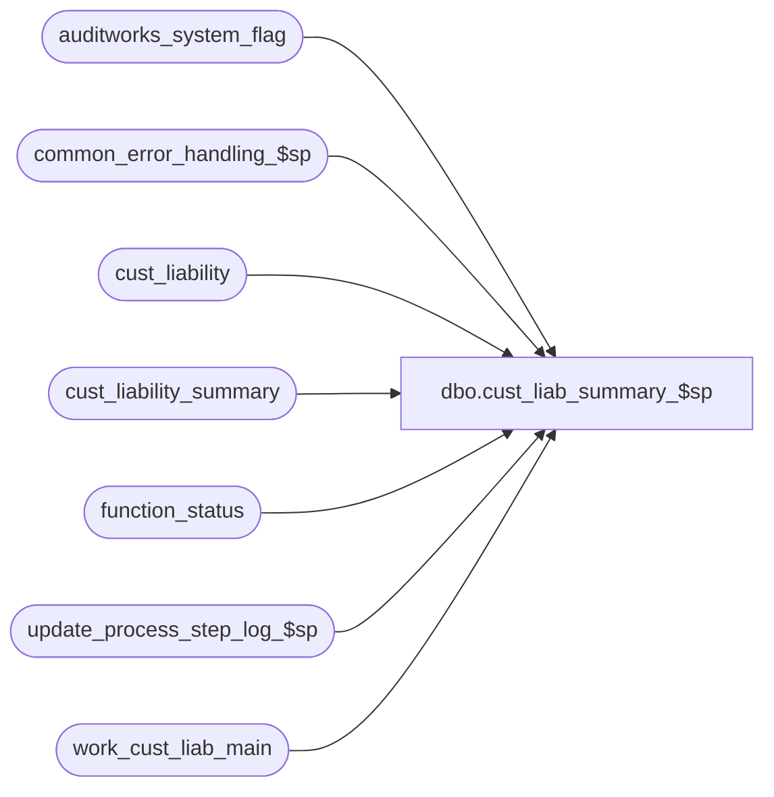

# dbo.cust_liab_summary_$sp

**Database:** auditworks_external  
**Server:** bedrockdb01  

## Architecture Diagram



## Table Dependencies

| Referenced Table |
|---|
| auditworks_system_flag |
| common_error_handling_$sp |
| cust_liability |
| cust_liability_summary |
| function_status |
| update_process_step_log_$sp |
| work_cust_liab_main |

## Stored Procedure Code

```sql
create proc [dbo].[cust_liab_summary_$sp] 
@process_id             binary(16),
@user_id		int,
@function_no		smallint,
@errmsg			nvarchar(255) OUTPUT,
@log_error_flag		tinyint = 0,  -- 1 if called by smartload
@edit_process_no	tinyint = 1

AS


/*
**  Name: cust_liab_summary_$sp
**  Description: Called by cust_liability_edit_$sp.
**               
   Must script with set ansi_nulls on and set ansi_warnings on

HISTORY:
Date      Name          Defect#  Description
Sep09,10  Paul           119817  Only turn on XACT_ABORT if using scaleout (needed to update cross-server views),
					also log a message to smartload log to facilitate investigation
Apr14,09  Paul           108944  create table, support cross-server views for scaleout
Jan06,05  Paul          DV-1191  added locking hints
Sep23,04  David         DV-1146  Use user_id.
Apr23,04  Maryams       DV-1071  Receive @process_id and pass it to the common_error_handling_$sp
May13,02  Vicci		1-BMK21	 Adjust code to include receivable amounts as well and to
				 recognize if disabled.
May10,02  Daphna        1-BMK21  Progress Monitor for functions 4,5,11. 
Dec13,01  David C       AW-8415  R3 customer liability. receive @log_error_flag, @edit_process_no.

*/


DECLARE
	@cursor1_open			tinyint,
	@c_cust_liability_type		tinyint, 
	@c_tracking_id			smallint, 
	@c_reference_type		tinyint, 
	@c_transaction_date		smalldatetime, 
	@c_liability_incurred_date	smalldatetime, 
	@c_change_in_liability_balance	money,
	@c_change_in_receivable_bal	money,
    	@c_change_in_stocked_amount	money,
    	@c_change_in_stocked_qty	int,
	@disable_flag			tinyint,
	@errno    			int,
	@message_id			int,
	@object_name			nvarchar(255),
	@operation_name			nvarchar(100),
	@process_name			nvarchar(100),
	@process_no 			smallint,
	@rowcount			int,
	@scaleout_flag			int,
	@trace_msg			nvarchar(255)


SELECT @disable_flag = 0,
       @process_no = 228,
       @process_name = 'cust_liab_summary_$sp',
       @message_id = 201068

SELECT @scaleout_flag = CONVERT(int,flag_numeric_value)
  FROM auditworks_system_flag
 WHERE flag_name = 'scaleout_flag'

SELECT @errno = @@error
IF @errno != 0
  BEGIN
    SELECT @errmsg = 'Failed to select scaleout_flag from auditworks_system_flag',
           @object_name = 'auditworks_system_flag',
          @operation_name = 'SELECT'
    GOTO error
  END

IF EXISTS (SELECT flag_name
 	     FROM auditworks_system_flag
 	    WHERE flag_name = 'disable_cust_liab_summary_$sp')
BEGIN
  SELECT @disable_flag = 1
END

IF @disable_flag <> 1
BEGIN
 CREATE TABLE #clsumm (
	tracking_id			smallint not null,
	reference_type			tinyint not null,
	transaction_date		smalldatetime not null,
	liability_incurred_date		smalldatetime null,
	change_in_liability_balance	money not null,
	change_in_receivable_balance	money not null,
	change_in_stocked_amount	money not null,
	change_in_stocked_qty		smallint not null )

 SELECT @errno = @@error
 IF @errno !=0 
 BEGIN
   SELECT @errmsg = 'Failed to create table #clsumm',
          @object_name = '#clsumm',
          @operation_name = 'CREATE'
   GOTO error
 END

 INSERT INTO #clsumm (
	tracking_id,
	reference_type,
	transaction_date,
	liability_incurred_date,
	change_in_liability_balance,
	change_in_receivable_balance,
	change_in_stocked_amount,
	change_in_stocked_qty)
 SELECT g.tracking_id, 
	g.reference_type,
	g.transaction_date, 
	cl.date_issued, 
	SUM(g.liability_amount),
 	SUM(g.receivable_amount),
	SUM(g.stocked_amount),
	SUM(g.stocked_flag) - SUM(g.issued_flag * cl.stocked_flag)
  FROM work_cust_liab_main g WITH (NOLOCK), cust_liability cl
 WHERE g.tracking_id = cl.tracking_id
   AND g.reference_no = cl.reference_no
   AND g.reference_type = cl.reference_type
   AND g.key_store_no = cl.key_store_no
   AND g.transaction_void_flag IN (0,8)
   AND g.rejected_status = 0
   AND g.process_id = @process_id
 GROUP BY g.tracking_id, 
	g.reference_type,
	g.transaction_date, 
	cl.date_issued

 SELECT @errno = @@error
 IF @errno !=0 
 BEGIN
   SELECT @errmsg = 'Failed to insert #clsumm',
          @object_name = '#clsumm',
          @operation_name = 'INSERT'
   GOTO error
 END

DECLARE clsumm_crsr CURSOR FAST_FORWARD
 FOR
 SELECT tracking_id, 
	reference_type,
	transaction_date, 
	liability_incurred_date, 
	change_in_liability_balance,
	change_in_receivable_balance,
	change_in_stocked_amount,
	change_in_stocked_qty
   FROM #clsumm WITH (NOLOCK)
  
OPEN clsumm_crsr

 SELECT @errno = @@error
 IF @errno !=0 
 BEGIN
   SELECT @errmsg='Failed to open CURSOR clsumm_crsr',
          @object_name = 'clsumm_crsr',
          @operation_name = 'OPEN'
   GOTO error
 END

SELECT	@cursor1_open=1

IF @function_no <= 5 -- If called by edit, then log a message (also facilitates investigation)
	BEGIN
	 SELECT @trace_msg = nchar(13) + nchar(10) + ':LOG &&: Edit CL Summary Posting starts : ' + convert(nchar, getdate(), 8)
	 PRINT @trace_msg
	END

IF @scaleout_flag = 1
	SET XACT_ABORT ON

BEGIN TRANSACTION

WHILE 1=1
BEGIN

  FETCH clsumm_crsr
   INTO @c_tracking_id, 
	@c_reference_type,
	@c_transaction_date, 
    	@c_liability_incurred_date, 
    	@c_change_in_liability_balance,
	@c_change_in_receivable_bal,
    	@c_change_in_stocked_amount,
    	@c_change_in_stocked_qty

  IF @@fetch_status != 0
    BREAK

  UPDATE cust_liability_summary
     SET change_in_liability_balance = change_in_liability_balance + @c_change_in_liability_balance,
   	 change_in_receivable_balance = change_in_receivable_balance + @c_change_in_receivable_bal,
         change_in_stocked_amount = change_in_stocked_amount + @c_change_in_stocked_amount,
         change_in_stocked_qty = change_in_stocked_qty + @c_change_in_stocked_qty
   WHERE transaction_date = @c_transaction_date
     AND reference_type = @c_reference_type
     AND tracking_id = @c_tracking_id 
     AND liability_incurred_date = @c_liability_incurred_date

  SELECT @errno = @@error, @rowcount = @@rowcount
  IF @errno !=0 
  BEGIN
    SELECT @errmsg='Failed to UPDATE cust_liability_summary',
           @object_name = 'cust_liability_summary',
           @operation_name = 'UPDATE'
    GOTO error
  END

  IF @rowcount < 1
  BEGIN
    INSERT INTO cust_liability_summary (transaction_date, 
					reference_type, 
					tracking_id, 
					liability_incurred_date,
					change_in_liability_balance, 
					change_in_receivable_balance, 
					change_in_stocked_amount,   
					change_in_stocked_qty)
    VALUES ( @c_transaction_date, 
	     @c_reference_type, 
	     @c_tracking_id, 
	     @c_liability_incurred_date,
	     @c_change_in_liability_balance, 
	     @c_change_in_receivable_bal, 
	     @c_change_in_stocked_amount,   
	     @c_change_in_stocked_qty )

    SELECT @errno = @@error
    IF @errno !=0 
    BEGIN
      SELECT @errmsg='Failed to INSERT cust_liability_summary',
             @object_name = 'cust_liability_summary',
             @operation_name = 'INSERT'
      GOTO error
    END

  END -- if row not updated

END /* WHILE 1=1 */

UPDATE function_status
   SET status = 20
 WHERE process_id = @process_id
   AND function_no = @process_no

  SELECT @errno = @@error
  IF @errno !=0
  BEGIN
    SELECT @errmsg='Cannot set status = 20',
           @object_name = 'function_status',
           @operation_name = 'UPDATE'
    GOTO error
  END

COMMIT TRANSACTION

CLOSE clsumm_crsr
DEALLOCATE clsumm_crsr
SELECT	@cursor1_open = 0

IF @scaleout_flag = 1
	SET XACT_ABORT OFF

-- increment completed workload 
IF @function_no IN (4,5,11 )
BEGIN
  EXEC update_process_step_log_$sp @function_no,  @edit_process_no, 67
  SELECT @errno = @@error
  IF @errno <> 0
  BEGIN 
    SELECT @errmsg = 'first increment of completed workload for step_no = 67',
           @operation_name = 'EXECUTE',
           @object_name = 'update_process_step_log_$sp'
    GOTO error      
  END    
END

DROP TABLE #clsumm

SELECT @errno = @@error
IF @errno !=0 
BEGIN
  SELECT @errmsg='Failed to drop table #clsumm',
         @object_name = '#clsumm',
         @operation_name = 'DROP'
  GOTO error
END
END --if not disabled

ELSE --disabled
BEGIN
IF @function_no IN (4,5, 11)
BEGIN
  EXEC update_process_step_log_$sp @function_no,  @edit_process_no, 67
  SELECT @errno = @@error
  IF @errno <> 0
  BEGIN 
    SELECT @errmsg = 'first increment of completed workload for step_no = 67',
           @operation_name = 'EXECUTE',
           @object_name = 'update_process_step_log_$sp'
    GOTO error      
  END    
END

UPDATE function_status
   SET status = 20
 WHERE process_id = @process_id
   AND function_no = @process_no

  SELECT @errno = @@error
  IF @errno !=0
  BEGIN
    SELECT @errmsg='Cannot set status = 20',
           @object_name = 'function_status',
           @operation_name = 'UPDATE'
    GOTO error
  END
END --disabled

-- increment completed workload 
IF @function_no IN (4,5,11)
BEGIN
  EXEC update_process_step_log_$sp @function_no,  @edit_process_no, 67
  SELECT @errno = @@error
  IF @errno <> 0
  BEGIN 
    SELECT @errmsg = 'second increment of completed workload for step_no = 67',
           @operation_name = 'EXECUTE',
           @object_name = 'update_process_step_log_$sp'
    GOTO error      
  END    
END

RETURN 

error:
	IF @scaleout_flag = 1
	  SET XACT_ABORT OFF

	IF @cursor1_open=1
	BEGIN
		CLOSE clsumm_crsr
		DEALLOCATE clsumm_crsr
	END

	EXEC common_error_handling_$sp @process_no, @errno, @errmsg, 0, @message_id, 
	@process_name, @object_name, @operation_name, @log_error_flag, @edit_process_no,
	0, null, 0, null, null, null, null, null, null, 0, @process_id, @user_id

	RETURN
```

