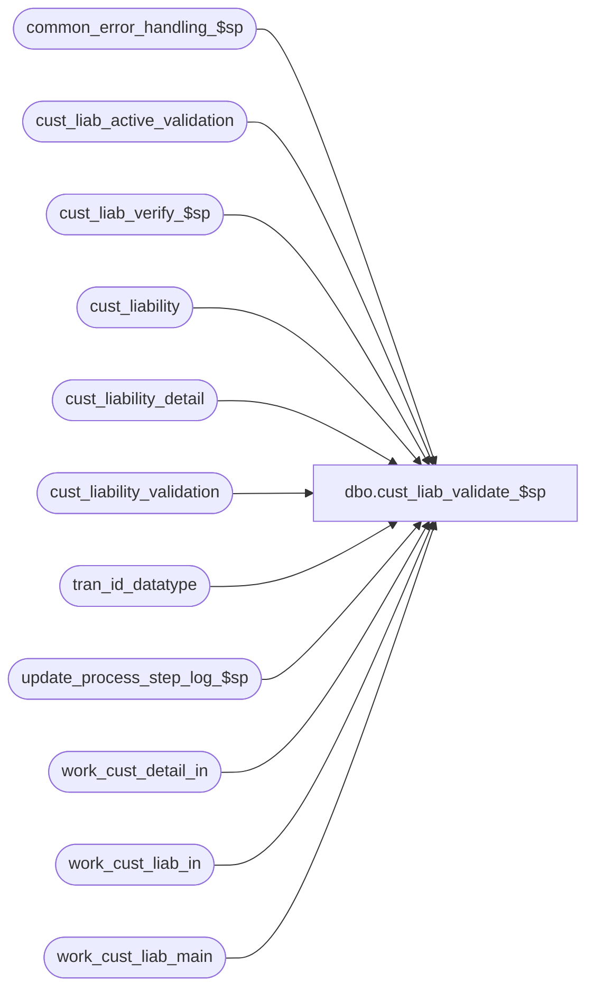

# dbo.cust_liab_validate_$sp

**Database:** auditworks_external  
**Server:** bedrockdb01  

## Architecture Diagram



## Table Dependencies

| Referenced Table |
|---|
| common_error_handling_$sp |
| cust_liab_active_validation |
| cust_liab_verify_$sp |
| cust_liability |
| cust_liability_detail |
| cust_liability_validation |
| tran_id_datatype |
| update_process_step_log_$sp |
| work_cust_detail_in |
| work_cust_liab_in |
| work_cust_liab_main |

## Stored Procedure Code

```sql
create proc dbo.cust_liab_validate_$sp 
@process_id             binary(16),
@user_id		int,
@function_no		smallint = NULL,
@transaction_id		tran_id_datatype = NULL,
@errmsg			nvarchar(255) OUTPUT,
@rejects_exist		int OUTPUT,
@log_error_flag		tinyint = 0,  -- 1 if called by smartload
@edit_process_no 	tinyint = 1  
 
AS

/*
**  Name: cust_liab_validate_$sp
**  Description: Called by cust_liability_edit_$sp.
**               Populates the 'in' amounts and units of work_cust_liab_main
**               and validates the rows based on rules set up in
**               cust_liability_validation and cust_liab_active_validation.
**               Multiple pass is needed to verify whether other transactions
**               are affected by the transactions being rejected.

HISTORY:
DATE      NAME        DEFECT#  DESCRIPTION
Jun05,13  Vicci        144184  For location_store_no update (location_update_flag), handle factor -1 (removal/nullification) 
Oct28,10  Vicci        122141  Handle corrupt import (i.e. one with > 32767 entries for same reference number)
Sep22,10  Paul       1-45QZZV  added process_id to where clause for performance
Oct01,09  Vicci       109078   Handle location update (item reservation) even when not accompanied by an order or fulfillment.
Feb17,09  Vicci       30478    Take into account the fact that certain validations (eg. validation 100) should only be made
                               if an amount has been changed by the modification being validated (as opposed to a comment).
Jun06,08  Paul        97584    apply 1-3Y5VOA to SA5
Oct31,07  Paul        86842    updated comments
Oct25,06  Phu         77931    Fix outer join for SQL 2005 Mode 90.
Sep06,05  Paul        DV-1312  apply 1-1AEKAS to SA5
Apr28,05  Paul        DV-1234  expand transaction_id to use tran_id_datatype
Jan06,05  Paul        DV-1191  added locking hints
Sep23,04  David       DV-1146  Use user_id.
Apr23,04  Maryam      DV-1071  Receive @process_id and pass it to the sub procs.
Jun04,08  Paul        1-3Y5VOA use alias, added nolock hints
May17,05  David       1-1AEKAS Allow flags to increment and decrement instead of going to only 0 or 1.
Oct27,03  David       17189    Performance enhancements
Mar13,03  David C     6683     Make sure @rejects_exist is set if there are any rejects in batch
Feb21,03  Winnie      6207     Create index on work table to increase performance.
FEB17,03  Vicci       6117     Set last_client_activity_date
JUL25,02  David       1-E24RE  Validate reference_no length
MAY10,02  Daphna      1-BMK21  Progress Monitor	for function_no = 4,5,11			
MAR12,02  Daphna      1-BMK21  redefine #temp_invalid_ref table to allow null;
                               include discount_line_object in work_cust_detail_in			         	      
Feb11,02  David C     AW-8415  R3 cust liability

*/

DECLARE @errno				int,
	@message_id			int,
	@object_name			nvarchar(255),
	@operation_name			nvarchar(100),
        @pass				tinyint,
	@process_name			nvarchar(100),
	@process_no 			smallint,
        @rows				int,
        @rows_reject			int

	
SELECT @pass = 1,
       @rejects_exist = 0,
       @process_no = 228,
       @process_name = 'cust_liab_validate_$sp',
       @message_id = 201068

CREATE TABLE #temp_invalid_ref 
	(reference_type		tinyint not null,
	reference_no		nvarchar(20) null,   -- def 1-BMK21
	key_store_no		int not null)

SELECT @errno = @@error
IF @errno !=0 
 BEGIN
   SELECT @errmsg='Failed to create #temp_invalid_ref',
          @object_name = '#temp_invalid_ref',
          @operation_name = 'CREATE'
   GOTO error
 END

DELETE work_cust_liab_in
 WHERE process_id = @process_id

 SELECT @errno = @@error
 IF @errno !=0 
 BEGIN
   SELECT @errmsg='Failed to delete table work_cust_liab_in',
          @object_name = 'work_cust_liab_in',
          @operation_name = 'DELETE'
   GOTO error
 END

DELETE work_cust_detail_in
 WHERE process_id = @process_id

 SELECT @errno = @@error
 IF @errno !=0 
 BEGIN
   SELECT @errmsg='Failed to delete table work_cust_detail_in',
          @object_name = 'work_cust_detail_in',
          @operation_name = 'DELETE'
   GOTO error
 END

INSERT INTO work_cust_liab_in (
	 process_id
	,reference_no
	,reference_type
	,key_store_no
	,liability_amount_in
	,receivable_amount_in
	,amount_3_in
	,amount_4_in
	,amount_5_in
	,amount_6_in
	,amount_7_in
	,amount_8_in
	,amount_9_in
	,amount_10_in
	,stocked_amount_in
	,stocked_flag_in
	,stocked_stolen_flag_in
	,issued_flag_in
	,stolen_from_cust_flag_in
	,forfeited_flag_in
	,entry_count_in          )
 SELECT 	
	@process_id
	,reference_no
	,reference_type
	,key_store_no
	,SUM(liability_amount)
	,SUM(receivable_amount)
	,SUM(amount_3)
	,SUM(amount_4)
	,SUM(amount_5)
	,SUM(amount_6)
	,SUM(amount_7)
	,SUM(amount_8)
	,SUM(amount_9)
	,SUM(amount_10)
	,SUM(stocked_amount)
	,CASE WHEN ABS(SUM(stocked_flag)) > 32766 THEN 9999 ELSE SUM(stocked_flag) END
	,CASE WHEN ABS(SUM(stocked_stolen_flag)) > 32766 THEN 9999 ELSE SUM(stocked_stolen_flag) END
	,CASE WHEN ABS(SUM(issued_flag)) > 32766 THEN 9999 ELSE SUM(issued_flag) END
	,CASE WHEN ABS(SUM(stolen_from_cust_flag)) > 32766 THEN 9999 ELSE SUM(stolen_from_cust_flag) END
	,CASE WHEN ABS(SUM(forfeited_flag)) > 32766 THEN 9999 ELSE SUM(forfeited_flag) END
	,COUNT(line_id)
   FROM work_cust_liab_main WITH (NOLOCK)
  WHERE rejected_status = 0  
    AND reference_no IS NOT NULL --
    AND transaction_void_flag IN (0,8)
    AND process_id = @process_id
  GROUP BY reference_no,
	reference_type,
	key_store_no

  SELECT @errno = @@error
  IF @errno !=0 
  BEGIN
    SELECT @errmsg='Failed to INSERT INTO work_cust_liab_in',
          @object_name = 'work_cust_liab_in',
          @operation_name = 'INSERT'
    GOTO error
  END


INSERT INTO work_cust_detail_in (
	 process_id
	,reference_type
	,reference_no
	,key_store_no
	,line_object
	,upc_no
	,upc_lookup_division
	,discount_line_object
	,amount_outstanding_in
	,units_outstanding_in
	,units_2_in 
	,units_3_in 
	,units_4_in 
	,units_5_in                 )
SELECT 	
	@process_id
	,reference_type
	,reference_no
	,key_store_no
	,line_object
	,upc_no
	,upc_lookup_division
	,discount_line_object
	,SUM(amount_outstanding)
	,SUM(units_outstanding)
	,SUM(units_2)
	,SUM(units_3)
	,SUM(units_4)
	,SUM(units_5)
   FROM work_cust_liab_main WITH (NOLOCK)
  WHERE rejected_status = 0  
    AND reference_no IS NOT NULL --
    AND transaction_void_flag IN (0,8)
    AND process_id = @process_id
    AND (unit_amount_flag = 0 OR location_update_flag <> 0)
  GROUP BY reference_type,
           reference_no,
           key_store_no,
           line_object,
           upc_no,
           upc_lookup_division,
           discount_line_object

SELECT @errno = @@error
IF @errno !=0 
BEGIN
  SELECT @errmsg='Failed to INSERT INTO work_cust_detail_in',
         @object_name = 'work_cust_detail_in',
         @operation_name = 'INSERT'
  GOTO error
END

IF @function_no IN (4,5,11)   -- increment completed workload 
BEGIN
  EXEC update_process_step_log_$sp @function_no, @edit_process_no, 22
  SELECT @errno = @@error
  IF @errno !=0 
  BEGIN
    SELECT @errmsg='first increment of completed workload for step_no 22',
           @object_name = 'update_process_step_log_$sp',
           @operation_name = 'EXECUTE'
    GOTO error
  END
END   --  @function_no IN (4,5)

IF @function_no = 100   --30478
BEGIN
  UPDATE work_cust_liab_main
     SET amount_change = q.amount_change
    FROM (SELECT w.reference_no,
	         w.reference_type,
	         w.key_store_no,
	         w.transaction_id,
	         w.line_action,
	         sum(w.amount) amount_change 
            FROM work_cust_liab_main w
           WHERE w.process_id = @process_id
             AND w.transaction_void_flag in (0, 8)
           GROUP BY w.reference_no,
	            w.reference_type,
	            w.key_store_no,
	            w.transaction_id,
	            w.line_action) q
   WHERE work_cust_liab_main.reference_no = q.reference_no
     AND work_cust_liab_main.reference_type = q.reference_type
     AND work_cust_liab_main.key_store_no = q.key_store_no
     AND work_cust_liab_main.transaction_id = q.transaction_id
     AND work_cust_liab_main.line_action = q.line_action
     AND work_cust_liab_main.process_id = @process_id
  SELECT @errno = @@error
  IF @errno !=0 
  BEGIN
    SELECT @errmsg='Failed to determine if modification resulted in an amount change for the reference number',
           @object_name = 'work_cust_liab_main',
           @operation_name = 'UPDATE'
    GOTO error
  END	            
END

WHILE 1=1 
BEGIN

  UPDATE work_cust_liab_main
     SET pass = @pass
        ,tracking_id = IsNull(cl.tracking_id, wcl.tracking_id)
        ,liability_amount_in  = (w.liability_amount_in - wcl.liability_amount) + ISNULL(cl.liability_amount,0)
	,receivable_amount_in = (w.receivable_amount_in - wcl.receivable_amount) + ISNULL(cl.receivable_amount,0) 
	,amount_3_in = (w.amount_3_in - wcl.amount_3) + ISNULL(cl.amount_3,0)
	,amount_4_in = (w.amount_4_in - wcl.amount_4) + ISNULL(cl.amount_4,0)
	,amount_5_in = (w.amount_5_in - wcl.amount_5) + ISNULL(cl.amount_5,0)
	,amount_6_in = (w.amount_6_in - wcl.amount_6) + ISNULL(cl.amount_6,0)
	,amount_7_in = (w.amount_7_in - wcl.amount_7) + ISNULL(cl.amount_7,0)
	,amount_8_in = (w.amount_8_in - wcl.amount_8) + ISNULL(cl.amount_8,0)
	,amount_9_in = (w.amount_9_in - wcl.amount_9) + ISNULL(cl.amount_9,0)
	,amount_10_in= (w.amount_10_in - wcl.amount_10) + ISNULL(cl.amount_10,0)
        ,stocked_amount_in        = (w.stocked_amount_in - wcl.stocked_amount) + ISNULL(cl.stocked_amount,0)
	,stocked_flag_in          = (w.stocked_flag_in - wcl.stocked_flag) + ISNULL(cl.stocked_flag,0)
	,stocked_stolen_flag_in   = (w.stocked_stolen_flag_in - wcl.stocked_stolen_flag) + ISNULL(cl.stocked_stolen_flag,0)
	,issued_flag_in           = (w.issued_flag_in - wcl.issued_flag) + ISNULL(cl.issued_flag,0)
	,stolen_from_cust_flag_in = (w.stolen_from_cust_flag_in - wcl.stolen_from_cust_flag) + ISNULL(cl.stolen_from_cust_flag,0)
	,forfeited_flag_in        = (w.forfeited_flag_in - wcl.forfeited_flag) + ISNULL(cl.forfeited_flag,0)
	,entry_count_in = (w.entry_count_in - 1) + IsNUll(sign(cl.reference_type),0)
	,assumed_completion_date = cl.assumed_completion_date
	,reopen_date = cl.reopen_date
	,existing_entry = IsNull(sign(cl.reference_type), 0)
  	,last_client_activity_date = cl.last_client_activity_date
   FROM work_cust_liab_in w WITH (INDEX = work_cust_liab_in_x0 NOLOCK)
        INNER JOIN work_cust_liab_main wcl ON (w.reference_no = wcl.reference_no AND w.reference_type = wcl.reference_type
               AND w.key_store_no = wcl.key_store_no AND wcl.process_id = w.process_id)
        LEFT JOIN cust_liability cl WITH (NOLOCK) ON (wcl.reference_no = cl.reference_no
               AND wcl.reference_type = cl.reference_type AND wcl.key_store_no = cl.key_store_no)
  WHERE wcl.rejected_status = 0
    AND wcl.process_id = @process_id
    AND w.process_id = @process_id

  SELECT @errno = @@error
  IF @errno != 0
  BEGIN
    SELECT @errmsg = 'Failed to UPDATE work_cust_liab_main (amounts)',
          @object_name = 'work_cust_liab_main',
          @operation_name = 'UPDATE'
    GOTO error
  END

  UPDATE work_cust_liab_main
     SET pass = @pass
        ,amount_outstanding_in = (w.amount_outstanding_in - wcl.amount_outstanding) + ISNULL(cld.amount_outstanding,0)
        ,units_outstanding_in  = (w.units_outstanding_in  - wcl.units_outstanding ) + ISNULL(cld.units_outstanding,0)
	,units_2_in = (w.units_2_in - wcl.units_2) + ISNULL(cld.units_2,0)
	,units_3_in = (w.units_3_in - wcl.units_3) + ISNULL(cld.units_3,0)
	,units_4_in = (w.units_4_in - wcl.units_4) + ISNULL(cld.units_4,0)
	,units_5_in = (w.units_5_in - wcl.units_5) + ISNULL(cld.units_5,0)
	,existing_detail = IsNull(sign(cld.reference_type),0)
   FROM work_cust_detail_in w WITH (NOLOCK)
   INNER JOIN work_cust_liab_main wcl ON (w.reference_no = wcl.reference_no
                                               AND w.reference_type = wcl.reference_type
                                               AND w.key_store_no = wcl.key_store_no
                                               AND w.line_object = wcl.line_object
                                               AND w.process_id = wcl.process_id
                           AND ISNULL(w.upc_no,-1) = ISNULL(wcl.upc_no,-1)
                                               AND ( w.discount_line_object = wcl.discount_line_object OR 
                                                    (w.discount_line_object IS NULL AND wcl.discount_line_object IS NULL) )
                                               AND ( w.upc_lookup_division = wcl.upc_lookup_division OR 
                                  (w.upc_lookup_division IS NULL AND wcl.upc_lookup_division IS NULL) )
                                              )
    /* outer join to cust_liability_detail in case entry does not already exist */
        LEFT JOIN cust_liability_detail cld ON (wcl.reference_no = cld.reference_no
                                                AND wcl.reference_type = cld.reference_type
                                                AND wcl.key_store_no = cld.key_store_no
                                                AND wcl.line_object = cld.line_object
                                                AND ISNULL(wcl.upc_no,-1) = ISNULL(cld.upc_no,-1)
                                                AND ( wcl.discount_line_object = cld.discount_line_object OR 
                                                     (wcl.discount_line_object IS NULL AND cld.discount_line_object IS NULL) )
                                                AND ( wcl.upc_lookup_division = cld.upc_lookup_division OR 
                                                     (wcl.upc_lookup_division IS NULL AND cld.upc_lookup_division IS NULL) )   
                                            	-- 'OR' needed in case upc_lookup_division is null. 
                                               )
  WHERE wcl.rejected_status = 0
    AND wcl.process_id = @process_id
    AND w.process_id = @process_id

  SELECT @errno = @@error
  IF @errno != 0
 BEGIN
    SELECT @errmsg = 'Failed to UPDATE work_cust_liab_main (units)',
          @object_name = 'work_cust_liab_main',
          @operation_name = 'UPDATE'
    GOTO error
  END

  -- Apply Customer Liability validation rules to transaction lines
  -- cust_liab_populate_$sp has already set rejected_validation_id and rejected_status for null reference numbers
  -- line_action = 0 for voided lines

  UPDATE work_cust_liab_main 
     SET rejected_validation_id = 
        (SELECT ISNULL( MIN( ISNULL(clav.priority_no,0) * 1000 + ISNULL(clav.validation_id,0) ),0 )
           FROM cust_liability_validation clv WITH (NOLOCK), 
                cust_liab_active_validation clav WITH (NOLOCK)
          WHERE w.reference_type = clav.reference_type
            AND w.tracking_id = clav.tracking_id      
            AND w.line_action = clv.line_action 
            AND w.line_object_type = clv.line_object_type
            AND clav.validation_id = clv.validation_id
            AND w.reversal_flag + applicability_code IN (0,1)
            AND (w.amount_change <> 0 OR clv.subject_to_amount_change <> 1)  --30478
            AND ( (w.ref_no_too_long_flag * clv.validation_id BETWEEN 110 AND 113) -- 1-E24RE
                  OR SIGN ( 
             w.amount * include_current_amt + 
             w.liability_amount_in  * liability_amount_factor +
             w.receivable_amount_in * receivable_amount_factor +
             w.amount_3_in * amount_3_factor +
             w.amount_4_in * amount_4_factor +
             w.amount_5_in * amount_5_factor +
             w.amount_6_in * amount_6_factor +
             w.amount_7_in * amount_7_factor +
             w.amount_8_in * amount_8_factor +
             w.amount_9_in * amount_9_factor +
             w.amount_10_in * amount_10_factor +             
             w.stocked_amount_in * stocked_amount_factor +
             SIGN(w.stocked_flag_in)          * stocked_factor +
             SIGN(w.stocked_stolen_flag_in)   * stocked_stolen_factor +
             SIGN(w.issued_flag_in)           * issued_factor +
 SIGN(w.stolen_from_cust_flag_in) * stolen_from_cust_factor +
             SIGN(w.forfeited_flag_in)        * forfeited_factor +
             ISNULL(w.units,0) * include_current_unit +
             w.amount_outstanding_in * amount_outstanding_factor +
             w.units_outstanding_in * units_outstanding_factor +
             w.units_2_in * units_2_factor +
             w.units_3_in * units_3_factor +
             w.units_4_in * units_4_factor +
             w.units_5_in * units_5_factor +
             sign(w.entry_count_in) * entry_count_factor
                      ) IN (sign_to_reject1, sign_to_reject2) ) 
        )
   FROM work_cust_liab_main w
  WHERE rejected_status = 0     
    AND reference_no IS NOT NULL --
    AND transaction_void_flag IN (0,8)
    AND pass = @pass
    AND process_id = @process_id

  SELECT @errno = @@error
  IF @errno != 0
  BEGIN
    SELECT @errmsg = 'Failed to update rejected_validation_id in table work_cust_liab_main.',
          @object_name = 'work_cust_liab_main',
          @operation_name = 'UPDATE'
    GOTO error
  END

  -- Verify for non-numeric characters in reference_no
  EXEC cust_liab_verify_$sp @process_id, @user_id, @pass, @errmsg OUTPUT

  SELECT @errno = @@error
  IF @errno != 0
  BEGIN
    IF @errmsg IS NULL --
      SELECT @errmsg = 'Failed to execute stored proc cust_liab_verify_$sp.'
      
    SELECT @object_name = 'cust_liab_verify_$sp',
           @operation_name = 'EXECUTE'
    GOTO error
  END

  -- Use temp table instead of using IN.
  SELECT DISTINCT transaction_id
    INTO #reject_tran_id
    FROM work_cust_liab_main WITH (INDEX = work_cust_liab_main_x0 NOLOCK)
   WHERE rejected_validation_id  <> 0
     AND process_id = @process_id 
     AND pass = @pass
 
  SELECT @errno = @@error, @rows_reject = @@rowcount
  IF @errno !=0 
  BEGIN
    SELECT @errmsg='Failed to create table #reject_tran_id',
          @object_name = '#reject_tran_id',
          @operation_name = 'CREATE'
    GOTO error
  END

  IF @rows_reject > 0
  BEGIN -- flag all lines of a transaction as rejected when any line has been rejected
     UPDATE work_cust_liab_main
	SET rejected_status = 1,
	    rejected_validation_id = rejected_validation_id%1000,
            pass = @pass
       FROM work_cust_liab_main w, #reject_tran_id r WITH (NOLOCK)
      WHERE rejected_status = 0
	AND process_id = @process_id 
	AND w.transaction_id = r.transaction_id

     SELECT @errno = @@error, @rejects_exist = @rejects_exist + @@rowcount
     IF @errno !=0 
      BEGIN
	SELECT @errmsg='Failed to update status field in work_cust_liab_main.',
		@object_name = 'work_cust_liab_main',
		@operation_name = 'UPDATE'
	GOTO error
      END
  END

  DROP TABLE #reject_tran_id

  IF @rejects_exist > 0
  BEGIN
  
    DELETE work_cust_liab_in
     WHERE process_id = @process_id

    SELECT @errno = @@error
    IF @errno !=0 
    BEGIN
      SELECT @errmsg='Failed to delete table work_cust_liab_in (loop).',
          @object_name = 'work_cust_liab_in',
          @operation_name = 'DELETE'
      GOTO error
    END

    DELETE work_cust_detail_in
     WHERE process_id = @process_id

    SELECT @errno = @@error
    IF @errno !=0 
    BEGIN
   SELECT @errmsg='Failed to delete table work_cust_detail_in (loop).',
          @object_name = 'work_cust_detail_in',
             @operation_name = 'DELETE'
      GOTO error
  END

    TRUNCATE TABLE #temp_invalid_ref
    
    INSERT INTO #temp_invalid_ref
    SELECT DISTINCT reference_type, reference_no, key_store_no
      FROM work_cust_liab_main WITH (NOLOCK)
     WHERE rejected_status = 1 
       AND pass = @pass
       AND process_id = @process_id

    SELECT @errno = @@error
    IF @errno !=0 
    BEGIN
      SELECT @errmsg='Failed to insert into #temp_invalid_ref',
          @object_name = '#temp_invalid_ref',
          @operation_name = 'INSERT'
      GOTO error
    END

    INSERT INTO work_cust_liab_in (
	process_id
	,reference_no
	,reference_type
	,key_store_no
	,liability_amount_in
	,receivable_amount_in
	,amount_3_in
	,amount_4_in
	,amount_5_in
	,amount_6_in
	,amount_7_in
	,amount_8_in
	,amount_9_in
	,amount_10_in
	,stocked_amount_in
	,stocked_flag_in
 	,stocked_stolen_flag_in
	,issued_flag_in
	,stolen_from_cust_flag_in
	,forfeited_flag_in
	,entry_count_in       )
    SELECT 
	@process_id
	,w1.reference_no
	,w1.reference_type
	,w1.key_store_no
	,SUM(w1.liability_amount)
	,SUM(w1.receivable_amount)
	,SUM(w1.amount_3)
	,SUM(w1.amount_4)
	,SUM(w1.amount_5)
	,SUM(w1.amount_6)
	,SUM(w1.amount_7)
	,SUM(w1.amount_8)
	,SUM(w1.amount_9)
	,SUM(w1.amount_10)
	,SUM(w1.stocked_amount)
	,CASE WHEN ABS(SUM(w1.stocked_flag)) > 32766 THEN 9999 ELSE SUM(w1.stocked_flag) END
	,CASE WHEN ABS(SUM(w1.stocked_stolen_flag)) > 32766 THEN 9999 ELSE SUM(w1.stocked_stolen_flag) END
	,CASE WHEN ABS(SUM(w1.issued_flag)) > 32766 THEN 9999 ELSE SUM(w1.issued_flag) END
	,CASE WHEN ABS(SUM(w1.stolen_from_cust_flag)) > 32766 THEN 9999 ELSE SUM(w1.stolen_from_cust_flag) END
	,CASE WHEN ABS(SUM(w1.forfeited_flag)) > 32766 THEN 9999 ELSE SUM(w1.forfeited_flag) END
	,COUNT(line_id)
     FROM work_cust_liab_main w1 WITH (NOLOCK), #temp_invalid_ref t WITH (NOLOCK)
    WHERE rejected_status = 0
      AND transaction_void_flag IN (0,8)  
      AND w1.process_id = @process_id
      AND w1.reference_type = t.reference_type
      AND w1.reference_no = t.reference_no
      AND w1.key_store_no = t.key_store_no
    GROUP BY w1.reference_no,
             w1.reference_type,
             w1.key_store_no

    SELECT @errno = @@error, 
           @rows = @@rowcount
    IF @errno != 0
    BEGIN
      SELECT @errmsg = 'Failed to INSERT INTO work_cust_liab_in (loop)',
          @object_name = 'work_cust_liab_in',
	@operation_name = 'INSERT'
      GOTO error
    END


    INSERT INTO work_cust_detail_in (
	 process_id
	,reference_type
	,reference_no
	,key_store_no
	,line_object
	,upc_no
	,upc_lookup_division
	,discount_line_object
	,amount_outstanding_in
	,units_outstanding_in
	,units_2_in 
	,units_3_in 
	,units_4_in 
	,units_5_in )
    SELECT 
	@process_id
	,w1.reference_type
	,w1.reference_no
	,w1.key_store_no
	,line_object
	,upc_no
	,upc_lookup_division
	,discount_line_object
        ,SUM(amount_outstanding)
	,SUM(units_outstanding)
	,SUM(units_2)
	,SUM(units_3)
	,SUM(units_4)
	,SUM(units_5)
      FROM work_cust_liab_main w1 WITH (NOLOCK), #temp_invalid_ref t WITH (NOLOCK)
     WHERE rejected_status = 0
       AND transaction_void_flag IN (0,8)  
       AND process_id = @process_id
       AND unit_amount_flag = 0
       AND w1.reference_type = t.reference_type
       AND w1.reference_no = t.reference_no
       AND w1.key_store_no = t.key_store_no
     GROUP BY w1.reference_no,
              w1.reference_type,
              w1.key_store_no,
              w1.line_object,
              w1.upc_no,
              w1.upc_lookup_division,
              w1.discount_line_object

    SELECT @errno = @@error, 
           @rows = @rows + @@rowcount
    IF @errno != 0
    BEGIN
      SELECT @errmsg = 'Failed to INSERT INTO work_cust_detail_in (loop)',
          @object_name = 'work_cust_detail_in',
          @operation_name = 'INSERT'
      GOTO error
    END

    IF @rows > 0 
     SELECT @pass = @pass + 1
 ELSE 
     BREAK  --no other rows affected, break from while loop

  END --IF @rejects_exist > 0
   ELSE BREAK --No rejects, break from while loop
    
END /* while 1=1 */

DROP TABLE #temp_invalid_ref

IF @function_no IN (4,5,11)   -- increment completed workload 
BEGIN
  EXEC update_process_step_log_$sp @function_no, @edit_process_no, 22
  SELECT @errno = @@error
  IF @errno !=0 
  BEGIN
    SELECT @errmsg='second increment of completed workload for step_no 22',
           @object_name = 'update_process_step_log_$sp',
           @operation_name = 'EXECUTE'
    GOTO error
  END
END   --  @function_no IN (4,5)


--Defect 6683: Have to set @rejects_exist in case rejected_validation_id 
--             was set in c_l_populate, e.g. id 97.
IF EXISTS (SELECT 1 FROM work_cust_liab_main WITH (NOLOCK)
            WHERE process_id = @process_id
              AND rejected_status > 0)
SELECT @rejects_exist = 1
 
 
-- If both 20 and 30 is rejected for a transaction_id, set 
-- rejected_validation_id=0 for the 30 to avoid dup in if_rejection_reason.
IF @function_no > 5 AND @rejects_exist > 0
BEGIN
  UPDATE work_cust_liab_main
     SET rejected_validation_id = 0
   WHERE interface_control_flag = 30
     AND process_id = @process_id
   AND transaction_id = @transaction_id
     AND line_id IN ( SELECT line_id 
                        FROM work_cust_liab_main WITH (INDEX = work_cust_liab_main_x0 NOLOCK)
                       WHERE interface_control_flag = 20
                         AND rejected_validation_id <> 0
                         AND process_id = @process_id
                         AND transaction_id = @transaction_id ) 
            
  SELECT @errno = @@error
  IF @errno !=0 
  BEGIN
    SELECT @errmsg='Failed to update work_cust_liab_main when both 20 and 30 are rejected',
          @object_name = 'work_cust_liab_main',
          @operation_name = 'UPDATE'
    GOTO error
  END
END --IF @function_no > 5 AND @rejects_exist


RETURN

error:  

	EXEC common_error_handling_$sp @process_no, @errno, @errmsg, 0, @message_id, 
	@process_name, @object_name, @operation_name, @log_error_flag, @edit_process_no,
	0, null, 0, null, null, null, null, null, null, 0, @process_id, @user_id

	RETURN
```

