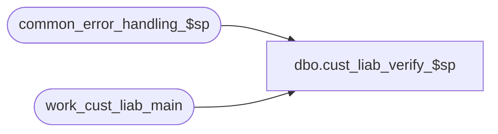

# dbo.cust_liab_verify_$sp

**Database:** auditworks_external  
**Server:** bedrockdb01  

## Architecture Diagram



## Table Dependencies

| Referenced Table |
|---|
| common_error_handling_$sp |
| work_cust_liab_main |

## Stored Procedure Code

```sql
create proc [dbo].[cust_liab_verify_$sp] 
@process_id		binary(16),
@user_id		int,
@pass			tinyint,
@errmsg			nvarchar(255) OUTPUT,
@log_error_flag		tinyint = 0,  -- 1 if called by smartload
@edit_process_no 	tinyint = 1

AS

/*
**  Name:	 cust_liab_verify_$sp
**  Description: Called by cust_liab_validate_$sp.
**               Based on edit_glc_validate_ref_no_$sp.

HISTORY:
DATE      NAME        DEFECT#  DESCRIPTION
Jun06,08  Paul        87777    apply 1-3Y5VOA to SA5
Jan06,05  Paul        DV-1191  added locking hints
Sep23,04  David       DV-1146  Use user_id
Apr23,04  Maryam      DV-1071  Receive @process_id and pass it to the common_error_handling_$sp.
Jun04,08  PaulS      1-3Y5VOA  added process_id to where clause, added nolock hints
Feb13,04  Maryam      23053    remove the update of work_cust_liab_main for reference_no null check as
                               it has been done in cust_liab_populate_$sp.
Mar12,02  David C     1-BMK21  Check for null reference_no separately.
Feb11,02  David C     AW-8415  Verify that numeric reference numbers contain no non-numeric 
				       characters

*/

DECLARE @ascii_value 			smallint,
	@char_position			tinyint,
	@cursor_open 			tinyint,
        @errno				int,
	@message_id			int,
	@object_name			nvarchar(255),
	@operation_name			nvarchar(100),
	@process_name			nvarchar(100),
	@process_no 			smallint,
	@reference_type			tinyint,
        @reference_character 		nvarchar(1),
	@reference_no	 		nvarchar(20),
        @reference_no_length		tinyint,
        @temp_reference_no 		nvarchar(20),
        @temp_id			numeric(12,0)


SELECT @process_no = 228,
       @process_name = 'cust_liab_verify_$sp',
       @message_id = 201068


DECLARE check_ref_no_crsr CURSOR FAST_FORWARD
  FOR
  SELECT temp_id, reference_no, reference_no_length
    FROM work_cust_liab_main WITH (NOLOCK)
   WHERE pass = @pass
     AND process_id = @process_id
     AND rejected_validation_id = 0
     AND interface_control_flag = 10
     AND reference_no_datatype = 'N'

  SELECT @errno = @@error
  IF @errno <> 0
  BEGIN
    SELECT @errmsg = 'Unable to allocate cursor: check_ref_no_crsr',
           @object_name = 'check_ref_no_crsr',
           @operation_name = 'DECLARE'
    GOTO error
  END	   

OPEN check_ref_no_crsr 

  SELECT @errno = @@error
  IF @errno <> 0
  BEGIN
    SELECT @errmsg = 'Unable to OPEN check_ref_no_crsr',
           @object_name = 'check_ref_no_crsr',
           @operation_name = 'OPEN'
    GOTO error
  END	   

SELECT @cursor_open = 1 
  
WHILE  1 = 1
BEGIN
  FETCH check_ref_no_crsr INTO @temp_id, @reference_no, @reference_no_length

  IF @@fetch_status <> 0		-- if no more rows to fetch, break cursor loop 
   BREAK

  SELECT @char_position = 1, 		-- set variables for new pass through search string
         @reference_character = '0'
  
  WHILE @char_position <= @reference_no_length	-- loop through each character in the search string
  BEGIN
    SELECT @reference_character = SUBSTRING(@reference_no, @char_position, 1)
      
    SELECT @ascii_value = ASCII(@reference_character) 
           								
    IF @ascii_value < 48 OR @ascii_value > 57	 -- IF character is NOT numeric ( 0 to 9 )
    BEGIN
      UPDATE work_cust_liab_main
         SET rejected_validation_id = 1025
       WHERE temp_id = @temp_id
         AND process_id = @process_id
         
	SELECT @errno = @@error
	IF @errno <> 0
	BEGIN
	  SELECT @errmsg = 'Unable to update work_cust_liab_main',
                 @object_name = 'work_cust_liab_main',
                 @operation_name = 'UPDATE'
	  GOTO error
	END	   

      SELECT @char_position = 20 -- move to end of search string and loop
    END  -- IF character is NOT numeric (0 to 9)

    SELECT @char_position = @char_position + 1       
  END -- WHILE @char_position <= @reference_no_length

END --WHILE  1 = 1

CLOSE check_ref_no_crsr	
DEALLOCATE check_ref_no_crsr
SELECT @cursor_open = 0 


RETURN

error:				        -- common error handler

  IF @cursor_open = 1
  BEGIN 
    CLOSE check_ref_no_crsr	
    DEALLOCATE check_ref_no_crsr
  END
   
  EXEC common_error_handling_$sp @process_no, @errno, @errmsg, 0, @message_id, 
  @process_name, @object_name, @operation_name, @log_error_flag, @edit_process_no,
	0, null, 0, null, null, null, null, null, null, 0, @process_id, @user_id

  RETURN
```

