# dbo.cust_liability_edit_$sp

**Database:** auditworks_external  
**Server:** bedrockdb01  

## Architecture Diagram

```mermaid
flowchart LR
    SP["dbo.cust_liability_edit_$sp"]
    Ex_Queue(["Ex_Queue"]) --> SP
    ORG_CHN(["ORG_CHN"]) --> SP
    auditworks_system_flag(["auditworks_system_flag"]) --> SP
    common_error_handling__sp(["common_error_handling_$sp"]) --> SP
    cust_liab_clean_date__sp(["cust_liab_clean_date_$sp"]) --> SP
    cust_liab_custinfo__sp(["cust_liab_custinfo_$sp"]) --> SP
    cust_liab_populate__sp(["cust_liab_populate_$sp"]) --> SP
    cust_liab_pos_update__sp(["cust_liab_pos_update_$sp"]) --> SP
    cust_liab_post__sp(["cust_liab_post_$sp"]) --> SP
    cust_liab_reject__sp(["cust_liab_reject_$sp"]) --> SP
    cust_liab_summary__sp(["cust_liab_summary_$sp"]) --> SP
    cust_liab_validate__sp(["cust_liab_validate_$sp"]) --> SP
    cust_liability(["cust_liability"]) --> SP
    cust_liability_detail(["cust_liability_detail"]) --> SP
    cust_liability_revalidate__sp(["cust_liability_revalidate_$sp"]) --> SP
    edit_status(["edit_status"]) --> SP
    function_status(["function_status"]) --> SP
    get_max_serial_no__sp(["get_max_serial_no_$sp"]) --> SP
    if_interface_control_deadlock(["if_interface_control_deadlock"]) --> SP
    if_rejection_applicability(["if_rejection_applicability"]) --> SP
    if_rejection_reason(["if_rejection_reason"]) --> SP
    if_rejection_rule(["if_rejection_rule"]) --> SP
    interface_directory(["interface_directory"]) --> SP
    interface_status(["interface_status"]) --> SP
    parameter_general(["parameter_general"]) --> SP
    process_log(["process_log"]) --> SP
    process_step_log(["process_step_log"]) --> SP
    tran_id_datatype(["tran_id_datatype"]) --> SP
    update_chng_rspns_queue__sp(["update_chng_rspns_queue_$sp"]) --> SP
    update_process_step_log__sp(["update_process_step_log_$sp"]) --> SP
    work_control_interfaces(["work_control_interfaces"]) --> SP
    work_cust_detail_in(["work_cust_detail_in"]) --> SP
    work_cust_liab_custinfo(["work_cust_liab_custinfo"]) --> SP
    work_cust_liab_detail_final(["work_cust_liab_detail_final"]) --> SP
    work_cust_liab_final(["work_cust_liab_final"]) --> SP
    work_cust_liab_in(["work_cust_liab_in"]) --> SP
    work_cust_liab_main(["work_cust_liab_main"]) --> SP
    work_interface_control(["work_interface_control"]) --> SP
```



## Table Dependencies

| Referenced Table |
|---|
| Ex_Queue |
| ORG_CHN |
| auditworks_system_flag |
| common_error_handling_$sp |
| cust_liab_clean_date_$sp |
| cust_liab_custinfo_$sp |
| cust_liab_populate_$sp |
| cust_liab_pos_update_$sp |
| cust_liab_post_$sp |
| cust_liab_reject_$sp |
| cust_liab_summary_$sp |
| cust_liab_validate_$sp |
| cust_liability |
| cust_liability_detail |
| cust_liability_revalidate_$sp |
| edit_status |
| function_status |
| get_max_serial_no_$sp |
| if_interface_control_deadlock |
| if_rejection_applicability |
| if_rejection_reason |
| if_rejection_rule |
| interface_directory |
| interface_status |
| parameter_general |
| process_log |
| process_step_log |
| tran_id_datatype |
| update_chng_rspns_queue_$sp |
| update_process_step_log_$sp |
| work_control_interfaces |
| work_cust_detail_in |
| work_cust_liab_custinfo |
| work_cust_liab_detail_final |
| work_cust_liab_final |
| work_cust_liab_in |
| work_cust_liab_main |
| work_interface_control |

## Stored Procedure Code

```sql
CREATE proc dbo.cust_liability_edit_$sp  @process_id                    binary(16),
 @current_user_id               int,
 @function_no			smallint 	= NULL,
 @transaction_id		tran_id_datatype = NULL,
 @store_no			int 		= NULL,
 @transaction_date		smalldatetime 	= NULL,
 @errmsg			nvarchar(2000) OUTPUT,
 @log_error_flag		tinyint = 0,  -- 1 if called by smartload
 @edit_process_no 		tinyint = 1,
 @allow_saving_if_rejects	tinyint = 0, -- can be 1 when passed in from modify_interface_$sp
 @glc_timestamp			float = NULL -- used to update the number of rows processed

 AS

/* Proc name:   cust_liability_edit_$sp
** Description:
**	This function calls all necessary procs for R3 customer liability.
**	This is called from the edit, modify_interface_$sp, move and delete functions,
**	Parameters received are 
**	Either @function_no and @transaction_id, @function_no = 99 when called by function_cleanup_$sp.
**	Or @function_no, @store_no and @transaction_date,
**	Or only @function_no (when called from Revalidation [78], Conversion [11] OR Edit, phase1 [4], phase2 [5]).
** Function Status: 	 0 - Not started 
			10 - cust_liab_post_$sp done
			20 - cust_liab_summary_$sp done
			30 - cust_liab_reject_$sp done
			40 - updated Ex_Queue and interface_status tables

   Must script with SET ANSI_NULLS ON and SET ANSI_WARNINGS ON

HISTORY
DATE     NAME        DEFECT#  DESC
Apr07,15 Vicci    TFS-114314  When C/L Revalidate fails, its halted process is not released for cleanup because the cust_liability_edit_$sp call
                              from edit_post_$sp is within a try/catch so errors jump straight out to its catch instead of being handled as intended.
                              Therefore call cust_liability_revalidate within a try/catch.
Aug09,13 Vicci        145917  Handle functions 82 and 124 like 150 since they are called by transaction_add_$sp too, and it does prevalidation, i.e.
                              interface_control doesn't get populated until later so work_control_interfaces update to 99 for rejects is needed.
Jun05,13 Vicci        144184  For location_store_no update (location_update_flag), handle factor -1 (removal/nullification) 
Feb07,13 Vicci      1-4A7WED  When recovering a pre-existing MANUAL halted process prior to continuing on with the transactions currently to be processed,
                              i.e. when @exec_again = 1, then when looping back to start, @max_serial_no must be reset, otherwise the second loop
                              finds nothing to process (not an issue for Edits, since for status 0 recoveries for Edit the first loop 
                              would have posted both old and new batch and for status > 0 recoveries the @max_serial_no 
                              doesn't get touched in pass 1) and leaves outstanding entries in Ex_Queue.
                              When called by Edit, do not run revalidation each time a batch trickles in (as happens for those with order-auto-completion for whom phase1
                              runs the C/L posting) since store-date has not been released yet anyways and since results in too much overhead for those 
                              that have large numbers of C/L I/F rejects.
Dec07/12  Vicci       140321  Recognize that any non-zero value of glc_export_used means Do not export (since UI offers option 2 indicating stores
                              are using remote voucher lookup).
Aug03,12 Vicci        137378  Also call the revalidate when order-auto-completion is active (i.e. remove the trickle-audit restriction).
                              Limit revalidation to be executed by stream 1;  for other streams just issue a revalidation request.
Oct05,10 Paul         121478  Only call the revalidate if some transactions were found by the cust_liability_populate
Sep30,10 Paul         120793  Improved error recovery to avoid error 2601 on insert to function_status; set @function_no = @use_function_no.
Sep24,10 Vicci                The exec-again done by the edit was populating function status with the wrong process ID;
			      The call to the cust_liability_revalidate_$sp was passing parameters in the wrong order.
                              Correct datatype of use_process_id (should be binary not int) and correct work_cust_liab_main
          delete to use @use_process_id not @process_id since the former is what was used to 
                              populate it in the first place.
                              Clean up left-behind revalidation entries from work_cust_liab_main.
Sep08,10 Vicci        120764  Determine whether or not it is called by function_cleanup_$sp based on comparing @use_process_id to @process_id.
         		      The fact that a store is configured not to use Voucher Auth does NOT imply that they require
                              a old inter-store-tracking export, so do not set @glc_export_required in that case.
Sep03,10 Paul         119817  removed XACT_ABORT setting, corrected function_status where clause
Aug26,10 Vicci        120520  Set existing detail flag if location_update_flag is on.
Feb04,10 Paul         115308  avoid updating glc_export_used when not needed (avoids updating audit trail)
Jun10,09 Vicci        109078  Do not call revalidate if called from Edit Phase 1 because of order auto-completion 
                              (as opposed to because of trickle audit)
Apr14,09  Paul        108944  corrected error trap, support cross-server views for scaleout
Apr04.07 Daphna      DV-1360  apply 83497, 68317 to SA5
Sep06,05 Paul        DV-1312  apply 44713, 43734 to SA5
May25,05 Paul        DV-1254  use the new values of VCHR_CNFG_TYPE
Apr28,05 Paul        DV-1234  expand transaction_id to use tran_id_datatype
Jan06,05 Paul   DV-1191  Add locking hints
Sep23,04 David       DV-1146  Remove code for conversion, change logic for recovery now that process_id will be unique.
May17,04 David       DV-1071  Use ORG_CHN table instead of store_salesaudit
Feb23,07 Daphna        83497   ensure than cust liab posting called by tran add for transl_err_validation (fn 112) is treated like 
                               transaction_add (fn 150) for pre-validation
May16,06 Daphna        68317  use if_rejection_applicability to determine which validations to perform 
                              (remove references to interface_directory_lookup)
Nov22,04 Daphna        44713  Use IF EXISTS to determine glc_export_used, auditworks_cleandate_used
Nov03,04 Daphna        43734  Remove clause re min/max_serial_no in update of Ex_Queue to 50 
                              to allow update when cleanup of previous failure (prevent double posting)    
Mar05,04 Winnie        24003  Do not call cust_liability_revalidate_$sp if mass delete
Feb13,04 Maryam        23537  make sure @rejects_exist = 1 when reference_no is missing and customer_liablity_check = 0 
                              because you can not track customer liability if there is no reference no
Nov07,03 David         17761  Make sure process_id is set in if_rejection_reason when doing mass-delete.
Oct27,03 David         17189  Revalidation not being done by store/date anymore. Changed batching method.
Sep15,03 ShuZ        1-G7A5F  Remove all references to the interface_directory ... _check
                              fields from stored procedures/triggers and replace with usage 
           of if_rejection_applicability table.
Jun30,03 David   10794/10935  Set existing detail when allow_saving_if_rejects = 9
Feb17,03 Vicci          6117  Set last_client_activity_date
Feb04,03 Winnie         5843  Do not prevent moving if reversals generate i/f rejects.
Dec20,02 Winnie	     1-FXRSE  Do not allow to save archive transaction if if-reject exists.
Nov07,02 David       1-FXRSE  Let tranx be saved if coming from archived transation modification.
Sep27,02 David       1-FKYLN  Use allow_saving_if_rejects to decide whether to let a tranx be saved.
Jun27,02 David       1-DW0JH  Let modified tranx be saved when tranx was if-rejected before.
Jun10,02 Daphna      1-CYE1P  Set Voucher Export to run when glc_postable_used = 2	 
May10,02 Daphna      1-BMK21  Process step log only when called by Edit and Edit Phase 2,
                              and Conversion,  truncate tables for conversion.
                              Update process_id in if_rejection_reason for mass-delete.
Feb11,02 David C     AW-8415  Version with code.
Dec04,01 David C     1-9ATXP  Add process_id as in param AND new error handling.
Aug07,01 David C        8470  Set default for input parameters to NULL
Aug03,01 David C        8462  Foundation for R3 Customer Liability

*/

DECLARE
@batch_size					int,
@customer_liability_check			tinyint,
@entry_date					smalldatetime,
@errno						int,
@errmsg2					nvarchar(2000), 
@exec_again					tinyint, 
@expected_workload				int,
@glc_export_used				tinyint,
@glc_postable_used				tinyint,
@inserted_rows					int,
@interface_voided_transactions			tinyint,
@lock_by_spid					int,
@max_serial_no					numeric(14,0),
@message_id					int,
@memo1						nvarchar(50),
@memo2						nvarchar(50),
@min_serial_no					numeric(14,0),
@object_name					nvarchar(255),
@operation_name					nvarchar(100),
@process_name					nvarchar(100),
@process_no 					smallint,
@recovery_flag					int,
@rejects_exist					int,
@retry						int,
@rowcount					int,
@rows						int,
@status						tinyint,
@tran_count					int,
@trickle_polling_flag				tinyint,
@update_timing					smallint,
@use_function_no				smallint,
@use_process_id					binary(16),
@use_store_no					int,
@use_transaction_date				smalldatetime,
@use_transaction_id				tran_id_datatype,
@user_id					int;

SELECT @rows = 0,
       @process_no = 228, 
       @process_name = 'cust_liability_edit_$sp',
       @message_id = 201068,
       @memo1 = '',
       @memo2 = '',
       @operation_name = 'SELECT',
       @expected_workload = 0,
       @rejects_exist = 0,
       @customer_liability_check = 0,
       @batch_size = 7500,
       @tran_count = 0;

BEGIN TRY

SELECT @errmsg = 'Failed to get update_timing from interface_directory. ',
       @object_name = 'interface_directory';
SELECT @update_timing = update_timing,
       @interface_voided_transactions = interface_voided_transactions
  FROM interface_directory
 WHERE interface_id = 28; 
 
IF IsNull(@update_timing,0) = 0
  RETURN;

SELECT @errmsg = 'Failed to determine if validations active. ',
       @object_name = 'if_rejection_applicability';
IF EXISTS ( SELECT ia.interface_id
                FROM if_rejection_rule ir, if_rejection_applicability ia
               WHERE ir.if_rejection_reason = 100  -- customer liability validation
                 AND ISNULL(ir.active_rejection_rule,1) = 1 
                 AND ir.if_rejection_reason = ia.if_reject_reason)
  SELECT @customer_liability_check   = 1; 
 
IF @transaction_id IS NULL AND @function_no > 5 
   AND @function_no != 78 --revalidation
   AND (@store_no IS NULL OR @transaction_date IS NULL)
BEGIN
  SELECT @errmsg = 'Manual functions must pass transaction_id OR store_no/transaction_date.  ',
         @errno = 201510, 
         @message_id = 201510;
  GOTO general_error;
END

SELECT @errmsg = 'Failed to determine if voucher lookup from POS used. ',
       @object_name = 'parameter_general';
SELECT @glc_postable_used = glc_postable_used,
       @trickle_polling_flag = COALESCE(trickle_polling_flag,0)
  FROM parameter_general;  
SELECT @rows = @@rowcount;
IF @rows = 0
BEGIN
  GOTO general_error;
END

-- determine if any stores are online (defect 115308)
SELECT @glc_export_used = 0;
SELECT @errmsg = 'Failed to determine if POS does remote voucher postings. ',
       @object_name = 'ORG_CHN';
IF EXISTS(SELECT 1
          FROM ORG_CHN
          WHERE VCHR_CNFG_TYPE = 'RMT')
  SELECT @glc_export_used = 1;

SELECT @errmsg = 'Failed to auto-correct clean-date-used parameter setting. ',
       @object_name = 'auditworks_system_flag',
       @operation_name = 'UPDATE';
UPDATE auditworks_system_flag
   SET flag_numeric_value = @glc_export_used
 WHERE flag_name = 'auditworks_cleandate_used'   
   AND (flag_numeric_value <> @glc_export_used OR flag_numeric_value IS NULL);

-- determine if any stores are offline
SELECT @glc_export_used = 0;
SELECT @errmsg = 'Failed to determine if any stores require the voucher file to be exported to give them a local copy. ',
       @object_name = 'ORG_CHN',
       @operation_name = 'SELECT';
IF EXISTS(SELECT 1
          FROM ORG_CHN
          WHERE VCHR_CNFG_TYPE = 'LCL')
  SELECT @glc_export_used = 1;

-- turn on parameter only if not already on to minimize trigger firing and updating audit trail.
-- should only be on when using exports to PC register
-- Note:  TM values 0 and 2 are equivalent.  They both mean do not export.
SELECT @errmsg = 'Failed to auto-correct glc-export-used parameter setting. ',
       @object_name = 'parameter_general',
       @operation_name = 'UPDATE';
UPDATE parameter_general
   SET glc_export_used = @glc_export_used
 WHERE (glc_export_used = 1 AND @glc_export_used <> 1)
    OR (glc_export_used <> 1 AND @glc_export_used = 1)
    OR glc_export_used IS NULL;
  
/* Possible scenarios where row alreadty exists in function_status for function_no 228
   due to a previously aborted function or edit :

A: If coming from function_cleanup_$sp, 
     then roll_forward using function_status.process_id.

B: If current process is Edit and original function_no was also Edit,
     then roll_forward using function_status.process_id and 
     then try processing again using current process_id.  
     Note: the 2nd pass will find nothing to process unless the status of the halted process was > 0.  
     Otherwise the 1st pass will have started over and picked up all edit transactions.
     
C: If current process is Edit and original function_no was Manual (except 99),
     then process only current process_id (no possibility of process_id re-use between Edit and Manual since guid assigned on login so C is not possible).

D: If current process is Manual (except 99) and original function_no was Edit,
     then process only current process_id (no possibility of process_id re-use between Edit and Manual since guid assigned on login so D is not possible).

E: If current process is Manual (except 99) and original function_no was Manual,
     then then roll_forward using function_status.process_id and 
     then try processing again using current process_id.
     Handles possible scenarios where process_id guid was re-used by frontend. 

*/

--The following will return a row for scenario A and B. If no row found then @use_process_id IS NULL

/* @recovery_flag values:
     1 = exact match on @process_id, i.e. called from function_cleanup_$sp, or possible scenarios where process_id guid was re-used by frontend
   999 = detected halted C/L that were started by the edit */


/* First, check for recovery scenario (also detects when called by function_cleanup_$sp).
   Only one row can exist for one @process_id due to the x1 index */

start_process:  
  SELECT @exec_again = 0,
         @status = 0,
         @user_id = @current_user_id,
         @max_serial_no = 0;

SELECT @errmsg = 'Failed to check whether C/L recovery required. ',
       @object_name = 'function_status',
       @operation_name = 'SELECT';
SELECT @status = status,
       @user_id = user_id,
       @use_function_no = date_reject_id,
       @use_transaction_id = transaction_id,
       @use_store_no = store_no,
       @use_transaction_date = transaction_date,
       @use_process_id = process_id
  FROM function_status
 WHERE function_no = 228
   AND process_id = @process_id; -- should only be true if called from function_cleanup_$sp (Note:  the latter does not clean up edits) or user moved on to another store/date/transaction without recovering prior halt.
SELECT @recovery_flag = SIGN(@@rowcount);

/* Then check for any halted CL posting processes that were called by the edit phase1 or phase2 */
IF @recovery_flag = 0 AND @function_no IN (4,5)
BEGIN
  SELECT @errmsg = 'Failed to determine first failed C/L posting to be recovered. ';
  SELECT @entry_date = MIN(entry_date)
    FROM function_status
   WHERE function_no = 228
     AND date_reject_id IN (4,5);

  SELECT @errmsg = 'Failed to determine status of first failed C/L posting to be recovered. ';
  SELECT @status = status,
	 @user_id = user_id,
	 @use_function_no = date_reject_id,
	 @use_transaction_id = transaction_id,
	 @use_store_no = store_no,
	 @use_transaction_date = transaction_date,
	 @use_process_id = process_id
    FROM function_status
   WHERE function_no = 228
     AND date_reject_id IN (4,5)
     AND entry_date = @entry_date;
  SELECT @rows = @@rowcount;

  IF @rows > 0
    SELECT @recovery_flag = 999;
END; --IF @recovery_flag = 0 AND @function_no IN (4,5)

IF @recovery_flag > 0 AND @function_no <> 99 -- not called by function_cleanup_$sp
BEGIN
  SELECT @exec_again = 1
  
  SELECT @errmsg = 'Failed to lock row for already existing function_status. ',
         @operation_name = 'UPDATE';
  UPDATE function_status
     SET lock_flag = 1, 
         lock_by_spid = @process_id, 
         lock_by_user_id = @current_user_id
   WHERE process_id  = @use_process_id
     AND function_no = @process_no;  --228
END;

IF @recovery_flag = 0
BEGIN
    SELECT @errmsg = 'Failed to insert 228 into function_status. ',
           @operation_name = 'INSERT';
    INSERT function_status (
	user_id,
	process_id,
	function_no,
	status,
	entry_date,
	transaction_id,
	store_no,
	transaction_date,
	date_reject_id ) -- represents calling function_no (edit, manual functions etc)
    VALUES (
	@user_id,
	@process_id,
	228,
	@status,
	getdate(),
	@transaction_id,
	@store_no,
	@transaction_date,
	@function_no );

    SELECT @use_transaction_id   = @transaction_id,
           @use_store_no         = @store_no,
           @use_transaction_date = @transaction_date,
           @use_function_no      = @function_no,
           @use_process_id       = @process_id,
           @status               = 0;
END; -- If @recovery_flag = 0 

IF @function_no IN (4,5) -- edit phase 1, 2
BEGIN 
  SELECT @expected_workload = 1  
 
   -- to initialize step log
  SELECT @errmsg = 'Initialize step log for Cust Liability Edit.  ',
         @operation_name = 'EXECUTE',
         @object_name = 'update_process_step_log_$sp';
  EXEC update_process_step_log_$sp @function_no, @edit_process_no, 0, @expected_workload, 0;
END;  -- @function_no in (4,5)

WHILE 1 = 1
BEGIN
  SELECT @inserted_rows = 0;

  IF @status = 0
  BEGIN
    SELECT @errmsg = 'SET process_step_no = 21.  ',
           @operation_name = 'UPDATE',
           @object_name = 'process_step_log';
    UPDATE process_step_log
       SET process_step_no = 21,
           process_step_start_time = getdate()
     WHERE process_no = @function_no
       AND stream_no =  @edit_process_no;

    -- 17189
    SELECT @errmsg = 'Unable to select serial_no from Ex_Queue.  ',
           @operation_name = 'SELECT',
           @object_name = 'Ex_Queue';
    SELECT @min_serial_no = MIN(serial_no)
      FROM Ex_Queue
     WHERE queue_id = 28
       AND key_2  < 49 -- interface_control_flag
       AND serial_no > @max_serial_no;

    IF @min_serial_no IS NULL 
      BREAK;

    -- If mass-delete, make sure all transactions are in the same batch.
    IF @use_function_no = 40 
      SELECT @batch_size = 99999999;

    SELECT @errmsg = 'Unable to exec get_max_serial_no_$sp.  ',
           @object_name = 'get_max_serial_no_$sp',
           @operation_name = 'EXECUTE';
    EXEC get_max_serial_no_$sp 28, @min_serial_no, @batch_size, @max_serial_no OUTPUT;

    IF @max_serial_no = 0
      BREAK;

    SELECT @errmsg = 'Failed to execute cust_liab_populate_$sp.  ',
           @object_name = 'cust_liab_populate_$sp';
    EXEC cust_liab_populate_$sp @use_process_id, @user_id, @use_function_no, @use_transaction_id, @use_store_no, @use_transaction_date,
                                @inserted_rows OUTPUT, @errmsg OUTPUT, @log_error_flag, @edit_process_no,
                                @min_serial_no, @max_serial_no;
  END; --IF @status = 0

  SELECT @tran_count = @tran_count + @inserted_rows;

  IF @inserted_rows >= 1 OR @status > 0 -- if there were rows populated or recovering from halted process (status > 0)
  BEGIN

    IF @status = 0 
    BEGIN
      /* validate entries */
      SELECT @rejects_exist = 0 --initialize

      IF @customer_liability_check > 0 AND @allow_saving_if_rejects != 9
      BEGIN
        SELECT @errmsg = 'SET process_step_no = 22.  ',
               @operation_name = 'UPDATE',
               @object_name = 'process_step_log';
        UPDATE process_step_log
           SET process_step_no = 22,
               process_step_start_time = getdate()
         WHERE process_no = @function_no
           AND stream_no =  @edit_process_no;

        SELECT @errmsg = 'Failed to execute cust_liab_validate_$sp.  ',
               @operation_name = 'EXECUTE',
               @object_name = 'cust_liab_validate_$sp';
        EXEC cust_liab_validate_$sp @use_process_id, @user_id, @use_function_no, @use_transaction_id, @errmsg OUTPUT, 
                                  @rejects_exist OUTPUT, @log_error_flag, @edit_process_no;
      END;  --IF @customer_liability_check > 0 AND @allow_saving_if_rejects != 9

      --Defect 10794: Since we do not validate on a Move Out, need to set existing flags manually.
      IF @customer_liability_check = 0 OR @interface_voided_transactions = 1 OR @allow_saving_if_rejects = 9
      BEGIN
        SELECT @errmsg = 'Failed to update existing_entry in work_cust_liab_main',
               @object_name = 'work_cust_liab_main',
               @operation_name = 'UPDATE';
        UPDATE work_cust_liab_main
           SET existing_entry = 1, last_client_activity_date = c.last_client_activity_date
          FROM cust_liability c, work_cust_liab_main w WITH (NOLOCK)
         WHERE c.reference_type = w.reference_type
           AND c.reference_no = w.reference_no
           AND c.key_store_no = w.key_store_no
           AND w.process_id = @use_process_id
           AND w.rejected_status = 0
           AND w.existing_entry IS NULL;

        SELECT @errmsg = 'Failed to update existing_detail in work_cust_liab_main';
        UPDATE work_cust_liab_main
           SET existing_detail = 1
          FROM cust_liability_detail c, work_cust_liab_main w
         WHERE c.reference_type = w.reference_type
           AND c.reference_no = w.reference_no
           AND c.key_store_no = w.key_store_no
           AND c.line_object = w.line_object
           AND ISNULL(c.upc_no,-1) = ISNULL(w.upc_no,-1)
           AND (c.upc_lookup_division = w.upc_lookup_division 
	        OR (c.upc_lookup_division IS NULL AND w.upc_lookup_division IS NULL))
           AND ISNULL(c.discount_line_object,-1) = ISNULL(w.discount_line_object,-1)
           AND w.process_id = @use_process_id
           AND w.rejected_status = 0
           AND (w.unit_amount_flag = 0 OR location_update_flag <> 0)
           AND w.existing_entry = 1
           AND w.existing_detail IS NULL;

        --Have to set @rejects_exist in case rejected_validation_id was set in c_l_populate
        SELECT @errmsg = 'Failed to rejects exist in work_cust_liab_main',
               @operation_name = 'SELECT';
        IF EXISTS (SELECT 1 FROM work_cust_liab_main WITH (NOLOCK)
                    WHERE process_id = @use_process_id
                      AND rejected_status > 0)
          SELECT @rejects_exist = 1;
      END; -- IF @customer_liability_check = 0 OR @interface_voided_transactions = 1 OR @allow_saving_if_rejects = 9

      IF @use_function_no != 40 OR @rejects_exist = 0 --Do not post anything if mass deleting will be prevented.
      BEGIN
        SELECT @errmsg = 'SET process_step_no = 5.  ',
               @operation_name = 'UPDATE',
               @object_name = 'process_step_log';
        UPDATE process_step_log
           SET process_step_no = 5,
               process_step_start_time = getdate()
         WHERE process_no = @function_no
           AND stream_no =  @edit_process_no;

        /* update customer information*/
        SELECT @errmsg = 'Failed to execute cust_liab_custinfo_$sp.  ',
               @operation_name = 'EXECUTE',
               @object_name = 'cust_liab_custinfo_$sp';
        EXEC cust_liab_custinfo_$sp @use_process_id, @user_id, @use_function_no, @errmsg OUTPUT, 
                                    @log_error_flag, @edit_process_no;
      
        SELECT @errmsg = 'SET process_step_no = 23.  ',
               @operation_name = 'UPDATE',
               @object_name = 'process_step_log';
        UPDATE process_step_log
           SET process_step_no = 23,
               process_step_start_time = getdate()
         WHERE process_no = @function_no
           AND stream_no =  @edit_process_no;

        SELECT @errmsg = 'Failed to execute cust_liab_post_$sp.  ',
               @operation_name = 'EXECUTE',
               @object_name = 'cust_liab_post_$sp';
        EXEC cust_liab_post_$sp @use_process_id, @user_id, @use_function_no, @errmsg OUTPUT, 
                                @log_error_flag, @edit_process_no;
      END; --IF @use_function_no != 40 OR @rejects_exist = 0

      SELECT @status = 10;
    END; --IF @status = 0 

    IF @status = 10
    BEGIN

      IF @use_function_no != 40 OR @rejects_exist = 0 --Do not post anything if mass deleting will be prevented.
      BEGIN
        SELECT @errmsg = 'SET process_step_no = 67.  ',
               @operation_name = 'UPDATE',
               @object_name = 'process_step_log';
        UPDATE process_step_log
           SET process_step_no = 67,
               process_step_start_time = getdate()
         WHERE process_no = @function_no
           AND stream_no =  @edit_process_no;

        /* Summary */
        SELECT @errmsg = 'Failed to execute cust_liab_summary_$sp.  ',
               @operation_name = 'EXECUTE',
               @object_name = 'cust_liab_summary_$sp';
        EXEC cust_liab_summary_$sp @use_process_id, @user_id, @use_function_no, @errmsg OUTPUT,
                                   @log_error_flag, @edit_process_no;
      END; --IF @use_function_no != 40 OR @rejects_exist = 0

      SELECT @status = 20;
    END; --IF @status = 10
  
    /* Create rejections */
  IF @status = 20
    BEGIN
      IF @rejects_exist > 0
      BEGIN
        SELECT @errmsg = 'SET process_step_no = 24.  ',
               @operation_name = 'UPDATE',
               @object_name = 'process_step_log';
        UPDATE process_step_log
           SET process_step_no = 24,
               process_step_start_time = getdate()
         WHERE process_no = @function_no
           AND stream_no =  @edit_process_no;
    
        SELECT @errmsg = 'Failed to execute cust_liab_reject_$sp.  ',
               @operation_name = 'EXECUTE',
               @object_name = 'cust_liab_reject_$sp';
        EXEC cust_liab_reject_$sp @use_process_id, @user_id, @errmsg OUTPUT, @log_error_flag, 
                     @edit_process_no, @use_function_no;
      END;  --IF @rejects_exist > 0

      ELSE --no rejects
      BEGIN
        SELECT @errmsg='Cannot set status = 30.  ',
               @object_name = 'function_status',
               @operation_name = 'UPDATE';
        UPDATE function_status
           SET status = 30
         WHERE process_id = @use_process_id
           AND function_no = @process_no;
      END; --ELSE of IF @rejects_exist > 0
        
      SELECT @status = 30;
    END; --IF @status = 20  

    IF @status = 30
    BEGIN
    
      BEGIN TRANSACTION;

      --simulate table lock on if_interface_control
      --reduces deadlocking with interface posting programs 
      SELECT @errmsg='Cannot update if_interface_control_deadlock.  ',
             @object_name = 'if_interface_control_deadlock',
             @operation_name = 'UPDATE';
      UPDATE if_interface_control_deadlock
         SET function_no = 228,
             status_date = getdate();

      /* flag if_interface_control trans as processed */
      SELECT @errmsg='Cannot update if_interface_control with posted status.  ',
             @object_name = 'Ex_Queue';
      UPDATE Ex_Queue
         SET key_2 = 50,
             key_10 = getdate()
        FROM Ex_Queue x, work_cust_liab_main w WITH (NOLOCK)
       WHERE x.queue_id = 28
         AND x.key_1 = w.if_entry_no
         AND w.process_id = @use_process_id

      SELECT @errmsg='Cannot set status = 40.  ',
             @object_name = 'function_status';
      UPDATE function_status
         SET status = 40
       WHERE process_id = @use_process_id
         AND function_no = @process_no;

      COMMIT TRANSACTION;

      /* update last retrieval date for all interfaces affected */
        SELECT @errmsg='Cannot update interface_status to indicate process completed.  ',
               @object_name = 'interface_status';
      UPDATE interface_status
         SET last_retrieval_datetime = getdate()
       WHERE interface_id = 28;
    END; --IF @status = 30
          
    IF @use_function_no <> 78
    BEGIN
      SELECT @errmsg = 'Failed to indicate that new postings to C/L have been made and that the revalidation should therefore be run.  ',
             @object_name = 'edit_status',
             @operation_name = 'UPDATE';
      UPDATE edit_status
         SET edit_status = 1  	  --C/L revalidation outstanding
       WHERE edit_process_no = 1    --always set for stream 1 regardless of what stream posted to C/L
         AND edit_function_no = 78  --C/L revalidation
         AND edit_status <> 1;
    END;  --IF @use_function_no <> 78
  END;  --IF @inserted_rows >= 1 OR @status > 0

  -- ELSE set step_log = completed
  SELECT @status = 0;
END;  /* WHILE 1 = 1 */    

SELECT @errmsg='Failed to update process_log tran_count.  ',
       @object_name = 'process_log',
       @operation_name = 'UPDATE';
UPDATE process_log
   SET transaction_count = @tran_count
 WHERE process_timestamp = @glc_timestamp
   AND process_no = 15;

/* cleanup work tables */        
SELECT @errmsg='Failed to delete work_cust_liab_final.  ',
       @object_name = 'work_cust_liab_final',
       @operation_name = 'DELETE';
DELETE work_cust_liab_final
 WHERE process_id = @use_process_id;

SELECT @errmsg='Failed to delete work_cust_liab_detail_final.  ',
       @object_name = 'work_cust_liab_detail_final';
DELETE work_cust_liab_detail_final
 WHERE process_id = @use_process_id

SELECT @errmsg='Failed to delete work_cust_liab_custinfo.  ',
       @object_name = 'work_cust_liab_custinfo';
DELETE work_cust_liab_custinfo
 WHERE process_id = @use_process_id;

SELECT @errmsg='Failed to delete work_cust_liab_in.  ',
       @object_name = 'work_cust_liab_in';
DELETE work_cust_liab_in
 WHERE process_id = @use_process_id;
 
SELECT @errmsg='Failed to delete work_cust_detail_in.  ',
       @object_name = 'work_cust_detail_in';
DELETE work_cust_detail_in
 WHERE process_id = @use_process_id;

/* If pre-validation then return message_id */
  -- include function 112 verify transl error
IF @use_function_no IN (35,40,100,102,110,112,150,154, 82, 124) AND @rejects_exist <> 0  --must be done before work_cust_liab_main gets cleaned up for the process_id by the pop of the second pass...
                         --it looks at use_function_no, not function_no since it should happen for 99 too, no?
BEGIN
  -- If mass-delete, set process_id in if_rejection_reason to indicate 
  -- function_cleanup_$sp which if_rejects to cleanup.
  IF @function_no = 40
  BEGIN 
    SELECT @errmsg='Failed to set process_id.  ',
           @object_name = 'if_rejection_reason',
           @operation_name = 'UPDATE';
    UPDATE if_rejection_reason
       SET process_id = @use_process_id
      FROM work_cust_liab_main w WITH (NOLOCK), if_rejection_reason r
     WHERE w.transaction_id = r.transaction_id
       AND w.line_id = r.line_id
       AND CONVERT(nvarchar,w.rejected_validation_id) = r.memo1
       AND if_reject_reason = 100
       AND w.rejected_validation_id != 0
       AND w.function_no IN (40, 78) 
       AND w.process_id = @use_process_id;
  END; -- if @function_no = 40

-- transaction_add_$sp uses this work table to update interface_control
  SELECT @errmsg='Failed to update work_control_interfaces.  ',
         @object_name = 'work_control_interfaces',
         @operation_name = 'UPDATE';
  UPDATE work_control_interfaces
     SET interface_control_flag = 99
   WHERE process_id = @use_process_id
     AND interface_id = 28;

 -- If transaction is being if-rejected then prevent it from being saved EXCEPT
  -- if function_no is Transaction Add OR transaction was SA rejected OR already IF rejected before.
  SELECT @errmsg='Failed to determine if C/L rejects exist.  ',
         @object_name = 'work_interface_control',
         @operation_name = 'SELECT';
  IF @function_no NOT IN (150) AND @allow_saving_if_rejects = 0 -- 1-FKYLN, 1-FXRSE
  AND NOT EXISTS (SELECT 1 FROM work_interface_control
		   WHERE process_id = @use_process_id
		     AND original_transaction_id = @use_transaction_id
		     AND interface_id = 28
		     AND interface_status_flag = 99)
  BEGIN 
    SELECT @errmsg='Failed to delete work_cust_liab_main.  ',
           @object_name = 'work_cust_liab_main',
           @operation_name = 'DELETE';
    DELETE work_cust_liab_main
     WHERE process_id = @use_process_id;  --Note:  for manual functions to be in recovery mode, the @use_process_id and @process_id must be the same.

    --cust_liability_revalidate_$sp has its own function_status
    SELECT @errmsg='Failed to delete function_status.  ',
           @object_name = 'function_status',
           @operation_name = 'DELETE';
    DELETE function_status
     WHERE function_no = 228
       AND process_id = @use_process_id;
    
    SELECT @errno = 201648,
           @message_id = 201648,
           @errmsg = 'Customer Liability failed validation';
    GOTO general_error;
  END; 
END;  -- if @function_no IN (35 ...

SELECT @errmsg='Failed to delete work_cust_liab_main.  ',
       @object_name = 'work_cust_liab_main',
       @operation_name = 'DELETE';
DELETE work_cust_liab_main
 WHERE process_id = @use_process_id;

--cust_liability_revalidate_$sp has its own function_status
SELECT @errmsg='Failed to delete function_status.  ',
       @object_name = 'function_status';
DELETE function_status
 WHERE function_no = 228
   AND process_id = @use_process_id;

IF @exec_again = 1
BEGIN -- loop again to post current transactions after recovery has finished

  --1-4A7WED  --This is done in case after a C/L failure during a Trans Mod, the use moves on and modifies a different transaction that also has C/L in it causing the old C/L failure to get recovered...
  SELECT @errmsg='Failed to determine prior failure for same user/spid is outstanding.  ',
         @object_name = 'function_status',
         @operation_name = 'SELECT';
  IF @use_function_no IN (100, 101) AND 
     EXISTS ( SELECT 1 FROM function_status 
    	       WHERE function_no = @use_function_no 
    	       AND transaction_id = @use_transaction_id
    	       AND process_id = @use_process_id
    	       AND status < 10)
     --i.e. Transaction modify failed because C/L posting failed, so its status must be bumped to show that C/L posting has now gone through.
  BEGIN
    SELECT @errmsg = 'Failed to set status to 10 for Transaction Modify following C/L posting cleanup.  ',
           @object_name = 'function_status',
           @operation_name = 'UPDATE';
    UPDATE function_status
       SET status = 10	--Status 10 for Transaction Modify entry indicates C/L posting completed
     WHERE process_id = @use_process_id
       AND function_no = @use_function_no
       AND transaction_id = @use_transaction_id
       AND status < 10
  END;  --IF EXISTS ( SELECT 1 FROM function_status WHERE function_no = @use_function_no for same transaction
  
  GOTO start_process;
END; --IF @exec_again = 1


-- If called from phase2 (or by phase 1 when using trickle auditing -note, also called by phase1 for those with order-autocompletion), 
-- then revalidate the rejected transactions in case rejects were caused by timing scenarios due to transactions being processed in other edit batches.

IF @function_no = 5 OR (@function_no = 4 AND @trickle_polling_flag >= 2)
BEGIN

  -- If any new cust liability tran were processed since the last time the revalidation was run by the Edit, 
  -- then revalidate in case the new trans will allow fixing other i/f rejects
  -- Note that @tran_count cannot be used since the new C/L postings may have made on a previous Phase 1 run in the cause of order auto-completion
  SELECT @errmsg = 'Failed to determine if C/L posting occurred.  ',
         @object_name = 'edit_status',
         @operation_name = 'SELECT';
  IF EXISTS (SELECT 1 FROM edit_status WHERE edit_process_no = 1 AND edit_status = 1 AND edit_function_no = 78)  --i.e. C/L posted since last time revalidation run by Edit
  BEGIN
  
    IF @edit_process_no = 1  --Note:  will always be 1 since a dummy version of this proc gets installed in the streams database.
    BEGIN
      SELECT @expected_workload = 4
      SELECT @errmsg = 'to insert new step 68 with expected workload.  ',
             @operation_name = 'EXECUTE',
             @object_name = 'update_process_step_log_$sp';
      EXEC update_process_step_log_$sp @function_no,  @edit_process_no, 68, @expected_workload, 0

      SELECT @errmsg = 'Failed to execute stored proc cust_liability_revalidate_$sp.  ',
             @object_name = 'cust_liability_revalidate_$sp';
      BEGIN TRY
        EXEC cust_liability_revalidate_$sp @process_id, @user_id, @function_no, null, @log_error_flag, @edit_process_no
      END TRY
      BEGIN CATCH
	UPDATE function_status
	   SET released_to_cleanup = 1
	 WHERE function_no = 78
	   AND process_id = @process_id
	   AND user_id = @user_id;
	GOTO general_error;
      END CATCH;

      SELECT @errmsg = 'Failed to indicate that the revalidation has been run.  ',
             @object_name = 'edit_status',
             @operation_name = 'UPDATE';
      UPDATE edit_status
         SET edit_status = 0, 			--C/L revalidation complete
             last_posting_datetime = getdate(),  	  
             edit_timestamp = COALESCE(@glc_timestamp, 0)
       WHERE edit_process_no = 1    
         AND edit_function_no = 78  --C/L revalidation
         AND edit_status <> 0;            
    END --IF @edit_process_no = 1
    ELSE
    BEGIN
      SELECT @errmsg = 'Failed to request execution of stored proc cust_liability_revalidate_$sp.  ',
	     @object_name = 'update_chng_rspns_queue_$sp',
	     @operation_name = 'EXECUTE';
      EXEC update_chng_rspns_queue_$sp 'CUST_LIAB';
    END;  --ELSE of IF @edit_process_no = 1
  END; --IF EXISTS (SELECT 1 FROM edit_status WHERE edit_process_no = 1 AND edit_status = 1 AND edit_function_no = 78)
END; --IF @function_no = 5 OR (@function_no = 4 AND @trickle_polling_flag >= 2)

/* If coming from edit phase 2 then re-synch POS and AW amounts */

IF @function_no = 5 AND @glc_postable_used > 0 -- edit_phase2_$sp AND voucher on same server
BEGIN
  IF @glc_postable_used = 1 -- same server
  BEGIN
    SELECT @expected_workload = 1
    SELECT @errmsg = 'update step_no = 33.  ',
           @operation_name = 'EXECUTE',
           @object_name = 'update_process_step_log_$sp';
    EXEC update_process_step_log_$sp @function_no,  @edit_process_no, 33, @expected_workload,0;
 
    SELECT @errmsg = 'determine clean date for synch.  ',
           @object_name = 'cust_liab_clean_date_$sp';
    EXEC cust_liab_clean_date_$sp @process_id, @user_id, @function_no, @log_error_flag, @errmsg OUTPUT;
  
    SELECT @errmsg = 'Failed to execute stored proc cust_liab_pos_update_$sp.  ',
           @object_name = 'cust_liab_pos_update_$sp';
    EXEC cust_liab_pos_update_$sp @process_id, @user_id, @function_no, @edit_process_no, @process_no, @log_error_flag, @errmsg OUTPUT;
  END;-- If @glc_postable_used = 1 (same server)  
  
  -- DEF 1-CYE1P: turn on export to voucher server 
  IF @glc_postable_used = 2  -- separate server
  BEGIN
    SELECT @errmsg = 'SET immediate_posting_requested = 1.  ', 
           @object_name = 'interface_status',
           @operation_name = 'UPDATE';
    UPDATE interface_status
       SET immediate_posting_requested = 1
    WHERE interface_id = 30;
  END; -- If @glc_postable_used = 2 (separate server)
END; -- If @function_no = 5 AND @glc_postable_used > 0 (re-synch)

-- step = completed 
SELECT @errmsg = 'update step_no = 99.  ',
       @operation_name = 'EXECUTE',
       @object_name = 'update_process_step_log_$sp';
EXEC update_process_step_log_$sp @function_no,  @edit_process_no, 99;

RETURN;

general_error:
  SET ROWCOUNT 0
  
  SELECT @errno = ERROR_NUMBER(),
         @errmsg2 = @process_name + ':  ' + COALESCE(@errmsg, '') + ' Line: ' + CONVERT(nvarchar, ERROR_LINE()) + ', ' + ERROR_MESSAGE() ;
  EXEC common_error_handling_$sp @process_no, @errno, @errmsg2, 0, @message_id, @process_name, @object_name, @operation_name, @log_error_flag, 
                                 @edit_process_no, 0, null, 0, @memo1, @memo2, null, null, null, null, 0, null, null;
  RETURN;

END TRY

BEGIN CATCH
  
  SET ROWCOUNT 0
  
  SELECT @errno = ERROR_NUMBER();
  IF @errmsg2 IS NULL
  BEGIN
    SELECT @errmsg2 = @process_name + ':  ' + COALESCE(@errmsg, '') + ' Line: ' + CONVERT(nvarchar, ERROR_LINE()) + ', ' + ERROR_MESSAGE();
  END;
  SELECT @errmsg = @errmsg2;  
  EXEC common_error_handling_$sp @process_no, @errno, @errmsg2, 0, @message_id, @process_name, @object_name, @operation_name, @log_error_flag,
                                 @edit_process_no, 0, null, 0, @memo1, @memo2, null, null, null, null, 0, null, null;
  
  RETURN;
END CATCH;
```

