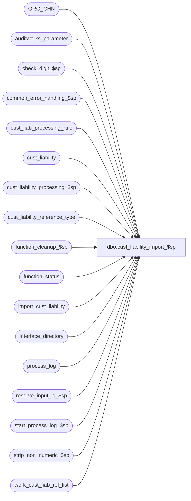

# dbo.cust_liability_import_$sp

**Database:** auditworks_external  
**Server:** bedrockdb01  

## Architecture Diagram



## Table Dependencies

| Referenced Table |
|---|
| ORG_CHN |
| auditworks_parameter |
| check_digit_$sp |
| common_error_handling_$sp |
| cust_liab_processing_rule |
| cust_liability |
| cust_liability_processing_$sp |
| cust_liability_reference_type |
| function_cleanup_$sp |
| function_status |
| import_cust_liability |
| interface_directory |
| process_log |
| reserve_input_id_$sp |
| start_process_log_$sp |
| strip_non_numeric_$sp |
| work_cust_liab_ref_list |

## Stored Procedure Code

```sql
create proc dbo.cust_liability_import_$sp AS

/*
   NAME:    cust_liability_import_$sp
   DESCR:   Processes one rule_id from the import_cust_liability table at a time, 
            populating the work_cust_liab_ref_list and calling the cust_liability_processing_$sp 
            which in turn will populate the input tables with transaction information generated 
            based on the requirements defined in the cust_liab_processing_rule table. The transactions 
            generated will then flow through the normal edit to update the Customer Liability module.
            Called by ICT_IMPORT smartload.
            
HISTORY:
Date      Name             Defect#  Description
Nov13,13  Vicci             148175  Avoid dup key on insert into process_log by waiting a second before begining the calls to cust_liability_processing_$sp.
				    Ensure that rows with export_flag = 2 (i.e. already sent to edit for a preloaded input batch via cust_liability_processing_$sp)
				    are not processed again in an error recovery situation.
                                    End the process log entry for the import initiation (entries for individual rules remain open until Edit closes them).
Sep30,13  Vicci             146826  Take pos_identifier_type into account, and support SQL 2012.
Jun16,11  PaulS             127208  handle multiple failed halted processes
Nov03,10  Vicci             122171  Handle serial no;  call function_cleanup_$sp upon failure.
Sep29,10  Vicci             121331  Evaluate expiry days taking pre-existing issuance date into account.
Oct01,09  Vicci             109078  Set the @reference_no_qty_per_trans variable subsequently used to group matching 
						reference numbers into single transaction.
Apr06,09  Vicci             109078  Handle > 1 row for same reference# when ref-per-trans = 1 by setting trans_row_no.
				    The date_issued_formatted is the one used for exporting the data after importing it
				    so it needs to be set after processing.  Also, pad reference_no with leading zeroes.
				    Also, set currency code so that rule store override by currency can be done.
Aug02,06    Tim              69753  Apply 72183 to SA5
May15,06  Vicci	             72183  Do not overlay the issuance date imported (note the bcp format populates column
                                    3, i.e. issuance date despite the memo column description) with the date_issued_formatted
                                    since the latter is never set.
Sep23,04  David            DV-1146  Use user_id.
May07,04  Maryam           DV-1071  pass @process_id to the sub procs.
Apr07,04  Sab		   DV-1068  Remove code for old customer liability
Dec02,02  David C             5268  Make sure @reference_no is set when check_digit_routine_no = 0
Jan11,02  David C          AW-8415  Author

*/

DECLARE @check_digit_routine_no		tinyint,
	@cursor_open			tinyint,
	@currency_code			nvarchar(3),
	@errmsg				nvarchar(2000),
	@errno				int,
	@generate_reference_no		tinyint,
	@halted_entry_date		smalldatetime,
	@import_row_count		int,
	@import_ref_no_count		int,
	@import_row_id			numeric(10,0),
	@input_id			numeric(12,0),
	@key_store_no			int,
	@message_id			int,
	@max_import_row_id		numeric(10,0), 
	@min_import_row_id		numeric(10,0), 
	@new_glc			tinyint,
	@next_reference_no		nvarchar(20),
	@next_reference_number		numeric(20,0),
	@reference_no_qty_per_trans	numeric(5,0), 
	@object_name			nvarchar(255),
	@operation_name			nvarchar(100),
	@process_name			nvarchar(100),
	@process_no 			smallint,
	@process_start_datetime		datetime,
	@rows				int,
	@row_no				int,
	@trans_row_no			int,
	@line_row_no			int,
	@rows_continuous_and_sorted	tinyint,
	@reference_no			nvarchar(20),
	@prior_reference_no		nvarchar(20),
	@date_issued			datetime,
	@prior_date_issued 		datetime, 
	@reference_number		numeric(20,0),
	@reference_no_datatype		nchar(1),
	@reference_no_length		tinyint,
        @reference_type			tinyint,
	@rule_id			nvarchar(3),
	@transaction_series		nchar(1),
	@unique_by_store_key		tinyint,
	@user_id			int,
	@process_id                     binary(16),
	@max_serial_no			nvarchar(80),
	@halted_process_id		binary(16),
	@errmsg1			nvarchar(255), 
	@call_cleanup			tinyint,
	@errmsg2			nvarchar(2000);

SELECT @new_glc = 0,
       @user_id = -1,
       @process_id = newid(),
       @process_no = 242, 
       @process_name = 'cust_liability_import_$sp',
       @message_id = 201068,
       @process_start_datetime = getdate(),
       @call_cleanup = 0,
       @operation_name = 'SELECT';

BEGIN TRY
        
/* If any halted processes exist for function 242, then clean them up before proceeding */

WHILE 0=0
BEGIN
  SELECT @errmsg = 'Failed to determine if any previously halted C/L Import processes exist. ',
	 @object_name = 'function_status';
  SELECT @halted_entry_date = MIN(entry_date)
    FROM function_status
   WHERE function_no = @process_no;

  IF @halted_entry_date IS NOT NULL
  BEGIN
      SELECT @errmsg = 'Failed to determine the first of any previously halted C/L Import processes. ';
      SELECT @halted_process_id = MIN(process_id)
        FROM function_status
       WHERE function_no = @process_no
         AND entry_date = @halted_entry_date;

      SELECT @errmsg = 'Failed to recover previously halted C/L Import. ',
             @object_name    = 'function_cleanup_$sp',
             @operation_name = 'EXECUTE';
      EXEC function_cleanup_$sp @halted_process_id, @user_id, @process_no, @errmsg OUTPUT;
  END;
  ELSE
    BREAK;
END; -- While 0=0

SELECT @errmsg = 'Failed to determine if C/L module is active. ',
       @object_name = 'interface_directory',
       @operation_name = 'SELECT';
IF EXISTS ( SELECT interface_id 
              FROM interface_directory
             WHERE interface_id = 28 
               AND update_timing > 0 )
  SELECT @new_glc = 1;

IF @new_glc = 0 
  RETURN;

--use string datatype for dates to facilitate BCP; not necessary in Oracle.
SELECT @errmsg = 'Failed to set date_issued. ',
       @object_name = 'import_cust_liability',
       @operation_name = 'UPDATE';
UPDATE import_cust_liability
   SET date_issued = convert(smalldatetime, date_issued_formatted)
 WHERE date_issued IS NULL
   AND COALESCE(export_flag, 0) <> 2;

SELECT @errmsg = 'Failed to set date_issued_formatted. ';
UPDATE import_cust_liability
   SET date_issued_formatted = convert(nvarchar, date_issued, 101)
 WHERE date_issued_formatted IS NULL
   AND COALESCE(export_flag, 0) <> 2;
   
SELECT @errmsg = 'Failed to execute stored proc start_process_log_$sp. ',
       @object_name = 'start_process_log_$sp',
       @operation_name = 'EXECUTE';
EXEC start_process_log_$sp @process_no, null, null, 1, @process_start_datetime, null;

SELECT @errmsg = 'Failed to determine if multi-currency is active. ',
       @object_name = 'auditworks_parameter',
       @operation_name = 'SELECT';
IF EXISTS (SELECT 1 FROM auditworks_parameter WHERE par_name = 'multi_currency' AND par_value = '1')  
BEGIN
  SELECT @errmsg = 'Failed to set currency code of import table rows. ',
         @object_name = 'import_cust_liability',
         @operation_name = 'UPDATE';
  UPDATE import_cust_liability
     SET currency_code = s.DFLT_CRNCY_CODE
    FROM import_cust_liability i
         INNER JOIN ORG_CHN s 
            ON i.issuing_store_no = s.ORG_CHN_NUM
     AND COALESCE(export_flag, 0) <> 2;
END;

SELECT @errmsg = 'Failed to define rule_id_crsr. ',
       @object_name = 'rule_id_crsr',
       @operation_name = 'DECLARE';
DECLARE rule_id_crsr CURSOR FAST_FORWARD
    FOR 
 SELECT i.rule_id, i.currency_code, MIN(i.import_row_id), MAX(i.import_row_id), COUNT(i.import_row_id), COUNT (DISTINCT i.reference_no), MAX(serial_no)
   FROM import_cust_liability i
  WHERE COALESCE(export_flag, 0) <> 2
  GROUP BY i.rule_id, i.currency_code;
    
SELECT @errmsg = 'Failed to open rule_id_crsr. ';
OPEN rule_id_crsr;
SELECT @cursor_open = 1;

WHILE 1=1
BEGIN

  SELECT @errmsg = 'Failed to define rule_id_crsr. ',
         @object_name = 'rule_id_crsr',
         @operation_name = 'FETCH';
   FETCH rule_id_crsr 
    INTO @rule_id, @currency_code, @min_import_row_id, @max_import_row_id, @import_row_count, @import_ref_no_count, @max_serial_no;

  IF @@fetch_status <> 0
    BREAK;

  WAITFOR DELAY '0:00:01'  --wait 1 second so that 1st reservation of an input id doesn't end up with same timestamp in the process_log as the previous.

  SELECT @call_cleanup = 1;
  SELECT @errmsg = 'Failed to execute stored proc reserve_input_id_$sp. ',
         @object_name = 'reserve_input_id_$sp',
         @operation_name = 'EXECUTE';
  EXEC reserve_input_id_$sp @process_id, @user_id, @rule_id, @input_id OUTPUT, @errmsg OUTPUT;
    
  SELECT @errmsg = 'Failed to select from cust_liab_processing_rule. ',
         @object_name = 'cust_liab_processing_rule',
         @operation_name = 'SELECT';
  SELECT @reference_type = p.reference_type,
 	 @unique_by_store_key = r.unique_by_store_key,
 	 @generate_reference_no = p.generate_reference_no,
	 @next_reference_no = IsNull(p.next_reference_no, '1'),
	 @reference_no_datatype = r.reference_no_datatype,
	 @reference_no_length = reference_no_length, 
	 @check_digit_routine_no = check_digit_routine_number,
         @reference_no_qty_per_trans = p.reference_no_qty_per_trans
    FROM cust_liab_processing_rule p, cust_liability_reference_type r
   WHERE p.rule_id = @rule_id 
     AND p.reference_type = r.reference_type;
  SELECT @rows = @@rowcount;
   
  IF @rows = 0 
  BEGIN
    SELECT @errmsg = 'rule_id/reference_type combination not found in cust_liab_processing_rule. ',
           @errno = 201649;
    GOTO business_rule_error;
  END

  SELECT @key_store_no = NULL;

  IF @unique_by_store_key = 0
    SELECT @key_store_no = -1;
     
  IF @generate_reference_no = 1
  BEGIN
    SELECT @errmsg = 'Failed to define import_row_id_crsr. ',
           @object_name = 'import_row_id_crsr',
           @operation_name = 'DECLARE'; 
    DECLARE import_row_id_crsr CURSOR FAST_FORWARD
        FOR
     SELECT DISTINCT import_row_id 
       FROM import_cust_liability 
      WHERE rule_id = @rule_id 
        AND reference_no IS NULL 
        AND (currency_code = @currency_code OR (@currency_code IS NULL AND currency_code IS NULL))
        AND COALESCE(export_flag, 0) <> 2;
          
    SELECT @operation_name = 'OPEN'; 
      OPEN import_row_id_crsr;
    SELECT @cursor_open = 2;
          
    WHILE 2=2
    BEGIN

      SELECT @errmsg = 'Failed to fetch import_row_id_crsr. ',
             @object_name = 'import_row_id_crsr',
             @operation_name = 'FETCH'; 
      FETCH import_row_id_crsr
       INTO @import_row_id;
        
      IF @@fetch_status <> 0
        BREAK;

      IF @reference_no_datatype = 'N'
      BEGIN
        SELECT @reference_number = convert(numeric(20,0), @next_reference_no);

        IF @check_digit_routine_no <> 0
        BEGIN
          IF @reference_number >= 10 
            SELECT @reference_number = convert(numeric(20,0), @reference_number / 10);
             --have to convert again to avoid truncation error
             
          SELECT @next_reference_number = @reference_number + 1;

          SELECT @errmsg = 'Failed to execute stored proc check_digit_$sp [1]. ',
                 @object_name = 'check_digit_$sp',
                 @operation_name = 'EXECUTE';
          EXEC check_digit_$sp  @process_id, @user_id, @process_no, @check_digit_routine_no, @reference_number OUTPUT, @errmsg OUTPUT;
            
          SELECT @errmsg = 'Failed to execute stored proc check_digit_$sp [2]. ';
          EXEC check_digit_$sp  @process_id, @user_id, @process_no, @check_digit_routine_no, @next_reference_number OUTPUT, @errmsg OUTPUT;

      END; --IF @check_digit_routine_no <> 0
     ELSE --IF @check_digit_routine_no = 0 
        SELECT @next_reference_number = @reference_number + 1;
      END; --if datatype numeric
    ELSE 
    BEGIN
      SELECT @errmsg = 'Failed to execute strip_non_numeric_$sp. ',
             @object_name = 'strip_non_numeric_$sp',
             @operation_name = 'EXECUTE';
      EXEC strip_non_numeric_$sp @next_reference_no, @reference_no OUTPUT;
             
      SELECT @reference_number = convert(numeric(20,0), @reference_no),
             @next_reference_number = @reference_number + 1;
    END; -- datatype alpha

    SELECT @next_reference_no = right('00000000000000000000' + convert(nvarchar, @next_reference_number), @reference_no_length),
           @reference_no = right('00000000000000000000' + convert(nvarchar, @reference_number), @reference_no_length); -- defect 5268
    
    SELECT @errmsg = 'Failed to update import_cust_liability. ',
           @object_name = 'import_cust_liability',
           @operation_name = 'UPDATE';
    UPDATE import_cust_liability
       SET reference_no = @reference_no, 
           export_flag = 1
     WHERE rule_id = @rule_id 
       AND import_row_id = @import_row_id;
  END; --while 2=2
  
  SELECT @errmsg = 'Failed to close and deallocate import_row_id_crsr. ',
         @object_name = 'import_row_id_crsr',
         @operation_name = 'CLOSE';
  CLOSE import_row_id_crsr;
  SELECT @operation_name = 'DEALLOCATE';
  DEALLOCATE import_row_id_crsr;
  SELECT @cursor_open = 1;
      
END; --if @generate_reference_no = 1
SELECT @rows_continuous_and_sorted = 0;

IF @max_import_row_id - @min_import_row_id + 1 = @import_row_count AND (@import_ref_no_count = @import_row_count OR @reference_no_qty_per_trans <> 1 )
   SELECT @rows_continuous_and_sorted = 1;

IF @rows_continuous_and_sorted = 1
BEGIN
  SELECT @errmsg = 'Failed to insert into work_cust_liab_ref_list [@rows_continuous_and_sorted=1]. ',
         @object_name = 'work_cust_liab_ref_list',
         @operation_name = 'INSERT';
  INSERT INTO work_cust_liab_ref_list ( 
         input_id, 
         row_no, 
         reference_type, 
         reference_no, 
         key_store_no, 
         action_amount, 
         issuing_store_no, 
         date_issued, 
         replacement_reference_no, 
         title, 
         first_name, 
         last_name, 
         address_1, 
         address_2,
         city, 
         county, 
         state, 
         country, 
         post_code, 
         telephone_no1, 
         telephone_no2, 
         customer_no, 
         pos_tax_jurisdiction_code, 
         fax, 
         email_address, 
         employee_no, 
         destination_store_no, 
         action_date, 
         upc_no, 
         pos_identifier, 
         units,
         expiry_days,
         serial_no,
         pos_identifier_type )
  SELECT @input_id, 
         import_row_id - @min_import_row_id, 
         @reference_type, 
         CASE WHEN @reference_no_datatype = 'N' THEN RIGHT ('00000000000000000000' + LTRIM(i.reference_no),@reference_no_length) ELSE i.reference_no END, 
         IsNull(@key_store_no, i.issuing_store_no), 
         i.action_amount, 
         i.issuing_store_no, 
         i.date_issued, 
         i.replacement_reference_no, 
         i.title, 
         i.first_name, 
         i.last_name, 
         i.address_1, 
         i.address_2, 
         i.city, 
         i.county, 
         i.state, 
         i.country, 
         i.post_code, 
         i.telephone_no1, 
         i.telephone_no2, 
         i.customer_no, 
         i.pos_tax_jurisdiction_code, 
         i.fax, 
         i.email_address, 
         i.employee_no, 
         i.destination_store_no, 
         i.date_issued, 
         i.upc_no, 
         i.pos_identifier, 
         i.units,
         datediff(dd, COALESCE(cl.date_issued, i.date_issued), convert(smalldatetime,i.expiry_date)),
         i.serial_no,
 i.pos_identifier_type
    FROM import_cust_liability i
         LEFT OUTER JOIN cust_liability cl
           ON cl.reference_type = @reference_type
          AND cl.reference_no = CASE WHEN @reference_no_datatype = 'N' THEN RIGHT ('00000000000000000000' + LTRIM(i.reference_no),@reference_no_length) ELSE i.reference_no END
          AND (cl.key_store_no = -1 OR cl.key_store_no = i.issuing_store_no)
          AND cl.issued_flag > 0
   WHERE i.rule_id = @rule_id
     AND (i.currency_code = @currency_code OR (@currency_code IS NULL AND i.currency_code IS NULL))
     AND COALESCE(export_flag, 0) <> 2;

  END; --IF @rows_continuous_and_sorted = 1
  ELSE
  BEGIN
    SELECT @row_no = 0, 
           @prior_reference_no = NULL, --done consciously to cause "if different" comparison to fail on first fetch
           @trans_row_no = 0,
           @line_row_no = 0;

SELECT @errmsg = 'Failed to define import_row_id_crsr2. ',
           @object_name = 'import_row_id_crsr2',
           @operation_name = 'DECLARE';
    DECLARE import_row_id_crsr2 CURSOR FAST_FORWARD
        FOR
     SELECT DISTINCT import_row_id, reference_no, date_issued
      FROM import_cust_liability 
     WHERE rule_id = @rule_id 
       AND (currency_code = @currency_code OR (@currency_code IS NULL AND currency_code IS NULL))
       AND COALESCE(export_flag, 0) <> 2
     ORDER BY reference_no, date_issued;
          
    SELECT @operation_name = 'OPEN';
    OPEN import_row_id_crsr2;
    SELECT @cursor_open = 3;
          
    WHILE 3=3
    BEGIN
      SELECT @errmsg = 'Failed to fetch import_row_id_crsr2. ',
             @object_name = 'import_row_id_crsr2',
             @operation_name = 'FETCH';
      FETCH import_row_id_crsr2
       INTO @import_row_id, @reference_no, @date_issued;
        
      IF @@fetch_status <> 0
        BREAK;
      IF @prior_reference_no IS NULL 
        SELECT @prior_reference_no = @reference_no,
               @prior_date_issued = @date_issued;

      IF @prior_reference_no <> @reference_no 
         OR @prior_date_issued <> @date_issued 
         OR @prior_date_issued IS NULL AND @date_issued IS NOT NULL
         OR @prior_date_issued IS NOT NULL AND @date_issued IS NULL
      BEGIN 
        SELECT @trans_row_no = @trans_row_no + 1,
               @prior_reference_no = @reference_no,
               @prior_date_issued = @date_issued,
               @line_row_no = 0;
      END;

      SELECT @errmsg = 'Failed to insert into work_cust_liab_ref_list [@rows_continuous_and_sorted=0]. ',
             @object_name = 'work_cust_liab_ref_list',
             @operation_name = 'INSERT';
      INSERT INTO work_cust_liab_ref_list (
             input_id, 
             row_no, 
             reference_type, 
             reference_no, 
             key_store_no, 
             action_amount, 
             issuing_store_no, 
             date_issued, 
             replacement_reference_no, 
             title, 
             first_name, 
             last_name, 
             address_1, 
             address_2,
             city, 
             county, 
             state, 
             country, 
             post_code, 
             telephone_no1, 
             telephone_no2, 
             customer_no, 
             pos_tax_jurisdiction_code, 
             fax, 
             email_address, 
             employee_no, 
             destination_store_no, 
             action_date, 
             upc_no, 
             pos_identifier, 
             units,
             expiry_days,
             trans_row_no,
             line_row_no,
             serial_no,
             pos_identifier_type)
      SELECT @input_id, 
             @row_no, 
             @reference_type, 
             CASE WHEN @reference_no_datatype = 'N' THEN RIGHT ('00000000000000000000' + LTRIM(i.reference_no),@reference_no_length) ELSE i.reference_no END, 
             IsNull(@key_store_no, i.issuing_store_no), 
             i.action_amount, 
             i.issuing_store_no, 
             i.date_issued, 
             i.replacement_reference_no, 
             i.title, 
             i.first_name, 
             i.last_name, 
             i.address_1, 
             i.address_2, 
             i.city, 
             i.county, 
             i.state, 
             i.country, 
             i.post_code, 
             i.telephone_no1, 
             i.telephone_no2, 
             i.customer_no, 
             i.pos_tax_jurisdiction_code, 
             i.fax, 
             i.email_address, 
             i.employee_no, 
             i.destination_store_no, 
             i.date_issued, 
             i.upc_no, 
             i.pos_identifier, 
             i.units,
             datediff(dd, COALESCE(cl.date_issued, i.date_issued), convert(smalldatetime,i.expiry_date)),
             CASE WHEN @reference_no_qty_per_trans = 1 THEN @trans_row_no ELSE NULL END,
             CASE WHEN @reference_no_qty_per_trans = 1 THEN @line_row_no ELSE NULL END,
             i.serial_no,
             i.pos_identifier_type
        FROM import_cust_liability i
             LEFT OUTER JOIN cust_liability cl
               ON cl.reference_type = @reference_type
              AND cl.reference_no = CASE WHEN @reference_no_datatype = 'N' THEN RIGHT ('00000000000000000000' + LTRIM(i.reference_no),@reference_no_length) ELSE i.reference_no END
              AND (cl.key_store_no = -1 OR cl.key_store_no = i.issuing_store_no)
              AND cl.issued_flag > 0
       WHERE i.rule_id = @rule_id 
         AND i.import_row_id = @import_row_id
         AND (i.currency_code = @currency_code OR (@currency_code IS NULL AND i.currency_code IS NULL))
         AND COALESCE(export_flag, 0) <> 2;

      SELECT @row_no = @row_no + 1,
             @line_row_no = @line_row_no + 1;
    END;  --while 3=3
      
    SELECT @errmsg = 'Failed to close and deallocate import_row_id_crsr2. ',
           @object_name = 'import_row_id_crsr2',
           @operation_name = 'CLOSE';
    CLOSE import_row_id_crsr2;
    SELECT @operation_name = 'DEALLOCATE';
    DEALLOCATE import_row_id_crsr2;
    SELECT @cursor_open = 1;
      
  END; --@rows_continuous_and_sorted = 0
     
  SELECT @errmsg = 'Failed to execute stored proc cust_liability_processing_$sp. ',
         @object_name = 'cust_liability_processing_$sp',
         @operation_name = 'EXECUTE';
  EXEC cust_liability_processing_$sp @process_id, @user_id, @input_id, -1, null, @next_reference_no, null, @errmsg, null, null, @currency_code;
  SELECT @call_cleanup = 0;

  SELECT @errmsg = 'Failed to update process_log [new_glc]. ',
         @object_name = 'process_log',
         @operation_name = 'UPDATE';
  UPDATE process_log
     SET transaction_count = transaction_count + @import_row_count
   WHERE process_start_time = @process_start_datetime
     AND process_no = @process_no;
END; --while loop fetching rule_ids

SELECT @errmsg = 'Failed to mark import initiation as complete (note: individual rules for this import will be marked as complete via edit post use of transl_processing_status). ',
       @object_name = 'process_log',
       @operation_name = 'UPDATE';
UPDATE process_log
   SET process_end_time = getdate(),
       process_status_flag = 2
 WHERE process_start_time = @process_start_datetime
   AND process_no = @process_no;

SELECT @errmsg = 'Failed to close and deallocate import_row_id_crsr. ',
       @object_name = 'import_row_id_crsr',
       @operation_name = 'CLOSE';
CLOSE rule_id_crsr;
SELECT @operation_name = 'DEALLOCATE';
DEALLOCATE rule_id_crsr;
SELECT @cursor_open = 0;

RETURN;

business_rule_error:
  SELECT @message_id = @errno;
  SELECT @errmsg2 = @process_name + ':  ' + COALESCE(@errmsg, '');
  SELECT @errmsg = @errmsg2;
  EXEC common_error_handling_$sp @process_no, @errno, @errmsg2, 0, @message_id, @process_name, @object_name, @operation_name, 
                                 1, 1, 0, null, 0, null, null, null, null, null, null, 0, @process_id, @user_id;
  RETURN;

END TRY

BEGIN CATCH
  SELECT @errno = ERROR_NUMBER();
  IF @errmsg2 IS NULL
  BEGIN
    SELECT @errmsg2 = @process_name + ':  ' + COALESCE(@errmsg, '') + ERROR_MESSAGE() + ' Line: ' + CONVERT(nvarchar, ERROR_LINE());
  END;
  SELECT @errmsg = @errmsg2;  
  
  IF @cursor_open > 0
  BEGIN
    CLOSE rule_id_crsr;
    DEALLOCATE rule_id_crsr;
 
    IF @cursor_open = 2
    BEGIN
      CLOSE import_row_id_crsr;
      DEALLOCATE import_row_id_crsr;
    END;
  
    IF @cursor_open = 3
    BEGIN
      CLOSE import_row_id_crsr2
      DEALLOCATE import_row_id_crsr2;
    END;
  END;

  IF @call_cleanup = 1
    EXEC function_cleanup_$sp @halted_process_id, @user_id, @process_no, @errmsg1 OUTPUT;

  EXEC common_error_handling_$sp @process_no, @errno, @errmsg2, 0, @message_id, @process_name, @object_name, @operation_name, 
                                 1, 1, 0, null, 0, null, null, null, null, null, null, 0, @process_id, @user_id;
  
  RETURN;
END CATCH;
```

