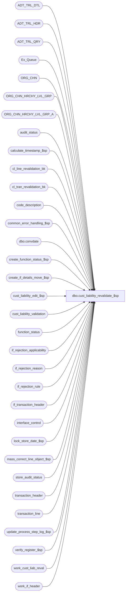

# dbo.cust_liability_revalidate_$sp

**Database:** auditworks_external  
**Server:** bedrockdb01  

## Architecture Diagram



## Table Dependencies

| Referenced Table |
|---|
| ADT_TRL_DTL |
| ADT_TRL_HDR |
| ADT_TRL_QRY |
| Ex_Queue |
| ORG_CHN |
| ORG_CHN_HRCHY_LVL_GRP |
| ORG_CHN_HRCHY_LVL_GRP_A |
| audit_status |
| calculate_timestamp_$sp |
| cl_line_revalidation_bk |
| cl_tran_revalidation_bk |
| code_description |
| common_error_handling_$sp |
| dbo.convdate |
| create_function_status_$sp |
| create_if_details_move_$sp |
| cust_liability_edit_$sp |
| cust_liability_validation |
| function_status |
| if_rejection_applicability |
| if_rejection_reason |
| if_rejection_rule |
| if_transaction_header |
| interface_control |
| lock_store_date_$sp |
| mass_correct_line_object_$sp |
| store_audit_status |
| transaction_header |
| transaction_line |
| update_process_step_log_$sp |
| verify_register_$sp |
| work_cust_liab_reval |
| work_if_header |

## Stored Procedure Code

```sql
CREATE proc [dbo].[cust_liability_revalidate_$sp]   @process_id                   binary(16),
  @user_id			int,
  @originating_function_no	smallint = 78,
  @spid				binary(16) = null, -- if null then revalidate all (always null in SA5)
  @log_error_flag		tinyint = 0,  -- 1 if called by smartload
  @edit_process_no 		tinyint = 1,
  @function_status 		tinyint = 0

  -- If @originating_function_no = 78 then lock each store/date
  -- otherwise, assume that store/date is already locked by calling proc.

    AS

/*
PROCNAME: cust_liability_revalidate_$sp
    DESC: To re-evaluate type 100 (Cust Liability Validation Failed) interface rejections.
          Called by mass_auto_revalidate_$sp (@originating_function_no = 78, @spid = null)
          or cust_liability_edit_$sp (edit only, i.e. @originating_function_no = 4 or 5) or function_cleanup_$sp. 

 HISTORY:
DATE     NAME          DEFECT# DESCRIPTION
Apr08,15 Vicci      TFS-114314 Release the mass-correct-line-object function status entry for cleanup if it fails.  Add TRY/CATCH so its own
                               function status entry can also be released for cleanup.  Also, correct recovery for status 2 not to create a new
                               function status entry.
Apr06,15 Vicci      TFS-114314 Relocate the ORG_CHN_HRCHY_LVL_GRP update that was occurring in the store_audit_status trigger here to avoid it
                               being inside an implicit begin-trans with resulting deadlocks.
Feb26,15 Paul         T-105255 Handle multi-stream trickle when also using the trickle audit configuration - only revalidate when on stream 1
Jan29,14 Vicci          149617 Add try/catch around lock store date execution in order to trap and skip store/date instead of crashing.
Nov18,13 Vicci          148200 Don't delete entries for OTHER reject reasons from work table before updating interface_control
                               since the other rejects are not relevant to interface 28 but only to the setting of the header and line level I/F reject flags.
                               Also, don't reset the line level I/F reject flag if other reject reasons for the same line exist.
Aug09,13 Phu            143500 Fix missing entries in ADT_TRL_DTL.
Nov27,12 Vicci/Priya    139967 Since ADT_TRL_DTL.TBL_KEY_RSRC_PRMS is limited to 255 characters, chop off description before logging it.
Aug15,12 Vicci        1-48D5CB Do not attempt to re-post transactions that made it to the list of rejects to revalidate, but have
                               since been locked/corrected/unlocked via transaction modify before the revalidate made it to that
                               store/date on its list of rejects to handle.
                               Ensure store/dates being revalidated by the Edit but not already locked by the Edit are locked too.
Jun18,09 Vicci          109078 Call mass_correct_line_object_$sp to re-attempt failed order auto-completion requests, 
                               but not when part of the edit since its phase2 will call it independently.
Jul31,08 Paul            87777 Uplift 1-3Y5VOA, 73592 to SA5, fixed recovery and store-date locking logic
Sep06,05 Paul          DV-1312 apply 43214 to SA5
Apr29,05 Paul          DV-1234 expand transaction_id to use tran_id_datatype
Mar22,05 Paul          DV-1218 removed commit, execute create_function_status_$sp before locking store-dates,
				change audit trail separator, corrected audit trail insert.
Feb22,05 David         DV-1206 Declare reference_no as nvarchar(255).
Jan07,05 Paul          DV-1191 added locking hints
Sep23,04 David         DV-1146 Use user_id.
Aug30,04 Maryam        DV-1120 Use convdate function for dates when logging the audit trail.
Jul12,04 David         DV-1071 Add recovery logic, Insert into new Audit Trail, Use ORG_CHN table as the new Store table,
                               (Maryam) receive @process_id and pass it to the sub procs. 
Jul10,08 Paul         1-3Y5VOA Use work table to store list of store-reg-date for error recovery
Jun03,08 Paul            96617 shorten audit trail key string to avoid string length error
Jun15,06 Vicci           73592 Skip store/dates locked by the Edit since lock will be held all day
Oct22,04 Maryam          43214 Do not revalidate deferred if_rejects.
Mar05,04 Winnie          24003 Add function_no check when insert into work_if_header
Nov10,03 David     17761/17860 If coming from mass_delete, set interface_control_flag to 20, i_multiplier to -1.
Oct27,03 David     15615/17189 Revalidate all store/date combinations together for performance reasons.
Apr24,03 Paul          1-KO2HY populate till_no
Jul26,02 Paul         1-E7L7M populate key_11 in Ex_Queue with entry_date_time
Jul22,02 Daphna        1-DW0JH Do not log revalidation in audit trail when called by edit
                                 Ensure audit trail is logged for store/date of cursor fetch
Jul22,02 David         1-DW0JH Use process_id to decide which if_rejects to revalidate
Apr12,02 Daphna        1-BMK21 Progress Monitor
Feb11,02 Vicci/David   AW-8415 Author
*/

DECLARE @cursor_open			tinyint,
	@edit_timestamp			float,
	@entry_date_time		datetime,
	@errmsg				nvarchar(2000),
	@errmsg2			nvarchar(2000),
	@errno				int,
	@function_no			tinyint,
	@if_reject_qty			smallint,
	@message_id			int,
	@multiplier			smallint,
	@object_name			nvarchar(255),
	@operation_name			nvarchar(100),
	@process_name			nvarchar(100),
	@register_no			smallint,
	@ret				int,
	@rows				int,
	@sep				nchar(1),
	@store_name			nvarchar(30),
	@store_no			int,
	@transaction_date		smalldatetime,
	@all_selected_flag              tinyint,
	@if_rejection_description       nvarchar(100),
	@ENTRY_ID                       binary(16),
	@all_selected_descr             nvarchar(255),
	@lock_count			int


SELECT @function_no = 78,
       @cursor_open = 0,
       @entry_date_time = getdate(),
       @process_name = 'cust_liability_revalidate_$sp',
       @message_id = 201068,
       @all_selected_flag = 0, -- selected transactions
       @sep = NCHAR(12), -- audit trail separator
       @lock_count = 0

IF @edit_process_no > 1
  RETURN; -- do not revalidate when called from edit phase1 streams with stream_no > 1	

BEGIN TRY

IF @spid IS NULL
  SELECT @all_selected_flag = 1  --all transactions
  
SELECT @errmsg = 'Unable to create temp table #cl_tran_revalidation.  ',
       @object_name = '#cl_tran_revalidation',
       @operation_name = 'CREATE';
CREATE TABLE #cl_tran_revalidation (
	transaction_id		numeric(14,0) not null, -- tran_id_datatype
	store_no		int not null,
	transaction_date	smalldatetime not null,
	register_no             smallint not null,
	date_reject_id          tinyint not null,
	transaction_series      nchar(1) not null,
	transaction_no          int not null,
	entry_date_time         datetime not null,
	cashier_no              int not null,
	till_no                 smallint null,
	if_entry_no		numeric(14,0) null); -- if_entry_datatype


SELECT @errmsg = 'Unable to create temp table #cl_line_revalidation',
       @object_name = '#cl_line_revalidation',
       @operation_name = 'CREATE';
CREATE TABLE #cl_line_revalidation (
	transaction_id		numeric(14,0) not null, -- tran_id_datatype
	line_id			numeric(5,0) not null,
	store_no		int not null,
	transaction_date	smalldatetime not null,	
	register_no             smallint not null,	
	date_reject_id          tinyint not null,	
	transaction_series      nchar(1) not null,	
	transaction_no          int not null,	
	entry_date_time         datetime not null,	
	cashier_no              int not null,	
	if_entry_no		numeric(14,0) null, -- if_entry_datatype
	till_no                 smallint null,
	reference_type          tinyint null,  
	reference_no            nvarchar(255) null,
	validation_id           nvarchar(255) null);

IF @function_status IN (3, 4) -- recovery starts from status 3
BEGIN -- repopulate temp tables in case audit trail has not yet been updated
  -- will find no rows if there is no backup
  SELECT @errmsg = 'Unable to recover #cl_tran_revalidation from cl_tran_revalidation_bk.  ',
         @object_name = '#cl_tran_revalidation',
         @operation_name = 'INSERT';
  INSERT INTO #cl_tran_revalidation (
         transaction_id, 
          store_no, 
          transaction_date, 
          register_no, 
          date_reject_id, 
          transaction_series, 
          transaction_no, 
          entry_date_time, 
          cashier_no,
          till_no, 
          if_entry_no )
  SELECT
	transaction_id,
	store_no,
	transaction_date,
	register_no,
	date_reject_id,
	transaction_series,
	transaction_no,
	entry_date_time,
	cashier_no,
	till_no,
	if_entry_no
  FROM cl_tran_revalidation_bk
  WHERE process_id = @process_id;

  SELECT @errmsg = 'Unable to recover #cl_line_revalidation from cl_tran_revalidation_bk.  ',
         @object_name = '#cl_line_revalidation';
  INSERT INTO #cl_line_revalidation (transaction_id, line_id, store_no, transaction_date, 
				   register_no, date_reject_id, transaction_series, 
				   transaction_no, entry_date_time, cashier_no, if_entry_no,
				   till_no, reference_type, reference_no, validation_id)
  SELECT
	c.transaction_id,
	c.line_id,
	c.store_no,
	c.transaction_date,
	c.register_no,
	c.date_reject_id,
	c.transaction_series,
	c.transaction_no,
	c.entry_date_time,
	c.cashier_no,
	c.if_entry_no,
	c.till_no,
	COALESCE(ir.lookup_key1, c.reference_type),
	COALESCE(ir.memo2, c.reference_no),
	COALESCE(ir.memo1, c.validation_id)
  FROM cl_line_revalidation_bk c
       LEFT JOIN if_rejection_reason ir ON (c.transaction_id = ir.transaction_id AND c.line_id = ir.line_id AND ir.if_reject_reason = 100 AND ir.deferred = 0)
  WHERE c.process_id = @process_id;

END; -- If @function_status IN (3, 4)

-- Want to repopulate #cl_* even step (@function_status = 2) has been previously completed 
IF @function_status <= 2 
BEGIN

  IF @originating_function_no NOT IN (4,5) AND @function_status < 2
  BEGIN
      BEGIN TRY
        EXEC mass_correct_line_object_$sp @process_id, @user_id, 2;
      END TRY
      BEGIN CATCH
        SELECT @errno = ERROR_NUMBER();
	UPDATE function_status
	   SET released_to_cleanup = 1
	 WHERE function_no = 82
	   AND process_id = @process_id
	   AND user_id = @user_id;
      END CATCH;
    IF @errno <> 0
    BEGIN 
      SELECT @errmsg = 'revalidate failed order-fulfillment/cancellation auto-completion requests.  ',
             @operation_name = 'EXECUTE',
             @object_name = 'mass_correct_line_object_$sp';
      GOTO general_error;      
    END;    
  END; 

--Will not revalidate deferred if_rejects as this requires unjustifed process time to lower audit_status and 
--to keep track of what if_rejects were deferred before.

  -- Build temp table of rejected transaction lines
   SELECT @errmsg = 'Unable to insert into #cl_line_revalidation.  ',
          @object_name = '#cl_line_revalidation',
          @operation_name = 'INSERT';
   INSERT INTO #cl_line_revalidation (transaction_id, line_id, store_no, transaction_date, 
				   register_no, date_reject_id, transaction_series, 
				   transaction_no, entry_date_time, cashier_no, 
				   till_no, reference_type, reference_no, validation_id)
   SELECT ir.transaction_id, ir.line_id, h.store_no, h.transaction_date, 
	  h.register_no, h.date_reject_id, h.transaction_series, 
	  h.transaction_no, h.entry_date_time, h.cashier_no,
	  h.till_no, ir.lookup_key1, ir.memo2, ir.memo1
    FROM if_rejection_reason ir, transaction_header h WITH (NOLOCK), store_audit_status s
   WHERE ir.if_reject_reason = 100
     AND ir.deferred = 0
     AND ir.transaction_id = h.transaction_id
     AND h.store_no = s.store_no
     AND h.transaction_date = s.sales_date
     AND h.date_reject_id = s.date_reject_id
     AND ((@originating_function_no = 78 AND s.update_in_progress IN (0,78) AND s.trickle_in_progress_flag = 0)
          OR (@originating_function_no <> 78 AND s.update_in_progress <> 78));
    -- If called from revalidate, then exclude rejects for store-dates that are being edited or trickle audited
    -- If called from edit, then exclude rejects that are currenty being revalidated by background revalidate process
  SELECT @rows = @@rowcount;

  IF @rows = 0
    BEGIN
     SELECT @errmsg = 'Unable to drop #cl_line_revalidation.  ',
            @object_name = '#cl_line_revalidation',
            @operation_name = 'DROP TABLE';
     DROP TABLE #cl_line_revalidation;
     
     SELECT @errmsg = 'Unable to drop #cl_tran_revalidation.  ',
            @object_name = '#cl_tran_revalidation';
     DROP TABLE #cl_tran_revalidation;
     
     RETURN;
    END;

  --Remove lines that have IF rejects other than 100 that apply to C/L 
  --Safety code although theoretically this is not necessary since it should not be possible for a transaction to have a reject 100 
  --unless it was first fed to C/L which in turn should not happen if another applicable I/F reject reason applied.
  SELECT @errmsg = 'Unable to delete transactions which should not feed CL for reject reasons other than C/L validations.  ',
         @object_name = '#cl_line_revalidation',
         @operation_name = 'DELETE';
  DELETE #cl_line_revalidation
    FROM if_rejection_reason ir WITH (NOLOCK),
         if_rejection_applicability ira WITH (NOLOCK)
   WHERE #cl_line_revalidation.transaction_id = ir.transaction_id  --note: line is irrelevant
     AND ir.if_reject_reason <> 100
     AND ir.if_reject_reason = ira.if_reject_reason
     AND ira.interface_id = 28;

  -- build list of transactions with rejected lines
  SELECT @errmsg = 'Unable to insert into #cl_tran_revalidation.  ',
         @object_name = '#cl_tran_revalidation',
         @operation_name = 'INSERT';
  INSERT INTO #cl_tran_revalidation (transaction_id, store_no, transaction_date, register_no, 
				   date_reject_id, transaction_series, transaction_no, 
				   entry_date_time, cashier_no, till_no, if_entry_no )
  SELECT DISTINCT transaction_id, store_no, transaction_date, register_no, 
		date_reject_id, transaction_series, transaction_no, 
		entry_date_time, cashier_no, till_no, NULL  
    FROM #cl_line_revalidation WITH (NOLOCK);

  --Remove lines that have IF rejects other 100 for the same transaction_id/line_id (applicable to other interfaces)
  SELECT @errmsg = 'Unable to delete #cl_line_revalidation.  ',
         @object_name = '#cl_line_revalidation',
         @operation_name = 'DELETE';
  DELETE #cl_line_revalidation
    FROM #cl_line_revalidation cl, if_rejection_reason ir WITH (NOLOCK)
   WHERE cl.transaction_id = ir.transaction_id
     AND cl.line_id = ir.line_id
     AND ir.if_reject_reason <> 100;

  SELECT @errmsg = 'Failed to delete rows from table work_if_header.  ',
         @object_name = 'work_if_header';
  DELETE work_if_header
   WHERE process_id = @process_id;

  SELECT @errmsg = 'Failed to delete rows from table work_cust_liab_reval.  ',
         @object_name = 'work_cust_liab_reval';
  DELETE work_cust_liab_reval
   WHERE process_id = @process_id;

  SELECT @errmsg = 'Failed to execute stored procedure calculate_timestamp_$sp.  ',
         @object_name = 'calculate_timestamp_$sp',
         @operation_name = 'EXECUTE';
  EXEC calculate_timestamp_$sp @edit_timestamp OUTPUT

  -- increment completed workload 
  IF @originating_function_no IN (4,5)
  BEGIN
    SELECT @errmsg = 'first increment of completed workload for step_no = 68.  ',
           @operation_name = 'EXECUTE',
           @object_name = 'update_process_step_log_$sp';
    EXEC update_process_step_log_$sp @originating_function_no,  @edit_process_no, 68;
  END;

  IF @function_status < 2 -- not error recovery
  BEGIN
    SELECT @function_status = 2 -- indicate that store-dates will need to be unlocked
  
    SELECT @errmsg = 'Failed to execute stored proc create_function_status_$sp.  ',
  	   @object_name = 'create_function_status_$sp',
	   @operation_name = 'EXECUTE';
    EXEC create_function_status_$sp @process_id, @user_id, @function_no, 0, @errmsg OUTPUT, @store_no, @transaction_date, 0, 0, @function_status;
  END;  --IF @function_status < 2 -- not error recovery
  
  SELECT @errmsg = 'Failed to insert work_cust_liab_reval.  ',
         @object_name = 'work_cust_liab_reval',
         @operation_name = 'INSERT';
  INSERT INTO work_cust_liab_reval (store_no, register_no, transaction_date, process_id)
  SELECT DISTINCT store_no, register_no, transaction_date, @process_id
    FROM #cl_tran_revalidation WITH (NOLOCK);
  
END; -- If @function_status <= 2 (not recovery)


IF @function_status = 2
BEGIN

  /* lock all needed store-dates */
  -- For SA5, function 78 is invoked only by only one background process (not from gui directly) 
  -- 1-48D5CB:  if @originating_function_no was the Edit (4, 5) but the store/date is not locked by the Edit and it needs to be locked with a 78 too
  SELECT @errmsg = 'Failed to declare cursor cl_revalidate_crsr.  ',
         @object_name = 'cl_revalidate_crsr',
         @operation_name = 'DECLARE';
  DECLARE cl_revalidate_crsr CURSOR FAST_FORWARD
      FOR
   SELECT DISTINCT w.store_no,
	  w.transaction_date
     FROM work_cust_liab_reval w WITH (NOLOCK)
          INNER JOIN store_audit_status s WITH (NOLOCK)
             ON w.store_no = s.store_no
            AND w.transaction_date = s.sales_date
            AND s.date_reject_id = 0
    WHERE w.process_id = @process_id
      AND (   @originating_function_no = 78
           OR (    @originating_function_no <> 78  --i.e. the Edit
               AND s.update_in_progress NOT IN (1, 2, 4, 5, 15, 84, 85)  --i.e. not the Edit
              )
          )             
  ORDER BY w.transaction_date, w.store_no;

  SELECT @errmsg = 'Failed to open cursor cl_revalidate_crsr.  ',
         @operation_name = 'OPEN';
  OPEN cl_revalidate_crsr;

  SELECT @cursor_open = 1;

  WHILE 1 = 1
  BEGIN

      SELECT @errmsg = 'Failed to fetch cursor cl_revalidate_crsr.  ',
             @operation_name = 'FETCH';
      FETCH cl_revalidate_crsr 
       INTO @store_no,
            @transaction_date;

      IF @@fetch_status <> 0
        BREAK

      /* Lock store-date if @originating_function_no = 78 */
      BEGIN TRY 
        EXEC lock_store_date_$sp @process_id, @user_id, @store_no, @transaction_date, 0, @function_no, @ret OUTPUT;
      END TRY
      BEGIN CATCH
        SELECT @errno = ERROR_NUMBER();
      END CATCH;
      
      IF @errno != 0
      BEGIN
        IF @errno = 201550
          SELECT @ret = 1;
        ELSE
        BEGIN
          SELECT @errmsg = 'Failed to execute lock_store_date_$sp',
                 @object_name = 'lock_store_date_$sp',
                 @operation_name = 'EXECUTE';
          GOTO general_error;
        END;
      END;

      IF @ret <> 0 -- can't lock store-date (in use by another process, e.g. edit) so skip tran for that store-date
      BEGIN
	SELECT @errmsg = 'Failed to skip locked store.  ',
               @object_name = '#cl_tran_revalidation',
               @operation_name = 'DELETE';
	DELETE FROM #cl_tran_revalidation
 	 WHERE store_no = @store_no
	   AND transaction_date = @transaction_date;

	SELECT @errmsg = 'Failed to skip lines for locked store.  ',
               @object_name = '#cl_line_revalidation';
	DELETE FROM #cl_line_revalidation
	 WHERE store_no = @store_no
	   AND transaction_date = @transaction_date;

	SELECT @errmsg = 'Failed to skip work for locked store.  ',
               @object_name = 'work_cust_liab_reval';
	DELETE FROM work_cust_liab_reval
         WHERE process_id = @process_id
           AND store_no = @store_no
 	   AND transaction_date = @transaction_date;

	CONTINUE; -- can't report any warning since proc is run from a background process in SA5
      END;
      ELSE
      BEGIN
        SELECT @lock_count = @lock_count + 1;
      END;

  END; -- WHILE 1=1

  SELECT @errmsg = 'Failed to close cursor cl_revalidate_crsr.  ',
         @object_name = 'cl_revalidate_crsr',
         @operation_name = 'CLOSE';
  CLOSE cl_revalidate_crsr;
  
  SELECT @errmsg = 'Failed to deallocate cursor cl_revalidate_crsr.  ',
         @operation_name = 'DEALLOCATE';
  DEALLOCATE cl_revalidate_crsr;
  SELECT @cursor_open = 0;

  -- Safety-check (see 1-48D5CB):  exclude transactions that have already been corrected since the #cl_tran_revalidation list was built, i.e. since locked/fixed/unlocked
  SELECT @errmsg = 'Failed to exclude transactions that have already been corrected.  ',
         @object_name = '#cl_tran_revalidation',
         @operation_name = 'DELETE';
  DELETE #cl_tran_revalidation
    FROM interface_control ic WITH (NOLOCK)  --
   WHERE #cl_tran_revalidation.transaction_id = ic.transaction_id
     AND ic.interface_id = 28
     AND ic.interface_status_flag = 1;  --i.e. no longer a reject

  -- Safety-check (see 1-48D5CB):  exclude transactions that have already been corrected since the #cl_line_revalidation list was built
  SELECT @errmsg = 'Failed to exclude transaction lines that have already been corrected.  ',
         @object_name = '#cl_line_revalidation';
  DELETE #cl_line_revalidation
    FROM interface_control ic WITH (NOLOCK)  --
   WHERE #cl_line_revalidation.transaction_id = ic.transaction_id
     AND ic.interface_id = 28
     AND ic.interface_status_flag = 1;  --i.e. no longer a reject

  SELECT @errmsg = 'Failed to insert if_transaction_header from #cl_tran_revalidation.  ',
         @object_name = 'if_transaction_header',
         @operation_name = 'INSERT';
  INSERT if_transaction_header (
	store_no,
	register_no,
	transaction_date,
	date_reject_id,
	transaction_series,
	transaction_no,
	entry_date_time,
	cashier_no,
	transaction_category,
	tender_total,
	transaction_void_flag,
	customer_info_exists,
	exception_flag,
	deposit_declaration_flag,
	closeout_flag,
	media_count_flag,
	customer_modified_flag,
	tax_override_flag,
	pos_tax_jurisdiction,
	edit_timestamp,
	employee_no,
	transaction_remark,
	source_process_no,
	last_modified_date_time,
	in_use_timestamp,
	updated_by_user_id,
	transaction_id,
	till_no,
	edit_stream_no )
  SELECT	
        th.store_no,
	th.register_no,
	th.transaction_date,
	th.date_reject_id,
	th.transaction_series,
	th.transaction_no,
	th.entry_date_time,
	th.cashier_no,
	transaction_category,
	tender_total,
	transaction_void_flag,
	customer_info_exists,
	exception_flag,
	deposit_declaration_flag,
	closeout_flag,
	media_count_flag,
	customer_modified_flag,
	tax_override_flag,
	pos_tax_jurisdiction,
	@edit_timestamp,
	employee_no,
	transaction_remark,
	@function_no,
	getdate(),  --last_modified_date_time,
	in_use_timestamp,
	updated_by_user_id,
	th.transaction_id,
	th.till_no,
	@edit_process_no
   FROM #cl_tran_revalidation cl WITH (NOLOCK)
        INNER JOIN transaction_header th WITH (NOLOCK)
           ON cl.transaction_id = th.transaction_id;

  /* Determine if_entry_no for interface headers previously inserted */
  SELECT @errmsg = 'Failed to insert work_if_header interfaces. ',
         @object_name = 'work_if_header';
  INSERT work_if_header (
	process_id,
	transaction_id,
	if_entry_no,
	effective_date,
	entry_date_time)
  SELECT @process_id,
 	cl.transaction_id,
 	ith.if_entry_no,
	ith.transaction_date,
	ith.entry_date_time
    FROM #cl_tran_revalidation cl WITH (NOLOCK), if_transaction_header ith WITH (NOLOCK)
   WHERE cl.transaction_id = ith.transaction_id
     AND ith.edit_timestamp = @edit_timestamp
     AND source_process_no = @function_no;

  SELECT @multiplier = (ABS(SIGN(@originating_function_no - 40)) * 2) - 1 -- 17761/17860 

  /* create interface details */
  SELECT @errmsg = 'Failed to execute create_if_details_move_$sp.  ',
         @object_name = 'create_if_details_move_$sp',
         @operation_name = 'EXECUTE';
  EXEC create_if_details_move_$sp @process_id = @process_id,
 				@user_id = @user_id, 
                                @multiplier = @multiplier, 
                                @errmsg = @errmsg OUTPUT;

  SELECT @errmsg = 'Failed to clean up cl_tran_revalidation_bk.  ',
         @object_name = 'cl_tran_revalidation_bk',
         @operation_name = 'DELETE';
  DELETE FROM cl_tran_revalidation_bk
  WHERE process_id = @process_id;

  SELECT @errmsg = 'Failed to clean up cl_line_revalidation_bk',
         @object_name = 'cl_line_revalidation_bk';
  DELETE FROM cl_line_revalidation_bk
  WHERE process_id = @process_id;

 BEGIN TRANSACTION

  SELECT @errmsg = 'Failed to backup #cl_tran_revalidation into cl_tran_revalidation_bk.  ',
         @object_name = 'cl_tran_revalidation_bk',
         @operation_name = 'INSERT';
  INSERT INTO cl_tran_revalidation_bk (
        process_id,
	transaction_id,
	store_no,
	transaction_date,
	register_no,
	date_reject_id,
	transaction_series,
	transaction_no,
	entry_date_time,
	cashier_no,
	till_no,
	if_entry_no)
  SELECT
        @process_id,
	transaction_id,
	store_no,
	transaction_date,
	register_no,
	date_reject_id,
	transaction_series,
	transaction_no,
	entry_date_time,
	cashier_no,
	till_no,
	if_entry_no
  FROM #cl_tran_revalidation;

  SELECT @errmsg = 'Failed to backup #cl_line_revalidation into cl_line_revalidation_bk.  ',
         @object_name = 'cl_line_revalidation_bk';
  INSERT INTO cl_line_revalidation_bk (
        process_id,
	transaction_id,
	line_id,
	store_no,
	transaction_date,
	register_no,
	date_reject_id,
	transaction_series,
	transaction_no,
	entry_date_time,
	cashier_no,
	if_entry_no,
	till_no,
	reference_type,
	reference_no,
	validation_id)
  SELECT
        @process_id,
	transaction_id,
	line_id,
	store_no,
	transaction_date,
	register_no,
	date_reject_id,
	transaction_series,
	transaction_no,
	entry_date_time,
	cashier_no,
	if_entry_no,
	till_no,
	reference_type,
	reference_no,
	validation_id
  FROM #cl_line_revalidation;

  SELECT @errmsg = 'Failed to insert Ex_Queue.  ',
         @object_name = 'Ex_Queue';
  INSERT Ex_Queue (
		queue_id, -- interface_id
    		key_1, --if_entry_no
		key_2, --interface_control_flag
		key_9, -- effective_date
		key_10, -- interface_posting_date
		key_11) -- entry_date_time
  SELECT 28,
	if_entry_no,
	(ABS(SIGN(@originating_function_no - 40)) * -10) + 20, -- 17761/17860
	effective_date,
	@entry_date_time,
	entry_date_time
    FROM work_if_header wh WITH (NOLOCK)
   WHERE process_id = @process_id;

  SELECT @function_status = 3

  SELECT @errmsg = 'Failed to update function_status (status=3).  ',
         @object_name = 'function_status',
         @operation_name = 'UPDATE';
  UPDATE function_status
     SET status = @function_status
   WHERE process_id = @process_id
     AND function_no = @function_no;

 COMMIT TRANSACTION; /* interfaces and tran details */

END; -- If @function_status = 2


-- After this point (@function_status >= 3), error recovery will rollforward
    
IF @function_status = 3
BEGIN

  -- Delete rejections to be revalidated
  SELECT @errmsg = 'Failed to delete if_rejection_reason',
         @object_name = 'if_rejection_reason',
         @operation_name = 'DELETE';
  DELETE if_rejection_reason
    FROM #cl_tran_revalidation cl WITH (NOLOCK), if_rejection_reason ir
   WHERE cl.transaction_id = ir.transaction_id
     AND ir.if_reject_reason = 100;

-- post customer liability
  SELECT @errmsg = 'Failed to execute cust_liability_edit_$sp.  ',
         @object_name = 'cust_liability_edit_$sp',
         @operation_name = 'EXECUTE';
  EXEC cust_liability_edit_$sp 
        @process_id = @process_id,
        @current_user_id = @user_id,
        @function_no = @function_no, 
        @store_no = NULL,
        @transaction_date = NULL,
        @errmsg = @errmsg OUTPUT;

  BEGIN TRANSACTION

  SELECT @function_status = 4;

  SELECT @errmsg = 'Failed to update function_status (status=4).  ',
         @object_name = 'function_status',
         @operation_name = 'UPDATE';
  UPDATE function_status
     SET status = @function_status
   WHERE process_id = @process_id
     AND function_no = @function_no;

  COMMIT TRANSACTION;

END; -- IF @function_status = 3

IF @function_status = 4
BEGIN
  -- Remove trans lines that still do not pass same validation
  SELECT @errmsg = 'Failed to delete #cl_line_revalidation from if_rejection_reason (2).  ',
         @object_name = '#cl_line_revalidation',
         @operation_name = 'DELETE';
  DELETE #cl_line_revalidation
    FROM #cl_line_revalidation cl, if_rejection_reason ir WITH (NOLOCK)
   WHERE cl.transaction_id = ir.transaction_id
   AND cl.line_id = ir.line_id
   AND cl.validation_id = ir.memo1
   AND ir.if_reject_reason = 100;

  -- Update audit trail
  IF @originating_function_no = 78
  BEGIN
    SELECT @errmsg = 'Failed to select the description of if_rejection_reason = 100.  ',
    	   @object_name = 'if_rejection_rule',
	   @operation_name = 'SELECT';
    SELECT @if_rejection_description = if_rejection_description
      FROM if_rejection_rule
     WHERE if_rejection_reason = 100;

    SELECT @errmsg = 'Failed to select the description for code_type = 203.  ',
  	   @object_name = 'code_description';
    SELECT @all_selected_descr = code_display_descr
      FROM code_description
     WHERE code_type = 203
       AND code = @all_selected_flag

    SELECT @ENTRY_ID = NEWID();
  
    SELECT @errmsg = 'Failed to insert into ADT_TRL_HDR.  ',
           @object_name = 'ADT_TRL_HDR',
           @operation_name = 'INSERT';
    INSERT INTO ADT_TRL_HDR(
         ENTRY_ID,
         ENTRY_DATE_TIME,
         USER_ID,
         APP_ID,
         ROOT_TBL_NAME,
         ROOT_TBL_KEY,
         ROOT_TBL_KEY_RSRC_NAME,
         ROOT_TBL_KEY_RSRC_PRMS,
         FNCTN_NUM)
    VALUES (@ENTRY_ID,
          getdate(),
          IsNull(@user_id,-1),
          300,
         'TRANSACTION',
         '100' + @sep + CONVERT(nvarchar, @all_selected_flag),
         'TK_IF_REJE_REAS_ALL_SELE_FLAG',
         @if_rejection_description + @sep + @all_selected_descr,
         78);
        
    SELECT @errmsg = 'Failed to insert into ADT_TRL_DTL (1).  ',
           @object_name = 'ADT_TRL_DTL';
    INSERT INTO ADT_TRL_DTL(
         ENTRY_ID,
         TBL_NAME,
         TBL_KEY,
         TBL_KEY_RSRC_NAME,
         TBL_KEY_RSRC_PRMS,
         ACTN_CODE,
         CLMN_NAME,
         OLD_VAL)
    SELECT @ENTRY_ID,
         'IF_REJECTION_REASON',
          CONVERT(nvarchar, 100)
          + @sep + CONVERT(nvarchar, transaction_id)
          + @sep + CONVERT(nvarchar, line_id)
          + @sep + cl.validation_id,
         'TK_IF_REJE_REAS_STOR_TRAN_DATE_REGI_DATE_REJE_ID_TRAN_NO_TRAN_SERI_ENTR_DATE_TIME_LINE_ID_FAIL_VALI',
          SUBSTRING(@if_rejection_description
          + @sep + CONVERT(nvarchar, store_no) + '-' + o.ORG_CHN_NAME
          + @sep + dbo.convdate(transaction_date)
          + @sep + CONVERT(nvarchar, register_no)
          + @sep + CONVERT(nvarchar, date_reject_id)
          + @sep + CONVERT(nvarchar, transaction_no)
          + @sep + CONVERT(nvarchar, transaction_series)
          + @sep + dbo.convdate(entry_date_time)
      + @sep + CONVERT(nvarchar, line_id)
          + @sep + COALESCE(v.validation_description,' '), 1, 255), -- handle recovery scenario
          'D',
          'REFERENCE_NO',
           CONVERT(nvarchar, reference_type) + ': ' + reference_no
      FROM #cl_line_revalidation cl WITH (NOLOCK)
      LEFT JOIN cust_liability_validation v WITH (NOLOCK) ON (CONVERT(smallint, cl.validation_id) = v.validation_id)
      LEFT JOIN ORG_CHN o ON (cl.store_no = o.ORG_CHN_NUM);
  
  
    -- details for new validation type is in if_rejection_reason
    SELECT @errmsg = 'Failed to insert into ADT_TRL_DTL (2).  ';
    INSERT INTO ADT_TRL_DTL(
         ENTRY_ID,
         TBL_NAME,
         TBL_KEY,
         TBL_KEY_RSRC_NAME,
         TBL_KEY_RSRC_PRMS,
         ACTN_CODE,
         CLMN_NAME,
         OLD_VAL)
    SELECT @ENTRY_ID,
         'IF_REJECTION_REASON',
          CONVERT(nvarchar, 100)
          + @sep + CONVERT(nvarchar, cl.transaction_id)
          + @sep + CONVERT(nvarchar, cl.line_id)
          + @sep + ir.memo1,
         'TK_IF_REJE_REAS_STOR_TRAN_DATE_REGI_DATE_REJE_ID_TRAN_NO_TRAN_SERI_ENTR_DATE_TIME_LINE_ID_FAIL_VALI',
          SUBSTRING(@if_rejection_description
          + @sep + CONVERT(nvarchar, cl.store_no) + '-' + o.ORG_CHN_NAME
          + @sep + dbo.convdate(cl.transaction_date)
          + @sep + CONVERT(nvarchar, cl.register_no)
          + @sep + CONVERT(nvarchar, cl.date_reject_id)
          + @sep + CONVERT(nvarchar, cl.transaction_no)
          + @sep + CONVERT(nvarchar, cl.transaction_series)
          + @sep + dbo.convdate(cl.entry_date_time)
          + @sep + CONVERT(nvarchar, cl.line_id)
          + @sep + COALESCE(v.validation_description,' '), 1, 255),
          'A',
          'REFERENCE_NO',
           CONVERT(nvarchar, cl.reference_type) + ': ' + cl.reference_no
      FROM #cl_line_revalidation cl WITH (NOLOCK)
      INNER JOIN if_rejection_reason ir ON (cl.transaction_id = ir.transaction_id AND cl.line_id = ir.line_id AND cl.validation_id != ir.memo1 AND ir.if_reject_reason = 100)
      LEFT JOIN cust_liability_validation v WITH (NOLOCK) ON (CONVERT(smallint, ir.memo1) = v.validation_id)
      LEFT JOIN ORG_CHN o ON (cl.store_no = o.ORG_CHN_NUM);
  
    SELECT @errmsg = 'Failed to insert into ADT_TRL_QRY.  ',
           @object_name = 'ADT_TRL_QRY';
    INSERT INTO ADT_TRL_QRY(
         ENTRY_ID,
         QRY_KEY_NUM,
         KEY_PART_VAL_1,
         KEY_PART_VAL_2,
         KEY_PART_VAL_3,
         KEY_PART_VAL_4,
         KEY_PART_VAL_5,
         KEY_PART_VAL_6,
         KEY_PART_VAL_7,
         KEY_PART_VAL_8,
         KEY_PART_VAL_9,
         KEY_PART_VAL_10)
    SELECT @ENTRY_ID,
         301,
         CONVERT(nvarchar,store_no),
         CONVERT(nvarchar,register_no),
         dbo.convdate(transaction_date),
         CONVERT(nvarchar,till_no),
         CONVERT(nvarchar,transaction_no),
         CONVERT(nvarchar,transaction_series),
         CONVERT(nvarchar,cashier_no),
         CONVERT(nvarchar,transaction_id),
         NULL,
         NULL
    FROM #cl_tran_revalidation WITH (NOLOCK);
       
  END; -- IF @originating_function_no = 78

  BEGIN TRANSACTION

  SELECT @errmsg = 'Failed to update interface_control.  ',
         @object_name = 'interface_control',
         @operation_name = 'UPDATE';
  UPDATE interface_control
     SET interface_status_flag = 1
    FROM #cl_line_revalidation w WITH (NOLOCK)
         LEFT OUTER JOIN if_rejection_reason r
           ON w.transaction_id = r.transaction_id
          AND r.if_reject_reason = 100
   WHERE interface_control.interface_id = 28
     AND interface_control.transaction_id = w.transaction_id
     AND r.transaction_id IS NULL;  --i.e. no other reject reason 100 recreated by cust_liability_edit_reval_$sp

  -- Exclude lines that still have other if rejects
  SELECT @errmsg = 'Failed to delete #cl_line_revalidation  entries with if_rejection_reason for same line.  ',
         @object_name = '#cl_line_revalidation',
         @operation_name = 'DELETE';
  DELETE #cl_line_revalidation
    FROM #cl_line_revalidation cl, if_rejection_reason ir WITH (NOLOCK)
   WHERE cl.transaction_id = ir.transaction_id
     AND cl.line_id = ir.line_id;

  -- Clean up transaction lines with no more i/f rejections for the same line_id
  SELECT @errmsg = 'Failed to update transaction_line.  ',
         @object_name = 'transaction_line',
         @operation_name = 'UPDATE';
  UPDATE transaction_line
     SET interface_rejection_flag = 0
    FROM #cl_line_revalidation cl WITH (NOLOCK), transaction_line l
   WHERE cl.transaction_id = l.transaction_id
     AND cl.line_id = l.line_id;

  -- Exclude trans that still have other if rejects
  SELECT @errmsg = 'Failed to delete #cl_line_revalidation from if_rejection_reason (2).  ',
         @object_name = '#cl_line_revalidation',
         @operation_name = 'DELETE';
  DELETE #cl_line_revalidation
    FROM #cl_line_revalidation cl, if_rejection_reason ir WITH (NOLOCK)
   WHERE cl.transaction_id = ir.transaction_id;

  --Clean up transaction headers where no more i/f rejections exist
  SELECT @errmsg = 'Failed to update transaction_header.  ',
         @object_name = 'transaction_header',
         @operation_name = 'UPDATE';
  UPDATE transaction_header
     SET if_rejection_flag = 0
    FROM #cl_line_revalidation cl WITH (NOLOCK), transaction_header th
   WHERE cl.transaction_id = th.transaction_id;
  
  SELECT @function_status = 5;

  SELECT @errmsg = 'Failed to update function_status (status=5).  ',
           @object_name = 'function_status';
  UPDATE function_status
     SET status = @function_status
   WHERE process_id = @process_id
     AND function_no = @function_no;

  COMMIT TRANSACTION;

END;  -- If @function_status = 4


-- Update register totals and status then unlock stores

SELECT @errmsg = 'Failed to declare status_cursor',
       @object_name = 'status_cursor',
       @operation_name = 'DECLARE';
DECLARE status_crsr CURSOR FAST_FORWARD FOR
SELECT 	store_no,
	register_no,
	transaction_date
FROM work_cust_liab_reval WITH (NOLOCK)
WHERE process_id = @process_id
ORDER BY transaction_date, store_no, register_no;

SELECT @errmsg = 'Failed to open status_cursor',
       @operation_name = 'OPEN';
OPEN status_crsr;
SELECT @cursor_open = 2;

WHILE 2=2
BEGIN
  SELECT @errmsg = 'Failed to fetch status_cursor',
         @operation_name = 'FETCH';  
  FETCH status_crsr INTO 
  	@store_no,
	@register_no,
	@transaction_date;

  IF @@fetch_status <> 0
      BREAK;

  SELECT @errmsg = 'Failed to count I/F rejects.  ',
         @object_name = 'if_rejection_reason',
         @operation_name = 'SELECT';
    SELECT @if_reject_qty = COUNT(DISTINCT ir.transaction_id)
      FROM transaction_header th WITH (NOLOCK), if_rejection_reason ir WITH (NOLOCK)
     WHERE th.store_no = @store_no
       AND th.register_no = @register_no
       AND th.transaction_date = @transaction_date
       AND th.date_reject_id = 0
      AND th.if_rejection_flag = 1
       AND th.transaction_id = ir.transaction_id
       AND ir.deferred = 0;

    SELECT @errmsg = 'Failed to update audit_status ( i/f rejects ).  ',
           @object_name = 'audit_status',
           @operation_name = 'UPDATE';
    UPDATE audit_status
       SET if_reject_qty = @if_reject_qty
     WHERE store_no = @store_no
       AND register_no = @register_no
       AND sales_date = @transaction_date
       AND date_reject_id = 0;

    SELECT @errmsg = 'Failed to execute stored procedure verify_register_$sp. ',
           @object_name = 'verify_register_$sp',
           @operation_name = 'EXECUTE';
    EXEC verify_register_$sp @process_id, @user_id, @store_no, @register_no, @transaction_date, 0, @errmsg OUTPUT;

    -- Unlock store/date if @originating_function_no = 78 or if it was the Edit (4, 5) and some store/dates were not locked by the Edit and so were locked with a 78
    IF @originating_function_no = 78 OR @lock_count > 0
    BEGIN
      SELECT @errmsg = 'Failed to unlock (update) store_audit_status.  ',
             @object_name = 'store_audit_status',
             @operation_name = 'UPDATE';
      UPDATE store_audit_status
         SET update_in_progress = 0
       WHERE store_no = @store_no
         AND sales_date = @transaction_date
         AND date_reject_id = 0
         AND update_in_progress = 78;
      
      SELECT @errmsg = 'Failed to mark audit group as having store with data that needs refreshing.  ',
             @object_name = 'ORG_CHN_HRCHY_LVL_GRP';
      UPDATE ORG_CHN_HRCHY_LVL_GRP
	 SET GRP_MBR_CHNG = getdate()
	FROM ORG_CHN_HRCHY_LVL_GRP lg
       WHERE EXISTS ( SELECT 1
	                FROM ORG_CHN_HRCHY_LVL_GRP_A lga
	               WHERE lga.ORG_CHN_NUM = @store_no
	                 AND lg.HRCHY_ID = lga.HRCHY_ID
	                 AND lg.HRCHY_LVL_GRP_ID = lga.HRCHY_LVL_GRP_ID)
	 AND GRP_MBR_CHNG IS NOT NULL;

    END; --IF @originating_function_no = 78 OR @lock_count > 0

END; /* While 2=2 */

SELECT @errmsg = 'Failed to close status_cursor.  ',
       @object_name = 'status_cursor',
       @operation_name = 'CLOSE';
CLOSE status_crsr;
SELECT @errmsg = 'Failed to deallocate status_cursor.  ',
       @operation_name = 'DEALLOCATE';
DEALLOCATE status_crsr;
SELECT @cursor_open = 0;

SELECT @errmsg = 'Failed to clean up work_if_header.  ',
       @object_name = 'work_if_header',
       @operation_name = 'DELETE';
DELETE work_if_header
 WHERE process_id = @process_id;

SELECT @errmsg = 'Failed to clean up work_cust_liab_reval.  ',
       @object_name = 'work_cust_liab_reval';
DELETE work_cust_liab_reval
 WHERE process_id = @process_id;

-- increment completed workload by 3 
IF @originating_function_no IN (4,5)
BEGIN
  SELECT @errmsg = 'increment by 3 of completed workload for step_no = 68.  ',
         @operation_name = 'EXECUTE',
         @object_name = 'update_process_step_log_$sp'
  EXEC update_process_step_log_$sp @originating_function_no,  @edit_process_no, 68, -3;
END;

SELECT @errmsg = 'Failed to clean up function_status.  ',
       @object_name = 'function_status',
       @operation_name = 'DELETE';
DELETE function_status
 WHERE function_no = @function_no
   AND process_id = @process_id;

SELECT @errmsg = 'Failed to clean up cl_tran_revalidation_bk.  ',
       @object_name = 'cl_tran_revalidation_bk';
DELETE FROM cl_tran_revalidation_bk
WHERE process_id = @process_id;

SELECT @errmsg = 'Failed to clean up cl_line_revalidation_bk.  ',
       @object_name = 'cl_line_revalidation_bk';
DELETE FROM cl_line_revalidation_bk
WHERE process_id = @process_id;


SELECT @errmsg = 'Failed to drop #cl_tran_revalidation.  ',
       @object_name = '#cl_tran_revalidation',
       @operation_name = 'DROP TABLE';
DROP TABLE #cl_tran_revalidation;

SELECT @errmsg = 'Failed to drop #cl_line_revalidation.  ',
       @object_name = '#cl_line_revalidation';
DROP TABLE #cl_line_revalidation;

RETURN;

general_error:

	SELECT @errno = ERROR_NUMBER();
	SELECT @errmsg2 = @process_name + ':  ' + COALESCE(@errmsg, '') + ' Line: ' + CONVERT(nvarchar, ERROR_LINE()) + ', ' + ERROR_MESSAGE();

	UPDATE function_status
	   SET released_to_cleanup = 1
	 WHERE function_no = @function_no
	   AND process_id = @process_id
	   AND user_id = @user_id;

	IF @cursor_open = 1
	BEGIN
	  CLOSE cl_revalidate_crsr
	  DEALLOCATE cl_revalidate_crsr
	END;

	IF @cursor_open = 2
	BEGIN
	    CLOSE status_crsr
	    DEALLOCATE status_crsr
	END;

	DROP TABLE #cl_tran_revalidation;
	DROP TABLE #cl_line_revalidation;

	EXEC common_error_handling_$sp @function_no, @errno, @errmsg2, 0, @message_id, 
	@process_name, @object_name, @operation_name, @log_error_flag, @edit_process_no,
	0, null, 0, null, null, null, null, null, null, 0, @process_id, @user_id;

        RETURN;

END TRY

BEGIN CATCH

	SELECT @errno = ERROR_NUMBER();
	IF @errmsg2 IS NULL
	BEGIN
	  SELECT @errmsg2 = @process_name + ':  ' + COALESCE(@errmsg, '') + ' Line: ' + CONVERT(nvarchar, ERROR_LINE()) + ', ' + ERROR_MESSAGE();
	END;
  	SELECT @errmsg = @errmsg2;  
  	
	UPDATE function_status
	   SET released_to_cleanup = 1
	 WHERE function_no = @function_no
	   AND process_id = @process_id
	   AND user_id = @user_id;

	IF @cursor_open = 1
	BEGIN
	  CLOSE cl_revalidate_crsr
	  DEALLOCATE cl_revalidate_crsr
	END;

	IF @cursor_open = 2
	BEGIN
	    CLOSE status_crsr
	    DEALLOCATE status_crsr
	END;

	DROP TABLE #cl_tran_revalidation;
	DROP TABLE #cl_line_revalidation;

	EXEC common_error_handling_$sp @function_no, @errno, @errmsg2, 0, @message_id, 
	@process_name, @object_name, @operation_name, @log_error_flag, @edit_process_no,
	0, null, 0, null, null, null, null, null, null, 0, @process_id, @user_id;

	RETURN;  
  
END CATCH;
```

