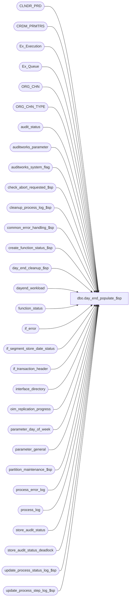

# dbo.day_end_populate_$sp

**Database:** auditworks_external  
**Server:** bedrockdb01  

## Architecture Diagram



## Table Dependencies

| Referenced Table |
|---|
| CLNDR_PRD |
| CRDM_PRMTRS |
| Ex_Execution |
| Ex_Queue |
| ORG_CHN |
| ORG_CHN_TYPE |
| audit_status |
| auditworks_parameter |
| auditworks_system_flag |
| check_abort_requested_$sp |
| cleanup_process_log_$sp |
| common_error_handling_$sp |
| create_function_status_$sp |
| day_end_cleanup_$sp |
| dayend_workload |
| function_status |
| if_error |
| if_segment_store_date_status |
| if_transaction_header |
| interface_directory |
| oim_replication_progress |
| parameter_day_of_week |
| parameter_general |
| partition_maintenance_$sp |
| process_error_log |
| process_log |
| store_audit_status |
| store_audit_status_deadlock |
| update_process_status_log_$sp |
| update_process_step_log_$sp |

## Stored Procedure Code

```sql
create proc dbo.day_end_populate_$sp 
AS
/* Proc name:   day_end_populate_$sp
   Description:	Distribute dayend workload among dayend processes prior to day_end_posting_$sp.
     If a user requests (via gui) an immediate period end without a dayend, then this program will check for
     previously aborted dayends and then return without populating the dayend_workload table.
     Called by smartload ICT_DAYEND.

  NOTE:  This unicode version is suitable for both SA5.0 and SA5.1
 
 *** Script with SET ANSI_NULLS ON and SET ANSI_WARNINGS ON to support scaleout

History:
Date     Name      Def#  Action
May21,14 Paul     T69544 expanded @process_log_message variable to match process_log.file_name column definition
Jan23,14 Paul     148739 Use try .. catch, use TOP command for SQL 2014 compatability, added nolock
Aug22,13 Paul     146163 scaleout: when running on consolidated, only one dayend stream will be started
Apr23,13 Vicci    143314 Don't set day_end_started_date when period_end_only = 1 since nothing will set day_end_completed_date
                         and that will cause the UI DayEnd window to display a status of aborted when the period end completes.
                         Since the dayend_in_progress still needs to be set, aborts checked for, etc, don't just return if called
                         from scalecout consolidated, instead just skip the pop of dayend workload.
Jan10,12 Paul     132256 Raise error 201612 if months cannot be found in the CRDM calendar (bad config)
Aug08,11 Paul     128946 Report @cldr_id = NULL as a bad calendar error (bad setup)
Apr11,11 Paul     126155 Prevent error 220 arithmetic overflow on insert to #store_date for old dates.
Jan04,11 Paul     105313 Use unicode datatypes
Nov02,10 Paul     122281 Change business rule message to avoid aborting mssql smartload when date(s) not in calendar.
Oct09,10 Vicci    121621 Recognize dayend_in_progress flag value 2 = looping to pick up next batch of store/dates;  
			 Don't reset start date if just doing next batch.
			 Call cleanup if function status rows exist even if dayend_in_progress = 0 since may have aborted.
Sep10,10 Phu      120589 Clear last request date and request by only if the current day-end is run by system.
Oct05,09 Phu      107710 Reset request by, request date to null when dayend runs, so that front end displays status properly.
Jan21,09 Paul     107623 handle scaleout scenarios, call partition_maintenance_$sp.
Jul17,07 Phu     DV-1363 To handle SA5 front end request 'period-end only'.
Feb06,07 Phu       81714 Update process_step_log.
Feb05,07 Paul      82449 Log successful start date to auditworks_system_flag. Apply 42301, 75680, 1-39RAI3 to SA5.
Jan04,07 Paul      80915 Don't insert function_status if a row already exists
Nov06,06 Paul      74790 read CRDM_PRMTRS to get CLNDR_ID
Aug11,06 Paul    DV-1344 avoid overflow when dayending very old dates
Nov22,05 Paul    DV-1324 don't run dayend if period_end_only was requested in gui
Jul08,05 Paul    DV-1295 treat null in GL_CMPNY_NUM as zero.
Feb08,05 Maryam  DV-1203 Change and to OR for auto_accepted flag.
Dec13,04 David   DV-1191 Improve performance by adding hints.
Oct25,04 David   DV-1159 Use clndr_prd_num instead of clndr_prd_name. 
Oct12,04 Maryam  DV-1146 Look at auto_accepted flag instead of status_set_by_user_id to handle dayend delays.
Aug05,04 Sab     DV-1071 Changes required for bank tables, pass @process_id and @user_id to the sub procs,
			 Use ORG_CHN table as the new Store table, new Calendar table.
Aug04,06 Vicci     75680 Don't clean up oim tables if outstanding if-error exist
                         Look for excluded store/dates for interfaces with update_timing > 0 
                         and subject-to-dayend = 1
Mar20,06 Daphna 1-39RAI3 Use store_audit_status.auto_accepted to evaluate day-end delay
                 / 69360
Oct06,04 Vicci	   42301 Set context_info to indicate that the current spid is running dayend.
Feb17,04 Phu     24432 Fix excluded store/dates having wrong error message.
Oct31,03 Phu     15801 Exclude store/dates that are subjected to interfaces posted.
Sep19,03 Maryam  13686 Restructured the code and removed dayend_process_id and it's related codes
                       also added the batching logic.
Nov30,01 Phu      8931 Progress monitor and error handling
Nov11,01 Sab	  1-8Q9W4 procedure ignoring the delay due to store_audit_status has the status_set_by = auditworks_edit
Sep25,01 Henry    8783 Corrections to the multi-stream dayend.
Jul20,01 Henry	  8286 Modify cleanup logic to work correctly with multi-stream dayend.
		       Replaces Defects 7493 in Oracle.
Apr04,01 Phu      7501 Use system function to retrieve user name
Jan31,01 Maryam   7296 instead of using tax_strip_table no, use log_tax_override column from
		       store_salesaudit.
Jan30,01 Paul   7272 changed log message for compatibility with new smartload
Jan15,01 Maryam   7205 Insert tax_strip_flag as 0. sales_tax_main_$sp will update the flag.
Oct06,00 Maryam   6790 Load the log_tax_override field.
		       tax_strip_table_no from store_salesaudit was used as this flag.
Oct04,00 Maryam   6788 Load the tax_strip_flag field. 
Sep12,00 Shapoor  6663 Facilitate Multi Stream Dayend.  Remove the cursor that populates the 
		       dayend_workload table.
Jul17,00 Maryam   4743 Change data type of @current_date from smalldatetime to datetime.
Mar27,00 Paul     5630 Remove not in clause for better performance
Mar01,00 Phu      5900 Change @@fetch_status > 0 to @@fetch_status <> 0 for MS SQL compatibility
Apr21,99 Mat C    4460 Log error for any sales_dates not defined in calendar
Oct29,97 Paul S
Oct14,97 Phu      n/a  Creation
*/

DECLARE
	@autoaccept_dayend_delay_hrs 		smallint,
	@batch_process_id 			tinyint,
	@batch_count				int,
         @compare_time				int,
 	@concurrent_dayend_processes 		tinyint,
	@current_date 				datetime,
	@current_day_of_week 			tinyint,
	@dayend_id 				tinyint,
	@dayend_batch_store_dates               int,
	@dayend_in_progress 			tinyint,
	@dayend_delayed_days 			tinyint,
	@dayend_delay_ignored 			tinyint,
	@dayend_posting_function_no 		tinyint,
	@dayend_subject_to_posting			tinyint,
	@errmsg 					nvarchar(2000),
	@errmsg2					nvarchar(2000),
	@errmsg3					nvarchar(2000),
	@errline					int,
	@errno					int,
	@expected_workload			int,
	@excluded_dayend_to_time                int,
	@excluded_dayend_from_time              int,
	@function_name 				varbinary(128),
	@function_no 				tinyint,
	@last_date_closed 			smalldatetime,
	@message_id				int,
	@new_store_audit_status 		smallint,
	@num_store_per_process 			int,
	@object_name				nvarchar(255),
	@operation_name				nvarchar(100),
	@partitioning_in_use			smallint,
	@period_end_date 			smalldatetime,
	@period_end_only			int,
	@preliminary_period_end_date		smalldatetime,
	@process_id 				binary(16),
	@process_name				nvarchar(100),
	@process_timestamp 			float,
	@rows					int,
	@scaleout_flag				int,
	@store_audit_status 			smallint,
	@store_count 				int,
	@store_excluded_count 			int,
	@accepted_store_count			int,
	@process_log_message			nvarchar(255),
	@workload_distrib			int,
	@distrib_percent			float,
	@pass_quantity				int,
	@clndr_id				binary(16),
	@lvl_year				binary(16),
	@lvl_month				binary(16);


SELECT  @function_no = 17,
	@function_name = CONVERT(varbinary(128),'auditworks_dayend1'),
	@dayend_posting_function_no = 18,
	@process_id = @@spid,
	@new_store_audit_status = 301,
	@current_date = getdate(),
	@dayend_id = 1,
	@pass_quantity = 1,
	@autoaccept_dayend_delay_hrs = 0,
	@accepted_store_count = 0,
	@workload_distrib = 0,
	@distrib_percent = 0,
	@process_name = 'day_end_populate_$sp',
	@message_id = 201068,
	@process_log_message = 'There are store/dates to be completed.',
	@period_end_only = 0;

BEGIN TRY
    SELECT @errmsg = 'Failed to select scaleout_flag',
         @object_name = 'auditworks_system_flag',
          @operation_name = 'SELECT';
SELECT @scaleout_flag = CONVERT(int,flag_numeric_value)
  FROM auditworks_system_flag
 WHERE flag_name = 'scaleout_flag';

SELECT @rows = @@rowcount;
IF @rows = 0
    GOTO business_error;
  
SET ANSI_NULLS ON;
SET ANSI_WARNINGS ON; -- needed when scaleout_flag = 1

   SELECT @errmsg = 'Failed to read period_end_only flag',
             @object_name = 'auditworks_system_flag',
             @operation_name = 'SELECT';
SELECT @period_end_only = CONVERT(int,flag_numeric_value)
  FROM auditworks_system_flag
 WHERE flag_name = 'period_end_only';

SELECT @current_day_of_week = DATEPART(dw, @current_date);

	SELECT @errmsg = 'Unable to select autoaccept_dayend_delay_hrs flag from parameter_day_of_week.',
	       @object_name = 'parameter_day_of_week';
SELECT @autoaccept_dayend_delay_hrs = ISNULL(CONVERT(SMALLINT,autoaccept_dayend_delay_hrs),0)
  FROM parameter_day_of_week
 WHERE day_of_week = @current_day_of_week;

IF @autoaccept_dayend_delay_hrs IS NULL
  SELECT @autoaccept_dayend_delay_hrs = 0;

	SELECT @errmsg = 'Unable to select dayend_in_progress flag from parameter_general',
	       @object_name = 'parameter_general';
SELECT  @concurrent_dayend_processes = concurrent_dayend_processes,
	@dayend_delay_ignored = dayend_delay_ignored,
	@dayend_delayed_days = dayend_delayed_days,
	@dayend_in_progress = dayend_in_progress,
	@last_date_closed = last_date_closed,
	@period_end_date = period_end_date,
	@preliminary_period_end_date = preliminary_period_end_date,
	@dayend_batch_store_dates = dayend_batch_store_dates
 FROM parameter_general;

SELECT @rows = @@rowcount;
IF @rows = 0
    GOTO business_error;

/* If running on consolidated, then only 1 dayend stream is needed (minimizes config effort).
       Note: dayendpop.ict inside ICT_DAYEND also contains similar logic to read concurrent_dayend_processes */
IF @scaleout_flag = 2
  SELECT @concurrent_dayend_processes = 1;

-- Calls cleanup logic if previous dayend did not complete successfully OR is still running.
IF @dayend_in_progress = 1 OR EXISTS (SELECT 1 FROM function_status WITH (NOLOCK) WHERE function_no IN (16, 18))
  BEGIN
	SELECT @errmsg = 'Unable to execute procedure day_end_cleanup_$sp',
		       @object_name = 'day_end_cleanup_$sp',
		       @operation_name = 'EXECUTE';
	EXEC day_end_cleanup_$sp @process_id, @dayend_in_progress OUTPUT;  
  END;

--Check to see if the dayend cleanup was successful.
IF @dayend_in_progress = 1
  BEGIN
	SELECT @errno = 201539,
		@errmsg = 'Day end is in progress or previous day end terminated abnormally. Please verify';
	GOTO business_error;
  END;

/* cleanup process_log for previously aborted processes */
EXEC cleanup_process_log_$sp;

-- determine whether partitioning is turned on
  SELECT @errmsg = 'Unable to retrieve partitioning_in_use',
         @object_name = 'auditworks_system_flag',
         @operation_name = 'SELECT'
SELECT @partitioning_in_use = flag_numeric_value
FROM auditworks_system_flag
WHERE flag_name = 'partitioning_in_use';

    SELECT @errmsg = 'Unable to select @excluded_dayend_from_time',
	   @object_name = 'auditworks_parameter';
SELECT @excluded_dayend_from_time = CONVERT(int, par_value)
  FROM auditworks_parameter
 WHERE par_name = 'excluded_dayend_from_time';

    SELECT @errmsg = 'Unable to select @excluded_dayend_to_time';
SELECT @excluded_dayend_to_time = CONVERT(int, par_value)
  FROM auditworks_parameter
 WHERE par_name = 'excluded_dayend_to_time';


-- If previous dayend was requested by user and the current dayend is initiated by system/job scheduler then reset the values.
IF EXISTS (SELECT 1 FROM parameter_general
           WHERE immediate_dayend_requested = 0)
BEGIN
      SELECT @errmsg = 'Unable to set day_end_request_date to null',
             @object_name = 'auditworks_system_flag',
	     @operation_name = 'UPDATE';
  UPDATE auditworks_system_flag
    SET flag_datetime_value = NULL
   WHERE flag_name = 'day_end_request_date';

 SELECT @errmsg = 'Unable to set day_end_requested_by to null';
  UPDATE auditworks_system_flag
    SET flag_numeric_value = NULL
   WHERE flag_name = 'day_end_requested_by';
END; -- IF EXISTS

SELECT @errmsg = 'Unable to set CONTEXT_INFO';
SET CONTEXT_INFO @function_name;

BEGIN TRAN;

IF @dayend_in_progress <> 2  --i.e. not just pickup up next batch of store/dates (in which case start was already set when 1st batch done)
   AND COALESCE(@period_end_only, 0) <> 1
BEGIN
    SELECT @errmsg = 'Unable to update start date',
           @object_name = 'auditworks_system_flag',
	   @operation_name = 'UPDATE';
  UPDATE auditworks_system_flag
     SET flag_datetime_value = getdate()
   WHERE flag_name = 'day_end_started_date';
END;

--Set the dayend_in_progress flag (even for period end so that another scheduled dayend can't start up)
    SELECT @errmsg = 'Unable to set dayend_in_progress flag to 1 in parameter_general',
	   @object_name = 'parameter_general',
	   @operation_name = 'UPDATE';
UPDATE parameter_general
   SET dayend_in_progress = 1;

    SELECT @errmsg = 'Unable to set immediate_dayend_requested flag to 0 in parameter_general';
UPDATE parameter_general
   SET immediate_dayend_requested = 0
 WHERE immediate_dayend_requested = 1;

COMMIT TRAN;

      SELECT @errmsg = 'Failed to execute stored procedure check_abort_requested_$sp',
           @object_name = 'check_abort_requested_$sp',
           @operation_name = 'EXECUTE';
EXEC check_abort_requested_$sp 1, @process_id, 17,
                        @excluded_dayend_from_time, @excluded_dayend_to_time, @errmsg3 OUTPUT;
        
--INSERT entry to function_status if entry does not already exist.
SELECT @rows = 0;

SELECT @rows = COUNT(user_id)
  FROM function_status WITH (NOLOCK)
 WHERE function_no = @dayend_posting_function_no;

IF @rows = 0
  BEGIN
	SELECT @errmsg = 'Unable to execute stored proc create_function_status_$sp',
		    @object_name = 'create_function_status_$sp',
		    @operation_name = 'EXECUTE';
	EXEC create_function_status_$sp @process_id     = @process_id, 
	                                @user_id        = null, 
	                                @function_no    = @dayend_posting_function_no, 
	                                @transaction_id = 0, 
	                                @errmsg         = @errmsg3 OUTPUT;
  END;

IF @period_end_only = 1
BEGIN
  SELECT @process_log_message = 'Warning: No store/dates will be completed -only the period end is being run.';
  GOTO populate_ok; -- avoid populating dayend_workload if user requested only period end in gui
END

	SELECT @errmsg = 'Unable to create temp table #store_date',
	       @object_name = '#store_date',
	       @operation_name = 'CREATE';
CREATE TABLE #store_date (
	store_no 			int 		not null,
	sales_date 			smalldatetime 	not null,
	date_reject_id 			tinyint 	not null,
	store_audit_status 		smallint 	not null,
	merchandise_year_no 		smallint 	not null,
	merchandise_month_no 		tinyint 	not null,
	gl_company 			int 		not null,
	tax_jurisdiction 		nchar(5) 	not null,
	store_deposit_destination 	smallint 	not null,
	tax_strip_flag			tinyint		null,
	log_tax_override 		tinyint         null );

	SELECT @errmsg = 'Unable to create temp table #sales_date',
	       @object_name = '#sales_date';
CREATE TABLE #sales_date (sales_date	smalldatetime 	not null);

    SELECT @errmsg = 'Unable to select calendar id',
           @object_name = 'auditworks_parameter',
           @operation_name = 'SELECT';
SELECT @clndr_id = PRMTR_VAL_BIN
  FROM CRDM_PRMTRS
 WHERE PRMTR_NAME = 'GL_PSTNG_CLNDR_ID';

SELECT @rows = @@rowcount;
IF (@rows = 0 OR @clndr_id IS NULL)
  BEGIN
    SELECT @errno = 201612;
    GOTO business_error;
  END;

    SELECT @errmsg = 'Unable to select year level type id',
           @object_name = 'auditworks_parameter',
           @operation_name = 'SELECT';
SELECT @lvl_year = par_bin_value
  FROM auditworks_parameter
 WHERE par_name = 'clndr_lvl_year';

    SELECT @errmsg = 'Unable to select month level type id',
           @object_name = 'auditworks_parameter',
           @operation_name = 'SELECT';
SELECT @lvl_month = par_bin_value
  FROM auditworks_parameter
 WHERE par_name = 'clndr_lvl_month';

	SELECT @errmsg = 'Unable to insert into #sales_date',
	       @object_name = '#sales_date',
	       @operation_name = 'INSERT';
INSERT INTO #sales_date
SELECT DISTINCT sales_date
  FROM store_audit_status WITH (INDEX = store_audit_status_x2)
 WHERE store_audit_status = 300;

SELECT @accepted_store_count = @@rowcount;

/* ensure that the calendar month level can be found in order to detect cases where
   parameters clndr_lvl_month and clndr_lvl_year are incorrectly configured in auditworks_parameter. */

SELECT @rows = 0;
    SELECT @errmsg = 'Unable to find any month level rows in CRDM calendar. Verify clndr_lvl parameters in auditworks_parameter.',
           @object_name = 'CLNDR_PRD',
          @operation_name = 'SELECT';
IF EXISTS( SELECT 1
           FROM CLNDR_PRD c
           WHERE c.CLNDR_ID = @clndr_id
             AND c.CLNDR_LVL_TYPE_ID = @lvl_month)
  SELECT @rows = 1;

IF @rows = 0
  BEGIN
    SELECT @errno = 201612;
    GOTO business_error;
  END;

/* log error if any unmatched sales_date in calendar_date */
IF @accepted_store_count > 0
BEGIN
  SELECT @rows = COUNT(sales_date)
    FROM #sales_date st WITH (NOLOCK), CLNDR_PRD c
   WHERE c.CLNDR_ID = @clndr_id
     AND c.CLNDR_LVL_TYPE_ID = @lvl_year
     AND st.sales_date BETWEEN c.STRT_DATE_TIME AND DATEADD (ss,-1,c.END_DATE_TIME);

  IF @accepted_store_count != @rows
   BEGIN
	/* can't print 'not exists' since it will cause the mssql smartload to abort */
    PRINT ':LOG EXECWARN: Some sales dates are missing from the CRDM calendar table.';

	SELECT @errmsg = 'Unable to insert to process_error_log',
	       @object_name = 'process_error_log',
	       @operation_name = 'INSERT';
    INSERT process_error_log (
	   process_no,
	   error_code,
	   error_timestamp,
	   process_id,
	   verified,
	   verified_by_user_id,
	   error_msg,
	   user_id )
    VALUES (
	   @function_no,
	   201612,
	   getdate(),
	   @process_id,
	   0,
	   NULL,
	   'There are sales dates that do not exist in the CRDM calendar table.',
	   NULL ); 	
   END; -- IF @accepted_store_count != @rows
  ELSE
   BEGIN	-- no unmatched sales_dates, cleanup error log of last dayend
	  SELECT @errmsg = 'Unable to set verified flag.',
		 @object_name = 'process_error_log',
		 @operation_name = 'UPDATE';
    UPDATE process_error_log
    SET verified = 1,
  	   verified_by_user_id = NULL --
     WHERE process_no = @function_no
       AND error_code = 201612;
   END; -- IF @accepted_store_count != @rows

  IF @dayend_delay_ignored = 1
  BEGIN
	SELECT @errmsg = 'Unable to insert #store_date',
	       @object_name = '#store_date',
	       @operation_name = 'INSERT';
    INSERT #store_date (
	   store_no,
	   sales_date,
	   date_reject_id,
	   store_audit_status,
	   merchandise_year_no,
	   merchandise_month_no,
	   gl_company,
	   tax_jurisdiction,
	   store_deposit_destination,
	   tax_strip_flag,
	   log_tax_override )
    SELECT
	   s.store_no,
	   s.sales_date,
	   s.date_reject_id,
	   s.store_audit_status,
           c1.CLNDR_PRD_NUM,
           c2.CLNDR_PRD_NUM,
	   ISNULL(ss.GL_CMPNY_NUM,0),
	   ss.TAX_JRSDCTN_CODE,
	   ISNULL (ss.PRMRY_BANK_ACNT_ID, 0),
	   0, -- tax_strip_flag will be updated by sales_tax_main_$sp
	   (ABS (SIGN (CHARINDEX (T.SYS_CODE, 'WEBCTLG')) - 1)) + 1
      FROM store_audit_status s,
	   CLNDR_PRD c1, 
	   CLNDR_PRD c2,
	   ORG_CHN ss,
	   ORG_CHN_TYPE T
     WHERE s.store_audit_status = 300
       AND s.store_no = ss.ORG_CHN_NUM
       AND ss.ORG_CHN_TYPE_CODE = T.ORG_CHN_TYPE_CODE
       AND s.date_reject_id = 0
       AND s.update_in_progress = 0
       AND c1.CLNDR_ID = @clndr_id
       AND c1.CLNDR_LVL_TYPE_ID = @lvl_year
       AND s.sales_date BETWEEN c1.STRT_DATE_TIME AND DATEADD (ss,-1,c1.END_DATE_TIME)
       AND c2.CLNDR_ID = @clndr_id
       AND c2.CLNDR_LVL_TYPE_ID = @lvl_month
       AND s.sales_date BETWEEN c2.STRT_DATE_TIME AND DATEADD (ss,-1,c2.END_DATE_TIME)
    ORDER BY s.sales_date, s.store_no;

    SELECT @store_count = @@rowcount;
  END;
  ELSE
   BEGIN
      SELECT @errmsg = 'Unable to insert #store_date',
	     @object_name = '#store_date',
	     @operation_name = 'INSERT';
    INSERT #store_date (
	   store_no,
	   sales_date,
	   date_reject_id,
	   store_audit_status,
	   merchandise_year_no,
	   merchandise_month_no,
	   gl_company,
	   tax_jurisdiction,
	   store_deposit_destination,
	   tax_strip_flag,
	   log_tax_override )
    SELECT s.store_no,
	   s.sales_date,
	   s.date_reject_id,
	   s.store_audit_status,
           c1.CLNDR_PRD_NUM,
           c2.CLNDR_PRD_NUM,
	   ISNULL(ss.GL_CMPNY_NUM,0),
	   ss.TAX_JRSDCTN_CODE,
	   ISNULL (ss.PRMRY_BANK_ACNT_ID, 0),
	   0, -- tax_strip_flag will be updated by sales_tax_main_$sp
	   (ABS (SIGN (CHARINDEX (T.SYS_CODE, 'WEBCTLG')) - 1)) + 1
      FROM store_audit_status s,
	   CLNDR_PRD c1, 
	   CLNDR_PRD c2,
	   ORG_CHN ss,
	   ORG_CHN_TYPE T
     WHERE s.store_audit_status = 300
       AND s.store_no = ss.ORG_CHN_NUM
       AND ss.ORG_CHN_TYPE_CODE = T.ORG_CHN_TYPE_CODE
       AND s.date_reject_id = 0
       AND s.sales_date <= dateadd (dd, @dayend_delayed_days * -1, @current_date)
       AND c1.CLNDR_ID = @clndr_id
       AND c1.CLNDR_LVL_TYPE_ID = @lvl_year
       AND s.sales_date BETWEEN c1.STRT_DATE_TIME AND DATEADD (ss,-1,c1.END_DATE_TIME)
       AND c2.CLNDR_ID = @clndr_id
       AND c2.CLNDR_LVL_TYPE_ID = @lvl_month
       AND s.sales_date BETWEEN c2.STRT_DATE_TIME AND DATEADD (ss,-1,c2.END_DATE_TIME)
       AND s.update_in_progress = 0
       AND (CONVERT(int, DATEDIFF (hh, s.store_status_date, @current_date)) >= @autoaccept_dayend_delay_hrs
             OR s.auto_accepted = 0 )	        
    ORDER BY s.sales_date, s.store_no;

    SELECT @store_count = @@rowcount;

  END; /* else of IF @dayend_delay_ignored */

      SELECT @errmsg = 'Unable to select min(interface_id) from interface_directory',
	     @object_name = 'interface_directory',
	     @operation_name = 'SELECT';
  SELECT @dayend_subject_to_posting = SIGN(MIN(interface_id))
  FROM interface_directory
  WHERE dayend_subject_to_posting = 1
    AND update_timing > 0;

  IF @dayend_subject_to_posting IS NOT NULL --
    BEGIN
          SELECT @errmsg = 'Unable to create temp table #store_date_excluded',
                 @object_name = '#store_date_excluded',
                 @operation_name = 'CREATE';
      CREATE TABLE #store_date_excluded (
	        store_no         int           not null,
	        transaction_date smalldatetime not null );

      IF NOT EXISTS (SELECT 1 
                       FROM if_error 
                      WHERE interface_id in (SELECT interface_id 
      					       FROM if_segment_store_date_status))
      BEGIN
          SELECT @errmsg = 'Unable to delete if_segment_store_date_status',
                 @object_name = 'if_segment_store_date_status',
                 @operation_name = 'DELETE';
        DELETE if_segment_store_date_status
        FROM if_segment_store_date_status ifs, oim_replication_progress oim
        WHERE ifs.segment_id = oim.base_segment_id
          AND ifs.last_queue_id <= oim.oim_replication_queue_id;
      END;

          SELECT @errmsg = 'Unable to insert #store_date_excluded from if_transaction_header/if_segment_store_date_status',
                 @object_name = '#store_date_excluded',
                 @operation_name = 'INSERT';
      INSERT INTO #store_date_excluded (store_no, transaction_date)
     SELECT DISTINCT h.store_no, h.transaction_date
        FROM interface_directory id, Ex_Queue xq, if_transaction_header h WITH (NOLOCK)
       WHERE id.dayend_subject_to_posting = 1 
        AND id.interface_id = xq.queue_id
        AND xq.key_1 = h.if_entry_no
        AND xq.serial_no NOT IN (SELECT xq.serial_no
                               FROM Ex_Execution ee 
                               WHERE xq.queue_id = ee.queue_id 
		        AND xq.serial_no >= ee.from_serial_no 
		        AND xq.serial_no <= ee.to_serial_no)
      UNION
      SELECT ifs.store_no, ifs.transaction_date
        FROM interface_directory id, if_segment_store_date_status ifs
       WHERE id.dayend_subject_to_posting = 1 
         AND id.interface_id = ifs.interface_id;

      SELECT @store_excluded_count = @@rowcount;

      IF @store_excluded_count > 0
        BEGIN
              SELECT @errmsg = 'Unable to insert process_error_log from #store_date_excluded',
                     @object_name = 'process_error_log',
                     @operation_name = 'INSERT';
          INSERT INTO process_error_log (
            process_no,
            error_code,
            error_timestamp,
            process_id,
            verified,
            error_msg,
            user_id,
            message_id,
            process_name,
            object_name,
            operation_name,
            memo1,
            memo_date,
            stream_no)
          SELECT
            @function_no,
            201687,
            getdate(),
            @process_id,
            0,
            'Dayend is skipping store |1, date |d1 due to dayend_subject_to_posting flag constraint.',
            null,
            201687,
            @process_name,
            'store_audit_status',
            'Validate',
            sde.store_no,
            sde.transaction_date,
            1
          FROM #store_date_excluded sde WITH (NOLOCK), #store_date sd WITH (NOLOCK)
          WHERE sde.store_no = sd.store_no
          AND sde.transaction_date = sd.sales_date;

              SELECT @errmsg = 'Unable to delete #store_date from #store_date_excluded',
                     @object_name = '#store_date',
                     @operation_name = 'DELETE';
          DELETE #store_date
           FROM #store_date sd, #store_date_excluded sde WITH (NOLOCK)
          WHERE sd.store_no = sde.store_no
          AND sd.sales_date = sde.transaction_date;

          SELECT @store_count = COUNT(store_no)
          FROM #store_date;

        END; -- if @store_excluded_count > 0

      DROP TABLE #store_date_excluded;
    END; -- if @dayend_subject_to_posting is not null

  IF @store_count < @concurrent_dayend_processes OR @concurrent_dayend_processes = 0
    SELECT @concurrent_dayend_processes = 1;
    
  IF @store_count > @dayend_batch_store_dates
    SELECT @pass_quantity = @store_count / @dayend_batch_store_dates;
    
  SELECT @expected_workload = ((@concurrent_dayend_processes * 10) + 20 ) * @pass_quantity;        

  --INSERT all store/dates into dayend_workload regardless of whether multiple dayend processes.
  --The process_id for multi-streaming will be updated later.

  BEGIN TRAN;
  
  IF @store_count > @dayend_batch_store_dates -- There is more work to do.
  BEGIN
	SELECT @errmsg = 'Unable to set immediate_dayend_requested to 9',
	       @object_name = 'parameter_general',
	       @operation_name = 'UPDATE';
    UPDATE parameter_general
       SET immediate_dayend_requested = 9;
  END; 
  
  /* batch size is controlled by @dayend_batch_store_dates */

      SELECT @errmsg = 'Unable to insert dayend_workload',
	     @object_name = 'dayend_workload',
	     @operation_name = 'INSERT';  
  INSERT dayend_workload (
        dayend_process_id,
	store_no,
	sales_date,
	date_reject_id,
	store_audit_status,
	merchandise_year_no,
	merchandise_month_no,
	gl_company,
	tax_jurisdiction,
	store_deposit_destination,
	tax_strip_flag,
	log_tax_override,
	batch_datetime )
  SELECT TOP (@dayend_batch_store_dates)
	@dayend_id,
 	store_no,
	sales_date,
	date_reject_id,
	@new_store_audit_status,
	merchandise_year_no,
	merchandise_month_no,
	gl_company,
	tax_jurisdiction,
	store_deposit_destination,
	tax_strip_flag,
	log_tax_override,
	@current_date
   FROM #store_date WITH (NOLOCK)
   ORDER BY sales_date, store_no;

  SELECT @batch_count = @@rowcount;
    
       SELECT @errmsg = 'Unable to update store_audit_status_deadlock',
	       @object_name = 'store_audit_status_deadlock',
	       @operation_name = 'UPDATE'; 
  UPDATE store_audit_status_deadlock
     SET function_no = 18,
         status_date = getdate();

  IF @concurrent_dayend_processes > 1
    BEGIN
      -- If multiple streams, then update the dayend_workload with the appropriate stream numbers.
      -- @distrib_percent := 100 --> Equal distribution
      -- @distrib_percent := 70  --> Stream 1 gets less stores.
      -- calculate @workload_distrib as number of store-dates to assign to each stream

      SELECT @dayend_id = @concurrent_dayend_processes,
	     @distrib_percent = 100,
	     @num_store_per_process = (@batch_count / @concurrent_dayend_processes);

      SELECT @workload_distrib = (@batch_count - (@distrib_percent/100 * @num_store_per_process)) / 
    				(@concurrent_dayend_processes - 1);

      WHILE @dayend_id > 1
      BEGIN
            SELECT @errmsg = 'Unable to update dayend_workload for Multi-Stream Dayend',
		   @object_name = 'dayend_workload',
		   @operation_name = 'UPDATE';

        UPDATE TOP (@workload_distrib) dayend_workload
	   SET dayend_process_id = @dayend_id
	 WHERE dayend_process_id = 1
	   AND store_audit_status = @new_store_audit_status; -- exclude any existing in-progress rows

	SELECT @dayend_id = @dayend_id - 1;
      END; -- WHILE @dayend_id > 1

  END; --IF @concurrent_dayend_processes > 1

	SELECT @errmsg = 'Unable to update audit_status with status 301',
	       @object_name = 'audit_status',
	       @operation_name = 'UPDATE';
  UPDATE audit_status
     SET audit_status = @new_store_audit_status
    FROM audit_status a, dayend_workload ts
   WHERE ts.store_no = a.store_no
     AND ts.sales_date = a.sales_date
     AND ts.date_reject_id = a.date_reject_id
     AND a.audit_status = 300
     AND ts.batch_datetime = @current_date;

        SELECT @errmsg = 'Unable to update store_audit_status with status 301',
	       @object_name = 'store_audit_status',
	       @operation_name = 'UPDATE';
  UPDATE store_audit_status
     SET store_audit_status = @new_store_audit_status,
         update_in_progress = 20
    FROM store_audit_status s, dayend_workload ts
   WHERE ts.store_no = s.store_no
     AND ts.sales_date = s.sales_date
     AND ts.date_reject_id = s.date_reject_id
     AND s.store_audit_status = 300
     AND ts.batch_datetime = @current_date;
     
 COMMIT TRAN;
 
 SELECT @store_count = COUNT(store_no)
   FROM dayend_workload
  WHERE store_audit_status = @new_store_audit_status;

END; -- IF @accepted_store_count > 0
ELSE
 BEGIN
  SELECT @store_count = 0;
  IF NOT EXISTS(SELECT store_no
                  FROM dayend_workload)
    SELECT @process_log_message = 'There are no store/dates to be completed';                  
 END;


populate_ok:

SELECT @expected_workload = COALESCE(@expected_workload, 30);
    SELECT @errmsg = 'Unable to execute proc update_process_status_log_$sp',
           @object_name = 'update_process_status_log_$sp',
           @operation_name = 'EXECUTE';
EXEC update_process_status_log_$sp @dayend_posting_function_no, @expected_workload, 0, 0, 0, 0, @current_date;

    SELECT @errmsg = 'Unable to execute proc update_process_step_log_$sp',
           @object_name = 'update_process_step_log_$sp',
           @operation_name = 'EXECUTE';
EXEC update_process_step_log_$sp @dayend_posting_function_no, 1, 0, NULL, NULL, @current_date;

-- Create entry in process_log. The transaction_count will be the number 
-- of store/dates in dayend_workload.

SELECT @process_timestamp =  DATEPART ( mm, getdate() ) * 100000000000.0
			   + DATEPART ( dd, getdate() ) * 1000000000.0
			   + DATEPART ( hh, getdate() ) * 10000000.0
			   + DATEPART ( mi, getdate() ) * 100000.0
			   + DATEPART ( ss, getdate() ) * 1000.0
			   + DATEPART ( ms, getdate() );

    SELECT @errmsg = 'Unable to insert process_log (store/dates exist)',
	   @object_name = 'process_log',
           @operation_name = 'INSERT';
INSERT process_log (
       process_no, 
       process_timestamp,
       process_start_time,
       process_end_time,
       transaction_count,
       process_status_flag,
       file_name,
       batch_process_id )
VALUES (@function_no,
       @process_timestamp,
       @current_date,
       getdate(),
       COALESCE(@store_count, 0),
       2,
       @process_log_message,
       0 );

IF @partitioning_in_use = 1 AND @scaleout_flag = 0 -- only if not scaleout
BEGIN -- create new partitions and remove old ones
    SELECT @errmsg = 'Unable to execute stored procedure partition_maintenance_$sp',
	   @object_name = 'partition_maintenance_$sp',
	   @operation_name = 'EXECUTE';
  EXEC partition_maintenance_$sp;
END;

-- In a scaleout environment with partitioning active, the proc scaleout_cons_int_p1_$sp on consolidated server
-- will call partition_maintenance_$sp instead of the logic above


SELECT 'DAYEND_POPULATE_OK';
RETURN;


business_error:   /* Business Rule handler. */

	SELECT @errmsg2 = @errmsg;

	/* Could include similar cleanup code to system error trap when needed (example is from move_store_$sp).
	   However, could also exclude the cleanup code here since the outer system error catch should fire again after the exec below. */

        EXEC common_error_handling_$sp @function_no, @errno, @errmsg, 0, @message_id,
             @process_name, @object_name, @operation_name, 1, 1, 0, null, 0, null, null,
             null, null, null, null, 0, @process_id, null;
	  /* Note: when the exec above raises an error, that action also fires the system error trap (below) */
	RETURN;
END TRY

BEGIN CATCH; -- trap system errors
    /* common error handling. Appending proc name here because a rollback could occur if called within a transaction. */

        SELECT @errno = ERROR_NUMBER(),
		@errline = ERROR_LINE();

        SELECT @errmsg = CONVERT(nvarchar, @errno) + ':' + @process_name + ':' + CONVERT(nvarchar, @errline) + ':'
               + COALESCE(@errmsg, ' ') + ':' + ERROR_MESSAGE();

	 /* this condition will only be true when raise error in traps above fire this general catch */
	IF @errmsg2 IS NOT NULL
	  SELECT @errmsg = @errmsg2;

	EXEC common_error_handling_$sp @function_no, @errno, @errmsg, 0, @message_id,
             @process_name, @object_name, @operation_name, 1, 1, 0, null, 0, null, null,
             null, null, null, null, 0, @process_id, null;

	RETURN;
END CATCH;
```

