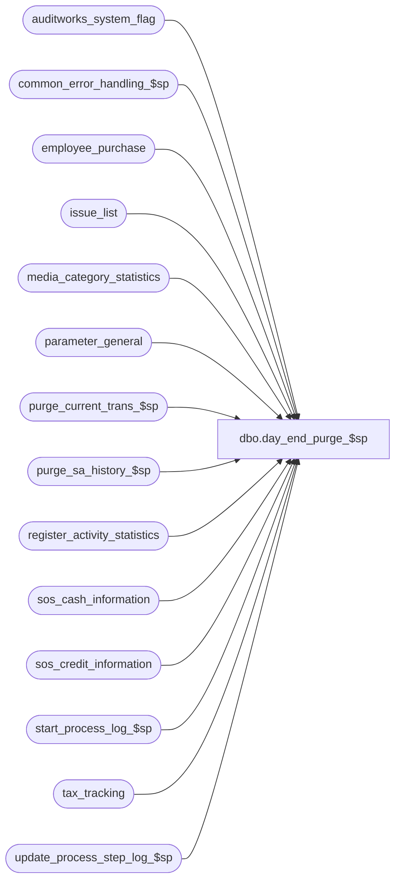

# dbo.day_end_purge_$sp

**Database:** auditworks_external  
**Server:** bedrockdb01  

## Architecture Diagram



## Table Dependencies

| Referenced Table |
|---|
| auditworks_system_flag |
| common_error_handling_$sp |
| employee_purchase |
| issue_list |
| media_category_statistics |
| parameter_general |
| purge_current_trans_$sp |
| purge_sa_history_$sp |
| register_activity_statistics |
| sos_cash_information |
| sos_credit_information |
| start_process_log_$sp |
| tax_tracking |
| update_process_step_log_$sp |

## Stored Procedure Code

```sql
CREATE proc [dbo].[day_end_purge_$sp] 
@multiplier	tinyint = 0
 
AS

 /* 
PROC NAME: day_end_purge_$sp
     DESC: Purges ( deletes ) old entries from tracking tables: 
	   media_category_stats, employee_purchase, register_activity, media_reconciliation,
	   petty_cash_reconciliation, tax_tracking, sos, Audit Trail 
	   Deletes transactions (already archived) from transaction_header.
	   This procedure is called from day-end.
	   Most errors on delete will log but will not abort the procedure since the next 
	   run will finish the delete. 

  NOTE:  This SA 5.1 version is different than the 5.0 version due to enh 147019

HISTORY:
Date     Name         Def#  Desc
Jan29,14 Paul       147019  Multistream Purge : Moved purge of media rec and shared sa history tables to purge_sa_history_$sp.
				Moved purge of current trans to purge_current_trans_$sp, use try catch.
Feb27,13 Vicci      142106  Do not delete media_reconciliation_status without also cleaning up media_reconciliation_detail and media_unreconciliation
                            since otherwise orphaned entries (with balancing_entity_id which is no longer valid) are left behind.
Jan04,13 Vicci      140866  Clean up process_log_detail too.
Apr20,11 Paul       126275  When purging translate_error, also purge old entries that may not have transaction_date set.
Jan04,11 Paul       105313  Use unicode datatypes for error trap
Feb17,11 Vicci      124965  Avoid leaving unpurged rows in table media_reconciliation_trans for register Z-reads
			    (daily totals calculated by POS) recorded under a balancing entity which not used in any real 
			    (trade or cash-management) transactions.
Feb11,11 Paul       105977  Uplift SA5 fixes to SA5.1 unicode
Jan31,11 Paul       124471  Avoid leaving some unpurged rows in table media_reconciliation_trans
Jun10,10 Paul     1-3ZL8RD  Increase the maximum possible @batch_no to 9 digits.
May27,10 Paul       118092  Purge rows from scaleout_execution (only populated on scaleout consolidated server)
Jun05,08 Vicci      101851  Uplift 101672 to SA5:  handle rec_side -2 (fund transfer without reconciliation)
May29,08 Paul       101622  Uplift 101680 to SA5
Aug13,07 Phu       DV-1363  Uplift 1-3POX5R to SA5
Jun15,07 Paul      DV-1363  uplift 86408 to SA5
Sep09,05 Paul      DV-1312  apply 40547 to SA5,removed unnecessary begin-commits (only needed for Oracle), avoid count
Jun21,04 David     DV-1071  Remove cleanup of store_closed_date table.
Apr13,04 Sab	   DV-1068  Remove exec cust_liab_summ_period_end_$sp, media_parameter, media_rec and petty_cash
Jun03,08 Vicci      101672  handle rec_side -2 (fund transfer without reconciliation)
May27,08 PaulS      101680  improve performance of media rec purge
Aug13,07 Phu      1-3POX5R  Prevent batch_no identity value runs out in table work_archive_batch. No Oracle change.
Jun15,07 Paul        86408  allow purging media_reconciliation_trans earlier than media_reconciliation_detail
Sep13,04 Daphna      40547  add BEGIN TRAN to store_performance loop
Feb12,04 Maryam      23341  Deactivate the legacy functionality once all legacy media rec
                            history has dropped off the system.
Dec01,03 Phu         15801  Call oim_purge_$sp
Jun04,03 Winnie	      9250  Media Reconciliation enhancements.	
Sep13,02 Paul      1-FCICT  correctly initialize @batch_count to zero
Jun03,02 Winnie    1-CD0IX  standardize R3.5 error handling.
Mar14,02 Henry	   1-A8XPT  To use transaction_date in translate_error table.
Nov30,01 Phu          8931  Error handling
Aug16,01 Winnie	      8043  To prevent error in insert to petty_cash_reconciliation when 
			    dayend is run twice on the same day.
Aug10,01 Shapoor      8481  Use 'transaction_per_batch' parameter to determine batching size.
Jun05,01 Shapoor      7568  Correct the logic of the purge of subledger periods retained and 
			    move the cleanup from day_end_purge_$sp to subledger_rollup_$sp.
May14,01 Maryam	      7444  Clean up tax issues from the issue_list when it cleans up tax_tracking.
Jan30,01 Paul         7272  Changed log message for compatibility with new smartload
Jan25,01 Henry        7259  Added :LOG messages to identify phase of dayend_purge in progress.
Oct16,00 Louise       6831  Purge the store_closed_date table based on extended_archive_
                            days_retained instead of archive_days_retained.
Sep12,00 Shapoor      6664  Change the batching logic so that we call purge_details_$sp
                            proc after accumulating upto 2000 transactions.
Apr11,00 John G 6167 Added logic for cleanup of store_performance table.
Feb02,00 Louise M.    5898  Fixed cleanup of subledger which wasn't working properly. 
Aug25,99 Shapoor      5030  The cleanup of petty_cash_reconciliation was adding the new 
                            summary row, but not deleting the old rows.            
Aug13,99 Daphna F     5043  Moved truncate work_purge_detail inside while loop before 
                            insert into work_purge_detail
Jul23,99 Daphna F     5026  Added call to purge_details_$sp in batch loop instead of deleting 
			    tran details and setting off delete trigger on transaction_header 
Feb22,99 Louise M           Added call to customer_liability_cleanup_$sp 
May16,96 Henry W       n/a  Author version 1.03  
*/

DECLARE
  @batch_no 			int,
  @concurrent_dayend_processes	tinyint,
  @current_date_time		datetime,
  @employee_purchase_days		smallint,
  @errline			int,
  @errno				int,
  @errmsg			nvarchar(2000),
  @errmsg2			nvarchar(2000),
  @errmsg3			nvarchar(2000),
  @last_date_closed		smalldatetime,
  @media_category_days		smallint,
  @message_id			int,
  @object_name			nvarchar(255),
  @operation_name			nvarchar(100),
  @process_name			nvarchar(100),
  @partitioning_in_use		int,
  @process_no 			smallint,
  @process_timestamp 		float,
  @register_activity_days		smallint,
  @rows				integer,
  @sos_cash_days			smallint,
  @sos_credit_days		smallint,
  @tax_days			smallint,
  @trace_msg			nvarchar(255)


SELECT 	@process_no = 16,
	@process_timestamp = 0,
	@message_id = 201068,
	@process_name = 'day_end_purge_$sp',
	@current_date_time = getdate(),
	@errno = 0;

BEGIN TRY

   SELECT @errmsg = 'Failed to select from parameter_general',
	  @object_name = 'parameter_general',
	  @operation_name = 'SELECT';

SELECT @trace_msg = ':LOG => day_end_purge starts: ' + CONVERT(char, getdate(), 8);
PRINT @trace_msg;

SELECT 	@last_date_closed = last_date_closed,
	@employee_purchase_days = employee_purchase_days,
	@media_category_days = media_category_statistics_days,
	@register_activity_days = register_activity_days,
	@sos_cash_days = sos_cash_days,
	@sos_credit_days = sos_credit_days,
	@tax_days = tax_days,
	@concurrent_dayend_processes = concurrent_dayend_processes
  FROM parameter_general;

   SELECT @errmsg = 'Failed to execute stored proc update_process_step_log_$sp for step 61',
	  @object_name = 'update_process_step_log_$sp',
	  @operation_name = 'EXECUTE';
EXEC update_process_step_log_$sp 18, 1, 61, 1, 0, @current_date_time;


   SELECT @errmsg = 'Failed to execute stored proc start_process_log_$sp',
	  @object_name = 'start_process_log_$sp';
EXEC start_process_log_$sp @process_no, @process_timestamp OUTPUT, @errmsg3 OUTPUT, 1

/* Check whether partitioning of archive and interfaces is turned on */

   SELECT @errmsg = ' Unable to select @partitioning_in_use',
	  @object_name = 'auditworks_system_flag',
	  @operation_name = 'SELECT';
SELECT @partitioning_in_use = flag_numeric_value
  FROM auditworks_system_flag
 WHERE flag_name = 'partitioning_in_use';


IF @employee_purchase_days > (@multiplier * -1)
BEGIN

 SELECT @trace_msg = ':LOG => Purge: cleanup employee_purchase_days: ' + CONVERT(char, getdate(), 8);
 PRINT @trace_msg;

   SELECT @errmsg = 'Failed to delete from employee_purchase.',
	  @object_name = 'employee_purchase',
	  @operation_name = 'DELETE';
 DELETE FROM employee_purchase
  WHERE transaction_date < @last_date_closed
    AND transaction_date < DATEADD(dd,@employee_purchase_days * -1,getdate());

END;

IF @media_category_days > (@multiplier * -1)
BEGIN

 SELECT @trace_msg = ':LOG => Purge: cleanup media_category_days: ' + CONVERT(char, getdate(), 8);
 PRINT @trace_msg;

   SELECT @errmsg = 'Failed to delete from media_category_statistics.',
 	  @object_name = 'media_category_statistics',
	  @operation_name = 'DELETE';
 DELETE FROM media_category_statistics
  WHERE transaction_date < @last_date_closed
    AND transaction_date < DATEADD(dd,@media_category_days * -1,getdate());

END;


/* If not using archive partitioning, then purge media rec tables and sa history tables now.
   Otherwise the scheduled job partition_maint_if_susm_$sp will call it. */

IF COALESCE(@partitioning_in_use,0) = 0 -- THEN
  BEGIN
   SELECT @errmsg = 'Failed to exec purge_sa_history_$sp',
	@object_name = 'purge_sa_history_$sp',
	@operation_name = 'EXEC';
   EXEC purge_sa_history_$sp @multiplier;
  END;


IF @register_activity_days > (@multiplier * -1)
BEGIN

 SELECT @trace_msg = ':LOG => Purge: cleanup register_activity_days: ' + CONVERT(char, getdate(), 8);
 PRINT @trace_msg;

   SELECT @errmsg = 'Failed to delete on register_activity_statistics.',
          @object_name = 'register_activity_statistics',
          @operation_name = 'DELETE';
 DELETE FROM register_activity_statistics
  WHERE transaction_date < @last_date_closed
    AND transaction_date < DATEADD(dd,@register_activity_days * -1,getdate());

END;

IF @sos_cash_days > (@multiplier * -1)
BEGIN

 SELECT @trace_msg = ':LOG => Purge: cleanup sos_cash_days: ' + CONVERT(char, getdate(), 8);
 PRINT @trace_msg;

   SELECT @errmsg = 'Failed to delete on sos_cash_information.',
          @object_name = 'sos_cash_information',
          @operation_name = 'DELETE';
 DELETE FROM sos_cash_information
  WHERE transaction_date < @last_date_closed
    AND transaction_date < DATEADD(dd,@sos_cash_days * -1,getdate());

END;

IF @sos_credit_days > (@multiplier * -1)
BEGIN

 SELECT @trace_msg = ':LOG => Purge: cleanup sos_credit_days: ' + CONVERT(char, getdate(), 8);
 PRINT @trace_msg;

   SELECT @errmsg = 'Failed to delete on sos_credit_information.',
          @object_name = 'sos_credit_information',
          @operation_name = 'DELETE';
 DELETE FROM sos_credit_information
  WHERE transaction_date < @last_date_closed
    AND transaction_date < DATEADD(dd,@sos_credit_days * -1,getdate());

END;

IF @tax_days > (@multiplier * -1)
BEGIN

 SELECT @trace_msg = ':LOG => Purge: cleanup tax_days: ' + CONVERT(char, getdate(), 8);
 PRINT @trace_msg;

   SELECT @errmsg = 'Failed to delete on tax_tracking.',
          @object_name = 'tax_tracking',
          @operation_name = 'DELETE';
 DELETE FROM tax_tracking
  WHERE transaction_date < @last_date_closed
    AND transaction_date < DATEADD(dd,@tax_days * -1,getdate());

   SELECT @errmsg = 'day_end_purge_$sp: Failed to delete on issue_list.',
          @object_name = 'issue_list',
          @operation_name = 'DELETE';
 DELETE FROM issue_list
  WHERE issue_type = 1
    AND transaction_date < @last_date_closed
    AND transaction_date < DATEADD(dd,@tax_days * -1,getdate());

END; -- If @tax_days > (@multiplier * -1)


--Cleanup of subledger periods occurs in subledger_rollup_$sp

/*  the following proc will update the process_log for process 16 .
    If using multistream dayend, then cleanup expired trans for stream 1. otherwise clean up all expired trans. */

IF @concurrent_dayend_processes >= 2 --THEN 
	EXEC purge_current_trans_$sp 1, @process_timestamp;
ELSE
	EXEC purge_current_trans_$sp null, @process_timestamp;


SELECT @trace_msg = ':LOG => Purge ends: ' + CONVERT(char, getdate(), 8);
PRINT @trace_msg;

RETURN;


business_error:   /* Business Rule handler. */

	SELECT @errmsg2 = @errmsg;

	/* Could include similar cleanup code to system error trap when needed (example is from move_store_$sp).
	   However, could also exclude the cleanup code here since the outer system error catch should fire again after the exec below. */

	EXEC common_error_handling_$sp @process_no, @errno, @errmsg, 0, @message_id, 
	  @process_name, @object_name, @operation_name, 1;
	  /* Note: when the exec above raises an error, that action also fires the system error trap (below) */
	RETURN;
END TRY

BEGIN CATCH; -- trap system errors
    /* common error handling. Appending proc name here because a rollback could occur if called within a transaction. */

        SELECT @errno = ERROR_NUMBER(),
		@errline = ERROR_LINE();

        SELECT @errmsg = CONVERT(nvarchar, @errno) + ':' + @process_name + ':' + CONVERT(nvarchar, @errline) + ':'
               + COALESCE(@errmsg, ' ') + ':' + ERROR_MESSAGE();

	 /* this condition will only be true when raise error in traps above fire this general catch */
	IF @errmsg2 IS NOT NULL
	  SELECT @errmsg = @errmsg2;
	  
	EXEC common_error_handling_$sp @process_no, @errno, @errmsg, 0, @message_id, 
	  @process_name, @object_name, @operation_name, 1;

	RETURN;
END CATCH;
```

