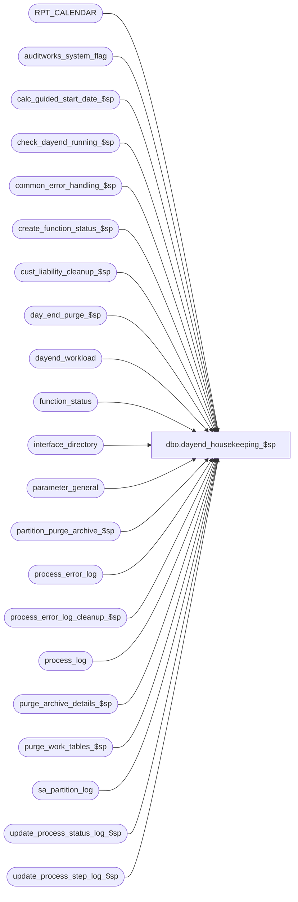

# dbo.dayend_housekeeping_$sp

**Database:** auditworks_external  
**Server:** bedrockdb01  

## Architecture Diagram



## Table Dependencies

| Referenced Table |
|---|
| RPT_CALENDAR |
| auditworks_system_flag |
| calc_guided_start_date_$sp |
| check_dayend_running_$sp |
| common_error_handling_$sp |
| create_function_status_$sp |
| cust_liability_cleanup_$sp |
| day_end_purge_$sp |
| dayend_workload |
| function_status |
| interface_directory |
| parameter_general |
| partition_purge_archive_$sp |
| process_error_log |
| process_error_log_cleanup_$sp |
| process_log |
| purge_archive_details_$sp |
| purge_work_tables_$sp |
| sa_partition_log |
| update_process_status_log_$sp |
| update_process_step_log_$sp |

## Stored Procedure Code

```sql
create proc dbo.dayend_housekeeping_$sp 
( @dayend_process_id            tinyint = NULL,
  @process_id                   binary(16) = NULL --Called by smartload
)

AS

/* 
PROC NAME: dayend_housekeeping_$sp
     DESC: Called by the ICT_DAYEND01 smartload and check_abort_requested_$sp.
           Run by Stream 1 of the Dayend ONLY.
           Takes care of purging data from Current and Archive tables.

HISTORY
Date     Name       Def# Desc
Apr22,13 Vicci    143314 Don't bump up the dayend_completed_date if only a period end was run, otherwise UI Dayend window
                         displays it as having started the last time a real dayend was run but only completed now.
                         The period end only flag has already been turned back off by now, but if the period_end_request_date is after the dayend
                         completed and the completed is after the started we know only a period end was run.
May14,12 Vicci    134811 Re-instate defect 95126 which was accidentally lost when 107351 was submitted.
                         Also, clean up customer liabilities prior to archive since C/L can cause av transactions to be retained in extended archive.
Oct10,10 Vicci    121621 Set update_in_progress to 2 not 0 and print a "Dayend Housekeeping deferred" message if there are more batches of store/dates to be processed (so UI can tell not done).
Sep20,10 Paul     119817 Log a message to smartload when dayend batching logic detects more work to do
Jun18,10 Paul     115834 purge messages from table sa_partition_log. Log only start and end of waiting period (if any) to smartload log
May26,10 Vicci    116687 Don't mark period-end (86) process errors as verified:  dayend-workload being empty does not imply
                         that G/L interfacing / housekeeping has completed successfully.
Jan13,09 Paul     107351 set ansi_warnings on to support scaleout
Jul30,08 Phu       95126 Call partition_purge_archive_$sp
Apr02,08 Phu    1-3XSLKL Fix error:formal parameter @action was not declared as an OUTPUT parameter, but the actual parameter passed in requested output.
Jan22,08 Paul      94350 call purge_work_tables_$sp to clean up old work tables.
Nov15,07 Phu    1-3UWW8X Fix potential deadlock in day_end_purge_$sp for the same stream.
Sep17,07 Phu       91846 Don't log wait time if it's not in wait mode.
Feb01,07 Paul      82449 Log successful completion to auditworks_system_flag if day_end_posting_$sp was successful
Apr06,06 Paul      69688 maintain RPT_CALENDAR for reporting services
Oct07,04 David   DV-1146 Pass null to user_id in common_error_handling_$sp.
May05,04 Maryam  DV-1071 Receive @process_id and @user_id and pass it to the common_error_handling_$sp
Sep19,03 Maryam    13686 The update of parameter_general to reset immediate_dayend_requested has
                         moved from ICT to this proc. When there is multiple pass required to finish
                         dayend dayend_housekeping_$sp will run just at the end of the day unless
                         the system is aborted due to excluded dayend time which it will run dayend
                         before it aborts. Took out 2 minutes delay.
Feb10,03 Phu        6065 Don't set previously aborted dayend processes to verified if dayend is not completed
Jun04,02 Phu     1-DFPT9 Move log description out of loop to fix ora-20000: buffer overflows when waiting too long for other streams
Feb20,02 David C    8415 Call cust_liability_cleanup_$sp instead of cl_pos_exception_cleanup_$sp
Nov30,01 Phu        8931 Progress monitor and error handling
NOV13,01 Daphna     8941 LAY FOUNDATION R3: Call cl_pos_exception_cleanup_$sp when customer 
                         liability interface (interface_id = 28) is on (update_timing <> 0)
                         Error Handling Changes
Oct18,01 Paul       8848 clean up process_log for previously aborted process 16
Sep10,01 Shapoor    8410 Prevent auto verify process_error_log of Interface table cleanup warnings.
Jul20,01 Henry	    8286 Modify cleanup logic to work correctly with multi-stream dayend.
			 Replaces Defects 7493 and 8285 in Oracle.
Mar12,01 DavidM	    7111 Author

*/

DECLARE
	@completed_workload                     int,
	@concurrent_dayend_processes		smallint,
	@current_date_time			datetime,
	@current_stream_running			int,
	@day_end_completed_date			datetime,
	@day_end_started_date			datetime,
	@end_date				smalldatetime,
	@errno 					int,
	@errmsg 				nvarchar(255),
	@expected_workload                      int,
	@function_no 				tinyint,
	@immediate_dayend_requested		tinyint,
	@log_flag				tinyint,
	@max_calendar_date			smalldatetime,
	@message_id				int,
	@object_name				nvarchar(255),
	@operation_name    			nvarchar(100),
	@other_streams_running			int,
	@partitioning_in_use                    smallint,
	@process_name                           nvarchar(100),
	@process_no				smallint,
	@row_count				int,
	@rows					int,
	@sleep_counter				int,
	@start_date				smalldatetime,
	@step_no				int,
	@stores_left				smallint,
	@trace_msg				nvarchar(255),
	@period_end_request_date      		datetime

-- required for scaleout environment
SET ANSI_NULLS ON
SET ANSI_WARNINGS ON

SELECT  @concurrent_dayend_processes = 1,
	@function_no = 16,
	@row_count = 1,
	@message_id = 201068,
	@process_name = 'dayend_housekeeping_$sp',
	@log_flag = 1,  -- CALLED BY SMARTLOAD
	@process_no = 18,  -- dayend process no
	@expected_workload = 1,
        @completed_workload = 1,
        @sleep_counter = 0

-- The waiting logic is in day_end_posting_$sp.  The day_end_posting_$sp proc for stream 1 
-- will LOOP till dayend_workload is empty OR till no other dayend processes are running.  

-- Purging to be done only by Stream 1	
IF @dayend_process_id IS NULL -- safety check 
  RETURN

IF @dayend_process_id > 1
  BEGIN
    SELECT @trace_msg = ':LOG ===> Dayend Housekeeping ends at: ' + CONVERT(NCHAR, getdate(), 8)
    PRINT @trace_msg
    RETURN
  END

SELECT @trace_msg = ':LOG ===> Dayend Housekeeping begins at: ' + CONVERT(NCHAR, getdate(), 8)
PRINT @trace_msg

-- CREATE new entry in function_status for housekeeping process
IF @process_id IS NULL
  SELECT @process_id = @@spid
 
SELECT	@rows = 0

UPDATE function_status
   SET process_id = @process_id,
       function_no = @function_no -- set to 16
 WHERE function_no = 18 -- dayend populate

SELECT @errno = @@error, @rows = @@rowcount
IF @errno != 0
BEGIN
    SELECT @errmsg = 'Unable to UPDATE process_id and function_no in function_status',
           @object_name = 'function_status',
           @operation_name = 'UPDATE'
    GOTO error
END

-- CREATE new entry in function_status for housekeeping process (16) if no entry exists.
IF @rows = 0
BEGIN
	EXEC create_function_status_$sp @process_id     = @process_id, 
	                                @user_id        = null, 
	                                @function_no    = @function_no, 
	                                @transaction_id = 0, 
	                                @errmsg         = @errmsg OUTPUT

    SELECT @errno = @@error
    IF @errno != 0
    BEGIN
        SELECT @errmsg = 'Failed to execute stored procedure create_function_status_$sp',
               @object_name = 'create_function_status_$sp',
               @operation_name = 'EXECUTE'
        GOTO error
    END
END -- IF @rows = 0

SELECT @concurrent_dayend_processes = concurrent_dayend_processes,
       @immediate_dayend_requested = immediate_dayend_requested
FROM parameter_general

SELECT @errno = @@error
IF @errno != 0
BEGIN
    SELECT @errmsg = 'Unable to select concurrent_dayend_processes from parameter_general',
           @object_name = 'parameter_general',
           @operation_name = 'UPDATE'
    GOTO error
END

/* Delete/Create rows in RPT_CALENDAR in order to maintain a calendar for system date +/- 5 years  */

SELECT @start_date = CONVERT(smalldatetime,CONVERT(nvarchar, DATEADD(yy,-5, getdate()), 111)),
	@end_date = CONVERT(smalldatetime,CONVERT(nvarchar, DATEADD(yy,5, getdate()), 111))

DELETE RPT_CALENDAR
 WHERE calendar_date < @start_date

SELECT @errno = @@error
IF @errno != 0
  BEGIN
	SELECT @errmsg = 'Unable to purge RPT_CALENDAR',
		@object_name = 'RPT_CALENDAR',
		@operation_name = 'DELETE'
	GOTO error
  END

SELECT @max_calendar_date = MAX(calendar_date)
  FROM RPT_CALENDAR

IF @max_calendar_date IS NOT NULL
  SELECT @start_date = CONVERT(smalldatetime,CONVERT(nvarchar, DATEADD(dd,1, @max_calendar_date), 111))

WHILE @start_date <= @end_date
BEGIN
  INSERT INTO RPT_CALENDAR (calendar_date)
  VALUES (@start_date)

  SELECT @errno = @@error
  IF @errno != 0
  BEGIN
	SELECT @errmsg = 'Unable to insert to RPT_CALENDAR',
		@object_name = 'RPT_CALENDAR',
		@operation_name = 'INSERT'
	GOTO error
  END
  
  SELECT @start_date = DATEADD(dd,1,@start_date)
END -- While @start_date <= @end_date


--Check to see if any dayend for the current stream is running.
--This also does a SET CONTEXT_INFO
EXEC check_dayend_running_$sp @process_id, @dayend_process_id, 1, @current_stream_running OUTPUT  

SELECT @errno = @@error
IF @errno <> 0
  BEGIN
    SELECT @errmsg = 'Unable to execute procedure check_dayend_running_$sp',
     @object_name = 'check_dayend_running_$sp',
           @operation_name = 'EXECUTE'
    GOTO error
  END

IF @current_stream_running > 0
BEGIN
    SELECT @trace_msg = ':LOG EXECWARN: This dayend housekeeping was terminated due to another day end for the same stream is currently running: ' + CONVERT(NCHAR, getdate(), 8)
    PRINT @trace_msg

    SELECT @trace_msg = ':LOG ===> Dayend Housekeeping ends at: ' + CONVERT(NCHAR, getdate(), 8)
    PRINT @trace_msg
    RETURN
END

/* Remove any partitioning log entries that are older than 14 days */

DELETE FROM sa_partition_log
  WHERE entry_date < DATEADD (dd,-14,getdate())

SELECT @errno = @@error
IF @errno <> 0
  BEGIN
    SELECT @errmsg = 'Unable to purge sa_partition_log',
	@object_name = 'sa_partition_log',
	@operation_name = 'DELETE'
    GOTO error
  END


/* Wait if any other dayend streams are still running. */

WHILE 1 = 1
BEGIN

    SELECT @other_streams_running = 0

    EXEC check_dayend_running_$sp @process_id, @dayend_process_id, 2, @other_streams_running OUTPUT

    SELECT @errno = @@error
    IF @errno <> 0
    BEGIN
      SELECT @errmsg = 'Unable to execute procedure check_dayend_running_$sp for other streams',
             @object_name = 'check_dayend_running_$sp',
             @operation_name = 'EXECUTE'
      GOTO error
    END

    IF @other_streams_running = 0
      BREAK

    SELECT @sleep_counter = @sleep_counter + 1    

    IF @sleep_counter = 1
	BEGIN
	  SELECT @trace_msg = ':LOG ==> Start of wait for other streams in Dayend Housekeeping : ' + CONVERT(NCHAR, getdate(), 8)
	  PRINT @trace_msg
	END

    WAITFOR DELAY '0:03:00' -- 180 seconds sleep cycle

END -- WHILE 1=1

IF @sleep_counter > 0
  BEGIN
	  SELECT @trace_msg = ':LOG ==> End of wait for other streams in Dayend Housekeeping : ' + CONVERT(NCHAR, getdate(), 8)
	  PRINT @trace_msg
  END

IF @immediate_dayend_requested = 9 /* Multiple passes required to finish dayend (due to batching) */
BEGIN

  SELECT @trace_msg = ':LOG ===> Dayend Housekeeping deferred until remaining store/date batches are processed at: ' + CONVERT(NCHAR, getdate(), 8)
  PRINT @trace_msg

  SELECT @expected_workload = NULL,
         @completed_workload = NULL

  /* Set immediate_dayend_requested = 1 so that ICT_EXPORT01 will request an additional dayend populate.
	This will process additional store-dates that were skipped the first time due the number of accepted
	store-dates exceeding the dayend batch size parameter dayend_batch_store_dates. */

  UPDATE parameter_general
     SET immediate_dayend_requested = 1,
      dayend_in_progress = 2
  SELECT @errno = @@error
  IF @errno <> 0
    BEGIN
      SELECT @errmsg = 'Unable to update process_log',
             @object_name = 'process_log',
             @operation_name = 'UPDATE'
      GOTO error
    END 

  SELECT @trace_msg = ':LOG ===> Dayend processing ends for current dayend batch : ' + CONVERT(nCHAR, getdate(), 8)
  PRINT @trace_msg
  -- then will fall through without purging
END
ELSE
BEGIN
--******************************************************************************
--PURGE OF CURRENT TABLES
SELECT @trace_msg = ':LOG ===> day_end_purge_$sp begins at: ' + CONVERT(NCHAR, getdate(), 8)
PRINT @trace_msg

SELECT @current_date_time = getdate(), @step_no = 61
BEGIN TRAN
EXEC update_process_step_log_$sp @process_no, @dayend_process_id, @step_no, 1, 0, @current_date_time
SELECT @errno = @@error
IF @errno != 0
  BEGIN
   SELECT @errmsg = 'Failed to execute stored proc update_process_step_log_$sp for step ' + CONVERT(nvarchar, @step_no),
	  @object_name = 'update_process_step_log_$sp',
	  @operation_name = 'EXECUTE'
   GOTO error
  END
COMMIT

EXEC day_end_purge_$sp

SELECT @errno = @@error
IF @errno != 0
BEGIN
    SELECT @errmsg = 'Failed to execute stored procedure day_end_purge_$sp',
           @object_name = 'day_end_purge_$sp',
           @operation_name = 'EXECUTE'

    GOTO error
END

--*********************************************************************************
--CUST LIABILITY  CLEANUP

IF (SELECT update_timing FROM interface_directory WHERE interface_id = 28) <> 0 
BEGIN
  SELECT @trace_msg = ':LOG ===> cust_liability_cleanup_$sp begins at: ' + CONVERT(NCHAR, getdate(), 8)
  PRINT @trace_msg

  SELECT @current_date_time = getdate(), @step_no = 60
  BEGIN TRAN
  EXEC update_process_step_log_$sp @process_no, @dayend_process_id, @step_no, 1, 0, @current_date_time
  SELECT @errno = @@error
  IF @errno != 0
    BEGIN
     SELECT @errmsg = 'Failed to execute stored proc update_process_step_log_$sp for step ' + CONVERT(nvarchar, @step_no),
	    @object_name = 'update_process_step_log_$sp',
	    @operation_name = 'EXECUTE'
     GOTO error
    END
  COMMIT

  EXEC cust_liability_cleanup_$sp 

  SELECT @errno = @@error
  IF @errno != 0
  BEGIN
    SELECT @errmsg = 'Failed to execute stored procedure cust_liability_cleanup_$sp',
           @object_name = 'cust_liability_cleanup_$sp',
           @operation_name = 'EXECUTE'
    GOTO error
  END

END  -- cust liability is on
--*********************************************************************************

--******************************************************************************
--PURGING OF ARCHIVE TABLES
--Delete store_audit_status >= 500

-- Determine whether partition archived or non-partition archived should be run
SELECT @partitioning_in_use = flag_numeric_value
  FROM auditworks_system_flag
 WHERE flag_name = 'partitioning_in_use'
SELECT @errno = @@error
IF @errno != 0
BEGIN
  SELECT @errmsg = 'Unable to select partitioning_in_use',
         @object_name = 'auditworks_system_flag',
         @operation_name = 'SELECT'
  GOTO error
END

IF COALESCE(@partitioning_in_use, 0) = 0
BEGIN

  SELECT @trace_msg = ':LOG ===> purge_archive_details_$sp begins at: ' + CONVERT(NCHAR, getdate(), 8)
  PRINT @trace_msg

  SELECT @current_date_time = getdate(), @step_no = 62
  BEGIN TRAN
  EXEC update_process_step_log_$sp @process_no, @dayend_process_id, @step_no, 1, 0, @current_date_time
  SELECT @errno = @@error
  IF @errno != 0
  BEGIN
    SELECT @errmsg = 'Failed to execute stored proc update_process_step_log_$sp for step ' + CONVERT(nvarchar, @step_no),
	   @object_name = 'update_process_step_log_$sp',
	   @operation_name = 'EXECUTE'
    GOTO error
  END
  COMMIT

  EXEC purge_archive_details_$sp
  SELECT @errno = @@error
  IF @errno != 0
  BEGIN
    SELECT @errmsg = 'Failed to execute stored procedure purge_archive_details_$sp',
           @object_name = 'purge_archive_details_$sp',
         @operation_name = 'EXECUTE'
    GOTO error
  END
END  --IF COALESCE(@partitioning_in_use, 0) = 0
ELSE
BEGIN
-- Purge partitioned archive tables
  SELECT @trace_msg = ':LOG ===> partition_purge_archive_$sp begins at: ' + CONVERT(NCHAR, getdate(), 8)
  PRINT @trace_msg

  SELECT @current_date_time = getdate(), @step_no = 73 -- Partitioning tables transaction history cleanup
  BEGIN TRAN
    EXEC update_process_step_log_$sp @process_no, @dayend_process_id, @step_no, 1, 0, @current_date_time
    SELECT @errno = @@error
    IF @errno != 0
    BEGIN
      SELECT @errmsg = 'Failed to execute stored proc update_process_step_log_$sp for step ' + CONVERT(nvarchar, @step_no),
             @object_name = 'update_process_step_log_$sp',
             @operation_name = 'EXECUTE'
      GOTO error
    END
  COMMIT

  EXEC partition_purge_archive_$sp
  SELECT @errno = @@error
  IF @errno != 0
  BEGIN
    SELECT @errmsg = 'Failed to execute stored procedure partition_purge_archive_$sp',
           @object_name = 'partition_purge_archive_$sp',
           @operation_name = 'EXECUTE'
    GOTO error
  END
END

--*******************************************************************************
--GUIDED AUDIT START DATE
SELECT @trace_msg = ':LOG ===> calc_guided_start_date_$sp begins at: ' + CONVERT(NCHAR, getdate(), 8)
PRINT @trace_msg
EXEC calc_guided_start_date_$sp @process_id, NULL, NULL, @errmsg OUTPUT

SELECT @errno = @@error
IF @errno != 0
BEGIN
      SELECT @errmsg = 'Failed to execute stored procedure calc_guided_start_date_$sp',
             @object_name = 'function_status',
             @operation_name = 'UPDATE'
      GOTO error
END

--*********************************************************************************
--PROCESS ERROR LOG CLEANUP
--Keep verified errors for up to 30 days from current date
SELECT @trace_msg = ':LOG ===> process_error_log_cleanup_$sp begins at: ' + CONVERT(NCHAR, getdate(), 8)
PRINT @trace_msg

SELECT @current_date_time = getdate(), @step_no = 63
BEGIN TRAN
EXEC update_process_step_log_$sp @process_no, @dayend_process_id, @step_no, 1, 0, @current_date_time
SELECT @errno = @@error
IF @errno != 0
  BEGIN
   SELECT @errmsg = 'Failed to execute stored proc update_process_step_log_$sp for step ' + CONVERT(nvarchar, @step_no),
	  @object_name = 'update_process_step_log_$sp',
	  @operation_name = 'EXECUTE'
   GOTO error
  END
COMMIT

EXEC process_error_log_cleanup_$sp -30, @errmsg OUTPUT

SELECT @errno = @@error
IF @errno != 0
BEGIN
    SELECT @errmsg = 'Failed to execute stored procedure process_error_log_cleanup_$sp',
           @object_name = 'process_error_log_cleanup_$sp',
           @operation_name = 'EXECUTE'
    GOTO error
END


SELECT @day_end_started_date = flag_datetime_value
  FROM auditworks_system_flag
 WHERE flag_name = 'day_end_started_date'
SELECT @errno = @@error
IF @errno != 0
BEGIN
  SELECT @errmsg = 'Failed to select day_end_started_date',
         @object_name = 'auditworks_system_flag',
         @operation_name = 'SELECT'
  GOTO error
END

SELECT @day_end_completed_date = flag_datetime_value
  FROM auditworks_system_flag
 WHERE flag_name = 'day_end_completed_date'
SELECT @errno = @@error
IF @errno != 0
BEGIN
  SELECT @errmsg = 'Failed to select day_end_completed_date',
         @object_name = 'auditworks_system_flag',
         @operation_name = 'SELECT'
  GOTO error
END

SELECT @period_end_request_date = flag_datetime_value
  FROM auditworks_system_flag
 WHERE flag_name = 'period_end_request_date'
SELECT @errno = @@error
IF @errno != 0
BEGIN
  SELECT @errmsg = 'Failed to select period_end_request_date',
         @object_name = 'auditworks_system_flag',
         @operation_name = 'SELECT'
  GOTO error
END

-- If day_end_posting_$sp completed successfully, then bump day end completed date again

IF @day_end_completed_date > @day_end_started_date AND (@day_end_completed_date > @period_end_request_date OR @period_end_request_date IS NULL)
BEGIN
   UPDATE auditworks_system_flag
     SET flag_datetime_value = getdate()
    WHERE flag_name = 'day_end_completed_date'

   SELECT @errno = @@error
   IF @errno <> 0
    BEGIN
      SELECT @errmsg = 'Unable to update auditworks_system_flag',
             @object_name = 'auditworks_system_flag',
	     @operation_name = 'UPDATE'
      GOTO error
    END
END

--CLEANUP OF FLAGS
UPDATE parameter_general
   SET dayend_in_progress = 0,
       dayend_delay_ignored = 0

SELECT @errno = @@error
IF @errno <> 0
BEGIN
    SELECT @errmsg = 'Unable to reset dayend flags in parameter_general',
           @object_name = 'parameter_general',
           @operation_name = 'UPDATE'
    GOTO error
END

UPDATE parameter_general
   SET immediate_dayend_requested = 0
 WHERE immediate_dayend_requested = 1

SELECT @errno = @@error
IF @errno <> 0
BEGIN
    SELECT @errmsg = 'Unable to reset immediate_dayend_requested flaG in parameter_general',
         @object_name = 'parameter_general',
           @operation_name = 'UPDATE'
    GOTO error
END

END -- @immediate_dayend_requested <> 9
--Delete function_status entries for dayend_populate and dayend_housekeeping if required
DELETE function_status
 WHERE function_no IN (16,18)

SELECT @errno = @@error
IF @errno <> 0
BEGIN
    SELECT @errmsg = 'Unable to delete function_status',
           @object_name = 'function_status',
           @operation_name = 'DELETE'
    GOTO error
END

SELECT @stores_left = SIGN(ISNULL(MAX(store_no), 0))
FROM dayend_workload

SELECT @errno = @@error
IF @errno <> 0
BEGIN
    SELECT @errmsg = 'Unable to select store_no from dayend_workload',
           @object_name = 'dayend_workload',
           @operation_name = 'SELECT'
    GOTO error
END

IF @stores_left = 0
BEGIN
UPDATE process_error_log
   SET verified = 1,
       verified_by_user_id = NULL --
 WHERE process_no >= 16 -- allow possible index use
   AND process_no < 86  -- process 86 (period end) verification moved to reset_period_end_$sp
   AND verified = 0
   AND process_no IN (16, 17, 18, 19, 20, 21, 22, 23, 24, 25, 26, 27, 28, 29) --removed #41 for defect #8410
   AND error_code <> 201612  --set and verified in dayend_populate_$sp

SELECT @errno = @@error
IF @errno <> 0
BEGIN
    SELECT @errmsg = 'Unable to update process_error_log',
           @object_name = 'process_error_log',
           @operation_name = 'UPDATE'
    GOTO error
END

UPDATE process_log
   SET process_status_flag = 3
 WHERE process_no >= 16 -- allow possible index use
   AND process_no < 86
   AND process_start_time = process_end_time
   AND process_no IN (16, 17, 18, 19, 20, 21, 22, 23, 24, 25, 26, 27, 28, 29, 41)
   AND process_status_flag = 1

SELECT @errno = @@error
IF @errno <> 0
BEGIN
    SELECT @errmsg = 'Unable to update process_log',
           @object_name = 'process_log',
           @operation_name = 'UPDATE'
    GOTO error
END
END -- if @stores_left = 0

SELECT @current_date_time = getdate(), @step_no = 34
BEGIN TRAN
  EXEC update_process_step_log_$sp @process_no, @dayend_process_id, @step_no, 1, 1, @current_date_time
  SELECT @errno = @@error
  IF @errno != 0
    BEGIN
     SELECT @errmsg = 'Failed to execute stored proc update_process_step_log_$sp for step ' + CONVERT(nvarchar, @step_no),
	    @object_name = 'update_process_step_log_$sp',
	    @operation_name = 'EXECUTE'
     GOTO error
    END

  
  EXEC update_process_status_log_$sp @process_no, @expected_workload, @completed_workload , 1, 0, 0, @current_date_time
  SELECT @errno = @@error
  IF @errno <> 0
  BEGIN
    SELECT @errmsg = 'Unable to execute proc update_process_status_log_$sp',
           @object_name = 'update_process_status_log_$sp',
           @operation_name = 'EXECUTE'
    GOTO error
  END
COMMIT

SELECT @trace_msg = ':LOG ===> Dayend Housekeeping ends at: ' + CONVERT(NCHAR, getdate(), 8)
PRINT @trace_msg

-- clean up any leftover frontend work tables but don't abort if error encountered

EXEC purge_work_tables_$sp @process_id, null

RETURN

error:   -- Common error handler

	UPDATE parameter_general 
	SET dayend_delay_ignored = 0

        EXEC common_error_handling_$sp @function_no, @errno, @errmsg, 0, @message_id,
             @process_name, @object_name, @operation_name, @log_flag, 1, 0, null, 0, 
             null, null, null, null, null, null, 0, @process_id, null --

	RETURN
```

