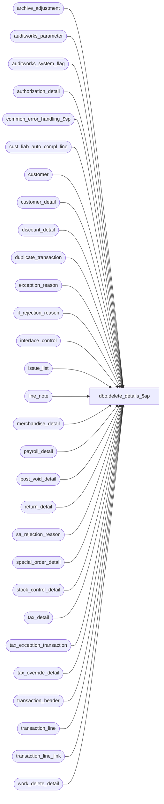

# dbo.delete_details_$sp

**Database:** auditworks_external  
**Server:** bedrockdb01  

## Architecture Diagram



## Table Dependencies

| Referenced Table |
|---|
| archive_adjustment |
| auditworks_parameter |
| auditworks_system_flag |
| authorization_detail |
| common_error_handling_$sp |
| cust_liab_auto_compl_line |
| customer |
| customer_detail |
| discount_detail |
| duplicate_transaction |
| exception_reason |
| if_rejection_reason |
| interface_control |
| issue_list |
| line_note |
| merchandise_detail |
| payroll_detail |
| post_void_detail |
| return_detail |
| sa_rejection_reason |
| special_order_detail |
| stock_control_detail |
| tax_detail |
| tax_exception_transaction |
| tax_override_detail |
| transaction_header |
| transaction_line |
| transaction_line_link |
| work_delete_detail |

## Stored Procedure Code

```sql
create proc [dbo].[delete_details_$sp] 
@process_id		binary(16),
@user_id		int,
@commit_flag 		tinyint = 0,  /* used in ORA ,not used in SYB */
@cleanup_flag		tinyint = 1,  /* used when called by restore_tran_add_$sp, 
                                         2 = partial cleanup (transaction add) */ 
@process_no		tinyint = 36,
@edit_process_no 	tinyint = 1,
@log_error_flag		tinyint = 0  -- 1 if called by smartload
                               
AS

/*
PROC NAME: delete_details_$sp
     DESC: deletes from all current detail tables for transactions in work_delete_detail
           where process_id = @process_id
           Called by delete_transaction_$sp, delete_store_reg_date_$sp,
                     dayend_purge_$sp, edit_cleanup_details_$sp, edit_header_$sp
                     restore_tran_add_$sp, function_cleanup_$sp

  HISTORY:
Date     Name           Defect# Desc
Sep29,10 Vicci           121271 Clean up tax-exception-transactions / dayend issues.
Jul21,09 Vicci           109078 Clean up cust_liab_auto_compl_line too.
Jan29,08 Paul             97584 add nolock hints to improve performance
Mar15,05 Maryam         DV-1202 Delete transaction_line_link.
Sep23,04 David          DV-1146 Use user_id
Apr26,04 Maryam         DV-1071 Receive @user_id, @process_id
Jul28,03 Maryam           11627 Move the delete of work_rec_transaction to edit_cleanup_details_$sp
Jul10,03 Maryam         1-KL08H Delete work_rec_transaction table and duplicate_transaction.
Apr25,02 Phu		1-C9P5S Delete transactions in tax_detail table.
Jan30,02 David C	1-9DI2T cleanup archive_adjustment table.
Dec06,01 David C	1-9ATXP Change code for new error handling.
Dec13,99 Paul              5716 added comments, changed @cleanup_flag from bit to tinyint
Jul23,99 Daphna            5026 author

 */

DECLARE @errno			int,
	@errmsg			nvarchar(255),
	@message_id		int,
	@object_name		nvarchar(255),
	@operation_name		nvarchar(100),
	@process_name		nvarchar(100),
	@del_rows			int,
        @expired_issue_rows		int,
        @date_time_retrieval            datetime,
        @min_transaction_date           smalldatetime,
        @auto_verify_dayend_issues      tinyint,
        @store_no			int,
        @transaction_date		smalldatetime,
        @cursor_open			tinyint

SELECT @process_name = 'delete_details_$sp',
       @message_id = 201068,
       @cursor_open = 0


DELETE authorization_detail
  FROM authorization_detail d, work_delete_detail w WITH (NOLOCK)
 WHERE d.transaction_id = w.transaction_id
   AND w.process_id = @process_id

SELECT @errno = @@error
IF @errno != 0
BEGIN
	SELECT @errmsg = 'Unable to delete authorization_detail',
	       @object_name = 'authorization_detail',
	       @operation_name = 'DELETE'
	GOTO error
END

DELETE customer
  FROM customer d, work_delete_detail w WITH (NOLOCK)
 WHERE d.transaction_id = w.transaction_id
   AND w.process_id = @process_id

SELECT @errno = @@error
IF @errno != 0
  BEGIN
	SELECT @errmsg = 'Unable to delete customer',
	       @object_name = 'customer',
	       @operation_name = 'DELETE'
	GOTO error
  END

DELETE customer_detail
  FROM customer_detail d, work_delete_detail w WITH (NOLOCK)
 WHERE d.transaction_id = w.transaction_id
   AND w.process_id = @process_id

SELECT @errno = @@error
IF @errno != 0
  BEGIN
	SELECT @errmsg = 'Unable to delete customer_detail',
	       @object_name = 'customer_detail',
	       @operation_name = 'DELETE'
	GOTO error
  END

DELETE discount_detail
  FROM discount_detail d, work_delete_detail w WITH (NOLOCK)
 WHERE d.transaction_id = w.transaction_id
   AND w.process_id = @process_id

SELECT @errno = @@error
IF @errno != 0
  BEGIN
	SELECT @errmsg = 'Unable to delete discount_detail',
	       @object_name = 'discount_detail',
	       @operation_name = 'DELETE'
	GOTO error
  END

DELETE line_note
  FROM line_note d, work_delete_detail w WITH (NOLOCK)
 WHERE d.transaction_id = w.transaction_id
   AND w.process_id = @process_id

SELECT @errno = @@error
IF @errno != 0
  BEGIN
	SELECT @errmsg = 'Unable to delete line_note',
	       @object_name = 'line_note',
	       @operation_name = 'DELETE'
	GOTO error
  END

DELETE merchandise_detail
  FROM merchandise_detail d, work_delete_detail w WITH (NOLOCK)
 WHERE d.transaction_id = w.transaction_id
   AND w.process_id = @process_id

SELECT @errno = @@error
IF @errno != 0
  BEGIN
	SELECT @errmsg = 'Unable to delete merchandise_detail',
	       @object_name = 'merchandise_detail',
	       @operation_name = 'DELETE'
	GOTO error
  END

DELETE payroll_detail
  FROM payroll_detail d, work_delete_detail w WITH (NOLOCK)
 WHERE d.transaction_id = w.transaction_id
   AND w.process_id = @process_id

SELECT @errno = @@error
IF @errno != 0
  BEGIN
	SELECT @errmsg = 'Unable to delete payroll_detail',
	       @object_name = 'payroll_detail',
	       @operation_name = 'DELETE'
	GOTO error
  END

DELETE post_void_detail
  FROM post_void_detail d, work_delete_detail w WITH (NOLOCK)
 WHERE d.transaction_id = w.transaction_id
   AND w.process_id = @process_id

SELECT @errno = @@error
IF @errno != 0
  BEGIN
	SELECT @errmsg = 'Unable to delete post_void_detail',
	       @object_name = 'post_void_detail',
	       @operation_name = 'DELETE'
	GOTO error
  END

DELETE return_detail
  FROM return_detail d, work_delete_detail w WITH (NOLOCK)
 WHERE d.transaction_id = w.transaction_id
   AND w.process_id = @process_id

SELECT @errno = @@error
IF @errno != 0
  BEGIN
	SELECT @errmsg = 'Unable to delete return_detail',
	       @object_name = 'return_detail',
	       @operation_name = 'DELETE'
	GOTO error
  END

DELETE special_order_detail
  FROM special_order_detail d, work_delete_detail w WITH (NOLOCK)
 WHERE d.transaction_id = w.transaction_id
   AND w.process_id = @process_id

SELECT @errno = @@error
IF @errno != 0
  BEGIN
	SELECT @errmsg = 'Unable to delete special_order_detail',
	       @object_name = 'special_order_detail',
	       @operation_name = 'DELETE'
	GOTO error
  END

DELETE stock_control_detail
  FROM stock_control_detail d, work_delete_detail w WITH (NOLOCK)
 WHERE d.transaction_id = w.transaction_id
   AND w.process_id = @process_id

SELECT @errno = @@error
IF @errno != 0
  BEGIN
	SELECT @errmsg = 'Unable to delete stock_control_detail',
	       @object_name = 'stock_control_detail',
	       @operation_name = 'DELETE'
	GOTO error
  END

DELETE tax_override_detail
  FROM tax_override_detail d, work_delete_detail w WITH (NOLOCK)
 WHERE d.transaction_id = w.transaction_id
   AND w.process_id = @process_id

SELECT @errno = @@error
IF @errno != 0
  BEGIN
	SELECT @errmsg = 'Unable to delete tax_override_detail',
	       @object_name = 'tax_override_detail',
	       @operation_name = 'DELETE'
	GOTO error
  END

DELETE transaction_line_link
  FROM transaction_line_link lk, work_delete_detail w WITH (NOLOCK)
 WHERE lk.transaction_id = w.transaction_id
   AND w.process_id = @process_id

SELECT @errno = @@error
IF @errno != 0
  BEGIN
	SELECT @errmsg = 'Unable to delete transaction_line_link',
	       @object_name = 'transaction_line_link',
	       @operation_name = 'DELETE'
	GOTO error
  END
  
DELETE transaction_line
  FROM transaction_line d, work_delete_detail w WITH (NOLOCK)
 WHERE d.transaction_id = w.transaction_id
   AND w.process_id = @process_id

SELECT @errno = @@error
IF @errno != 0
  BEGIN
	SELECT @errmsg = 'Unable to delete transaction_line',
	       @object_name = 'transaction_line',
	       @operation_name = 'DELETE'
	GOTO error
  END

DELETE exception_reason
  FROM exception_reason d, work_delete_detail w WITH (NOLOCK)
 WHERE d.transaction_id = w.transaction_id
   AND w.process_id = @process_id
   
SELECT @errno = @@error
IF @errno != 0
  BEGIN
	SELECT @errmsg = 'Unable to delete exception_reason',
	       @object_name = 'exception_reason',
	       @operation_name = 'DELETE'
	GOTO error
  END

DELETE if_rejection_reason
  FROM if_rejection_reason d, work_delete_detail w WITH (NOLOCK)
 WHERE d.transaction_id = w.transaction_id
   AND w.process_id = @process_id
   
SELECT @errno = @@error
IF @errno != 0
  BEGIN
	SELECT @errmsg = 'Unable to delete if_rejection_reason',
	       @object_name = 'if_rejection_reason',
	       @operation_name = 'DELETE'
	GOTO error
  END

DELETE sa_rejection_reason
  FROM sa_rejection_reason d, work_delete_detail w WITH (NOLOCK)
 WHERE d.transaction_id = w.transaction_id
   AND w.process_id = @process_id
   
SELECT @errno = @@error
IF @errno != 0
  BEGIN
	SELECT @errmsg = 'Unable to delete sa_rejection_reason',
	       @object_name = 'sa_rejection_reason',
	       @operation_name = 'DELETE'
	GOTO error
  END

DELETE interface_control
  FROM interface_control d, work_delete_detail w WITH (NOLOCK)
 WHERE d.transaction_id = w.transaction_id
   AND w.process_id = @process_id

SELECT @errno = @@error
IF @errno != 0
  BEGIN
	SELECT @errmsg = 'Unable to delete interface_control',
	       @object_name = 'interface_control',
	       @operation_name = 'DELETE'
	GOTO error
  END

DELETE tax_detail
  FROM tax_detail d, work_delete_detail w WITH (NOLOCK)
 WHERE d.transaction_id = w.transaction_id
   AND w.process_id = @process_id

SELECT @errno = @@error
IF @errno != 0
  BEGIN
	SELECT @errmsg = 'Unable to delete tax_detail',
	       @object_name = 'tax_detail',
	       @operation_name = 'DELETE'
	GOTO error
  END

DELETE cust_liab_auto_compl_line
  FROM cust_liab_auto_compl_line d, work_delete_detail w WITH (NOLOCK) 
 WHERE d.transaction_id = w.transaction_id
   AND w.process_id = @process_id
SELECT @errno = @@error
IF @errno != 0
BEGIN
  SELECT @errmsg = 'Unable to delete cust_liab_auto_compl_line',
	 @object_name = 'cust_liab_auto_compl_line',
	 @operation_name = 'DELETE'
  GOTO error
END

DECLARE tax_exception_cursor CURSOR FAST_FORWARD
    FOR
 SELECT DISTINCT store_no, transaction_date
   FROM tax_exception_transaction d, work_delete_detail w WITH (NOLOCK)
  WHERE d.av_transaction_id = w.transaction_id
    AND w.process_id = @process_id
SELECT @errno = @@error
IF @errno != 0
BEGIN
  SELECT @errmsg = 'Unable to find list of store/dates for which tax-exceptions to be deleted exist',
	 @object_name = 'tax_exception_transaction',
	 @operation_name = 'SELECT'
  GOTO error
END

OPEN tax_exception_cursor
SELECT @cursor_open = 1
 
FETCH tax_exception_cursor
 INTO @store_no, @transaction_date

WHILE @@fetch_status = 0
BEGIN
  DELETE tax_exception_transaction
    FROM tax_exception_transaction d, work_delete_detail w WITH (NOLOCK) 
   WHERE d.av_transaction_id = w.transaction_id
     AND d.store_no = @store_no
     AND d.transaction_date = @transaction_date
     AND w.process_id = @process_id 
  SELECT @errno = @@error, @del_rows = @@rowcount
  IF @errno <> 0
  BEGIN
    SELECT @errmsg = 'Failed to delete tax_exception_transaction table previously logged',
           @object_name = 'tax_exception_transaction',
      	   @operation_name = 'DELETE'
    GOTO error
  END  

  IF @del_rows > 0 --from tax_exception_transaction reset
  BEGIN
    SELECT @date_time_retrieval = NULL
    SELECT @date_time_retrieval = flag_datetime_value
      FROM auditworks_system_flag
     WHERE flag_name = 'min_tax_issue_date'   
    SELECT @errno = @@error
    IF @errno <> 0
    BEGIN
      SELECT @errmsg = 'Failed to select prior flag_datetime_value.',
  	     @object_name = 'auditworks_system_flag',
	     @operation_name = 'SELECT'
      GOTO error
    END

    IF @date_time_retrieval IS NOT NULL
    BEGIN 
      UPDATE issue_list
         SET verified = 1,
             verified_by_user_id = NULL, -- system   
             verified_date = getdate()
       WHERE store_no = @store_no
         AND transaction_date = @transaction_date
    AND issue_list.issue_type = 1
      AND issue_list.verified = 0
         AND issue_list.transaction_date >= @date_time_retrieval         
      SELECT @errno = @@error, @expired_issue_rows = @@rowcount 
      IF @errno <> 0
      BEGIN
        SELECT @errmsg = 'Failed to reset issue_list.',
  	       @object_name = 'issue_list',
	       @operation_name = 'UPDATE'
        GOTO error
      END

      IF @expired_issue_rows > 0 
      BEGIN
        SELECT @min_transaction_date = MIN(transaction_date)
          FROM issue_list
         WHERE issue_type = 1
           AND verified = 0
           AND transaction_date >= @date_time_retrieval         
        SELECT @errno = @@error
        IF @errno <> 0
        BEGIN
          SELECT @errmsg = 'Failed to update issue_list.',
  	         @object_name = 'issue_list',
	         @operation_name = 'SELECT'
          GOTO error
        END

        UPDATE auditworks_system_flag
           SET flag_datetime_value = @min_transaction_date
         WHERE flag_name = 'min_tax_issue_date'
        SELECT @errno = @@error
        IF @errno <> 0
        BEGIN
          SELECT @errmsg = 'Failed to update auditworks_system_flag.',
  	         @object_name = 'auditworks_system_flag',
	         @operation_name = 'UPDATE'
          GOTO error
        END
      END  --IF @expired_issue_rows > 0 
    END --IF @date_time_retrieval IS NOT NULL  

    SELECT @auto_verify_dayend_issues = CONVERT(tinyint, par_value)
      FROM auditworks_parameter
     WHERE par_name = 'auto_verify_dayend_issues'
    SELECT @errno = @@error
    IF @errno <> 0
    BEGIN
      SELECT @errmsg = 'Unable to select auto_verify_dayend_issues from auditworks_parameter.',
             @object_name = 'auditworks_parameter',
             @operation_name = 'SELECT'
      GOTO error
    END

    SELECT @auto_verify_dayend_issues = ISNULL(@auto_verify_dayend_issues, 0)

    SELECT @date_time_retrieval = getdate()
        
    INSERT issue_list (
           issue_type,
           store_no,
           transaction_date,
           detection_datetime,
           tax_level,
           tax_amount_collected,
           tax_amount_expected,
           verified)
    SELECT 1,
           @store_no,
           @transaction_date,
           @date_time_retrieval,
           tx.tax_level,
           SUM(tx.tax_amount_collected),
           SUM(tx.tax_amount_expected),
           SIGN(@auto_verify_dayend_issues)
      FROM tax_exception_transaction tx WITH (NOLOCK)
     WHERE tx.store_no = @store_no
       AND tx.transaction_date = @transaction_date
       AND tx.discrepancy_flag = 1
     GROUP BY tx.tax_level
    SELECT @errno = @@error
    IF @errno <> 0
    BEGIN
      SELECT @errmsg = 'Failed to rebuild issue_list. Pre-audit.',
  	     @object_name = 'issue_list',
	     @operation_name = 'INSERT'
      GOTO error
    END
  END --IF @del_rows > 0
  ---end cleanup tax exceptions  

  FETCH tax_exception_cursor
  INTO @store_no, @transaction_date
END /* while not end of tax_exception_cursor */

CLOSE tax_exception_cursor
DEALLOCATE tax_exception_cursor 
SELECT @cursor_open = 0

IF @cleanup_flag = 1
BEGIN

  DELETE duplicate_transaction
    FROM duplicate_transaction d, transaction_header h WITH (NOLOCK), work_delete_detail w WITH (NOLOCK)
   WHERE w.process_id = @process_id
     AND w.transaction_id = h.transaction_id
     AND h.store_no = d.store_no
     AND h.register_no = d.register_no
     AND h.transaction_date = d.transaction_date
     AND h.date_reject_id = d.date_reject_id
     AND h.entry_date_time = d.entry_date_time
     AND h.transaction_series = d.transaction_series
     AND h.transaction_no = d.transaction_no 

  SELECT @errno = @@error
  IF @errno != 0
  BEGIN
	SELECT @errmsg = 'Unable to delete duplicate_transaction',
	       @object_name = 'duplicate_transaction',
	       @operation_name = 'DELETE'
	GOTO error
 END

  DELETE transaction_header
    FROM transaction_header d, work_delete_detail w WITH (NOLOCK)
   WHERE d.transaction_id = w.transaction_id
     AND w.process_id = @process_id

  SELECT @errno = @@error
  IF @errno != 0
  BEGIN
	SELECT @errmsg = 'Unable to delete transaction_header',
	       @object_name = 'transaction_header',
	       @operation_name = 'DELETE'
	GOTO error
  END

  DELETE archive_adjustment
    FROM archive_adjustment d, work_delete_detail w WITH (NOLOCK)
   WHERE d.adjustment_transaction_id = w.transaction_id
     AND w.process_id = @process_id

  SELECT @errno = @@error
  IF @errno != 0
  BEGIN
	SELECT @errmsg = 'Unable to delete archive_adjustment',
	       @object_name = 'archive_adjustment',
	       @operation_name = 'DELETE'
	GOTO error
  END


END  /* @cleanup_flag = 1 */

DELETE work_delete_detail
 WHERE process_id = @process_id

SELECT @errno = @@error
IF @errno != 0
BEGIN
	SELECT @errmsg = 'Unable to delete work_delete_detail',
	       @object_name = 'work_delete_detail',
	       @operation_name = 'DELETE' 
	GOTO error
END
 
RETURN

error:

	IF @cursor_open = 1
	BEGIN
	  CLOSE tax_exception_cursor
	  DEALLOCATE tax_exception_cursor 
	END

	EXEC common_error_handling_$sp @process_no, @errno, @errmsg, 0, @message_id, 
	@process_name, @object_name, @operation_name, @log_error_flag, @edit_process_no, 0, 
	null, 0, null, null, null, null, null, null, 0, @process_id, @user_id
	
	RETURN
```

