# dbo.delete_store_reg_date_$sp

**Database:** auditworks_external  
**Server:** bedrockdb01  

## Architecture Diagram

```mermaid
flowchart LR
    SP["dbo.delete_store_reg_date_$sp"]
    ADT_TRL_DTL(["ADT_TRL_DTL"]) --> SP
    ADT_TRL_HDR(["ADT_TRL_HDR"]) --> SP
    ADT_TRL_QRY(["ADT_TRL_QRY"]) --> SP
    CORE_HOUR_DAY(["CORE_HOUR_DAY"]) --> SP
    Ex_Queue(["Ex_Queue"]) --> SP
    ORG_CHN(["ORG_CHN"]) --> SP
    ORG_CHN_HRCHY_LVL_GRP(["ORG_CHN_HRCHY_LVL_GRP"]) --> SP
    ORG_CHN_HRCHY_LVL_GRP_A(["ORG_CHN_HRCHY_LVL_GRP_A"]) --> SP
    ORG_CHN_OPEN_HOUR_EXCPTN(["ORG_CHN_OPEN_HOUR_EXCPTN"]) --> SP
    ORG_CHN_WRKSTN(["ORG_CHN_WRKSTN"]) --> SP
    ORG_CHN_WRKSTN_CNFG(["ORG_CHN_WRKSTN_CNFG"]) --> SP
    ORG_CHN_WRKSTN_CNFG_A(["ORG_CHN_WRKSTN_CNFG_A"]) --> SP
    T_ID(["T_ID"]) --> SP
    archive_adjustment(["archive_adjustment"]) --> SP
    audit_status(["audit_status"]) --> SP
    auditworks_parameter(["auditworks_parameter"]) --> SP
    calc_guided_start_date__sp(["calc_guided_start_date_$sp"]) --> SP
    calculate_timestamp__sp(["calculate_timestamp_$sp"]) --> SP
    common_error_handling__sp(["common_error_handling_$sp"]) --> SP
    dbo_convdate(["dbo.convdate"]) --> SP
    create_function_status__sp(["create_function_status_$sp"]) --> SP
    create_if_details_move__sp(["create_if_details_move_$sp"]) --> SP
    cust_liability_edit__sp(["cust_liability_edit_$sp"]) --> SP
    delete_details__sp(["delete_details_$sp"]) --> SP
    duplicate_transaction(["duplicate_transaction"]) --> SP
    function_status(["function_status"]) --> SP
    function_status_rec(["function_status_rec"]) --> SP
    if_transaction_header(["if_transaction_header"]) --> SP
    interface_control(["interface_control"]) --> SP
    lock_store_date__sp(["lock_store_date_$sp"]) --> SP
    missing_transactions_exec__sp(["missing_transactions_exec_$sp"]) --> SP
    parameter_general(["parameter_general"]) --> SP
    rec_manual__sp(["rec_manual_$sp"]) --> SP
    store_audit_status(["store_audit_status"]) --> SP
    tax_store_date_not_evaluated(["tax_store_date_not_evaluated"]) --> SP
    tran_id_datatype(["tran_id_datatype"]) --> SP
    transaction_header(["transaction_header"]) --> SP
    translate_error(["translate_error"]) --> SP
    verify_dw_store_status__sp(["verify_dw_store_status_$sp"]) --> SP
    verify_store_status__sp(["verify_store_status_$sp"]) --> SP
    work_delete_detail(["work_delete_detail"]) --> SP
    work_if_header(["work_if_header"]) --> SP
    work_interfaces(["work_interfaces"]) --> SP
    work_transaction_list(["work_transaction_list"]) --> SP
```



## Table Dependencies

| Referenced Table |
|---|
| ADT_TRL_DTL |
| ADT_TRL_HDR |
| ADT_TRL_QRY |
| CORE_HOUR_DAY |
| Ex_Queue |
| ORG_CHN |
| ORG_CHN_HRCHY_LVL_GRP |
| ORG_CHN_HRCHY_LVL_GRP_A |
| ORG_CHN_OPEN_HOUR_EXCPTN |
| ORG_CHN_WRKSTN |
| ORG_CHN_WRKSTN_CNFG |
| ORG_CHN_WRKSTN_CNFG_A |
| T_ID |
| archive_adjustment |
| audit_status |
| auditworks_parameter |
| calc_guided_start_date_$sp |
| calculate_timestamp_$sp |
| common_error_handling_$sp |
| dbo.convdate |
| create_function_status_$sp |
| create_if_details_move_$sp |
| cust_liability_edit_$sp |
| delete_details_$sp |
| duplicate_transaction |
| function_status |
| function_status_rec |
| if_transaction_header |
| interface_control |
| lock_store_date_$sp |
| missing_transactions_exec_$sp |
| parameter_general |
| rec_manual_$sp |
| store_audit_status |
| tax_store_date_not_evaluated |
| tran_id_datatype |
| transaction_header |
| translate_error |
| verify_dw_store_status_$sp |
| verify_store_status_$sp |
| work_delete_detail |
| work_if_header |
| work_interfaces |
| work_transaction_list |

## Stored Procedure Code

```sql
create proc dbo.delete_store_reg_date_$sp 
 (@process_id 			binary(16),
  @user_id			int,
  @store_no 			int,
  @transaction_date 		smalldatetime,
  @date_reject_id 		tinyint,
  @register_no 			smallint = NULL,
  @status 			tinyint  = 1,
  @errmsg 			nvarchar(255) OUTPUT )

AS

/*
PROC NAME: delete_store_reg_date_$sp 
     DESC: Mass delete either one valid/invalid store-date or store-date-reg.
   	   Called by frontend and function_cleanup_$sp.

  HISTORY:
Date     Author    Defect# Desc
Feb15,13 Paul       141811 populate customer_modified_flag in if_transaction_header to match edit
Jan18,12 Vicci      132439 Remove references to CRDM user-defined string datatypes from S/A since CRDM is not changing them to support unicode.
Feb17,11 Phu        124419 Include transaction_no, entry_date_time in ADT_TRL_DTL to make the rows unique.
Feb03,11 Paul       124575 bump @status to 4 after audit trail is updated (to improve error recovery)
Sep22,10 Vicci      121125 #trans_id temp table has transaction_id defined too small.
May03,10 Vicci      117571 If tax update timing is switched to Edit and the store/date being deleted is on the list
                           of store/dates for which tax-detail has not yet been created, remove it from the list.
Jan22,10 Vicci      115531 Log correct function (delete store vs delete workstation) to audit trail.
Jun02,09 Vicci      110616 Say i_store_closed_flag <> 1 instead of =0 since open may also be indicated by a value of 5;  
                           Do not mark a register as deleted if it didn't have any transactions to begin with.
Jan24,08 Paul        94350 Corrected error recovery logic, audit trail detail, drop temp tables
Jan16,07 Paul        81764 apply 76394 to SA5
Oct25,06 Phu         77931 Fix outer join for SQL 2005 Mode 90.
Mar15,06 Paul      DV-1331 apply 67999 to SA5
Oct14,05 Paul        61814 set audit_status to 904 when deleting an invalid store
Oct07,05 Paul        60703 default @status to 1, set nocount on for performance, handle invalid store
Sep01,05 Paul        59834 correctly update work table for media rec
Aug15,05 Paul        58816 handle workstation without rows in ORG_CHN_WRKSTN_CNFG.
Jul07,05 Paul      DV-1295 delete duplicate_transaction
Jun07,05 Sab	   DV-1254 Call new procedure verify_dw_store_status_$sp
Apr28,05 Paul      DV-1234 expand transaction_id to use tran_id_datatype
Nov19,04 Maryam    DV-1167 Check the active flag for ORG_CHN_WRKSTN.
Oct29,04 Maryam    DV-1159 Handle the 4 values for RPRT_UNSD_WRKSTNS.
Oct06,04 David     DV-1146 Use user_id.
Aug30,04 Maryam    DV-1120 Use convdate function for dates when logging the audit trail,
				modify audit trail query, refresh logic (Paul)
May29,04 Maryam    DV-1071 Use ORG_CHN_WRKSTN, ORG_CHN tables, pass @process_id 
Apr07,04 Sab	   DV-1068 removed old media rec logic
Sep05,06 Vicci       76394 register cursor removed from call to missing, instead called with 1
                           register or all, and call itself revised as a result of changes
                           in missing_transactions_exec_$sp
Mar14,06 Daphna      67999 set completion_date_time = NULL in audit_status and store_audit_status
Jan13,04 Paul        21846 only reset @in_out_both_flag when @recovery_flag = 0
Sep26,03 Paul        13686 correctly recover after error in new media rec
Aug05,03 Paul        11627 call media rec after calculating missing
Jun13,03 Paul      1-KX549 call new media rec, remove username from call to verify_store_status_$sp,
                           update duplicate_qty.
Apr24,03 Paul      1-KO2HY populate till_no
Jan30,03 Winnie	      5815 update audit_trail_detail when deleting a promotion transaction.
Jan09,03 Winnie       5485 Clear Media reconciliation record if the deleted reg is the last register.
Dec12,02 Winnie	   1-G4RBY Do not delete transaction_range, this is done inside missing_transaction_exec_$sp
Nov26,02 Winnie	   1-G5D3C Do not calculate missing when delete an invalid store/register,
               set the correct status to 904 instead of setting it to missing.
SEP05,02 Daphna    1-BMAEV Pass @all_registers to missing_transaction_exec_$sp 
Jul23,02 Paul      1-E7L7M populate key_11 in Ex_Queue with entry_date_time
Jun03,02 Paul      1-CD0IX Change errno to 201617
Mar14,02 Henry	   1-A8XPT To add transaction_date in join to translate_error table.
			   Zero out translate_error_qty, translate_error_verified in audit_status.
Jan30,02 David C   1-9DI2T Lay foundation for archive transaction modification.
Dec04,01 David C   1-9ATXP Verify if deletion will cause if rejects for R3 customer
                            liability AND change code for new error handling.
Oct22,01 Daphna     8629 call missing_transactions_exec instead of transaction_series_crsr,
   and next-date logic
Oct10,01 Henry        8824 Retrofit of defect 8683, fixes problems when deleting invalid store/dates.
				Applies to Builds 2.45.00.13 and 2.46.25+.
Sep14,01 Daphna       8563 Remove join to transaction_range from insert to #temp_audit_status
                           Reorganize logic of status = 1 @reverse_interface = 1
                           Remove join to registers from delete of transaction_range                  
                           Set missing_qty = 0 to allow recalc where applicable
            Delete to translate_error moved up before delete to tran header 
                  because requires join for entry_date_time
                            (ALSO fixes def 8683)
Sep10,01 Maryam      8683 (fixed by def 8563, no version submitted for 8683)
   Add IF @date_reject_id = 0 before doing any of the media rec stuff.
Sep07,01 Daphna       8642 Added th.transaction_series = ts.transaction_series to declaration
                           of transaction_series_crsr, moved declaration from top of proc
                           to just before cursor is opened
Aug03,01 David C      8462 LAY FOUNDATION FOR R3 customer liability: EXEC cust_liability_edit_$sp
Jul25,01 David C      8413 Add transaction_id to if_transaction_header
May29,01 Paul         8029 remove hold logic
May25,01 Winnie       7589 Missing transactions by transaction series Version 1.0 (first/last handling).
Apr24,01 David M    7648 Unlock store_audit_status for invalid date,
				removed line that was resetting the i_date_reject_id.
Apr09,01 David M      7560 Insert to work_delete_detail selects all srd's rather than just invalid srd's.
Mar29,01 David M      7447 Correct deletion of petty_cash when balancing by cashier.
			   Restructured proc so that media rec amounts are calculated and delete_details_$sp 
			   is called in status 3 not status 1, ie. after insert into transaction_header
			   and after BEGIN TRAN. Changed default of @last_register to 2 so that missing_qty 
			   doesn't get wiped out when deleting the last register.
			   Also changed insert to if_interface_control table to insert to Ex_Queue table.
Mar08,01 Phu          7501 Use system function to retrieve user name
Feb16,01 Paul         7329 If @register_no = 0, check whether register exists in audit_status
Jan30,01 Henry        6765 Need to call the missing_transactions_$sp proc twice, use current trxn_date
			   and the next trxn_date for calculating missing trxns properly.
Jan29,01 Paul         7268 Do not treat @register = 0 as all registers
Dec21,00 Sab          7144 Changed the cursor name missing_crsr to avoid cursor already opened error
Dec15,00 Paul         7117 Pass register_no and function_no to media_reconciliation_$sp
Dec04,00 Phu          7011 Calculate drawer discrepancy for current transaction date and next transaction date
Oct19,00 Phu          6826 Set last_modified_date_time to current date
Sep21,00 Maryam       6763 Correct MS SQL error 8120 tl.line_action is invalid in the SELECT list
Sep20,00 Maryam       6702 Zero out missing_qty and set the status to 902 when deleting the last date for a register.
Sep12,00 Paul         6718 Correctly delete when register 0 exists in audit_status (rejected)
Jun08,00 Maryam       6244 Improved the efficiency of code when deleting the whole store.
Jun08,00 Vicci        6410 Replace call to glc_$sp with call to Glc_$sp
Mar01,00 Phu          5900 Change @@fetch_status > 0 to @@fetch_status <> 0 for MS SQL compatibility
Jan13,00 Daphna F     5833 accomodate exe 2.00.00 register_no null = all reg
Oct28,99 Louise M     5529 Added code to unlock store
Sep27,99 Daphna F     5299 remove calls to media_reconciliation_$sp when whole store is deleted or last register deleted
			   calls media_reconciliation_$sp if there are still undeleted registers left: 
			   for bal-meth 2,4, and if bal-meth <> deposit-bal-meth for bal_meth 1,3.
Aug26,99 Daphna F     5268 Simplify logic for delete translate_error (4 places)
Aug09,99 Daphna F     5197 correct population of work_delete_detail when date_reject or invalid
Jul26,99 Daphna F     5033 treat register_no = -1 same as = 0 (all reg)
Jul23,99 Daphna F   5026 call delete_details_$sp instead of deleting tran-header and setting off delete trigger
Jun11,99 Daphna F     4872 Treat register_no = 0 same as register_no NULL (all registers)
Jun07,99 Louise M     4526 Added code to disallow delete while register is	trickling in.
May20,99 Daphna F    4682 delete media_reconciliation and petty_cash_reconciliation
			   for S/R/D mass deleted and exec calc_drawer_discrepancy 
			   for S/R mass deleted, removed update/insert to petty_cash_reconciliation
Apr16,99 Mat C        4456 Delete corresponding lines from table translate_error
Mar22,99 Paul         4376 reset discrepancy flag
Feb19,99 Mat C             dd #if_trans_id to cleanup insert into work_if_header table;
			   Made entry_date_time type datetime instead of smalldatetime
Feb25,99 Paul S
Feb15,99 Andrew V
Jul18,99 Mat C
Apr14,98 Phu       n/a     Author  version 1.29

*/

DECLARE
	@action				tinyint,
	@all_registers			tinyint,
	@audit_status			smallint, -- def 8629
	@current_date 			smalldatetime,
	@date_to_verify                 smalldatetime,
	@edit_timestamp 		float,
	@errno				int,
	@errnum				int,
	@function_no 			tinyint,
	@guided_audit_start_date        smalldatetime,
	@if_rejection_flag 		tinyint,
	@in_out_both_flag		tinyint,
	@last_register 	         	smallint,
	@media_parameter_table_no	smallint,
	@message_id			int,
	@miss_register_no		smallint,
	@object_name			nvarchar(255),
	@operation_name			nvarchar(100),
	@post_midnight_time		datetime,
	@process_name			nvarchar(100),
	@rec_process_id			numeric(12,0),
	@recovery_flag			tinyint,
	@register_name			nvarchar(30),
	@register_num			nvarchar(20),
	@reverse_interface              int,
	@rows 				int,
	@sep				nchar(1),
	@source_process_no 		tinyint,
        @status_value			smallint,
        @store_closed_flag              smallint,
	@store_name			nvarchar(30),
	@temp_created			tinyint,
	@transaction_id 		tran_id_datatype,
	@trickle_in_progress_flag	tinyint,
	@ENTRY_ID			T_ID,
	@ORG_CHN_NAME			nvarchar(50),
	@TBL_KEY			nvarchar(255),
	@TBL_KEY_RSRC_NAME		nvarchar(255),
	@TBL_KEY_RSRC_PRMS		nvarchar(255)

SET NOCOUNT ON
       
SELECT  @action = 3,
	@current_date = getdate(),
        @function_no = 40,
	@source_process_no = 40,
	@trickle_in_progress_flag = 0,
	@last_register = 2,
	@process_name = 'delete_store_reg_date_$sp',
	@message_id = 201068,
	@in_out_both_flag = 0,
	@recovery_flag = 1,
	@sep = nchar(12), -- audit trail seperator
	@ENTRY_ID = NEWID(),
	@temp_created = 0

CREATE TABLE #trans_id (
	transaction_id 		numeric(14,0)   not null, -- tran_id_datatype
	store_no		int 		not null,
	register_no 		smallint 	not null,
	cashier_no 		int 		not null,
	date_reject_id 		tinyint 	not null,
	transaction_date 	smalldatetime 	not null,
	entry_date_time 	datetime 	not null,
	transaction_no 		int 		not null,
	transaction_series 	nchar(1) 	null,  -- allow nulls for outer join def 8563
	transaction_void_flag 	smallint	not null,
	sa_rejection_flag 	tinyint 		not null,
	if_rejection_flag 	tinyint 		not null,
	line_object 		smallint 	not null,
	line_action 		tinyint 	not null,
	till_no			smallint	null,
	transaction_category	tinyint		not null )
 		
SELECT @errno = @@error
IF @errno <> 0
BEGIN
	SELECT @errmsg = 'Failed to create table #trans_id',
               @object_name = '#trans_id',
        @operation_name = 'CREATE'
	GOTO error
END
SELECT @temp_created = 1

CREATE TABLE #temp_audit_status (
	store_no 		int 		not null,
	transaction_date 	smalldatetime 	not null,
	register_no 		smallint 	not null,
	date_reject_id 		tinyint 	not null,
	audit_status 		smallint 	not null)

SELECT @errno = @@error
IF @errno <> 0
  BEGIN
    SELECT @errmsg = 'Failed to create table #temp_audit_status',
           @object_name = '#temp_audit_status',
           @operation_name = 'CREATE'
    GOTO error
  END
SELECT @temp_created = 2

IF @status = 1 -- called by frontend
  SELECT @recovery_flag = 0
ELSE
  BEGIN -- error recovery when called from function_cleanup_$sp
   SELECT @rec_process_id = rec_process_id,
	  @in_out_both_flag = glc_type
     FROM function_status
    WHERE process_id = @process_id
      AND function_no = @function_no

   IF @rec_process_id > 0 AND @status = 2
     BEGIN -- clean up work tables prior to retry
       DELETE work_transaction_list
        WHERE rec_process_id = @rec_process_id

       SELECT @errno = @@error
       IF @errno != 0
       BEGIN
        SELECT @errmsg = 'Unable to delete work_transaction_list',
             @object_name = 'work_transaction_list',
             @operation_name = 'DELETE'
         GOTO error
       END

       DELETE function_status_rec
        WHERE rec_process_id = @rec_process_id

       SELECT @errno = @@error
       IF @errno != 0
       BEGIN
         SELECT @errmsg = 'Unable to delete function_status_rec',
             @object_name = 'function_status_rec',
             @operation_name = 'DELETE'
         GOTO error
       END

     END
  END -- If @recovery_flag = 1

IF @register_no IS NULL /* then */
  SELECT @register_no = -1

IF @register_no <= 0
  BEGIN
   SELECT @all_registers = 1

   IF @register_no = 0 -- determine whether intent is all registers
     BEGIN
      IF EXISTS (SELECT 1
                   FROM audit_status
                  WHERE sales_date = @transaction_date
                    AND store_no = @store_no
                    AND register_no = 0
                    AND date_reject_id = @date_reject_id
                    AND audit_status >= 6)
        SELECT @all_registers = 0
     END
  END
ELSE
   SELECT @all_registers = 0

IF @all_registers = 0
  BEGIN
   IF EXISTS (SELECT register_no
                FROM audit_status
               WHERE sales_date = @transaction_date
                 AND store_no = @store_no
                 AND register_no != @register_no
                 AND date_reject_id = @date_reject_id
                 AND audit_status > 5 
                 AND audit_status <= 300 )                  
   SELECT @last_register = 0

  END   


IF @status = 1  
BEGIN
  SELECT @trickle_in_progress_flag = ISNULL(trickle_in_progress_flag,0)
    FROM store_audit_status s
   WHERE s.store_no = @store_no
     AND s.sales_date = @transaction_date
     AND s.date_reject_id = @date_reject_id

  IF @trickle_in_progress_flag = 1   
    BEGIN
     SELECT @errmsg = 'Cannot DELETE a transaction from a store that is trickling in. Must wait for end of day phase2 of edit to run before proceeding.',
		@errno = 201617,
		@message_id = 201617
     GOTO error
    END
  
  EXEC create_function_status_$sp @process_id, @user_id, @function_no, 0,
       @errmsg OUTPUT, @store_no, @transaction_date, @date_reject_id,
       @register_no, 1

  SELECT @errno = @@error
  IF @errno <> 0
  BEGIN
 IF @errmsg IS NULL /* then */
      SELECT @errmsg = 'Failed to execute stored proc create_function_status_$sp'
      
    SELECT @object_name = 'create_function_status_$sp',
           @operation_name = 'EXECUTE'
    GOTO error
  END

  EXEC lock_store_date_$sp @process_id = @process_id,
  			   @user_id = @user_id, 
    @store_no = @store_no,
			   @sales_date = @transaction_date,
			   @date_reject_id = @date_reject_id,
			   @update_in_progress = @function_no,
			   @error_code = @errno OUTPUT

  SELECT @errnum = @@error
  IF @errnum <> 0
  BEGIN
    SELECT @errmsg = 'Failed to execute lock_store_date_$sp',
    	@errno = @errnum
    SELECT @object_name = 'lock_store_date_$sp',
           @operation_name = 'EXECUTE'
    GOTO error
  END

  IF @errno = 201550
    BEGIN
      SELECT @errmsg = 'store_date is currently in use',
             @message_id = 201550
      GOTO error
    END
  ELSE
    IF @errno <> 0 /* System error */
    BEGIN
      SELECT @errmsg = 'lock_store_date_$sp is unable to update store_audit_status',
             @object_name = 'store_audit_status',
             @operation_name = 'UPDATE'
      GOTO error
    END
END /* If @status = 1 */

      
/* Insert a row for each register if deleting all registers */

IF @all_registers = 1
  BEGIN
    INSERT #temp_audit_status (
	   store_no,
	   transaction_date,
	   register_no,
	   date_reject_id,
	   audit_status)
    SELECT
	   a.store_no,
	   a.sales_date,
	   a.register_no,
	   a.date_reject_id,
	   a.audit_status
      FROM audit_status a
     WHERE a.store_no = @store_no
       AND a.sales_date = @transaction_date
       AND a.date_reject_id = @date_reject_id
       AND a.audit_status > 5
       AND a.audit_status <= 300

    SELECT @errno = @@error,
	   @rows = @@rowcount
    IF @errno <> 0
      BEGIN
	SELECT @errmsg = 'Failed to insert table #temp_audit_status',
	       @object_name = '#temp_audit_status',
	 @operation_name = 'INSERT'
	GOTO error
     END    
  END /* if @all_registers = 1  --  all registers */
ELSE
  BEGIN -- deleting one register 
    INSERT #temp_audit_status (
	    store_no,
	    transaction_date,
	    register_no,
	    date_reject_id,
	    audit_status)
    SELECT
	    a.store_no,
	    a.sales_date,
	    a.register_no,
	    a.date_reject_id,
	    a.audit_status
      FROM audit_status a
     WHERE a.store_no = @store_no
       AND a.sales_date = @transaction_date
       AND a.date_reject_id = @date_reject_id
       AND a.register_no = @register_no     
       AND a.audit_status > 5
       AND a.audit_status <= 300

    SELECT @errno = @@error,
	   @rows = @@rowcount
    IF @errno <> 0
      BEGIN
	SELECT @errmsg = 'Failed to insert table #temp_audit_status (reg)',
	       @object_name = '#temp_audit_status',
	       @operation_name = 'INSERT'
	GOTO error
      END

  END /* else of if @all_registers = 1  */

IF @date_reject_id = 0
BEGIN
  DELETE duplicate_transaction
   WHERE transaction_date = @transaction_date
     AND store_no = @store_no
     AND (register_no = @register_no OR @all_registers = 1)
     AND date_reject_id = 0

  SELECT @errno = @@error
  IF @errno <> 0
    BEGIN
     SELECT @errmsg = 'Failed to delete duplicate_transaction',
	@object_name = 'duplicate_transaction',
	@operation_name = 'DELETE'
     GOTO error
    END  
END -- If @date_reject_id = 0

IF @rows <= 0 AND @recovery_flag = 0 -- no rows inserted into #temp_audit_status - nothing to delete
BEGIN

	UPDATE store_audit_status
	   SET update_in_progress = 0
	 WHERE store_no = @store_no
	   AND sales_date = @transaction_date
	   AND date_reject_id = @date_reject_id

        SELECT @errno = @@error
	IF @errno <> 0
	  BEGIN
            SELECT @errmsg = 'Failed to set update_in_progress to 0 in store_audit_status (1)',
                   @object_name = 'store_audit_status',
                   @operation_name = 'UPDATE'
          GOTO error
	  END

	DELETE function_status
	 WHERE process_id = @process_id
	   AND function_no = @function_no

	SELECT @errno = @@error
	IF @errno <> 0
	  BEGIN
            SELECT @errmsg = 'Failed to delete function_status (1)',
                   @object_name = 'function_status',
                   @operation_name = 'DELETE'
	    GOTO error
	  END

	UPDATE ORG_CHN_HRCHY_LVL_GRP
	   SET GRP_MBR_CHNG = getdate()
	   FROM ORG_CHN_HRCHY_LVL_GRP lg
	 WHERE EXISTS ( SELECT 1
	                 FROM ORG_CHN_HRCHY_LVL_GRP_A lga
	                 WHERE lga.ORG_CHN_NUM = @store_no
	                   AND lg.HRCHY_ID = lga.HRCHY_ID
	                   AND lg.HRCHY_LVL_GRP_ID = lga.HRCHY_LVL_GRP_ID)
             AND GRP_MBR_CHNG IS NOT NULL
 
        SELECT @errno = @@error
	IF @errno <> 0 
	  BEGIN
	   SELECT @errmsg = 'Failed to update ORG_CHN_HRCHY_LVL_GRP (1)',
                   @object_name = 'ORG_CHN_HRCHY_LVL_GRP',
                   @operation_name = 'UPDATE'
	    GOTO error
	  END

	DROP TABLE #temp_audit_status
	DROP TABLE #trans_id
	SET NOCOUNT OFF

	RETURN
END /* IF @rows <= 0 */

IF @date_reject_id = 0 AND @recovery_flag = 0 -- only recalc new media rec if not invalid date/store/reg
  BEGIN
   IF EXISTS(SELECT store_no
	     FROM #temp_audit_status
	    WHERE audit_status NOT IN (7, 8))
     SELECT @in_out_both_flag = 2
  END

/* Handle invalid date or invalid store-reg first */

IF EXISTS (SELECT store_no
	     FROM #temp_audit_status
	    WHERE date_reject_id <> 0
	       OR audit_status IN (7, 8))
BEGIN
    IF @all_registers = 0 --delete only one register
    BEGIN
	DELETE translate_error
	 WHERE store_no = @store_no
	   AND register_no = @register_no
	   AND transaction_date = @transaction_date

	SELECT @errno = @@error
        IF @errno <> 0
         BEGIN
 	    SELECT @errmsg = 'Failed to delete translate_error (1)',
                   @object_name = 'translate_error',
                   @operation_name = 'DELETE'
	    GOTO error
	  END
    END
    ELSE IF @all_registers = 1 OR @last_register = 2 
    BEGIN
	DELETE translate_error
	 WHERE store_no = @store_no
	   AND transaction_date = @transaction_date
		
        SELECT @errno = @@error
   	IF @errno <> 0
	  BEGIN
	    SELECT @errmsg = 'Failed to delete translate_error (2)',
		@object_name = 'translate_error',
		@operation_name = 'DELETE'
	    GOTO error
	  END
   END --If @all_registers = 0
	  
   BEGIN TRAN
    
    /* set audit_status to 902 (deleted) or 904 (deleted invalid store) */
    
    UPDATE audit_status  
       SET audit_status = 902 + ((1 - SIGN (ABS (ta.audit_status - 7))) * 2),
	 sa_reject_qty = 0,
	 if_reject_qty = 0,
	 exception_qty = 0,
	 missing_qty = 0,
	 valid_qty = 0,
	 translate_error_qty = 0,
	 duplicate_qty = 0,
	 translate_error_verified = 0,
         status_set_by_user_id = @user_id,
     	 status_date = @current_date,
	 short_by_tender_over_limit = 0,
	 opening_drawer_discrepancy = 0,
	 media_short = 0,
	 media_rec_verified = 0,
	 completion_date_time = NULL
      FROM audit_status a, #temp_audit_status ta
     WHERE (ta.date_reject_id <> 0
	    OR ta.audit_status IN (7, 8))
       AND ta.date_reject_id = a.date_reject_id
       AND ta.store_no = a.store_no
       AND ta.register_no = a.register_no
       AND ta.transaction_date = a.sales_date
       AND ta.audit_status = a.audit_status

    SELECT @errno = @@error
    IF @errno <> 0
    BEGIN
	SELECT @errmsg = 'Failed to set audit_status to 902',
               @object_name = 'audit_status',
         @operation_name = 'UPDATE'
	GOTO error
    END

    EXEC verify_store_status_$sp @process_id, NULL, @store_no, @transaction_date, @date_reject_id, @errmsg OUTPUT

    SELECT @errno = @@error
    IF @errno <> 0
    BEGIN
	IF @errmsg IS NULL /* then */
	  SELECT @errmsg = 'Failed to execute stored proc verify_store_status_$sp (1)'
	  
        SELECT @object_name = 'verify_store_status_$sp',
               @operation_name = 'EXECUTE'
	GOTO error
    END

    COMMIT TRAN

END /* if exists ... where date_reject_id <> 0 */


/* Delete remaining valid store_date or store-reg-date entries */

INSERT #trans_id (
	transaction_id,
	store_no,
	register_no,
	cashier_no,
	date_reject_id,
	transaction_date,
	entry_date_time,
	transaction_no,
	transaction_series,
	transaction_void_flag,
	sa_rejection_flag,
	if_rejection_flag,
	line_object,
	line_action,
	till_no,
	transaction_category )
SELECT 
	th.transaction_id,
	th.store_no,
	th.register_no,
	th.cashier_no,
	th.date_reject_id,
	th.transaction_date,
	th.entry_date_time,
	th.transaction_no,
	th.transaction_series,
	th.transaction_void_flag,
	th.sa_rejection_flag,
	th.if_rejection_flag,
	0,
	0,
	th.till_no,
	th.transaction_category
FROM #temp_audit_status ta,
	transaction_header th
WHERE ta.store_no = th.store_no
  AND ta.transaction_date = th.transaction_date
  AND ta.date_reject_id = th.date_reject_id
  AND ta.register_no = th.register_no

SELECT @errno = @@error
IF @errno <> 0
  BEGIN
SELECT @errmsg = 'Failed to insert #trans_id',
           @object_name = '#trans_id',
           @operation_name = 'INSERT'
    GOTO error
  END

SELECT @reverse_interface = 0 		
    
IF EXISTS ( SELECT transaction_id -- at least one non_reject exists
              FROM #trans_id
             WHERE sa_rejection_flag = 0)
  BEGIN
   SELECT @reverse_interface = 1 		     
  END

IF @status = 1
BEGIN
     IF @reverse_interface = 1 
     BEGIN 

	EXEC calculate_timestamp_$sp @edit_timestamp OUTPUT

	DELETE work_interfaces
	 WHERE process_id = @process_id

	SELECT @errno = @@error
	IF @errno <> 0
	  BEGIN
		SELECT @errmsg = 'Failed to delete work_interfaces (1)',
		       @object_name = 'work_interfaces',
		       @operation_name = 'DELETE'
		GOTO error
	  END

	DELETE work_if_header
	 WHERE process_id = @process_id

	SELECT @errno = @@error
	IF @errno <> 0
	  BEGIN
		SELECT @errmsg = 'Failed to delete work_if_header (1)',
		       @object_name = 'work_if_header',
		       @operation_name = 'DELETE'
		GOTO error
	  END

	INSERT work_interfaces (
		process_id,
		transaction_id,
		interface_id,
		interface_status_flag )
	SELECT  @process_id,
		ic.transaction_id,  
		ic.interface_id,
		0
	  FROM #trans_id tt, interface_control ic
	 WHERE tt.sa_rejection_flag = 0
	   AND tt.transaction_id = ic.transaction_id
	   AND ic.interface_status_flag = 1
	
	SELECT @errno = @@error	
	IF @errno <> 0
	  BEGIN
		SELECT @errmsg = 'Failed to INSERT work_interfaces from #trans_id',
		       @object_name = 'work_interfaces',
		       @operation_name = 'INSERT'
		GOTO error
          END

	/* Create if interface reversals */

	SELECT DISTINCT 
		t.transaction_id,
		t.store_no,
		t.register_no,
		t.cashier_no,
		t.date_reject_id,
		t.transaction_date,
		t.entry_date_time,
		t.transaction_no,
		t.transaction_series,
		t.transaction_void_flag,
		t.sa_rejection_flag,
		t.if_rejection_flag
	INTO	#if_trans_id
	FROM  #trans_id t, work_interfaces w
	WHERE t.transaction_id = w.transaction_id
	  AND w.process_id = @process_id
	 
	SELECT @errno = @@error,
	       @rows = @@rowcount
	IF @errno <> 0
	  BEGIN
		SELECT @errmsg = 'Failed to create #if_trans_id',
		       @object_name = '#if_trans_id',
		       @operation_name = 'CREATE'
		GOTO error
          END

        IF @rows = 0
          SELECT @reverse_interface = 0
          
      END -- IF @reverse_interface = 1 

      IF @reverse_interface = 1    -- might have been changed above if @rows = 0
      BEGIN  

        INSERT if_transaction_header (
		   store_no,
		   register_no,
		   transaction_date,
		   date_reject_id,
		   transaction_series,
		   transaction_no,
		   entry_date_time,
		   cashier_no,
		   transaction_category,
		   tender_total,
		   transaction_void_flag,
		   customer_info_exists,
		   exception_flag,
		   deposit_declaration_flag,
	           closeout_flag,
		   media_count_flag,
		   customer_modified_flag,
		   tax_override_flag,
	           pos_tax_jurisdiction,
		   edit_timestamp,
		   source_process_no,
		   updated_by_user_id,
		   in_use_timestamp,
		   last_modified_date_time,
		   employee_no,
		   transaction_remark,
		   transaction_id,
		   till_no )
 SELECT
		   h.store_no,
 		   h.register_no,
		   h.transaction_date,
		   h.date_reject_id,
		   h.transaction_series,
		   h.transaction_no,
		   h.entry_date_time,
		   h.cashier_no,
		   h.transaction_category,
		   h.tender_total * -1,
		   h.transaction_void_flag,
		   h.customer_info_exists,
		   h.exception_flag,
		   h.deposit_declaration_flag,
		   h.closeout_flag,
		   h.media_count_flag,
		   h.customer_modified_flag,
		   h.tax_override_flag,
		   h.pos_tax_jurisdiction,
		   @edit_timestamp,
		   @source_process_no,
		   h.updated_by_user_id,
		   h.in_use_timestamp,
		   getdate(), -- last_modified_date_time
		   h.employee_no,
		   h.transaction_remark,
		   h.transaction_id,
		   h.till_no
	    FROM #if_trans_id i, transaction_header h
        WHERE h.transaction_id = i.transaction_id
                
        SELECT @errno = @@error
	IF @errno <> 0
      	BEGIN
	  SELECT @errmsg = 'Failed to insert into if_transaction_header',
	         @object_name = 'if_transaction_header',
	         @operation_name = 'INSERT'
	  GOTO error
      	END

        INSERT work_if_header (
		   process_id,
		   transaction_id,
		   if_entry_no,
		   effective_date,
		   entry_date_time )
        SELECT DISTINCT
		   @process_id,
		   ti.transaction_id,
		   th.if_entry_no,
		   ISNULL(aa.av_transaction_date, @transaction_date),
		 th.entry_date_time
	      FROM #if_trans_id ti
                 INNER JOIN if_transaction_header th ON (ti.store_no = th.store_no
                                                         AND ti.transaction_date = th.transaction_date
                                                         AND ti.register_no = th.register_no
                                                         AND ti.date_reject_id = th.date_reject_id
                                                         AND ti.transaction_series = th.transaction_series
                                                         AND ti.transaction_no = th.transaction_no
                                                         AND ti.entry_date_time = th.entry_date_time)
                 LEFT JOIN archive_adjustment aa ON (ti.transaction_id = aa.adjustment_transaction_id)
	     WHERE th.edit_timestamp = @edit_timestamp
	        
        SELECT @errno = @@error
        IF @errno <> 0
    	BEGIN
	  SELECT @errmsg = 'Failed to insert into work_if_header',
	         @object_name = 'work_if_header',
	         @operation_name = 'INSERT'
	  GOTO error
        END

        /* Create reversals in the if detail tables */
 
        EXEC create_if_details_move_$sp @process_id, @user_id, -1, @errmsg OUTPUT

        SELECT @errno = @@error
        IF @errno <> 0
        BEGIN
          IF @errmsg IS NULL /* then */
            SELECT @errmsg = 'Failed to execute procedure create_if_details_move_$sp'
            
          SELECT @object_name = 'create_if_details_move_$sp',
                 @operation_name = 'EXECUTE'
	  GOTO error
        END

       	/* R3 customer liability - if cust_liability fails validation then rollback. 
           FE to show validation_id failed and clean if_rejection_reason table */  
        IF EXISTS (SELECT 1
                     FROM work_if_header wh, work_interfaces wi
                    WHERE wi.process_id = @process_id
                      AND wh.process_id = wi.process_id
                      AND wh.transaction_id = wi.transaction_id
                      AND wi.interface_id = 28 )
 BEGIN

	 INSERT Ex_Queue (
		queue_id, -- interface_id
		key_1, --if_entry_no
		key_2, --interface_control_flag
		key_9, -- effective_date
		key_10, -- interface_posting_date
		key_11) -- entry_date_time
	 SELECT wi.interface_id,
		wh.if_entry_no,
		20,
		effective_date,
		getdate(),
		wh.entry_date_time
	   FROM work_if_header wh, work_interfaces wi
	  WHERE wi.process_id = @process_id
	    AND wh.process_id = wi.process_id
	    AND wh.transaction_id = wi.transaction_id
	    AND wi.interface_id = 28 
                      
	  SELECT @errno = @@error
	  IF @errno != 0
	  BEGIN
	    SELECT @errmsg = 'Failed to insert Ex_Queue',
		   @object_name = 'Ex_Queue',
		   @operation_name = 'INSERT'
	    GOTO error
	  END

	  DELETE work_interfaces
	    FROM work_if_header wh, work_interfaces wi
	   WHERE wi.process_id = @process_id
	     AND wh.process_id = wi.process_id
	     AND wh.transaction_id = wi.transaction_id
	     AND wi.interface_id = 28 

	  SELECT @errno = @@error
	  IF @errno != 0
	  BEGIN
	    SELECT @errmsg = 'Failed to delete work_control_interfaces',
		  @object_name = 'work_control_interfaces',
		   @operation_name = 'DELETE'
	    GOTO error
	  END

	  EXEC cust_liability_edit_$sp 
					@process_id = @process_id,
					@current_user_id = @user_id,
	                   @function_no = @function_no, 
					@transaction_id = null,
					@store_no = @store_no, 
					@transaction_date = @transaction_date,
					@errmsg = @errmsg OUTPUT

	  SELECT @errno = @@error
	  IF @errno != 0
	  BEGIN
	    IF @errmsg IS NULL /* then */
	      SELECT @errmsg = 'Deletion will cause invalid R3 customer liability.'
	      
	    SELECT @object_name = 'cust_liability_edit_$sp',
		   @operation_name = 'EXECUTE'
	    GOTO error
	  END

	END -- IF exists interface_id = 28

	BEGIN TRAN

	INSERT Ex_Queue (
	       queue_id, -- interface_id
	       key_1, --if_entry_no
	       key_2, --interface_control_flag
	       key_9, -- effective_date
	       key_10, -- interface_posting_date
	       key_11) -- entry_date_time
	SELECT wi.interface_id,
	       wh.if_entry_no,
	       20,
	       effective_date,
	       getdate(),
	       wh.entry_date_time
	  FROM work_if_header wh, work_interfaces wi
	 WHERE wi.process_id = @process_id
	   AND wh.process_id = wi.process_id
	   AND wh.transaction_id = wi.transaction_id
	     
        SELECT @errno = @@error
        IF @errno <> 0
        BEGIN
	  SELECT @errmsg = 'Failed to insert into Ex_Queue',
	         @object_name = 'Ex_Queue',
	         @operation_name = 'INSERT'
	  GOTO error
        END

	SELECT @status = 2

	UPDATE function_status
           SET status = @status,
               glc_type = @in_out_both_flag
         WHERE process_id = @process_id
	   AND function_no = @function_no

	SELECT @errno = @@error
	IF @errno <> 0
	BEGIN
	  SELECT @errmsg = 'Failed to set status to 2 in function_status',
	         @object_name = 'function_status',
	         @operation_name = 'UPDATE'
	  GOTO error
	END
        
        COMMIT TRAN

	DELETE work_interfaces
	 WHERE process_id = @process_id

	SELECT @errno = @@error
	IF @errno <> 0
	BEGIN
	  SELECT @errmsg = 'Failed to delete work_interfaces (2)',
	         @object_name = 'work_interfaces',
	         @operation_name = 'DELETE'
	  GOTO error
	END

	DELETE work_if_header
	 WHERE process_id = @process_id

	SELECT @errno = @@error
	IF @errno <> 0
        BEGIN
	  SELECT @errmsg = 'Failed to delete work_if_header (2)',
	         @object_name = 'work_if_header',
	         @operation_name = 'DELETE'
	  GOTO error
        END

      END /* @reverse_interface = 1 */
      ELSE   -- @reverse_interface != 1: no txns to interface
      BEGIN

	SELECT @status = 2

	UPDATE function_status
	   SET status = @status
	 WHERE process_id = @process_id
	   AND function_no = @function_no

	SELECT @errno = @@error
	IF @errno <> 0
	  BEGIN
            SELECT @errmsg = 'Failed to set status to 2 in function_status',
                   @object_name = 'function_status',
                   @operation_name = 'UPDATE'
            GOTO error
	  END
      END /* else of @reverse_interface = 1  */
END /* if @status = 1 */

IF @status = 2 -- rollforward starts here
BEGIN
  IF @in_out_both_flag = 2 -- populate work table for media rec
    BEGIN
	BEGIN TRAN

	INSERT function_status_rec(
	         process_id,
	         function_no,
	         rec_status,   
	         edit_process_no)
	VALUES ( @process_id,
	    @function_no,
	         0,
	         null)     

	SELECT @errno = @@error,
		 @rec_process_id = @@identity
	IF @errno != 0
	  BEGIN
	   SELECT @errmsg = 'Failed to insert function_status_rec.',
		  @object_name = 'function_status_rec',
		  @operation_name = 'INSERT'
	   GOTO error
	  END

	UPDATE function_status
          SET  rec_process_id = @rec_process_id
         WHERE process_id = @process_id
	   AND function_no = @function_no

	SELECT @errno = @@error
	IF @errno <> 0
	   BEGIN
	     SELECT @errmsg = 'Failed to set rec_process_id in function_status',
	         @object_name = 'function_status',
	         @operation_name = 'UPDATE'
	     GOTO error
	   END
        
	COMMIT TRAN

	INSERT work_transaction_list (rec_process_id, transaction_id)
	SELECT @rec_process_id, transaction_id
	  FROM #trans_id
	 WHERE sa_rejection_flag = 0

	SELECT @errno = @@error
	IF @errno != 0
	  BEGIN
	   SELECT @errmsg = 'Failed to insert work_transaction_list',
	     @object_name = 'work_transaction_list',
	           @operation_name = 'INSERT'
	   GOTO error
	  END

    END -- If @in_out_both_flag = 2

   SELECT @status = 3

   UPDATE function_status
     SET status = @status
    WHERE process_id = @process_id
      AND function_no = @function_no

   SELECT @errno = @@error
   IF @errno <> 0
     BEGIN
	SELECT @errmsg = 'Failed to set status to 3 in function_status',
		       @object_name = 'function_status',
		       @operation_name = 'UPDATE'
	GOTO error
     END

END /* if @status = 2 */

IF @status = 3
BEGIN

  log_audit_trail:

  SELECT @ORG_CHN_NAME = ORG_CHN_NAME
    FROM ORG_CHN
   WHERE ORG_CHN_NUM = @store_no

  SELECT @errno = @@error
  IF @errno <> 0
    BEGIN
     SELECT @errmsg = 'Unable to get store name.',
            @object_name = 'ORG_CHN',
            @operation_name = 'SELECT'
     GOTO error
    END     

  IF @ORG_CHN_NAME IS NULL -- invalid store
    SELECT @ORG_CHN_NAME = ' '

  IF @all_registers = 1 
  BEGIN
    SELECT @TBL_KEY = CONVERT(nvarchar, @store_no) + @sep + 
		      dbo.convdate(@transaction_date) + @sep + CONVERT(nvarchar, @date_reject_id),
	@TBL_KEY_RSRC_NAME = 'TK_STOR_TRAN_DATE_DATE_REJE_ID'

    SELECT @TBL_KEY_RSRC_PRMS = CONVERT(nvarchar, @store_no)  + ' - ' + @ORG_CHN_NAME + @sep + 
			dbo.convdate(@transaction_date) + @sep + 
			CONVERT(nvarchar, @date_reject_id)

  END
  ELSE -- Specific register
  BEGIN
    SELECT @TBL_KEY = CONVERT(nvarchar, @store_no) + @sep + dbo.convdate(@transaction_date) + @sep + 
		      CONVERT (nvarchar, @register_no) + @sep + CONVERT(nvarchar, @date_reject_id),
	   @TBL_KEY_RSRC_NAME = 'TK_STOR_TRAN_DATE_REGI_DATE_REJE_ID'

    SELECT @TBL_KEY_RSRC_PRMS = CONVERT(nvarchar, @store_no)  + ' - ' + @ORG_CHN_NAME + @sep + 
			dbo.convdate(@transaction_date) + @sep + 
			CONVERT (nvarchar, @register_no) + @sep + 
			CONVERT(nvarchar, @date_reject_id)

  END -- IF @all_registers = 1 
  
  INSERT ADT_TRL_HDR (
	ENTRY_ID,
	ENTRY_DATE_TIME,
	USER_ID,
	APP_ID,
	ROOT_TBL_NAME,
	ROOT_TBL_KEY,
	ROOT_TBL_KEY_RSRC_NAME,
	ROOT_TBL_KEY_RSRC_PRMS,
	FNCTN_NUM,
	ADT_CMNT)
  VALUES (
	@ENTRY_ID,
	getdate(),
	@user_id,
	300,
	'TRANSACTION',
	@TBL_KEY,
	@TBL_KEY_RSRC_NAME,
	@TBL_KEY_RSRC_PRMS,
	CASE WHEN @all_registers = 1 THEN 30 ELSE 40 END,
	NULL)

  SELECT @errno = @@error
  IF @errno <> 0
    BEGIN
      SELECT @errmsg = 'Unable to insert audit trail header.',
             @object_name = 'ADT_TRL_HDR',
             @operation_name = 'INSERT'
     GOTO error
    END

  INSERT ADT_TRL_DTL (
	ENTRY_ID,
	TBL_NAME,
	TBL_KEY,
	TBL_KEY_RSRC_NAME,
	TBL_KEY_RSRC_PRMS,
	ACTN_CODE )
  SELECT @ENTRY_ID,
	 'TRANSACTION_HEADER',

	 CONVERT(nvarchar, store_no) + @sep + dbo.convdate(transaction_date) + @sep + 
	   CONVERT (nvarchar, register_no) + @sep + CONVERT(nvarchar, date_reject_id) + @sep +
	   CONVERT (nvarchar, transaction_no) + @sep + transaction_series + @sep +
	   dbo.convdate(entry_date_time),

	 'TK_STOR_TRAN_DATE_REGI_DATE_REJE_ID_TRAN_NO_TRAN_SERI_ENTR_DATE_TIME',

	 CONVERT(nvarchar, store_no) + ' - ' + @ORG_CHN_NAME + @sep + dbo.convdate(transaction_date) + @sep + 
	   CONVERT (nvarchar, register_no) + @sep + CONVERT(nvarchar, date_reject_id) + @sep +
	   CONVERT (nvarchar, transaction_no) + @sep + transaction_series + @sep +
	   dbo.convdate(entry_date_time),

	 'D'
  FROM #trans_id
  ORDER BY date_reject_id, register_no, transaction_no

  SELECT @errno = @@error
  IF @errno <> 0
    BEGIN
      SELECT @errmsg = 'Unable to insert audit trail detail.',
             @object_name = 'ADT_TRL_DTL',
        @operation_name = 'INSERT'
      GOTO error
    END

  INSERT ADT_TRL_QRY (
	ENTRY_ID,
	QRY_KEY_NUM,
	KEY_PART_VAL_1,
	KEY_PART_VAL_2,
	KEY_PART_VAL_3,
	KEY_PART_VAL_4,
	KEY_PART_VAL_5,
	KEY_PART_VAL_6,
	KEY_PART_VAL_7,
	KEY_PART_VAL_8)
  SELECT
	@ENTRY_ID,
	301,
	CONVERT(nvarchar, store_no),
	CONVERT(nvarchar, register_no),	
	dbo.convdate(transaction_date),
	CONVERT(nvarchar, till_no),
	CONVERT(nvarchar, transaction_no),
	transaction_series,
	CONVERT(nvarchar, cashier_no),
	CONVERT(nvarchar, transaction_id)
    FROM #trans_id 

  SELECT @errno = @@error
  IF @errno <> 0
    BEGIN
      SELECT @errmsg = 'Unable to insert audit trail query (query key #1).',
             @object_name = 'ADT_TRL_QRY',
             @operation_name = 'INSERT'
      GOTO error
    END

  SELECT @status = 4

  UPDATE function_status
     SET status = @status
   WHERE process_id = @process_id
     AND function_no = @function_no

  SELECT @errno = @@error
  IF @errno <> 0
  BEGIN
    SELECT @errmsg = 'Failed to set status to 4 in function_status',
           @object_name = 'function_status',
           @operation_name = 'UPDATE'
    GOTO error
  END

END /* if @status = 3 */

IF @status = 4
BEGIN 
  IF @all_registers = 0    --delete only one register
    BEGIN
	    DELETE translate_error
	     WHERE store_no = @store_no
	       AND register_no = @register_no
	       AND transaction_date = @transaction_date

	    SELECT @errno = @@error
	    IF @errno <> 0
	    BEGIN
		SELECT @errmsg = 'Failed to delete translate_error (3)',
		       @object_name = 'translate_error',
		       @operation_name = 'DELETE'
		GOTO error
	    END   
    END
  ELSE
      IF @all_registers != 0 OR @last_register = 2
        BEGIN
	    DELETE translate_error
	     WHERE store_no = @store_no
	       AND transaction_date = @transaction_date
 
	    SELECT @errno = @@error
	    IF @errno <> 0
	    BEGIN
              SELECT @errmsg = 'Failed to delete translate_error (4)',
                     @object_name = 'translate_error',
                     @operation_name = 'DELETE'
              GOTO error
	    END
        END   --delete all registers

    DELETE work_delete_detail
     WHERE process_id = @process_id
         
    SELECT @errno = @@error
    IF @errno <> 0
    BEGIN
        SELECT @errmsg = 'Failed to delete work_delete_detail (1)',
	    @object_name = 'work_delete_detail',
	    @operation_name = 'DELETE'
    GOTO error
    END 

    INSERT work_delete_detail
          (process_id, transaction_id)
    SELECT @process_id, transaction_id 
      FROM #trans_id
      
    SELECT @errno = @@error
    IF @errno <> 0
    BEGIN
	SELECT @errmsg = 'Failed to populate work_delete_detail (1)',
               @object_name = 'work_delete_detail',
               @operation_name = 'INSERT'
	GOTO error
    END

    EXEC delete_details_$sp @process_id = @process_id, @user_id = @user_id, @process_no = 40

    SELECT @errno = @@error
    IF @errno <> 0
    BEGIN
      SELECT @errmsg = 'Failed to execute delete_details_$sp (1)'
      SELECT @object_name = 'delete_details_$sp',
             @operation_name = 'EXECUTE'
      GOTO error
    END

/*   delete to translate_error moved up before delete to tran header 
     because it required join for entry_date_time. */

    SELECT @post_midnight_time = CONVERT(datetime, '01/01/1900 ' + left(right('0000' + ltrim(par_value),4),2) + ':' + right(par_value,2))
      FROM auditworks_parameter
     WHERE par_name = 'default_post_midnight_time'

    SELECT @errno = @@error
    IF @errno != 0
    BEGIN
      SELECT @errmsg         = 'Failed to get default_post_midnight_time.',
             @object_name    = 'auditworks_parameter',
             @operation_name = 'SELECT'
      GOTO error
    END

    SELECT @store_closed_flag = 0

    -- date after store's permanent closed date.
    IF EXISTS ( SELECT 1
		   FROM ORG_CHN
                 WHERE ORG_CHN_NUM = @store_no
                   AND CLS_DATE <= @transaction_date
                   AND CLS_DATE IS NOT NULL )
      SELECT @store_closed_flag = 1       
 
    -- date before store was opened.
    IF EXISTS ( SELECT 1
                  FROM ORG_CHN
     WHERE ORG_CHN_NUM = @store_no
                   AND OPEN_DATE > @transaction_date
       AND OPEN_DATE IS NOT NULL )
      SELECT @store_closed_flag = 1       
 
    -- store was exceptionally closed on that date.
    IF @store_closed_flag = 0
    BEGIN       
      IF EXISTS (SELECT 1
		 FROM ORG_CHN_OPEN_HOUR_EXCPTN
                  WHERE ORG_CHN_NUM = @store_no
                    AND EXCPTN_DATE = @transaction_date
                    AND CLSD = 1)
        SELECT @store_closed_flag = 1       
    END      
    
    -- store was exceptionally opened on that date, status should be missing.
    IF @store_closed_flag = 0
    BEGIN       
      IF EXISTS (SELECT 1
                   FROM ORG_CHN_OPEN_HOUR_EXCPTN
                  WHERE ORG_CHN_NUM = @store_no
                    AND EXCPTN_DATE = @transaction_date
                    AND CLSD = 0
                    AND (START_TIME <> '01/01/1900 12:00am' OR END_TIME  > @post_midnight_time))
        SELECT @store_closed_flag = 5 -- any number other than 1 or 0       
    END      

    -- store is open 24/7.
    IF @store_closed_flag = 0
    BEGIN       
      IF EXISTS ( SELECT 1
                    FROM ORG_CHN
                   WHERE ORG_CHN_NUM = @store_no
                     AND OPEN_HOUR_ID IS NULL )
        SELECT @store_closed_flag = 5
    END          
    
    -- store is not usually open on that day.
    IF @store_closed_flag = 0
    BEGIN       
      IF NOT EXISTS (SELECT 1
                       FROM ORG_CHN o, CORE_HOUR_DAY c
                      WHERE o.ORG_CHN_NUM = @store_no
                        AND o.OPEN_HOUR_ID = c.HOUR_ID
                        AND c.DAY_NUM = (datepart (dw, @transaction_date) + @@datefirst - 1) % 7 
                        AND (START_TIME <> '01/01/1900 12:00am' OR END_TIME > @post_midnight_time ) )
       SELECT @store_closed_flag = 1
    END      

    SELECT @status_value = NULL -- (when valid txns on server/reg are deleted the status will be set based on parameters in ORG_CHN_WRKSTN_CNFG)
    IF @date_reject_id != 0 OR @store_closed_flag = 1
      SELECT @status_value = 902  -- deleted
          
   BEGIN TRAN

   IF @all_registers = 0   /* deleting only one register */
   BEGIN

     IF @status_value IS NULL
       BEGIN
        SELECT @status_value =
            CASE ISNULL(c.RPRT_UNSD_WRKSTNS,1)
              WHEN 1 THEN
                CASE WHEN ISNULL(rg.PRNT_WRKSTN_ID, rg.WRKSTN_ID) = rg.WRKSTN_ID THEN 5
                ELSE 900
                END
              WHEN 2 THEN 900
              WHEN 3 THEN 5
              ELSE 902
            END
	  FROM ORG_CHN_WRKSTN rg,
               ORG_CHN_WRKSTN_CNFG_A ca,
               ORG_CHN_WRKSTN_CNFG c       
         WHERE rg.ORG_CHN_NUM = @store_no
	   AND rg.WRKSTN_NUM = @register_no
	   AND rg.ACTV = 1
	   AND ISNULL(rg.PRNT_WRKSTN_ID, rg.WRKSTN_ID) = ca.WRKSTN_ID
           AND @transaction_date >= ca.EFCTV_DATE
           AND (@transaction_date < ca.EXPRTN_DATE OR ca.EXPRTN_DATE IS NULL)
           AND ca.WRKSTN_CNFG_CODE = c.WRKSTN_CNFG_CODE
           AND ISNULL(c.TRAN_TRNSLT_VRSN_NUM,0) <> 0  -- exclude not live
           AND c.PLNG_FILE_NAME IS NOT NULL

        SELECT @errno = @@error
        IF @errno <> 0
	BEGIN
	  SELECT @errmsg = 'Failed to determine status',
	         @object_name = 'ORG_CHN_WRKSTN_CNFG',
	         @operation_name = 'SELECT'
	  GOTO error
	END
       END -- If @status_value IS NULL

     UPDATE audit_status
       SET sa_reject_qty = 0,
	 if_reject_qty = 0,
	 exception_qty = 0,
	 missing_qty = 0 ,  -- will be recalculated for sequential series only
	 valid_qty = 0,
	 translate_error_qty = 0,
	 duplicate_qty = 0,
	 translate_error_verified = 0,
	 audit_status = CASE WHEN valid_qty <> 0 OR sa_reject_qty <> 0 OR audit_status in (100, 200, 300) 
	                          OR ISNULL(@status_value,902) <> 902 
	        	     THEN ISNULL(@status_value,902)
	     	     ELSE audit_status
	        	END,
         status_set_by_user_id = @user_id,
     	 status_date = @current_date,
	 short_by_tender_over_limit = 0,
	 opening_drawer_discrepancy = 0,
	 media_short = 0,
	 media_rec_verified = 0,
	 completion_date_time = NULL
      WHERE store_no = @store_no
        AND sales_date = @transaction_date
        AND date_reject_id = @date_reject_id
        AND register_no = @register_no
        AND audit_status <> 904 -- all the above columns were already updated previously

    SELECT @errno = @@error
    IF @errno <> 0
	BEGIN
	  SELECT @errmsg = 'Failed to update audit_status(1)',
	         @object_name = 'audit_status',
	         @operation_name = 'UPDATE'
	  GOTO error
	END
   END   -- IF @all_registers = 0  - one reg only 

   ELSE	-- deleting whole store  
   BEGIN
     UPDATE audit_status
       SET sa_reject_qty = 0,
	 if_reject_qty = 0,
	 exception_qty = 0,
	 missing_qty = 0 ,  -- will be recalculated for sequential series only
	 valid_qty = 0,
	 translate_error_qty = 0,
	 duplicate_qty = 0,
	 translate_error_verified = 0,
	 audit_status = CASE WHEN date_reject_id <> 0 OR valid_qty <> 0 OR sa_reject_qty <> 0 OR audit_status in (100, 200, 300)
	        	     THEN 902  -- set to deleted first in case workstation does not exist in ORG_CHN_WRKSTN_CNFG
	        	     ELSE audit_status
	                END, 
         status_set_by_user_id = @user_id,
     	 status_date = @current_date,
	 short_by_tender_over_limit = 0,
	 opening_drawer_discrepancy = 0,
	 media_short = 0,
	 media_rec_verified = 0,
	 completion_date_time = NULL
      WHERE store_no = @store_no
        AND sales_date = @transaction_date
        AND date_reject_id = @date_reject_id
        AND audit_status <> 904 -- all the above columns were already updated previously

     SELECT @errno = @@error
     IF @errno <> 0
	BEGIN
	  SELECT @errmsg = 'Failed to update audit_status(2)',
	         @object_name = 'audit_status',
	         @operation_name = 'UPDATE'
	  GOTO error
	END

     UPDATE audit_status
        SET audit_status
          = ISNULL(@status_value, CASE ISNULL(c.RPRT_UNSD_WRKSTNS,1)
                                    WHEN 1 THEN
                                      CASE WHEN ISNULL(rg.PRNT_WRKSTN_ID, rg.WRKSTN_ID) = rg.WRKSTN_ID THEN 5
                                      ELSE 900
                           END
                                    WHEN 2 THEN 900
                                    WHEN 3 THEN 5
              ELSE 902
                                  END)
       FROM audit_status s,
	     ORG_CHN_WRKSTN rg,            
            ORG_CHN_WRKSTN_CNFG_A ca, 
            ORG_CHN_WRKSTN_CNFG c    
      WHERE s.store_no = @store_no
        AND s.sales_date = @transaction_date
	AND (s.date_reject_id = 0 AND @store_closed_flag <> 1)-- status will always be 902 otherwise               
	AND s.audit_status <> 904
        AND s.store_no = rg.ORG_CHN_NUM
        AND s.register_no = rg.WRKSTN_NUM
        AND rg.ACTV = 1
        AND ISNULL(rg.PRNT_WRKSTN_ID, rg.WRKSTN_ID)  = ca.WRKSTN_ID
        AND @transaction_date >= ca.EFCTV_DATE
        AND (@transaction_date < ca.EXPRTN_DATE OR ca.EXPRTN_DATE IS NULL)
        AND ca.WRKSTN_CNFG_CODE = c.WRKSTN_CNFG_CODE
        AND ISNULL(c.TRAN_TRNSLT_VRSN_NUM,0) <> 0  -- exclude not live
        AND c.PLNG_FILE_NAME IS NOT NULL
        
        AND (s.audit_status = 902  --i.e. marked as having been deleted because it had transactions
             OR ISNULL(@status_value, CASE ISNULL(c.RPRT_UNSD_WRKSTNS,1)
                                      WHEN 1 THEN CASE WHEN ISNULL(rg.PRNT_WRKSTN_ID, rg.WRKSTN_ID) = rg.WRKSTN_ID 
                                                       THEN 5
                                                       ELSE 900
                                                  END
           WHEN 2 THEN 900
                                      WHEN 3 THEN 5
                                ELSE 902
                                      END) <> 902 )
     SELECT @errno = @@error
     IF @errno <> 0
     BEGIN
	    SELECT @errmsg = 'Failed to update audit_status(3)',
              @object_name = 'audit_status',
              @operation_name = 'UPDATE'
	    GOTO error
     END
   END  -- deleting whole store 

   IF @all_registers = 1 OR @last_register = 2   -- if whole store or last reg
   BEGIN 
     UPDATE store_audit_status
       SET short_by_tender_over_limit = 0,
           media_short = 0,
           opening_drawer_discrepancy = 0,
           completion_date_time = NULL
      WHERE store_no = @store_no
        AND date_reject_id = @date_reject_id
        AND sales_date = @transaction_date 

     SELECT @errno = @@error
     IF @errno <> 0
     BEGIN
        SELECT @errmsg = 'Failed to set store_audit_status.(2)',
               @object_name = 'store_audit_status',
               @operation_name = 'UPDATE'
        GOTO error
     END           
  END -- @all_registers = 1 OR @last_register = 2: if whole store or last reg

	      
  EXEC verify_store_status_$sp @process_id, NULL, @store_no, @transaction_date, @date_reject_id, @errmsg OUTPUT

  SELECT @errno = @@error
  IF @errno <> 0
  BEGIN
    IF @errmsg IS NULL /* then */
	 SELECT @errmsg = 'Failed to execute stored proc verify_store_status_$sp (2)'
      
    SELECT @object_name = 'verify_store_status_$sp',
           @operation_name = 'EXECUTE'
    GOTO error
  END

  COMMIT TRAN

  /* Note: invalid dates were deleted previously */         
    IF @all_registers = 1
      SELECT @miss_register_no = NULL
    ELSE
       SELECT @miss_register_no = @register_no
       
    EXEC missing_transactions_exec_$sp @process_id, @user_id, @store_no, @transaction_date, 
    					@miss_register_no,
    				        @date_reject_id, @errmsg OUTPUT, 
    				        1, --all_series 
                                        @function_no, null, --transaction_series,
                                        0, --log_error_flag, 
                                        null, --edit_process_no, 
                                        @all_registers
    SELECT @errno = @@error
    IF @errno <> 0
    BEGIN
      SELECT @errmsg = 'Failed to EXEC missing_transactions_exec_$sp'
      SELECT @object_name = 'missing_transactions_exec_$sp',
             @operation_name = 'EXECUTE'
      GOTO error
    END 

  IF @in_out_both_flag = 2 -- recalc new media rec
    BEGIN
  /* work_transaction_list populated earlier to support rollforward after tran details already deleted */

     EXEC rec_manual_$sp @function_no, @process_id, @rec_process_id, @in_out_both_flag, @errmsg OUTPUT,
       @recovery_flag, @user_id, 0
     SELECT @errno = @@error
     IF @errno != 0
       BEGIN
        IF (@errmsg IS NULL OR @errmsg = '')
		 SELECT @errmsg = 'Failed to execute rec_manual_$sp'
        SELECT @object_name = 'rec_manual_$sp',
		  @operation_name = 'EXECUTE'
        GOTO error
       END
    END -- If @in_out_both_flag = 2
   
  SELECT @status = 5

  UPDATE function_status
     SET status = @status
   WHERE process_id = @process_id
     AND function_no = @function_no

  SELECT @errno = @@error
  IF @errno <> 0
  BEGIN
    SELECT @errmsg = 'Failed to set status to 5 in function_status',
           @object_name = 'function_status',
           @operation_name = 'UPDATE'
    GOTO error
  END

END /* if @status = 4 */

IF @status = 5
BEGIN
    EXEC verify_store_status_$sp @process_id, NULL, @store_no, @transaction_date, @date_reject_id, @errmsg OUTPUT

    SELECT @errno = @@error
    IF @errno <> 0
      BEGIN
        IF @errmsg IS NULL /* then */
          SELECT @errmsg = 'Failed to execute stored proc verify_store_status_$sp (3)'
        SELECT @object_name = 'verify_store_status_$sp',
		@operation_name = 'EXECUTE'
        GOTO error
      END

   EXEC verify_dw_store_status_$sp @process_id, NULL, @store_no, @transaction_date, @errmsg OUTPUT

    SELECT @errno = @@error
    IF @errno <> 0
      BEGIN
       IF @errmsg IS NULL /* then */
          SELECT @errmsg = 'Failed to execute stored proc verify_dw_store_status_$sp'
        SELECT @object_name = 'verify_dw_store_status_$sp',
               @operation_name = 'EXECUTE'
        GOTO error
      END

    UPDATE store_audit_status
       SET update_in_progress = 0,
           process_id         = @process_id
     WHERE store_no      = @store_no
       AND sales_date     = @transaction_date
       AND date_reject_id = @date_reject_id
      AND update_in_progress <> 0

    SELECT @errno = @@error
    IF @errno <> 0
      BEGIN
        SELECT @errmsg = 'Failed to update (unlock) store_audit_status',
               @object_name = 'store_audit_status',
               @operation_name = 'UPDATE'
        GOTO error
    END

    SELECT @status = 6

    UPDATE function_status
      SET status = @status
     WHERE process_id = @process_id
       AND function_no = @function_no

    SELECT @errno = @@error
    IF @errno <> 0
    BEGIN
	SELECT @errmsg = 'Failed to set status to 6',
	  @object_name = 'function_status',
	       @operation_name = 'UPDATE'
	GOTO error
    END

  END /* if @status = 5 */

  -- flag guided audit screen to refresh
  
  UPDATE ORG_CHN_HRCHY_LVL_GRP
    SET GRP_MBR_CHNG = getdate()
    FROM ORG_CHN_HRCHY_LVL_GRP lg
   WHERE EXISTS
	( SELECT 1
	    FROM ORG_CHN_HRCHY_LVL_GRP_A lga
	   WHERE lga.ORG_CHN_NUM = @store_no
	     AND lg.HRCHY_ID = lga.HRCHY_ID
	     AND lg.HRCHY_LVL_GRP_ID = lga.HRCHY_LVL_GRP_ID)
     AND GRP_MBR_CHNG IS NOT NULL
 
  SELECT @errno = @@error, @rows = @@rowcount
  IF @errno <> 0 
    BEGIN
     SELECT @errmsg = 'Failed to update ORG_CHN_HRCHY_LVL_GRP (2)',
		@object_name = 'ORG_CHN_HRCHY_LVL_GRP',
		@operation_name = 'UPDATE'
	GOTO error
    END

  IF @rows = 0 /* invalid store */
     BEGIN
       UPDATE ORG_CHN_HRCHY_LVL_GRP
         SET GRP_MBR_CHNG = getdate()
        WHERE GRP_MBR_CHNG IS NOT NULL
 
       SELECT @errno = @@error
       IF @errno <> 0 
	  BEGIN
            SELECT @errmsg = 'Failed to update ORG_CHN_HRCHY_LVL_GRP (3)',
		@object_name = 'ORG_CHN_HRCHY_LVL_GRP',
		@operation_name = 'UPDATE'
	    GOTO error
	  END
     END

     /* recalculate guided_audit_start_date when deleting from an old date */  	    
     	
  SELECT @rows = 0
  IF DATEDIFF (dd, @transaction_date, @current_date) >= 7
    SELECT @rows = 1
     	  
  IF @rows = 0
     BEGIN 
       SELECT @guided_audit_start_date = guided_audit_start_date
         FROM parameter_general
     	      
       IF @transaction_date < @guided_audit_start_date
         SELECT @rows = 1
     END

  IF @rows = 1
  BEGIN
	EXEC calc_guided_start_date_$sp @process_id, @user_id, NULL, @errmsg OUTPUT

	SELECT @errno = @@error
	IF @errno <> 0
	  BEGIN
	   IF @errmsg IS NULL /* then */
	     SELECT @errmsg = 'Failed to execute stored procedure calc_guided_start_date_$sp'
                
	   SELECT @object_name = 'calc_guided_start_date_$sp',
		@operation_name = 'EXECUTE'
	   GOTO error
	  END
  END

  IF @date_reject_id = 0 AND NOT EXISTS (SELECT 1 
           		     		   FROM audit_status
           		     		  WHERE store_no = @store_no
 		     		    AND sales_date = @transaction_date
         		     		    AND valid_qty > 0) 
  BEGIN
    DELETE tax_store_date_not_evaluated
     WHERE store_no = @store_no
       AND transaction_date = @transaction_date
    SELECT @errno = @@error
    IF @errno <> 0
    BEGIN
      SELECT @errmsg = 'Remove store/date being deleted from the list of those whose tax_detail has not yet been evaluated',
             @object_name = 'tax_store_date_not_evaluated',
             @operation_name = 'DELETE'
      GOTO error
    END
  END;

  DELETE function_status
   WHERE process_id = @process_id
     AND function_no = @function_no

  SELECT @errno = @@error
  IF @errno <> 0
    BEGIN
	SELECT @errmsg = 'Failed to delete function_status (2)',
	  @object_name = 'function_status',
	       @operation_name = 'DELETE'
	GOTO error
    END

DROP TABLE #temp_audit_status
DROP TABLE #trans_id

SET NOCOUNT OFF
RETURN

error:   /* Common error handler */

	SET NOCOUNT OFF

	IF @temp_created = 2
	  DROP TABLE #temp_audit_status

	IF @temp_created >= 1
	  DROP TABLE #trans_id

	EXEC common_error_handling_$sp @function_no, @errno, @errmsg, 0, @message_id, 
	@process_name, @object_name, @operation_name, 0, 1, 0, null, 0, null, null, null, null, null,
        null, 0, @process_id, @user_id
       
	RETURN
```

