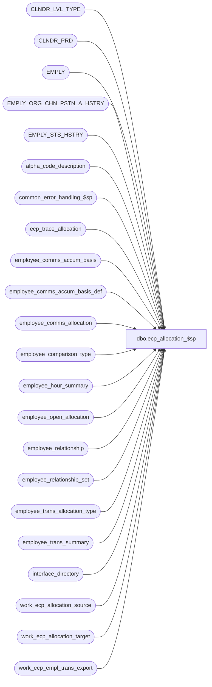

# dbo.ecp_allocation_$sp

**Database:** auditworks_external  
**Server:** bedrockdb01  

## Architecture Diagram



## Table Dependencies

| Referenced Table |
|---|
| CLNDR_LVL_TYPE |
| CLNDR_PRD |
| EMPLY |
| EMPLY_ORG_CHN_PSTN_A_HSTRY |
| EMPLY_STS_HSTRY |
| alpha_code_description |
| common_error_handling_$sp |
| ecp_trace_allocation |
| employee_comms_accum_basis |
| employee_comms_accum_basis_def |
| employee_comms_allocation |
| employee_comparison_type |
| employee_hour_summary |
| employee_open_allocation |
| employee_relationship |
| employee_relationship_set |
| employee_trans_allocation_type |
| employee_trans_summary |
| interface_directory |
| work_ecp_allocation_source |
| work_ecp_allocation_target |
| work_ecp_empl_trans_export |

## Stored Procedure Code

```sql
create proc [dbo].[ecp_allocation_$sp]    
   @hour_alloc_release_date 	datetime,
   @hour_alloc_posting_date 	datetime,
   @amt_alloc_release_date 	datetime,
   @amt_alloc_posting_date 	datetime,
   @even_alloc_release_date 	datetime,
   @even_alloc_posting_date 	datetime,
   @pay_period_close_date	datetime,
   @lowest_calendar_level	int,
   @ecp_clndr_id	        binary(16),
   @allocation_request		tinyint,    --1 means new allocation release requested
   @current_rows		int OUTPUT,
   @reallocation_rows		int,	    -- greater than 0 means more data for previously release alloc came in
   @from_reallocation_date	datetime = null,
   @to_reallocation_date	datetime = null,
   @reallocation_type_list	nvarchar(3000) = null 


AS
/* 
Proc Name: ecp_allocation_$sp 
Desc:   Performs allocations of qualified transactions to commissions posting
        Executed by ecp_posting_$sp IF
		(@hour_alloc_release_date > @hour_alloc_posting_date 
		 OR (@hour_alloc_release_date IS NOT NULL AND @hour_alloc_posting_date IS NULL)
		 OR @amt_alloc_release_date > @amt_alloc_posting_date 
		 OR (@amt_alloc_release_date IS NOT NULL AND @amt_alloc_posting_date IS NULL))        

NOTE:  The front-end prevents the user from picking an accumulation method based on "last year" as an allocation basis
       since this would not make sense.

HISTORY:  
Date     Name           Def#    Desc
Apr14,11 Paul          126153   Use unicode datatypes
Aug19,08 Vicci         103967   Handle effective date on employee relationship changes even for YTD amounts.
Aug06,08 Vicci         103077   Handle effective date on employee home-store changes.
Feb27,08 Vicci          98280   Don't include terminated employees in amt-based and hour-based allocations either if they
                                were terminated during the entire period during which the amount to be allocated was earned.
Feb18,08 Vicci          98280   Take live date into account when determining period to look at for determining employee status.
Feb15,08 Vicci          98280   Don't include terminated employees in even allocations.
Feb14,08 Vicci          98217   Recognize home-store matching request when processing even allocations;
                                log employee_no to employee_no instead of home-store to employee no when pulling entries
                                into source from employee_open_allocation.
Jan30,08 Vicci          97400   Remove obsolete reference to @rows;  add missing error trap.
Jan25,08 Vicci          97400   Treat a reallocation request of ALL as ALL ACTIVE allocation types, since they can no
                                longer delete allocation types once posted and since they can leave the allocation type
                                active but expire its source if they mean to reverse allocations which are no longer used.
                                Avoid possibility of same allocation rule being processed twice for same period when its
                                allocation basis is changed between amount-based, hour-based and even.  To do so log last
                                execution datetime as last release date posted instead of date posting was run.
                                Application of this procedure fix first requires an UPDATE employee_trans_allocation_type 
                                SET last_executed_datetime = NULL. 
                                Modify reallocation-type list usage to support simutaneous processing of both allocations
                                and reallocations
                                Further restrict min/max date in case where last alloc posting was a while ago, 
                                using eca effective date, and disregard last posting date of a given basis when setting
                                min date of range if no release request for that basis.
Dec06,07 Vicci          95521   Only allocate active allocation types;  set last execution datetime of those allocated.
Nov26,07 Vicci          95521   Integrate properly with CRDM
Oct26,07 Vicci          85597   Support past-X-periods accumulation methods where X > 1
Oct09,07 Vicci          85597   Replace PRMRY_FLAG references with PRMRY_LOC_A
Aug28,07 Vicci          85597   Support effective date on relationships
Aug10,07 Vicci          85597   Add option to allocate based on home-store.
Jul12,07 Vicci          85597   Fix typo in join to denominator:  should be on d.employee_group_code not n.employee_group_code
Jun14,07 Vicci		85597   Add tracing;  fix join between source and numerator/denominator to know employee only set 
                                in case where selling area of destination limited
Jun11,07 Vicci          85597   Avoid allocating history load
May30,07 Vicci          85597   Take sign into account when calculating numerator/denominator target amounts
May15,07 Vicci          85597   Add support for allocations based on multiple selling areas
                                of source employee instead of just their primary selling area
Mar23,07 Vicci		85597	Author
*/

SET NOCOUNT ON
DECLARE
  @trace_log			tinyint,
  @trace_msg			nvarchar(255),
  @compare_employee		tinyint,
  @compare_employee_from	int,
  @compare_employee_to		int,
  @compare_selling_area_from	int,
  @compare_selling_area_to	int,
  @compare_store_from		int,
  @compare_store_to		int,
  @employee_count		int,
  @from_date 			datetime,
  @compare_position             tinyint,
  @compare_selling_area         tinyint,
  @compare_store                tinyint,
  @cursor_open			tinyint,
  @one_hundred			money,
  @empl_transaction_role_count  int, 
  @errmsg                       nvarchar(255),
  @errno                        int,
  @function_name	        varbinary(128),
  @highest_calendar_level	int,
  @highest_calendar_level_id	binary(16),
  @message_id                   int,
  @live_date			datetime,
  @min_date_set			tinyint,
  @min_date			datetime,
  @max_date			datetime,
  @position_count		int,
  @process_name                 nvarchar(100),
  @process_no                   int,
  @object_name                  nvarchar(255),
  @operation_name               nvarchar(100),
  @rows				int,
  @selling_area_count		int,
  @store_count			int,
  @stream_no                    tinyint,
  @to_date 			datetime,
  @sql_command 			nvarchar(3000),
  @user_name                    nvarchar(30),
  @CLNDR_LVL_TYPE_ID		binary(16),
  @accum_basis_end_datetime	datetime,
  @past_calendar_period_qty     smallint,
  @period_rank			smallint,  
  @END_DATE_TIME		datetime,
  @cutoff_datetime		datetime,
  @lowest_CLNDR_LVL_TYPE_ID     binary(16)

SELECT @employee_count = 0, 
       @errno = 0,
       @message_id = 201068,
       @one_hundred = 100,
       @operation_name = 'Unknown',
       @position_count = 0,
       @process_name = 'ecp_allocation_$sp',
       @process_no = 282,
       @selling_area_count = 0,
       @store_count = 0, 
       @stream_no = 1,
       @user_name = suser_sname(),
       @current_rows = 0,
       @min_date_set = 0

SELECT @lowest_CLNDR_LVL_TYPE_ID = CLNDR_LVL_TYPE_ID
  FROM CLNDR_LVL_TYPE 
 WHERE @lowest_calendar_level =  CLNDR_LVL_TYPE_IDNTY
SELECT @errno = @@error, @rows = @@rowcount
IF @errno <> 0 OR @rows < 1
BEGIN
  SELECT @errmsg = 'Failed to determine lowest ECP calendar level ID',
         @object_name = 'CLNDR_LVL_TYPE',
        @operation_name = 'SELECT'
  GOTO error
END

SELECT @live_date = live_date
  FROM interface_directory
 WHERE interface_id = 44
SELECT @errno = @@error
IF @errno <> 0
BEGIN
  SELECT @errmsg = 'Failed to determine ECP live date',
         @object_name = 'interface_directory',
        @operation_name = 'SELECT'
  GOTO error
END

SELECT @trace_log = 0
IF @trace_log = 1
BEGIN
/*
if not exists (select * from dbo.sysobjects where id = Object_id('dbo.ecp_trace_allocation') and type in ('U','S'))
begin
   create table dbo.ecp_trace_allocation (
   execution_datetime 		datetime default getdate() not null,
   hour_alloc_release_date 	datetime null,
   hour_alloc_posting_date 	datetime null,
   amt_alloc_release_date 	datetime null,
   amt_alloc_posting_date 	datetime null,
   even_alloc_release_date 	datetime null,
   even_alloc_posting_date 	datetime null,
   pay_period_close_date	datetime null,
   lowest_calendar_level	int null,
   ecp_clndr_id	        	binary(16) null,
   allocation_request		tinyint null,
   current_rows			int null,
   reallocation_rows		int null,
   from_reallocation_date	datetime null,
   to_reallocation_date		datetime null,
   reallocation_type_list	nvarchar(3000) null)
end
select * from ecp_trace_allocation
*/
INSERT into ecp_trace_allocation(
       hour_alloc_release_date,
       hour_alloc_posting_date,
       amt_alloc_release_date,
       amt_alloc_posting_date,
       even_alloc_release_date,
       even_alloc_posting_date,
       pay_period_close_date,
       lowest_calendar_level,
       ecp_clndr_id,
       allocation_request,
       current_rows,
       reallocation_rows,
       from_reallocation_date,
       to_reallocation_date,
       reallocation_type_list)
VALUES (
       @hour_alloc_release_date,
       @hour_alloc_posting_date,
       @amt_alloc_release_date,
       @amt_alloc_posting_date,
       @even_alloc_release_date,
       @even_alloc_posting_date,
       @pay_period_close_date,
       @lowest_calendar_level,
       @ecp_clndr_id,
       @allocation_request,
       @current_rows,
       @reallocation_rows,
       @from_reallocation_date,
       @to_reallocation_date,
       @reallocation_type_list)
END  --IF @trace_log = 1


CREATE TABLE #reallocation_type(allocation_type nvarchar(20) not null)
IF @reallocation_type_list IS NOT NULL
BEGIN
  SELECT @sql_command = '
  INSERT #reallocation_type(allocation_type)
  SELECT allocation_type
    FROM employee_trans_allocation_type
   WHERE allocation_type IN (' + @reallocation_type_list + ')'

  EXEC sp_executesql @sql_command
  SELECT @errno = @@error
  IF @errno <> 0
  BEGIN
    SELECT @errmsg = 'Unable to list selected allocation types',
           @object_name = '#reallocation_type',
           @operation_name = 'INSERT'
    GOTO error
  END

END
ELSE --of IF @reallocation_type_list IS NOT NULL
BEGIN
  IF @from_reallocation_date IS NOT NULL
  BEGIN
    INSERT #reallocation_type(allocation_type)
    SELECT allocation_type
      FROM employee_trans_allocation_type
     WHERE active_flag = 1
    SELECT @errno = @@error
    IF @errno <> 0
    BEGIN
      SELECT @errmsg = 'Unable to list all active allocation types',
             @object_name = '#reallocation_type',
             @operation_name = 'INSERT'
      GOTO error
    END
  END --IF @from_reallocation_date IS NOT NULL
END --ELSE of IF @reallocation_type_list IS NOT NULL

TRUNCATE TABLE work_ecp_allocation_target
SELECT @errno = @@error
IF @errno <> 0
BEGIN
  SELECT @errmsg = 'Unable to clean up work_ecp_allocation_target table',
         @object_name = 'work_ecp_allocation_target',
         @operation_name = 'TRUNCATE'
  GOTO error
END

TRUNCATE TABLE work_ecp_allocation_source
SELECT @errno = @@error
IF @errno <> 0
BEGIN
  SELECT @errmsg = 'Unable to clean up work_ecp_allocation_target table',
         @object_name = 'work_ecp_allocation_source',
         @operation_name = 'TRUNCATE'
  GOTO error
END

--To improve performance if its been a while since the last allocation posting of a particular type
IF @allocation_request = 1
BEGIN
  IF datediff(dd, IsNull(@amt_alloc_posting_date, '01/01/1970'), @amt_alloc_release_date) > 14
  BEGIN
    SELECT @amt_alloc_posting_date = IsNull(min(eca.effective_from_date), @amt_alloc_posting_date)
      FROM employee_trans_allocation_type a
           INNER JOIN employee_comms_accum_basis_def ab
              ON a.accumulation_basis = ab.accumulation_basis
    AND ab.accumulation_basis_column in ('transaction_net_amount', 'transaction_units')
           INNER JOIN employee_comms_allocation eca
              ON a.allocation_type = eca.allocation_type
             AND (eca.effective_from_date > @amt_alloc_posting_date OR @amt_alloc_posting_date IS NULL)
             AND eca.effective_from_date <= @amt_alloc_release_date
     WHERE a.active_flag = 1
    SELECT @errno = @@error
    IF @errno <> 0
    BEGIN
      SELECT @errmsg = 'Failed to find earliest effective date for new amounts to be allocated for amt-based rules',
             @object_name = 'employee_comms_allocation',
             @operation_name = 'SELECT'
      GOTO error
    END
  END  --IF its been a while since the last amount-based allocation posting
  IF datediff(dd, IsNull(@even_alloc_posting_date, '01/01/1970'), @even_alloc_release_date) > 14
  BEGIN
    SELECT @even_alloc_posting_date = IsNull(min(eca.effective_from_date), @even_alloc_posting_date)
      FROM employee_trans_allocation_type a
           INNER JOIN employee_comms_accum_basis_def ab
              ON a.accumulation_basis = ab.accumulation_basis
             AND ab.accumulation_basis_column = 'even'
           INNER JOIN employee_comms_allocation eca
              ON a.allocation_type = eca.allocation_type
             AND (eca.effective_from_date > @even_alloc_posting_date OR @even_alloc_posting_date IS NULL)
             AND eca.effective_from_date <= @even_alloc_release_date
     WHERE a.active_flag = 1
    SELECT @errno = @@error
    IF @errno <> 0
    BEGIN
      SELECT @errmsg = 'Failed to find earliest effective date for new amounts to be allocated evenly',
             @object_name = 'employee_comms_allocation',
             @operation_name = 'SELECT'
      GOTO error
    END
    IF @even_alloc_posting_date < @live_date 
      SELECT @even_alloc_posting_date = dateadd(ss, -1, @live_date)
  END  --IF its been a while since the last even allocation posting
  IF datediff(dd, IsNull(@hour_alloc_posting_date, '01/01/1970'), @hour_alloc_release_date) > 14
  BEGIN
    SELECT @hour_alloc_posting_date = IsNull(min(eca.effective_from_date), @hour_alloc_posting_date)
      FROM employee_trans_allocation_type a
           INNER JOIN employee_comms_accum_basis_def ab
              ON a.accumulation_basis = ab.accumulation_basis
             AND ab.accumulation_basis_column in ('productive_selling_hours', 'productive_non_selling_hours', 'productive_hours')
           INNER JOIN employee_comms_allocation eca
              ON a.allocation_type = eca.allocation_type
             AND (eca.effective_from_date > @hour_alloc_posting_date OR @hour_alloc_posting_date IS NULL)
             AND eca.effective_from_date <= @hour_alloc_release_date
     WHERE a.active_flag = 1
    SELECT @errno = @@error
    IF @errno <> 0
    BEGIN
      SELECT @errmsg = 'Failed to find earliest effective date for new amounts to be allocated for hour-based rules',
             @object_name = 'employee_comms_allocation',
             @operation_name = 'SELECT'
      GOTO error
    END
  END  --IF its been a while since the last hour-based allocation posting

  IF (@amt_alloc_release_date > @amt_alloc_posting_date 
      OR (@amt_alloc_release_date IS NOT NULL AND @amt_alloc_posting_date IS NULL))  
    SELECT @min_date = @amt_alloc_posting_date,
           @min_date_set = 1

  IF (@hour_alloc_release_date > @hour_alloc_posting_date 
      OR (@hour_alloc_release_date IS NOT NULL AND @hour_alloc_posting_date IS NULL))  
     AND (@min_date_set = 0
          OR @hour_alloc_posting_date < @min_date 
          OR (@hour_alloc_posting_date IS NULL AND @min_date IS NOT NULL))
    SELECT @min_date =  @hour_alloc_posting_date,
           @min_date_set = 1

  IF (@even_alloc_release_date > @even_alloc_posting_date 
      OR (@even_alloc_release_date IS NOT NULL AND @even_alloc_posting_date IS NULL))  
     AND (@min_date_set = 0
          OR @even_alloc_posting_date < @min_date 
          OR (@even_alloc_posting_date IS NULL AND @min_date IS NOT NULL))
    SELECT @min_date =  @even_alloc_posting_date,
 @min_date_set = 1
END  --IF @allocation_request = 1

IF @from_reallocation_date IS NOT NULL
   AND (@min_date_set = 0
        OR dateadd(ss, -1, @from_reallocation_date) < @min_date)  --need to ajust by a second since posting needs to run
                                                                  --exclusive of min date when it is a posting date but
                                                                  --inclusive when it is a reallocation date.
  SELECT @min_date = dateadd(ss, -1, @from_reallocation_date)

IF @min_date IS NULL
  SELECT @min_date = '01/01/1970'

SELECT @max_date = '01/01/1970'
IF @amt_alloc_release_date > @max_date
  SELECT @max_date = @amt_alloc_release_date
IF @hour_alloc_release_date > @max_date
  SELECT @max_date = @hour_alloc_release_date
IF @even_alloc_release_date > @max_date
  SELECT @max_date = @even_alloc_release_date

IF @allocation_request = 0 AND @to_reallocation_date < @max_date
  SELECT @max_date = @to_reallocation_date
  
CREATE TABLE #comp_selling_area(comparison_type smallint not null, selling_area_no int not null)
IF @errno <> 0
BEGIN
  SELECT @errmsg = 'Failed to table to hold list of comparison basis selling areas',
         @object_name = '#comp_selling_area',
         @operation_name = 'CREATE'
  GOTO error
END

INSERT #comp_selling_area(comparison_type, selling_area_no)
SELECT comparison_type, -1
  FROM employee_comparison_type
 WHERE (selling_area_no IS NULL OR selling_area_no = '-1')
IF @errno <> 0
BEGIN
  SELECT @errmsg = 'Failed to list comparison types where selling area is n/a with a selling area set to All',
         @object_name = '#comp_selling_area',
         @operation_name = 'INSERT'
  GOTO error
END
 
DECLARE processing_cursor CURSOR FAST_FORWARD
 FOR
  SELECT 'INSERT #comp_selling_area(comparison_type, selling_area_no)
SELECT DISTINCT ' + convert(nvarchar, ct.comparison_type) + ', f.FNCTN_NUM
FROM ORG_CHN_LOC_FNCTN f
WHERE f.FNCTN_NUM in (' + ct.selling_area_no + ')'
    FROM employee_comparison_type ct
   WHERE selling_area_no IS NOT NULL
     AND selling_area_no <> '-1'
IF @errno <> 0
BEGIN
  SELECT @errmsg = 'Failed to declare cursor to list selling area restrictions applicable to each comparison type',
         @object_name = 'processing_cursor',
         @operation_name = 'DECLARE'
  GOTO error
END

OPEN processing_cursor
SELECT @cursor_open = 1

FETCH processing_cursor
 INTO @sql_command

WHILE @@fetch_status = 0 
BEGIN
  EXEC sp_executesql @sql_command, N'@errno int OUT', @errno OUT              
  IF @errno <> 0
  BEGIN
    PRINT @sql_command  
    SELECT @errmsg = 'Failed to list selling area restrictions applicable to each comparison type via dynamic SQL',
           @object_name = '#comp_selling_area',
           @operation_name = 'INSERT'
    GOTO error
  END
	
  FETCH processing_cursor
  INTO @sql_command
END -- while not end of cursor

CLOSE processing_cursor
DEALLOCATE processing_cursor 
SELECT @cursor_open = 0

CREATE TABLE #comp_primary_position(comparison_type smallint not null, primary_position nvarchar(4) not null)
IF @errno <> 0
BEGIN
  SELECT @errmsg = 'Failed to table to hold list of comparison basis primary positions',
         @object_name = '#comp_primary_position',
         @operation_name = 'CREATE'
  GOTO error
END

INSERT #comp_primary_position(comparison_type, primary_position)
SELECT comparison_type, '-1'
  FROM employee_comparison_type
 WHERE (primary_position IS NULL OR primary_position = '-1')
IF @errno <> 0
BEGIN
  SELECT @errmsg = 'Failed to list comparison types where primary_position is n/a with a primary_position set to All',
         @object_name = '#comp_primary_position',
         @operation_name = 'INSERT'
  GOTO error
END
 
DECLARE processing_cursor CURSOR FAST_FORWARD
 FOR
  SELECT 'INSERT #comp_primary_position(comparison_type, primary_position)
SELECT ' + convert(nvarchar, ct.comparison_type) + ', pp.PSTN_CODE
FROM ORG_CHN_PSTN pp
WHERE PSTN_CODE IN (' + ct.primary_position + ')'
    FROM employee_comparison_type ct
 WHERE primary_position IS NOT NULL
     AND primary_position <> '-1'
IF @errno <> 0
BEGIN
  SELECT @errmsg = 'Failed to declare cursor to list primary_position restrictions applicable to each comparison type',
         @object_name = 'processing_cursor',
         @operation_name = 'DECLARE'
  GOTO error
END

OPEN processing_cursor

FETCH processing_cursor
 INTO @sql_command

WHILE @@fetch_status = 0 
BEGIN
  EXEC sp_executesql @sql_command, N'@errno int OUT', @errno OUT              
  IF @errno <> 0
  BEGIN
    PRINT @sql_command  
    SELECT @errmsg = 'Failed to list primary_position restrictions applicable to each comparison type via dynamic SQL',
           @object_name = '#comp_selling_area',
           @operation_name = 'INSERT'
    GOTO error
  END
	
  FETCH processing_cursor
  INTO @sql_command
END -- while not end of cursor

CLOSE processing_cursor
DEALLOCATE processing_cursor 
SELECT @cursor_open = 0 

SELECT @trace_msg = nchar(13) + nchar(10) + ':LOG && #comp_primary_position count: ' 
SELECT @trace_msg = @trace_msg + convert(nvarchar, count(*))
  FROM #comp_primary_position
PRINT @trace_msg
--select 'TestPrimPosList', * from #comp_primary_position

CREATE TABLE #alloc_source(
       source_empl_trans_summary_id numeric(12,0) not null,
       pay_period_end_datetime datetime not null,
       period_end_datetime datetime not null,
       employee_no int not null,
       primary_position nvarchar(4) not null,
       primary_selling_area_no int not null,
       home_store_no int null,
       transaction_store_no_flag tinyint not null,
       transaction_store_no int not null,
       employee_group_code nvarchar(20) null,
        item_commission_code nvarchar(20) null,
        transaction_commission_code nvarchar(20) null,
        store_commission_code nvarchar(20) null,
       transaction_net_amount money not null,
       transaction_discount_amount money not null,
       transaction_units numeric(15,4) not null,
       source_allocation_type nvarchar(20) not null,
       comparison_type smallint not null,
       relationship_type nvarchar(20) null,
       relationship_position nvarchar(4) null,
       accumulation_basis_column nvarchar(30) not null, 
       accumulation_basis smallint not null,
       accum_basis_calendar_level smallint not null,
       accum_basis_CLNDR_LVL_TYPE_ID binary(16) NOT NULL, 
       accum_basis_end_datetime datetime not null,
       basis_calendar_period_quantity smallint not null, 
       selling_area_flag tinyint not null)
SELECT @errno = @@error
IF @errno <> 0
BEGIN
  SELECT @errmsg = 'Failed to create temp table to hold list of amounts to be allocated',
         @object_name = '#alloc_source',
         @operation_name = 'CREATE'
  GOTO error
END

SELECT @trace_msg = nchar(13) + nchar(10) + ':LOG && allocation from: ' + CONVERT(nchar, @min_date, 101) + ' ' + CONVERT(nchar, @min_date, 108)  + ' to:  ' + CONVERT(nchar, @max_date, 101) + ' ' + CONVERT(nchar, @max_date, 108) 
PRINT @trace_msg
SELECT @trace_msg = nchar(13) + nchar(10) + ':LOG && allocation amt from: ' + CONVERT(nchar, @amt_alloc_posting_date, 101) + ' ' + CONVERT(nchar, @amt_alloc_posting_date, 108)  + ' to:  ' + CONVERT(nchar, @amt_alloc_release_date, 101) + ' ' + CONVERT(nchar, @amt_alloc_release_date, 108) 
PRINT @trace_msg
SELECT @trace_msg = nchar(13) + nchar(10) + ':LOG && allocation live date: ' + CONVERT(nchar, @live_date, 101) + ' ' + CONVERT(nchar, @live_date, 108)
PRINT @trace_msg
SELECT @trace_msg = nchar(13) + nchar(10) + ':LOG && allocation lowest level: ' + CONVERT(nchar, @lowest_calendar_level)
PRINT @trace_msg

IF @allocation_request = 1 OR @from_reallocation_date IS NOT NULL
BEGIN
  INSERT into #alloc_source(
         source_empl_trans_summary_id,
         pay_period_end_datetime,
         period_end_datetime,
         employee_no,
         primary_position,
         primary_selling_area_no,
         home_store_no,
         transaction_store_no_flag,
         transaction_store_no,
         employee_group_code, 
         item_commission_code,
         transaction_commission_code,
         store_commission_code,
         transaction_net_amount,
         transaction_discount_amount,
         transaction_units,
         source_allocation_type,
         comparison_type,
         relationship_type,
         relationship_position,
         accumulation_basis_column, 
         accumulation_basis,
         accum_basis_calendar_level,
         accum_basis_CLNDR_LVL_TYPE_ID,
         accum_basis_end_datetime,
         basis_calendar_period_quantity, 
         selling_area_flag)
  SELECT ets.empl_trans_summary_id AS source_empl_trans_summary_id,
         ets.pay_period_end_datetime,
         ets.period_end_datetime,
         ets.employee_no,
         CASE WHEN ct.primary_position_flag = 1
             THEN ets.primary_position
              ELSE '-1' 
              END as primary_position,
         CASE WHEN ct.primary_selling_area_no_flag = 1 
              THEN ets.primary_selling_area_no
              ELSE -1 
              END as primary_selling_area_no,
         CASE WHEN ct.home_store_no_flag = 1 
              THEN ets.home_store_no
              ELSE -1 
              END as home_store_no,
         ct.transaction_store_no_flag,
         ets.transaction_store_no,
         er.employee_group_code,
         ets.item_commission_code,
         ets.transaction_commission_code,
         ets.store_commission_code,
         ets.transaction_net_amount * eca.allocation_percent / @one_hundred as transaction_net_amount,
         ets.transaction_discount_amount * eca.allocation_percent / @one_hundred as transaction_discount_amount,
         ets.transaction_units * eca.allocation_percent / @one_hundred as transaction_units, 
         eca.allocation_type as source_allocation_type,
         at.comparison_type as comparison_type,
         ct.relationship_type,
         ct.relationship_position,
         ab.accumulation_basis_column, 
         ab.accumulation_basis,
         IsNull(ab.calendar_level, @lowest_calendar_level) as accum_basis_calendar_level,
         clt.CLNDR_LVL_TYPE_ID accum_basis_CLNDR_LVL_TYPE_ID,
         dateadd(ss, -1, cp.END_DATE_TIME) as accum_basis_end_datetime,
         ab.calendar_period_quantity as basis_calendar_period_quantity, 
         ct.selling_area_flag
    FROM employee_trans_summary ets
         INNER JOIN employee_comms_allocation eca
            ON ets.employee_commission_code = eca.employee_commission_code
           AND ets.employee_transaction_role = eca.employee_transaction_role
           AND ets.item_commission_code = eca.item_commission_code
           AND ets.store_commission_code = eca.store_commission_code
           AND ets.transaction_commission_code = eca.transaction_commission_code
           AND ets.pay_period_end_datetime >= eca.effective_from_date
           AND (ets.pay_period_end_datetime <= eca.effective_to_date 
                OR eca.effective_to_date IS NULL)
         INNER JOIN employee_trans_allocation_type at
            ON eca.allocation_type = at.allocation_type
           AND at.active_flag = 1
         INNER JOIN employee_comms_accum_basis_def ab
            ON at.accumulation_basis = ab.accumulation_basis
         INNER JOIN CLNDR_LVL_TYPE clt
            ON IsNull(ab.calendar_level, @lowest_calendar_level) = clt.CLNDR_LVL_TYPE_IDNTY
         INNER JOIN CLNDR_PRD cp
            ON ets.pay_period_end_datetime >= cp.STRT_DATE_TIME
           AND ets.pay_period_end_datetime < cp.END_DATE_TIME
           AND @ecp_clndr_id = cp.CLNDR_ID
           AND clt.CLNDR_LVL_TYPE_ID = cp.CLNDR_LVL_TYPE_ID
         INNER JOIN employee_comparison_type ct
            ON at.comparison_type = ct.comparison_type
         LEFT OUTER JOIN employee_relationship er
           ON ct.relationship_type = er.relationship_type
           AND ets.period_end_datetime >= er.effective_from_date
           AND (ets.period_end_datetime <= er.effective_to_date OR er.effective_to_date IS NULL)
           AND ets.employee_no = er.employee_no
   WHERE ets.calendar_level = @lowest_calendar_level
     AND ets.source_allocation_type IS NULL
     AND (ets.pay_period_end_datetime >= @live_date OR @live_date IS NULL)  --avoid allocating history load
     AND ets.pay_period_end_datetime > @min_date 
     AND ets.pay_period_end_datetime <= @max_date
     AND (((ets.pay_period_end_datetime > COALESCE(at.last_executed_datetime, @amt_alloc_posting_date, '01/01/1970')
            OR (ets.pay_period_end_datetime >= @from_reallocation_date
                AND ets.pay_period_end_datetime <= @to_reallocation_date
                AND eca.allocation_type IN (SELECT rat.allocation_type
                                FROM #reallocation_type rat)
                ))
           AND ets.pay_period_end_datetime <= @amt_alloc_release_date
           AND ab.accumulation_basis_column in ('transaction_net_amount', 'transaction_units'))
          OR
          ((ets.pay_period_end_datetime > COALESCE(at.last_executed_datetime, @hour_alloc_posting_date, '01/01/1970')
            OR (ets.pay_period_end_datetime >= @from_reallocation_date
                AND ets.pay_period_end_datetime <= @to_reallocation_date
                AND eca.allocation_type IN (SELECT rat.allocation_type
       FROM #reallocation_type rat)))
          AND ets.pay_period_end_datetime <= @hour_alloc_release_date
           AND ab.accumulation_basis_column in ('productive_selling_hours', 'productive_non_selling_hours', 'productive_hours'))
          OR 
          ((ets.pay_period_end_datetime > COALESCE(at.last_executed_datetime, @even_alloc_posting_date, '01/01/1970')
            OR (ets.pay_period_end_datetime >= @from_reallocation_date
                AND ets.pay_period_end_datetime <= @to_reallocation_date
                AND eca.allocation_type IN (SELECT rat.allocation_type
                                              FROM #reallocation_type rat)))
           AND ets.pay_period_end_datetime <= @even_alloc_release_date
           AND ab.accumulation_basis_column = 'even')
      )
  SELECT @errno = @@error
  IF @errno <> 0
  BEGIN
    SELECT @errmsg = 'Failed to build list of prior amounts to be allocated',
           @object_name = '#alloc_source',
           @operation_name = 'INSERT'
    GOTO error
  END
  SELECT @trace_msg = nchar(13) + nchar(10) + ':LOG && #alloc_source prior count: ' 
  SELECT @trace_msg = @trace_msg + convert(nvarchar, count(*))
    FROM #alloc_source
  PRINT @trace_msg
  --select 'TestAllocSourcePrior', * from #alloc_source
END --IF @allocation_request = 1 OR @from_reallocation_date IS NOT NULL

IF @reallocation_rows > 0
BEGIN
  INSERT into #alloc_source(
         source_empl_trans_summary_id,
         pay_period_end_datetime,
         period_end_datetime,
         employee_no,
         primary_position,
         primary_selling_area_no,
         home_store_no,
         transaction_store_no_flag,
         transaction_store_no,
         employee_group_code, 
         item_commission_code,
         transaction_commission_code,
         store_commission_code,
         transaction_net_amount,
         transaction_discount_amount,
         transaction_units,
         source_allocation_type,
         comparison_type,
         relationship_type,
         relationship_position,
         accumulation_basis_column, 
         accumulation_basis,
         accum_basis_calendar_level,
         accum_basis_CLNDR_LVL_TYPE_ID,
         accum_basis_end_datetime,
         basis_calendar_period_quantity, 
         selling_area_flag)
  SELECT w.source_empl_trans_summary_id,
         w.pay_period_end_datetime,
         w.period_end_datetime,
         w.employee_no,
         w.primary_position,
         w.primary_selling_area_no,
         w.home_store_no,
         w.transaction_store_no_flag,
         w.transaction_store_no,
         er.employee_group_code,
         w.item_commission_code,
         w.transaction_commission_code,
         w.store_commission_code,
         w.transaction_net_amount,
         w.transaction_discount_amount,
         w.transaction_units, 
         w.source_allocation_type,
         w.comparison_type,
         w.relationship_type,
         w.relationship_position,
         w.accumulation_basis_column, 
         w.accumulation_basis,
         w.accum_basis_calendar_level,
         clt.CLNDR_LVL_TYPE_ID, 
         dateadd(ss, -1, cp.END_DATE_TIME) as accum_basis_end_datetime,
         w.basis_calendar_period_quantity, 
         w.selling_area_flag
    FROM employee_open_allocation w
         INNER JOIN CLNDR_LVL_TYPE clt
            ON w.accum_basis_calendar_level = clt.CLNDR_LVL_TYPE_IDNTY
         INNER JOIN CLNDR_PRD cp
            ON w.pay_period_end_datetime >= cp.STRT_DATE_TIME
           AND w.pay_period_end_datetime < cp.END_DATE_TIME
           AND @ecp_clndr_id = cp.CLNDR_ID
           AND clt.CLNDR_LVL_TYPE_ID = cp.CLNDR_LVL_TYPE_ID
         LEFT OUTER JOIN employee_relationship er
            ON w.relationship_type = er.relationship_type
           AND w.employee_no = er.employee_no
           AND w.period_end_datetime >= er.effective_from_date
           AND (w.period_end_datetime <= er.effective_to_date OR er.effective_to_date IS NULL)
   WHERE (w.pay_period_end_datetime >= @live_date OR @live_date IS NULL)  --avoid allocating history load

  SELECT @errno = @@error
  IF @errno <> 0
  BEGIN
    SELECT @errmsg = 'Failed to build list of current new amounts to be allocated',
           @object_name = '#alloc_source',
           @operation_name = 'CREATE'
    GOTO error
  END
SELECT @trace_msg = nchar(13) + nchar(10) + ':LOG && #alloc_source current count: ' 
SELECT @trace_msg = @trace_msg + convert(nvarchar, count(*))
  FROM #alloc_source
PRINT @trace_msg
--select 'TestAllocSourceCurrent', * from #alloc_source
END --IF @reallocation_rows > 0

INSERT into work_ecp_allocation_source(       
       source_allocation_type, 
       source_period_end_datetime, --to support terminated check
       accum_basis_end_datetime_from,
       accum_basis_end_datetime, 
       home_store_no,
       transaction_store_no, 
       primary_position, 
       primary_selling_area_no, 
       employee_group_code,
       comparison_type,
       relationship_type,
        relationship_position,
        accumulation_basis_column, 
        accumulation_basis,
        accum_basis_calendar_level,
        accum_basis_CLNDR_LVL_TYPE_ID,
        basis_calendar_period_quantity,
       selling_area_flag,
       employee_no)
SELECT DISTINCT
       source_allocation_type, 
       period_end_datetime,
       accum_basis_end_datetime, 
       accum_basis_end_datetime, 
       home_store_no,
       CASE WHEN transaction_store_no_flag = 1
            THEN transaction_store_no
            ELSE -1
       END as transaction_store_no,
       primary_position, 
       primary_selling_area_no, 
       employee_group_code,
       comparison_type,
       relationship_type,
       relationship_position,
       accumulation_basis_column, 
       accumulation_basis,
       accum_basis_calendar_level, 
       accum_basis_CLNDR_LVL_TYPE_ID,
       basis_calendar_period_quantity,
       selling_area_flag,
       selling_area_flag * employee_no
FROM #alloc_source

DECLARE past_x_period_cursor CURSOR FAST_FORWARD
  FOR
 SELECT DISTINCT accum_basis_CLNDR_LVL_TYPE_ID, 
        accum_basis_end_datetime, 
        basis_calendar_period_quantity
   FROM work_ecp_allocation_source
  WHERE basis_calendar_period_quantity > 1
   
OPEN past_x_period_cursor
SELECT @cursor_open = 2
   
FETCH past_x_period_cursor
 INTO @CLNDR_LVL_TYPE_ID,
      @accum_basis_end_datetime,
      @past_calendar_period_qty
   
WHILE @@fetch_status = 0
BEGIN
  SELECT @period_rank = 2,
         @cutoff_datetime = @accum_basis_end_datetime
    
  WHILE @period_rank <= @past_calendar_period_qty
  BEGIN
    SELECT @END_DATE_TIME = max(c.END_DATE_TIME)
      FROM CLNDR_PRD c
     WHERE c.CLNDR_LVL_TYPE_ID = @CLNDR_LVL_TYPE_ID
       AND c.CLNDR_ID = @ecp_clndr_id
       AND c.END_DATE_TIME < dateadd(ss, 1, @cutoff_datetime)
    SELECT @errno = @@error
    IF @errno <> 0
    BEGIN
      SELECT @errmsg = 'Failed to determine next oldest period to post',
             @object_name = 'CLNDR_PRD',
             @operation_name = 'SELECT'
      GOTO error
    END

    IF @END_DATE_TIME IS NULL BREAK      
 
    IF @period_rank = @past_calendar_period_qty
    BEGIN
      UPDATE work_ecp_allocation_source
         SET accum_basis_end_datetime_from = dateadd(ss, -1, @END_DATE_TIME)
       WHERE accum_basis_CLNDR_LVL_TYPE_ID = @CLNDR_LVL_TYPE_ID
         AND accum_basis_end_datetime = @accum_basis_end_datetime
         AND basis_calendar_period_quantity = @past_calendar_period_qty
      SELECT @errno = @@error
      IF @errno <> 0
      BEGIN
        SELECT @errmsg = 'Failed to set from-date of earliest period falling in past-X periods selected',
               @object_name = 'work_ecp_allocation_source',
               @operation_name = 'UPDATE'
        GOTO error
      END
    END
     
    SELECT @period_rank = @period_rank + 1,
           @cutoff_datetime = dateadd(ss, -1, @END_DATE_TIME)

  END /* while @period_rank <= @past_calendar_period_qty */
  
  FETCH past_x_period_cursor
   INTO @CLNDR_LVL_TYPE_ID,
        @accum_basis_end_datetime,
        @past_calendar_period_qty
END /* while not end of past_x_period_cursor */

CLOSE past_x_period_cursor
DEALLOCATE past_x_period_cursor 
SELECT @cursor_open = 0
  
INSERT work_ecp_allocation_target(
       source_allocation_type, source_period_end_datetime, accum_basis_end_datetime, home_store_no, 
       transaction_store_no, primary_position, primary_selling_area_no, 
       employee_group_code, employee_no,
       numerator_amount,
       selling_area_flag, src_employee_no)
SELECT src.source_allocation_type, src.source_period_end_datetime, src.accum_basis_end_datetime, src.home_store_no,
       src.transaction_store_no, src.primary_position, src.primary_selling_area_no, 
       src.employee_group_code, ets.employee_no,
       CASE src.accumulation_basis_column
            WHEN 'transaction_net_amount' THEN SUM(CASE WHEN IsNull(tcc.system_code, 'S') = 'S' THEN ets.transaction_net_amount ELSE ets.transaction_net_amount * -1 END)
            ELSE SUM(CASE WHEN IsNull(tcc.system_code, 'S') = 'S' THEN ets.transaction_units ELSE ets.transaction_units * -1 END ) 
            END as numerator_amount,
       src.selling_area_flag, src.employee_no as src_employee_no
  FROM work_ecp_allocation_source src
       INNER JOIN employee_comms_accum_basis ab
          ON src.accumulation_basis = ab.accumulation_basis
       INNER JOIN #comp_selling_area sa
          ON src.comparison_type = sa.comparison_type
       INNER JOIN #comp_primary_position pp
          ON src.comparison_type = pp.comparison_type          
       LEFT OUTER JOIN EMPLY_ORG_CHN_PSTN_A_HSTRY ocp  --note: not primary selling area, but all assigned selling areas
          ON src.employee_no = ocp.EMPLY_NUM
         AND src.selling_area_flag = 1
         AND ocp.EFCTV_DATE <= src.accum_basis_end_datetime
         AND (ocp.EXPRTN_DATE > src.accum_basis_end_datetime 
              OR ocp.EXPRTN_DATE IS NULL)
       INNER JOIN employee_trans_summary ets  --TODO subtract back out future
          ON src.accum_basis_calendar_level = ets.calendar_level
         AND ets.period_end_datetime >= src.accum_basis_end_datetime_from
         AND ets.period_end_datetime <= src.accum_basis_end_datetime
         AND (src.primary_position = ets.primary_position 
              OR src.primary_position = '-1')
         AND (src.primary_selling_area_no = ets.primary_selling_area_no 
              OR src.primary_selling_area_no = -1)
         AND (src.transaction_store_no = ets.transaction_store_no 
              OR src.transaction_store_no = -1)
         AND (src.home_store_no = ets.home_store_no 
              OR src.home_store_no = -1)
         AND (sa.selling_area_no = ets.primary_selling_area_no
              OR sa.selling_area_no = -1)
         AND (pp.primary_position = ets.primary_position
              OR pp.primary_position = '-1')
         AND ets.employee_transaction_role = ab.employee_transaction_role
         AND ets.item_commission_code = ab.item_commission_code
         AND ets.store_commission_code = ab.store_commission_code
         AND ets.transaction_commission_code = ab.transaction_commission_code
         AND (ocp.PRMRY_DISP_FNCTN_NUM = ets.primary_selling_area_no OR
              src.selling_area_flag = 0)
         AND (IsNull(src.relationship_type, '-1') = '-1'
              OR ets.relationship_set_id IN (SELECT x.relationship_set_id
                                               FROM employee_relationship_set x
                                              WHERE ets.relationship_set_id = x.relationship_set_id
                                                AND x.relationship_set_code like '%t:' + src.relationship_type + ' g:' + src.employee_group_code + CASE WHEN IsNull(src.relationship_position, '') = '' THEN '' ELSE ' p:' + src.relationship_position END + '%'))
       LEFT OUTER JOIN alpha_code_description tcc
          ON ets.transaction_commission_code = tcc.code
         AND tcc.code_type  = 14
         AND tcc.code_status = 'U'
       INNER JOIN EMPLY e
         ON ets.employee_no = e.EMPLY_NUM
       INNER JOIN CLNDR_PRD cp
          ON src.source_period_end_datetime >= cp.STRT_DATE_TIME
         AND src.source_period_end_datetime < cp.END_DATE_TIME
         AND @ecp_clndr_id = cp.CLNDR_ID
         AND @lowest_CLNDR_LVL_TYPE_ID = cp.CLNDR_LVL_TYPE_ID
       LEFT OUTER JOIN EMPLY_STS_HSTRY ehf
          ON e.EMPLY_NUM = ehf.EMPLY_NUM
          AND (cp.STRT_DATE_TIME >= ehf.EFCTV_DATE AND (cp.STRT_DATE_TIME < ehf.EXPRTN_DATE OR ehf.EXPRTN_DATE IS NULL))
       LEFT OUTER JOIN EMPLY_STS_HSTRY eht
          ON e.EMPLY_NUM = eht.EMPLY_NUM
          AND (dateadd(ss, -1, cp.END_DATE_TIME) >= eht.EFCTV_DATE AND (dateadd(ss, -1, cp.END_DATE_TIME) < eht.EXPRTN_DATE OR eht.EXPRTN_DATE IS NULL))
 WHERE src.accumulation_basis_column in ('transaction_net_amount', 'transaction_units')
   AND (IsNull(eht.EMPLY_STS_CODE, 'HIRE') <> 'TERM' OR IsNull(ehf.EMPLY_STS_CODE, 'HIRE') <> 'TERM')
 GROUP BY src.source_allocation_type, src.source_period_end_datetime, src.accum_basis_end_datetime, src.home_store_no,
       src.transaction_store_no, src.primary_position, src.primary_selling_area_no, 
       src.employee_group_code,
       ets.employee_no,
       src.accumulation_basis_column,
       src.selling_area_flag, src.employee_no
SELECT @errno = @@error
IF @errno <> 0
BEGIN
  SELECT @errmsg = 'Failed to build list employees who will receive the allocation based on their transaction amounts',
         @object_name = 'work_ecp_allocation_target',
         @operation_name = 'INSERT'
  GOTO error
END
SELECT @trace_msg = nchar(13) + nchar(10) + ':LOG && work_ecp_allocation_target count: ' 
SELECT @trace_msg = @trace_msg + convert(nvarchar, count(*))
  FROM work_ecp_allocation_target
PRINT @trace_msg
--select 'TestAllocAmtTarget', * from work_ecp_allocation_target 

INSERT work_ecp_allocation_target(
       source_allocation_type, source_period_end_datetime, accum_basis_end_datetime, home_store_no, 
    transaction_store_no, primary_position, primary_selling_area_no, employee_group_code, 
       employee_no,
       numerator_amount,
       selling_area_flag, src_employee_no)
SELECT src.source_allocation_type, src.source_period_end_datetime, src.accum_basis_end_datetime, src.home_store_no, 
       src.transaction_store_no, src.primary_position, src.primary_selling_area_no, 
       src.employee_group_code,
       ehs.employee_no,
       CASE src.accumulation_basis_column 
            WHEN 'productive_selling_hours' THEN SUM(ehs.productive_selling_hours)
            WHEN 'productive_hours' THEN SUM(ehs.productive_selling_hours + ehs.productive_non_selling_hours)
            ELSE SUM(ehs.productive_non_selling_hours)
            END as numerator_amount,
       src.selling_area_flag, src.employee_no as src_employee_no
  FROM work_ecp_allocation_source src
       INNER JOIN #comp_selling_area sa
          ON src.comparison_type = sa.comparison_type
       INNER JOIN #comp_primary_position pp
          ON src.comparison_type = pp.comparison_type          
       LEFT OUTER JOIN EMPLY_ORG_CHN_PSTN_A_HSTRY ocp
          ON src.employee_no = ocp.EMPLY_NUM
         AND src.selling_area_flag = 1
         AND ocp.EFCTV_DATE <= src.accum_basis_end_datetime
         AND (ocp.EXPRTN_DATE > src.accum_basis_end_datetime 
              OR ocp.EXPRTN_DATE IS NULL)
       INNER JOIN employee_hour_summary ehs  --TODO subtract back out future
          ON src.accum_basis_calendar_level = ehs.calendar_level
         AND ehs.period_end_datetime >= src.accum_basis_end_datetime_from
         AND ehs.period_end_datetime <= src.accum_basis_end_datetime
         AND (src.primary_position = ehs.payroll_entry_position 
              OR src.primary_position = '-1')
         AND (src.primary_selling_area_no = ehs.payroll_entry_selling_area_no 
              OR src.primary_selling_area_no = -1)
         AND (src.transaction_store_no = ehs.store_no 
              OR src.transaction_store_no = -1)
         AND (src.home_store_no = ehs.home_store_no 
              OR src.home_store_no = -1)
         AND (sa.selling_area_no = ehs.payroll_entry_selling_area_no
              OR sa.selling_area_no = -1)
         AND (pp.primary_position = ehs.payroll_entry_position
              OR pp.primary_position = '-1')
         AND (ocp.PRMRY_DISP_FNCTN_NUM = ehs.payroll_entry_selling_area_no OR
              src.selling_area_flag = 0)
         AND (IsNull(src.relationship_type, '-1') = '-1'
              OR ehs.relationship_set_id IN (SELECT x.relationship_set_id
                                               FROM employee_relationship_set x
                                              WHERE ehs.relationship_set_id = x.relationship_set_id
                                                AND x.relationship_set_code like '%t:' + src.relationship_type + ' g:' + src.employee_group_code + CASE WHEN IsNull(src.relationship_position, '') = '' THEN '' ELSE ' p:' + src.relationship_position END + '%'))
       INNER JOIN EMPLY e
          ON ehs.employee_no = e.EMPLY_NUM
       INNER JOIN CLNDR_PRD cp
          ON src.source_period_end_datetime >= cp.STRT_DATE_TIME
         AND src.source_period_end_datetime < cp.END_DATE_TIME
         AND @ecp_clndr_id = cp.CLNDR_ID
         AND @lowest_CLNDR_LVL_TYPE_ID = cp.CLNDR_LVL_TYPE_ID
       LEFT OUTER JOIN EMPLY_STS_HSTRY ehf
          ON e.EMPLY_NUM = ehf.EMPLY_NUM
          AND (cp.STRT_DATE_TIME >= ehf.EFCTV_DATE AND (cp.STRT_DATE_TIME < ehf.EXPRTN_DATE OR ehf.EXPRTN_DATE IS NULL))
       LEFT OUTER JOIN EMPLY_STS_HSTRY eht
          ON e.EMPLY_NUM = eht.EMPLY_NUM
          AND (dateadd(ss, -1, cp.END_DATE_TIME) >= eht.EFCTV_DATE AND (dateadd(ss, -1, cp.END_DATE_TIME) < eht.EXPRTN_DATE OR eht.EXPRTN_DATE IS NULL))
 WHERE src.accumulation_basis_column in ('productive_selling_hours', 'productive_non_selling_hours', 'productive_hours')
   AND (IsNull(eht.EMPLY_STS_CODE, 'HIRE') <> 'TERM' OR IsNull(ehf.EMPLY_STS_CODE, 'HIRE') <> 'TERM')
 GROUP BY src.source_allocation_type, src.source_period_end_datetime, src.accum_basis_end_datetime, src.home_store_no,
       src.transaction_store_no, src.primary_position, src.primary_selling_area_no, 
       src.employee_group_code,
       ehs.employee_no,
       src.accumulation_basis_column,
       src.selling_area_flag, src.employee_no
SELECT @errno = @@error
IF @errno <> 0
BEGIN
  SELECT @errmsg = 'Failed to build list employees who will receive the allocation based on their hours',
         @object_name = 'work_ecp_allocation_target',
         @operation_name = 'INSERT'
  GOTO error
END
SELECT @trace_msg = nchar(13) + nchar(10) + ':LOG && work_ecp_allocation_target with hour count: ' 
SELECT @trace_msg = @trace_msg + convert(nvarchar, count(*))
  FROM work_ecp_allocation_target
PRINT @trace_msg

--select 'TestAllocHourTarget', * from work_ecp_allocation_target 

INSERT work_ecp_allocation_target(
       source_allocation_type, source_period_end_datetime, accum_basis_end_datetime, home_store_no, 
       transaction_store_no, primary_position, primary_selling_area_no, employee_group_code, 
       employee_no,
       numerator_amount,
       selling_area_flag, src_employee_no)
SELECT DISTINCT src.source_allocation_type, src.source_period_end_datetime, src.accum_basis_end_datetime, src.home_store_no,
       src.transaction_store_no, src.primary_position, src.primary_selling_area_no, 
       src.employee_group_code,
       e.EMPLY_NUM as employee_no, 
       1 as numerator_amount,
       src.selling_area_flag, src.employee_no as src_employee_no
  FROM work_ecp_allocation_source src
       INNER JOIN #comp_selling_area sa
          ON src.comparison_type = sa.comparison_type
       INNER JOIN #comp_primary_position pp
          ON src.comparison_type = pp.comparison_type          
       LEFT OUTER JOIN employee_relationship er
          ON src.relationship_type = er.relationship_type
         AND (IsNull(src.relationship_position, '-1') = '-1'
              OR src.relationship_position = er.relationship_position)
         AND src.employee_group_code = er.employee_group_code
         AND src.accum_basis_end_datetime >= er.effective_from_date
         AND (src.accum_basis_end_datetime <= er.effective_to_date OR er.effective_to_date IS NULL)
       LEFT OUTER JOIN EMPLY_ORG_CHN_PSTN_A_HSTRY ocp
          ON src.employee_no = ocp.EMPLY_NUM
         AND src.selling_area_flag = 1
         AND ocp.EFCTV_DATE <= src.accum_basis_end_datetime
         AND (ocp.EXPRTN_DATE > src.accum_basis_end_datetime 
              OR ocp.EXPRTN_DATE IS NULL)
       INNER JOIN EMPLY e
          ON ((src.home_store_no = -1 AND src.transaction_store_no = -1)
              OR ((src.home_store_no = e.PRMY_ORG_CHN_NUM OR src.home_store_no = -1)
                  AND (src.transaction_store_no = e.PRMY_ORG_CHN_NUM OR src.transaction_store_no = -1)
                  AND e.EMPLY_NUM NOT IN (SELECT DISTINCT ep.EMPLY_NUM 
                                            FROM EMPLY_ORG_CHN_PSTN_A_HSTRY ep  
                                           WHERE ep.PRMRY_LOC_A = 1
                                             AND src.accum_basis_end_datetime >= ep.EFCTV_DATE
                                             AND (src.accum_basis_end_datetime < ep.EXPRTN_DATE OR ep.EXPRTN_DATE IS NULL)
                                         )
                 )
              OR e.EMPLY_NUM IN (SELECT DISTINCT ep.EMPLY_NUM 
                                   FROM EMPLY_ORG_CHN_PSTN_A_HSTRY ep  
                                  WHERE ep.PRMRY_LOC_A = 1
                                    AND src.accum_basis_end_datetime >= ep.EFCTV_DATE
                                    AND (src.accum_basis_end_datetime < ep.EXPRTN_DATE OR ep.EXPRTN_DATE IS NULL)
                                    AND (ep.ORG_CHN_NUM = src.home_store_no OR src.home_store_no = -1)
                                    AND (ep.ORG_CHN_NUM = src.transaction_store_no OR src.transaction_store_no = -1)
                                 )
             )
         AND ((src.primary_position = '-1' AND src.primary_selling_area_no = -1 AND src.selling_area_flag = 0) 
              OR e.EMPLY_NUM IN (SELECT DISTINCT ep.EMPLY_NUM 
                                   FROM EMPLY_ORG_CHN_PSTN_A_HSTRY ep  
                                  WHERE ep.PRMRY_LOC_A = 1
                                    AND src.accum_basis_end_datetime >= ep.EFCTV_DATE
                                    AND (src.accum_basis_end_datetime < ep.EXPRTN_DATE OR ep.EXPRTN_DATE IS NULL)
                                    AND (src.primary_position = ep.PSTN_CODE OR src.primary_position = '-1')
                                    AND (src.primary_selling_area_no = ep.PRMRY_DISP_FNCTN_NUM OR src.primary_selling_area_no = -1)
                                    AND (ocp.PRMRY_DISP_FNCTN_NUM = ep.PRMRY_DISP_FNCTN_NUM OR src.selling_area_flag = 0)
                                )
             )
         AND ((pp.primary_position = '-1' AND sa.selling_area_no = -1)
              OR e.EMPLY_NUM IN (SELECT DISTINCT ep.EMPLY_NUM 
                                   FROM EMPLY_ORG_CHN_PSTN_A_HSTRY ep
                                  WHERE ep.PRMRY_LOC_A = 1
                                    AND src.accum_basis_end_datetime >= ep.EFCTV_DATE
                                    AND (src.accum_basis_end_datetime < ep.EXPRTN_DATE OR ep.EXPRTN_DATE IS NULL)
                                    AND (pp.primary_position = ep.PSTN_CODE OR pp.primary_position = '-1')
                                    AND (sa.selling_area_no = ep.PRMRY_DISP_FNCTN_NUM OR sa.selling_area_no = -1)
                                )
             )
         AND (er.employee_no = e.EMPLY_NUM 
              OR IsNull(src.relationship_type, '-1') = '-1')
       INNER JOIN CLNDR_PRD cp
          ON src.source_period_end_datetime >= cp.STRT_DATE_TIME
         AND src.source_period_end_datetime < cp.END_DATE_TIME
         AND @ecp_clndr_id = cp.CLNDR_ID
         AND @lowest_CLNDR_LVL_TYPE_ID = cp.CLNDR_LVL_TYPE_ID
       LEFT OUTER JOIN EMPLY_STS_HSTRY ehf
          ON e.EMPLY_NUM = ehf.EMPLY_NUM
          AND (cp.STRT_DATE_TIME >= ehf.EFCTV_DATE AND (cp.STRT_DATE_TIME < ehf.EXPRTN_DATE OR ehf.EXPRTN_DATE IS NULL))
       LEFT OUTER JOIN EMPLY_STS_HSTRY eht
          ON e.EMPLY_NUM = eht.EMPLY_NUM
          AND (dateadd(ss, -1, cp.END_DATE_TIME) >= eht.EFCTV_DATE AND (dateadd(ss, -1, cp.END_DATE_TIME) < eht.EXPRTN_DATE OR eht.EXPRTN_DATE IS NULL))
 WHERE src.accumulation_basis_column = 'even'
   AND (IsNull(eht.EMPLY_STS_CODE, 'HIRE') <> 'TERM' OR IsNull(ehf.EMPLY_STS_CODE, 'HIRE') <> 'TERM')
SELECT @errno = @@error
IF @errno <> 0
BEGIN
  SELECT @errmsg = 'Failed to build list employees who will receive the allocation based on an even distribution',
         @object_name = 'work_ecp_allocation_target',
         @operation_name = 'INSERT'
  GOTO error
END
SELECT @trace_msg = nchar(13) + nchar(10) + ':LOG && work_ecp_allocation_target with even count: ' 
SELECT @trace_msg = @trace_msg + convert(nvarchar, count(*))
  FROM work_ecp_allocation_target
PRINT @trace_msg

--select 'TestAllocEvenTarget', * from work_ecp_allocation_target 

UPDATE work_ecp_allocation_source
   SET denominator_amount = (SELECT SUM(t.numerator_amount)
                               FROM work_ecp_allocation_target t
                              WHERE work_ecp_allocation_source.source_allocation_type = t.source_allocation_type
                                AND work_ecp_allocation_source.source_period_end_datetime = t.source_period_end_datetime
                                AND work_ecp_allocation_source.accum_basis_end_datetime = t.accum_basis_end_datetime
                                AND IsNull(work_ecp_allocation_source.home_store_no, -2) = IsNull(t.home_store_no, -2)
                                AND work_ecp_allocation_source.transaction_store_no = t.transaction_store_no
                                AND work_ecp_allocation_source.primary_position = t.primary_position
                                AND work_ecp_allocation_source.primary_selling_area_no = t.primary_selling_area_no
                                AND IsNull(work_ecp_allocation_source.employee_group_code, '-1') = IsNull(t.employee_group_code, '-1')
                                AND work_ecp_allocation_source.employee_no = t.src_employee_no
                                AND work_ecp_allocation_source.selling_area_flag = t.selling_area_flag)
SELECT @errno = @@error
IF @errno <> 0
BEGIN
  SELECT @errmsg = 'Failed to determine total for list employees who will receive the allocations',
         @object_name = 'work_ecp_allocation_source',
         @operation_name = 'UPDATE'
  GOTO error
END
SELECT @trace_msg = nchar(13) + nchar(10) + ':LOG && work_ecp_allocation_source denominator count: ' 
SELECT @trace_msg = @trace_msg + convert(nvarchar, count(*))
  FROM work_ecp_allocation_source
 WHERE IsNull(denominator_amount, 0) <> 0
PRINT @trace_msg
--select 'TestAllocSourceDenominator', * from work_ecp_allocation_source 

INSERT into work_ecp_empl_trans_export(transaction_id,
                                       if_entry_no,
                                       line_id,
                                       transaction_date,
                                       pay_period_date,
                                       employee_no,
                                       employee_transaction_role,
                                       max_serial_no,
                                       interface_control_flag,
                                       item_commission_code,
                                       transaction_commission_code,
                                       transaction_store_no,
                                       transaction_net_amount,
                                       transaction_discount_amount,
                                       transaction_units,
                                       store_commission_code,
                                       source_allocation_type,
                                       source_empl_trans_summary_id)
SELECT -1 as transaction_id,
       src.source_empl_trans_summary_id * -1 as if_entry_no,
       -1 as line_id,
       convert(nvarchar, src.pay_period_end_datetime),  --so that the seconds get dropped before it feeds the smalldatetime (otherwise it rounds up to next date);  Payperiod instead of transaction date is on purpose.
       CASE WHEN src.pay_period_end_datetime <= @pay_period_close_date
            THEN dateadd(ss, 1, @pay_period_close_date) 
            ELSE src.pay_period_end_datetime END, 
       n.employee_no,
       '.' + src.source_allocation_type as employee_transaction_role,
       0 as max_serial_no,
       10,
       src.item_commission_code,
       src.transaction_commission_code,
       src.transaction_store_no,
       round((src.transaction_net_amount * n.numerator_amount / d.denominator_amount), 2),
       round((src.transaction_discount_amount * n.numerator_amount / d.denominator_amount), 2),
       round((src.transaction_units * n.numerator_amount / d.denominator_amount), 2),
       src.store_commission_code,
       src.source_allocation_type,
       src.source_empl_trans_summary_id
FROM #alloc_source src
     INNER JOIN work_ecp_allocation_target n
        ON src.source_allocation_type = n.source_allocation_type
       AND src.period_end_datetime = n.source_period_end_datetime
       AND src.accum_basis_end_datetime = n.accum_basis_end_datetime
       AND CASE WHEN src.transaction_store_no_flag = 1
           THEN src.transaction_store_no
  ELSE -1
           END = n.transaction_store_no
       AND src.primary_position = n.primary_position
       AND src.primary_selling_area_no = n.primary_selling_area_no
       AND IsNull(src.home_store_no, -2) = IsNull(n.home_store_no, -2)       
       AND IsNull(src.employee_group_code, '-1') = IsNull(n.employee_group_code, '-1')       
       AND src.selling_area_flag = n.selling_area_flag
       AND (src.employee_no = n.src_employee_no OR src.selling_area_flag = 0)
     INNER JOIN work_ecp_allocation_source d
        ON src.source_allocation_type = d.source_allocation_type
       AND src.period_end_datetime = d.source_period_end_datetime
       AND src.accum_basis_end_datetime = d.accum_basis_end_datetime
       AND CASE WHEN src.transaction_store_no_flag = 1
           THEN src.transaction_store_no
           ELSE -1
           END = d.transaction_store_no
       AND IsNull(src.home_store_no, -2) = IsNull(d.home_store_no, -2)       
       AND src.primary_position = d.primary_position
       AND src.primary_selling_area_no = d.primary_selling_area_no
       AND IsNull(src.employee_group_code, '-1') = IsNull(d.employee_group_code, '-1')
       AND d.denominator_amount <> 0 
       AND src.selling_area_flag = d.selling_area_flag 
       AND (src.employee_no  = d.employee_no OR src.selling_area_flag = 0)
SELECT @errno = @@error, @current_rows = @@rowcount
IF @errno <> 0
BEGIN
  SELECT @errmsg = 'Unable to feed allocations to work_ecp_empl_trans_export table',
  @object_name = 'work_ecp_empl_trans_export',
         @operation_name = 'INSERT'
  GOTO error
END

SELECT @trace_msg = nchar(13) + nchar(10) + ':LOG && work_ecp_empl_trans_export count: ' + convert(nvarchar, @current_rows)
PRINT @trace_msg
--select 'TestWEETE', * from work_ecp_empl_trans_export

IF @from_reallocation_date IS NOT NULL
BEGIN
  INSERT into work_ecp_empl_trans_export(
         transaction_id,
         if_entry_no,  
         line_id,
         transaction_date,
         pay_period_date,
         employee_no,
         employee_transaction_role,
         max_serial_no,
          home_store_no,
          primary_position,
          primary_selling_area_no,
          relationship_set_id, 
          employee_commission_code,
         interface_control_flag,
         item_commission_code,
         transaction_commission_code,
         transaction_store_no,
         transaction_net_amount,
         transaction_discount_amount,
         transaction_units,
         store_commission_code,
          commission_rate,
          commission_amount_per_item,
          tier_id,
         source_allocation_type,
         source_empl_trans_summary_id)
  SELECT -1 as transaction_id,
         ets.empl_trans_summary_id * -1 as if_entry_no,
         -2 as line_id,
         convert(nvarchar, ets.period_end_datetime),  --so that the seconds get dropped before it feeds the smalldatetime (otherwise it rounds up to next date);
         CASE WHEN ets.pay_period_end_datetime <= @pay_period_close_date
              THEN dateadd(ss, 1, @pay_period_close_date) 
              ELSE ets.pay_period_end_datetime END, 
         ets.employee_no,
         ets.employee_transaction_role,
         0 as max_serial_no,
          ets.home_store_no,
          ets.primary_position,
          ets.primary_selling_area_no,  
          ets.relationship_set_id, 
          ets.employee_commission_code,
         20,
         ets.item_commission_code,
         ets.transaction_commission_code,
         ets.transaction_store_no,
         ets.transaction_net_amount * -1,
         ets.transaction_discount_amount * -1,
         ets.transaction_units * -1,
         ets.store_commission_code,
          ets.commission_rate,
          ets.commission_amount_per_item,
          ets.tier_id,
         ets.source_allocation_type,
         ets.source_empl_trans_summary_id
    FROM employee_trans_summary ets
      INNER JOIN #reallocation_type r
            ON ets.source_allocation_type = r.allocation_type
   WHERE ets.source_allocation_type IS NOT NULL
     AND ets.period_end_datetime >= @from_reallocation_date
     AND ets.period_end_datetime <= @to_reallocation_date  --needs the 23:59:59 on it
     AND ets.calendar_level = @lowest_calendar_level
  SELECT @errno = @@error, @current_rows = @current_rows + @@rowcount
 IF @errno <> 0
  BEGIN
    SELECT @errmsg = 'Unable to log allocation rows requiring reversal',
           @object_name = 'work_ecp_empl_trans_export',
           @operation_name = 'INSERT'
    GOTO error
  END
SELECT @trace_msg = nchar(13) + nchar(10) + ':LOG && work_ecp_empl_trans_export with reversals count: ' 
SELECT @trace_msg = @trace_msg + convert(nvarchar, count(*))
  FROM work_ecp_empl_trans_export
PRINT @trace_msg
--select 'TestWEETERev', * from work_ecp_empl_trans_export
END  --IF @from_reallocation_date IS NOT NULL

UPDATE employee_trans_allocation_type
   SET last_executed_datetime = q.release_date
  FROM (SELECT source_allocation_type, MAX(CASE accumulation_basis_column 
                                                WHEN 'transaction_net_amount' THEN @amt_alloc_release_date
                				WHEN 'transaction_units' THEN @amt_alloc_release_date
                				WHEN 'even' THEN @even_alloc_release_date
                				ELSE @hour_alloc_release_date
                			   END) release_date
          FROM work_ecp_allocation_source
         GROUP BY source_allocation_type) q
 WHERE employee_trans_allocation_type.allocation_type = q.source_allocation_type
   AND (q.release_date > employee_trans_allocation_type.last_executed_datetime 
        OR employee_trans_allocation_type.last_executed_datetime IS NULL)
SELECT @errno = @@error
IF @errno <> 0
BEGIN
  SELECT @errmsg = 'Unable to mark posting date of last execution of allocation',
         @object_name = 'employee_trans_allocation_type',
         @operation_name = 'UPDATE'
  GOTO error
END

TRUNCATE TABLE work_ecp_allocation_target
SELECT @errno = @@error
IF @errno <> 0
BEGIN
  SELECT @errmsg = 'Unable to clean up work_ecp_allocation_target table',
         @object_name = 'work_ecp_allocation_target',
         @operation_name = 'TRUNCATE'
  GOTO error
END

TRUNCATE TABLE work_ecp_allocation_source
SELECT @errno = @@error
IF @errno <> 0
BEGIN
  SELECT @errmsg = 'Unable to clean up work_ecp_allocation_target table',
         @object_name = 'work_ecp_allocation_source',
         @operation_name = 'TRUNCATE'
  GOTO error
END

DROP TABLE #alloc_source
DROP TABLE #comp_selling_area
DROP TABLE #comp_primary_position
DROP TABLE #reallocation_type
RETURN

error:
  IF @cursor_open = 1
  BEGIN
    CLOSE processing_cursor
    DEALLOCATE processing_cursor 
    SELECT @cursor_open = 0
  END

  EXEC common_error_handling_$sp @process_no, @errno, @errmsg, 0, @message_id, @process_name, @object_name, @operation_name, 1, @stream_no

  RETURN
```

