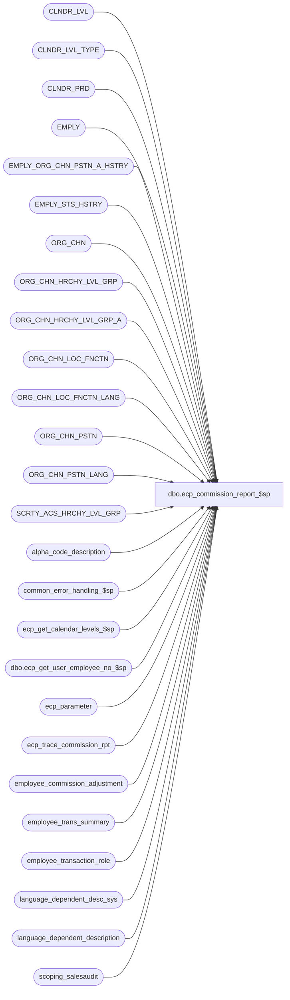

# dbo.ecp_commission_report_$sp

**Database:** auditworks_external  
**Server:** bedrockdb01  

## Architecture Diagram



## Table Dependencies

| Referenced Table |
|---|
| CLNDR_LVL |
| CLNDR_LVL_TYPE |
| CLNDR_PRD |
| EMPLY |
| EMPLY_ORG_CHN_PSTN_A_HSTRY |
| EMPLY_STS_HSTRY |
| ORG_CHN |
| ORG_CHN_HRCHY_LVL_GRP |
| ORG_CHN_HRCHY_LVL_GRP_A |
| ORG_CHN_LOC_FNCTN |
| ORG_CHN_LOC_FNCTN_LANG |
| ORG_CHN_PSTN |
| ORG_CHN_PSTN_LANG |
| SCRTY_ACS_HRCHY_LVL_GRP |
| alpha_code_description |
| common_error_handling_$sp |
| ecp_get_calendar_levels_$sp |
| dbo.ecp_get_user_employee_no_$sp |
| ecp_parameter |
| ecp_trace_commission_rpt |
| employee_commission_adjustment |
| employee_trans_summary |
| employee_transaction_role |
| language_dependent_desc_sys |
| language_dependent_description |
| scoping_salesaudit |

## Stored Procedure Code

```sql
CREATE proc [dbo].[ecp_commission_report_$sp] --DECLARE 
  @select_from_date datetime = null,  --all periods with at least 1 date falling between the range selected are included
  @select_to_date datetime = null,    -- if from/to not specified assumes today
  @empl_calendar_level_list nvarchar(4000) = null,  --if not specified assumes all
  @select_transaction_role_list nvarchar(4000) = null,  --from employee_transaction_role WHERE track_in_productivity_flag = 1;  if not specified it assumes salesperson
  @select_store_list nvarchar(4000) = null,  -- if from/to/list not specified assumes all
  @select_store_from int = null,
  @select_store_to int = null,
  @select_employee_list nvarchar(4000) = null,
  @select_employee_from int = null,
  @select_employee_to int = null,
  @select_selling_area_list nvarchar(4000) = null,
  @select_selling_area_from int = null,
  @select_selling_area_to int = null,
  @select_primary_position_list nvarchar(4000) = null, 
  @include_transaction_role tinyint = null,
  @include_item_commission_code tinyint = null,
  @include_commission_rate tinyint = null,
  @include_trans_commission_code tinyint = null,
 @language_id smallint = null,  --if not specified defaults to 1033 i.e. English
 @user_name nvarchar(30) = null,
 @user_id numeric(10,0) = null,
 @store_access_table_name nvarchar(100) = null,
 @include_zero_rate tinyint = null,
  @select_home_store_list nvarchar(4000) = null,  -- if from/to/list not specified assumes all
  @select_home_store_from int = null,
  @select_home_store_to int = null,
  @terminated_employees tinyint = null, --if not specified assumes all, 
                                        --if set to 1 means only terminated employees, 
			                --if set to 0 means excludes terminated employees
  @include_trans_store tinyint = null,
  @date_selection_calendar_level int = null,  --null when called from report query forms, specified when called from stored procs
  @date_range_type nvarchar(30) = null,  --valid options are 'current', 'previous', 'first_open', 'last_closed'
  @include_selling_area tinyint = null,  --if set to 1 means separate info with each employee by selling area they worked in.
  @employee_no int = null,  --set to employee number of user-id if user is restricted to viewing only his own data.  
                            --If @user_id has not been assigned any stores, this proc will auto-set @employee_no based on @user_name.
  @top_X	smallint = 0,  --positive number if first X are to be returned, negative if last X are to be returned
  @run_as_trace_execution_time datetime = null 
 AS
/* 
Proc Name: ecp_commission_report_$sp 
Desc:   Retrieves data for ECP Employee Commission Report for employees with any data in one of the calendar levels selected.

HISTORY:  
Date     Name           Def#    Desc
Mar19,15 Vicci       TFS-92911  Handle employees with selling area -1.  Return multi-lang descriptions of 'Selling area:  None', 'Position:  None'
                                instead empty strings and '?' for employees with no selling area / position assigment.
Mar17,15 Vicci      TFS-111538  Change reference to non-existant entrl table alias to be emtrl instead;  
                                correct "group by" on PSTN_DESC to match "select";  in the case when the only source of data for the group
                                is adjustments (as opposed to sales/returns) ensure the sale/return amounts sent back are NULL (not $0) to
                                avoid reporting displaying a $0 amount for returns when it is not applicable, and return '..' as 
                                employee_transaction_role even when "include transaction role" is set to false so that the report drill-down 
                                on commissions knows to go to the commission adjustment report and not the transaction details report;
Dec16,14 Vicci      TFS-96757   Ensure real adjustment description not just "adjustment recipient" is returned for manual adjustments
                                (currently get generic description on multiple rows);  then for consistency don't append "adjustment recipient"
                                to transaction role description for auto-adjustments either (UI heading already says role/adj.desc).
Dec11,14 Vicci      TFS-96392   Add @top_X variable tracing
Mar28,13 Vicci         140907   Handle multi-language.
Mar29,12 Vicci         134108   Use abs(commission_amount_per_item) when determining if > @min_rate since for returns this
                                is a negative amount.
Jan07,08 Vicci         104484   Add Top X support to allow same query form to be shared by Productivity and Commission
Oct30,08 Vicci         105986   When user access limited to their own data (i.e. employee_no passed in) or when user has not been
                                given access to any stores, then only return details pertinent to that employee.
Aug29,08 Vicci         104471   Handle being passed a @date_range_type with a missing @date_selection_calendar_level by
                                assuming the relative date range type applies to the lowest lowest level.
Aug16,08 Vicci         103077   Sort report using employee's CURRENT home-store/selling in order to avoid their
                                YTD totals being split out onto separate pages/sections.  
                                Continue to treat selling-area/position selectivity as requests to print that data only,
                                but treat home-store selectivity as request for any data for employees whose current
                                home-store is one of those selected.
                                Add support for a future UI enhancement to allow historical selling area detail to be 
                                included within each employee in a manner similar to the approach for transaction-store.
                                Note, a future enhancement could eventually be considered to allow historical home-store
                                detail to be included within each employee in a manner similar to the approach for transaction-store.
Aug05,08 Vicci                 Change the default of @date_range_type to null.
May22,08 Vicci         101442   Support relative date-range selection.
Feb08,08 Vicci          97975   Set errno not just message_id when raising business rule error
Nov26,07 Vicci          95521   Integrate with CRDM properly.            
Oct09,07 Vicci          85597   Correct process number.
Sep26,07 Vicci          85597   Correct sort order and selling area description associated with other stores.
Aug24,07 Vicci          85597   Handle @include_trans_store
Aug15,07 Vicci          85597   Apply store-access security to home-store instead of transaction store.
Aug15,07 Vicci          85597   When running a report for terminated employees only, only those employees who were 
                                terminated PRIOR to the commencement of the lowest calendar level included and who
                                were still terminated as of the end of this calendar level should be included.
                                When running a report for non-terminated employees only, only those employees whose 
                                status was not terminated PRIOR to the commencement of the lowest calendar level included
                                or whose status was not terminated as of the end of this calendar level should be included.
Jul09,07 Vicci          85597   Order by selling area number instead of name per Barney's request
Jul02,07 Vicci          85597   Support role sort sequence
Jun29,07 Vicci          85597   Support terminated employee selection (based on historical status)
Jun28,07 Vicci          85597   Support terminated employee selection (based on current status for now)
Jun26,07 Vicci 85597   Do not list adjustments unless selected as transaction roles
Jun26,07 Vicci          85597   Support home-store selection
May30,07 Vicci          85597   Fix commission amount on returns to be negative
May30,07 Vicci          85597   Add missing order-by clause to ad-hoc calendar period selection
May14,07 Vicci          85597   Add option to exclude zero rate
May11,07 Vicci		85597 Remove reference to primary position in employee_transaction_role
May01,07 Vicci          85597   If @include_transaction_role is false group adjustments with transactions
Mar16,07 Vicci		85597	Author
*/
/*
Excution test:
exec ecp_commission_report_$sp @select_from_date, @select_to_date, @empl_calendar_level_list, 
 @select_transaction_role_list, 
     @select_store_list, @select_store_from, @select_store_to, 
     @select_employee_list, @select_employee_from, @select_employee_to, 
     @select_selling_area_list, @select_selling_area_from, @select_selling_area_to, 
     @select_primary_position_list, 
     @include_transaction_role, @include_item_commission_code, @include_commission_rate, @include_trans_commission_code, 
     @language_id, @user_name, 
     @user_id, 
     @store_access_table_name, 
     @include_zero_rate, 
     @select_home_store_list, @select_home_store_from, @select_home_store_to, @terminated_employees, @include_trans_store
*/
--TODO:  multi-language
--TODO:  audit groups

SET NOCOUNT ON

DECLARE
  @ecp_clndr_id			binary(16),
  @employee_count		int,
  @from_date 			datetime,
  @min_start_date 		datetime,
  @calendar_level_count		int,
  @lowest_calendar_level	int,
  @lowest_calendar_level_id	binary(16),
  @one_hundred			money,
  @empl_transaction_role_count  int, 
  @errmsg                       nvarchar(255),
  @errno                        int,
  @function_name	        varbinary(128),
  @highest_calendar_level	int,
  @highest_calendar_level_id	binary(16),
  @message_id                   int,
  @position_count		int,
  @process_name                 nvarchar(100),
  @process_no                   int,
  @object_name           	nvarchar(255),
  @operation_name               nvarchar(100),
  @rows				int,
  @selling_area_count		int,
  @select_first_to_date		datetime,
  @store_count			int,
  @home_store_count		int,
  @stream_no                    tinyint,
  @to_date 			datetime,
  @sql_command 			nvarchar(max),
  @filter_clause 		nvarchar(max),
  @min_rate			numeric(7,4),
  @trace_log		        tinyint,
  @direction 			nvarchar(4),
  @primary_selling_area_no	int,
  @home_store_no		int,
  @cursor_open			tinyint,
  @Otherstore_desc		nvarchar(255),
  @Othersellingarea_desc	nvarchar(255),
  @unknown_selling_area_desc nvarchar(255), 
  @unknown_position_desc nvarchar(255),
  @none_desc nvarchar(255)

  
IF @run_as_trace_execution_time IS NOT NULL
BEGIN 
-- SELECT convert(nvarchar, execution_datetime, 108), * FROM ecp_trace_commission_rpt ORDER BY execution_datetime DESC

SELECT @select_from_date = select_from_date,
       @select_to_date = select_to_date,
       @empl_calendar_level_list = empl_calendar_level_list,
       @select_transaction_role_list = select_transaction_role_list,
       @select_store_list = select_store_list,
       @select_store_from = select_store_from,
       @select_store_to = select_store_to,
       @select_employee_list = select_employee_list,
       @select_employee_from = select_employee_from,
       @select_employee_to = select_employee_to,
       @select_selling_area_list = select_selling_area_list,
       @select_selling_area_from = select_selling_area_from,
       @select_selling_area_to = select_selling_area_to,
       @select_primary_position_list = select_primary_position_list,
       @include_transaction_role = include_transaction_role,
       @include_item_commission_code = include_item_commission_code,
       @include_commission_rate = include_commission_rate, 
       @include_trans_commission_code = include_trans_commission_code, 
       @language_id = language_id,
       @user_name = user_name,
       @user_id = user_id,
       @store_access_table_name = store_access_table_name,
       @include_zero_rate = include_zero_rate,
       @select_home_store_list = select_home_store_list,
       @select_home_store_from = select_home_store_from,
       @select_home_store_to = select_home_store_to,
       @terminated_employees = terminated_employees,
       @include_trans_store = include_trans_store, 
       @date_selection_calendar_level = date_selection_calendar_level,
       @date_range_type = date_range_type,
       @include_selling_area = include_selling_area,
       @employee_no = employee_no,
       @top_X = top_X
  FROM ecp_trace_commission_rpt
 WHERE execution_datetime >= @run_as_trace_execution_time
   AND execution_datetime < dateadd(ss, 1, @run_as_trace_execution_time)
END
  
SELECT @trace_log = 1
IF @trace_log = 1
BEGIN
    /*
    if exists (select * from dbo.sysobjects where id = Object_id('dbo.ecp_trace_commission_rpt') and type in ('U','S'))
    begin
      drop table dbo.ecp_trace_commission_rpt
    end
    */
    if not exists (select * from dbo.sysobjects where id = Object_id('dbo.ecp_trace_commission_rpt') and type in ('U','S'))
    begin
    create table dbo.ecp_trace_commission_rpt (
    execution_datetime datetime default getdate() not null,
    select_from_date datetime null, 
    select_to_date datetime null, 
    empl_calendar_level_list nvarchar(4000) null,  
    select_transaction_role_list nvarchar(4000) null,
    select_store_list nvarchar(4000) null,
    select_store_from int null,
    select_store_to int null,
 select_employee_list nvarchar(4000) null,
    select_employee_from int null,
    select_employee_to int null,
    select_selling_area_list nvarchar(4000) null,
    select_selling_area_from int null,
    select_selling_area_to int null,
    select_primary_position_list nvarchar(4000) null, 
    include_transaction_role tinyint null,
    include_item_commission_code tinyint null,
    include_commission_rate tinyint  null,
   include_trans_commission_code tinyint null,
    language_id smallint null, 
    user_name nvarchar(30) null,
    user_id numeric(10,0) null,
    store_access_table_name nvarchar(100) null,
    include_zero_rate tinyint null,
    select_home_store_list nvarchar(4000) null, 
    select_home_store_from int null,
    select_home_store_to int null,
    terminated_employees tinyint null,
    include_trans_store tinyint null,
    date_selection_calendar_level int null,
    date_range_type nvarchar(30) null,
    include_selling_area tinyint null,
    employee_no int null,
    top_X smallint null)
    end

  DELETE ecp_trace_commission_rpt
   WHERE execution_datetime < dateadd(dd, -4, getdate())

  INSERT into ecp_trace_commission_rpt(
  select_from_date, 
  select_to_date, 
  empl_calendar_level_list,  
  select_transaction_role_list,
  select_store_list,
  select_store_from,
  select_store_to,
  select_employee_list,
  select_employee_from,
  select_employee_to,
  select_selling_area_list,
  select_selling_area_from,
  select_selling_area_to,
  select_primary_position_list, 
  include_transaction_role,
  include_item_commission_code,
  include_commission_rate,
  include_trans_commission_code,
  language_id, 
  user_name,
  user_id,
  store_access_table_name,
  include_zero_rate,
  select_home_store_list, 
  select_home_store_from,
  select_home_store_to,
  terminated_employees,
  include_trans_store,
  date_selection_calendar_level, 
  date_range_type,
  include_selling_area,
  employee_no,
  top_X
  )
  VALUES (
  @select_from_date, 
  @select_to_date, 
  @empl_calendar_level_list,  
  @select_transaction_role_list,
  @select_store_list,
  @select_store_from,
  @select_store_to,
  @select_employee_list,
  @select_employee_from,
  @select_employee_to,
  @select_selling_area_list,
  @select_selling_area_from,
  @select_selling_area_to,
  @select_primary_position_list, 
  @include_transaction_role,
  @include_item_commission_code,
  @include_commission_rate,
  @include_trans_commission_code,
  @language_id, 
  @user_name,
  @user_id,
  @store_access_table_name,
  @include_zero_rate,
  @select_home_store_list, 
  @select_home_store_from,
  @select_home_store_to,
  @terminated_employees,
  @include_trans_store,
  @date_selection_calendar_level, 
  @date_range_type,
  @include_selling_area,
  @employee_no,
  @top_X)
END  --IF @trace_log = 1

SELECT @employee_count = 0, 
       @errno = 0,
       @function_name = convert(varbinary(128), 'ecp_commission_report_$sp'),
       @message_id = 201068,
       @one_hundred = 100,
       @operation_name = 'Unknown',
       @position_count = 0,
       @process_name = 'ecp_commission_report_$sp',
       @process_no = 284, --unknown
       @selling_area_count = 0,
       @store_count = 0, 
       @home_store_count = 0,
       @stream_no = 1,
       @direction = ''

SELECT @none_desc = display_description
  FROM language_dependent_description
 WHERE language_id = @language_id
   AND resource_id = 263
IF @errno <> 0
BEGIN
  SELECT @errmsg = 'Failed to determine language based description for @none_desc',
         @object_name = 'language_dependent_description',
         @operation_name = 'SELECT'
  GOTO error
END
IF @none_desc IS NULL
BEGIN
  SELECT @none_desc = display_description
    FROM language_dependent_desc_sys
   WHERE language_id = @language_id
     AND resource_id = 263
  IF @errno <> 0
  BEGIN
    SELECT @errmsg = 'Failed to determine language based description for @none_desc',
           @object_name = 'language_dependent_desc_sys',
           @operation_name = 'SELECT'
    GOTO error
  END
END
IF @none_desc IS NULL
  SELECT @none_desc = 'None'
  
SELECT @unknown_selling_area_desc = display_description
  FROM language_dependent_description
 WHERE language_id = @language_id
   AND resource_id = 5122
IF @errno <> 0
BEGIN
  SELECT @errmsg = 'Failed to determine language based description for @unknown_selling_area_desc',
         @object_name = 'language_dependent_description',
         @operation_name = 'SELECT'
  GOTO error
END
IF @unknown_selling_area_desc IS NULL
BEGIN
  SELECT @unknown_selling_area_desc = display_description
    FROM language_dependent_desc_sys
   WHERE language_id = @language_id
     AND resource_id = 5122
  IF @errno <> 0
  BEGIN
    SELECT @errmsg = 'Failed to determine language based description for @unknown_selling_area_desc',
           @object_name = 'language_dependent_desc_sys',
           @operation_name = 'SELECT'
    GOTO error
  END
END
IF @unknown_selling_area_desc IS NULL
  SELECT @unknown_selling_area_desc = 'Selling area:'
SELECT @unknown_selling_area_desc = @unknown_selling_area_desc + '  ' + @none_desc

SELECT @unknown_position_desc = display_description
  FROM language_dependent_description
 WHERE language_id = @language_id
   AND resource_id = 5286
IF @errno <> 0
BEGIN
  SELECT @errmsg = 'Failed to determine language based description for @unknown_position_desc',
         @object_name = 'language_dependent_description',
         @operation_name = 'SELECT'
  GOTO error
END
IF @unknown_position_desc IS NULL
BEGIN
  SELECT @unknown_position_desc = display_description
    FROM language_dependent_desc_sys
   WHERE language_id = @language_id
     AND resource_id = 5286
  IF @errno <> 0
  BEGIN
    SELECT @errmsg = 'Failed to determine language based description for @unknown_position_desc',
           @object_name = 'language_dependent_desc_sys',
           @operation_name = 'SELECT'
    GOTO error
  END
END
IF @unknown_position_desc IS NULL
  SELECT @unknown_position_desc = 'Position:'
SELECT @unknown_position_desc = @unknown_position_desc + '  ' + @none_desc

IF @top_X = NULL 
  SELECT @top_X = 0
IF @top_X < 0
  SELECT @top_X = abs(@top_X), 
         @direction = 'DESC'

IF @include_zero_rate = 0
  SELECT @min_rate = 0
ELSE
  SELECT @min_rate = -1
  
IF @user_name IS NULL
  SELECT @user_name = suser_sname()
       
SET CONTEXT_INFO @function_name

IF @include_transaction_role IS NULL SELECT @include_transaction_role = 1
IF @include_trans_store IS NULL SELECT @include_trans_store = 1
IF @include_item_commission_code IS NULL SELECT @include_item_commission_code = 1
IF @include_commission_rate IS NULL SELECT @include_commission_rate = 1
IF @include_trans_commission_code IS NULL SELECT @include_trans_commission_code = 0
IF @include_selling_area IS NULL SELECT @include_selling_area = 0

IF @language_id IS NULL 
  SELECT @language_id = 1033
  
SELECT @Otherstore_desc = l.display_description
  FROM scoping_salesaudit s
       INNER JOIN language_dependent_description l
          ON s.resource_id = l.resource_id
         AND l.language_id = @language_id
  WHERE s.tag = 'TRANSLATION' and s.selection_criteria_key = 'Other store(s)'
SELECT @errno = @@error, @Otherstore_desc = COALESCE(@Otherstore_desc, 'Other store(s)')
IF @errno <> 0
BEGIN
  SELECT @errmsg = 'Failed to determine language based description for @Otherstore_desc',
         @object_name = 'language_dependent_description',
         @operation_name = 'SELECT'
  GOTO error
END
SELECT @Othersellingarea_desc = l.display_description
  FROM scoping_salesaudit s
       INNER JOIN language_dependent_description l
          ON s.resource_id = l.resource_id
         AND l.language_id = @language_id
  WHERE s.tag = 'TRANSLATION' and s.selection_criteria_key = 'Other selling area(s)'
SELECT @errno = @@error, @Othersellingarea_desc = COALESCE(@Othersellingarea_desc, 'Other selling area(s)')
IF @errno <> 0
BEGIN
  SELECT @errmsg = 'Failed to determine language based description for @Othersellingarea_desc',
         @object_name = 'language_dependent_description',
         @operation_name = 'SELECT'
  GOTO error
END

CREATE TABLE #select_primary_position(primary_position nvarchar(4) not null)
SELECT @errno = @@error
IF @errno <> 0
BEGIN
  SELECT @errmsg = 'Failed to create temp table to hold list of selected positions',
         @object_name = '#select_primary_position',
         @operation_name = 'CREATE'
  GOTO error
END

CREATE TABLE #select_selling_area(selling_area_no int not null)
SELECT @errno = @@error
IF @errno <> 0
BEGIN
  SELECT @errmsg = 'Failed to create temp table to hold list of selected selling areas',
         @object_name = '#select_selling_area',
         @operation_name = 'CREATE'
  GOTO error
END
CREATE TABLE #select_home_store(store_no int not null)
SELECT @errno = @@error
IF @errno <> 0
BEGIN
  SELECT @errmsg = 'Failed to create temp table to hold list of selected home stores',
         @object_name = '#select_home_store',
      @operation_name = 'CREATE'
GOTO error
END
CREATE TABLE #select_store(store_no int not null)
SELECT @errno = @@error
IF @errno <> 0
BEGIN
  SELECT @errmsg = 'Failed to create temp table to hold list of selected stores',
         @object_name = '#select_store',
      @operation_name = 'CREATE'
GOTO error
END
CREATE TABLE #store_restriction(ORG_CHN_NUM int not null)
SELECT @errno = @@error
IF @errno <> 0
BEGIN
SELECT @errmsg = 'Failed to create temp table to hold list of stores to which user has access',
  @object_name = '#store_restriction',
         @operation_name = 'CREATE'
  GOTO error
END
CREATE TABLE #select_transaction_role(employee_transaction_role nvarchar(20) not null)
SELECT @errno = @@error
IF @errno <> 0
BEGIN
SELECT @errmsg = 'Failed to create temp table to hold list of selected transaction roles',
         @object_name = '#select_transaction_role',
         @operation_name = 'CREATE'
  GOTO error
END
CREATE TABLE #select_calendar_level(
 sequence_no numeric(2,0) identity not null,
 CLNDR_LVL_TYPE_ID binary(16) NOT NULL, 
 calendar_level smallint NOT NULL, 
 CLNDR_LVL_SEQ smallint NOT NULL)
SELECT @errno = @@error
IF @errno <> 0
BEGIN
  SELECT @errmsg = 'Failed to create temp table to hold list of selected calendar levels',
         @object_name = '#select_calendar_level',
         @operation_name = 'CREATE'
  GOTO error
END
CREATE TABLE #select_calendar_period(
 CLNDR_LVL_TYPE_ID binary(16) NOT NULL, 
 calendar_level smallint NOT NULL, 
 CLNDR_LVL_SEQ smallint NOT NULL,
 period_end_datetime datetime not null,
 period_start_datetime datetime null,
 sequence_no numeric(2,0) not null,
 add_subtract_flag money not null,
 amt_calendar_level smallint NOT NULL, 
 amt_period_end_datetime datetime not null)
SELECT @errno = @@error
IF @errno <> 0
BEGIN
  SELECT @errmsg = 'Failed to create temp table to hold list of selected calendar periods',
         @object_name = '#select_calendar_period',
 @operation_name = 'CREATE'
  GOTO error
END
CREATE TABLE #select_employee(employee_no int not null)
SELECT @errno = @@error
IF @errno <> 0
BEGIN
  SELECT @errmsg = 'Failed to create temp table to hold list of selected employees',
         @object_name = '#select_employee',
         @operation_name = 'CREATE'
  GOTO error
END

IF @select_primary_position_list IS NOT NULL
BEGIN
  SELECT @sql_command = '
  INSERT #select_primary_position(primary_position)
  SELECT DISTINCT PSTN_CODE
    FROM ORG_CHN_PSTN
   WHERE PSTN_CODE IN (' + @select_primary_position_list + ')
  SELECT @position_count = @@rowcount'

  EXEC sp_executesql @sql_command, N'@position_count int OUT', @position_count OUT        
  
  IF @position_count < 1
  BEGIN
    SELECT @message_id = 201684,
           @errno = 201684,
           @errmsg = 'Invalid position list passed',
           @object_name = 'ORG_CHN_PSTN',
           @operation_name = 'SELECT'
    GOTO cleanup
  END
END
ELSE
BEGIN
  INSERT #select_primary_position(primary_position)
  VALUES('-1')
END

IF @select_selling_area_list IS NOT NULL
BEGIN
  SELECT @sql_command = '
  INSERT #select_selling_area(selling_area_no)
  SELECT f.FNCTN_NUM
    FROM ORG_CHN_LOC_FNCTN f
   WHERE f.FNCTN_NUM IN (' + @select_selling_area_list + ')
     AND f.SYS_CODE = ''DISP''
  SELECT @selling_area_count = @@rowcount'

  EXEC sp_executesql @sql_command, N'@selling_area_count int OUT', @selling_area_count OUT        
  
  IF @selling_area_count < 1
  BEGIN
    SELECT @message_id = 201684,
           @errno = 201684, 
           @errmsg = 'Invalid selling area list passed',
           @object_name = '#select_selling_area',
           @operation_name = 'INSERT'
    GOTO cleanup
  END
END
ELSE
BEGIN
  INSERT #select_selling_area(selling_area_no)
  VALUES(-1)
END

IF @select_selling_area_from IS NULL
  SELECT @select_selling_area_from = -1

IF @select_selling_area_to IS NULL
  SELECT @select_selling_area_to = 2147483647

IF NOT EXISTS (SELECT 1 
              FROM SCRTY_ACS_HRCHY_LVL_GRP s 
                WHERE s.ACS_ID_TYPE = 1 
                  AND s.ACS_ID = @user_id
                  AND s.HRCHY_LVL_GRP_ID = -1)
  AND @user_id IS NOT NULL
  AND @employee_no IS NULL 
BEGIN
  SELECT @store_access_table_name = '#store_restriction'
  INSERT into #store_restriction(ORG_CHN_NUM)
  SELECT DISTINCT a.ORG_CHN_NUM 
    FROM SCRTY_ACS_HRCHY_LVL_GRP s, 
         ORG_CHN_HRCHY_LVL_GRP_A a, 
         ORG_CHN_HRCHY_LVL_GRP b 
   WHERE s.HRCHY_LVL_GRP_ID = b.HRCHY_LVL_GRP_IDNTY 
     AND b.HRCHY_LVL_GRP_ID = a.HRCHY_LVL_GRP_ID 
     AND s.ACS_ID_TYPE = 1 and s.ACS_ID = @user_id
  SELECT @errno = @@error
  IF @errno <> 0
  BEGIN
    SELECT @errmsg = 'Failed to list stores to which user has access',
           @object_name = '#store_restriction',
           @operation_name = 'INSERT'
    GOTO error
  END
END  

IF @employee_no IS NULL AND @user_id IS NOT NULL AND NOT EXISTS (SELECT 1 FROM #store_restriction) AND @store_access_table_name = '#store_restriction'
BEGIN
  SELECT @employee_no = dbo.ecp_get_user_employee_no_$sp(@user_name)
  SELECT @errno = @@error
  IF @errno <> 0
  BEGIN
    SELECT @errmsg = 'Failed to determine employee number corresponding to user name',
           @object_name = 'ecp_get_user_employee_no_$sp',
           @operation_name = 'EXEC'
    GOTO error
  END
  IF @employee_no IS NULL 
  BEGIN
    SELECT @message_id = 201684,
           @errno = 201684,
           @errmsg = 'User ' + @user_name + ' has not been assigned access to any stores, and is not found in employee master.  Access denied.',
       @object_name = 'ecp_get_user_employee_no_$sp',
           @operation_name = 'EXEC'
    GOTO cleanup
  END
  ELSE
  BEGIN
    SELECT @store_access_table_name = ''
  END 
END

IF @select_home_store_list IS NOT NULL OR IsNull(@store_access_table_name, '') <> ''
BEGIN
  IF IsNull(@store_access_table_name, '') = ''
    SELECT @store_access_table_name = 'ORG_CHN'
  IF @select_home_store_list IS NOT NULL
  BEGIN
    SELECT @sql_command = '
    INSERT #select_home_store(store_no)
    SELECT ORG_CHN_NUM
      FROM ' + @store_access_table_name + ' 
     WHERE ORG_CHN_NUM IN (' + @select_home_store_list + ')
  SELECT @home_store_count = @@rowcount'
  END
  ELSE
  BEGIN
    SELECT @sql_command = '
    INSERT #select_home_store(store_no)
    SELECT ORG_CHN_NUM
      FROM ' + @store_access_table_name + ' 
  SELECT @home_store_count = @@rowcount'
  END
  
  EXEC sp_executesql @sql_command, N'@home_store_count int OUT', @home_store_count OUT        
  
  IF @home_store_count < 1
  BEGIN
    SELECT @message_id = 201684,
           @errno = 201684, 
           @errmsg = 'Invalid home store list passed or no store access granted in security',
           @object_name = 'ORG_CHN',
           @operation_name = 'SELECT'
    GOTO cleanup
  END
END
ELSE
BEGIN
  INSERT #select_home_store(store_no)
  VALUES(-1)
END
--select 'Test #select_home_store', * from #select_home_store
IF @select_home_store_from IS NULL
  SELECT @select_home_store_from = 0

IF @select_home_store_to IS NULL
  SELECT @select_home_store_to = 2147483647


IF @select_store_list IS NOT NULL
BEGIN
  SELECT @sql_command = '
  INSERT #select_store(store_no)
  SELECT ORG_CHN_NUM
    FROM ORG_CHN
   WHERE ORG_CHN_NUM IN (' + @select_store_list + ')
  SELECT @store_count = @@rowcount'

  EXEC sp_executesql @sql_command, N'@store_count int OUT', @store_count OUT       
  
  IF @store_count < 1
  BEGIN
    SELECT @message_id = 201684,
           @errno = 201684, 
           @errmsg = 'Invalid store list passed',
           @object_name = 'ORG_CHN',
           @operation_name = 'SELECT'
    GOTO cleanup
  END
END
ELSE
BEGIN
  INSERT #select_store(store_no)
  VALUES(-1)
END

IF @select_store_from IS NULL
  SELECT @select_store_from = 0

IF @select_store_to IS NULL
  SELECT @select_store_to = 2147483647
  
IF @select_transaction_role_list IS NULL
BEGIN
  INSERT #select_transaction_role(employee_transaction_role)
  SELECT employee_transaction_role
    FROM employee_transaction_role
   WHERE track_in_commission_flag = 1
  SELECT @errno = @@error, @empl_transaction_role_count = @@rowcount
  IF @errno <> 0
  BEGIN
    SELECT @errmsg = 'Unable to build list of employee transaction roles to include',
           @object_name = '#select_transaction_role',
           @operation_name = 'INSERT'
    GOTO error
  END
END
ELSE
BEGIN
  SELECT @sql_command = '
  INSERT #select_transaction_role(employee_transaction_role)
  SELECT employee_transaction_role
    FROM employee_transaction_role
   WHERE track_in_commission_flag = 1
     AND employee_transaction_role IN (' + @select_transaction_role_list + ')
  SELECT @empl_transaction_role_count = @@rowcount'

  EXEC sp_executesql @sql_command, N'@empl_transaction_role_count int OUT', @empl_transaction_role_count OUT        
END

IF @empl_transaction_role_count < 1
BEGIN
  SELECT @message_id = 201684,
         @errno = 201684, 
         @errmsg = 'Invalid employee transaction role list passed',
         @object_name = 'employee_transaction_role',
         @operation_name = 'SELECT'
  GOTO cleanup
END

SELECT @ecp_clndr_id = par_bin_value
  FROM ecp_parameter p
 WHERE par_name = 'ecp_dflt_clndr_id'  
SELECT @errno = @@error
IF @errno <> 0
BEGIN
  SELECT @errmsg = 'Unable to which calendar to use',
 @object_name = 'ecp_parameter',
         @operation_name = 'SELECT'
  GOTO error
END

IF @empl_calendar_level_list IS NULL
BEGIN
  INSERT into #select_calendar_level(CLNDR_LVL_TYPE_ID, calendar_level, CLNDR_LVL_SEQ)
  SELECT clt.CLNDR_LVL_TYPE_ID, clt.CLNDR_LVL_TYPE_IDNTY, clt.CLNDR_LVL_SEQ 
    FROM CLNDR_LVL_TYPE clt
         INNER JOIN CLNDR_LVL cl
            ON clt.CLNDR_LVL_TYPE_ID = cl.CLNDR_LVL_TYPE_ID
           AND cl.CLNDR_ID = @ecp_clndr_id
ORDER BY clt.CLNDR_LVL_SEQ DESC
  SELECT @errno = @@error, @calendar_level_count = @@rowcount
  IF @errno <> 0
  BEGIN
    SELECT @errmsg = 'Unable to build list of calendar levels to use',
           @object_name = '#select_calendar_level',
           @operation_name = 'INSERT'
    GOTO error
  END
END
ELSE --of IF @empl_calendar_level_list IS NULL
BEGIN
  SELECT @sql_command = '
  INSERT into #select_calendar_level(CLNDR_LVL_TYPE_ID, calendar_level, CLNDR_LVL_SEQ)
  SELECT clt.CLNDR_LVL_TYPE_ID, clt.CLNDR_LVL_TYPE_IDNTY, clt.CLNDR_LVL_SEQ 
    FROM CLNDR_LVL_TYPE clt
   WHERE clt.CLNDR_LVL_TYPE_IDNTY IN (' + @empl_calendar_level_list + ')
   ORDER BY clt.CLNDR_LVL_SEQ DESC
  SELECT @calendar_level_count = @@rowcount'

  EXEC sp_executesql @sql_command, N'@calendar_level_count int OUT', @calendar_level_count OUT        
SELECT @errno = @@error
  IF @errno <> 0
  BEGIN
  SELECT @errmsg = 'Unable to select retrieval_in_progress from interface_status',
         @object_name = 'interface_status',
         @operation_name = 'SELECT'
  GOTO error
  END
END

IF EXISTS (SELECT 1 
             FROM #select_calendar_level
WHERE CLNDR_LVL_TYPE_ID NOT IN (SELECT CLNDR_LVL_TYPE_ID
                                              FROM CLNDR_LVL
    WHERE CLNDR_ID = @ecp_clndr_id))
BEGIN
SELECT @message_id = 201684,
       @errno = 201684, 
  @errmsg = 'Invalid calendar level list passed',
       @object_name = 'CLNDR_LVL',
       @operation_name = 'SELECT'
  GOTO cleanup
END

SELECT @lowest_calendar_level = calendar_level,
       @lowest_calendar_level_id = CLNDR_LVL_TYPE_ID
  FROM #select_calendar_level
 WHERE CLNDR_LVL_SEQ = (SELECT MAX(CLNDR_LVL_SEQ)
			  FROM #select_calendar_level)
SELECT @errno = @@error
IF @errno <> 0
BEGIN
  SELECT @errmsg = 'Unable to which calendar level was the lowest requested',
         @object_name = 'CLNDR_LVL_TYPE',
         @operation_name = 'SELECT'
  GOTO error
END

IF @date_range_type IS NOT NULL AND @date_selection_calendar_level IS NULL
BEGIN
  SELECT @date_selection_calendar_level = @lowest_calendar_level
END

IF @date_selection_calendar_level IS NOT NULL
BEGIN
  EXEC ecp_get_calendar_levels_$sp @date_selection_calendar_level, @date_range_type, @select_from_date OUTPUT, @select_to_date OUTPUT
    SELECT @errno = @@error
  IF @errno <> 0
  BEGIN
    SELECT @errmsg = @errmsg + ' Unable to determine dates corresponding to relative date range selected',
           @object_name = 'ecp_get_calendar_levels_$sp',
           @operation_name = 'EXECUTE'
    GOTO error  
  END
END

/* Verify that the From/To Date selected is a period-start / period-end date for the 
   lowest calendar level selected, and if not extend the date-range selected to 
   include a full period */
IF @select_from_date IS NULL
BEGIN
  IF @select_to_date IS NOT NULL
    SELECT @select_from_date = @select_to_date
  ELSE
    SELECT @select_from_date = getdate()
END

IF @select_to_date IS NULL
  SELECT @select_to_date = getdate()
  
SELECT @to_date = dateadd(ss, -1, cp.END_DATE_TIME), @from_date = cp.STRT_DATE_TIME
  FROM CLNDR_PRD cp
 WHERE @select_to_date >= cp.STRT_DATE_TIME
   AND @select_to_date < cp.END_DATE_TIME
   AND cp.CLNDR_ID = @ecp_clndr_id
   AND cp.CLNDR_LVL_TYPE_ID = @lowest_calendar_level_id
SELECT @errno = @@error
IF @errno <> 0
BEGIN
  SELECT @errmsg = 'Failed to determing period start/end dates of latest date selected',
         @object_name = 'CLNDR_PRD',
         @operation_name = 'SELECT'
  GOTO error
END

IF @to_date > @select_to_date
  SELECT @select_to_date = @to_date
  
IF @from_date < @select_from_date
  SELECT @select_from_date = @from_date
ELSE
BEGIN
  SELECT @select_from_date = cp.STRT_DATE_TIME
    FROM CLNDR_PRD cp
   WHERE @select_from_date >= cp.STRT_DATE_TIME
     AND @select_from_date < cp.END_DATE_TIME
     AND cp.CLNDR_ID = @ecp_clndr_id
     AND cp.CLNDR_LVL_TYPE_ID = @lowest_calendar_level_id
  SELECT @errno = @@error
  IF @errno <> 0
  BEGIN
    SELECT @errmsg = 'Failed to determing period start date of earliest date selected',
           @object_name = 'CLNDR_PRD',
           @operation_name = 'SELECT'
    GOTO error
  END
END

IF @calendar_level_count > 1 
BEGIN
  SELECT @highest_calendar_level = calendar_level,
         @highest_calendar_level_id = CLNDR_LVL_TYPE_ID
    FROM #select_calendar_level
   WHERE CLNDR_LVL_SEQ = (SELECT MIN(CLNDR_LVL_SEQ)
          	            FROM #select_calendar_level)
  SELECT @errno = @@error
  IF @errno <> 0
  BEGIN
    SELECT @errmsg = 'Unable to which calendar level was the highest requested',
           @object_name = 'CLNDR_LVL_TYPE',
           @operation_name = 'SELECT'
    GOTO error
  END
  
  SELECT @to_date = dateadd(ss, -1, cp.END_DATE_TIME)
    FROM CLNDR_PRD cp
   WHERE @select_to_date >= cp.STRT_DATE_TIME
     AND @select_to_date < cp.END_DATE_TIME
     AND cp.CLNDR_ID = @ecp_clndr_id
     AND cp.CLNDR_LVL_TYPE_ID = @highest_calendar_level_id
 SELECT @errno = @@error
  IF @errno <> 0
  BEGIN
    SELECT @errmsg = 'Failed to determing period end date of highest calendar level selected including latest date selected',
           @object_name = 'CLNDR_PRD',
           @operation_name = 'SELECT'
    GOTO error
  END
END
ELSE 
  SELECT @to_date = @select_to_date

IF @to_date > @select_to_date  --there are levels ending after the as-of date to be included
BEGIN
  INSERT into #select_calendar_period(CLNDR_LVL_TYPE_ID, calendar_level, CLNDR_LVL_SEQ, period_end_datetime, period_start_datetime, sequence_no, 
   add_subtract_flag, amt_calendar_level, amt_period_end_datetime)
  SELECT sc.CLNDR_LVL_TYPE_ID, sc.calendar_level, sc.CLNDR_LVL_SEQ, dateadd(ss, -1, c.END_DATE_TIME), c.STRT_DATE_TIME, sc.sequence_no, 
         1, sc.calendar_level, dateadd(ss, -1, c.END_DATE_TIME)
    FROM #select_calendar_level sc 
         INNER JOIN CLNDR_PRD c
            ON c.CLNDR_ID = @ecp_clndr_id
           AND sc.CLNDR_LVL_TYPE_ID = c.CLNDR_LVL_TYPE_ID
           AND c.END_DATE_TIME > dateadd(ss, 1, @select_to_date)
           AND c.STRT_DATE_TIME < dateadd(ss, 1, @select_to_date)
  SELECT @errno = @@error, @rows = @@rowcount
  IF @errno <> 0
  BEGIN
    SELECT @errmsg = 'Failed to determine if there are periods such as YTD ending after the as of date to be included',
           @object_name = '#select_calendar_period',
           @operation_name = 'INSERT'
    GOTO error
  END
  IF @rows > 0 AND @select_to_date < getdate()  --there are amounts included in such figures as YTD to be removed since after the as-of date to be excluded
  BEGIN
    INSERT into #select_calendar_period(CLNDR_LVL_TYPE_ID, calendar_level, CLNDR_LVL_SEQ, period_end_datetime, sequence_no, 
                                        add_subtract_flag, amt_calendar_level, amt_period_end_datetime)
    SELECT sc.CLNDR_LVL_TYPE_ID, sc.calendar_level, sc.CLNDR_LVL_SEQ, sc.period_end_datetime, sc.sequence_no,
     -1, @lowest_calendar_level, dateadd(ss, -1, c.END_DATE_TIME)
 FROM #select_calendar_period sc 
           INNER JOIN CLNDR_PRD c
              ON c.CLNDR_ID = @ecp_clndr_id
           AND c.CLNDR_LVL_TYPE_ID = @lowest_calendar_level_id
             AND c.END_DATE_TIME > dateadd(ss, 1, @select_to_date)
             AND c.END_DATE_TIME <= dateadd(ss, 1, sc.period_end_datetime)
   AND c.STRT_DATE_TIME < getdate()
             
    SELECT @errno = @@error
  IF @errno <> 0
    BEGIN
      SELECT @errmsg = 'Failed to subtract amounts contributed after the as-of date to the YTD',
             @object_name = '#select_calendar_period',
             @operation_name = 'INSERT'
      GOTO error
    END
  END
END

INSERT into #select_calendar_period(CLNDR_LVL_TYPE_ID, calendar_level, CLNDR_LVL_SEQ, period_end_datetime, period_start_datetime, sequence_no, 
                                    add_subtract_flag, amt_calendar_level, amt_period_end_datetime)
SELECT sc.CLNDR_LVL_TYPE_ID, sc.calendar_level, sc.CLNDR_LVL_SEQ, dateadd(ss, -1, c.END_DATE_TIME), dateadd(ss, -1, c.STRT_DATE_TIME), sc.sequence_no, 
       1, sc.calendar_level, dateadd(ss, -1, c.END_DATE_TIME)
  FROM #select_calendar_level sc 
       INNER JOIN CLNDR_PRD c
          ON c.CLNDR_ID = @ecp_clndr_id
         AND sc.CLNDR_LVL_TYPE_ID = c.CLNDR_LVL_TYPE_ID
         AND c.END_DATE_TIME <= dateadd(ss, 1, @select_to_date)
         AND c.END_DATE_TIME > @select_from_date
  SELECT @errno = @@error, @rows = @@rowcount
  IF @errno <> 0
  BEGIN
    SELECT @errmsg = 'Failed to list periods falling in range selected',
           @object_name = '#select_calendar_period',
           @operation_name = 'INSERT'
    GOTO error
  END

SELECT @select_first_to_date = min(period_end_datetime)
  FROM #select_calendar_period
 WHERE sequence_no = 1

SELECT @min_start_date  = min(period_start_datetime)
  FROM #select_calendar_period
 WHERE add_subtract_flag = 1

IF @select_employee_list IS NOT NULL
BEGIN
  SELECT @sql_command = '
  INSERT #select_employee(employee_no)
  SELECT e.EMPLY_NUM
    FROM EMPLY e
        INNER JOIN #select_home_store s
           ON e.PRMY_ORG_CHN_NUM = s.store_no
           OR ' + convert(nvarchar, @home_store_count) + ' = 0
        LEFT OUTER JOIN EMPLY_STS_HSTRY eht
           ON e.EMPLY_NUM = eht.EMPLY_NUM
          AND (@select_to_date >= eht.EFCTV_DATE AND (@select_to_date < eht.EXPRTN_DATE OR eht.EXPRTN_DATE IS NULL))
        LEFT OUTER JOIN EMPLY_STS_HSTRY ehf
           ON e.EMPLY_NUM = ehf.EMPLY_NUM
          AND (@select_from_date >= ehf.EFCTV_DATE AND (@select_from_date < ehf.EXPRTN_DATE OR ehf.EXPRTN_DATE IS NULL))
   WHERE (e.EMPLY_NUM = ' + IsNull(convert(nvarchar, @employee_no), 'NULL') + ' OR ' + IsNull(convert(nvarchar, @employee_no), 'NULL') + ' IS NULL)
     AND e.EMPLY_NUM IN (' + @select_employee_list + ')
     AND e.PRMY_ORG_CHN_NUM >= '+ convert(nvarchar, @select_home_store_from) + '
     AND e.PRMY_ORG_CHN_NUM <= ' + convert(nvarchar, @select_home_store_to) + '
     AND (@terminated_employees IS NULL OR
          (@terminated_employees = 1 AND eht.EMPLY_STS_CODE = ''TERM'' AND ehf.EMPLY_STS_CODE = ''TERM'') OR
          (@terminated_employees = 0 AND (IsNull(eht.EMPLY_STS_CODE, ''HIRE'') <> ''TERM'' OR IsNull(ehf.EMPLY_STS_CODE, ''HIRE'') <> ''TERM'')) )
  SELECT @employee_count = @@rowcount'

  EXEC sp_executesql @sql_command, N'@terminated_employees tinyint, @select_to_date datetime, @select_from_date datetime, @employee_count int OUT',@terminated_employees, @select_to_date, @select_from_date, @employee_count OUT        
  
  IF @employee_count < 1
  BEGIN
    SELECT @message_id = 201684,
           @errno = 201684, 
           @errmsg = 'Invalid employee list passed',
           @object_name = 'EMPLY',
           @operation_name = 'SELECT'
    GOTO cleanup
  END
END
ELSE
BEGIN
  IF @select_home_store_from <> 0 OR @select_home_store_to <> 2147483647 OR @select_home_store_list IS NOT NULL 
     OR @terminated_employees IS NOT NULL OR @home_store_count <> 0
  BEGIN
    INSERT #select_employee(employee_no)
    SELECT e.EMPLY_NUM
      FROM EMPLY e
           INNER JOIN #select_home_store s
              ON PRMY_ORG_CHN_NUM = s.store_no OR @home_store_count = 0
           LEFT OUTER JOIN EMPLY_STS_HSTRY eht
              ON e.EMPLY_NUM = eht.EMPLY_NUM
             AND (@select_to_date >= eht.EFCTV_DATE AND (@select_to_date < eht.EXPRTN_DATE OR eht.EXPRTN_DATE IS NULL))
           LEFT OUTER JOIN EMPLY_STS_HSTRY ehf
              ON e.EMPLY_NUM = ehf.EMPLY_NUM
          AND (@select_from_date >= ehf.EFCTV_DATE AND (@select_from_date < ehf.EXPRTN_DATE OR ehf.EXPRTN_DATE IS NULL))
     WHERE (e.EMPLY_NUM = @employee_no OR @employee_no IS NULL)
       AND e.PRMY_ORG_CHN_NUM >= @select_home_store_from
       AND e.PRMY_ORG_CHN_NUM <= @select_home_store_to
       AND (  @terminated_employees IS NULL OR
             (@terminated_employees = 1 AND ehf.EMPLY_STS_CODE = 'TERM' AND eht.EMPLY_STS_CODE = 'TERM') OR
             (@terminated_employees = 0 AND (IsNull(ehf.EMPLY_STS_CODE, 'HIRE') <> 'TERM' OR IsNull(eht.EMPLY_STS_CODE, 'HIRE') <> 'TERM') ))
    SELECT @employee_count = @@rowcount
  END
  ELSE
  BEGIN
      INSERT #select_employee(employee_no)
      VALUES(IsNull(@employee_no, -1))
      SELECT @employee_count = CASE WHEN @employee_no IS NULL THEN 0 ELSE 1 END
  END
END

IF @select_employee_from IS NULL
  SELECT @select_employee_from = 0

IF @select_employee_to IS NULL
  SELECT @select_employee_to = 2147483647

IF @top_X = 0 
BEGIN
IF @include_transaction_role = 0
BEGIN
SELECT em.PRMY_ORG_CHN_NUM home_store_no,
       IsNull(hs.ORG_CHN_NAME, '') + ' (' + IsNull(convert(nvarchar, em.PRMY_ORG_CHN_NUM), '') + ')' home_store_name,
       q.primary_selling_area_no,
       CASE WHEN q.primary_selling_area_no_dtl = -1 THEN @none_desc ELSE COALESCE(fl.FNCTN_DESC, f.FNCTN_DESC, '')  + ' (' + IsNull(convert(nvarchar, q.primary_selling_area_no), '')  + ')' END primary_selling_area_desc, 
       q.employee_no,
       IsNull((IsNull(em.LAST_NAME, '') + Substring(', ', 1, sign(datalength(em.LAST_NAME) * datalength(em.FRST_NAME)) * 2)  + IsNull(em.FRST_NAME, '')), '') + ' (' + convert(nvarchar, q.employee_no) + ')' employee_name, 
       q.primary_position,
       CASE WHEN q.primary_position = '?' THEN @unknown_position_desc ELSE COALESCE(ocpl.PSTN_DESC, ocp.PSTN_DESC, q.primary_position, '') END primary_position_desc,
       @select_first_to_date from_period_end_datetime,
       @select_to_date to_period_end_datetime,
       q.transaction_store_no,
       CASE WHEN q.transaction_store_no = -9999 THEN @Otherstore_desc ELSE IsNull(ts.ORG_CHN_NAME, '') + ' (' + IsNull(convert(nvarchar,q.transaction_store_no), '') + ')'  END store_name,
       CASE WHEN MAX(q.data_source) = 'ADJ' THEN '..' ELSE q.employee_transaction_role END employee_transaction_role,  --by returning '..' the drill-down on commission amount will know to go to the commission adjustment report instead of the transaction details report  TFS-111538
       COALESCE(emtrl.display_description, emtr.employee_transaction_role_desc, q.adjustment_description, q.employee_transaction_role) employee_transaction_role_desc,
       q.item_commission_code,
       COALESCE(iccl.display_description, icc.code_display_descr1, q.item_commission_code) item_commission_code_desc,
       q.commission_rate, 
       q.transaction_commission_code,     
       q.transaction_commsn_code_desc,
       CASE WHEN MAX(q.data_source) = 'ADJ' THEN NULL ELSE SUM(IsNull(q.lvl1_sale_amt, 0)) END lvl1_sale_amt,       
       CASE WHEN MAX(q.data_source) = 'ADJ' THEN NULL ELSE SUM(IsNull(q.lvl1_rtn_amt, 0)) END lvl1_rtn_amt,    
       SUM(IsNull(q.lvl1_commission_amt, 0)) lvl1_commission_amt, 
       CASE WHEN MAX(q.data_source) = 'ADJ' THEN NULL ELSE SUM(IsNull(q.lvl2_sale_amt, 0)) END lvl2_sale_amt,       
       CASE WHEN MAX(q.data_source) = 'ADJ' THEN NULL ELSE SUM(IsNull(q.lvl2_rtn_amt, 0)) END lvl2_rtn_amt,       
       SUM(IsNull(q.lvl2_commission_amt, 0)) lvl2_commission_amt,
       CASE WHEN MAX(q.data_source) = 'ADJ' THEN NULL ELSE SUM(IsNull(q.lvl3_sale_amt, 0)) END lvl3_sale_amt,       
       CASE WHEN MAX(q.data_source) = 'ADJ' THEN NULL ELSE SUM(IsNull(q.lvl3_rtn_amt, 0)) END lvl3_rtn_amt,       
       SUM(IsNull(q.lvl3_commission_amt, 0)) lvl3_commission_amt,
       CASE WHEN MAX(q.data_source) = 'ADJ' THEN NULL ELSE SUM(IsNull(q.lvl4_sale_amt, 0)) END lvl4_sale_amt,       
       CASE WHEN MAX(q.data_source) = 'ADJ' THEN NULL ELSE SUM(IsNull(q.lvl4_rtn_amt, 0)) END lvl4_rtn_amt,       
       SUM(IsNull(q.lvl4_commission_amt, 0)) lvl4_commission_amt,
       CASE WHEN MAX(q.data_source) = 'ADJ' THEN NULL ELSE SUM(IsNull(q.lvl5_sale_amt, 0)) END lvl5_sale_amt,       
       CASE WHEN MAX(q.data_source) = 'ADJ' THEN NULL ELSE SUM(IsNull(q.lvl5_rtn_amt, 0)) END lvl5_rtn_amt,       
       SUM(IsNull(q.lvl5_commission_amt, 0)) lvl5_commission_amt,
       CASE WHEN MAX(q.data_source) = 'ADJ' THEN NULL ELSE SUM(IsNull(q.lvl6_sale_amt, 0)) END lvl6_sale_amt,       
       CASE WHEN MAX(q.data_source) = 'ADJ' THEN NULL ELSE SUM(IsNull(q.lvl6_rtn_amt, 0)) END lvl6_rtn_amt,       
       SUM(IsNull(q.lvl6_commission_amt, 0)) lvl6_commission_amt,
       CASE WHEN MAX(q.data_source) = 'ADJ' THEN NULL ELSE SUM(IsNull(q.lvl7_sale_amt, 0)) END lvl7_sale_amt,       
       CASE WHEN MAX(q.data_source) = 'ADJ' THEN NULL ELSE SUM(IsNull(q.lvl7_rtn_amt, 0)) END lvl7_rtn_amt,       
       SUM(IsNull(q.lvl7_commission_amt, 0)) lvl7_commission_amt,
       CASE WHEN MAX(q.data_source) = 'ADJ' THEN NULL ELSE SUM(IsNull(q.lvl8_sale_amt, 0)) END lvl8_sale_amt,       
       CASE WHEN MAX(q.data_source) = 'ADJ' THEN NULL ELSE SUM(IsNull(q.lvl8_rtn_amt, 0)) END lvl8_rtn_amt,       
       SUM(IsNull(q.lvl8_commission_amt, 0)) lvl8_commission_amt,
       q.primary_selling_area_no_dtl,
       CASE q.primary_selling_area_no_dtl WHEN -9999 THEN @Othersellingarea_desc WHEN -1 THEN @unknown_selling_area_desc ELSE COALESCE(fl_dtl.FNCTN_DESC, f_dtl.FNCTN_DESC, '')  + ' (' + IsNull(convert(nvarchar, q.primary_selling_area_no_dtl), '')  + ')' END primary_selling_area_dtl_desc  
  FROM (SELECT 'TRN' data_source,
        IsNull(ep.PRMRY_DISP_FNCTN_NUM, -1) primary_selling_area_no, 
        ets.employee_no,
        ets.primary_position,
        CASE WHEN @include_selling_area = 0 AND ets.primary_selling_area_no <> IsNull(ep.PRMRY_DISP_FNCTN_NUM, -1)
             THEN -9999
             ELSE ets.primary_selling_area_no
             END primary_selling_area_no_dtl,
        CASE WHEN @include_trans_store = 0 AND ets.transaction_store_no <> IsNull(em.PRMY_ORG_CHN_NUM, -9999)
             THEN -9999
             ELSE ets.transaction_store_no
             END transaction_store_no,
        CASE WHEN @include_transaction_role = 0
             THEN convert(nvarchar, null)
             ELSE ets.employee_transaction_role 
             END employee_transaction_role,
        convert(nvarchar, null) adjustment_description,
        CASE WHEN @include_item_commission_code = 0 
             THEN convert(nvarchar, null)
             ELSE ets.item_commission_code
             END item_commission_code,
        CASE WHEN @include_commission_rate = 0 
             THEN convert(nvarchar,null) 
             ELSE convert(nvarchar, ets.commission_rate) + '%' + 
        CASE WHEN ets.commission_amount_per_item <> 0
                       THEN ' + ' + convert(nvarchar, ets.commission_amount_per_item)
                   ELSE ''
                       END
             END commission_rate,            
        CASE WHEN @include_trans_commission_code = 0 
             THEN convert(nvarchar,null) 
             ELSE ets.transaction_commission_code
             END transaction_commission_code,
        CASE WHEN @include_trans_commission_code = 0 
        THEN convert(nvarchar,null) 
             ELSE COALESCE(tccl.display_description, tcc.code_display_descr1, ets.transaction_commission_code)
             END transaction_commsn_code_desc,
        SUM(CASE WHEN cl.sequence_no = 1 AND IsNull(tcc.system_code, 'S') = 'S' THEN cl.add_subtract_flag * ets.transaction_net_amount ELSE convert(money, 0) END) lvl1_sale_amt, 
        SUM(CASE WHEN cl.sequence_no = 1 AND IsNull(tcc.system_code, 'S') = 'R' THEN cl.add_subtract_flag * ets.transaction_net_amount ELSE convert(money, 0) END) lvl1_rtn_amt,       
        ROUND(SUM(CASE WHEN cl.sequence_no = 1 THEN (cl.add_subtract_flag * CASE WHEN IsNull(tcc.system_code, 'S') = 'S' THEN ets.transaction_net_amount ELSE ets.transaction_net_amount * -1 END * ets.commission_rate / @one_hundred) + (cl.add_subtract_flag * CASE WHEN IsNull(tcc.system_code, 'S') = 'S' THEN ets.transaction_units ELSE ets.transaction_units * -1 END  * ets.commission_amount_per_item) ELSE convert(money, 0) END), 2) lvl1_commission_amt, 
        SUM(CASE WHEN cl.sequence_no = 2 AND IsNull(tcc.system_code, 'S') = 'S' THEN cl.add_subtract_flag * ets.transaction_net_amount ELSE convert(money, 0) END) lvl2_sale_amt,       
        SUM(CASE WHEN cl.sequence_no = 2 AND IsNull(tcc.system_code, 'S') = 'R' THEN cl.add_subtract_flag * ets.transaction_net_amount ELSE convert(money, 0) END) lvl2_rtn_amt, 
        ROUND(SUM(CASE WHEN cl.sequence_no = 2 THEN (cl.add_subtract_flag * CASE WHEN IsNull(tcc.system_code, 'S') = 'S' THEN ets.transaction_net_amount ELSE ets.transaction_net_amount * -1 END * ets.commission_rate / @one_hundred) + (cl.add_subtract_flag * CASE WHEN IsNull(tcc.system_code, 'S') = 'S' THEN ets.transaction_units ELSE ets.transaction_units * -1 END  * ets.commission_amount_per_item) ELSE convert(money, 0) END), 2) lvl2_commission_amt, 
        SUM(CASE WHEN cl.sequence_no = 3 AND IsNull(tcc.system_code, 'S') = 'S' THEN cl.add_subtract_flag * ets.transaction_net_amount ELSE convert(money, 0) END) lvl3_sale_amt,       
        SUM(CASE WHEN cl.sequence_no = 3 AND IsNull(tcc.system_code, 'S') = 'R' THEN cl.add_subtract_flag * ets.transaction_net_amount ELSE convert(money, 0) END) lvl3_rtn_amt,       
        ROUND(SUM(CASE WHEN cl.sequence_no = 3 THEN (cl.add_subtract_flag * CASE WHEN IsNull(tcc.system_code, 'S') = 'S' THEN ets.transaction_net_amount ELSE ets.transaction_net_amount * -1 END * ets.commission_rate / @one_hundred) + (cl.add_subtract_flag * CASE WHEN IsNull(tcc.system_code, 'S') = 'S' THEN ets.transaction_units ELSE ets.transaction_units * -1 END  * ets.commission_amount_per_item) ELSE convert(money, 0) END), 2) lvl3_commission_amt, 
        SUM(CASE WHEN cl.sequence_no = 4 AND IsNull(tcc.system_code, 'S') = 'S' THEN cl.add_subtract_flag * ets.transaction_net_amount ELSE convert(money, 0) END) lvl4_sale_amt,       
        SUM(CASE WHEN cl.sequence_no = 4 AND IsNull(tcc.system_code, 'S') = 'R' THEN cl.add_subtract_flag * ets.transaction_net_amount ELSE convert(money, 0) END) lvl4_rtn_amt,       
        ROUND(SUM(CASE WHEN cl.sequence_no = 4 THEN (cl.add_subtract_flag * CASE WHEN IsNull(tcc.system_code, 'S') = 'S' THEN ets.transaction_net_amount ELSE ets.transaction_net_amount * -1 END * ets.commission_rate / @one_hundred) + (cl.add_subtract_flag * CASE WHEN IsNull(tcc.system_code, 'S') = 'S' THEN ets.transaction_units ELSE ets.transaction_units * -1 END  * ets.commission_amount_per_item) ELSE convert(money, 0) END), 2) lvl4_commission_amt, 
        SUM(CASE WHEN cl.sequence_no = 5 AND IsNull(tcc.system_code, 'S') = 'S' THEN cl.add_subtract_flag * ets.transaction_net_amount ELSE convert(money, 0) END) lvl5_sale_amt,  
        SUM(CASE WHEN cl.sequence_no = 5 AND IsNull(tcc.system_code, 'S') = 'R' THEN cl.add_subtract_flag * ets.transaction_net_amount ELSE convert(money, 0) END) lvl5_rtn_amt,       
        ROUND(SUM(CASE WHEN cl.sequence_no = 5 THEN (cl.add_subtract_flag * CASE WHEN IsNull(tcc.system_code, 'S') = 'S' THEN ets.transaction_net_amount ELSE ets.transaction_net_amount * -1 END * ets.commission_rate / @one_hundred) + (cl.add_subtract_flag * CASE WHEN IsNull(tcc.system_code, 'S') = 'S' THEN ets.transaction_units ELSE ets.transaction_units * -1 END  * ets.commission_amount_per_item) ELSE convert(money, 0) END), 2) lvl5_commission_amt, 
        SUM(CASE WHEN cl.sequence_no = 6 AND IsNull(tcc.system_code, 'S') = 'S' THEN cl.add_subtract_flag * ets.transaction_net_amount ELSE convert(money, 0) END) lvl6_sale_amt,     
        SUM(CASE WHEN cl.sequence_no = 6 AND IsNull(tcc.system_code, 'S') = 'R' THEN cl.add_subtract_flag * ets.transaction_net_amount ELSE convert(money, 0) END) lvl6_rtn_amt,       
        ROUND(SUM(CASE WHEN cl.sequence_no = 6 THEN (cl.add_subtract_flag * CASE WHEN IsNull(tcc.system_code, 'S') = 'S' THEN ets.transaction_net_amount ELSE ets.transaction_net_amount * -1 END * ets.commission_rate / @one_hundred) + (cl.add_subtract_flag * CASE WHEN IsNull(tcc.system_code, 'S') = 'S' THEN ets.transaction_units ELSE ets.transaction_units * -1 END  * ets.commission_amount_per_item) ELSE convert(money, 0) END), 2) lvl6_commission_amt, 
        SUM(CASE WHEN cl.sequence_no = 7 AND IsNull(tcc.system_code, 'S') = 'S' THEN cl.add_subtract_flag * ets.transaction_net_amount ELSE convert(money, 0) END) lvl7_sale_amt,       
        SUM(CASE WHEN cl.sequence_no = 7 AND IsNull(tcc.system_code, 'S') = 'R' THEN cl.add_subtract_flag * ets.transaction_net_amount ELSE convert(money, 0) END) lvl7_rtn_amt,       
        ROUND(SUM(CASE WHEN cl.sequence_no = 7 THEN (cl.add_subtract_flag * CASE WHEN IsNull(tcc.system_code, 'S') = 'S' THEN ets.transaction_net_amount ELSE ets.transaction_net_amount * -1 END * ets.commission_rate / @one_hundred) + (cl.add_subtract_flag * CASE WHEN IsNull(tcc.system_code, 'S') = 'S' THEN ets.transaction_units ELSE ets.transaction_units * -1 END  * ets.commission_amount_per_item) ELSE convert(money, 0) END), 2) lvl7_commission_amt, 
        SUM(CASE WHEN cl.sequence_no = 8 AND IsNull(tcc.system_code, 'S') = 'S' THEN cl.add_subtract_flag * ets.transaction_net_amount ELSE convert(money, 0) END) lvl8_sale_amt,       
        SUM(CASE WHEN cl.sequence_no = 8 AND IsNull(tcc.system_code, 'S') = 'R' THEN cl.add_subtract_flag * ets.transaction_net_amount ELSE convert(money, 0) END) lvl8_rtn_amt,       
        ROUND(SUM(CASE WHEN cl.sequence_no = 8 THEN (cl.add_subtract_flag * CASE WHEN IsNull(tcc.system_code, 'S') = 'S' THEN ets.transaction_net_amount ELSE ets.transaction_net_amount * -1 END * ets.commission_rate / @one_hundred) + (cl.add_subtract_flag * CASE WHEN IsNull(tcc.system_code, 'S') = 'S' THEN ets.transaction_units ELSE ets.transaction_units * -1 END  * ets.commission_amount_per_item) ELSE convert(money, 0) END), 2) lvl8_commission_amt
   FROM #select_calendar_period cl
        INNER JOIN employee_trans_summary ets
           ON cl.amt_calendar_level = ets.calendar_level
          AND cl.amt_period_end_datetime = ets.pay_period_end_datetime
          AND ets.pay_period_end_datetime > @select_from_date
          AND ets.transaction_store_no >= @select_store_from
          AND ets.transaction_store_no <= @select_store_to
          AND ets.employee_no >= @select_employee_from
          AND ets.employee_no <= @select_employee_to
          AND ets.primary_selling_area_no >= @select_selling_area_from
          AND ets.primary_selling_area_no <= @select_selling_area_to
          AND (ets.commission_rate > @min_rate OR abs(commission_amount_per_item) > @min_rate)
        INNER JOIN #select_transaction_role tr
           ON ets.employee_transaction_role = tr.employee_transaction_role
        INNER JOIN #select_store s
           ON ets.transaction_store_no = s.store_no
           OR @store_count = 0
        INNER JOIN #select_employee e
           ON ets.employee_no = e.employee_no
           OR @employee_count = 0
        INNER JOIN #select_selling_area sa
           ON ets.primary_selling_area_no = sa.selling_area_no
           OR @selling_area_count = 0
        INNER JOIN #select_primary_position p
           ON ets.primary_position = p.primary_position
           OR @position_count = 0
        LEFT OUTER JOIN alpha_code_description tcc
           ON ets.transaction_commission_code = tcc.code
          AND tcc.code_type  = 14
          AND tcc.code_status = 'U'
        LEFT OUTER JOIN language_dependent_description tccl
           ON tcc.resource_id = tccl.resource_id
          AND tccl.language_id = @language_id
	LEFT OUTER JOIN EMPLY em
           ON ets.employee_no = em.EMPLY_NUM
	LEFT OUTER JOIN EMPLY_ORG_CHN_PSTN_A_HSTRY ep
           ON ets.employee_no = ep.EMPLY_NUM
          AND getdate() >= ep.EFCTV_DATE
          AND (getdate() < ep.EXPRTN_DATE OR ep.EXPRTN_DATE IS NULL)
	  AND PRMRY_LOC_A = 1
  GROUP BY 
        IsNull(ep.PRMRY_DISP_FNCTN_NUM, -1), 
        ets.employee_no,
        ets.primary_position,
        CASE WHEN @include_trans_store = 0 AND ets.transaction_store_no <> IsNull(em.PRMY_ORG_CHN_NUM, -9999)
             THEN -9999
             ELSE ets.transaction_store_no
             END,
        CASE WHEN @include_selling_area = 0 AND ets.primary_selling_area_no <> IsNull(ep.PRMRY_DISP_FNCTN_NUM, -1)
             THEN -9999
             ELSE ets.primary_selling_area_no
             END,
        CASE WHEN @include_transaction_role = 0
             THEN convert(nvarchar, null)
             ELSE ets.employee_transaction_role 
             END,
        CASE WHEN @include_item_commission_code = 0 
             THEN convert(nvarchar, null)
             ELSE ets.item_commission_code
             END,
        CASE WHEN @include_commission_rate = 0 
             THEN convert(nvarchar,null) 
             ELSE convert(nvarchar, ets.commission_rate) + '%' + 
                  CASE WHEN ets.commission_amount_per_item <> 0
                       THEN ' + ' + convert(nvarchar, ets.commission_amount_per_item)
                       ELSE ''
                       END
             END,
        CASE WHEN @include_trans_commission_code = 0 
             THEN convert(nvarchar,null) 
             ELSE ets.transaction_commission_code
             END,
        CASE WHEN @include_trans_commission_code = 0 
             THEN convert(nvarchar,null) 
             ELSE COALESCE(tccl.display_description, tcc.code_display_descr1, ets.transaction_commission_code)
             END 
  UNION
        SELECT 'ADJ' data_source,
        IsNull(ep.PRMRY_DISP_FNCTN_NUM, -1) primary_selling_area_no, 
        eca.employee_no,
        eca.primary_position,
        CASE WHEN @include_selling_area = 0 AND eca.primary_selling_area_no <> IsNull(ep.PRMRY_DISP_FNCTN_NUM, -1)
             THEN -9999
             ELSE eca.primary_selling_area_no
             END primary_selling_area_no_dtl,
        CASE WHEN @include_trans_store = 0 AND eca.home_store_no <> IsNull(em.PRMY_ORG_CHN_NUM, -9999)
             THEN -9999
             ELSE eca.home_store_no
             END transaction_store_no,
        CASE WHEN @include_transaction_role = 0
             THEN convert(nvarchar, null)
             ELSE '..ADJ' + IsNull(convert(nvarchar, auto_commission_adj_id), '')
             END employee_transaction_role,
        CASE WHEN @include_transaction_role = 0
             THEN convert(nvarchar, null)
             ELSE eca.adjustment_description
             END adjustment_description,
        convert(nvarchar, null) item_commission_code,
        convert(nvarchar,null) commission_rate,            
        convert(nvarchar,null) transaction_commission_code,
        convert(nvarchar,null) transaction_commsn_code_desc,
        convert(money, null) lvl1_sale_amt,       
        convert(money, null) lvl1_rtn_amt,       
        SUM(CASE WHEN cl.sequence_no = 1 THEN (eca.commission_adj_amount) ELSE convert(money, 0) END) lvl1_commission_amt, 
        convert(money, null) lvl2_sale_amt,       
     convert(money, null) lvl2_rtn_amt,       
        SUM(CASE WHEN cl.sequence_no = 2 THEN (eca.commission_adj_amount) ELSE convert(money, 0) END) lvl2_commission_amt, 
        convert(money, null) lvl3_sale_amt,       
        convert(money, null) lvl3_rtn_amt,       
        SUM(CASE WHEN cl.sequence_no = 3 THEN (eca.commission_adj_amount) ELSE convert(money, 0) END) lvl3_commission_amt, 
        convert(money, null) lvl4_sale_amt,       
        convert(money, null) lvl4_rtn_amt,       
        SUM(CASE WHEN cl.sequence_no = 4 THEN (eca.commission_adj_amount) ELSE convert(money, 0) END) lvl4_commission_amt, 
        convert(money, null) lvl5_sale_amt,       
        convert(money, null) lvl5_rtn_amt,       
        SUM(CASE WHEN cl.sequence_no = 5 THEN (eca.commission_adj_amount) ELSE convert(money, 0) END) lvl5_commission_amt, 
        convert(money, null) lvl6_sale_amt,      
        convert(money, null) lvl6_rtn_amt,       
        SUM(CASE WHEN cl.sequence_no = 6 THEN (eca.commission_adj_amount) ELSE convert(money, 0) END) lvl6_commission_amt, 
        convert(money, null) lvl7_sale_amt, 
        convert(money, null) lvl7_rtn_amt,       
        SUM(CASE WHEN cl.sequence_no = 7 THEN (eca.commission_adj_amount) ELSE convert(money, 0) END) lvl7_commission_amt, 
        convert(money, null) lvl8_sale_amt,       
        convert(money, null) lvl8_rtn_amt,       
        SUM(CASE WHEN cl.sequence_no = 1 THEN (eca.commission_adj_amount) ELSE convert(money, 0) END) lvl8_commission_amt
   FROM #select_calendar_period cl
        INNER JOIN employee_commission_adjustment eca
           ON --cl.amt_calendar_level = eca.calendar_level AND
              eca.pay_period_end_datetime <= @select_to_date
          AND eca.pay_period_end_datetime > @min_start_date
          AND cl.amt_period_end_datetime >= eca.pay_period_end_datetime
          AND cl.period_start_datetime < eca.pay_period_end_datetime
          AND eca.employee_no >= @select_employee_from
          AND eca.employee_no <= @select_employee_to
          AND eca.primary_selling_area_no >= @select_selling_area_from
          AND eca.primary_selling_area_no <= @select_selling_area_to
          AND ((eca.home_store_no >= @select_store_from AND eca.home_store_no <= @select_store_to)
               OR @select_store_to = 2147483647)
        INNER JOIN EMPLY em
           ON eca.employee_no = em.EMPLY_NUM
        INNER JOIN #select_store s
           ON eca.home_store_no = s.store_no
           OR @store_count = 0
        INNER JOIN #select_employee e
           ON eca.employee_no = e.employee_no
           OR @employee_count = 0
        INNER JOIN #select_selling_area sa
           ON eca.primary_selling_area_no = sa.selling_area_no
           OR @selling_area_count = 0
        INNER JOIN #select_primary_position p
           ON eca.primary_position = p.primary_position
           OR @position_count = 0
        INNER JOIN #select_transaction_role tr
           ON  '..ADJ' + IsNull(convert(nvarchar, eca.auto_commission_adj_id), '') = tr.employee_transaction_role
        LEFT OUTER JOIN EMPLY_ORG_CHN_PSTN_A_HSTRY ep
           ON eca.employee_no = ep.EMPLY_NUM
          AND getdate() >= ep.EFCTV_DATE
          AND (getdate() < ep.EXPRTN_DATE OR ep.EXPRTN_DATE IS NULL)
	  AND PRMRY_LOC_A = 1
  WHERE cl.add_subtract_flag = 1
  GROUP BY 
        IsNull(ep.PRMRY_DISP_FNCTN_NUM, -1), 
        eca.employee_no,
        eca.primary_position,
        CASE WHEN @include_trans_store = 0 AND eca.home_store_no <> IsNull(em.PRMY_ORG_CHN_NUM, -9999)
             THEN -9999
             ELSE eca.home_store_no
             END,
        CASE WHEN @include_selling_area = 0 AND eca.primary_selling_area_no <> IsNull(ep.PRMRY_DISP_FNCTN_NUM, -1)
             THEN -9999
             ELSE eca.primary_selling_area_no
             END,
        CASE WHEN @include_transaction_role = 0
             THEN convert(nvarchar, null)
             ELSE '..ADJ' + IsNull(convert(nvarchar, auto_commission_adj_id), '')
             END,
        CASE WHEN @include_transaction_role = 0
             THEN convert(nvarchar, null)
             ELSE eca.adjustment_description
             END) q
   LEFT OUTER JOIN ORG_CHN ts
           ON q.transaction_store_no = ts.ORG_CHN_NUM
   LEFT OUTER JOIN ORG_CHN_LOC_FNCTN f
           ON q.primary_selling_area_no = f.FNCTN_NUM
   LEFT OUTER JOIN ORG_CHN_LOC_FNCTN_LANG fl
           ON f.FNCTN_NUM = fl.FNCTN_NUM
          AND fl.LANG_ID = @language_id
   LEFT OUTER JOIN ORG_CHN_PSTN ocp
           ON q.primary_position = ocp.PSTN_CODE
   LEFT OUTER JOIN ORG_CHN_PSTN_LANG ocpl
           ON ocp.PSTN_CODE = ocpl.PSTN_CODE
          AND ocpl.LANG_ID = @language_id
   LEFT OUTER JOIN EMPLY em
           ON q.employee_no = em.EMPLY_NUM
   LEFT OUTER JOIN ORG_CHN hs
           ON em.PRMY_ORG_CHN_NUM = hs.ORG_CHN_NUM
   LEFT OUTER JOIN employee_transaction_role emtr
           ON q.employee_transaction_role = emtr.employee_transaction_role
   LEFT OUTER JOIN language_dependent_description emtrl
           ON emtr.resource_id = emtrl.resource_id
          AND emtrl.language_id = @language_id
   LEFT OUTER JOIN alpha_code_description icc
           ON q.item_commission_code = icc.code
          AND icc.code_type  = 11
          AND icc.code_status = 'U'
   LEFT OUTER JOIN language_dependent_description iccl
           ON icc.resource_id = iccl.resource_id
          AND iccl.language_id = @language_id
   LEFT OUTER JOIN ORG_CHN_LOC_FNCTN f_dtl
           ON q.primary_selling_area_no_dtl = f_dtl.FNCTN_NUM
   LEFT OUTER JOIN ORG_CHN_LOC_FNCTN_LANG fl_dtl
           ON f_dtl.FNCTN_NUM = fl_dtl.FNCTN_NUM
          AND fl_dtl.LANG_ID = @language_id
 GROUP BY em.PRMY_ORG_CHN_NUM,
       q.primary_selling_area_no,
       IsNull((IsNull(em.LAST_NAME, '') + Substring(', ', 1, sign(datalength(em.LAST_NAME) * datalength(em.FRST_NAME)) * 2)  + IsNull(em.FRST_NAME, '')), '') + ' (' + convert(nvarchar, q.employee_no) + ')', 
       q.transaction_store_no,
       q.primary_selling_area_no_dtl,
       COALESCE(emtrl.display_description, emtr.employee_transaction_role_desc, q.adjustment_description, q.employee_transaction_role),
       COALESCE(iccl.display_description, icc.code_display_descr1, q.item_commission_code),
       q.commission_rate, 
       q.transaction_commsn_code_desc, 
       IsNull(hs.ORG_CHN_NAME, '') + ' (' + IsNull(convert(nvarchar, em.PRMY_ORG_CHN_NUM), '') + ')',
       CASE WHEN q.primary_selling_area_no_dtl = -1 THEN @none_desc ELSE COALESCE(fl.FNCTN_DESC, f.FNCTN_DESC, '')  + ' (' + IsNull(convert(nvarchar, q.primary_selling_area_no), '')  + ')' END, 
       q.employee_no,
       q.primary_position,
       CASE WHEN q.primary_position = '?' THEN @unknown_position_desc ELSE COALESCE(ocpl.PSTN_DESC, ocp.PSTN_DESC, q.primary_position, '') END,
       CASE WHEN q.transaction_store_no = -9999 THEN @Otherstore_desc ELSE IsNull(ts.ORG_CHN_NAME, '') + ' (' + IsNull(convert(nvarchar,q.transaction_store_no), '') + ')'  END,
       CASE q.primary_selling_area_no_dtl WHEN -9999 THEN @Othersellingarea_desc WHEN -1 THEN @unknown_selling_area_desc ELSE COALESCE(fl_dtl.FNCTN_DESC, f_dtl.FNCTN_DESC, '')  + ' (' + IsNull(convert(nvarchar, q.primary_selling_area_no_dtl), '')  + ')' END, 
       q.employee_transaction_role,
       q.item_commission_code,
       q.transaction_commission_code
 ORDER BY
       em.PRMY_ORG_CHN_NUM ASC,
       q.primary_selling_area_no ASC,
       IsNull((IsNull(em.LAST_NAME, '') + Substring(', ', 1, sign(datalength(em.LAST_NAME) * datalength(em.FRST_NAME)) * 2)  + IsNull(em.FRST_NAME, '')), '') + ' (' + convert(nvarchar, q.employee_no) + ')' ASC,
       CASE WHEN em.PRMY_ORG_CHN_NUM  =  q.transaction_store_no THEN 0 ELSE 1 END,
       sign(q.transaction_store_no) DESC,
       q.transaction_store_no DESC,
       CASE WHEN q.primary_selling_area_no = q.primary_selling_area_no_dtl THEN 0 ELSE 1 END,
       sign(q.primary_selling_area_no_dtl) DESC,
       q.primary_selling_area_no_dtl,
       COALESCE(iccl.display_description, icc.code_display_descr1, q.item_commission_code) ASC,
       q.commission_rate ASC,
       q.transaction_commsn_code_desc DESC
SELECT @errno = @@error
IF @errno <> 0
BEGIN
  SELECT @errmsg = 'Failed to list amounts by employee',
         @object_name = 'employee_trans_summary',
         @operation_name = 'SELECT'
  GOTO error
END
END
ELSE  --ELSE of IF @include_transaction_role = 0
BEGIN
SELECT em.PRMY_ORG_CHN_NUM home_store_no,
       IsNull(hs.ORG_CHN_NAME, '') + ' (' + IsNull(convert(nvarchar, em.PRMY_ORG_CHN_NUM), '') + ')' home_store_name,
       q.primary_selling_area_no,
       CASE WHEN q.primary_selling_area_no_dtl = -1 THEN @none_desc ELSE COALESCE(fl.FNCTN_DESC, f.FNCTN_DESC, '')  + ' (' + IsNull(convert(nvarchar, q.primary_selling_area_no), '')  + ')' END primary_selling_area_desc, 
       q.employee_no,
       IsNull((IsNull(em.LAST_NAME, '') + Substring(', ', 1, sign(datalength(em.LAST_NAME) * datalength(em.FRST_NAME)) * 2)  + IsNull(em.FRST_NAME, '')), '') + ' (' + convert(nvarchar, q.employee_no) + ')' employee_name, 
       q.primary_position,
       CASE WHEN q.primary_position = '?' THEN @unknown_position_desc ELSE COALESCE(ocpl.PSTN_DESC, ocp.PSTN_DESC, q.primary_position, '') END primary_position_desc,
       @select_first_to_date from_period_end_datetime,
       @select_to_date to_period_end_datetime,
       q.transaction_store_no,
       CASE WHEN q.transaction_store_no = -9999 THEN @Otherstore_desc ELSE IsNull(ts.ORG_CHN_NAME, '') + ' (' + IsNull(convert(nvarchar,q.transaction_store_no), '') + ')'  END store_name,
       q.employee_transaction_role,
       COALESCE(emtrl.display_description, emtr.employee_transaction_role_desc, q.adjustment_description, q.employee_transaction_role) employee_transaction_role_desc,
       q.item_commission_code,
       COALESCE(iccl.display_description, icc.code_display_descr1, q.item_commission_code) item_commission_code_desc,
       q.commission_rate, 
       q.transaction_commission_code,           
       q.transaction_commsn_code_desc,
       q.lvl1_sale_amt,       
       q.lvl1_rtn_amt,       
       q.lvl1_commission_amt, 
       q.lvl2_sale_amt,       
       q.lvl2_rtn_amt,       
       q.lvl2_commission_amt,
       q.lvl3_sale_amt,     
       q.lvl3_rtn_amt,       
       q.lvl3_commission_amt,
       q.lvl4_sale_amt,       
       q.lvl4_rtn_amt,       
       q.lvl4_commission_amt,
       q.lvl5_sale_amt,       
       q.lvl5_rtn_amt,       
       q.lvl5_commission_amt,
       q.lvl6_sale_amt,       
       q.lvl6_rtn_amt,       
       q.lvl6_commission_amt,
       q.lvl7_sale_amt,     
       q.lvl7_rtn_amt,       
       q.lvl7_commission_amt,
       q.lvl8_sale_amt,       
       q.lvl8_rtn_amt,       
       q.lvl8_commission_amt,
       q.primary_selling_area_no_dtl,
       CASE q.primary_selling_area_no_dtl WHEN -9999 THEN @Othersellingarea_desc WHEN -1 THEN @unknown_selling_area_desc ELSE COALESCE(fl_dtl.FNCTN_DESC, f_dtl.FNCTN_DESC, '')  + ' (' + IsNull(convert(nvarchar, q.primary_selling_area_no_dtl), '')  + ')' END primary_selling_area_dtl_desc  
  FROM (SELECT
        IsNull(ep.PRMRY_DISP_FNCTN_NUM, -1) primary_selling_area_no, 
        ets.employee_no,
        ets.primary_position,
        CASE WHEN @include_selling_area = 0 AND ets.primary_selling_area_no <> IsNull(ep.PRMRY_DISP_FNCTN_NUM, -1)
             THEN -9999
             ELSE ets.primary_selling_area_no
             END primary_selling_area_no_dtl,
        CASE WHEN @include_trans_store = 0 AND ets.transaction_store_no <> IsNull(em.PRMY_ORG_CHN_NUM, -9999)
             THEN -9999
             ELSE ets.transaction_store_no
             END transaction_store_no,
        CASE WHEN @include_transaction_role = 0
             THEN convert(nvarchar, null)
        ELSE ets.employee_transaction_role 
             END employee_transaction_role,
        convert(nvarchar, null) adjustment_description,
        CASE WHEN @include_item_commission_code = 0 
             THEN convert(nvarchar, null)
             ELSE ets.item_commission_code
             END item_commission_code,
        CASE WHEN @include_commission_rate = 0 
             THEN convert(nvarchar,null) 
             ELSE convert(nvarchar, ets.commission_rate) + '%' + 
                  CASE WHEN ets.commission_amount_per_item <> 0
                      THEN ' + ' + convert(nvarchar, ets.commission_amount_per_item)
                       ELSE ''
                       END
             END commission_rate,       
        CASE WHEN @include_trans_commission_code = 0 
             THEN convert(nvarchar,null) 
             ELSE ets.transaction_commission_code
             END transaction_commission_code,
        CASE WHEN @include_trans_commission_code = 0 
             THEN convert(nvarchar,null) 
             ELSE COALESCE(tccl.display_description, tcc.code_display_descr1, ets.transaction_commission_code)
             END transaction_commsn_code_desc,
        SUM(CASE WHEN cl.sequence_no = 1 AND IsNull(tcc.system_code, 'S') = 'S' THEN cl.add_subtract_flag * ets.transaction_net_amount ELSE convert(money, 0) END) lvl1_sale_amt,       
        SUM(CASE WHEN cl.sequence_no = 1 AND IsNull(tcc.system_code, 'S') = 'R' THEN cl.add_subtract_flag * ets.transaction_net_amount ELSE convert(money, 0) END) lvl1_rtn_amt,       
        ROUND(SUM(CASE WHEN cl.sequence_no = 1 THEN (cl.add_subtract_flag * CASE WHEN IsNull(tcc.system_code, 'S') = 'S' THEN ets.transaction_net_amount ELSE ets.transaction_net_amount * -1 END * ets.commission_rate / @one_hundred) + (cl.add_subtract_flag * CASE WHEN IsNull(tcc.system_code, 'S') = 'S' THEN ets.transaction_units ELSE ets.transaction_units * -1 END  * ets.commission_amount_per_item) ELSE convert(money, 0) END), 2) lvl1_commission_amt, 
        SUM(CASE WHEN cl.sequence_no = 2 AND IsNull(tcc.system_code, 'S') = 'S' THEN cl.add_subtract_flag * ets.transaction_net_amount ELSE convert(money, 0) END) lvl2_sale_amt,       
        SUM(CASE WHEN cl.sequence_no = 2 AND IsNull(tcc.system_code, 'S') = 'R' THEN cl.add_subtract_flag * ets.transaction_net_amount ELSE convert(money, 0) END) lvl2_rtn_amt,       
        ROUND(SUM(CASE WHEN cl.sequence_no = 2 THEN (cl.add_subtract_flag * CASE WHEN IsNull(tcc.system_code, 'S') = 'S' THEN ets.transaction_net_amount ELSE ets.transaction_net_amount * -1 END * ets.commission_rate / @one_hundred) + (cl.add_subtract_flag * CASE WHEN IsNull(tcc.system_code, 'S') = 'S' THEN ets.transaction_units ELSE ets.transaction_units * -1 END  * ets.commission_amount_per_item) ELSE convert(money, 0) END), 2) lvl2_commission_amt, 
        SUM(CASE WHEN cl.sequence_no = 3 AND IsNull(tcc.system_code, 'S') = 'S' THEN cl.add_subtract_flag * ets.transaction_net_amount ELSE convert(money, 0) END) lvl3_sale_amt,       
        SUM(CASE WHEN cl.sequence_no = 3 AND IsNull(tcc.system_code, 'S') = 'R' THEN cl.add_subtract_flag * ets.transaction_net_amount ELSE convert(money, 0) END) lvl3_rtn_amt,       
        ROUND(SUM(CASE WHEN cl.sequence_no = 3 THEN (cl.add_subtract_flag * CASE WHEN IsNull(tcc.system_code, 'S') = 'S' THEN ets.transaction_net_amount ELSE ets.transaction_net_amount * -1 END * ets.commission_rate / @one_hundred) + (cl.add_subtract_flag * CASE WHEN IsNull(tcc.system_code, 'S') = 'S' THEN ets.transaction_units ELSE ets.transaction_units * -1 END  * ets.commission_amount_per_item) ELSE convert(money, 0) END), 2) lvl3_commission_amt, 
        SUM(CASE WHEN cl.sequence_no = 4 AND IsNull(tcc.system_code, 'S') = 'S' THEN cl.add_subtract_flag * ets.transaction_net_amount ELSE convert(money, 0) END) lvl4_sale_amt,       
        SUM(CASE WHEN cl.sequence_no = 4 AND IsNull(tcc.system_code, 'S') = 'R' THEN cl.add_subtract_flag * ets.transaction_net_amount ELSE convert(money, 0) END) lvl4_rtn_amt,       
        ROUND(SUM(CASE WHEN cl.sequence_no = 4 THEN (cl.add_subtract_flag * CASE WHEN IsNull(tcc.system_code, 'S') = 'S' THEN ets.transaction_net_amount ELSE ets.transaction_net_amount * -1 END * ets.commission_rate / @one_hundred) + (cl.add_subtract_flag * CASE WHEN IsNull(tcc.system_code, 'S') = 'S' THEN ets.transaction_units ELSE ets.transaction_units * -1 END  * ets.commission_amount_per_item) ELSE convert(money, 0) END), 2) lvl4_commission_amt, 
        SUM(CASE WHEN cl.sequence_no = 5 AND IsNull(tcc.system_code, 'S') = 'S' THEN cl.add_subtract_flag * ets.transaction_net_amount ELSE convert(money, 0) END) lvl5_sale_amt,       
        SUM(CASE WHEN cl.sequence_no = 5 AND IsNull(tcc.system_code, 'S') = 'R' THEN cl.add_subtract_flag * ets.transaction_net_amount ELSE convert(money, 0) END) lvl5_rtn_amt,       
        ROUND(SUM(CASE WHEN cl.sequence_no = 5 THEN (cl.add_subtract_flag * CASE WHEN IsNull(tcc.system_code, 'S') = 'S' THEN ets.transaction_net_amount ELSE ets.transaction_net_amount * -1 END * ets.commission_rate / @one_hundred) + (cl.add_subtract_flag * CASE WHEN IsNull(tcc.system_code, 'S') = 'S' THEN ets.transaction_units ELSE ets.transaction_units * -1 END  * ets.commission_amount_per_item) ELSE convert(money, 0) END), 2) lvl5_commission_amt, 
        SUM(CASE WHEN cl.sequence_no = 6 AND IsNull(tcc.system_code, 'S') = 'S' THEN cl.add_subtract_flag * ets.transaction_net_amount ELSE convert(money, 0) END) lvl6_sale_amt,       
        SUM(CASE WHEN cl.sequence_no = 6 AND IsNull(tcc.system_code, 'S') = 'R' THEN cl.add_subtract_flag * ets.transaction_net_amount ELSE convert(money, 0) END) lvl6_rtn_amt,       
        ROUND(SUM(CASE WHEN cl.sequence_no = 6 THEN (cl.add_subtract_flag * CASE WHEN IsNull(tcc.system_code, 'S') = 'S' THEN ets.transaction_net_amount ELSE ets.transaction_net_amount * -1 END * ets.commission_rate / @one_hundred) + (cl.add_subtract_flag * CASE WHEN IsNull(tcc.system_code, 'S') = 'S' THEN ets.transaction_units ELSE ets.transaction_units * -1 END  * ets.commission_amount_per_item) ELSE convert(money, 0) END), 2) lvl6_commission_amt, 
        SUM(CASE WHEN cl.sequence_no = 7 AND IsNull(tcc.system_code, 'S') = 'S' THEN cl.add_subtract_flag * ets.transaction_net_amount ELSE convert(money, 0) END) lvl7_sale_amt,       
        SUM(CASE WHEN cl.sequence_no = 7 AND IsNull(tcc.system_code, 'S') = 'R' THEN cl.add_subtract_flag * ets.transaction_net_amount ELSE convert(money, 0) END) lvl7_rtn_amt,       
        ROUND(SUM(CASE WHEN cl.sequence_no = 7 THEN (cl.add_subtract_flag * CASE WHEN IsNull(tcc.system_code, 'S') = 'S' THEN ets.transaction_net_amount ELSE ets.transaction_net_amount * -1 END * ets.commission_rate / @one_hundred) + (cl.add_subtract_flag * CASE WHEN IsNull(tcc.system_code, 'S') = 'S' THEN ets.transaction_units ELSE ets.transaction_units * -1 END  * ets.commission_amount_per_item) ELSE convert(money, 0) END), 2) lvl7_commission_amt, 
        SUM(CASE WHEN cl.sequence_no = 8 AND IsNull(tcc.system_code, 'S') = 'S' THEN cl.add_subtract_flag * ets.transaction_net_amount ELSE convert(money, 0) END) lvl8_sale_amt,       
        SUM(CASE WHEN cl.sequence_no = 8 AND IsNull(tcc.system_code, 'S') = 'R' THEN cl.add_subtract_flag * ets.transaction_net_amount ELSE convert(money, 0) END) lvl8_rtn_amt,       
        ROUND(SUM(CASE WHEN cl.sequence_no = 8 THEN (cl.add_subtract_flag * CASE WHEN IsNull(tcc.system_code, 'S') = 'S' THEN ets.transaction_net_amount ELSE ets.transaction_net_amount * -1 END * ets.commission_rate / @one_hundred) + (cl.add_subtract_flag * CASE WHEN IsNull(tcc.system_code, 'S') = 'S' THEN ets.transaction_units ELSE ets.transaction_units * -1 END  * ets.commission_amount_per_item) ELSE convert(money, 0) END), 2) lvl8_commission_amt
   FROM #select_calendar_period cl
        INNER JOIN employee_trans_summary ets
           ON cl.amt_calendar_level = ets.calendar_level
          AND cl.amt_period_end_datetime = ets.pay_period_end_datetime
          AND ets.pay_period_end_datetime > @select_from_date
          AND ets.transaction_store_no >= @select_store_from
          AND ets.transaction_store_no <= @select_store_to
          AND ets.employee_no >= @select_employee_from
          AND ets.employee_no <= @select_employee_to
          AND ets.primary_selling_area_no >= @select_selling_area_from
          AND ets.primary_selling_area_no <= @select_selling_area_to
          AND (ets.commission_rate > @min_rate OR abs(commission_amount_per_item) > @min_rate)
        INNER JOIN #select_transaction_role tr
           ON ets.employee_transaction_role = tr.employee_transaction_role
        INNER JOIN #select_store s
           ON ets.transaction_store_no = s.store_no
           OR @store_count = 0
        INNER JOIN #select_employee e
           ON ets.employee_no = e.employee_no
           OR @employee_count = 0
        INNER JOIN #select_selling_area sa
           ON ets.primary_selling_area_no = sa.selling_area_no
           OR @selling_area_count = 0
        INNER JOIN #select_primary_position p
           ON ets.primary_position = p.primary_position
           OR @position_count = 0
        LEFT OUTER JOIN alpha_code_description tcc
           ON ets.transaction_commission_code = tcc.code
          AND tcc.code_type  = 14
          AND tcc.code_status = 'U'
        LEFT OUTER JOIN language_dependent_description tccl
           ON tcc.resource_id = tccl.resource_id
          AND tccl.language_id = @language_id
         LEFT OUTER JOIN EMPLY em
           ON ets.employee_no = em.EMPLY_NUM
         LEFT OUTER JOIN EMPLY_ORG_CHN_PSTN_A_HSTRY ep
           ON ets.employee_no = ep.EMPLY_NUM
          AND getdate() >= ep.EFCTV_DATE
          AND (getdate() < ep.EXPRTN_DATE OR ep.EXPRTN_DATE IS NULL)
	  AND PRMRY_LOC_A = 1
  GROUP BY 
        IsNull(ep.PRMRY_DISP_FNCTN_NUM, -1), 
        ets.employee_no,
        ets.primary_position,
        CASE WHEN @include_trans_store = 0 AND ets.transaction_store_no <> IsNull(em.PRMY_ORG_CHN_NUM, -9999)
             THEN -9999 
             ELSE ets.transaction_store_no
             END,
        CASE WHEN @include_selling_area = 0 AND ets.primary_selling_area_no <> IsNull(ep.PRMRY_DISP_FNCTN_NUM, -1)
             THEN -9999
             ELSE ets.primary_selling_area_no
             END,
        CASE WHEN @include_transaction_role = 0
    THEN convert(nvarchar, null)
             ELSE ets.employee_transaction_role
             END,
        CASE WHEN @include_item_commission_code = 0 
             THEN convert(nvarchar, null)
             ELSE ets.item_commission_code
             END,
        CASE WHEN @include_commission_rate = 0 
             THEN convert(nvarchar,null) 
             ELSE convert(nvarchar, ets.commission_rate) + '%' + 
                  CASE WHEN ets.commission_amount_per_item <> 0
                       THEN ' + ' + convert(nvarchar, ets.commission_amount_per_item)
                       ELSE ''
                       END
             END,
        CASE WHEN @include_trans_commission_code = 0 
             THEN convert(nvarchar,null) 
             ELSE ets.transaction_commission_code
             END,
        CASE WHEN @include_trans_commission_code = 0 
             THEN convert(nvarchar,null) 
             ELSE COALESCE(tccl.display_description, tcc.code_display_descr1, ets.transaction_commission_code)
             END 
  UNION
        SELECT
        IsNull(ep.PRMRY_DISP_FNCTN_NUM, -1) primary_selling_area_no, 
        eca.employee_no,
        eca.primary_position,
        CASE WHEN @include_selling_area = 0 AND eca.primary_selling_area_no <> IsNull(ep.PRMRY_DISP_FNCTN_NUM, -1)
             THEN -9999
ELSE eca.primary_selling_area_no
             END primary_selling_area_no_dtl,
        CASE WHEN @include_trans_store = 0 AND eca.home_store_no <> IsNull(em.PRMY_ORG_CHN_NUM, -9999)
             THEN -9999
    ELSE eca.home_store_no
             END transaction_store_no,
        CASE WHEN @include_transaction_role = 0
             THEN convert(nvarchar, null)
             ELSE '..ADJ' + IsNull(convert(nvarchar, auto_commission_adj_id), '')
             END employee_transaction_role,
        CASE WHEN @include_transaction_role = 0
             THEN convert(nvarchar, null)
             ELSE eca.adjustment_description
             END adjustment_description,
        convert(nvarchar, null) item_commission_code,
        convert(nvarchar,null) commission_rate,            
        convert(nvarchar,null) transaction_commission_code,
        convert(nvarchar,null) transaction_commsn_code_desc,
        convert(money, null) lvl1_sale_amt,       
        convert(money, null) lvl1_rtn_amt,       
        SUM(CASE WHEN cl.sequence_no = 1 THEN (eca.commission_adj_amount) ELSE convert(money, 0) END) lvl1_commission_amt, 
        convert(money, null) lvl2_sale_amt,       
        convert(money, null) lvl2_rtn_amt,       
        SUM(CASE WHEN cl.sequence_no = 2 THEN (eca.commission_adj_amount) ELSE convert(money, 0) END) lvl2_commission_amt, 
        convert(money, null) lvl3_sale_amt,       
        convert(money, null) lvl3_rtn_amt,       
        SUM(CASE WHEN cl.sequence_no = 3 THEN (eca.commission_adj_amount) ELSE convert(money, 0) END) lvl3_commission_amt, 
        convert(money, null) lvl4_sale_amt,       
        convert(money, null) lvl4_rtn_amt,       
        SUM(CASE WHEN cl.sequence_no = 4 THEN (eca.commission_adj_amount) ELSE convert(money, 0) END) lvl4_commission_amt, 
        convert(money, null) lvl5_sale_amt,       
        convert(money, null) lvl5_rtn_amt,       
        SUM(CASE WHEN cl.sequence_no = 5 THEN (eca.commission_adj_amount) ELSE convert(money, 0) END) lvl5_commission_amt, 
        convert(money, null) lvl6_sale_amt,      
        convert(money, null) lvl6_rtn_amt,       
     SUM(CASE WHEN cl.sequence_no = 6 THEN (eca.commission_adj_amount) ELSE convert(money, 0) END) lvl6_commission_amt, 
        convert(money, null) lvl7_sale_amt,       
        convert(money, null) lvl7_rtn_amt, 
    SUM(CASE WHEN cl.sequence_no = 7 THEN (eca.commission_adj_amount) ELSE convert(money, 0) END) lvl7_commission_amt, 
        convert(money, null) lvl8_sale_amt,       
        convert(money, null) lvl8_rtn_amt,       
        SUM(CASE WHEN cl.sequence_no = 1 THEN (eca.commission_adj_amount) ELSE convert(money, 0) END) lvl8_commission_amt
 FROM #select_calendar_period cl
        INNER JOIN employee_commission_adjustment eca
           ON --cl.amt_calendar_level = eca.calendar_level AND
              eca.pay_period_end_datetime <= @select_to_date
          AND eca.pay_period_end_datetime > @min_start_date
          AND cl.amt_period_end_datetime >= eca.pay_period_end_datetime
          AND cl.period_start_datetime < eca.pay_period_end_datetime
          AND eca.employee_no >= @select_employee_from
          AND eca.employee_no <= @select_employee_to
          AND eca.primary_selling_area_no >= @select_selling_area_from
          AND eca.primary_selling_area_no <= @select_selling_area_to
          AND ((eca.home_store_no >= @select_store_from AND eca.home_store_no <= @select_store_to)
               OR @select_store_to = 2147483647)
        INNER JOIN EMPLY em
           ON eca.employee_no = em.EMPLY_NUM
        INNER JOIN #select_store s
           ON eca.home_store_no = s.store_no
           OR @store_count = 0
        INNER JOIN #select_employee e
           ON eca.employee_no = e.employee_no
           OR @employee_count = 0
        INNER JOIN #select_selling_area sa
         ON eca.primary_selling_area_no = sa.selling_area_no
           OR @selling_area_count = 0
        INNER JOIN #select_primary_position p
           ON eca.primary_position = p.primary_position
           OR @position_count = 0
        INNER JOIN #select_transaction_role tr
           ON  '..ADJ' + IsNull(convert(nvarchar, eca.auto_commission_adj_id), '') = tr.employee_transaction_role
        LEFT OUTER JOIN EMPLY_ORG_CHN_PSTN_A_HSTRY ep
           ON eca.employee_no = ep.EMPLY_NUM
          AND getdate() >= ep.EFCTV_DATE
          AND (getdate() < ep.EXPRTN_DATE OR ep.EXPRTN_DATE IS NULL)
          AND PRMRY_LOC_A = 1
  WHERE cl.add_subtract_flag = 1
  GROUP BY 
        IsNull(ep.PRMRY_DISP_FNCTN_NUM, -1), 
        eca.employee_no,
        eca.primary_position,
        CASE WHEN @include_trans_store = 0 AND eca.home_store_no <> IsNull(em.PRMY_ORG_CHN_NUM, -9999)
             THEN -9999
             ELSE eca.home_store_no
             END,
        CASE WHEN @include_selling_area = 0 AND eca.primary_selling_area_no <> IsNull(ep.PRMRY_DISP_FNCTN_NUM, -1)
             THEN -9999
             ELSE eca.primary_selling_area_no
             END,
        CASE WHEN @include_transaction_role = 0
             THEN convert(nvarchar, null)
             ELSE '..ADJ' + IsNull(convert(nvarchar, auto_commission_adj_id), '')
             END,
        CASE WHEN @include_transaction_role = 0
             THEN convert(nvarchar, null)
             ELSE eca.adjustment_description 
           END) q
   LEFT OUTER JOIN ORG_CHN ts
           ON q.transaction_store_no = ts.ORG_CHN_NUM
   LEFT OUTER JOIN ORG_CHN_LOC_FNCTN f
           ON q.primary_selling_area_no = f.FNCTN_NUM
   LEFT OUTER JOIN ORG_CHN_LOC_FNCTN_LANG fl
           ON f.FNCTN_NUM = fl.FNCTN_NUM
          AND fl.LANG_ID = @language_id
   LEFT OUTER JOIN ORG_CHN_PSTN ocp
           ON q.primary_position = ocp.PSTN_CODE
   LEFT OUTER JOIN ORG_CHN_PSTN_LANG ocpl
           ON ocp.PSTN_CODE = ocpl.PSTN_CODE
          AND ocpl.LANG_ID = @language_id
   LEFT OUTER JOIN EMPLY em
           ON q.employee_no = em.EMPLY_NUM
   LEFT OUTER JOIN ORG_CHN hs
           ON em.PRMY_ORG_CHN_NUM = hs.ORG_CHN_NUM
   LEFT OUTER JOIN employee_transaction_role emtr
           ON q.employee_transaction_role = emtr.employee_transaction_role
          AND SUBSTRING(q.employee_transaction_role, 1, 5) <> '..ADJ'  --since the real adjustment description not just "adjustment recipient" is supposed to display and to avoid appending "adjustment recipient" clutter to auto-adjustments for consistency with manual adjustments.
   LEFT OUTER JOIN language_dependent_description emtrl
           ON emtr.resource_id = emtrl.resource_id
          AND emtrl.language_id = @language_id
   LEFT OUTER JOIN alpha_code_description icc 
           ON q.item_commission_code = icc.code
          AND icc.code_type  = 11
          AND icc.code_status = 'U'
   LEFT OUTER JOIN language_dependent_description iccl
           ON icc.resource_id = iccl.resource_id
          AND iccl.language_id = @language_id
   LEFT OUTER JOIN ORG_CHN_LOC_FNCTN f_dtl
           ON q.primary_selling_area_no_dtl = f_dtl.FNCTN_NUM
   LEFT OUTER JOIN ORG_CHN_LOC_FNCTN_LANG fl_dtl
           ON f_dtl.FNCTN_NUM = fl_dtl.FNCTN_NUM
          AND fl_dtl.LANG_ID = @language_id
 ORDER BY
       em.PRMY_ORG_CHN_NUM ASC,
       q.primary_selling_area_no ASC,
       IsNull((IsNull(em.LAST_NAME, '') + Substring(', ', 1, sign(datalength(em.LAST_NAME) * datalength(em.FRST_NAME)) * 2)  + IsNull(em.FRST_NAME, '')), '') + ' (' + convert(nvarchar, q.employee_no) + ')' ASC,
       CASE WHEN em.PRMY_ORG_CHN_NUM  =  q.transaction_store_no THEN 0 ELSE 1 END,
       sign(q.transaction_store_no) DESC,
       q.transaction_store_no, 
       CASE WHEN q.primary_selling_area_no = q.primary_selling_area_no_dtl THEN 0 ELSE 1 END,
       sign(q.primary_selling_area_no_dtl) DESC,
       q.primary_selling_area_no_dtl,
       emtr.report_sort_sequence,
       COALESCE(emtrl.display_description, emtr.employee_transaction_role_desc, q.adjustment_description, q.employee_transaction_role),
       COALESCE(iccl.display_description, icc.code_display_descr1, q.item_commission_code) ASC,
       q.commission_rate ASC,
   q.transaction_commsn_code_desc DESC
SELECT @errno = @@error
IF @errno <> 0
BEGIN
SELECT @errmsg = 'Failed to list amounts by employee/transaction-role',
         @object_name = 'employee_trans_summary',
         @operation_name = 'SELECT'
  GOTO error
END
END
END  --IF @top_X = 0
ELSE  --The ELSE is a cut and paste of the IF but with "select into #ecp_comm_rpt_output" added and extra processing section afterwards 
BEGIN
CREATE TABLE #ecp_comm_rpt_output(
       home_store_no int null,
       home_store_name nvarchar(300) null,
       primary_selling_area_no int null,
       primary_selling_area_desc nvarchar(300) null,
       employee_no int null,
       employee_name nvarchar(300) null,
       primary_position nvarchar(4) null,
       primary_position_desc nvarchar(300) null,
       from_period_end_datetime datetime null,
       to_period_end_datetime datetime null,
       transaction_store_no int null,
       store_name nvarchar(300) null, 
       employee_transaction_role nvarchar(20) null,
       employee_transaction_role_desc nvarchar(300) null, 
       item_commission_code nvarchar(20) null,
       item_commission_code_desc nvarchar(300) null, 
       commission_rate nvarchar(30) null, 
       transaction_commission_code nvarchar(20) null,           
       transaction_commsn_code_desc nvarchar(300) null, 
       lvl1_sale_amt money null,       
       lvl1_rtn_amt money null,       
       lvl1_commission_amt money null, 
       lvl2_sale_amt money null,       
       lvl2_rtn_amt money null,       
       lvl2_commission_amt money null,
       lvl3_sale_amt money null,       
       lvl3_rtn_amt money null,       
       lvl3_commission_amt money null,
       lvl4_sale_amt money null,       
       lvl4_rtn_amt money null,       
       lvl4_commission_amt money null,
       lvl5_sale_amt money null,       
       lvl5_rtn_amt money null,       
       lvl5_commission_amt money null,
       lvl6_sale_amt money null,       
       lvl6_rtn_amt money null,       
       lvl6_commission_amt money null,
       lvl7_sale_amt money null,     
       lvl7_rtn_amt money null,      
       lvl7_commission_amt money null,
       lvl8_sale_amt money null,       
       lvl8_rtn_amt money null,       
       lvl8_commission_amt money null,
       primary_selling_area_no_dtl int null,
       primary_selling_area_dtl_desc nvarchar(300) null)

CREATE TABLE #topX_employee(employee_no int null, home_store_no int null, primary_selling_area_no int null, employee_name nvarchar(255) null)  

IF @include_transaction_role = 0
BEGIN
INSERT INTO #ecp_comm_rpt_output(home_store_no, home_store_name, primary_selling_area_no, primary_selling_area_desc, 
       employee_no, employee_name, primary_position, primary_position_desc, from_period_end_datetime, to_period_end_datetime, 
       transaction_store_no, store_name, employee_transaction_role, employee_transaction_role_desc, 
       item_commission_code, item_commission_code_desc,
       commission_rate, transaction_commission_code, transaction_commsn_code_desc, 
       lvl1_sale_amt, lvl1_rtn_amt, lvl1_commission_amt, 
       lvl2_sale_amt, lvl2_rtn_amt, lvl2_commission_amt, lvl3_sale_amt, lvl3_rtn_amt, lvl3_commission_amt, 
       lvl4_sale_amt, lvl4_rtn_amt, lvl4_commission_amt, 
       lvl5_sale_amt, lvl5_rtn_amt, lvl5_commission_amt, lvl6_sale_amt, lvl6_rtn_amt, lvl6_commission_amt, 
       lvl7_sale_amt, lvl7_rtn_amt, lvl7_commission_amt, lvl8_sale_amt, lvl8_rtn_amt, lvl8_commission_amt,
       primary_selling_area_no_dtl, primary_selling_area_dtl_desc)
SELECT em.PRMY_ORG_CHN_NUM home_store_no,
       IsNull(hs.ORG_CHN_NAME, '') + ' (' + IsNull(convert(nvarchar, em.PRMY_ORG_CHN_NUM), '') + ')' home_store_name,
       q.primary_selling_area_no,
       CASE WHEN q.primary_selling_area_no_dtl = -1 THEN @none_desc ELSE COALESCE(fl.FNCTN_DESC, f.FNCTN_DESC, '')  + ' (' + IsNull(convert(nvarchar, q.primary_selling_area_no), '')  + ')' END primary_selling_area_desc, 
       q.employee_no,
       IsNull((IsNull(em.LAST_NAME, '') + Substring(', ', 1, sign(datalength(em.LAST_NAME) * datalength(em.FRST_NAME)) * 2)  + IsNull(em.FRST_NAME, '')), '') + ' (' + convert(nvarchar, q.employee_no) + ')' employee_name, 
       q.primary_position,
       CASE WHEN q.primary_position = '?' THEN @unknown_position_desc ELSE COALESCE(ocpl.PSTN_DESC, ocp.PSTN_DESC, q.primary_position, '') END primary_position_desc,
       @select_first_to_date from_period_end_datetime,
       @select_to_date to_period_end_datetime,
       q.transaction_store_no,
       CASE WHEN q.transaction_store_no = -9999 THEN @Otherstore_desc ELSE IsNull(ts.ORG_CHN_NAME, '') + ' (' + IsNull(convert(nvarchar,q.transaction_store_no), '') + ')'  END store_name,
       q.employee_transaction_role,
       COALESCE(emtrl.display_description, emtr.employee_transaction_role_desc, q.adjustment_description, q.employee_transaction_role) employee_transaction_role_desc,
       q.item_commission_code,
       COALESCE(iccl.display_description, icc.code_display_descr1, q.item_commission_code) item_commission_code_desc,
       q.commission_rate, 
       q.transaction_commission_code,     
       q.transaction_commsn_code_desc,
       SUM(IsNull(q.lvl1_sale_amt, 0)) lvl1_sale_amt,       
       SUM(IsNull(q.lvl1_rtn_amt, 0)) lvl1_rtn_amt,    
       SUM(IsNull(q.lvl1_commission_amt, 0)) lvl1_commission_amt, 
       SUM(IsNull(q.lvl2_sale_amt, 0)) lvl2_sale_amt,       
       SUM(IsNull(q.lvl2_rtn_amt, 0)) lvl2_rtn_amt,       
       SUM(IsNull(q.lvl2_commission_amt, 0)) lvl2_commission_amt,
       SUM(IsNull(q.lvl3_sale_amt, 0)) lvl3_sale_amt,       
       SUM(IsNull(q.lvl3_rtn_amt, 0)) lvl3_rtn_amt,       
       SUM(IsNull(q.lvl3_commission_amt, 0)) lvl3_commission_amt,
       SUM(IsNull(q.lvl4_sale_amt, 0)) lvl4_sale_amt,       
       SUM(IsNull(q.lvl4_rtn_amt, 0)) lvl4_rtn_amt,       
       SUM(IsNull(q.lvl4_commission_amt, 0)) lvl4_commission_amt,
       SUM(IsNull(q.lvl5_sale_amt, 0)) lvl5_sale_amt,       
    SUM(IsNull(q.lvl5_rtn_amt, 0)) lvl5_rtn_amt,       
       SUM(IsNull(q.lvl5_commission_amt, 0)) lvl5_commission_amt,
       SUM(IsNull(q.lvl6_sale_amt, 0)) lvl6_sale_amt,       
     SUM(IsNull(q.lvl6_rtn_amt, 0)) lvl6_rtn_amt,       
       SUM(IsNull(q.lvl6_commission_amt, 0)) lvl6_commission_amt,
       SUM(IsNull(q.lvl7_sale_amt, 0)) lvl7_sale_amt,       
       SUM(IsNull(q.lvl7_rtn_amt, 0)) lvl7_rtn_amt,       
       SUM(IsNull(q.lvl7_commission_amt, 0)) lvl7_commission_amt,
       SUM(IsNull(q.lvl8_sale_amt, 0)) lvl8_sale_amt,       
       SUM(IsNull(q.lvl8_rtn_amt, 0)) lvl8_rtn_amt,       
       SUM(IsNull(q.lvl8_commission_amt, 0)) lvl8_commission_amt,
       q.primary_selling_area_no_dtl,
       CASE q.primary_selling_area_no_dtl WHEN -9999 THEN @Othersellingarea_desc WHEN -1 THEN @unknown_selling_area_desc ELSE COALESCE(fl_dtl.FNCTN_DESC, f_dtl.FNCTN_DESC, '')  + ' (' + IsNull(convert(nvarchar, q.primary_selling_area_no_dtl), '')  + ')' END primary_selling_area_dtl_desc  
  FROM (SELECT
        IsNull(ep.PRMRY_DISP_FNCTN_NUM, -1) primary_selling_area_no, 
        ets.employee_no,
        ets.primary_position,
        CASE WHEN @include_selling_area = 0 AND ets.primary_selling_area_no <> IsNull(ep.PRMRY_DISP_FNCTN_NUM, -1)
             THEN -9999
             ELSE ets.primary_selling_area_no
             END primary_selling_area_no_dtl,
        CASE WHEN @include_trans_store = 0 AND ets.transaction_store_no <> IsNull(em.PRMY_ORG_CHN_NUM, -9999)
             THEN -9999
             ELSE ets.transaction_store_no
             END transaction_store_no,
        CASE WHEN @include_transaction_role = 0
             THEN convert(nvarchar, null)
             ELSE ets.employee_transaction_role 
             END employee_transaction_role,
        convert(nvarchar, null) adjustment_description,
        CASE WHEN @include_item_commission_code = 0 
             THEN convert(nvarchar, null)
             ELSE ets.item_commission_code
             END item_commission_code,
        CASE WHEN @include_commission_rate = 0 
             THEN convert(nvarchar,null) 
             ELSE convert(nvarchar, ets.commission_rate) + '%' + 
 CASE WHEN ets.commission_amount_per_item <> 0
                       THEN ' + ' + convert(nvarchar, ets.commission_amount_per_item)
                   ELSE ''
                       END
             END commission_rate,            
        CASE WHEN @include_trans_commission_code = 0 
             THEN convert(nvarchar,null) 
             ELSE ets.transaction_commission_code
             END transaction_commission_code,
        CASE WHEN @include_trans_commission_code = 0 
             THEN convert(nvarchar,null) 
             ELSE COALESCE(tccl.display_description, tcc.code_display_descr1, ets.transaction_commission_code)
             END transaction_commsn_code_desc,
        SUM(CASE WHEN cl.sequence_no = 1 AND IsNull(tcc.system_code, 'S') = 'S' THEN cl.add_subtract_flag * ets.transaction_net_amount ELSE convert(money, 0) END) lvl1_sale_amt, 
        SUM(CASE WHEN cl.sequence_no = 1 AND IsNull(tcc.system_code, 'S') = 'R' THEN cl.add_subtract_flag * ets.transaction_net_amount ELSE convert(money, 0) END) lvl1_rtn_amt,       
        ROUND(SUM(CASE WHEN cl.sequence_no = 1 THEN (cl.add_subtract_flag * CASE WHEN IsNull(tcc.system_code, 'S') = 'S' THEN ets.transaction_net_amount ELSE ets.transaction_net_amount * -1 END * ets.commission_rate / @one_hundred) + (cl.add_subtract_flag * CASE WHEN IsNull(tcc.system_code, 'S') = 'S' THEN ets.transaction_units ELSE ets.transaction_units * -1 END  * ets.commission_amount_per_item) ELSE convert(money, 0) END), 2) lvl1_commission_amt, 
        SUM(CASE WHEN cl.sequence_no = 2 AND IsNull(tcc.system_code, 'S') = 'S' THEN cl.add_subtract_flag * ets.transaction_net_amount ELSE convert(money, 0) END) lvl2_sale_amt,       
        SUM(CASE WHEN cl.sequence_no = 2 AND IsNull(tcc.system_code, 'S') = 'R' THEN cl.add_subtract_flag * ets.transaction_net_amount ELSE convert(money, 0) END) lvl2_rtn_amt, 
     ROUND(SUM(CASE WHEN cl.sequence_no = 2 THEN (cl.add_subtract_flag * CASE WHEN IsNull(tcc.system_code, 'S') = 'S' THEN ets.transaction_net_amount ELSE ets.transaction_net_amount * -1 END * ets.commission_rate / @one_hundred) + (cl.add_subtract_flag * CASE WHEN IsNull(tcc.system_code, 'S') = 'S' THEN ets.transaction_units ELSE ets.transaction_units * -1 END  * ets.commission_amount_per_item) ELSE convert(money, 0) END), 2) lvl2_commission_amt, 
        SUM(CASE WHEN cl.sequence_no = 3 AND IsNull(tcc.system_code, 'S') = 'S' THEN cl.add_subtract_flag * ets.transaction_net_amount ELSE convert(money, 0) END) lvl3_sale_amt,       
        SUM(CASE WHEN cl.sequence_no = 3 AND IsNull(tcc.system_code, 'S') = 'R' THEN cl.add_subtract_flag * ets.transaction_net_amount ELSE convert(money, 0) END) lvl3_rtn_amt,       
        ROUND(SUM(CASE WHEN cl.sequence_no = 3 THEN (cl.add_subtract_flag * CASE WHEN IsNull(tcc.system_code, 'S') = 'S' THEN ets.transaction_net_amount ELSE ets.transaction_net_amount * -1 END * ets.commission_rate / @one_hundred) + (cl.add_subtract_flag * CASE WHEN IsNull(tcc.system_code, 'S') = 'S' THEN ets.transaction_units ELSE ets.transaction_units * -1 END  * ets.commission_amount_per_item) ELSE convert(money, 0) END), 2) lvl3_commission_amt, 
        SUM(CASE WHEN cl.sequence_no = 4 AND IsNull(tcc.system_code, 'S') = 'S' THEN cl.add_subtract_flag * ets.transaction_net_amount ELSE convert(money, 0) END) lvl4_sale_amt,       
        SUM(CASE WHEN cl.sequence_no = 4 AND IsNull(tcc.system_code, 'S') = 'R' THEN cl.add_subtract_flag * ets.transaction_net_amount ELSE convert(money, 0) END) lvl4_rtn_amt,       
        ROUND(SUM(CASE WHEN cl.sequence_no = 4 THEN (cl.add_subtract_flag * CASE WHEN IsNull(tcc.system_code, 'S') = 'S' THEN ets.transaction_net_amount ELSE ets.transaction_net_amount * -1 END * ets.commission_rate / @one_hundred) + (cl.add_subtract_flag * CASE WHEN IsNull(tcc.system_code, 'S') = 'S' THEN ets.transaction_units ELSE ets.transaction_units * -1 END  * ets.commission_amount_per_item) ELSE convert(money, 0) END), 2) lvl4_commission_amt, 
 SUM(CASE WHEN cl.sequence_no = 5 AND IsNull(tcc.system_code, 'S') = 'S' THEN cl.add_subtract_flag * ets.transaction_net_amount ELSE convert(money, 0) END) lvl5_sale_amt,  
        SUM(CASE WHEN cl.sequence_no = 5 AND IsNull(tcc.system_code, 'S') = 'R' THEN cl.add_subtract_flag * ets.transaction_net_amount ELSE convert(money, 0) END) lvl5_rtn_amt,       
        ROUND(SUM(CASE WHEN cl.sequence_no = 5 THEN (cl.add_subtract_flag * CASE WHEN IsNull(tcc.system_code, 'S') = 'S' THEN ets.transaction_net_amount ELSE ets.transaction_net_amount * -1 END * ets.commission_rate / @one_hundred) + (cl.add_subtract_flag * CASE WHEN IsNull(tcc.system_code, 'S') = 'S' THEN ets.transaction_units ELSE ets.transaction_units * -1 END  * ets.commission_amount_per_item) ELSE convert(money, 0) END), 2) lvl5_commission_amt, 
        SUM(CASE WHEN cl.sequence_no = 6 AND IsNull(tcc.system_code, 'S') = 'S' THEN cl.add_subtract_flag * ets.transaction_net_amount ELSE convert(money, 0) END) lvl6_sale_amt,     
        SUM(CASE WHEN cl.sequence_no = 6 AND IsNull(tcc.system_code, 'S') = 'R' THEN cl.add_subtract_flag * ets.transaction_net_amount ELSE convert(money, 0) END) lvl6_rtn_amt,       
        ROUND(SUM(CASE WHEN cl.sequence_no = 6 THEN (cl.add_subtract_flag * CASE WHEN IsNull(tcc.system_code, 'S') = 'S' THEN ets.transaction_net_amount ELSE ets.transaction_net_amount * -1 END * ets.commission_rate / @one_hundred) + (cl.add_subtract_flag * CASE WHEN IsNull(tcc.system_code, 'S') = 'S' THEN ets.transaction_units ELSE ets.transaction_units * -1 END  * ets.commission_amount_per_item) ELSE convert(money, 0) END), 2) lvl6_commission_amt, 
        SUM(CASE WHEN cl.sequence_no = 7 AND IsNull(tcc.system_code, 'S') = 'S' THEN cl.add_subtract_flag * ets.transaction_net_amount ELSE convert(money, 0) END) lvl7_sale_amt,       
        SUM(CASE WHEN cl.sequence_no = 7 AND IsNull(tcc.system_code, 'S') = 'R' THEN cl.add_subtract_flag * ets.transaction_net_amount ELSE convert(money, 0) END) lvl7_rtn_amt,       
        ROUND(SUM(CASE WHEN cl.sequence_no = 7 THEN (cl.add_subtract_flag * CASE WHEN IsNull(tcc.system_code, 'S') = 'S' THEN ets.transaction_net_amount ELSE ets.transaction_net_amount * -1 END * ets.commission_rate / @one_hundred) + (cl.add_subtract_flag * CASE WHEN IsNull(tcc.system_code, 'S') = 'S' THEN ets.transaction_units ELSE ets.transaction_units * -1 END  * ets.commission_amount_per_item) ELSE convert(money, 0) END), 2) lvl7_commission_amt, 
        SUM(CASE WHEN cl.sequence_no = 8 AND IsNull(tcc.system_code, 'S') = 'S' THEN cl.add_subtract_flag * ets.transaction_net_amount ELSE convert(money, 0) END) lvl8_sale_amt,       
        SUM(CASE WHEN cl.sequence_no = 8 AND IsNull(tcc.system_code, 'S') = 'R' THEN cl.add_subtract_flag * ets.transaction_net_amount ELSE convert(money, 0) END) lvl8_rtn_amt,       
        ROUND(SUM(CASE WHEN cl.sequence_no = 8 THEN (cl.add_subtract_flag * CASE WHEN IsNull(tcc.system_code, 'S') = 'S' THEN ets.transaction_net_amount ELSE ets.transaction_net_amount * -1 END * ets.commission_rate / @one_hundred) + (cl.add_subtract_flag * CASE WHEN IsNull(tcc.system_code, 'S') = 'S' THEN ets.transaction_units ELSE ets.transaction_units * -1 END  * ets.commission_amount_per_item) ELSE convert(money, 0) END), 2) lvl8_commission_amt
   FROM #select_calendar_period cl
        INNER JOIN employee_trans_summary ets
           ON cl.amt_calendar_level = ets.calendar_level
          AND cl.amt_period_end_datetime = ets.pay_period_end_datetime
          AND ets.pay_period_end_datetime > @select_from_date
          AND ets.transaction_store_no >= @select_store_from
          AND ets.transaction_store_no <= @select_store_to
          AND ets.employee_no >= @select_employee_from
          AND ets.employee_no <= @select_employee_to
          AND ets.primary_selling_area_no >= @select_selling_area_from
          AND ets.primary_selling_area_no <= @select_selling_area_to
          AND (ets.commission_rate > @min_rate OR abs(commission_amount_per_item) > @min_rate)
     INNER JOIN #select_transaction_role tr
           ON ets.employee_transaction_role = tr.employee_transaction_role
        INNER JOIN #select_store s
           ON ets.transaction_store_no = s.store_no
           OR @store_count = 0
        INNER JOIN #select_employee e
           ON ets.employee_no = e.employee_no
           OR @employee_count = 0
        INNER JOIN #select_selling_area sa
           ON ets.primary_selling_area_no = sa.selling_area_no
           OR @selling_area_count = 0
        INNER JOIN #select_primary_position p
           ON ets.primary_position = p.primary_position
           OR @position_count = 0
        LEFT OUTER JOIN alpha_code_description tcc
           ON ets.transaction_commission_code = tcc.code
          AND tcc.code_type  = 14
          AND tcc.code_status = 'U'
        LEFT OUTER JOIN language_dependent_description tccl
           ON tcc.resource_id = tccl.resource_id
          AND tccl.language_id = @language_id
	LEFT OUTER JOIN EMPLY em
           ON ets.employee_no = em.EMPLY_NUM
	LEFT OUTER JOIN EMPLY_ORG_CHN_PSTN_A_HSTRY ep
           ON ets.employee_no = ep.EMPLY_NUM
          AND getdate() >= ep.EFCTV_DATE
          AND (getdate() < ep.EXPRTN_DATE OR ep.EXPRTN_DATE IS NULL)
	  AND PRMRY_LOC_A = 1
  GROUP BY 
        IsNull(ep.PRMRY_DISP_FNCTN_NUM, -1), 
        ets.employee_no,
        ets.primary_position,
        CASE WHEN @include_trans_store = 0 AND ets.transaction_store_no <> IsNull(em.PRMY_ORG_CHN_NUM, -9999)
             THEN -9999
             ELSE ets.transaction_store_no
             END,
        CASE WHEN @include_selling_area = 0 AND ets.primary_selling_area_no <> IsNull(ep.PRMRY_DISP_FNCTN_NUM, -1)
             THEN -9999
             ELSE ets.primary_selling_area_no
             END,
        CASE WHEN @include_transaction_role = 0
             THEN convert(nvarchar, null)
             ELSE ets.employee_transaction_role 
             END,
        CASE WHEN @include_item_commission_code = 0 
             THEN convert(nvarchar, null)
             ELSE ets.item_commission_code
             END,
        CASE WHEN @include_commission_rate = 0 
             THEN convert(nvarchar,null) 
             ELSE convert(nvarchar, ets.commission_rate) + '%' + 
                  CASE WHEN ets.commission_amount_per_item <> 0
                       THEN ' + ' + convert(nvarchar, ets.commission_amount_per_item)
                       ELSE ''
                       END
             END,
        CASE WHEN @include_trans_commission_code = 0 
             THEN convert(nvarchar,null) 
             ELSE ets.transaction_commission_code
             END,
        CASE WHEN @include_trans_commission_code = 0 
             THEN convert(nvarchar,null) 
             ELSE COALESCE(tccl.display_description, tcc.code_display_descr1, ets.transaction_commission_code)
             END 
  UNION
        SELECT
        IsNull(ep.PRMRY_DISP_FNCTN_NUM, -1) primary_selling_area_no, 
        eca.employee_no,
        eca.primary_position,
        CASE WHEN @include_selling_area = 0 AND eca.primary_selling_area_no <> IsNull(ep.PRMRY_DISP_FNCTN_NUM, -1)
             THEN -9999
             ELSE eca.primary_selling_area_no
             END primary_selling_area_no_dtl,
        CASE WHEN @include_trans_store = 0 AND eca.home_store_no <> IsNull(em.PRMY_ORG_CHN_NUM, -9999)
             THEN -9999
             ELSE eca.home_store_no
             END transaction_store_no,
        CASE WHEN @include_transaction_role = 0
             THEN convert(nvarchar, null)
             ELSE '..ADJ' + IsNull(convert(nvarchar, auto_commission_adj_id), '')
             END employee_transaction_role,
        CASE WHEN @include_transaction_role = 0
             THEN convert(nvarchar, null)
             ELSE eca.adjustment_description
             END adjustment_description,
        convert(nvarchar, null) item_commission_code,
        convert(nvarchar,null) commission_rate,            
        convert(nvarchar,null) transaction_commission_code,
        convert(nvarchar,null) transaction_commsn_code_desc,
        convert(money, null) lvl1_sale_amt,       
  convert(money, null) lvl1_rtn_amt,       
        SUM(CASE WHEN cl.sequence_no = 1 THEN (eca.commission_adj_amount) ELSE convert(money, 0) END) lvl1_commission_amt, 
        convert(money, null) lvl2_sale_amt,       
        convert(money, null) lvl2_rtn_amt,       
        SUM(CASE WHEN cl.sequence_no = 2 THEN (eca.commission_adj_amount) ELSE convert(money, 0) END) lvl2_commission_amt, 
        convert(money, null) lvl3_sale_amt,       
        convert(money, null) lvl3_rtn_amt,       
        SUM(CASE WHEN cl.sequence_no = 3 THEN (eca.commission_adj_amount) ELSE convert(money, 0) END) lvl3_commission_amt, 
        convert(money, null) lvl4_sale_amt,       
        convert(money, null) lvl4_rtn_amt,       
        SUM(CASE WHEN cl.sequence_no = 4 THEN (eca.commission_adj_amount) ELSE convert(money, 0) END) lvl4_commission_amt, 
        convert(money, null) lvl5_sale_amt,       
     convert(money, null) lvl5_rtn_amt,       
        SUM(CASE WHEN cl.sequence_no = 5 THEN (eca.commission_adj_amount) ELSE convert(money, 0) END) lvl5_commission_amt, 
        convert(money, null) lvl6_sale_amt,      
        convert(money, null) lvl6_rtn_amt,       
        SUM(CASE WHEN cl.sequence_no = 6 THEN (eca.commission_adj_amount) ELSE convert(money, 0) END) lvl6_commission_amt, 
        convert(money, null) lvl7_sale_amt, 
        convert(money, null) lvl7_rtn_amt,       
        SUM(CASE WHEN cl.sequence_no = 7 THEN (eca.commission_adj_amount) ELSE convert(money, 0) END) lvl7_commission_amt, 
        convert(money, null) lvl8_sale_amt,       
        convert(money, null) lvl8_rtn_amt,       
        SUM(CASE WHEN cl.sequence_no = 1 THEN (eca.commission_adj_amount) ELSE convert(money, 0) END) lvl8_commission_amt
   FROM #select_calendar_period cl
        INNER JOIN employee_commission_adjustment eca
           ON --cl.amt_calendar_level = eca.calendar_level AND
              eca.pay_period_end_datetime <= @select_to_date
          AND eca.pay_period_end_datetime > @min_start_date
          AND cl.amt_period_end_datetime >= eca.pay_period_end_datetime
          AND cl.period_start_datetime < eca.pay_period_end_datetime
          AND eca.employee_no >= @select_employee_from
          AND eca.employee_no <= @select_employee_to
          AND eca.primary_selling_area_no >= @select_selling_area_from
          AND eca.primary_selling_area_no <= @select_selling_area_to
          AND ((eca.home_store_no >= @select_store_from AND eca.home_store_no <= @select_store_to)
               OR @select_store_to = 2147483647)
        INNER JOIN EMPLY em
           ON eca.employee_no = em.EMPLY_NUM
        INNER JOIN #select_store s
           ON eca.home_store_no = s.store_no
           OR @store_count = 0
        INNER JOIN #select_employee e
           ON eca.employee_no = e.employee_no
           OR @employee_count = 0
        INNER JOIN #select_selling_area sa
           ON eca.primary_selling_area_no = sa.selling_area_no
           OR @selling_area_count = 0
        INNER JOIN #select_primary_position p
           ON eca.primary_position = p.primary_position
           OR @position_count = 0
        INNER JOIN #select_transaction_role tr
           ON  '..ADJ' + IsNull(convert(nvarchar, eca.auto_commission_adj_id), '') = tr.employee_transaction_role
        LEFT OUTER JOIN EMPLY_ORG_CHN_PSTN_A_HSTRY ep
           ON eca.employee_no = ep.EMPLY_NUM
          AND getdate() >= ep.EFCTV_DATE
          AND (getdate() < ep.EXPRTN_DATE OR ep.EXPRTN_DATE IS NULL)
	  AND PRMRY_LOC_A = 1
  WHERE cl.add_subtract_flag = 1
  GROUP BY 
        IsNull(ep.PRMRY_DISP_FNCTN_NUM, -1), 
        eca.employee_no,
        eca.primary_position,
        CASE WHEN @include_trans_store = 0 AND eca.home_store_no <> IsNull(em.PRMY_ORG_CHN_NUM, -9999)
             THEN -9999
             ELSE eca.home_store_no
             END,
        CASE WHEN @include_selling_area = 0 AND eca.primary_selling_area_no <> IsNull(ep.PRMRY_DISP_FNCTN_NUM, -1)
             THEN -9999
             ELSE eca.primary_selling_area_no
             END,
        CASE WHEN @include_transaction_role = 0
             THEN convert(nvarchar, null)
             ELSE '..ADJ' + IsNull(convert(nvarchar, auto_commission_adj_id), '')
             END,
        CASE WHEN @include_transaction_role = 0
             THEN convert(nvarchar, null)
             ELSE eca.adjustment_description
             END) q
   LEFT OUTER JOIN ORG_CHN ts
           ON q.transaction_store_no = ts.ORG_CHN_NUM
   LEFT OUTER JOIN ORG_CHN_LOC_FNCTN f
           ON q.primary_selling_area_no = f.FNCTN_NUM
   LEFT OUTER JOIN ORG_CHN_LOC_FNCTN_LANG fl
           ON f.FNCTN_NUM = fl.FNCTN_NUM
          AND fl.LANG_ID = @language_id
   LEFT OUTER JOIN ORG_CHN_PSTN ocp
           ON q.primary_position = ocp.PSTN_CODE
   LEFT OUTER JOIN ORG_CHN_PSTN ocpl
           ON ocp.PSTN_CODE = ocpl.PSTN_CODE
          AND ocpl.LANG_ID  = @language_id
   LEFT OUTER JOIN EMPLY em
           ON q.employee_no = em.EMPLY_NUM
   LEFT OUTER JOIN ORG_CHN hs
           ON em.PRMY_ORG_CHN_NUM = hs.ORG_CHN_NUM
   LEFT OUTER JOIN employee_transaction_role emtr
           ON q.employee_transaction_role = emtr.employee_transaction_role
   LEFT OUTER JOIN language_dependent_description emtrl
           ON emtr.resource_id = emtrl.resource_id
          AND emtrl.language_id = @language_id
   LEFT OUTER JOIN alpha_code_description icc
           ON q.item_commission_code = icc.code
          AND icc.code_type  = 11
          AND icc.code_status = 'U'
   LEFT OUTER JOIN language_dependent_description iccl
           ON icc.resource_id = iccl.resource_id
          AND iccl.language_id = @language_id
   LEFT OUTER JOIN ORG_CHN_LOC_FNCTN f_dtl
           ON q.primary_selling_area_no_dtl = f_dtl.FNCTN_NUM
   LEFT OUTER JOIN ORG_CHN_LOC_FNCTN_LANG fl_dtl
           ON f_dtl.FNCTN_NUM = fl_dtl.FNCTN_NUM
          AND fl_dtl.LANG_ID = @language_id
 GROUP BY em.PRMY_ORG_CHN_NUM,
       q.primary_selling_area_no,
       IsNull((IsNull(em.LAST_NAME, '') + Substring(', ', 1, sign(datalength(em.LAST_NAME) * datalength(em.FRST_NAME)) * 2)  + IsNull(em.FRST_NAME, '')), '') + ' (' + convert(nvarchar, q.employee_no) + ')', 
       q.transaction_store_no,
       q.primary_selling_area_no_dtl,
       COALESCE(emtrl.display_description, emtr.employee_transaction_role_desc, q.adjustment_description, q.employee_transaction_role),
       COALESCE(iccl.display_description, icc.code_display_descr1, q.item_commission_code),
       q.commission_rate, 
       q.transaction_commsn_code_desc, 
       IsNull(hs.ORG_CHN_NAME, '') + ' (' + IsNull(convert(nvarchar, em.PRMY_ORG_CHN_NUM), '') + ')',
       CASE WHEN q.primary_selling_area_no_dtl = -1 THEN @none_desc ELSE COALESCE(fl.FNCTN_DESC, f.FNCTN_DESC, '')  + ' (' + IsNull(convert(nvarchar, q.primary_selling_area_no), '')  + ')' END, 
       q.employee_no,
       q.primary_position,
       CASE WHEN q.primary_position = '?' THEN @unknown_position_desc ELSE COALESCE(ocpl.PSTN_DESC, ocp.PSTN_DESC, q.primary_position, '') END,
       CASE WHEN q.transaction_store_no = -9999 THEN @Otherstore_desc ELSE IsNull(ts.ORG_CHN_NAME, '') + ' (' + IsNull(convert(nvarchar,q.transaction_store_no), '') + ')'  END,
       CASE q.primary_selling_area_no_dtl WHEN -9999 THEN @Othersellingarea_desc WHEN -1 THEN @unknown_selling_area_desc ELSE COALESCE(fl_dtl.FNCTN_DESC, f_dtl.FNCTN_DESC, '')  + ' (' + IsNull(convert(nvarchar, q.primary_selling_area_no_dtl), '')  + ')' END, 
       q.employee_transaction_role,
       q.item_commission_code,
       q.transaction_commission_code
 ORDER BY
       em.PRMY_ORG_CHN_NUM ASC,
       q.primary_selling_area_no ASC,
       IsNull((IsNull(em.LAST_NAME, '') + Substring(', ', 1, sign(datalength(em.LAST_NAME) * datalength(em.FRST_NAME)) * 2)  + IsNull(em.FRST_NAME, '')), '') + ' (' + convert(nvarchar, q.employee_no) + ')' ASC,
       CASE WHEN em.PRMY_ORG_CHN_NUM  =  q.transaction_store_no THEN 0 ELSE 1 END,
       sign(q.transaction_store_no) DESC,
       q.transaction_store_no DESC,
       CASE WHEN q.primary_selling_area_no = q.primary_selling_area_no_dtl THEN 0 ELSE 1 END,
       sign(q.primary_selling_area_no_dtl) DESC,
       q.primary_selling_area_no_dtl,
       COALESCE(iccl.display_description, icc.code_display_descr1, q.item_commission_code) ASC,
       q.commission_rate ASC,
       q.transaction_commsn_code_desc DESC
SELECT @errno = @@error
IF @errno <> 0
BEGIN
  SELECT @errmsg = 'Failed to list amounts by employee',
         @object_name = 'employee_trans_summary',
         @operation_name = 'SELECT'
  GOTO error
END
END
ELSE
BEGIN
INSERT INTO #ecp_comm_rpt_output(home_store_no, home_store_name, primary_selling_area_no, primary_selling_area_desc, 
       employee_no, employee_name, primary_position, primary_position_desc, from_period_end_datetime, to_period_end_datetime, 
       transaction_store_no, store_name, employee_transaction_role, employee_transaction_role_desc, 
       item_commission_code, item_commission_code_desc,
       commission_rate, transaction_commission_code, transaction_commsn_code_desc, 
       lvl1_sale_amt, lvl1_rtn_amt, lvl1_commission_amt, 
       lvl2_sale_amt, lvl2_rtn_amt, lvl2_commission_amt, lvl3_sale_amt, lvl3_rtn_amt, lvl3_commission_amt, 
       lvl4_sale_amt, lvl4_rtn_amt, lvl4_commission_amt, 
       lvl5_sale_amt, lvl5_rtn_amt, lvl5_commission_amt, lvl6_sale_amt, lvl6_rtn_amt, lvl6_commission_amt, 
       lvl7_sale_amt, lvl7_rtn_amt, lvl7_commission_amt, lvl8_sale_amt, lvl8_rtn_amt, lvl8_commission_amt,
       primary_selling_area_no_dtl, primary_selling_area_dtl_desc)
SELECT em.PRMY_ORG_CHN_NUM home_store_no,
       IsNull(hs.ORG_CHN_NAME, '') + ' (' + IsNull(convert(nvarchar, em.PRMY_ORG_CHN_NUM), '') + ')' home_store_name,
       q.primary_selling_area_no,
       CASE WHEN q.primary_selling_area_no_dtl = -1 THEN @none_desc ELSE COALESCE(fl.FNCTN_DESC, f.FNCTN_DESC, '')  + ' (' + IsNull(convert(nvarchar, q.primary_selling_area_no), '')  + ')' END primary_selling_area_desc, 
       q.employee_no,
       IsNull((IsNull(em.LAST_NAME, '') + Substring(', ', 1, sign(datalength(em.LAST_NAME) * datalength(em.FRST_NAME)) * 2)  + IsNull(em.FRST_NAME, '')), '') + ' (' + convert(nvarchar, q.employee_no) + ')' employee_name, 
       q.primary_position,
       CASE WHEN q.primary_position = '?' THEN @unknown_position_desc ELSE COALESCE(ocpl.PSTN_DESC, ocp.PSTN_DESC, q.primary_position, '') END primary_position_desc,
       @select_first_to_date from_period_end_datetime,
       @select_to_date to_period_end_datetime,
       q.transaction_store_no,
       CASE WHEN q.transaction_store_no = -9999 THEN @Otherstore_desc ELSE IsNull(ts.ORG_CHN_NAME, '') + ' (' + IsNull(convert(nvarchar,q.transaction_store_no), '') + ')'  END store_name,
       q.employee_transaction_role,
       COALESCE(emtrl.display_description, emtr.employee_transaction_role_desc, q.adjustment_description, q.employee_transaction_role) employee_transaction_role_desc,
       q.item_commission_code,
       COALESCE(iccl.display_description, icc.code_display_descr1, q.item_commission_code) item_commission_code_desc,
       q.commission_rate, 
       q.transaction_commission_code,           
       q.transaction_commsn_code_desc,
       q.lvl1_sale_amt,       
       q.lvl1_rtn_amt,       
       q.lvl1_commission_amt, 
       q.lvl2_sale_amt,       
       q.lvl2_rtn_amt,       
       q.lvl2_commission_amt,
       q.lvl3_sale_amt,       
       q.lvl3_rtn_amt,       
       q.lvl3_commission_amt,
       q.lvl4_sale_amt,       
       q.lvl4_rtn_amt,       
       q.lvl4_commission_amt,
       q.lvl5_sale_amt,       
       q.lvl5_rtn_amt,       
       q.lvl5_commission_amt,
       q.lvl6_sale_amt,       
       q.lvl6_rtn_amt,       
       q.lvl6_commission_amt,
       q.lvl7_sale_amt,     
       q.lvl7_rtn_amt,       
       q.lvl7_commission_amt,
       q.lvl8_sale_amt,       
       q.lvl8_rtn_amt,       
       q.lvl8_commission_amt,
       q.primary_selling_area_no_dtl,
       CASE q.primary_selling_area_no_dtl WHEN -9999 THEN @Othersellingarea_desc WHEN -1 THEN @unknown_selling_area_desc ELSE COALESCE(fl_dtl.FNCTN_DESC, f_dtl.FNCTN_DESC, '')  + ' (' + IsNull(convert(nvarchar, q.primary_selling_area_no_dtl), '')  + ')' END primary_selling_area_dtl_desc  
  FROM (SELECT
        IsNull(ep.PRMRY_DISP_FNCTN_NUM, -1) primary_selling_area_no, 
        ets.employee_no,
        ets.primary_position,
        CASE WHEN @include_selling_area = 0 AND ets.primary_selling_area_no <> IsNull(ep.PRMRY_DISP_FNCTN_NUM, -1)
             THEN -9999
             ELSE ets.primary_selling_area_no
             END primary_selling_area_no_dtl,
        CASE WHEN @include_trans_store = 0 AND ets.transaction_store_no <> IsNull(em.PRMY_ORG_CHN_NUM, -9999)
             THEN -9999
             ELSE ets.transaction_store_no
             END transaction_store_no,
        CASE WHEN @include_transaction_role = 0
             THEN convert(nvarchar, null)
             ELSE ets.employee_transaction_role 
             END employee_transaction_role,
        convert(nvarchar, null) adjustment_description,
        CASE WHEN @include_item_commission_code = 0 
             THEN convert(nvarchar, null)
             ELSE ets.item_commission_code
             END item_commission_code,
        CASE WHEN @include_commission_rate = 0 
             THEN convert(nvarchar,null) 
             ELSE convert(nvarchar, ets.commission_rate) + '%' + 
                  CASE WHEN ets.commission_amount_per_item <> 0
                      THEN ' + ' + convert(nvarchar, ets.commission_amount_per_item)
                       ELSE ''
                       END
             END commission_rate,       
        CASE WHEN @include_trans_commission_code = 0 
             THEN convert(nvarchar,null) 
             ELSE ets.transaction_commission_code
             END transaction_commission_code,
        CASE WHEN @include_trans_commission_code = 0 
             THEN convert(nvarchar,null) 
             ELSE COALESCE(tccl.display_description, tcc.code_display_descr1, ets.transaction_commission_code)
             END transaction_commsn_code_desc,
        SUM(CASE WHEN cl.sequence_no = 1 AND IsNull(tcc.system_code, 'S') = 'S' THEN cl.add_subtract_flag * ets.transaction_net_amount ELSE convert(money, 0) END) lvl1_sale_amt,       
        SUM(CASE WHEN cl.sequence_no = 1 AND IsNull(tcc.system_code, 'S') = 'R' THEN cl.add_subtract_flag * ets.transaction_net_amount ELSE convert(money, 0) END) lvl1_rtn_amt,       
        ROUND(SUM(CASE WHEN cl.sequence_no = 1 THEN (cl.add_subtract_flag * CASE WHEN IsNull(tcc.system_code, 'S') = 'S' THEN ets.transaction_net_amount ELSE ets.transaction_net_amount * -1 END * ets.commission_rate / @one_hundred) + (cl.add_subtract_flag * CASE WHEN IsNull(tcc.system_code, 'S') = 'S' THEN ets.transaction_units ELSE ets.transaction_units * -1 END  * ets.commission_amount_per_item) ELSE convert(money, 0) END), 2) lvl1_commission_amt, 
        SUM(CASE WHEN cl.sequence_no = 2 AND IsNull(tcc.system_code, 'S') = 'S' THEN cl.add_subtract_flag * ets.transaction_net_amount ELSE convert(money, 0) END) lvl2_sale_amt,       
        SUM(CASE WHEN cl.sequence_no = 2 AND IsNull(tcc.system_code, 'S') = 'R' THEN cl.add_subtract_flag * ets.transaction_net_amount ELSE convert(money, 0) END) lvl2_rtn_amt,       
        ROUND(SUM(CASE WHEN cl.sequence_no = 2 THEN (cl.add_subtract_flag * CASE WHEN IsNull(tcc.system_code, 'S') = 'S' THEN ets.transaction_net_amount ELSE ets.transaction_net_amount * -1 END * ets.commission_rate / @one_hundred) + (cl.add_subtract_flag * CASE WHEN IsNull(tcc.system_code, 'S') = 'S' THEN ets.transaction_units ELSE ets.transaction_units * -1 END  * ets.commission_amount_per_item) ELSE convert(money, 0) END), 2) lvl2_commission_amt, 
        SUM(CASE WHEN cl.sequence_no = 3 AND IsNull(tcc.system_code, 'S') = 'S' THEN cl.add_subtract_flag * ets.transaction_net_amount ELSE convert(money, 0) END) lvl3_sale_amt,       
        SUM(CASE WHEN cl.sequence_no = 3 AND IsNull(tcc.system_code, 'S') = 'R' THEN cl.add_subtract_flag * ets.transaction_net_amount ELSE convert(money, 0) END) lvl3_rtn_amt,       
        ROUND(SUM(CASE WHEN cl.sequence_no = 3 THEN (cl.add_subtract_flag * CASE WHEN IsNull(tcc.system_code, 'S') = 'S' THEN ets.transaction_net_amount ELSE ets.transaction_net_amount * -1 END * ets.commission_rate / @one_hundred) + (cl.add_subtract_flag * CASE WHEN IsNull(tcc.system_code, 'S') = 'S' THEN ets.transaction_units ELSE ets.transaction_units * -1 END  * ets.commission_amount_per_item) ELSE convert(money, 0) END), 2) lvl3_commission_amt, 
        SUM(CASE WHEN cl.sequence_no = 4 AND IsNull(tcc.system_code, 'S') = 'S' THEN cl.add_subtract_flag * ets.transaction_net_amount ELSE convert(money, 0) END) lvl4_sale_amt,       
        SUM(CASE WHEN cl.sequence_no = 4 AND IsNull(tcc.system_code, 'S') = 'R' THEN cl.add_subtract_flag * ets.transaction_net_amount ELSE convert(money, 0) END) lvl4_rtn_amt,       
        ROUND(SUM(CASE WHEN cl.sequence_no = 4 THEN (cl.add_subtract_flag * CASE WHEN IsNull(tcc.system_code, 'S') = 'S' THEN ets.transaction_net_amount ELSE ets.transaction_net_amount * -1 END * ets.commission_rate / @one_hundred) + (cl.add_subtract_flag * CASE WHEN IsNull(tcc.system_code, 'S') = 'S' THEN ets.transaction_units ELSE ets.transaction_units * -1 END  * ets.commission_amount_per_item) ELSE convert(money, 0) END), 2) lvl4_commission_amt, 
        SUM(CASE WHEN cl.sequence_no = 5 AND IsNull(tcc.system_code, 'S') = 'S' THEN cl.add_subtract_flag * ets.transaction_net_amount ELSE convert(money, 0) END) lvl5_sale_amt,       
        SUM(CASE WHEN cl.sequence_no = 5 AND IsNull(tcc.system_code, 'S') = 'R' THEN cl.add_subtract_flag * ets.transaction_net_amount ELSE convert(money, 0) END) lvl5_rtn_amt,       
        ROUND(SUM(CASE WHEN cl.sequence_no = 5 THEN (cl.add_subtract_flag * CASE WHEN IsNull(tcc.system_code, 'S') = 'S' THEN ets.transaction_net_amount ELSE ets.transaction_net_amount * -1 END * ets.commission_rate / @one_hundred) + (cl.add_subtract_flag * CASE WHEN IsNull(tcc.system_code, 'S') = 'S' THEN ets.transaction_units ELSE ets.transaction_units * -1 END  * ets.commission_amount_per_item) ELSE convert(money, 0) END), 2) lvl5_commission_amt, 
        SUM(CASE WHEN cl.sequence_no = 6 AND IsNull(tcc.system_code, 'S') = 'S' THEN cl.add_subtract_flag * ets.transaction_net_amount ELSE convert(money, 0) END) lvl6_sale_amt,       
        SUM(CASE WHEN cl.sequence_no = 6 AND IsNull(tcc.system_code, 'S') = 'R' THEN cl.add_subtract_flag * ets.transaction_net_amount ELSE convert(money, 0) END) lvl6_rtn_amt,       
        ROUND(SUM(CASE WHEN cl.sequence_no = 6 THEN (cl.add_subtract_flag * CASE WHEN IsNull(tcc.system_code, 'S') = 'S' THEN ets.transaction_net_amount ELSE ets.transaction_net_amount * -1 END * ets.commission_rate / @one_hundred) + (cl.add_subtract_flag * CASE WHEN IsNull(tcc.system_code, 'S') = 'S' THEN ets.transaction_units ELSE ets.transaction_units * -1 END  * ets.commission_amount_per_item) ELSE convert(money, 0) END), 2) lvl6_commission_amt, 
        SUM(CASE WHEN cl.sequence_no = 7 AND IsNull(tcc.system_code, 'S') = 'S' THEN cl.add_subtract_flag * ets.transaction_net_amount ELSE convert(money, 0) END) lvl7_sale_amt,       
        SUM(CASE WHEN cl.sequence_no = 7 AND IsNull(tcc.system_code, 'S') = 'R' THEN cl.add_subtract_flag * ets.transaction_net_amount ELSE convert(money, 0) END) lvl7_rtn_amt,       
        ROUND(SUM(CASE WHEN cl.sequence_no = 7 THEN (cl.add_subtract_flag * CASE WHEN IsNull(tcc.system_code, 'S') = 'S' THEN ets.transaction_net_amount ELSE ets.transaction_net_amount * -1 END * ets.commission_rate / @one_hundred) + (cl.add_subtract_flag * CASE WHEN IsNull(tcc.system_code, 'S') = 'S' THEN ets.transaction_units ELSE ets.transaction_units * -1 END  * ets.commission_amount_per_item) ELSE convert(money, 0) END), 2) lvl7_commission_amt, 
 SUM(CASE WHEN cl.sequence_no = 8 AND IsNull(tcc.system_code, 'S') = 'S' THEN cl.add_subtract_flag * ets.transaction_net_amount ELSE convert(money, 0) END) lvl8_sale_amt,       
        SUM(CASE WHEN cl.sequence_no = 8 AND IsNull(tcc.system_code, 'S') = 'R' THEN cl.add_subtract_flag * ets.transaction_net_amount ELSE convert(money, 0) END) lvl8_rtn_amt,       
        ROUND(SUM(CASE WHEN cl.sequence_no = 8 THEN (cl.add_subtract_flag * CASE WHEN IsNull(tcc.system_code, 'S') = 'S' THEN ets.transaction_net_amount ELSE ets.transaction_net_amount * -1 END * ets.commission_rate / @one_hundred) + (cl.add_subtract_flag * CASE WHEN IsNull(tcc.system_code, 'S') = 'S' THEN ets.transaction_units ELSE ets.transaction_units * -1 END  * ets.commission_amount_per_item) ELSE convert(money, 0) END), 2) lvl8_commission_amt
   FROM #select_calendar_period cl
        INNER JOIN employee_trans_summary ets
           ON cl.amt_calendar_level = ets.calendar_level
          AND cl.amt_period_end_datetime = ets.pay_period_end_datetime
          AND ets.pay_period_end_datetime > @select_from_date
          AND ets.transaction_store_no >= @select_store_from
          AND ets.transaction_store_no <= @select_store_to
          AND ets.employee_no >= @select_employee_from
          AND ets.employee_no <= @select_employee_to
          AND ets.primary_selling_area_no >= @select_selling_area_from
          AND ets.primary_selling_area_no <= @select_selling_area_to
          AND (ets.commission_rate > @min_rate OR abs(commission_amount_per_item) > @min_rate)
        INNER JOIN #select_transaction_role tr
           ON ets.employee_transaction_role = tr.employee_transaction_role
        INNER JOIN #select_store s
           ON ets.transaction_store_no = s.store_no
           OR @store_count = 0
        INNER JOIN #select_employee e
           ON ets.employee_no = e.employee_no
           OR @employee_count = 0
        INNER JOIN #select_selling_area sa
           ON ets.primary_selling_area_no = sa.selling_area_no
           OR @selling_area_count = 0
        INNER JOIN #select_primary_position p
           ON ets.primary_position = p.primary_position
           OR @position_count = 0
        LEFT OUTER JOIN alpha_code_description tcc
           ON ets.transaction_commission_code = tcc.code
          AND tcc.code_type  = 14
          AND tcc.code_status = 'U'
        LEFT OUTER JOIN language_dependent_description tccl
           ON tcc.resource_id = tccl.resource_id
          AND tccl.language_id = @language_id
         LEFT OUTER JOIN EMPLY em
           ON ets.employee_no = em.EMPLY_NUM
         LEFT OUTER JOIN EMPLY_ORG_CHN_PSTN_A_HSTRY ep
           ON ets.employee_no = ep.EMPLY_NUM
 AND getdate() >= ep.EFCTV_DATE
          AND (getdate() < ep.EXPRTN_DATE OR ep.EXPRTN_DATE IS NULL)
	  AND PRMRY_LOC_A = 1
  GROUP BY 
        IsNull(ep.PRMRY_DISP_FNCTN_NUM, -1), 
      ets.employee_no,
        ets.primary_position,
        CASE WHEN @include_trans_store = 0 AND ets.transaction_store_no <> IsNull(em.PRMY_ORG_CHN_NUM, -9999)
             THEN -9999 
             ELSE ets.transaction_store_no
             END,
       CASE WHEN @include_selling_area = 0 AND ets.primary_selling_area_no <> IsNull(ep.PRMRY_DISP_FNCTN_NUM, -1)
      THEN -9999
             ELSE ets.primary_selling_area_no
             END,
        CASE WHEN @include_transaction_role = 0
             THEN convert(nvarchar, null)
             ELSE ets.employee_transaction_role
             END,
        CASE WHEN @include_item_commission_code = 0 
             THEN convert(nvarchar, null)
             ELSE ets.item_commission_code
             END,
        CASE WHEN @include_commission_rate = 0 
             THEN convert(nvarchar,null) 
             ELSE convert(nvarchar, ets.commission_rate) + '%' + 
                  CASE WHEN ets.commission_amount_per_item <> 0
                       THEN ' + ' + convert(nvarchar, ets.commission_amount_per_item)
                       ELSE ''
                       END
             END,
        CASE WHEN @include_trans_commission_code = 0 
             THEN convert(nvarchar,null) 
             ELSE ets.transaction_commission_code
             END,
        CASE WHEN @include_trans_commission_code = 0 
             THEN convert(nvarchar,null) 
             ELSE COALESCE(tccl.display_description, tcc.code_display_descr1, ets.transaction_commission_code)
             END 
  UNION
        SELECT
        IsNull(ep.PRMRY_DISP_FNCTN_NUM, -1) primary_selling_area_no, 
        eca.employee_no,
        eca.primary_position,
        CASE WHEN @include_selling_area = 0 AND eca.primary_selling_area_no <> IsNull(ep.PRMRY_DISP_FNCTN_NUM, -1)
             THEN -9999
             ELSE eca.primary_selling_area_no
             END primary_selling_area_no_dtl,
        CASE WHEN @include_trans_store = 0 AND eca.home_store_no <> IsNull(em.PRMY_ORG_CHN_NUM, -9999)
             THEN -9999
             ELSE eca.home_store_no
             END transaction_store_no,
        CASE WHEN @include_transaction_role = 0
             THEN convert(nvarchar, null)
             ELSE '..ADJ' + IsNull(convert(nvarchar, auto_commission_adj_id), '')
             END employee_transaction_role,
        CASE WHEN @include_transaction_role = 0
             THEN convert(nvarchar, null)
             ELSE eca.adjustment_description
             END adjustment_description,
        convert(nvarchar, null) item_commission_code,
        convert(nvarchar,null) commission_rate,            
        convert(nvarchar,null) transaction_commission_code,
        convert(nvarchar,null) transaction_commsn_code_desc,
        convert(money, null) lvl1_sale_amt,       
        convert(money, null) lvl1_rtn_amt,       
        SUM(CASE WHEN cl.sequence_no = 1 THEN (eca.commission_adj_amount) ELSE convert(money, 0) END) lvl1_commission_amt, 
        convert(money, null) lvl2_sale_amt,       
        convert(money, null) lvl2_rtn_amt,       
        SUM(CASE WHEN cl.sequence_no = 2 THEN (eca.commission_adj_amount) ELSE convert(money, 0) END) lvl2_commission_amt, 
        convert(money, null) lvl3_sale_amt,       
        convert(money, null) lvl3_rtn_amt,       
        SUM(CASE WHEN cl.sequence_no = 3 THEN (eca.commission_adj_amount) ELSE convert(money, 0) END) lvl3_commission_amt, 
        convert(money, null) lvl4_sale_amt,       
        convert(money, null) lvl4_rtn_amt,       
        SUM(CASE WHEN cl.sequence_no = 4 THEN (eca.commission_adj_amount) ELSE convert(money, 0) END) lvl4_commission_amt, 
        convert(money, null) lvl5_sale_amt,       
        convert(money, null) lvl5_rtn_amt,       
        SUM(CASE WHEN cl.sequence_no = 5 THEN (eca.commission_adj_amount) ELSE convert(money, 0) END) lvl5_commission_amt, 
        convert(money, null) lvl6_sale_amt,      
        convert(money, null) lvl6_rtn_amt,       
     SUM(CASE WHEN cl.sequence_no = 6 THEN (eca.commission_adj_amount) ELSE convert(money, 0) END) lvl6_commission_amt, 
        convert(money, null) lvl7_sale_amt,       
        convert(money, null) lvl7_rtn_amt, 
    SUM(CASE WHEN cl.sequence_no = 7 THEN (eca.commission_adj_amount) ELSE convert(money, 0) END) lvl7_commission_amt, 
        convert(money, null) lvl8_sale_amt,       
        convert(money, null) lvl8_rtn_amt,       
        SUM(CASE WHEN cl.sequence_no = 1 THEN (eca.commission_adj_amount) ELSE convert(money, 0) END) lvl8_commission_amt
   FROM #select_calendar_period cl
        INNER JOIN employee_commission_adjustment eca
           ON --cl.amt_calendar_level = eca.calendar_level AND
              eca.pay_period_end_datetime <= @select_to_date
          AND eca.pay_period_end_datetime > @min_start_date
          AND cl.amt_period_end_datetime >= eca.pay_period_end_datetime
          AND cl.period_start_datetime < eca.pay_period_end_datetime
          AND eca.employee_no >= @select_employee_from
          AND eca.employee_no <= @select_employee_to
          AND eca.primary_selling_area_no >= @select_selling_area_from
          AND eca.primary_selling_area_no <= @select_selling_area_to
          AND ((eca.home_store_no >= @select_store_from AND eca.home_store_no <= @select_store_to)
               OR @select_store_to = 2147483647)
        INNER JOIN EMPLY em
           ON eca.employee_no = em.EMPLY_NUM
        INNER JOIN #select_store s
           ON eca.home_store_no = s.store_no
           OR @store_count = 0
        INNER JOIN #select_employee e
           ON eca.employee_no = e.employee_no
           OR @employee_count = 0
        INNER JOIN #select_selling_area sa
         ON eca.primary_selling_area_no = sa.selling_area_no
           OR @selling_area_count = 0
        INNER JOIN #select_primary_position p
           ON eca.primary_position = p.primary_position
           OR @position_count = 0
        INNER JOIN #select_transaction_role tr
           ON  '..ADJ' + IsNull(convert(nvarchar, eca.auto_commission_adj_id), '') = tr.employee_transaction_role
       LEFT OUTER JOIN EMPLY_ORG_CHN_PSTN_A_HSTRY ep
           ON eca.employee_no = ep.EMPLY_NUM
          AND getdate() >= ep.EFCTV_DATE
          AND (getdate() < ep.EXPRTN_DATE OR ep.EXPRTN_DATE IS NULL)
	  AND PRMRY_LOC_A = 1
  WHERE cl.add_subtract_flag = 1
  GROUP BY 
        IsNull(ep.PRMRY_DISP_FNCTN_NUM, -1), 
        eca.employee_no,
        eca.primary_position,
        CASE WHEN @include_trans_store = 0 AND eca.home_store_no <> IsNull(em.PRMY_ORG_CHN_NUM, -9999)
             THEN -9999
             ELSE eca.home_store_no
             END,
        CASE WHEN @include_selling_area = 0 AND eca.primary_selling_area_no <> IsNull(ep.PRMRY_DISP_FNCTN_NUM, -1)
             THEN -9999
             ELSE eca.primary_selling_area_no
             END,
        CASE WHEN @include_transaction_role = 0
             THEN convert(nvarchar, null)
             ELSE '..ADJ' + IsNull(convert(nvarchar, auto_commission_adj_id), '')
             END,
        CASE WHEN @include_transaction_role = 0
             THEN convert(nvarchar, null)
             ELSE eca.adjustment_description
           END) q
   LEFT OUTER JOIN ORG_CHN ts
           ON q.transaction_store_no = ts.ORG_CHN_NUM
   LEFT OUTER JOIN ORG_CHN_LOC_FNCTN f
           ON q.primary_selling_area_no = f.FNCTN_NUM
   LEFT OUTER JOIN ORG_CHN_LOC_FNCTN_LANG fl
           ON f.FNCTN_NUM = fl.FNCTN_NUM
          AND fl.LANG_ID = @language_id
   LEFT OUTER JOIN ORG_CHN_PSTN ocp
          ON q.primary_position = ocp.PSTN_CODE
   LEFT OUTER JOIN ORG_CHN_PSTN_LANG ocpl
          ON ocpl.PSTN_CODE = ocp.PSTN_CODE
         AND ocpl.LANG_ID = @language_id
   LEFT OUTER JOIN EMPLY em
          ON q.employee_no = em.EMPLY_NUM
   LEFT OUTER JOIN ORG_CHN hs
          ON em.PRMY_ORG_CHN_NUM = hs.ORG_CHN_NUM
   LEFT OUTER JOIN employee_transaction_role emtr
          ON q.employee_transaction_role = emtr.employee_transaction_role
         AND SUBSTRING(q.employee_transaction_role, 1, 5) <> '..ADJ'  --since the real adjustment description not just "adjustment recipient" is supposed to display and to avoid appending "adjustment recipient" clutter to auto-adjustments for consistency with manual adjustments.
   LEFT OUTER JOIN language_dependent_description emtrl
          ON emtr.resource_id = emtrl.resource_id
         AND emtrl.language_id = @language_id
  LEFT OUTER JOIN alpha_code_description icc
          ON q.item_commission_code = icc.code
         AND icc.code_type  = 11
         AND icc.code_status = 'U'
   LEFT OUTER JOIN language_dependent_description iccl
          ON icc.resource_id = iccl.resource_id
         AND iccl.language_id = @language_id
   LEFT OUTER JOIN ORG_CHN_LOC_FNCTN f_dtl
           ON q.primary_selling_area_no_dtl = f_dtl.FNCTN_NUM
 LEFT OUTER JOIN ORG_CHN_LOC_FNCTN_LANG fl_dtl
       ON f_dtl.FNCTN_NUM = fl_dtl.FNCTN_NUM
          AND fl_dtl.LANG_ID = @language_id
 ORDER BY
       em.PRMY_ORG_CHN_NUM ASC,
       q.primary_selling_area_no ASC,
       IsNull((IsNull(em.LAST_NAME, '') + Substring(', ', 1, sign(datalength(em.LAST_NAME) * datalength(em.FRST_NAME)) * 2)  + IsNull(em.FRST_NAME, '')), '') + ' (' + convert(nvarchar, q.employee_no) + ')' ASC,
       CASE WHEN em.PRMY_ORG_CHN_NUM  =  q.transaction_store_no THEN 0 ELSE 1 END,
       sign(q.transaction_store_no) DESC,
       q.transaction_store_no, 
       CASE WHEN q.primary_selling_area_no = q.primary_selling_area_no_dtl THEN 0 ELSE 1 END,
       sign(q.primary_selling_area_no_dtl) DESC,
       q.primary_selling_area_no_dtl,
       emtr.report_sort_sequence,
       COALESCE(emtrl.display_description, emtr.employee_transaction_role_desc, q.adjustment_description, q.employee_transaction_role),
       COALESCE(iccl.display_description, icc.code_display_descr1, q.item_commission_code) ASC,
       q.commission_rate ASC,
       q.transaction_commsn_code_desc DESC
SELECT @errno = @@error
IF @errno <> 0
BEGIN
  SELECT @errmsg = 'Failed to list amounts by employee/transaction-role for top_X',
         @object_name = 'employee_trans_summary',
         @operation_name = 'SELECT'
  GOTO error
END
END
    SELECT @sql_command = 'SET ROWCOUNT ' + convert(nvarchar, @top_X) + '
    			   INSERT INTO #topX_employee(employee_no, home_store_no, primary_selling_area_no, employee_name)
                           SELECT DISTINCT r.employee_no, r.home_store_no, r.primary_selling_area_no, r.employee_name
                             FROM #ecp_comm_rpt_output r
                            WHERE home_store_no = @home_store_no
                              AND primary_selling_area_no = @primary_selling_area_no
                            ORDER BY r.employee_name ' + @direction + '  
                            SET ROWCOUNT 0'
 
    DECLARE topX_filter_cursor CURSOR
        FOR
     SELECT DISTINCT home_store_no, primary_selling_area_no
       FROM #ecp_comm_rpt_output

    OPEN topX_filter_cursor
    SELECT @cursor_open = 1

    FETCH topX_filter_cursor
     INTO @home_store_no, @primary_selling_area_no
    
    WHILE @@fetch_status = 0 
    BEGIN

      EXEC sp_executesql @sql_command, N'@home_store_no int, @primary_selling_area_no int', 
                                         @home_store_no, @primary_selling_area_no
      SELECT @errno = @@error
      IF @errno <> 0
      BEGIN
        PRINT @sql_command
        SELECT @errmsg = 'Failed to return filtered employee list from interim table',
               @object_name = '#topX_employee',
               @operation_name = 'INSERT'
        GOTO error
      END

      FETCH topX_filter_cursor
      INTO @home_store_no, @primary_selling_area_no
    END /* while not end of cursor */

    CLOSE topX_filter_cursor
    DEALLOCATE topX_filter_cursor 
    SELECT @cursor_open = 0

SELECT r.*
  FROM #topX_employee f
       INNER JOIN #ecp_comm_rpt_output r
          ON f.employee_no = r.employee_no
         AND f.home_store_no = r.home_store_no
         AND f.primary_selling_area_no = r.primary_selling_area_no
 ORDER BY
       r.home_store_no ASC,
       r.primary_selling_area_no ASC,
       r.primary_selling_area_desc ASC,
       CASE WHEN r.home_store_no = r.transaction_store_no THEN 0 ELSE 1 END ASC,
       sign(r.transaction_store_no) DESC,
       r.transaction_store_no DESC,
       CASE WHEN r.primary_selling_area_no = r.primary_selling_area_no_dtl THEN 0 ELSE 1 END ASC,
       sign(r.primary_selling_area_no_dtl) DESC,
       r.primary_selling_area_no_dtl,
       r.item_commission_code_desc ASC,
       r.commission_rate ASC,
       r.transaction_commsn_code_desc DESC
     

DROP TABLE #topX_employee
DROP TABLE #ecp_comm_rpt_output
END --ELSE OF IF @top_X = 0
cleanup:
IF  @message_id = 201684
BEGIN
SELECT convert(int, null) home_store_no,
       @errmsg home_store_name,
       convert(int, null) primary_selling_area_no,
       convert(nvarchar, null) primary_selling_area_desc, 
       convert(int, null) employee_no,
       convert(nvarchar, null) employee_name, 
       convert(nvarchar, null) primary_position,
       convert(nvarchar, null) primary_position_desc,
       convert(datetime, null) from_period_end_datetime,
       convert(datetime, null) to_period_end_datetime,
       convert(int, null) transaction_store_no,
       convert(nvarchar, null) store_name,
       convert(nvarchar, null) employee_transaction_role,
       convert(nvarchar, null) employee_transaction_role_desc,
       convert(nvarchar, null) item_commission_code,
       convert(nvarchar, null) item_commission_code_desc,
       convert(money, null) commission_rate, 
       convert(nvarchar, null) transaction_commission_code,           
       convert(nvarchar, null) transaction_commsn_code_desc,
       convert(money, null) lvl1_sale_amt,       
       convert(money, null) lvl1_rtn_amt,       
       convert(money, null) lvl1_commission_amt, 
       convert(money, null) lvl2_sale_amt,       
       convert(money, null) lvl2_rtn_amt,       
       convert(money, null) lvl2_commission_amt,
       convert(money, null) lvl3_sale_amt,       
       convert(money, null) lvl3_rtn_amt,       
       convert(money, null) lvl3_commission_amt,
       convert(money, null) lvl4_sale_amt,       
       convert(money, null) lvl4_rtn_amt,  
       convert(money, null) lvl4_commission_amt,
       convert(money, null) lvl5_sale_amt,       
       convert(money, null) lvl5_rtn_amt,       
       convert(money, null) lvl5_commission_amt,
       convert(money, null) lvl6_sale_amt,       
       convert(money, null) lvl6_rtn_amt,       
       convert(money, null) lvl6_commission_amt,
       convert(money, null) lvl7_sale_amt,       
       convert(money, null) lvl7_rtn_amt,       
       convert(money, null) lvl7_commission_amt,
       convert(money, null) lvl8_sale_amt,       
       convert(money, null) lvl8_rtn_amt,       
       convert(money, null) lvl8_commission_amt
END

DROP TABLE #select_calendar_period
DROP TABLE #select_calendar_level
DROP TABLE #select_employee
DROP TABLE #select_store
DROP TABLE #select_selling_area
DROP TABLE #select_primary_position

SELECT @function_name = convert(varbinary(128), 'Unknown')
SET CONTEXT_INFO @function_name
RETURN

error:
IF @cursor_open = 1
BEGIN
    CLOSE topX_filter_cursor
    DEALLOCATE topX_filter_cursor 
    SELECT @cursor_open = 0
END
  SELECT @function_name = convert(varbinary(128), 'Unknown')
  SET CONTEXT_INFO @function_name

  EXEC common_error_handling_$sp @process_no, @errno, @errmsg, 0, @message_id, @process_name, @object_name, @operation_name, 1, @stream_no

  RETURN
```

