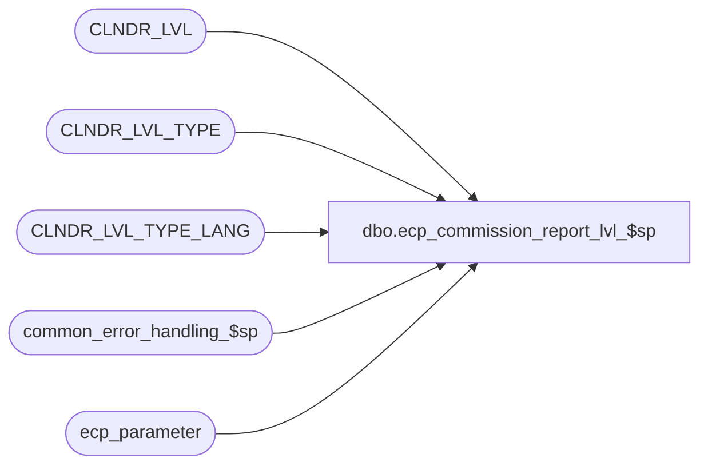

# dbo.ecp_commission_report_lvl_$sp

**Database:** auditworks_external  
**Server:** bedrockdb01  

## Architecture Diagram



## Table Dependencies

| Referenced Table |
|---|
| CLNDR_LVL |
| CLNDR_LVL_TYPE |
| CLNDR_LVL_TYPE_LANG |
| common_error_handling_$sp |
| ecp_parameter |

## Stored Procedure Code

```sql
create proc dbo.ecp_commission_report_lvl_$sp --DECLARE 
  @empl_calendar_level_list nvarchar(4000) = null,  --if not specified assumes all
 @language_id smallint = null,  --if not specified defaults to 1033 i.e. English
 @user_name nvarchar(30) = null
 AS
/* 
Proc Name: ecp_commission_report_lvl_$sp 
Desc:   Retrieves header labels for ECP Employee Commission Report calendar levels.

HISTORY:  
Date     Name           Def#    Desc
Mar28,14 Vicci         151000   Pass language_id to dynamic sql execution.
Apr01,13 Vicci         140907	Add multi-language_support
Feb08,08 Vicci          97975   Set errno not just message_id when raising business rule error
May30,07 Vicci          85597   Add missing order-by clause to ad-hoc calendar period selection
Mar16,07 Vicci		85597	Author
*/

--TODO:  multi-language
--TODO:  return level 1 to 8 headers   LEFT OUTER JOIN CLNDR_LVL_TYPE cllt
--          ON q.calendar_level = cllt.CLNDR_LVL_TYPE_IDNTY

SET NOCOUNT ON
DECLARE
  @ecp_clndr_id			binary(16),
  @from_date 			datetime,
  @calendar_level_count		int,
  @lowest_calendar_level	int,
  @lowest_calendar_level_id	binary(16),
  @errmsg                       nvarchar(255),
  @errno                        int,
  @function_name	        varbinary(128),
  @highest_calendar_level	int,
  @highest_calendar_level_id	binary(16),
  @message_id                   int,
  @process_name                 nvarchar(100),
  @process_no                   int,
  @object_name                  nvarchar(255),
  @operation_name               nvarchar(100),
  @rows				int,
  @stream_no                    tinyint,
  @to_date 			datetime,
  @sql_command 			nvarchar(4000)

SELECT @errno = 0,
       @function_name = convert(varbinary(128), 'ecp_commission_report_lvl_$sp'),
       @message_id = 201068,
       @operation_name = 'Unknown',
       @process_name = 'ecp_commission_report_lvl_$sp',
       @process_no = 36, --unknown
       @stream_no = 1

IF @user_name IS NULL
  SELECT @user_name = suser_sname()
       
SET CONTEXT_INFO @function_name

IF @language_id IS NULL 
  SELECT @language_id = 1033
  
CREATE TABLE #select_calendar_level(
 sequence_no numeric(2,0) identity not null,
 CLNDR_LVL_DESC nvarchar(255) not null,
 CLNDR_LVL_TYPE_ID binary(16) not null)
SELECT @errno = @@error
IF @errno <> 0
BEGIN
  SELECT @errmsg = 'Failed to create temp table to hold list of selected calendar levels',
         @object_name = '#select_calendar_level',
         @operation_name = 'CREATE'
  GOTO error
END

SELECT @ecp_clndr_id = par_bin_value
  FROM ecp_parameter p
 WHERE par_name = 'ecp_dflt_clndr_id'  
SELECT @errno = @@error
IF @errno <> 0
BEGIN
  SELECT @errmsg = 'Unable to which calendar to use',
         @object_name = 'ecp_parameter',
         @operation_name = 'SELECT'
  GOTO error
END

IF @empl_calendar_level_list IS NULL
BEGIN
  INSERT into #select_calendar_level(CLNDR_LVL_DESC, CLNDR_LVL_TYPE_ID)
  SELECT COALESCE(cltl.CLNDR_LVL_DESC, clt.CLNDR_LVL_DESC), clt.CLNDR_LVL_TYPE_ID
    FROM CLNDR_LVL_TYPE clt
         INNER JOIN CLNDR_LVL cl
            ON clt.CLNDR_LVL_TYPE_ID = cl.CLNDR_LVL_TYPE_ID
           AND cl.CLNDR_ID = @ecp_clndr_id
         LEFT OUTER JOIN CLNDR_LVL_TYPE_LANG cltl
            ON clt.CLNDR_LVL_TYPE_ID = cltl.CLNDR_LVL_TYPE_ID
           AND cltl.LANG_ID = @language_id
  ORDER BY clt.CLNDR_LVL_SEQ DESC
  SELECT @errno = @@error, @calendar_level_count = @@rowcount
  IF @errno <> 0
  BEGIN
    SELECT @errmsg = 'Unable to build list of calendar levels to use',
           @object_name = '#select_calendar_level',
           @operation_name = 'INSERT'
    GOTO error
  END
END
ELSE --of IF @empl_calendar_level_list IS NULL
BEGIN
  SELECT @sql_command = '
  INSERT into #select_calendar_level(CLNDR_LVL_DESC, CLNDR_LVL_TYPE_ID)
  SELECT COALESCE(cltl.CLNDR_LVL_DESC, clt.CLNDR_LVL_DESC), clt.CLNDR_LVL_TYPE_ID 
    FROM CLNDR_LVL_TYPE clt
         LEFT OUTER JOIN CLNDR_LVL_TYPE_LANG cltl
           ON clt.CLNDR_LVL_TYPE_ID = cltl.CLNDR_LVL_TYPE_ID
          AND cltl.LANG_ID = @language_id
   WHERE clt.CLNDR_LVL_TYPE_IDNTY IN (' + @empl_calendar_level_list + ')
   ORDER BY clt.CLNDR_LVL_SEQ DESC
  SELECT @calendar_level_count = @@rowcount'

  EXEC sp_executesql @sql_command, N'@calendar_level_count int OUT, @language_id smallint', @calendar_level_count OUT, @language_id        
  SELECT @errno = @@error
  IF @errno <> 0
  BEGIN
  SELECT @errmsg = 'Unable to retrieve descriptions of calendar levels selected',
         @object_name = 'CLNDR_LVL_TYPE',
         @operation_name = 'SELECT'
  GOTO error
  END
END

IF EXISTS (SELECT 1 
             FROM #select_calendar_level
            WHERE CLNDR_LVL_TYPE_ID NOT IN (SELECT CLNDR_LVL_TYPE_ID
                                              FROM CLNDR_LVL
                                             WHERE CLNDR_ID = @ecp_clndr_id))
BEGIN
  SELECT @message_id = 201684,
         @errno = 201684,
         @errmsg = 'Invalid calendar level list passed',
         @object_name = 'CLNDR_LVL',
         @operation_name = 'SELECT'
  GOTO error
END

SELECT MAX(CASE WHEN sequence_no = 1
            THEN CLNDR_LVL_DESC
            ELSE ''
            END) lvl1_label,
       MAX(CASE WHEN sequence_no = 2
            THEN CLNDR_LVL_DESC
            ELSE ''
            END) lvl2_label,
       MAX(CASE WHEN sequence_no = 3
            THEN CLNDR_LVL_DESC
            ELSE ''
            END) lvl3_label,
       MAX(CASE WHEN sequence_no = 4
            THEN CLNDR_LVL_DESC
            ELSE ''
            END) lvl4_label,
       MAX(CASE WHEN sequence_no = 5
            THEN CLNDR_LVL_DESC
            ELSE ''
            END) lvl5_label,
       MAX(CASE WHEN sequence_no = 6
            THEN CLNDR_LVL_DESC
            ELSE ''
            END) lvl6_label,
       MAX(CASE WHEN sequence_no = 7
            THEN CLNDR_LVL_DESC
            ELSE ''
            END) lvl7_label,
       MAX(CASE WHEN sequence_no = 8
            THEN CLNDR_LVL_DESC
            ELSE ''
            END) lvl8_label            
FROM #select_calendar_level

DROP TABLE #select_calendar_level

SELECT @function_name = convert(varbinary(128), 'Unknown')
SET CONTEXT_INFO @function_name
RETURN

error:
  SELECT @function_name = convert(varbinary(128), 'Unknown')
  SET CONTEXT_INFO @function_name

  EXEC common_error_handling_$sp @process_no, @errno, @errmsg, 0, @message_id, @process_name, @object_name, @operation_name, 1, @stream_no

  RETURN
```

