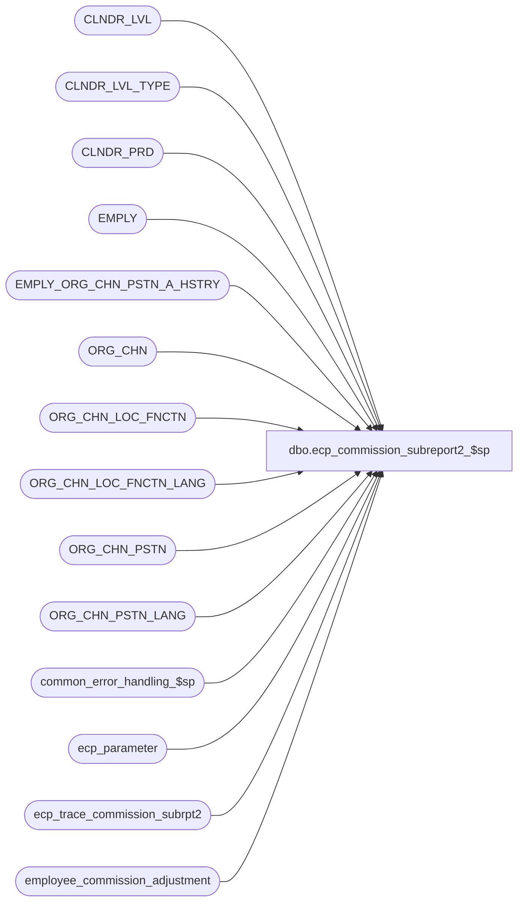

# dbo.ecp_commission_subreport2_$sp

**Database:** auditworks_external  
**Server:** bedrockdb01  

## Architecture Diagram



## Table Dependencies

| Referenced Table |
|---|
| CLNDR_LVL |
| CLNDR_LVL_TYPE |
| CLNDR_PRD |
| EMPLY |
| EMPLY_ORG_CHN_PSTN_A_HSTRY |
| ORG_CHN |
| ORG_CHN_LOC_FNCTN |
| ORG_CHN_LOC_FNCTN_LANG |
| ORG_CHN_PSTN |
| ORG_CHN_PSTN_LANG |
| common_error_handling_$sp |
| ecp_parameter |
| ecp_trace_commission_subrpt2 |
| employee_commission_adjustment |

## Stored Procedure Code

```sql
CREATE proc [dbo].[ecp_commission_subreport2_$sp]   @drill_down_column nvarchar(30) = null,  --if not specified assumes lvl1_commission_amt (examples: lvl1_commission_amt, lvl3_commission_amt, lvl3_commission_amt, etc)
  @select_from_date datetime = null,  --for drill-downs, set the from/to same as that of the original report selection criteria
                                      --all periods with at least 1 date falling between the range selected are included
  @select_to_date datetime = null,    --for drill-downs, set the from/to same as that of the original report selection criteria
  @empl_calendar_level_list nvarchar(4000) = null,  --for drill-downs, set same as that of the original report selection criteria
  @employee_trans_role_desc nvarchar(255) = null, --from drill-down row
  @select_store_list nvarchar(4000) = null,  --from drill-down row transaction store unless -9999 in which case from report input parameters
  @select_store_from int = null, 
  @select_store_to int = null, 
  @select_employee_list nvarchar(4000) = null, 
  @select_employee_from int = null,
  @select_employee_to int = null,
  @select_selling_area_list nvarchar(4000) = null, --from drill-down row primary_selling_area_no_dtl unless -9999 in which case from input parameters
  @select_selling_area_from int = null,
  @select_selling_area_to int = null,
  @select_primary_position_list nvarchar(4000) = null, --from drill-down row
 @language_id smallint = null,  --if not specified defaults to 1033 i.e. English
 @user_name nvarchar(30) = null,
 @other_store_flag tinyint = 0,
 @other_selling_area_flag tinyint = 0,
 @employee_trans_role nvarchar(20) = null
 AS
/* 
Proc Name: ecp_commission_subreport2_$sp 
Desc:   Retrieves commission adjustment list for ECP Employee Commission Report drill-down.

HISTORY:  
Date     Name           Def#    Desc
Mar19,15 Vicci      TFS-92911   Handle employees with selling area -1.
Dec16,14 Vicci      TFS-96757   Add employee_trans_role to imput parameter to support more accurate drill-down on auto-commission-adjustments
Dec11,14 Vicci      TFS-96757   Add tracing of input parameters.
May09,14 Vicci      TFS-72556   Correct table used to retrieve multi-language position descriptions to be ORG_CHN_PSTN_LANG not ORG_CHN_PSTN.
Apr01,13 Vicci         140907	Add multi-language support.
Aug12,08 Vicci         103077   Home Store / Selling area effective date support.
Feb08,08 Vicci          97975   Set errno not just message_id when raising business rule error
Dec12,07 Vicci          95521   Replace double-quoted identifier usage with single quote
Nov26,07 Vicci          95521   Integrate with CRDM properly.            
Jul02,07 Vicci          85597   Handle invalid selling area and/or primary position being passed in.
May30,07 Vicci          85597   Add missing order-by clause to ad-hoc calendar period selection
Apr10,07 Vicci		85597	Author
*/

--TODO:  multi-language
--TODO:  audit groups

SET NOCOUNT ON
DECLARE
  @ecp_clndr_id			binary(16),
  @employee_count		int,
  @from_date 			datetime,
  @calendar_level_count		int,
  @lowest_calendar_level	int,
  @lowest_calendar_level_id	binary(16),
  @one_hundred			money,
  @empl_transaction_role_count  int, 
  @errmsg                       nvarchar(255),
  @errno                        int,
  @function_name	        varbinary(128),
  @highest_calendar_level	int,
  @highest_calendar_level_id	binary(16),
  @message_id                   int,
  @position			int,
  @position_count		int,
  @process_name                 nvarchar(100),
  @process_no                   int,
  @object_name                  nvarchar(255),
  @operation_name               nvarchar(100),
  @rows				int,
  @select_calendar_level 	int,
  @select_calendar_level_id 	binary(16),
  @select_calendar_level_seq    tinyint,
  @selling_area_count		int,
  @store_count			int,
  @stream_no                    tinyint,
  @to_date 			datetime,
  @sql_command 			nvarchar(4000),
  @auto_adjustment_id_string nvarchar(5),
  @auto_adjustment_id numeric(5,0)

SELECT @employee_count = 0, 
       @errno = 0,
       @function_name = convert(varbinary(128), 'ecp_commission_subreport2_$sp'),
       @message_id = 201068,
       @one_hundred = 100,
       @operation_name = 'Unknown',
       @position_count = 0,
       @process_name = 'ecp_commission_subreport2_$sp',
       @process_no = 36, --unknown
       @selling_area_count = 0,
       @store_count = 0, 
       @stream_no = 1

INSERT into ecp_trace_commission_subrpt2(
       drill_down_column, 
       select_from_date, 
       select_to_date, 
       empl_calendar_level_list, 
       employee_trans_role_desc, 
       select_store_list, 
       select_store_from, 
       select_store_to, 
       select_employee_list, 
       select_employee_from, 
       select_employee_to, 
       select_selling_area_list, 
       select_selling_area_from, 
       select_selling_area_to, 
       select_primary_position_list, 
       language_id, 
       user_name, 
       other_store_flag, 
       other_selling_area_flag,
       employee_trans_role) 
VALUES(@drill_down_column, 
       @select_from_date, 
       @select_to_date, 
       @empl_calendar_level_list, 
       @employee_trans_role_desc, 
       @select_store_list, 
       @select_store_from, 
       @select_store_to, 
       @select_employee_list, 
       @select_employee_from, 
       @select_employee_to, 
       @select_selling_area_list, 
       @select_selling_area_from, 
       @select_selling_area_to, 
       @select_primary_position_list, 
       @language_id, 
       @user_name, 
       @other_store_flag, 
       @other_selling_area_flag,
       @employee_trans_role) 

DELETE ecp_trace_commission_subrpt2
   WHERE execution_datetime < dateadd(dd, -4, getdate())

IF @user_name IS NULL
  SELECT @user_name = suser_sname()

SET CONTEXT_INFO @function_name

IF @language_id IS NULL 
  SELECT @language_id = 1033
  
IF @drill_down_column IS NULL
  SELECT @drill_down_column = 'lvl1_commission_amt'

IF substring(@drill_down_column, 4, 1) < 1 OR substring(@drill_down_column, 4, 1) > 8
BEGIN
  SELECT @message_id = 201684,
         @errno = 201684,
         @errmsg = 'Invalid drill-down-column passed',
         @object_name = '@drill_down_column',
         @operation_name = 'SELECT'
  GOTO error
END
ELSE
  SELECT @select_calendar_level_seq = convert(tinyint, substring(@drill_down_column, 4, 1))

SELECT @drill_down_column = substring(@drill_down_column, 6, 255)

IF substring(@employee_trans_role, 1, 5) = '..ADJ'
BEGIN
  SELECT @auto_adjustment_id_string = substring(@employee_trans_role, 6, 5)
  IF IsNumeric(@auto_adjustment_id_string) = 1 
    SELECT @auto_adjustment_id = @auto_adjustment_id_string
END
 
CREATE TABLE #select_primary_position(primary_position nvarchar(4) not null)
SELECT @errno = @@error
IF @errno <> 0
BEGIN
  SELECT @errmsg = 'Failed to create temp table to hold list of selected positions',
         @object_name = '#select_primary_position',
         @operation_name = 'CREATE'
  GOTO error
END

IF @select_primary_position_list IS NOT NULL
BEGIN
  SELECT @position = CHARINDEX('''', @select_primary_position_list)
  WHILE @position > 0
  BEGIN
    SELECT @select_primary_position_list = stuff(@select_primary_position_list, charindex('''', @select_primary_position_list), 1, '')  
    SELECT @position = CHARINDEX('''', @select_primary_position_list)
  END

  SELECT @position = CHARINDEX(',', @select_primary_position_list)
  WHILE @position > 0
  BEGIN
    INSERT into #select_primary_position(primary_position)
    VALUES (ltrim(rtrim(substring(@select_primary_position_list, 1, @position - 1))))
    SELECT @select_primary_position_list = substring(@select_primary_position_list, @position + 1, 4000)
    SELECT @position = CHARINDEX(',', @select_primary_position_list)
  END
  INSERT into #select_primary_position(primary_position)
  VALUES (ltrim(rtrim(@select_primary_position_list)))

  SELECT @position_count = count(*)
    FROM #select_primary_position
  
  IF @position_count < 1
  BEGIN
    SELECT @message_id = 201684,
           @errno = 201684, 
           @errmsg = 'Invalid primary position list passed',
           @object_name = '#select_primary_position',
           @operation_name = 'INSERT'
    GOTO error
  END
END
ELSE
BEGIN
  INSERT #select_primary_position(primary_position)
  VALUES('-1')
END

CREATE TABLE #select_selling_area(selling_area_no int not null)
SELECT @errno = @@error
IF @errno <> 0
BEGIN
  SELECT @errmsg = 'Failed to create temp table to hold list of selected selling areas',
         @object_name = '#select_selling_area',
         @operation_name = 'CREATE'
  GOTO error
END

IF @select_selling_area_list IS NOT NULL
BEGIN
  SELECT @position = CHARINDEX(',', @select_selling_area_list)
  WHILE @position > 0
  BEGIN
    INSERT into #select_selling_area(selling_area_no)
    VALUES (convert(int, substring(@select_selling_area_list, 1, @position - 1)))
    SELECT @select_selling_area_list = substring(@select_selling_area_list, @position + 1, 4000)
    SELECT @position = CHARINDEX(',', @select_selling_area_list)
  END
  INSERT into #select_selling_area(selling_area_no)
  VALUES (convert(int, @select_selling_area_list))

  SELECT @selling_area_count = count(*)
    FROM #select_selling_area
  
  IF @selling_area_count < 1
  BEGIN
    SELECT @message_id = 201684,
           @errno = 201684, 
           @errmsg = 'Invalid selling area list passed',
           @object_name = '#select_selling_area',
           @operation_name = 'INSERT'
    GOTO error
  END
END
ELSE
BEGIN
  INSERT #select_selling_area(selling_area_no)
  VALUES(-1)
END

IF @select_selling_area_from IS NULL
  SELECT @select_selling_area_from = -1

IF @select_selling_area_to IS NULL
  SELECT @select_selling_area_to = 2147483647

CREATE TABLE #select_employee(employee_no int not null)
SELECT @errno = @@error
IF @errno <> 0
BEGIN
  SELECT @errmsg = 'Failed to create temp table to hold list of selected employees',
    @object_name = '#select_employee',
         @operation_name = 'CREATE'
  GOTO error
END

IF @select_employee_list IS NOT NULL
BEGIN
  SELECT @sql_command = '
  INSERT #select_employee(employee_no)
  SELECT EMPLY_NUM
    FROM EMPLY
   WHERE EMPLY_NUM IN (' + @select_employee_list + ')
  SELECT @employee_count = @@rowcount'

  EXEC sp_executesql @sql_command, N'@employee_count int OUT', @employee_count OUT        
  
  IF @employee_count < 1
  BEGIN
    SELECT @message_id = 201684,
           @errno = 201684, 
           @errmsg = 'Invalid employee list passed',
           @object_name = 'EMPLY',
           @operation_name = 'SELECT'
GOTO error
  END
END
ELSE
BEGIN
  INSERT #select_employee(employee_no)
  VALUES(-1)
END

IF @select_employee_from IS NULL
  SELECT @select_employee_from = 0

IF @select_employee_to IS NULL
  SELECT @select_employee_to = 2147483647

CREATE TABLE #select_store(store_no int not null)
SELECT @errno = @@error
IF @errno <> 0
BEGIN
  SELECT @errmsg = 'Failed to create temp table to hold list of selected stores',
         @object_name = '#select_store',
      @operation_name = 'CREATE'
GOTO error
END

IF @select_store_list IS NOT NULL
BEGIN
  SELECT @sql_command = '
  INSERT #select_store(store_no)
  SELECT ORG_CHN_NUM
    FROM ORG_CHN
   WHERE ORG_CHN_NUM IN (' + @select_store_list + ')
  SELECT @store_count = @@rowcount'

  EXEC sp_executesql @sql_command, N'@store_count int OUT', @store_count OUT  
  
  IF @store_count < 1
  BEGIN
    SELECT @message_id = 201684,
           @errno = 201684, 
           @errmsg = 'Invalid store list passed',
           @object_name = 'ORG_CHN',
           @operation_name = 'SELECT'
    GOTO error
  END
END
ELSE
BEGIN
  INSERT #select_store(store_no)
  VALUES(-1)
END

IF @select_store_from IS NULL
  SELECT @select_store_from = 0

IF @select_store_to IS NULL
  SELECT @select_store_to = 2147483647
  
CREATE TABLE #select_calendar_level(
 sequence_no numeric(2,0) identity not null,
 CLNDR_LVL_TYPE_ID binary(16) NOT NULL, 
 calendar_level smallint NOT NULL, 
 CLNDR_LVL_SEQ smallint NOT NULL)
SELECT @errno = @@error
IF @errno <> 0
BEGIN
  SELECT @errmsg = 'Failed to create temp table to hold list of selected calendar levels',
         @object_name = '#select_calendar_level',
         @operation_name = 'CREATE'
  GOTO error
END

SELECT @ecp_clndr_id = par_bin_value
  FROM ecp_parameter p
 WHERE par_name = 'ecp_dflt_clndr_id'  
SELECT @errno = @@error
IF @errno <> 0
BEGIN
  SELECT @errmsg = 'Unable to which calendar to use',
         @object_name = 'ecp_parameter',
         @operation_name = 'SELECT'
  GOTO error
END

IF @empl_calendar_level_list IS NULL
BEGIN
  INSERT into #select_calendar_level(CLNDR_LVL_TYPE_ID, calendar_level, CLNDR_LVL_SEQ)
  SELECT clt.CLNDR_LVL_TYPE_ID, clt.CLNDR_LVL_TYPE_IDNTY, clt.CLNDR_LVL_SEQ 
    FROM CLNDR_LVL_TYPE clt
         INNER JOIN CLNDR_LVL cl
            ON clt.CLNDR_LVL_TYPE_ID = cl.CLNDR_LVL_TYPE_ID
           AND cl.CLNDR_ID = @ecp_clndr_id
  ORDER BY clt.CLNDR_LVL_SEQ DESC
  SELECT @errno = @@error, @calendar_level_count = @@rowcount
  IF @errno <> 0
  BEGIN
    SELECT @errmsg = 'Unable to build list of calendar levels to use',
           @object_name = '#select_calendar_level',
           @operation_name = 'INSERT'
    GOTO error
  END
END
ELSE --of IF @empl_calendar_level_list IS NULL
BEGIN
  SELECT @sql_command = '
  INSERT into #select_calendar_level(CLNDR_LVL_TYPE_ID, calendar_level, CLNDR_LVL_SEQ)
  SELECT clt.CLNDR_LVL_TYPE_ID, clt.CLNDR_LVL_TYPE_IDNTY, clt.CLNDR_LVL_SEQ 
    FROM CLNDR_LVL_TYPE clt
   WHERE clt.CLNDR_LVL_TYPE_IDNTY IN (' + @empl_calendar_level_list + ')
   ORDER BY clt.CLNDR_LVL_SEQ DESC
  SELECT @calendar_level_count = @@rowcount'

  EXEC sp_executesql @sql_command, N'@calendar_level_count int OUT', @calendar_level_count OUT        
  SELECT @errno = @@error
  IF @errno <> 0
BEGIN
  SELECT @errmsg = 'Unable to select retrieval_in_progress from interface_status',
         @object_name = 'interface_status',
         @operation_name = 'SELECT'
  GOTO error
  END
END

IF EXISTS (SELECT 1 
             FROM #select_calendar_level
            WHERE CLNDR_LVL_TYPE_ID NOT IN (SELECT CLNDR_LVL_TYPE_ID
                                              FROM CLNDR_LVL
    WHERE CLNDR_ID = @ecp_clndr_id))
BEGIN
  SELECT @message_id = 201684,
         @errno = 201684, 
         @errmsg = 'Invalid calendar level list passed',
         @object_name = 'CLNDR_LVL',
         @operation_name = 'SELECT'
  GOTO error
END

SELECT @lowest_calendar_level = calendar_level,
       @lowest_calendar_level_id = CLNDR_LVL_TYPE_ID
  FROM #select_calendar_level
 WHERE CLNDR_LVL_SEQ = (SELECT MAX(CLNDR_LVL_SEQ)
			  FROM #select_calendar_level)
SELECT @errno = @@error
IF @errno <> 0
BEGIN
  SELECT @errmsg = 'Unable to which calendar level was the lowest requested',
         @object_name = 'CLNDR_LVL_TYPE',
         @operation_name = 'SELECT'
  GOTO error
END

SELECT @select_calendar_level = calendar_level,
       @select_calendar_level_id = CLNDR_LVL_TYPE_ID
  FROM #select_calendar_level
 WHERE sequence_no = @select_calendar_level_seq
SELECT @errno = @@error
IF @errno <> 0
BEGIN
  SELECT @errmsg = 'Unable to which calendar level was selected for drilldown',
         @object_name = '#select_calendar_level',
         @operation_name = 'SELECT'
  GOTO error
END


/* Verify that the From/To Date selected is a period-start / period-end date for the 
   lowest calendar level selected, and if not extend the date-range selected to 
   include a full period */
IF @select_from_date IS NULL
BEGIN
  IF @select_to_date IS NOT NULL
    SELECT @select_from_date = @select_to_date
  ELSE
    SELECT @select_from_date = getdate()
END

IF @select_to_date IS NULL
  SELECT @select_to_date = getdate()
  
SELECT @to_date = dateadd(ss, -1, cp.END_DATE_TIME), @from_date = cp.STRT_DATE_TIME
  FROM CLNDR_PRD cp
 WHERE @select_to_date >= cp.STRT_DATE_TIME
   AND @select_to_date < cp.END_DATE_TIME
   AND cp.CLNDR_ID = @ecp_clndr_id
   AND cp.CLNDR_LVL_TYPE_ID = @lowest_calendar_level_id
SELECT @errno = @@error
IF @errno <> 0
BEGIN
  SELECT @errmsg = 'Failed to determing period start/end dates of latest date selected',
         @object_name = 'CLNDR_PRD',
         @operation_name = 'SELECT'
  GOTO error
END

IF @to_date > @select_to_date
  SELECT @select_to_date = @to_date
  
IF @from_date < @select_from_date
  SELECT @select_from_date = @from_date
ELSE
BEGIN
  SELECT @select_from_date = cp.STRT_DATE_TIME
    FROM CLNDR_PRD cp
   WHERE @select_from_date >= cp.STRT_DATE_TIME
     AND @select_from_date < cp.END_DATE_TIME
     AND cp.CLNDR_ID = @ecp_clndr_id
     AND cp.CLNDR_LVL_TYPE_ID = @lowest_calendar_level_id
  SELECT @errno = @@error
  IF @errno <> 0
  BEGIN
    SELECT @errmsg = 'Failed to determing period start date of earliest date selected',
           @object_name = 'CLNDR_PRD',
           @operation_name = 'SELECT'
    GOTO error
  END
END

IF @calendar_level_count > 1 
BEGIN
  SELECT @highest_calendar_level = calendar_level,
         @highest_calendar_level_id = CLNDR_LVL_TYPE_ID
    FROM #select_calendar_level
   WHERE CLNDR_LVL_SEQ = (SELECT MIN(CLNDR_LVL_SEQ)
          	            FROM #select_calendar_level)
  SELECT @errno = @@error
  IF @errno <> 0
  BEGIN
    SELECT @errmsg = 'Unable to which calendar level was the highest requested',
           @object_name = 'CLNDR_LVL_TYPE',
           @operation_name = 'SELECT'
    GOTO error
  END
  
  SELECT @to_date = dateadd(ss, -1, cp.END_DATE_TIME)
    FROM CLNDR_PRD cp
   WHERE @select_to_date >= cp.STRT_DATE_TIME
     AND @select_to_date < cp.END_DATE_TIME
     AND cp.CLNDR_ID = @ecp_clndr_id
     AND cp.CLNDR_LVL_TYPE_ID = @highest_calendar_level_id
 SELECT @errno = @@error
  IF @errno <> 0
  BEGIN
    SELECT @errmsg = 'Failed to determing period end date of highest calendar level selected including latest date selected',
           @object_name = 'CLNDR_PRD',
           @operation_name = 'SELECT'
    GOTO error
  END
END
ELSE 
  SELECT @to_date = @select_to_date

IF @lowest_calendar_level <> @select_calendar_level
BEGIN
  SELECT @from_date = cp.STRT_DATE_TIME
    FROM CLNDR_PRD cp
   WHERE @select_from_date >= cp.STRT_DATE_TIME
     AND @select_from_date < cp.END_DATE_TIME
     AND cp.CLNDR_ID = @ecp_clndr_id
     AND cp.CLNDR_LVL_TYPE_ID = @select_calendar_level_id
 SELECT @errno = @@error
  IF @errno <> 0
  BEGIN
    SELECT @errmsg = 'Failed to determing period start date of calendar level selected including earliest date selected',
           @object_name = 'CLNDR_PRD',
           @operation_name = 'SELECT'
    GOTO error
  END
END

IF @from_date < @select_from_date
  SELECT @select_from_date = @from_date

SELECT eca.home_store_no,
       IsNull(emh.ORG_CHN_NAME, '') + ' (' + IsNull(convert(nvarchar, eca.home_store_no), '') + ')' home_store_name,
       --eca.primary_selling_area_no primary_selling_area_no,
       COALESCE(fl.FNCTN_DESC,f.FNCTN_DESC, '')  + ' (' + IsNull(convert(nvarchar, eca.primary_selling_area_no), '')  + ')' primary_selling_area_desc, 
       --eca.primary_position primary_position,
       COALESCE(ocpl.PSTN_DESC, ocp.PSTN_DESC, eca.primary_position, '') primary_position_desc,
       --eca.employee_no,
       IsNull((IsNull(em.LAST_NAME, '') + Substring(', ', 1, sign(datalength(em.LAST_NAME) * datalength(em.FRST_NAME)) * 2)  + IsNull(em.FRST_NAME, '')), '') + ' (' + convert(nvarchar, eca.employee_no) + ')' employee_name, 
       --eca.calendar_level,
  --eca.employee_transaction_role employee_transaction_role,
       eca.adjustment_description,
       eca.pay_period_end_datetime,
       eca.entry_datetime,
       eca.user_id,
       eca.commission_adj_amount,          
       eca.auto_rev_pay_pd_end_datetime auto_reversal_datetime,
       eca.adjustment_comment,
       eca.commission_adj_id,
       eca.auto_commission_adj_id
  FROM employee_commission_adjustment eca
       INNER JOIN EMPLY em
          ON eca.employee_no = em.EMPLY_NUM
       INNER JOIN #select_store s
          ON eca.home_store_no = s.store_no
          OR @store_count = 0
       INNER JOIN #select_employee e
          ON eca.employee_no = e.employee_no
          OR @employee_count = 0
       INNER JOIN #select_selling_area sa
          ON eca.primary_selling_area_no = sa.selling_area_no
          OR @selling_area_count = 0
       INNER JOIN #select_primary_position p
          ON eca.primary_position = p.primary_position
          OR @position_count = 0
       LEFT OUTER JOIN ORG_CHN emh
          ON eca.home_store_no = emh.ORG_CHN_NUM
       LEFT OUTER JOIN ORG_CHN_LOC_FNCTN f
          ON eca.primary_selling_area_no = f.FNCTN_NUM
       LEFT OUTER JOIN ORG_CHN_LOC_FNCTN_LANG fl
          ON f.FNCTN_NUM = fl.FNCTN_NUM
         AND fl.LANG_ID = @language_id
       LEFT OUTER JOIN ORG_CHN_PSTN ocp
          ON eca.primary_position = ocp.PSTN_CODE
       LEFT OUTER JOIN ORG_CHN_PSTN_LANG ocpl
          ON ocp.PSTN_CODE = ocpl.PSTN_CODE
         AND ocpl.LANG_ID = @language_id
       LEFT OUTER JOIN EMPLY_ORG_CHN_PSTN_A_HSTRY ep
           ON eca.employee_no = ep.EMPLY_NUM
          AND getdate() >= ep.EFCTV_DATE
          AND (getdate() < ep.EXPRTN_DATE OR ep.EXPRTN_DATE IS NULL)
	  AND PRMRY_LOC_A = 1   
 WHERE (eca.adjustment_description = @employee_trans_role_desc 
        OR @employee_trans_role_desc IS NULL
        OR eca.auto_commission_adj_id = @auto_adjustment_id)
   AND eca.pay_period_end_datetime >= @select_from_date
   AND eca.pay_period_end_datetime <= @select_to_date
   AND eca.employee_no >= @select_employee_from
   AND eca.employee_no <= @select_employee_to
   AND ((eca.home_store_no >= @select_store_from AND eca.home_store_no <= @select_store_to)
        OR @select_store_to = 2147483647)
   AND eca.primary_selling_area_no >= @select_selling_area_from
   AND eca.primary_selling_area_no <= @select_selling_area_to
   AND (eca.primary_selling_area_no <> ep.PRMRY_DISP_FNCTN_NUM OR @other_selling_area_flag = 0)
 ORDER BY eca.home_store_no,
       IsNull(emh.ORG_CHN_NAME, '') + ' (' + IsNull(convert(nvarchar, eca.home_store_no), '') + ')',
       COALESCE(fl.FNCTN_DESC, f.FNCTN_DESC, '')  + ' (' + IsNull(convert(nvarchar, eca.primary_selling_area_no), '')  + ')', 
       COALESCE(ocpl.PSTN_DESC, ocp.PSTN_DESC, eca.primary_position, ''),
       IsNull((IsNull(em.LAST_NAME, '') + Substring(', ', 1, sign(datalength(em.LAST_NAME) * datalength(em.FRST_NAME)) * 2)  + IsNull(em.FRST_NAME, '')), '') + ' (' + convert(nvarchar, eca.employee_no) + ')', 
       eca.pay_period_end_datetime,
       eca.adjustment_description,
       eca.entry_datetime

SELECT @errno = @@error, @rows = @@rowcount
IF @errno <> 0
BEGIN
  SELECT @errmsg = 'Failed to retrieve commission report drill-down amounts',
         @object_name = 'employee_commission_adjustment',
         @operation_name = 'SELECT'
  GOTO error
END

IF @rows = 0
  SELECT convert(int, null) home_store_no,
     convert(nvarchar, null) home_store_name,
       convert(nvarchar, null) primary_selling_area_desc, 
       convert(nvarchar, null) primary_position_desc,
       convert(nvarchar, null)  employee_name, 
       convert(nvarchar, null) adjustment_description,
       convert(datetime, null) pay_period_end_datetime,
       convert(datetime, null) entry_datetime,
       convert(int, null) user_id,
       convert(money, null) commission_adj_amount,          
       convert(datetime, null) auto_reversal_datetime,
       convert(nvarchar, null) adjustment_comment,
       convert(numeric(12,0), null) commission_adj_id,
       convert(numeric(5,0), null) auto_commission_adj_id

DROP TABLE #select_calendar_level
DROP TABLE #select_employee
DROP TABLE #select_store
DROP TABLE #select_selling_area
DROP TABLE #select_primary_position

SELECT @function_name = convert(varbinary(128), 'Unknown')
SET CONTEXT_INFO @function_name
RETURN

error:
  SELECT @function_name = convert(varbinary(128), 'Unknown')
  SET CONTEXT_INFO @function_name

  EXEC common_error_handling_$sp @process_no, @errno, @errmsg, 0, @message_id, @process_name, @object_name, @operation_name, 1, @stream_no

  RETURN
```

