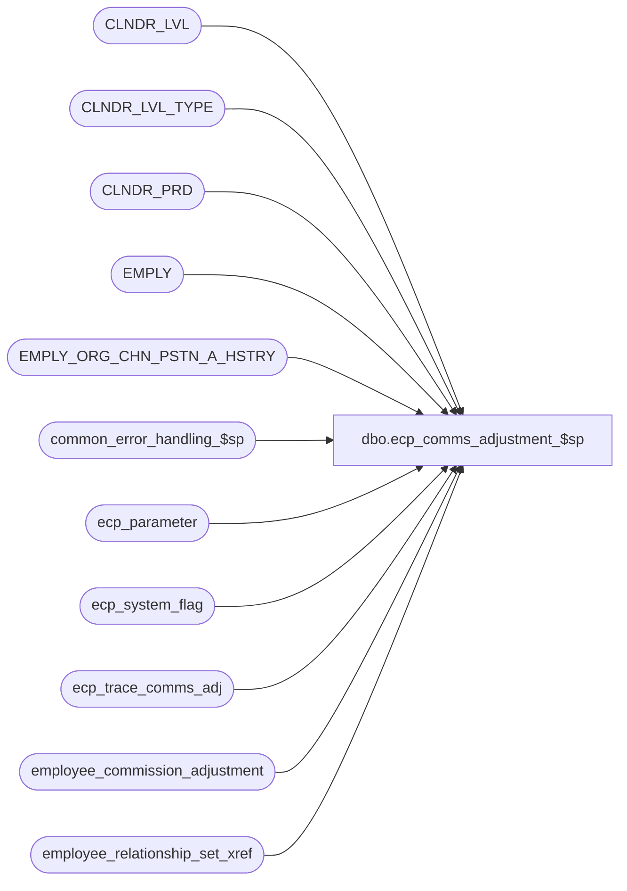

# dbo.ecp_comms_adjustment_$sp

**Database:** auditworks_external  
**Server:** bedrockdb01  

## Architecture Diagram



## Table Dependencies

| Referenced Table |
|---|
| CLNDR_LVL |
| CLNDR_LVL_TYPE |
| CLNDR_PRD |
| EMPLY |
| EMPLY_ORG_CHN_PSTN_A_HSTRY |
| common_error_handling_$sp |
| ecp_parameter |
| ecp_system_flag |
| ecp_trace_comms_adj |
| employee_commission_adjustment |
| employee_relationship_set_xref |

## Stored Procedure Code

```sql
CREATE proc [dbo].[ecp_comms_adjustment_$sp]   
  
  @employee_list 		nvarchar(3000),
  @pay_period_end_datetime	datetime,
  @adjustment_amount		money,
  @adjustment_description	nvarchar(255),
  @adjustment_comment		nvarchar(1000) = NULL,
  @auto_reversing		tinyint, 
  @user_id 			int,
  @process_id 			binary(16) = NULL
AS 
--TODO:  audit-trail
/* 
Proc Name: ecp_comms_adjustment_$sp 
Desc:   Called by UI to post adjustment.

HISTORY:  
Date     Name           Def#    Desc
Mar24,15 Vicci      TFS-92911   Handle employees with no position/selling-area assignment.
Apr14,11 Paul          126153   Use unicode datatypes
Aug19,08 Vicci         103967   Support effective dates on relationship assignments.
Jul21,08 Vicci         103077	Support effective dates on home-store assignment.
Feb08,08 Vicci          97975   Set errno not just message_id when raising business rule error
Nov26,07 Vicci          85597   Integrate properly with CRDM
Jul13,07 Vicci          85597   Allow for null comment
Jun14,07 Vicci          85597   Add trace code and handling of last export release being null
May15,07 Vicci		85597	Adding primary flag to selling-area/position lookup
Apr02,07 Vicci		85597	Author
*/

SET NOCOUNT ON
DECLARE
  @trace_log			tinyint,
  @errmsg                       nvarchar(255),
  @errno                        int,
  @message_id                   int,
  @object_name                  nvarchar(255),
  @operation_name               nvarchar(100),
  @process_name                 nvarchar(100),
  @process_no                   int,
  @rows				int,
  @stream_no                    tinyint,
  @employee_count		int,
  @sql_command 			nvarchar(3000),
  @entry_datetime 		datetime,
  @ecp_clndr_id			binary(16),
  @lowest_calendar_level	int,
  @lowest_calendar_level_id	binary(16),
  @last_export_release_datetime datetime,
  @next_pay_period_datetime	datetime,
  @current_pay_period_datetime	datetime

SELECT @message_id = 201068,
       @operation_name = 'Unknown',
       @process_name = 'ecp_comms_adjustment_$sp',
       @process_no = 282,
       @stream_no = 1,
       @employee_count = 0,
       @entry_datetime = getdate(),
       @next_pay_period_datetime = null

CREATE TABLE #select_employee(
       employee_no int not null)
SELECT @errno = @@error
IF @errno <> 0
BEGIN
  SELECT @errmsg = 'Failed to create temp table to hold list of selected employees',
         @object_name = '#select_employee',
         @operation_name = 'CREATE'
  GOTO error
END

SELECT @sql_command = '
  INSERT #select_employee(employee_no)
  SELECT EMPLY_NUM
    FROM EMPLY
   WHERE EMPLY_NUM IN (' + @employee_list + ')
  SELECT @employee_count = @@rowcount'

EXEC sp_executesql @sql_command, N'@employee_count int OUT', @employee_count OUT        
  
IF @employee_count < 1
BEGIN
  SELECT @message_id = 201684,
         @errno = 201684,
         @errmsg = 'Invalid employee list passed',
         @object_name = 'EMPLY',
         @operation_name = 'SELECT'
  GOTO error
END

SELECT @ecp_clndr_id = par_bin_value
  FROM ecp_parameter p
 WHERE par_name = 'ecp_dflt_clndr_id'  
SELECT @errno = @@error
IF @errno <> 0
BEGIN
  SELECT @errmsg = 'Unable to which calendar to use',
         @object_name = 'ecp_parameter',
         @operation_name = 'SELECT'
  GOTO error
END

SELECT @lowest_calendar_level = CLNDR_LVL_TYPE_IDNTY, 
       @lowest_calendar_level_id = CLNDR_LVL_TYPE_ID
  FROM CLNDR_LVL_TYPE
 WHERE CLNDR_LVL_SEQ = (SELECT MAX(CLNDR_LVL_SEQ)
			  FROM CLNDR_LVL_TYPE
			 WHERE CLNDR_LVL_TYPE_ID
			    IN (SELECT DISTINCT CLNDR_LVL_TYPE_ID
                                  FROM CLNDR_LVL
                                  WHERE CLNDR_ID = @ecp_clndr_id))
   AND CLNDR_LVL_TYPE_ID
    IN (SELECT DISTINCT CLNDR_LVL_TYPE_ID
          FROM CLNDR_LVL
         WHERE CLNDR_ID = @ecp_clndr_id)
SELECT @errno = @@error
IF @errno <> 0
BEGIN
  SELECT @errmsg = 'Unable to which calendar level to use for employee transaction logging',
         @object_name = 'CLNDR_LVL_TYPE',
         @operation_name = 'SELECT'
  GOTO error
END

SELECT @last_export_release_datetime = c.flag_datetime_value  --note, stored with time of 23:59:59
  FROM ecp_system_flag c
 WHERE flag_name = 'ecp_payperiod_export_datetime'  
SELECT @errno = @@error, @rows = @@rowcount
IF @errno <> 0
BEGIN
  SELECT @errmsg = 'Unable to determine last pay-period export release datetime',
         @object_name = 'ecp_system_flag',
         @operation_name = 'SELECT'
  GOTO error
END

SELECT @current_pay_period_datetime = dateadd(ss, -1, MIN(cp.END_DATE_TIME))
  FROM CLNDR_PRD cp
 WHERE cp.STRT_DATE_TIME <= @pay_period_end_datetime
   AND cp.END_DATE_TIME > @pay_period_end_datetime
   AND (cp.STRT_DATE_TIME > @last_export_release_datetime OR @last_export_release_datetime IS NULL)
   AND cp.CLNDR_ID = @ecp_clndr_id
   AND cp.CLNDR_LVL_TYPE_ID = @lowest_calendar_level_id
SELECT @errno = @@error, @rows = @@rowcount
IF @errno <> 0
BEGIN
  SELECT @errmsg = 'Unable to determine whether the payperiod end date/time passed in is a valid unexported pay period end date',
         @object_name = 'CLNDR_PRD',
         @operation_name = 'SELECT'
  GOTO error
END
IF @rows < 1
BEGIN
  SELECT @message_id = 201684,
         @errno = 201684,
         @object_name = @process_name,
         @errmsg = 'Invalid Argument(s) passed to the stored procedure ' + @process_name + '. Unable to proceed.'
  GOTO error
END

IF @auto_reversing = 1
BEGIN 
  SELECT @next_pay_period_datetime = dateadd(ss, -1, MIN(cp.END_DATE_TIME))
    FROM CLNDR_PRD cp
   WHERE cp.STRT_DATE_TIME > @current_pay_period_datetime
     AND cp.CLNDR_ID = @ecp_clndr_id
     AND cp.CLNDR_LVL_TYPE_ID = @lowest_calendar_level_id
  SELECT @errno = @@error, @rows = @@rowcount
  IF @errno <> 0
  BEGIN
    SELECT @errmsg = 'Unable to determine into which period auto-reversal should be made',
           @object_name = 'CLNDR_PRD',
           @operation_name = 'SELECT'
    GOTO error
  END
  IF @rows < 1
  BEGIN
    SELECT @message_id = 201612,
           @errno = 201612,
           @object_name = 'CLNDR_PRD',
           @operation_name = 'SELECT',
           @errmsg = 'Calendar definition does not extend sufficiently far in the future'
    GOTO error
  END
END
SELECT @trace_log = 0
IF @trace_log = 1
BEGIN
if not exists (select * from dbo.sysobjects where id = Object_id('dbo.ecp_trace_comms_adj') and type in ('U','S'))
begin
  create table dbo.ecp_trace_comms_adj (
  execution_datetime datetime default getdate() not null,
  employee_list 		nvarchar(3000) null,
  pay_period_end_datetime	datetime null,
  adjustment_amount		money null,
  adjustment_description	nvarchar(255) null,
  adjustment_comment		nvarchar(1000) null,
  auto_reversing		tinyint null, 
  user_id 			int null,
  process_id 			binary(16) null,
  current_pay_period_datetime  datetime null,
  next_pay_period_datetime 	datetime null
)
end
INSERT into ecp_trace_comms_adj(
       employee_list,
       pay_period_end_datetime,
       adjustment_amount,
       adjustment_description,
       adjustment_comment,
       auto_reversing,
       user_id,
       process_id,
       current_pay_period_datetime,
       next_pay_period_datetime)
VALUES(
       @employee_list,
       @pay_period_end_datetime,
       @adjustment_amount,
       @adjustment_description,
       @adjustment_comment,
       @auto_reversing,
       @user_id,
       @process_id,
       @current_pay_period_datetime,
       @next_pay_period_datetime )
END  --IF @trace_log = 1

BEGIN TRANSACTION
INSERT into employee_commission_adjustment(
       entry_datetime,
       user_id,
       pay_period_end_datetime,
       employee_no,
       home_store_no,
       primary_position,
       primary_selling_area_no,
       relationship_set_id, 
       commission_adj_amount,
       adjustment_description,
       auto_rev_pay_pd_end_datetime,
       adjustment_comment)
SELECT @entry_datetime,
       @user_id,
       @current_pay_period_datetime,
       w.employee_no,
       IsNull(ep.ORG_CHN_NUM, e.PRMY_ORG_CHN_NUM),
       COALESCE(ep.PSTN_CODE,'?'),
       COALESCE(ep.PRMRY_DISP_FNCTN_NUM,-1),
       x.relationship_set_id, 
       @adjustment_amount,
       @adjustment_description,
       @next_pay_period_datetime,
       @adjustment_comment
  FROM #select_employee w  
       LEFT OUTER JOIN EMPLY e
         ON w.employee_no = e.EMPLY_NUM
       LEFT OUTER JOIN EMPLY_ORG_CHN_PSTN_A_HSTRY ep
         ON ep.PRMRY_LOC_A = 1
        AND w.employee_no = ep.EMPLY_NUM
        AND @current_pay_period_datetime >= ep.EFCTV_DATE
       AND (@current_pay_period_datetime < ep.EXPRTN_DATE OR ep.EXPRTN_DATE IS NULL)
       LEFT OUTER JOIN employee_relationship_set_xref x
         ON w.employee_no = x.employee_no
        AND @current_pay_period_datetime >= x.effective_from_date
       AND (@current_pay_period_datetime <= x.effective_to_date OR x.effective_to_date IS NULL)
SELECT @errno = @@error
IF @errno <> 0
BEGIN
  SELECT @errmsg = 'Unable to post commission adjustment',
         @object_name = 'employee_commission_adjustment',
         @operation_name = 'INSERT'
  GOTO error
END
       
IF @auto_reversing = 1
BEGIN
  INSERT into employee_commission_adjustment(
         entry_datetime,
         user_id,
         pay_period_end_datetime,
         employee_no,
         home_store_no,
         primary_position,
         primary_selling_area_no,
         relationship_set_id, 
         commission_adj_amount,
         adjustment_description,
         auto_rev_pay_pd_end_datetime,
         adjustment_comment)
  SELECT @entry_datetime,
         @user_id,
         @next_pay_period_datetime,
         w.employee_no,
         IsNull(ep.ORG_CHN_NUM, e.PRMY_ORG_CHN_NUM),
         COALESCE(ep.PSTN_CODE,'?'),
         COALESCE(ep.PRMRY_DISP_FNCTN_NUM,-1),
         x.relationship_set_id, 
         @adjustment_amount * -1,
         @adjustment_description,
         @current_pay_period_datetime,
         @adjustment_comment
    FROM #select_employee w  
         LEFT OUTER JOIN EMPLY e
           ON w.employee_no = e.EMPLY_NUM
         LEFT OUTER JOIN EMPLY_ORG_CHN_PSTN_A_HSTRY ep
           ON ep.PRMRY_LOC_A = 1
          AND w.employee_no = ep.EMPLY_NUM
          AND @current_pay_period_datetime >= ep.EFCTV_DATE
          AND (@current_pay_period_datetime < ep.EXPRTN_DATE OR ep.EXPRTN_DATE IS NULL)
         LEFT OUTER JOIN employee_relationship_set_xref x
           ON w.employee_no = x.employee_no
          AND @current_pay_period_datetime >= x.effective_from_date
          AND (@current_pay_period_datetime <= x.effective_to_date OR x.effective_to_date IS NULL)
  SELECT @errno = @@error
  IF @errno <> 0
  BEGIN
    SELECT @errmsg = 'Unable to post commission adjustment auto-reversal',
           @object_name = 'employee_commission_adjustment',
           @operation_name = 'INSERT'
    GOTO error
  END
END  --IF @auto_reversing = 1
COMMIT
DROP TABLE #select_employee
RETURN

error:
  EXEC common_error_handling_$sp @process_no, @errno, @errmsg, 0, @message_id, @process_name, @object_name, @operation_name, 1, @stream_no
  RETURN
```

