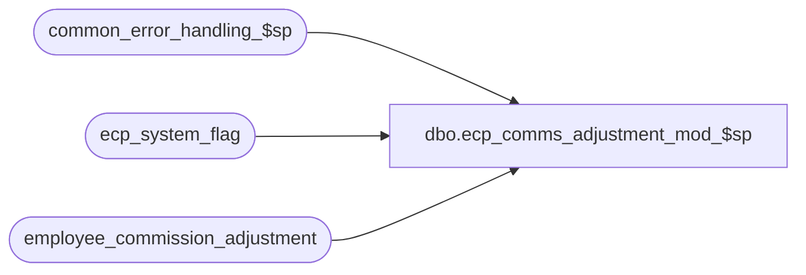

# dbo.ecp_comms_adjustment_mod_$sp

**Database:** auditworks_external  
**Server:** bedrockdb01  

## Architecture Diagram



## Table Dependencies

| Referenced Table |
|---|
| common_error_handling_$sp |
| ecp_system_flag |
| employee_commission_adjustment |

## Stored Procedure Code

```sql
create proc [dbo].[ecp_comms_adjustment_mod_$sp]   @commission_adj_id 		numeric(12,0),
  @adjustment_amount		money = null,
  @adjustment_description	nvarchar(255) = null,
  @adjustment_comment		nvarchar(1000) = null,
  @user_id 			int,
  @process_id 			binary(16) = NULL
AS 
--TODO:  audit-trail
/* 
Proc Name: ecp_comms_adjustment_mod_$sp 
Desc:   Called by UI to post modification to previous adjustment.

HISTORY:  
Date     Name           Def#    Desc
Apr14,11 Paul          126153   Use unicode datatypes
Apr01,08 Vicci          99476   Handle scenario when no export has ever occurred.
Feb08,08 Vicci          97975   Set errno not just message_id when raising business rule error
Apr02,07 Vicci		85597	Author
*/

SET NOCOUNT ON
DECLARE
  @errmsg                       nvarchar(255),
  @errno                        int,
  @message_id                   int,
  @object_name                  nvarchar(255),
  @operation_name               nvarchar(100),
  @process_name                 nvarchar(100),
  @process_no                   int,
  @rows				int,
  @stream_no                    tinyint,
  @employee_count		int,
  @sql_command 			nvarchar(3000),
  @entry_datetime 		datetime,
  @last_export_release_datetime datetime,
  @auto_rev_commission_adj_id 	numeric(12,0),
  @auto_rev_pay_pd_end_datetime datetime

SELECT @message_id = 201068,
       @operation_name = 'Unknown',
       @process_name = 'ecp_comms_adjustment_$sp',
       @process_no = 282,
       @stream_no = 1,
       @employee_count = 0,
       @entry_datetime = getdate()

SELECT @last_export_release_datetime = c.flag_datetime_value  --note, stored with time of 23:59:59
  FROM ecp_system_flag c
 WHERE flag_name = 'ecp_payperiod_export_datetime'  
SELECT @errno = @@error, @rows = @@rowcount
IF @errno <> 0
BEGIN
  SELECT @errmsg = 'Unable to determine last pay-period export release datetime',
         @object_name = 'ecp_system_flag',
         @operation_name = 'SELECT'
  GOTO error
END

SELECT @auto_rev_commission_adj_id = dst.commission_adj_id, 
       @auto_rev_pay_pd_end_datetime = src.auto_rev_pay_pd_end_datetime
  FROM employee_commission_adjustment src
       LEFT OUTER JOIN  employee_commission_adjustment dst
         ON src.entry_datetime = dst.entry_datetime
        AND src.auto_rev_pay_pd_end_datetime = dst.pay_period_end_datetime
        AND src.employee_no = dst.employee_no
        AND (src.auto_commission_adj_id = dst.auto_commission_adj_id
             OR (src.auto_commission_adj_id IS NULL AND dst.auto_commission_adj_id IS NULL))
        AND src.adjustment_description = dst.adjustment_description
 WHERE src.commission_adj_id = @commission_adj_id   
   AND src.auto_rev_pay_pd_end_datetime IS NOT NULL
   AND src.auto_rev_pay_pd_end_datetime > src.pay_period_end_datetime
SELECT @errno = @@error
IF @errno <> 0
BEGIN
  SELECT @errmsg = 'Unable to determine commission adjust id of auto-reversing entry',
         @object_name = 'employee_commission_adjustment',
         @operation_name = 'SELECT'
  GOTO error
END

IF @auto_rev_pay_pd_end_datetime IS NOT NULL AND @auto_rev_commission_adj_id IS NULL
BEGIN
  SELECT @message_id = 201684,
         @errno = 201684,
         @object_name = @process_name,
         @errmsg = 'Auto-reversal of entry being modified cannot be found'
  GOTO error
END

BEGIN TRANSACTION

UPDATE employee_commission_adjustment
   SET commission_adj_amount = IsNull(@adjustment_amount, commission_adj_amount),
       adjustment_description = IsNull(@adjustment_description, adjustment_description),
       adjustment_comment = IsNull(@adjustment_comment, adjustment_comment),
       user_id = IsNull(@user_id, user_id),
       entry_datetime = @entry_datetime
 WHERE commission_adj_id = @commission_adj_id
   AND (pay_period_end_datetime > @last_export_release_datetime OR @last_export_release_datetime IS NULL)
   AND (auto_rev_pay_pd_end_datetime > pay_period_end_datetime OR auto_rev_pay_pd_end_datetime IS NULL)
SELECT @errno = @@error, @rows = @@rowcount
IF @errno <> 0
BEGIN
  SELECT @errmsg = 'Unable to modify commission adjustment',
         @object_name = 'employee_commission_adjustment',
         @operation_name = 'UPDATE'
  GOTO error
END   
--SELECT @rows, @auto_rev_commission_adj_id
IF @rows = 1 AND @auto_rev_commission_adj_id IS NOT NULL 
BEGIN
  UPDATE employee_commission_adjustment
     SET commission_adj_amount = IsNull(@adjustment_amount * -1, commission_adj_amount),
         adjustment_description = IsNull(@adjustment_description, adjustment_description),
         adjustment_comment = IsNull(@adjustment_comment, adjustment_comment),
         user_id = IsNull(@user_id, user_id),
         entry_datetime = @entry_datetime
   WHERE commission_adj_id = @auto_rev_commission_adj_id
     AND (pay_period_end_datetime > @last_export_release_datetime OR @last_export_release_datetime IS NULL)
  SELECT @errno = @@error
  IF @errno <> 0
  BEGIN
    SELECT @errmsg = 'Unable to modify auto-reversal of commission adjustment',
           @object_name = 'employee_commission_adjustment',
           @operation_name = 'UPDATE'
    GOTO error
  END   
END

COMMIT

RETURN

error:
  EXEC common_error_handling_$sp @process_no, @errno, @errmsg, 0, @message_id, @process_name, @object_name, @operation_name, 1, @stream_no
  RETURN
```

