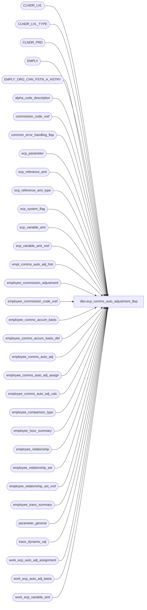

# dbo.ecp_comms_auto_adjustment_$sp

**Database:** auditworks_external  
**Server:** bedrockdb01  

## Architecture Diagram



## Table Dependencies

| Referenced Table |
|---|
| CLNDR_LVL |
| CLNDR_LVL_TYPE |
| CLNDR_PRD |
| EMPLY |
| EMPLY_ORG_CHN_PSTN_A_HSTRY |
| alpha_code_description |
| commission_code_xref |
| common_error_handling_$sp |
| ecp_parameter |
| ecp_reference_amt |
| ecp_reference_amt_type |
| ecp_system_flag |
| ecp_variable_amt |
| ecp_variable_amt_xref |
| empl_comms_auto_adj_hist |
| employee_commission_adjustment |
| employee_commission_code_xref |
| employee_comms_accum_basis |
| employee_comms_accum_basis_def |
| employee_comms_auto_adj |
| employee_comms_auto_adj_assign |
| employee_comms_auto_adj_calc |
| employee_comparison_type |
| employee_hour_summary |
| employee_relationship |
| employee_relationship_set |
| employee_relationship_set_xref |
| employee_trans_summary |
| parameter_general |
| trace_dynamic_sql |
| work_ecp_auto_adj_assignment |
| work_ecp_auto_adj_basis |
| work_ecp_variable_amt |

## Stored Procedure Code

```sql
create proc dbo.ecp_comms_auto_adjustment_$sp    @pay_period_close_date	datetime,
   @lowest_calendar_level	int,
   @lowest_calendar_level_id	binary(16),
   @ecp_clndr_id	        binary(16),
   @current_rows		int OUTPUT

AS
/* 

Proc Name: ecp_comms_auto_adjustment_$sp 
Desc:   Performs period-end auto-commission-adjustments.

HISTORY:  
Date     Name           Def#    Desc
Apr20,15 Vicci     TFS-113604   Support additional employee assignment methods in employee_comms_auto_adj_assign and correct logic 
                                for when the adjustment is unconditional not to append a closing parenthesis.
Jan05,14 Vicci      TFS-98349   Ensure precision beyond 2 decimal places is not lost when monetary datatypes are converted strings.
                                Also ensure that commission adjustments are rounded to 2 decimal places before being posted.
Dec08,14 Vicci      TFS-96392   Trace dynamic sql execution errors in trace_dynamic_sql table.  
                                Handle descriptions that have quotes in them.
                                Handle conditions that were not configured with parenthesis.
Mar27,14 Vicci         150958   Support unicode auto-adjustment descriptions and comments and handle large auto-adjust SQL.
Jul09,09 Vicci       BARN0709   Avoid logging null to employee_commission_adjustment selling area / position
Dec08,08 Vicci         104484   Log description of auto-adj calc
Dec02,08 Vicci         104484   Log variable amounts used in adjustment calculations to support score-card reporting.
Nov28,08 Vicci         104484   Support adjustments whose basis depends on a prior reference-amount adjustment.
Nov27,08 Vicci         104484   Handle reference amount adjustment postings (instead of just comms adj)
Oct09,08 Vicci         104484   Correct usage of work_ecp_auto_adj_basis:  since it was keyed on employee,
                                group totals were getting multiplied by the number of employees in each group!!
                                Support accumulation basis with reference-amount-type. 
Aug20,08 Vicci         103967   Support effective dates on relationship assignments.
Jul21,08 Vicci         103077	Support effective dates on home-store assignment.
                                Add support for selling_area_flag and transaction_store_no_flag in comparison types.
May14,08 Vicci         101197   Support effective dates for commission code assignments.
Nov26,07 Vicci          95521   Integrate properly with CRDM
Oct23,07 Vicci          85597   Support accumulation basis based on > 1 period and based on last year
Aug28,07 Vicci          85597   Take relationship effective date into account
May31,07 Vicci          85597   Take sign into account when calculating numerator/denominator target amounts
May15,07 Vicci		85597	Adding primary flag to selling-area/position lookup
Apr05,07 Vicci		85597	Author
*/

--07/28/2007 23:59:59, 3, 0x9F628804484A406A80E29137D9EBA0E9, 0xEED3B39217B4874898533F13737B0151

SET NOCOUNT ON
DECLARE
@adjustment_comment nvarchar(1000),
@prior_auto_reversal_flag tinyint,
@prior_custom_stored_proc_name nvarchar(30),
@auto_reversal_flag tinyint,
@auto_rev_except_calendr_level int,
@prior_auto_rev_except_cal_lvl int,
@auto_rev_except_datetime datetime,
@auto_rev_except_clndr_lvl_id binary(16),
@cond_count int,
@cnt nvarchar(10),
@from nvarchar(max),
@join nvarchar(max),
@where nvarchar(max),
@select nvarchar(max),
@adj nvarchar(max),
@adj_desc nvarchar(max),
@cond nvarchar(max),
@cond_desc nvarchar(max),
@description nvarchar(max),
@adj_hist_posting_datetime datetime, 
@auto_commission_adj_id	      numeric(5,0),
@auto_adjustment_description  nvarchar(255),
@custom_adjustment_flag	      tinyint,
@custom_stored_proc_name      nvarchar(30),
@prior_auto_commission_adj_id numeric(5,0),
@auto_commission_adj_line_id  numeric(12,0),
@adjustment_line_type	      nvarchar(10),
@adjustment_line_sequence     smallint,
@parenthesis_prefix	      nvarchar(20),
@comparison_type 	      smallint,
@accumulation_basis           smallint,
@constant_value               money,
@parenthesis_suffix	      nvarchar(20),
@operator		      nvarchar(3),
@prior_operator		      nvarchar(3),
@batch_datetime		      datetime,
@next_pay_period_datetime     datetime,
@cutoff_date 		      datetime,
@past_pd_cutoff_date 	      datetime,
@cursor_open		      tinyint,
@one_hundred		      money,
@min_start_date_ty	      datetime,
@min_start_date_ly	      datetime,
@errmsg                       nvarchar(255),
@errno           int,
@errno2                       int,
@message_id                   int,
@process_name                 nvarchar(100),
@process_no                   int,
@object_name                  nvarchar(255),
@operation_name               nvarchar(100),
@rows				int,
 @stream_no                    tinyint,
  @sql_command 			nvarchar(max),
  @sql_command_cond 		nvarchar(max),
  @sql_command_calc		nvarchar(max),
  @sql_command_ref 		nvarchar(max),
  @CLNDR_LVL_TYPE_ID		binary(16),
  @past_calendar_period_qty	smallint,
  @calendar_level		int,
  @CLNDR_LVL_SEQ       		smallint,
  @last_year_flag 		tinyint, 
  @pay_period_close_prd_num 	tinyint,
  @period_rank			smallint,
  @END_DATE_TIME		datetime,
  @reference_amount_type 	smallint,
  @post_zero_amt_flag		tinyint, 
 @trace_msg			nvarchar(255),
 @sa_company_no			int

SELECT @errno = 0,
       @message_id = 201068,
       @one_hundred = 100,
       @operation_name = 'Unknown',
       @process_name = 'ecp_comms_auto_adjustment_$sp',
       @process_no = 282,
       @stream_no = 1,
       @current_rows = 0,
       @batch_datetime = getdate() 

SELECT @sa_company_no = sa_company_no
  FROM parameter_general
SELECT @errno = @@error
IF @errno <> 0
BEGIN
  SELECT @errmsg = 'Unable to select S/A company number',
         @object_name = 'parameter_general',
         @operation_name = 'SELECT'
  GOTO error
END
IF @sa_company_no IS NULL 
  SELECT @sa_company_no = 1
       
IF @ecp_clndr_id IS NULL
BEGIN
SELECT @ecp_clndr_id = par_bin_value
  FROM ecp_parameter p
 WHERE par_name = 'ecp_dflt_clndr_id'  
SELECT @errno = @@error
IF @errno <> 0
BEGIN
  SELECT @errmsg = 'Unable to which calendar to use',
        @object_name = 'ecp_parameter',
         @operation_name = 'SELECT'
  GOTO error
END

SELECT @lowest_calendar_level = CLNDR_LVL_TYPE_IDNTY, 
       @lowest_calendar_level_id = CLNDR_LVL_TYPE_ID
  FROM CLNDR_LVL_TYPE
 WHERE CLNDR_LVL_SEQ = (SELECT MAX(CLNDR_LVL_SEQ)
			  FROM CLNDR_LVL_TYPE
			 WHERE CLNDR_LVL_TYPE_ID
			    IN (SELECT DISTINCT CLNDR_LVL_TYPE_ID
                                  FROM CLNDR_LVL
        WHERE CLNDR_ID = @ecp_clndr_id))
   AND CLNDR_LVL_TYPE_ID
    IN (SELECT DISTINCT CLNDR_LVL_TYPE_ID
          FROM CLNDR_LVL
         WHERE CLNDR_ID = @ecp_clndr_id)
SELECT @errno = @@error
IF @errno <> 0
BEGIN
  SELECT @errmsg = 'Unable to which calendar level to use for employee transaction logging',
         @object_name = 'CLNDR_LVL_TYPE',
         @operation_name = 'SELECT'
  GOTO error
END
END --IF @ecp_clndr_id IS NULL

CREATE TABLE #work_ecp_auto_adj_basis(
       comparison_type 	            smallint not null, 
       accumulation_basis           smallint null,
       accumulation_basis_column    nvarchar(30) null, 
       comp_primary_position        nvarchar(4) null,
       comp_primary_selling_area_no int null,
       comp_home_store_no           int null,
       comp_employee_no              int null,
       comp_employee_group_code     nvarchar(20) null,
       ct_relationship_type         nvarchar(20) null, 
       ct_relationship_position     nvarchar(4) null,
       basis_calendar_level         smallint null,  
       basis_CLNDR_LVL_TYPE_ID      binary(16) null,
       basis_CLNDR_LVL_SEQ	    smallint null,
       comp_transaction_store_no    int null,
      comp_selling_area_group 	    int null,
       basis_reference_amount_type  smallint null )
SELECT @errno = @@error
IF @errno <> 0
BEGIN
  SELECT @errmsg = 'Failed to create table to list auto-commission-adjustments bases',
         @object_name = '#work_ecp_auto_adj_basis',
         @operation_name = 'CREATE'
  GOTO error
END
CREATE index #work_ecp_auto_adj_basis_x0 on #work_ecp_auto_adj_basis (accumulation_basis_column)

CREATE TABLE #active_empl_comms_auto_adj(
       auto_commission_adj_id	      numeric(5,0) not null,
       auto_adjustment_description    nvarchar(255) not null,
       adjustment_comment	      nvarchar(1000) null,
       adjustment_sequence	      smallint null,
       auto_reversal_flag	      tinyint not null,
       auto_rev_except_calendr_level  smallint null,  
       custom_adjustment_flag	      tinyint not null, 
       custom_stored_proc_name	      nvarchar(30) null,
       reference_amount_type          smallint null,
       post_zero_amt_flag	      tinyint not null,
       adjustment_calendar_level      smallint not null,
       max_ecc			      nvarchar(20) not null)
SELECT @errno = @@error
IF @errno <> 0
BEGIN
  SELECT @errmsg = 'Failed to create table to list active assigned auto-commission-adjustments to be processed',
         @object_name = '#active_empl_comms_auto_adj',
         @operation_name = 'CREATE'
  GOTO error
END

CREATE TABLE #auto_adj_calc_line(
       auto_commission_adj_id	      numeric(5,0) not null,
       auto_adjustment_description    nvarchar(255) not null,
       adjustment_comment	      nvarchar(1000) null,
       adjustment_sequence	      smallint null,
       auto_reversal_flag	      tinyint not null,
       auto_rev_except_calendr_level  smallint null,  
       custom_adjustment_flag	      tinyint not null, 
       custom_stored_proc_name	      nvarchar(30) null,
       adjustment_line_type	      nvarchar(10) not null,
       adjustment_line_sequence       smallint null,
       parenthesis_prefix	      nvarchar(20) not null,
       comparison_type 	              smallint null, 
       accumulation_basis     	      smallint null,
       constant_value                 money null,
       parenthesis_suffix	      nvarchar(20) not null,
       operator		              nvarchar(3) not null,
       accumulation_basis_column      nvarchar(30) null,
       basis_calendar_level	      smallint null,
       basis_CLNDR_LVL_TYPE_ID	      binary(16) null,
       basis_CLNDR_LVL_SEQ	      smallint null,
       basis_last_year_flag	      tinyint not null,
       basis_calendar_period_quantity smallint not null,
       basis_reference_amount_type    smallint null,
       primary_position_flag          tinyint null,
       primary_selling_area_no_flag   tinyint null,
       transaction_store_no_flag      tinyint null,
       relationship_type              nvarchar(20) null,
       relationship_position          nvarchar(4) null, 
       selling_area_no                nvarchar(3272) null,
       primary_position               nvarchar(3272) null, 
       employee_no_flag               tinyint null,
       home_store_no_flag	      tinyint null,
       selling_area_flag              tinyint null,
       reference_amount_type          smallint null,
       post_zero_amt_flag	      tinyint not null,
       max_ecc			      nvarchar(20) not null)
SELECT @errno = @@error
IF @errno <> 0
BEGIN
  SELECT @errmsg = 'Failed to create table to list auto-commission-adjustments to be processed',
         @object_name = '#auto_adj_calc_line',
         @operation_name = 'CREATE'
  GOTO error
END

CREATE TABLE #ecp_auto_adj_variable_xref(
       auto_commission_adj_id	    numeric(5,0) not null,
       employee_no                  int not null,
       comparison_type 	            smallint not null, 
       accumulation_basis           smallint null,
       accumulation_basis_column    nvarchar(30) null, 
       comp_primary_position        nvarchar(4) null,
       comp_primary_selling_area_no int null,
       comp_home_store_no           int null,
       comp_employee_no              int null,
       comp_employee_group_code     nvarchar(20) null,
       ct_relationship_type         nvarchar(20) null, 
       ct_relationship_position     nvarchar(4) null,
       basis_calendar_level         smallint null,  
       basis_CLNDR_LVL_TYPE_ID      binary(16) null,
       basis_CLNDR_LVL_SEQ	    smallint null,
       comp_transaction_store_no    int null,
       comp_selling_area_group 	    int null,
       basis_reference_amount_type  smallint null )
SELECT @errno = @@error
IF @errno <> 0
BEGIN
  SELECT @errmsg = 'Failed to create table to list auto-commission-adjustments bases relevant to each employee/auto-adj',
         @object_name = '#ecp_auto_adj_variable_xref',
         @operation_name = 'CREATE'
  GOTO error
END

--Build list of active assigned auto-adjustments to be run and whether their assignment is limited by employee commission code selection
INSERT #active_empl_comms_auto_adj
SELECT a.auto_commission_adj_id,
       a.auto_adjustment_description,
       a.adjustment_comment,
       a.adjustment_sequence,
       a.auto_reversal_flag,
       a.auto_rev_except_calendr_level,
       a.custom_adjustment_flag,
       a.custom_stored_proc_name,
       a.reference_amount_type,
       a.post_zero_amt_flag,
       a.adjustment_calendar_level, 
       max(aa.employee_commission_code) max_ecc
  FROM employee_comms_auto_adj a
       INNER JOIN employee_comms_auto_adj_assign aa
          ON a.auto_commission_adj_id = aa.auto_commission_adj_id
 WHERE a.active_flag = 1
 GROUP BY a.auto_commission_adj_id,
       a.auto_adjustment_description, 
       a.adjustment_comment,
       a.adjustment_sequence,
       a.auto_reversal_flag,
       a.auto_rev_except_calendr_level,
       a.custom_adjustment_flag,
       a.custom_stored_proc_name,
       a.reference_amount_type,
       a.post_zero_amt_flag,
       a.adjustment_calendar_level
SELECT @errno = @@error
IF @errno <> 0
BEGIN
  SELECT @errmsg = 'Failed to list active assigned auto-commission-adjustments to be processed',
         @object_name = '#active_empl_comms_auto_adj',
         @operation_name = 'INSERT'
  GOTO error
END

--Build list of auto-adjustments to be run and their criteria
INSERT #auto_adj_calc_line
SELECT a.auto_commission_adj_id,
       a.auto_adjustment_description,
       a.adjustment_comment,
       a.adjustment_sequence,
       a.auto_reversal_flag,
       a.auto_rev_except_calendr_level,
       a.custom_adjustment_flag,
       a.custom_stored_proc_name,
       IsNull(c.adjustment_line_type, 'CUSTOM'),
       IsNull(c.adjustment_line_sequence, 1), 
       IsNull(c.parenthesis_prefix, ''),
       c.comparison_type,
       c.accumulation_basis,
       c.constant_value,
       IsNull(c.parenthesis_suffix, ''), 
       IsNull(c.operator, ''), 
       ab.accumulation_basis_column, 
       CASE WHEN ab.accumulation_basis_column = 'reference_amount' 
            THEN IsNull(ab.calendar_level, @lowest_calendar_level)
            ELSE ab.calendar_level 
       END as basis_calendar_level,
       cltb.CLNDR_LVL_TYPE_ID as basis_CLNDR_LVL_TYPE_ID,
       cltb.CLNDR_LVL_SEQ as basis_CLNDR_LVL_SEQ,
       IsNull(ab.last_year_flag, 0) as basis_last_year_flag, 
       IsNull(ab.calendar_period_quantity, 1) as basis_calendar_period_quantity, 
       ab.reference_amount_type as basis_reference_amount_type,
       ct.primary_position_flag,
       ct.primary_selling_area_no_flag,
       ct.transaction_store_no_flag,
       ct.relationship_type,
       ct.relationship_position,
       ct.selling_area_no,
       ct.primary_position,
       ct.employee_no_flag,
       ct.home_store_no_flag,
       ct.selling_area_flag,
       a.reference_amount_type,
       a.post_zero_amt_flag,
       a.max_ecc   
  FROM #active_empl_comms_auto_adj a
   LEFT OUTER JOIN employee_comms_auto_adj_calc c  --outer to support custom procs
          ON a.auto_commission_adj_id = c.auto_commission_adj_id
       INNER JOIN CLNDR_LVL_TYPE clt
          ON a.adjustment_calendar_level = clt.CLNDR_LVL_TYPE_IDNTY
       INNER JOIN CLNDR_PRD cp
          ON dateadd(ss, 1, @pay_period_close_date) = cp.END_DATE_TIME
         AND @ecp_clndr_id = cp.CLNDR_ID
         AND clt.CLNDR_LVL_TYPE_ID = cp.CLNDR_LVL_TYPE_ID
       LEFT OUTER JOIN employee_comms_accum_basis_def ab
          ON c.accumulation_basis = ab.accumulation_basis
       LEFT OUTER JOIN CLNDR_LVL_TYPE cltb
          ON CASE WHEN ab.accumulation_basis_column = 'reference_amount' 
                  THEN IsNull(ab.calendar_level, @lowest_calendar_level)
                  ELSE ab.calendar_level 
             END  = cltb.CLNDR_LVL_TYPE_IDNTY
       LEFT OUTER JOIN employee_comparison_type ct
          ON c.comparison_type = ct.comparison_type
SELECT @errno = @@error
IF @errno <> 0
BEGIN
  SELECT @errmsg = 'Failed to list auto-commission-adjustments to be processed',
         @object_name = '#auto_adj_calc_line',
         @operation_name = 'INSERT'
  GOTO error
END

CREATE TABLE #select_calendar_level(
 CLNDR_LVL_TYPE_ID binary(16) NOT NULL, 
 calendar_level smallint NOT NULL, 
 CLNDR_LVL_SEQ smallint NOT NULL,
 max_CLNDR_PRD_NUM smallint null,
 last_year_flag tinyint not null,
 past_calendar_period_quantity smallint not null)
SELECT @errno = @@error
IF @errno <> 0
BEGIN
  SELECT @errmsg = 'Failed to create temp table to hold list of selected calendar levels',
         @object_name = '#select_calendar_level',
       @operation_name = 'CREATE'
  GOTO error
END

INSERT into #select_calendar_level(CLNDR_LVL_TYPE_ID, calendar_level, CLNDR_LVL_SEQ, 
       last_year_flag, past_calendar_period_quantity)
SELECT basis_CLNDR_LVL_TYPE_ID, 
       basis_calendar_level, 
       basis_CLNDR_LVL_SEQ,
       basis_last_year_flag, 
       max(basis_calendar_period_quantity)
  FROM #auto_adj_calc_line
 WHERE basis_calendar_level IS NOT NULL
 GROUP BY basis_CLNDR_LVL_TYPE_ID, 
       basis_calendar_level, 
       basis_CLNDR_LVL_SEQ,
       basis_last_year_flag
SELECT @errno = @@error
IF @errno <> 0
BEGIN
  SELECT @errmsg = 'Unable to build list of calendar levels to use',
         @object_name = '#select_calendar_level',
         @operation_name = 'INSERT'
  GOTO error
END

SELECT @past_calendar_period_qty = max(past_calendar_period_quantity)
  FROM #select_calendar_level
SELECT @errno = @@error
IF @errno <> 0
BEGIN
  SELECT @errmsg = 'Unable to determine how many past periods to retrieve',
         @object_name = '#select_calendar_level',
         @operation_name = 'SELECT'
  GOTO error
END
  
UPDATE #select_calendar_level
   SET max_CLNDR_PRD_NUM = q.max_CLNDR_PRD_NUM
  FROM (SELECT CLNDR_LVL_TYPE_ID, max(c.CLNDR_PRD_NUM) max_CLNDR_PRD_NUM
          FROM CLNDR_PRD c
         WHERE CLNDR_ID = @ecp_clndr_id
   GROUP BY CLNDR_LVL_TYPE_ID) q
 WHERE #select_calendar_level.CLNDR_LVL_TYPE_ID = q.CLNDR_LVL_TYPE_ID
SELECT @errno = @@error
IF @errno <> 0
BEGIN
  SELECT @errmsg = 'Failed to set highest period number existing for each selected calendar level',
  @object_name = '#select_calendar_level',
         @operation_name = 'UPDATE'
  GOTO error
END

CREATE TABLE #select_calendar_period(
       CLNDR_LVL_TYPE_ID binary(16) NOT NULL, 
       calendar_level smallint NOT NULL, 
       CLNDR_LVL_SEQ smallint NOT NULL,
       period_start_datetime datetime not null,
       period_end_datetime datetime not null,
       add_subtract_flag money not null,
       amt_calendar_level smallint NOT NULL, --lowest selected level in case of of amounts being reversed since occurring after the to date
       amt_period_end_datetime datetime not null,  --of lowest selected level in case of of amounts being reversed since occurring after the to date
       last_year_flag smallint default 0 not null,  --0=TY, 1=LY, 2=LY not found
       period_rank smallint DEFAULT 1 not null)  --rank in past X periods
SELECT @errno = @@error
IF @errno <> 0
BEGIN
  SELECT @errmsg = 'Failed to create temp table to hold list of selected calendar periods',
         @object_name = '#select_calendar_period',
         @operation_name = 'CREATE'
  GOTO error
END

DECLARE last_year_flag_cursor CURSOR
 FOR
  SELECT DISTINCT last_year_flag
    FROM #select_calendar_level

OPEN last_year_flag_cursor
SELECT @cursor_open = 4

FETCH last_year_flag_cursor
 INTO @last_year_flag

WHILE @@fetch_status = 0 
BEGIN
  IF @last_year_flag = 1
  BEGIN
    SELECT @pay_period_close_prd_num = CLNDR_PRD_NUM
      FROM CLNDR_PRD c
     WHERE c.CLNDR_ID = @ecp_clndr_id
       AND c.CLNDR_LVL_TYPE_ID = @lowest_calendar_level_id
       AND c.END_DATE_TIME = dateadd(ss, 1, @pay_period_close_date)

    SELECT @cutoff_date = NULL

    SELECT @cutoff_date = MAX(dateadd(ss, -1, c.END_DATE_TIME))
      FROM CLNDR_PRD c
     WHERE c.CLNDR_ID = @ecp_clndr_id
       AND c.CLNDR_LVL_TYPE_ID = @lowest_calendar_level_id
       AND c.END_DATE_TIME < dateadd(ss, 1, @pay_period_close_date)
       AND c.CLNDR_PRD_NUM = @pay_period_close_prd_num
     
    IF @cutoff_date IS NULL 
       AND @pay_period_close_prd_num = (SELECT max(c.CLNDR_PRD_NUM)
                                          FROM CLNDR_PRD c
     WHERE c.CLNDR_ID = @ecp_clndr_id
                                           AND c.CLNDR_LVL_TYPE_ID = @lowest_calendar_level_id)
    BEGIN
      SELECT @cutoff_date = MAX(dateadd(ss, -1, c.END_DATE_TIME))
        FROM CLNDR_PRD c
       WHERE c.CLNDR_ID = @ecp_clndr_id
         AND c.CLNDR_LVL_TYPE_ID = @lowest_calendar_level_id
         AND c.END_DATE_TIME < dateadd(ss, 1, @pay_period_close_date)
         AND c.CLNDR_PRD_NUM = 1
    END
  END
  ELSE
  BEGIN
    SELECT @cutoff_date = @pay_period_close_date
  END

  -- to handle levels ending after the closed date from which post-close-date data is to be deducted
  INSERT into #select_calendar_period(
         CLNDR_LVL_TYPE_ID, calendar_level, CLNDR_LVL_SEQ,
         period_start_datetime, period_end_datetime, 
         add_subtract_flag, amt_calendar_level, amt_period_end_datetime, last_year_flag)
  SELECT sc.CLNDR_LVL_TYPE_ID, sc.calendar_level, sc.CLNDR_LVL_SEQ,
         c.STRT_DATE_TIME, dateadd(ss, -1, c.END_DATE_TIME), 
         1, sc.calendar_level, dateadd(ss, -1, c.END_DATE_TIME), @last_year_flag
    FROM #select_calendar_level sc 
         INNER JOIN CLNDR_PRD c
            ON c.CLNDR_ID = @ecp_clndr_id
           AND sc.CLNDR_LVL_TYPE_ID = c.CLNDR_LVL_TYPE_ID
           AND c.END_DATE_TIME > dateadd(ss, 1, @cutoff_date)
           AND c.STRT_DATE_TIME < dateadd(ss, 1, @cutoff_date)
   WHERE sc.last_year_flag = @last_year_flag
  SELECT @errno = @@error, @rows = @@rowcount
  IF @errno <> 0
  BEGIN
    SELECT @errmsg = 'Failed to determine if there are periods such as YTD ending after the as of date to be included',
           @object_name = '#select_calendar_period',
           @operation_name = 'INSERT'
    GOTO error
  END

  IF @rows > 0
  BEGIN
    INSERT into #select_calendar_period(
           CLNDR_LVL_TYPE_ID, calendar_level, CLNDR_LVL_SEQ, 
           period_start_datetime, period_end_datetime,
    add_subtract_flag, amt_calendar_level, amt_period_end_datetime,
           last_year_flag)
    SELECT sc.CLNDR_LVL_TYPE_ID, sc.calendar_level, sc.CLNDR_LVL_SEQ, 
           sc.period_start_datetime, sc.period_end_datetime, 
           -1, @lowest_calendar_level, dateadd(ss, -1, c.END_DATE_TIME), 
            @last_year_flag
      FROM #select_calendar_period sc 
   INNER JOIN CLNDR_PRD c
              ON c.CLNDR_ID = @ecp_clndr_id
             AND c.CLNDR_LVL_TYPE_ID = @lowest_calendar_level_id
             AND c.END_DATE_TIME > dateadd(ss, 1, @cutoff_date)
   AND c.END_DATE_TIME <= dateadd(ss, 1, sc.period_end_datetime)
             AND c.STRT_DATE_TIME < getdate()
     WHERE sc.last_year_flag = @last_year_flag
    SELECT @errno = @@error                    
    IF @errno <> 0
    BEGIN
      SELECT @errmsg = 'Failed to subtract amounts contributed after the as-of date to the YTD',
             @object_name = '#select_calendar_period',
             @operation_name = 'INSERT'
      GOTO error
    END
  END  --IF @rows > 0, i.e. if as-of date before end of period selected

  INSERT into #select_calendar_period(
         CLNDR_LVL_TYPE_ID, calendar_level, CLNDR_LVL_SEQ, 
         period_start_datetime, period_end_datetime, 
         add_subtract_flag, amt_calendar_level, amt_period_end_datetime, 
         last_year_flag)
  SELECT sc.CLNDR_LVL_TYPE_ID, sc.calendar_level, sc.CLNDR_LVL_SEQ, 
         c.STRT_DATE_TIME, dateadd(ss, -1, c.END_DATE_TIME),
         1, sc.calendar_level, dateadd(ss, -1, c.END_DATE_TIME),
         @last_year_flag
    FROM #select_calendar_level sc 
         INNER JOIN CLNDR_PRD c
            ON c.CLNDR_ID = @ecp_clndr_id
           AND sc.CLNDR_LVL_TYPE_ID = c.CLNDR_LVL_TYPE_ID
           AND c.END_DATE_TIME = dateadd(ss, 1, @cutoff_date)  
   WHERE sc.last_year_flag = @last_year_flag    
  SELECT @errno = @@error
  IF @errno <> 0
  BEGIN
    SELECT @errmsg = 'Failed to list periods falling in list selected',
           @object_name = '#select_calendar_period',
           @operation_name = 'INSERT'
    GOTO error
  END
   
  DECLARE past_x_period_cursor CURSOR
      FOR
   SELECT CLNDR_LVL_TYPE_ID, past_calendar_period_quantity, calendar_level, CLNDR_LVL_SEQ
     FROM #select_calendar_level
    WHERE past_calendar_period_quantity > 1
      AND last_year_flag = @last_year_flag    
   
  OPEN past_x_period_cursor
  SELECT @cursor_open = 3
   
  FETCH past_x_period_cursor
   INTO @CLNDR_LVL_TYPE_ID,
        @past_calendar_period_qty,
        @calendar_level,
        @CLNDR_LVL_SEQ
   
  WHILE @@fetch_status = 0
  BEGIN
    SELECT @period_rank = 2, 
           @past_pd_cutoff_date = @cutoff_date
    
    WHILE @period_rank <= @past_calendar_period_qty
    BEGIN
      SELECT @END_DATE_TIME = max(c.END_DATE_TIME)
        FROM CLNDR_PRD c
       WHERE c.CLNDR_LVL_TYPE_ID = @CLNDR_LVL_TYPE_ID
         AND c.CLNDR_ID = @ecp_clndr_id
         AND c.END_DATE_TIME < dateadd(ss, 1, @past_pd_cutoff_date)
      SELECT @errno = @@error
      IF @errno <> 0
      BEGIN
        SELECT @errmsg = 'Failed to determine next oldest period to post',
               @object_name = 'CLNDR_PRD',
               @operation_name = 'SELECT'
        GOTO error
      END

      IF @END_DATE_TIME IS NULL BREAK      
   
      INSERT into #select_calendar_period(
             CLNDR_LVL_TYPE_ID, calendar_level, CLNDR_LVL_SEQ, 
             period_start_datetime, period_end_datetime, 
             add_subtract_flag, amt_calendar_level, amt_period_end_datetime, 
             last_year_flag, period_rank)
      SELECT @CLNDR_LVL_TYPE_ID, @calendar_level, @CLNDR_LVL_SEQ, 
             c.STRT_DATE_TIME, dateadd(ss, -1, c.END_DATE_TIME), 
             1, @calendar_level, dateadd(ss, -1, c.END_DATE_TIME), 
             @last_year_flag, @period_rank
        FROM CLNDR_PRD c
       WHERE c.CLNDR_LVL_TYPE_ID = @CLNDR_LVL_TYPE_ID
         AND c.CLNDR_ID = @ecp_clndr_id
         AND c.END_DATE_TIME = @END_DATE_TIME        
      SELECT @errno = @@error
      IF @errno <> 0
   BEGIN
        SELECT @errmsg = 'Failed to list periods falling in past-X periods selected',
               @object_name = '#select_calendar_period',
             @operation_name = 'INSERT'
        GOTO error
      END
     
     SELECT @period_rank = @period_rank + 1,
             @past_pd_cutoff_date = dateadd(ss, -1, @END_DATE_TIME)

    END -- while @period_rank <= @past_calendar_period_qty 

    FETCH past_x_period_cursor
     INTO @CLNDR_LVL_TYPE_ID,
          @past_calendar_period_qty,
          @calendar_level,
          @CLNDR_LVL_SEQ
  END -- while not end of past_x_period_cursor 

  CLOSE past_x_period_cursor
  DEALLOCATE past_x_period_cursor 
  SELECT @cursor_open = 4

  FETCH last_year_flag_cursor
  INTO @last_year_flag
END -- while not end of last_year_flag_cursor 

CLOSE last_year_flag_cursor
DEALLOCATE last_year_flag_cursor 
SELECT @cursor_open = 0
  
--select 'TestAccumBasisCalendarPeriods'
--select 'TestAccumBasisCalendarPeriods', * from #select_calendar_period

CREATE TABLE #comp_selling_area(comparison_type smallint not null, selling_area_no int not null)
IF @errno <> 0
BEGIN
  SELECT @errmsg = 'Failed to table to hold list of comparison basis selling areas',
         @object_name = '#comp_selling_area',
         @operation_name = 'CREATE'
  GOTO error
END

INSERT #comp_selling_area(comparison_type, selling_area_no)
SELECT DISTINCT comparison_type, -1
  FROM #auto_adj_calc_line 
 WHERE comparison_type IS NOT NULL
   AND (selling_area_no IS NULL OR selling_area_no = -1) 
IF @errno <> 0
BEGIN
  SELECT @errmsg = 'Failed to list comparison types where selling area is n/a with a selling area set to All',
         @object_name = '#comp_selling_area',
         @operation_name = 'INSERT'
  GOTO error
END
 
DECLARE processing_cursor CURSOR
    FOR
 SELECT 'INSERT #comp_selling_area(comparison_type, selling_area_no)
         SELECT DISTINCT ' + convert(nvarchar, ct.comparison_type) + ', f.FNCTN_NUM
           FROM ORG_CHN_LOC_FNCTN f
          WHERE f.SYS_CODE = ''DISP''
            AND f.FNCTN_NUM IN (' + ct.selling_area_no + ')'
   FROM #auto_adj_calc_line ct
  WHERE comparison_type IS NOT NULL
    AND selling_area_no IS NOT NULL
    AND selling_area_no <> -1
IF @errno <> 0
BEGIN
  SELECT @errmsg = 'Failed to declare cursor to list selling area restrictions applicable to each comparison type',
         @object_name = 'processing_cursor',
         @operation_name = 'DECLARE'
  GOTO error
END

OPEN processing_cursor
SELECT @cursor_open = 1

FETCH processing_cursor
 INTO @sql_command

WHILE @@fetch_status = 0  
BEGIN
  EXEC sp_executesql @sql_command, N'@errno int OUT', @errno OUT              
  IF @errno <> 0
  BEGIN
    PRINT ':LOG ' + @sql_command    
    SELECT @errmsg = 'Failed to list selling area restrictions applicable to each comparison type via dynamic SQL.    See trace_dynamic_sql table for details.',
           @object_name = '#comp_selling_area',
           @operation_name = 'INSERT'
    INSERT INTO trace_dynamic_sql (process_name, sql_command, errmsg, object_name, operation_name)
    VALUES (@process_name, @sql_command, @errmsg, @object_name, @operation_name)
    GOTO error
  END
	
  FETCH processing_cursor
  INTO @sql_command
END -- while not end of cursor

CLOSE processing_cursor 
DEALLOCATE processing_cursor 
SELECT @cursor_open = 0

SELECT @next_pay_period_datetime = dateadd(ss, -1, MIN(cp.END_DATE_TIME))
  FROM CLNDR_PRD cp
 WHERE cp.STRT_DATE_TIME > @pay_period_close_date
   AND cp.CLNDR_ID = @ecp_clndr_id
   AND cp.CLNDR_LVL_TYPE_ID = @lowest_calendar_level_id
SELECT @errno = @@error, @rows = @@rowcount
IF @errno <> 0
BEGIN
  SELECT @errmsg = 'Unable to determine into which period auto-reversals should be made',
         @object_name = 'CLNDR_PRD',
     @operation_name = 'SELECT'
  GOTO error
END
IF @rows < 1
BEGIN
  SELECT @message_id = 201612,
         @errno = 201612,
         @object_name = 'CLNDR_PRD',
         @operation_name = 'SELECT',
         @errmsg = 'Calendar definition does not extend sufficiently far in the future'
  GOTO error
END

CREATE TABLE #comp_primary_position(comparison_type smallint not null, primary_position nvarchar(4) not null) 
IF @errno <> 0
BEGIN
 SELECT @errmsg = 'Failed to table to hold list of comparison basis primary positions',
        @object_name = '#comp_primary_position',
@operation_name = 'CREATE'
  GOTO error
END

INSERT #comp_primary_position(comparison_type, primary_position)
SELECT DISTINCT comparison_type, '-1'
  FROM #auto_adj_calc_line 
 WHERE comparison_type IS NOT NULL
   AND (primary_position IS NULL OR primary_position = '-1')
IF @errno <> 0
BEGIN
  SELECT @errmsg = 'Failed to list comparison types where primary_position is n/a with a primary_position set to All',
         @object_name = '#comp_primary_position',
         @operation_name = 'INSERT'
  GOTO error
END
 
DECLARE processing_cursor CURSOR
    FOR
 SELECT 'INSERT #comp_primary_position(comparison_type, primary_position)
         SELECT DISTINCT ' + convert(nvarchar, ct.comparison_type) + ', pp.PSTN_CODE
           FROM ORG_CHN_PSTN pp
          WHERE PSTN_CODE in (' + ct.primary_position + ')'
   FROM #auto_adj_calc_line ct 
  WHERE comparison_type IS NOT NULL
    AND primary_position IS NOT NULL
    AND primary_position <> '-1'
IF @errno <> 0
BEGIN
  SELECT @errmsg = 'Failed to declare cursor to list primary_position restrictions applicable to each comparison type',
         @object_name = 'processing_cursor',
         @operation_name = 'DECLARE'
  GOTO error
END

OPEN processing_cursor
SELECT @cursor_open = 1

FETCH processing_cursor
 INTO @sql_command

WHILE @@fetch_status = 0 
BEGIN
  EXEC sp_executesql @sql_command, N'@errno int OUT', @errno OUT              
  SELECT @errno2 = @@error
  IF @errno <> 0
  BEGIN
    PRINT ':LOG ' + @sql_command    
    SELECT @errmsg = 'Failed to list primary_position restrictions applicable to each comparison type via dynamic SQL.  See trace_dynamic_sql table for details.',
           @object_name = '#comp_primary_position',
           @operation_name = 'INSERT'
    INSERT INTO trace_dynamic_sql (process_name, sql_command, errmsg, object_name, operation_name)
    VALUES (@process_name, @sql_command, @errmsg, @object_name, @operation_name)
    GOTO error
  END
  ELSE
  BEGIN
    SELECT @errno = @errno2
    IF @errno <> 0
    BEGIN
      PRINT ':LOG ' + @sql_command    
      SELECT @errmsg = 'Failed to list primary_position restrictions applicable to each comparison type via dynamic SQL.  See trace_dynamic_sql table for details.',
             @object_name = '#comp_primary_position',
             @operation_name = 'INSERT'
      INSERT INTO trace_dynamic_sql (process_name, sql_command, errmsg, object_name, operation_name)
      VALUES (@process_name, @sql_command, @errmsg, @object_name, @operation_name)
      GOTO error
    END
  END

  FETCH processing_cursor
  INTO @sql_command
END -- while not end of cursor

CLOSE processing_cursor
DEALLOCATE processing_cursor 
SELECT @cursor_open = 0 

TRUNCATE TABLE work_ecp_auto_adj_assignment
SELECT @errno = @@error
IF @errno <> 0
BEGIN
  SELECT @errmsg = 'Failed to clean up list of employees for whom auto-commission-adjustments are to be processed',
         @object_name = 'work_ecp_auto_adj_assignment',
         @operation_name = 'CREATE'
  GOTO error
END

--Determine who is a candidate to receive each auto-adjustment.  
--Candidates include:  -employees specifically selected (regardless of other criteria)
--                     -employees who meet BOTH Employee Commission Code AND Home Store (specifically selected store# or part of Home Store Commission Code list) criteria. 
INSERT into work_ecp_auto_adj_assignment(  
       auto_commission_adj_id,
       employee_no,
       home_store_no,
       primary_position,
       primary_selling_area_no)
SELECT aa.auto_commission_adj_id,
       em.EMPLY_NUM employee_no, 
       MAX(IsNull(ep.ORG_CHN_NUM, em.PRMY_ORG_CHN_NUM)) home_store_no,
       CASE WHEN MAX(COALESCE(ep.PSTN_CODE, '-2')) = '-2' THEN NULL ELSE MAX(COALESCE(ep.PSTN_CODE, '-2')) END primary_position, 
       CASE WHEN MAX(COALESCE(ep.PRMRY_DISP_FNCTN_NUM, -2)) = -2 THEN NULL ELSE MAX(COALESCE(ep.PRMRY_DISP_FNCTN_NUM, -2)) END primary_selling_area_no
  FROM (SELECT auto_commission_adj_id, max_ecc FROM #active_empl_comms_auto_adj) a
       INNER JOIN employee_comms_auto_adj_assign aa
          ON a.auto_commission_adj_id = aa.auto_commission_adj_id
       LEFT OUTER JOIN employee_commission_code_xref ec
          ON aa.employee_commission_code = ec.employee_commission_code                
         AND @pay_period_close_date >= ec.effective_from_date
         AND (@pay_period_close_date <= ec.effective_to_date OR ec.effective_to_date IS NULL)
       INNER JOIN EMPLY em
          ON     (aa.employee_no = -1 AND aa.employee_commission_code = '-1')
              OR COALESCE(ec.employee_no, aa.employee_no) = em.EMPLY_NUM
        LEFT OUTER JOIN EMPLY_ORG_CHN_PSTN_A_HSTRY ep
          ON ep.PRMRY_LOC_A = 1
         AND em.EMPLY_NUM = ep.EMPLY_NUM   
         AND @pay_period_close_date >= ep.EFCTV_DATE
         AND (@pay_period_close_date < ep.EXPRTN_DATE OR ep.EXPRTN_DATE IS NULL)
         AND (   aa.home_store_no = -1
              OR aa.home_store_no = IsNull(ep.ORG_CHN_NUM, em.PRMY_ORG_CHN_NUM))
       LEFT OUTER JOIN commission_code_xref sc
         ON IsNull(ep.ORG_CHN_NUM, em.PRMY_ORG_CHN_NUM) = sc.lookup_value
        AND sc.lookup_type = 'STORE'
        AND @pay_period_close_date >= sc.effective_from_date
        AND (@pay_period_close_date <= sc.effective_to_date OR sc.effective_to_date IS NULL)
        AND aa.home_store_commission_code = sc.commission_code
       LEFT OUTER JOIN commission_code_xref scd
         ON sc.lookup_type = 'CMP'
        AND scd.lookup_value = @sa_company_no
        AND @pay_period_close_date >= scd.effective_from_date
        AND (@pay_period_close_date <= scd.effective_to_date OR scd.effective_to_date IS NULL)
        AND sc.commission_code IS NULL  --i.e. don't pick up default unless no store-level commission code override exists
        AND aa.home_store_commission_code = scd.commission_code
 GROUP BY aa.auto_commission_adj_id,
       a.max_ecc,
       em.EMPLY_NUM
HAVING    MAX(aa.employee_no) > -1  --if employee specifically selected no other criteria need be met
       OR (    (a.max_ecc = '-1' OR MAX(COALESCE(ec.employee_commission_code, '-2')) <> '-2')
           AND (   (MAX(aa.home_store_no) = -1 AND MAX(aa.home_store_commission_code) = '-1') 
                OR MAX(CASE WHEN aa.home_store_no = IsNull(ep.ORG_CHN_NUM, em.PRMY_ORG_CHN_NUM) THEN 1 ELSE 0 END) = 1
                OR MAX(COALESCE(sc.commission_code, scd.commission_code, '-2')) <> '-2'
               )
           AND (MAX(aa.primary_position) = '-1' OR MAX(CASE WHEN aa.primary_position = COALESCE(ep.PSTN_CODE, '-2') THEN 1 ELSE 0 END) = 1)
           AND (MAX(aa.primary_selling_area_no) = -1 OR MAX(CASE WHEN aa.primary_selling_area_no = COALESCE(ep.PRMRY_DISP_FNCTN_NUM, -2) THEN 1 ELSE 0 END) = 1)
          )
SELECT @errno = @@error
IF @errno <> 0
BEGIN
 SELECT @errmsg = 'Failed to list employees for whom auto-commission-adjustments are to be processed',
         @object_name = 'work_ecp_auto_adj_assignment',
         @operation_name = 'INSERT'
  GOTO error
END

--Determine what comparison bases permutations apply to the auto-adjustments to be run for each employee / auto-adj
INSERT #ecp_auto_adj_variable_xref(
       auto_commission_adj_id,
       employee_no,
       comparison_type,
       accumulation_basis,
       accumulation_basis_column,
       comp_primary_position,
       comp_primary_selling_area_no,
       comp_selling_area_group, 
       comp_home_store_no,
       comp_transaction_store_no,
       comp_employee_no,
       comp_employee_group_code,
       ct_relationship_type,
       ct_relationship_position,
       basis_calendar_level,
       basis_CLNDR_LVL_TYPE_ID,
       basis_CLNDR_LVL_SEQ,
       basis_reference_amount_type)
SELECT DISTINCT
       a.auto_commission_adj_id,
       aa.employee_no, 
       a.comparison_type,
       a.accumulation_basis,
  a.accumulation_basis_column, 
       CASE WHEN a.primary_position_flag = 1
            THEN aa.primary_position
            ELSE '-1' 
            END as comp_primary_position,
       CASE WHEN a.primary_selling_area_no_flag = 1 
            THEN aa.primary_selling_area_no
            ELSE -1 
            END as comp_primary_selling_area_no,
       CASE WHEN a.selling_area_flag = 1 --note:  not primary selling area but group of selling areas associated with employee receiving allocation, where the group is represented by the employee number itself
            THEN aa.employee_no
            ELSE -1 
            END as comp_selling_area_group,
       CASE WHEN a.home_store_no_flag = 1 
            THEN aa.home_store_no
            ELSE -1 
            END as comp_home_store_no,
       CASE WHEN a.transaction_store_no_flag = 1
            THEN aa.home_store_no
            ELSE -1 
            END as comp_transaction_store_no,
       CASE WHEN a.employee_no_flag = 1 OR a.selling_area_flag = 1 --note:  not primary selling area but group of selling areas associated with employee receiving allocation, where the group is represented by the employee number itself
            THEN aa.employee_no
            ELSE -1 
            END as comp_emloyee_no,
       er.employee_group_code as comp_employee_group_code,
       a.relationship_type as ct_relationship_type,
  a.relationship_position as ct_relationship_position,
       a.basis_calendar_level,
       a.basis_CLNDR_LVL_TYPE_ID,
       a.basis_CLNDR_LVL_SEQ,
       a.basis_reference_amount_type
  FROM #auto_adj_calc_line a
       INNER JOIN work_ecp_auto_adj_assignment aa
          ON a.auto_commission_adj_id = aa.auto_commission_adj_id 
       LEFT OUTER JOIN employee_relationship er
          ON a.relationship_type = er.relationship_type
         AND aa.employee_no = er.employee_no
         AND @pay_period_close_date >= er.effective_from_date
         AND (@pay_period_close_date <= er.effective_to_date OR er.effective_to_date IS NULL)
 WHERE a.accumulation_basis IS NOT NULL
SELECT @errno = @@error
IF @errno <> 0
BEGIN
  SELECT @errmsg = 'Failed to list basis for calculation or applying auto-commission-adjustments by employee / auto-adj',
         @object_name = '#ecp_auto_adj_variable_xref',
         @operation_name = 'INSERT'
  GOTO error
END

TRUNCATE TABLE work_ecp_auto_adj_basis
SELECT @errno = @@error
IF @errno <> 0
BEGIN
  SELECT @errmsg = 'Failed to clean up list of basis for calculating auto-commission-adjustments',
         @object_name = 'work_ecp_auto_adj_basis',
      @operation_name = 'CREATE'
  GOTO error
END

--Determine what comparison bases permutations apply to the auto-adjustments to be run
INSERT work_ecp_auto_adj_basis(
       employee_no,
       comparison_type,
       accumulation_basis,
       accumulation_basis_column,
       comp_primary_position,
       comp_primary_selling_area_no,
       comp_selling_area_group, 
       comp_home_store_no,
       comp_transaction_store_no,
       comp_employee_no,
       comp_employee_group_code,
       ct_relationship_type,
       ct_relationship_position,
       basis_calendar_level,
       basis_CLNDR_LVL_TYPE_ID,
       basis_CLNDR_LVL_SEQ,
       basis_reference_amount_type)
SELECT DISTINCT
       employee_no,
       comparison_type,
       accumulation_basis,
       accumulation_basis_column,
       comp_primary_position,
       comp_primary_selling_area_no,
       comp_selling_area_group, 
       comp_home_store_no,
       comp_transaction_store_no,
       comp_employee_no,
       comp_employee_group_code,
       ct_relationship_type,
       ct_relationship_position,
       basis_calendar_level,
       basis_CLNDR_LVL_TYPE_ID,
       basis_CLNDR_LVL_SEQ,
       basis_reference_amount_type
  FROM #ecp_auto_adj_variable_xref
SELECT @errno = @@error
IF @errno <> 0
BEGIN
  SELECT @errmsg = 'Failed to list basis for calculation or applying auto-commission-adjustments by employee',
         @object_name = 'work_ecp_auto_adj_basis',
         @operation_name = 'INSERT'
  GOTO error
END

INSERT into #work_ecp_auto_adj_basis(
       comparison_type,
       accumulation_basis,
       accumulation_basis_column,
       comp_primary_position,
       comp_primary_selling_area_no,
       comp_selling_area_group, 
       comp_home_store_no,
       comp_transaction_store_no,
       comp_employee_no,
       comp_employee_group_code,
       ct_relationship_type,
       ct_relationship_position,
       basis_calendar_level,
       basis_CLNDR_LVL_TYPE_ID,
       basis_CLNDR_LVL_SEQ,
       basis_reference_amount_type)
SELECT DISTINCT
       comparison_type,
       accumulation_basis,
       accumulation_basis_column,
       comp_primary_position,
       comp_primary_selling_area_no,
       comp_selling_area_group, 
       comp_home_store_no,
       comp_transaction_store_no,
       comp_employee_no,
       comp_employee_group_code,
       ct_relationship_type,
       ct_relationship_position,
       basis_calendar_level,
       basis_CLNDR_LVL_TYPE_ID,
       basis_CLNDR_LVL_SEQ,
       basis_reference_amount_type
FROM work_ecp_auto_adj_basis
SELECT @errno = @@error
IF @errno <> 0
BEGIN
  SELECT @errmsg = 'Failed to list basis for calculation or applying auto-commission-adjustments',
         @object_name = '#work_ecp_auto_adj_basis',
         @operation_name = 'INSERT'
  GOTO error
END

SELECT @min_start_date_ty  = min(period_start_datetime)
  FROM #select_calendar_period
 WHERE last_year_flag = 0

SELECT @min_start_date_ly  = min(period_start_datetime)
  FROM #select_calendar_period
 WHERE last_year_flag = 1
 
--select 'TestStartDate', @min_start_date_ty, @min_start_date_ly 
--select 'TestCal', * from #select_calendar_period

TRUNCATE TABLE work_ecp_variable_amt
SELECT @errno = @@error
IF @errno <> 0
BEGIN
  SELECT @errmsg = 'Failed to clean up list of variable amounts used in auto-commission-adjustment calculations',
         @object_name = 'work_ecp_variable_amt',
         @operation_name = 'INSERT'
  GOTO error
END

SELECT @trace_msg = NCHAR(13) + NCHAR(10) + ':LOG && ecp_comms_auto_adjustment_$sp Variable calculation start: ' + CONVERT(nchar, getdate(), 8)
PRINT @trace_msg

INSERT into work_ecp_variable_amt(
       comparison_type,
       accumulation_basis,
       accumulation_basis_column,
       comp_primary_position,
       comp_primary_selling_area_no,
       comp_selling_area_group,
       comp_home_store_no,
       comp_transaction_store_no,
       comp_employee_no,
       comp_employee_group_code,
       ct_relationship_type,
       ct_relationship_position,
       variable_amount)
SELECT q.comparison_type,
       q.accumulation_basis,
       q.accumulation_basis_column,
       q.comp_primary_position,
       q.comp_primary_selling_area_no,
       q.comp_selling_area_group,
       q.comp_home_store_no,
       q.comp_transaction_store_no,
       q.comp_employee_no,
       q.comp_employee_group_code,
       q.ct_relationship_type,
       q.ct_relationship_position,
       SUM(q.variable_amount) variable_amount
FROM (
SELECT DISTINCT 
       src.comparison_type,
       src.accumulation_basis,
       src.accumulation_basis_column,
       src.comp_primary_position,
       src.comp_selling_area_group,
       src.comp_primary_selling_area_no,
       src.comp_home_store_no,
       src.comp_transaction_store_no,
       src.comp_employee_no,
       src.comp_employee_group_code,
       src.ct_relationship_type,
       src.ct_relationship_position,
       0 variable_amount
  FROM #work_ecp_auto_adj_basis src
 WHERE src.accumulation_basis_column in ('transaction_net_amount', 'transaction_units', 'commission_amount')
 UNION ALL
SELECT src.comparison_type,
       src.accumulation_basis,
       src.accumulation_basis_column,
       src.comp_primary_position,
       src.comp_selling_area_group,
       src.comp_primary_selling_area_no,
       src.comp_home_store_no,
       src.comp_transaction_store_no,
       src.comp_employee_no,
       src.comp_employee_group_code,
       src.ct_relationship_type,
       src.ct_relationship_position,
       SUM(IsNull(
           CASE src.accumulation_basis_column 
           WHEN 'transaction_net_amount' THEN cl.add_subtract_flag * CASE WHEN IsNull(tcc.system_code, 'S') = 'S' THEN ets.transaction_net_amount ELSE ets.transaction_net_amount * -1 END 
           WHEN 'transaction_units' THEN cl.add_subtract_flag * CASE WHEN IsNull(tcc.system_code, 'S') = 'S' THEN ets.transaction_units ELSE ets.transaction_units * -1 END 
           ELSE ROUND(  (cl.add_subtract_flag * CASE WHEN IsNull(tcc.system_code, 'S') = 'S' THEN ets.transaction_net_amount ELSE ets.transaction_net_amount * -1 END * ets.commission_rate / @one_hundred) 
                      + (cl.add_subtract_flag * CASE WHEN IsNull(tcc.system_code, 'S') = 'S' THEN ets.transaction_units ELSE ets.transaction_units * -1 END * ets.commission_amount_per_item), 2)
           END, 0)) variable_amount
  FROM #work_ecp_auto_adj_basis src
       INNER JOIN employee_comms_accum_basis ab
          ON src.accumulation_basis = ab.accumulation_basis
         AND ab.auto_commission_adj_id IS NULL
       INNER JOIN #comp_selling_area sa
          ON src.comparison_type = sa.comparison_type
       INNER JOIN #comp_primary_position pp
          ON src.comparison_type = pp.comparison_type          
       INNER JOIN #select_calendar_period cl
          ON src.basis_calendar_level = cl.calendar_level
         AND ab.last_year_flag = cl.last_year_flag
     AND cl.period_rank <= IsNull(ab.calendar_period_quantity, 1)
       INNER JOIN employee_trans_summary ets  --should be LEFT so that there is a record of the amount being zero but since performance suffers will just add a union instead.
          ON cl.amt_calendar_level = ets.calendar_level
         AND cl.amt_period_end_datetime = ets.pay_period_end_datetime
         AND (src.comp_employee_no = ets.employee_no
              OR src.comp_employee_no = -1)
         AND (src.comp_primary_position = ets.primary_position 
              OR src.comp_primary_position = '-1')
         AND (src.comp_primary_selling_area_no = ets.primary_selling_area_no 
              OR src.comp_primary_selling_area_no = -1)
         AND (src.comp_selling_area_group = '-1'
              OR ets.primary_selling_area_no in (SELECT sag.PRMRY_DISP_FNCTN_NUM
                                            FROM EMPLY_ORG_CHN_PSTN_A_HSTRY sag
                                                   WHERE sag.EMPLY_NUM = src.comp_selling_area_group
  AND @pay_period_close_date >= sag.EFCTV_DATE
                              AND (@pay_period_close_date < sag.EXPRTN_DATE 
                                  OR sag.EXPRTN_DATE IS NULL))
	     )
         AND (src.comp_home_store_no = ets.home_store_no 
              OR src.comp_home_store_no = -1)
         AND (src.comp_transaction_store_no = ets.transaction_store_no 
              OR src.comp_transaction_store_no = -1)
         AND (sa.selling_area_no = ets.primary_selling_area_no
              OR sa.selling_area_no = -1)
         AND (pp.primary_position = ets.primary_position
              OR pp.primary_position = '-1')
         AND ets.employee_transaction_role = ab.employee_transaction_role
         AND ets.item_commission_code = ab.item_commission_code
         AND ets.store_commission_code = ab.store_commission_code
         AND ets.transaction_commission_code = ab.transaction_commission_code
         AND (IsNull(src.ct_relationship_type, '-1') = '-1'
              OR ets.relationship_set_id IN (SELECT x.relationship_set_id
                                               FROM employee_relationship_set x
                                              WHERE ets.relationship_set_id = x.relationship_set_id
                                                AND x.relationship_set_code like '%t:' + src.ct_relationship_type + ' g:' + src.comp_employee_group_code + CASE WHEN IsNull(src.ct_relationship_position, '') = '' THEN '' ELSE ' p:' + src.ct_relationship_position END + '%'))
        LEFT OUTER JOIN alpha_code_description tcc
          ON ets.transaction_commission_code = tcc.code
         AND tcc.code_type  = 14
         AND tcc.code_status = 'U'
 WHERE src.accumulation_basis_column in ('transaction_net_amount', 'transaction_units', 'commission_amount')
 GROUP BY  src.comparison_type,
       src.accumulation_basis,
       src.accumulation_basis_column,
       src.comp_primary_position,
       src.comp_primary_selling_area_no,
       src.comp_selling_area_group,
       src.comp_home_store_no,
       src.comp_transaction_store_no,
       src.comp_employee_no,
       src.comp_employee_group_code,
       src.ct_relationship_type,
       src.ct_relationship_position
 UNION ALL
SELECT src.comparison_type,
       src.accumulation_basis,
       src.accumulation_basis_column,
       src.comp_primary_position,
       src.comp_primary_selling_area_no,
       src.comp_selling_area_group,
       src.comp_home_store_no,
       src.comp_transaction_store_no,
       src.comp_employee_no,
       src.comp_employee_group_code,
       src.ct_relationship_type,
       src.ct_relationship_position,
       SUM(eca.commission_adj_amount) variable_amount
  FROM #work_ecp_auto_adj_basis src
       INNER JOIN employee_comms_accum_basis ab
          ON src.accumulation_basis = ab.accumulation_basis
       INNER JOIN #comp_selling_area sa
          ON src.comparison_type = sa.comparison_type
       INNER JOIN #comp_primary_position pp
          ON src.comparison_type = pp.comparison_type    
       INNER JOIN #select_calendar_period cl
          ON src.basis_calendar_level = cl.calendar_level
         AND cl.add_subtract_flag = 1
         AND cl.last_year_flag = ab.last_year_flag
         AND cl.period_rank <= IsNull(ab.calendar_period_quantity, 1)
       INNER JOIN employee_commission_adjustment eca
          ON eca.pay_period_end_datetime <= @pay_period_close_date
         AND eca.pay_period_end_datetime > CASE WHEN cl.last_year_flag = 0 THEN @min_start_date_ty ELSE @min_start_date_ly END
         AND cl.amt_period_end_datetime >= eca.pay_period_end_datetime
         AND cl.period_start_datetime < eca.pay_period_end_datetime
         AND (src.comp_employee_no = eca.employee_no
               OR src.comp_employee_no = -1)
         AND (src.comp_primary_position = eca.primary_position 
               OR src.comp_primary_position = '-1')
         AND (src.comp_primary_selling_area_no = eca.primary_selling_area_no 
               OR src.comp_primary_selling_area_no = -1)
         AND (src.comp_selling_area_group = '-1'
               OR eca.primary_selling_area_no in (SELECT sag.PRMRY_DISP_FNCTN_NUM
                                                    FROM EMPLY_ORG_CHN_PSTN_A_HSTRY sag
    						   WHERE sag.EMPLY_NUM = src.comp_selling_area_group
                                                     AND @pay_period_close_date >= sag.EFCTV_DATE
                                                     AND (@pay_period_close_date < sag.EXPRTN_DATE 
                                                          OR sag.EXPRTN_DATE IS NULL))
	      )
         AND (sa.selling_area_no = eca.primary_selling_area_no
               OR sa.selling_area_no = -1)
         AND (pp.primary_position = eca.primary_position
               OR pp.primary_position = '-1')
         AND (src.comp_home_store_no = eca.home_store_no 
               OR src.comp_home_store_no = -1)
         AND (src.comp_transaction_store_no = eca.home_store_no 
               OR src.comp_transaction_store_no = -1)
         AND (IsNull(src.ct_relationship_type, '-1') = '-1'
              OR eca.relationship_set_id IN (SELECT x.relationship_set_id
                                               FROM employee_relationship_set x
                                              WHERE eca.relationship_set_id = x.relationship_set_id
                                                AND x.relationship_set_code like '%t:' + src.ct_relationship_type + ' g:' + src.comp_employee_group_code + CASE WHEN IsNull(src.ct_relationship_position, '') = '' THEN '' ELSE ' p:' + src.ct_relationship_position END + '%'))
         AND ab.employee_transaction_role = ''
         AND ab.item_commission_code = ''
         AND ab.store_commission_code = ''
         AND ab.transaction_commission_code = ''
         AND (ab.auto_commission_adj_id IS NULL OR ab.auto_commission_adj_id = eca.auto_commission_adj_id) 
 WHERE src.accumulation_basis_column = 'commission_amount'
 GROUP BY src.comparison_type,
       src.accumulation_basis,
       src.accumulation_basis_column,
       src.comp_primary_position,
       src.comp_primary_selling_area_no,
       src.comp_selling_area_group, 
       src.comp_home_store_no,
       src.comp_transaction_store_no, 
       src.comp_employee_no,
       src.comp_employee_group_code,
       src.ct_relationship_type,
       src.ct_relationship_position
) q
 GROUP BY q.comparison_type,
       q.accumulation_basis,
       q.accumulation_basis_column,
       q.comp_primary_position,
     q.comp_primary_selling_area_no,
       q.comp_selling_area_group,
       q.comp_home_store_no,
       q.comp_transaction_store_no,
       q.comp_employee_no,
       q.comp_employee_group_code,
       q.ct_relationship_type,
 q.ct_relationship_position
SELECT @errno = @@error
IF @errno <> 0
BEGIN
  SELECT @errmsg = 'Failed to list variable amounts used in auto-commission-adjustment calculations',
         @object_name = 'work_ecp_variable_amt',
         @operation_name = 'INSERT'
  GOTO error
END

SELECT @trace_msg = NCHAR(13) + NCHAR(10) + ':LOG && ecp_comms_auto_adjustment_$sp Variable calculation from ets end: ' + CONVERT(nchar, getdate(), 8)
PRINT @trace_msg

INSERT into work_ecp_variable_amt(
       comparison_type,
       accumulation_basis,
       accumulation_basis_column,
       comp_primary_position,
       comp_primary_selling_area_no,
       comp_selling_area_group,
       comp_home_store_no,
       comp_transaction_store_no,
       comp_employee_no,
       comp_employee_group_code,
       ct_relationship_type,
       ct_relationship_position,
       variable_amount)
SELECT src.comparison_type,
       src.accumulation_basis,
       src.accumulation_basis_column,
       src.comp_primary_position,
       src.comp_primary_selling_area_no,
       src.comp_selling_area_group, 
       src.comp_home_store_no,
       src.comp_transaction_store_no,
       src.comp_employee_no,
       src.comp_employee_group_code,
       src.ct_relationship_type,
       src.ct_relationship_position,
       SUM(IsNull(CASE src.accumulation_basis_column 
           WHEN 'productive_selling_hours' THEN cl.add_subtract_flag * ehs.productive_selling_hours 
           WHEN 'productive_non_selling_hours' THEN cl.add_subtract_flag * ehs.productive_non_selling_hours 
           WHEN 'productive_hours' THEN cl.add_subtract_flag * (ehs.productive_non_selling_hours + ehs.productive_selling_hours)
           WHEN 'attributed_traffic_count' THEN cl.add_subtract_flag * ehs.attributed_traffic_count
           ELSE cl.add_subtract_flag * ehs.non_productive_hours
           END, 0)) variable_amount
  FROM #work_ecp_auto_adj_basis src
       INNER JOIN employee_comms_accum_basis_def ab
          ON src.accumulation_basis = ab.accumulation_basis
       INNER JOIN #comp_selling_area sa
          ON src.comparison_type = sa.comparison_type
       INNER JOIN #comp_primary_position pp
          ON src.comparison_type = pp.comparison_type          
       INNER JOIN #select_calendar_period cl
          ON src.basis_calendar_level = cl.calendar_level
         AND cl.last_year_flag = ab.last_year_flag
         AND cl.period_rank <= IsNull(ab.calendar_period_quantity, 1)
       LEFT OUTER JOIN employee_hour_summary ehs  ----LEFT so that there is a record of the amount being zero
          ON cl.amt_calendar_level = ehs.calendar_level
         AND cl.amt_period_end_datetime = ehs.pay_period_end_datetime
         AND (src.comp_employee_no = ehs.employee_no
              OR src.comp_employee_no = -1)
         AND (src.comp_primary_position = ehs.payroll_entry_position 
              OR src.comp_primary_position = '-1')
         AND (src.comp_primary_selling_area_no = ehs.payroll_entry_selling_area_no 
              OR src.comp_primary_selling_area_no = -1)
         AND (src.comp_selling_area_group = '-1'
              OR ehs.payroll_entry_selling_area_no in (SELECT sag.PRMRY_DISP_FNCTN_NUM
                                                         FROM EMPLY_ORG_CHN_PSTN_A_HSTRY sag
                                                        WHERE sag.EMPLY_NUM = src.comp_selling_area_group
                                                          AND @pay_period_close_date >= sag.EFCTV_DATE
                                                          AND (@pay_period_close_date < sag.EXPRTN_DATE 
                                                               OR sag.EXPRTN_DATE IS NULL))
	     )
        AND (src.comp_home_store_no = ehs.home_store_no 
              OR src.comp_home_store_no = -1)
         AND (src.comp_transaction_store_no = ehs.store_no 
              OR src.comp_transaction_store_no = -1)
         AND (sa.selling_area_no = ehs.payroll_entry_selling_area_no
              OR sa.selling_area_no = -1)
         AND (pp.primary_position = ehs.payroll_entry_position
              OR pp.primary_position = '-1')
         AND (IsNull(src.ct_relationship_type, '-1') = '-1'
              OR ehs.relationship_set_id IN (SELECT x.relationship_set_id
                                               FROM employee_relationship_set x
                                              WHERE ehs.relationship_set_id = x.relationship_set_id
                                                AND x.relationship_set_code like '%t:' + src.ct_relationship_type + ' g:' + src.comp_employee_group_code + CASE WHEN IsNull(src.ct_relationship_position, '') = '' THEN '' ELSE ' p:' + src.ct_relationship_position END + '%'))
         AND (ab.payroll_entry_hour_type IS NULL OR ab.payroll_entry_hour_type = ehs.payroll_entry_hour_type) 
 WHERE src.accumulation_basis_column in ('productive_selling_hours', 'productive_non_selling_hours', 'productive_hours', 'non_productive_hours', 'attributed_traffic_count')
 GROUP BY  src.comparison_type,
       src.accumulation_basis,
       src.accumulation_basis_column,
       src.comp_primary_position,
       src.comp_primary_selling_area_no,
       src.comp_selling_area_group,
       src.comp_home_store_no,
       src.comp_transaction_store_no,
       src.comp_employee_no,
       src.comp_employee_group_code,
       src.ct_relationship_type,
       src.ct_relationship_position
SELECT @errno = @@error
IF @errno <> 0
BEGIN
  SELECT @errmsg = 'Failed to list hour variable amounts used in auto-commission-adjustment calculations',
         @object_name = 'work_ecp_variable_amt',
         @operation_name = 'INSERT'
  GOTO error
END
SELECT @trace_msg = NCHAR(13) + NCHAR(10) + ':LOG && ecp_comms_auto_adjustment_$sp Variable calculation from ehs end: ' + CONVERT(nchar, getdate(), 8)
PRINT @trace_msg

INSERT into work_ecp_variable_amt(
       comparison_type,
       accumulation_basis,
       accumulation_basis_column,
       comp_primary_position,
       comp_primary_selling_area_no,
       comp_selling_area_group,
       comp_home_store_no,
       comp_transaction_store_no,
       comp_employee_no,
       comp_employee_group_code,
       ct_relationship_type,
       ct_relationship_position,
   variable_amount)
SELECT src.comparison_type,
       src.accumulation_basis,
       src.accumulation_basis_column,
       src.comp_primary_position,
       src.comp_primary_selling_area_no,
       src.comp_selling_area_group,
       src.comp_home_store_no,
       src.comp_transaction_store_no,
       src.comp_employee_no,
       src.comp_employee_group_code,
       src.ct_relationship_type,
       src.ct_relationship_position,
       SUM(IsNull(era.reference_amount, 0)) variable_amount
  FROM #work_ecp_auto_adj_basis src
       INNER JOIN ecp_reference_amt_type rat  
          ON src.basis_reference_amount_type = rat.reference_amount_type
         AND rat.CLNDR_LVL_TYPE_ID IS NOT NULL
       INNER JOIN employee_comms_accum_basis ab
          ON src.accumulation_basis = ab.accumulation_basis
       INNER JOIN #comp_selling_area sa
          ON src.comparison_type = sa.comparison_type
       INNER JOIN #comp_primary_position pp
          ON src.comparison_type = pp.comparison_type    
       INNER JOIN #select_calendar_period cl
          ON src.basis_calendar_level = cl.calendar_level
         AND cl.add_subtract_flag = 1
         AND cl.last_year_flag = ab.last_year_flag
         AND cl.period_rank <= IsNull(ab.calendar_period_quantity, 1)
       LEFT OUTER JOIN ecp_reference_amt era --LEFT so that there is a record of the amount being zero
     ON era.period_end_datetime <= @pay_period_close_date
         AND era.period_end_datetime > CASE WHEN cl.last_year_flag = 0 
                                       THEN @min_start_date_ty ELSE @min_start_date_ly END
         AND era.reference_amount_type = src.basis_reference_amount_type 
         AND cl.amt_period_end_datetime >= era.period_end_datetime
         AND cl.period_start_datetime < era.period_end_datetime
         AND (src.comp_employee_no = era.employee_no
               OR src.comp_employee_no = -1)
         AND (src.comp_primary_selling_area_no = era.selling_area_no 
               OR src.comp_primary_selling_area_no = -1
               OR era.selling_area_no = -1)
         AND (src.comp_selling_area_group = '-1'
               OR era.selling_area_no in (SELECT sag.PRMRY_DISP_FNCTN_NUM
                                            FROM EMPLY_ORG_CHN_PSTN_A_HSTRY sag
                                           WHERE sag.EMPLY_NUM = src.comp_selling_area_group
                                             AND @pay_period_close_date >= sag.EFCTV_DATE
                                             AND (@pay_period_close_date < sag.EXPRTN_DATE 
                                                  OR sag.EXPRTN_DATE IS NULL))
               OR era.selling_area_no = -1)
         AND (sa.selling_area_no = era.selling_area_no
               OR sa.selling_area_no = -1
               OR era.selling_area_no = -1)
         AND (pp.primary_position = era.position_code
              OR pp.primary_position = '-1'
              OR era.position_code = '-1')  
         AND (src.comp_primary_position = era.position_code 
              OR src.comp_primary_position = '-1'
              OR era.position_code = '-1')
         AND (src.comp_home_store_no = era.store_no 
              OR src.comp_home_store_no = -1
              OR era.store_no = -1)
         AND (src.comp_transaction_store_no = era.store_no 
              OR src.comp_transaction_store_no = -1
              OR era.store_no = -1)
        LEFT OUTER JOIN employee_relationship_set_xref erx
             ON erx.employee_no = era.employee_no
            AND erx.effective_from_date <= era.period_end_datetime
            AND (erx.effective_to_date >= era.period_end_datetime OR erx.effective_to_date IS NULL)
        LEFT OUTER JOIN EMPLY_ORG_CHN_PSTN_A_HSTRY ep
             ON ep.EMPLY_NUM = era.employee_no
            AND era.period_end_datetime >= ep.EFCTV_DATE
            AND (era.period_end_datetime < ep.EXPRTN_DATE OR ep.EXPRTN_DATE IS NULL)
            AND ep.PRMRY_LOC_A = 1
        LEFT OUTER JOIN EMPLY em
             ON em.EMPLY_NUM = era.employee_no
 WHERE src.accumulation_basis_column = 'reference_amount'
   AND src.basis_calendar_level IS NOT NULL
   AND (src.comp_primary_position = '-1'
        OR src.comp_primary_position = CASE WHEN era.position_code = '-1' THEN ep.PSTN_CODE ELSE era.position_code END)
   AND (sa.selling_area_no = -1
        OR sa.selling_area_no = CASE WHEN era.selling_area_no = -1 
                                THEN ep.PRMRY_DISP_FNCTN_NUM ELSE era.selling_area_no END)
   AND (src.comp_primary_selling_area_no = -1
        OR src.comp_primary_selling_area_no = CASE WHEN era.selling_area_no = -1 
                                              THEN ep.PRMRY_DISP_FNCTN_NUM ELSE era.selling_area_no END)
   AND (src.comp_selling_area_group = '-1'
        OR CASE WHEN era.selling_area_no = -1 THEN ep.PRMRY_DISP_FNCTN_NUM ELSE era.selling_area_no END 
            in (SELECT sag.PRMRY_DISP_FNCTN_NUM
                  FROM EMPLY_ORG_CHN_PSTN_A_HSTRY sag
                 WHERE sag.EMPLY_NUM = src.comp_selling_area_group
                   AND @pay_period_close_date >= sag.EFCTV_DATE
                   AND (@pay_period_close_date < sag.EXPRTN_DATE 
                        OR sag.EXPRTN_DATE IS NULL)))        
    AND (pp.primary_position = '-1'
         OR pp.primary_position = CASE WHEN era.position_code = '-1' THEN ep.PSTN_CODE ELSE era.position_code END)
    AND (src.comp_home_store_no = -1
         OR src.comp_home_store_no = CASE WHEN era.store_no = -1 
                                     THEN COALESCE(em.PRMY_ORG_CHN_NUM, ep.ORG_CHN_NUM) ELSE era.store_no END)
    AND (src.comp_transaction_store_no = -1
    OR src.comp_transaction_store_no = CASE WHEN era.store_no = -1 
                                            THEN COALESCE(em.PRMY_ORG_CHN_NUM, ep.ORG_CHN_NUM) ELSE era.store_no END)
    AND (IsNull(src.ct_relationship_type, '-1') = '-1'
         OR erx.relationship_set_id IN (SELECT x.relationship_set_id
                                          FROM employee_relationship_set x
                                         WHERE erx.relationship_set_id = x.relationship_set_id
                                           AND x.relationship_set_code like '%t:' + src.ct_relationship_type + ' g:' + src.comp_employee_group_code + CASE WHEN IsNull(src.ct_relationship_position, '') = '' THEN '' ELSE ' p:' + src.ct_relationship_position END + '%'))         
 GROUP BY src.comparison_type,
       src.accumulation_basis,
       src.accumulation_basis_column,
       src.comp_primary_position,
       src.comp_primary_selling_area_no,
       src.comp_selling_area_group, 
       src.comp_home_store_no,
       src.comp_transaction_store_no, 
       src.comp_employee_no,
       src.comp_employee_group_code,
       src.ct_relationship_type,
       src.ct_relationship_position
SELECT @errno = @@error
IF @errno <> 0
BEGIN
  SELECT @errmsg = 'Failed to list reference-type dependent calendar based variable amounts used in auto-commission-adjustment calculations',
         @object_name = 'work_ecp_variable_amt',
         @operation_name = 'INSERT'
  GOTO error
END

SELECT @trace_msg = NCHAR(13) + NCHAR(10) + ':LOG && ecp_comms_auto_adjustment_$sp Variable calculation from calendar-based ref end: ' + CONVERT(nchar, getdate(), 8)
PRINT @trace_msg

INSERT into work_ecp_variable_amt(
       comparison_type,
       accumulation_basis,
       accumulation_basis_column,
       comp_primary_position,
       comp_primary_selling_area_no,
       comp_selling_area_group,
       comp_home_store_no,
       comp_transaction_store_no,
       comp_employee_no,
       comp_employee_group_code,
       ct_relationship_type,
       ct_relationship_position,
       variable_amount)
SELECT src.comparison_type,
       src.accumulation_basis,
       src.accumulation_basis_column,
       src.comp_primary_position,
       src.comp_primary_selling_area_no,
       src.comp_selling_area_group,
       src.comp_home_store_no,
       src.comp_transaction_store_no,
       src.comp_employee_no,
       src.comp_employee_group_code,
       src.ct_relationship_type,
       src.ct_relationship_position,
       SUM(IsNull(era.reference_amount, 0)) variable_amount  --eg. multiple stores ref amt adding up to chain ref amt
  FROM #work_ecp_auto_adj_basis src
       INNER JOIN ecp_reference_amt_type rat
          ON src.basis_reference_amount_type = rat.reference_amount_type
         AND rat.CLNDR_LVL_TYPE_ID IS NULL
       INNER JOIN employee_comms_accum_basis ab
          ON src.accumulation_basis = ab.accumulation_basis
       INNER JOIN #comp_selling_area sa
          ON src.comparison_type = sa.comparison_type
       INNER JOIN #comp_primary_position pp
          ON src.comparison_type = pp.comparison_type    
       LEFT OUTER JOIN ecp_reference_amt era  --LEFT so that there is a record of the amount being zero
          ON era.effective_from_datetime <= @pay_period_close_date
         AND (era.period_end_datetime >= @pay_period_close_date OR era.period_end_datetime IS NULL)
         AND era.reference_amount_type = src.basis_reference_amount_type 
         AND (src.comp_employee_no = era.employee_no
               OR src.comp_employee_no = -1)
         AND (src.comp_primary_selling_area_no = era.selling_area_no 
               OR src.comp_primary_selling_area_no = -1
               OR era.selling_area_no = -1)
         AND (src.comp_selling_area_group = '-1'
               OR era.selling_area_no in (SELECT sag.PRMRY_DISP_FNCTN_NUM
                                            FROM EMPLY_ORG_CHN_PSTN_A_HSTRY sag
                                           WHERE sag.EMPLY_NUM = src.comp_selling_area_group
                                             AND @pay_period_close_date >= sag.EFCTV_DATE
                                             AND (@pay_period_close_date < sag.EXPRTN_DATE 
                                                  OR sag.EXPRTN_DATE IS NULL))
               OR era.selling_area_no = -1)
         AND (sa.selling_area_no = era.selling_area_no
               OR sa.selling_area_no = -1
               OR era.selling_area_no = -1)
         AND (pp.primary_position = era.position_code
              OR pp.primary_position = '-1'
              OR era.position_code = '-1')  
         AND (src.comp_primary_position = era.position_code 
              OR src.comp_primary_position = '-1'
              OR era.position_code = '-1')
    AND (src.comp_home_store_no = era.store_no 
OR src.comp_home_store_no = -1
              OR era.store_no = -1)
         AND (src.comp_transaction_store_no = era.store_no 
              OR src.comp_transaction_store_no = -1
              OR era.store_no = -1)
        LEFT OUTER JOIN employee_relationship_set_xref erx
      ON erx.employee_no = era.employee_no
            AND erx.effective_from_date <= @pay_period_close_date
            AND (erx.effective_to_date >= @pay_period_close_date OR erx.effective_to_date IS NULL)
        LEFT OUTER JOIN EMPLY_ORG_CHN_PSTN_A_HSTRY ep
             ON ep.EMPLY_NUM = era.employee_no
            AND @pay_period_close_date >= ep.EFCTV_DATE
            AND (@pay_period_close_date < ep.EXPRTN_DATE OR ep.EXPRTN_DATE IS NULL)
            AND ep.PRMRY_LOC_A = 1
        LEFT OUTER JOIN EMPLY em
             ON em.EMPLY_NUM = era.employee_no
 WHERE src.accumulation_basis_column = 'reference_amount'
   AND (src.comp_primary_position = '-1'
        OR src.comp_primary_position = CASE WHEN era.position_code = '-1' THEN ep.PSTN_CODE ELSE era.position_code END)
   AND (sa.selling_area_no = -1
        OR sa.selling_area_no = CASE WHEN era.selling_area_no = -1 
                                THEN ep.PRMRY_DISP_FNCTN_NUM ELSE era.selling_area_no END)
   AND (src.comp_primary_selling_area_no = -1
        OR src.comp_primary_selling_area_no = CASE WHEN era.selling_area_no = -1 
                                           THEN ep.PRMRY_DISP_FNCTN_NUM ELSE era.selling_area_no END)
   AND (src.comp_selling_area_group = '-1'
        OR CASE WHEN era.selling_area_no = -1 THEN ep.PRMRY_DISP_FNCTN_NUM ELSE era.selling_area_no END 
            in (SELECT sag.PRMRY_DISP_FNCTN_NUM
                  FROM EMPLY_ORG_CHN_PSTN_A_HSTRY sag
                 WHERE sag.EMPLY_NUM = src.comp_selling_area_group
                   AND @pay_period_close_date >= sag.EFCTV_DATE
                   AND (@pay_period_close_date < sag.EXPRTN_DATE 
                        OR sag.EXPRTN_DATE IS NULL)))        
    AND (pp.primary_position = '-1'
         OR pp.primary_position = CASE WHEN era.position_code = '-1' THEN ep.PSTN_CODE ELSE era.position_code END)
    AND (src.comp_home_store_no = -1
         OR src.comp_home_store_no = CASE WHEN era.store_no = -1 
                                     THEN COALESCE(em.PRMY_ORG_CHN_NUM, ep.ORG_CHN_NUM) ELSE era.store_no END)
    AND (src.comp_transaction_store_no = -1
         OR src.comp_transaction_store_no = CASE WHEN era.store_no = -1 
                                            THEN COALESCE(em.PRMY_ORG_CHN_NUM, ep.ORG_CHN_NUM) ELSE era.store_no END)
    AND (IsNull(src.ct_relationship_type, '-1') = '-1'
         OR erx.relationship_set_id IN (SELECT x.relationship_set_id
        FROM employee_relationship_set x
                                         WHERE erx.relationship_set_id = x.relationship_set_id
                                           AND x.relationship_set_code like '%t:' + src.ct_relationship_type + ' g:' + src.comp_employee_group_code + CASE WHEN IsNull(src.ct_relationship_position, '') = '' THEN '' ELSE ' p:' + src.ct_relationship_position END + '%'))         
 GROUP BY src.comparison_type,
       src.accumulation_basis,
       src.accumulation_basis_column,
       src.comp_primary_position,
       src.comp_primary_selling_area_no,
       src.comp_selling_area_group, 
       src.comp_home_store_no,
       src.comp_transaction_store_no, 
       src.comp_employee_no,
       src.comp_employee_group_code,
       src.ct_relationship_type,
       src.ct_relationship_position
SELECT @errno = @@error
IF @errno <> 0
BEGIN
  SELECT @errmsg = 'Failed to list lookup-style reference-type dependent variable amounts used in auto-commission-adjustment calculations',
         @object_name = 'work_ecp_variable_amt',
         @operation_name = 'INSERT'
  GOTO error
END

SELECT @trace_msg = NCHAR(13) + NCHAR(10) + ':LOG && ecp_comms_auto_adjustment_$sp Variable calculation from lookup-style ref end: ' + CONVERT(nchar, getdate(), 8)
PRINT @trace_msg


CREATE TABLE #ecp_comms_adj(
       adj_hist_posting_datetime datetime null,
       auto_commission_adj_id numeric(5,0) null,
       employee_no            int not null,
       home_store_no	      int null,
       primary_position       nvarchar(4) null,
       primary_selling_area_no int  null,
       adjustment_description nvarchar(255) not null,
       adjustment_comment     nvarchar(1000) null,
       reference_amount_type	smallint null,
       auto_rev_flag   tinyint not null,
       commission_adj_amount  money not null
)
SELECT @errno = @@error
IF @errno <> 0
BEGIN
  SELECT @errmsg = 'Failed to create #ecp_comms_adj',
         @object_name = '#ecp_comms_adj',
         @operation_name = 'CREATE'
  GOTO error
END
 
SELECT @prior_auto_commission_adj_id = -1
DECLARE auto_adj_cursor CURSOR
    FOR
 SELECT a.auto_commission_adj_id,
        REPLACE(a.auto_adjustment_description, '''', ''''''),
        a.adjustment_comment,
        a.auto_reversal_flag,
        a.auto_rev_except_calendr_level,
        a.custom_adjustment_flag,
        a.custom_stored_proc_name,
        a.adjustment_line_type,
        a.parenthesis_prefix,
        a.comparison_type,
        a.accumulation_basis,
        a.constant_value,
        a.parenthesis_suffix,
 a.operator,
        a.reference_amount_type,
        a.post_zero_amt_flag,
          a.parenthesis_prefix 
          + CASE WHEN a.comparison_type IS NOT NULL 
                 THEN REPLACE(ct.comparison_description, '''', '''''')
                      + ' '
                      + REPLACE(ab.accumulation_basis_desc, '''', '''''')
                 ELSE convert(nvarchar, a.constant_value, 2)
            END
          + a.parenthesis_suffix
          + a.operator
        description
   FROM #auto_adj_calc_line a
     LEFT OUTER JOIN employee_comms_accum_basis_def ab
       ON a.accumulation_basis = ab.accumulation_basis
     LEFT OUTER JOIN employee_comparison_type ct
       ON a.comparison_type = ct.comparison_type
  ORDER BY a.adjustment_sequence,
        a.auto_commission_adj_id,
        a.adjustment_line_type DESC,
        a.adjustment_line_sequence
SELECT @errno = @@error
IF @errno <> 0
BEGIN
  SELECT @errmsg = 'Failed to declare cursor on auto-commission-adjustment calculations',
         @object_name = '#auto_adj_calc_line',
         @operation_name = 'SELECT'
  GOTO error
END

OPEN auto_adj_cursor
SELECT @cursor_open = 2

FETCH auto_adj_cursor
 INTO @auto_commission_adj_id,
      @auto_adjustment_description,
      @adjustment_comment,
      @auto_reversal_flag,
      @auto_rev_except_calendr_level,
@custom_adjustment_flag,
      @custom_stored_proc_name,
      @adjustment_line_type,
      @parenthesis_prefix,
      @comparison_type,
      @accumulation_basis,
      @constant_value,
      @parenthesis_suffix,
   @operator,
      @reference_amount_type,
      @post_zero_amt_flag,
      @description

SELECT @select = 'INSERT INTO #ecp_comms_adj
                  SELECT @adj_hist_posting_datetime, ' 
                  + convert(nvarchar, @auto_commission_adj_id) 
                  + ', a.employee_no, a.home_store_no, a.primary_position, a.primary_selling_area_no, N''' + @auto_adjustment_description + ''', N''' + IsNull(@adjustment_comment, '') + ''', ' + COALESCE(convert(nvarchar, @reference_amount_type), 'NULL') + ', ',
       @from = '
  FROM work_ecp_auto_adj_assignment a',
 @where = '
 WHERE a.auto_commission_adj_id = ' + convert(nvarchar, @auto_commission_adj_id),
       @cond_desc = '',
       @adj_desc = '',
       @cond = '',
       @adj = '',

       @join = '',
       @sql_command = '',
       @prior_auto_commission_adj_id = @auto_commission_adj_id,
       @prior_operator = '',
       @prior_auto_reversal_flag = @auto_reversal_flag,
       @prior_custom_stored_proc_name = @custom_stored_proc_name,
       @prior_auto_rev_except_cal_lvl = @auto_rev_except_calendr_level,
       @cond_count = 0
SELECT @errno = @@error
IF @errno <> 0
BEGIN
  SELECT @errmsg = 'Unable to build auto-adjustment work list',
         @object_name = 'work_ecp_aut_adj_assignment',
         @operation_name = 'SELECT'
  GOTO error
END

WHILE @@fetch_status = 0 
BEGIN      
IF @custom_stored_proc_name IS NULL
BEGIN
  IF @accumulation_basis IS NOT NULL
  BEGIN
  SELECT @cond_count = @cond_count + 1
    SELECT @cnt = convert(nvarchar, @cond_count)
    SELECT @join = @join + '
  JOIN work_ecp_auto_adj_basis b' + @cnt + ' 
    ON a.employee_no = b' + @cnt + '.employee_no 
   AND b' + @cnt + '.comparison_type = ' + convert(nvarchar, @comparison_type) + ' 
   AND b' + @cnt + '.accumulation_basis = ' + convert(nvarchar, @accumulation_basis) + '
  LEFT OUTER JOIN work_ecp_variable_amt v'+ @cnt + ' 
    ON  b' + @cnt + '.comparison_type = v' + @cnt + '.comparison_type  
   AND b' + @cnt + '.accumulation_basis = v' + @cnt + '.accumulation_basis
   AND b' + @cnt + '.comp_primary_position = v' + @cnt + '.comp_primary_position
   AND b' + @cnt + '.comp_primary_selling_area_no = v' + @cnt + '.comp_primary_selling_area_no
   AND b' + @cnt + '.comp_selling_area_group = v' + @cnt + '.comp_selling_area_group
   AND b' + @cnt + '.comp_home_store_no = v' + @cnt + '.comp_home_store_no
   AND b' + @cnt + '.comp_transaction_store_no = v' + @cnt + '.comp_transaction_store_no
   AND b' + @cnt + '.comp_employee_no = v' + @cnt + '.comp_employee_no      
   AND IsNull(b' + @cnt + '.comp_employee_group_code,''-1'')  = IsNull(v' + @cnt + '.comp_employee_group_code, ''-1'') '
    END --IF @accumulation_basis IS NOT NULL

  IF @adjustment_line_type = 'CONDITION'
  BEGIN
    IF @cond = '' 
      SELECT @cond = '
   AND ('
    
    SELECT @cond = @cond + @parenthesis_prefix
    
    IF @accumulation_basis IS NOT NULL
    BEGIN
      IF @prior_operator <> '/'
        SELECT @cond = @cond + 'IsNull(v'+ @cnt + '.variable_amount, 0) '
      ELSE
        SELECT @cond = @cond + 'CASE WHEN v'+ @cnt + '.variable_amount <> 0
   THEN v'+ @cnt + '.variable_amount ELSE convert(money, null) END'
    END
    ELSE
      SELECT @cond = @cond + convert(nvarchar,IsNull(@constant_value, 0), 2) + ' '
    
    SELECT @cond = @cond + @parenthesis_suffix + ' ' + @operator + ' '
  END --IF @adjustment_line_type = 'CONDITION'
  ELSE
  BEGIN
    SELECT @adj = @adj + @parenthesis_prefix
    
    IF @accumulation_basis IS NOT NULL
    BEGIN
      IF @prior_operator <> '/'
        SELECT @adj = @adj + 'IsNull(v'+ @cnt + '.variable_amount, 0) '
      ELSE
        SELECT @adj = @adj + 'CASE WHEN v'+ @cnt + '.variable_amount <> 0
   THEN v'+ @cnt + '.variable_amount ELSE convert(money, null) END'
    END
    ELSE
      SELECT @adj = @adj + convert(nvarchar,IsNull(@constant_value, 0), 2) + ' '
    
    SELECT @adj = @adj + @parenthesis_suffix + ' ' + @operator
  END --ELSE of IF @adjustment_line_type = 'CONDITION' 

 SELECT @prior_operator = @operator	
END --IF @custom_stored_proc_name IS NULL
ELSE
BEGIN
  SELECT @sql_command = 'exec ' + @custom_stored_proc_name + ' @pay_period_close_date, @lowest_calendar_level, @lowest_calendar_level_id, @ecp_clndr_id, @auto_adjustment_description, @auto_commission_adj_id, @auto_reversal_flag 
  SELECT @errno = @@error'

  EXEC sp_executesql @sql_command, N'@errno int OUT, @pay_period_close_date datetime, @lowest_calendar_level int, @lowest_calendar_level_id binary(16), @ecp_clndr_id binary(16), @auto_adjustment_description nvarchar(255), @auto_commission_adj_id numeric(5,0), @auto_reversal_flag tinyint', @errno OUT, @pay_period_close_date, @lowest_calendar_level, @lowest_calendar_level_id, @ecp_clndr_id, @auto_adjustment_description, @auto_commission_adj_id, @auto_reversal_flag               
  SELECT @errno2 = @@error
  IF @errno <> 0
  BEGIN
    PRINT ':LOG ' + @sql_command    
    SELECT @errmsg = 'Failed to build list of auto-commission-adjustments to be posted via custom proc executed via dynamic SQL  See trace_dynamic_sql table for details.',
           @object_name = @custom_stored_proc_name,
           @operation_name = 'EXECUTE'
    INSERT INTO trace_dynamic_sql (process_name, sql_command, errmsg, object_name, operation_name)
    VALUES (@process_name, @sql_command, @errmsg, @object_name, @operation_name)           
    GOTO error
  END
  ELSE
  BEGIN
    SELECT @errno = @errno2
    IF @errno <> 0
    BEGIN
      PRINT ':LOG ' + @sql_command    
      SELECT @errmsg = 'Failed to build list of auto-commission-adjustments to be posted via custom proc executed via dynamic SQL. See trace_dynamic_sql table for details.',
             @object_name = @custom_stored_proc_name,
             @operation_name = 'EXECUTE'
      GOTO error
    END
  END
--SELECT 'Test @sql_command' PRINT ':LOG ' + @sql_command    

END --ELSE OF IF @custom_stored_proc_name IS NULL

  IF @adjustment_line_type = 'CONDITION'
    SELECT @cond_desc = @cond_desc + @description
  ELSE
    SELECT @adj_desc = @adj_desc + @description

  FETCH auto_adj_cursor
   INTO @auto_commission_adj_id,
        @auto_adjustment_description, 
        @adjustment_comment,
        @auto_reversal_flag,
        @auto_rev_except_calendr_level,
        @custom_adjustment_flag,
   @custom_stored_proc_name,
        @adjustment_line_type,
        @parenthesis_prefix,
        @comparison_type,
        @accumulation_basis,
        @constant_value,
        @parenthesis_suffix,
        @operator,
        @reference_amount_type,
        @post_zero_amt_flag,
        @description
--select 'TestAutoRev2ndFetch', @auto_adjustment_description, @auto_reversal_flag auto_reversal_flag, @prior_auto_reversal_flag prior_auto_reversal_flag

  IF @prior_auto_commission_adj_id <> @auto_commission_adj_id OR @@fetch_status <> 0 
  BEGIN
  
    SELECT @adj_hist_posting_datetime = NULL
    
    SELECT @adj_hist_posting_datetime = adj_hist_posting_datetime
      FROM empl_comms_auto_adj_hist
     WHERE auto_commission_adj_id = @prior_auto_commission_adj_id
       AND cond_description = @cond_desc
       AND adj_description = @adj_desc
    SELECT @errno = @@error
    IF @errno <> 0
    BEGIN
      SELECT @errmsg = 'Unable to determine auto adj calc description id',
             @object_name = 'empl_comms_auto_adj_hist',
             @operation_name = 'SELECT'
      GOTO error
    END   

    IF @adj_hist_posting_datetime IS NULL
    BEGIN 
      SELECT @adj_hist_posting_datetime = getdate()
      INSERT INTO empl_comms_auto_adj_hist(
             adj_hist_posting_datetime,
   auto_commission_adj_id,
             cond_description,
             adj_description)
      VALUES(@adj_hist_posting_datetime,
             @prior_auto_commission_adj_id,
             @cond_desc,
             @adj_desc)
      SELECT @errno = @@error
      IF @errno <> 0
      BEGIN
        SELECT @errmsg = 'Unable to log auto adj calc description',
               @object_name = 'empl_comms_auto_adj_hist',
               @operation_name = 'INSERT'
        GOTO error
      END
    END
    
    SELECT @cond_desc = '',
           @adj_desc = ''

  IF @prior_auto_reversal_flag = 1 AND @prior_auto_rev_except_cal_lvl IS NOT NULL
  BEGIN
    SELECT @auto_rev_except_clndr_lvl_id = CLNDR_LVL_TYPE_ID
      FROM CLNDR_LVL_TYPE 
     WHERE CLNDR_LVL_TYPE_IDNTY = @prior_auto_rev_except_cal_lvl
    SELECT @errno = @@error
    IF @errno <> 0
    BEGIN
      SELECT @errmsg = 'Unable to which calendar level to use for employee transaction logging',
             @object_name = 'CLNDR_LVL_TYPE',
             @operation_name = 'SELECT'
      GOTO error
    END
    SELECT @auto_rev_except_datetime = dateadd(ss, -1, MIN(cp.END_DATE_TIME))
      FROM CLNDR_PRD cp
     WHERE cp.STRT_DATE_TIME <= @pay_period_close_date
       AND cp.END_DATE_TIME > @pay_period_close_date
       AND cp.CLNDR_ID = @ecp_clndr_id
       AND cp.CLNDR_LVL_TYPE_ID = @auto_rev_except_clndr_lvl_id
    SELECT @errno = @@error
    IF @errno <> 0
    BEGIN
      SELECT @errmsg = 'Unable to determine whether period being closed is an auto-reversal exception period',
             @object_name = 'CLNDR_PRD',
             @operation_name = 'SELECT'
      GOTO error
    END
    IF @auto_rev_except_datetime = @pay_period_close_date
      SELECT @prior_auto_reversal_flag = 0

  END --IF @prior_auto_reversal_flag = 1 AND @prior_auto_rev_except_cal_lvl IS NOT NULL

--select 'TestAutoRevAfterExcpt', @auto_adjustment_description, @auto_reversal_flag auto_reversal_flag, @prior_auto_reversal_flag prior_auto_reversal_flag

  IF @prior_custom_stored_proc_name IS NULL  
  BEGIN
    SELECT @select = @select + convert(nvarchar, @prior_auto_reversal_flag) + ', '
    IF @adj = '' SELECT @adj = '0'
    SELECT @sql_command = @select + @adj + @from + @join + @where + @cond + CASE WHEN LTRIM(@cond) = '' THEN '' ELSE ')' END + '
     AND (' + @adj + ' <> 0 OR ' + convert(nvarchar, @post_zero_amt_flag) + '  = 1) 
     SELECT @errno = @@error'

--select 'TestSQLCommnd' PRINT ':LOG ' + @sql_command  
/*
    PRINT ':LOG The length of @sql_command is:  ' +  CONVERT(nvarchar, LEN(@sql_command))
    TRUNCATE TABLE vicci_trace
    insert into vicci_trace(c1) values(@select)
    insert into vicci_trace(c1) values(@adj)
    insert into vicci_trace(c1) values(@from)
    insert into vicci_trace(c1) values(@join)
    insert into vicci_trace(c1) values(@where)
    insert into vicci_trace(c1) values(@cond + ')')
    insert into vicci_trace(c1) values(@sql_command)
*/

    EXEC sp_executesql @sql_command, N'@errno int OUT, @adj_hist_posting_datetime datetime', @errno OUT, @adj_hist_posting_datetime              
    SELECT @errno2 = @@error
    IF @errno <> 0
    BEGIN
      PRINT ':LOG ' + @sql_command  
      SELECT @errmsg = 'Failed to build list of auto-commission-adjustments to be posted via dynamic SQL.  See trace_dynamic_sql table for details. ',
             @object_name = '#ecp_comms_adj',
             @operation_name = 'INSERT'
      INSERT INTO trace_dynamic_sql (process_name, sql_command, errmsg, object_name, operation_name)
      VALUES (@process_name, @sql_command, @errmsg, @object_name, @operation_name)
      GOTO error
    END
    ELSE
    BEGIN
      SELECT @errno = @errno2
      IF @errno <> 0
      BEGIN
        PRINT ':LOG ' + @sql_command  
        SELECT @errmsg = 'Failed to build list of auto-commission-adjustments to be posted via dynamic SQL.  See trace_dynamic_sql table for details.',
               @object_name = '#ecp_comms_adj',
               @operation_name = 'INSERT'
        INSERT INTO trace_dynamic_sql (process_name, sql_command, errmsg, object_name, operation_name)
        VALUES (@process_name, @sql_command, @errmsg, @object_name, @operation_name)
        GOTO error
      END
    END
--SELECT 'Test @sql_command2' PRINT ':LOG ' + @sql_command    --  @sql_command_cond, @sql_command_calc, @sql_command_ref

  END --IF @custom_stored_proc_name IS NULL

  UPDATE work_ecp_variable_amt
     SET variable_amount = work_ecp_variable_amt.variable_amount + q.commission_adj_amount
    FROM (SELECT v.comparison_type,
                 v.accumulation_basis,
                 v.comp_primary_position,
                 v.comp_primary_selling_area_no,
                 v.comp_selling_area_group,
                 v.comp_home_store_no,
                 v.comp_transaction_store_no,
                 v.comp_employee_no,
                 v.comp_employee_group_code,
                 SUM(a.commission_adj_amount) commission_adj_amount
            FROM work_ecp_variable_amt v
           INNER JOIN employee_comms_accum_basis ab
              ON v.accumulation_basis = ab.accumulation_basis
            LEFT OUTER JOIN employee_relationship er
              ON v.ct_relationship_type = er.relationship_type
             AND (IsNull(v.ct_relationship_position, '-1') = '-1'
                  OR v.ct_relationship_position = er.relationship_position)
             AND v.comp_employee_group_code = er.employee_group_code
             AND @pay_period_close_date >= er.effective_from_date
             AND (@pay_period_close_date <= er.effective_to_date OR er.effective_to_date IS NULL)
           INNER JOIN #comp_selling_area sa
              ON v.comparison_type = sa.comparison_type
           INNER JOIN #comp_primary_position pp
              ON v.comparison_type = pp.comparison_type          
           INNER JOIN #ecp_comms_adj a
              ON a.auto_commission_adj_id = @prior_auto_commission_adj_id
             AND ((a.reference_amount_type IS NULL AND v.accumulation_basis_column = 'commission_amount')
              OR (a.reference_amount_type IS NOT NULL AND v.accumulation_basis_column = 'reference_amount'
                      AND ab.reference_amount_type = a.reference_amount_type))
             AND (a.primary_position = v.comp_primary_position OR v.comp_primary_position = '-1')
             AND (a.primary_selling_area_no = v.comp_primary_selling_area_no OR v.comp_primary_selling_area_no = -1)
             AND (v.comp_selling_area_group = '-1'
                OR a.primary_selling_area_no in (SELECT sag.PRMRY_DISP_FNCTN_NUM
           FROM EMPLY_ORG_CHN_PSTN_A_HSTRY sag
                                                   WHERE sag.EMPLY_NUM = v.comp_selling_area_group
                                                      AND @pay_period_close_date >= sag.EFCTV_DATE
                           AND (@pay_period_close_date < sag.EXPRTN_DATE 
                                                           OR sag.EXPRTN_DATE IS NULL))
	      )
             AND (a.home_store_no = v.comp_home_store_no OR v.comp_home_store_no = -1)
             AND (a.home_store_no = v.comp_transaction_store_no OR v.comp_transaction_store_no = -1)
             AND (a.employee_no = v.comp_employee_no OR v.comp_employee_no = -1)
             AND (er.employee_no = a.employee_no 
                  OR IsNull(v.ct_relationship_type, '-1') = '-1')
             AND (sa.selling_area_no = a.primary_selling_area_no
                  OR sa.selling_area_no = -1)
             AND (pp.primary_position = a.primary_position
                  OR pp.primary_position = '-1')
             AND ab.employee_transaction_role = ''
             AND ab.item_commission_code = ''
             AND ab.store_commission_code = ''
             AND ab.transaction_commission_code = ''
             AND (ab.auto_commission_adj_id IS NULL OR ab.auto_commission_adj_id = a.auto_commission_adj_id) 
      WHERE v.accumulation_basis_column in ('commission_amount', 'reference_amount')
      GROUP BY v.comparison_type,
       v.accumulation_basis,
       v.comp_primary_position,
       v.comp_primary_selling_area_no,
       v.comp_selling_area_group,
       v.comp_home_store_no,
      v.comp_transaction_store_no,
       v.comp_employee_no,
       v.comp_employee_group_code) q
     WHERE work_ecp_variable_amt.accumulation_basis_column in ('commission_amount', 'reference_amount')
       AND work_ecp_variable_amt.comparison_type = q.comparison_type
       AND work_ecp_variable_amt.accumulation_basis = q.accumulation_basis
       AND work_ecp_variable_amt.comp_primary_position = q.comp_primary_position
       AND work_ecp_variable_amt.comp_primary_selling_area_no = q.comp_primary_selling_area_no
       AND work_ecp_variable_amt.comp_selling_area_group = q.comp_selling_area_group
       AND work_ecp_variable_amt.comp_home_store_no = q.comp_home_store_no
       AND work_ecp_variable_amt.comp_transaction_store_no = q.comp_transaction_store_no
       AND work_ecp_variable_amt.comp_employee_no = q.comp_employee_no
       AND IsNull(work_ecp_variable_amt.comp_employee_group_code, '-1') = IsNull(q.comp_employee_group_code, '-1') 
    SELECT @errno = @@error
    IF @errno <> 0
    BEGIN
      SELECT @errmsg = 'Failed to update commission amounts used in subsequent commission adjustment calculations to include prior commission adjustments',
             @object_name = 'work_ecp_variable_amt',
             @operation_name = 'UPDATE'
      GOTO error
    END

  INSERT into work_ecp_variable_amt(
         comparison_type,
         accumulation_basis,
         accumulation_basis_column,
         comp_primary_position,
         comp_primary_selling_area_no,
         comp_selling_area_group,
         comp_home_store_no,
         comp_transaction_store_no,
         comp_employee_no,
         comp_employee_group_code,
         ct_relationship_type,
         ct_relationship_position,
         variable_amount)
  SELECT src.comparison_type,
         src.accumulation_basis,
         src.accumulation_basis_column,
         src.comp_primary_position,
         src.comp_primary_selling_area_no,
         src.comp_selling_area_group,
         src.comp_home_store_no,
         src.comp_transaction_store_no,
         src.comp_employee_no,
         src.comp_employee_group_code,
         src.ct_relationship_type,
         src.ct_relationship_position,
         SUM(a.commission_adj_amount) variable_amount
    FROM #work_ecp_auto_adj_basis src
         INNER JOIN ecp_reference_amt_type rat
            ON src.basis_reference_amount_type = rat.reference_amount_type
           AND rat.CLNDR_LVL_TYPE_ID IS NOT NULL
         INNER JOIN employee_comms_accum_basis ab
            ON src.accumulation_basis = ab.accumulation_basis
         INNER JOIN #comp_selling_area sa
            ON src.comparison_type = sa.comparison_type
         INNER JOIN #comp_primary_position pp
            ON src.comparison_type = pp.comparison_type    
         INNER JOIN #select_calendar_period cl
            ON src.basis_calendar_level = cl.calendar_level
           AND cl.add_subtract_flag = 1
           AND cl.last_year_flag = ab.last_year_flag
           AND cl.period_rank <= IsNull(ab.calendar_period_quantity, 1)
          LEFT OUTER JOIN employee_relationship er
               ON src.ct_relationship_type = er.relationship_type
               AND (IsNull(src.ct_relationship_position, '-1') = '-1'
                    OR src.ct_relationship_position = er.relationship_position)
               AND src.comp_employee_group_code = er.employee_group_code
               AND @pay_period_close_date >= er.effective_from_date
               AND (@pay_period_close_date <= er.effective_to_date OR er.effective_to_date IS NULL)
         INNER JOIN #ecp_comms_adj a
               ON a.auto_commission_adj_id = @prior_auto_commission_adj_id
               AND a.commission_adj_amount <> 0 
               AND @pay_period_close_date > CASE WHEN cl.last_year_flag = 0 
                                                THEN @min_start_date_ty ELSE @min_start_date_ly END
               AND cl.amt_period_end_datetime >= @pay_period_close_date
               AND cl.period_start_datetime < @pay_period_close_date
               AND ((a.reference_amount_type IS NULL AND src.accumulation_basis_column = 'commission_amount')
                    OR (a.reference_amount_type IS NOT NULL AND src.accumulation_basis_column = 'reference_amount'
                        AND ab.reference_amount_type = a.reference_amount_type))
               AND (a.employee_no = src.comp_employee_no OR src.comp_employee_no = -1)
               AND (a.primary_selling_area_no = src.comp_primary_selling_area_no OR src.comp_primary_selling_area_no = -1)
               AND (src.comp_selling_area_group = '-1'
                    OR a.primary_selling_area_no in (SELECT sag.PRMRY_DISP_FNCTN_NUM
                                                       FROM EMPLY_ORG_CHN_PSTN_A_HSTRY sag
                            WHERE sag.EMPLY_NUM = src.comp_selling_area_group
                                                        AND @pay_period_close_date >= sag.EFCTV_DATE
                                                        AND (@pay_period_close_date < sag.EXPRTN_DATE 
                                                             OR sag.EXPRTN_DATE IS NULL)))
               AND (sa.selling_area_no = a.primary_selling_area_no
                    OR sa.selling_area_no = -1)
               AND (pp.primary_position = a.primary_position
                    OR pp.primary_position = '-1')  
               AND (a.primary_position = src.comp_primary_position OR src.comp_primary_position = '-1')
               AND (a.home_store_no = src.comp_home_store_no OR src.comp_home_store_no = -1)
               AND (a.home_store_no = src.comp_transaction_store_no OR src.comp_transaction_store_no = -1)
               AND ab.employee_transaction_role = ''
               AND ab.item_commission_code = ''
               AND ab.store_commission_code = ''
               AND ab.transaction_commission_code = ''
               AND (ab.auto_commission_adj_id IS NULL OR ab.auto_commission_adj_id = a.auto_commission_adj_id) 
               AND (er.employee_no = a.employee_no 
                    OR IsNull(src.ct_relationship_type, '-1') = '-1')
   WHERE src.accumulation_basis_column in ('reference_amount', 'commission_amount')
     AND src.basis_calendar_level IS NOT NULL   
     AND NOT EXISTS (SELECT 1 FROM work_ecp_variable_amt w
                    WHERE accumulation_basis_column in ('commission_amount', 'reference_amount')
                        AND w.comparison_type = src.comparison_type
                        AND w.accumulation_basis = src.accumulation_basis
                        AND w.comp_primary_position = src.comp_primary_position
                        AND w.comp_primary_selling_area_no = src.comp_primary_selling_area_no
                        AND w.comp_selling_area_group = src.comp_selling_area_group
                        AND w.comp_home_store_no = src.comp_home_store_no
                        AND w.comp_transaction_store_no = src.comp_transaction_store_no
                        AND w.comp_employee_no = src.comp_employee_no
                        AND IsNull(w.comp_employee_group_code, '-1') = IsNull(src.comp_employee_group_code, '-1') )
   GROUP BY src.comparison_type,
         src.accumulation_basis,
         src.accumulation_basis_column,
         src.comp_primary_position,
         src.comp_primary_selling_area_no,
         src.comp_selling_area_group, 
         src.comp_home_store_no,
         src.comp_transaction_store_no, 
         src.comp_employee_no,
         src.comp_employee_group_code,
         src.ct_relationship_type,
         src.ct_relationship_position
  SELECT @errno = @@error
  IF @errno <> 0
  BEGIN
    SELECT @errmsg = 'Failed to list adjustments that contribute to variable amounts used by a subsequent auto-adj calc',
           @object_name = 'work_ecp_variable_amt',
      @operation_name = 'INSERT'
    GOTO error
  END

    SELECT @select = 'INSERT INTO #ecp_comms_adj 
    SELECT @adj_hist_posting_datetime, ' + convert(nvarchar, @auto_commission_adj_id) + ', a.employee_no, a.home_store_no, a.primary_position, a.primary_selling_area_no, N''' + @auto_adjustment_description + ''', N''' + IsNull(@adjustment_comment, '') + ''', ' + COALESCE(convert(nvarchar, @reference_amount_type), 'NULL') + ', ',
           @from = '
  FROM work_ecp_auto_adj_assignment a',
     @where = '
 WHERE a.auto_commission_adj_id = ' + convert(nvarchar, @auto_commission_adj_id),
           @cond = '',
           @adj = '',
      @join = '',
           @sql_command = ''
    SELECT @prior_auto_commission_adj_id = @auto_commission_adj_id,
           @prior_custom_stored_proc_name = @custom_stored_proc_name,
           @prior_auto_reversal_flag  = @auto_reversal_flag,
           @prior_auto_rev_except_cal_lvl = @auto_rev_except_calendr_level,
           @auto_rev_except_clndr_lvl_id = null,
           @cond_count = 0
  END --IF @prior_auto_commission_adj_id <> @auto_commission_adj_id OR @@fetch_status <> 0 

END -- while not end of cursor

CLOSE auto_adj_cursor
DEALLOCATE auto_adj_cursor 
SELECT @cursor_open = 0


DELETE ecp_variable_amt  --to allow this table to remain outside begin tran
 WHERE auto_adj_period_end_datetime = @pay_period_close_date
SELECT @errno = @@error
IF @errno <> 0
BEGIN
  SELECT @errmsg = 'Unable to delete variables used in auto-adjustments the last time a pay period closing failed or was reopened',
         @object_name = 'ecp_variable_amt',
         @operation_name = 'DELETE'
  GOTO error
END

SELECT @trace_msg = NCHAR(13) + NCHAR(10) + ':LOG && ecp_comms_auto_adjustment_$sp Adjustment calc end: ' + CONVERT(nchar, getdate(), 8)
PRINT @trace_msg
 
INSERT into ecp_variable_amt(
       auto_adj_period_end_datetime,
       ecp_variable_id,
       variable_amount,
       comparison_type,
       accumulation_basis,
       accumulation_basis_column,
       comp_primary_position,
       comp_primary_selling_area_no,
       comp_selling_area_group,
       comp_home_store_no,
       comp_transaction_store_no,
       comp_employee_no,
       comp_employee_group_code,
       ct_relationship_type,
       ct_relationship_position)
SELECT @pay_period_close_date,
       ecp_variable_id,
       variable_amount,
       comparison_type,
       accumulation_basis,
       accumulation_basis_column,
       comp_primary_position,
       comp_primary_selling_area_no,
       comp_selling_area_group,
       comp_home_store_no,
       comp_transaction_store_no,
       comp_employee_no,
       comp_employee_group_code,
       ct_relationship_type,
       ct_relationship_position
  FROM work_ecp_variable_amt
SELECT @errno = @@error
IF @errno <> 0
BEGIN
  SELECT @errmsg = 'Unable to log variables used in auto-reference-amount-adjustments and auto commission adjustments',
         @object_name = 'ecp_variable_amt',
         @operation_name = 'INSERT'
  GOTO error
END
DELETE ecp_variable_amt_xref
 WHERE auto_adj_period_end_datetime = @pay_period_close_date
SELECT @errno = @@error
IF @errno <> 0
BEGIN
  SELECT @errmsg = 'Unable to remove xref of variables used in failed auto-adjustments posting of period close or of period reopen',
         @object_name = 'ecp_variable_amt_xref',
         @operation_name = 'DELETE'
  GOTO error
END

INSERT into ecp_variable_amt_xref(
       auto_adj_period_end_datetime,
       auto_commission_adj_id, 
       employee_no,
       ecp_variable_id)
SELECT @pay_period_close_date,
       x.auto_commission_adj_id,
       x.employee_no,
       v1.ecp_variable_id
 FROM #ecp_auto_adj_variable_xref x 
 INNER JOIN work_ecp_variable_amt v1 
    ON  x.comparison_type = v1.comparison_type  
   AND x.accumulation_basis = v1.accumulation_basis
   AND x.comp_primary_position = v1.comp_primary_position
   AND x.comp_primary_selling_area_no = v1.comp_primary_selling_area_no
   AND x.comp_selling_area_group = v1.comp_selling_area_group
   AND x.comp_home_store_no = v1.comp_home_store_no
   AND x.comp_transaction_store_no = v1.comp_transaction_store_no
   AND x.comp_employee_no = v1.comp_employee_no      
   AND IsNull(x.comp_employee_group_code,'-1')  = IsNull(x.comp_employee_group_code, '-1') 
SELECT @errno = @@error
IF @errno <> 0
BEGIN
  SELECT @errmsg = 'Unable to xref variables used in auto-reference-amount-adjustments and auto commission adjustments to employees',
         @object_name = 'ecp_variable_amt_xref',
         @operation_name = 'INSERT'
  GOTO error
END

BEGIN TRANSACTION

INSERT into ecp_reference_amt(
       auto_adj_period_end_datetime,
       reference_amount_type,
       effective_from_datetime,
       period_end_datetime,
       reference_amount,
       store_no,
       employee_no,
       selling_area_no,
       position_code,
       auto_adj_id,
       adj_hist_posting_datetime
       )
SELECT @pay_period_close_date,
       e.reference_amount_type,
       cp.STRT_DATE_TIME,  
       dateadd(ss, -1, cp.END_DATE_TIME),  
       e.commission_adj_amount,       
       -1,
       e.employee_no,		
       -1,
       '-1',
       e.auto_commission_adj_id,
       e.adj_hist_posting_datetime
  FROM #ecp_comms_adj e
       INNER JOIN ecp_reference_amt_type rat
          ON e.reference_amount_type = rat.reference_amount_type
       INNER JOIN CLNDR_PRD cp
          ON @pay_period_close_date >= cp.STRT_DATE_TIME
         AND @pay_period_close_date < cp.END_DATE_TIME
         AND cp.CLNDR_ID = @ecp_clndr_id
         AND cp.CLNDR_LVL_TYPE_ID = rat.CLNDR_LVL_TYPE_ID
 WHERE e.reference_amount_type IS NOT NULL
SELECT @errno = @@error, @current_rows = @@rowcount
IF @errno <> 0
BEGIN
  SELECT @errmsg = 'Unable to log auto-reference-amount-adjustments',
         @object_name = 'ecp_reference_amt',
         @operation_name = 'INSERT'
  GOTO error
END

INSERT into ecp_reference_amt(
       auto_adj_period_end_datetime,
       reference_amount_type,
       effective_from_datetime,
       period_end_datetime,
       reference_amount,
       store_no,
       employee_no,
       selling_area_no,
       position_code,
       auto_adj_id,
       adj_hist_posting_datetime
       )
SELECT @pay_period_close_date,
       e.reference_amount_type,
       cp.STRT_DATE_TIME,  
       dateadd(ss, -1, cp.END_DATE_TIME),  
    e.commission_adj_amount,       
       -1,
       e.employee_no,		
       -1,
       '-1',
       e.auto_commission_adj_id,
       e.adj_hist_posting_datetime
  FROM #ecp_comms_adj e
       INNER JOIN ecp_reference_amt_type rat
          ON e.reference_amount_type = rat.reference_amount_type
       INNER JOIN CLNDR_PRD cp
          ON @next_pay_period_datetime >= cp.STRT_DATE_TIME
         AND @next_pay_period_datetime < cp.END_DATE_TIME
         AND cp.CLNDR_ID = @ecp_clndr_id
         AND cp.CLNDR_LVL_TYPE_ID = rat.CLNDR_LVL_TYPE_ID
 WHERE e.reference_amount_type IS NOT NULL
   AND e.auto_rev_flag = 1 
 SELECT @errno = @@error, @current_rows = @current_rows + @@rowcount
     IF @errno <> 0
  BEGIN
    SELECT @errmsg = 'Unable to log auto-reference-amount-adjustments auto-reversals',
           @object_name = 'ecp_reference_amt',
           @operation_name = 'INSERT'
    GOTO error
  END
 
INSERT into employee_commission_adjustment(
       entry_datetime,
       auto_commission_adj_id,
       pay_period_end_datetime,
       employee_no,
       home_store_no,
       primary_position,
       primary_selling_area_no,
       relationship_set_id, 
       commission_adj_amount,
      adjustment_description,
       auto_rev_pay_pd_end_datetime,
       adjustment_comment,
       adj_hist_posting_datetime)
SELECT @batch_datetime,
       e.auto_commission_adj_id,
       @pay_period_close_date,
       e.employee_no,
       e.home_store_no,
       COALESCE(e.primary_position, '?'),
       COALESCE(e.primary_selling_area_no, -1),
       x.relationship_set_id, 
       ROUND(e.commission_adj_amount, 2),
       e.adjustment_description,
       CASE WHEN e.auto_rev_flag = 1 
            THEN @next_pay_period_datetime
            ELSE null
           END,
       e.adjustment_comment,
       adj_hist_posting_datetime
  FROM #ecp_comms_adj e
       LEFT OUTER JOIN employee_relationship_set_xref x
         ON e.employee_no = x.employee_no
        AND @pay_period_close_date >= x.effective_from_date
        AND (@pay_period_close_date <= x.effective_to_date OR x.effective_to_date IS NULL)
  WHERE e.reference_amount_type IS NULL 
 SELECT @errno = @@error, @current_rows = @current_rows + @@rowcount
     IF @errno <> 0
  BEGIN
    SELECT @errmsg = 'Unable to log auto-commission-adjustments auto-reversals',
           @object_name = 'employee_commission_adjustment',
           @operation_name = 'INSERT'
    GOTO error
  END

SELECT @errno = @@error, @current_rows = @current_rows + @@rowcount
IF @errno <> 0
BEGIN
  SELECT @errmsg = 'Unable to log auto-commission-adjustments',
         @object_name = 'employee_commission_adjustment',
   @operation_name = 'INSERT'
  GOTO error
END


INSERT into employee_commission_adjustment(
       entry_datetime,
       auto_commission_adj_id,
       pay_period_end_datetime,
       employee_no,
       home_store_no,
       primary_position,
       primary_selling_area_no,
       relationship_set_id,        
       commission_adj_amount,
       adjustment_description,
       auto_rev_pay_pd_end_datetime,
       adjustment_comment,
       adj_hist_posting_datetime)
SELECT @batch_datetime,
       e.auto_commission_adj_id,
       @next_pay_period_datetime,
       e.employee_no,
       e.home_store_no,
       COALESCE(e.primary_position, '?'),
       COALESCE(e.primary_selling_area_no, -1),
       x.relationship_set_id, 
       ROUND(e.commission_adj_amount, 2) * -1,       
       e.adjustment_description,
       @pay_period_close_date,
       e.adjustment_comment,
       e.adj_hist_posting_datetime
  FROM #ecp_comms_adj e
       LEFT OUTER JOIN employee_relationship_set_xref x
         ON e.employee_no = x.employee_no
        AND @pay_period_close_date >= x.effective_from_date
        AND (@pay_period_close_date <= x.effective_to_date OR x.effective_to_date IS NULL)
 WHERE auto_rev_flag = 1 
   AND e.reference_amount_type IS NULL 
SELECT @errno = @@error, @current_rows = @current_rows + @@rowcount
IF @errno <> 0
BEGIN
  SELECT @errmsg = 'Unable to log auto-commission-adjustments auto-reversals',
         @object_name = 'employee_commission_adjustment',
         @operation_name = 'INSERT'
  GOTO error
END

UPDATE ecp_system_flag
   SET flag_numeric_value = 0  --1=period close outstanding, 0=period closed
 WHERE flag_name = 'ecp_payperiod_close_datetime'  
SELECT @errno = @@error
IF @errno <> 0
BEGIN
  SELECT @errmsg = 'Unable to mark pay-period as closed',
         @object_name = 'ecp_system_flag',
         @operation_name = 'UPDATE'
  GOTO error
END

COMMIT 

--select 'TestCommsAdjLine'
--select 'TestCommsAdjLine', * from #auto_adj_calc_line
--select 'TestCommsAdjVar'
--select 'TestCommsAdjVar', * from work_ecp_variable_amt
--select 'TestCommsAdjAssign'
--select 'TestCommsAdjAssign', * from work_ecp_auto_adj_assignment  order by auto_commission_adj_id
--select 'TestCommsAdjBasis'
--select 'TestCommsAdjBasis', * from work_ecp_auto_adj_basis
--select 'TestCommsAdj'
--select 'TestCommsAdj', * from #ecp_comms_adj order by auto_commission_adj_id

UPDATE STATISTICS work_ecp_variable_amt
UPDATE STATISTICS work_ecp_auto_adj_assignment
UPDATE STATISTICS work_ecp_auto_adj_basis

DROP TABLE #active_empl_comms_auto_adj
DROP TABLE #auto_adj_calc_line
DROP TABLE #select_calendar_level
DROP TABLE #select_calendar_period
DROP TABLE #comp_selling_area
DROP TABLE #comp_primary_position
DROP TABLE #work_ecp_auto_adj_basis
DROP TABLE #ecp_auto_adj_variable_xref

TRUNCATE TABLE work_ecp_variable_amt
TRUNCATE TABLE work_ecp_auto_adj_assignment
TRUNCATE TABLE work_ecp_auto_adj_basis
DROP TABLE #ecp_comms_adj

RETURN

error:
  IF @cursor_open = 1
  BEGIN
    CLOSE processing_cursor
    DEALLOCATE processing_cursor 
    SELECT @cursor_open = 0
  END
  IF @cursor_open = 2
  BEGIN
    CLOSE auto_adj_cursor
    DEALLOCATE auto_adj_cursor 
    SELECT @cursor_open = 0
  END

 IF @cursor_open = 3
  BEGIN
    CLOSE past_x_period_cursor
    DEALLOCATE past_x_period_cursor 
    SELECT @cursor_open = 4
  END

 IF @cursor_open = 4
  BEGIN
    CLOSE last_year_flag_cursor
    DEALLOCATE last_year_flag_cursor 
    SELECT @cursor_open = 0
  END

  EXEC common_error_handling_$sp @process_no, @errno, @errmsg, 0, @message_id, @process_name, @object_name, @operation_name, 1, @stream_no

  RETURN
```

