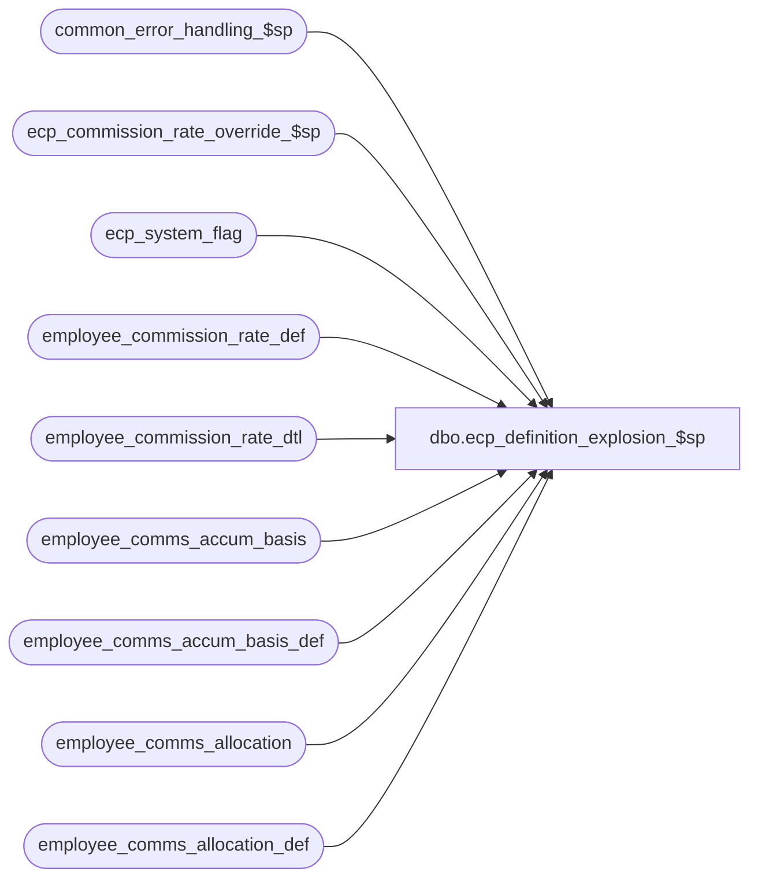

# dbo.ecp_definition_explosion_$sp

**Database:** auditworks_external  
**Server:** bedrockdb01  

## Architecture Diagram



## Table Dependencies

| Referenced Table |
|---|
| common_error_handling_$sp |
| ecp_commission_rate_override_$sp |
| ecp_system_flag |
| employee_commission_rate_def |
| employee_commission_rate_dtl |
| employee_comms_accum_basis |
| employee_comms_accum_basis_def |
| employee_comms_allocation |
| employee_comms_allocation_def |

## Stored Procedure Code

```sql
create proc dbo.ecp_definition_explosion_$sp @stream_no                    tinyint
AS
/* 
Proc Name: ecp_definition_explosion_$sp 
Desc:   Explodes employee commissions master tables from a list-based definition into
        a relational table definition more suitable for joins/validations.
        Should only be called by ecp_posting_$sp.  Calling this procedure independently
        could result in a failure of the ecp_posting_$sp if it awakens prior completion
        of the explosion.

HISTORY:  
Date     Name           Def#    Desc
Feb17,14 Vicci         149581   Avoid Msg 105 Unclosed quotation mark after the character string when description retrieved from config includes an apostrophe.
Nov17,09 Vicci        HBR1117   Turn off rebuild outstanding in case when as-of-date was null
Oct08,08 Vicci         104484   Include reference_amount_type in data exploded
Feb28,08 Vicci          98558   Ensure commission adjustments are not included in employee commission rate explosion.
Feb20,08 Vicci          98558   Ensure time is dropped from effective_from_date and is added to effective_to_date;
                                Handling employee_commission_rate override sequence
Dec14,07 Vicci          95521   When exploding employee transaction role -1 for commission purposes only include roles
                                whose track_in_commission_flag is true.
Oct23,07 Vicci          85597   Explode new accum basis fields
Aug09,07 Vicci          85597   If exploding a commission amount based row include a line with empty string for etr, icc, tcc, scc
                                so that commission adjustments get included in the accumulation basis.
Apr30,07 Vicci          85597   Update error handling
Apr02,07 Vicci		85597	Author

UPDATE ecp_system_flag
set flag_datetime_value = flag_datetime_initialize_value,
    flag_numeric_value = flag_numeric_initialize_value,
    flag_alpha_value = flag_alpha_initialize_value
WHERE flag_name in ('ecp_rebuild_comms_accum_basis')
select * from ecp_system_flag
WHERE flag_name in ('ecp_rebuild_commission_rate', 'ecp_rebuild_comms_accum_basis', 'ecp_rebuild_comms_allocation')

*/

SET NOCOUNT ON
DECLARE
  @all 				nvarchar(20),
  @cursor_open			tinyint,
  @errmsg                       nvarchar(255),
  @errno                        int,
  @errno2                       int,
  @message_id                   int,
  @object_name                  nvarchar(255),
  @operation_name               nvarchar(100),
  @process_name                 nvarchar(100),
  @process_no                   int,
    @process_start_time           datetime,
  @rebuild_commission_rate	tinyint,
  @rebuild_comms_accum_basis    tinyint,
  @rebuild_comms_allocation     tinyint,
  @rebuild_as_of_date		datetime,
  @rebuild_in_progress		nvarchar(255),
  @retrieval_in_progress        tinyint,
  @rows                         int,
        @sql_command nvarchar(4000),
        @employee_ecp_rate_id numeric(12,0),
        @employee_commission_code nvarchar(4000),
        @employee_transaction_role nvarchar(4000),
        @item_commission_code nvarchar(4000),
        @store_commission_code nvarchar(4000),
        @transaction_commission_code nvarchar(4000),
        @tier_accumulation_basis smallint,
        @effective_from_date datetime,
        @commission_rate numeric(7,4),
        @commission_amount_per_item money,
        @effective_to_date datetime,
        @sequence_no int,
     @employee_ecp_alloc_id numeric(12,0),
     @allocation_type nvarchar(20),
     @allocation_percent numeric(7,4),
 @tier_calendar_level smallint,
 @accumulation_basis_desc nvarchar(255),
  @accumulation_basis_column nvarchar(30),
  @auto_commission_adj_id nvarchar(4000),
  @calendar_period_quantity smallint,
  @last_year_flag tinyint,
  @reference_amount_type smallint

SELECT @message_id = 201068,
       @operation_name = 'Unknown',
       @process_name = 'ecp_definition_explosion_$sp',
       @process_no = 282,
       @process_start_time = getdate(),
       @all = '''-1'''

SELECT @rebuild_comms_allocation = null, 
       @rebuild_as_of_date = null, 
       @rebuild_in_progress = null
SELECT @rebuild_comms_allocation = c.flag_numeric_value, 
       @rebuild_as_of_date = flag_datetime_value,
       @rebuild_in_progress = flag_alpha_value
  FROM ecp_system_flag c
 WHERE flag_name = 'ecp_rebuild_comms_allocation'  
SELECT @errno = @@error
IF @errno <> 0
BEGIN
  SELECT @errmsg = 'Unable to determine if commission allocation rebuild required',
         @object_name = 'ecp_system_flag',
         @operation_name = 'SELECT'
  GOTO error
END
--This TODO is cancelled since we now only plan to run explosion from posting:
--TODO:  check if @rebuild_in_progress = 'in progress' add a wait until it isn't 
--       or times out (in which case error out), and recheck whether one is required

IF @rebuild_comms_allocation IS NULL
BEGIN
  SELECT @rebuild_comms_allocation = 1, @rebuild_as_of_date = getdate(), @rebuild_in_progress = 'in progress'
  INSERT INTO ecp_system_flag(flag_name, flag_numeric_value, flag_datetime_value, flag_numeric_initialize_value, flag_comment, flag_alpha_value)
  VALUES('ecp_rebuild_comms_allocation', @rebuild_comms_allocation, @rebuild_as_of_date, 1, 'Set when employee commission allocation def table requires re-exploding into employee commission allocation table', @rebuild_in_progress)
  SELECT @errno = @@error
  IF @errno <> 0
  BEGIN
    SELECT @errmsg = 'Unable to create entry to determine if commission allocation rebuild required',
           @object_name = 'ecp_system_flag',
           @operation_name = 'INSERT'
    GOTO error
  END
END

IF @rebuild_comms_allocation = 1
BEGIN
  IF @rebuild_as_of_date IS NULL
    SELECT @rebuild_as_of_date = getdate()
  SELECT @rebuild_in_progress = 'in progress'  
  UPDATE ecp_system_flag
     SET flag_alpha_value = @rebuild_in_progress,
         flag_datetime_value = @rebuild_as_of_date
   WHERE flag_name = 'ecp_rebuild_comms_allocation'  
     AND flag_alpha_value IS NULL
  SELECT @errno = @@error, @rows = @@rowcount
  IF @errno <> 0
  BEGIN
    SELECT @errmsg = 'Unable to mark commission allocation rebuild as in progress',
           @object_name = 'ecp_system_flag',
           @operation_name = 'UPDATE'
    GOTO error
  END
--TODO:  if @rows = 0 then wait, another rebuild beat me to it.  This TODO is cancelled.
  TRUNCATE TABLE employee_comms_allocation
  SELECT @errno = @@error
  IF @errno <> 0
  BEGIN
    SELECT @errmsg = 'Unable to clean up employee_comms_allocation table in preparation for rebuild',
           @object_name = 'employee_comms_allocation',
           @operation_name = 'TRUNCATE'
    GOTO error
  END

  DECLARE processing_cursor CURSOR
      FOR
   SELECT employee_ecp_alloc_id,
          employee_commission_code,
          employee_transaction_role,
          item_commission_code,
          store_commission_code,
          transaction_commission_code,
          effective_from_date,
          allocation_type,
          allocation_percent,
          dateadd(ss, -1, dateadd(dd, 1, convert(datetime, convert(nvarchar, effective_to_date, 101))))
     FROM employee_comms_allocation_def eca

  OPEN processing_cursor
  SELECT @cursor_open = 1
  FETCH processing_cursor
   INTO @employee_ecp_alloc_id,
        @employee_commission_code,
        @employee_transaction_role,
        @item_commission_code,
        @store_commission_code,
        @transaction_commission_code,
        @effective_from_date,
        @allocation_type,
        @allocation_percent,
        @effective_to_date

  WHILE @@fetch_status = 0 
  BEGIN
    SELECT @sql_command = 'INSERT into employee_comms_allocation(employee_ecp_alloc_id,
                                   employee_commission_code,
                                   employee_transaction_role,
    item_commission_code,
                                   store_commission_code,
                                   transaction_commission_code,
                        effective_from_date,
                                   allocation_type,
                                   allocation_percent,
                                   effective_to_date)
         SELECT ' + convert(nvarchar, @employee_ecp_alloc_id) + ',
               			 ecp.code employee_commission_code,
			         etr.employee_transaction_role,
			         icc.code item_commission_code,
			         scc.code store_commission_code,
			         tcc.code transaction_commission_code,
			    ''' + convert(nvarchar, @effective_from_date, 101) + ''',
			         ''' + @allocation_type + ''',
	   		         ' + convert(nvarchar, @allocation_percent) + ',
			         @effective_to_date 
			    FROM employee_transaction_role etr,
			         alpha_code_description ecp,
			         alpha_code_description icc,
			         alpha_code_description scc,
			         alpha_code_description tcc
                    WHERE etr.employee_transaction_role <> ''-1''
                            AND (@employee_transaction_role = @all
                                  OR etr.employee_transaction_role IN (' + @employee_transaction_role + ')) 
                             AND etr.track_in_commission_flag = 1
                             AND ecp.code_type = 15
                             AND ecp.code_status = ''U''
                             AND ecp.code <> ''-1''
                             AND (@employee_commission_code = @all
                                  OR ecp.code IN ('+ @employee_commission_code + ')) 
                             AND icc.code_type = 11
         		     AND icc.code_status = ''U''
                             AND icc.code <> ''-1''
		             AND (@item_commission_code = @all
		                  OR icc.code IN (' + @item_commission_code + ')) 
		             AND scc.code_type = 13
                             AND scc.code_status = ''U''
                             AND scc.code <> ''-1''
                             AND (@store_commission_code = @all
                                  OR scc.code IN (' + @store_commission_code + ')) 
			     AND tcc.code_type = 14
		             AND tcc.code_status = ''U''
                             AND tcc.code <> ''-1''
		             AND (@transaction_commission_code = @all
              			   OR tcc.code IN (' + @transaction_commission_code + '))
              	             SELECT @errno = @@error' 
    SELECT @errno = @@error
    IF @errno <> 0
    BEGIN
      SELECT @errmsg = 'Failed to create statement required to copy row into commission allocation table via dynamic SQL',
             @object_name = '@sql_command',
             @operation_name = 'SELECT'
        GOTO error
    END

--SELECT 'TestCommAlloc' PRINT @sql_command
    EXEC sp_executesql @sql_command, N'@employee_commission_code nvarchar(4000), 
         @employee_transaction_role nvarchar(4000),
         @item_commission_code nvarchar(4000),
         @store_commission_code nvarchar(4000),
         @transaction_commission_code nvarchar(4000),
         @effective_to_date datetime, 
         @all nvarchar(20),
         @errno int OUT', @employee_commission_code, @employee_transaction_role, @item_commission_code, @store_commission_code, @transaction_commission_code, @effective_to_date, @all, @errno OUT              
    SELECT @errno2 = @@error
    IF @errno <> 0 OR @errno2 <> 0
    BEGIN
      PRINT @sql_command
      IF @errno2 <> 0 SELECT @errno = @errno2
      SELECT @errmsg = 'Failed to copy row into commission allocation table via dynamic SQL',
             @object_name = 'employee_comms_allocation',
             @operation_name = 'INSERT'
        GOTO error
    END

    FETCH processing_cursor
     INTO @employee_ecp_alloc_id,
          @employee_commission_code,
          @employee_transaction_role,
          @item_commission_code,
          @store_commission_code,
          @transaction_commission_code,
          @effective_from_date,
          @allocation_type,
          @allocation_percent,
          @effective_to_date
  END /* while not end of cursor */

  CLOSE processing_cursor
  DEALLOCATE processing_cursor 
  SELECT @cursor_open = 0

  UPDATE ecp_system_flag
     SET flag_alpha_value = null
   WHERE flag_name = 'ecp_rebuild_comms_allocation'  
  SELECT @errno = @@error
  IF @errno <> 0
  BEGIN
    SELECT @errmsg = 'Unable to mark commission allocation rebuild as no longer being in progress',
           @object_name = 'ecp_system_flag',
           @operation_name = 'UPDATE'
    GOTO error
  END

  UPDATE ecp_system_flag
     SET flag_numeric_value = 0
   WHERE flag_name = 'ecp_rebuild_comms_allocation'  
     AND flag_datetime_value = @rebuild_as_of_date
  SELECT @errno = @@error
  IF @errno <> 0
  BEGIN
    SELECT @errmsg = 'Unable to mark commission allocation rebuild as complete',
           @object_name = 'ecp_system_flag',
           @operation_name = 'UPDATE'
    GOTO error
  END
END  --IF @rebuild_comms_allocation = 1

SELECT @rebuild_commission_rate = null, 
       @rebuild_as_of_date = null, 
       @rebuild_in_progress = null
SELECT @rebuild_commission_rate = c.flag_numeric_value, 
       @rebuild_as_of_date = flag_datetime_value,
       @rebuild_in_progress = flag_alpha_value 
  FROM ecp_system_flag c
 WHERE flag_name = 'ecp_rebuild_commission_rate'  
SELECT @errno = @@error
IF @errno <> 0
BEGIN
  SELECT @errmsg = 'Unable to determine if commission_rate_rebuild required',
         @object_name = 'ecp_system_flag',
         @operation_name = 'SELECT'
  GOTO error
END

IF @rebuild_commission_rate IS NULL
BEGIN
  SELECT @rebuild_commission_rate = 1, @rebuild_as_of_date = getdate(), @rebuild_in_progress = 'in progress'
  INSERT INTO ecp_system_flag(flag_name, flag_numeric_value, flag_datetime_value, flag_numeric_initialize_value, flag_comment, flag_alpha_value)
  VALUES('ecp_rebuild_commission_rate', @rebuild_commission_rate, @rebuild_as_of_date, 1, 'Set when employee commission rate def table requires re-exploding into employee commission rate table', @rebuild_in_progress)
  SELECT @errno = @@error
  IF @errno <> 0
  BEGIN
    SELECT @errmsg = 'Unable to create entry to determine if commission_rate_rebuild required',
           @object_name = 'ecp_system_flag',
           @operation_name = 'INSERT'
    GOTO error
  END
END

IF @rebuild_commission_rate = 1
BEGIN
  IF @rebuild_as_of_date IS NULL
    SELECT @rebuild_as_of_date = getdate()

  SELECT @rebuild_in_progress = 'in progress'  
  UPDATE ecp_system_flag
     SET flag_alpha_value = @rebuild_in_progress,
         flag_datetime_value = @rebuild_as_of_date 
   WHERE flag_name = 'ecp_rebuild_commission_rate'  
     AND flag_alpha_value IS NULL
  SELECT @errno = @@error, @rows = @@rowcount
  IF @errno <> 0
  BEGIN
    SELECT @errmsg = 'Unable to mark commission rate rebuild as in progress',
           @object_name = 'ecp_system_flag',
           @operation_name = 'UPDATE'
    GOTO error
  END

  TRUNCATE TABLE employee_commission_rate_dtl
  SELECT @errno = @@error
  IF @errno <> 0
  BEGIN
    SELECT @errmsg = 'Unable to clean up employee_commission_rate_dtl table in preparation for rebuild',
           @object_name = 'employee_commission_rate_dtl',
           @operation_name = 'TRUNCATE'
    GOTO error
  END

  DECLARE processing_cursor CURSOR
      FOR
   SELECT employee_ecp_rate_id,
          employee_commission_code,
          employee_transaction_role,
          item_commission_code,
          store_commission_code,
          transaction_commission_code,
          tier_accumulation_basis,
          effective_from_date,
          commission_rate,
          commission_amount_per_item,
          dateadd(ss, -1, dateadd(dd, 1, convert(datetime, convert(nvarchar, effective_to_date, 101)))),
          IsNull(sequence_no, 0)
   FROM employee_commission_rate_def ecr

  OPEN processing_cursor
  SELECT @cursor_open = 1
  FETCH processing_cursor
   INTO @employee_ecp_rate_id,
        @employee_commission_code,
        @employee_transaction_role,
        @item_commission_code,
        @store_commission_code,
        @transaction_commission_code,
        @tier_accumulation_basis,
        @effective_from_date,
        @commission_rate,
        @commission_amount_per_item,
        @effective_to_date,
        @sequence_no

  WHILE @@fetch_status = 0 
  BEGIN
    SELECT @sql_command = 'INSERT into employee_commission_rate_dtl(
                      employee_ecp_rate_id,
                                   employee_commission_code,
                                   employee_transaction_role,
                                   item_commission_code,
                                   store_commission_code,
                                   transaction_commission_code,
                                   tier_accumulation_basis,
                                   effective_from_date,
                                   commission_rate,
                                   commission_amount_per_item,
                                   effective_to_date,
                                   sequence_no)
                           SELECT ' + convert(nvarchar, @employee_ecp_rate_id) + ',
               			 ecp.code employee_commission_code,
			         etr.employee_transaction_role,
			         icc.code item_commission_code,
			         scc.code store_commission_code,
			         tcc.code transaction_commission_code,
			         ' + convert(nvarchar, @tier_accumulation_basis) + ',
			     ''' + convert(nvarchar, @effective_from_date, 101) + ''',
	   		         ' + convert(nvarchar, @commission_rate) + ',
			         ' + convert(nvarchar, @commission_amount_per_item) + ',
			         @effective_to_date,
			         @sequence_no
			    FROM employee_transaction_role etr,
			         alpha_code_description ecp,
			         alpha_code_description icc,
			         alpha_code_description scc,
			         alpha_code_description tcc
                           WHERE etr.employee_transaction_role <> ''-1''
                             AND etr.employee_transaction_role not like ''..ADJ%''
                             AND (@employee_transaction_role = @all
                                  OR etr.employee_transaction_role IN (' + @employee_transaction_role + ')) 
                             AND etr.track_in_commission_flag = 1
                             AND ecp.code_type = 15
                             AND ecp.code_status = ''U''
                             AND ecp.code <> ''-1''
                             AND (@employee_commission_code = @all         
                                  OR ecp.code IN ('+ @employee_commission_code + ')) 
                             AND icc.code_type = 11
         		     AND icc.code_status = ''U''
                             AND icc.code <> ''-1''
		             AND (@item_commission_code = @all
		                  OR icc.code IN (' + @item_commission_code + ')) 
		             AND scc.code_type = 13
                             AND scc.code_status = ''U''
                             AND scc.code <> ''-1''
                             AND (@store_commission_code = @all
                                  OR scc.code IN (' + @store_commission_code + ')) 
			     AND tcc.code_type = 14
		             AND tcc.code_status = ''U''
                             AND tcc.code <> ''-1''
		             AND (@transaction_commission_code = @all
              			   OR tcc.code IN (' + @transaction_commission_code + '))
              	             SELECT @errno = @@error' 
    SELECT @errno = @@error
    IF @errno <> 0
    BEGIN
      SELECT @errmsg = 'Failed to create statement required to copy row into commission rate table via dynamic SQL',
             @object_name = '@sql_command',
             @operation_name = 'SELECT'
   GOTO error
    END

--SELECT 'TestCommRate' PRINT @sql_command
    EXEC sp_executesql @sql_command, N'@employee_commission_code nvarchar(4000), 
         @employee_transaction_role nvarchar(4000),
         @item_commission_code nvarchar(4000),
         @store_commission_code nvarchar(4000),
         @transaction_commission_code nvarchar(4000),
         @effective_to_date datetime, 
         @sequence_no int,
         @all nvarchar(20),
         @errno int OUT', @employee_commission_code, @employee_transaction_role, @item_commission_code, @store_commission_code, @transaction_commission_code, @effective_to_date, @sequence_no, @all, @errno OUT              
    SELECT @errno2 = @@error
    IF @errno <> 0 OR @errno2 <> 0
    BEGIN
      PRINT @sql_command
      IF @errno2 <> 0 SELECT @errno = @errno2
      SELECT @errmsg = 'Failed to copy row into commission rate table via dynamic SQL',
             @object_name = 'employee_commission_rate',
             @operation_name = 'INSERT'
      GOTO error
    END

    FETCH processing_cursor
     INTO @employee_ecp_rate_id,
          @employee_commission_code,
          @employee_transaction_role,
          @item_commission_code,
          @store_commission_code,
          @transaction_commission_code,
          @tier_accumulation_basis,
          @effective_from_date,
          @commission_rate,
          @commission_amount_per_item,
          @effective_to_date,
          @sequence_no
  END /* while not end of cursor */

  CLOSE processing_cursor
  DEALLOCATE processing_cursor 
  SELECT @cursor_open = 0

  EXEC ecp_commission_rate_override_$sp
  SELECT @errno = @@error
  IF @errno != 0
  BEGIN
    IF @errmsg IS NULL /* then */
      SELECT @errmsg = 'Failed to handle conflicting employee_commission_rate rows'
    SELECT @object_name = 'ecp_commission_rate_override_$sp',
           @operation_name = 'EXECUTE'
    GOTO error
  END

  UPDATE ecp_system_flag
     SET flag_alpha_value = null
   WHERE flag_name = 'ecp_rebuild_commission_rate'  
  SELECT @errno = @@error
  IF @errno <> 0
  BEGIN
    SELECT @errmsg = 'Unable to mark commission rate rebuild as no longer being in progress',
           @object_name = 'ecp_system_flag',
           @operation_name = 'UPDATE'
    GOTO error
  END

  UPDATE ecp_system_flag
     SET flag_numeric_value = 0
   WHERE flag_name = 'ecp_rebuild_commission_rate'  
     AND flag_datetime_value = @rebuild_as_of_date
  SELECT @errno = @@error  
  IF @errno <> 0
  BEGIN
    SELECT @errmsg = 'Unable to mark commission_rate_rebuild as complete',
           @object_name = 'ecp_system_flag',
           @operation_name = 'UPDATE'
    GOTO error
  END
END  --IF @rebuild_commission_rate = 1

SELECT @rebuild_comms_accum_basis = null, 
       @rebuild_as_of_date = null, 
       @rebuild_in_progress = null
SELECT @rebuild_comms_accum_basis = c.flag_numeric_value, 
       @rebuild_as_of_date = flag_datetime_value, 
       @rebuild_in_progress = flag_alpha_value 
  FROM ecp_system_flag c
 WHERE flag_name = 'ecp_rebuild_comms_accum_basis'  
SELECT @errno = @@error
IF @errno <> 0
BEGIN
  SELECT @errmsg = 'Unable to determine if commission accumulation basis rebuild required',
         @object_name = 'ecp_system_flag',
         @operation_name = 'SELECT'
  GOTO error
END

IF @rebuild_comms_accum_basis IS NULL
BEGIN  
  SELECT @rebuild_comms_accum_basis = 1, @rebuild_as_of_date = getdate(), @rebuild_in_progress = 'in progress'
  INSERT INTO ecp_system_flag(flag_name, flag_numeric_value, flag_datetime_value, flag_numeric_initialize_value, flag_comment, flag_alpha_value)
  VALUES('ecp_rebuild_comms_accum_basis', @rebuild_comms_accum_basis, @rebuild_as_of_date, 1, 'Set when employee commission threshold tier basis def table requires re-exploding into employee commission tier basis table', @rebuild_in_progress)
  SELECT @errno = @@error
  IF @errno <> 0
  BEGIN
    SELECT @errmsg = 'Unable to create entry to determine if commission accumulation basis rebuild required',
       @object_name = 'ecp_system_flag',
           @operation_name = 'INSERT'
    GOTO error
  END
END

IF @rebuild_comms_accum_basis = 1
BEGIN
  IF @rebuild_as_of_date IS NULL
    SELECT @rebuild_as_of_date = getdate() 
  SELECT @rebuild_in_progress = 'in progress'  
  UPDATE ecp_system_flag
     SET flag_alpha_value = @rebuild_in_progress,
         flag_datetime_value = @rebuild_as_of_date
   WHERE flag_name = 'ecp_rebuild_comms_accum_basis'  
     AND flag_alpha_value IS NULL
  SELECT @errno = @@error, @rows = @@rowcount
  IF @errno <> 0
  BEGIN
    SELECT @errmsg = 'Unable to mark commission tier/alloc accumulation basis rebuild as in progress',
     @object_name = 'ecp_system_flag',
         @operation_name = 'UPDATE'
    GOTO error
  END

  TRUNCATE TABLE employee_comms_accum_basis
  SELECT @errno = @@error
  IF @errno <> 0
  BEGIN
    SELECT @errmsg = 'Unable to clean up employee_comms_accum_basis table in preparation for rebuild',
           @object_name = 'employee_comms_accum_basis',
           @operation_name = 'TRUNCATE'
    GOTO error
  END

  INSERT into employee_comms_accum_basis( accumulation_basis,
                                          accumulation_basis_desc,
                                          employee_transaction_role,
                                          item_commission_code,
                                          store_commission_code,
                                          transaction_commission_code,
                                          calendar_level,
                                          accumulation_basis_column,
                                          payroll_entry_hour_type,
                                          calendar_period_quantity,
                                          last_year_flag,
                                          reference_amount_type)
  SELECT accumulation_basis,
         accumulation_basis_desc,
         '',
         '',
         '',
         '',
         calendar_level,
         accumulation_basis_column,
         payroll_entry_hour_type,
         calendar_period_quantity,
         last_year_flag,
         reference_amount_type
    FROM employee_comms_accum_basis_def
   WHERE (accumulation_basis_column like '%hour%'
          OR accumulation_basis_column = 'even'
          OR accumulation_basis_column = 'plan_amount'
          OR accumulation_basis_column = 'reference_amount')
          OR (accumulation_basis_column = 'commission_amount'
              AND item_commission_code = '''-1'''
              AND store_commission_code = '''-1'''
              AND transaction_commission_code = '''-1'''
              AND employee_transaction_role = '''-1'''
              AND auto_commission_adj_id IS NULL)
  SELECT @errno = @@error
  IF @errno <> 0
  BEGIN
    SELECT @errmsg = 'Failed to copy hours/even distribution rows into commission accummulation basis',
           @object_name = 'employee_comms_accum_basis',
           @operation_name = 'INSERT'
    GOTO error
  END
   
  DECLARE processing_cursor CURSOR
      FOR
   SELECT accumulation_basis,
          REPLACE(accumulation_basis_desc, '''', ''''''),
          employee_transaction_role,
          item_commission_code,
          store_commission_code,
          transaction_commission_code,
          calendar_level,
          accumulation_basis_column,
          auto_commission_adj_id,
          calendar_period_quantity,
          last_year_flag,
          reference_amount_type
     FROM employee_comms_accum_basis_def
    WHERE accumulation_basis_column not like '%hour%'
      AND accumulation_basis_column not in ('even', 'none', 'plan_amount', 'reference_amount')

OPEN processing_cursor
  SELECT @cursor_open = 1
  FETCH processing_cursor
   INTO @tier_accumulation_basis,
        @accumulation_basis_desc,
        @employee_transaction_role,
        @item_commission_code,
        @store_commission_code,
        @transaction_commission_code,
        @tier_calendar_level,
        @accumulation_basis_column,
        @auto_commission_adj_id,
        @calendar_period_quantity,
        @last_year_flag,
        @reference_amount_type
  WHILE @@fetch_status = 0 
  BEGIN
    IF @auto_commission_adj_id IS NULL
    BEGIN
      SELECT @sql_command = 'INSERT into employee_comms_accum_basis(
                                    accumulation_basis,
   			            accumulation_basis_desc,
                                    employee_transaction_role,
                                    item_commission_code,
                                    store_commission_code,
                                    transaction_commission_code,
                                    calendar_level,
                                    accumulation_basis_column,
                                    calendar_period_quantity,
                                    last_year_flag,
                                    reference_amount_type)
                          SELECT ' + convert(nvarchar, @tier_accumulation_basis) + ',
                                 ''' + @accumulation_basis_desc + ''',
			         etr.employee_transaction_role,
			         icc.code item_commission_code,
			         scc.code store_commission_code,
			         tcc.code transaction_commission_code,
			         ' + convert(nvarchar, @tier_calendar_level) + ',
			      ''' + @accumulation_basis_column + ''', ' + 
			         convert(nvarchar, @calendar_period_quantity) + ', 
			         ' + convert(nvarchar, @last_year_flag) + ',
			         ' + CASE WHEN @reference_amount_type IS NULL THEN 'NULL' ELSE convert(nvarchar, @reference_amount_type) END + '
			    FROM employee_transaction_role etr,
			         alpha_code_description icc,
			         alpha_code_description scc,
			         alpha_code_description tcc
                           WHERE etr.employee_transaction_role <> ''-1''
                             AND (@employee_transaction_role = @all
                                  OR etr.employee_transaction_role IN (' + @employee_transaction_role + ')) 
                             AND etr.track_in_commission_flag = 1
                             AND icc.code_type = 11
         		     AND icc.code_status = ''U''
                             AND icc.code <> ''-1''
		             AND (@item_commission_code = @all
                       		  OR icc.code IN (' + @item_commission_code + ')) 
		             AND scc.code_type = 13
                             AND scc.code_status = ''U''
                             AND scc.code <> ''-1''
                             AND (@store_commission_code = @all
                                  OR scc.code IN (' + @store_commission_code + ')) 
			     AND tcc.code_type = 14
		             AND tcc.code_status = ''U''
                             AND tcc.code <> ''-1''
		             AND (@transaction_commission_code = @all
              			   OR tcc.code IN (' + @transaction_commission_code + '))
              	     SELECT @errno = @@error' 
      SELECT @errno = @@error
      IF @errno <> 0
      BEGIN
        SELECT @errmsg = 'Failed to create statement required to copy row into employee_comms_accum_basis table via dynamic SQL',
               @object_name = '@sql_command',
               @operation_name = 'SELECT'
        GOTO error
      END
    END --IF @auto_commission_adj_id IS NULL
    ELSE
    BEGIN
      SELECT @sql_command = 'INSERT into employee_comms_accum_basis(
                         	    accumulation_basis,
                         	    accumulation_basis_desc,
                         	    employee_transaction_role,
      	 item_commission_code,
                         	    store_commission_code,
                         	    transaction_commission_code,
                                    calendar_level,
                                    accumulation_basis_column,
                 calendar_period_quantity,
                                    last_year_flag,
                                    reference_amount_type,
                                    auto_commission_adj_id)
                          SELECT ' + convert(nvarchar, @tier_accumulation_basis) + ',
                                 ''' + @accumulation_basis_desc + ''',
			         '''',
			     '''',
			         '''',
			         '''',
			         ' + convert(nvarchar, @tier_calendar_level) + ',
			      ''' + @accumulation_basis_column + ''',
			      ' + convert(nvarchar, @calendar_period_quantity) + ', 
			      ' + convert(nvarchar, @last_year_flag) + ',
			      ' + CASE WHEN @reference_amount_type IS NULL THEN 'NULL' ELSE convert(nvarchar, @reference_amount_type) END  + ', aa.auto_commission_adj_id
			    FROM employee_comms_auto_adj aa
                           WHERE aa.auto_commission_adj_id IN (' + @auto_commission_adj_id + ')
              	             SELECT @errno = @@error' 
      SELECT @errno = @@error
      IF @errno <> 0
      BEGIN
        SELECT @errmsg = 'Failed to create statement required to copy row into employee_comms_accum_basis table via dynamic SQL',
               @object_name = '@sql_command',
         @operation_name = 'SELECT'
          GOTO error
   END
    END  --else of IF @auto_commission_adj_id IS NULL

--SELECT 'TestCommAccumBasis' PRINT @sql_command
    EXEC sp_executesql @sql_command, N'@employee_transaction_role nvarchar(4000),
         @item_commission_code nvarchar(4000),
         @store_commission_code nvarchar(4000),
         @transaction_commission_code nvarchar(4000),
         @all nvarchar(20),
         @errno int OUT', @employee_transaction_role, @item_commission_code, @store_commission_code, @transaction_commission_code, @all, @errno OUT              
    SELECT @errno2 = @@error
    IF @errno <> 0 OR @errno2 <> 0
    BEGIN
      PRINT @sql_command
      IF @errno2 <> 0 SELECT @errno = @errno2
      SELECT @errmsg = 'Failed to copy row into commission accumulation basis table via dynamic SQL',
             @object_name = 'employee_comms_accum_basis',
             @operation_name = 'INSERT'
      GOTO error
END

    FETCH processing_cursor
     INTO @tier_accumulation_basis,
          @accumulation_basis_desc,
          @employee_transaction_role,
          @item_commission_code,
          @store_commission_code,
          @transaction_commission_code,
          @tier_calendar_level,
          @accumulation_basis_column,
          @auto_commission_adj_id,
          @calendar_period_quantity,
          @last_year_flag,
          @reference_amount_type
  END --while not end of commission tier basis rebuild cursor

CLOSE processing_cursor
  DEALLOCATE processing_cursor 
  SELECT @cursor_open = 0

  UPDATE ecp_system_flag
     SET flag_alpha_value = null
   WHERE flag_name = 'ecp_rebuild_comms_accum_basis'  
  SELECT @errno = @@error
  IF @errno <> 0
  BEGIN
    SELECT @errmsg = 'Unable to mark commission tier/alloc basis rebuild as no longer being in progress',
     @object_name = 'ecp_system_flag',
     @operation_name = 'UPDATE'
    GOTO error
  END

  UPDATE ecp_system_flag
     SET flag_numeric_value = 0
   WHERE flag_name = 'ecp_rebuild_comms_accum_basis'  
     AND flag_datetime_value = @rebuild_as_of_date
  SELECT @errno = @@error
  IF @errno <> 0
  BEGIN
    SELECT @errmsg = 'Unable to mark commission tier basis rebuild as complete',
           @object_name = 'ecp_system_flag',
           @operation_name = 'UPDATE'
    GOTO error
  END
END  --IF @rebuild_comms_accum_basis = 1

RETURN

error:
  IF @cursor_open = 1
  BEGIN
    CLOSE processing_cursor
    DEALLOCATE processing_cursor 
    SELECT @cursor_open = 0
  END

  EXEC common_error_handling_$sp @process_no, @errno, @errmsg, 0, @message_id, @process_name, @object_name, @operation_name, 1, @stream_no
  RETURN
```

