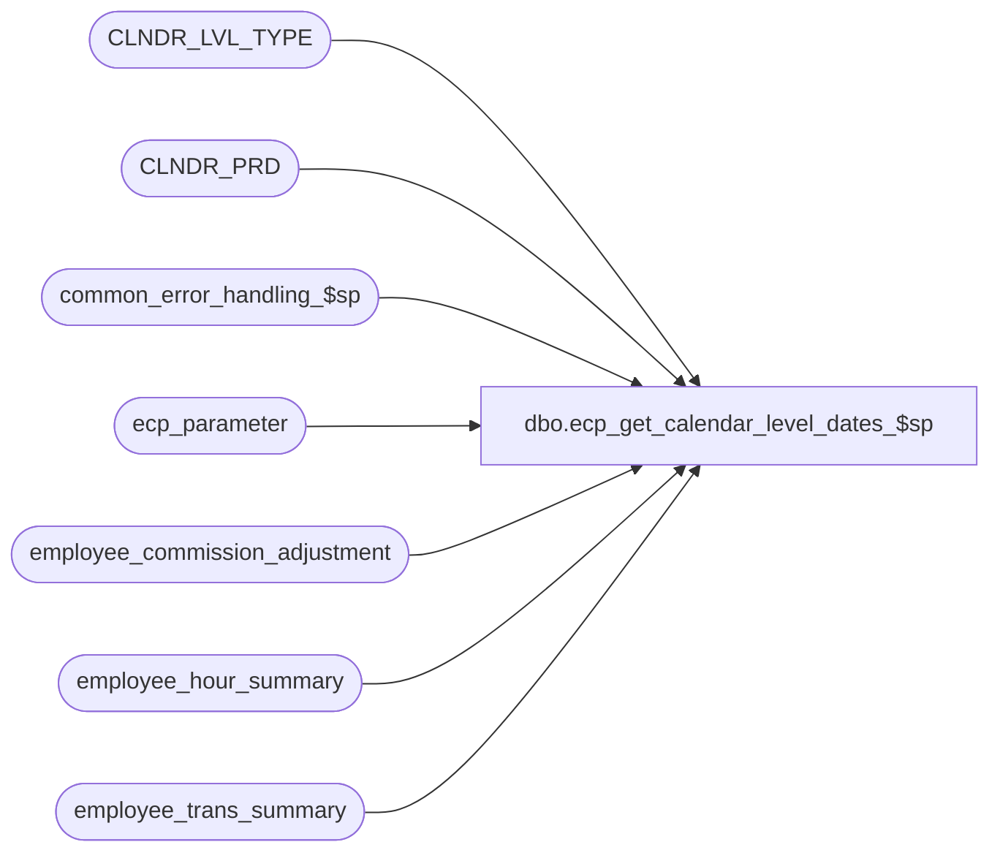

# dbo.ecp_get_calendar_level_dates_$sp

**Database:** auditworks_external  
**Server:** bedrockdb01  

## Architecture Diagram



## Table Dependencies

| Referenced Table |
|---|
| CLNDR_LVL_TYPE |
| CLNDR_PRD |
| common_error_handling_$sp |
| ecp_parameter |
| employee_commission_adjustment |
| employee_hour_summary |
| employee_trans_summary |

## Stored Procedure Code

```sql
create proc [dbo].[ecp_get_calendar_level_dates_$sp] 
@date_selection_calendar_level int,
@year int = null,  --four digit year, example 2008;  if not specified defaults to current year.
@availability_type nvarchar(20) = 'ALL' --valid options are ALL = all dates whether or not data is available, ECP-EC = dates for which Commission data is available, ECP-EP dates for which Productivity data is available
AS 

/* 
Proc Name: ecp_get_calendar_level_dates_$sp 
Desc:   Called by ECP Report Query Forms to obtain list of valid available (data exists in ECP) and unavailable dates within
        the calendar level specified.

HISTORY:  
Date     Name           Def#    Desc
Reapply to ensure clients upgrading from S/A 5.0 / ECP 1.00b005 get most current version of proc.
Apr14,11 Paul          126153   Use unicode datatypes
Jun14,10 Vicci                  Correct search for availability of hour data to be from employee_hour_summary (not trans summary)
Aug19,08 Vicci        103967    Interpret request for year to be for periods with any dates falling within year instead of periods with period-end-date falling within year.
May23,08 Vicci        101234    Author

*/

SET NOCOUNT ON
DECLARE
  @ecp_clndr_id			binary(16),
  @from_date			datetime,
  @to_date			datetime,  
  @errmsg                       nvarchar(255),
  @errno                        int,
  @message_id                   int,
  @object_name                  nvarchar(255),
  @operation_name               nvarchar(100),
  @process_name                 nvarchar(100),
  @process_no                   int,
  @rows				int,
  @stream_no                    tinyint,
  @period_no_length		tinyint

SELECT @message_id = 201068,
       @operation_name = 'Unknown',
       @process_name = 'ecp_get_calendar_levels_$sp',
       @process_no = 282,
       @stream_no = 1

SELECT @ecp_clndr_id = par_bin_value
  FROM ecp_parameter p
 WHERE par_name = 'ecp_dflt_clndr_id'  
SELECT @errno = @@error
IF @errno <> 0
BEGIN
  SELECT @errmsg = 'Unable to which calendar to use',
         @object_name = 'ecp_parameter',
         @operation_name = 'SELECT'
  GOTO error
END

IF @year IS NULL
  SELECT @year = datepart(yyyy, getdate())
SELECT @errno = @@error
IF @errno <> 0
BEGIN
  SELECT @errmsg = 'Unable to default year to current year',
         @object_name = 'getdate()',
         @operation_name = 'SELECT'
  GOTO error
END

SELECT @from_date = convert(datetime, '01/01/' + convert(nvarchar, @year)),
       @to_date = convert(datetime, '12/31/' + convert(nvarchar, @year) + ' 23:59:59')
SELECT @errno = @@error
IF @errno <> 0
BEGIN
  SELECT @errmsg = 'Unable to determine date range corresponding to year selected',
         @object_name = '@year',
         @operation_name = 'SELECT'
  GOTO error
END

SELECT @period_no_length = MAX(LEN(cp.CLNDR_PRD_NUM))
  FROM CLNDR_LVL_TYPE clt
       INNER JOIN CLNDR_PRD cp
          ON cp.CLNDR_ID = @ecp_clndr_id
         AND clt.CLNDR_LVL_TYPE_ID = cp.CLNDR_LVL_TYPE_ID
 WHERE @date_selection_calendar_level = clt.CLNDR_LVL_TYPE_IDNTY
SELECT @errno = @@error
IF @errno <> 0
BEGIN
  SELECT @errmsg = 'Unable to max length of period number for formatting purposes',
         @object_name = 'CLNDR_PRD',
         @operation_name = 'SELECT'
  GOTO error
END

SELECT convert(nvarchar, cp.STRT_DATE_TIME,111) + ' - ' +  convert(nvarchar, dateadd(ss, -1, cp.END_DATE_TIME),111) + ' (' + RIGHT('0000000000' + convert(nvarchar, cp.CLNDR_PRD_NUM), @period_no_length) + ')' date_range_description,
       dateadd(ss, -1, cp.END_DATE_TIME) to_date, cp.STRT_DATE_TIME from_date, cp.CLNDR_PRD_NUM period_no
    FROM CLNDR_LVL_TYPE clt
         INNER JOIN CLNDR_PRD cp
            ON cp.CLNDR_ID = @ecp_clndr_id
           AND clt.CLNDR_LVL_TYPE_ID = cp.CLNDR_LVL_TYPE_ID
           AND ((@from_date <= cp.STRT_DATE_TIME AND cp.STRT_DATE_TIME < @to_date)
                OR (@from_date <= cp.END_DATE_TIME AND cp.END_DATE_TIME < @to_date)
                OR (cp.STRT_DATE_TIME < @from_date AND cp.END_DATE_TIME >= @to_date))
   WHERE @date_selection_calendar_level = clt.CLNDR_LVL_TYPE_IDNTY
     AND (@availability_type = 'ALL'
      OR (@availability_type = 'ECP-EC' AND cp.END_DATE_TIME IN (SELECT DISTINCT dateadd(ss, 1, ets.pay_period_end_datetime)
                                                                   FROM employee_trans_summary ets
                                                                  WHERE ets.pay_period_end_datetime >= cp.STRT_DATE_TIME
                                                                    AND ets.pay_period_end_datetime < cp.END_DATE_TIME
                                                                    AND ets.calendar_level = @date_selection_calendar_level
                                                                  UNION 
                                                                 SELECT DISTINCT dateadd(ss, 1, eca.pay_period_end_datetime)
                                                                   FROM employee_commission_adjustment eca
                                                                  WHERE eca.pay_period_end_datetime >= cp.STRT_DATE_TIME
                                                                    AND eca.pay_period_end_datetime < cp.END_DATE_TIME) ) 
      OR (@availability_type = 'ECP-EP' AND cp.END_DATE_TIME IN (SELECT DISTINCT dateadd(ss, 1, ets.period_end_datetime)
                                                                   FROM employee_trans_summary ets
                                                                  WHERE ets.period_end_datetime >= cp.STRT_DATE_TIME
                                                                    AND ets.period_end_datetime < cp.END_DATE_TIME
                                                                    AND ets.calendar_level = @date_selection_calendar_level
                                                                  UNION 
                                                                 SELECT DISTINCT dateadd(ss, 1, ehs.period_end_datetime)
                                                                   FROM employee_hour_summary ehs
                                                                  WHERE ehs.period_end_datetime >= cp.STRT_DATE_TIME
                                                                    AND ehs.period_end_datetime < cp.END_DATE_TIME
                                                                    AND ehs.calendar_level = @date_selection_calendar_level) ) )
   ORDER BY cp.END_DATE_TIME
SET NOCOUNT OFF
RETURN

error:
  EXEC common_error_handling_$sp @process_no, @errno, @errmsg, 0, @message_id, @process_name, @object_name, @operation_name, 1, @stream_no
  RETURN
```

