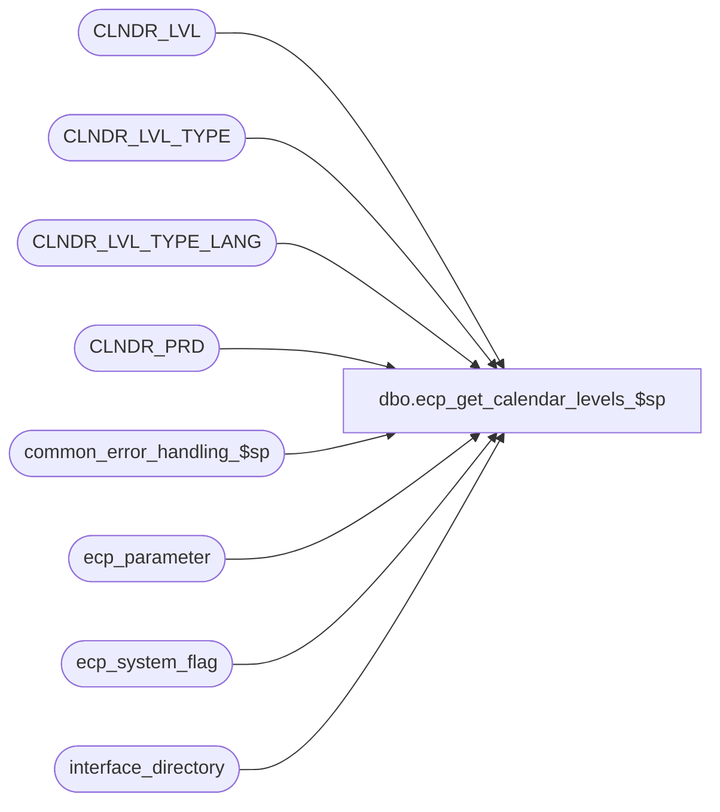

# dbo.ecp_get_calendar_levels_$sp

**Database:** auditworks_external  
**Server:** bedrockdb01  

## Architecture Diagram



## Table Dependencies

| Referenced Table |
|---|
| CLNDR_LVL |
| CLNDR_LVL_TYPE |
| CLNDR_LVL_TYPE_LANG |
| CLNDR_PRD |
| common_error_handling_$sp |
| ecp_parameter |
| ecp_system_flag |
| interface_directory |

## Stored Procedure Code

```sql
create proc dbo.ecp_get_calendar_levels_$sp --no input parameters specified when called from report query forms, 
@date_selection_calendar_level int = null,  --null when called from report query forms, specified when called from stored procs
@date_range_type nvarchar(30) = 'current',  --valid options are 'current', 'previous', 'first_open', 'last_closed',
@relative_from_date datetime = null OUTPUT,
@relative_to_date datetime = null OUTPUT,
@return_desc tinyint = 0,  --Returns selected_period_desc
@language_id smallint = 1033
AS 

/* 
Proc Name: ecp_get_calendar_levels_$sp 
Desc:   Called by ECP Report Query Forms to obtain list of valid calendar levels for ECP along with their current, 
        previous, last closed and last open date ranges / period numbers.
        Called by ECP commission / productivity report procedures when reports run for relative date selection criteria.
        Called by ECP Commission / Productivity report in reporting services to display retrieval criteria at top of reports.

HISTORY:  
Date     Name           Def#    Desc
Nov05,14 Vicci     TFS-91256    Correct determination of @last_closed_to_datetime when no ECP period has yet been closed.
Apr01,13 Vicci        140907	Add multi-language handling
Sep22,08 Vicci        104977    Prefix @return_desc with @date_selection_calendar_level's description 
Sep19,08 Vicci        104977    Add @return_desc overload option to return the description of the relative period selected.
May21,08 Vicci        101234    Author

*/

SET NOCOUNT ON
DECLARE
  @ecp_clndr_id			binary(16),
  @lowest_calendar_level	int,
  @lowest_calendar_level_id	binary(16),
  @errmsg                       nvarchar(255),
  @errno                        int,
  @message_id                   int,
  @object_name                  nvarchar(255),
  @operation_name               nvarchar(100),
  @process_name                 nvarchar(100),
  @process_no                   int,
  @rows				int,
  @stream_no                    tinyint,
  @last_closed_from_datetime	datetime,
  @last_closed_to_datetime	datetime,
  @first_open_from_datetime	datetime,
  @first_open_to_datetime	datetime,
  @previous_from_datetime	datetime,
  @previous_to_datetime		datetime,
  @current_from_datetime	datetime,
  @current_to_datetime		datetime,
  @selected_period_desc		nvarchar(255)

SELECT @message_id = 201068,
       @operation_name = 'Unknown',
       @process_name = 'ecp_get_calendar_levels_$sp',
       @process_no = 282,
       @stream_no = 1

SELECT @ecp_clndr_id = par_bin_value
  FROM ecp_parameter p
 WHERE par_name = 'ecp_dflt_clndr_id'  
SELECT @errno = @@error
IF @errno <> 0
BEGIN
  SELECT @errmsg = 'Unable to which calendar to use',
         @object_name = 'ecp_parameter',
         @operation_name = 'SELECT'
  GOTO error
END

SELECT @lowest_calendar_level = CLNDR_LVL_TYPE_IDNTY, 
       @lowest_calendar_level_id = CLNDR_LVL_TYPE_ID
  FROM CLNDR_LVL_TYPE
 WHERE CLNDR_LVL_SEQ = (SELECT MAX(CLNDR_LVL_SEQ)
			  FROM CLNDR_LVL_TYPE
			 WHERE CLNDR_LVL_TYPE_ID
			    IN (SELECT DISTINCT CLNDR_LVL_TYPE_ID
                                  FROM CLNDR_LVL
                                  WHERE CLNDR_ID = @ecp_clndr_id))
 AND CLNDR_LVL_TYPE_ID
    IN (SELECT DISTINCT CLNDR_LVL_TYPE_ID
          FROM CLNDR_LVL
  WHERE CLNDR_ID = @ecp_clndr_id)
SELECT @errno = @@error
IF @errno <> 0
BEGIN
  SELECT @errmsg = 'Unable to which calendar level to use for employee transaction logging',
         @object_name = 'CLNDR_LVL_TYPE',
         @operation_name = 'SELECT'
  GOTO error
END

SELECT @last_closed_to_datetime = c.flag_datetime_value  --note, stored with time of 23:59:59
  FROM ecp_system_flag c
 WHERE flag_name = 'ecp_payperiod_close_datetime'  
SELECT @errno = @@error, @rows = @@rowcount
IF @errno <> 0
BEGIN
  SELECT @errmsg = 'Unable to determine last pay-period closed',
         @object_name = 'ecp_system_flag',
         @operation_name = 'SELECT'
  GOTO error
END
IF @rows < 1
BEGIN
  INSERT INTO ecp_system_flag(flag_name, flag_comment)
  VALUES('ecp_payperiod_close_datetime', 'flag_datetime_value set by user to indicate that pay-period is closed and that no more imports/allocations can be posted to it')
  SELECT @errno = @@error
  IF @errno <> 0
  BEGIN
    SELECT @errmsg = 'Unable to create entry to indicate which pay-period has been closed',
    @object_name = 'ecp_system_flag',
           @operation_name = 'INSERT'
  GOTO error
  END
END
IF @last_closed_to_datetime IS NULL
BEGIN
  SELECT @last_closed_to_datetime = dateadd(ss, -1, live_date)
  FROM interface_directory
   WHERE interface_id = 44
  SELECT @errno = @@error
  IF @errno <> 0
  BEGIN
    SELECT @errmsg = 'Unable to determine ECP live date',
           @object_name = 'ecp_system_flag',
           @operation_name = 'SELECT'
    GOTO error
  END
END

IF @last_closed_to_datetime IS NOT NULL
BEGIN   
  SELECT @last_closed_to_datetime = min(cp.END_DATE_TIME)
    FROM CLNDR_PRD cp
   WHERE cp.CLNDR_ID = @ecp_clndr_id
     AND cp.CLNDR_LVL_TYPE_ID = @lowest_calendar_level_id
     AND cp.END_DATE_TIME > @last_closed_to_datetime
  SELECT @errno = @@error
  IF @errno <> 0
  BEGIN
    SELECT @errmsg = 'Unable to determine ECP last closed date-range upper limit',
           @object_name = 'CLNDR_PRD',
           @operation_name = 'SELECT'
    GOTO error
  END
END  --IF @last_closed_to_datetime IS NOT NULL

SELECT @first_open_to_datetime = min(cp.END_DATE_TIME)
  FROM CLNDR_PRD cp
 WHERE cp.CLNDR_ID = @ecp_clndr_id
   AND cp.CLNDR_LVL_TYPE_ID = @lowest_calendar_level_id
   AND (cp.STRT_DATE_TIME >= @last_closed_to_datetime
        OR @last_closed_to_datetime IS NULL)  -- because never closed and no live date or because not in calendar
SELECT @errno = @@error
IF @errno <> 0
BEGIN
  SELECT @errmsg = 'Unable to determine ECP first open date-range upper limit',
         @object_name = 'CLNDR_PRD',
         @operation_name = 'SELECT'
  GOTO error
END

SELECT @current_to_datetime = min(cp.END_DATE_TIME)
  FROM CLNDR_PRD cp
 WHERE cp.CLNDR_ID = @ecp_clndr_id
   AND cp.CLNDR_LVL_TYPE_ID = @lowest_calendar_level_id
   AND cp.END_DATE_TIME >= getdate()
SELECT @errno = @@error
IF @errno <> 0
BEGIN
  SELECT @errmsg = 'Unable to determine ECP current date-range upper limit',
         @object_name = 'CLNDR_PRD',
         @operation_name = 'SELECT'
  GOTO error
END

SELECT @previous_to_datetime = max(cp.END_DATE_TIME)
  FROM CLNDR_PRD cp
 WHERE cp.CLNDR_ID = @ecp_clndr_id
   AND cp.CLNDR_LVL_TYPE_ID = @lowest_calendar_level_id
   AND cp.END_DATE_TIME < @current_to_datetime
SELECT @errno = @@error
IF @errno <> 0
BEGIN
  SELECT @errmsg = 'Unable to determine ECP previous date-range upper limit',
         @object_name = 'CLNDR_PRD',
         @operation_name = 'SELECT'
  GOTO error
END

IF @date_selection_calendar_level IS NULL
BEGIN
SELECT clt.CLNDR_LVL_TYPE_IDNTY calendar_level, COALESCE(cltl.CLNDR_LVL_DESC, clt.CLNDR_LVL_DESC) calendar_level_desc, clt.CLNDR_LVL_SEQ * -1, 
        MAX(CASE WHEN r.date_range_type = 'current_previous' 
                 THEN convert(nvarchar, cp.STRT_DATE_TIME,111) + ' - ' +  convert(nvarchar, dateadd(ss, -1, cp.END_DATE_TIME),111) + ' (' + CASE WHEN clt.CLNDR_LVL_TYPE_ID in (0x9F628804484A406A80E29137D9EBA0E9, 0xB1F84D94F5024FAF87D77531148D4AF3, 0x521FB22176524C32AB485425FCCBC9CF) AND cp.CLNDR_PRD_NUM < 10 THEN '0' ELSE '' END + convert(nvarchar, cp.CLNDR_PRD_NUM) + ')' 
                 ELSE '' END) current_desc, 
        MAX(CASE WHEN r.date_range_type = 'current_previous' 
                 THEN convert(nvarchar, cpp.STRT_DATE_TIME,111) + ' - ' +  convert(nvarchar, dateadd(ss, -1, cpp.END_DATE_TIME),111) + ' (' + CASE WHEN clt.CLNDR_LVL_TYPE_ID in (0x9F628804484A406A80E29137D9EBA0E9, 0xB1F84D94F5024FAF87D77531148D4AF3, 0x521FB22176524C32AB485425FCCBC9CF) AND cpp.CLNDR_PRD_NUM < 10 THEN '0' ELSE '' END + convert(nvarchar, cpp.CLNDR_PRD_NUM)+ ')' 
                 ELSE '' END) previous_desc, 
       MAX(CASE WHEN r.date_range_type = 'open_closed' 
                 THEN convert(nvarchar, cp.STRT_DATE_TIME,111) + ' - ' +  convert(nvarchar, dateadd(ss, -1, cp.END_DATE_TIME),111) + ' (' + CASE WHEN clt.CLNDR_LVL_TYPE_ID in (0x9F628804484A406A80E29137D9EBA0E9, 0xB1F84D94F5024FAF87D77531148D4AF3, 0x521FB22176524C32AB485425FCCBC9CF) AND cp.CLNDR_PRD_NUM < 10 THEN '0' ELSE '' END + convert(nvarchar, cp.CLNDR_PRD_NUM) + ')' 
                 ELSE '' END) first_open_desc, 
        MAX(CASE WHEN r.date_range_type = 'open_closed' 
                 THEN convert(nvarchar, cpp.STRT_DATE_TIME,111) + ' - ' +  convert(nvarchar, dateadd(ss, -1, cpp.END_DATE_TIME),111) + ' (' + CASE WHEN clt.CLNDR_LVL_TYPE_ID in (0x9F628804484A406A80E29137D9EBA0E9, 0xB1F84D94F5024FAF87D77531148D4AF3, 0x521FB22176524C32AB485425FCCBC9CF) AND cpp.CLNDR_PRD_NUM < 10 THEN '0' ELSE '' END + convert(nvarchar, cpp.CLNDR_PRD_NUM) + ')' 
                 ELSE '' END) last_closed_desc, 
        MAX(CASE WHEN r.date_range_type = 'current_previous' THEN cp.CLNDR_PRD_NUM ELSE '' END) current_period_no, 
        MAX(CASE WHEN r.date_range_type = 'current_previous' THEN cpp.CLNDR_PRD_NUM ELSE '' END) previous_period_no, 
        MAX(CASE WHEN r.date_range_type = 'open_closed' THEN cp.CLNDR_PRD_NUM ELSE '' END) first_open_period_no, 
        MAX(CASE WHEN r.date_range_type = 'open_closed' THEN cpp.CLNDR_PRD_NUM ELSE '' END) last_closed_period_no, 
        MAX(CASE WHEN r.date_range_type = 'current_previous' THEN cp.STRT_DATE_TIME ELSE '01/01/1970' END) current_from_date, 
        MAX(CASE WHEN r.date_range_type = 'current_previous' THEN dateadd(ss, -1, cp.END_DATE_TIME) ELSE '01/01/1970' END) current_to_date, 
        MAX(CASE WHEN r.date_range_type = 'current_previous' THEN cpp.STRT_DATE_TIME ELSE '01/01/1970' END) previous_from_date, 
        MAX(CASE WHEN r.date_range_type = 'current_previous' THEN dateadd(ss, -1, cpp.END_DATE_TIME) ELSE '01/01/1970' END) previous_to_date,
        MAX(CASE WHEN r.date_range_type = 'open_closed' THEN cp.STRT_DATE_TIME ELSE '01/01/1970' END) first_open_from_date, 
        MAX(CASE WHEN r.date_range_type = 'open_closed' THEN dateadd(ss, -1, cp.END_DATE_TIME) ELSE '01/01/1970' END) first_open_to_date, 
        MAX(CASE WHEN r.date_range_type = 'open_closed' THEN cpp.STRT_DATE_TIME ELSE '01/01/1970' END) last_closed_from_date, 
        MAX(CASE WHEN r.date_range_type = 'open_closed' THEN dateadd(ss, -1, cpp.END_DATE_TIME) ELSE '01/01/1970' END) last_closed_to_date
 FROM (  SELECT 'current_previous' date_range_type, @current_to_datetime to_date
           UNION
           SELECT 'open_closed' date_range_type, @first_open_to_datetime to_date) r
        INNER JOIN CLNDR_PRD cp
           ON cp.CLNDR_ID = @ecp_clndr_id
          AND cp.STRT_DATE_TIME < r.to_date
          AND cp.END_DATE_TIME >= r.to_date
        INNER JOIN CLNDR_LVL_TYPE clt
           ON cp.CLNDR_LVL_TYPE_ID = clt.CLNDR_LVL_TYPE_ID
        LEFT OUTER JOIN CLNDR_LVL_TYPE_LANG cltl
           ON clt.CLNDR_LVL_TYPE_ID = cltl.CLNDR_LVL_TYPE_ID
          AND cltl.LANG_ID = @language_id
        LEFT OUTER JOIN CLNDR_PRD cpp
           ON cpp.CLNDR_ID = @ecp_clndr_id
          AND cpp.CLNDR_LVL_TYPE_ID = cp.CLNDR_LVL_TYPE_ID
          AND cpp.END_DATE_TIME = cp.STRT_DATE_TIME
GROUP BY clt.CLNDR_LVL_TYPE_IDNTY, COALESCE(cltl.CLNDR_LVL_DESC, clt.CLNDR_LVL_DESC), clt.CLNDR_LVL_SEQ * -1
ORDER BY clt.CLNDR_LVL_SEQ * -1
END
ELSE
BEGIN
  SELECT @relative_from_date = CASE @date_range_type WHEN 'current' THEN cp.STRT_DATE_TIME
                                                     WHEN 'previous' THEN cpp.STRT_DATE_TIME 
                                                     WHEN 'first_open' THEN cp.STRT_DATE_TIME
                                                     WHEN 'last_closed' THEN cpp.STRT_DATE_TIME
                ELSE cp.STRT_DATE_TIME 
                               END,
         @relative_to_date = CASE @date_range_type WHEN 'current' THEN dateadd(ss, -1, cp.END_DATE_TIME) 
                                                   WHEN 'previous' THEN dateadd(ss, -1, cpp.END_DATE_TIME) 
                                                   WHEN 'first_open' THEN dateadd(ss, -1, cp.END_DATE_TIME)
                      WHEN 'last_closed' THEN dateadd(ss, -1, cpp.END_DATE_TIME)
                                            ELSE dateadd(ss, -1, cp.END_DATE_TIME)
                             END,
         @selected_period_desc = COALESCE(cltl.CLNDR_LVL_DESC, clt.CLNDR_LVL_DESC) + ' ' + CASE @date_range_type WHEN 'current' THEN convert(nvarchar, cp.STRT_DATE_TIME,111) + ' - ' +  convert(nvarchar, dateadd(ss, -1, cp.END_DATE_TIME),111) + ' (' + CASE WHEN clt.CLNDR_LVL_TYPE_ID in (0x9F628804484A406A80E29137D9EBA0E9, 0xB1F84D94F5024FAF87D77531148D4AF3, 0x521FB22176524C32AB485425FCCBC9CF) AND cp.CLNDR_PRD_NUM < 10 THEN '0' ELSE '' END + convert(nvarchar, cp.CLNDR_PRD_NUM) + ')'
                                                       WHEN 'previous' THEN convert(nvarchar, cpp.STRT_DATE_TIME,111) + ' - ' +  convert(nvarchar, dateadd(ss, -1, cpp.END_DATE_TIME),111) + ' (' + CASE WHEN clt.CLNDR_LVL_TYPE_ID in (0x9F628804484A406A80E29137D9EBA0E9, 0xB1F84D94F5024FAF87D77531148D4AF3, 0x521FB22176524C32AB485425FCCBC9CF) AND cpp.CLNDR_PRD_NUM < 10 THEN '0' ELSE '' END + convert(nvarchar, cpp.CLNDR_PRD_NUM)+ ')' 
                                                       WHEN 'first_open' THEN convert(nvarchar, cp.STRT_DATE_TIME,111) + ' - ' +  convert(nvarchar, dateadd(ss, -1, cp.END_DATE_TIME),111) + ' (' + CASE WHEN clt.CLNDR_LVL_TYPE_ID in (0x9F628804484A406A80E29137D9EBA0E9, 0xB1F84D94F5024FAF87D77531148D4AF3, 0x521FB22176524C32AB485425FCCBC9CF) AND cp.CLNDR_PRD_NUM < 10 THEN '0' ELSE '' END + convert(nvarchar, cp.CLNDR_PRD_NUM) + ')' 
                                                       WHEN 'last_closed' THEN convert(nvarchar, cpp.STRT_DATE_TIME,111) + ' - ' +  convert(nvarchar, dateadd(ss, -1, cpp.END_DATE_TIME),111) + ' (' + CASE WHEN clt.CLNDR_LVL_TYPE_ID in (0x9F628804484A406A80E29137D9EBA0E9, 0xB1F84D94F5024FAF87D77531148D4AF3, 0x521FB22176524C32AB485425FCCBC9CF) AND cpp.CLNDR_PRD_NUM < 10 THEN '0' ELSE '' END + convert(nvarchar, cpp.CLNDR_PRD_NUM) + ')' 
                                                       ELSE 'No relative date range specified'
                                 END 
    FROM CLNDR_LVL_TYPE clt
         INNER JOIN CLNDR_PRD cp
            ON cp.CLNDR_ID = @ecp_clndr_id
           AND clt.CLNDR_LVL_TYPE_ID = cp.CLNDR_LVL_TYPE_ID
           AND cp.STRT_DATE_TIME < CASE WHEN @date_range_type in ('first_open', 'last_closed') THEN @first_open_to_datetime ELSE @current_to_datetime END
           AND cp.END_DATE_TIME >= CASE WHEN @date_range_type in ('first_open', 'last_closed') THEN @first_open_to_datetime ELSE @current_to_datetime END
         LEFT OUTER JOIN CLNDR_PRD cpp
           ON cpp.CLNDR_ID = @ecp_clndr_id
          AND cpp.CLNDR_LVL_TYPE_ID = cp.CLNDR_LVL_TYPE_ID
          AND cpp.END_DATE_TIME = cp.STRT_DATE_TIME
         LEFT OUTER JOIN CLNDR_LVL_TYPE_LANG cltl
           ON clt.CLNDR_LVL_TYPE_ID = cltl.CLNDR_LVL_TYPE_ID
          AND cltl.LANG_ID = @language_id 
   WHERE cp.CLNDR_LVL_TYPE_ID = clt.CLNDR_LVL_TYPE_ID
     AND @date_selection_calendar_level = clt.CLNDR_LVL_TYPE_IDNTY
     
  IF @return_desc = 1 
    SELECT @selected_period_desc
END
SET NOCOUNT OFF
RETURN

error:
  EXEC common_error_handling_$sp @process_no, @errno, @errmsg, 0, @message_id, @process_name, @object_name, @operation_name, 1, @stream_no
  RETURN
```

