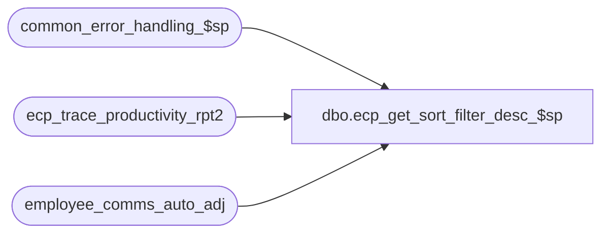

# dbo.ecp_get_sort_filter_desc_$sp

**Database:** auditworks_external  
**Server:** bedrockdb01  

## Architecture Diagram



## Table Dependencies

| Referenced Table |
|---|
| common_error_handling_$sp |
| ecp_trace_productivity_rpt2 |
| employee_comms_auto_adj |

## Stored Procedure Code

```sql
create proc [dbo].[ecp_get_sort_filter_desc_$sp]  
 @language_id smallint = null,  --if not specified defaults to 1033 i.e. English
 @filter_clause nvarchar(3000) = null,  --note:  currently applied to lowest calendar-level selected.
 @order_clause nvarchar(3000) = null,  --note:  currently, if a comparison type is selected which requires a trans store merge or role merge then transaction store and/or role is not available in sort
 @reference_amt_type_list nvarchar(3000) = null,  --ordered list of reference amount types to be included on the report.
 @run_as_trace_execution_time datetime = null
AS
/*
Proc Name: ecp_get_sort_filter_desc_$sp 
Desc:   Retrieves sort and filter descriptions for ECP Employee Productivity Report.

HISTORY:  
Date     Name           Def#    Desc
Apr14,11 Paul          126153   Use unicode datatypes
Jan30,09 Vicci         104484   Author
*/
--  SELECT convert(nvarchar, execution_datetime, 108), * FROM ecp_trace_productivity_rpt2 order by execution_datetime DESC
--  SELECT convert(nvarchar, execution_datetime, 108), * FROM ecp_trace_get_sort_filter_desc order by execution_datetime DESC
--create table ecp_trace_get_sort_filter_desc(execution_datetime datetime null, language_id smallint null, filter_clause nvarchar(3000) null, order_clause nvarchar(3000) null, reference_amt_type_list nvarchar(3000) null)
--insert into ecp_trace_get_sort_filter_desc  values(getdate(), @language_id, @filter_clause, @order_clause, @reference_amt_type_list)
SET NOCOUNT ON

IF @run_as_trace_execution_time IS NOT NULL
BEGIN 
  SELECT @language_id = language_id,
         @filter_clause = filter_clause,
         @order_clause = order_clause,
         @reference_amt_type_list = reference_amt_type_list
    FROM ecp_trace_productivity_rpt2
   WHERE execution_datetime >= @run_as_trace_execution_time
     AND execution_datetime < dateadd(ss, 1, @run_as_trace_execution_time)
END

DECLARE
  @errmsg                       nvarchar(255),
  @errno    			int,
  @refcount 			smallint,
  @errno2			int,
  @function_name	        varbinary(128),
  @message_id                   int,
  @process_no                   int,
  @object_name                  nvarchar(255),
  @operation_name   		nvarchar(100),
  @sql_command 			nvarchar(3000),
  @cursor_open 			tinyint,
  @rows				int,
  @process_name             	nvarchar(100),
  @ref_type_count 		int,
  @reference_amount_type1 smallint,
  @reference_amount_type2 smallint,
  @reference_amount_type3 smallint,
  @reference_amount_type4 smallint,
  @reference_amount_type5 smallint,
  @reference_amount_type6 smallint,
  @reference_amount_type7 smallint,
  @reference_amount_type8 smallint,
  @reference_amount_type9 smallint,
  @reference_amount_type10 smallint,
  @reference_amount_type smallint, 
  @counter int, @done tinyint, 
  @order_clause_desc nvarchar(3000),
  @filter_clause_desc nvarchar(3000),
  @stream_no                  tinyint,
  @auto_adjustable 	 tinyint

SELECT @errno = 0, @stream_no = 1, 
       @function_name = convert(varbinary(128), 'ecp_productivity_report2_$sp'),
       @message_id = 201068,
       @operation_name = 'Unknown',
       @process_name = 'ecp_get_sort_filter_desc_$sp',
       @process_no = 283, 
       @cursor_open = 0,
       @ref_type_count = 0,
       @order_clause_desc = IsNull(@order_clause, ''),
       @filter_clause_desc = IsNull(@filter_clause,''),
       @auto_adjustable = 0

SET CONTEXT_INFO @function_name

IF @language_id IS NULL 
  SELECT @language_id = 1033
  
CREATE TABLE #ecp_reference_amt_type(
       reference_amount_type smallint not null,
       reference_amount_type_descr nvarchar(255) not null,
       CLNDR_LVL_TYPE_ID binary(16) null,
       upper_levels_available tinyint not null,
       employee_no_flag tinyint not null)
SELECT @errno = @@error
IF @errno <> 0
BEGIN
  SELECT @errmsg = 'Failed to create temp table to hold list of selected reference amount types',
        @object_name = '#ecp_reference_amt_type',
         @operation_name = 'CREATE'
  GOTO error
END

IF @reference_amt_type_list IS NOT NULL
BEGIN
  SELECT @sql_command = '
  SET ROWCOUNT 10
  INSERT #ecp_reference_amt_type(reference_amount_type, reference_amount_type_descr, CLNDR_LVL_TYPE_ID, upper_levels_available, employee_no_flag)
  SELECT rat.reference_amount_type, rat.reference_amount_type_descr, rat.CLNDR_LVL_TYPE_ID, rat.upper_levels_available, rat.employee_no_flag
    FROM ecp_reference_amt_type rat
   WHERE rat.reference_amount_type IN (' + @reference_amt_type_list + ')
     AND rat.active_flag = 2
  SELECT @ref_type_count = @@rowcount
  SET ROWCOUNT 0'

  EXEC sp_executesql @sql_command, N'@ref_type_count int OUT', @ref_type_count OUT 
  
  IF @ref_type_count < 1
  BEGIN
    SELECT @message_id = 201684,
           @errno = 201684,
           @errmsg = 'Invalid reference amount type list passed',
           @object_name = 'ecp_reference_amt_type',
           @operation_name = 'SELECT'
    GOTO cleanup
  END
  
  DECLARE ref_amt_type_list_cursor CURSOR
      FOR 
   SELECT reference_amount_type
     FROM #ecp_reference_amt_type
    ORDER BY reference_amount_type

  OPEN ref_amt_type_list_cursor
  SELECT @cursor_open = 2
  
  FETCH ref_amt_type_list_cursor
   INTO @reference_amount_type

  SELECT @counter = 1

  WHILE @@fetch_status = 0 
  BEGIN
    SELECT @sql_command = 'SELECT @reference_amount_type' + convert(nvarchar, @counter) + '= @reference_amount_type'
    EXEC sp_executesql @sql_command, N'@reference_amount_type smallint, 
                                       @reference_amount_type1 smallint OUT, 
                                       @reference_amount_type2 smallint OUT, 
                                       @reference_amount_type3 smallint OUT, 
                                       @reference_amount_type4 smallint OUT, 
                                       @reference_amount_type5 smallint OUT, 
                                       @reference_amount_type6 smallint OUT, 
                                       @reference_amount_type7 smallint OUT, 
                                       @reference_amount_type8 smallint OUT, 
                                       @reference_amount_type9 smallint OUT, 
                                       @reference_amount_type10 smallint OUT, 
                                       @errno int OUT', 
                                       @reference_amount_type, 
                                       @reference_amount_type1 OUT, 
				       @reference_amount_type2 OUT, 
                                       @reference_amount_type3 OUT, 
                                       @reference_amount_type4 OUT, 
                                       @reference_amount_type5 OUT, 
                                       @reference_amount_type6 OUT, 
                                       @reference_amount_type7 OUT, 
                                       @reference_amount_type8 OUT, 
                                       @reference_amount_type9 OUT, 
                                       @reference_amount_type10 OUT, 
                                       @errno OUT 
    SELECT @errno2 = @@error
    IF @errno <> 0 OR @errno2 <> 0
    BEGIN
      PRINT @sql_command
      IF @errno2 <> 0 SELECT @errno = @errno2
      SELECT @errmsg = 'Setting of @reference_amount_type ' + convert(nvarchar, @counter) + ' variable failed.',
             @object_name = '@reference_amount_type',
             @operation_name = 'SELECT'
      GOTO error
    END
    SELECT @counter = @counter + 1  
    FETCH ref_amt_type_list_cursor
     INTO @reference_amount_type
  END /* while not end of cursor */

  CLOSE ref_amt_type_list_cursor
  DEALLOCATE ref_amt_type_list_cursor

  SELECT @sql_command = NULL
  IF EXISTS (SELECT 1
               FROM employee_comms_auto_adj aa
                    INNER JOIN #ecp_reference_amt_type r
                       ON r.reference_amount_type = aa.reference_amount_type
               WHERE aa.reference_amount_type IS NOT NULL)
    SELECT @auto_adjustable = 1

END  --IF @reference_amt_type_list IS NOT NULL
--SELECT 'Test reference_amount_type:  ', @reference_amount_type1, @reference_amount_type2, @reference_amount_type3, @reference_amount_type4, @reference_amount_type5, @reference_amount_type6,@reference_amount_type7,@reference_amount_type8,@reference_amount_type9, @reference_amount_type10

cleanup:

IF @order_clause_desc like '%avg_reference_amount%' AND @ref_type_count > 0
BEGIN
  SELECT @refcount = @ref_type_count
  WHILE @refcount > 0
  BEGIN

    SELECT @sql_command = '
    SELECT @order_clause_desc = stuff(@order_clause_desc, CHARINDEX(''avg_reference_amount' + convert(nvarchar, @refcount) + ''', @order_clause_desc), ' + convert(nvarchar, CASE WHEN @refcount > 9 THEN 22 ELSE 21 END) + ', COALESCE(ldd.display_description, r.reference_amount_type_descr))
      FROM ecp_reference_amt_type r
           LEFT OUTER JOIN language_dependent_description ldd
             ON r.resource_id = ldd.resource_id
            AND ldd.language_id = @language_id
     WHERE r.reference_amount_type = @reference_amount_type' + convert(nvarchar, @refcount) + ' 
       AND @order_clause_desc like ''%avg_reference_amount'  + convert(nvarchar, @refcount) + '%''' 

    EXEC sp_executesql @sql_command, N'@order_clause_desc nvarchar(3000) OUT, @language_id int, @reference_amount_type1 smallint, @reference_amount_type2 smallint, @reference_amount_type3 smallint, @reference_amount_type4 smallint, @reference_amount_type5 smallint, @reference_amount_type6 smallint, @reference_amount_type7 smallint, @reference_amount_type8 smallint, @reference_amount_type9 smallint, @reference_amount_type10 smallint, @errno int OUT', 
                                     @order_clause_desc OUT, @language_id, @reference_amount_type1, @reference_amount_type2, @reference_amount_type3, @reference_amount_type4, @reference_amount_type5, @reference_amount_type6, @reference_amount_type7, @reference_amount_type8, @reference_amount_type9, @reference_amount_type10, @errno OUT              
    SELECT @errno2 = @@error
    IF @errno <> 0 OR @errno2 <> 0
    BEGIN
      PRINT @sql_command
      IF @errno2 <> 0 SELECT @errno = @errno2
      SELECT @errmsg = 'Failed to set order clause description via dynamic SQL',
             @object_name = 'ecp_reference_amt_type',
             @operation_name = 'SELECT'
        GOTO error
    END
    SELECT @refcount = @refcount - 1
  END --WHILE @refcount > 0
END --IF Order clause might include reference amount types.

IF @filter_clause_desc like '%avg_reference_amount%' AND @ref_type_count > 0
BEGIN
  SELECT @refcount = @ref_type_count
  WHILE @refcount > 0
  BEGIN
    SELECT @sql_command = '
    SELECT @filter_clause_desc = stuff(@filter_clause_desc, CHARINDEX(''avg_reference_amount' + convert(nvarchar, @refcount) + ''', @filter_clause_desc), ' + convert(nvarchar, CASE WHEN @refcount > 9 THEN 22 ELSE 21 END) + ', COALESCE(ldd.display_description, r.reference_amount_type_descr))
      FROM ecp_reference_amt_type r
           LEFT OUTER JOIN language_dependent_description ldd
             ON r.resource_id = ldd.resource_id
            AND ldd.language_id = @language_id
     WHERE r.reference_amount_type = @reference_amount_type' + convert(nvarchar, @refcount) + ' 
       AND @filter_clause_desc like ''%avg_reference_amount'  + convert(nvarchar, @refcount) + '%''' 

    EXEC sp_executesql @sql_command, N'@filter_clause_desc nvarchar(3000) OUT, @language_id int, @reference_amount_type1 smallint, @reference_amount_type2 smallint, @reference_amount_type3 smallint, @reference_amount_type4 smallint, @reference_amount_type5 smallint, @reference_amount_type6 smallint, @reference_amount_type7 smallint, @reference_amount_type8 smallint, @reference_amount_type9 smallint, @reference_amount_type10 smallint, @errno int OUT', 
                           @filter_clause_desc OUT, @language_id, @reference_amount_type1, @reference_amount_type2, @reference_amount_type3, @reference_amount_type4, @reference_amount_type5, @reference_amount_type6, @reference_amount_type7, @reference_amount_type8, @reference_amount_type9, @reference_amount_type10, @errno OUT              
    SELECT @errno2 = @@error
    IF @errno <> 0 OR @errno2 <> 0
    BEGIN
      PRINT @sql_command
      IF @errno2 <> 0 SELECT @errno = @errno2
      SELECT @errmsg = 'Failed to set filter clause description via dynamic SQL',
             @object_name = 'ecp_reference_amt_type',
             @operation_name = 'SELECT'
        GOTO error
    END
    SELECT @refcount = @refcount - 1
  END --WHILE @refcount > 0
END --IF Filter clause might include reference amount types.

SELECT convert(nvarchar,@auto_adjustable) + '|' + @order_clause_desc + '|' + @filter_clause_desc param_concatenated 

DROP TABLE #ecp_reference_amt_type

SELECT @function_name = convert(varbinary(128), 'Unknown')
SET CONTEXT_INFO @function_name

RETURN

error:

  IF @cursor_open = 2
  BEGIN
    CLOSE ref_amt_type_list_cursor
    DEALLOCATE ref_amt_type_list_cursor
    SELECT @cursor_open = 0
  END
  
  SELECT @function_name = convert(varbinary(128), 'Unknown')
  SET CONTEXT_INFO @function_name

  EXEC common_error_handling_$sp @process_no, @errno, @errmsg, 0, @message_id, @process_name, @object_name, @operation_name, 1, @stream_no

  RETURN
```

