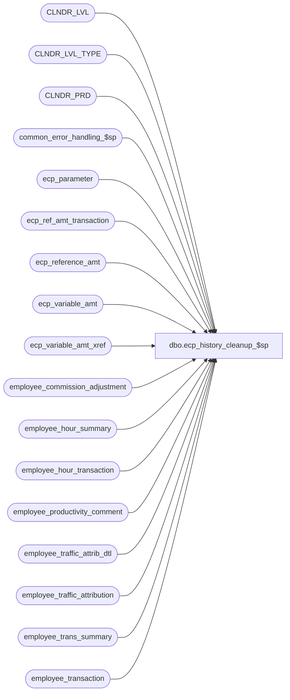

# dbo.ecp_history_cleanup_$sp

**Database:** auditworks_external  
**Server:** bedrockdb01  

## Architecture Diagram



## Table Dependencies

| Referenced Table |
|---|
| CLNDR_LVL |
| CLNDR_LVL_TYPE |
| CLNDR_PRD |
| common_error_handling_$sp |
| ecp_parameter |
| ecp_ref_amt_transaction |
| ecp_reference_amt |
| ecp_variable_amt |
| ecp_variable_amt_xref |
| employee_commission_adjustment |
| employee_hour_summary |
| employee_hour_transaction |
| employee_productivity_comment |
| employee_traffic_attrib_dtl |
| employee_traffic_attribution |
| employee_trans_summary |
| employee_transaction |

## Stored Procedure Code

```sql
create proc [dbo].[ecp_history_cleanup_$sp]    @pay_period_close_date	datetime,
   @pay_period_export_date	datetime,
   @lowest_calendar_level_id	binary(16),
   @ecp_clndr_id	        binary(16),
   @cleanup_rows		int OUTPUT

AS
/* 
Proc Name: ecp_history_cleanup_$sp 
        exec ecp_history_cleanup_$sp @pay_period_close_date, @pay_period_export_date, @lowest_calendar_level_id, @ecp_clndr_id, @cleanup_rows OUTPUT 
Desc:   Removes ECP data extending beyond history retention period defined.
        Note that since the cleanup removes only data for periods that END earlier than the start of the retention period
        summary table entries for YTD, MTD, etc may be retained while those from many of the underlying weeks are deleted
        and the drill downs on such summaries would only be partially available as a result.

HISTORY:  
Date     Name           Def#    Desc
Apr14,11 Paul          126153   Use unicode datatypes
Jan14,09 Vicci		109767	Author
*/

SET NOCOUNT ON
DECLARE
@errmsg                       nvarchar(255),
@errno                        int,
@errno2                       int,
@message_id                   int,
@process_name                 nvarchar(100),
@process_no                   int,
@object_name                  nvarchar(255),
@operation_name               nvarchar(100),
@stream_no                    tinyint,
@sql_command 		      nvarchar(3000),
@batch_datetime		      datetime,
@trace_msg		      nvarchar(255),
@history_days	      	      int,
@retention_from_date	      datetime 

SELECT @errno = 0,
       @message_id = 201068,
       @operation_name = 'Unknown',
       @process_name = 'ecp_history_cleanup_$sp',
       @process_no = 282,
       @stream_no = 1,
       @cleanup_rows = 0,
       @batch_datetime = getdate()
       
IF @ecp_clndr_id IS NULL
BEGIN
  SELECT @ecp_clndr_id = par_bin_value
    FROM ecp_parameter p
   WHERE par_name = 'ecp_dflt_clndr_id'  
  SELECT @errno = @@error
  IF @errno <> 0
  BEGIN
    SELECT @errmsg = 'Unable to which calendar to use',
           @object_name = 'ecp_parameter',
           @operation_name = 'SELECT'
    GOTO error
  END

  SELECT @lowest_calendar_level_id = CLNDR_LVL_TYPE_ID
    FROM CLNDR_LVL_TYPE
   WHERE CLNDR_LVL_SEQ = (SELECT MAX(CLNDR_LVL_SEQ)
  			    FROM CLNDR_LVL_TYPE
   			   WHERE CLNDR_LVL_TYPE_ID
			      IN (SELECT DISTINCT CLNDR_LVL_TYPE_ID
                                    FROM CLNDR_LVL
                                   WHERE CLNDR_ID = @ecp_clndr_id))
     AND CLNDR_LVL_TYPE_ID
         IN (SELECT DISTINCT CLNDR_LVL_TYPE_ID
               FROM CLNDR_LVL
              WHERE CLNDR_ID = @ecp_clndr_id)
  SELECT @errno = @@error
  IF @errno <> 0
  BEGIN
    SELECT @errmsg = 'Unable to determine which calendar level to use for employee transaction logging',
           @object_name = 'CLNDR_LVL_TYPE',
           @operation_name = 'SELECT'
    GOTO error
  END
END --IF @ecp_clndr_id IS NULL

SELECT @history_days = convert(int, par_value)
  FROM ecp_parameter
 WHERE par_name = 'ecp_history_days'
   AND IsNumeric(par_value) = 1
SELECT @errno = @@error
IF @errno <> 0
BEGIN
  SELECT @errmsg = 'Failed to determine number of history days to be retained',
         @object_name = 'ecp_parameter',
         @operation_name = 'SELECT'
  GOTO error
END
--SELECT 'Test @history_days', @history_days

IF @history_days IS NULL
  RETURN
  
SELECT @retention_from_date = dateadd(dd, -1 * @history_days, getdate())
--SELECT 'Test @retention_from_date', @retention_from_date

IF @retention_from_date > @pay_period_close_date
  SELECT @retention_from_date = @pay_period_close_date

IF @retention_from_date > @pay_period_export_date
  SELECT @retention_from_date = @pay_period_export_date
  
SELECT @retention_from_date = STRT_DATE_TIME
  FROM CLNDR_PRD
 WHERE CLNDR_ID = @ecp_clndr_id
   AND CLNDR_LVL_TYPE_ID = @lowest_calendar_level_id
   AND STRT_DATE_TIME <= @retention_from_date
   AND END_DATE_TIME > @retention_from_date
SELECT @errno = @@error
IF @errno <> 0
BEGIN
  SELECT @errmsg = 'Failed to determine first date of history period to be retained',
         @object_name = 'CLNDR_PRD',
         @operation_name = 'SELECT'
  GOTO error
END
--SELECT 'Test revised @retention_from_date', @retention_from_date
   
DELETE employee_commission_adjustment
 WHERE pay_period_end_datetime < @retention_from_date
SELECT @errno = @@error, @cleanup_rows = @cleanup_rows + @@rowcount
IF @errno <> 0
BEGIN
  SELECT @errmsg = 'Failed to clean up employee commission adjustments',
         @object_name = 'employee_commission_adjustment',
         @operation_name = 'DELETE'
  GOTO error
END

DELETE employee_trans_summary
 WHERE pay_period_end_datetime < @retention_from_date
SELECT @errno = @@error, @cleanup_rows = @cleanup_rows + @@rowcount
IF @errno <> 0
BEGIN
  SELECT @errmsg = 'Failed to clean up employee commission and productivity summary',
         @object_name = 'employee_trans_summary',
         @operation_name = 'DELETE'
  GOTO error
END
DELETE employee_transaction
  FROM employee_transaction t
       LEFT OUTER JOIN employee_trans_summary ets
         ON t.empl_trans_summary_id = ets.empl_trans_summary_id
 WHERE t.transaction_date < @retention_from_date
   AND (ets.pay_period_end_datetime < @retention_from_date
        OR ets.pay_period_end_datetime IS NULL)
SELECT @errno = @@error, @cleanup_rows = @cleanup_rows + @@rowcount
IF @errno <> 0
BEGIN
  SELECT @errmsg = 'Failed to clean up employee commission and productivity transaction drill-down support summary',
         @object_name = 'employee_transaction',
         @operation_name = 'DELETE'
  GOTO error
END
DELETE employee_productivity_comment
 WHERE period_end_datetime < @retention_from_date
SELECT @errno = @@error, @cleanup_rows = @cleanup_rows + @@rowcount
IF @errno <> 0
BEGIN
  SELECT @errmsg = 'Failed to clean up employee productivity comments.',
         @object_name = 'employee_productivity_comment',
         @operation_name = 'DELETE'
  GOTO error
END

DELETE ecp_variable_amt
 WHERE auto_adj_period_end_datetime < @retention_from_date
SELECT @errno = @@error, @cleanup_rows = @cleanup_rows + @@rowcount
IF @errno <> 0
BEGIN
  SELECT @errmsg = 'Failed to clean up variable amounts that supported period-end auto-adjustments',
         @object_name = 'ecp_variable_amt',
         @operation_name = 'DELETE'
  GOTO error
END
DELETE ecp_variable_amt_xref
 WHERE auto_adj_period_end_datetime < @retention_from_date
SELECT @errno = @@error, @cleanup_rows = @cleanup_rows + @@rowcount
IF @errno <> 0
BEGIN
  SELECT @errmsg = 'Failed to clean up the cross-reference between variable amounts that supported period-end auto-adjustments and the auto-adjustment in which they were referenced.',
         @object_name = 'ecp_variable_amt_xref',
         @operation_name = 'DELETE'
  GOTO error
END

DELETE ecp_reference_amt
 WHERE period_end_datetime < @retention_from_date
SELECT @errno = @@error, @cleanup_rows = @cleanup_rows + @@rowcount
IF @errno <> 0
BEGIN
  SELECT @errmsg = 'Failed to clean up the reference amount summary',
         @object_name = 'ecp_reference_amt',
         @operation_name = 'DELETE'
  GOTO error
END
DELETE ecp_ref_amt_transaction
  FROM ecp_ref_amt_transaction t
       LEFT OUTER JOIN ecp_reference_amt r
         ON t.ecp_reference_amt_id = r.ecp_reference_amt_id
 WHERE t.ref_amt_datetime < @retention_from_date
   AND (r.period_end_datetime IS NULL OR r.period_end_datetime < @retention_from_date)
SELECT @errno = @@error, @cleanup_rows = @cleanup_rows + @@rowcount
IF @errno <> 0
BEGIN
  SELECT @errmsg = 'Failed to clean up the transactions that contributed to a reference amount',
         @object_name = 'ecp_ref_amt_transaction',
         @operation_name = 'DELETE'
  GOTO error
END

DELETE employee_traffic_attribution
  FROM employee_traffic_attribution t
       LEFT OUTER JOIN employee_hour_summary h
        ON t.empl_hour_summary_id = h.empl_hour_summary_id
 WHERE h.period_end_datetime IS NULL OR h.period_end_datetime < @retention_from_date
SELECT @errno = @@error, @cleanup_rows = @cleanup_rows + @@rowcount
IF @errno <> 0
BEGIN
  SELECT @errmsg = 'Failed to clean up the traffic transactions attributed to employees based on their hours worked',
         @object_name = 'employee_traffic_attribution',
         @operation_name = 'DELETE'
  GOTO error
END
DELETE employee_traffic_attrib_dtl
  FROM employee_traffic_attrib_dtl t
       LEFT OUTER JOIN employee_hour_summary h
         ON t.empl_hour_summary_id = h.empl_hour_summary_id
 WHERE h.period_end_datetime IS NULL OR h.period_end_datetime < @retention_from_date
SELECT @errno = @@error, @cleanup_rows = @cleanup_rows + @@rowcount
IF @errno <> 0
BEGIN
  SELECT @errmsg = 'Failed to clean up the payroll hour transactions that caused traffice count to be attributed to employee',
         @object_name = 'employee_traffic_attrib_dtl',
         @operation_name = 'DELETE'
  GOTO error
END
DELETE employee_hour_summary
 WHERE period_end_datetime < @retention_from_date
SELECT @errno = @@error, @cleanup_rows = @cleanup_rows + @@rowcount
IF @errno <> 0
BEGIN
  SELECT @errmsg = 'Failed to clean up the payroll hour summary.',
         @object_name = 'employee_hour_summary',
         @operation_name = 'DELETE'
  GOTO error
END
DELETE employee_hour_transaction
 WHERE payroll_date < @retention_from_date
SELECT @errno = @@error, @cleanup_rows = @cleanup_rows + @@rowcount
IF @errno <> 0
BEGIN
  SELECT @errmsg = 'Failed to clean up the payroll hour transaction list.',
         @object_name = 'employee_hour_transaction',
         @operation_name = 'DELETE'
  GOTO error
END

--SELECT 'Test @cleanup_rows', @cleanup_rows
SET NOCOUNT OFF
RETURN

error:
  EXEC common_error_handling_$sp @process_no, @errno, @errmsg, 0, @message_id, @process_name, @object_name, @operation_name, 1, @stream_no

  RETURN
```

