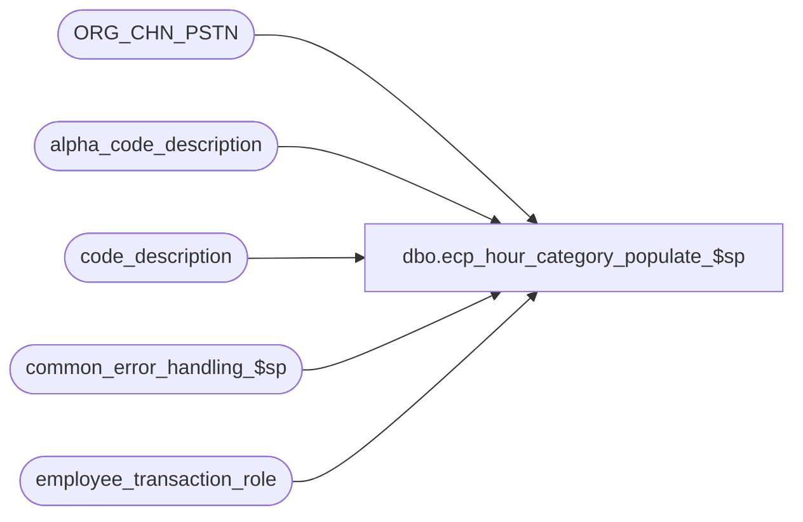

# dbo.ecp_hour_category_populate_$sp

**Database:** auditworks_external  
**Server:** bedrockdb01  

## Architecture Diagram



## Table Dependencies

| Referenced Table |
|---|
| ORG_CHN_PSTN |
| alpha_code_description |
| code_description |
| common_error_handling_$sp |
| employee_transaction_role |

## Stored Procedure Code

```sql
create proc [dbo].[ecp_hour_category_populate_$sp] AS 
/* 
Proc Name: ecp_hour_category_populate_$sp 
Desc:   Called by UI to determine to copy payroll hour types to list of those available 
        to be categorized as productive or not, and to copy employee positions to list
        of those available to be categorized as selling or not.

HISTORY:  
Date     Name           Def#    Desc
Apr14,11 Paul          126153   Use unicode datatypes
Oct01,07 Vicci          85597   Fix update condition
May09,07 Vicci          85597   Fix to handle not just inserts but update/delete as well.
May03,07 Vicci		85597	Author
*/

SET NOCOUNT ON
DECLARE
  @errmsg                       nvarchar(255),
  @errno                        int,
  @message_id                   int,
  @object_name                  nvarchar(255),
  @operation_name               nvarchar(100),
  @process_name                 nvarchar(100),
  @process_no                   int,
  @rows				int,
  @employee_transaction_role    nvarchar(20)

SELECT @message_id = 201068,
       @operation_name = 'Unknown',
       @process_name = 'ecp_hour_category_populate_$sp',
       @process_no = 0

INSERT into alpha_code_description(
       code_type,
       code,
       code_status,
       code_display_descr1,
       code_display_descr2,
       system_code)
SELECT 29, convert(nvarchar, c.code), 'U', code_display_descr, code_display_descr, 'P'
  FROM code_description c
 WHERE c.code_type = 29
   AND convert(nvarchar, c.code) NOT IN (SELECT a.code 
                                          FROM alpha_code_description a 
                                         WHERE code_type = 29
                                           AND code_status = 'U')
SELECT @errno = @@error
IF @errno <> 0
BEGIN
  SELECT @errmsg = 'Unable to copy missing payroll hour types to list of those available to be categorized as productive or not',
         @object_name = 'alpha_code_description',
         @operation_name = 'INSERT'
  GOTO error
END

UPDATE alpha_code_description
   SET code_display_descr1 = c.code_display_descr,
       code_display_descr2 = c.code_display_descr
  FROM code_description c
 WHERE alpha_code_description.code_type = 29
   AND alpha_code_description.code_status = 'U'
   AND c.code_type = 29
   AND alpha_code_description.code = convert(nvarchar, c.code)
   AND (alpha_code_description.code_display_descr1 <> c.code_display_descr OR
        alpha_code_description.code_display_descr2 <> c.code_display_descr)
SELECT @errno = @@error
IF @errno <> 0
BEGIN
  SELECT @errmsg = 'Unable to copy payroll hour types description changes to list of those available to be categorized as productive or not',
         @object_name = 'alpha_code_description',
         @operation_name = 'UPDATE'
  GOTO error
END

DELETE alpha_code_description
 WHERE alpha_code_description.code_type = 29
   AND alpha_code_description.code_status = 'U'
   AND alpha_code_description.code not in (SELECT convert(nvarchar, code)
                                             FROM code_description
                                            WHERE code_type = 29)
SELECT @errno = @@error
IF @errno <> 0
BEGIN
  SELECT @errmsg = 'Unable to copy payroll hour types deletions to list of those available to be categorized as productive or not',
         @object_name = 'alpha_code_description',
         @operation_name = 'DELETE'
  GOTO error
END

INSERT into alpha_code_description(
       code_type,
       code,
       code_status,
       code_display_descr1,
       code_display_descr2,
       system_code)
SELECT 28, PSTN_CODE, 'U', PSTN_DESC, PSTN_DESC, 'S'
  FROM ORG_CHN_PSTN
 WHERE PSTN_CODE NOT IN (SELECT code 
                           FROM alpha_code_description 
                          WHERE code_type = 28
                            AND code_status = 'U')
SELECT @errno = @@error
IF @errno <> 0
BEGIN
  SELECT @errmsg = 'Unable to copy employee positions to list of those available to be categorized as selling or not',
         @object_name = 'alpha_code_description',
         @operation_name = 'INSERT'
  GOTO error
END

UPDATE alpha_code_description
   SET code_display_descr1 = p.PSTN_DESC,
       code_display_descr2 = p.PSTN_DESC
  FROM ORG_CHN_PSTN p
 WHERE alpha_code_description.code_type = 28
   AND alpha_code_description.code_status = 'U'
   AND alpha_code_description.code = p.PSTN_CODE
   AND (code_display_descr1 <> p.PSTN_DESC OR
        code_display_descr2 <> p.PSTN_DESC)
SELECT @errno = @@error
IF @errno <> 0
BEGIN
  SELECT @errmsg = 'Unable to copy employee positions description changes to list of those available to be categorized as selling or not',
         @object_name = 'alpha_code_description',
         @operation_name = 'UPDATE'
  GOTO error
END

DELETE alpha_code_description
 WHERE alpha_code_description.code_type = 28
   AND alpha_code_description.code_status = 'U'
   AND alpha_code_description.code not in (SELECT PSTN_CODE FROM ORG_CHN_PSTN)
SELECT @errno = @@error
IF @errno <> 0
BEGIN
  SELECT @errmsg = 'Unable to copy employee positions deletions to list of those available to be categorized as selling or not',
         @object_name = 'alpha_code_description',
         @operation_name = 'DELETE'
  GOTO error
END

INSERT into alpha_code_description(
       code_type,
       code,
       code_status,
       code_display_descr1,
       code_display_descr2,
       system_code)
SELECT 27, etr.employee_transaction_role, 'S', 
       employee_transaction_role_desc, 
       employee_transaction_role_desc, '27'
  FROM employee_transaction_role etr
 WHERE identified_in_transaction_flag = 1
   AND track_in_productivity_flag = 1
   AND etr.employee_transaction_role NOT IN (SELECT a.code 
                                               FROM alpha_code_description a 
                                              WHERE code_type = 27
                                                AND code_status = 'S')
SELECT @errno = @@error
IF @errno <> 0
BEGIN
  SELECT @errmsg = 'Unable to copy missing transaction roles to list of those available for categorizing payroll entry hour positions',
         @object_name = 'alpha_code_description',
         @operation_name = 'INSERT'
  GOTO error
END

UPDATE alpha_code_description
   SET code_display_descr1 = etr.employee_transaction_role_desc,
       code_display_descr2 = etr.employee_transaction_role_desc
  FROM employee_transaction_role etr
 WHERE etr.identified_in_transaction_flag = 1
   AND etr.track_in_productivity_flag = 1
   AND alpha_code_description.code_type = 27
   AND alpha_code_description.code_status = 'S'
   AND alpha_code_description.code = etr.employee_transaction_role
   AND (code_display_descr1 <> etr.employee_transaction_role_desc OR
        code_display_descr2 <> etr.employee_transaction_role_desc)
SELECT @errno = @@error
IF @errno <> 0
BEGIN
  SELECT @errmsg = 'Unable to copy transaction role description changes to list of those available for categorizing payroll entry hour positions',
         @object_name = 'alpha_code_description',
         @operation_name = 'UPDATE'
  GOTO error
END

DELETE alpha_code_description
 WHERE code_type = 27
   AND code_status = 'S'
   AND code not in (SELECT etr.employee_transaction_role
                      FROM employee_transaction_role etr
                     WHERE identified_in_transaction_flag = 1
                       AND track_in_productivity_flag = 1)
SELECT @errno = @@error
IF @errno <> 0
BEGIN
  SELECT @errmsg = 'Unable to copy transaction role deletions to list of those available for categorizing payroll entry hour positions',
         @object_name = 'alpha_code_description',
         @operation_name = 'DELETE'
  GOTO error
END

DELETE alpha_code_description
 WHERE code_type = 27
   AND code_status = 'U'
   AND system_code not in (SELECT etr.employee_transaction_role
                             FROM employee_transaction_role etr
                            WHERE identified_in_transaction_flag = 1
 AND track_in_productivity_flag = 1)
SELECT @errno = @@error
IF @errno <> 0
BEGIN
  SELECT @errmsg = 'Unable to copy transaction role deletions to categorizing payroll entry hour positions / transaction role xref',
         @object_name = 'alpha_code_description',
         @operation_name = 'DELETE'
  GOTO error
END

SELECT @employee_transaction_role = min(employee_transaction_role)
  FROM employee_transaction_role
 WHERE identified_in_transaction_flag = 1
   AND track_in_productivity_flag = 1
   AND salesperson_flag = 1
SELECT @errno = @@error
IF @errno <> 0
BEGIN
  SELECT @errmsg = 'Failed to determine transaction role under which payroll role hours are reported by default',
         @object_name = 'employee_transaction_role',
         @operation_name = 'SELECT'
  GOTO error
END
IF @employee_transaction_role IS NULL
BEGIN
  SELECT @employee_transaction_role = min(employee_transaction_role)
    FROM employee_transaction_role
   WHERE identified_in_transaction_flag = 1
     AND track_in_productivity_flag = 1
  SELECT @errno = @@error
  IF @errno <> 0
  BEGIN
    SELECT @errmsg = 'Failed to determine 2nd choice of transaction role under which payroll role hours are reported by default',
           @object_name = 'employee_transaction_role',
           @operation_name = 'SELECT'
    GOTO error
  END
END

IF @employee_transaction_role IS NOT NULL
BEGIN
  INSERT into alpha_code_description(
         code_type,
         code,
         code_status,
         code_display_descr1,
         code_display_descr2,
         system_code)
  SELECT 27, PSTN_CODE, 'U', PSTN_DESC, PSTN_DESC, @employee_transaction_role
    FROM ORG_CHN_PSTN
   WHERE PSTN_CODE NOT IN (SELECT code 
                             FROM alpha_code_description 
                            WHERE code_type = 27
                              AND code_status = 'U')
  SELECT @errno = @@error
  IF @errno <> 0
  BEGIN
    SELECT @errmsg = 'Unable to copy employee positions to list of those available to be categorized by transaction role',
           @object_name = 'alpha_code_description',
           @operation_name = 'INSERT'
    GOTO error
  END
END

UPDATE alpha_code_description
   SET code_display_descr1 = p.PSTN_DESC,
       code_display_descr2 = p.PSTN_DESC
  FROM ORG_CHN_PSTN p
 WHERE alpha_code_description.code_type = 27
   AND alpha_code_description.code_status = 'U'
   AND alpha_code_description.code = p.PSTN_CODE
   AND (code_display_descr1 <> p.PSTN_DESC OR
        code_display_descr2 <> p.PSTN_DESC)
SELECT @errno = @@error
IF @errno <> 0
BEGIN
    SELECT @errmsg = 'Unable to copy employee positions description changes to list of those available to be categorized by transaction role',
         @object_name = 'alpha_code_description',
         @operation_name = 'UPDATE'
  GOTO error
END
DELETE alpha_code_description
 WHERE alpha_code_description.code_type = 27
   AND alpha_code_description.code_status = 'U'
   AND alpha_code_description.code not in (SELECT PSTN_CODE
                                             FROM ORG_CHN_PSTN)
SELECT @errno = @@error
IF @errno <> 0
BEGIN
    SELECT @errmsg = 'Unable to copy employee positions deletions to list of those available to be categorized by transaction role',
         @object_name = 'alpha_code_description',
         @operation_name = 'DELETE'
  GOTO error
END

RETURN

error:
  EXEC common_error_handling_$sp @process_no, @errno, @errmsg, 0, @message_id, @process_name, @object_name, @operation_name, 1, 1
  RETURN
```

