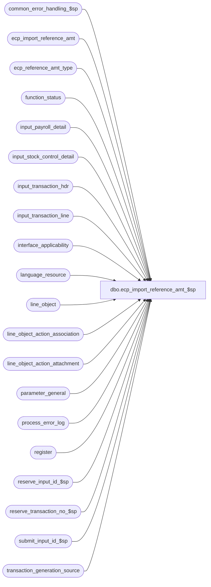

# dbo.ecp_import_reference_amt_$sp

**Database:** auditworks_external  
**Server:** bedrockdb01  

## Architecture Diagram



## Table Dependencies

| Referenced Table |
|---|
| common_error_handling_$sp |
| ecp_import_reference_amt |
| ecp_reference_amt_type |
| function_status |
| input_payroll_detail |
| input_stock_control_detail |
| input_transaction_hdr |
| input_transaction_line |
| interface_applicability |
| language_resource |
| line_object |
| line_object_action_association |
| line_object_action_attachment |
| parameter_general |
| process_error_log |
| register |
| reserve_input_id_$sp |
| reserve_transaction_no_$sp |
| submit_input_id_$sp |
| transaction_generation_source |

## Stored Procedure Code

```sql
create proc dbo.ecp_import_reference_amt_$sp 

AS
/* 
   NAME:    ecp_import_reference_amt_$sp
   DESCR:   Imports ECP reference amount data into ecp_import_reference_amt and 
            populates the input tables with transaction information generated 
            based on the information imported. The transactions 
            generated will then flow through the normal edit to update the ECP application.
            Called by ICT_IMPORT smartload.
     
HISTORY:
Date      Name           Defect#    Description
Apr03,14  Vicci           151098    Log position to reference amount information attachment (63).
Feb02,13  Vicci           141967    Resource ID missing on line_object insert causing failure since language_resource entry already exists. 
Apr20,12  Paul            134132    prevent error 2627 by setting dummy_transaction_category on insert
Feb28,12  Vicci           133336    Correct datatype of process_id since receiving procs are expecting a binary(16) in SA5
Dec17,08  Paul            106848    make compatible with SA5 by passing process_id, user_id to sub procs
Oct10,08  Vicci           104484    Verify that reference amounts are being imported at correct level for type.
Sep02,08  Vicci           104484    Author
*/

DECLARE @auto_create_missing_empl	tinyint,
        @cursor_open			tinyint,
	@errmsg				nvarchar(2000),
	@errno				int,
	@errno2				int,	
        @function_name	                varbinary(128),
	@import_row_count		int,
	@import_row_id			numeric(10,0),
	@input_id			numeric(12,0),
	@message_id			int,
	@max_import_row_id		numeric(10,0), 
	@min_import_row_id		numeric(10,0), 
        @max_lines_per_trans		smallint,
	@max_tran_no			int,
        @next_tran_no			int,
	@object_name			nvarchar(255),
	@operation_name			nvarchar(100),
	@process_name			nvarchar(100),
	@process_no 			smallint,
	@process_id  		        binary(16),
	@spid	  		        integer,
	@process_start_datetime		datetime,
	@release_41			tinyint,
	@rows				int,
	@row_no				int,
        @status			        smallint, 
        @store_no			int,
        @register_no			smallint,
        @cashier_no			int,
        @transaction_series		nchar(1),
        @transaction_category		tinyint,
        @trans_qty			int,
        @sql_command 			nvarchar(4000),
        @issue_entry_id			numeric(12,0)

SELECT @function_name = convert(varbinary(128), 'ecp_import_reference_amt_$sp'),
       @max_lines_per_trans = 100,
       @message_id = 201068,
       @operation_name = 'Unknown',
       @process_id = NEWID(), 		--TODO:  halted process recovery
       @spid = @@spid, 		--TODO:  halted process recovery
       @process_name = 'ecp_import_reference_amt_$sp',
       @process_no = 51,
       @process_start_datetime = getdate(),
       @release_41 = 0,
       @status = -1
        

SET CONTEXT_INFO @function_name   

IF EXISTS (SELECT 1
              FROM parameter_general
             WHERE release_no LIKE '4.1.%')
  SELECT @release_41 = 1

SELECT @issue_entry_id = MIN(entry_id)
  FROM ecp_import_reference_amt i
       INNER JOIN ecp_reference_amt_type t
          ON i.reference_amount_type = t.reference_amount_type
WHERE (t.employee_no_flag = 1 AND ISNULL(i.employee_no, -1) = -1)
   OR (t.store_no_flag = 1 AND ISNULL(i.store_no, -1) = -1)
   OR (t.selling_area_flag = 1 AND ISNULL(i.selling_area_no, -1) = -1)
   OR (t.position_flag = 1 AND ISNULL(i.position_code, '-1') = '-1')
SELECT @errno = @@error
IF @errno != 0 
BEGIN
  SELECT @errmsg = 'Failed to determine if any reference amounts were imported at wrong level',
         @object_name = 'ecp_import_reference_amt',
         @operation_name = 'SELECT'
  GOTO error
END  

IF @issue_entry_id > 0
BEGIN
  SELECT @errmsg = 'Certain reference amounts were imported at wrong level, for example for type ' + convert(nvarchar, reference_amount_type) + ' the entry for store ' + IsNull(convert(nvarchar, store_no), '') + ' area ' + IsNull(convert(nvarchar, selling_area_no), '') + ' position ' + IsNull(position_code, '') + ' employee ' + IsNull(convert(nvarchar, employee_no), ''), 
         @object_name = 'ecp_import_reference_amt',
         @operation_name = 'SELECT'
    FROM ecp_import_reference_amt 
   WHERE entry_id = @issue_entry_id
  GOTO error
END

SELECT @store_no = g.store_no,
       @register_no = r.register_no,
       @cashier_no = g.cashier_no,
       @transaction_series = g.transaction_series,
       @transaction_category = g.transaction_category
  FROM transaction_generation_source g
       LEFT OUTER JOIN register r         --S/A 5.0 still has this as view
         ON g.store_no = r.store_no
        AND g.register_no = r.register_no
 WHERE process_no = @process_no    
SELECT @errno = @@error
IF @errno != 0
BEGIN
  SELECT @errmsg = 'Failed to select from transaction_generation_source.',
         @object_name = 'transaction_generation_source',
         @operation_name = 'SELECT'
  GOTO error
END 

IF @register_no IS NULL
BEGIN
  SELECT @errmsg = 'Transaction generation source table has not been set up',
	 @errno = 201678,
         @message_id = 201678
  GOTO error
END        

SELECT @trans_qty = CEILING(CONVERT(FLOAT,COUNT(*))/@max_lines_per_trans)
  FROM ecp_import_reference_amt
SELECT @errno = @@error
IF @errno != 0
BEGIN
  SELECT @errmsg = 'Failed to determine number of transactions to generate',
         @object_name = 'ecp_import_reference_amt',
         @operation_name = 'SELECT'
  GOTO error
END 

IF @trans_qty = 0
  GOTO reset_exit

IF @release_41 = 1
  EXEC reserve_input_id_$sp null, @input_id OUTPUT, @errmsg OUTPUT, @process_no
ELSE
  EXEC reserve_input_id_$sp @process_id, null, null, @input_id OUTPUT, @errmsg OUTPUT, @process_no

SELECT @errno = @@error
IF @errno != 0
BEGIN
  IF @errmsg IS NULL -- 
    SELECT @errmsg = 'Failed to execute stored proc reserve_input_id_$sp.'
  SELECT @object_name = 'reserve_input_id_$sp',
         @operation_name = 'EXECUTE'
  GOTO error
END

IF @release_41 = 1
  EXEC reserve_transaction_no_$sp @process_no, @store_no,@register_no,@transaction_series,
     @trans_qty, @max_tran_no OUTPUT, @next_tran_no OUTPUT, @errmsg OUTPUT
ELSE
  EXEC reserve_transaction_no_$sp @process_id, null, @process_no, @store_no, @register_no, @transaction_series,
     @trans_qty, @max_tran_no OUTPUT, @next_tran_no OUTPUT, @errmsg OUTPUT

SELECT @errno = @@error
IF @errno != 0
BEGIN
  IF @errmsg IS NULL --
    SELECT @errmsg = 'Failed to execute stored procedure reserve_transaction_no_$sp'
  SELECT @object_name = 'reserve_transaction_no_$sp',
         @operation_name = 'EXECUTE'
  GOTO error
END

IF NOT EXISTS (SELECT line_object 
                 FROM line_object
                WHERE line_object_type = 14 and line_object = 9064)
BEGIN
  INSERT INTO line_object(
         line_object,
         line_object_type,
         line_object_description,
         default_tax_rate_code, 
         resource_id)
  SELECT 9064,
         14,
         'Reference-amount import',
         0, 
         l.resource_id
    FROM (SELECT 'line_object' table_name, '9064' table_key) o
         LEFT OUTER JOIN language_resource l
           ON o.table_name = l.table_name
          AND o.table_key = l.table_key
  SELECT @errno = @@error
  IF @errno != 0
  BEGIN
    SELECT @errmsg = 'Failed to insert reference-amount line_object',
           @object_name = 'line_object',
           @operation_name = 'INSERT'
    GOTO error
  END 
END
IF NOT EXISTS (SELECT line_object
                 FROM line_object_action_association
                WHERE transaction_category = @transaction_category
                  AND line_object = 9064
                  AND line_action = 38)  
BEGIN
  INSERT INTO line_object_action_association
         (transaction_category,
         line_object,
         line_action,
         line_object_type,
         db_cr_none,
         store_balance_group,
         reference_type,
         reference_no_option)
  VALUES (@transaction_category,
         9064,
         38,
         14,
         0,
         0,
         222,
         1)
  SELECT @errno = @@error
  IF @errno != 0
  BEGIN
    SELECT @errmsg = 'Failed to insert reference-amount line_object_action_association.',
           @object_name = 'line_object_action_association',
           @operation_name = 'INSERT'
    GOTO error
  END 
END
IF NOT EXISTS (SELECT line_object
                 FROM line_object_action_attachment
                WHERE (transaction_category = @transaction_category
                       OR transaction_category IS NULL)
                  AND attachment_type = 3
                  AND line_object = 9064
                  AND line_action = 38
                  AND note_type = 63)
BEGIN 
  INSERT INTO line_object_action_attachment
         (line_object,
         line_action,
         transaction_category,
         attachment_type,
         note_type,
         upc_lookup_division,
         dummy_transaction_category)
  VALUES (9064,
         38,
         @transaction_category,
         3, 
         63,
         0,
         COALESCE(CONVERT(nvarchar,@transaction_category),'null'))                
  SELECT @errno = @@error
  IF @errno != 0
  BEGIN
    SELECT @errmsg = 'Failed to insert reference amount info line_object_action_attachment.',
           @object_name = 'line_object_action_attachment',
           @operation_name = 'INSERT'
    GOTO error
  END                                
END        

IF NOT EXISTS (SELECT line_object
                 FROM line_object_action_attachment
                WHERE (transaction_category = @transaction_category
                       OR transaction_category IS NULL)
                  AND attachment_type = 6
                  AND line_object = 9064
                  AND line_action = 38)
BEGIN 
  INSERT INTO line_object_action_attachment
         (line_object,
         line_action,
         transaction_category,
         attachment_type, 
         note_type,
         attachment_mandatory,
         dummy_transaction_category)
  VALUES (9064,
         38,
         @transaction_category,
         6,
         0,
         0,
         COALESCE(CONVERT(nvarchar,@transaction_category),'null'))                
  SELECT @errno = @@error
  IF @errno != 0
  BEGIN
    SELECT @errmsg = 'Failed to insert payroll line_object_action_attachment.',
           @object_name = 'line_object_action_attachment',
           @operation_name = 'INSERT'
    GOTO error
  END                                
END          

IF NOT EXISTS (SELECT line_object
                 FROM interface_applicability
                WHERE transaction_category = @transaction_category
                  AND interface_id = 44
                  AND line_object = 9064
                  AND line_action = 38)
BEGIN 
  INSERT INTO interface_applicability
           (interface_id,
	    line_object,
	    line_action,
	    transaction_category)
  VALUES (44,
	  9064,
	  38,
          @transaction_category)                
  SELECT @errno = @@error
  IF @errno != 0
  BEGIN
    SELECT @errmsg = 'Failed to insert interface_applicability for ECP ref-amt feed',
           @object_name = 'interface_applicability',
           @operation_name = 'INSERT'
    GOTO error
  END                                
END              

IF NOT EXISTS (SELECT line_object 
                 FROM line_object
                WHERE line_object_type = 14 AND line_object = 9065)
BEGIN
  INSERT INTO line_object(line_object,
                        line_object_type,
                        line_object_description,
                        default_tax_rate_code)
  VALUES(9065,
         14,
         'Customer',
         0)
    SELECT @errno = @@error
    IF @errno != 0
      BEGIN
        SELECT @errmsg = 'Failed to insert customer traffic count line_object',
               @object_name = 'line_object',
               @operation_name = 'INSERT'
        GOTO error
      END 
END
IF NOT EXISTS (SELECT line_object
                 FROM line_object_action_association
                WHERE transaction_category = @transaction_category
                  AND line_object = 9065
                  AND line_action = 244)  
BEGIN
  INSERT INTO line_object_action_association
         (transaction_category,
         line_object,
         line_action,
         line_object_type,
         db_cr_none,
         store_balance_group,
         reference_type,
         reference_no_option)
  SELECT @transaction_category,
         9065,
         244,
         14,
         0,
         0,
         0,
         1
  SELECT @errno = @@error
  IF @errno != 0
  BEGIN
    SELECT @errmsg = 'Failed to insert reference-amount line_object_action_association.',
 @object_name = 'line_object_action_association',
           @operation_name = 'INSERT'
    GOTO error
  END 
END

IF NOT EXISTS (SELECT line_object
                 FROM line_object_action_attachment
                WHERE (transaction_category = @transaction_category
                       OR transaction_category IS NULL)
                  AND attachment_type = 3
                  AND line_object = 9065
                  AND line_action = 244
                  AND note_type = 64)
BEGIN 
  INSERT INTO line_object_action_attachment
         (line_object,
         line_action,
         transaction_category,
         attachment_type,
         note_type,
         dummy_transaction_category)
  VALUES (9065,
         244,
         @transaction_category,
         3, 
         64,
         COALESCE(CONVERT(nvarchar,@transaction_category),'null'))                
  SELECT @errno = @@error
  IF @errno != 0
  BEGIN
    SELECT @errmsg = 'Failed to insert traffic count info line_object_action_attachment.',
           @object_name = 'line_object_action_attachment',
           @operation_name = 'INSERT'
    GOTO error
  END                                
END          
IF NOT EXISTS (SELECT line_object
                 FROM interface_applicability
                WHERE transaction_category = @transaction_category
                  AND interface_id = 44
                  AND line_object = 9065
                  AND line_action = 244)
BEGIN 
  INSERT INTO interface_applicability
           (interface_id,
            line_object,
            line_action,
            transaction_category)
  VALUES (44,
          9065,
          244,
          @transaction_category)                
  SELECT @errno = @@error
  IF @errno != 0
  BEGIN
    SELECT @errmsg = 'Failed to insert interface_applicability for ECP traffic-count feed',
           @object_name = 'interface_applicability',
           @operation_name = 'INSERT'
    GOTO error
  END                                
END              

INSERT INTO input_transaction_line (
       input_id, 
       store_no, 
       register_no, 
       entry_date_time, 
       transaction_series, 
       transaction_no, 
       line_id, 
       line_object, 
       line_action, 
       gross_line_amount,
       reference_no)
SELECT @input_id, 
       @store_no, 
       @register_no, 
       @process_start_datetime, 
       @transaction_series, 
       (@next_tran_no + CONVERT(int, (i.entry_id-1)/@max_lines_per_trans)), 
       entry_id - CONVERT(int, (i.entry_id-1)/@max_lines_per_trans) * @max_lines_per_trans, 
       CASE WHEN i.reference_amount_type = 1 THEN 9065 ELSE 9064 END line_object, 
       CASE WHEN i.reference_amount_type = 1 THEN 244 ELSE 38 END line_action, 
       CASE WHEN t.sensitivity_flag = 0 THEN i.reference_amount ELSE 0 END gross_line_amount,
       CASE WHEN t.sensitivity_flag > 0 THEN CONVERT(nvarchar, i.reference_amount) ELSE NULL END reference_no
  FROM ecp_import_reference_amt i
    INNER JOIN ecp_reference_amt_type t
          ON i.reference_amount_type = t.reference_amount_type
SELECT @errno = @@error
IF @errno != 0 
BEGIN
  SELECT @errmsg = 'Failed to insert input_transaction_line',
         @object_name = 'input_transaction_line',
         @operation_name = 'INSERT'
  GOTO error
END  

INSERT INTO input_stock_control_detail(
       input_id,
       store_no,
       register_no,
       entry_date_time,  
       transaction_series,
       transaction_no,
       line_id,
       units,
       other_store_no,       
       pos_deptclass,
       count_date, 
       vendor_no,
       location_no,
       display_def_id,
       reason)
SELECT @input_id, 
       @store_no, 
       @register_no, 
       @process_start_datetime, 
       @transaction_series, 
       (@next_tran_no + CONVERT(int, (i.entry_id-1)/@max_lines_per_trans)), 
       entry_id - CONVERT(int, (i.entry_id-1)/@max_lines_per_trans) * @max_lines_per_trans, 
       CASE WHEN i.reference_amount_type = 1 THEN i.time_interval_duration_minutes ELSE null END units, 
       i.store_no other_store_no,
       i.selling_area_no pos_deptclass,
       i.effective_datetime count_date,
       CASE WHEN IsNull(i.employee_last_name, '') <> '' OR IsNull(i.employee_first_name, '') <> '' THEN IsNull(employee_last_name, '') + CASE WHEN IsNull(employee_last_name, '') <> '' THEN ', ' ELSE '' END + IsNull(employee_first_name, '') ELSE NULL END vendor,
       CASE WHEN i.reference_amount_type = 1 THEN NULL ELSE i.reference_amount_type END location_no, 
       CASE WHEN i.reference_amount_type = 1 THEN 64 ELSE 63 END display_def_id,
       CASE WHEN i.reference_amount_type = 1 THEN NULL ELSE position_code END
  FROM ecp_import_reference_amt i
       INNER JOIN ecp_reference_amt_type t
          ON i.reference_amount_type = t.reference_amount_type
SELECT @errno = @@error
IF @errno != 0 
BEGIN
  SELECT @errmsg = 'Failed to insert input_stock_control_detail',
         @object_name = 'input_stock_control_detail',
         @operation_name = 'INSERT'
 GOTO error
END  

INSERT INTO input_payroll_detail(
       input_id,
       store_no,
       register_no,
       entry_date_time,
       transaction_series,
       transaction_no,
       line_id,
       employee_no,
       payroll_entry_type,
       employee_type)
SELECT @input_id, 
       @store_no, 
       @register_no, 
       @process_start_datetime, 
       @transaction_series, 
       (@next_tran_no + CONVERT(int, (i.entry_id-1)/@max_lines_per_trans)), 
       i.entry_id - CONVERT(int, (i.entry_id-1)/@max_lines_per_trans) * @max_lines_per_trans, 
       i.employee_no,
       -1,
       position_code  --needed even if null, otherwise it logs 0
  FROM ecp_import_reference_amt i
       INNER JOIN ecp_reference_amt_type t
          ON i.reference_amount_type = t.reference_amount_type
 WHERE i.employee_no IS NOT NULL
SELECT @errno = @@error
IF @errno != 0 
BEGIN
  SELECT @errmsg = 'Failed to insert input_payroll_detail',
         @object_name = 'input_payroll_detail',
         @operation_name = 'INSERT'
  GOTO error
END  

INSERT INTO input_transaction_hdr (
  	input_id, 
  	store_no, 
  	register_no, 
  	entry_date_time, 
  	transaction_series, 
  	transaction_no, 
  	cashier_no, 
  	transaction_category  )
SELECT
  	@input_id, 
  	@store_no, 
  	@register_no, 
  	@process_start_datetime, 
  	@transaction_series, 
  	transaction_no, 
  	@cashier_no, 
  	@transaction_category
  FROM input_transaction_line
 WHERE input_id = @input_id 
   AND line_id = 1
SELECT @errno = @@error
IF @errno != 0 
BEGIN
  SELECT @errmsg = 'Failed to insert input_transaction_hdr',
         @object_name = 'input_transaction_hdr',
         @operation_name = 'INSERT'
  GOTO error
END  

IF @release_41 = 1
BEGIN
  UPDATE function_status
     SET status = 1
   WHERE process_id = @spid
     AND function_no = @process_no
  SELECT @errno = @@error
  IF @errno <> 0
  BEGIN
    SELECT @errmsg = 'Unable to update function_status',
  	   @object_name = 'function_status',
	   @operation_name = 'UPDATE'
    GOTO error
  END

  EXEC submit_input_id_$sp @input_id, @process_start_datetime OUTPUT, @errmsg OUTPUT
  SELECT @errno = @@error
  IF @errno <> 0
  BEGIN
    SELECT @errmsg = 'Unable to execute submit_input_is_$sp for S/A 4.1',
	   @object_name = 'submit_input_is_$sp',
	   @operation_name = 'EXEC'
    GOTO error
  END
END
ELSE
BEGIN
  UPDATE function_status
     SET status = 1
   WHERE process_id = @process_id
     AND function_no = @process_no
  SELECT @errno = @@error
  IF @errno <> 0
  BEGIN
    SELECT @errmsg = 'Unable to update function_status',
  	   @object_name = 'function_status',
	   @operation_name = 'UPDATE'
    GOTO error
  END

  EXEC submit_input_id_$sp @process_id, null, @input_id, @process_start_datetime OUTPUT, @errmsg OUTPUT
  SELECT @errno = @@error
  IF @errno <> 0
  BEGIN
    SELECT @errmsg = 'Unable to execute submit_input_is_$sp',
	   @object_name = 'submit_input_is_$sp',
	   @operation_name = 'EXEC'
    GOTO error
  END
END

UPDATE process_error_log
   SET verified = 1 
 WHERE error_timestamp >= dateadd(dd, -30, getdate())
   AND process_no in (7, 51) --ecp import
   AND verified = 0
   AND (object_name = 'ecp_import_reference_amt' OR process_name = 'ecp_import_reference_amt_$sp')

reset_exit:
SELECT @function_name = convert(varbinary(128), 'Unknown')
SET CONTEXT_INFO @function_name
RETURN

error:   		-- common error handler 
        SELECT @function_name = convert(varbinary(128), 'Unknown')
        SET CONTEXT_INFO @function_name 

	IF @release_41 = 1	
	  EXEC common_error_handling_$sp @process_no, @errno, @errmsg, 0, @message_id, 
	       @process_name, @object_name, @operation_name, 1
	ELSE	
	   EXEC common_error_handling_$sp @process_no, @errno, @errmsg, 0, @message_id, 
	        @process_name, @object_name, @operation_name, 1, 1, 0, null, 0, null, null, 
	        null, null, null, null, 0, @process_id, NULL


	RETURN
```

