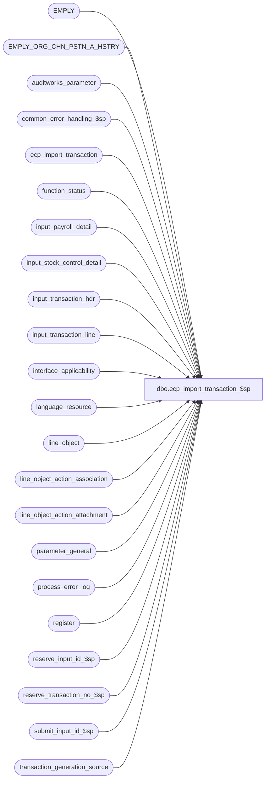

# dbo.ecp_import_transaction_$sp

**Database:** auditworks_external  
**Server:** bedrockdb01  

## Architecture Diagram



## Table Dependencies

| Referenced Table |
|---|
| EMPLY |
| EMPLY_ORG_CHN_PSTN_A_HSTRY |
| auditworks_parameter |
| common_error_handling_$sp |
| ecp_import_transaction |
| function_status |
| input_payroll_detail |
| input_stock_control_detail |
| input_transaction_hdr |
| input_transaction_line |
| interface_applicability |
| language_resource |
| line_object |
| line_object_action_association |
| line_object_action_attachment |
| parameter_general |
| process_error_log |
| register |
| reserve_input_id_$sp |
| reserve_transaction_no_$sp |
| submit_input_id_$sp |
| transaction_generation_source |

## Stored Procedure Code

```sql
create proc dbo.ecp_import_transaction_$sp 
AS
/* 
   NAME:    ecp_import_transaction_$sp
   DESCR:   Imports ECP transaction data into ecp_import_transaction and 
            populates the input tables with transaction information generated 
            based on the information imported. The transactions 
            generated will then flow through the normal edit to update the ECP application.
            Called by ICT_IMPORT smartload.
     
HISTORY:
Date      Name           Defect#    Description
Feb13,14  Vicci           149581    Avoid 'Cannot insert duplicate key row in object dbo.language_resource with unique index language_resource_x1.' error.
Apr20,12  Paul            134132    prevent error 2627 by setting dummy_transaction_category on insert
Feb28,12  Vicci           133336    Correct datatype of process_id since receiving procs are expecting a binary(16) in SA5
Dec17,08  Paul            106848    make compatible with SA5 by passing process_id, user_id to sub procs
Sep03,08  Vicci           104484    Nullify payroll-detail employee-type and set entry position to -2 = ecp trans import
Sep02,08  Vicci           103077    Support effective dates on home-store selection
Apr30,08  Vicci		   95521    Only do S/A 4.1 code via dynamic sql to avoid compilation errors in 5.0    
Feb04,08  Vicci            97607    Auto-verify process-errors upon successful completion.
Dec14,07  Vicci            95521    Only auto-create employee in S/A 4.1
Aug06,07  Paul             85597    Look up employee home store 
Jul11,07  Vicci            85597    Log employee number to payroll detail so that it gets validated
Jun11,07  Vicci	           85597    Author
*/

DECLARE @auto_create_missing_empl	tinyint,
        @cursor_open			tinyint,
	@errmsg				nvarchar(2000),
	@errno				int,
	@errno2				int,	
        @function_name	                varbinary(128),
	@import_row_count		int,
	@import_row_id			numeric(10,0),
	@input_id			numeric(12,0),
	@message_id			int,
	@max_import_row_id		numeric(10,0), 
	@min_import_row_id		numeric(10,0), 
        @max_lines_per_trans		smallint,
	@max_tran_no			int,
        @next_tran_no			int,
	@object_name			nvarchar(255),
	@operation_name			nvarchar(100),
	@process_name			nvarchar(100),
	@process_no 			smallint,
	@process_id  		        binary(16),
	@spid	  		        integer,
	@process_start_datetime		datetime,
	@release_41			tinyint,
	@rows				int,
	@row_no				int,
        @status			        smallint, 
        @store_no			int,
        @register_no			smallint,
        @cashier_no			int,
        @transaction_series		nchar(1),
        @transaction_category		tinyint,
        @trans_qty			int,
        @sql_command 			nvarchar(4000),
        @resource_id			numeric(12,0)

SELECT @function_name = CONVERT(varbinary(128), 'ecp_import_transaction_$sp'),
       @max_lines_per_trans = 100,
       @message_id = 201068,
       @operation_name = 'Unknown',
       @process_id = NEWID(), 		--TODO:  halted process recovery
       @spid = @@spid, 		--TODO:  halted process recovery
       @process_name = 'ecp_import_transaction_$sp',
       @process_no = 51,
       @process_start_datetime = getdate(),
       @release_41 = 0,
       @status = -1

SET CONTEXT_INFO @function_name

IF EXISTS (SELECT 1
              FROM parameter_general
             WHERE release_no LIKE '4.1.%')
  SELECT @release_41 = 1

/* set transaction_store_no to employee home store if transaction_store_no is not provided in the import file */

UPDATE ecp_import_transaction
   SET transaction_store_no = IsNull(ep.ORG_CHN_NUM, e.PRMY_ORG_CHN_NUM)
  FROM ecp_import_transaction ecp
       INNER JOIN EMPLY e
          ON ecp.employee_no = e.EMPLY_NUM
        LEFT OUTER JOIN EMPLY_ORG_CHN_PSTN_A_HSTRY ep 	
          ON ecp.employee_no = ep.EMPLY_NUM
         AND ecp.period_end_datetime >= ep.EFCTV_DATE
         AND (ecp.period_end_datetime < ep.EXPRTN_DATE OR ep.EXPRTN_DATE IS NULL)
            AND ep.PRMRY_LOC_A = 1
 WHERE ecp.transaction_store_no IS NULL
   

SELECT @errno = @@error
IF @errno != 0
BEGIN
  SELECT @errmsg = 'Failed to set transaction_store_no',
    @object_name = 'ecp_import_transaction',
         @operation_name = 'UPDATE'
    GOTO error
END

IF EXISTS (SELECT 1 
             FROM auditworks_parameter
            WHERE par_name = 'ecp_auto_create_missing_empl'
              AND par_value = '1')
AND EXISTS (SELECT 1
              FROM parameter_general
             WHERE release_no like '4.1.%')              
BEGIN       
  SELECT @sql_command = '
  INSERT into employee(employee_no, 
         employee_first_name,
         employee_last_name,
         home_store_no,
         verified)
  SELECT employee_no, 
         MAX(substring(employee_first_name, 1, 20)), 
         MAX(substring(employee_last_name, 1, 20)),
         MAX(transaction_store_no),
         0
    FROM ecp_import_transaction
   WHERE employee_no NOT IN (SELECT e.employee_no
                               FROM ecp_import_transaction t
                                    INNER JOIN employee e
                                    ON t.employee_no = e.employee_no)
     AND employee_first_name IS NOT NULL
     AND employee_last_name IS NOT NULL
   GROUP BY employee_no
  SELECT @errno = @@error'

    EXEC sp_executesql @sql_command, N'@errno int OUT', @errno OUT              
    SELECT @errno2 = @@error
    IF @errno <> 0 OR @errno2 <> 0
    BEGIN
      PRINT @sql_command
      IF @errno2 <> 0 SELECT @errno = @errno2
      SELECT @errmsg = 'Failed to create missing employees via dynamic SQL',
             @object_name = 'employee',
             @operation_name = 'INSERT'
        GOTO error
    END                       
END  --IF ecp_auto_create_missing_empl = 1

SELECT @store_no = g.store_no,
       @register_no = r.register_no,
       @cashier_no = g.cashier_no,
       @transaction_series = g.transaction_series,
       @transaction_category = g.transaction_category
  FROM transaction_generation_source g
       LEFT OUTER JOIN register r         -- view exists in S/A 5.0
         ON g.store_no = r.store_no
        AND g.register_no = r.register_no
 WHERE process_no = @process_no    
SELECT @errno = @@error
IF @errno != 0
BEGIN
  SELECT @errmsg = 'Failed to select from transaction_generation_source.',
         @object_name = 'transaction_generation_source',
         @operation_name = 'SELECT'
  GOTO error
END 

IF @register_no IS NULL
BEGIN
  SELECT @errmsg = 'Transaction generation source table has not been set up',
 @errno = 201678,
         @message_id = 201678
  GOTO error
END        

SELECT @trans_qty = CEILING(CONVERT(FLOAT,COUNT(*))/@max_lines_per_trans)
  FROM ecp_import_transaction
SELECT @errno = @@error
IF @errno != 0
BEGIN
  SELECT @errmsg = 'Failed to determine number of transactions to generate',
         @object_name = 'ecp_import_hours',
         @operation_name = 'SELECT'
  GOTO error
END 

IF @trans_qty = 0
  GOTO reset_exit

IF @release_41 = 1
  EXEC reserve_input_id_$sp null, @input_id OUTPUT, @errmsg OUTPUT, @process_no
ELSE
  EXEC reserve_input_id_$sp @process_id, null, null, @input_id OUTPUT, @errmsg OUTPUT, @process_no

SELECT @errno = @@error
IF @errno != 0
BEGIN
  IF @errmsg IS NULL -- 
    SELECT @errmsg = 'Failed to execute stored proc reserve_input_id_$sp.'
  SELECT @object_name = 'reserve_input_id_$sp',
         @operation_name = 'EXECUTE'
  GOTO error
END

IF @release_41 = 1
  EXEC reserve_transaction_no_$sp @process_no, @store_no,@register_no,@transaction_series,
     @trans_qty, @max_tran_no OUTPUT, @next_tran_no OUTPUT, @errmsg OUTPUT
ELSE
  EXEC reserve_transaction_no_$sp @process_id, null, @process_no, @store_no, @register_no, @transaction_series,
     @trans_qty, @max_tran_no OUTPUT, @next_tran_no OUTPUT, @errmsg OUTPUT

SELECT @errno = @@error
IF @errno != 0
BEGIN
  IF @errmsg IS NULL --
    SELECT @errmsg = 'Failed to execute stored procedure reserve_transaction_no_$sp'
  SELECT @object_name = 'reserve_transaction_no_$sp',
         @operation_name = 'EXECUTE'
  GOTO error
END
IF NOT EXISTS (SELECT line_object 
                 FROM line_object
      WHERE line_object_type = 14 and line_object = 9063)
BEGIN
  SELECT @resource_id = NULL
  SELECT @resource_id = resource_id
    FROM language_resource
   WHERE table_name = 'line_object'
     AND table_key = '9063'
  SELECT @errno = @@error
  IF @errno <> 0
  BEGIN
    SELECT @errmsg = 'Failed to determine if resource_id already exists. ',
  	   @object_name = 'language_resource',
	   @operation_name = 'SELECT'
    GOTO error
  END

  INSERT into line_object(line_object,
                        line_object_type,
                        line_object_description,
                        default_tax_rate_code,
                        resource_id)
  VALUES(9063,
         14,
         'History import',
         0,
         @resource_id)
    SELECT @errno = @@error
    IF @errno != 0
      BEGIN
        SELECT @errmsg = 'Failed to insert line_object',
               @object_name = 'line_object',
               @operation_name = 'INSERT'
        GOTO error
      END 
END

IF NOT EXISTS (SELECT line_object
                 FROM line_object_action_association
                WHERE transaction_category = @transaction_category
                  AND line_object = 9063
                  AND line_action = 38)  
  BEGIN
    INSERT INTO line_object_action_association
           (transaction_category,
            line_object,
            line_action,
            line_object_type,
            db_cr_none,
            store_balance_group,
            reference_type,
            reference_no_option)
    SELECT @transaction_category,
           9063,
           38,
           14,
           0,
           0,
           0,
           1
    SELECT @errno = @@error
    IF @errno != 0
      BEGIN
        SELECT @errmsg = 'Failed to insert line_object_action_association.',
	    @object_name = 'line_object_action_association',
	    @operation_name = 'INSERT'
        GOTO error
      END 
  END

IF NOT EXISTS (SELECT line_object
                 FROM line_object_action_attachment
                WHERE (transaction_category = @transaction_category
                       OR transaction_category IS NULL)
                  AND attachment_type = 3
                  AND line_object = 9063
                  AND line_action = 38
                  AND note_type = 60)
  BEGIN 
    INSERT INTO line_object_action_attachment
           (line_object,
            line_action,
            transaction_category,
            attachment_type,
            note_type,
            dummy_transaction_category)
    VALUES (9063,
            38,
            @transaction_category,
            3, 
            60,
            COALESCE(CONVERT(nvarchar,@transaction_category),'null'))                
    SELECT @errno = @@error
    IF @errno != 0
      BEGIN
        SELECT @errmsg = 'Failed to insert line_object_action_attachment.',
               @object_name = 'line_object_action_attachment',
               @operation_name = 'INSERT'
        GOTO error
      END                                
  END          

IF NOT EXISTS (SELECT line_object
                 FROM line_object_action_attachment
                WHERE (transaction_category = @transaction_category
                       OR transaction_category IS NULL)
                  AND attachment_type = 6
                  AND line_object = 9063
                  AND line_action = 38)
  BEGIN 
    INSERT INTO line_object_action_attachment
           (line_object,
            line_action,
            transaction_category,
            attachment_type, 
            note_type,
            dummy_transaction_category)
    VALUES (9063,
      38,
            @transaction_category,
            6,
           0,
            COALESCE(CONVERT(nvarchar,@transaction_category),'null'))                
    SELECT @errno = @@error
    IF @errno != 0
      BEGIN
        SELECT @errmsg = 'Failed to insert payroll line_object_action_attachment.',
               @object_name = 'line_object_action_attachment',
               @operation_name = 'INSERT'
        GOTO error
      END                                
  END          

IF NOT EXISTS (SELECT line_object
                 FROM interface_applicability
                WHERE transaction_category = @transaction_category
   AND interface_id = 44
                  AND line_object = 9063
                  AND line_action = 38)
BEGIN 
  INSERT INTO interface_applicability
           (interface_id,
            line_object,
            line_action,
            transaction_category)
  VALUES (44,
            9063,
            38,
            @transaction_category)                
  SELECT @errno = @@error
  IF @errno != 0
  BEGIN
    SELECT @errmsg = 'Failed to insert interface_applicability for ECP trans feed',
       @object_name = 'interface_applicability',
           @operation_name = 'INSERT'
    GOTO error
  END                                
END              

INSERT INTO input_transaction_line (
       input_id, 
       store_no, 
       register_no, 
       entry_date_time, 
       transaction_series, 
       transaction_no, 
       line_id, 
       line_object, 
       line_action, 
       gross_line_amount)
SELECT @input_id, 
       @store_no, 
       @register_no, 
       @process_start_datetime, 
       @transaction_series, 
       (@next_tran_no + CONVERT(int, (entry_id-1)/@max_lines_per_trans)), 
       entry_id - CONVERT(int, (entry_id-1)/@max_lines_per_trans) * @max_lines_per_trans, 
       9063, 
       38, 
      transaction_amount
  FROM ecp_import_transaction
SELECT @errno = @@error
IF @errno != 0 
BEGIN
  SELECT @errmsg = 'Failed to insert into input_transaction_line',
         @object_name = 'input_transaction_line',
         @operation_name = 'INSERT'
  GOTO error
END  

INSERT into input_stock_control_detail(
       input_id,
       store_no,
       register_no,
       entry_date_time,
       transaction_series,
       transaction_no,
       line_id,
       units,
       other_store_no,       
       pos_deptclass,
       pos_identifier,
       count_date, 
       imrd,
       reason,       
       vendor_no,
       display_def_id)
SELECT @input_id, 
       @store_no, 
       @register_no, 
       @process_start_datetime, 
       @transaction_series, 
       (@next_tran_no + CONVERT(int, (entry_id-1)/@max_lines_per_trans)), 
       entry_id - CONVERT(int, (entry_id-1)/@max_lines_per_trans) * @max_lines_per_trans, 
       commission_amount, 
       transaction_store_no,
       transaction_units,
       item_commission_code,
       period_end_datetime,
       transaction_commission_code,
       employee_transaction_role,
       CASE WHEN IsNull(employee_last_name, '') <> '' OR IsNull(employee_first_name, '') <> '' THEN IsNull(employee_last_name, '') + CASE WHEN IsNull(employee_last_name, '') <> '' THEN ', ' ELSE '' END + IsNull(employee_first_name, '') ELSE NULL END,
       60
  FROM ecp_import_transaction i
SELECT @errno = @@error
IF @errno != 0 
BEGIN
  SELECT @errmsg = 'Failed to insert into input_stock_control_detail',
         @object_name = 'input_stock_control_detail',
         @operation_name = 'INSERT'
 GOTO error
END  

INSERT into input_payroll_detail(
       input_id,
       store_no,
       register_no,
       entry_date_time,
       transaction_series,
       transaction_no,
       line_id,
       employee_no,
       employee_type,
       payroll_entry_type)
SELECT @input_id, 
       @store_no, 
       @register_no, 
       @process_start_datetime, 
       @transaction_series, 
       (@next_tran_no + CONVERT(int, (entry_id-1)/@max_lines_per_trans)), 
       entry_id - CONVERT(int, (entry_id-1)/@max_lines_per_trans) * @max_lines_per_trans, 
       employee_no,
       null,
       -2
  FROM ecp_import_transaction i
SELECT @errno = @@error
IF @errno != 0 
BEGIN
  SELECT @errmsg = 'Failed to insert into input_payroll_detail',
         @object_name = 'input_payroll_detail',
         @operation_name = 'INSERT'
  GOTO error
END  

INSERT INTO input_transaction_hdr (
  	input_id, 
  	store_no, 
  	register_no, 
  	entry_date_time, 
  	transaction_series, 
  	transaction_no, 
  	cashier_no, 
  	transaction_category  )
SELECT
  	@input_id, 
  	@store_no, 
  	@register_no, 
  	@process_start_datetime, 
  	@transaction_series, 
  	transaction_no, 
  	@cashier_no, 
  	@transaction_category
  FROM input_transaction_line
 WHERE input_id = @input_id 
   AND line_id = 1
SELECT @errno = @@error
IF @errno != 0 
BEGIN
  SELECT @errmsg = 'Failed to insert into input_transaction_hdr',
         @object_name = 'input_transaction_hdr',
         @operation_name = 'INSERT'
  GOTO error
END  

IF @release_41 = 1
BEGIN
  UPDATE function_status
     SET status = 1
   WHERE process_id = @spid
     AND function_no = @process_no
  SELECT @errno = @@error
  IF @errno <> 0
  BEGIN
    SELECT @errmsg = 'Unable to update function_status',
  	   @object_name = 'function_status',
	   @operation_name = 'UPDATE'
    GOTO error
  END

  EXEC submit_input_id_$sp @input_id, @process_start_datetime OUTPUT, @errmsg OUTPUT
  SELECT @errno = @@error
  IF @errno <> 0
  BEGIN
    SELECT @errmsg = 'Unable to execute submit_input_is_$sp for S/A 4.1',
	   @object_name = 'submit_input_is_$sp',
	   @operation_name = 'EXEC'
    GOTO error
  END
END
ELSE
BEGIN
  UPDATE function_status
     SET status = 1
   WHERE process_id = @process_id
     AND function_no = @process_no
  SELECT @errno = @@error
  IF @errno <> 0
  BEGIN
    SELECT @errmsg = 'Unable to update function_status',
  	   @object_name = 'function_status',
	   @operation_name = 'UPDATE'
    GOTO error
  END

  EXEC submit_input_id_$sp @process_id, null, @input_id, @process_start_datetime OUTPUT, @errmsg OUTPUT
  SELECT @errno = @@error
  IF @errno <> 0
  BEGIN
    SELECT @errmsg = 'Unable to execute submit_input_is_$sp',
	   @object_name = 'submit_input_is_$sp',
	   @operation_name = 'EXEC'
    GOTO error
  END
END

UPDATE process_error_log
  SET verified = 1 
 WHERE error_timestamp >= dateadd(dd, -30, getdate())
   AND process_no IN (7, 51) --ecp import
   AND verified = 0
   AND (object_name = 'ecp_import_transaction' OR process_name = 'ecp_import_transaction_$sp')

reset_exit:
SELECT @function_name = convert(varbinary(128), 'Unknown')
SET CONTEXT_INFO @function_name

RETURN

error:   		-- common error handler 
        SELECT @function_name = convert(varbinary(128), 'Unknown')
        SET CONTEXT_INFO @function_name 

	IF @release_41 = 1	
	  EXEC common_error_handling_$sp @process_no, @errno, @errmsg, 0, @message_id, 
	       @process_name, @object_name, @operation_name, 1
	ELSE	
	   EXEC common_error_handling_$sp @process_no, @errno, @errmsg, 0, @message_id, 
	        @process_name, @object_name, @operation_name, 1, 1, 0, null, 0, null, null, 
	        null, null, null, null, 0, @process_id, NULL


	RETURN
```

