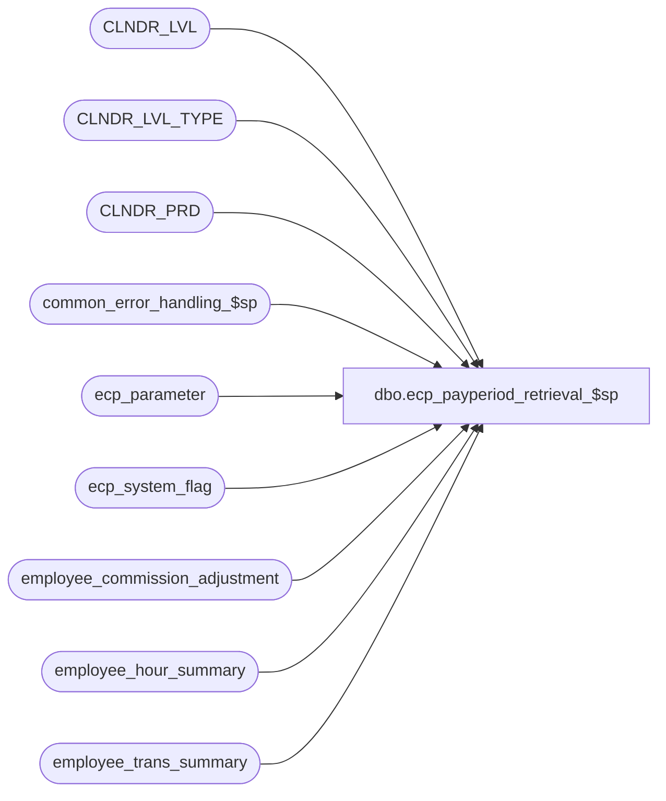

# dbo.ecp_payperiod_retrieval_$sp

**Database:** auditworks_external  
**Server:** bedrockdb01  

## Architecture Diagram



## Table Dependencies

| Referenced Table |
|---|
| CLNDR_LVL |
| CLNDR_LVL_TYPE |
| CLNDR_PRD |
| common_error_handling_$sp |
| ecp_parameter |
| ecp_system_flag |
| employee_commission_adjustment |
| employee_hour_summary |
| employee_trans_summary |

## Stored Procedure Code

```sql
create proc [dbo].[ecp_payperiod_retrieval_$sp] @include_prior_period tinyint = 1,  --0=false, 1=true, 3=return from dates, 4=return to dates
@effective_date datetime = null  
AS 

/* 
Proc Name: ecp_payperiod_retrieval_$sp 
Desc:   Called by UI Adjustment with a 1 to find list of unreleased payperiods
        Called by UI Relationships maintenance with a 3 to get from dates and a 4 to get to dates.

HISTORY:  
Date     Name           Def#    Desc
Apr14,11 Paul          126153   Use unicode datatypes
Aug29,07 Vicci          85597   Add @include_prior_period options 3 and 4.
Aug06,07 Vicci          85597   fix setting of export flag
Jul20,07 Vicci          85597   fix Jul03 fix
Jul03,07 Vicci          85597   return historical dates to support retrieval of adjustments for exported periods
Apr10,07 Vicci		85597	Author
*/

SET NOCOUNT ON
DECLARE
  @ecp_clndr_id			binary(16),
  @lowest_calendar_level	int,
  @lowest_calendar_level_id	binary(16),
  @errmsg                       nvarchar(255),
  @errno                        int,
  @message_id                   int,
  @object_name                  nvarchar(255),
  @operation_name               nvarchar(100),
  @process_name                 nvarchar(100),
  @process_no                   int,
  @rows				int,
  @stream_no                    tinyint,
  @closed_pay_period_datetime	datetime,
  @last_export_release_datetime	datetime,
  @start_datetime		datetime,
  @first_amt_received_datetime  datetime,
  @current_pay_period_datetime	datetime,
  @lower_limit_datetime		datetime,
  @upper_limit_datetime		datetime,
  @fudge_date			datetime

SELECT @message_id = 201068,
       @operation_name = 'Unknown',
       @process_name = 'ecp_payperiod_retrieval_$sp',
       @process_no = 282,
       @stream_no = 1

SELECT @ecp_clndr_id = par_bin_value
  FROM ecp_parameter p
 WHERE par_name = 'ecp_dflt_clndr_id'  
SELECT @errno = @@error
IF @errno <> 0
BEGIN
  SELECT @errmsg = 'Unable to which calendar to use',
         @object_name = 'ecp_parameter',
         @operation_name = 'SELECT'
  GOTO error
END

SELECT @lowest_calendar_level = CLNDR_LVL_TYPE_IDNTY, 
       @lowest_calendar_level_id = CLNDR_LVL_TYPE_ID
  FROM CLNDR_LVL_TYPE
 WHERE CLNDR_LVL_SEQ = (SELECT MAX(CLNDR_LVL_SEQ)
			  FROM CLNDR_LVL_TYPE
			 WHERE CLNDR_LVL_TYPE_ID
			    IN (SELECT DISTINCT CLNDR_LVL_TYPE_ID
                                  FROM CLNDR_LVL
                                  WHERE CLNDR_ID = @ecp_clndr_id))
   AND CLNDR_LVL_TYPE_ID
    IN (SELECT DISTINCT CLNDR_LVL_TYPE_ID
          FROM CLNDR_LVL
         WHERE CLNDR_ID = @ecp_clndr_id)
SELECT @errno = @@error
IF @errno <> 0
BEGIN
  SELECT @errmsg = 'Unable to which calendar level to use for employee transaction logging',
         @object_name = 'CLNDR_LVL_TYPE',
         @operation_name = 'SELECT'
  GOTO error
END

SELECT @last_export_release_datetime = c.flag_datetime_value  --note, stored with time of 23:59:59
  FROM ecp_system_flag c
 WHERE flag_name = 'ecp_payperiod_export_datetime'  
SELECT @errno = @@error, @rows = @@rowcount
IF @errno <> 0
BEGIN
  SELECT @errmsg = 'Unable to determine last pay-period export release datetime',
         @object_name = 'ecp_system_flag',
         @operation_name = 'SELECT'
  GOTO error
END
IF @rows < 1
BEGIN
  INSERT INTO ecp_system_flag(flag_name, flag_comment)
  VALUES('ecp_payperiod_export_datetime', 'flag_datetime_value set by user to indicate that pay-period may be exported to payroll, flag_numeric_value is outstanding-flag, flag_alpha_value is prior release')
  SELECT @errno = @@error
  IF @errno <> 0
  BEGIN
    SELECT @errmsg = 'Unable to create entry to indicate which pay-period may be exported to payroll',
           @object_name = 'ecp_system_flag',
           @operation_name = 'INSERT'
  GOTO error
  END
END

IF @effective_date IS NULL 
BEGIN
  SELECT @lower_limit_datetime = min(pay_period_end_datetime)
    FROM employee_commission_adjustment

  SELECT @upper_limit_datetime = getdate()

  IF @last_export_release_datetime IS NULL
  BEGIN
    SELECT @start_datetime = MIN(period_end_datetime)
      FROM employee_hour_summary
     WHERE calendar_level = @lowest_calendar_level

    SELECT @first_amt_received_datetime = MIN(period_end_datetime)
      FROM employee_trans_summary
     WHERE calendar_level = @lowest_calendar_level

    IF @first_amt_received_datetime < @start_datetime OR 
       (@start_datetime IS NULL AND @first_amt_received_datetime IS NOT NULL)
      SELECT @start_datetime = @first_amt_received_datetime
  END
  ELSE
    SELECT @start_datetime = dateadd(ss, 1, @last_export_release_datetime)
END
ELSE
BEGIN
  SELECT @upper_limit_datetime = dateadd(dd, 36, getdate()),
         @start_datetime = @effective_date
END

SELECT @closed_pay_period_datetime = c.flag_datetime_value  --note, stored with time of 23:59:59
  FROM ecp_system_flag c
 WHERE flag_name = 'ecp_payperiod_close_datetime'  
SELECT @errno = @@error, @rows = @@rowcount
IF @errno <> 0
BEGIN
  SELECT @errmsg = 'Unable to determine last pay-period closed',
         @object_name = 'ecp_system_flag',
         @operation_name = 'SELECT'
  GOTO error
END
IF @rows < 1
BEGIN
  INSERT INTO ecp_system_flag(flag_name, flag_comment)
  VALUES('ecp_payperiod_close_datetime', 'flag_datetime_value set by user to indicate that pay-period is closed and that no more imports/allocations can be posted to it')
  SELECT @errno = @@error
  IF @errno <> 0
  BEGIN
    SELECT @errmsg = 'Unable to create entry to indicate which pay-period has been closed',
           @object_name = 'ecp_system_flag',
           @operation_name = 'INSERT'
  GOTO error
  END
END
IF @start_datetime IS NULL
  SELECT @start_datetime = dateadd(dd, -36, getdate())

SELECT @current_pay_period_datetime = dateadd(ss, -1, MIN(cp.END_DATE_TIME))
  FROM CLNDR_PRD cp
 WHERE cp.END_DATE_TIME >= @start_datetime
   AND cp.STRT_DATE_TIME <= getdate()
   AND (cp.STRT_DATE_TIME > @closed_pay_period_datetime 
        OR (@closed_pay_period_datetime IS NULL AND (cp.END_DATE_TIME > getdate() OR @start_datetime <> dateadd(dd, -36, getdate())) ))
   AND cp.CLNDR_ID = @ecp_clndr_id
   AND cp.CLNDR_LVL_TYPE_ID = @lowest_calendar_level_id

IF @include_prior_period = 3
  SELECT @fudge_date = '01/01/1970'
  
SELECT CASE WHEN @include_prior_period = 3 THEN STRT_DATE_TIME ELSE dateadd(ss, -1, cp.END_DATE_TIME) END period_end_datetime,
       CASE WHEN dateadd(ss, -1, cp.END_DATE_TIME) <= @closed_pay_period_datetime THEN 1 ELSE 0 END closed_flag,
       CASE WHEN dateadd(ss, -1, cp.END_DATE_TIME)  = @current_pay_period_datetime THEN 1 ELSE 0 END current_flag,
       CASE WHEN dateadd(ss, -1, cp.END_DATE_TIME) <= @last_export_release_datetime THEN 1 ELSE 0 END exported_flag
  FROM CLNDR_PRD cp
 WHERE (cp.END_DATE_TIME > @start_datetime OR cp.END_DATE_TIME >= @lower_limit_datetime)
   AND cp.STRT_DATE_TIME <= @upper_limit_datetime
   AND cp.CLNDR_ID = @ecp_clndr_id
   AND cp.CLNDR_LVL_TYPE_ID = @lowest_calendar_level_id
   AND (@include_prior_period >= 1 OR cp.STRT_DATE_TIME > @closed_pay_period_datetime OR @closed_pay_period_datetime IS NULL)
UNION
  SELECT @fudge_date, 1, 0, 1
  WHERE @include_prior_period IN (3, 4)
RETURN

error:
  EXEC common_error_handling_$sp @process_no, @errno, @errmsg, 0, @message_id, @process_name, @object_name, @operation_name, 1, @stream_no
  RETURN
```

