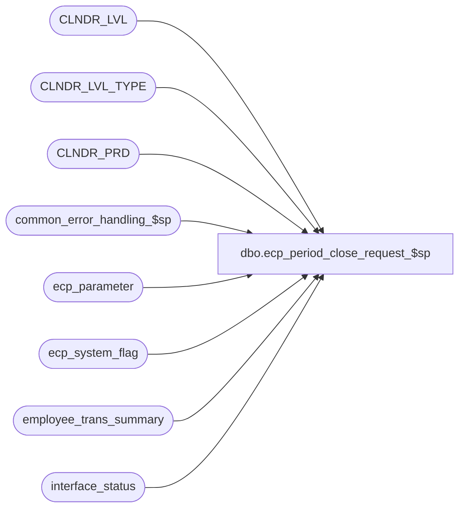

# dbo.ecp_period_close_request_$sp

**Database:** auditworks_external  
**Server:** bedrockdb01  

## Architecture Diagram



## Table Dependencies

| Referenced Table |
|---|
| CLNDR_LVL |
| CLNDR_LVL_TYPE |
| CLNDR_PRD |
| common_error_handling_$sp |
| ecp_parameter |
| ecp_system_flag |
| employee_trans_summary |
| interface_status |

## Stored Procedure Code

```sql
create proc [dbo].[ecp_period_close_request_$sp] @next_pay_period_end_datetime datetime OUTPUT,
@user_id int = NULL,
@process_id binary(16) = NULL,
@do_not_close tinyint = 0,
@outstanding_flag tinyint = 0 OUTPUT
AS 
--TODO:  audit-trail
/* 
Proc Name: ecp_period_close_request_$sp 
Desc:   Called by UI to request pay-period close

HISTORY:  
Date     Name           Def#    Desc
Apr14,11 Paul          126153   Use unicode datatypes
Feb14,08 Vicci          97607   Re-fix.  Ensure that ecp_posting_$sp knows it when a period end has been requested while the posting
                                was in the middle of running.
Oct25,07 Vicci          85597   Ensure that ecp_posting_$sp knows it when a period end has been requested while the posting
                                was in the middle of running.
Apr02,07 Vicci		85597	Author
*/

SET NOCOUNT ON
DECLARE
  @errmsg                       nvarchar(255),
  @errno                        int,
  @message_id                   int,
  @object_name                  nvarchar(255),
  @operation_name               nvarchar(100),
  @process_name                 nvarchar(100),
  @process_no                   int,
  @rows				int,
  @stream_no                    tinyint,
  @last_pay_period_end_datetime datetime,
  @req_pay_period_end_datetime  datetime, 
  @lowest_calendar_level	int,
  @lowest_calendar_level_id	binary(16),
  @ecp_clndr_id			binary(16),
  @min_date			datetime

SELECT @message_id = 201068,
       @operation_name = 'Unknown',
       @process_name = 'ecp_period_close_request_$sp',
       @process_no = 282,
       @stream_no = 1,
       @req_pay_period_end_datetime = @next_pay_period_end_datetime

SELECT @ecp_clndr_id = par_bin_value
  FROM ecp_parameter p
 WHERE par_name = 'ecp_dflt_clndr_id'  
SELECT @errno = @@error
IF @errno <> 0
BEGIN
  SELECT @errmsg = 'Unable to which calendar to use',
         @object_name = 'ecp_parameter',
         @operation_name = 'SELECT'
  GOTO error
END

SELECT @lowest_calendar_level = CLNDR_LVL_TYPE_IDNTY, 
       @lowest_calendar_level_id = CLNDR_LVL_TYPE_ID
  FROM CLNDR_LVL_TYPE
 WHERE CLNDR_LVL_SEQ = (SELECT MAX(CLNDR_LVL_SEQ)
			  FROM CLNDR_LVL_TYPE
			 WHERE CLNDR_LVL_TYPE_ID
			    IN (SELECT DISTINCT CLNDR_LVL_TYPE_ID
                                  FROM CLNDR_LVL
                                  WHERE CLNDR_ID = @ecp_clndr_id))
   AND CLNDR_LVL_TYPE_ID
    IN (SELECT DISTINCT CLNDR_LVL_TYPE_ID
          FROM CLNDR_LVL
         WHERE CLNDR_ID = @ecp_clndr_id)
SELECT @errno = @@error
IF @errno <> 0
BEGIN
  SELECT @errmsg = 'Unable to determine lowest calendar level',
         @object_name = 'CLNDR_LVL_TYPE',
         @operation_name = 'SELECT'
  GOTO error
END

SELECT @last_pay_period_end_datetime = flag_datetime_value,
       @outstanding_flag = IsNull(flag_numeric_value, 0)
  FROM ecp_system_flag
 WHERE flag_name = 'ecp_payperiod_close_datetime'  
SELECT @errno = @@error
IF @errno <> 0
BEGIN
  SELECT @errmsg = 'Unable to determine what pay-period was previously closed',
         @object_name = 'ecp_system_flag',
         @operation_name = 'SELECT'
  GOTO error
END

IF @outstanding_flag = 1
BEGIN
  SELECT @next_pay_period_end_datetime = @last_pay_period_end_datetime
  RETURN
END

IF @last_pay_period_end_datetime IS NULL
BEGIN
  SELECT @min_date = min(pay_period_end_datetime)
    FROM employee_trans_summary

  SELECT @next_pay_period_end_datetime = dateadd(ss, -1, min(cp.END_DATE_TIME))
    FROM CLNDR_PRD cp
   WHERE @min_date < cp.END_DATE_TIME
     AND @ecp_clndr_id = cp.CLNDR_ID
     AND @lowest_calendar_level_id = cp.CLNDR_LVL_TYPE_ID
END
ELSE
BEGIN
  SELECT @next_pay_period_end_datetime = dateadd(ss, -1, min(cp.END_DATE_TIME))
    FROM CLNDR_PRD cp
   WHERE dateadd(ss, 1, @last_pay_period_end_datetime) < cp.END_DATE_TIME
     AND @ecp_clndr_id = cp.CLNDR_ID
     AND @lowest_calendar_level_id = cp.CLNDR_LVL_TYPE_ID
END

IF @next_pay_period_end_datetime IS NOT NULL 
   AND @do_not_close = 0 
   AND (@req_pay_period_end_datetime = @next_pay_period_end_datetime
        OR @req_pay_period_end_datetime IS NULL)
BEGIN
  SELECT @outstanding_flag = 1
  UPDATE ecp_system_flag
     SET flag_alpha_value = convert(nvarchar, flag_datetime_value, 110),
         flag_datetime_value = @next_pay_period_end_datetime,
         flag_numeric_value = @outstanding_flag  --1=period close outstanding, 0=period closed
   WHERE flag_name = 'ecp_payperiod_close_datetime'  
     AND IsNull(flag_numeric_value, 0) = 0
     AND (flag_datetime_value IS NULL
          OR flag_datetime_value = @last_pay_period_end_datetime)  
  SELECT @errno = @@error
  IF @errno <> 0
  BEGIN
    SELECT @errmsg = 'Unable to set last pay-period closed datetime',
           @object_name = 'ecp_system_flag',
           @operation_name = 'UPDATE'
    GOTO error
  END
  UPDATE interface_status
     SET last_posting_datetime = getdate()
   WHERE interface_id = 44
  SELECT @errno = @@error
  IF @errno <> 0
  BEGIN
    SELECT @errmsg = 'Unable to indicate new information is available for the ECP posting',
           @object_name = 'interface_status',
           @operation_name = 'UPDATE'
    GOTO error
  END
  UPDATE interface_status
     SET immediate_posting_requested = 1
   WHERE interface_id = 44
     AND immediate_posting_requested = 0
  SELECT @errno = @@error
  IF @errno <> 0
  BEGIN
    SELECT @errmsg = 'Unable to set ECP posting request',
           @object_name = 'interface_status',
           @operation_name = 'UPDATE'
    GOTO error
  END
END

RETURN

error:
  EXEC common_error_handling_$sp @process_no, @errno, @errmsg, 0, @message_id, @process_name, @object_name, @operation_name, 1, @stream_no
  RETURN
```

