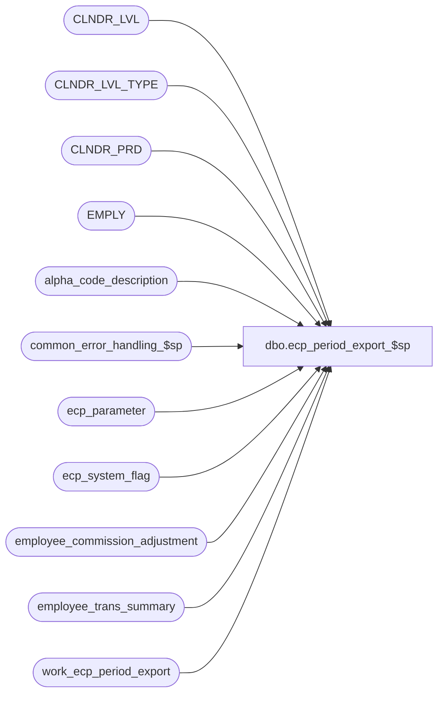

# dbo.ecp_period_export_$sp

**Database:** auditworks_external  
**Server:** bedrockdb01  

## Architecture Diagram



## Table Dependencies

| Referenced Table |
|---|
| CLNDR_LVL |
| CLNDR_LVL_TYPE |
| CLNDR_PRD |
| EMPLY |
| alpha_code_description |
| common_error_handling_$sp |
| ecp_parameter |
| ecp_system_flag |
| employee_commission_adjustment |
| employee_trans_summary |
| work_ecp_period_export |

## Stored Procedure Code

```sql
create proc [dbo].[ecp_period_export_$sp]    @pay_period_export_date	datetime,
   @lowest_calendar_level	int,
   @lowest_calendar_level_id	binary(16),
   @ecp_clndr_id	        binary(16),
   @current_rows		int OUTPUT

AS
/* 
Proc Name: ecp_period_export_$sp 
Desc:   Performs period-end export of commission amounts to payroll

HISTORY:  
Date     Name           Def#    Desc
Apr14,11 Paul          126153   Use unicode datatypes
Feb08,08 Vicci          97975   Set errno not just message_id when raising business rule error
Oct10,07 Vicci          85597   Support the export of multiple pay-periods
Aug06,07 Vicci		85597	Net commission on sales and returns instead of adding it
Apr18,07 Vicci		85597	Author

*/

SET NOCOUNT ON
DECLARE
  @one_hundred			money,
  @pay_period_start_date	datetime,
  @errmsg                       nvarchar(255),
  @errno                        int,
  @message_id                   int,
  @process_name                 nvarchar(100),
  @process_no                   int,
  @object_name                  nvarchar(255),
  @operation_name               nvarchar(100),
  @rows				int,
  @stream_no                    tinyint

SELECT @errno = 0,
       @message_id = 201068,
       @one_hundred = 100,
       @operation_name = 'Unknown',
       @process_name = 'ecp_period_export_$sp',
       @process_no = 282,
       @stream_no = 1
       
IF @ecp_clndr_id IS NULL
BEGIN
SELECT @ecp_clndr_id = par_bin_value
  FROM ecp_parameter p
 WHERE par_name = 'ecp_dflt_clndr_id'  
SELECT @errno = @@error
IF @errno <> 0
BEGIN
  SELECT @errmsg = 'Unable to which calendar to use',
         @object_name = 'ecp_parameter',
         @operation_name = 'SELECT'
  GOTO error
END

SELECT @lowest_calendar_level = CLNDR_LVL_TYPE_IDNTY, 
       @lowest_calendar_level_id = CLNDR_LVL_TYPE_ID
  FROM CLNDR_LVL_TYPE
 WHERE CLNDR_LVL_SEQ = (SELECT MAX(CLNDR_LVL_SEQ)
			  FROM CLNDR_LVL_TYPE
			 WHERE CLNDR_LVL_TYPE_ID
			    IN (SELECT DISTINCT CLNDR_LVL_TYPE_ID
                                  FROM CLNDR_LVL
                                  WHERE CLNDR_ID = @ecp_clndr_id))
   AND CLNDR_LVL_TYPE_ID
    IN (SELECT DISTINCT CLNDR_LVL_TYPE_ID
          FROM CLNDR_LVL
         WHERE CLNDR_ID = @ecp_clndr_id)
SELECT @errno = @@error
IF @errno <> 0
BEGIN
  SELECT @errmsg = 'Unable to which calendar level to use for employee transaction logging',
         @object_name = 'CLNDR_LVL_TYPE',
         @operation_name = 'SELECT'
  GOTO error
END
END --IF @ecp_clndr_id IS NULL

SELECT @pay_period_start_date = dateadd(dd, 1, convert(datetime, flag_alpha_value))
  FROM ecp_system_flag c
 WHERE flag_name = 'ecp_payperiod_export_datetime'  
SELECT @errno = @@error
IF @errno <> 0
BEGIN
  SELECT @errmsg = 'Unable to determine first day of next period following last pay-period exported',
         @object_name = 'ecp_system_flag',
         @operation_name = 'SELECT'
  GOTO error
END

IF @pay_period_start_date IS NULL  --this is the first time the export is being run
BEGIN
  SELECT @pay_period_start_date = STRT_DATE_TIME
    FROM CLNDR_PRD
   WHERE END_DATE_TIME = dateadd(ss, 1, (SELECT MIN(pay_period_end_datetime) FROM employee_trans_summary))
     AND CLNDR_ID = @ecp_clndr_id 
     AND CLNDR_LVL_TYPE_ID = @lowest_calendar_level_id
  SELECT @errno = @@error, @rows = @@rowcount
  IF @errno <> 0 OR @rows < 1
  BEGIN
    IF @errno = 0 
      SELECT @message_id = 201684,
             @errno = 201684
    SELECT @errmsg = 'Unable to determine start date of 1st period being exported',
           @object_name = 'CLNDR_PRD',
           @operation_name = 'SELECT'
    GOTO error
  END
END
IF @pay_period_start_date IS NULL  --this is the first time the export is being run and no transactions are commissionable
BEGIN
  SELECT @pay_period_start_date = STRT_DATE_TIME
    FROM CLNDR_PRD
   WHERE END_DATE_TIME = dateadd(ss, 1, (SELECT MIN(pay_period_end_datetime) FROM employee_commission_adjustment))
     AND CLNDR_ID = @ecp_clndr_id 
     AND CLNDR_LVL_TYPE_ID = @lowest_calendar_level_id
  SELECT @errno = @@error, @rows = @@rowcount
  IF @errno <> 0 OR @rows < 1
  BEGIN
    IF @errno = 0 
      SELECT @message_id = 201684,
             @errno = 201684
    SELECT @errmsg = 'Unable to determine start date of 1st period with commission adjustments being exported',
           @object_name = 'CLNDR_PRD',
           @operation_name = 'SELECT'
    GOTO error
  END
END

BEGIN TRANSACTION
INSERT into work_ecp_period_export(
       pay_period_end_datetime,
       employee_no,
       commission_amount,
       pay_period_start_datetime,
       employee_last_name,
       employee_first_name)
SELECT convert(nvarchar, @pay_period_export_date, 101),
       q.employee_no,
       SUM(q.commission_amount),
       convert(nvarchar, @pay_period_start_date, 101),
       MAX(em.LAST_NAME),
       MAX(em.FRST_NAME)
  FROM (SELECT ets.employee_no,
        ROUND(SUM( (CASE WHEN IsNull(tcc.system_code, 'S') = 'S' 
                         THEN ets.transaction_net_amount 
                         ELSE ets.transaction_net_amount * -1 
                    END * ets.commission_rate / @one_hundred) + 
                   (CASE WHEN IsNull(tcc.system_code, 'S') = 'S' 
                         THEN ets.transaction_units 
                         ELSE ets.transaction_units * -1 
                    END * ets.commission_amount_per_item)), 2) commission_amount
          FROM employee_trans_summary ets  
               LEFT OUTER JOIN alpha_code_description tcc
                ON ets.transaction_commission_code = tcc.code
                AND tcc.code_type  = 14
                AND tcc.code_status = 'U'
         WHERE ets.calendar_level = @lowest_calendar_level
           AND ets.pay_period_end_datetime <= @pay_period_export_date
           AND ets.pay_period_end_datetime > @pay_period_start_date
         GROUP BY ets.employee_no
        HAVING ROUND(SUM( (CASE WHEN IsNull(tcc.system_code, 'S') = 'S' 
                                THEN ets.transaction_net_amount 
                                ELSE ets.transaction_net_amount * -1 
                           END * ets.commission_rate / @one_hundred) + 
                          (CASE WHEN IsNull(tcc.system_code, 'S') = 'S' 
                                THEN ets.transaction_units 
                                ELSE ets.transaction_units * -1 
                           END * ets.commission_amount_per_item)), 2) <> 0
        UNION 
        SELECT eca.employee_no,
               SUM(eca.commission_adj_amount) commission_amount
          FROM employee_commission_adjustment eca
         WHERE eca.pay_period_end_datetime <= @pay_period_export_date
           AND eca.pay_period_end_datetime > @pay_period_start_date
         GROUP BY eca.employee_no
        HAVING SUM(eca.commission_adj_amount) <> 0) q
   LEFT OUTER JOIN EMPLY em
     ON q.employee_no = em.EMPLY_NUM
 GROUP BY q.employee_no
HAVING SUM(q.commission_amount) <> 0
SELECT @errno = @@error, @current_rows = @@rowcount
IF @errno <> 0
BEGIN
  SELECT @errmsg = 'Failed to build export of commission amounts for payroll',
         @object_name = 'work_ecp_period_export',
         @operation_name = 'INSERT'
  GOTO error
END
UPDATE ecp_system_flag
   SET flag_numeric_value = 0  --1=period export outstanding, 0=period exported
 WHERE flag_name = 'ecp_payperiod_export_datetime'  
SELECT @errno = @@error
IF @errno <> 0
BEGIN
  SELECT @errmsg = 'Unable to mark pay-period as exported',
         @object_name = 'ecp_system_flag',
         @operation_name = 'UPDATE'
  GOTO error
END

COMMIT  

RETURN

error:
  EXEC common_error_handling_$sp @process_no, @errno, @errmsg, 0, @message_id, @process_name, @object_name, @operation_name, 1, @stream_no

  RETURN
```

