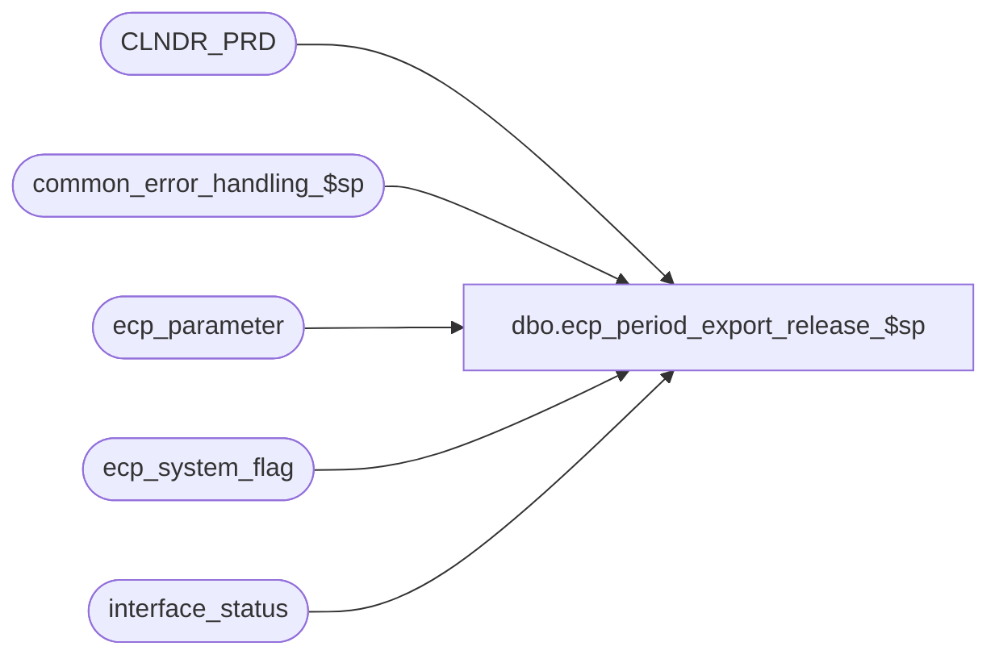

# dbo.ecp_period_export_release_$sp

**Database:** auditworks_external  
**Server:** bedrockdb01  

## Architecture Diagram



## Table Dependencies

| Referenced Table |
|---|
| CLNDR_PRD |
| common_error_handling_$sp |
| ecp_parameter |
| ecp_system_flag |
| interface_status |

## Stored Procedure Code

```sql
create proc [dbo].[ecp_period_export_release_$sp] @next_export_release_datetime datetime OUTPUT,
@user_id int = NULL,
@process_id binary(16) = NULL,
@do_not_release tinyint = 0,
@outstanding_export_flag tinyint = 0 OUTPUT
AS 

--TODO:  audit-trail
/* 
Proc Name: ecp_period_export_release_$sp 
Desc:   Called by UI to release export of commissions for pay period to payroll

HISTORY:  
Date     Name           Def#    Desc
Apr14,11 Paul          126153   Use unicode datatypes
Feb14,08 Vicci          97607   Ensure that ecp_posting_$sp knows it when a request is made while the posting
                                was in the middle of running.
Apr02,07 Vicci		85597	  Author
*/

SET NOCOUNT ON
DECLARE
  @errmsg                       nvarchar(255),
  @errno                        int,
  @message_id                   int,
  @object_name                  nvarchar(255),
  @operation_name               nvarchar(100),
  @process_name                 nvarchar(100),
  @process_no                   int,
  @rows				int,
  @stream_no                    tinyint,
  @closed_pay_period_datetime	datetime,
  @prior_export_release_datetime datetime

SELECT @message_id = 201068,
       @operation_name = 'Unknown',
       @process_name = 'ecp_period_export_release_$sp',
       @process_no = 282,
       @stream_no = 1

SELECT @closed_pay_period_datetime = c.flag_datetime_value  --note, stored with time of 23:59:59
  FROM ecp_system_flag c
 WHERE flag_name = 'ecp_payperiod_close_datetime'  
   AND IsNull(flag_numeric_value, 0) = 0  --1=outstanding, 0=closed
SELECT @errno = @@error
IF @errno <> 0
BEGIN
  SELECT @errmsg = 'Unable to determine last pay-period closed',
         @object_name = 'ecp_system_flag',
         @operation_name = 'SELECT'
  GOTO error
END

SELECT @prior_export_release_datetime = c.flag_datetime_value,  --note, stored with time of 23:59:59
       @outstanding_export_flag = IsNull(c.flag_numeric_value, 0)
  FROM ecp_system_flag c
 WHERE flag_name = 'ecp_payperiod_export_datetime'  
SELECT @errno = @@error
IF @errno <> 0
BEGIN
  SELECT @errmsg = 'Unable to determine last pay-period closed',
         @object_name = 'ecp_system_flag',
         @operation_name = 'SELECT'
  GOTO error
END

IF @next_export_release_datetime IS NULL
  SELECT @next_export_release_datetime = @closed_pay_period_datetime

IF @outstanding_export_flag = 1 OR @closed_pay_period_datetime IS NULL
BEGIN
  SELECT @next_export_release_datetime = @prior_export_release_datetime
  RETURN
END

IF @next_export_release_datetime <> @closed_pay_period_datetime
BEGIN
  SELECT @next_export_release_datetime = dateadd(ss, -1, MIN(cp.END_DATE_TIME))
    FROM CLNDR_PRD cp
   WHERE cp.STRT_DATE_TIME <= @next_export_release_datetime
     AND cp.END_DATE_TIME > @next_export_release_datetime
     AND cp.CLNDR_ID = (SELECT par_bin_value
                          FROM ecp_parameter p
                         WHERE par_name = 'ecp_dflt_clndr_id')
END

IF (@next_export_release_datetime <= @closed_pay_period_datetime
    AND (@next_export_release_datetime > @prior_export_release_datetime 
         OR @prior_export_release_datetime IS NULL)
    AND @closed_pay_period_datetime IS NOT NULL
    AND @do_not_release = 0)
BEGIN
  SELECT @outstanding_export_flag = 1
  UPDATE ecp_system_flag
     SET flag_alpha_value = convert(nvarchar, flag_datetime_value, 110),
         flag_datetime_value = @next_export_release_datetime,
         flag_numeric_value = @outstanding_export_flag  --1=period close outstanding, 0=period closed     
   WHERE flag_name = 'ecp_payperiod_export_datetime'  
     AND IsNull(flag_numeric_value, 0) = 0
     AND (flag_datetime_value IS NULL
          OR flag_datetime_value = @prior_export_release_datetime)  
  SELECT @errno = @@error
  IF @errno <> 0
  BEGIN
    SELECT @errmsg = 'Unable to release commissions export for pay-period',
           @object_name = 'ecp_system_flag',
           @operation_name = 'UPDATE'
    GOTO error
  END

  UPDATE interface_status
     SET last_posting_datetime = getdate()
   WHERE interface_id = 44
  SELECT @errno = @@error
  IF @errno <> 0
  BEGIN
    SELECT @errmsg = 'Unable to indicate new information is available for the ECP posting',
           @object_name = 'interface_status',
           @operation_name = 'UPDATE'
    GOTO error
  END

  UPDATE interface_status
     SET immediate_posting_requested = 1
   WHERE interface_id = 44
     AND immediate_posting_requested = 0
  SELECT @errno = @@error
  IF @errno <> 0
  BEGIN
    SELECT @errmsg = 'Unable to set ECP posting request',
           @object_name = 'interface_status',
           @operation_name = 'UPDATE'
    GOTO error
  END
END
IF (@next_export_release_datetime <> @closed_pay_period_datetime)
  SELECT @next_export_release_datetime = NULL
RETURN

error:
  EXEC common_error_handling_$sp @process_no, @errno, @errmsg, 0, @message_id, @process_name, @object_name, @operation_name, 1, @stream_no
  RETURN
```

