# dbo.ecp_posting_$sp

**Database:** auditworks_external  
**Server:** bedrockdb01  

## Architecture Diagram

```mermaid
flowchart LR
    SP["dbo.ecp_posting_$sp"]
    CLNDR_LVL(["CLNDR_LVL"]) --> SP
    CLNDR_LVL_TYPE(["CLNDR_LVL_TYPE"]) --> SP
    CLNDR_PRD(["CLNDR_PRD"]) --> SP
    EMPLY(["EMPLY"]) --> SP
    EMPLY_ORG_CHN_PSTN_A_HSTRY(["EMPLY_ORG_CHN_PSTN_A_HSTRY"]) --> SP
    Ex_Execution(["Ex_Execution"]) --> SP
    Ex_Queue(["Ex_Queue"]) --> SP
    ORG_CHN(["ORG_CHN"]) --> SP
    alpha_code_description(["alpha_code_description"]) --> SP
    class_sa(["class_sa"]) --> SP
    commission_code_xref(["commission_code_xref"]) --> SP
    common_error_handling__sp(["common_error_handling_$sp"]) --> SP
    ecp_allocation__sp(["ecp_allocation_$sp"]) --> SP
    ecp_comms_auto_adjustment__sp(["ecp_comms_auto_adjustment_$sp"]) --> SP
    ecp_definition_explosion__sp(["ecp_definition_explosion_$sp"]) --> SP
    ecp_history_cleanup__sp(["ecp_history_cleanup_$sp"]) --> SP
    ecp_parameter(["ecp_parameter"]) --> SP
    ecp_period_export__sp(["ecp_period_export_$sp"]) --> SP
    ecp_period_reopen__sp(["ecp_period_reopen_$sp"]) --> SP
    ecp_ref_amt_transaction(["ecp_ref_amt_transaction"]) --> SP
    ecp_reference_amt_posting__sp(["ecp_reference_amt_posting_$sp"]) --> SP
    ecp_system_flag(["ecp_system_flag"]) --> SP
    employee_commission_adjustment(["employee_commission_adjustment"]) --> SP
    employee_commission_code_xref(["employee_commission_code_xref"]) --> SP
    employee_commission_rate(["employee_commission_rate"]) --> SP
    employee_commission_rate_tier(["employee_commission_rate_tier"]) --> SP
    employee_comms_accum_basis(["employee_comms_accum_basis"]) --> SP
    employee_comms_accum_basis_def(["employee_comms_accum_basis_def"]) --> SP
    employee_comms_allocation(["employee_comms_allocation"]) --> SP
    employee_comparison_type(["employee_comparison_type"]) --> SP
    employee_hour_summary(["employee_hour_summary"]) --> SP
    employee_hour_transaction(["employee_hour_transaction"]) --> SP
    employee_open_allocation(["employee_open_allocation"]) --> SP
    employee_productivity_comment(["employee_productivity_comment"]) --> SP
    employee_relationship_set(["employee_relationship_set"]) --> SP
    employee_relationship_set_xref(["employee_relationship_set_xref"]) --> SP
    employee_traffic_attrib_dtl(["employee_traffic_attrib_dtl"]) --> SP
    employee_traffic_attribution(["employee_traffic_attribution"]) --> SP
    employee_trans_allocation_type(["employee_trans_allocation_type"]) --> SP
    employee_trans_summary(["employee_trans_summary"]) --> SP
    employee_transaction(["employee_transaction"]) --> SP
    employee_transaction_role(["employee_transaction_role"]) --> SP
    end_process_log__sp(["end_process_log_$sp"]) --> SP
    export_format(["export_format"]) --> SP
    get_max_serial_no__sp(["get_max_serial_no_$sp"]) --> SP
    if_line_note(["if_line_note"]) --> SP
    if_merchandise_detail(["if_merchandise_detail"]) --> SP
    if_payroll_detail(["if_payroll_detail"]) --> SP
    if_return_detail(["if_return_detail"]) --> SP
    if_stock_control_detail(["if_stock_control_detail"]) --> SP
    if_tax_detail(["if_tax_detail"]) --> SP
    if_transaction_header(["if_transaction_header"]) --> SP
    if_transaction_line(["if_transaction_line"]) --> SP
    interface_applicability(["interface_applicability"]) --> SP
    interface_directory(["interface_directory"]) --> SP
    interface_status(["interface_status"]) --> SP
    parameter_general(["parameter_general"]) --> SP
    process_error_log(["process_error_log"]) --> SP
    process_log(["process_log"]) --> SP
    start_process_log__sp(["start_process_log_$sp"]) --> SP
    valid_line_object_type_action(["valid_line_object_type_action"]) --> SP
    work_ecp_empl_trans_export(["work_ecp_empl_trans_export"]) --> SP
    work_ecp_empl_trans_import(["work_ecp_empl_trans_import"]) --> SP
    work_ecp_empl_trans_qty(["work_ecp_empl_trans_qty"]) --> SP
    work_ecp_hour_import(["work_ecp_hour_import"]) --> SP
    work_ecp_tier_amount(["work_ecp_tier_amount"]) --> SP
    work_ecp_tier_amount_current(["work_ecp_tier_amount_current"]) --> SP
    work_ecp_trans_export(["work_ecp_trans_export"]) --> SP
```



## Table Dependencies

| Referenced Table |
|---|
| CLNDR_LVL |
| CLNDR_LVL_TYPE |
| CLNDR_PRD |
| EMPLY |
| EMPLY_ORG_CHN_PSTN_A_HSTRY |
| Ex_Execution |
| Ex_Queue |
| ORG_CHN |
| alpha_code_description |
| class_sa |
| commission_code_xref |
| common_error_handling_$sp |
| ecp_allocation_$sp |
| ecp_comms_auto_adjustment_$sp |
| ecp_definition_explosion_$sp |
| ecp_history_cleanup_$sp |
| ecp_parameter |
| ecp_period_export_$sp |
| ecp_period_reopen_$sp |
| ecp_ref_amt_transaction |
| ecp_reference_amt_posting_$sp |
| ecp_system_flag |
| employee_commission_adjustment |
| employee_commission_code_xref |
| employee_commission_rate |
| employee_commission_rate_tier |
| employee_comms_accum_basis |
| employee_comms_accum_basis_def |
| employee_comms_allocation |
| employee_comparison_type |
| employee_hour_summary |
| employee_hour_transaction |
| employee_open_allocation |
| employee_productivity_comment |
| employee_relationship_set |
| employee_relationship_set_xref |
| employee_traffic_attrib_dtl |
| employee_traffic_attribution |
| employee_trans_allocation_type |
| employee_trans_summary |
| employee_transaction |
| employee_transaction_role |
| end_process_log_$sp |
| export_format |
| get_max_serial_no_$sp |
| if_line_note |
| if_merchandise_detail |
| if_payroll_detail |
| if_return_detail |
| if_stock_control_detail |
| if_tax_detail |
| if_transaction_header |
| if_transaction_line |
| interface_applicability |
| interface_directory |
| interface_status |
| parameter_general |
| process_error_log |
| process_log |
| start_process_log_$sp |
| valid_line_object_type_action |
| work_ecp_empl_trans_export |
| work_ecp_empl_trans_import |
| work_ecp_empl_trans_qty |
| work_ecp_hour_import |
| work_ecp_tier_amount |
| work_ecp_tier_amount_current |
| work_ecp_trans_export |

## Stored Procedure Code

```sql
create proc dbo.ecp_posting_$sp @interface_id tinyint = 44
AS
/*  
Proc Name: ecp_posting_$sp 
Desc:   Standard export of sales / returns / payroll hours to NSB Connected Retailer 
        Employee Commissions and Productivity employee_transaction, 
        collapsed with import into ECP.
NOTE:  home_store_no, primary_position, primary_selling_area_no, relationship set must be stored in employee_trans_summary
       because otherwise the single calendar level amounts (for example YTD) would not be split into multiple
       rows when the employee's assignment switched mid year.
TO DO:  modify to do export / set trigger / import in case of non-collapsed environment,
        or to have database link token.

HISTORY:  
Date     Name           Def#    Desc
Jul22,14 Vicci      TFS-78522   Support export format >= 2 commission export to payroll.
Mar31,14 Vicci         151040   Strip tax from tax-inclusive pricing when feeding sale/return amounts and their discounts.
Mar26,14 Vicci         150958   Relocate the pre-existing-traffic-count-attribution-based-on-arrival-of-new-hours code to AFTER the employee_hour_summary has been inserted since the empl_hour_summary_id is not available
                                for new employee/period combinations until then.  Also, if more than 1 payroll hour transaction is responsible for the attribution of a traffice count to an employee, cross-reference them all.
Mar29,12 Vicci         134144   The historical commission amount import function calculates the commission amount incorrectly 
				when the import includes returns of items whose commission is determined on an amount-per-item basis (rather than a %):  
				the commission adjustment is off by double this commission amount.  
				Correct the adjustment calculation to reflect the fact that units are unsigned for returns (transaction commission code 
				must therefore be taken into account).
Mar08,12 Vicci         133698   Update to process error log based on memo2 must reflect fact that it is a nvarchar not a numeric.
Nov10,09 Vicci       ECP_ENH1   handle transaction role based on reference-type (triggered by TM reference to note type 9022)
Jul09,09 Vicci       BARN0709   Avoid logging null selling area / position to employee_commission_adjustment
Apr22,09 Vicci	       109767	Clean up history upon period end.
Nov04,08 Vicci         106146   Support employee_transaction_role remapping based on presence of another role attached to same item.
Nov03,08 Vicci         106094   Execute period-reopen when requested.
Sep18,08 Vicci         104484   Log shift times on hour transactions;  distinguish between different
			        payroll-detail attachment types; Log reference-amounts;  Attribute traffic counts to
			        employees based on occurrence of traffic within shifts worked.
Sep18,08 Vicci         104976   Reassign transaction quantities too, when recalculation function is run.
Sep16,08 Vicci         104939   Handle null home-store/relationship-set in joins.
Aug19,08 Vicci         103967	Support effective dates on relationship assignments and single employee recalculations.
Jul17,08 Vicci         103077	Support effective dates on home-store assignment.
May14,08 Vicci         101197   Support effective dates on commission code assignments.
Apr30,08 Vicci         100380   Initialize tier handling min/max transaction_id to -2 instead of 0 to take into account
                                that the transaction_id for allocations is -1.
Apr02,08 Vicci          98217   Raise error if calendar parameter not properly defined.
Feb14,08 Vicci          98217   Log home store to employee_open_allocation
Feb01,08 Vicci          97607   Auto-clean relevant process error log entries upon successful execution.
Jan16,08 Vicci                  Don't just rely on payroll_entry_type of 0 to avoid assuming payroll attachments 
                                mean line has hours:  only include object-type 13 lines.
Nov26,07 Vicci          95521   Integrate with CRDM properly.            
Nov05,07 Vicci          85597   Support transaction commission code selection dependent on transaction being an employee purchase or not
Oct31,07 Vicci          85597   Support past-X-periods tier accumulation methods where X > 1
Oct26,07 Vicci          85597   Post basis_calendar_period_quantity to employee_open_allocation
Sep13,07 Vicci          85597   Handle reversal of service units correctly (reverse instead of doubling).
                                avoid calling 1 trans with merch and serv 1/2 a merch trans;
                                add new field to support distinction between 1 trans with merch/fee item commission codes
                                vs 1 trans with multiple merch item commission codes.
Sep05,07 Vicci          85597   Support export format 2.
Aug06,07 Paul           85597   corrected where clause, ignore payroll_detail when payroll_entry_type = 0.
Jul19,07 Vicci          85597   Support effective date at header level
Jul12,07 Vicci	        85597   Override transaction date with transaction maintenance effective date
Jul11,07 Vicci          85597   Change source of history load employee number to be payroll detail since otherwise it won't get validated
Jul02,07 Vicci          85597   Set current flag to 2 instead of 0 if summary id changed to support drill-downs.
                                Ensure transactions supporting drill-downs move upon recalc/realloc.
Jun20,07 Vicci          85597   Refer to rate in summary ID update join since rate may have been modified in config
Jun13,07 Vicci          85597   Fix history load bugs
Jun11,07 Vicci          85597   Avoid allocating prior-to-live history load
Jun08,07 Vicci          85597   History loaded as sales/returns at configured rate coupled by 
               adjustment if config doesn't match commission amt imported.
Jun08,07 Vicci          85597   Ignore return orig store when invalid;  ignore rtn salesperson if = 0
May31,07 Vicci          85597   Avoid exporting empty files.
May28,07 Vicci          85597   Add trace prints.
May25,07 Vicci          85597   Reset immediate posting request from 2 to 1.
May24,07 Vicci          85597   Make return-detail salesperson usage optional;  don't track 
        roles set not to be tracked.
May15,07 Vicci          85597   Add support for allocations based on multiple selling areas
                                of source employee instead of just their primary selling area
Feb16,07 Vicci		85597	Author
*/


SET NOCOUNT ON
DECLARE
  @allocation_request		tinyint,
  @sa_company_no		int,
  @current_rows                 int,
  @current_close_rows           int,
  @current_export_rows        int,
  @batch_size                   int,
  @current_db_name              nvarchar(30),
  @cursor_open			tinyint,
  @db_id                        int,
  @ecp_clndr_id			binary(16),
  @live_date			datetime,
  @lowest_calendar_level	int,
  @lowest_calendar_level_id	binary(16),
  @errmsg                       nvarchar(255),
  @errno     int,
  @function_name	        varbinary(128),
  @last_posting_datetime        datetime,
  @loop_counter			int,
  @max_serial_no                numeric(14,0),
  @max_loops			int,
  @message_id                   int,
  @min_serial_no                numeric(14,0),
  @min_current_date		datetime,
  @new_hour_rows		int,
  @new_trans_rows		int,
  @object_name                  nvarchar(255),
  @one_hundred			money,
  @operation_name               nvarchar(100),
  @pay_period_close_date	datetime,
  @preexisting_hour_rows	int,
  @preexisting_trans_rows	int,
  @process_log_entry            tinyint,
  @process_name nvarchar(100),
  @process_no                   int,
  @process_timestamp            float,
  @process_start_time           datetime,
  @recalc_realloc_flag          tinyint,
  @retrieval_in_progress        tinyint,
  @reversal_present_flag tinyint, 
  @rows                         int,
  @rows_updated			int, 
  @stream_no               tinyint,
  @transaction_count            int,
  @user_name                    nvarchar(30),
  @employee_ecp_rate_id 	numeric(12,0),
  @even_alloc_release_date 	datetime,
  @even_alloc_posting_date 	datetime,
  @hour_alloc_release_date 	datetime,
  @hour_alloc_posting_date 	datetime,
  @amt_alloc_release_date 	datetime,
  @amt_alloc_posting_date 	datetime,
 @transaction_id numeric(14,0),
 @max_transaction_id numeric(14,0),
 @min_transaction_id numeric(14,0),
 @transaction_role nvarchar(20),
 @employee_no int,
 @next_tier_id numeric(5,0),
 @next_ecp_rate_id numeric(12,0),
 @prior_tier_id numeric(5,0),
 @current_tier_id numeric(5,0),
 @current_tier_amount_from money,
 @current_tier_amount_to money,
 @prior_tier_amount_from money,
 @prior_tier_amount_to money,
 @prior_amount money,
 @pay_period_end_datetime datetime,
 @sum_amount money,
 @next_tier_amount_from money,
 @next_tier_amount_to money,
 @next_commission_rate numeric(7,4),
 @next_commission_amt_per_item money,
 @next_employee_no int,
 @next_period_end_datetime datetime,
 @current_commission_rate numeric(7,4),
 @current_commission_amt_peritem money,
 @current_amount money,
 @prior_commission_rate numeric(7,4), 
 @prior_commission_amt_per_item money,
 @prior_employee_no int,
 @prior_pay_period_end datetime,
 @tier_calendar_level smallint,
 @transaction_amount money,
 @accumulation_basis_column nvarchar(30),
@accumulation_basis_desc nvarchar(255),
@reallocation_rows int,
   @from_reallocation_date	datetime,
   @to_reallocation_date	datetime,
   @reallocation_type_list	nvarchar(4000),
 @recalculation_employee_no	int,
 @from_recalculation_date 	datetime,
 @to_recalculation_date		datetime,
 @pay_period_close_outstanding tinyint,
 @pay_period_export_outstanding tinyint,
 @history_cleanup_outstanding   tinyint,
 @pay_period_export_date	datetime,
 @trace_msg			nvarchar(255),
  @tier_pay_period_end_datetime	datetime,
  @past_calendar_period_qty     smallint,
  @period_rank			smallint,  
  @END_DATE_TIME		datetime,
  @cutoff_datetime		datetime,
  @CLNDR_LVL_TYPE_ID		binary(16),
  @last_posted_serial_no        numeric(14,0),
  @hour_traffic_rows		int,
  @cleanup_rows			int,
  @sql_command			nvarchar(2000),
  @ascii_export			tinyint  

 
SELECT @batch_size = 2000,
       @current_db_name = db_name(),
       @function_name = convert(varbinary(128), 'ecp_posting_$sp'),
       @loop_counter = 0,
       @max_loops = 500,
       @message_id = 201068,
       @operation_name = 'Unknown',
       @one_hundred = 100,
       @process_log_entry = 0,
       @process_name = 'ecp_posting_$sp',
       @process_no = 282,
       @process_start_time = getdate(),
       @stream_no = 1,
       @transaction_count = 0,
       @user_name = suser_sname(),
       @reallocation_rows = 0,
       @pay_period_close_outstanding = 0,
       @pay_period_export_outstanding = 0,
       @history_cleanup_outstanding = 0,
       @errno = 0,
       @cleanup_rows = 0 

SET CONTEXT_INFO @function_name

IF @interface_id IS NULL OR @interface_id <> 44
BEGIN
  SELECT @message_id = 201684,
         @errno = 201684,
         @object_name = @process_name,
         @errmsg = 'Invalid Argument(s) passed to the stored procedure ' + @process_name + '. Unable to proceed.'
  GOTO error
END
SELECT @retrieval_in_progress = retrieval_in_progress,
       @last_posting_datetime = last_posting_datetime
FROM interface_status
WHERE interface_id = @interface_id

SELECT @errno = @@error
IF @errno <> 0
BEGIN
  SELECT @errmsg = 'Unable to select retrieval_in_progress from interface_status',
         @object_name = 'interface_status',
         @operation_name = 'SELECT'
  GOTO error
END


IF @retrieval_in_progress <> 0
BEGIN
  SELECT @db_id = dbid
  FROM master..sysprocesses
  WHERE spid = @@spid

  SELECT @errno = @@error
  IF @errno != 0
  BEGIN
    SELECT @errmsg = 'Unable to select from master..sysprocesses',
           @object_name = 'master..sysprocesses',
           @operation_name = 'SELECT'
    GOTO error
  END

  IF EXISTS (SELECT 1
             FROM master..sysprocesses
         WHERE context_info = @function_name
             AND spid <> @@spid
             AND dbid = @db_id
             AND db_name(dbid) = @current_db_name)
  BEGIN
    SELECT @message_id = 201682,
           @errno = 201682,
           @object_name = @process_name,
           @errmsg = 'The stored procedure ' + @process_name + ' is currently running. Please verify.'
    GOTO error
  END
END

UPDATE interface_status
   SET retrieval_in_progress = 1, 
      last_retrieval_datetime = @process_start_time, 
    immediate_posting_requested = 1
 WHERE interface_id = @interface_id
SELECT @errno = @@error
IF @errno <> 0
BEGIN
  SELECT @errmsg = 'Unable to set retrieval_in_progress in interface_status',
         @object_name = 'interface_status',
         @operation_name = 'UPDATE'
  GOTO error
END

IF @process_log_entry = 0
BEGIN
  EXEC start_process_log_$sp @process_no, @process_timestamp OUTPUT, @errmsg OUTPUT
  SELECT @errno = @@error
  IF @errno <> 0
  BEGIN
    SELECT @errmsg = @errmsg + ' Unable to execute start_process_log_$sp',
           @object_name = 'start_process_log_$sp',
           @operation_name = 'EXECUTE'
    GOTO error  
  END
  SELECT @process_log_entry = 1
END

SELECT @live_date = live_date
  FROM interface_directory
 WHERE interface_id = 44
SELECT @errno = @@error
IF @errno <> 0
BEGIN
  SELECT @errmsg = 'Failed to determine ECP live date',
         @object_name = 'interface_directory',
         @operation_name = 'SELECT'
  GOTO error
END

IF EXISTS (SELECT 1
             FROM ecp_system_flag
            WHERE flag_name = 'ecp_payperiod_reopen_status'  
              AND flag_numeric_value = 1 ) --re-open request outstanding
BEGIN
  EXEC ecp_period_reopen_$sp
  SELECT @errno = @@error
  IF @errno <> 0
  BEGIN
    SELECT @errmsg = @errmsg + ' Unable to re-open last closed pay-period',
           @object_name = 'ecp_period_reopen_$sp',
           @operation_name = 'EXECUTE'
    GOTO error  
  END
END

SELECT @from_recalculation_date = flag_datetime_value, @recalculation_employee_no = flag_numeric_value
  FROM ecp_system_flag      
 WHERE flag_name = 'ecp_recalculation_from_date'  
SELECT @errno = @@error, @rows = @@rowcount
IF @errno <> 0
BEGIN
  SELECT @errmsg = 'Unable to determine start date of commissions recalculation request if any',
         @object_name = 'ecp_system_flag',
         @operation_name = 'UPDATE'
  GOTO error
END
IF @rows < 1
BEGIN
  INSERT INTO ecp_system_flag(flag_name, flag_comment)
  VALUES('ecp_recalculation_from_date', 'flag_datetime_value set by user to request the recalculation of commission rates starting from the date specified;  reversed/re-posted into first open period if the one requested is closed')
  SELECT @errno = @@error
  IF @errno <> 0
  BEGIN
    SELECT @errmsg = 'Unable to create entry to determine if a request to recaculate commissions starting from the date specified has been made',
           @object_name = 'ecp_system_flag',
           @operation_name = 'INSERT'
    GOTO error
  END
END
SELECT @to_recalculation_date = flag_datetime_value
  FROM ecp_system_flag      
 WHERE flag_name = 'ecp_recalculation_to_date'  
SELECT @errno = @@error, @rows = @@rowcount
IF @errno <> 0
BEGIN
  SELECT @errmsg = 'Unable to determine end date of commissions recalculation request if any',
         @object_name = 'ecp_system_flag',
         @operation_name = 'UPDATE'
  GOTO error
END
IF @rows < 1
BEGIN
  INSERT INTO ecp_system_flag(flag_name, flag_comment)
  VALUES('ecp_recalculation_to_date', 'flag_datetime_value set by user to request the recalculation of commission rates ending at the date specified;  reversed/re-posted into first open period if the one requested is closed')
  SELECT @errno = @@error
  IF @errno <> 0
  BEGIN
    SELECT @errmsg = 'Unable to create entry to determine if a request to recalculate commissions ending at the date specified has been made',
           @object_name = 'ecp_system_flag',
           @operation_name = 'INSERT'
    GOTO error
  END
END

SELECT @reallocation_type_list = c.flag_alpha_value 
  FROM ecp_system_flag c
 WHERE flag_name = 'ecp_reallocation_type_list'  
SELECT @errno = @@error, @rows = @@rowcount
IF @errno <> 0
BEGIN
  SELECT @errmsg = 'Unable to determine whether a request to reverse allocations been made and if so for which allocation types',
         @object_name = 'ecp_system_flag',
      @operation_name = 'SELECT'
  GOTO error
END
IF @rows < 1
BEGIN
  INSERT INTO ecp_system_flag(flag_name, flag_comment)
  VALUES('ecp_reallocation_type_list', 'flag_alpha_value set by user to request the reversal/reposting of allocations of types specified; comma delimited / quoted value list')
  SELECT @errno = @@error
  IF @errno <> 0
  BEGIN
    SELECT @errmsg = 'Unable to create entry to determine if a request to reverse allocations and re-run them has been made and if so for which allocation types',
           @object_name = 'ecp_system_flag',
           @operation_name = 'INSERT'
    GOTO error
  END
END
SELECT @from_reallocation_date = c.flag_datetime_value  
  FROM ecp_system_flag c
 WHERE flag_name = 'ecp_reallocation_from_date'  
SELECT @errno = @@error, @rows = @@rowcount
IF @errno <> 0
BEGIN
  SELECT @errmsg = 'Unable to determine whether a request to reverse allocations and re-run them has been made and its starting point',
         @object_name = 'ecp_system_flag',
    @operation_name = 'SELECT'
  GOTO error
END
IF @rows < 1
BEGIN
  INSERT INTO ecp_system_flag(flag_name, flag_comment)
  VALUES('ecp_reallocation_from_date', 'flag_datetime_value set by user to request the reversal/reposting of allocations whose source data was for a pay-period starting at the date specified')
  SELECT @errno = @@error
  IF @errno <> 0
  BEGIN
    SELECT @errmsg = 'Unable to create entry to determine if a request to reverse allocations and re-run them has been made and its starting point',
           @object_name = 'ecp_system_flag',
           @operation_name = 'INSERT'
    GOTO error
  END
END
SELECT @to_reallocation_date = c.flag_datetime_value  --note, stored with time of 23:59:59
  FROM ecp_system_flag c
 WHERE flag_name = 'ecp_reallocation_to_date'  
SELECT @errno = @@error, @rows = @@rowcount
IF @errno <> 0
BEGIN
  SELECT @errmsg = 'Unable to determine whether a request to reverse allocations and re-run them has been made and its ending point',
         @object_name = 'ecp_system_flag',
      @operation_name = 'SELECT'
  GOTO error
END
IF @rows < 1
BEGIN
  INSERT INTO ecp_system_flag(flag_name, flag_comment)
  VALUES('ecp_reallocation_to_date', 'flag_datetime_value set by user to request the reversal/reposting of allocations whose source data was for a pay-period ending at the date specified')
  SELECT @errno = @@error
  IF @errno <> 0
  BEGIN
    SELECT @errmsg = 'Unable to create entry to determine if a request to reverse allocations and re-run them has been made and its ending point',
           @object_name = 'ecp_system_flag',
           @operation_name = 'INSERT'
    GOTO error
  END
END

CREATE TABLE #rev_traffic_attribution(
       if_entry_no numeric(14,0) not null, 
       line_id numeric(5,0) not null,
       reference_amount money not null,
       empl_hour_summary_id numeric(12,0) not null)
SELECT @errno = @@error
IF @errno <> 0
BEGIN
  SELECT @errmsg = 'Unable to create table to hold list of payroll hour reversal impacting traffic count attribution',
         @object_name = '#rev_traffic_attribution',
         @operation_name = 'CREATE TABLE'
  GOTO error
END

CREATE TABLE #empl_hour_traffic_attribution(
     if_entry_no 		numeric(14,0) not null, 
       line_id 		numeric(5,0) not null,
       reference_amount	money not null,
       employee_no 		int null,
       wehi_id		numeric(12,0)) 
SELECT @errno = @@error
IF @errno <> 0
BEGIN
  SELECT @errmsg = 'Unable to create table to hold list of hours tiggering new traffic count attributions',
         @object_name = '#empl_hour_traffic_attribution',
   @operation_name = 'CREATE TABLE'
  GOTO error
END

CREATE TABLE #empl_hour_traffic_attrib_dtl(
       if_entry_no 		numeric(14,0) not null, 
       line_id 			numeric(5,0) not null,
       reference_amount		money not null,
       employee_no 		int null,
       hour_transaction_id	numeric(14,0) not null, 
       wehi_id			numeric(12,0) null,
       already_attributed 	tinyint not null) 
SELECT @errno = @@error
IF @errno <> 0
BEGIN
  SELECT @errmsg = 'Unable to create table to hold list of hours transactions tiggering new traffic count attributions',
         @object_name = '#empl_hour_traffic_attrib_dtl',
         @operation_name = 'CREATE TABLE'
  GOTO error
END

CREATE TABLE #employee_commission_adj(
       entry_datetime		      datetime not null,
       user_id			     numeric(10,0) null, 
       pay_period_end_datetime       datetime not null,
       employee_no                   int not null,
       home_store_no		     int null,
       primary_position             nvarchar(4) default '?' not null,
       primary_selling_area_no      int default -1 not null,
       relationship_set_id	     numeric(12,0) null, 
       commission_adj_amount        money not null,
       adjustment_description	      nvarchar(255) not null)
SELECT @errno = @@error
IF @errno <> 0
BEGIN
  SELECT @errmsg = 'Unable to create a #employee_commission_adj temp table',
         @object_name = '#employee_commission_adj',
         @operation_name = 'CREATE'
  GOTO error
END

CREATE TABLE #tier_lookup(
         transaction_id numeric(14,0) not null, 
         if_entry_no numeric(14,0) not null,
         line_id numeric(5,0) not null,
         employee_no int not null,
         employee_transaction_role nvarchar(20) not null,
         pay_period_date smalldatetime not null,
         employee_ecp_rate_id numeric(12,0) null,
         tier_accumulation_basis smallint not null, 
         tier_calendar_level smallint not null,
         tier_pay_period_end_datetime datetime not null,
         tier_calendar_period_quantity smallint not null,
         accumulation_basis_column nvarchar(30) not null,
         prior_tier_id numeric(5,0) default 0 not null,
         prior_tier_amount_from money null,
         prior_tier_amount_to money null,
         prior_commission_rate numeric(7,4) not null, 
         prior_commission_amt_per_item money not null,
         prior_transaction_net_amount money not null,
         prior_transaction_units numeric(15,4) not null,
         current_tier_id numeric(5,0) not null,
         current_tier_amount_from money null,
         current_tier_amount_to money null,
         current_commission_rate numeric(7,4) not null, 
         current_commission_amt_peritem money not null,
         current_transaction_net_amount money not null,
         current_transaction_units numeric(15,4) not null) 
SELECT @errno = @@error
IF @errno <> 0
BEGIN
  SELECT @errmsg = 'Unable to create a tier-lookup temp table',
         @object_name = '#tier_lookup',
         @operation_name = 'CREATE'
  GOTO error
END

CREATE TABLE #tier_lookup_basis(
       tier_accumulation_basis smallint not null, 
       tier_calendar_level smallint not null,
       tier_pay_period_end_datetime datetime not null,
       tier_pay_pd_end_datetime_from datetime not null,
       tier_calendar_period_quantity smallint not null)
SELECT @errno = @@error
IF @errno <> 0
BEGIN
  SELECT @errmsg = 'Unable to create a tier lookup basis temp table',
         @object_name = '#tier_lookup_basis',
     @operation_name = 'CREATE'
  GOTO error
END

SELECT @ecp_clndr_id = par_bin_value
  FROM ecp_parameter p
 WHERE par_name = 'ecp_dflt_clndr_id'  
SELECT @errno = @@error
IF @errno <> 0
BEGIN
  SELECT @errmsg = 'Unable to which calendar to use',
         @object_name = 'ecp_parameter',
         @operation_name = 'SELECT'
  GOTO error
END

SELECT @lowest_calendar_level = CLNDR_LVL_TYPE_IDNTY, 
       @lowest_calendar_level_id = CLNDR_LVL_TYPE_ID
  FROM CLNDR_LVL_TYPE
 WHERE CLNDR_LVL_SEQ = (SELECT MAX(CLNDR_LVL_SEQ)
			  FROM CLNDR_LVL_TYPE
			 WHERE CLNDR_LVL_TYPE_ID
			    IN (SELECT DISTINCT CLNDR_LVL_TYPE_ID
			          FROM CLNDR_LVL
                                 WHERE CLNDR_ID = @ecp_clndr_id))
   AND CLNDR_LVL_TYPE_ID IN (SELECT DISTINCT CLNDR_LVL_TYPE_ID
                               FROM CLNDR_LVL
                              WHERE CLNDR_ID = @ecp_clndr_id)
SELECT @errno = @@error
IF @errno <> 0
BEGIN
  SELECT @errmsg = 'Unable to which calendar level to use for employee transaction logging',
         @object_name = 'CLNDR_LVL_TYPE',
         @operation_name = 'SELECT'
  GOTO error
END

IF @lowest_calendar_level IS NULL
BEGIN
  SELECT @errno = 201612,
         @message_id = 201612,
         @errmsg = 'Unable to determine a valid calendar to use for employee transaction logging',
         @object_name = 'ecp_parameter',
         @operation_name = 'SELECT'
  GOTO error
END

SELECT @amt_alloc_release_date = c.flag_datetime_value  --note, stored with time of 23:59:59
  FROM ecp_system_flag c
 WHERE flag_name = 'ecp_amt_alloc_release_date'  
SELECT @errno = @@error, @rows = @@rowcount
IF @errno <> 0
BEGIN
  SELECT @errmsg = 'Unable to determine date up to which amount-based allocations have been released',
         @object_name = 'ecp_system_flag',
 @operation_name = 'SELECT'
  GOTO error
END
IF @rows < 1
BEGIN
  INSERT INTO ecp_system_flag(flag_name, flag_comment)
  VALUES('ecp_amt_alloc_release_date', 'flag_datetime_value set by user to release amount-based allocations up to and including date specified')
  SELECT @errno = @@error
  IF @errno <> 0
  BEGIN
    SELECT @errmsg = 'Unable to create entry to determine if amount-based allocations have been released',
           @object_name = 'ecp_system_flag',
           @operation_name = 'INSERT'
    GOTO error
  END
END

SELECT @amt_alloc_posting_date = c.flag_datetime_value  --note, stored with time of 23:59:59
  FROM ecp_system_flag c
 WHERE flag_name = 'ecp_amt_alloc_posting_date'  
SELECT @errno = @@error, @rows = @@rowcount
IF @errno <> 0
BEGIN
  SELECT @errmsg = 'Unable to determine date up to which amount-based allocations have already been processed',
         @object_name = 'ecp_system_flag',
         @operation_name = 'SELECT'
  GOTO error
END
IF @rows < 1
BEGIN
  INSERT INTO ecp_system_flag(flag_name, flag_comment)
  VALUES('ecp_amt_alloc_posting_date', 'flag_datetime_value set by system to indicate that amount-based allocations up to and including date specified have been performed')
  SELECT @errno = @@error
  IF @errno <> 0
  BEGIN
SELECT @errmsg = 'Unable to create entry to indicate if amount-based allocations have been posted',
           @object_name = 'ecp_system_flag',
           @operation_name = 'INSERT'
    GOTO error
  END
END

SELECT @hour_alloc_release_date = c.flag_datetime_value  --note, stored with time of 23:59:59
  FROM ecp_system_flag c
 WHERE flag_name = 'ecp_hour_alloc_release_date'  
SELECT @errno = @@error, @rows = @@rowcount
IF @errno <> 0
BEGIN
  SELECT @errmsg = 'Unable to determine date up to which hour-based allocations have been released',
         @object_name = 'ecp_system_flag',
         @operation_name = 'SELECT'
  GOTO error
END
IF @rows < 1
BEGIN
  INSERT INTO ecp_system_flag(flag_name, flag_comment)
  VALUES('ecp_hour_alloc_release_date', 'flag_datetime_value set by user to release hour-based allocations up to and including date specified')
  SELECT @errno = @@error
  IF @errno <> 0
  BEGIN
    SELECT @errmsg = 'Unable to create entry to determine if hour-based allocations have been released',
     @object_name = 'ecp_system_flag',
           @operation_name = 'INSERT'
    GOTO error
  END
END

SELECT @hour_alloc_posting_date = c.flag_datetime_value  --note, stored with time of 23:59:59
  FROM ecp_system_flag c
 WHERE flag_name = 'ecp_hour_alloc_posting_date'  
SELECT @errno = @@error, @rows = @@rowcount
IF @errno <> 0
BEGIN
  SELECT @errmsg = 'Unable to determine date up to which hour-based allocations have already been processed',
         @object_name = 'ecp_system_flag',
         @operation_name = 'SELECT'
  GOTO error
END
IF @rows < 1
BEGIN
  INSERT INTO ecp_system_flag(flag_name, flag_comment)
  VALUES('ecp_hour_alloc_posting_date', 'flag_datetime_value set by system to indicate that hour-based allocations up to and including date specified have been performed')
  SELECT @errno = @@error
  IF @errno <> 0
  BEGIN
    SELECT @errmsg = 'Unable to create entry to indicate if hour-based allocations have been posted',
           @object_name = 'ecp_system_flag',
           @operation_name = 'INSERT'
    GOTO error
  END
END

SELECT @even_alloc_release_date = c.flag_datetime_value  --note, stored with time of 23:59:59
  FROM ecp_system_flag c
 WHERE flag_name = 'ecp_even_alloc_release_date'  
SELECT @errno = @@error, @rows = @@rowcount
IF @errno <> 0
BEGIN
  SELECT @errmsg = 'Unable to determine date up to which even allocations have been released',
         @object_name = 'ecp_system_flag',
         @operation_name = 'SELECT'
  GOTO error
END
IF @rows < 1
BEGIN
  INSERT INTO ecp_system_flag(flag_name, flag_comment)
  VALUES('ecp_even_alloc_release_date', 'flag_datetime_value set by user to release even allocations up to and including date specified')
  SELECT @errno = @@error
  IF @errno <> 0
  BEGIN
    SELECT @errmsg = 'Unable to create entry to determine if even allocations have been released',
           @object_name = 'ecp_system_flag',
           @operation_name = 'INSERT'
    GOTO error
  END
END

SELECT @even_alloc_posting_date = c.flag_datetime_value  --note, stored with time of 23:59:59
  FROM ecp_system_flag c
 WHERE flag_name = 'ecp_even_alloc_posting_date'  
SELECT @errno = @@error, @rows = @@rowcount
IF @errno <> 0
BEGIN
  SELECT @errmsg = 'Unable to determine date up to which even allocations have already been processed',
         @object_name = 'ecp_system_flag',
         @operation_name = 'SELECT'
  GOTO error
END
IF @rows < 1
BEGIN
  INSERT INTO ecp_system_flag(flag_name, flag_comment)
  VALUES('ecp_even_alloc_posting_date', 'flag_datetime_value set by system to indicate that even allocations up to and including date specified have been performed')
  SELECT @errno = @@error
  IF @errno <> 0
  BEGIN
    SELECT @errmsg = 'Unable to create entry to indicate if even allocations have been posted',
           @object_name = 'ecp_system_flag',
           @operation_name = 'INSERT'
    GOTO error
  END
END

SELECT @pay_period_export_date = c.flag_datetime_value,  --note, stored with time of 23:59:59
       @pay_period_export_outstanding = c.flag_numeric_value
  FROM ecp_system_flag c
 WHERE flag_name = 'ecp_payperiod_export_datetime'  
SELECT @errno = @@error, @rows = @@rowcount
IF @errno <> 0
BEGIN
  SELECT @errmsg = 'Unable to determine last pay-period exported',
         @object_name = 'ecp_system_flag',
         @operation_name = 'SELECT'
  GOTO error
END
IF @rows < 1
BEGIN
  INSERT INTO ecp_system_flag(flag_name, flag_comment)
  VALUES('ecp_payperiod_export_datetime', 'flag_datetime_value set by user to indicate that pay-period may be exported to payroll, flag_numeric_value is outstanding-flag, flag_alpha_value is prior release')
  SELECT @errno = @@error
IF @errno <> 0
BEGIN
  SELECT @errmsg = 'Unable to create entry to indicate which pay-period has been closed',
         @object_name = 'ecp_system_flag',
         @operation_name = 'INSERT'
  GOTO error
  END
END

SELECT @pay_period_close_date = c.flag_datetime_value,  --note, stored with time of 23:59:59
       @pay_period_close_outstanding = c.flag_numeric_value
  FROM ecp_system_flag c
 WHERE flag_name = 'ecp_payperiod_close_datetime'  
SELECT @errno = @@error, @rows = @@rowcount
IF @errno <> 0
BEGIN
  SELECT @errmsg = 'Unable to determine last pay-period closed',
         @object_name = 'ecp_system_flag',
         @operation_name = 'SELECT'
  GOTO error
END
IF @rows < 1
BEGIN
  INSERT INTO ecp_system_flag(flag_name, flag_comment)
  VALUES('ecp_payperiod_close_datetime', 'flag_datetime_value set by user to indicate that pay-period is closed and that no more imports/allocations can be posted to it')
  SELECT @errno = @@error
  IF @errno <> 0
  BEGIN
    SELECT @errmsg = 'Unable to create entry to indicate which pay-period has been closed',
           @object_name = 'ecp_system_flag',
           @operation_name = 'INSERT'
    GOTO error
  END
END

IF @pay_period_close_date IS NULL
  SELECT @pay_period_close_date = '01/01/1970'
  
SELECT @stream_no = e.stream_no
  FROM export_format e, interface_directory i
 WHERE i.interface_id = @interface_id
   AND i.interface_id = e.interface_id
   AND i.ascii_export = e.export_format
SELECT @errno = @@error
IF @errno <> 0
BEGIN
  SELECT @errmsg = 'Unable to select stream_no from export_format',
         @object_name = 'export_format',
         @operation_name = 'SELECT'
  GOTO error
END

SELECT @stream_no = ISNULL(@stream_no, 1)

SELECT @sa_company_no = sa_company_no
  FROM parameter_general
SELECT @errno = @@error
IF @errno <> 0
BEGIN
  SELECT @errmsg = 'Unable to select S/A company number',
         @object_name = 'parameter_general',
         @operation_name = 'SELECT'
  GOTO error
END
  
IF @sa_company_no IS NULL 
  SELECT @sa_company_no = 1

TRUNCATE table work_ecp_tier_amount
SELECT @errno = @@error
IF @errno <> 0
BEGIN
  SELECT @errmsg = 'Unable to clean up work_ecp_tier_amount table',
         @object_name = 'work_ecp_tier_amount',
         @operation_name = 'TRUNCATE'
  GOTO error
END

TRUNCATE table work_ecp_tier_amount_current
SELECT @errno = @@error
IF @errno <> 0
BEGIN
  SELECT @errmsg = 'Unable to clean up work_ecp_tier_amount_current table',
         @object_name = 'work_ecp_tier_amount_current',
         @operation_name = 'TRUNCATE'
  GOTO error
END

TRUNCATE table work_ecp_empl_trans_qty
SELECT @errno = @@error
IF @errno <> 0
BEGIN
  SELECT @errmsg = 'Unable to clean up work_ecp_empl_trans_qty table',
         @object_name = 'work_ecp_empl_trans_qty',
         @operation_name = 'TRUNCATE'
  GOTO error
END

TRUNCATE TABLE work_ecp_trans_export
SELECT @errno = @@error
IF @errno <> 0
BEGIN
  SELECT @errmsg = 'Unable to clean up work_ecp_trans_export table',
         @object_name = 'work_ecp_trans_export',
         @operation_name = 'TRUNCATE'
  GOTO error
END

TRUNCATE TABLE work_ecp_empl_trans_export
SELECT @errno = @@error
IF @errno <> 0
BEGIN
  SELECT @errmsg = 'Unable to clean up work_ecp_empl_trans_export table',
         @object_name = 'work_ecp_empl_trans_export',
         @operation_name = 'TRUNCATE'
  GOTO error
END

TRUNCATE TABLE work_ecp_empl_trans_import
SELECT @errno = @@error
IF @errno <> 0
BEGIN
  SELECT @errmsg = 'Unable to clean up work_ecp_empl_trans_import table',
         @object_name = 'work_ecp_empl_trans_import',
         @operation_name = 'TRUNCATE'
  GOTO error
END

TRUNCATE TABLE work_ecp_hour_import
SELECT @errno = @@error
IF @errno <> 0
BEGIN
  SELECT @errmsg = 'Unable to clean up work_ecp_hour_import table',
         @object_name = 'work_ecp_hour_import',
         @operation_name = 'TRUNCATE'
  GOTO error
END

SELECT @trace_msg = NCHAR(13) + NCHAR(10) + ':LOG && ecp_definition_explosion_$sp: ' + CONVERT(char, getdate(), 8)
PRINT @trace_msg

EXEC ecp_definition_explosion_$sp @stream_no
SELECT @errno = @@error
IF @errno != 0
BEGIN
  IF @errmsg IS NULL /* then */
    SELECT @errmsg = 'Failed to explode commission master table list-based definitions into corresponding relational tables'
  SELECT @object_name = 'ecp_definition_explosion_$sp',
         @operation_name = 'EXECUTE'
  GOTO error
END

IF @pay_period_close_outstanding = 1
BEGIN

  SELECT @trace_msg = NCHAR(13) + NCHAR(10) + ':LOG && ecp_comms_auto_adjustment_$sp: ' + CONVERT(char, getdate(), 8)
  PRINT @trace_msg

  EXEC ecp_comms_auto_adjustment_$sp @pay_period_close_date, @lowest_calendar_level, @lowest_calendar_level_id, @ecp_clndr_id, @current_close_rows OUTPUT
  SELECT @errno = @@error
  IF @errno != 0
  BEGIN
  IF @errmsg IS NULL /* then */
      SELECT @errmsg = 'Failed to post auto-commission-adjustments and close period'
    SELECT @object_name = 'ecp_comms_auto_adjustment_$sp',
           @operation_name = 'EXECUTE'
    GOTO error
  END
  SELECT @pay_period_close_outstanding = 0,
         @history_cleanup_outstanding = 1
END

IF @pay_period_export_outstanding = 1
BEGIN
  SELECT @ascii_export = ascii_export FROM interface_directory WHERE interface_id = 44
  SELECT @errno = @@error
  IF @errno != 0
  BEGIN
    SELECT @errmsg = 'Failed to determin in which format to export commission amounts to payroll. ',
           @object_name = 'interface_directory',
           @operation_name = 'SELECT'
    GOTO error
  END

  IF @ascii_export = 1
  BEGIN
    SELECT @trace_msg = NCHAR(13) + NCHAR(10) + ':LOG && ecp_period_export_$sp: ' + CONVERT(char, getdate(), 8)
    PRINT @trace_msg

    EXEC ecp_period_export_$sp @pay_period_export_date, @lowest_calendar_level, @lowest_calendar_level_id, @ecp_clndr_id, @current_export_rows OUTPUT
    SELECT @errno = @@error
    IF @errno != 0
    BEGIN
      IF @errmsg IS NULL /* then */
        SELECT @errmsg = 'Failed to export commission amounts to payroll'
      SELECT @object_name = 'ecp_period_export_$sp',
             @operation_name = 'EXECUTE'
      GOTO error
    END
  END
  ELSE
  BEGIN
    SELECT @sql_command = 'EXEC ecp_period_export' + CONVERT(nvarchar, @ascii_export) + '_$sp @pay_period_export_date, @lowest_calendar_level, @lowest_calendar_level_id, @ecp_clndr_id, @current_export_rows OUTPUT'
    SELECT @trace_msg = NCHAR(13) + NCHAR(10) + ':LOG && ecp_period_export' + CONVERT(nvarchar, @ascii_export) + '_$sp: ' + CONVERT(char, getdate(), 8)
    PRINT @trace_msg
    SELECT @errmsg = 'Failed to export commission amounts to payroll', 
           @object_name = 'ecp_period_export' + CONVERT(nvarchar, @ascii_export) + '_$sp',
           @operation_name = 'EXECUTE'
    BEGIN TRY
      EXEC sp_executesql @sql_command, N'@pay_period_export_date datetime, @lowest_calendar_level int, @lowest_calendar_level_id binary(16), @ecp_clndr_id binary(16), @current_export_rows int OUT', 
           @pay_period_export_date, @lowest_calendar_level, @lowest_calendar_level_id, @ecp_clndr_id, @current_export_rows OUT              
    END TRY
    BEGIN CATCH
      SELECT @errno = ERROR_NUMBER();
      SELECT @errmsg = @process_name + ':  ' + COALESCE(@errmsg, '') + ' Line: ' + CONVERT(nvarchar, ERROR_LINE()) + ', ' + ERROR_MESSAGE();
    END CATCH;
    IF @errno != 0
    BEGIN
      GOTO error
    END
  END  
  SELECT @pay_period_export_outstanding = 0,
         @history_cleanup_outstanding = 1
END
ELSE
BEGIN
  PRINT ':LOG && change variable expt_table=no_export'
  PRINT ':VAR expt_table=no_export'
END

IF @history_cleanup_outstanding = 1
BEGIN
  SELECT @trace_msg = NCHAR(13) + NCHAR(10) + ':LOG && ecp_history_cleanup_$sp: ' + CONVERT(char, getdate(), 8)
  PRINT @trace_msg

  EXEC ecp_history_cleanup_$sp @pay_period_close_date, @pay_period_export_date, @lowest_calendar_level_id, @ecp_clndr_id, @cleanup_rows OUTPUT
  SELECT @errno = @@error
  IF @errno != 0
  BEGIN
    SELECT @errmsg = 'Failed to clean up ECP history',
           @object_name = 'ecp_history_cleanup_$sp',
           @operation_name = 'EXECUTE'
    GOTO error
  END
  SELECT @history_cleanup_outstanding = 0,
         @trace_msg = NCHAR(13) + NCHAR(10) + ':LOG && ecp_history_cleanup_$sp rows removed: ' + CONVERT(nvarchar, @cleanup_rows)
  PRINT @trace_msg

END  --IF @history_cleanup_outstanding = 1

WHILE @loop_counter < @max_loops  --exit after max loops to let other exports run too
BEGIN
  SELECT @loop_counter = @loop_counter + 1, 
         @current_rows = 0
  
  SELECT @trace_msg = NCHAR(13) + NCHAR(10) + ':LOG && processing loop: ' + convert(nvarchar, @loop_counter) + ', ' + CONVERT(char, getdate(), 8)
  PRINT @trace_msg

  TRUNCATE TABLE #employee_commission_adj
  
  SELECT @min_serial_no = ISNULL(MAX(to_serial_no),0) + 1
    FROM Ex_Execution
   WHERE queue_id = @interface_id
  SELECT @errno = @@error
  IF @errno <> 0
  BEGIN
    SELECT @errmsg = 'Unable to select to_serial_no from Ex_Execution',
           @object_name = 'Ex_Execution',
           @operation_name = 'SELECT'
    GOTO error
  END

  EXEC get_max_serial_no_$sp @interface_id, @min_serial_no, @batch_size, @max_serial_no OUTPUT
  SELECT @errno = @@error
  IF @errno <> 0
  BEGIN
    SELECT @errmsg = 'Unable to execute get_max_serial_no_$sp',
           @object_name = 'get_max_serial_no_$sp',
           @operation_name = 'EXECUTE'         
    GOTO error
  END

  IF @max_serial_no = 0
  BEGIN
    IF EXISTS (SELECT 1 FROM employee_open_allocation)
      SELECT @reallocation_rows = 1
    ELSE
      SELECT @reallocation_rows = 0

    IF (@hour_alloc_release_date > @hour_alloc_posting_date 
	OR (@hour_alloc_release_date IS NOT NULL AND @hour_alloc_posting_date IS NULL)
	OR @amt_alloc_release_date > @amt_alloc_posting_date 
	OR (@amt_alloc_release_date IS NOT NULL AND @amt_alloc_posting_date IS NULL)  
	OR @even_alloc_release_date > @even_alloc_posting_date 
	OR (@even_alloc_release_date IS NOT NULL AND @even_alloc_posting_date IS NULL))  
      SELECT @allocation_request = 1
    ELSE 
      SELECT @allocation_request = 0

    IF @allocation_request = 1 OR @reallocation_rows > 0 OR @from_reallocation_date IS NOT NULL
    BEGIN
      SELECT @trace_msg = NCHAR(13) + NCHAR(10) + ':LOG && ecp_allocation_$sp: ' + CONVERT(char, getdate(), 8)
      PRINT @trace_msg

      IF @from_reallocation_date IS NOT NULL 
       SELECT @recalc_realloc_flag = 1
 
      EXEC ecp_allocation_$sp @hour_alloc_release_date, @hour_alloc_posting_date,  
                              @amt_alloc_release_date, @amt_alloc_posting_date,  
                              @even_alloc_release_date, @even_alloc_posting_date, 
                              @pay_period_close_date, 
                              @lowest_calendar_level, @ecp_clndr_id, @allocation_request,
                              @current_rows OUTPUT, @reallocation_rows, 
                              @from_reallocation_date, @to_reallocation_date, @reallocation_type_list
      SELECT @errno = @@error
      IF @errno != 0
      BEGIN
        IF @errmsg IS NULL /* then */
          SELECT @errmsg = 'Failed to run allocation posting'
        SELECT @object_name = 'ecp_allocation_$sp',
               @operation_name = 'EXECUTE'
        GOTO error
      END

      SELECT @trace_msg = NCHAR(13) + NCHAR(10) + ':LOG && ecp_allocation_$sp completed with: ' + CONVERT(nvarchar, @current_rows) + ' row(s).'
      PRINT @trace_msg

      IF @current_rows = 0
      BEGIN
        TRUNCATE TABLE employee_open_allocation
        SELECT @errno = @@error
        IF @errno <> 0
        BEGIN
          SELECT @errmsg = 'Unable to clean up employee_open_allocation table',
                 @object_name = 'employee_open_allocation',
                 @operation_name = 'TRUNCATE'
          GOTO error
        END

    IF @allocation_request = 1
        BEGIN
          UPDATE ecp_system_flag      
             SET flag_datetime_value = @hour_alloc_release_date --note, stored with time of 23:59:59
           WHERE flag_name = 'ecp_hour_alloc_posting_date'  
             AND (flag_datetime_value < @hour_alloc_release_date
                  OR flag_datetime_value IS NULL AND @hour_alloc_release_date IS NOT NULL)
          SELECT @errno = @@error
          IF @errno <> 0
          BEGIN
            SELECT @errmsg = 'Unable to indicate date up to which hour-based allocations have already been processed',
                   @object_name = 'ecp_system_flag',
                   @operation_name = 'UPDATE'
            GOTO error
          END
          UPDATE ecp_system_flag
             SET flag_datetime_value = @amt_alloc_release_date --note, stored with time of 23:59:59
           WHERE flag_name = 'ecp_amt_alloc_posting_date'  
             AND (flag_datetime_value < @amt_alloc_release_date 
                  OR flag_datetime_value IS NULL AND @amt_alloc_release_date IS NOT NULL)
          SELECT @errno = @@error
          IF @errno <> 0
          BEGIN
            SELECT @errmsg = 'Unable to indicate date up to which amt-based allocations have already been processed',
                   @object_name = 'ecp_system_flag',
                   @operation_name = 'UPDATE'
            GOTO error
          END
          UPDATE ecp_system_flag 
             SET flag_datetime_value = @even_alloc_release_date --note, stored with time of 23:59:59
           WHERE flag_name = 'ecp_even_alloc_posting_date'  
             AND (flag_datetime_value < @even_alloc_release_date
                  OR flag_datetime_value IS NULL AND @even_alloc_release_date IS NOT NULL)
          SELECT @errno = @@error
          IF @errno <> 0
          BEGIN
            SELECT @errmsg = 'Unable to indicate date up to which even allocations have already been processed',
                   @object_name = 'ecp_system_flag',
                   @operation_name = 'UPDATE'
            GOTO error
          END
          SELECT @hour_alloc_posting_date = @hour_alloc_release_date,
                 @amt_alloc_posting_date = @amt_alloc_release_date,
                 @even_alloc_posting_date = @even_alloc_release_date
        END --IF @allocation_request = 1

        IF @from_reallocation_date IS NOT NULL
        BEGIN
          UPDATE ecp_system_flag 
             SET flag_alpha_value = null
           WHERE flag_name = 'ecp_reallocation_type_list'  
          SELECT @errno = @@error
          IF @errno <> 0
          BEGIN
            SELECT @errmsg = 'Unable to indicate re-allocation allocation-types specified',
                   @object_name = 'ecp_system_flag',
                   @operation_name = 'UPDATE'
            GOTO error
          END
    
          UPDATE ecp_system_flag 
             SET flag_datetime_value = null
           WHERE flag_name = 'ecp_reallocation_from_date'  
          SELECT @errno = @@error
          IF @errno <> 0
          BEGIN
            SELECT @errmsg = 'Unable to indicate re-allocation from date specified is complete',
                   @object_name = 'ecp_system_flag',
                   @operation_name = 'UPDATE'
            GOTO error
          END
    
          UPDATE ecp_system_flag 
             SET flag_datetime_value = null
           WHERE flag_name = 'ecp_reallocation_to_date'  
          SELECT @errno = @@error
          IF @errno <> 0
   BEGIN
            SELECT @errmsg = 'Unable to indicate re-allocation up to date specified is complete',
                   @object_name = 'ecp_system_flag',
                   @operation_name = 'UPDATE'
            GOTO error
          END
      
          SELECT @from_reallocation_date = NULL,
                 @to_reallocation_date = NULL,
                 @reallocation_type_list = NULL
        END  --IF @from_reallocation_date IS NOT NULL
      END  --IF @current_rows = 0    
      ELSE     
        SELECT @transaction_count = @transaction_count + @current_rows
    END  --IF allocation posting requested

    IF @current_rows = 0  --nothing to allocate/reallocate
    BEGIN
      IF @from_recalculation_date IS NOT NULL
      BEGIN
        SELECT @trace_msg = NCHAR(13) + NCHAR(10) + ':LOG && commission recalculation: ' + CONVERT(char, getdate(), 8)
        PRINT @trace_msg
        
        SELECT @recalc_realloc_flag = 1
        
        INSERT into work_ecp_hour_import( 
               transaction_id,
               if_entry_no,
               line_id,
               payroll_date,
               calendar_level,
               period_end_datetime,
               pay_period_end_datetime,
               calendar_level_seq,
               employee_no,
               home_store_no,
               primary_position,
               primary_selling_area_no,
               relationship_set_id, 
               store_no,
               payroll_entry_hour_type,
               payroll_entry_position,
               payroll_entry_selling_area_no,
               productive_selling_hours,
               productive_non_selling_hours,
               non_productive_hours,
               interface_control_flag,
               shift_start_datetime,
               shift_end_datetime,
               attributed_traffic_count,
               period_start_date)
        SELECT -1 as transaction_id,
               ehs.empl_hour_summary_id * -1 as if_entry_no,
               -2 as line_id,
               convert(nvarchar, ehs.period_end_datetime),  --so that the seconds get dropped before it feeds the smalldatetime (otherwise it rounds up to next date);
               clt.CLNDR_LVL_TYPE_IDNTY calendar_level,
               dateadd(ss, -1, c.END_DATE_TIME) period_end_datetime,
               dateadd(ss, -1, cp.END_DATE_TIME) pay_period_end_datetime,
               clt.CLNDR_LVL_SEQ calendar_level_seq,
               ehs.employee_no,
               ehs.home_store_no,
               ehs.primary_position,
               ehs.primary_selling_area_no,  
               ehs.relationship_set_id,
               ehs.store_no,
               ehs.payroll_entry_hour_type,
               ehs.payroll_entry_position,
               ehs.payroll_entry_selling_area_no,
               ehs.productive_selling_hours * -1,
               ehs.productive_non_selling_hours * -1,
               ehs.non_productive_hours * -1, 
               20 as interface_control_flag,
               c.STRT_DATE_TIME,
               dateadd(ss, -1, c.END_DATE_TIME),
               ehs.attributed_traffic_count * -1,
               c.STRT_DATE_TIME period_start_date
          FROM employee_hour_summary ehs
               INNER JOIN CLNDR_PRD c
                  ON ehs.period_end_datetime >= c.STRT_DATE_TIME
                 AND ehs.period_end_datetime < c.END_DATE_TIME
                 AND c.CLNDR_ID = @ecp_clndr_id
               INNER JOIN CLNDR_PRD cp
                  ON CASE WHEN ehs.period_end_datetime <= @pay_period_close_date  
                          THEN dateadd(ss, 1, @pay_period_close_date) 
                          ELSE ehs.period_end_datetime
                     END  >= cp.STRT_DATE_TIME
                 AND CASE WHEN ehs.period_end_datetime <= @pay_period_close_date
                          THEN dateadd(ss, 1, @pay_period_close_date) 
                          ELSE  ehs.period_end_datetime
               END < cp.END_DATE_TIME
                 AND cp.CLNDR_ID = @ecp_clndr_id
               INNER JOIN CLNDR_LVL_TYPE clt
                  ON c.CLNDR_LVL_TYPE_ID = clt.CLNDR_LVL_TYPE_ID        
                 AND cp.CLNDR_LVL_TYPE_ID = clt.CLNDR_LVL_TYPE_ID
            INNER JOIN EMPLY e
                  ON ehs.employee_no = e.EMPLY_NUM
                LEFT OUTER JOIN EMPLY_ORG_CHN_PSTN_A_HSTRY ep 	
 ON ehs.employee_no = ep.EMPLY_NUM
                 AND ehs.period_end_datetime >= ep.EFCTV_DATE
                 AND (ehs.period_end_datetime < ep.EXPRTN_DATE OR ep.EXPRTN_DATE IS NULL)
                 AND PRMRY_LOC_A = 1
                LEFT OUTER JOIN employee_relationship_set_xref x
                  ON ehs.employee_no = x.employee_no
                 AND ehs.period_end_datetime >= x.effective_from_date
                 AND (ehs.period_end_datetime <= x.effective_to_date OR x.effective_to_date IS NULL)
         WHERE ehs.period_end_datetime >= @from_recalculation_date       
           AND ehs.period_end_datetime <= @to_recalculation_date  --needs the 23:59:59 on it      
           AND ehs.calendar_level = @lowest_calendar_level       
           AND (ehs.employee_no = @recalculation_employee_no OR @recalculation_employee_no IS NULL)
           AND (IsNull(ehs.home_store_no, -1) <> COALESCE(ep.ORG_CHN_NUM, e.PRMY_ORG_CHN_NUM, -1) 
                OR ehs.primary_position <> IsNull(ep.PSTN_CODE, '?')
                OR ehs.primary_selling_area_no <> IsNull(ep.PRMRY_DISP_FNCTN_NUM, -1)
                OR IsNull(ehs.relationship_set_id, -1) <> IsNull(x.relationship_set_id, -1))
        SELECT @errno = @@error, @current_rows = @current_rows + @@rowcount       
        IF @errno <> 0
        BEGIN
          SELECT @errmsg = 'Unable to log hours worked row requiring reversal to have their pstn/str/area/relationship reassessed',
                 @object_name = 'work_ecp_hour_import',
                 @operation_name = 'INSERT'
          GOTO error
        END
        INSERT into work_ecp_hour_import(
               transaction_id,
               if_entry_no,
               line_id,
               payroll_date,
               calendar_level,
               period_end_datetime,
               pay_period_end_datetime,
               calendar_level_seq,
               employee_no,
               home_store_no,
               primary_position,
               primary_selling_area_no,
               relationship_set_id, 
               store_no,
               payroll_entry_hour_type,
               payroll_entry_position,
               payroll_entry_selling_area_no,
               productive_selling_hours,
               productive_non_selling_hours,
               non_productive_hours,
               interface_control_flag,
               shift_start_datetime,
               shift_end_datetime,
               attributed_traffic_count,
               period_start_date)
        SELECT -1 as transaction_id,
               ehs.empl_hour_summary_id * -1 as if_entry_no,
               -1 as line_id,
               convert(nvarchar, ehs.period_end_datetime),  --so that the seconds get dropped before it feeds the smalldatetime (otherwise it rounds up to next date);
               clt.CLNDR_LVL_TYPE_IDNTY calendar_level,
               dateadd(ss, -1, c.END_DATE_TIME) period_end_datetime,
               dateadd(ss, -1, cp.END_DATE_TIME) pay_period_end_datetime,
               clt.CLNDR_LVL_SEQ calendar_level_seq,
               ehs.employee_no,
               IsNull(ep.ORG_CHN_NUM, e.PRMY_ORG_CHN_NUM) home_store_no,
               IsNull(ep.PSTN_CODE, '?') primary_position,
               IsNull(ep.PRMRY_DISP_FNCTN_NUM, -1) primary_selling_area_no,
               x.relationship_set_id, 
               ehs.store_no,
               ehs.payroll_entry_hour_type,
               ehs.payroll_entry_position,
               ehs.payroll_entry_selling_area_no,
               ehs.productive_selling_hours,
               ehs.productive_non_selling_hours,
               ehs.non_productive_hours, 
               30 as interface_control_flag,
               dateadd(ss, -1, c.END_DATE_TIME),
               c.STRT_DATE_TIME,
               ehs.attributed_traffic_count,
               c.STRT_DATE_TIME
          FROM employee_hour_summary ehs
               INNER JOIN CLNDR_PRD c
             ON ehs.period_end_datetime >= c.STRT_DATE_TIME
                 AND ehs.period_end_datetime < c.END_DATE_TIME
                 AND c.CLNDR_ID = @ecp_clndr_id
               INNER JOIN CLNDR_PRD cp
                  ON CASE WHEN ehs.period_end_datetime <= @pay_period_close_date  
                          THEN dateadd(ss, 1, @pay_period_close_date) 
                          ELSE ehs.period_end_datetime
                     END  >= cp.STRT_DATE_TIME
                 AND CASE WHEN ehs.period_end_datetime <= @pay_period_close_date
                          THEN dateadd(ss, 1, @pay_period_close_date) 
                          ELSE  ehs.period_end_datetime
                     END < cp.END_DATE_TIME
                 AND cp.CLNDR_ID = @ecp_clndr_id
               INNER JOIN CLNDR_LVL_TYPE clt
                  ON c.CLNDR_LVL_TYPE_ID = clt.CLNDR_LVL_TYPE_ID        
                 AND cp.CLNDR_LVL_TYPE_ID = clt.CLNDR_LVL_TYPE_ID
               INNER JOIN EMPLY e
                  ON ehs.employee_no = e.EMPLY_NUM
          LEFT OUTER JOIN EMPLY_ORG_CHN_PSTN_A_HSTRY ep 	
                 ON ehs.employee_no = ep.EMPLY_NUM
                 AND ehs.period_end_datetime >= ep.EFCTV_DATE
        AND (ehs.period_end_datetime < ep.EXPRTN_DATE OR ep.EXPRTN_DATE IS NULL)
                 AND PRMRY_LOC_A = 1
          LEFT OUTER JOIN employee_relationship_set_xref x
                  ON ehs.employee_no = x.employee_no
                 AND ehs.period_end_datetime >= x.effective_from_date
                 AND (ehs.period_end_datetime <= x.effective_to_date OR x.effective_to_date IS NULL)
         WHERE ehs.period_end_datetime >= @from_recalculation_date       
           AND ehs.period_end_datetime <= @to_recalculation_date  --needs the 23:59:59 on it      
           AND ehs.calendar_level = @lowest_calendar_level       
           AND (ehs.employee_no = @recalculation_employee_no OR @recalculation_employee_no IS NULL)
           AND (IsNull(ehs.home_store_no, -1) <> COALESCE(ep.ORG_CHN_NUM, e.PRMY_ORG_CHN_NUM, -1) 
                OR ehs.primary_position <> IsNull(ep.PSTN_CODE, '?')
                OR ehs.primary_selling_area_no <> IsNull(ep.PRMRY_DISP_FNCTN_NUM, -1)
                OR IsNull(ehs.relationship_set_id, -1) <> IsNull(x.relationship_set_id, -1))
        SELECT @errno = @@error, @current_rows = @current_rows + @@rowcount       
        IF @errno <> 0
        BEGIN
          SELECT @errmsg = 'Unable to log hours worked rows requiring their pstn/str/area/relationship reassessed',
                 @object_name = 'work_ecp_hour_import',
                 @operation_name = 'INSERT'
          GOTO error
        END

        UPDATE employee_commission_adjustment
           SET home_store_no = IsNull(ep.ORG_CHN_NUM, e.PRMY_ORG_CHN_NUM),
               primary_position = COALESCE(ep.PSTN_CODE, employee_commission_adjustment.primary_position),
               primary_selling_area_no = COALESCE(ep.PRMRY_DISP_FNCTN_NUM, employee_commission_adjustment.primary_selling_area_no),
               relationship_set_id = x.relationship_set_id
          FROM employee_commission_adjustment
         INNER JOIN EMPLY e
                 ON employee_commission_adjustment.employee_no = e.EMPLY_NUM
          LEFT OUTER JOIN EMPLY_ORG_CHN_PSTN_A_HSTRY ep
                  ON employee_commission_adjustment.employee_no = ep.EMPLY_NUM
                 AND employee_commission_adjustment.pay_period_end_datetime >= ep.EFCTV_DATE
   AND (employee_commission_adjustment.pay_period_end_datetime < ep.EXPRTN_DATE OR ep.EXPRTN_DATE IS NULL)
  		 AND PRMRY_LOC_A = 1
          LEFT OUTER JOIN employee_relationship_set_xref x
                  ON employee_commission_adjustment.employee_no = x.employee_no
                 AND employee_commission_adjustment.pay_period_end_datetime >= x.effective_from_date
                 AND (employee_commission_adjustment.pay_period_end_datetime <= x.effective_to_date OR x.effective_to_date IS NULL)                
         WHERE employee_commission_adjustment.pay_period_end_datetime >= @from_recalculation_date
           AND employee_commission_adjustment.pay_period_end_datetime <= @to_recalculation_date
           AND (employee_commission_adjustment.employee_no = @recalculation_employee_no OR @recalculation_employee_no IS NULL)
           AND (IsNull(employee_commission_adjustment.home_store_no, -1) <> COALESCE(ep.ORG_CHN_NUM, e.PRMY_ORG_CHN_NUM, -1) OR
                employee_commission_adjustment.primary_position <> IsNull(ep.PSTN_CODE, '?') OR 
                employee_commission_adjustment.primary_selling_area_no <> IsNull(ep.PRMRY_DISP_FNCTN_NUM, -1) OR 
                IsNull(employee_commission_adjustment.relationship_set_id, -1) <> IsNull(x.relationship_set_id, -1))
        SELECT @errno = @@error, @rows_updated = @@rowcount 
        IF @errno <> 0
        BEGIN
          SELECT @errmsg = 'Unable to update employee store/position/area/relationship in commission adjustement',
                 @object_name = 'employee_hour_summary',
                 @operation_name = 'employee_commission_adjustment'
          GOTO error
        END

  IF @rows_updated > 0
        BEGIN
          UPDATE employee_relationship_set
             SET referenced_flag = 1
           WHERE referenced_flag = 0 
             AND relationship_set_id IN (SELECT relationship_set_id 
                                           FROM employee_commission_adjustment 
                                          WHERE pay_period_end_datetime >= @from_recalculation_date 
                                            AND pay_period_end_datetime <= @to_recalculation_date
                                            AND (employee_no = @recalculation_employee_no OR @recalculation_employee_no IS NULL)
                                            AND relationship_set_id IS NOT NULL)
          SELECT @errno = @@error
          IF @errno <> 0
          BEGIN
            SELECT @errmsg = 'Unable to indicate that employee relationship set has been referenced in commission adjustment',
                   @object_name = 'employee_relationship_set',
                   @operation_name = 'UPDATE'
            GOTO error
          END
          SELECT @rows_updated = 0
        END  --IF @rows_updated > 0

        UPDATE employee_productivity_comment
           SET home_store_no = IsNull(ep.ORG_CHN_NUM, e.PRMY_ORG_CHN_NUM),
               primary_position = ep.PSTN_CODE,
               primary_selling_area_no = ep.PRMRY_DISP_FNCTN_NUM,
               relationship_set_id = x.relationship_set_id
          FROM employee_productivity_comment
         INNER JOIN EMPLY e
            ON employee_productivity_comment.employee_no = e.EMPLY_NUM
          LEFT OUTER JOIN EMPLY_ORG_CHN_PSTN_A_HSTRY ep
                  ON employee_productivity_comment.employee_no = ep.EMPLY_NUM
                 AND employee_productivity_comment.period_end_datetime >= ep.EFCTV_DATE
                 AND (employee_productivity_comment.period_end_datetime < ep.EXPRTN_DATE OR ep.EXPRTN_DATE IS NULL)
  		 AND PRMRY_LOC_A = 1
          LEFT OUTER JOIN employee_relationship_set_xref x
                  ON employee_productivity_comment.employee_no = x.employee_no
                 AND employee_productivity_comment.period_end_datetime >= x.effective_from_date
                 AND (employee_productivity_comment.period_end_datetime <= x.effective_to_date OR x.effective_to_date IS NULL)           
         WHERE employee_productivity_comment.period_end_datetime >= @from_recalculation_date
           AND employee_productivity_comment.period_end_datetime <= @to_recalculation_date
           AND (employee_productivity_comment.employee_no = @recalculation_employee_no OR @recalculation_employee_no IS NULL)
           AND (IsNull(employee_productivity_comment.home_store_no, -1) <> COALESCE(ep.ORG_CHN_NUM, e.PRMY_ORG_CHN_NUM, -1) OR
         employee_productivity_comment.primary_position <> IsNull(ep.PSTN_CODE, '?') OR 
                employee_productivity_comment.primary_selling_area_no <> IsNull(ep.PRMRY_DISP_FNCTN_NUM, -1) OR 
                IsNull(employee_productivity_comment.relationship_set_id, -1) <> IsNull(x.relationship_set_id, -1))
        SELECT @errno = @@error, @rows_updated = @@rowcount 
        IF @errno <> 0
        BEGIN
          SELECT @errmsg = 'Unable to update employee store/position/area/relationship in productivity comments',
                 @object_name = 'employee_productivity_comment',
                 @operation_name = 'UPDATE'
          GOTO error
        END

        IF @rows_updated > 0
        BEGIN
          UPDATE employee_relationship_set
             SET referenced_flag = 1
           WHERE referenced_flag = 0 
             AND relationship_set_id IN (SELECT relationship_set_id 
                                           FROM employee_productivity_comment 
                                          WHERE period_end_datetime >= @from_recalculation_date 
                                            AND period_end_datetime <= @to_recalculation_date
                                   AND (employee_no = @recalculation_employee_no OR @recalculation_employee_no IS NULL)
                                            AND relationship_set_id IS NOT NULL)
          SELECT @errno = @@error
          IF @errno <> 0
          BEGIN
            SELECT @errmsg = 'Unable to indicate that employee relationship set has been referenced by productivity comments',
                 @object_name = 'employee_relationship_set',
                   @operation_name = 'UPDATE'
            GOTO error
          END
          SELECT @rows_updated = 0
        END  --IF @rows_updated > 0
   
        INSERT into work_ecp_empl_trans_export(
               transaction_id,
               if_entry_no,  
               line_id,
               transaction_date,
               pay_period_date,
               employee_no,
               employee_transaction_role,
               max_serial_no,
               home_store_no,
               primary_position,
               primary_selling_area_no,
               relationship_set_id,
               employee_commission_code,
               interface_control_flag,
               item_commission_code,
               transaction_commission_code,
               transaction_store_no,
               transaction_net_amount,
               transaction_discount_amount,
               transaction_units,
               store_commission_code,
               commission_rate,
               commission_amount_per_item,
               tier_id,
               source_allocation_type,
               source_empl_trans_summary_id,
               copy_transaction_quantity, 
               copy_transaction_quantity_adj,
               copy_transaction_qty_adj_mdsfe)
        SELECT -1 as transaction_id,
               ets.empl_trans_summary_id * -1 as if_entry_no,
               -2 as line_id,
               convert(nvarchar, ets.period_end_datetime),  --so that the seconds get dropped before it feeds the smalldatetime (otherwise it rounds up to next date);
               CASE WHEN ets.pay_period_end_datetime <= @pay_period_close_date
                    THEN dateadd(ss, 1, @pay_period_close_date) 
                    ELSE ets.pay_period_end_datetime END, 
               ets.employee_no,
     ets.employee_transaction_role,
               0 as max_serial_no,
               ets.home_store_no,
               ets.primary_position,
               ets.primary_selling_area_no,  
               ets.relationship_set_id,
               ets.employee_commission_code,
               20,
               ets.item_commission_code,
               ets.transaction_commission_code,
               ets.transaction_store_no,
               ets.transaction_net_amount * -1,
    ets.transaction_discount_amount * -1,
               ets.transaction_units * -1,
               ets.store_commission_code,
               ets.commission_rate,
               ets.commission_amount_per_item,
               ets.tier_id,
               ets.source_allocation_type,
               ets.source_empl_trans_summary_id,
               ets.transaction_quantity * -1,
               ets.transaction_quantity_adj * -1,
               ets.transaction_quantity_adj_mdsfe * -1
          FROM employee_trans_summary ets     
         WHERE ets.period_end_datetime >= @from_recalculation_date       
           AND ets.period_end_datetime <= @to_recalculation_date  --needs the 23:59:59 on it      
           AND ets.calendar_level = @lowest_calendar_level       
           AND (ets.employee_no = @recalculation_employee_no OR @recalculation_employee_no IS NULL)
        SELECT @errno = @@error, @current_rows = @current_rows + @@rowcount       
        IF @errno <> 0
        BEGIN
          SELECT @errmsg = 'Unable to log commission rows requiring reversal',
                 @object_name = 'work_ecp_empl_trans_export',
                 @operation_name = 'INSERT'
          GOTO error
        END
--select 'TestWEETERevCom'
--select 'TestWEETERevCom', * from work_ecp_empl_trans_export
        INSERT into work_ecp_empl_trans_export(
               transaction_id,
               if_entry_no,  
               line_id,
               transaction_date,
               pay_period_date,
               employee_no,
               employee_transaction_role,
               max_serial_no,
               home_store_no,
               primary_position,
               primary_selling_area_no,
               relationship_set_id, 
               employee_commission_code,
               interface_control_flag,
               item_commission_code,
               transaction_commission_code,
               transaction_store_no,
               transaction_net_amount,
               transaction_discount_amount,
               transaction_units,
               store_commission_code,
               commission_rate,
               commission_amount_per_item,
               tier_id,
               source_allocation_type,
               source_empl_trans_summary_id,
               copy_transaction_quantity, 
               copy_transaction_quantity_adj,
               copy_transaction_qty_adj_mdsfe)
        SELECT -1 as transaction_id,
               ets.empl_trans_summary_id * -1 as if_entry_no,
               -1 as line_id,
               convert(nvarchar, ets.period_end_datetime),  --so that the seconds get dropped before it feeds the smalldatetime (otherwise it rounds up to next date);
               CASE WHEN ets.pay_period_end_datetime <= @pay_period_close_date
                    THEN dateadd(ss, 1, @pay_period_close_date) 
                    ELSE ets.pay_period_end_datetime END, 
               ets.employee_no,
               ets.employee_transaction_role,
               0 as max_serial_no,
               ets.home_store_no,
               ets.primary_position,
               ets.primary_selling_area_no,  
               ets.relationship_set_id, 
               ets.employee_commission_code,
               30,
               ets.item_commission_code,
               ets.transaction_commission_code,
               ets.transaction_store_no,
               ets.transaction_net_amount,
               ets.transaction_discount_amount,
               ets.transaction_units,
               COALESCE(sc.commission_code, scd.commission_code, ets.store_commission_code) as store_commission_code,
               ets.commission_rate,
               ets.commission_amount_per_item,
               ets.tier_id,
               ets.source_allocation_type,
               ets.source_empl_trans_summary_id,
               ets.transaction_quantity, 
               ets.transaction_quantity_adj,
      ets.transaction_quantity_adj_mdsfe
          FROM employee_trans_summary ets
               LEFT OUTER JOIN commission_code_xref sc
                 ON ets.transaction_store_no = sc.lookup_value
                AND sc.lookup_type = 'STORE'
                AND ets.period_end_datetime >= sc.effective_from_date
                AND (ets.period_end_datetime <= sc.effective_to_date OR sc.effective_to_date IS NULL)
               LEFT OUTER JOIN commission_code_xref scd
                 ON scd.lookup_value = @sa_company_no
                AND scd.lookup_type = 'CMP'
                AND ets.period_end_datetime >= scd.effective_from_date
                AND (ets.period_end_datetime <= scd.effective_to_date OR scd.effective_to_date IS NULL)
         WHERE ets.period_end_datetime >= @from_recalculation_date
           AND ets.period_end_datetime <= @to_recalculation_date  --needs the 23:59:59 on it
           AND ets.calendar_level = @lowest_calendar_level
           AND (ets.employee_no = @recalculation_employee_no OR @recalculation_employee_no IS NULL)
    SELECT @errno = @@error, @current_rows = @current_rows + @@rowcount
        IF @errno <> 0
     BEGIN
          SELECT @errmsg = 'Unable to log commission rows requiring reversal',
                 @object_name = 'work_ecp_empl_trans_export',
                 @operation_name = 'INSERT'
          GOTO error
        END
--select 'TestWEETEReCalc'
--select 'TestWEETEReCalc', * from work_ecp_empl_trans_export
        IF @current_rows = 0 --still
        BEGIN
        UPDATE ecp_system_flag      
             SET flag_datetime_value = null, flag_numeric_value = null
           WHERE flag_name = 'ecp_recalculation_from_date'  
          SELECT @errno = @@error
          IF @errno <> 0
          BEGIN
            SELECT @errmsg = 'Unable to indicate date from which commissions recalculation has been processed',
                   @object_name = 'ecp_system_flag',
               @operation_name = 'UPDATE'
            GOTO error
          END
          UPDATE ecp_system_flag      
             SET flag_datetime_value = null
           WHERE flag_name = 'ecp_recalculation_to_date'  
          SELECT @errno = @@error
          IF @errno <> 0
          BEGIN
            SELECT @errmsg = 'Unable to indicate date up to which commissions recalculation has been processed',
                   @object_name = 'ecp_system_flag',
                   @operation_name = 'UPDATE'
            GOTO error
          END
          SELECT @from_recalculation_date = null,
                 @to_recalculation_date = null,
                 @recalculation_employee_no = null
        END --IF @current_rows still = 0
        ELSE     
          SELECT @transaction_count = @transaction_count + @current_rows
      END  --IF @from_recalculation_date IS NOT NULL
      ELSE
        BREAK
    END  --IF @current_rows = 0  --nothing to allocate/reallocate
    IF @current_rows = 0  --nothing to recalculate either
      BREAK
  END  --IF no transactions left to post

  IF @max_serial_no > 0  --would be zero if there are only allocations to be posted
  BEGIN
    SELECT @trace_msg = NCHAR(13) + NCHAR(10) + ':LOG && ECP transaction processing: ' + CONVERT(char, getdate(), 8)
    PRINT @trace_msg
    
    SELECT @last_posted_serial_no = flag_numeric_value
      FROM ecp_system_flag
     WHERE flag_name = 'ecp_last_serial_no_posted'
    SELECT @errno = @@error
    IF @errno <> 0
    BEGIN
      SELECT @errmsg = 'Unable to determine last posted serial number for transaction / hours whose posting was not logged to Ex_Execution',
             @object_name = 'ecp_system_flag',
             @operation_name = 'SELECT'
      GOTO error
    END

   INSERT INTO work_ecp_trans_export (
           transaction_id, if_entry_no, line_id, 
           transaction_date, pay_period_date,
           transaction_store_no, transaction_commission_code,
           transaction_net_amount,
           transaction_discount_amount,  
           transaction_units,
           store_commission_code,
           item_commission_code,
           cashier_no,
           salesperson,
           salesperson2,
           interface_control_flag,
           max_serial_no,
           rtn_salesperson,
           rtn_salesperson2,
           employee_transaction_role, --only given on history load
           commission_amount, --only given on history load
           reference_type)  
    SELECT
           h.transaction_id,
           h.if_entry_no,
           l.line_id,
           COALESCE(hist.count_date, ed.count_date, edh.count_date, h.transaction_date),
           CASE WHEN COALESCE(hist.count_date, ed.count_date, edh.count_date, h.transaction_date) <= @pay_period_close_date
                THEN dateadd(ss, 1, @pay_period_close_date) 
     		ELSE COALESCE(hist.count_date, ed.count_date,  edh.count_date, h.transaction_date) END as pay_period_date, 
           COALESCE(hist.other_store_no, rs.ORG_CHN_NUM, rds.ORG_CHN_NUM, h.store_no) as transaction_store_no,
           COALESCE(hist.imrd, tcce.commission_code, tccg.commission_code, CASE WHEN v.default_db_cr_none = 1 THEN 'R' ELSE 'S' END) as transaction_commission_code,
           (l.gross_line_amount - COALESCE((SELECT SUM(t.tax_amount_expected) --151040
                                        FROM if_tax_detail t 
                                        LEFT OUTER JOIN if_transaction_line tl 
                                          ON t.if_entry_no = tl.if_entry_no 
                                         AND t.applied_by_line_id = tl.line_id
                                       WHERE l.if_entry_no = t.if_entry_no 
                                         AND l.line_id = t.line_id 
                                         AND t.tax_strip_flag = 1 
                                        AND (t.applied_by_line_id IS NULL OR tl.db_cr_none <> 0)), 0) 
                           - l.pos_discount_amount)  * l.voiding_reversal_flag as net_amount,
           (l.pos_discount_amount - COALESCE((SELECT SUM(dt.tax_amount_expected) 
                                          FROM if_tax_detail dt 
                                         INNER JOIN if_transaction_line dl 
                                            ON dt.if_entry_no = dl.if_entry_no 
                                          AND dt.applied_by_line_id = dl.line_id
                                        WHERE l.if_entry_no = dt.if_entry_no 
                                          AND l.line_id = dt.line_id 
                                          AND dt.tax_strip_flag = 1 
                                          AND dl.db_cr_none = 0), 0)) * l.voiding_reversal_flag as discount_amount,
           COALESCE(hist.pos_deptclass, m.units, CASE WHEN key_2 = 20 THEN -1 ELSE 1 END) as transaction_units,
           COALESCE(sc.commission_code, scd.commission_code) as store_commission_code,
           COALESCE(hist.pos_identifier, icu.commission_code, ics.commission_code, icc.commission_code, icd.commission_code, ico.commission_code, ict.commission_code) as item_commission_code,
           h.cashier_no, 
           IsNull(p.employee_no, m.salesperson), 
           m.salesperson2 as salesperson2, 
           key_2,  --10, 20, 30
           @max_serial_no,
           COALESCE(r.original_salesperson, rd.original_salesperson) as rtn_salesperson, 
           COALESCE(r.original_salesperson2, rd.original_salesperson2) as rtn_salesperson2,
           hist.reason,
           hist.units,
           l.reference_type 
      FROM Ex_Queue q
           INNER JOIN if_transaction_header h
                   ON q.key_1 = h.if_entry_no
                  AND h.transaction_void_flag in (0,8)
           INNER JOIN if_transaction_line l
                   ON h.if_entry_no = l.if_entry_no
                  AND l.line_void_flag = 0
                  AND l.line_object_type <> 13
                  AND l.line_action <> 244 
                  AND NOT EXISTS (SELECT 1 
                                    FROM if_stock_control_detail ref 
                                   WHERE ref.if_entry_no = l.if_entry_no 
                                     AND (ref.line_id = l.line_id OR ref.line_id = 0) 
                                     AND ref.display_def_id in (63, 64) )--ECP reference amount or traffic
           INNER JOIN interface_applicability i
                   ON i.interface_id = @interface_id
                  AND l.line_object = i.line_object
                  AND l.line_action = i.line_action
                  AND h.transaction_category = i.transaction_category
           INNER JOIN valid_line_object_type_action v
                   ON l.line_object_type = v.line_object_type
                  AND l.line_action = v.line_action
           LEFT OUTER JOIN if_stock_control_detail hist
                   ON l.if_entry_no = hist.if_entry_no
                  AND l.line_id = hist.line_id
                  AND hist.display_def_id = 60
           LEFT OUTER JOIN if_stock_control_detail ed
                   ON l.if_entry_no = ed.if_entry_no
                  AND l.line_id = ed.line_id
                  AND ed.display_def_id = 61
           LEFT OUTER JOIN if_stock_control_detail edh
                   ON l.if_entry_no = edh.if_entry_no
                  AND edh.line_id = 0
                  AND edh.display_def_id = 61
           LEFT OUTER JOIN if_payroll_detail p
                   ON hist.if_entry_no = p.if_entry_no
                  AND hist.line_id = p.line_id
                  AND IsNull(p.employee_no, 0) <> 0
           LEFT OUTER JOIN if_merchandise_detail m
                   ON l.if_entry_no = m.if_entry_no
                  AND l.line_id = m.line_id
           LEFT OUTER JOIN commission_code_xref ict
                   ON l.line_object_type = ict.lookup_value
                  AND ict.lookup_type = 'OBJECTTYPE'
                  AND COALESCE(hist.count_date, ed.count_date, edh.count_date, h.transaction_date) >= ict.effective_from_date
                  AND (COALESCE(hist.count_date, ed.count_date, edh.count_date, h.transaction_date) <= ict.effective_to_date OR ict.effective_to_date IS NULL)
           LEFT OUTER JOIN commission_code_xref ico
                   ON l.line_object = ico.lookup_value
                  AND ico.lookup_type = 'OBJECT'
                  AND COALESCE(hist.count_date, ed.count_date, edh.count_date, h.transaction_date) >= ico.effective_from_date
                  AND (COALESCE(hist.count_date, ed.count_date, edh.count_date, h.transaction_date) <= ico.effective_to_date OR ico.effective_to_date IS NULL)
           LEFT OUTER JOIN if_return_detail r
                   ON l.if_entry_no = r.if_entry_no   
                  AND l.line_id = r.line_id
           LEFT OUTER JOIN ORG_CHN rs
                   ON r.return_from_store = rs.ORG_CHN_NUM
           LEFT OUTER JOIN if_return_detail rd
                   ON h.if_entry_no = rd.if_entry_no
                  AND rd.line_id = 0       
               AND v.default_db_cr_none = 1
           LEFT OUTER JOIN ORG_CHN rds
                   ON rd.return_from_store = rds.ORG_CHN_NUM
           LEFT OUTER JOIN commission_code_xref sc
                   ON COALESCE(hist.other_store_no, rs.ORG_CHN_NUM, rds.ORG_CHN_NUM, h.store_no) = sc.lookup_value
                  AND sc.lookup_type = 'STORE'                  
                 AND COALESCE(hist.count_date, ed.count_date, edh.count_date, h.transaction_date) >= sc.effective_from_date
                  AND (COALESCE(hist.count_date, ed.count_date, edh.count_date, h.transaction_date) <= sc.effective_to_date OR sc.effective_to_date IS NULL)
	   LEFT OUTER JOIN commission_code_xref scd
                   ON scd.lookup_value = @sa_company_no
                   AND scd.lookup_type = 'CMP'
                  AND COALESCE(hist.count_date, ed.count_date, edh.count_date, h.transaction_date) >= scd.effective_from_date
                  AND (COALESCE(hist.count_date, ed.count_date, edh.count_date, h.transaction_date) <= scd.effective_to_date OR scd.effective_to_date IS NULL)
           LEFT OUTER JOIN commission_code_xref icu
                   ON m.sku_id = icu.lookup_value
                  AND m.upc_lookup_division = icu.upc_lookup_division
                  AND icu.lookup_type = 'SKU'
                  AND COALESCE(hist.count_date, ed.count_date, edh.count_date, h.transaction_date) >= icu.effective_from_date
                  AND (COALESCE(hist.count_date, ed.count_date, edh.count_date, h.transaction_date) <= icu.effective_to_date OR icu.effective_to_date IS NULL)
           LEFT OUTER JOIN commission_code_xref ics
                   ON m.style_reference_id = ics.lookup_value
                  AND m.upc_lookup_division = ics.upc_lookup_division
                  AND ics.lookup_type = 'STYLE'
                  AND COALESCE(hist.count_date, ed.count_date, edh.count_date, h.transaction_date) >= ics.effective_from_date
                  AND (COALESCE(hist.count_date, ed.count_date, edh.count_date, h.transaction_date) <= ics.effective_to_date OR ics.effective_to_date IS NULL)
           LEFT OUTER JOIN commission_code_xref icc
                   ON m.class_code = icc.lookup_value 
                  AND m.upc_lookup_division = icc.upc_lookup_division
                  AND icc.lookup_type = 'CLASS'
                  AND COALESCE(hist.count_date, ed.count_date, edh.count_date, h.transaction_date) >= icc.effective_from_date
                  AND (COALESCE(hist.count_date, ed.count_date, edh.count_date, h.transaction_date) <= icc.effective_to_date OR icc.effective_to_date IS NULL)
           LEFT OUTER JOIN class_sa c
                   ON m.class_code = c.class_code         
                  AND m.upc_lookup_division = c.upc_lookup_division 
           LEFT OUTER JOIN commission_code_xref icd
                   ON c.department_code = icd.lookup_value
                  AND c.upc_lookup_division = icd.upc_lookup_division
                  AND icd.lookup_type = 'DEPT'                  
                  AND COALESCE(hist.count_date, ed.count_date, edh.count_date, h.transaction_date) >= icd.effective_from_date
                  AND (COALESCE(hist.count_date, ed.count_date, edh.count_date, h.transaction_date) <= icd.effective_to_date OR icd.effective_to_date IS NULL)
           LEFT OUTER JOIN commission_code_xref tccg
                   ON tccg.lookup_category = 14
                  AND tccg.lookup_type = 'GLEFFECT'
                  AND tccg.lookup_value = v.default_db_cr_none
                  AND COALESCE(hist.count_date, ed.count_date, edh.count_date, h.transaction_date) >= tccg.effective_from_date
                  AND (COALESCE(hist.count_date, ed.count_date, edh.count_date, h.transaction_date) <= tccg.effective_to_date OR tccg.effective_to_date IS NULL)
           LEFT OUTER JOIN commission_code_xref tcce
                   ON tcce.lookup_category = 14
                  AND tcce.lookup_type = 'EMPLPURCHTCC'
                  AND h.employee_no IS NOT NULL
                  AND tcce.lookup_alpha_value = COALESCE(tccg.commission_code, CASE WHEN v.default_db_cr_none = 1 THEN 'R' ELSE 'S' END)
                  AND COALESCE(hist.count_date, ed.count_date, edh.count_date, h.transaction_date) >= tcce.effective_from_date
    AND (COALESCE(hist.count_date, ed.count_date, edh.count_date, h.transaction_date) <= tcce.effective_to_date OR tcce.effective_to_date IS NULL)
     WHERE q.queue_id = @interface_id
       AND q.serial_no >= @min_serial_no
       AND q.serial_no <= @max_serial_no
       AND (q.serial_no > @last_posted_serial_no OR @last_posted_serial_no IS NULL)
    SELECT @errno = @@error, @current_rows = @@rowcount
    IF @errno <> 0
    BEGIN
    SELECT @errmsg = 'Unable to insert work table of commissions and productivity info',
           @object_name = 'work_ecp_trans_export',
           @operation_name = 'INSERT'
      GOTO error
    END

    SELECT @transaction_count = @transaction_count + @current_rows
    SELECT @min_current_date = min(pay_period_date),
           @reversal_present_flag = MAX(1 - abs(sign(interface_control_flag - 20)))
      FROM work_ecp_trans_export

--select 'Test1'    
--select 'Test1', * from work_ecp_trans_export
/*  TODO
Note:  add code to check
  if transaction_id already in employee_transaction with modified = 0 and get the
  if_entry_no of the modified = 0 entry and reverse the 1st current interface_control_flag 20
  and mark it as modified;
  also see if transaction_id already in employee_transaction and if so put all current
  entries into the au_ transaction tables and mark all as modified.
  Do this regardless of whether work_ecp_trans_export pay_period_date <> transaction_date
  because the drill downs go by line, matching on summary id not on detail criteria?
  Or do it only when work_ecp_trans_export pay_period_date <> transaction_date but remove all
  prior employee_transaction entries for the transaction in question when the pay_period_date = transaction_date.
*/

    INSERT into work_ecp_empl_trans_export(transaction_id,
                                           if_entry_no,
                                           line_id,
                                           transaction_date, pay_period_date,
                                           employee_no,
                                           employee_transaction_role,  
                                           max_serial_no,
                                           interface_control_flag,
                                           item_commission_code,
                                           transaction_commission_code,
                                           transaction_store_no, 
       		  	                   transaction_net_amount,
				           transaction_discount_amount,  
				           transaction_units,
				           store_commission_code,
				           commission_amount)  --only given on history load
    SELECT w.transaction_id,
           w.if_entry_no,
           w.line_id,
           w.transaction_date, w.pay_period_date,
           COALESCE( convert(int,nr.line_note), 
                     (CASE WHEN (ns2.line_note = etr.salesperson2_line_note OR (etr.salesperson2_note_type = 9022 AND w.reference_type = convert(tinyint, etr.salesperson2_line_note))) THEN (CASE WHEN etr.rtn_salesperson2_flag = 1 AND IsNull(w.rtn_salesperson2, 0) <> 0 THEN w.rtn_salesperson2 ELSE w.salesperson2 END) ELSE NULL END),
                     (CASE WHEN (ns.line_note = etr.salesperson_line_note OR (etr.salesperson_note_type = 9022 AND w.reference_type = convert(tinyint, etr.salesperson_line_note))) THEN (CASE WHEN etr.rtn_salesperson_flag = 1 AND IsNull(w.rtn_salesperson, 0) <> 0 THEN w.rtn_salesperson ELSE w.salesperson END) ELSE NULL END),
                     (CASE WHEN w.rtn_salesperson <> 0 AND etr.rtn_salesperson_flag = 1 AND (etr.salesperson_note_type IS NULL OR (ns.note_type IS NULL AND etr.salesperson_note_type_optional = 1)) THEN w.rtn_salesperson ELSE NULL END),
                     (CASE WHEN w.rtn_salesperson2 <> 0 AND etr.rtn_salesperson2_flag = 1 AND (etr.salesperson2_note_type IS NULL OR (ns2.note_type IS NULL AND etr.salespersn2_note_type_optional = 1)) THEN w.rtn_salesperson2 ELSE NULL END),
                     (CASE WHEN (etr.salesperson_flag = 1 AND (etr.salesperson_note_type IS NULL OR (ns.note_type IS NULL AND etr.salesperson_note_type_optional = 1))) OR w.employee_transaction_role IS NOT NULL THEN w.salesperson ELSE NULL END),
                     (CASE WHEN etr.salesperson2_flag = 1 AND (etr.salesperson2_note_type IS NULL OR (ns2.note_type IS NULL AND etr.salespersn2_note_type_optional = 1)) THEN w.salesperson2 ELSE NULL END),
	             (CASE WHEN etr.cashier_flag = 1 THEN w.cashier_no ELSE NULL END)
                    ) as employee_no,
           etr.employee_transaction_role,  
           @max_serial_no,  
           w.interface_control_flag,  
           w.item_commission_code,
           w.transaction_commission_code,
	   w.transaction_store_no, 
           w.transaction_net_amount,
    	   w.transaction_discount_amount,  
   	   w.transaction_units,
	   w.store_commission_code,
	   w.commission_amount 
      FROM work_ecp_trans_export w
           INNER JOIN employee_transaction_role etr
                   ON ((etr.identified_in_transaction_flag = 1 
                        AND etr.remap_from_transaction_role IS NULL
                        AND w.employee_transaction_role IS NULL)
                       OR w.employee_transaction_role = etr.employee_transaction_role)
                  AND (etr.track_in_commission_flag = 1 
                       OR etr.track_in_productivity_flag = 1) 
           LEFT OUTER JOIN if_line_note ns  
                   ON w.if_entry_no = ns.if_entry_no        
                  AND w.line_id = ns.line_id
                  AND etr.salesperson_note_type = ns.note_type
           LEFT OUTER JOIN if_line_note ns2
                   ON w.if_entry_no = ns2.if_entry_no        
                  AND w.line_id = ns2.line_id  
                  AND etr.salesperson2_note_type = ns2.note_type
           LEFT OUTER JOIN if_line_note nr
                   ON w.if_entry_no = nr.if_entry_no        
                  AND w.line_id = nr.line_id
                  AND etr.transaction_role_note_type = nr.note_type
                  AND nr.line_note IS NOT NULL
                  AND isnumeric(nr.line_note) = 1
     WHERE COALESCE( convert(int,nr.line_note), 
                     (CASE WHEN (ns2.line_note = etr.salesperson2_line_note OR (etr.salesperson2_note_type = 9022 AND w.reference_type = convert(tinyint, etr.salesperson2_line_note))) THEN (CASE WHEN etr.rtn_salesperson2_flag = 1 AND IsNull(w.rtn_salesperson2, 0) <> 0 THEN w.rtn_salesperson2 ELSE w.salesperson2 END) ELSE NULL END),
                     (CASE WHEN (ns.line_note = etr.salesperson_line_note OR (etr.salesperson_note_type = 9022 AND w.reference_type = convert(tinyint, etr.salesperson_line_note))) THEN (CASE WHEN etr.rtn_salesperson_flag = 1 AND IsNull(w.rtn_salesperson, 0) <> 0 THEN w.rtn_salesperson ELSE w.salesperson END) ELSE NULL END),
                     (CASE WHEN w.rtn_salesperson <> 0 AND etr.rtn_salesperson_flag = 1 AND (etr.salesperson_note_type IS NULL OR (ns.note_type IS NULL AND etr.salesperson_note_type_optional = 1)) THEN w.rtn_salesperson ELSE NULL END),
                     (CASE WHEN w.rtn_salesperson2 <> 0 AND etr.rtn_salesperson2_flag = 1 AND (etr.salesperson2_note_type IS NULL OR (ns2.note_type IS NULL AND etr.salespersn2_note_type_optional = 1)) THEN w.rtn_salesperson2 ELSE NULL END),
                     (CASE WHEN (etr.salesperson_flag = 1 AND (etr.salesperson_note_type IS NULL OR (ns.note_type IS NULL AND etr.salesperson_note_type_optional = 1))) OR w.employee_transaction_role IS NOT NULL THEN w.salesperson ELSE NULL END),
                     (CASE WHEN etr.salesperson2_flag = 1 AND (etr.salesperson2_note_type IS NULL OR (ns2.note_type IS NULL AND etr.salespersn2_note_type_optional = 1)) THEN w.salesperson2 ELSE NULL END),
                     (CASE WHEN etr.cashier_flag = 1 THEN w.cashier_no ELSE NULL END)
      ) IS NOT NULL
ORDER BY w.if_entry_no, w.line_id, etr.employee_transaction_role
    SELECT @errno = @@error
    IF @errno <> 0
    BEGIN
      SELECT @errmsg = 'Failed to record ecp transactions by role',
             @object_name = 'work_ecp_empl_trans_export',
          @operation_name = 'INSERT'
      GOTO error
    END
  END --IF @max_serial_no <> 0
  
  UPDATE work_ecp_empl_trans_export
     SET employee_transaction_role = q.employee_transaction_role
    FROM work_ecp_empl_trans_export w
       INNER JOIN
               (SELECT w_old.if_entry_no, w_old.line_id, w_old.employee_transaction_role old_employee_transaction_role, etr.employee_transaction_role
                  FROM employee_transaction_role etr
                 INNER JOIN work_ecp_empl_trans_export w_new
                    ON w_new.employee_transaction_role = etr.remap_on_presence_of_tran_role
                 INNER JOIN work_ecp_empl_trans_export w_old
                    ON w_old.employee_transaction_role = etr.remap_from_transaction_role
                   AND w_old.if_entry_no = w_new.if_entry_no
                   AND w_old.line_id = w_new.line_id
                 WHERE etr.remap_from_transaction_role IS NOT NULL
                   AND etr.remap_on_presence_of_tran_role IS NOT NULL) q
          ON w.employee_transaction_role = q.old_employee_transaction_role
         AND w.if_entry_no = q.if_entry_no
         AND w.line_id = q.line_id
  SELECT @errno = @@error
  IF @errno <> 0
  BEGIN
    SELECT @errmsg = 'Failed to remap employee transaction role based on presence of another role for same item',
           @object_name = 'work_ecp_empl_trans_export',
           @operation_name = 'UPDATE'
    GOTO error
  END
  
  UPDATE work_ecp_empl_trans_export
     SET home_store_no = IsNull(ep.ORG_CHN_NUM, e.PRMY_ORG_CHN_NUM),
         primary_position = ep.PSTN_CODE,
         primary_selling_area_no = ep.PRMRY_DISP_FNCTN_NUM,
         relationship_set_id = x.relationship_set_id, 
         employee_commission_code = ec.employee_commission_code
    FROM work_ecp_empl_trans_export w   
         LEFT OUTER JOIN EMPLY e
                 ON w.employee_no = e.EMPLY_NUM
     LEFT OUTER JOIN EMPLY_ORG_CHN_PSTN_A_HSTRY ep
                 ON w.employee_no = ep.EMPLY_NUM
                AND w.transaction_date >= ep.EFCTV_DATE
                AND (w.transaction_date < ep.EXPRTN_DATE OR ep.EXPRTN_DATE IS NULL)
		AND PRMRY_LOC_A = 1
         LEFT OUTER JOIN employee_commission_code_xref ec
                 ON w.employee_no = ec.employee_no
                AND w.transaction_date >= ec.effective_from_date
                AND (w.transaction_date <= ec.effective_to_date OR ec.effective_to_date IS NULL)
         LEFT OUTER JOIN employee_relationship_set_xref x
                 ON w.employee_no = x.employee_no
                AND w.transaction_date >= x.effective_from_date
                AND (w.transaction_date <= x.effective_to_date OR x.effective_to_date IS NULL)                
   WHERE w.line_id <> -2 --reversals of prior allocations which must come out with same criteria as they went in
  SELECT @errno = @@error
  IF @errno <> 0
  BEGIN
    SELECT @errmsg = 'Failed to determine employee info for ecp transactions by role',
           @object_name = 'work_ecp_empl_trans_export',
           @operation_name = 'UPDATE'
    GOTO error
  END
--select 'Test2 work_ecp_empl_trans_export'
--select 'Test2 work_ecp_empl_trans_export', * from work_ecp_empl_trans_export
/*
select effective_to_date from employee_commission_rate
select w.pay_period_date, ecr.effective_to_date, *     FROM work_ecp_empl_trans_export w   
      INNER JOIN employee_commission_rate ecr
            ON w.employee_commission_code = ecr.employee_commission_code
           AND w.employee_transaction_role = ecr.employee_transaction_role
           AND w.item_commission_code = ecr.item_commission_code
           AND w.store_commission_code = ecr.store_commission_code
   AND w.transaction_commission_code = ecr.transaction_commission_code
        AND ecr.tier_accumulation_basis in ('0', '-1')
           AND w.pay_period_date >=ecr.effective_from_date
           AND (w.pay_period_date <= ecr.effective_to_date
              OR ecr.effective_to_date IS NULL)
*/
--Look up rate
  SELECT @trace_msg = NCHAR(13) + NCHAR(10) + ':LOG && Commission rate setting: ' + CONVERT(char, getdate(), 8)
  PRINT @trace_msg

  UPDATE work_ecp_empl_trans_export
 SET commission_rate = ecr.commission_rate,
         commission_amount_per_item = ecr.commission_amount_per_item
    FROM work_ecp_empl_trans_export w   
         INNER JOIN employee_commission_rate ecr
            ON w.employee_commission_code = ecr.employee_commission_code
           AND w.employee_transaction_role = ecr.employee_transaction_role
           AND w.item_commission_code = ecr.item_commission_code
           AND w.store_commission_code = ecr.store_commission_code
           AND w.transaction_commission_code = ecr.transaction_commission_code
           AND ecr.tier_accumulation_basis in ('0', '-1')
           AND w.transaction_date >=ecr.effective_from_date
           AND (w.transaction_date <= ecr.effective_to_date
                OR ecr.effective_to_date IS NULL)
   WHERE w.line_id <> -2 --reversals of prior allocations which must come out with same criteria as they went in
  SELECT @errno = @@error
  IF @errno <> 0
  BEGIN
    SELECT @errmsg = 'Failed to determine commission rate and tier info for ecp transactions',
           @object_name = 'work_ecp_empl_trans_export',
           @operation_name = 'UPDATE'
    GOTO error
  END

  TRUNCATE TABLE #tier_lookup
  TRUNCATE TABLE #tier_lookup_basis

  SELECT @trace_msg = NCHAR(13) + NCHAR(10) + ':LOG && commission tier processing part 1: ' + CONVERT(char, getdate(), 8)
  PRINT @trace_msg

--select 'Test2b work_ecp_empl_trans_export with rate'
--select 'Test2b work_ecp_empl_trans_export with rate', * from work_ecp_empl_trans_export

  INSERT into #tier_lookup(transaction_id, if_entry_no, line_id, 
         employee_no, employee_transaction_role,
         pay_period_date, employee_ecp_rate_id, tier_accumulation_basis, tier_calendar_level,
         tier_pay_period_end_datetime, 
         tier_calendar_period_quantity, accumulation_basis_column, 
         prior_tier_id, prior_tier_amount_from, prior_tier_amount_to,
         prior_commission_rate, prior_commission_amt_per_item,
         prior_transaction_net_amount, prior_transaction_units,
         current_tier_id, current_tier_amount_from, current_tier_amount_to, current_commission_rate, current_commission_amt_peritem,
         current_transaction_net_amount, current_transaction_units)
  SELECT w.transaction_id,
         w.if_entry_no,
         w.line_id,
         w.employee_no,
         w.employee_transaction_role, 
         w.pay_period_date,
         ecr.employee_ecp_rate_id,
         ecr.tier_accumulation_basis,
         b.calendar_level,
         dateadd(ss, -1, cp.END_DATE_TIME) as tier_pay_period_end_datetime,
         b.calendar_period_quantity,
         b.accumulation_basis_column,
         0, null, null, w.commission_rate, w.commission_amount_per_item,
         0, 0,
         0, null, null, w.commission_rate, w.commission_amount_per_item,
         0, 0
    FROM work_ecp_empl_trans_export w   
        INNER JOIN employee_commission_rate ecr
            ON w.employee_commission_code = ecr.employee_commission_code
           AND w.employee_transaction_role = ecr.employee_transaction_role 
           AND w.item_commission_code = ecr.item_commission_code
           AND w.store_commission_code = ecr.store_commission_code
           AND w.transaction_commission_code = ecr.transaction_commission_code
           AND ecr.tier_accumulation_basis not in ('0', '-1') --not default and not doesn't matter
           AND w.transaction_date >=ecr.effective_from_date
    AND (w.transaction_date <= ecr.effective_to_date
                OR ecr.effective_to_date IS NULL)
         INNER JOIN employee_comms_accum_basis_def b
                    ON ecr.tier_accumulation_basis = b.accumulation_basis
         INNER JOIN CLNDR_LVL_TYPE clt
                    ON b.calendar_level = clt.CLNDR_LVL_TYPE_IDNTY
         INNER JOIN CLNDR_PRD cp
                    ON w.pay_period_date >= cp.STRT_DATE_TIME
                   AND w.pay_period_date < cp.END_DATE_TIME
                 AND @ecp_clndr_id = cp.CLNDR_ID
                   AND clt.CLNDR_LVL_TYPE_ID = cp.CLNDR_LVL_TYPE_ID
   WHERE w.line_id <> -2 --reversals of prior allocations which must come out with same criteria as they went in
  SELECT @errno = @@error
  IF @errno <> 0
  BEGIN
    SELECT @errmsg = 'Failed to determine if tier-dependent commission rates apply',
           @object_name = '#tier_lookup',
           @operation_name = 'INSERT'
    GOTO error
  END

  INSERT INTO #tier_lookup_basis(
         tier_accumulation_basis,
         tier_calendar_level,
         tier_pay_period_end_datetime,
         tier_pay_pd_end_datetime_from,
         tier_calendar_period_quantity)
  SELECT DISTINCT tl.tier_accumulation_basis,
         tl.tier_calendar_level,
         tl.tier_pay_period_end_datetime,
         tl.tier_pay_period_end_datetime,
         tl.tier_calendar_period_quantity
    FROM #tier_lookup tl
  SELECT @errno = @@error
  IF @errno <> 0
  BEGIN
    SELECT @errmsg = 'Failed to determine tier-dependency list',
           @object_name = '#tier_lookup_basis',
         @operation_name = 'INSERT'
    GOTO error
END

DECLARE past_x_period_cursor CURSOR
    FOR
 SELECT DISTINCT c.CLNDR_LVL_TYPE_ID, 
        b.tier_pay_period_end_datetime, 
        b.tier_calendar_period_quantity,
        b.tier_calendar_level
   FROM #tier_lookup_basis b
        INNER JOIN CLNDR_LVL_TYPE c
           ON b.tier_calendar_level = c.CLNDR_LVL_TYPE_IDNTY
  WHERE b.tier_calendar_period_quantity > 1

OPEN past_x_period_cursor
SELECT @cursor_open = 1
   
FETCH past_x_period_cursor
 INTO @CLNDR_LVL_TYPE_ID,
      @tier_pay_period_end_datetime,
  @past_calendar_period_qty,
 @tier_calendar_level
   
WHILE @@fetch_status = 0
BEGIN
  SELECT @period_rank = 2,
         @cutoff_datetime = @tier_pay_period_end_datetime
    
  WHILE @period_rank <= @past_calendar_period_qty
  BEGIN
    SELECT @END_DATE_TIME = max(c.END_DATE_TIME)
      FROM CLNDR_PRD c
     WHERE c.CLNDR_LVL_TYPE_ID = @CLNDR_LVL_TYPE_ID
       AND c.CLNDR_ID = @ecp_clndr_id
       AND c.END_DATE_TIME < dateadd(ss, 1, @cutoff_datetime)
    SELECT @errno = @@error
    IF @errno <> 0
    BEGIN
      SELECT @errmsg = 'Failed to determine next oldest period to post',
             @object_name = 'CLNDR_PRD',
             @operation_name = 'SELECT'
      GOTO error
    END

    IF @END_DATE_TIME IS NULL BREAK      
 
    IF @period_rank = @past_calendar_period_qty
    BEGIN
      UPDATE #tier_lookup_basis
         SET tier_pay_pd_end_datetime_from = dateadd(ss, -1, @END_DATE_TIME)
       WHERE tier_calendar_level = @tier_calendar_level
         AND tier_pay_period_end_datetime = @tier_pay_period_end_datetime
         AND tier_calendar_period_quantity = @past_calendar_period_qty
      SELECT @errno = @@error
      IF @errno <> 0
      BEGIN
        SELECT @errmsg = 'Failed to set from-date of earliest period falling in past-X periods selected',
               @object_name = '#tier_lookup_basis',
               @operation_name = 'UPDATE'
        GOTO error
      END
    END
     
    SELECT @period_rank = @period_rank + 1,
           @cutoff_datetime = dateadd(ss, -1, @END_DATE_TIME)

  END /* while @period_rank <= @past_calendar_period_qty */
  
  FETCH past_x_period_cursor
   INTO @CLNDR_LVL_TYPE_ID,
        @tier_pay_period_end_datetime,
        @past_calendar_period_qty,
        @tier_calendar_level
END /* while not end of past_x_period_cursor */

CLOSE past_x_period_cursor
DEALLOCATE past_x_period_cursor 
SELECT @cursor_open = 0

--select 'Test3 #tier_lookup'
--select 'Test3 #tier_lookup', * from #tier_lookup
--select 'Test3b #tier_lookup_basis '
--select 'Test3b #tier_lookup_basis', * from #tier_lookup_basis

  INSERT into work_ecp_tier_amount(
         tier_accumulation_basis,
         employee_no,
         calendar_level,
         pay_period_end_datetime,
         accumulation_basis_column,
         prior_transaction_net_amount,
         prior_transaction_units)
  SELECT t.tier_accumulation_basis,
         t.employee_no,
         t.tier_calendar_level,
         t.tier_pay_period_end_datetime,
         t.accumulation_basis_column,
	 sum(IsNull(ets.transaction_net_amount, 0) * CASE WHEN tcc.system_code = 'R' THEN -1 ELSE 1 END) transaction_net_amount,
         sum(IsNull(ets.transaction_units, 0) * CASE WHEN tcc.system_code = 'R' THEN -1 ELSE 1 END) transaction_units
    FROM (SELECT DISTINCT tl.tier_accumulation_basis,
                 tl.employee_no,
                 tl.tier_calendar_level,
                 tl.tier_pay_period_end_datetime,
                 IsNull(tlb.tier_pay_pd_end_datetime_from,tl.tier_pay_period_end_datetime) tier_pay_pd_end_datetime_from,
                 b.employee_transaction_role,
                 b.item_commission_code,
                 b.store_commission_code,
                 b.transaction_commission_code,
                 b.accumulation_basis_column
  FROM #tier_lookup tl
                 LEFT OUTER JOIN #tier_lookup_basis tlb
                    ON tl.tier_accumulation_basis = tlb.tier_accumulation_basis
                   AND tl.tier_pay_period_end_datetime= tlb.tier_pay_period_end_datetime
                 INNER JOIN employee_comms_accum_basis b
                    ON tl.tier_accumulation_basis = b.accumulation_basis) t
         LEFT OUTER JOIN employee_trans_summary ets
           ON t.tier_calendar_level = ets.calendar_level
          AND ets.pay_period_end_datetime >= t.tier_pay_pd_end_datetime_from
          AND ets.pay_period_end_datetime <= t.tier_pay_period_end_datetime
          AND t.employee_no = ets.employee_no
          AND t.employee_transaction_role = ets.employee_transaction_role
          AND t.item_commission_code = ets.item_commission_code
          AND t.store_commission_code = ets.store_commission_code
          AND t.transaction_commission_code = ets.transaction_commission_code
        LEFT OUTER JOIN alpha_code_description tcc
           ON ets.transaction_commission_code = tcc.code
          AND tcc.code_type  = 14
          AND tcc.code_status = 'U'
   GROUP BY t.tier_accumulation_basis,
         t.employee_no,
         t.tier_calendar_level,
         t.tier_pay_period_end_datetime,
         t.accumulation_basis_column
  SELECT @errno = @@error
  IF @errno <> 0
  BEGIN
    SELECT @errmsg = 'Failed to build list of period to date amounts for employees with commissions based on threshold tiers',
           @object_name = 'work_ecp_tier_amount',
           @operation_name = 'INSERT'
    GOTO error
  END
--select 'Test4 work_ecp_tier_amount'
--select 'Test4 work_ecp_tier_amount', * from work_ecp_tier_amount

/*  Each if entry no adds or subtracts from the count;  since ets is by item commission code, if there is more than
    1 item commission code the trans qty count must be adjusted;  Note it is deemed acceptable for a transaction that
  is an exchange to be counted as 2 transactions 1 sale and 1 return;  it is also deemed acceptable for a transaction
    with 2 employees to be counted as 2 transactions, 1 transaction for each.  */
  SELECT @trace_msg = NCHAR(13) + NCHAR(10) + ':LOG && ECP transaction counting: ' + CONVERT(char, getdate(), 8)
  PRINT @trace_msg
  INSERT into work_ecp_empl_trans_qty(
         if_entry_no,
         employee_no,
         employee_transaction_role,
         transaction_commission_code,       
         trans_qty_contribution_sign,
         times_same_trans_counted,
         merch_serv_flag)
  SELECT w.if_entry_no, w.employee_no, w.employee_transaction_role, w.transaction_commission_code,
         CASE WHEN w.interface_control_flag = 20 THEN -1 ELSE 1 END as trans_qty_contribution_sign,
         count(distinct IsNull(w.item_commission_code, '?')) as times_same_trans_counted,
         IsNull(icc.system_code, 'M') 
    FROM work_ecp_empl_trans_export w
         LEFT OUTER JOIN alpha_code_description icc
           ON w.item_commission_code = icc.code
          AND icc.code_type  = 11
          AND icc.code_status = 'U'
   WHERE w.source_allocation_type IS NULL
     AND w.line_id >= 0
   GROUP BY w.if_entry_no, w.employee_no, w.employee_transaction_role, w.transaction_commission_code, w.interface_control_flag, IsNull(icc.system_code, 'M')
  SELECT @errno = @@error
  IF @errno <> 0
  BEGIN
    SELECT @errmsg = 'Failed to build work table to determine transaction count and adjustments by merch / serv',
           @object_name = 'work_ecp_empl_trans_qty',
           @operation_name = 'INSERT'
    GOTO error
  END
  INSERT into work_ecp_empl_trans_qty(
         if_entry_no,
         employee_no,
         employee_transaction_role,
         transaction_commission_code,       
         trans_qty_contribution_sign,
         times_same_trans_counted,
         merch_serv_flag)
  SELECT if_entry_no,
         employee_no,
         employee_transaction_role,
         transaction_commission_code,       
         max(trans_qty_contribution_sign),
         sum(times_same_trans_counted),
         '-2'
    FROM work_ecp_empl_trans_qty w
   GROUP BY w.if_entry_no, w.employee_no, w.employee_transaction_role, w.transaction_commission_code
  SELECT @errno = @@error
  IF @errno <> 0
  BEGIN
    SELECT @errmsg = 'Failed to build work table to determine transaction count and adjustments',
           @object_name = 'work_ecp_empl_trans_qty',
           @operation_name = 'INSERT'
    GOTO error
  END

--select 'Test5 work_ecp_empl_trans_qty'
--select 'Test5 work_ecp_empl_trans_qty', * from work_ecp_empl_trans_qty

  INSERT into work_ecp_empl_trans_import(transaction_id,
         if_entry_no,
         line_id,
         transaction_date, 
         calendar_level,
         period_end_datetime,
         pay_period_end_datetime,
         calendar_level_seq,
         employee_no,
         employee_transaction_role,
         max_serial_no,
         home_store_no,
         primary_position,
         primary_selling_area_no,
         relationship_set_id, 
         employee_commission_code,
         transaction_store_no,
	 transaction_commission_code,
	 item_commission_code,
	 store_commission_code,
	 transaction_net_amount, transaction_discount_amount, transaction_units, 
	 interface_control_flag,
         commission_rate,
         commission_amount_per_item,
         tier_id,
         source_allocation_type, 
         source_empl_trans_summary_id,
         commission_amount,
         merch_serv_flag,   --only given on history load
         copy_transaction_quantity,
         copy_transaction_quantity_adj,
         copy_transaction_qty_adj_mdsfe) 
  SELECT w.transaction_id,
         w.if_entry_no,
         w.line_id,
         w.transaction_date,
         clt.CLNDR_LVL_TYPE_IDNTY as calendar_level,
         dateadd(ss, -1, c.END_DATE_TIME) as period_end_datetime,
         dateadd(ss, -1, cp.END_DATE_TIME) as pay_period_end_datetime,
         clt.CLNDR_LVL_SEQ as calendar_level_seq,
         w.employee_no,
         w.employee_transaction_role,
         w.max_serial_no,
         w.home_store_no,
         IsNull(w.primary_position, '?'),
         IsNull(w.primary_selling_area_no, -1),
         w.relationship_set_id, 
         IsNull(w.employee_commission_code, '?'),
         w.transaction_store_no,
	 IsNull(w.transaction_commission_code, '?'),
	 IsNull(w.item_commission_code, '?'),
	 IsNull(w.store_commission_code, '?'),
	 w.transaction_net_amount, w.transaction_discount_amount, w.transaction_units, w.interface_control_flag,
	 w.commission_rate,
         w.commission_amount_per_item,
         IsNull(w.tier_id, 0),  --only where it is not null is allocation reversals
         w.source_allocation_type, 
         CASE WHEN clt.CLNDR_LVL_TYPE_IDNTY = @lowest_calendar_level
              THEN w.source_empl_trans_summary_id 
              ELSE NULL
         END,
         w.commission_amount,
         IsNull(icc.system_code, 'M'),
         w.copy_transaction_quantity,
         w.copy_transaction_quantity_adj,
         w.copy_transaction_qty_adj_mdsfe 
    FROM work_ecp_empl_trans_export w
         INNER JOIN CLNDR_PRD c
                 ON w.transaction_date >= c.STRT_DATE_TIME
                AND w.transaction_date < c.END_DATE_TIME
                AND c.CLNDR_ID = @ecp_clndr_id
         INNER JOIN CLNDR_PRD cp
                 ON w.pay_period_date >= cp.STRT_DATE_TIME
                AND w.pay_period_date < cp.END_DATE_TIME
                AND cp.CLNDR_ID = @ecp_clndr_id
         INNER JOIN CLNDR_LVL_TYPE clt
                 ON c.CLNDR_LVL_TYPE_ID = clt.CLNDR_LVL_TYPE_ID
                AND cp.CLNDR_LVL_TYPE_ID = clt.CLNDR_LVL_TYPE_ID
         LEFT OUTER JOIN alpha_code_description icc
                 ON w.item_commission_code = icc.code
                AND icc.code_type  = 11
                AND icc.code_status = 'U'
  SELECT @errno = @@error
  IF @errno <> 0
  BEGIN
    SELECT @errmsg = 'Failed to build employee transaction information by calendar level',
           @object_name = 'work_ecp_empl_trans_import',
           @operation_name = 'INSERT'
    GOTO error
  END
--select 'Test6 work_ecp_empl_trans_import'
--select 'Test6 work_ecp_empl_trans_import', * from work_ecp_empl_trans_import

  SELECT @trace_msg = NCHAR(13) + NCHAR(10) + ':LOG && commission tier processing part 2: ' + CONVERT(char, getdate(), 8)
  PRINT @trace_msg

  INSERT into work_ecp_tier_amount_current(tier_accumulation_basis,
                                 employee_no,
                           calendar_level,            
                                 pay_period_end_datetime,
                                 accumulation_basis_column,
                                 current_transaction_net_amount,
                                 current_transaction_units)
  SELECT w.tier_accumulation_basis,       
         w.employee_no,
         w.calendar_level,
         w.pay_period_end_datetime,
         w.accumulation_basis_column,
	 sum(IsNull(ets.transaction_net_amount, 0) * CASE WHEN tcc.system_code = 'R' THEN -1 ELSE 1 END) transaction_net_amount,
         sum(IsNull(ets.transaction_units, 0) * CASE WHEN tcc.system_code = 'R' THEN -1 ELSE 1 END) transaction_units
    FROM work_ecp_tier_amount w
         INNER JOIN employee_comms_accum_basis b
            ON w.tier_accumulation_basis = b.accumulation_basis
         LEFT OUTER JOIN #tier_lookup_basis tlb
            ON w.tier_accumulation_basis = tlb.tier_accumulation_basis
           AND w.pay_period_end_datetime = tlb.tier_pay_period_end_datetime
         INNER JOIN work_ecp_empl_trans_import ets  --can't go to empl_trans_export since 1 trans can contribute to multiple basis levels
            ON w.calendar_level = ets.calendar_level
           AND ets.pay_period_end_datetime >= IsNull(tlb.tier_pay_pd_end_datetime_from, w.pay_period_end_datetime)
           AND ets.pay_period_end_datetime <= w.pay_period_end_datetime
           AND w.employee_no = ets.employee_no
           AND b.employee_transaction_role = ets.employee_transaction_role
           AND b.item_commission_code = ets.item_commission_code
           AND b.store_commission_code = ets.store_commission_code
           AND b.transaction_commission_code = ets.transaction_commission_code
          LEFT OUTER JOIN alpha_code_description tcc
            ON ets.transaction_commission_code = tcc.code
           AND tcc.code_type  = 14
           AND tcc.code_status = 'U'
   GROUP BY w.tier_accumulation_basis,
         w.employee_no,
         w.calendar_level,
         w.pay_period_end_datetime,
         w.accumulation_basis_column
  SELECT @errno = @@error
  IF @errno <> 0
  BEGIN
    SELECT @errmsg = 'Unable to build list of contribution of current batch to tier levels',
           @object_name = 'work_ecp_tier_amount_current',
           @operation_name = 'INSERT'
    GOTO error
  END

--select 'Test7 work_ecp_tier_amount_current'
--select 'Test7 work_ecp_tier_amount_current', * from work_ecp_tier_amount_current

  UPDATE #tier_lookup
     SET prior_commission_rate = IsNull(tr.commission_rate, tl.prior_commission_rate),
         prior_commission_amt_per_item = IsNull(tr.commission_amount_per_item, tl.prior_commission_amt_per_item),
         prior_tier_id = IsNull(tr.tier_id, tl.prior_tier_id), 
         prior_tier_amount_from = tr.tier_amount_from, prior_tier_amount_to = tr.tier_amount_to,
         prior_transaction_net_amount = wta.prior_transaction_net_amount,
         prior_transaction_units = wta.prior_transaction_units,
         current_commission_rate = IsNull(trc.commission_rate, tl.current_commission_rate),
         current_commission_amt_peritem = IsNull(trc.commission_amount_per_item, tl.current_commission_amt_peritem),
         current_tier_id = IsNull(trc.tier_id, tl.current_tier_id), 
         current_tier_amount_from = trc.tier_amount_from, current_tier_amount_to = trc.tier_amount_to,
         current_transaction_net_amount = wtac.current_transaction_net_amount,
         current_transaction_units = wtac.current_transaction_units
    FROM #tier_lookup tl
         INNER JOIN work_ecp_tier_amount wta
            ON tl.tier_accumulation_basis = wta.tier_accumulation_basis
           AND tl.employee_no = wta.employee_no
           AND tl.tier_pay_period_end_datetime = wta.pay_period_end_datetime
         LEFT OUTER JOIN employee_commission_rate_tier tr
            ON tl.employee_ecp_rate_id = tr.employee_ecp_rate_id
           AND ((wta.accumulation_basis_column = 'transaction_net_amount' 
           AND (wta.prior_transaction_net_amount >= tr.tier_amount_from OR tr.tier_amount_from IS NULL)
                AND (wta.prior_transaction_net_amount <= tr.tier_amount_to OR tr.tier_amount_to IS NULL))
               OR
               (wta.accumulation_basis_column = 'transaction_units' 
                AND (wta.prior_transaction_units >= tr.tier_amount_from OR tr.tier_amount_from IS NULL)
                AND (wta.prior_transaction_units <= tr.tier_amount_to OR tr.tier_amount_to IS NULL)))        
         INNER JOIN work_ecp_tier_amount_current wtac
            ON tl.tier_accumulation_basis = wtac.tier_accumulation_basis
           AND tl.employee_no = wtac.employee_no
           AND tl.tier_pay_period_end_datetime = wtac.pay_period_end_datetime
         LEFT OUTER JOIN employee_commission_rate_tier trc
            ON tl.employee_ecp_rate_id = trc.employee_ecp_rate_id
           AND ((wtac.accumulation_basis_column = 'transaction_net_amount' 
                 AND ((wta.prior_transaction_net_amount + wtac.current_transaction_net_amount) >= trc.tier_amount_from OR trc.tier_amount_from IS NULL)
                 AND ((wta.prior_transaction_net_amount + wtac.current_transaction_net_amount) <= trc.tier_amount_to OR trc.tier_amount_to IS NULL))
             OR
                (wtac.accumulation_basis_column = 'transaction_units' 
                 AND ((wta.prior_transaction_units + wtac.current_transaction_units) >= trc.tier_amount_from OR trc.tier_amount_from IS NULL)
           AND ((wta.prior_transaction_units + wtac.current_transaction_units) <= trc.tier_amount_to OR trc.tier_amount_to IS NULL)))        
  SELECT @errno = @@error
  IF @errno <> 0
  BEGIN
    SELECT @errmsg = 'Failed to determine commission rate and tier info for ecp transactions',
           @object_name = '#tier_lookup',
           @operation_name = 'UPDATE'
    GOTO error
  END

--select 'Test7b #tier_lookup after rate lookup'
--select 'Test7b #tier_lookup after rate lookup', * from work_ecp_tier_amount_current

  UPDATE work_ecp_empl_trans_import
     SET commission_rate = tl.current_commission_rate,
         commission_amount_per_item = tl.current_commission_amt_peritem,
         tier_id = tl.current_tier_id
    FROM work_ecp_empl_trans_import w
         INNER JOIN #tier_lookup tl
            ON tl.prior_tier_id = tl.current_tier_id
           AND tl.current_tier_id <> 0 
           AND tl.if_entry_no = w.if_entry_no
           AND tl.line_id = w.line_id
           AND tl.employee_no = w.employee_no
           AND tl.employee_transaction_role = w.employee_transaction_role
   WHERE w.line_id <> -2 --reversals of prior allocations which must come out with same criteria as they went in
  SELECT @errno = @@error
  IF @errno <> 0
  BEGIN
    SELECT @errmsg = 'Failed to set tier based commission rate and tier info for ecp transactions where no threshhold has been crossed in current batch',
           @object_name = 'work_ecp_empl_trans_import',
           @operation_name = 'UPDATE'
    GOTO error
  END

  DELETE #tier_lookup
   WHERE prior_tier_id = current_tier_id
  SELECT @errno = @@error
  IF @errno <> 0
  BEGIN
    SELECT @errmsg = 'Failed to remove transactions whose tier has already been determined from the outstanding tier assessment list',
           @object_name = '#tier_lookup',
           @operation_name = 'DELETE'
    GOTO error
  END
   
  DECLARE tier_change_cursor CURSOR
  FOR       
  SELECT tl.employee_ecp_rate_id,
    	 tl.employee_no,
    	 tl.tier_pay_period_end_datetime,
    	 tl.tier_calendar_level, 
         CASE WHEN tl.accumulation_basis_column = 'transaction_net_amount' 
              THEN tl.prior_transaction_net_amount
              ELSE tl.prior_transaction_units
              END as prior_amount,
         tl.prior_tier_id,
         tl.prior_tier_amount_from,
         tl.prior_tier_amount_to,
         tl.prior_commission_rate,
         tl.prior_commission_amt_per_item,
         CASE WHEN tl.accumulation_basis_column = 'transaction_net_amount' 
              THEN tl.current_transaction_net_amount
              ELSE tl.current_transaction_units
              END as current_amount,
         tl.current_tier_id,
         tl.current_tier_amount_from,
         tl.current_tier_amount_to,
         tl.current_commission_rate,
         tl.current_commission_amt_peritem,
         ets.transaction_id,
         sum(IsNull(CASE WHEN tl.accumulation_basis_column = 'transaction_net_amount' 
                         THEN ets.transaction_net_amount
                         ELSE ets.transaction_units
                         END, 0) * CASE WHEN tcc.system_code = 'R' THEN -1 ELSE 1 END) transaction_amount
    FROM (SELECT DISTINCT
                 employee_ecp_rate_id,
     	         employee_no,
    	         tier_pay_period_end_datetime,
    	         tier_calendar_level, 
    	         tier_accumulation_basis,
                 accumulation_basis_column,
                 prior_transaction_net_amount,
                 prior_transaction_units,
                 prior_tier_id,
                 prior_tier_amount_from,
                 prior_tier_amount_to,
                 prior_commission_rate,
                 prior_commission_amt_per_item,
                 current_transaction_net_amount,
                 current_transaction_units,
                 current_tier_id,
                 current_tier_amount_from,
                 current_tier_amount_to,
                 current_commission_rate,
                 current_commission_amt_peritem
      FROM #tier_lookup tl
           WHERE prior_tier_id <> current_tier_id 
         ) tl
         INNER JOIN employee_comms_accum_basis b
            ON tl.tier_accumulation_basis = b.accumulation_basis
    LEFT OUTER JOIN #tier_lookup_basis tlb
            ON tl.tier_accumulation_basis = tlb.tier_accumulation_basis
           AND tl.tier_pay_period_end_datetime = tlb.tier_pay_period_end_datetime
         INNER JOIN work_ecp_empl_trans_import ets
            ON ets.calendar_level = tl.tier_calendar_level
           AND ets.pay_period_end_datetime >= IsNull(tlb.tier_pay_pd_end_datetime_from, tl.tier_pay_period_end_datetime) 
           AND ets.pay_period_end_datetime <= tl.tier_pay_period_end_datetime
           AND ets.employee_no = tl.employee_no
           AND b.employee_transaction_role = ets.employee_transaction_role
           AND b.item_commission_code = ets.item_commission_code
           AND b.store_commission_code = ets.store_commission_code
           AND b.transaction_commission_code = ets.transaction_commission_code
          LEFT OUTER JOIN alpha_code_description tcc
            ON ets.transaction_commission_code = tcc.code
           AND tcc.code_type  = 14
           AND tcc.code_status = 'U'
   GROUP BY tl.employee_ecp_rate_id,
    	 tl.employee_no,
   	 tl.tier_pay_period_end_datetime,
	 tl.tier_calendar_level, 
         tl.accumulation_basis_column,
         CASE WHEN tl.accumulation_basis_column = 'transaction_net_amount' 
              THEN tl.prior_transaction_net_amount
              ELSE tl.prior_transaction_units
              END,
         tl.prior_tier_id,
         tl.prior_tier_amount_from,
         tl.prior_tier_amount_to,
         tl.prior_commission_rate,
         tl.prior_commission_amt_per_item,
         CASE WHEN tl.accumulation_basis_column = 'transaction_net_amount' 
              THEN tl.current_transaction_net_amount
              ELSE tl.current_transaction_units
           END,
         tl.current_tier_id,
         tl.current_tier_amount_from,
         tl.current_tier_amount_to,
         tl.current_commission_rate,
         tl.current_commission_amt_peritem,
         ets.transaction_id
   ORDER BY tl.employee_ecp_rate_id,
    	 tl.employee_no,
    	 tl.tier_pay_period_end_datetime,
  	 sign(tl.prior_tier_id) * transaction_id ASC,
    	 sign(tl.current_tier_id) * transaction_id DESC

OPEN tier_change_cursor
  SELECT @cursor_open = 2

  FETCH tier_change_cursor
   INTO @employee_ecp_rate_id,
    	@employee_no,
    	@pay_period_end_datetime,
    	@tier_calendar_level, 
        @prior_amount,
        @prior_tier_id,
        @prior_tier_amount_from,
        @prior_tier_amount_to,
        @prior_commission_rate,
        @prior_commission_amt_per_item,
        @current_amount,
        @current_tier_id,
        @current_tier_amount_from,
        @current_tier_amount_to,
        @current_commission_rate,
        @current_commission_amt_peritem,
        @transaction_id,
        @transaction_amount

  SELECT @max_transaction_id = -2, @min_transaction_id = -2, --100380
         @next_ecp_rate_id = @employee_ecp_rate_id,
         @next_employee_no = @employee_no,
         @next_period_end_datetime = @pay_period_end_datetime

  IF @prior_tier_id <> 0
  BEGIN
    SELECT @sum_amount = @prior_amount,
           @next_tier_id = @prior_tier_id,
           @next_tier_amount_from = @prior_tier_amount_from,
           @next_tier_amount_to = @prior_tier_amount_to,
           @next_commission_rate = @prior_commission_rate,
           @next_commission_amt_per_item = @prior_commission_amt_per_item
  END --IF @prior_tier_id <> 0
  ELSE
  BEGIN
    SELECT @sum_amount = @prior_amount + @current_amount,
           @next_tier_id = @current_tier_id,
           @next_tier_amount_from = @current_tier_amount_from,
           @next_tier_amount_to = @current_tier_amount_to,
           @next_commission_rate = @current_commission_rate,
           @next_commission_amt_per_item = @current_commission_amt_peritem
  END  --ELSE of IF @prior_tier_id <> 0

  WHILE @@fetch_status = 0 
  BEGIN
    IF @prior_tier_id <> 0
    BEGIN
      IF @next_tier_id <> @current_tier_id
      BEGIN
        SELECT @sum_amount = @sum_amount + @transaction_amount
        IF (@sum_amount >= @next_tier_amount_from OR @next_tier_amount_from IS NULL)
          AND (@sum_amount <= @next_tier_amount_to OR @next_tier_amount_to IS NULL)
        BEGIN
          SELECT @max_transaction_id = @transaction_id
        END  --if amount in range
        ELSE
        BEGIN
          UPDATE work_ecp_empl_trans_import  
             SET commission_rate = @next_commission_rate,
                 commission_amount_per_item = @next_commission_amt_per_item,
                 tier_id = @next_tier_id
            FROM work_ecp_empl_trans_import w
                 INNER JOIN #tier_lookup tl
                    ON tl.employee_ecp_rate_id = @next_ecp_rate_id
                   AND tl.employee_no = @next_employee_no
                   AND tl.tier_pay_period_end_datetime = @next_period_end_datetime 
                   AND tl.transaction_id <= @max_transaction_id
                   AND tl.if_entry_no = w.if_entry_no
                   AND tl.line_id = w.line_id       
              AND tl.employee_no = w.employee_no      
                 AND tl.employee_transaction_role = w.employee_transaction_role
           WHERE w.tier_id = 0
          SELECT @errno = @@error
          IF @errno <> 0
          BEGIN
            SELECT @errmsg = 'Failed to set tier based commission rate and tier info for ecp transactions where threshhold crossed from one range to another in current batch',
                   @object_name = 'work_ecp_empl_trans_import',
                   @operation_name = 'UPDATE'
            GOTO error
          END
          
          SELECT @max_transaction_id = @transaction_id,      
                 @next_tier_id = null,
                 @next_tier_amount_from = null,
                 @next_tier_amount_to = null,
                 @next_commission_rate = null,
                 @next_commission_amt_per_item = null
          
          SELECT @next_tier_id = t.tier_id,
                 @next_tier_amount_from = t.tier_amount_from,     
                 @next_tier_amount_to = t.tier_amount_to,
                 @next_commission_rate = t.commission_rate,
                 @next_commission_amt_per_item = t.commission_amount_per_item
            FROM employee_commission_rate_tier t
           WHERE t.employee_ecp_rate_id = @next_ecp_rate_id
             AND (t.tier_amount_from <= @sum_amount OR t.tier_amount_from IS NULL)
             AND (t.tier_amount_to >= @sum_amount OR t.tier_amount_to IS NULL)  
          SELECT @errno = @@error
          IF @errno <> 0
          BEGIN
            SELECT @errmsg = 'Failed to determine tier based commission rate and tier info for ecp transactions where threshhold crossed from one range to another in current batch',
                   @object_name = 'employee_commission_rate_tier',
                   @operation_name = 'SELECT'
            GOTO error
          END
          IF @next_tier_id IS NULL
            SELECT @next_tier_id = 0
          
         IF @next_tier_id = @current_tier_id AND @next_tier_id <> 0   
          BEGIN  
            UPDATE work_ecp_empl_trans_import   
               SET commission_rate = @next_commission_rate,
                   commission_amount_per_item = @next_commission_amt_per_item,
                   tier_id = @next_tier_id
              FROM work_ecp_empl_trans_import w
                   INNER JOIN #tier_lookup tl
                      ON tl.employee_ecp_rate_id = @next_ecp_rate_id
                     AND tl.employee_no = @next_employee_no
                     AND tl.tier_pay_period_end_datetime = @next_period_end_datetime
                     AND tl.transaction_id >= @max_transaction_id
                     AND tl.if_entry_no = w.if_entry_no
                AND tl.line_id = w.line_id
                     AND tl.employee_no = w.employee_no
                     AND tl.employee_transaction_role = w.employee_transaction_role
             WHERE w.tier_id = 0
            SELECT @errno = @@error
            IF @errno <> 0
            BEGIN
              SELECT @errmsg = 'Failed to set tier based commission rate and tier info for ecp transactions where threshhold crossed from one range to last in current batch',      
    @object_name = 'work_ecp_empl_trans_import',
                     @operation_name = 'UPDATE'
              GOTO error
            END
          END  --IF first transaction of last tier found and tier is not default
        END  --ELSE of if amount in range
      END --IF @next_tier_id <> @current_tier_id
    END --IF @prior_tier_id <> 0
    ELSE
    BEGIN
      SELECT @min_transaction_id = @transaction_id
  
      IF @next_tier_id <> @prior_tier_id
      BEGIN
        SELECT @sum_amount = @sum_amount - @transaction_amount
        IF    (@sum_amount < @next_tier_amount_from)
           OR (@sum_amount > @next_tier_amount_to)
        BEGIN
          UPDATE work_ecp_empl_trans_import  
             SET commission_rate = @next_commission_rate,
                 commission_amount_per_item = @next_commission_amt_per_item,
                 tier_id = @next_tier_id
            FROM work_ecp_empl_trans_import w
                 INNER JOIN #tier_lookup tl
                    ON tl.employee_ecp_rate_id = @next_ecp_rate_id
                   AND tl.employee_no = @next_employee_no
                   AND tl.tier_pay_period_end_datetime = @next_period_end_datetime
                   AND tl.transaction_id >= @min_transaction_id
                   AND tl.if_entry_no = w.if_entry_no
                   AND tl.line_id = w.line_id
             AND tl.employee_no = w.employee_no      
             AND tl.employee_transaction_role = w.employee_transaction_role
           WHERE w.tier_id = 0
          SELECT @errno = @@error
          IF @errno <> 0
          BEGIN
            SELECT @errmsg = 'Failed to set tier based commission rate and tier info for ecp transactions where threshhold crossed from the default tier to a range-based one in current batch',
                   @object_name = 'work_ecp_empl_trans_import',
                   @operation_name = 'UPDATE'
            GOTO error
          END
  
          SELECT @next_tier_id = null,
                 @next_tier_amount_from = null,
                 @next_tier_amount_to = null,
                 @next_commission_rate = null,
                 @next_commission_amt_per_item = null
          
          SELECT @next_tier_id = t.tier_id,
                 @next_tier_amount_from = t.tier_amount_from,
                 @next_tier_amount_to = t.tier_amount_to,
                 @next_commission_rate = t.commission_rate,
                 @next_commission_amt_per_item = t.commission_amount_per_item
            FROM employee_commission_rate_tier t
           WHERE t.employee_ecp_rate_id = @next_ecp_rate_id  
             AND (t.tier_amount_from <= @sum_amount OR t.tier_amount_from IS NULL)  
             AND (t.tier_amount_to >= @sum_amount OR t.tier_amount_to IS NULL)   
          SELECT @errno = @@error
          IF @errno <> 0
          BEGIN
            SELECT @errmsg = 'Failed to select tier based commission rate and tier info for ecp transactions where threshhold crossed from default to a range-base in current batch',
                   @object_name = 'employee_commission_rate_tier',
                   @operation_name = 'SELECT'
           GOTO error
         END
          IF @next_tier_id IS NULL
            SELECT @next_tier_id = 0
            
        END  --if amount outside range

      END --IF @next_tier_id <> @prior_tier_id
    END  --ELSE of IF @prior_tier_id <> 0

    FETCH tier_change_cursor
     INTO @employee_ecp_rate_id,
 	  @employee_no,
    	  @pay_period_end_datetime,
    	  @tier_calendar_level, 
          @prior_amount,
          @prior_tier_id,
          @prior_tier_amount_from,
          @prior_tier_amount_to,
          @prior_commission_rate,
          @prior_commission_amt_per_item,
          @current_amount,
          @current_tier_id,
          @current_tier_amount_from,
          @current_tier_amount_to,
          @current_commission_rate,
          @current_commission_amt_peritem,
  @transaction_id,
          @transaction_amount

    IF @next_ecp_rate_id <> @employee_ecp_rate_id
       OR @next_employee_no <> @employee_no
       OR @next_period_end_datetime <> @pay_period_end_datetime
    BEGIN
      SELECT @max_transaction_id = -2, @min_transaction_id = -2, --100380
             @next_ecp_rate_id = @employee_ecp_rate_id,
             @next_employee_no = @employee_no,
             @next_period_end_datetime = @pay_period_end_datetime

      IF @prior_tier_id <> 0
      BEGIN
        SELECT @sum_amount = @prior_amount,
               @next_tier_id = @prior_tier_id,
               @next_tier_amount_from = @prior_tier_amount_from,
               @next_tier_amount_to = @prior_tier_amount_to,
               @next_commission_rate = @prior_commission_rate,
               @next_commission_amt_per_item = @prior_commission_amt_per_item
      END --IF @prior_tier_id <> 0
      ELSE
      BEGIN
        SELECT @sum_amount = @prior_amount + @current_amount,
               @next_tier_id = @current_tier_id,
               @next_tier_amount_from = @current_tier_amount_from,
               @next_tier_amount_to = @current_tier_amount_to,
               @next_commission_rate = @current_commission_rate,
               @next_commission_amt_per_item = @current_commission_amt_peritem
      END  --ELSE of IF @prior_tier_id <> 0
    END --if no more to fetch or change of basis
  END --while not end of tier_change_cursor

  CLOSE tier_change_cursor
  DEALLOCATE tier_change_cursor 
  SELECT @cursor_open = 0

  SELECT @trace_msg = NCHAR(13) + NCHAR(10) + ':LOG && ECP summary/detail association: ' + CONVERT(char, getdate(), 8)
  PRINT @trace_msg

  UPDATE work_ecp_empl_trans_import
     SET empl_trans_summary_id = ets.empl_trans_summary_id
    FROM work_ecp_empl_trans_import w
         INNER JOIN employee_trans_summary ets
            ON w.calendar_level = ets.calendar_level
            AND w.period_end_datetime = ets.period_end_datetime
	    AND w.pay_period_end_datetime = ets.pay_period_end_datetime
	    AND w.employee_no = ets.employee_no
	    AND w.employee_transaction_role = ets.employee_transaction_role
	    AND w.transaction_store_no = ets.transaction_store_no
	    AND w.transaction_commission_code = ets.transaction_commission_code
	    AND w.item_commission_code = ets.item_commission_code
	    AND w.store_commission_code = ets.store_commission_code
	    AND w.tier_id = ets.tier_id
	    AND IsNull(w.source_allocation_type, '-1') = IsNull(ets.source_allocation_type, '-1')
	    AND IsNull(w.source_empl_trans_summary_id, -1) = IsNull(ets.source_empl_trans_summary_id, -1)
	    AND IsNull(w.employee_commission_code, '?') = IsNull(ets.employee_commission_code, '?')
	    AND IsNull(w.home_store_no, -1) = IsNull(ets.home_store_no, -1)
	    AND IsNull(w.primary_position, '?') = IsNull(ets.primary_position, '?')
	    AND IsNull(w.primary_selling_area_no, -1) = IsNull(ets.primary_selling_area_no, -1)
	    AND IsNull(w.relationship_set_id, -1) = IsNull(ets.relationship_set_id, -1)
	    AND w.commission_rate = ets.commission_rate
	    AND w.commission_amount_per_item = ets.commission_amount_per_item
  SELECT @errno = @@error, @preexisting_trans_rows = @@rowcount
  IF @errno <> 0
  BEGIN
    SELECT @errmsg = 'Failed to set link to corresponding summary line in ecp transaction import',
           @object_name = 'work_ecp_empl_trans_import',
           @operation_name = 'UPDATE'
GOTO error
END

--IF transaction modification results in same figures going to same summary id, don't post any change
--Note: can't just use summary id because it may not have been set yet when a combo is not already in 
--       the employee_trans_summary
  IF @reversal_present_flag = 1
  BEGIN
    DELETE work_ecp_empl_trans_import
      FROM (SELECT wo.transaction_id, wo.line_id, wo.empl_trans_summary_id, 
                   wo.employee_no, wo.employee_commission_code, wo.home_store_no, wo.primary_position, wo.primary_selling_area_no,
                   wo.relationship_set_id, wo.transaction_store_no, wo.transaction_commission_code,
                   wo.employee_transaction_role, wo.item_commission_code, wo.store_commission_code,
                   wo.tier_id, wo.source_allocation_type, wo.source_empl_trans_summary_id, 
                   wo.commission_rate, wo.commission_amount_per_item
              FROM work_ecp_empl_trans_import wo
             WHERE wo.calendar_level = @lowest_calendar_level
             GROUP BY wo.transaction_id, wo.line_id, wo.empl_trans_summary_id, 
                   wo.employee_no, wo.employee_commission_code, wo.home_store_no, wo.primary_position, wo.primary_selling_area_no,
                   wo.relationship_set_id, wo.transaction_store_no, wo.transaction_commission_code,
                   wo.employee_transaction_role, wo.item_commission_code, wo.store_commission_code,
                   wo.tier_id, wo.source_allocation_type, wo.source_empl_trans_summary_id, 
                   wo.commission_rate, wo.commission_amount_per_item
            HAVING sum(wo.transaction_net_amount) = 0
               AND sum(wo.transaction_discount_amount) = 0
               AND sum(wo.transaction_units) = 0
           ) d
     WHERE work_ecp_empl_trans_import.transaction_id = d.transaction_id
       AND work_ecp_empl_trans_import.line_id = d.line_id
       AND IsNull(work_ecp_empl_trans_import.empl_trans_summary_id, -1) = IsNull(d.empl_trans_summary_id, -1)
       AND work_ecp_empl_trans_import.employee_no = d.employee_no
       AND IsNull(work_ecp_empl_trans_import.employee_commission_code, '?') = IsNull(d.employee_commission_code, '?')
       AND IsNull(work_ecp_empl_trans_import.home_store_no, -1) = IsNull(d.home_store_no, -1)
       AND IsNull(work_ecp_empl_trans_import.primary_position, '?') = IsNull(d.primary_position, '?')
       AND IsNull(work_ecp_empl_trans_import.primary_selling_area_no, -1) = IsNull(d.primary_selling_area_no, -1)
       AND IsNull(work_ecp_empl_trans_import.relationship_set_id, -1) = IsNull(d.relationship_set_id, -1)
       AND work_ecp_empl_trans_import.transaction_store_no = d.transaction_store_no
       AND work_ecp_empl_trans_import.transaction_commission_code = d.transaction_commission_code
       AND work_ecp_empl_trans_import.employee_transaction_role = d.employee_transaction_role
       AND work_ecp_empl_trans_import.item_commission_code = d.item_commission_code
       AND work_ecp_empl_trans_import.store_commission_code = d.store_commission_code
       AND work_ecp_empl_trans_import.tier_id = d.tier_id
       AND IsNull(work_ecp_empl_trans_import.source_allocation_type, '-1') = IsNull(d.source_allocation_type, '-1')
       AND IsNull(work_ecp_empl_trans_import.source_empl_trans_summary_id, -1) = IsNull(d.source_empl_trans_summary_id, -1)
       AND work_ecp_empl_trans_import.commission_rate = d.commission_rate
       AND work_ecp_empl_trans_import.commission_amount_per_item = d.commission_amount_per_item
    SELECT @errno = @@error
    IF @errno <> 0
    BEGIN
      SELECT @errmsg = 'Failed to remove rows where modification resulted in no change',
             @object_name = 'work_ecp_empl_trans_import',
             @operation_name = 'DELETE'
      GOTO error
    END
  END --IF @reversal_present_flag = 1

--IF recalculation or reallocation results in same figures going to same summary id, don't post any change
  IF @recalc_realloc_flag = 1
  BEGIN
    DELETE work_ecp_empl_trans_import
     WHERE work_ecp_empl_trans_import.transaction_id = -1
       AND work_ecp_empl_trans_import.if_entry_no 
        IN (SELECT wo.if_entry_no
              FROM work_ecp_empl_trans_import wo, work_ecp_empl_trans_import wi
             WHERE wo.transaction_id = -1 
               AND wo.line_id = -2
               AND wo.calendar_level = @lowest_calendar_level
               AND wi.transaction_id = -1
               AND wi.line_id = -1
               AND wo.if_entry_no = wi.if_entry_no
               AND wo.empl_trans_summary_id = wi.empl_trans_summary_id
               AND wo.transaction_net_amount * -1 = wi.transaction_net_amount
               AND wo.transaction_discount_amount * -1 = wi.transaction_discount_amount
               AND wo.transaction_units * -1 = wi.transaction_units
         ) 
    SELECT @errno = @@error
    IF @errno <> 0
    BEGIN
      SELECT @errmsg = 'Failed to remove rows where recalc/realloc resulted in no change',
             @object_name = 'work_ecp_empl_trans_import',
             @operation_name = 'DELETE'
      GOTO error
    END
  END --IF @recalc_realloc_flag = 1
  
  INSERT into #employee_commission_adj(
         entry_datetime,
         user_id,
         pay_period_end_datetime,
         employee_no,
         home_store_no,
         primary_position,
         primary_selling_area_no,
         relationship_set_id, 
         commission_adj_amount,
         adjustment_description)
  SELECT getdate(),
         null,
         pay_period_end_datetime,
         employee_no,
         home_store_no,
         primary_position,
         primary_selling_area_no,
         relationship_set_id, 
         sum(CASE WHEN IsNull(tcc.system_code, 'S') = 'S' THEN commission_amount ELSE commission_amount * -1 END) 
             - ROUND(SUM((CASE WHEN IsNull(tcc.system_code, 'S') = 'S' THEN transaction_net_amount ELSE transaction_net_amount * -1 END * commission_rate / @one_hundred) 
             + (CASE WHEN IsNull(tcc.system_code, 'S') = 'S' THEN transaction_units ELSE transaction_units * -1 END * commission_amount_per_item)), 2),
         'Historical balance forward import adjustment'
    FROM work_ecp_empl_trans_import w
         LEFT OUTER JOIN alpha_code_description tcc
           ON w.transaction_commission_code = tcc.code
          AND tcc.code_type = 14
          AND tcc.code_status = 'U'
   WHERE calendar_level = @lowest_calendar_level
     AND commission_amount IS NOT NULL
   GROUP BY pay_period_end_datetime, employee_no, home_store_no, primary_position, primary_selling_area_no, relationship_set_id 
  HAVING ABS(sum(CASE WHEN IsNull(tcc.system_code, 'S') = 'S' THEN commission_amount ELSE commission_amount * -1 END) 
         - ROUND(SUM((CASE WHEN IsNull(tcc.system_code, 'S') = 'S' THEN transaction_net_amount ELSE transaction_net_amount * -1 END * commission_rate / @one_hundred) 
     + (CASE WHEN IsNull(tcc.system_code, 'S') = 'S' THEN transaction_units ELSE transaction_units * -1 END * commission_amount_per_item)), 2)) >= 0.01
  SELECT @errno = @@error
  IF @errno <> 0
  BEGIN
    SELECT @errmsg = 'Failed to log requirement for history load commission adjustments',
           @object_name = '#employee_commission_adj',
           @operation_name = 'INSERT'
    GOTO error
  END

  SELECT @trace_msg = NCHAR(13) + NCHAR(10) + ':LOG && ECP hour processing: ' + CONVERT(char, getdate(), 8)
  PRINT @trace_msg

/* 
Hour logging:
if stock_control_detail.count_date (shift-start) for display_def_id 58 <= payroll_date (end-date) and not null, to log:
  employee_hour_transaction.shift_start_datetime from stock_control_detail.count_date for display_def_id 58
and if stock_control_detail.count_date (shift-start) for display_def_id 58 = payroll_date
  shift_end_datetime to shift start datetime + 23:59:59 if count_date = payroll_date or to the payroll_date otherwise.
Note:  can't calculate based on shift_start_datetime + gross_line_amount since gross_line_amount may be adjusted in a separate transaction.
*/
  INSERT into work_ecp_hour_import(
         transaction_id,
         if_entry_no,
         line_id,
         payroll_date,
         calendar_level,
         period_end_datetime,
         pay_period_end_datetime,
         shift_start_datetime,
         shift_end_datetime,
         calendar_level_seq,
         employee_no,
         home_store_no,
  primary_position,
         primary_selling_area_no,
         relationship_set_id, 
         store_no,
         payroll_entry_hour_type,
         payroll_entry_position,
         payroll_entry_selling_area_no,
         productive_selling_hours,
         productive_non_selling_hours,
         non_productive_hours,
         interface_control_flag,
         period_start_date)
  SELECT h.transaction_id,
         h.if_entry_no,
         l.line_id,
         COALESCE(p.payroll_date, ed.count_date, edh.count_date, h.transaction_date) payroll_date,
         clt.CLNDR_LVL_TYPE_IDNTY calendar_level,
         dateadd(ss, -1, c.END_DATE_TIME) period_end_datetime,
         dateadd(ss, -1, cp.END_DATE_TIME) pay_period_end_datetime,
         CASE WHEN s.count_date <= COALESCE(p.payroll_date, ed.count_date, edh.count_date, h.transaction_date)  --shift start <= shift end
             THEN s.count_date
       ELSE c.STRT_DATE_TIME  --set shift start to start of period (later will only be looking at shift info from lowest level)
              END shift_start_datetime,         
         CASE WHEN s.count_date = COALESCE(p.payroll_date, ed.count_date, edh.count_date, h.transaction_date)  --shift start = shift end, so assume 1 day
              THEN dateadd(ss, -1, dateadd(dd, 1, convert(datetime, convert(nvarchar, s.count_date, 101))))  --set shift end to shift start + 23:59:59
              ELSE CASE WHEN s.count_date < COALESCE(p.payroll_date, ed.count_date, edh.count_date, h.transaction_date)  --shift start < shift end
                        THEN COALESCE(p.payroll_date, ed.count_date, edh.count_date, h.transaction_date)
                        ELSE dateadd(ss, -1, c.END_DATE_TIME)  --set shift end to end of period (later will only be looking at shift info from lowest level)
                        END
              END shift_end_datetime,         
         clt.CLNDR_LVL_SEQ calendar_level_seq,
         p.employee_no,
         IsNull(ep.ORG_CHN_NUM, e.PRMY_ORG_CHN_NUM) home_store_no,
         IsNull(ep.PSTN_CODE, '?') primary_position,
         IsNull(ep.PRMRY_DISP_FNCTN_NUM, -1) primary_selling_area_no,
         x.relationship_set_id, 
         COALESCE(s.other_store_no, e.PRMY_ORG_CHN_NUM, h.store_no) store_no,
         IsNull(p.payroll_entry_type, -1) payroll_entry_hour_type,
         COALESCE(p.employee_type, ep.PSTN_CODE, '?') payroll_entry_position,
         COALESCE(s.pos_deptclass, ep.PRMRY_DISP_FNCTN_NUM , -1) payroll_entry_selling_area_no,
         CASE WHEN ht.system_code = 'N' OR pht.system_code = 'N' 
              THEN 0 
              ELSE (l.gross_line_amount - l.pos_discount_amount) * l.voiding_reversal_flag 
              END productive_selling_hours,
         CASE WHEN ht.system_code = 'P' AND pht.system_code = 'N' 
              THEN (l.gross_line_amount - l.pos_discount_amount) * l.voiding_reversal_flag  
              ELSE 0
              END productive_non_selling_hours,
         CASE WHEN ht.system_code = 'N' 
              THEN (l.gross_line_amount - l.pos_discount_amount) * l.voiding_reversal_flag 
              ELSE 0 
              END non_productive_hours,
        q.key_2, --10, 20, 30
        c.STRT_DATE_TIME period_start_date
   FROM Ex_Queue q
        INNER JOIN if_transaction_header h
                ON q.key_1 = h.if_entry_no
               AND h.transaction_void_flag in (0,8)
        INNER JOIN if_payroll_detail p
                ON h.if_entry_no = p.if_entry_no
               AND IsNull(p.employee_no, 0) <> 0
               AND ISNULL(p.payroll_entry_type,9999) > 0 -- exclude other imports using payroll detail
        INNER JOIN if_transaction_line l
               ON p.if_entry_no = l.if_entry_no
               AND p.line_id = l.line_id
               AND l.line_void_flag = 0
               AND l.line_object_type = 13
        INNER JOIN interface_applicability i
                ON i.interface_id = @interface_id
               AND l.line_object = i.line_object
               AND l.line_action = i.line_action
               AND h.transaction_category = i.transaction_category
        LEFT OUTER JOIN if_stock_control_detail s
                ON p.if_entry_no = s.if_entry_no  
               AND p.line_id = s.line_id
               AND s.display_def_id = 58
        LEFT OUTER JOIN if_stock_control_detail ed
                ON l.if_entry_no = ed.if_entry_no
               AND l.line_id = ed.line_id
               AND ed.display_def_id = 61
        LEFT OUTER JOIN if_stock_control_detail edh
                ON l.if_entry_no = edh.if_entry_no
               AND edh.line_id = 0
               AND edh.display_def_id = 61
        INNER JOIN CLNDR_PRD c
                ON COALESCE(p.payroll_date, ed.count_date, edh.count_date, h.transaction_date) >= c.STRT_DATE_TIME
               AND COALESCE(p.payroll_date, ed.count_date, edh.count_date, h.transaction_date) < c.END_DATE_TIME
               AND c.CLNDR_ID = @ecp_clndr_id
        INNER JOIN CLNDR_PRD cp
                ON CASE WHEN COALESCE(p.payroll_date, ed.count_date, edh.count_date, h.transaction_date) <= @pay_period_close_date  
                        THEN dateadd(ss, 1, @pay_period_close_date) 
                        ELSE COALESCE(p.payroll_date, ed.count_date, edh.count_date, h.transaction_date) 
                   END  >= cp.STRT_DATE_TIME
               AND CASE WHEN COALESCE(p.payroll_date, ed.count_date, edh.count_date, h.transaction_date) <= @pay_period_close_date
                        THEN dateadd(ss, 1, @pay_period_close_date) 
                        ELSE COALESCE(p.payroll_date, ed.count_date, edh.count_date, h.transaction_date) 
                   END < cp.END_DATE_TIME
               AND cp.CLNDR_ID = @ecp_clndr_id
        INNER JOIN CLNDR_LVL_TYPE clt
           ON c.CLNDR_LVL_TYPE_ID = clt.CLNDR_LVL_TYPE_ID        
          AND cp.CLNDR_LVL_TYPE_ID = clt.CLNDR_LVL_TYPE_ID
        LEFT OUTER JOIN EMPLY e
                ON p.employee_no = e.EMPLY_NUM
        LEFT OUTER JOIN EMPLY_ORG_CHN_PSTN_A_HSTRY ep 	
                ON p.employee_no = ep.EMPLY_NUM
               AND COALESCE(p.payroll_date, ed.count_date, edh.count_date, h.transaction_date) >= ep.EFCTV_DATE
               AND (COALESCE(p.payroll_date, ed.count_date, edh.count_date, h.transaction_date) < ep.EXPRTN_DATE OR ep.EXPRTN_DATE IS NULL)
               AND PRMRY_LOC_A = 1
        LEFT OUTER JOIN alpha_code_description ht
                ON convert(nvarchar(20), p.payroll_entry_type) = ht.code
             AND ht.code_type = 29
               AND ht.code_status = 'U'
        LEFT OUTER JOIN alpha_code_description pht
                ON convert(nvarchar(20), COALESCE(p.employee_type, ep.PSTN_CODE, '?')) = pht.code
               AND pht.code_type = 28
               AND pht.code_status = 'U'
        LEFT OUTER JOIN employee_relationship_set_xref x
                ON p.employee_no = x.employee_no
               AND COALESCE(p.payroll_date, ed.count_date, edh.count_date, h.transaction_date) >= x.effective_from_date
               AND (COALESCE(p.payroll_date, ed.count_date, edh.count_date, h.transaction_date) <= x.effective_to_date OR x.effective_to_date IS NULL)
   WHERE q.queue_id = @interface_id
     AND q.serial_no >= @min_serial_no
     AND q.serial_no <= @max_serial_no
     AND (q.serial_no > @last_posted_serial_no OR @last_posted_serial_no IS NULL)
  SELECT @errno = @@error, @current_rows = @@rowcount
  IF @errno <> 0
  BEGIN
    SELECT @errmsg = 'Failed to set link to corresponding summary line in ecp transaction import',
           @object_name = 'work_ecp_empl_trans_import',
           @operation_name = 'UPDATE'
    GOTO error
  END
 SELECT @transaction_count = @transaction_count + @current_rows
--select 'Test8'
--select 'Test8', * from work_ecp_hour_import

  UPDATE work_ecp_hour_import
     SET last_trans_version_flag = 1
    FROM (SELECT c.transaction_id,
   	 MAX(c.if_entry_no) if_entry_no
   	    FROM work_ecp_hour_import c
  	   GROUP BY c.transaction_id) q
   WHERE work_ecp_hour_import.transaction_id = q.transaction_id
     AND work_ecp_hour_import.if_entry_no = q.if_entry_no
  SELECT @errno = @@error
  IF @errno <> 0
  BEGIN
    SELECT @errmsg = 'Failed to mark current version of each hour transaction being imported',
           @object_name = 'work_ecp_hour_import',
           @operation_name = 'UPDATE'
    GOTO error
  END

  UPDATE work_ecp_hour_import
     SET empl_hour_summary_id = ehs.empl_hour_summary_id
    FROM work_ecp_hour_import w
         INNER JOIN employee_hour_summary ehs
            ON w.calendar_level = ehs.calendar_level
	   AND w.period_end_datetime = ehs.period_end_datetime
	   AND w.pay_period_end_datetime = ehs.pay_period_end_datetime
	   AND w.employee_no = ehs.employee_no
	 AND w.store_no = ehs.store_no
	   AND IsNull(w.home_store_no, -1) = IsNull(ehs.home_store_no, -1)
	   AND w.primary_position = ehs.primary_position
	   AND w.primary_selling_area_no = ehs.primary_selling_area_no
	   AND IsNull(w.relationship_set_id, -1) = IsNull(ehs.relationship_set_id, -1)
	   AND w.payroll_entry_hour_type = ehs.payroll_entry_hour_type
	   AND w.payroll_entry_position = ehs.payroll_entry_position
	   AND w.payroll_entry_selling_area_no = ehs.payroll_entry_selling_area_no
  SELECT @errno = @@error, @preexisting_hour_rows = @@rowcount
  IF @errno <> 0
  BEGIN
    SELECT @errmsg = 'Failed to set link to corresponding summary line in ecp hour import',
           @object_name = 'work_ecp_hour_import',
           @operation_name = 'UPDATE'
    GOTO error
  END

  SELECT @trace_msg = NCHAR(13) + NCHAR(10) + ':LOG && ECP traffic count de-attribution resulting from payroll hour reversal: ' + CONVERT(char, getdate(), 8)

  TRUNCATE TABLE #rev_traffic_attribution
  SELECT @errno = @@error
  IF @errno <> 0
  BEGIN
    SELECT @errmsg = 'Unable to clean list of payroll hour reversals impacting traffic count attribution',
           @object_name = '#rev_traffic_attribution',
           @operation_name = 'TRUNCATE'
    GOTO error
  END
           
  INSERT into #rev_traffic_attribution
  SELECT DISTINCT x.if_entry_no, x.line_id, x.reference_amount, x.empl_hour_summary_id
    FROM work_ecp_hour_import w
         INNER JOIN employee_traffic_attrib_dtl x
            ON w.transaction_id = x.hour_transaction_id
   WHERE w.line_id > 0 
     AND w.productive_selling_hours <> 0
     AND w.interface_control_flag = 20
     AND w.calendar_level = @lowest_calendar_level         
     AND x.posted_flag = 1
  SELECT @errno = @@error, @rows = @@rowcount
  IF @errno <> 0
  BEGIN
    SELECT @errmsg = 'Unable to list of payroll hour reversals impacting traffic count attribution',
           @object_name = '#rev_traffic_attribution',
           @operation_name = 'INSERT'
    GOTO error
  END

--SELECT 'Test #rev_traffic_attribution', * FROM #rev_traffic_attribution

  IF @rows > 0  --i.e. payroll hour reversals impacting traffic counts exist
  BEGIN 
    PRINT @trace_msg
    BEGIN TRAN 
    DELETE employee_traffic_attrib_dtl
      FROM work_ecp_hour_import w
     WHERE w.line_id > 0 
       AND w.productive_selling_hours <> 0
       AND w.interface_control_flag = 20
       AND w.calendar_level = @lowest_calendar_level         
       AND w.transaction_id = employee_traffic_attrib_dtl.hour_transaction_id
  SELECT @errno = @@error
    IF @errno <> 0
   BEGIN
      SELECT @errmsg = 'Unable to remove payroll hour transaction from traffic count attribution cross-reference',
             @object_name = 'employee_traffic_attrib_dtl',
             @operation_name = 'DELETE'
      GOTO error
    END
     
   DELETE #rev_traffic_attribution
   WHERE EXISTS (SELECT 1 
                     FROM employee_traffic_attrib_dtl x
                    WHERE #rev_traffic_attribution.if_entry_no = x.if_entry_no
    AND #rev_traffic_attribution.line_id = x.line_id
                      AND #rev_traffic_attribution.empl_hour_summary_id = x.empl_hour_summary_id
                      AND x.posted_flag = 1)
    SELECT @errno = @@error
    IF @errno <> 0
    BEGIN
      SELECT @errmsg = 'Unable to remove traffic counts continuing to warrant attribution because of another payroll-hour transaction from list of those to be de-attributed',
             @object_name = '#rev_traffic_attribution',
               @operation_name = 'DELETE'
      GOTO error
    END
  
    DELETE employee_traffic_attribution
      FROM #rev_traffic_attribution rev
     WHERE employee_traffic_attribution.if_entry_no = rev.if_entry_no
       AND employee_traffic_attribution.line_id = rev.line_id
       AND employee_traffic_attribution.empl_hour_summary_id = rev.empl_hour_summary_id
    SELECT @errno = @@error
    IF @errno <> 0
   BEGIN
      SELECT @errmsg = 'Unable to remove payroll hour summry from traffic count attribution cross-reference',
           @object_name = 'employee_traffic_attribution',
             @operation_name = 'DELETE'
      GOTO error
    END
   
    UPDATE employee_hour_summary
       SET attributed_traffic_count = IsNull(employee_hour_summary.attributed_traffic_count, 0) - rev.attributed_traffic_count
      FROM (SELECT ehs.empl_hour_summary_id, SUM(IsNull(w.reference_amount, 0)) attributed_traffic_count
              FROM #rev_traffic_attribution w              
                   INNER JOIN employee_hour_summary x
                      ON w.empl_hour_summary_id = x.empl_hour_summary_id
                   INNER JOIN CLNDR_PRD c
                      ON x.period_end_datetime >= c.STRT_DATE_TIME
                     AND x.period_end_datetime < c.END_DATE_TIME
                     AND c.CLNDR_ID = @ecp_clndr_id
                   INNER JOIN CLNDR_PRD cp
                      ON x.pay_period_end_datetime >= cp.STRT_DATE_TIME
                     AND x.pay_period_end_datetime < cp.END_DATE_TIME
                     AND cp.CLNDR_ID = @ecp_clndr_id
                   INNER JOIN CLNDR_LVL_TYPE clt
                      ON c.CLNDR_LVL_TYPE_ID = clt.CLNDR_LVL_TYPE_ID        
                     AND cp.CLNDR_LVL_TYPE_ID = clt.CLNDR_LVL_TYPE_ID
                   INNER JOIN employee_hour_summary ehs
                      ON clt.CLNDR_LVL_TYPE_IDNTY = ehs.calendar_level
	             AND dateadd(ss, -1, c.END_DATE_TIME) = ehs.period_end_datetime
	             AND dateadd(ss, -1, cp.END_DATE_TIME) = ehs.pay_period_end_datetime 
	             AND x.employee_no = ehs.employee_no
	             AND x.store_no = ehs.store_no
	             AND IsNull(x.home_store_no, -1) = IsNull(ehs.home_store_no, -1)
	             AND x.primary_position = ehs.primary_position
	             AND x.primary_selling_area_no = ehs.primary_selling_area_no
	             AND IsNull(x.relationship_set_id, -1) = IsNull(ehs.relationship_set_id, -1)
	             AND x.payroll_entry_hour_type = ehs.payroll_entry_hour_type
	             AND x.payroll_entry_position = ehs.payroll_entry_position
	             AND x.payroll_entry_selling_area_no = ehs.payroll_entry_selling_area_no
             GROUP BY ehs.empl_hour_summary_id) rev
     WHERE employee_hour_summary.empl_hour_summary_id = rev.empl_hour_summary_id
    SELECT @errno = @@error
    IF @errno <> 0
    BEGIN
      SELECT @errmsg = 'Unable to remove traffic count attribution from payroll hour summary',
             @object_name = 'employee_hour_summary',
             @operation_name = 'UPDATE'
      GOTO error
    END

    COMMIT  --no harm in later re-attempting reversal since it won't be there to be reversed.
  END --IF @rows > 0 i.e. payroll hour reversals impacting traffic counts exist

 TRUNCATE TABLE #empl_hour_traffic_attrib_dtl
  SELECT @errno = @@error
  IF @errno <> 0
  BEGIN
    SELECT @errmsg = 'Unable to clean list of new hour transactions causing traffic count attributions',
           @object_name = '#empl_hour_traffic_attrib_dtl',
           @operation_name = 'INSERT'
    GOTO error
  END
  
  INSERT into #empl_hour_traffic_attrib_dtl(if_entry_no, line_id, reference_amount, employee_no, hour_transaction_id, wehi_id, already_attributed)
  SELECT t.if_entry_no,
         t.line_id,
         t.reference_amount,        
         w.employee_no,
         w.transaction_id,
         w.wehi_id,
         CASE WHEN x.employee_no IS NOT NULL THEN 1 ELSE 0 END already_attributed
    FROM work_ecp_hour_import w
         INNER JOIN ecp_ref_amt_transaction t
            ON w.period_start_date = t.effective_from_datetime
           AND t.reference_amount_type = 1
           AND t.current_flag = 1
           AND t.ref_amt_interval_from_datetime IS NOT NULL  --i.e. only attribute traffic coming from line_action 244
           AND (w.store_no = t.store_no OR t.store_no = -1)
           AND (w.payroll_entry_selling_area_no = t.selling_area_no OR t.selling_area_no = -1)
           AND (w.employee_no = t.employee_no OR t.employee_no = -1)
           AND ((t.ref_amt_interval_from_datetime >= w.shift_start_datetime AND t.ref_amt_interval_from_datetime <= w.shift_end_datetime)
                OR 
                (t.ref_amt_datetime >= w.shift_start_datetime AND t.ref_amt_datetime <= w.shift_end_datetime)
                OR 
                (t.ref_amt_interval_from_datetime < w.shift_start_datetime AND t.ref_amt_datetime > w.shift_end_datetime))
          LEFT OUTER JOIN employee_traffic_attribution x
            ON w.employee_no = x.employee_no
           AND t.if_entry_no = x.if_entry_no
           AND t.line_id = x.line_id
   WHERE w.line_id > 0  --since rebuilds don't affect store/payroll-selling-area/employee they are excluded.
     AND w.productive_selling_hours > 0  --Note: downward adjustment not currently supported.
     AND w.last_trans_version_flag = 1
     AND w.interface_control_flag <> 20  
     AND w.calendar_level = @lowest_calendar_level  --assumes traffic tracked at lowest level
  SELECT @errno = @@error, @hour_traffic_rows = @@rowcount
  IF @errno <> 0
  BEGIN
    SELECT @errmsg = 'Unable to build list of new hour transactions causing new traffic count attributions and new hour transactions which are now also to be listed as a cause for existing attributions',
           @object_name = '#empl_hour_traffic_attrib_dtl',
           @operation_name = 'INSERT'
    GOTO error
  END
    
  IF @hour_traffic_rows > 0
  BEGIN 
    TRUNCATE TABLE #empl_hour_traffic_attribution
    SELECT @errno = @@error
    IF @errno <> 0
    BEGIN
      SELECT @errmsg = 'Unable to clean list of new traffic count attributions',
             @object_name = '#employee_traffic_attribution',
             @operation_name = 'TRUNCATE'
      GOTO error
    END
    
    INSERT into #empl_hour_traffic_attribution
    SELECT w.if_entry_no,
           w.line_id,
           w.reference_amount, 
           w.employee_no,
           max(w.wehi_id)
      FROM #empl_hour_traffic_attrib_dtl w 
     WHERE w.already_attributed = 0
     GROUP BY w.if_entry_no,
           w.line_id,
           w.reference_amount,
           w.employee_no     
    SELECT @errno = @@error
    IF @errno <> 0
    BEGIN
      SELECT @errmsg = 'Unable to build list of new traffic count attributions',
             @object_name = '#employee_traffic_attribution',
           @operation_name = 'INSERT'
      GOTO error
    END

    UPDATE work_ecp_hour_import
       SET attributed_traffic_count = new.attributed_traffic_count
      FROM (SELECT ehs.wehi_id, SUM(IsNull(t.reference_amount, 0)) attributed_traffic_count
              FROM #empl_hour_traffic_attribution t
             INNER JOIN work_ecp_hour_import x
                     ON t.wehi_id = x.wehi_id
                  INNER JOIN CLNDR_PRD c
                     ON x.period_end_datetime >= c.STRT_DATE_TIME
                 AND x.period_end_datetime < c.END_DATE_TIME
                    AND c.CLNDR_ID = @ecp_clndr_id
                  INNER JOIN CLNDR_PRD cp
                     ON x.pay_period_end_datetime >= cp.STRT_DATE_TIME
                  AND x.pay_period_end_datetime < cp.END_DATE_TIME
                    AND cp.CLNDR_ID = @ecp_clndr_id
                  INNER JOIN CLNDR_LVL_TYPE clt
                     ON c.CLNDR_LVL_TYPE_ID = clt.CLNDR_LVL_TYPE_ID        
                    AND cp.CLNDR_LVL_TYPE_ID = clt.CLNDR_LVL_TYPE_ID
                  INNER JOIN work_ecp_hour_import ehs
                     ON clt.CLNDR_LVL_TYPE_IDNTY = ehs.calendar_level
	            AND dateadd(ss, -1, c.END_DATE_TIME) = ehs.period_end_datetime
	            AND dateadd(ss, -1, cp.END_DATE_TIME) = ehs.pay_period_end_datetime 
	            AND x.employee_no = ehs.employee_no
	            AND x.store_no = ehs.store_no
	            AND IsNull(x.home_store_no, -1) = IsNull(ehs.home_store_no, -1)
	            AND x.primary_position = ehs.primary_position
	            AND x.primary_selling_area_no = ehs.primary_selling_area_no
	          AND IsNull(x.relationship_set_id, -1) = IsNull(ehs.relationship_set_id, -1)
	            AND x.payroll_entry_hour_type = ehs.payroll_entry_hour_type
	            AND x.payroll_entry_position = ehs.payroll_entry_position
	            AND x.payroll_entry_selling_area_no = ehs.payroll_entry_selling_area_no
             GROUP BY ehs.wehi_id) new
     WHERE work_ecp_hour_import.wehi_id = new.wehi_id
    SELECT @errno = @@error
    IF @errno <> 0
    BEGIN
      SELECT @errmsg = 'Unable to attribute pre-existing traffic counts to employees based on new shift info received',
             @object_name = 'work_ecp_hour_import',
             @operation_name = 'UPDATE'
      GOTO error
    END  
--SELECT 'Test work_ecp_hour_import traffic', * FROM work_ecp_hour_import WHERE attributed_traffic_count IS NOT NULL
  END --IF @hour_traffic_rows > 0 i.e. new traffic count attributions exist

  BEGIN TRANSACTION

  /* Posting of traffic count attributions resulting from new hours relocated from here to further down since needed employee_hour_summary_id which didn't exist yet for new employee hours */

  INSERT into employee_commission_adjustment(
         entry_datetime,
         user_id,
         pay_period_end_datetime,
         employee_no,
         home_store_no,
         primary_position,
  primary_selling_area_no,
         relationship_set_id,
         commission_adj_amount,
         adjustment_description)
  SELECT entry_datetime,
         user_id,
         pay_period_end_datetime,
         employee_no,
    home_store_no,
         primary_position,
         primary_selling_area_no,
         relationship_set_id, 
         commission_adj_amount,
         adjustment_description
    FROM #employee_commission_adj
  SELECT @errno = @@error
  IF @errno <> 0
  BEGIN
    SELECT @errmsg = 'Failed to log history load commission adjustments',
           @object_name = 'employee_commission_adjustment',
           @operation_name = 'INSERT'
    GOTO error
  END

  IF @preexisting_trans_rows > 0
  BEGIN

  SELECT @trace_msg = NCHAR(13) + NCHAR(10) + ':LOG && ECP summary update: ' + CONVERT(char, getdate(), 8)
 PRINT @trace_msg

    UPDATE employee_trans_summary
       SET transaction_net_amount = employee_trans_summary.transaction_net_amount + w2.transaction_net_amount, 
    transaction_discount_amount = employee_trans_summary.transaction_discount_amount + w2.transaction_discount_amount, 
           transaction_units = employee_trans_summary.transaction_units + w2.transaction_units,
           transaction_quantity = employee_trans_summary.transaction_quantity + w2.transaction_quantity,
           transaction_quantity_adj = employee_trans_summary.transaction_quantity_adj + w2.transaction_quantity_adj,
           transaction_quantity_adj_mdsfe = employee_trans_summary.transaction_quantity_adj_mdsfe + w2.transaction_quantity_adj_mdsfe
     FROM (SELECT w.empl_trans_summary_id, 
                   sum(w.transaction_net_amount) as transaction_net_amount, 
                   sum(w.transaction_discount_amount) as transaction_discount_amount, 
                   sum(w.transaction_units) as transaction_units,
                   sum(IsNull(q.trans_qty_contribution_sign, 0) + w.copy_transaction_quantity) as transaction_quantity,
                   sum(IsNull((-1 * q.trans_qty_contribution_sign*((q.times_same_trans_counted - 1) / 
                       q.times_same_trans_counted)), 0) + w.copy_transaction_quantity_adj) as transaction_quantity_adj,
                   sum(IsNull((-1 * q2.trans_qty_contribution_sign*((q2.times_same_trans_counted - 1) / 
                       q2.times_same_trans_counted)), 0) + w.copy_transaction_qty_adj_mdsfe) as transaction_quantity_adj_mdsfe,
                   max(w.commission_rate) as commission_rate,
                   max(w.commission_amount_per_item) as commission_amount_per_item
              FROM (SELECT empl_trans_summary_id, 
                           if_entry_no,
                           employee_no,
                           employee_transaction_role,
                           transaction_commission_code,
                           merch_serv_flag,
                           sum(transaction_net_amount) as transaction_net_amount, 
                           sum(transaction_discount_amount) as transaction_discount_amount, 
                           sum(transaction_units) as transaction_units,
                           max(commission_rate) as commission_rate,
                           max(commission_amount_per_item) as commission_amount_per_item,
                           sum(IsNull(copy_transaction_quantity, 0)) as copy_transaction_quantity,
                           sum(IsNull(copy_transaction_quantity_adj, 0)) as copy_transaction_quantity_adj,
                           sum(IsNull(copy_transaction_qty_adj_mdsfe, 0)) as copy_transaction_qty_adj_mdsfe
                     FROM work_ecp_empl_trans_import
                     WHERE empl_trans_summary_id IS NOT NULL
                     GROUP BY empl_trans_summary_id,
                           if_entry_no,
                           employee_no,
                           employee_transaction_role,
                           transaction_commission_code,
                   merch_serv_flag) w
              LEFT OUTER JOIN work_ecp_empl_trans_qty q
                           ON w.if_entry_no = q.if_entry_no
                          AND w.employee_no = q.employee_no
AND w.employee_transaction_role = q.employee_transaction_role
                    AND w.transaction_commission_code = q.transaction_commission_code
                          AND q.merch_serv_flag = '-2'
              LEFT OUTER JOIN work_ecp_empl_trans_qty q2
                           ON w.if_entry_no = q2.if_entry_no
                          AND w.employee_no = q2.employee_no
                          AND w.employee_transaction_role = q2.employee_transaction_role
AND w.transaction_commission_code = q2.transaction_commission_code
              AND w.merch_serv_flag = q2.merch_serv_flag
           GROUP by w.empl_trans_summary_id) as w2
     WHERE employee_trans_summary.empl_trans_summary_id = w2.empl_trans_summary_id
    SELECT @errno = @@error
    IF @errno <> 0
    BEGIN
     SELECT @errmsg = 'Failed update summary with ecp transaction import',
             @object_name = 'employee_trans_summary',
            @operation_name = 'UPDATE'
      GOTO error
    END
  END --IF some rows already in summary

  IF @preexisting_hour_rows > 0
  BEGIN
    UPDATE employee_hour_summary
       SET productive_selling_hours = employee_hour_summary.productive_selling_hours + w.productive_selling_hours, 
           productive_non_selling_hours = employee_hour_summary.productive_non_selling_hours + w.productive_non_selling_hours, 
           non_productive_hours = employee_hour_summary.non_productive_hours + w.non_productive_hours,
        attributed_traffic_count = IsNull(employee_hour_summary.attributed_traffic_count, 0) + w.attributed_traffic_count
      FROM (SELECT empl_hour_summary_id, 
                   sum(productive_selling_hours) productive_selling_hours, 
                   sum(productive_non_selling_hours) productive_non_selling_hours, 
                   sum(non_productive_hours) non_productive_hours,
                   sum(IsNull(attributed_traffic_count, 0)) attributed_traffic_count
              FROM work_ecp_hour_import
             WHERE empl_hour_summary_id IS NOT NULL
             GROUP BY empl_hour_summary_id) w
     WHERE employee_hour_summary.empl_hour_summary_id = w.empl_hour_summary_id
    SELECT @errno = @@error
    IF @errno <> 0
    BEGIN
      SELECT @errmsg = 'Failed update summary with ecp hour import',
             @object_name = 'employee_hour_summary',
             @operation_name = 'UPDATE'
      GOTO error
    END
  END --IF some rows already in hour summary

  SELECT @trace_msg = NCHAR(13) + NCHAR(10) + ':LOG && ECP summary insert: ' + CONVERT(char, getdate(), 8)
  PRINT @trace_msg
  INSERT into employee_trans_summary(
         calendar_level,
         period_end_datetime,
         pay_period_end_datetime,
         employee_no, 
         home_store_no,
         primary_position,
         primary_selling_area_no,
         relationship_set_id, 
         employee_transaction_role,
         transaction_store_no,  
         transaction_commission_code,
   employee_commission_code,
         item_commission_code,
         store_commission_code,
         transaction_net_amount,
         transaction_discount_amount,
         transaction_units,
         transaction_quantity,
         transaction_quantity_adj,
         transaction_quantity_adj_mdsfe,
         tier_id,
         commission_rate,
commission_amount_per_item,
         source_allocation_type,
         source_empl_trans_summary_id)
  SELECT w.calendar_level,
         w.period_end_datetime,
         w.pay_period_end_datetime,
         w.employee_no,
         w.home_store_no,
         w.primary_position,  
         w.primary_selling_area_no,
         w.relationship_set_id, 
         w.employee_transaction_role,
         w.transaction_store_no,     
         w.transaction_commission_code,
         w.employee_commission_code,
         w.item_commission_code,
         w.store_commission_code,
         sum(w.transaction_net_amount),
         sum(w.transaction_discount_amount),
         sum(w.transaction_units),
         sum(IsNull(q.trans_qty_contribution_sign, 0) + w.copy_transaction_quantity) as transaction_quantity,
         sum(IsNull((-1 * q.trans_qty_contribution_sign*((q.times_same_trans_counted - 1) / 
               q.times_same_trans_counted)), 0) + w.copy_transaction_quantity_adj) as transaction_quantity_adj,
         sum(IsNull((-1 * q2.trans_qty_contribution_sign*((q2.times_same_trans_counted - 1) / 
               q2.times_same_trans_counted)), 0) + w.copy_transaction_qty_adj_mdsfe) as transaction_quantity_adj_mdsfe,
         w.tier_id,
         w.commission_rate,
         w.commission_amount_per_item,
         w.source_allocation_type,
         w.source_empl_trans_summary_id
    FROM (SELECT calendar_level,      
 period_end_datetime, 
                 pay_period_end_datetime,  
                 if_entry_no, 
                 employee_no, 
                 home_store_no,
                 IsNull(primary_position, '?') primary_position,
                 IsNull(primary_selling_area_no, -1) primary_selling_area_no,
         relationship_set_id, 
                 employee_transaction_role,
                 transaction_store_no,
                 transaction_commission_code,
                 IsNull(employee_commission_code, '?') employee_commission_code,
                 item_commission_code,     
                 store_commission_code,
       tier_id,
                 sum(transaction_net_amount) as transaction_net_amount,
          sum(transaction_discount_amount) as transaction_discount_amount,
                 sum(transaction_units) as transaction_units,  
                 commission_rate as commission_rate, 
                 commission_amount_per_item as commission_amount_per_item,
                 source_allocation_type,
                 source_empl_trans_summary_id,
                 merch_serv_flag,
                 sum(IsNull(copy_transaction_quantity, 0)) copy_transaction_quantity,
                 sum(IsNull(copy_transaction_quantity_adj, 0)) copy_transaction_quantity_adj,
                 sum(IsNull(copy_transaction_qty_adj_mdsfe, 0)) copy_transaction_qty_adj_mdsfe
            FROM work_ecp_empl_trans_import
           WHERE empl_trans_summary_id IS NULL
             AND (transaction_net_amount <> 0 
          OR transaction_units <> 0
                  OR copy_transaction_quantity <> 0)
           GROUP BY calendar_level,
                 period_end_datetime,
                 pay_period_end_datetime,
                 if_entry_no,
                 employee_no,
                 home_store_no,
                 IsNull(primary_position, '?'),
                 IsNull(primary_selling_area_no, -1),
                 relationship_set_id, 
                 employee_transaction_role,
                 transaction_store_no,
                 transaction_commission_code,
     IsNull(employee_commission_code, '?'),
                 item_commission_code,
                 store_commission_code,
                 tier_id,
                 source_allocation_type,
                 source_empl_trans_summary_id,
                 commission_rate,  --rates can be different in case of inter-period recalcs
                 commission_amount_per_item,
        merch_serv_flag) w
    LEFT OUTER JOIN work_ecp_empl_trans_qty q
         ON w.if_entry_no = q.if_entry_no
     AND w.employee_no = q.employee_no
         AND w.employee_transaction_role = q.employee_transaction_role
         AND w.transaction_commission_code = q.transaction_commission_code
         AND q.merch_serv_flag = '-2'
    LEFT OUTER JOIN work_ecp_empl_trans_qty q2
         ON w.if_entry_no = q2.if_entry_no
         AND w.employee_no = q2.employee_no
         AND w.employee_transaction_role = q2.employee_transaction_role
         AND w.transaction_commission_code = q2.transaction_commission_code
      AND w.merch_serv_flag = q2.merch_serv_flag
   GROUP BY w.calendar_level,
  w.period_end_datetime,
         w.pay_period_end_datetime,
         w.employee_no,
         w.home_store_no,
         w.primary_position,
         w.primary_selling_area_no,
         w.relationship_set_id, 
         w.employee_transaction_role,
         w.transaction_store_no,
         w.transaction_commission_code,
         w.employee_commission_code,
         w.item_commission_code,
         w.store_commission_code,
         w.tier_id,
         w.source_allocation_type,
         w.source_empl_trans_summary_id,
         w.commission_rate,
         w.commission_amount_per_item
  SELECT @errno = @@error, @new_trans_rows = @@rowcount
  IF @errno <> 0
  BEGIN
    SELECT @errmsg = 'Failed to to log summary entry for ecp transaction import',
 @object_name = 'employee_trans_summary',
           @operation_name = 'INSERT'
    GOTO error
  END
--select 'Test9 employee_trans_summary'
--select 'Test9 employee_trans_summary', * from employee_trans_summary
  IF @new_trans_rows > 0
  BEGIN
    UPDATE employee_relationship_set
       SET referenced_flag = 1
     WHERE referenced_flag = 0 
       AND relationship_set_id IN (SELECT relationship_set_id 
                                     FROM work_ecp_empl_trans_import 
                                    WHERE empl_trans_summary_id IS NULL
                                      AND (transaction_net_amount <> 0 
                                           OR transaction_units <> 0)
                                      AND relationship_set_id IS NOT NULL)
    SELECT @errno = @@error
    IF @errno <> 0
    BEGIN
      SELECT @errmsg = 'Unable to indicate that employee relationship set has been referenced in employee transaction summary',
             @object_name = 'employee_relationship_set',
             @operation_name = 'UPDATE'
      GOTO error
    END
  END --IF @new_trans_rows > 0
  INSERT into employee_hour_summary(
         calendar_level,
         period_end_datetime,
         pay_period_end_datetime,
         employee_no,
         home_store_no,
         primary_position,
         primary_selling_area_no,
         relationship_set_id, 
         store_no,
         payroll_entry_hour_type,
         payroll_entry_position,
         payroll_entry_selling_area_no,
         productive_selling_hours,
         productive_non_selling_hours,
         non_productive_hours,
         attributed_traffic_count)
  SELECT calendar_level,
         period_end_datetime,
         pay_period_end_datetime,
         employee_no,
         home_store_no,
         primary_position,
         primary_selling_area_no,
         relationship_set_id, 
         store_no,
         payroll_entry_hour_type,
         payroll_entry_position,
         payroll_entry_selling_area_no,
         sum(productive_selling_hours),
         sum(productive_non_selling_hours),
         sum(non_productive_hours),
         sum(IsNull(attributed_traffic_count, 0)) 
    FROM work_ecp_hour_import
   WHERE empl_hour_summary_id IS NULL
   GROUP BY calendar_level,
         period_end_datetime,
         pay_period_end_datetime,
         employee_no,
         home_store_no,
         primary_position,
         primary_selling_area_no,
         relationship_set_id, 
         store_no,
         payroll_entry_hour_type,
         payroll_entry_position,
    payroll_entry_selling_area_no
  SELECT @errno = @@error, @new_hour_rows = @@rowcount
  IF @errno <> 0
  BEGIN
    SELECT @errmsg = 'Failed to log summary entry for ecp hour import',
           @object_name = 'employee_hour_summary',
           @operation_name = 'INSERT'
    GOTO error
  END
  IF @new_hour_rows > 0
  BEGIN
    UPDATE employee_relationship_set
       SET referenced_flag = 1
     WHERE referenced_flag = 0 
       AND relationship_set_id IN (SELECT relationship_set_id 
                     FROM work_ecp_hour_import 
                                    WHERE empl_hour_summary_id IS NULL
                                      AND relationship_set_id IS NOT NULL)
    SELECT @errno = @@error
    IF @errno <> 0
    BEGIN
      SELECT @errmsg = 'Unable to indicate that employee relationship set has been referenced in employee hour summary',
             @object_name = 'employee_relationship_set',
@operation_name = 'UPDATE'
      GOTO error
    END
  END --IF @new_hour_rows > 0
--select 'Test10'
--select 'Test10', * from employee_hour_summary
  IF @new_trans_rows >= 1
  BEGIN
   UPDATE work_ecp_empl_trans_import
       SET empl_trans_summary_id = ets.empl_trans_summary_id, new_flag = 1
      FROM work_ecp_empl_trans_import w
           INNER JOIN employee_trans_summary ets
              ON w.calendar_level = ets.calendar_level
	     AND w.period_end_datetime = ets.period_end_datetime
	     AND w.pay_period_end_datetime = ets.pay_period_end_datetime
	     AND w.employee_no = ets.employee_no
	     AND IsNull(w.home_store_no, -1) = IsNull(ets.home_store_no, -1)
	     AND IsNull(w.primary_position, '?') = ets.primary_position
	     AND IsNull(w.primary_selling_area_no, -1) = ets.primary_selling_area_no
	     AND IsNull(w.relationship_set_id, -1) = IsNull(ets.relationship_set_id, -1)
	     AND IsNull(w.employee_commission_code, '?') = ets.employee_commission_code
	     AND w.employee_transaction_role = ets.employee_transaction_role
	     AND w.transaction_store_no = ets.transaction_store_no
   	     AND w.transaction_commission_code = ets.transaction_commission_code
             AND w.item_commission_code = ets.item_commission_code
	     AND w.store_commission_code = ets.store_commission_code
	     AND w.tier_id = ets.tier_id
	     AND IsNull(w.source_allocation_type, '-1') = IsNull(ets.source_allocation_type, '-1')
	     AND IsNull(w.source_empl_trans_summary_id, -1) = IsNull(ets.source_empl_trans_summary_id, -1)
             AND w.commission_rate = ets.commission_rate
             AND w.commission_amount_per_item = ets.commission_amount_per_item
       WHERE w.empl_trans_summary_id IS NULL
    SELECT @errno = @@error
    IF @errno <> 0
    BEGIN
      SELECT @errmsg = 'Failed to set link to corresponding summary line in ecp transaction import for newly imported rows',
             @object_name = 'work_ecp_empl_trans_import',
             @operation_name = 'UPDATE'
      GOTO error
    END
  END --IF new rows inserted into summary

  IF @new_hour_rows >= 1
  BEGIN
    UPDATE work_ecp_hour_import
       SET empl_hour_summary_id = ehs.empl_hour_summary_id, new_flag = 1
      FROM work_ecp_hour_import w
           INNER JOIN employee_hour_summary ehs
              ON w.calendar_level = ehs.calendar_level
	     AND w.period_end_datetime = ehs.period_end_datetime
	     AND w.pay_period_end_datetime = ehs.pay_period_end_datetime
	     AND w.employee_no = ehs.employee_no
	     AND IsNull(w.home_store_no, -1) = IsNull(ehs.home_store_no, -1)
	     AND w.store_no = ehs.store_no
	     AND w.primary_position = ehs.primary_position
	     AND w.primary_selling_area_no = ehs.primary_selling_area_no
	     AND IsNull(w.relationship_set_id, -1) = IsNull(ehs.relationship_set_id, -1)
	     AND w.payroll_entry_hour_type = ehs.payroll_entry_hour_type
	     AND w.payroll_entry_position = ehs.payroll_entry_position
  	     AND w.payroll_entry_selling_area_no = ehs.payroll_entry_selling_area_no
     WHERE w.empl_hour_summary_id IS NULL
    SELECT @errno = @@error
    IF @errno <> 0
    BEGIN
      SELECT @errmsg = 'Failed to set link to corresponding new summary line in ecp hour import',
             @object_name = 'work_ecp_hour_import',
             @operation_name = 'UPDATE'   
      GOTO error
    END
  END --IF new rows inserted into summary

  IF @max_serial_no > 0
  BEGIN   
    SELECT @trace_msg = NCHAR(13) + NCHAR(10) + ':LOG && ECP transaction expiry: ' + CONVERT(char, getdate(), 8)
    PRINT @trace_msg

    UPDATE employee_transaction
     SET current_flag = 0  --obsolete
      FROM work_ecp_empl_trans_import w
     WHERE w.calendar_level = @lowest_calendar_level
       AND employee_transaction.current_flag = 1
       AND employee_transaction.transaction_id = w.transaction_id
       AND employee_transaction.line_id = w.line_id
       AND employee_transaction.empl_trans_summary_id = w.empl_trans_summary_id
    SELECT @errno = @@error
    IF @errno <> 0
    BEGIN
 SELECT @errmsg = 'Failed to to mark expired versions of the transaction',
           @object_name = 'employee_transaction',
             @operation_name = 'UPDATE'
      GOTO error
    END

    SELECT e.transaction_id, e.line_id, e.employee_no, e.employee_transaction_role, e.if_entry_no, min(w.if_entry_no) rev_if_entry_no
      INTO #inter_summ_id_reversals
      FROM employee_transaction e, work_ecp_empl_trans_import w
     WHERE w.calendar_level = @lowest_calendar_level
       AND w.interface_control_flag = 20
       AND e.current_flag  = 1
       AND e.transaction_id = w.transaction_id
       AND e.line_id = w.line_id
       AND e.employee_no = w.employee_no
       AND e.employee_transaction_role = w.employee_transaction_role
     GROUP BY e.transaction_id, e.line_id, e.employee_no, e.employee_transaction_role, e.if_entry_no
    SELECT @errno = @@error
    IF @errno <> 0
    BEGIN
    SELECT @errmsg = 'Failed to build list of transactions that could not be reversed out of the same summary ID they originally posted to',
           @object_name = '#inter_summ_id_reversals',
           @operation_name = 'INSERT'
      GOTO error
    END

--TODO  insert the au transaction tables from #inter_summ_id_reversals with 2 copies of the rev_if_entry_no, 
--      1 unreversed under the original if_entry_no, and one under the rev_if_entry_no
    UPDATE employee_transaction
       SET current_flag = 2  --obsolete but needed to support drill-down since didn't reverse out of same summary id it originally posted to
      FROM #inter_summ_id_reversals x
     WHERE employee_transaction.current_flag  = 1
       AND employee_transaction.transaction_id = x.transaction_id
       AND employee_transaction.line_id = x.line_id
       AND employee_transaction.employee_no = x.employee_no
       AND employee_transaction.employee_transaction_role = x.employee_transaction_role
    SELECT @errno = @@error
    IF @errno <> 0
    BEGIN
      SELECT @errmsg = 'Failed to to mark expired versions of the transaction as still required due to change summary id they are associated with',
             @object_name = 'employee_transaction',
       @operation_name = 'UPDATE'
      GOTO error
    END

    UPDATE employee_hour_transaction
       SET current_flag = 0
      FROM work_ecp_hour_import w
     WHERE employee_hour_transaction.current_flag <> 0
    AND employee_hour_transaction.transaction_id = w.transaction_id
    SELECT @errno = @@error
    IF @errno <> 0
    BEGIN
      SELECT @errmsg = 'Failed to to mark expired versions of the payroll hour transaction',
             @object_name = 'employee_hour_transaction',
             @operation_name = 'UPDATE'
      GOTO error
    END

    INSERT into employee_transaction(transaction_date,
           employee_no,
employee_transaction_role,
           transaction_id,
      line_id,
           if_entry_no,
           current_flag,
           empl_trans_summary_id,
           reversal_flag)    
    SELECT DISTINCT w.transaction_date,
           w.employee_no,
           w.employee_transaction_role,
           w.transaction_id,
           w.line_id,
           w.if_entry_no,
           CASE WHEN ww.flag_0_if_entry_no IS NOT NULL AND x.rev_if_entry_no IS NULL THEN 0
           ELSE 1 + abs(sign(w.if_entry_no - wc.if_entry_no))
                END,  --current_flag (0=obsolete, 1=current, 2=changed summary id)
           w.empl_trans_summary_id,
           IsNull(abs(sign(x.rev_if_entry_no)), 0)
      FROM (SELECT transaction_id,        
                   MAX(if_entry_no * abs(sign(interface_control_flag - 20))) as if_entry_no
              FROM work_ecp_trans_export
             GROUP BY transaction_id) as wc
           INNER JOIN work_ecp_empl_trans_import w
               ON wc.transaction_id = w.transaction_id
                  AND w.calendar_level = @lowest_calendar_level
           LEFT OUTER JOIN ( SELECT w0.transaction_id,
                                    w0.line_id,
                  w0.empl_trans_summary_id,
           	                    max(w0.if_entry_no) flag_0_if_entry_no,
        	                    count(w0.if_entry_no) reversal_only_flag
                               FROM work_ecp_empl_trans_import w0
   	                      WHERE w0.calendar_level = @lowest_calendar_level
   	                      GROUP BY w0.transaction_id,
                                       w0.line_id,
           			       w0.empl_trans_summary_id
                             HAVING count(w0.if_entry_no) <> 1
                                 OR (min(w0.interface_control_flag) = 20
  AND max(w0.interface_control_flag) = 20) 
	                   ) ww
                   ON w.transaction_id = ww.transaction_id
                  AND w.line_id = ww.line_id
                  AND w.empl_trans_summary_id = ww.empl_trans_summary_id
     AND (w.if_entry_no <> ww.flag_0_if_entry_no OR ww.reversal_only_flag = 1)
           LEFT OUTER JOIN #inter_summ_id_reversals x
                   ON w.transaction_id = x.transaction_id
                  AND w.line_id = x.line_id
       		  AND w.employee_no = x.employee_no
  		  AND w.employee_transaction_role = x.employee_transaction_role
                  AND w.if_entry_no = x.rev_if_entry_no
    SELECT @errno = @@error
    IF @errno <> 0
    BEGIN
      SELECT @errmsg = 'Failed to log employee transactions',
             @object_name = 'employee_transaction',
             @operation_name = 'INSERT'
      GOTO error
    END

    DROP TABLE #inter_summ_id_reversals

    INSERT into employee_hour_transaction(payroll_date,
           employee_no,
           hours,
           transaction_id,
           line_id,
           if_entry_no,
           current_flag,
           shift_start_datetime,
           shift_end_datetime,
           empl_hour_summary_id)
    SELECT w.payroll_date,
           w.employee_no,
           w.productive_selling_hours + w.productive_non_selling_hours + w.non_productive_hours,
           w.transaction_id,
           w.line_id,   
           w.if_entry_no,
           CASE WHEN w.interface_control_flag = 20 THEN 0 ELSE last_trans_version_flag END,  --current_flag
           w.shift_start_datetime,
           w.shift_end_datetime,
           w.empl_hour_summary_id                                     
      FROM work_ecp_hour_import w
     WHERE w.calendar_level = @lowest_calendar_level
    SELECT @errno = @@error
    IF @errno <> 0
    BEGIN
    SELECT @errmsg = 'Failed to log employee hour transaction',
             @object_name = 'employee_hour_transaction',
          @operation_name = 'INSERT'
      GOTO error
    END

  --Relocated code to here because needed empl_hour_summary_id which wasn't set until now for new hours coming in

  IF @hour_traffic_rows > 0 --i.e. traffic count attributions resulting from new hours exist
  BEGIN 
    INSERT into employee_traffic_attribution(if_entry_no, line_id, employee_no, empl_hour_summary_id)
    SELECT t.if_entry_no,
           t.line_id,
           t.employee_no,
           w.empl_hour_summary_id  
      FROM #empl_hour_traffic_attribution t
           INNER JOIN work_ecp_hour_import w
              ON t.wehi_id = w.wehi_id
    SELECT @errno = @@error
    IF @errno <> 0
    BEGIN
      SELECT @errmsg = 'Unable to cross-reference pre-existing traffic counts to employees base on newly imported shift hour summary',
             @object_name = 'employee_traffic_attribution',
             @operation_name = 'UPDATE'
      GOTO error
    END     

    INSERT into employee_traffic_attrib_dtl(  --to support payroll hour reversals
           if_entry_no,
           line_id,
           reference_amount,
           empl_hour_summary_id,
           hour_transaction_id,
           posted_flag)
    SELECT w.if_entry_no,
           w.line_id,
           w.reference_amount,
           i.empl_hour_summary_id,
           w.hour_transaction_id,
           CASE WHEN already_attributed = 1 THEN 1 ELSE IsNull(sign(h.empl_hour_summary_id), 0) END posted_flag  --0 if posted to a different summary id
      FROM #empl_hour_traffic_attrib_dtl w
           INNER JOIN work_ecp_hour_import i
              ON w.wehi_id = i.wehi_id
           LEFT OUTER JOIN #empl_hour_traffic_attribution hs
             ON w.if_entry_no = hs.if_entry_no
            AND w.line_id = hs.line_id
           LEFT OUTER JOIN work_ecp_hour_import h
             ON hs.wehi_id = h.wehi_id
            AND i.empl_hour_summary_id = h.empl_hour_summary_id         
    SELECT @errno = @@error
    IF @errno <> 0
    BEGIN
      SELECT @errmsg = 'Unable to cross reference traffic count transactions to employees hour transactions that caused them to be attributed',
             @object_name = 'employee_traffic_attrib_dtl',
             @operation_name = 'INSERT'
      GOTO error
    END     

  END --IF @hour_traffic_rows > 0 i.e. new traffic count attributions exist

    IF @min_current_date < @hour_alloc_posting_date 
       OR @min_current_date < @amt_alloc_posting_date
       OR @min_current_date < @even_alloc_posting_date
    BEGIN
      INSERT into employee_open_allocation(
             source_empl_trans_summary_id,
             period_end_datetime,
             pay_period_end_datetime,
             employee_no,
             primary_position,
             primary_selling_area_no,
             transaction_store_no_flag,
             transaction_store_no,
             item_commission_code,
             transaction_commission_code,
             store_commission_code,
             transaction_net_amount,
             transaction_discount_amount,
             transaction_units,
             source_allocation_type,
             comparison_type,
            relationship_type,
             relationship_position,
             accumulation_basis_column,
             accumulation_basis,
             accum_basis_calendar_level,
             basis_calendar_period_quantity,
             home_store_no,
             selling_area_flag)
      SELECT w.empl_trans_summary_id as source_empl_trans_summary_id,
             w.pay_period_end_datetime,
             w.period_end_datetime,
             w.employee_no,
             CASE WHEN ct.primary_position_flag = 1
                  THEN w.primary_position
                  ELSE '-1' 
                  END as primary_position,
             CASE WHEN ct.primary_selling_area_no_flag = 1 
                  THEN w.primary_selling_area_no
                  ELSE -1 
                  END as primary_selling_area_no,
             ct.transaction_store_no_flag, 
             w.transaction_store_no,
             w.item_commission_code,
             w.transaction_commission_code,
             w.store_commission_code,
             w.transaction_net_amount * eca.allocation_percent / @one_hundred as transaction_net_amount,
             w.transaction_discount_amount * eca.allocation_percent / @one_hundred as transaction_discount_amount,
             w.transaction_units * eca.allocation_percent / @one_hundred as transaction_units, 
             eca.allocation_type as source_allocation_type,
       at.comparison_type as comparison_type,
             ct.relationship_type,
             ct.relationship_position,
             ab.accumulation_basis_column, 
             ab.accumulation_basis,
             IsNull(ab.calendar_level, @lowest_calendar_level) as accum_basis_calendar_level,
             ab.calendar_period_quantity,
             CASE WHEN ct.home_store_no_flag = 1 
                  THEN w.home_store_no 
                  ELSE -1 
             END as home_store_no,
             ct.selling_area_flag
        FROM work_ecp_empl_trans_import w
             INNER JOIN employee_comms_allocation eca
                ON w.employee_commission_code = eca.employee_commission_code
               AND w.employee_transaction_role = eca.employee_transaction_role
               AND w.item_commission_code = eca.item_commission_code
               AND w.store_commission_code = eca.store_commission_code
               AND w.transaction_commission_code = eca.transaction_commission_code              
            AND w.period_end_datetime >= eca.effective_from_date
               AND (w.period_end_datetime <= eca.effective_to_date 
                    OR eca.effective_to_date IS NULL)
             INNER JOIN employee_trans_allocation_type at
                ON eca.allocation_type = at.allocation_type
      AND at.active_flag = 1
             INNER JOIN employee_comms_accum_basis_def ab
                ON at.accumulation_basis = ab.accumulation_basis
             INNER JOIN employee_comparison_type ct
                ON at.comparison_type = ct.comparison_type
       WHERE w.calendar_level = @lowest_calendar_level
         AND (w.pay_period_end_datetime >= @live_date OR @live_date IS NULL)  --avoid allocating history load
         AND (   (w.pay_period_end_datetime <= IsNull(@amt_alloc_posting_date, '01/01/1970')
                  AND ab.accumulation_basis_column in ('transaction_net_amount', 'transaction_units'))
              OR (w.pay_period_end_datetime <= IsNull(@hour_alloc_posting_date, '01/01/1970')
                  AND ab.accumulation_basis_column in ('productive_selling_hours', 'productive_non_selling_hours', 'productive_hours'))
              OR (w.pay_period_end_datetime <= IsNull(@even_alloc_posting_date, '01/01/1970')
                  AND ab.accumulation_basis_column = 'even')
             )
      SELECT @errno = @@error
      IF @errno != 0
   BEGIN
        SELECT @errmsg = 'Failed to build list of allocations required for current data coming for period for which allocations had already been posted',
               @object_name = 'employee_open_allocation',
             @operation_name = 'INSERT'
        GOTO error
      END
--select 'TestOpenAlloc'
--select 'TestOpenAlloc', * from employee_open_allocation
    END  --if more data for a period for which allocations had already been run comes in

    UPDATE ecp_system_flag
       SET flag_numeric_value = @max_serial_no
     WHERE flag_name = 'ecp_last_serial_no_posted'
    SELECT @errno = @@error, @rows = @@rowcount
    IF @errno <> 0
    BEGIN
      SELECT @errmsg = 'Unable to indicate last posted trans serial number not yet logged to Ex_Execution',
             @object_name = 'ecp_system_flag',
             @operation_name = 'UPDATE'
      GOTO error
    END
    IF @rows < 1
    BEGIN
      INSERT into ecp_system_flag(
             flag_name,
             flag_numeric_value,
             flag_comment)
      VALUES ('ecp_last_serial_no_posted',
              @max_serial_no,
             'flag_numeric_value set to last serial_no actually posted but not yet marked as posted in Ex_Execution')
    END       

    COMMIT
    
    EXEC ecp_reference_amt_posting_$sp @interface_id, @min_serial_no, @max_serial_no, @lowest_calendar_level, @ecp_clndr_id, @current_rows
    SELECT @errno = @@error
    IF @errno != 0
    BEGIN
 IF @errmsg IS NULL /* then */
        SELECT @errmsg = 'Failed to post new ECP reference amount entries'
      SELECT @object_name = 'ecp_reference_amt_posting_$sp',
             @operation_name = 'EXECUTE'
      GOTO error
    END

    BEGIN TRAN
    INSERT Ex_Execution (queue_id, object_id, execution_id, from_serial_no, to_serial_no)
    VALUES (@interface_id, @interface_id * -1, 0, @min_serial_no, @max_serial_no)
    SELECT @errno = @@error
    IF @errno <> 0
    BEGIN
      SELECT @errmsg = 'Unable to insert Ex_Execution for queue_id ' + CONVERT(nvarchar, @interface_id),
             @object_name = 'Ex_Execution',
             @operation_name = 'INSERT'
      GOTO error
    END

    UPDATE ecp_system_flag
       SET flag_numeric_value = NULL 
     WHERE flag_name in ('ecp_last_ref_type_freeze_date', 'ecp_last_serial_no_posted')
    SELECT @errno = @@error
    IF @errno <> 0
    BEGIN
      SELECT @errmsg = 'Unable to indicate last posted serial number has been logged to Ex_Execution',
             @object_name = 'ecp_system_flag',
             @operation_name = 'UPDATE'
      GOTO error
    END

  END  --IF @max_serial_no > 0
  ELSE
  BEGIN 
    IF @recalc_realloc_flag = 1
    BEGIN
    --IF recalculation or reallocation results in new summary id posting but reverses from same place it had originally posted,
    --change the transactions from pointing to the old summary id to be pointing to the new summary id
      UPDATE employee_transaction
         SET empl_trans_summary_id = wi.empl_trans_summary_id, posting_datetime = @process_start_time
        FROM work_ecp_empl_trans_import wo, work_ecp_empl_trans_import wi
       WHERE employee_transaction.empl_trans_summary_id = wo.empl_trans_summary_id
         AND wo.transaction_id = -1 
         AND wo.line_id = -2
         AND wo.calendar_level = @lowest_calendar_level
        AND wi.transaction_id = -1
         AND wi.line_id = -1
         AND wi.calendar_level = @lowest_calendar_level
         AND wo.if_entry_no = wi.if_entry_no
         AND wo.empl_trans_summary_id <> wi.empl_trans_summary_id
         AND wo.if_entry_no * -1 = wo.empl_trans_summary_id
    
    --IF recalculation or reallocation results in 2 new summary id postings (i.e.reverses from a different period than it had originally posted),
    --copy the transactions pointing to the old summary id to be pointing to the new summary ids as well and mark the
    --old association as reassigned and one of the new ones as reversal.
      SELECT wo.if_entry_no * -1 old_empl_trans_summary_id, wo.empl_trans_summary_id rev_empl_trans_summary_id, wi.empl_trans_summary_id new_empl_trans_summary_id
        INTO #cross_pd_change
        FROM work_ecp_empl_trans_import wo, work_ecp_empl_trans_import wi
       WHERE wo.transaction_id = -1 
         AND wo.line_id = -2
         AND wo.calendar_level = @lowest_calendar_level
         AND wi.transaction_id = -1
         AND wi.line_id = -1
         AND wi.calendar_level = @lowest_calendar_level
         AND wo.if_entry_no = wi.if_entry_no
       AND wo.empl_trans_summary_id <> wi.empl_trans_summary_id
         AND wo.if_entry_no * -1 <> wo.empl_trans_summary_id
    
      UPDATE employee_transaction
         SET reassigned_flag = 1
        FROM #cross_pd_change x
       WHERE employee_transaction.empl_trans_summary_id = x.old_empl_trans_summary_id
         AND current_flag <> 0
    
      INSERT into employee_transaction(transaction_date,
             employee_no,
             employee_transaction_role,
             transaction_id,
             line_id,
             if_entry_no,
             current_flag,
             empl_trans_summary_id,
             reversal_flag,
             posting_datetime)    
      SELECT e.transaction_date,
             e.employee_no,
             e.employee_transaction_role,
             e.transaction_id,
             e.line_id,
             e.if_entry_no,
        current_flag, 
             x.rev_empl_trans_summary_id,
             1,
            @process_start_time
        FROM #cross_pd_change x, employee_transaction e
       WHERE x.old_empl_trans_summary_id = e.empl_trans_summary_id 
         AND e.current_flag <> 0
         AND (e.posting_datetime IS NULL or e.posting_datetime < @process_start_time)
    
      INSERT into employee_transaction(transaction_date,
             employee_no,
             employee_transaction_role,
             transaction_id,
             line_id,
             if_entry_no,
             current_flag,
             empl_trans_summary_id)    
      SELECT e.transaction_date,
             e.employee_no,
             e.employee_transaction_role,
             e.transaction_id,
             e.line_id,
             e.if_entry_no,
             current_flag, 
             x.new_empl_trans_summary_id
        FROM #cross_pd_change x, employee_transaction e
       WHERE x.old_empl_trans_summary_id = e.empl_trans_summary_id 
         AND e.current_flag <> 0
         AND (e.posting_datetime IS NULL or e.posting_datetime < @process_start_time)

      DROP TABLE #cross_pd_change
    
    END --  IF @recalc_realloc_flag = 1


    TRUNCATE TABLE employee_open_allocation
    SELECT @errno = @@error
    IF @errno <> 0
    BEGIN
      SELECT @errmsg = 'Unable to clean up employee_open_allocation table',
           @object_name = 'employee_open_allocation',
             @operation_name = 'TRUNCATE'
      GOTO error
    END

    IF @allocation_request = 1
    BEGIN
      UPDATE ecp_system_flag
         SET flag_datetime_value = @hour_alloc_release_date --note, stored with time of 23:59:59
       WHERE flag_name = 'ecp_hour_alloc_posting_date'  
         AND (flag_datetime_value < @hour_alloc_release_date
              OR flag_datetime_value IS NULL AND @hour_alloc_release_date IS NOT NULL)
      SELECT @errno = @@error
      IF @errno <> 0
      BEGIN
        SELECT @errmsg = 'Unable to indicate date up to which hour-based allocations have already been processed',
               @object_name = 'ecp_system_flag',
               @operation_name = 'UPDATE'
        GOTO error
      END
      UPDATE ecp_system_flag
         SET flag_datetime_value = @amt_alloc_release_date --note, stored with time of 23:59:59
       WHERE flag_name = 'ecp_amt_alloc_posting_date'  
         AND (flag_datetime_value < @amt_alloc_release_date 
              OR flag_datetime_value IS NULL AND @amt_alloc_release_date IS NOT NULL)
      SELECT @errno = @@error
      IF @errno <> 0
      BEGIN
        SELECT @errmsg = 'Unable to indicate date up to which amt-based allocations have already been processed',
               @object_name = 'ecp_system_flag',
               @operation_name = 'UPDATE'
        GOTO error
      END
      UPDATE ecp_system_flag 
        SET flag_datetime_value = @even_alloc_release_date --note, stored with time of 23:59:59
       WHERE flag_name = 'ecp_even_alloc_posting_date'  
         AND (flag_datetime_value < @even_alloc_release_date
              OR flag_datetime_value IS NULL AND @even_alloc_release_date IS NOT NULL)
      SELECT @errno = @@error
      IF @errno <> 0
      BEGIN
        SELECT @errmsg = 'Unable to indicate date up to which even allocations have already been processed',
               @object_name = 'ecp_system_flag',
               @operation_name = 'UPDATE'
        GOTO error
      END
      SELECT @hour_alloc_posting_date = @hour_alloc_release_date,
             @amt_alloc_posting_date = @amt_alloc_release_date,
             @even_alloc_posting_date = @even_alloc_release_date
    END --IF @allocation_request = 1
  
    IF @from_reallocation_date IS NOT NULL
    BEGIN
      UPDATE ecp_system_flag 
         SET flag_alpha_value = null
       WHERE flag_name = 'ecp_reallocation_type_list'  
      SELECT @errno = @@error
      IF @errno <> 0
      BEGIN
        SELECT @errmsg = 'Unable to indicate re-allocation allocation-types specified',
               @object_name = 'ecp_system_flag',
               @operation_name = 'UPDATE'
        GOTO error
      END

      UPDATE ecp_system_flag 
         SET flag_datetime_value = null
       WHERE flag_name = 'ecp_reallocation_from_date'  
      SELECT @errno = @@error
      IF @errno <> 0
      BEGIN
        SELECT @errmsg = 'Unable to indicate re-allocation from date specified is complete',
               @object_name = 'ecp_system_flag',
               @operation_name = 'UPDATE'
        GOTO error
      END

      UPDATE ecp_system_flag 
      SET flag_datetime_value = null
       WHERE flag_name = 'ecp_reallocation_to_date'  
      SELECT @errno = @@error
      IF @errno <> 0
      BEGIN
        SELECT @errmsg = 'Unable to indicate re-allocation up to date specified is complete',
               @object_name = 'ecp_system_flag',
               @operation_name = 'UPDATE'
        GOTO error
      END
      
      SELECT @from_reallocation_date = NULL,
             @to_reallocation_date = NULL,
         @reallocation_type_list = NULL
    END  --IF @from_reallocation_date IS NOT NULL
    
    IF @from_recalculation_date IS NOT NULL
    BEGIN
      UPDATE ecp_system_flag      
         SET flag_datetime_value = null, flag_numeric_value = null 
       WHERE flag_name = 'ecp_recalculation_from_date'  
      SELECT @errno = @@error
      IF @errno <> 0
      BEGIN
        SELECT @errmsg = 'Unable to indicate date from which commissions recalculation has been processed',
               @object_name = 'ecp_system_flag',
               @operation_name = 'UPDATE'
        GOTO error
      END
      UPDATE ecp_system_flag      
         SET flag_datetime_value = null
       WHERE flag_name = 'ecp_recalculation_to_date'  
SELECT @errno = @@error
      IF @errno <> 0
      BEGIN
        SELECT @errmsg = 'Unable to indicate date up to which commissions recalculation has been processed',
               @object_name = 'ecp_system_flag',
               @operation_name = 'UPDATE'
        GOTO error
      END
      SELECT @from_recalculation_date = null,
             @to_recalculation_date = null,
             @recalculation_employee_no = null 
    END --IF @recalculation_date IS NOT NULL
  END  --ELSE of IF @max_serial_no > 0

  COMMIT

  TRUNCATE TABLE work_ecp_empl_trans_export
  SELECT @errno = @@error
  IF @errno <> 0
  BEGIN
    SELECT @errmsg = 'Unable to clean up work_ecp_empl_trans_export table',
           @object_name = 'work_ecp_empl_trans_export',
           @operation_name = 'TRUNCATE'
    GOTO error
  END

  TRUNCATE table work_ecp_tier_amount
  SELECT @errno = @@error
  IF @errno <> 0
  BEGIN
    SELECT @errmsg = 'Unable to clean up work_ecp_tier_amount table',
           @object_name = 'work_ecp_tier_amount',
           @operation_name = 'TRUNCATE'
    GOTO error
  END
 
  TRUNCATE table work_ecp_tier_amount_current
  SELECT @errno = @@error
  IF @errno <> 0
  BEGIN
SELECT @errmsg = 'Unable to clean up work_ecp_tier_amount_current table',
           @object_name = 'work_ecp_tier_amount_current',
           @operation_name = 'TRUNCATE'
    GOTO error
  END

  TRUNCATE TABLE work_ecp_trans_export
  SELECT @errno = @@error
  IF @errno <> 0
  BEGIN
    SELECT @errmsg = 'Unable to clean up work_ecp_trans_export table',
           @object_name = 'work_ecp_trans_export',
           @operation_name = 'TRUNCATE'
    GOTO error
  END

  TRUNCATE TABLE work_ecp_empl_trans_import
  SELECT @errno = @@error
  IF @errno <> 0
  BEGIN
    SELECT @errmsg = 'Unable to clean up work_ecp_empl_trans_import table',
           @object_name = 'work_ecp_empl_trans_import',
     @operation_name = 'TRUNCATE'
    GOTO error
  END

  TRUNCATE TABLE work_ecp_hour_import
  SELECT @errno = @@error
  IF @errno <> 0
  BEGIN
    SELECT @errmsg = 'Unable to clean up work_ecp_hour_import table',
           @object_name = 'work_ecp_hour_import',
           @operation_name = 'TRUNCATE'
    GOTO error
  END
  
  TRUNCATE table work_ecp_empl_trans_qty
  SELECT @errno = @@error
  IF @errno <> 0
  BEGIN
    SELECT @errmsg = 'Unable to clean up work_ecp_empl_trans_qty table',
           @object_name = 'work_ecp_empl_trans_qty',
           @operation_name = 'TRUNCATE'
    GOTO error
  END

END --WHILE @loop_counter < @max_loops

SELECT   @transaction_count = @transaction_count + IsNull(@current_close_rows, 0) + IsNull(@current_export_rows, 0)
IF @process_log_entry = 1
BEGIN
  EXEC end_process_log_$sp @process_no, @process_timestamp, @transaction_count
  SELECT @errno = @@error
  IF @errno <> 0
  BEGIN
 SELECT @errmsg = 'Unable to exec end_process_log_$sp',
           @object_name = 'end_process_log_$sp',
           @operation_name = 'EXECUTE'
    GOTO error
  END

  UPDATE process_error_log
      SET verified = 1
    WHERE process_no = @process_no
      AND verified = 0

   SELECT @errno = @@error
   IF @errno <> 0
    BEGIN
	SELECT @errmsg = 'Unable to update process_error_log',
	       @object_name = 'process_error_log',
 	       @operation_name = 'UPDATE'
	GOTO error
     END

   UPDATE process_log
      SET process_status_flag = 3
    WHERE process_start_time = process_end_time
      AND process_no = @process_no
      AND process_status_flag = 1

   SELECT @errno = @@error
   IF @errno <> 0
     BEGIN
	SELECT @errmsg = 'Unable to update process_log',
               @object_name = 'process_log',
               @operation_name = 'UPDATE'
	GOTO error
     END

 END -- If @process_log_entry = 1

-- Mark the interface as complete
BEGIN TRAN
UPDATE interface_status
SET last_retrieval_datetime = getdate(),
    retrieval_in_progress = 0
WHERE last_posting_datetime = @last_posting_datetime
AND interface_id = @interface_id

SELECT @errno = @@error, @rows = @@rowcount
IF @errno <> 0
BEGIN
  SELECT @errmsg = 'Unable to set retrieval_in_progress in interface_status for interface_id ' + CONVERT(nvarchar, @interface_id),
         @object_name = 'interface_status',
    @operation_name = 'UPDATE'
  GOTO error
END

IF @rows = 0
BEGIN
  UPDATE interface_status
  SET last_retrieval_datetime = getdate(),
      retrieval_in_progress = 0,
      immediate_posting_requested = 2
  WHERE interface_id = @interface_id

  SELECT @errno = @@error
  IF @errno <> 0
  BEGIN
    SELECT @errmsg = 'Unable to set immediate_posting_requested in interface_status for interface_id ' + CONVERT(nvarchar, @interface_id),
    @object_name = 'interface_status',
           @operation_name = 'UPDATE'
    GOTO error
  END
END
COMMIT

UPDATE process_error_log
   SET verified = 1
 WHERE error_timestamp >= dateadd(dd, -30, getdate())
   AND (process_no = 282 --ecp interface
        OR (process_no = 209  --ict_export
    AND (process_name like '%ecp%'
     OR object_name like '%ecp%'
                 OR error_msg like '%ecp%'
                 OR (error_code = 201685 --max retry exceeded
                     AND memo2 = '44') --interface 44=ECP
                )
           )
       )
  AND verified = 0
  
SELECT @function_name = convert(varbinary(128), 'Unknown')
SET CONTEXT_INFO @function_name

RETURN

error:
  SELECT @function_name = convert(varbinary(128), 'Unknown')
  SET CONTEXT_INFO @function_name

  IF @cursor_open = 1
  BEGIN
    CLOSE past_x_period_cursor
    DEALLOCATE past_x_period_cursor 
    SELECT @cursor_open = 0
  END

  IF @cursor_open = 2
  BEGIN
    CLOSE tier_change_cursor
    DEALLOCATE tier_change_cursor 
  SELECT @cursor_open = 0
  END

  EXEC common_error_handling_$sp @process_no, @errno, @errmsg, 0, @message_id, @process_name, @object_name, @operation_name, 1, @stream_no
  RETURN
```

