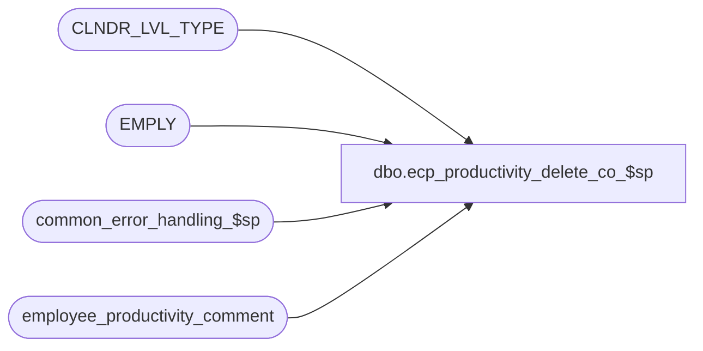

# dbo.ecp_productivity_delete_co_$sp

**Database:** auditworks_external  
**Server:** bedrockdb01  

## Architecture Diagram



## Table Dependencies

| Referenced Table |
|---|
| CLNDR_LVL_TYPE |
| EMPLY |
| common_error_handling_$sp |
| employee_productivity_comment |

## Stored Procedure Code

```sql
create proc [dbo].[ecp_productivity_delete_co_$sp] --DECLARE 
  @ecp_comment_id numeric(12,0),
  @user_id numeric(10,0) = null
AS
/* 
Proc Name: ecp_productivity_delete_co_$sp 
exec ecp_productivity_delete_co_$sp 1, null

Desc:   Deletes previously entered comments from ECP Employee Productivity

HISTORY:  
Date     Name           Def#    Desc
Apr14,11 Paul          126153   Use unicode datatypes
Jul04,08 Vicci                  Raise error if @user_id IS NULL
Oct01,07 Vicci          85597   Return correct user id
Sep11,07 Vicci          85597   Author
*/

SET NOCOUNT ON
DECLARE
  @employee_name nvarchar(255),
  @comment_period nvarchar(255),
  @entry_datetime datetime,
  @comment nvarchar(3000),
  @private tinyint,
  @deletion_datetime datetime,
  @errmsg                       nvarchar(255),
  @errno                        int,
  @function_name	        varbinary(128),
  @message_id                   int,
  @operation_name               nvarchar(100),
  @user_name			nvarchar(30),
  @process_name                 nvarchar(100),
  @object_name                  nvarchar(255), 
  @process_no                   int, 
  @prior_user_id		numeric(10,0),
  @ecp_status			tinyint,
  @ecp_status_message		nvarchar(255)
 
SELECT @errno = 0,
       @function_name = convert(varbinary(128), 'ecp_productivity_delete_co_$sp'),
       @message_id = 201068,
       @operation_name = 'Unknown',
       @process_name = 'ecp_productivity_delete_co_$sp',
       @process_no = 36 --unknown

IF @user_name IS NULL
  SELECT @user_name = suser_sname()
       
SET CONTEXT_INFO @function_name

SELECT @employee_name = IsNull((IsNull(em.LAST_NAME, '') + Substring(', ', 1, sign(datalength(em.LAST_NAME) * datalength(em.FRST_NAME)) * 2)  + IsNull(em.FRST_NAME, '')), '') + ' (' + convert(nvarchar, adj.employee_no) + ')',
       @comment_period = cllt.CLNDR_LVL_DESC + ' ' + substring(convert(nvarchar, adj.period_end_datetime, 120), 1, 10),
       @entry_datetime = adj.entry_datetime,    
       @comment = adj.comment,
       @private = adj.private,
       @deletion_datetime = adj.deletion_datetime,
       @prior_user_id = adj.user_id
  FROM employee_productivity_comment adj
       LEFT OUTER JOIN EMPLY em
          ON adj.employee_no = em.EMPLY_NUM
       LEFT OUTER JOIN CLNDR_LVL_TYPE cllt
          ON adj.calendar_level = cllt.CLNDR_LVL_TYPE_IDNTY
 WHERE adj.ecp_comment_id = @ecp_comment_id
SELECT @errno = @@error
IF @errno <> 0
BEGIN
  SELECT @errmsg = 'Failed to retrieve comments',
         @object_name = 'employee_productivity_comment',
         @operation_name = 'SELECT'
  GOTO error
END

IF @private IS NULL
BEGIN
  SELECT @ecp_status = 1,
         @ecp_status_message = 'Comment ' + convert(nvarchar, @ecp_comment_id) + ' not found'
END
ELSE
BEGIN
  IF @deletion_datetime IS NOT NULL
  BEGIN
    SELECT @ecp_status = 2,
           @ecp_status_message = 'Comment already deleted'
  END
  ELSE
  BEGIN
    IF @prior_user_id <> @user_id OR @user_id IS NULL 
    BEGIN
      SELECT @ecp_status = 3,
             @ecp_status_message = 'You may not delete another user''s comments'
    END
    ELSE
    BEGIN
      SELECT @ecp_status = 0,
             @ecp_status_message = 'Comment deleted',
             @deletion_datetime = getdate()
      UPDATE employee_productivity_comment
         SET deletion_datetime = @deletion_datetime
       WHERE ecp_comment_id = @ecp_comment_id
         AND user_id = @user_id
         AND deletion_datetime IS NULL
      SELECT @errno = @@error
      IF @errno <> 0
      BEGIN
        SELECT @errmsg = 'Failed to delete comment',
               @object_name = 'employee_productivity_comment',
               @operation_name = 'UPDATE'
        GOTO error
      END
    END
  END
END    
         
SELECT @ecp_status ecp_status,
       @ecp_status_message ecp_status_message,
       @employee_name employee_name,
       @comment_period comment_period,
       @entry_datetime entry_datetime,    
       @prior_user_id user_id,
       @comment comment,
       @private private,
       @deletion_datetime deletion_datetime,
       @ecp_comment_id ecp_comment_id

SELECT @function_name = convert(varbinary(128), 'Unknown')
SET CONTEXT_INFO @function_name
RETURN

error:
  SELECT @function_name = convert(varbinary(128), 'Unknown')
  SET CONTEXT_INFO @function_name

  EXEC common_error_handling_$sp @process_no, @errno, @errmsg, 0, @message_id, @process_name, @object_name, @operation_name, 1, 1

  RETURN
```

