# dbo.ecp_productivity_subreport_$sp

**Database:** auditworks_external  
**Server:** bedrockdb01  

## Architecture Diagram

```mermaid
flowchart LR
    SP["dbo.ecp_productivity_subreport_$sp"]
    CLNDR_LVL(["CLNDR_LVL"]) --> SP
    CLNDR_LVL_TYPE(["CLNDR_LVL_TYPE"]) --> SP
    CLNDR_LVL_TYPE_LANG(["CLNDR_LVL_TYPE_LANG"]) --> SP
    CLNDR_PRD(["CLNDR_PRD"]) --> SP
    EMPLY(["EMPLY"]) --> SP
    EMPLY_STS_HSTRY(["EMPLY_STS_HSTRY"]) --> SP
    ORG_CHN(["ORG_CHN"]) --> SP
    ORG_CHN_HRCHY_LVL_GRP(["ORG_CHN_HRCHY_LVL_GRP"]) --> SP
    ORG_CHN_HRCHY_LVL_GRP_A(["ORG_CHN_HRCHY_LVL_GRP_A"]) --> SP
    ORG_CHN_LOC_FNCTN(["ORG_CHN_LOC_FNCTN"]) --> SP
    ORG_CHN_LOC_FNCTN_LANG(["ORG_CHN_LOC_FNCTN_LANG"]) --> SP
    ORG_CHN_PSTN(["ORG_CHN_PSTN"]) --> SP
    ORG_CHN_PSTN_LANG(["ORG_CHN_PSTN_LANG"]) --> SP
    SCRTY_ACS_HRCHY_LVL_GRP(["SCRTY_ACS_HRCHY_LVL_GRP"]) --> SP
    alpha_code_description(["alpha_code_description"]) --> SP
    av_discount_detail(["av_discount_detail"]) --> SP
    av_merchandise_detail(["av_merchandise_detail"]) --> SP
    av_return_detail(["av_return_detail"]) --> SP
    av_transaction_header(["av_transaction_header"]) --> SP
    av_transaction_line(["av_transaction_line"]) --> SP
    class_sa(["class_sa"]) --> SP
    code_description(["code_description"]) --> SP
    common_error_handling__sp(["common_error_handling_$sp"]) --> SP
    discount_detail(["discount_detail"]) --> SP
    dbo_ecp_get_user_employee_no__sp(["dbo.ecp_get_user_employee_no_$sp"]) --> SP
    ecp_hour_categorization(["ecp_hour_categorization"]) --> SP
    ecp_parameter(["ecp_parameter"]) --> SP
    ecp_productivity_subrpt_trace(["ecp_productivity_subrpt_trace"]) --> SP
    ecp_ref_amt_transaction(["ecp_ref_amt_transaction"]) --> SP
    ecp_reference_amt_type(["ecp_reference_amt_type"]) --> SP
    employee_comparison_type(["employee_comparison_type"]) --> SP
    employee_hour_summary(["employee_hour_summary"]) --> SP
    employee_hour_transaction(["employee_hour_transaction"]) --> SP
    employee_relationship_set(["employee_relationship_set"]) --> SP
    employee_traffic_attribution(["employee_traffic_attribution"]) --> SP
    employee_trans_summary(["employee_trans_summary"]) --> SP
    employee_transaction(["employee_transaction"]) --> SP
    employee_transaction_role(["employee_transaction_role"]) --> SP
    language_dependent_description(["language_dependent_description"]) --> SP
    line_action(["line_action"]) --> SP
    line_object(["line_object"]) --> SP
    merchandise_detail(["merchandise_detail"]) --> SP
    return_detail(["return_detail"]) --> SP
    scoping_salesaudit(["scoping_salesaudit"]) --> SP
    style_sa(["style_sa"]) --> SP
    transaction_header(["transaction_header"]) --> SP
    transaction_line(["transaction_line"]) --> SP
    upc_only_sa(["upc_only_sa"]) --> SP
```



## Table Dependencies

| Referenced Table |
|---|
| CLNDR_LVL |
| CLNDR_LVL_TYPE |
| CLNDR_LVL_TYPE_LANG |
| CLNDR_PRD |
| EMPLY |
| EMPLY_STS_HSTRY |
| ORG_CHN |
| ORG_CHN_HRCHY_LVL_GRP |
| ORG_CHN_HRCHY_LVL_GRP_A |
| ORG_CHN_LOC_FNCTN |
| ORG_CHN_LOC_FNCTN_LANG |
| ORG_CHN_PSTN |
| ORG_CHN_PSTN_LANG |
| SCRTY_ACS_HRCHY_LVL_GRP |
| alpha_code_description |
| av_discount_detail |
| av_merchandise_detail |
| av_return_detail |
| av_transaction_header |
| av_transaction_line |
| class_sa |
| code_description |
| common_error_handling_$sp |
| discount_detail |
| dbo.ecp_get_user_employee_no_$sp |
| ecp_hour_categorization |
| ecp_parameter |
| ecp_productivity_subrpt_trace |
| ecp_ref_amt_transaction |
| ecp_reference_amt_type |
| employee_comparison_type |
| employee_hour_summary |
| employee_hour_transaction |
| employee_relationship_set |
| employee_traffic_attribution |
| employee_trans_summary |
| employee_transaction |
| employee_transaction_role |
| language_dependent_description |
| line_action |
| line_object |
| merchandise_detail |
| return_detail |
| scoping_salesaudit |
| style_sa |
| transaction_header |
| transaction_line |
| upc_only_sa |

## Stored Procedure Code

```sql
CREATE proc [dbo].[ecp_productivity_subreport_$sp] --DECLARE 
  @drill_down_column nvarchar(30) = null,  --if not specified assumes net_amt (attributed_traffic_count, etc)
  @select_from_date datetime = null,  --for drill-downs, set = to the to date
                                      --all periods with at least 1 date falling between the range selected are included
  @select_to_date datetime = null,    -- if from/to not specified assumes today
  @select_calendar_level int = null,  --if not specified assumes lowest
  @select_transaction_role_list nvarchar(4000) = null,  --from employee_transaction_role WHERE track_in_productivity_flag = 1.
  @select_store_list nvarchar(4000) = null,  -- transaction store of drill-down row;  if from/to/list not specified assumes all
  @select_store_from int = null,
  @select_store_to int = null,
  @select_employee_list nvarchar(4000) = null,
  @select_employee_from int = null,
  @select_employee_to int = null,
  @select_selling_area_list nvarchar(4000) = null,
  @select_selling_area_from int = null,
  @select_selling_area_to int = null,
  @select_primary_position_list nvarchar(4000) = null, 
  @language_id smallint = null,  --if not specified defaults to 1033 i.e. English
  @user_name nvarchar(30) = null,
  @select_home_store_list nvarchar(4000) = null,  -- if from/to/list not specified assumes all
  @select_home_store_from int = null,
  @select_home_store_to int = null,
  @terminated_employees tinyint = null, --if not specified assumes all, 
                                        --if set to 1 means only terminated employees, 
			                --if set to 0 means excludes terminated employees
  @employee_group_code_start nvarchar(20) = null,
  @employee_group_code_end nvarchar(20) = null,
  @relationship_type nvarchar(20) = null,
  @user_id numeric(10,0) = null,
  @unlimited_comparison_type smallint = null,  --set to source report @comparison_type if drilling down on a subtotal row and @comparison_limited is false
  @all_transaction_roles tinyint = 0,  --set to 1 if source reports input param for @select_transaction_role_list was originally null
  @employee_no int = null, --set to employee number of user ID if user is restricted to viewing his own data only.
  @run_as_trace_execution_time datetime = null
AS

/* 
Proc Name: ecp_productivity_subreport_$sp 
exec ecp_productivity_subreport_$sp null, '05/12/2007', '05/12/2007', null, 
                                    null, 
                                    null, null, null, 
                                    '33324', null, null,
                                    '265'
Desc:   Retrieves data for ECP Employee Productivity Report drill-downs

HISTORY:  
Date     Name           Def#    Desc
Mar23,15 Vicci      TFS-92911   Handle employees with selling area -1.
May09,14 Vicci      TFS-72556   Replace erroneous references to language_dependent_description with language_dependent_description and
                                Correct alias used for language_dependent_description association with line_action to be aldd instead of al since al alias already used by av_transaction_line reference.
                                Correct resource_id column prefix to be ht.resource_id not h.resource_id.
                                Correct display_description column prefix to be ol.display_description not l.display_description.
Apr01,13 Vicci         140907   Multi-language support
Nov14,08 Vicci         104484   Add run-from-trace option and fix join to ORG_CHN_LOC_FNCTN.  Add support for traffic fields.
Oct30,08 Vicci         105986   When user access limited to their own data (i.e. employee_no passed in) or when user has not been
                                given access to any stores, then only return details pertinent to that employee.
Sep08,08 Vicci         104576   Replace upc_sa view join with joins to uderlying views.
Sep02,08 Vicci         104510   Correct join to upc_sa
Aug22,08 Vicci         103967   Handle effective date on employee relationship changes (even in YTD etc figures).
Aug15,08 Vicci         103077   Support home-store effective dates
Feb26,08 Vicci          95521   Integrate with CRDM properly.
Feb08,08 Vicci          97975   Set errno not just message_id when raising business rule error
Sep24,07 Vicci          85597   Support drill-down on rcap_alert
Sep21,07 Vicci          85597   Fix handling of transaction role with regard to payroll hour retrieval.
                                Add discount reason detail.
Sep20,07 Vicci          85597   Support drilling down on the subtotals of unlimited comparison types.
Sep19,07 Vicci          85597   Add trace code
Sep11,07 Vicci          85597   Add handling for new drill-down columns (cap net and rnet);  
                                Handle home-store, terminated, relationship
Jul16,07 Vicci          85597   Handle new drill-down columns being passed in.
Jul02,07 Vicci          85597   Handle invalid selling area and/or primary position being passed in.
Jun13,07 vicci          85597   Return header store instead of ets.transaction-store to handle returns from another store.
Jun12,07 Vicci          85597   Make drill-down work even if selling area or position are invalid.
May17,07 Vicci          85597   Removed reference to position from employee transaction role select
Mar06,07 Vicci		85597	Author
*/

--TODO:  multi-language

SET NOCOUNT ON
DECLARE
  @position			int,
  @select_calendar_level_id     binary(16),
  @trace_log			tinyint,
  @valid_comparison_type	tinyint,
  @compare_employee		tinyint,
  @compare_employee_from	int,
  @compare_employee_to		int,
  @compare_selling_area_from	int,
  @compare_selling_area_to	int,
  @min_selling_area_no		int,
  @max_selling_area_no		int,
  @min_employee_no		int,
  @max_employee_no		int,
  @comparison_limits_apply	tinyint,
  @compare_home_store_from	int,
  @compare_home_store_to	int,
  @compare_store_from		int,
  @compare_store_to		int,
  @ecp_clndr_id			binary(16),
  @employee_count		int,
  @from_date 			datetime,
  @calendar_level_count		int,
  @compare_position             tinyint,
  @compare_selling_area         tinyint,
  @compare_home_store		tinyint,
  @compare_store                tinyint,
  @lowest_calendar_level	int,
  @lowest_calendar_level_id	binary(16),
  @one_hundred			money,
  @empl_transaction_role_count  int, 
  @errmsg                       nvarchar(255),
  @errno    int,
  @errno2			int,
  @function_name	        varbinary(128),
  @message_id                   int,
  @position_count		int,
  @process_name             nvarchar(100),
  @process_no                   int,
  @object_name                  nvarchar(255),
  @operation_name               nvarchar(100),
  @rows				int,
  @selling_area_count		int,
  @home_store_count             int,
  @home_store_comp_count	int,
  @store_comp_count 		int,
  @selling_area_comp_count 	int,
  @position_comp_count 		int,
  @store_count			int,
  @stream_no                    tinyint,
  @to_date 			datetime,
  @sql_command 			nvarchar(4000),
--  @relationship_type 		nvarchar(20),
  @relationship_position        nvarchar(4),
  @selling_area_no              nvarchar(4000),
  @primary_position             nvarchar(4000),
  @employee_transaction_role nvarchar(20),
  @store_restriction tinyint,
  @relationship_type_len	int,
  @Hoursworked_desc		nvarchar(255),
  @Chain_desc		nvarchar(255)

IF @run_as_trace_execution_time IS NOT NULL
BEGIN 
  --SELECT convert(nvarchar, execution_datetime, 108), * FROM ecp_productivity_subrpt_trace ORDER BY execution_datetime DESC
  SELECT @drill_down_column = drill_down_column,
         @select_from_date = select_from_date,
         @select_to_date = select_to_date,
         @select_calendar_level = select_calendar_level,
         @select_transaction_role_list = select_transaction_role_list,
         @select_store_list = select_store_list,
         @select_store_from = select_store_from,
         @select_store_to = select_store_to,
         @select_employee_list = select_employee_list,
         @select_employee_from = select_employee_from,
         @select_employee_to = select_employee_to,
         @select_selling_area_list = select_selling_area_list,
         @select_selling_area_from = select_selling_area_from,
         @select_selling_area_to = select_selling_area_to,
         @select_primary_position_list = select_primary_position_list,
         @language_id = language_id,
         @user_name = user_name,
         @select_home_store_list = select_home_store_list,
         @select_home_store_from = select_home_store_from,
         @select_home_store_to = select_home_store_to,
         @terminated_employees = terminated_employees,
         @employee_group_code_start = employee_group_code_start,
         @employee_group_code_end = employee_group_code_end,
         @relationship_type = relationship_type,
         @user_id = user_id,
         @unlimited_comparison_type = unlimited_comparison_type,
         @all_transaction_roles = all_transaction_roles,
         @employee_no = employee_no
    FROM ecp_productivity_subrpt_trace
   WHERE execution_datetime >= @run_as_trace_execution_time
     AND execution_datetime < dateadd(ss, 1, @run_as_trace_execution_time)
END

 
SELECT @employee_count = 0, 
       @errno = 0,
       @function_name = convert(varbinary(128), 'ecp_productivity_subreport_$sp'),
       @message_id = 201068,
       @one_hundred = 100,
       @operation_name = 'Unknown',
       @position_count = 0,
       @process_name = 'ecp_productivity_subreport_$sp',
       @process_no = 36, --unknown
       @selling_area_count = 0,
       @store_count = 0, 
       @home_store_count = 0,       
       @home_store_comp_count = 0,
       @store_comp_count = 0,
       @selling_area_comp_count = 0,
       @position_comp_count = 0,
       @stream_no = 1,
       @comparison_limits_apply = 0,
       @relationship_type_len = IsNull(datalength(@relationship_type), 0) + 5 --add 5 for t: and g: prefix and space       
IF @drill_down_column IS NULL
  SELECT @drill_down_column = 'net_amt'
  
IF @user_name IS NULL
  SELECT @user_name = suser_sname()
       
SET CONTEXT_INFO @function_name

IF @language_id IS NULL 
  SELECT @language_id = 1033

SELECT @Hoursworked_desc = l.display_description
  FROM scoping_salesaudit s
       INNER JOIN language_dependent_description l
          ON s.resource_id = l.resource_id
         AND l.language_id = @language_id
  WHERE s.tag = 'TRANSLATION' and s.selection_criteria_key = 'Hours worked'
SELECT @errno = @@error, @Hoursworked_desc = COALESCE(@Hoursworked_desc, 'Hours worked')
IF @errno <> 0
BEGIN
  SELECT @errmsg = 'Failed to determine language based description for @Hoursworked_desc',
         @object_name = 'language_dependent_description',
         @operation_name = 'SELECT'
  GOTO error
END
SELECT @Chain_desc = l.display_description
  FROM scoping_salesaudit s
       INNER JOIN language_dependent_description l
          ON s.resource_id = l.resource_id
         AND l.language_id = @language_id
  WHERE s.tag = 'TRANSLATION' and s.selection_criteria_key = 'Chain'
SELECT @errno = @@error, @Chain_desc = COALESCE(@Chain_desc, 'Chain')
IF @errno <> 0
BEGIN
  SELECT @errmsg = 'Failed to determine language based description for @Chain_desc',
         @object_name = 'language_dependent_description',
         @operation_name = 'SELECT'
  GOTO error
END

SELECT @trace_log = 1
IF @trace_log = 1
BEGIN
if not exists (select * from dbo.sysobjects where id = Object_id('dbo.ecp_productivity_subrpt_trace') and type in ('U','S'))
begin
create table dbo.ecp_productivity_subrpt_trace(
  execution_datetime datetime default getdate() not null,
  drill_down_column nvarchar(30) null,
  select_from_date datetime null,
  select_to_date datetime null,
select_calendar_level int null,
  select_transaction_role_list nvarchar(4000) null,
  select_store_list nvarchar(4000) null,
  select_store_from int null,
  select_store_to int null,
  select_employee_list nvarchar(4000) null,
  select_employee_from int null,
  select_employee_to int null,
  select_selling_area_list nvarchar(4000) null,
  select_selling_area_from int null,
  select_selling_area_to int null,
  select_primary_position_list nvarchar(4000) null, 
  language_id smallint null,
  user_name nvarchar(30) null,
  select_home_store_list nvarchar(4000) null,
  select_home_store_from int null,
  select_home_store_to int null,
  terminated_employees tinyint null, 
  employee_group_code_start nvarchar(20) null,
  employee_group_code_end nvarchar(20) null,
  relationship_type nvarchar(20) null,
  user_id numeric(10,0) null,
  unlimited_comparison_type smallint  null,
  all_transaction_roles tinyint null,
  employee_no int null
) 
end

delete from ecp_productivity_subrpt_trace
where execution_datetime < dateadd(dd, -3, getdate())
INSERT into ecp_productivity_subrpt_trace(
       drill_down_column,
       select_from_date,
       select_to_date,
       select_calendar_level,
       select_transaction_role_list,
       select_store_list,
       select_store_from,
       select_store_to,
       select_employee_list,
       select_employee_from,
       select_employee_to,
       select_selling_area_list,
       select_selling_area_from,
       select_selling_area_to,
       select_primary_position_list,
       language_id,
       user_name,
       select_home_store_list,
       select_home_store_from,
       select_home_store_to,
       terminated_employees,
       employee_group_code_start,
       employee_group_code_end,
       relationship_type,
       user_id,
       unlimited_comparison_type,
       all_transaction_roles,
       employee_no)
VALUES (@drill_down_column,
       @select_from_date,
       @select_to_date,
       @select_calendar_level,
       @select_transaction_role_list,
       @select_store_list,
       @select_store_from,
       @select_store_to,
       @select_employee_list,
       @select_employee_from,
       @select_employee_to,
       @select_selling_area_list,
       @select_selling_area_from,
       @select_selling_area_to,
       @select_primary_position_list,
       @language_id,
       @user_name,
       @select_home_store_list,
       @select_home_store_from,
       @select_home_store_to,
       @terminated_employees,
       @employee_group_code_start,
       @employee_group_code_end,
       @relationship_type,
       @user_id,
       @unlimited_comparison_type,
       @all_transaction_roles,
       @employee_no)
END

CREATE TABLE #comparison_limits(
       store_no int null, 
       primary_selling_area_no int null, 
       primary_position nvarchar(20) null, 
       employee_group_code_start nvarchar(20) null, 
       employee_group_code_end nvarchar(20) null,
       home_store_no int null)
SELECT @errno = @@error
IF @errno <> 0
BEGIN
  SELECT @errmsg = 'Failed to create temp table to hold list of comparison restrictions',
         @object_name = '#comparison_limits',
         @operation_name = 'CREATE'
  GOTO error
END
 
CREATE TABLE #select_primary_position(primary_position nvarchar(4) not null)
SELECT @errno = @@error
IF @errno <> 0
BEGIN
  SELECT @errmsg = 'Failed to create temp table to hold list of selected positions',
         @object_name = '#select_primary_position',
         @operation_name = 'CREATE'
  GOTO error
END
CREATE TABLE #select_selling_area(selling_area_no int not null)
SELECT @errno = @@error
IF @errno <> 0
BEGIN
  SELECT @errmsg = 'Failed to create temp table to hold list of selected selling areas',
         @object_name = '#select_selling_area',
         @operation_name = 'CREATE'
  GOTO error
END
CREATE TABLE #select_employee(
       employee_no int not null)
SELECT @errno = @@error
IF @errno <> 0
BEGIN
  SELECT @errmsg = 'Failed to create temp table to hold list of selected employees',
         @object_name = '#select_employee',
         @operation_name = 'CREATE'
  GOTO error
END
CREATE TABLE #select_store(store_no int not null)
SELECT @errno = @@error
IF @errno <> 0
BEGIN
  SELECT @errmsg = 'Failed to create temp table to hold list of selected stores',
   @object_name = '#select_store',
         @operation_name = 'CREATE'
  GOTO error
END
CREATE TABLE #select_home_store(store_no int not null)
SELECT @errno = @@error
IF @errno <> 0
BEGIN
  SELECT @errmsg = 'Failed to create temp table to hold list of selected home-stores',
         @object_name = '#select_home_store',
      @operation_name = 'CREATE'
GOTO error
END
CREATE TABLE #store_restriction(ORG_CHN_NUM int not null)
SELECT @errno = @@error
IF @errno <> 0
BEGIN
  SELECT @errmsg = 'Failed to create temp table to hold list of stores to which user has access',  
         @object_name = '#store_restriction',
         @operation_name = 'CREATE'
  GOTO error
END

CREATE TABLE #select_transaction_role(employee_transaction_role nvarchar(20) not null, 
                                      primary_position nvarchar(4) null,
                                      salesperson_flag tinyint null )
SELECT @errno = @@error
IF @errno <> 0
BEGIN
  SELECT @errmsg = 'Failed to create temp table to hold list of selected transaction roles',
         @object_name = '#select_transaction_role',
         @operation_name = 'CREATE'
  GOTO error
END

IF @select_primary_position_list IS NOT NULL
BEGIN
  SELECT @position = CHARINDEX('''', @select_primary_position_list)
  WHILE @position > 0
  BEGIN
    SELECT @select_primary_position_list = stuff(@select_primary_position_list, charindex('''', @select_primary_position_list), 1, '')  
    SELECT @position = CHARINDEX('''', @select_primary_position_list)
  END

  SELECT @position = CHARINDEX(',', @select_primary_position_list)
  WHILE @position > 0
  BEGIN
    INSERT into #select_primary_position(primary_position)
    VALUES (ltrim(rtrim(substring(@select_primary_position_list, 1, @position - 1))))
    SELECT @select_primary_position_list = substring(@select_primary_position_list, @position + 1, 4000)
    SELECT @position = CHARINDEX(',', @select_primary_position_list)
  END
  INSERT into #select_primary_position(primary_position)
  VALUES (ltrim(rtrim(@select_primary_position_list)))

  SELECT @position_count = count(*)
    FROM #select_primary_position
  
  IF @position_count < 1
  BEGIN
    SELECT @message_id = 201684,
           @errno = 201684,
           @errmsg = 'Invalid primary position list passed',
           @object_name = 'ORG_CHN_LOC',
           @operation_name = 'SELECT'
GOTO error
  END
END
ELSE
BEGIN
  INSERT #select_primary_position(primary_position)
  VALUES('-1')
  SELECT @position_count = 0
END

--select 'Test #select_primary_position', * from #select_primary_position

IF @select_selling_area_list IS NOT NULL
BEGIN
  SELECT @position = CHARINDEX(',', @select_selling_area_list)
  WHILE @position > 0
  BEGIN
    INSERT into #select_selling_area(selling_area_no)
    VALUES (convert(int, substring(@select_selling_area_list, 1, @position - 1)))
    SELECT @select_selling_area_list = substring(@select_selling_area_list, @position + 1, 4000)
    SELECT @position = CHARINDEX(',', @select_selling_area_list)
  END
  INSERT into #select_selling_area(selling_area_no)
  VALUES (convert(int, @select_selling_area_list))

  SELECT @selling_area_count = count(*)
    FROM #select_selling_area
  
  IF @selling_area_count < 1
  BEGIN
    SELECT @message_id = 201684,
           @errno = 201684,
           @errmsg = 'Invalid selling area list passed',
           @object_name = 'ORG_CHN_LOC',
           @operation_name = 'SELECT'
    GOTO error
  END
END
ELSE
BEGIN
  INSERT #select_selling_area(selling_area_no)
  VALUES(-1)
  SELECT @selling_area_count = 0
END

--select 'Test #select_selling_area', * from #select_selling_area

IF @select_selling_area_from IS NULL
  SELECT @select_selling_area_from = -1

IF @select_selling_area_to IS NULL
  SELECT @select_selling_area_to = 2147483647

IF @select_employee_list IS NOT NULL
BEGIN
  SELECT @sql_command = '
  INSERT #select_employee(employee_no)
  SELECT e.EMPLY_NUM
    FROM EMPLY e
         LEFT OUTER JOIN EMPLY_STS_HSTRY eht
           ON e.EMPLY_NUM = eht.EMPLY_NUM
 AND (@select_to_date >= eht.EFCTV_DATE AND (@select_to_date < eht.EXPRTN_DATE OR eht.EXPRTN_DATE IS NULL))
         LEFT OUTER JOIN EMPLY_STS_HSTRY ehf
           ON e.EMPLY_NUM = ehf.EMPLY_NUM
          AND (@select_from_date >= ehf.EFCTV_DATE AND (@select_from_date < ehf.EXPRTN_DATE OR ehf.EXPRTN_DATE IS NULL))
   WHERE e.EMPLY_NUM IN (' + @select_employee_list + ')
     AND (@terminated_employees IS NULL OR
       (@terminated_employees = 1 AND eht.EMPLY_STS_CODE = ''TERM'' AND ehf.EMPLY_STS_CODE = ''TERM'') OR
          (@terminated_employees = 0 AND (IsNull(eht.EMPLY_STS_CODE, ''HIRE'') <> ''TERM'' OR IsNull(ehf.EMPLY_STS_CODE, ''HIRE'') <> ''TERM''))
         )
  SELECT @employee_count = @@rowcount'

  EXEC sp_executesql @sql_command, N'@terminated_employees tinyint, @select_to_date datetime, @select_from_date datetime, @employee_count int OUT',@terminated_employees, @select_to_date, @select_from_date, @employee_count OUT        
  
  IF @employee_count < 1
  BEGIN
    SELECT @message_id = 201684,
           @errno = 201684,
           @errmsg = 'Invalid employee list passed',
           @object_name = 'EMPLY',
           @operation_name = 'SELECT'
    GOTO cleanup
  END
END
ELSE
BEGIN
  IF @terminated_employees IS NOT NULL
  BEGIN
    INSERT #select_employee(employee_no)
    SELECT e.EMPLY_NUM
      FROM EMPLY e
           LEFT OUTER JOIN EMPLY_STS_HSTRY eht
             ON e.EMPLY_NUM = eht.EMPLY_NUM
            AND (@select_to_date >= eht.EFCTV_DATE AND (@select_to_date < eht.EXPRTN_DATE OR eht.EXPRTN_DATE IS NULL))
           LEFT OUTER JOIN EMPLY_STS_HSTRY ehf
             ON e.EMPLY_NUM = ehf.EMPLY_NUM
            AND (@select_from_date >= ehf.EFCTV_DATE AND (@select_from_date < ehf.EXPRTN_DATE OR ehf.EXPRTN_DATE IS NULL))
     WHERE ( (@terminated_employees = 1 AND ehf.EMPLY_STS_CODE = 'TERM' AND eht.EMPLY_STS_CODE = 'TERM') OR
             (@terminated_employees = 0 AND (IsNull(ehf.EMPLY_STS_CODE, 'HIRE') <> 'TERM' OR IsNull(eht.EMPLY_STS_CODE, 'HIRE') <> 'TERM') ))
    SELECT @employee_count = @@rowcount
  END
  ELSE
  BEGIN
    INSERT #select_employee(employee_no)
    VALUES (-1)
  END
END

--select 'Test #select_employee', * from #select_employee

IF @select_employee_from IS NULL
  SELECT @select_employee_from = 0

IF @select_employee_to IS NULL
  SELECT @select_employee_to = 2147483647
  
IF NOT EXISTS (SELECT 1 
                 FROM SCRTY_ACS_HRCHY_LVL_GRP s 
                WHERE s.ACS_ID_TYPE = 1 
                  AND s.ACS_ID = @user_id   
                  AND s.HRCHY_LVL_GRP_ID = -1)
   AND @user_id IS NOT NULL
   AND @employee_no IS NULL
BEGIN
  SELECT @store_restriction = 1
  INSERT into #store_restriction(ORG_CHN_NUM)
  SELECT DISTINCT a.ORG_CHN_NUM 
    FROM SCRTY_ACS_HRCHY_LVL_GRP s, 
         ORG_CHN_HRCHY_LVL_GRP_A a, 
         ORG_CHN_HRCHY_LVL_GRP b 
   WHERE s.HRCHY_LVL_GRP_ID = b.HRCHY_LVL_GRP_IDNTY 
     AND b.HRCHY_LVL_GRP_ID = a.HRCHY_LVL_GRP_ID 
     AND s.ACS_ID_TYPE = 1 and s.ACS_ID = @user_id
  SELECT @errno = @@error
  IF @errno <> 0
  BEGIN
    SELECT @errmsg = 'Failed to list stores to which user has access',
           @object_name = '#store_restriction',
           @operation_name = 'INSERT'
    GOTO error
  END
END  
ELSE
BEGIN
  SELECT @store_restriction = 0
  INSERT into #store_restriction(ORG_CHN_NUM)
  VALUES (-1)
  SELECT @errno = @@error
  IF @errno <> 0
  BEGIN
    SELECT @errmsg = 'Failed to indicate that the user has access to all stores.',
        @object_name = '#store_restriction',
           @operation_name = 'INSERT'
    GOTO error
  END
END

IF @employee_no IS NULL AND @user_id IS NOT NULL AND @store_restriction = 1 AND NOT EXISTS (SELECT 1 FROM #store_restriction)
BEGIN
  SELECT @employee_no = dbo.ecp_get_user_employee_no_$sp(@user_name)
  SELECT @errno = @@error
  IF @errno <> 0
  BEGIN
    SELECT @errmsg = 'Cannot determine employee number corresponding to user name',
           @object_name = 'ecp_get_user_employee_no_$sp',
           @operation_name = 'EXEC'
    GOTO error
  END
  IF @employee_no IS NULL 
  BEGIN
    SELECT @message_id = 201684,
           @errno = 201684,
           @errmsg = 'User ' + @user_name + ' has not been assigned access to any stores, and is not found in employee master.  Access denied.',
           @object_name = 'ecp_get_user_employee_no_$sp',
           @operation_name = 'EXEC'
    GOTO cleanup
  END
  ELSE
  BEGIN
    SELECT @store_restriction = 0
    INSERT into #store_restriction(ORG_CHN_NUM)
    VALUES (-1)
    SELECT @errno = @@error
    IF @errno <> 0
    BEGIN
      SELECT @errmsg = 'Failed to indicate that the user has access to all stores.',
             @object_name = '#store_restriction',
             @operation_name = 'INSERT'
     GOTO error
    END
  END 
END
--select 'Test #store_restriction', * from #store_restriction

IF @select_store_list IS NOT NULL
BEGIN
  SELECT @sql_command = '
  INSERT #select_store(store_no)
  SELECT ORG_CHN_NUM
    FROM ORG_CHN
   WHERE ORG_CHN_NUM IN (' + @select_store_list + ')
  SELECT @store_count = @@rowcount'

  EXEC sp_executesql @sql_command, N'@store_count int OUT', @store_count OUT        
  
  IF @store_count < 1
  BEGIN
    SELECT @message_id = 201684,
           @errno = 201684,
  @errmsg = 'Invalid store list passed',
        @object_name = 'ORG_CHN',
           @operation_name = 'SELECT'
    GOTO cleanup
  END
END
ELSE
BEGIN
  INSERT #select_store(store_no)
  VALUES(-1)
END
--select 'Test #select_store', * from #select_store

IF @select_store_from IS NULL
  SELECT @select_store_from = 0

IF @select_store_to IS NULL
  SELECT @select_store_to = 2147483647

IF @select_home_store_list IS NOT NULL 
BEGIN
  SELECT @sql_command = '
  INSERT #select_home_store(store_no)
  SELECT ORG_CHN_NUM
    FROM ORG_CHN
   WHERE ORG_CHN_NUM IN (' + @select_home_store_list + ')
  SELECT @home_store_count = @@rowcount'
  
  EXEC sp_executesql @sql_command, N'@home_store_count int OUT', @home_store_count OUT        
  
  IF @home_store_count < 1
  BEGIN
    SELECT @message_id = 201684,
           @errno = 201684,
           @errmsg = 'Invalid home store list passed',
           @object_name = 'ORG_CHN',
       @operation_name = 'SELECT'
  GOTO cleanup
  END
END
ELSE
BEGIN
  INSERT #select_home_store(store_no)
  VALUES(-1)
END
IF @select_home_store_from IS NULL
  SELECT @select_home_store_from = 0

IF @select_home_store_to IS NULL
  SELECT @select_home_store_to = 2147483647

--select 'Test #select_home_store', * from #select_home_store    

IF @select_transaction_role_list IS NULL
BEGIN
  INSERT #select_transaction_role(employee_transaction_role, primary_position, salesperson_flag)
  SELECT employee_transaction_role, null, salesperson_flag
    FROM employee_transaction_role etr
   WHERE track_in_productivity_flag = 1
--     AND salesperson_flag = 1
  SELECT @errno = @@error, @empl_transaction_role_count = @@rowcount
  IF @errno <> 0
  BEGIN
   SELECT @errmsg = 'Unable to build list of employee transaction roles to include',
           @object_name = '#select_transaction_role',
           @operation_name = 'INSERT'
    GOTO error
  END
  INSERT #select_transaction_role(employee_transaction_role, primary_position, salesperson_flag)
  SELECT employee_transaction_role, ehc.code, etr.salesperson_flag
    FROM employee_transaction_role etr
         INNER JOIN ecp_hour_categorization ehc
            ON code_type = 27
           AND code_status = 'U'
        AND system_code = etr.employee_transaction_role
   WHERE track_in_productivity_flag = 1
--     AND salesperson_flag = 1
  SELECT @errno = @@error
  IF @errno <> 0
  BEGIN
    SELECT @errmsg = 'Unable to build list of employee transaction roles to include',
           @object_name = '#select_transaction_role',
           @operation_name = 'INSERT'
    GOTO error
  END
END
ELSE
BEGIN
  SELECT @sql_command = '
  INSERT #select_transaction_role(employee_transaction_role, primary_position, salesperson_flag)
  SELECT employee_transaction_role, null, salesperson_flag
    FROM employee_transaction_role etr
   WHERE track_in_productivity_flag = 1
     AND employee_transaction_role IN (' + @select_transaction_role_list + ')
  SELECT @empl_transaction_role_count = @@rowcount'

  EXEC sp_executesql @sql_command, N'@empl_transaction_role_count int OUT', @empl_transaction_role_count OUT     

  SELECT @sql_command = '
  INSERT #select_transaction_role(employee_transaction_role, primary_position, salesperson_flag)
  SELECT employee_transaction_role, ehc.code, etr.salesperson_flag
    FROM employee_transaction_role etr
         INNER JOIN ecp_hour_categorization ehc
            ON code_type = 27
           AND code_status = ''U''
           AND system_code = etr.employee_transaction_role
   WHERE track_in_productivity_flag = 1
  AND employee_transaction_role IN (' + @select_transaction_role_list + ')'

  EXEC sp_executesql @sql_command    

END

IF @empl_transaction_role_count < 1
BEGIN
  SELECT @message_id = 201684,
         @errno = 201684,
         @errmsg = 'Invalid employee transaction role list passed',
         @object_name = 'employee_transaction_role',
         @operation_name = 'SELECT'
    GOTO cleanup
END

--select 'Test #select_transaction_role', * from #select_transaction_role    

IF @unlimited_comparison_type IS NOT NULL
BEGIN
  SELECT @compare_position = primary_position_flag,
  @compare_selling_area = primary_selling_area_no_flag,
         @compare_store = transaction_store_no_flag,
        @relationship_type = relationship_type,
        @relationship_position = relationship_position,
        @selling_area_no = selling_area_no,
   @primary_position = primary_position,
        @compare_home_store = home_store_no_flag
    FROM employee_comparison_type
 WHERE comparison_type = @unlimited_comparison_type
  SELECT @errno = @@error, @valid_comparison_type = @@rowcount
  IF @errno <> 0
  BEGIN
    SELECT @errmsg = 'Failed to determine comparison criteria of comparison type selected',
           @object_name = 'employee_comparison_type',
           @operation_name = 'SELECT'
    GOTO error
  END
END
IF @unlimited_comparison_type IS NOT NULL and @valid_comparison_type < 1
  SELECT @unlimited_comparison_type = NULL


SELECT @ecp_clndr_id = par_bin_value
  FROM ecp_parameter p
 WHERE par_name = 'ecp_dflt_clndr_id'  
SELECT @errno = @@error
IF @errno <> 0
BEGIN
  SELECT @errmsg = 'Unable to which calendar to use',
         @object_name = 'ecp_parameter',
         @operation_name = 'SELECT'
  GOTO error
END

IF @select_to_date > getdate() OR @select_to_date IS NULL
  SELECT @select_to_date = getdate()

SELECT @lowest_calendar_level = clt2.CLNDR_LVL_TYPE_IDNTY,
       @lowest_calendar_level_id = clt2.CLNDR_LVL_TYPE_ID
  FROM CLNDR_LVL_TYPE clt2
       INNER JOIN CLNDR_LVL cl2
          ON clt2.CLNDR_LVL_TYPE_ID = cl2.CLNDR_LVL_TYPE_ID
         AND cl2.CLNDR_ID = @ecp_clndr_id
 WHERE clt2.CLNDR_LVL_SEQ = (SELECT MAX(clt.CLNDR_LVL_SEQ)
			      FROM CLNDR_LVL_TYPE clt
                             INNER JOIN CLNDR_LVL cl
                                ON clt.CLNDR_LVL_TYPE_ID = cl.CLNDR_LVL_TYPE_ID
                               AND cl.CLNDR_ID = @ecp_clndr_id)
SELECT @errno = @@error
IF @errno <> 0
BEGIN
  SELECT @errmsg = 'Unable to which calendar level is the lowest',
         @object_name = 'CLNDR_LVL_TYPE',
         @operation_name = 'SELECT'
  GOTO error
END

IF @select_calendar_level IS NULL
  SELECT @select_calendar_level = @lowest_calendar_level,
         @select_calendar_level_id = @lowest_calendar_level_id
ELSE
BEGIN
  SELECT @select_calendar_level_id = clt.CLNDR_LVL_TYPE_ID
    FROM CLNDR_LVL_TYPE clt
 INNER JOIN CLNDR_LVL cl
            ON clt.CLNDR_LVL_TYPE_ID = cl.CLNDR_LVL_TYPE_ID
     AND cl.CLNDR_ID = @ecp_clndr_id
   WHERE clt.CLNDR_LVL_TYPE_IDNTY = @select_calendar_level
  SELECT @errno = @@error
  IF @errno <> 0
  BEGIN
    SELECT @errmsg = 'Unable to determine ID of calendar level selected',
           @object_name = 'CLNDR_LVL_TYPE',
           @operation_name = 'SELECT'
    GOTO error
  END
END

IF @select_calendar_level_id IS NULL
BEGIN
  SELECT @message_id = 201684,
         @errno = 201684,
         @errmsg = 'Invalid calendar level list passed',
         @object_name = 'CLNDR_LVL',
         @operation_name = 'SELECT'
  GOTO cleanup
END


/* Verify that the From/To Date selected is a period-start / period-end date for the 
   lowest calendar level selected, and if not extend the date-range selected to 
   include a full period */
IF @select_from_date IS NULL OR @select_from_date > @select_to_date
BEGIN
    SELECT @select_from_date = @select_to_date
END
  
SELECT @to_date = dateadd(ss, -1, cp.END_DATE_TIME), @from_date = cp.STRT_DATE_TIME
  FROM CLNDR_PRD cp
 WHERE @select_to_date >= cp.STRT_DATE_TIME
AND @select_to_date < cp.END_DATE_TIME
   AND cp.CLNDR_ID = @ecp_clndr_id
   AND cp.CLNDR_LVL_TYPE_ID = @lowest_calendar_level_id
SELECT @errno = @@error
IF @errno <> 0
BEGIN
  SELECT @errmsg = 'Failed to determing period start/end dates of latest date selected',
         @object_name = 'CLNDR_PRD',
         @operation_name = 'SELECT'
  GOTO error
END

IF @to_date > @select_to_date
  SELECT @select_to_date = @to_date
  
IF @from_date < @select_from_date
  SELECT @select_from_date = @from_date
ELSE
BEGIN
  SELECT @select_from_date = cp.STRT_DATE_TIME
    FROM CLNDR_PRD cp
   WHERE @select_from_date >= cp.STRT_DATE_TIME
     AND @select_from_date < cp.END_DATE_TIME
     AND cp.CLNDR_ID = @ecp_clndr_id
     AND cp.CLNDR_LVL_TYPE_ID = @lowest_calendar_level_id
  SELECT @errno = @@error
  IF @errno <> 0
  BEGIN
  SELECT @errmsg = 'Failed to determing period start date of earliest date selected',
           @object_name = 'CLNDR_PRD',
       @operation_name = 'SELECT'
    GOTO error
  END
END

IF @lowest_calendar_level <> @select_calendar_level
BEGIN
  SELECT @from_date = cp.STRT_DATE_TIME
    FROM CLNDR_PRD cp
   WHERE @select_from_date >= cp.STRT_DATE_TIME
     AND @select_from_date < cp.END_DATE_TIME
     AND cp.CLNDR_ID = @ecp_clndr_id
     AND cp.CLNDR_LVL_TYPE_ID = @select_calendar_level_id
 SELECT @errno = @@error
  IF @errno <> 0
  BEGIN
    SELECT @errmsg = 'Failed to determing period start date of calendar level selected including earliest date selected',
           @object_name = 'CLNDR_PRD',
           @operation_name = 'SELECT'
    GOTO error
  END
END

IF @from_date < @select_from_date
  SELECT @select_from_date = @from_date

IF @unlimited_comparison_type IS NOT NULL AND 
   ((@compare_home_store = 1 OR @compare_store = 1 OR @compare_selling_area = 1 OR @compare_position = 1 OR @relationship_type IS NOT NULL) AND 
    (@employee_count <> 0 OR @select_employee_from <> 0 OR @select_employee_to <> 2147483647 
     OR @select_selling_area_list IS NOT NULL OR @select_selling_area_from <> 0 OR @select_selling_area_to <> 2147483647
     OR @select_primary_position_list IS NOT NULL
     OR @employee_no IS NOT NULL))
BEGIN
  INSERT INTO #comparison_limits(store_no, primary_selling_area_no, primary_position, employee_group_code_start, home_store_no)
  SELECT DISTINCT        
         CASE WHEN @compare_store = 1 THEN ets.transaction_store_no ELSE convert(int, NULL) END store_no,
         CASE WHEN @compare_selling_area = 1 THEN ets.primary_selling_area_no ELSE convert(int, NULL) END primary_selling_area_no,
         CASE WHEN @compare_position = 1 THEN ets.primary_position ELSE convert(nvarchar(4), NULL) END primary_position,
         substring(ers.relationship_set_code, 
                 charindex('t:' + @relationship_type, ers.relationship_set_code) + @relationship_type_len, 
                 charindex(' p:',ers.relationship_set_code, charindex('t:' + @relationship_type, ers.relationship_set_code) + @relationship_type_len)
                 - (charindex('t:' + @relationship_type, ers.relationship_set_code) + @relationship_type_len)) employee_group_code_start,
         CASE WHEN @compare_home_store = 1 THEN ets.home_store_no ELSE convert(int, NULL) END home_store_no
    FROM employee_trans_summary ets
         INNER JOIN #select_transaction_role tr
            ON ets.employee_transaction_role = tr.employee_transaction_role
           AND tr.primary_position IS NULL
         INNER JOIN #select_home_store hs
            ON ets.home_store_no = hs.store_no
            OR @home_store_count = 0
         INNER JOIN #select_store s
            ON ets.transaction_store_no = s.store_no
            OR @store_count = 0
         INNER JOIN #select_employee e
            ON ets.employee_no = e.employee_no
            OR @employee_count = 0
         INNER JOIN #select_selling_area sa
            ON ets.primary_selling_area_no = sa.selling_area_no
 OR @selling_area_count = 0
         INNER JOIN #select_primary_position p
            ON ets.primary_position = p.primary_position
            OR @position_count = 0
          LEFT OUTER JOIN employee_relationship_set ers
            ON ets.relationship_set_id = ers.relationship_set_id
           AND @relationship_type IS NOT NULL 
  AND ers.relationship_set_code like '%t:' + @relationship_type + '%'
   WHERE (@store_restriction = 0
      OR ets.transaction_store_no IN (SELECT ORG_CHN_NUM FROM #store_restriction)
      OR ets.home_store_no IN (SELECT ORG_CHN_NUM FROM #store_restriction) )
     AND ets.period_end_datetime >= @select_from_date
     AND ets.period_end_datetime <= @select_to_date
     AND ets.calendar_level = @lowest_calendar_level
     AND ets.transaction_store_no >= @select_store_from
     AND ets.transaction_store_no <= @select_store_to
     AND ets.home_store_no >= @select_home_store_from
     AND ets.home_store_no <= @select_home_store_to
     AND ets.employee_no >= @select_employee_from
     AND ets.employee_no <= @select_employee_to
     AND ets.primary_selling_area_no >= @select_selling_area_from
     AND ets.primary_selling_area_no <= @select_selling_area_to
     AND ets.source_allocation_type IS NULL    
     AND (@employee_no IS NULL OR @employee_no = ets.employee_no) 
    UNION 
    SELECT DISTINCT
           CASE WHEN @compare_store = 1 THEN ehs.store_no ELSE convert(int, NULL) END store_no,
           CASE WHEN @compare_selling_area = 1 THEN ehs.primary_selling_area_no ELSE convert(int, NULL) END primary_selling_area_no,
           CASE WHEN @compare_position= 1 THEN ehs.primary_position ELSE convert(nvarchar(4), NULL) END primary_position,
           substring(ers.relationship_set_code, 
                 charindex('t:' + @relationship_type, ers.relationship_set_code) + @relationship_type_len, 
                 charindex(' p:',ers.relationship_set_code, charindex('t:' + @relationship_type, ers.relationship_set_code) + @relationship_type_len)
                 - (charindex('t:' + @relationship_type, ers.relationship_set_code) + @relationship_type_len)) employee_group_code_start,
           CASE WHEN @compare_home_store = 1 THEN ehs.home_store_no ELSE convert(int, NULL) END home_store_no
      FROM employee_hour_summary ehs
           INNER JOIN #select_store s
              ON ehs.store_no = s.store_no
            OR @store_count = 0
           INNER JOIN #select_home_store hs
              ON ehs.home_store_no = hs.store_no
              OR @home_store_count = 0
         INNER JOIN #store_restriction sr
            ON ehs.home_store_no = sr.ORG_CHN_NUM
            OR ehs.store_no = sr.ORG_CHN_NUM
            OR sr.ORG_CHN_NUM = -1
         INNER JOIN #select_employee e
            ON ehs.employee_no = e.employee_no
            OR @employee_count = 0
         INNER JOIN #select_selling_area sa
            ON ehs.primary_selling_area_no = sa.selling_area_no
           OR @selling_area_count = 0
     INNER JOIN #select_primary_position p
            ON ehs.primary_position = p.primary_position
            OR @position_count = 0
         LEFT OUTER JOIN #select_transaction_role tr  --can't be plain left outer (see where clause) because we need to limit hours to those roles selected and would end up with null role if not there
            ON ehs.payroll_entry_position = tr.primary_position
         LEFT OUTER JOIN employee_relationship_set ers
            ON ehs.relationship_set_id = ers.relationship_set_id
           AND @relationship_type IS NOT NULL 
           AND ers.relationship_set_code like '%t:' + @relationship_type + '%'
     WHERE (@store_restriction = 0
        OR ehs.store_no IN (SELECT ORG_CHN_NUM FROM #store_restriction)
        OR ehs.home_store_no IN (SELECT ORG_CHN_NUM FROM #store_restriction) )  
       AND ehs.period_end_datetime >= @select_from_date
       AND ehs.period_end_datetime <= @select_to_date
       AND ehs.calendar_level = @lowest_calendar_level
       AND ehs.store_no >= @select_store_from
       AND ehs.store_no <= @select_store_to
       AND ehs.home_store_no>= @select_home_store_from
       AND ehs.home_store_no <= @select_home_store_to
       AND ehs.employee_no >= @select_employee_from
       AND ehs.employee_no <= @select_employee_to
       AND ehs.primary_selling_area_no >= @select_selling_area_from
       AND ehs.primary_selling_area_no <= @select_selling_area_to
       AND (@all_transaction_roles = 1 OR tr.employee_transaction_role IS NOT NULL)
       AND (@employee_no IS NULL OR @employee_no = ehs.employee_no)  
    SELECT @errno = @@error
    IF @errno <> 0
    BEGIN
      SELECT @errmsg = 'Failed to list comparison limits for unrestricted comparisons',
             @object_name = '#comparison_limits',
             @operation_name = 'INSERT'
    GOTO error
  END
--select 'Test #comparison_limits'
--select 'Test #comparison_limits', * from #comparison_limits

  SELECT @comparison_limits_apply = 1
END
--select 'Test @unlimited_comparison_type', @unlimited_comparison_type
IF @unlimited_comparison_type IS NULL
BEGIN 
SELECT ets.home_store_no home_store_no,
       IsNull(emh.ORG_CHN_NAME, '') + ' (' + IsNull(convert(nvarchar, ets.home_store_no), '') + ')' home_store_name,
       --ets.primary_selling_area_no primary_selling_area_no,
       COALESCE(fl.FNCTN_DESC, f.FNCTN_DESC, '')  + ' (' + IsNull(convert(nvarchar, ets.primary_selling_area_no), '')  + ')' primary_selling_area_desc, 
       --ets.primary_position primary_position_,
       COALESCE(ocpl.PSTN_DESC, ocp.PSTN_DESC, ets.primary_position, '') primary_position_desc,
       --ets.employee_no,
       IsNull((IsNull(em.LAST_NAME, '') + Substring(', ', 1, sign(datalength(em.LAST_NAME) * datalength(em.FRST_NAME)) * 2)  + IsNull(em.FRST_NAME, '')), '') + ' (' + convert(nvarchar, ets.employee_no) + ')' employee_name, 
       --ets.calendar_level,
       COALESCE(clltl.CLNDR_LVL_DESC, cllt.CLNDR_LVL_DESC) calendar_level_desc,
       ets.period_end_datetime period_end_datetime_,
       --ets.employee_transaction_role employee_transaction_role,
       COALESCE(emtrl.display_description, emtr.employee_transaction_role_desc, ets.employee_transaction_role) employee_transaction_role_desc,
       et.transaction_date as transaction_date_,
       COALESCE(h.store_no, ah.store_no) store_no_,  --cannot use ets.transaction_store_no because of returns from another store
       IsNull(oc.ORG_CHN_NAME, '') + ' (' + IsNull(convert(nvarchar,COALESCE(h.store_no, ah.store_no)), '') + ')'  store_name,
       COALESCE(h.entry_date_time, ah.entry_date_time) as entry_date_time_,
       COALESCE(h.transaction_no, ah.transaction_no) as transaction_no_,
       COALESCE(h.transaction_series, ah.transaction_series) as transaction_series,
       COALESCE(h.register_no, ah.register_no) as register_no,
       CASE WHEN u.upc_no IS NOT NULL THEN c.class_description + ' (' + convert(nvarchar,c.class_code) + ')' ELSE COALESCE(ol.display_description, o.line_object_description) END as class, 
       COALESCE(aldd.display_description, a.line_action_display_descr) as line_action_description, 
       CASE WHEN @drill_down_column like '%traffic%' THEN 0 ELSE COALESCE(m.units, am.units, 0) END as units,
       COALESCE((l.gross_line_amount - l.pos_discount_amount)*l.voiding_reversal_flag,(al.gross_line_amount - al.pos_discount_amount)*al.voiding_reversal_flag)  as net_extended_amt, 
       CASE WHEN COALESCE(l.gross_line_amount*l.voiding_reversal_flag, al.gross_line_amount*al.voiding_reversal_flag) <> 0
            THEN @one_hundred * COALESCE((l.pos_discount_amount * l.voiding_reversal_flag), (al.pos_discount_amount * al.voiding_reversal_flag))
                 / COALESCE(l.gross_line_amount*l.voiding_reversal_flag, al.gross_line_amount*al.voiding_reversal_flag)
            ELSE NULL 
            END as discount_rate, 
       CASE WHEN u.upc_no IS NOT NULL THEN ss.style_long_description + IsNull(' ' + ss.style_code, '') + ' (' + convert(nvarchar, u.upc_no) + ')' ELSE NULL END as item, 
       COALESCE(rcl.display_description, rc.code_display_descr) return_reason,
       CASE WHEN IsNull(tcc.system_code, 'S') = 'S' THEN 1 ELSE -1 END as amount_sign,       
       h.transaction_id,
       ah.av_transaction_id,
       et.transaction_id ecp_transaction_id,
       COALESCE(l.line_id, al.line_id) line_id_, 
       convert(nvarchar, null) discount_type_descr,
       convert(money,null) discount_amount,
       convert(money,null) discounted_amount,
       'A' line_type
FROM employee_trans_summary ets
       INNER JOIN #select_transaction_role tr
          ON ets.employee_transaction_role = tr.employee_transaction_role
         AND tr.primary_position IS NULL
       INNER JOIN #select_store s
          ON ets.transaction_store_no = s.store_no
          OR @store_count = 0
       INNER JOIN #select_employee e
          ON ets.employee_no = e.employee_no
          OR @employee_count = 0
       INNER JOIN #select_selling_area sa
          ON ets.primary_selling_area_no = sa.selling_area_no
          OR @selling_area_count = 0
       INNER JOIN #select_primary_position p
          ON ets.primary_position = p.primary_position
          OR @position_count = 0
       LEFT OUTER JOIN alpha_code_description tcc
          ON ets.transaction_commission_code = tcc.code
         AND tcc.code_type  = 14
         AND tcc.code_status = 'U'
       LEFT OUTER JOIN alpha_code_description icc
          ON ets.item_commission_code = icc.code
         AND icc.code_type  = 11
         AND icc.code_status = 'U'
       LEFT OUTER JOIN ORG_CHN_PSTN ocp
          ON ets.primary_position = ocp.PSTN_CODE
       LEFT OUTER JOIN ORG_CHN_PSTN_LANG ocpl
          ON ocp.PSTN_CODE = ocpl.PSTN_CODE
         AND ocpl.LANG_ID = @language_id
       LEFT OUTER JOIN EMPLY em
          ON ets.employee_no = em.EMPLY_NUM
       INNER JOIN #select_home_store hs
          ON ets.home_store_no = hs.store_no
          OR @home_store_count = 0
       LEFT OUTER JOIN ORG_CHN emh
          ON ets.home_store_no = emh.ORG_CHN_NUM
       LEFT OUTER JOIN CLNDR_LVL_TYPE cllt
          ON ets.calendar_level = cllt.CLNDR_LVL_TYPE_IDNTY
       LEFT OUTER JOIN CLNDR_LVL_TYPE_LANG clltl
          ON cllt.CLNDR_LVL_TYPE_ID = clltl.CLNDR_LVL_TYPE_ID
         AND clltl.LANG_ID = @language_id
       LEFT OUTER JOIN employee_transaction_role emtr
          ON ets.employee_transaction_role = emtr.employee_transaction_role
       LEFT OUTER JOIN language_dependent_description emtrl
          ON emtr.resource_id = emtrl.resource_id
         AND emtrl.language_id = @language_id
       LEFT OUTER JOIN employee_relationship_set ers
          ON ets.relationship_set_id = ers.relationship_set_id
          AND @relationship_type IS NOT NULL 
          AND ers.relationship_set_code like '%t:' + @relationship_type + '%'
     INNER JOIN employee_transaction et
             ON ets.empl_trans_summary_id = et.empl_trans_summary_id
            AND et.current_flag = 1
     LEFT OUTER JOIN transaction_header h
             ON et.transaction_id = h.transaction_id
     LEFT OUTER JOIN transaction_line l
             ON et.transaction_id = l.transaction_id
            AND et.line_id = l.line_id
            AND (l.pos_discount_amount <> 0 OR @drill_down_column not in ('merch_sale_disc_amt', 'merch_sale_disc_pct', 'rmerch_sale_disc_pct'))
     LEFT OUTER JOIN merchandise_detail m
             ON et.transaction_id = m.transaction_id
            AND et.line_id = m.line_id
     LEFT OUTER JOIN return_detail r
             ON et.transaction_id = r.transaction_id
            AND et.line_id = r.line_id
     LEFT OUTER JOIN return_detail hr
             ON et.transaction_id = hr.transaction_id
            AND hr.line_id = 0
     LEFT OUTER JOIN av_transaction_header ah
             ON et.transaction_id = ah.av_transaction_id
     LEFT OUTER JOIN av_transaction_line al
             ON et.transaction_id = al.av_transaction_id
            AND et.line_id = al.line_id
            AND (al.pos_discount_amount <> 0 OR @drill_down_column not in ('merch_sale_disc_amt', 'merch_sale_disc_pct', 'rmerch_sale_disc_pct'))
     LEFT OUTER JOIN av_merchandise_detail am
             ON et.transaction_id = am.av_transaction_id
            AND et.line_id = am.line_id
     LEFT OUTER JOIN av_return_detail ar
             ON et.transaction_id = ar.av_transaction_id
            AND et.line_id = ar.line_id
     LEFT OUTER JOIN av_return_detail ahr
             ON et.transaction_id = ahr.av_transaction_id
            AND ahr.line_id = 0
     INNER JOIN line_object o
             ON COALESCE(l.line_object, al.line_object) = o.line_object
       LEFT OUTER JOIN language_dependent_description ol
          ON o.resource_id = ol.resource_id
         AND ol.language_id = @language_id
     INNER JOIN line_action a
             ON COALESCE(l.line_action, al.line_action) = a.line_action
       LEFT OUTER JOIN language_dependent_description aldd
          ON a.resource_id = aldd.resource_id
         AND aldd.language_id = @language_id
     LEFT OUTER JOIN code_description rc
             ON COALESCE(r.return_reason_code, ar.return_reason_code) = rc.code
            AND rc.code_type = 4
       LEFT OUTER JOIN language_dependent_description rcl
          ON rc.resource_id = rcl.resource_id
         AND rcl.language_id = @language_id
     LEFT OUTER JOIN upc_only_sa u
             ON COALESCE(m.upc_no, am.upc_no) = u.upc_no
            AND COALESCE(m.upc_lookup_division, am.upc_lookup_division) = u.upc_lookup_division
     LEFT OUTER JOIN style_sa ss
             ON ss.style_reference_id = u.style_reference_id
            AND ss.upc_lookup_division = u.upc_lookup_division
     LEFT OUTER JOIN class_sa c
             ON c.class_code = ss.class_code
            AND c.upc_lookup_division = ss.upc_lookup_division
      LEFT OUTER JOIN ORG_CHN oc
             ON COALESCE(h.store_no, ah.store_no) = oc.ORG_CHN_NUM
     LEFT OUTER JOIN ORG_CHN_LOC_FNCTN f
            ON ets.primary_selling_area_no = f.FNCTN_NUM
     LEFT OUTER JOIN ORG_CHN_LOC_FNCTN_LANG fl
        ON f.FNCTN_NUM = fl.FNCTN_NUM
           AND fl.LANG_ID = @language_id
 WHERE @drill_down_column not in ('nonprodhour_pct', 'productive_selling_hours', 'productive_non_selling_hours', 'non_productive_hours', 'productive_hours','rnonprodhour_pct', 'attributed_traffic_count')
   AND ets.period_end_datetime >= @select_from_date
   AND ets.period_end_datetime <= @select_to_date
   AND ets.calendar_level = @lowest_calendar_level
   AND ets.transaction_store_no >= @select_store_from
   AND ets.transaction_store_no <= @select_store_to
   AND ets.employee_no >= @select_employee_from
   AND ets.employee_no <= @select_employee_to
   AND ets.primary_selling_area_no >= @select_selling_area_from
   AND ets.primary_selling_area_no <= @select_selling_area_to
   AND ets.source_allocation_type IS NULL    
   AND ((IsNull(icc.system_code, 'M') = 'M' AND @drill_down_column not in ('serv_sale_amt', 'serv_rtn_amt', 'serv_net_amt'))
        OR (IsNull(icc.system_code, 'M') = 'S' AND (@drill_down_column in ('serv_sale_amt', 'serv_rtn_amt', 'rtn_amt', 'sale_amt', 'net_amt', 'net_amt_per_sell_hour', 'sale_amt_per_sell_hour', 'serv_net_amt', 'pct_share_net_amt', 'rsale_amt_per_sell_hour','rnet_amt_per_sell_hour','rcapnet_amt_per_sell_hr', 'rcap_alert')
                                                    OR @drill_down_column like '%traffic%' ))
       )
   AND ((IsNull(tcc.system_code, 'S') = 'S' AND @drill_down_column not in ('rtn_amt','serv_rtn_amt', 'merch_rtn_amt', 'merch_rtn_units', 'merch_rtn_trans_qty', 'merch_rtn_pct', 'rmerch_rtn_pct', 'pct_share_merch_rtn_amt'))
        OR 
        (IsNull(tcc.system_code, 'S') = 'R' AND @drill_down_column in ('rtn_amt','serv_rtn_amt', 'merch_rtn_amt', 'merch_net_amt', 'merch_rtn_units', 'merch_rtn_trans_qty', 'net_amt', 'merch_rtn_pct', 'rmerch_rtn_pct', 'pct_share_merch_rtn_amt', 'net_amt_per_traffic_count', 'rnet_amt_per_traffic_count'))
       )
   AND ((ets.home_store_no >= @select_home_store_from
         AND ets.home_store_no <= @select_home_store_to)
        OR (@select_home_store_from = 0 AND @select_home_store_to = 2147483647 ))
   AND (@store_restriction = 0
        OR ets.transaction_store_no IN (SELECT ORG_CHN_NUM FROM #store_restriction)
        OR ets.home_store_no IN (SELECT ORG_CHN_NUM FROM #store_restriction)    )
   AND (@relationship_type IS NULL OR 
        substring(ers.relationship_set_code, 
                 charindex('t:' + @relationship_type, ers.relationship_set_code) + @relationship_type_len, 
                 charindex(' p:',ers.relationship_set_code, charindex('t:' + @relationship_type, ers.relationship_set_code) + @relationship_type_len)
                 - (charindex('t:' + @relationship_type, ers.relationship_set_code) + @relationship_type_len)) = @employee_group_code_start
        )
UNION
SELECT ehs.home_store_no home_store_no,
       IsNull(emh.ORG_CHN_NAME, '') + ' (' + IsNull(convert(nvarchar, ehs.home_store_no), '') + ')' home_store_name,
       --ehs.primary_selling_area_no primary_selling_area_no,
       COALESCE(fl.FNCTN_DESC, f.FNCTN_DESC, '')  + ' (' + IsNull(convert(nvarchar, ehs.primary_selling_area_no), '')  + ')' primary_selling_area_desc, 
       --ehs.primary_position primary_position_,
       COALESCE(ocpl.PSTN_DESC, ocp.PSTN_DESC, ehs.primary_position, '') primary_position_desc,
       --ehs.employee_no,
       CASE WHEN @drill_down_column = 'attributed_traffic_count' THEN '' ELSE IsNull((IsNull(em.LAST_NAME, '') + Substring(', ', 1, sign(datalength(em.LAST_NAME) * datalength(em.FRST_NAME)) * 2)  + IsNull(em.FRST_NAME, '')), '') + ' (' + convert(nvarchar, ehs.employee_no) + ')' END employee_name, 
       --ehs.calendar_level,
       COALESCE(clltl.CLNDR_LVL_DESC, cllt.CLNDR_LVL_DESC) calendar_level_desc,
       ehs.period_end_datetime period_end_datetime_,
       --ehs.employee_transaction_role employee_transaction_role,
       CASE WHEN @drill_down_column = 'attributed_traffic_count' 
            THEN IsNull(och.ORG_CHN_NAME, '') + ' (' + IsNull(convert(nvarchar, ehs.store_no), '') + ')' 
            ELSE convert(nvarchar, NULL) END 
        employee_transaction_role_desc,
       CASE WHEN @drill_down_column = 'attributed_traffic_count' THEN COALESCE(h.transaction_date, ah.transaction_date) ELSE eht.payroll_date END as transaction_date_,
       CASE WHEN @drill_down_column = 'attributed_traffic_count' THEN COALESCE(h.store_no, ah.store_no) ELSE ehs.store_no END store_no_,
       IsNull(oc.ORG_CHN_NAME, '') + ' (' + IsNull(convert(nvarchar,CASE WHEN @drill_down_column = 'attributed_traffic_count' THEN COALESCE(h.store_no, ah.store_no) ELSE ehs.store_no END ), '') + ')'  store_name,
       COALESCE(h.entry_date_time, ah.entry_date_time) as entry_date_time_,
       COALESCE(h.transaction_no, ah.transaction_no) as transaction_no_,
       COALESCE(h.transaction_series, ah.transaction_series) as transaction_series,
       COALESCE(h.register_no, ah.register_no) as register_no,
       CASE WHEN @drill_down_column = 'attributed_traffic_count' THEN convert(nvarchar, eht.shift_start_datetime) + ' - ' + convert(nvarchar, eht.shift_end_datetime) ELSE CASE WHEN ehs.payroll_entry_hour_type = -1 THEN NULL ELSE COALESCE(htl.display_description, ht.code_display_descr) END END as class, 
       CASE WHEN @drill_down_column = 'attributed_traffic_count' AND ehs.payroll_entry_hour_type <> -1 THEN COALESCE(htl.display_description, ht.code_display_descr) ELSE @Hoursworked_desc END as line_action_description, 
       CASE WHEN @drill_down_column = 'attributed_traffic_count' THEN 0 ELSE CONVERT(money, null) END as units,
       COALESCE((l.gross_line_amount - l.pos_discount_amount)*l.voiding_reversal_flag,(al.gross_line_amount - al.pos_discount_amount)*al.voiding_reversal_flag)  as net_extended_amt, 
       CONVERT(money,NULL) as discount_rate, 
       CASE WHEN @drill_down_column = 'attributed_traffic_count' THEN IsNull((IsNull(em.LAST_NAME, '') + Substring(', ', 1, sign(datalength(em.LAST_NAME) * datalength(em.FRST_NAME)) * 2)  + IsNull(em.FRST_NAME, '')), '') + ' (' + convert(nvarchar, ehs.employee_no) + ') ' ELSE '' END 
       + CASE WHEN ehs.payroll_entry_selling_area_no = -1 THEN ''
              ELSE COALESCE(flsan.FNCTN_DESC, fsan.FNCTN_DESC, '')  + ' (' + IsNull(convert(nvarchar, ehs.payroll_entry_selling_area_no), '') + ') ' 
              END +
       CASE WHEN ehs.payroll_entry_position = '?' THEN ''
            ELSE COALESCE(pol.PSTN_DESC, po.PSTN_DESC, ehs.payroll_entry_position, '')
             END as item, 
       convert(nvarchar, null) as return_reason,
       convert(smallint, 1) as amount_sign,       
       h.transaction_id,
       ah.av_transaction_id,
       eht.transaction_id ecp_transaction_id,
       COALESCE(l.line_id, al.line_id) line_id_, 
       convert(nvarchar, null) discount_type_descr,
       convert(money,null) discount_amount,
       convert(money,null) discounted_amount,
       'H' line_type
  FROM employee_hour_summary ehs
       INNER JOIN #select_store s
          ON ehs.store_no = s.store_no
          OR @store_count = 0
       INNER JOIN #select_employee e
          ON ehs.employee_no = e.employee_no
          OR @employee_count = 0
       INNER JOIN #select_selling_area sa
          ON ehs.primary_selling_area_no = sa.selling_area_no
          OR @selling_area_count = 0
      INNER JOIN #select_primary_position p
          ON ehs.primary_position = p.primary_position
          OR @position_count = 0
       LEFT JOIN #select_transaction_role tr  --can't be pure left outer because we need to limit hours to those roles selected and would end up with null role if not there
          ON ehs.payroll_entry_position = tr.primary_position
       LEFT OUTER JOIN code_description ht  
          ON ehs.payroll_entry_hour_type = ht.code
         AND ht.code_type  = 29
      LEFT OUTER JOIN language_dependent_description htl
          ON ht.resource_id = htl.resource_id
         AND htl.language_id = @language_id
     LEFT OUTER JOIN ORG_CHN_LOC_FNCTN f
            ON ehs.primary_selling_area_no = f.FNCTN_NUM
     LEFT OUTER JOIN ORG_CHN_LOC_FNCTN_LANG fl
            ON f.FNCTN_NUM = fl.FNCTN_NUM
           AND fl.LANG_ID = @language_id
     LEFT OUTER JOIN ORG_CHN_LOC_FNCTN fsan
            ON ehs.payroll_entry_selling_area_no = fsan.FNCTN_NUM
     LEFT OUTER JOIN ORG_CHN_LOC_FNCTN_LANG flsan
            ON fsan.FNCTN_NUM = flsan.FNCTN_NUM
           AND flsan.LANG_ID = @language_id
       LEFT OUTER JOIN ORG_CHN_PSTN ocp
          ON ehs.primary_position = ocp.PSTN_CODE
       LEFT OUTER JOIN ORG_CHN_PSTN_LANG ocpl
          ON ocp.PSTN_CODE = ocpl.PSTN_CODE
         AND ocpl.LANG_ID = @language_id
       LEFT OUTER JOIN ORG_CHN_PSTN po
          ON ehs.payroll_entry_position = po.PSTN_CODE
       LEFT OUTER JOIN ORG_CHN_PSTN_LANG pol
          ON po.PSTN_CODE = pol.PSTN_CODE
         AND pol.LANG_ID = @language_id
      LEFT OUTER JOIN EMPLY em
          ON ehs.employee_no = em.EMPLY_NUM
       INNER JOIN #select_home_store hs
          ON ehs.home_store_no = hs.store_no
          OR @home_store_count = 0
        LEFT OUTER JOIN employee_relationship_set ers
          ON ehs.relationship_set_id = ers.relationship_set_id
         AND @relationship_type IS NOT NULL 
         AND ers.relationship_set_code like '%t:' + @relationship_type + '%'
       LEFT OUTER JOIN ORG_CHN emh
          ON ehs.home_store_no = emh.ORG_CHN_NUM
       LEFT OUTER JOIN ORG_CHN och
          ON ehs.store_no = och.ORG_CHN_NUM
       LEFT OUTER JOIN CLNDR_LVL_TYPE cllt
          ON ehs.calendar_level = cllt.CLNDR_LVL_TYPE_IDNTY
       LEFT OUTER JOIN CLNDR_LVL_TYPE_LANG clltl
          ON cllt.CLNDR_LVL_TYPE_ID = clltl.CLNDR_LVL_TYPE_ID
         AND clltl.LANG_ID = @language_id
     INNER JOIN employee_hour_transaction eht
             ON ehs.empl_hour_summary_id = eht.empl_hour_summary_id
            AND eht.current_flag = 1
     LEFT OUTER JOIN transaction_header h
             ON eht.transaction_id = h.transaction_id
     LEFT OUTER JOIN transaction_line l
             ON eht.transaction_id = l.transaction_id
            AND eht.line_id = l.line_id
     LEFT OUTER JOIN av_transaction_header ah
             ON eht.transaction_id = ah.av_transaction_id
     LEFT OUTER JOIN av_transaction_line al
             ON eht.transaction_id = al.av_transaction_id
            AND eht.line_id = al.line_id
     LEFT OUTER JOIN ORG_CHN oc
             ON CASE WHEN @drill_down_column = 'attributed_traffic_count' THEN COALESCE(h.store_no, ah.store_no) 
                     ELSE ehs.store_no END  = oc.ORG_CHN_NUM
 WHERE @drill_down_column in ('nonprodhour_pct', 'productive_selling_hours', 'productive_non_selling_hours', 'non_productive_hours', 'productive_hours', 'rnonprodhour_pct', 'attributed_traffic_count')
   AND ((@select_employee_list IS NOT NULL AND @employee_count = 1) OR @drill_down_column <> 'attributed_traffic_count')
   AND ehs.period_end_datetime >= @select_from_date
   AND ehs.period_end_datetime <= @select_to_date
   AND ehs.calendar_level = @lowest_calendar_level
   AND ehs.store_no >= @select_store_from
   AND ehs.store_no <= @select_store_to
   AND ehs.employee_no >= @select_employee_from
   AND ehs.employee_no <= @select_employee_to
   AND ehs.primary_selling_area_no >= @select_selling_area_from
   AND ehs.primary_selling_area_no <= @select_selling_area_to
   AND ((ehs.home_store_no >= @select_home_store_from
         AND ehs.home_store_no <= @select_home_store_to)
        OR (@select_home_store_from = 0 AND @select_home_store_to = 2147483647 ))
   AND (@store_restriction = 0
        OR ehs.store_no IN (SELECT ORG_CHN_NUM FROM #store_restriction)
        OR ehs.home_store_no IN (SELECT ORG_CHN_NUM FROM #store_restriction)    )
   AND (@relationship_type IS NULL OR 
        substring(ers.relationship_set_code, 
                 charindex('t:' + @relationship_type, ers.relationship_set_code) + @relationship_type_len, 
                 charindex(' p:',ers.relationship_set_code, charindex('t:' + @relationship_type, ers.relationship_set_code) + @relationship_type_len)
                 - (charindex('t:' + @relationship_type, ers.relationship_set_code) + @relationship_type_len)) = @employee_group_code_start
       )
   AND ((ehs.productive_selling_hours <> 0 
      AND @drill_down_column in ('productive_selling_hours', 'productive_hours', 'attributed_traffic_count'))
     OR (ehs.productive_non_selling_hours <> 0 
         AND @drill_down_column in ('productive_non_selling_hours', 'productive_hours')) 
        OR (ehs.non_productive_hours <> 0 
            AND @drill_down_column in ('nonprodhour_pct', 'non_productive_hours', 'rnonprodhour_pct'))
       )
    AND (@all_transaction_roles = 1 OR tr.employee_transaction_role IS NOT NULL)
UNION
SELECT DISTINCT 
       CASE WHEN trf.store_no = -1 THEN NULL ELSE trf.store_no END home_store_no,
       IsNull(trfoc.ORG_CHN_NAME, '') + ' (' + CASE WHEN trf.store_no = -1 THEN @Chain_desc ELSE convert(nvarchar, trf.store_no) END + ')' home_store_name,
       CASE WHEN trf.selling_area_no = -1 THEN '' ELSE COALESCE(trfsal.FNCTN_DESC, trfsa.FNCTN_DESC, '')  + ' (' + convert(nvarchar, trf.selling_area_no)  + ')' END primary_selling_area_desc, 
       CASE WHEN trf.position_code = '-1' THEN '' ELSE COALESCE(trfocpl.PSTN_DESC, trfocp.PSTN_DESC, trf.position_code) END primary_position_desc,
       '' employee_name, 
       COALESCE(clltl.CLNDR_LVL_DESC, cllt.CLNDR_LVL_DESC) calendar_level_desc,
       ehs.period_end_datetime period_end_datetime_,
       CASE WHEN trf.store_no = -1 THEN @Chain_desc ELSE IsNull(trfoc.ORG_CHN_NAME, '') + ' (' + convert(nvarchar, trf.store_no) + ')' END employee_transaction_role_desc,
       COALESCE(h.transaction_date, ah.transaction_date) as transaction_date_,
       COALESCE(h.store_no, ah.store_no) store_no_,
       IsNull(hoc.ORG_CHN_NAME, '') + ' (' + IsNull(convert(nvarchar,COALESCE(h.store_no, ah.store_no)), '') + ')'  store_name,
       COALESCE(h.entry_date_time, ah.entry_date_time) as entry_date_time_,
       COALESCE(h.transaction_no, ah.transaction_no) as transaction_no_,
       COALESCE(h.transaction_series, ah.transaction_series) as transaction_series,
       COALESCE(h.register_no, ah.register_no) as register_no,
       convert(nvarchar, trf.ref_amt_interval_from_datetime) + ' - ' + convert(nvarchar, trf.ref_amt_datetime) as class, 
       COALESCE(ratl.display_description, rat.reference_amount_type_descr) as line_action_description, 
       trf.reference_amount as units,
       CONVERT(money, 0)  as net_extended_amt, 
       CONVERT(money, null) as discount_rate, 
       CASE WHEN trf.employee_no = -1 THEN '' ELSE IsNull((IsNull(em.LAST_NAME, '') + Substring(', ', 1, sign(datalength(em.LAST_NAME) * datalength(em.FRST_NAME)) * 2)  + IsNull(em.FRST_NAME, '')), '') + ' (' + convert(nvarchar, trf.employee_no) + ')' END
        + CASE WHEN trf.selling_area_no = -1 OR trf.employee_no = -1 THEN '' ELSE ' ' END + CASE WHEN trf.selling_area_no = -1 THEN '' ELSE COALESCE(trfsal.FNCTN_DESC, trfsa.FNCTN_DESC, '')  + ' (' + convert(nvarchar, trf.selling_area_no)  + ')' END
        + CASE WHEN trf.position_code = '-1' OR (trf.employee_no = -1 AND trf.selling_area_no = -1) THEN '' ELSE ' ' END + CASE WHEN trf.position_code = '-1' THEN '' ELSE COALESCE(trfocpl.PSTN_DESC, trfocp.PSTN_DESC, trf.position_code) END as item, 
       convert(nvarchar, null) as return_reason,
       convert(smallint, 1) as amount_sign,       
       h.transaction_id,
       ah.av_transaction_id,
       trf.transaction_id ecp_transaction_id,
       trf.line_id line_id_, 
       convert(nvarchar, null) discount_type_descr,
       CONVERT(money, null) discount_amount,
       convert(money,null) discounted_amount,
       'T' line_type
FROM employee_hour_summary ehs
       INNER JOIN #select_store s
          ON ehs.store_no = s.store_no
          OR @store_count = 0
       INNER JOIN #select_employee e
          ON ehs.employee_no = e.employee_no
          OR @employee_count = 0
       INNER JOIN #select_selling_area sa
          ON ehs.primary_selling_area_no = sa.selling_area_no
          OR @selling_area_count = 0
      INNER JOIN #select_primary_position p
          ON ehs.primary_position = p.primary_position
          OR @position_count = 0
       LEFT JOIN #select_transaction_role tr  --can't be pure left outer because we need to limit hours to those roles selected and would end up with null role if not there
          ON ehs.payroll_entry_position = tr.primary_position
       LEFT OUTER JOIN code_description ht  
          ON ehs.payroll_entry_hour_type = ht.code
         AND ht.code_type  = 29
       INNER JOIN #select_home_store hs
          ON ehs.home_store_no = hs.store_no
          OR @home_store_count = 0
        LEFT OUTER JOIN employee_relationship_set ers
          ON ehs.relationship_set_id = ers.relationship_set_id
         AND @relationship_type IS NOT NULL 
         AND ers.relationship_set_code like '%t:' + @relationship_type + '%'
       LEFT OUTER JOIN CLNDR_LVL_TYPE cllt
          ON ehs.calendar_level = cllt.CLNDR_LVL_TYPE_IDNTY
       LEFT OUTER JOIN CLNDR_LVL_TYPE_LANG clltl
          ON cllt.CLNDR_LVL_TYPE_ID = clltl.CLNDR_LVL_TYPE_ID
         AND clltl.LANG_ID = @language_id
       INNER JOIN employee_traffic_attribution trfa
          ON ehs.empl_hour_summary_id = trfa.empl_hour_summary_id
       INNER JOIN ecp_ref_amt_transaction trf
          ON trf.if_entry_no = trfa.if_entry_no
         AND trf.line_id = trfa.line_id
         AND trf.current_flag > 0
      LEFT OUTER JOIN EMPLY em
         ON trf.employee_no = em.EMPLY_NUM
     LEFT OUTER JOIN transaction_header h
             ON trf.transaction_id = h.transaction_id
     LEFT OUTER JOIN av_transaction_header ah
             ON trf.transaction_id = ah.av_transaction_id
       LEFT OUTER JOIN ORG_CHN hoc
          ON COALESCE(h.store_no, ah.store_no) = hoc.ORG_CHN_NUM
       LEFT OUTER JOIN ORG_CHN trfoc
          ON trf.store_no = trfoc.ORG_CHN_NUM
     LEFT OUTER JOIN ORG_CHN_LOC_FNCTN trfsa
            ON trf.selling_area_no = trfsa.FNCTN_NUM
     LEFT OUTER JOIN ORG_CHN_LOC_FNCTN_LANG trfsal
            ON trfsa.FNCTN_NUM = trfsal.FNCTN_NUM
           AND trfsal.LANG_ID = @language_id
       LEFT OUTER JOIN ORG_CHN_PSTN trfocp
          ON trf.position_code = trfocp.PSTN_CODE
      LEFT OUTER JOIN ORG_CHN_PSTN_LANG trfocpl
            ON trfocp.PSTN_CODE = trfocpl.PSTN_CODE
           AND trfocpl.LANG_ID = @language_id             
     LEFT OUTER JOIN ecp_reference_amt_type rat
       ON trf.reference_amount_type = rat.reference_amount_type 
     LEFT OUTER JOIN language_dependent_description ratl
       ON rat.resource_id = ratl.resource_id
      AND ratl.language_id = @language_id
 WHERE @drill_down_column like '%traffic%'
   AND IsNull(ehs.attributed_traffic_count, 0) <> 0
   AND ehs.period_end_datetime >= @select_from_date
   AND ehs.period_end_datetime <= @select_to_date
   AND ehs.calendar_level = @lowest_calendar_level
   AND ehs.store_no >= @select_store_from
   AND ehs.store_no <= @select_store_to
   AND ehs.employee_no >= @select_employee_from
   AND ehs.employee_no <= @select_employee_to
   AND ehs.primary_selling_area_no >= @select_selling_area_from
   AND ehs.primary_selling_area_no <= @select_selling_area_to
   AND ((ehs.home_store_no >= @select_home_store_from
         AND ehs.home_store_no <= @select_home_store_to)
        OR (@select_home_store_from = 0 AND @select_home_store_to = 2147483647 ))
   AND (@store_restriction = 0
        OR ehs.store_no IN (SELECT ORG_CHN_NUM FROM #store_restriction)
        OR ehs.home_store_no IN (SELECT ORG_CHN_NUM FROM #store_restriction)    )
   AND (@relationship_type IS NULL OR 
        substring(ers.relationship_set_code, 
             charindex('t:' + @relationship_type, ers.relationship_set_code) + @relationship_type_len, 
                 charindex(' p:',ers.relationship_set_code, charindex('t:' + @relationship_type, ers.relationship_set_code) + @relationship_type_len)
                 - (charindex('t:' + @relationship_type, ers.relationship_set_code) + @relationship_type_len)) = @employee_group_code_start
       )
   AND (@all_transaction_roles = 1 OR tr.employee_transaction_role IS NOT NULL)
UNION
SELECT ets.home_store_no home_store_no,
       IsNull(emh.ORG_CHN_NAME, '') + ' (' + IsNull(convert(nvarchar, ets.home_store_no), '') + ')' home_store_name,
       COALESCE(fl.FNCTN_DESC, f.FNCTN_DESC, '')  + ' (' + IsNull(convert(nvarchar, ets.primary_selling_area_no), '')  + ')' primary_selling_area_desc, 
       COALESCE(ocpl.PSTN_DESC, ocp.PSTN_DESC, ets.primary_position, '') primary_position_desc,
       IsNull((IsNull(em.LAST_NAME, '') + Substring(', ', 1, sign(datalength(em.LAST_NAME) * datalength(em.FRST_NAME)) * 2)  + IsNull(em.FRST_NAME, '')), '') + ' (' + convert(nvarchar, ets.employee_no) + ')' employee_name, 
       COALESCE(clltl.CLNDR_LVL_DESC, cllt.CLNDR_LVL_DESC) calendar_level_desc,
       ets.period_end_datetime period_end_datetime_,
       COALESCE(emtrl.display_description, emtr.employee_transaction_role_desc, ets.employee_transaction_role) employee_transaction_role_desc,
       et.transaction_date as transaction_date_,
       COALESCE(h.store_no, ah.store_no) store_no_,  --cannot use ets.transaction_store_no because of returns from another store
       IsNull(oc.ORG_CHN_NAME, '') + ' (' + IsNull(convert(nvarchar,COALESCE(h.store_no, ah.store_no)), '') + ')'  store_name,
       COALESCE(h.entry_date_time, ah.entry_date_time) as entry_date_time_,
       COALESCE(h.transaction_no, ah.transaction_no) as transaction_no_,
       COALESCE(h.transaction_series, ah.transaction_series) as transaction_series,
       COALESCE(h.register_no, ah.register_no) as register_no,
       CASE WHEN u.upc_no IS NOT NULL THEN c.class_description + ' (' + convert(nvarchar,c.class_code) + ')' ELSE COALESCE(ol.display_description, o.line_object_description) END as class, 
       COALESCE(aldd.display_description, a.line_action_display_descr) as line_action_description, 
       0 as units,
       0  as net_extended_amt, 
       0 as discount_rate,
       CASE WHEN u.upc_no IS NOT NULL THEN ss.style_long_description + IsNull(' ' + ss.style_code, '') + ' (' + convert(nvarchar, u.upc_no) + ')' ELSE NULL END as item, 
       COALESCE(rcl.display_description, rc.code_display_descr) return_reason,
       CASE WHEN IsNull(tcc.system_code, 'S') = 'S' THEN 1 ELSE -1 END as amount_sign,       
       h.transaction_id,
       ah.av_transaction_id,
       et.transaction_id ecp_transaction_id,
       COALESCE(l.line_id, al.line_id) line_id_, 
       COALESCE(odl.display_description, od.line_object_description) discount_type_descr,
       COALESCE(d.pos_discount_amount * l.voiding_reversal_flag,ad.pos_discount_amount * al.voiding_reversal_flag) as discount_amount,
       MAX(COALESCE(l.gross_line_amount*l.voiding_reversal_flag, al.gross_line_amount*al.voiding_reversal_flag))  as discounted_amount,
       'D' line_type
FROM employee_trans_summary ets
       INNER JOIN #select_transaction_role tr
          ON ets.employee_transaction_role = tr.employee_transaction_role
         AND tr.primary_position IS NULL
       INNER JOIN #select_store s
          ON ets.transaction_store_no = s.store_no
          OR @store_count = 0
       INNER JOIN #select_employee e
          ON ets.employee_no = e.employee_no
          OR @employee_count = 0
       INNER JOIN #select_selling_area sa
          ON ets.primary_selling_area_no = sa.selling_area_no
          OR @selling_area_count = 0
       INNER JOIN #select_primary_position p
          ON ets.primary_position = p.primary_position
          OR @position_count = 0
       LEFT OUTER JOIN alpha_code_description tcc
          ON ets.transaction_commission_code = tcc.code
         AND tcc.code_type  = 14
         AND tcc.code_status = 'U'
       LEFT OUTER JOIN alpha_code_description icc
          ON ets.item_commission_code = icc.code
         AND icc.code_type  = 11
         AND icc.code_status = 'U'
       LEFT OUTER JOIN ORG_CHN_PSTN ocp
          ON ets.primary_position = ocp.PSTN_CODE
       LEFT OUTER JOIN ORG_CHN_PSTN_LANG ocpl
          ON ocp.PSTN_CODE = ocpl.PSTN_CODE
         AND ocpl.LANG_ID = @language_id
       LEFT OUTER JOIN EMPLY em
          ON ets.employee_no = em.EMPLY_NUM
       INNER JOIN #select_home_store hs
          ON ets.home_store_no = hs.store_no
          OR @home_store_count = 0
       LEFT OUTER JOIN ORG_CHN emh
          ON ets.home_store_no = emh.ORG_CHN_NUM
       LEFT OUTER JOIN CLNDR_LVL_TYPE cllt
          ON ets.calendar_level = cllt.CLNDR_LVL_TYPE_IDNTY
       LEFT OUTER JOIN CLNDR_LVL_TYPE_LANG clltl
          ON cllt.CLNDR_LVL_TYPE_ID = clltl.CLNDR_LVL_TYPE_ID
         AND clltl.LANG_ID = @language_id
       LEFT OUTER JOIN employee_transaction_role emtr
          ON ets.employee_transaction_role = emtr.employee_transaction_role
       LEFT OUTER JOIN language_dependent_description emtrl
          ON emtr.resource_id = emtrl.resource_id
         AND emtrl.language_id = @language_id
       LEFT OUTER JOIN employee_relationship_set ers
          ON ets.relationship_set_id = ers.relationship_set_id
         AND @relationship_type IS NOT NULL 
         AND ers.relationship_set_code like '%t:' + @relationship_type + '%'
       INNER JOIN employee_transaction et
             ON ets.empl_trans_summary_id = et.empl_trans_summary_id
            AND et.current_flag = 1
     LEFT OUTER JOIN transaction_header h
             ON et.transaction_id = h.transaction_id
     LEFT OUTER JOIN transaction_line l
             ON et.transaction_id = l.transaction_id
            AND et.line_id = l.line_id
            AND l.pos_discount_amount <> 0
     LEFT OUTER JOIN merchandise_detail m
             ON et.transaction_id = m.transaction_id
            AND et.line_id = m.line_id
     LEFT OUTER JOIN discount_detail d
            ON et.transaction_id = d.transaction_id
            AND et.line_id = d.line_id
     LEFT OUTER JOIN return_detail r
             ON et.transaction_id = r.transaction_id
            AND et.line_id = r.line_id
     LEFT OUTER JOIN return_detail hr
             ON et.transaction_id = hr.transaction_id
            AND hr.line_id = 0
     LEFT OUTER JOIN av_transaction_header ah
             ON et.transaction_id = ah.av_transaction_id
     LEFT OUTER JOIN av_transaction_line al
             ON et.transaction_id = al.av_transaction_id
            AND et.line_id = al.line_id
            AND al.pos_discount_amount <> 0
     LEFT OUTER JOIN av_merchandise_detail am
             ON et.transaction_id = am.av_transaction_id
            AND et.line_id = am.line_id
     LEFT OUTER JOIN av_discount_detail ad
             ON et.transaction_id = ad.av_transaction_id
            AND et.line_id = ad.line_id
     LEFT OUTER JOIN av_return_detail ar
             ON et.transaction_id = ar.av_transaction_id
            AND et.line_id = ar.line_id
     LEFT OUTER JOIN av_return_detail ahr
             ON et.transaction_id = ahr.av_transaction_id
            AND ahr.line_id = 0
     INNER JOIN line_object o
             ON COALESCE(l.line_object, al.line_object) = o.line_object
       LEFT OUTER JOIN language_dependent_description ol
          ON o.resource_id = ol.resource_id
         AND ol.language_id = @language_id
     INNER JOIN line_object od
             ON COALESCE(d.pos_discount_type, ad.pos_discount_type) = od.line_object
       LEFT OUTER JOIN language_dependent_description odl
          ON od.resource_id = odl.resource_id
         AND odl.language_id = @language_id
     INNER JOIN line_action a
             ON COALESCE(l.line_action, al.line_action) = a.line_action
       LEFT OUTER JOIN language_dependent_description aldd
          ON a.resource_id = aldd.resource_id
         AND aldd.language_id = @language_id
     LEFT OUTER JOIN code_description rc
             ON COALESCE(r.return_reason_code, ar.return_reason_code) = rc.code
            AND rc.code_type = 4
       LEFT OUTER JOIN language_dependent_description rcl
          ON rc.resource_id = rcl.resource_id
         AND rcl.language_id = @language_id
     LEFT OUTER JOIN upc_only_sa u
             ON COALESCE(m.upc_no, am.upc_no) = u.upc_no
            AND COALESCE(m.upc_lookup_division, am.upc_lookup_division) = u.upc_lookup_division
     LEFT OUTER JOIN style_sa ss
             ON ss.style_reference_id = u.style_reference_id
            AND ss.upc_lookup_division = u.upc_lookup_division
     LEFT OUTER JOIN class_sa c
             ON c.class_code = ss.class_code
            AND c.upc_lookup_division = ss.upc_lookup_division
     LEFT OUTER JOIN ORG_CHN oc
             ON COALESCE(h.store_no, ah.store_no) = oc.ORG_CHN_NUM
     LEFT OUTER JOIN ORG_CHN_LOC_FNCTN f
            ON ets.primary_selling_area_no = f.FNCTN_NUM
     LEFT OUTER JOIN ORG_CHN_LOC_FNCTN_LANG fl
            ON f.FNCTN_NUM = fl.FNCTN_NUM
           AND fl.LANG_ID = @language_id
 WHERE @drill_down_column in ('merch_sale_disc_amt', 'merch_sale_disc_pct', 'rmerch_sale_disc_pct')
   AND ets.period_end_datetime >= @select_from_date
   AND ets.period_end_datetime <= @select_to_date
   AND ets.calendar_level = @lowest_calendar_level
   AND ets.transaction_store_no >= @select_store_from
   AND ets.transaction_store_no <= @select_store_to
   AND ets.employee_no >= @select_employee_from
   AND ets.employee_no <= @select_employee_to
   AND ets.primary_selling_area_no >= @select_selling_area_from
   AND ets.primary_selling_area_no <= @select_selling_area_to
   AND ets.source_allocation_type IS NULL    
   AND (ad.line_id IS NOT NULL OR d.line_id IS NOT NULL)
   AND IsNull(icc.system_code, 'M') = 'M'
   AND IsNull(tcc.system_code, 'S') = 'S'
   AND ((ets.home_store_no >= @select_home_store_from
         AND ets.home_store_no <= @select_home_store_to)
        OR (@select_home_store_from = 0 AND @select_home_store_to = 2147483647 ))
   AND (@store_restriction = 0
        OR ets.transaction_store_no IN (SELECT ORG_CHN_NUM FROM #store_restriction)
        OR ets.home_store_no IN (SELECT ORG_CHN_NUM FROM #store_restriction)    )
   AND (@relationship_type IS NULL OR 
        substring(ers.relationship_set_code, 
                 charindex('t:' + @relationship_type, ers.relationship_set_code) + @relationship_type_len, 
                 charindex(' p:',ers.relationship_set_code, charindex('t:' + @relationship_type, ers.relationship_set_code) + @relationship_type_len)
                 - (charindex('t:' + @relationship_type, ers.relationship_set_code) + @relationship_type_len)) = @employee_group_code_start
       )
GROUP BY ets.home_store_no,
       IsNull(emh.ORG_CHN_NAME, '') + ' (' + IsNull(convert(nvarchar, ets.home_store_no), '') + ')',
       COALESCE(fl.FNCTN_DESC, f.FNCTN_DESC, '')  + ' (' + IsNull(convert(nvarchar, ets.primary_selling_area_no), '')  + ')',
       COALESCE(ocpl.PSTN_DESC, ocp.PSTN_DESC, ets.primary_position, ''),
       IsNull((IsNull(em.LAST_NAME, '') + Substring(', ', 1, sign(datalength(em.LAST_NAME) * datalength(em.FRST_NAME)) * 2)  + IsNull(em.FRST_NAME, '')), '') + ' (' + convert(nvarchar, ets.employee_no) + ')', 
       COALESCE(clltl.CLNDR_LVL_DESC, cllt.CLNDR_LVL_DESC), 
       ets.period_end_datetime,
       COALESCE(emtrl.display_description, emtr.employee_transaction_role_desc, ets.employee_transaction_role),
       et.transaction_date,
       COALESCE(h.store_no, ah.store_no),
       IsNull(oc.ORG_CHN_NAME, '') + ' (' + IsNull(convert(nvarchar,COALESCE(h.store_no, ah.store_no)), '') + ')',
       COALESCE(h.entry_date_time, ah.entry_date_time),
       COALESCE(h.transaction_no, ah.transaction_no),
       COALESCE(h.transaction_series, ah.transaction_series),
       COALESCE(h.register_no, ah.register_no),
       CASE WHEN u.upc_no IS NOT NULL THEN c.class_description + ' (' + convert(nvarchar,c.class_code) + ')' ELSE COALESCE(ol.display_description, o.line_object_description) END, 
       COALESCE(aldd.display_description, a.line_action_display_descr), 
       CASE WHEN u.upc_no IS NOT NULL THEN ss.style_long_description + IsNull(' ' + ss.style_code, '') + ' (' + convert(nvarchar, u.upc_no) + ')' ELSE NULL END, 
       COALESCE(rcl.display_description, rc.code_display_descr),
       CASE WHEN IsNull(tcc.system_code, 'S') = 'S' THEN 1 ELSE -1 END,       
       h.transaction_id,
       ah.av_transaction_id,
       et.transaction_id,
       COALESCE(l.line_id, al.line_id),
       COALESCE(odl.display_description, od.line_object_description),
       COALESCE(d.pos_discount_amount * l.voiding_reversal_flag,ad.pos_discount_amount * al.voiding_reversal_flag)
 ORDER BY store_no_,
          register_no,
          transaction_date_,
          employee_name, 
          employee_transaction_role_desc,
          line_action_description,
          return_reason,
          entry_date_time_,
          transaction_no_,
          line_id_,
          discount_type_descr          
SELECT @errno = @@error
IF @errno <> 0
BEGIN
  SELECT @errmsg = 'Failed to retrieve commission report drill-down amounts',
         @object_name = 'employee_transaction',
         @operation_name = 'SELECT'
  GOTO error
END
END --IF @unlimited_comparison_type IS NULL
ELSE
BEGIN
SELECT ets.home_store_no home_store_no,
       IsNull(emh.ORG_CHN_NAME, '') + ' (' + IsNull(convert(nvarchar, ets.home_store_no), '') + ')' home_store_name,
       COALESCE(fl.FNCTN_DESC, f.FNCTN_DESC, '')  + ' (' + IsNull(convert(nvarchar, ets.primary_selling_area_no), '')  + ')' primary_selling_area_desc, 
       COALESCE(ocpl.PSTN_DESC, ocp.PSTN_DESC, ets.primary_position, '') primary_position_desc,
       IsNull((IsNull(em.LAST_NAME, '') + Substring(', ', 1, sign(datalength(em.LAST_NAME) * datalength(em.FRST_NAME)) * 2)  + IsNull(em.FRST_NAME, '')), '') + ' (' + convert(nvarchar, ets.employee_no) + ')' employee_name, 
       COALESCE(clltl.CLNDR_LVL_DESC, cllt.CLNDR_LVL_DESC) calendar_level_desc,
       ets.period_end_datetime period_end_datetime_,
       COALESCE(emtrl.display_description, emtr.employee_transaction_role_desc, ets.employee_transaction_role) employee_transaction_role_desc,
       et.transaction_date as transaction_date_,
       COALESCE(h.store_no, ah.store_no) store_no_,  --cannot use ets.transaction_store_no because of returns from another store
       IsNull(oc.ORG_CHN_NAME, '') + ' (' + IsNull(convert(nvarchar,COALESCE(h.store_no, ah.store_no)), '') + ')'  store_name,
       COALESCE(h.entry_date_time, ah.entry_date_time) as entry_date_time_,
       COALESCE(h.transaction_no, ah.transaction_no) as transaction_no_,
       COALESCE(h.transaction_series, ah.transaction_series) as transaction_series,
       COALESCE(h.register_no, ah.register_no) as register_no,
       CASE WHEN u.upc_no IS NOT NULL THEN c.class_description + ' (' + convert(nvarchar,c.class_code) + ')' ELSE COALESCE(ol.display_description, o.line_object_description) END as class, 
       COALESCE(aldd.display_description, a.line_action_display_descr) as line_action_description, 
       CASE WHEN @drill_down_column like '%traffic%' THEN 0 ELSE COALESCE(m.units, am.units, 0) END as units,
       COALESCE((l.gross_line_amount - l.pos_discount_amount)*l.voiding_reversal_flag,(al.gross_line_amount - al.pos_discount_amount)*al.voiding_reversal_flag)  as net_extended_amt, 
       CASE WHEN COALESCE(l.gross_line_amount*l.voiding_reversal_flag, al.gross_line_amount*al.voiding_reversal_flag) <> 0
            THEN @one_hundred * COALESCE((l.pos_discount_amount * l.voiding_reversal_flag), (al.pos_discount_amount * al.voiding_reversal_flag))
      / COALESCE(l.gross_line_amount*l.voiding_reversal_flag, al.gross_line_amount*al.voiding_reversal_flag)
       ELSE NULL 
       END as discount_rate, 
       CASE WHEN u.upc_no IS NOT NULL THEN ss.style_long_description + IsNull(' ' + ss.style_code, '') + ' (' + convert(nvarchar, u.upc_no) + ')' ELSE NULL END as item, 
       COALESCE(rcl.display_description, rc.code_display_descr) return_reason,
       CASE WHEN IsNull(tcc.system_code, 'S') = 'S' THEN 1 ELSE -1 END as amount_sign,       
       h.transaction_id,
       ah.av_transaction_id,
       et.transaction_id ecp_transaction_id,
       COALESCE(l.line_id, al.line_id) line_id_, 
       convert(nvarchar, null) discount_type_descr,
       convert(money,null) discount_amount,
       convert(money,null) discounted_amount,
       'A' line_type
FROM employee_trans_summary ets
       INNER JOIN #select_transaction_role tr
          ON ets.employee_transaction_role = tr.employee_transaction_role
          AND tr.primary_position IS NULL
       INNER JOIN #select_store s
          ON ets.transaction_store_no = s.store_no
          OR @store_count = 0
       LEFT OUTER JOIN alpha_code_description tcc
          ON ets.transaction_commission_code = tcc.code
         AND tcc.code_type  = 14
         AND tcc.code_status = 'U'
       LEFT OUTER JOIN alpha_code_description icc
          ON ets.item_commission_code = icc.code
         AND icc.code_type  = 11
         AND icc.code_status = 'U'
       LEFT OUTER JOIN ORG_CHN_PSTN ocp
          ON ets.primary_position = ocp.PSTN_CODE
       LEFT OUTER JOIN ORG_CHN_PSTN_LANG ocpl
          ON ocp.PSTN_CODE = ocpl.PSTN_CODE
         AND ocpl.LANG_ID = @language_id
       LEFT OUTER JOIN EMPLY em
          ON ets.employee_no = em.EMPLY_NUM
       LEFT OUTER JOIN ORG_CHN emh
          ON ets.home_store_no = emh.ORG_CHN_NUM
       LEFT OUTER JOIN CLNDR_LVL_TYPE cllt
          ON ets.calendar_level = cllt.CLNDR_LVL_TYPE_IDNTY
       LEFT OUTER JOIN CLNDR_LVL_TYPE_LANG clltl
          ON cllt.CLNDR_LVL_TYPE_ID = clltl.CLNDR_LVL_TYPE_ID
         AND clltl.LANG_ID = @language_id
       LEFT OUTER JOIN employee_transaction_role emtr
          ON ets.employee_transaction_role = emtr.employee_transaction_role
       LEFT OUTER JOIN language_dependent_description emtrl
          ON emtr.resource_id = emtrl.resource_id
         AND emtrl.language_id = @language_id
       LEFT OUTER JOIN employee_relationship_set ers
          ON ets.relationship_set_id = ers.relationship_set_id
         AND @relationship_type IS NOT NULL 
         AND ers.relationship_set_code like '%t:' + @relationship_type + '%'
     INNER JOIN employee_transaction et
             ON ets.empl_trans_summary_id = et.empl_trans_summary_id
            AND et.current_flag = 1
     LEFT OUTER JOIN transaction_header h
             ON et.transaction_id = h.transaction_id
     LEFT OUTER JOIN transaction_line l
             ON et.transaction_id = l.transaction_id
            AND et.line_id = l.line_id
            AND (l.pos_discount_amount <> 0 OR @drill_down_column not in ('merch_sale_disc_amt', 'merch_sale_disc_pct', 'rmerch_sale_disc_pct'))
     LEFT OUTER JOIN merchandise_detail m
             ON et.transaction_id = m.transaction_id
            AND et.line_id = m.line_id
     LEFT OUTER JOIN return_detail r
             ON et.transaction_id = r.transaction_id
            AND et.line_id = r.line_id
     LEFT OUTER JOIN return_detail hr
             ON et.transaction_id = hr.transaction_id
            AND hr.line_id = 0
     LEFT OUTER JOIN av_transaction_header ah
             ON et.transaction_id = ah.av_transaction_id
     LEFT OUTER JOIN av_transaction_line al
             ON et.transaction_id = al.av_transaction_id
            AND et.line_id = al.line_id
            AND (al.pos_discount_amount <> 0 OR @drill_down_column not in ('merch_sale_disc_amt', 'merch_sale_disc_pct', 'rmerch_sale_disc_pct'))
   LEFT OUTER JOIN av_merchandise_detail am
             ON et.transaction_id = am.av_transaction_id
            AND et.line_id = am.line_id
     LEFT OUTER JOIN av_return_detail ar
             ON et.transaction_id = ar.av_transaction_id
            AND et.line_id = ar.line_id
     LEFT OUTER JOIN av_return_detail ahr
             ON et.transaction_id = ahr.av_transaction_id
            AND ahr.line_id = 0
     INNER JOIN line_object o
             ON COALESCE(l.line_object, al.line_object) = o.line_object
       LEFT OUTER JOIN language_dependent_description ol
          ON o.resource_id = ol.resource_id
         AND ol.language_id = @language_id
     INNER JOIN line_action a
             ON COALESCE(l.line_action, al.line_action) = a.line_action
       LEFT OUTER JOIN language_dependent_description aldd
        ON a.resource_id = aldd.resource_id
         AND aldd.language_id = @language_id
     LEFT OUTER JOIN code_description rc
             ON COALESCE(r.return_reason_code, ar.return_reason_code) = rc.code
            AND rc.code_type = 4
       LEFT OUTER JOIN language_dependent_description rcl
          ON rc.resource_id = rcl.resource_id
         AND rcl.language_id = @language_id
     LEFT OUTER JOIN upc_only_sa u
             ON COALESCE(m.upc_no, am.upc_no) = u.upc_no
            AND COALESCE(m.upc_lookup_division, am.upc_lookup_division) = u.upc_lookup_division
     LEFT OUTER JOIN style_sa ss
             ON ss.style_reference_id = u.style_reference_id
            AND ss.upc_lookup_division = u.upc_lookup_division
     LEFT OUTER JOIN class_sa c
             ON c.class_code = ss.class_code
            AND c.upc_lookup_division = ss.upc_lookup_division
     LEFT OUTER JOIN ORG_CHN oc
             ON COALESCE(h.store_no, ah.store_no) = oc.ORG_CHN_NUM
     LEFT OUTER JOIN ORG_CHN_LOC_FNCTN f
            ON ets.primary_selling_area_no = f.FNCTN_NUM
     LEFT OUTER JOIN ORG_CHN_LOC_FNCTN_LANG fl
            ON f.FNCTN_NUM = fl.FNCTN_NUM
           AND fl.LANG_ID = @language_id
 WHERE @drill_down_column not in ('nonprodhour_pct', 'productive_selling_hours', 'productive_non_selling_hours', 'non_productive_hours', 'productive_hours','rnonprodhour_pct', 'attributed_traffic_count')
   AND ets.period_end_datetime >= @select_from_date
   AND ets.period_end_datetime <= @select_to_date
   AND ets.calendar_level = @lowest_calendar_level
   AND ets.transaction_store_no >= @select_store_from
   AND ets.transaction_store_no <= @select_store_to
   AND ets.source_allocation_type IS NULL    
   AND ((IsNull(icc.system_code, 'M') = 'M' AND @drill_down_column not in ('serv_sale_amt', 'serv_rtn_amt', 'serv_net_amt'))
        OR (IsNull(icc.system_code, 'M') = 'S' AND (@drill_down_column in ('serv_sale_amt', 'serv_rtn_amt', 'rtn_amt', 'sale_amt', 'net_amt', 'net_amt_per_sell_hour', 'sale_amt_per_sell_hour', 'serv_net_amt', 'pct_share_net_amt', 'rsale_amt_per_sell_hour','rnet_amt_per_sell_hour','rcapnet_amt_per_sell_hr', 'rcap_alert')
                                                    OR @drill_down_column like '%traffic%'))
       )
   AND ((IsNull(tcc.system_code, 'S') = 'S' AND @drill_down_column not in ('rtn_amt','serv_rtn_amt', 'merch_rtn_amt', 'merch_rtn_units', 'merch_rtn_trans_qty', 'merch_rtn_pct', 'rmerch_rtn_pct', 'pct_share_merch_rtn_amt'))
        OR 
        (IsNull(tcc.system_code, 'S') = 'R' AND @drill_down_column in ('rtn_amt','serv_rtn_amt', 'merch_rtn_amt', 'merch_net_amt', 'merch_rtn_units', 'merch_rtn_trans_qty', 'net_amt', 'merch_rtn_pct', 'rmerch_rtn_pct', 'pct_share_merch_rtn_amt', 'net_amt_per_traffic_count', 'rnet_amt_per_traffic_count'))
       )
   AND (@relationship_type IS NULL OR 
        substring(ers.relationship_set_code, 
                 charindex('t:' + @relationship_type, ers.relationship_set_code) + @relationship_type_len, 
                 charindex(' p:',ers.relationship_set_code, charindex('t:' + @relationship_type, ers.relationship_set_code) + @relationship_type_len)
    - (charindex('t:' + @relationship_type, ers.relationship_set_code) + @relationship_type_len)) = @employee_group_code_start
       )
   AND (@compare_selling_area = 0 OR @comparison_limits_apply = 0
        OR (ets.primary_selling_area_no IN (SELECT DISTINCT primary_selling_area_no FROM #comparison_limits WHERE primary_selling_area_no IS NOT NULL)
            AND ets.primary_selling_area_no >= @select_selling_area_from AND ets.primary_selling_area_no <= @select_selling_area_to))
   AND (@compare_position = 0 OR @comparison_limits_apply = 0
     OR ets.primary_position IN (SELECT DISTINCT primary_position FROM #comparison_limits WHERE primary_position IS NOT NULL))
   AND (@compare_home_store = 0 OR @comparison_limits_apply = 0
        OR (ets.home_store_no IN (SELECT DISTINCT home_store_no FROM #comparison_limits WHERE home_store_no IS NOT NULL)
            AND ets.home_store_no >= @select_home_store_from AND ets.home_store_no <= @select_home_store_to))
UNION
SELECT ets.home_store_no home_store_no,
       IsNull(emh.ORG_CHN_NAME, '') + ' (' + IsNull(convert(nvarchar, ets.home_store_no), '') + ')' home_store_name,
       COALESCE(fl.FNCTN_DESC, f.FNCTN_DESC, '')  + ' (' + IsNull(convert(nvarchar, ets.primary_selling_area_no), '')  + ')' primary_selling_area_desc, 
       COALESCE(ocpl.PSTN_DESC, ocp.PSTN_DESC, ets.primary_position, '') primary_position_desc,
       IsNull((IsNull(em.LAST_NAME, '') + Substring(', ', 1, sign(datalength(em.LAST_NAME) * datalength(em.FRST_NAME)) * 2)  + IsNull(em.FRST_NAME, '')), '') + ' (' + convert(nvarchar, ets.employee_no) + ')' employee_name, 
       COALESCE(clltl.CLNDR_LVL_DESC, cllt.CLNDR_LVL_DESC) calendar_level_desc,
       ets.period_end_datetime period_end_datetime_,
       COALESCE(emtrl.display_description, emtr.employee_transaction_role_desc, ets.employee_transaction_role) employee_transaction_role_desc,
       et.transaction_date as transaction_date_,
       COALESCE(h.store_no, ah.store_no) store_no_,  --cannot use ets.transaction_store_no because of returns from another store
       IsNull(oc.ORG_CHN_NAME, '') + ' (' + IsNull(convert(nvarchar,COALESCE(h.store_no, ah.store_no)), '') + ')'  store_name,
       COALESCE(h.entry_date_time, ah.entry_date_time) as entry_date_time_,
       COALESCE(h.transaction_no, ah.transaction_no) as transaction_no_,
       COALESCE(h.transaction_series, ah.transaction_series) as transaction_series,
       COALESCE(h.register_no, ah.register_no) as register_no,
       CASE WHEN u.upc_no IS NOT NULL THEN c.class_description + ' (' + convert(nvarchar,c.class_code) + ')' ELSE COALESCE(ol.display_description, o.line_object_description) END as class, 
       COALESCE(aldd.display_description, a.line_action_display_descr) as line_action_description, 
       0 as units,
       0 as net_extended_amt, 
       0 as discount_rate, 
       CASE WHEN u.upc_no IS NOT NULL THEN ss.style_long_description + IsNull(' ' + ss.style_code, '') + ' (' + convert(nvarchar, u.upc_no) + ')' ELSE NULL END as item, 
       COALESCE(rcl.display_description, rc.code_display_descr) return_reason,
       CASE WHEN IsNull(tcc.system_code, 'S') = 'S' THEN 1 ELSE -1 END as amount_sign,       
       h.transaction_id,
       ah.av_transaction_id,
       et.transaction_id ecp_transaction_id,
       COALESCE(l.line_id, al.line_id) line_id_, 
       COALESCE(odl.display_description, od.line_object_description) discount_type_descr,
       COALESCE(d.pos_discount_amount * l.voiding_reversal_flag,ad.pos_discount_amount * al.voiding_reversal_flag) as discount_amount,
       MAX(COALESCE(l.gross_line_amount*l.voiding_reversal_flag, al.gross_line_amount*al.voiding_reversal_flag))  as discounted_amount,
       'D' line_type
FROM employee_trans_summary ets
       INNER JOIN #select_transaction_role tr
          ON ets.employee_transaction_role = tr.employee_transaction_role
          AND tr.primary_position IS NULL
    INNER JOIN #select_store s
          ON ets.transaction_store_no = s.store_no
          OR @store_count = 0
       LEFT OUTER JOIN alpha_code_description tcc
          ON ets.transaction_commission_code = tcc.code
         AND tcc.code_type  = 14
         AND tcc.code_status = 'U'
       LEFT OUTER JOIN alpha_code_description icc
          ON ets.item_commission_code = icc.code
         AND icc.code_type  = 11
         AND icc.code_status = 'U'
       LEFT OUTER JOIN ORG_CHN_PSTN ocp
          ON ets.primary_position = ocp.PSTN_CODE
       LEFT OUTER JOIN ORG_CHN_PSTN_LANG ocpl
          ON ocp.PSTN_CODE = ocpl.PSTN_CODE
         AND ocpl.LANG_ID = @language_id
       LEFT OUTER JOIN EMPLY em
          ON ets.employee_no = em.EMPLY_NUM
       LEFT OUTER JOIN ORG_CHN emh
          ON ets.home_store_no = emh.ORG_CHN_NUM
       LEFT OUTER JOIN CLNDR_LVL_TYPE cllt
          ON ets.calendar_level = cllt.CLNDR_LVL_TYPE_IDNTY
       LEFT OUTER JOIN CLNDR_LVL_TYPE_LANG clltl
          ON cllt.CLNDR_LVL_TYPE_ID = clltl.CLNDR_LVL_TYPE_ID
         AND clltl.LANG_ID = @language_id
        LEFT OUTER JOIN employee_transaction_role emtr
          ON ets.employee_transaction_role = emtr.employee_transaction_role
        LEFT OUTER JOIN language_dependent_description emtrl
          ON emtr.resource_id = emtrl.resource_id
         AND emtrl.language_id = @language_id
       LEFT OUTER JOIN employee_relationship_set ers
          ON ets.relationship_set_id = ers.relationship_set_id
         AND @relationship_type IS NOT NULL 
         AND ers.relationship_set_code like '%t:' + @relationship_type + '%'
     INNER JOIN employee_transaction et
             ON ets.empl_trans_summary_id = et.empl_trans_summary_id
            AND et.current_flag = 1
     LEFT OUTER JOIN transaction_header h
             ON et.transaction_id = h.transaction_id
     LEFT OUTER JOIN transaction_line l
             ON et.transaction_id = l.transaction_id
            AND et.line_id = l.line_id
            AND l.pos_discount_amount <> 0
     LEFT OUTER JOIN merchandise_detail m
             ON et.transaction_id = m.transaction_id
            AND et.line_id = m.line_id
     LEFT OUTER JOIN discount_detail d
             ON et.transaction_id = d.transaction_id
            AND et.line_id = d.line_id
     LEFT OUTER JOIN return_detail r
             ON et.transaction_id = r.transaction_id
            AND et.line_id = r.line_id
     LEFT OUTER JOIN return_detail hr
             ON et.transaction_id = hr.transaction_id
   	    AND hr.line_id = 0
     LEFT OUTER JOIN av_transaction_header ah
             ON et.transaction_id = ah.av_transaction_id
     LEFT OUTER JOIN av_transaction_line al
    	     ON et.transaction_id = al.av_transaction_id
            AND et.line_id = al.line_id
            AND al.pos_discount_amount <> 0
     LEFT OUTER JOIN av_merchandise_detail am
             ON et.transaction_id = am.av_transaction_id
            AND et.line_id = am.line_id
     LEFT OUTER JOIN av_discount_detail ad
             ON et.transaction_id = ad.av_transaction_id
            AND et.line_id = ad.line_id
     LEFT OUTER JOIN av_return_detail ar
             ON et.transaction_id = ar.av_transaction_id
            AND et.line_id = ar.line_id
     LEFT OUTER JOIN av_return_detail ahr
             ON et.transaction_id = ahr.av_transaction_id
            AND ahr.line_id = 0
     INNER JOIN line_object od
             ON COALESCE(d.pos_discount_type, ad.pos_discount_type) = od.line_object
        LEFT OUTER JOIN language_dependent_description odl
          ON od.resource_id = odl.resource_id
         AND odl.language_id = @language_id
     INNER JOIN line_object o
             ON COALESCE(l.line_object, al.line_object) = o.line_object
        LEFT OUTER JOIN language_dependent_description ol
          ON o.resource_id = ol.resource_id
        AND ol.language_id = @language_id
     INNER JOIN line_action a
             ON COALESCE(l.line_action, al.line_action) = a.line_action
        LEFT OUTER JOIN language_dependent_description aldd
          ON a.resource_id = aldd.resource_id
         AND aldd.language_id = @language_id
     LEFT OUTER JOIN code_description rc
             ON COALESCE(r.return_reason_code, ar.return_reason_code) = rc.code
            AND rc.code_type = 4
        LEFT OUTER JOIN language_dependent_description rcl
          ON rc.resource_id = rcl.resource_id
         AND rcl.language_id = @language_id
     LEFT OUTER JOIN upc_only_sa u
             ON COALESCE(m.upc_no, am.upc_no) = u.upc_no
            AND COALESCE(m.upc_lookup_division, am.upc_lookup_division) = u.upc_lookup_division
     LEFT OUTER JOIN style_sa ss
             ON ss.style_reference_id = u.style_reference_id
            AND ss.upc_lookup_division = u.upc_lookup_division
     LEFT OUTER JOIN class_sa c
             ON c.class_code = ss.class_code
            AND c.upc_lookup_division = ss.upc_lookup_division
     LEFT OUTER JOIN ORG_CHN oc
             ON COALESCE(h.store_no, ah.store_no) = oc.ORG_CHN_NUM
     LEFT OUTER JOIN ORG_CHN_LOC_FNCTN f
            ON ets.primary_selling_area_no = f.FNCTN_NUM
     LEFT OUTER JOIN ORG_CHN_LOC_FNCTN_LANG fl
            ON f.FNCTN_NUM = fl.FNCTN_NUM
           AND fl.LANG_ID = @language_id
 WHERE @drill_down_column in ('merch_sale_disc_amt', 'merch_sale_disc_pct', 'rmerch_sale_disc_pct')
   AND ets.period_end_datetime >= @select_from_date
   AND ets.period_end_datetime <= @select_to_date
   AND ets.calendar_level = @lowest_calendar_level
   AND ets.transaction_store_no >= @select_store_from
   AND ets.transaction_store_no <= @select_store_to
   AND ets.source_allocation_type IS NULL    
   AND (ad.line_id IS NOT NULL OR d.line_id IS NOT NULL)
   AND IsNull(icc.system_code, 'M') = 'M'
  AND IsNull(tcc.system_code, 'S') = 'S'
   AND (@relationship_type IS NULL OR 
        substring(ers.relationship_set_code, 
                 charindex('t:' + @relationship_type, ers.relationship_set_code) + @relationship_type_len, 
                 charindex(' p:',ers.relationship_set_code, charindex('t:' + @relationship_type, ers.relationship_set_code) + @relationship_type_len)
                 - (charindex('t:' + @relationship_type, ers.relationship_set_code) + @relationship_type_len)) = @employee_group_code_start
       )
   AND (@compare_selling_area = 0 OR @comparison_limits_apply = 0
        OR (ets.primary_selling_area_no IN (SELECT DISTINCT primary_selling_area_no FROM #comparison_limits WHERE primary_selling_area_no IS NOT NULL)
            AND ets.primary_selling_area_no >= @select_selling_area_from AND ets.primary_selling_area_no <= @select_selling_area_to))
   AND (@compare_position = 0 OR @comparison_limits_apply = 0
        OR ets.primary_position IN (SELECT DISTINCT primary_position FROM #comparison_limits WHERE primary_position IS NOT NULL))
   AND (@compare_home_store = 0 OR @comparison_limits_apply = 0
        OR (ets.home_store_no IN (SELECT DISTINCT home_store_no FROM #comparison_limits WHERE home_store_no IS NOT NULL)
   AND ets.home_store_no >= @select_home_store_from AND ets.home_store_no <= @select_home_store_to))
GROUP BY ets.home_store_no,
       IsNull(emh.ORG_CHN_NAME, '') + ' (' + IsNull(convert(nvarchar, ets.home_store_no), '') + ')',
       COALESCE(fl.FNCTN_DESC, f.FNCTN_DESC, '')  + ' (' + IsNull(convert(nvarchar, ets.primary_selling_area_no), '')  + ')', 
       COALESCE(ocpl.PSTN_DESC, ocp.PSTN_DESC, IsNull(ets.primary_position, '')),
       IsNull((IsNull(em.LAST_NAME, '') + Substring(', ', 1, sign(datalength(em.LAST_NAME) * datalength(em.FRST_NAME)) * 2)  + IsNull(em.FRST_NAME, '')), '') + ' (' + convert(nvarchar, ets.employee_no) + ')', 
       COALESCE(clltl.CLNDR_LVL_DESC, cllt.CLNDR_LVL_DESC),
       ets.period_end_datetime,
       COALESCE(emtrl.display_description, emtr.employee_transaction_role_desc, ets.employee_transaction_role),
       et.transaction_date,
       COALESCE(h.store_no, ah.store_no),
       IsNull(oc.ORG_CHN_NAME, '') + ' (' + IsNull(convert(nvarchar,COALESCE(h.store_no, ah.store_no)), '') + ')',
       COALESCE(h.entry_date_time, ah.entry_date_time),
       COALESCE(h.transaction_no, ah.transaction_no),
       COALESCE(h.transaction_series, ah.transaction_series),
       COALESCE(h.register_no, ah.register_no),
       CASE WHEN u.upc_no IS NOT NULL THEN c.class_description + ' (' + convert(nvarchar,c.class_code) + ')' ELSE COALESCE(ol.display_description, o.line_object_description) END, 
COALESCE(aldd.display_description, a.line_action_display_descr), 
       CASE WHEN u.upc_no IS NOT NULL THEN ss.style_long_description + IsNull(' ' + ss.style_code, '') + ' (' + convert(nvarchar, u.upc_no) + ')' ELSE NULL END, 
       COALESCE(rcl.display_description, rc.code_display_descr),
       CASE WHEN IsNull(tcc.system_code, 'S') = 'S' THEN 1 ELSE -1 END,       
       h.transaction_id,
       ah.av_transaction_id,
       et.transaction_id,
       COALESCE(l.line_id, al.line_id),
       COALESCE(odl.display_description, od.line_object_description),
       COALESCE(d.pos_discount_amount * l.voiding_reversal_flag,ad.pos_discount_amount * al.voiding_reversal_flag)
UNION
SELECT ehs.home_store_no home_store_no,
       IsNull(emh.ORG_CHN_NAME, '') + ' (' + IsNull(convert(nvarchar, ehs.home_store_no), '') + ')' home_store_name,
       --ehs.primary_selling_area_no primary_selling_area_no,
       COALESCE(fl.FNCTN_DESC, f.FNCTN_DESC, '')  + ' (' + IsNull(convert(nvarchar, ehs.primary_selling_area_no), '')  + ')' primary_selling_area_desc, 
       --ehs.primary_position primary_position_,
       COALESCE(ocpl.PSTN_DESC, ocp.PSTN_DESC, IsNull(ehs.primary_position, '')) primary_position_desc,
       --ehs.employee_no,
       CASE WHEN @drill_down_column = 'attributed_traffic_count' THEN '' ELSE IsNull((IsNull(em.LAST_NAME, '') + Substring(', ', 1, sign(datalength(em.LAST_NAME) * datalength(em.FRST_NAME)) * 2)  + IsNull(em.FRST_NAME, '')), '') + ' (' + convert(nvarchar, ehs.employee_no) + ')' END employee_name, 
       --ehs.calendar_level,
       COALESCE(clltl.CLNDR_LVL_DESC, cllt.CLNDR_LVL_DESC) calendar_level_desc,
       ehs.period_end_datetime period_end_datetime_,
       --ehs.employee_transaction_role employee_transaction_role,
       CASE WHEN @drill_down_column = 'attributed_traffic_count' 
            THEN IsNull(och.ORG_CHN_NAME, '') + ' (' + IsNull(convert(nvarchar, ehs.store_no), '') + ')' 
            ELSE convert(nvarchar, NULL) END 
        employee_transaction_role_desc,
       CASE WHEN @drill_down_column = 'attributed_traffic_count' THEN COALESCE(h.transaction_date, ah.transaction_date) ELSE eht.payroll_date END as transaction_date_,
       CASE WHEN @drill_down_column = 'attributed_traffic_count' THEN COALESCE(h.store_no, ah.store_no) ELSE ehs.store_no END store_no_,
       IsNull(oc.ORG_CHN_NAME, '') + ' (' + IsNull(convert(nvarchar,CASE WHEN @drill_down_column = 'attributed_traffic_count' THEN COALESCE(h.store_no, ah.store_no) ELSE ehs.store_no END ), '') + ')'  store_name,
       COALESCE(h.entry_date_time, ah.entry_date_time) as entry_date_time_,
       COALESCE(h.transaction_no, ah.transaction_no) as transaction_no_,
       COALESCE(h.transaction_series, ah.transaction_series) as transaction_series,
       COALESCE(h.register_no, ah.register_no) as register_no,
       CASE WHEN @drill_down_column = 'attributed_traffic_count' THEN convert(nvarchar, eht.shift_start_datetime) + ' - ' + convert(nvarchar, eht.shift_end_datetime) ELSE CASE WHEN ehs.payroll_entry_hour_type = -1 THEN NULL ELSE COALESCE(htl.display_description, ht.code_display_descr) END END as class, 
       CASE WHEN @drill_down_column = 'attributed_traffic_count' AND ehs.payroll_entry_hour_type <> -1 THEN COALESCE(htl.display_description, ht.code_display_descr) ELSE @Hoursworked_desc END as line_action_description, 
       CASE WHEN @drill_down_column = 'attributed_traffic_count' THEN 0 ELSE CONVERT(money, null) END as units,
       COALESCE((l.gross_line_amount - l.pos_discount_amount)*l.voiding_reversal_flag,(al.gross_line_amount - al.pos_discount_amount)*al.voiding_reversal_flag)  as net_extended_amt, 
       CONVERT(money,NULL) as discount_rate, 
       CASE WHEN @drill_down_column = 'attributed_traffic_count' THEN IsNull((IsNull(em.LAST_NAME, '') + Substring(', ', 1, sign(datalength(em.LAST_NAME) * datalength(em.FRST_NAME)) * 2)  + IsNull(em.FRST_NAME, '')), '') + ' (' + convert(nvarchar, ehs.employee_no) + ') ' ELSE '' END 
       + CASE WHEN ehs.payroll_entry_selling_area_no = -1 THEN ''
              ELSE COALESCE(flsan.FNCTN_DESC, fsan.FNCTN_DESC, '')  + ' (' + IsNull(convert(nvarchar, ehs.payroll_entry_selling_area_no), '') + ') ' 
              END +
       CASE WHEN ehs.payroll_entry_position = '?' THEN ''
      ELSE COALESCE(pol.PSTN_DESC, po.PSTN_DESC, ehs.payroll_entry_position, '')
             END as item, 
       convert(nvarchar, null) as return_reason,
       convert(smallint, 1) as amount_sign,       
       h.transaction_id,
       ah.av_transaction_id,
       eht.transaction_id ecp_transaction_id,
       COALESCE(l.line_id, al.line_id) line_id_, 
       convert(nvarchar, null) discount_type_descr,
       convert(money,null) discount_amount,
       convert(money,null) discounted_amount,
       'H' line_type
FROM employee_hour_summary ehs
       INNER JOIN #select_store s
          ON ehs.store_no = s.store_no
          OR @store_count = 0
       LEFT OUTER JOIN #select_transaction_role tr  --can't be left outer because we need to limit hours to those roles selected and would end up with null role if not there
          ON ehs.payroll_entry_position = tr.primary_position
       LEFT OUTER JOIN code_description ht  
          ON ehs.payroll_entry_hour_type = ht.code
         AND ht.code_type  = 29
       LEFT OUTER JOIN language_dependent_description htl
          ON ht.resource_id = htl.resource_id
         AND htl.language_id = @language_id
       LEFT OUTER JOIN ORG_CHN och
          ON ehs.store_no = och.ORG_CHN_NUM
     LEFT OUTER JOIN ORG_CHN_LOC_FNCTN f
            ON ehs.primary_selling_area_no = f.FNCTN_NUM
     LEFT OUTER JOIN ORG_CHN_LOC_FNCTN_LANG fl
            ON f.FNCTN_NUM = fl.FNCTN_NUM
           AND fl.LANG_ID = @language_id
     LEFT OUTER JOIN ORG_CHN_LOC_FNCTN fsan
            ON ehs.payroll_entry_selling_area_no = fsan.FNCTN_NUM
     LEFT OUTER JOIN ORG_CHN_LOC_FNCTN_LANG flsan
            ON fsan.FNCTN_NUM = flsan.FNCTN_NUM
           AND flsan.LANG_ID = @language_id
       LEFT OUTER JOIN ORG_CHN_PSTN ocp
          ON ehs.primary_position = ocp.PSTN_CODE
       LEFT OUTER JOIN ORG_CHN_PSTN_LANG ocpl
          ON ocp.PSTN_CODE = ocpl.PSTN_CODE
         AND ocpl.LANG_ID = @language_id
       LEFT OUTER JOIN ORG_CHN_PSTN po
          ON ehs.payroll_entry_position = po.PSTN_CODE
       LEFT OUTER JOIN ORG_CHN_PSTN_LANG pol
          ON po.PSTN_CODE = pol.PSTN_CODE
         AND pol.LANG_ID = @language_id
       LEFT OUTER JOIN EMPLY em
          ON ehs.employee_no = em.EMPLY_NUM
       LEFT OUTER JOIN employee_relationship_set ers
            ON ehs.relationship_set_id = ers.relationship_set_id
           AND @relationship_type IS NOT NULL 
           AND ers.relationship_set_code like '%t:' + @relationship_type + '%'
       LEFT OUTER JOIN ORG_CHN emh
          ON ehs.home_store_no = emh.ORG_CHN_NUM
       LEFT OUTER JOIN CLNDR_LVL_TYPE cllt
          ON ehs.calendar_level = cllt.CLNDR_LVL_TYPE_IDNTY
       LEFT OUTER JOIN CLNDR_LVL_TYPE_LANG clltl
          ON cllt.CLNDR_LVL_TYPE_ID = clltl.CLNDR_LVL_TYPE_ID
         AND clltl.LANG_ID = @language_id
     INNER JOIN employee_hour_transaction eht
             ON ehs.empl_hour_summary_id = eht.empl_hour_summary_id
            AND eht.current_flag = 1
     LEFT OUTER JOIN transaction_header h
        ON eht.transaction_id = h.transaction_id
     LEFT OUTER JOIN transaction_line l
             ON eht.transaction_id = l.transaction_id
            AND eht.line_id = l.line_id
     LEFT OUTER JOIN av_transaction_header ah
             ON eht.transaction_id = ah.av_transaction_id
     LEFT OUTER JOIN av_transaction_line al
             ON eht.transaction_id = al.av_transaction_id
            AND eht.line_id = al.line_id
     LEFT OUTER JOIN ORG_CHN oc
             ON CASE WHEN @drill_down_column = 'attributed_traffic_count' THEN COALESCE(h.store_no, ah.store_no) 
             ELSE ehs.store_no END  = oc.ORG_CHN_NUM
 WHERE @drill_down_column in ('nonprodhour_pct', 'productive_selling_hours', 'productive_non_selling_hours', 'non_productive_hours', 'productive_hours', 'rnonprodhour_pct', 'attributed traffic count')
   AND ((@select_employee_list IS NOT NULL AND @employee_count = 1) OR @drill_down_column <> 'attributed_traffic_count')
   AND ehs.period_end_datetime >= @select_from_date
   AND ehs.period_end_datetime <= @select_to_date
   AND ehs.calendar_level = @lowest_calendar_level
   AND ehs.store_no >= @select_store_from
   AND ehs.store_no <= @select_store_to
   AND (@compare_selling_area = 0  OR @comparison_limits_apply = 0
        OR (ehs.primary_selling_area_no IN (SELECT DISTINCT primary_selling_area_no FROM #comparison_limits WHERE primary_selling_area_no IS NOT NULL)
            AND ehs.primary_selling_area_no >= @select_selling_area_from AND ehs.primary_selling_area_no <= @select_selling_area_to))
   AND (@compare_position = 0  OR @comparison_limits_apply = 0
        OR ehs.primary_position IN (SELECT DISTINCT primary_position FROM #comparison_limits WHERE primary_position IS NOT NULL))
   AND (@compare_home_store = 0  OR @comparison_limits_apply = 0
        OR (ehs.home_store_no IN (SELECT DISTINCT home_store_no FROM #comparison_limits WHERE home_store_no IS NOT NULL)
          AND ehs.home_store_no >= @select_home_store_from AND ehs.home_store_no <= @select_home_store_to))
   AND (@relationship_type IS NULL OR 
        substring(ers.relationship_set_code, 
                 charindex('t:' + @relationship_type, ers.relationship_set_code) + @relationship_type_len, 
                 charindex(' p:',ers.relationship_set_code, charindex('t:' + @relationship_type, ers.relationship_set_code) + @relationship_type_len)
                 - (charindex('t:' + @relationship_type, ers.relationship_set_code) + @relationship_type_len)) = @employee_group_code_start
       )
   AND ((ehs.productive_selling_hours <> 0 
      AND @drill_down_column in ('productive_selling_hours', 'productive_hours', 'attributed traffic count'))
     OR (ehs.productive_non_selling_hours <> 0 
             AND @drill_down_column in ('productive_non_selling_hours', 'productive_hours')) 
        OR (ehs.non_productive_hours <> 0 
            AND @drill_down_column in ('nonprodhour_pct', 'non_productive_hours', 'rnonprodhour_pct'))
       )
    AND (@all_transaction_roles = 1 OR tr.employee_transaction_role IS NOT NULL)
UNION
SELECT DISTINCT 
       CASE WHEN trf.store_no = -1 THEN NULL ELSE trf.store_no END home_store_no,
       IsNull(trfoc.ORG_CHN_NAME, '') + ' (' + CASE WHEN trf.store_no = -1 THEN @Chain_desc ELSE convert(nvarchar, trf.store_no) END + ')' home_store_name,
       CASE WHEN trf.selling_area_no = -1 THEN '' ELSE COALESCE(trfsal.FNCTN_DESC, trfsa.FNCTN_DESC, '')  + ' (' + convert(nvarchar, trf.selling_area_no)  + ')' END primary_selling_area_desc, 
       CASE WHEN trf.position_code = '-1' THEN '' ELSE COALESCE(trfocpl.PSTN_DESC, trfocp.PSTN_DESC, trf.position_code) END primary_position_desc,
       '' employee_name, 
       COALESCE(clltl.CLNDR_LVL_DESC, cllt.CLNDR_LVL_DESC) calendar_level_desc,
       ehs.period_end_datetime period_end_datetime_,
       CASE WHEN trf.store_no = -1 THEN @Chain_desc ELSE IsNull(trfoc.ORG_CHN_NAME, '') + ' (' + convert(nvarchar, trf.store_no) + ')' END employee_transaction_role_desc,
       COALESCE(h.transaction_date, ah.transaction_date) as transaction_date_,
       COALESCE(h.store_no, ah.store_no) store_no_,
       IsNull(hoc.ORG_CHN_NAME, '') + ' (' + IsNull(convert(nvarchar,COALESCE(h.store_no, ah.store_no)), '') + ')'  store_name,
       COALESCE(h.entry_date_time, ah.entry_date_time) as entry_date_time_,
       COALESCE(h.transaction_no, ah.transaction_no) as transaction_no_,
       COALESCE(h.transaction_series, ah.transaction_series) as transaction_series,
       COALESCE(h.register_no, ah.register_no) as register_no,
       convert(nvarchar, trf.ref_amt_interval_from_datetime) + ' - ' + convert(nvarchar, trf.ref_amt_datetime) as class, 
       rat.reference_amount_type_descr as line_action_description, 
       trf.reference_amount as units,
       CONVERT(money, 0)  as net_extended_amt, 
       CONVERT(money, null) as discount_rate, 
       CASE WHEN trf.employee_no = -1 THEN '' ELSE IsNull((IsNull(em.LAST_NAME, '') + Substring(', ', 1, sign(datalength(em.LAST_NAME) * datalength(em.FRST_NAME)) * 2)  + IsNull(em.FRST_NAME, '')), '') + ' (' + convert(nvarchar, trf.employee_no) + ')' END
        + CASE WHEN trf.selling_area_no = -1 OR trf.employee_no = -1 THEN '' ELSE ' ' END + CASE WHEN trf.selling_area_no = -1 THEN '' ELSE COALESCE(trfsal.FNCTN_DESC, trfsa.FNCTN_DESC, '')  + ' (' + convert(nvarchar, trf.selling_area_no)  + ')' END
        + CASE WHEN trf.position_code = '-1' OR (trf.employee_no = -1 AND trf.selling_area_no = -1) THEN '' ELSE ' ' END + CASE WHEN trf.position_code = '-1' THEN '' ELSE COALESCE(trfocpl.PSTN_DESC, trfocp.PSTN_DESC, trf.position_code) END as item, 
       convert(nvarchar, null) as return_reason,
       convert(smallint, 1) as amount_sign,       
       h.transaction_id,
       ah.av_transaction_id,
       trf.transaction_id ecp_transaction_id,
       trf.line_id line_id_, 
       convert(nvarchar, null) discount_type_descr,
       CONVERT(money, null) discount_amount,
       convert(money,null) discounted_amount,
       'T' line_type
FROM employee_hour_summary ehs
       INNER JOIN #select_store s
          ON ehs.store_no = s.store_no
          OR @store_count = 0
       LEFT OUTER JOIN #select_transaction_role tr  --can't be pure left outer because we need to limit hours to those roles selected and would end up with null role if not there
          ON ehs.payroll_entry_position = tr.primary_position
       LEFT OUTER JOIN code_description ht  
          ON ehs.payroll_entry_hour_type = ht.code
         AND ht.code_type  = 29
        LEFT OUTER JOIN employee_relationship_set ers
          ON ehs.relationship_set_id = ers.relationship_set_id
         AND @relationship_type IS NOT NULL 
         AND ers.relationship_set_code like '%t:' + @relationship_type + '%'
       LEFT OUTER JOIN CLNDR_LVL_TYPE cllt
          ON ehs.calendar_level = cllt.CLNDR_LVL_TYPE_IDNTY
       LEFT OUTER JOIN CLNDR_LVL_TYPE_LANG clltl
          ON cllt.CLNDR_LVL_TYPE_ID = clltl.CLNDR_LVL_TYPE_ID
         AND clltl.LANG_ID = @language_id
       INNER JOIN employee_traffic_attribution trfa
          ON ehs.empl_hour_summary_id = trfa.empl_hour_summary_id
       INNER JOIN ecp_ref_amt_transaction trf
          ON trf.if_entry_no = trfa.if_entry_no
         AND trf.line_id = trfa.line_id
         AND trf.current_flag > 0
      LEFT OUTER JOIN EMPLY em
         ON trf.employee_no = em.EMPLY_NUM
     LEFT OUTER JOIN transaction_header h
             ON trf.transaction_id = h.transaction_id
     LEFT OUTER JOIN av_transaction_header ah
             ON trf.transaction_id = ah.av_transaction_id
       LEFT OUTER JOIN ORG_CHN hoc
          ON COALESCE(h.store_no, ah.store_no) = hoc.ORG_CHN_NUM
       LEFT OUTER JOIN ORG_CHN trfoc
          ON trf.store_no = trfoc.ORG_CHN_NUM
     LEFT OUTER JOIN ORG_CHN_LOC_FNCTN trfsa
     ON trf.selling_area_no = trfsa.FNCTN_NUM
     LEFT OUTER JOIN ORG_CHN_LOC_FNCTN_LANG trfsal
            ON trfsa.FNCTN_NUM = trfsal.FNCTN_NUM
           AND trfsal.LANG_ID = @language_id
       LEFT OUTER JOIN ORG_CHN_PSTN trfocp
          ON trf.position_code = trfocp.PSTN_CODE
      LEFT OUTER JOIN ORG_CHN_PSTN_LANG trfocpl
            ON trfocp.PSTN_CODE = trfocpl.PSTN_CODE
           AND trfocpl.LANG_ID = @language_id             
     LEFT OUTER JOIN ecp_reference_amt_type rat
       ON trf.reference_amount_type = rat.reference_amount_type 
 WHERE @drill_down_column  like '%traffic%'
   AND IsNull(ehs.attributed_traffic_count, 0) <> 0
   AND ehs.period_end_datetime >= @select_from_date
   AND ehs.period_end_datetime <= @select_to_date
   AND ehs.calendar_level = @lowest_calendar_level
   AND ehs.store_no >= @select_store_from
   AND ehs.store_no <= @select_store_to
   AND (@compare_selling_area = 0  OR @comparison_limits_apply = 0
        OR (ehs.primary_selling_area_no IN (SELECT DISTINCT primary_selling_area_no FROM #comparison_limits WHERE primary_selling_area_no IS NOT NULL)
            AND ehs.primary_selling_area_no >= @select_selling_area_from AND ehs.primary_selling_area_no <= @select_selling_area_to))
   AND (@compare_position = 0  OR @comparison_limits_apply = 0
        OR ehs.primary_position IN (SELECT DISTINCT primary_position FROM #comparison_limits WHERE primary_position IS NOT NULL))
   AND (@compare_home_store = 0  OR @comparison_limits_apply = 0
        OR (ehs.home_store_no IN (SELECT DISTINCT home_store_no FROM #comparison_limits WHERE home_store_no IS NOT NULL)
          AND ehs.home_store_no >= @select_home_store_from AND ehs.home_store_no <= @select_home_store_to))

   AND (@relationship_type IS NULL OR 
        substring(ers.relationship_set_code, 
                 charindex('t:' + @relationship_type, ers.relationship_set_code) + @relationship_type_len, 
                 charindex(' p:',ers.relationship_set_code, charindex('t:' + @relationship_type, ers.relationship_set_code) + @relationship_type_len)
                 - (charindex('t:' + @relationship_type, ers.relationship_set_code) + @relationship_type_len)) = @employee_group_code_start
       )
   AND (@all_transaction_roles = 1 OR tr.employee_transaction_role IS NOT NULL)
 ORDER BY store_no_,
          register_no,
          transaction_date_,
          employee_name, 
          employee_transaction_role_desc,
          line_action_description,
          return_reason,
          entry_date_time_,
          transaction_no_,
          line_id_,
          discount_type_descr          
SELECT @errno = @@error
IF @errno <> 0
BEGIN
  SELECT @errmsg = 'Failed to retrieve commission report drill-down amounts',
         @object_name = 'employee_transaction',
         @operation_name = 'SELECT'
  GOTO error
END
END -- ELSE of IF @unlimited_comparison_type IS NULL
cleanup:
IF  @message_id = 201684
BEGIN
SELECT convert(int, null) home_store_no,
       @errmsg home_store_name,
       convert(nvarchar, null) primary_selling_area_desc, 
       convert(nvarchar, null) primary_position_desc,
       convert(nvarchar, null) employee_name, 
       convert(nvarchar, null) calendar_level_desc,
       convert(datetime, null) period_end_datetime_,
       convert(nvarchar, null) employee_transaction_role_desc,
       convert(datetime, null) transaction_date_,
       convert(int, null) store_no_,
       convert(nvarchar, null) store_name,
       convert(datetime, null) entry_date_time_,
       convert(int, null) transaction_no_,
       convert(nvarchar, null) transaction_series,
       convert(smallint, null) register_no,
       convert(nvarchar, null) class, 
       convert(nvarchar, null) line_action_description, 
       convert(int, null) units,
      convert(money, null) net_extended_amt, 
       convert(money, null) discount_rate, 
       convert(nvarchar, null) item,
       convert(nvarchar, null) return_reason,
       convert(nvarchar, null) amount_sign,      
       convert(numeric(12,0), null) transaction_id,
       convert(numeric(12,0), null) av_transaction_id,
       convert(numeric(12,0), null) ecp_transaction_id,
       convert(int, null) line_id_, 
       convert(nvarchar, null) discount_type_descr,
       convert(money,null) discount_amount,
       convert(money,null) discounted_amount,
       'A' line_type
       
END

DROP TABLE #select_employee
DROP TABLE #select_store
DROP TABLE #select_home_store
DROP TABLE #select_selling_area
DROP TABLE #select_primary_position
DROP TABLE #store_restriction
DROP TABLE #select_transaction_role
DROP TABLE #comparison_limits

SELECT @function_name = convert(varbinary(128), 'Unknown')
SET CONTEXT_INFO @function_name
RETURN

error:
  SELECT @function_name = convert(varbinary(128), 'Unknown')
  SET CONTEXT_INFO @function_name

  EXEC common_error_handling_$sp @process_no, @errno, @errmsg, 0, @message_id, @process_name, @object_name, @operation_name, 1, @stream_no

  RETURN
```

