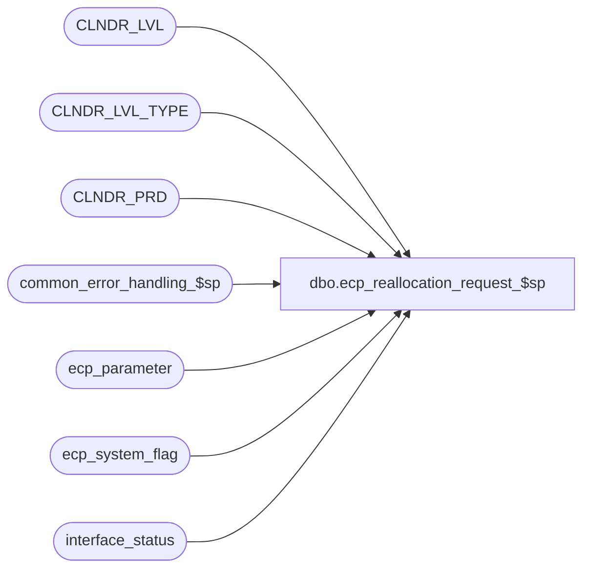

# dbo.ecp_reallocation_request_$sp

**Database:** auditworks_external  
**Server:** bedrockdb01  

## Architecture Diagram



## Table Dependencies

| Referenced Table |
|---|
| CLNDR_LVL |
| CLNDR_LVL_TYPE |
| CLNDR_PRD |
| common_error_handling_$sp |
| ecp_parameter |
| ecp_system_flag |
| interface_status |

## Stored Procedure Code

```sql
create proc [dbo].[ecp_reallocation_request_$sp] @from_reallocation_date datetime, 
@to_reallocation_date datetime,
@allocation_type_list nvarchar(3000) = NULL,
@user_id int = NULL,
@process_id binary(16) = NULL
AS 
--TODO:  audit-trail

/* 
Proc Name: ecp_reallocation_request_$sp 
Desc:   Called by UI to request reperformance of allocations

HISTORY:  
Date     Name           Def#    Desc
Apr14,11 Paul          126153   Use unicode datatypes
Feb14,08 Vicci          97607   Ensure that ecp_posting_$sp knows it when a request is made while the posting
                                was in the middle of running.
Jul05,07 Vicci          85597   Fix to-date to be a period-end-date
Apr02,07 Vicci		85597	Author
*/

SET NOCOUNT ON
DECLARE
  @errmsg                       nvarchar(255),
  @errno                        int,
  @message_id                   int,
  @object_name                  nvarchar(255),
  @operation_name               nvarchar(100),
  @process_name                 nvarchar(100),
  @process_no                   int,
  @rows				int,
  @stream_no                    tinyint,
  @ecp_clndr_id			binary(16),
  @lowest_calendar_level_id	binary(16)

SELECT @message_id = 201068,
       @operation_name = 'Unknown',
       @process_name = 'ecp_reallocation_request_$sp',
       @process_no = 282,
       @stream_no = 1

SELECT @ecp_clndr_id = par_bin_value
  FROM ecp_parameter p
 WHERE par_name = 'ecp_dflt_clndr_id'  
SELECT @errno = @@error
IF @errno <> 0
BEGIN
  SELECT @errmsg = 'Unable to which calendar to use',
         @object_name = 'ecp_parameter',
         @operation_name = 'SELECT'
  GOTO error
END

SELECT @lowest_calendar_level_id = CLNDR_LVL_TYPE_ID
  FROM CLNDR_LVL_TYPE
 WHERE CLNDR_LVL_SEQ = (SELECT MAX(CLNDR_LVL_SEQ)
			  FROM CLNDR_LVL_TYPE
			 WHERE CLNDR_LVL_TYPE_ID
			    IN (SELECT DISTINCT CLNDR_LVL_TYPE_ID
                                  FROM CLNDR_LVL
                                  WHERE CLNDR_ID = @ecp_clndr_id))
   AND CLNDR_LVL_TYPE_ID
    IN (SELECT DISTINCT CLNDR_LVL_TYPE_ID
          FROM CLNDR_LVL
         WHERE CLNDR_ID = @ecp_clndr_id)
SELECT @errno = @@error
IF @errno <> 0
BEGIN
  SELECT @errmsg = 'Unable to determine lowest calendar level',
         @object_name = 'CLNDR_LVL_TYPE',
         @operation_name = 'SELECT'
  GOTO error
END

SELECT @to_reallocation_date = dateadd(ss, -1, min(cp.END_DATE_TIME))
  FROM CLNDR_PRD cp
 WHERE cp.END_DATE_TIME > @to_reallocation_date
   AND @ecp_clndr_id = cp.CLNDR_ID
   AND @lowest_calendar_level_id = cp.CLNDR_LVL_TYPE_ID
SELECT @errno = @@error
IF @errno <> 0
BEGIN
  SELECT @errmsg = 'Unable to determine period-end datetime associate with reallocation to date',
         @object_name = 'CLNDR_PRD',
         @operation_name = 'SELECT'
  GOTO error
END

IF @from_reallocation_date IS NOT NULL AND @to_reallocation_date IS NOT NULL
BEGIN
  UPDATE ecp_system_flag
     SET flag_datetime_value = @to_reallocation_date
   WHERE flag_name = 'ecp_reallocation_to_date'  
     AND flag_datetime_value IS NULL
  SELECT @errno = @@error
  IF @errno <> 0
  BEGIN
    SELECT @errmsg = 'Unable to set reallocation request to date ',
           @object_name = 'ecp_system_flag',
           @operation_name = 'UPDATE'
    GOTO error
  END
  UPDATE ecp_system_flag
     SET flag_datetime_value = @from_reallocation_date
   WHERE flag_name = 'ecp_reallocation_from_date'  
     AND flag_datetime_value IS NULL
  SELECT @errno = @@error
  IF @errno <> 0
  BEGIN
    SELECT @errmsg = 'Unable to set reallocation request from date ',
           @object_name = 'ecp_system_flag',
           @operation_name = 'UPDATE'
    GOTO error
  END
  IF @allocation_type_list IS NOT NULL
  BEGIN
    UPDATE ecp_system_flag
       SET flag_alpha_value = @allocation_type_list
     WHERE flag_name = 'ecp_reallocation_type_list'  
       AND flag_datetime_value IS NULL
    SELECT @errno = @@error
    IF @errno <> 0
    BEGIN
      SELECT @errmsg = 'Unable to set reallocation request allocation type list ',
             @object_name = 'ecp_system_flag',
             @operation_name = 'UPDATE'
      GOTO error
    END
 END
END

UPDATE interface_status
     SET last_posting_datetime = getdate()
   WHERE interface_id = 44
  SELECT @errno = @@error
IF @errno <> 0
BEGIN
  SELECT @errmsg = 'Unable to indicate new information is available for the ECP posting',
         @object_name = 'interface_status',
         @operation_name = 'UPDATE'
  GOTO error
END

UPDATE interface_status
   SET immediate_posting_requested = 1
 WHERE interface_id = 44
   AND immediate_posting_requested = 0
SELECT @errno = @@error
IF @errno <> 0
BEGIN
  SELECT @errmsg = 'Unable to set ECP posting request',
         @object_name = 'interface_status',
         @operation_name = 'UPDATE'
  GOTO error
END

RETURN

error:
  EXEC common_error_handling_$sp @process_no, @errno, @errmsg, 0, @message_id, @process_name, @object_name, @operation_name, 1, @stream_no
  RETURN
```

