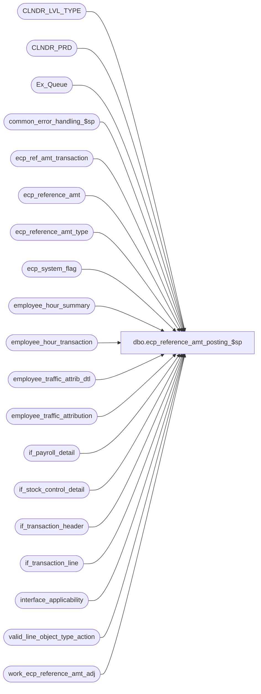

# dbo.ecp_reference_amt_posting_$sp

**Database:** auditworks_external  
**Server:** bedrockdb01  

## Architecture Diagram



## Table Dependencies

| Referenced Table |
|---|
| CLNDR_LVL_TYPE |
| CLNDR_PRD |
| Ex_Queue |
| common_error_handling_$sp |
| ecp_ref_amt_transaction |
| ecp_reference_amt |
| ecp_reference_amt_type |
| ecp_system_flag |
| employee_hour_summary |
| employee_hour_transaction |
| employee_traffic_attrib_dtl |
| employee_traffic_attribution |
| if_payroll_detail |
| if_stock_control_detail |
| if_transaction_header |
| if_transaction_line |
| interface_applicability |
| valid_line_object_type_action |
| work_ecp_reference_amt_adj |

## Stored Procedure Code

```sql
create proc dbo.ecp_reference_amt_posting_$sp   @interface_id 		tinyint = 44, 
  @min_serial_no                numeric(14,0),
  @max_serial_no                numeric(14,0),
  @lowest_calendar_level	int,
  @ecp_clndr_id	        	binary(16),
  @current_rows			int OUTPUT
  
AS
/* 
Proc Name: ecp_reference_amt_posting_$sp 
Desc:   Posts reference amounts to ECP and attributes traffic counts to employees based on occurrence of traffic count
        within shift worked.
        Executed by ecp_posting_$sp

HISTORY:  
Date     Name           Def#    Desc
Apr03,14 Vicci        151098    Log position from reference amount information attachment (63);  ignore information not configured to be relevant to ref amt type.
Mar28,14 Vicci        150958    Correct references to employee_type which should be alpha.
Feb18,14 Vicci        149581    Clean up work_ecp_reference_amt_adj.
Apr17,12 Vicci	      133931	Handle more than 1 line in the same payroll hour transaction referencing the same employee
Oct10,08 Vicci        104484    Add position_code
Sep16,08 Vicci        104484	Author
*/

SET NOCOUNT ON
DECLARE
  @trace_log			tinyint,
  @trace_msg			nvarchar(255),
  @errmsg                       nvarchar(255),
  @errno                        int,
  @function_name	        varbinary(128),
  @message_id                   int,
  @process_name                 nvarchar(100),
  @process_no                   int,
  @object_name                  nvarchar(255),
  @operation_name               nvarchar(100),
  @stream_no                    tinyint,
  @rows				int,
  @traffic_rows			int,
  @cursor_open			tinyint,
  @ref_amt_count		int,
  @preexisting_ref_rows		int,
  @replacement_style_rows 	int,
  @new_ref_rows			int,
  @reference_amount_type	smallint,
  @store_no			int,
  @selling_area_no		int,
  @employee_no			int,
  @fst_posted_effective_from    datetime,
  @lst_posted_effective_from    datetime,
  @fst_effective_from_datetime  datetime,
  @lst_effective_from_datetime  datetime,
  @prior_effective_from_datetime datetime,
  @prior_reference_amount 	money,
  @prior_if_entry_no 		numeric(12,0),
  @prior_line_id 		numeric(5,0),
  @prior_ecp_reference_amt_id 	numeric(12,0),
  @prior_posted_flag 		tinyint,
  @prior_transaction_id 	numeric(14,0),  
  @effective_from_datetime 	datetime,
  @reference_amount	 	money,
  @if_entry_no 			numeric(12,0),
  @line_id 			numeric(5,0),
  @ecp_reference_amt_id 	numeric(12,0),
  @posted_flag 			tinyint,
  @transaction_id 		numeric(14,0),  
  @last_posted_serial_no        numeric(14,0),
  @position_code		nvarchar(4) 

SELECT @cursor_open = 0,
       @errno = 0,
       @message_id = 201068,
       @operation_name = 'Unknown',
       @process_name = 'ecp_reference_amt_posting_$sp',
       @process_no = 282,
       @stream_no = 1,
       @current_rows = 0,
       @replacement_style_rows = 0
           
CREATE TABLE #ecp_ref_amt_transaction(
       reference_amount_type smallint not null, 
       maintenance_type smallint not null,  --0=replacement, 1=contribution
       CLNDR_LVL_TYPE_ID binary(16) null,
       ref_amt_datetime datetime not null,		--pertinent to transaction
       ref_amt_interval_from_datetime datetime null, --pertinent to transaction
       store_no	int not null,
       selling_area_no int not null,
       position_code nvarchar(4) not null,
       employee_no 	int not null,
       reference_amount money not null,
       if_entry_no numeric(12,0) not null,
       line_id numeric(5,0) not null,
       transaction_id numeric(14,0) not null,
       interface_control_flag numeric(14,0) not null,
       last_trans_version_flag tinyint not null,
       final_flag tinyint not null,			--set on most recent if_entry_no/line_id with interface_control_flag in (10, 30) if maintenance_type = 0 i.e. replacement 
       period_end_datetime datetime null,		--from calendar, pertinent to summary;  optional since calendar level may not apply (as in case of master-table style amounts)
       effective_from_datetime datetime not null,	--from calendar, pertinent to summary;  optional since calendar level may not apply (as in case of master-table style amounts)
       ecp_reference_amt_id numeric(12,0) null,
       last_updated_by_transaction_id numeric(14,0) null,
       pre_existing_flag tinyint default 0 not null,
       ecp_reference_amt_batch_id binary(16) null) 
SELECT @errno = @@error
IF @errno <> 0
BEGIN
  SELECT @errmsg = 'Unable to create table to hold list of new reference amounts to be posted',
         @object_name = '#ecp_ref_amt_transaction',
         @operation_name = 'CREATE TABLE'
  GOTO error
END

--traffic from and/or to must be within hour period.
CREATE TABLE #employee_traffic_attribution(
       if_entry_no 		numeric(12,0) not null, 
       line_id 			numeric(5,0) not null,
       reference_amount		money not null,
       employee_no 		int null,
       empl_hour_summary_id 	numeric(12,0) not null)
SELECT @errno = @@error
IF @errno <> 0
BEGIN
  SELECT @errmsg = 'Unable to create table to hold list of traffic counts to be attributed',
         @object_name = '#employee_traffic_attribution',
         @operation_name = 'CREATE TABLE'
  GOTO error
END
CREATE TABLE #employee_traffic_attrib_dtl(
       if_entry_no 		numeric(12,0) not null, 
       line_id 			numeric(5,0) not null,
       reference_amount		money not null,
       employee_no 		int null,
       hour_transaction_id      numeric(14,0) not null, 
       empl_hour_summary_id 	numeric(12,0) not null)
SELECT @errno = @@error
IF @errno <> 0
BEGIN
  SELECT @errmsg = 'Unable to create table to hold list of traffic counts to be attributed',
         @object_name = '#employee_traffic_attribution',
         @operation_name = 'CREATE TABLE'
  GOTO error
END

CREATE TABLE #ecp_ref_amt_trans_resur(
       reference_amount_type smallint not null, 
       maintenance_type smallint not null,  --0=replacement, 1=contribution
       CLNDR_LVL_TYPE_ID binary(16) null,
       store_no	int not null,
       selling_area_no int not null,
       position_code nvarchar(4) not null,
       employee_no 	int not null,
       effective_from_datetime datetime not null,	--from calendar, pertinent to summary;  optional since calendar level may not apply (as in case of master-table style amounts)
       ecp_reference_amt_id numeric(12,0) null,
       if_entry_no numeric(12,0) not null,
       if_entry_no_line_id numeric(17,0) not null)
SELECT @errno = @@error
IF @errno <> 0
BEGIN
  SELECT @errmsg = 'Unable to create table to hold list of previously replaced reference amount transactions to be resurrected',
         @object_name = '#ecp_ref_amt_trans_resur',
         @operation_name = 'CREATE TABLE'
  GOTO error
END

SELECT @last_posted_serial_no = flag_numeric_value
  FROM ecp_system_flag
 WHERE flag_name = 'ecp_last_ref_type_freeze_date'
SELECT @errno = @@error
IF @errno <> 0
BEGIN
  SELECT @errmsg = 'Unable to determine last posted serial number whose posting was not logged to Ex_Execution',
         @object_name = 'ecp_system_flag',
         @operation_name = 'SELECT'
  GOTO error
END

TRUNCATE TABLE #ecp_ref_amt_transaction
SELECT @errno = @@error
IF @errno <> 0
BEGIN
  SELECT @errmsg = 'Unable to clean work table of reference amount and traffic count information',
         @object_name = '#ecp_ref_amt_transaction',
         @operation_name = 'TRUNCATE'
  GOTO error
END

INSERT into #ecp_ref_amt_transaction(
       reference_amount_type,
       maintenance_type,
       CLNDR_LVL_TYPE_ID,
       ref_amt_datetime,  --if calendar_level is null this is the effective date, for traffic counts it is the time of the last reading if by interval or the time of the single reading otherwise, for other calendar based amounts it is any date within the period
       ref_amt_interval_from_datetime, --for traffic counts it is the start datetime of the time-interval to which the count applies, otherwise it is null
       store_no,
       selling_area_no,
       position_code, 
       employee_no,
       reference_amount,
       if_entry_no,
       line_id,
       transaction_id,
       interface_control_flag,
       last_trans_version_flag, 
       final_flag,
       period_end_datetime,
       effective_from_datetime,
       ecp_reference_amt_id,
       last_updated_by_transaction_id,
       ecp_reference_amt_batch_id)
SELECT rat.reference_amount_type,
       rat.maintenance_type,
       rat.CLNDR_LVL_TYPE_ID,
       CASE WHEN l.line_action = 244  --traffic count
            THEN COALESCE(trf.count_date, trfh.count_date, ed.count_date, edh.count_date, h.entry_date_time)  --assume individual readings if no attachment provided
            ELSE CASE WHEN rat.reference_amount_type = 1
                      THEN COALESCE(ref.count_date, refh.count_date, ed.count_date, edh.count_date, h.entry_date_time)
                      ELSE COALESCE(ref.count_date, refh.count_date, ed.count_date, edh.count_date, h.transaction_date)
                 END
       END ref_amt_datetime,
       CASE WHEN l.line_action = 244
            THEN dateadd(ss, 
                         CASE WHEN COALESCE(trf.units, trfh.units) > 0 THEN 1 ELSE 0 END, 
                         dateadd(mi, 
                                 IsNull(COALESCE(trf.units, trfh.units),0) * -1, 
                                 COALESCE(trf.count_date, trfh.count_date, ed.count_date, edh.count_date, h.entry_date_time)))  
            ELSE NULL 
       END ref_amt_interval_from_datetime,
       CASE WHEN rat.store_no_flag = 1
            THEN IsNull(CASE WHEN l.line_action = 244
                             THEN COALESCE(trf.other_store_no, trfh.other_store_no, h.store_no)
                             ELSE COALESCE(ref.other_store_no, refh.other_store_no)  --no header store default since ref amt might be for chain
                        END, -1)
            ELSE -1
       END store_no,
       CASE WHEN rat.selling_area_flag = 1
            THEN IsNull(CASE WHEN l.line_action = 244
                             THEN COALESCE(trf.pos_deptclass, trfh.pos_deptclass)
                             ELSE COALESCE(ref.pos_deptclass, refh.pos_deptclass)
                        END, -1)
            ELSE -1 
       END selling_area_no,
       CASE WHEN l.line_action <> 244 AND rat.position_flag = 1
                 THEN CASE WHEN IsNull(p.employee_type, '0') <> '0' AND p.employee_type <> ''  
                           THEN p.employee_type
                           ELSE COALESCE(SUBSTRING(COALESCE(ref.reason, refh.reason), 1, 4), '-1')
                      END
            ELSE '-1'
       END position_code,              
       CASE WHEN rat.employee_no_flag = 1 AND IsNull(p.employee_no, 0) <> 0 AND l.line_action <> 244 
            THEN p.employee_no
            ELSE -1
       END employee_no,
       CASE WHEN ((l.gross_line_amount - l.pos_discount_amount) * l.voiding_reversal_flag) <> 0 OR l.reference_type <> 222 OR IsNumeric(l.reference_no) = 0 
            THEN (l.gross_line_amount - l.pos_discount_amount) * l.voiding_reversal_flag  
            ELSE convert(money, reference_no) * CASE WHEN q.key_2 = 20 THEN -1 ELSE 1 END   --sensitive amounts are logged to reference_no instead of gross_line_amount
       END reference_amount,
       h.if_entry_no,
       l.line_id,
       h.transaction_id,
       q.key_2 interface_control_flag,  --10, 20, 30    
       0 last_trans_version_flag,
       0 final_flag,
       dateadd(ss, -1, c.END_DATE_TIME) period_end_datetime,
       COALESCE(c.STRT_DATE_TIME,        
                CASE WHEN l.line_action = 244  --traffic count
                     THEN COALESCE(trf.count_date, trfh.count_date, ed.count_date, edh.count_date, h.entry_date_time)  
                     ELSE CASE WHEN rat.reference_amount_type = 1
            THEN COALESCE(ref.count_date, refh.count_date, ed.count_date, edh.count_date, h.entry_date_time)
                               ELSE COALESCE(ref.count_date, refh.count_date, ed.count_date, edh.count_date, h.transaction_date)
                          END
                END) effective_from_datetime,
       null ecp_reference_amt_id,
       null last_updated_by_transaction_id,
       convert(binary(16), COALESCE(ref.imrd, trf.imrd, refh.imrd, trfh.imrd)) ecp_reference_amt_batch_id
  FROM Ex_Queue q
       INNER JOIN if_transaction_header h
          ON q.key_1 = h.if_entry_no
         AND h.transaction_void_flag in (0,8)
       INNER JOIN if_transaction_line l
          ON h.if_entry_no = l.if_entry_no
         AND l.line_void_flag = 0
         AND l.line_object_type = 14
         AND EXISTS (SELECT 1 
                       FROM if_stock_control_detail ref 
                      WHERE ref.if_entry_no = l.if_entry_no 
                        AND (ref.line_id = l.line_id OR ref.line_id = 0) 
                        AND ref.display_def_id in (63, 64) )--ECP reference amount or traffic
       INNER JOIN interface_applicability i
          ON i.interface_id = @interface_id
         AND l.line_object = i.line_object
         AND l.line_action = i.line_action
         AND h.transaction_category = i.transaction_category
       INNER JOIN valid_line_object_type_action v
          ON l.line_object_type = v.line_object_type
         AND l.line_action = v.line_action
        LEFT OUTER JOIN if_stock_control_detail ref  --(left outer in order to support possibility of header level)
          ON l.if_entry_no = ref.if_entry_no
         AND l.line_id = ref.line_id
         AND ref.display_def_id = 63  
        LEFT OUTER JOIN if_stock_control_detail refh  --(left outer in order to support possibility of detail level)
          ON l.if_entry_no = ref.if_entry_no
         AND ref.line_id = 0
         AND ref.display_def_id = 63
        LEFT OUTER JOIN if_stock_control_detail trf  --(left outer in order to support possibility of header level)
          ON l.if_entry_no = trf.if_entry_no
         AND l.line_id = trf.line_id
         AND trf.display_def_id = 64
        LEFT OUTER JOIN if_stock_control_detail trfh  --(left outer in order to support possibility of detail level)
          ON l.if_entry_no = trf.if_entry_no
         AND trf.line_id = 0
         AND trf.display_def_id = 64
       INNER JOIN ecp_reference_amt_type rat
          ON CASE WHEN l.line_action = 244
                  THEN 1 
                  ELSE COALESCE(ref.location_no, refh.location_no) 
             END = rat.reference_amount_type
        LEFT OUTER JOIN if_stock_control_detail ed
          ON l.if_entry_no = ed.if_entry_no
         AND l.line_id = ed.line_id
         AND ed.display_def_id = 61
        LEFT OUTER JOIN if_stock_control_detail edh
          ON l.if_entry_no = edh.if_entry_no
         AND edh.line_id = 0
         AND edh.display_def_id = 61
        LEFT OUTER JOIN if_payroll_detail p
          ON l.if_entry_no = p.if_entry_no
         AND l.line_id = p.line_id
         AND (IsNull(p.employee_no, 0) <> 0
              OR IsNull(p.employee_type, '0') <> '0')
        LEFT OUTER JOIN CLNDR_PRD c
          ON rat.CLNDR_LVL_TYPE_ID IS NOT NULL
         AND CASE WHEN l.line_action = 244  --traffic count
                  THEN COALESCE(trf.count_date, trfh.count_date, ed.count_date, edh.count_date, h.entry_date_time)  --assume individual readings if no attachment provided
                  ELSE CASE WHEN rat.reference_amount_type = 1
                            THEN COALESCE(ref.count_date, refh.count_date, ed.count_date, edh.count_date, h.entry_date_time)
                            ELSE COALESCE(ref.count_date, refh.count_date, ed.count_date, edh.count_date, h.transaction_date)
                       END
             END >= c.STRT_DATE_TIME
         AND CASE WHEN l.line_action = 244  --traffic count
                  THEN COALESCE(trf.count_date, trfh.count_date, ed.count_date, edh.count_date, h.entry_date_time)  --assume individual readings if no attachment provided
                  ELSE CASE WHEN rat.reference_amount_type = 1
                            THEN COALESCE(ref.count_date, refh.count_date, ed.count_date, edh.count_date, h.entry_date_time)
                            ELSE COALESCE(ref.count_date, refh.count_date, ed.count_date, edh.count_date, h.transaction_date)
                       END

             END < c.END_DATE_TIME
         AND c.CLNDR_ID = @ecp_clndr_id
         AND c.CLNDR_LVL_TYPE_ID = rat.CLNDR_LVL_TYPE_ID
 WHERE q.queue_id = @interface_id
   AND q.serial_no >= @min_serial_no
   AND q.serial_no <= @max_serial_no
   AND (q.serial_no > @last_posted_serial_no OR @last_posted_serial_no IS NULL)
SELECT @errno = @@error, @current_rows = @current_rows + @@rowcount, @ref_amt_count = @@rowcount
IF @errno <> 0
BEGIN
  SELECT @errmsg = 'Unable to insert work table of reference amount and traffic count information',
         @object_name = '#ecp_ref_amt_transaction',
         @operation_name = 'INSERT'
  GOTO error
END

IF @ref_amt_count > 0
BEGIN 
  SELECT @trace_msg = NCHAR(13) + NCHAR(10) + ':LOG && ECP reference-amount processing begins: ' + CONVERT(nchar, getdate(), 8)
  PRINT @trace_msg
    
  UPDATE #ecp_ref_amt_transaction
     SET last_trans_version_flag = 1
    FROM (SELECT c.transaction_id,
        	 MAX(c.if_entry_no) if_entry_no
   	    FROM #ecp_ref_amt_transaction c
  	   GROUP BY c.transaction_id) q
   WHERE #ecp_ref_amt_transaction.transaction_id = q.transaction_id
     AND #ecp_ref_amt_transaction.if_entry_no = q.if_entry_no
  SELECT @errno = @@error
  IF @errno <> 0
  BEGIN
    SELECT @errmsg = 'Failed to mark current version of each transaction being imported',
           @object_name = '#ecp_ref_amt_transaction',
           @operation_name = 'UPDATE'
    GOTO error
  END

  UPDATE #ecp_ref_amt_transaction
     SET final_flag = 1
    FROM #ecp_ref_amt_transaction i
         INNER JOIN (SELECT f.reference_amount_type,
        	            f.effective_from_datetime,
        	            f.store_no,
        	            f.selling_area_no,
        	            f.position_code,
        	            f.employee_no,
        	            MAX(f.if_entry_no * 100000 + f.line_id) final_key,
        	            MAX(CASE WHEN f.interface_control_flag = 20 
        	                     THEN 0 
        	                     ELSE f.if_entry_no * 100000 + f.line_id
        	                END) final_non_rev_key
   	               FROM #ecp_ref_amt_transaction f
  		      WHERE f.maintenance_type = 0  --replacement style
  		        AND f.last_trans_version_flag = 1
  		      GROUP BY f.reference_amount_type,
        	            f.effective_from_datetime,
        	            f.store_no,
        	            f.selling_area_no,
        	            f.position_code, 
         	            f.employee_no) q
            ON i.reference_amount_type = q.reference_amount_type
           AND i.effective_from_datetime = q.effective_from_datetime
           AND i.store_no = q.store_no
           AND i.selling_area_no = q.selling_area_no
           AND i.position_code = q.position_code
           AND i.employee_no = q.employee_no
           AND (i.if_entry_no * 100000 + i.line_id) = CASE WHEN q.final_non_rev_key = 0 THEN q.final_key ELSE q.final_non_rev_key END
   WHERE i.maintenance_type = 0  --replacement values
     AND i.last_trans_version_flag = 1
  SELECT @errno = @@error, @replacement_style_rows = @@rowcount
  IF @errno <> 0
  BEGIN
    SELECT @errmsg = 'Failed to determine final version of replacement-style updates',
           @object_name = '#ecp_ref_amt_transaction',
           @operation_name = 'UPDATE'
    GOTO error
  END

  UPDATE #ecp_ref_amt_transaction
     SET ecp_reference_amt_id = ref.ecp_reference_amt_id,
         last_updated_by_transaction_id = ref.last_updated_by_transaction_id
    FROM #ecp_ref_amt_transaction w
         INNER JOIN ecp_reference_amt ref
            ON w.reference_amount_type = ref.reference_amount_type
           AND w.effective_from_datetime = ref.effective_from_datetime
           AND w.store_no = ref.store_no
           AND w.employee_no = ref.employee_no
           AND w.selling_area_no = ref.selling_area_no
           AND w.position_code = ref.position_code
           AND (ref.auto_adj_id IS NULL OR w.maintenance_type = 0)
  SELECT @errno = @@error, @preexisting_ref_rows = @@rowcount
  IF @errno <> 0
  BEGIN
    SELECT @errmsg = 'Failed to set link to corresponding summary line in #ecp_ref_amt_transaction',
           @object_name = '#ecp_ref_amt_transaction',
           @operation_name = 'UPDATE'
    GOTO error
  END

  IF @replacement_style_rows > 0
  BEGIN 
    SELECT @trace_msg = NCHAR(13) + NCHAR(10) + ':LOG && ECP replacement-style reference-amount type processing begins: ' + CONVERT(nchar, getdate(), 8)
    PRINT @trace_msg

    --When final version of a replacement-style maintenance item is a reversal, check if any previously overridden transactions for the effective date now apply and if so resurrect them.
    INSERT into #ecp_ref_amt_trans_resur(
           reference_amount_type,
           maintenance_type,
           CLNDR_LVL_TYPE_ID,
           store_no,
           selling_area_no,
           position_code, 
           employee_no,
           effective_from_datetime,
           ecp_reference_amt_id,
           if_entry_no,
           if_entry_no_line_id)
    SELECT d.reference_amount_type,
           d.maintenance_type,
           d.CLNDR_LVL_TYPE_ID,
           d.store_no,
           d.selling_area_no,
           d.position_code, 
           d.employee_no,
           d.effective_from_datetime,
           d.ecp_reference_amt_id,
           MAX(t.if_entry_no) if_entry_no,
           MAX(t.if_entry_no * 100000 + t.line_id) if_entry_no_line_id
      FROM #ecp_ref_amt_transaction d
           INNER JOIN ecp_ref_amt_transaction t
              ON t.reference_amount_type = d.reference_amount_type
             AND t.effective_from_datetime = d.effective_from_datetime
             AND t.store_no = d.store_no
             AND t.selling_area_no = d.selling_area_no
             AND t.position_code = d.position_code 
             AND t.employee_no = d.employee_no
             AND t.current_flag = 1 
             AND t.transaction_id NOT IN (SELECT r.transaction_id
                                            FROM #ecp_ref_amt_transaction r
                                           WHERE r.interface_control_flag = 20
                                             AND r.last_trans_version_flag = 1)  --i.e. not about to be reversed
     WHERE d.maintenance_type = 0  --replacements
       AND d.final_flag = 1
       AND d.interface_control_flag = 20
       AND d.transaction_id = d.last_updated_by_transaction_id
     GROUP BY d.reference_amount_type,
           d.maintenance_type,
           d.CLNDR_LVL_TYPE_ID,
           d.store_no,
           d.selling_area_no,
           d.position_code, 
           d.employee_no,
           d.effective_from_datetime,
           d.ecp_reference_amt_id
    SELECT @errno = @@error
    IF @errno <> 0
    BEGIN
      SELECT @errmsg = 'Failed to determine if any previously overridden transactions now require resurrection',
             @object_name = '#ecp_ref_amt_trans_resur',
             @operation_name = 'INSERT'
      GOTO error
    END
--select 'Test #ecp_ref_amt_trans_resur', * from #ecp_ref_amt_trans_resur
    INSERT INTO #ecp_ref_amt_transaction(
           reference_amount_type,
           maintenance_type,
           CLNDR_LVL_TYPE_ID,
           ref_amt_datetime,
           ref_amt_interval_from_datetime,
           store_no,
           selling_area_no,
         position_code, 
           employee_no,
           reference_amount,
           if_entry_no,
           line_id,
           transaction_id,
           interface_control_flag,
           last_trans_version_flag,
           final_flag,
           period_end_datetime,
           effective_from_datetime,
           ecp_reference_amt_id,
           pre_existing_flag)
    SELECT q.reference_amount_type,
           q.maintenance_type,
           q.CLNDR_LVL_TYPE_ID,
           p.ref_amt_datetime,
           p.ref_amt_interval_from_datetime,
           q.store_no,
           q.selling_area_no,
           q.position_code, 
           q.employee_no,
           p.reference_amount,
           p.if_entry_no,
           p.line_id,
           p.transaction_id,
           10,
           1,
           1,
           NULL period_end_datetime,
           q.effective_from_datetime,
           q.ecp_reference_amt_id,
           1
      FROM #ecp_ref_amt_trans_resur q
           INNER JOIN ecp_ref_amt_transaction p
              ON p.if_entry_no = q.if_entry_no
             AND p.if_entry_no * 100000 + p.line_id = q.if_entry_no_line_id
             AND p.reference_amount_type = q.reference_amount_type 
    SELECT @errno = @@error
    IF @errno <> 0
    BEGIN
      SELECT @errmsg = 'Failed to resurrect previously overridden transactions',
             @object_name = '#ecp_ref_amt_transaction',
             @operation_name = 'INSERT'
      GOTO error
    END

    UPDATE #ecp_ref_amt_transaction
       SET final_flag = 0
      FROM #ecp_ref_amt_trans_resur r
     WHERE #ecp_ref_amt_transaction.reference_amount_type = r.reference_amount_type
       AND #ecp_ref_amt_transaction.effective_from_datetime = r.effective_from_datetime
       AND #ecp_ref_amt_transaction.store_no = r.store_no
       AND #ecp_ref_amt_transaction.selling_area_no = r.selling_area_no
       AND #ecp_ref_amt_transaction.position_code = r.position_code
       AND #ecp_ref_amt_transaction.employee_no = r.employee_no
       AND #ecp_ref_amt_transaction.maintenance_type = 0
       AND #ecp_ref_amt_transaction.final_flag = 1
       AND #ecp_ref_amt_transaction.interface_control_flag = 20
       AND #ecp_ref_amt_transaction.transaction_id = #ecp_ref_amt_transaction.last_updated_by_transaction_id
    SELECT @errno = @@error
    IF @errno <> 0
    BEGIN
      SELECT @errmsg = 'Failed to mark transaction deletions resulting in the resurrection of a prior transaction as no longer final.',
             @object_name = '#ecp_ref_amt_transaction',
             @operation_name = 'UPDATE'
      GOTO error
    END
    
--select 'Test #ecp_ref_amt_transaction content', * from #ecp_ref_amt_transaction

    DECLARE ref_amt_type_cursor CURSOR
        FOR
     SELECT i.reference_amount_type,
            i.store_no,
            i.selling_area_no,
            i.position_code, 
            i.employee_no,
            min(i.effective_from_datetime) fst_effective_from_datetime,
            max(i.effective_from_datetime) lst_effective_from_datetime
       FROM #ecp_ref_amt_transaction i
      WHERE i.maintenance_type = 0  --replacement style
        AND i.final_flag = 1
        AND i.CLNDR_LVL_TYPE_ID IS NULL --requires setting of period_end_datetime
        AND ((i.ecp_reference_amt_id IS NULL AND i.interface_control_flag <> 20) --i.e. new entry needed
             OR (i.interface_control_flag = 20 AND i.transaction_id = i.last_updated_by_transaction_id))
      GROUP BY i.reference_amount_type,
            i.store_no,
            i.selling_area_no,
            i.position_code, 
            i.employee_no
      ORDER BY i.reference_amount_type,
            i.store_no,
            i.selling_area_no,
            i.position_code, 
            i.employee_no

    OPEN ref_amt_type_cursor
    SELECT @cursor_open = 1

    FETCH ref_amt_type_cursor
     INTO @reference_amount_type,
          @store_no,
    @selling_area_no,
          @position_code, 
          @employee_no,
          @fst_effective_from_datetime,
          @lst_effective_from_datetime
       
    WHILE @@fetch_status = 0  
    BEGIN    
      SELECT @prior_effective_from_datetime = null,
             @prior_reference_amount = null,
             @prior_if_entry_no = null,
             @prior_line_id = null,
             @prior_ecp_reference_amt_id = null,
             @prior_posted_flag = null,
             @prior_transaction_id = null     
           
      --Note:  no need for a begin-trans per-se for replacement style updates since there is no harm in running them again,
      --       but need to ensure that effective dates aren't changing while updates are in progress.
      BEGIN TRAN
    
      UPDATE ecp_system_flag
         SET flag_datetime_value = getdate()
       WHERE flag_name = 'ecp_last_ref_type_freeze_date'
      SELECT @errno = @@error, @rows = @@rowcount
      IF @errno <> 0
      BEGIN
        SELECT @errmsg = 'Unable to freeze ecp_reference_amt table updates by locking system flag',
               @object_name = 'ecp_system_flag',
               @operation_name = 'UPDATE'
        GOTO error
      END
      IF @rows < 1
      BEGIN
        INSERT into ecp_system_flag(
               flag_name,
               flag_datetime_value,
               flag_comment)
        VALUES ('ecp_last_ref_type_freeze_date',
               getdate(),
               'flag_datetime_value set by system in begin-trans to lock ecp_reference_amt table prior to determining effective dates; flag_numeric_value set to last serial_no posted')
      END       

      SELECT @fst_posted_effective_from = MAX(r.effective_from_datetime)
        FROM ecp_reference_amt r
       WHERE r.reference_amount_type = @reference_amount_type
         AND r.store_no = @store_no
         AND r.selling_area_no = @selling_area_no
         AND r.position_code = @position_code 
         AND r.employee_no = @employee_no
         AND r.effective_from_datetime < @fst_effective_from_datetime
      SELECT @errno = @@error
      IF @errno <> 0
      BEGIN
        SELECT @errmsg = 'Failed to determine if previously posted date earlier than the effective date for reference amount exists',
               @object_name = 'ecp_reference_amt',
               @operation_name = 'SELECT'
        GOTO error
      END

      SELECT @lst_posted_effective_from = MIN(r.effective_from_datetime)
        FROM ecp_reference_amt r
       WHERE r.reference_amount_type = @reference_amount_type
         AND r.store_no = @store_no
         AND r.selling_area_no = @selling_area_no
         AND r.position_code = @position_code 
         AND r.employee_no = @employee_no
         AND r.effective_from_datetime > @lst_effective_from_datetime
      SELECT @errno = @@error
      IF @errno <> 0
      BEGIN
        SELECT @errmsg = 'Failed to determine if previously posted date laster than the last effective date for reference amount exists',
               @object_name = 'ecp_reference_amt',
               @operation_name = 'SELECT'
        GOTO error
      END

      DECLARE ref_amt_cursor CURSOR
          FOR
       SELECT 0 posted_flag,
              i.effective_from_datetime from_date,
              i.reference_amount,
              i.if_entry_no,
              i.line_id,
              i.ecp_reference_amt_id,  --only set if 20
              i.transaction_id
         FROM #ecp_ref_amt_transaction i
        WHERE i.reference_amount_type = @reference_amount_type
          AND i.store_no = @store_no
          AND i.selling_area_no = @selling_area_no
          AND i.position_code = @position_code 
          AND i.employee_no = @employee_no
          AND i.final_flag = 1
          AND ((i.ecp_reference_amt_id IS NULL AND i.interface_control_flag <> 20) --i.e. new entry needed
                OR (i.interface_control_flag = 20 AND i.transaction_id = i.last_updated_by_transaction_id))
        UNION
       SELECT 1 posted_flag,
              i.effective_from_datetime from_date,
              i.reference_amount,
              null if_entry_no,
              null line_id,
              i.ecp_reference_amt_id,
              i.last_updated_by_transaction_id transaction_id
         FROM ecp_reference_amt i
        WHERE i.reference_amount_type = @reference_amount_type
          AND i.store_no = @store_no
          AND i.selling_area_no = @selling_area_no
          AND i.position_code = @position_code 
          AND i.employee_no = @employee_no
          AND i.effective_from_datetime >= IsNull(@fst_posted_effective_from, @fst_effective_from_datetime)
          AND i.effective_from_datetime <= IsNull(@lst_posted_effective_from, @lst_effective_from_datetime)
          AND i.ecp_reference_amt_id NOT IN (SELECT w.ecp_reference_amt_id 
                                               FROM #ecp_ref_amt_transaction w
                                              WHERE w.reference_amount_type = @reference_amount_type
                                                AND w.store_no = @store_no
                                                AND w.selling_area_no = @selling_area_no
                                                AND w.position_code = @position_code 
 	  			                AND w.employee_no = @employee_no
 	  			                AND w.final_flag = 1
                               	                AND w.interface_control_flag = 20 
                               	                AND w.transaction_id = w.last_updated_by_transaction_id)
       ORDER BY from_date 
      SELECT @errno = @@error
      IF @errno <> 0
      BEGIN
        SELECT @errmsg = 'Failed to get list of previously posted reference amounts in range',
               @object_name = 'ref_amt_cursor',
               @operation_name = 'DECLARE'
        GOTO error
      END
   
      OPEN ref_amt_cursor
      SELECT @cursor_open = 2
    
      FETCH ref_amt_cursor
       INTO @posted_flag,
            @effective_from_datetime,
            @reference_amount,
            @if_entry_no,
            @line_id,
            @ecp_reference_amt_id,
            @transaction_id

      WHILE @@fetch_status = 0 
      BEGIN
--select 'Test 2nd fetch', @reference_amount_type, @store_no, @selling_area_no, @employee_no, @effective_from_datetime, @posted_flag, @effective_from_datetime, @reference_amount, @if_entry_no, @line_id, @ecp_reference_amt_id, @transaction_id
                  
        IF @ecp_reference_amt_id IS NOT NULL AND @posted_flag = 0 --(i.e. this is a reversal)
        BEGIN
          DELETE ecp_reference_amt 
           WHERE reference_amount_type = @reference_amount_type
             AND store_no = @store_no
             AND selling_area_no = @selling_area_no
             AND position_code = @position_code 
             AND employee_no = @employee_no
             AND effective_from_datetime = @effective_from_datetime
          SELECT @errno = @@error
          IF @errno <> 0
          BEGIN
            SELECT @errmsg = 'Failed to remove reversed entry',
            @object_name = 'ecp_reference_amt',
                   @operation_name = 'DELETE'
            GOTO error
          END
        END --IF @ecp_reference_amt_id IS NOT NULL AND @posted_flag = 0 i.e. reversal

        SELECT @prior_effective_from_datetime = @effective_from_datetime,
               @prior_reference_amount = @reference_amount,
               @prior_if_entry_no = @if_entry_no,
               @prior_line_id = @line_id,
               @prior_ecp_reference_amt_id = @ecp_reference_amt_id,
               @prior_posted_flag = @posted_flag,
               @prior_transaction_id = @transaction_id       
	
        SELECT @posted_flag = NULL,             
               @effective_from_datetime = NULL,      
               @reference_amount = NULL,       
               @if_entry_no = NULL,        
               @line_id = NULL,        
               @ecp_reference_amt_id = NULL,      
               @transaction_id = NULL   

        FETCH ref_amt_cursor
         INTO @posted_flag,
              @effective_from_datetime,
              @reference_amount,
              @if_entry_no,
              @line_id,
              @ecp_reference_amt_id,
              @transaction_id 

        IF @prior_posted_flag = 1
        BEGIN
          UPDATE ecp_reference_amt 
             SET period_end_datetime = dateadd(ss, -1, @effective_from_datetime)
           WHERE reference_amount_type = @reference_amount_type
             AND store_no = @store_no
             AND selling_area_no = @selling_area_no
 AND position_code = @position_code 
             AND employee_no = @employee_no
             AND effective_from_datetime = @prior_effective_from_datetime
          SELECT @errno = @@error
          IF @errno <> 0
          BEGIN
        SELECT @errmsg = 'Failed to adjust period end datetime',
                   @object_name = 'ecp_reference_amt',
                   @operation_name = 'UPDATE'
            GOTO error
          END
        END  --IF @prior_posted_flag = 1
        ELSE
        BEGIN
          IF @prior_ecp_reference_amt_id IS NULL  --i.e. it was not a reversal
          BEGIN 
            INSERT into ecp_reference_amt(
                   reference_amount_type,
                   effective_from_datetime,
                   period_end_datetime,
                   reference_amount,
                   store_no,
                   employee_no,
                   selling_area_no,
                   position_code, 
                   last_updated_by_transaction_id)
            VALUES(@reference_amount_type,
                   @prior_effective_from_datetime,
                   dateadd(ss, -1, @effective_from_datetime),
                   @prior_reference_amount,
                   @store_no,
                   @employee_no,
                   @selling_area_no,
                   @position_code, 
                   @prior_transaction_id)
            SELECT @errno = @@error, @prior_ecp_reference_amt_id = @@identity
            IF @errno <> 0
            BEGIN
              SELECT @errmsg = 'Failed to add newly effective reference-amount maintenance entries',
                     @object_name = 'ecp_reference_amt',
                     @operation_name = 'INSERT'
              GOTO error
            END
          
            UPDATE #ecp_ref_amt_transaction
               SET ecp_reference_amt_id = @prior_ecp_reference_amt_id
             WHERE reference_amount_type = @reference_amount_type
               AND store_no = @store_no
               AND selling_area_no = @selling_area_no
               AND position_code = @position_code 
               AND employee_no = @employee_no
               AND effective_from_datetime = @prior_effective_from_datetime
            SELECT @errno = @@error
            IF @errno <> 0
            BEGIN
              SELECT @errmsg = 'Failed to set ID of newly effective reference-amount maintenance entries',
                     @object_name = '#ecp_ref_amt_transaction',
                     @operation_name = 'UPDATE'
              GOTO error
            END        
            
            UPDATE ecp_reference_amt_type
               SET ref_amt_type_referenced_flag = 1
             WHERE ref_amt_type_referenced_flag = 0
               AND reference_amount_type = @reference_amount_type
            SELECT @errno = @@error
            IF @errno <> 0
            BEGIN
              SELECT @errmsg = 'Unable to mark reference amount type as having been referenced',
                     @object_name = 'ecp_reference_amt_type',
                     @operation_name = 'UPDATE'
              GOTO error
            END
          END --IF @prior_ecp_reference_amt_id IS NULL      
        END  -- ELSE of IF @prior_posted_flag = 1
      END -- while not end of ref_amt_cursor cursor
      CLOSE ref_amt_cursor
      DEALLOCATE ref_amt_cursor 
      SELECT @cursor_open = 1
    
      COMMIT		--OK to commit since re-running won't do any harm.
    
      FETCH ref_amt_type_cursor
       INTO @reference_amount_type,
            @store_no,
            @selling_area_no,
            @position_code, 
            @employee_no,
            @fst_effective_from_datetime,
            @lst_effective_from_datetime
    END -- while not end of ref_amt_type_cursor cursor

    CLOSE ref_amt_type_cursor
    DEALLOCATE ref_amt_type_cursor 
    SELECT @cursor_open = 0
  END --IF @replacement_rows > 0

  SELECT @trace_msg = NCHAR(13) + NCHAR(10) + ':LOG && ECP traffic count attribution: ' + CONVERT(nchar, getdate(), 8)

  INSERT into #employee_traffic_attrib_dtl(if_entry_no, line_id, reference_amount, employee_no, hour_transaction_id, empl_hour_summary_id)
  SELECT w.if_entry_no,
         w.line_id,
         w.reference_amount, 
         ht.employee_no,
         ht.transaction_id, 
         ht.empl_hour_summary_id
    FROM #ecp_ref_amt_transaction w, 
         employee_hour_summary hs, 
         employee_hour_transaction ht
   WHERE w.reference_amount_type = 1
     AND w.ref_amt_interval_from_datetime IS NOT NULL  --i.e. only attribute traffic coming from line_action 244
     AND hs.calendar_level = @lowest_calendar_level  --assumes traffic tracked at lowest level
     AND w.period_end_datetime = hs.period_end_datetime
     AND (w.store_no = hs.store_no OR w.store_no = -1)
     AND (w.selling_area_no = hs.payroll_entry_selling_area_no OR w.selling_area_no = -1)
     AND (w.position_code = hs.payroll_entry_position OR position_code = '-1') 
     AND (w.employee_no = hs.employee_no OR w.employee_no = -1)
     AND hs.productive_selling_hours > 0
     AND hs.empl_hour_summary_id = ht.empl_hour_summary_id
     AND ht.current_flag = 1
     AND ((w.ref_amt_interval_from_datetime >= ht.shift_start_datetime AND w.ref_amt_interval_from_datetime <= ht.shift_end_datetime)
          OR 
          (w.ref_amt_datetime >= ht.shift_start_datetime AND w.ref_amt_datetime <= ht.shift_end_datetime)
          OR 
          (w.ref_amt_interval_from_datetime < ht.shift_start_datetime AND w.ref_amt_datetime > ht.shift_end_datetime))
  SELECT @errno = @@error, @traffic_rows = @@rowcount
  IF @errno <> 0
  BEGIN
    SELECT @errmsg = 'Unable to build list of new traffic count attribution transactions',
           @object_name = '#employee_traffic_attrib_dtl',
           @operation_name = 'INSERT'
    GOTO error
  END

--SELECT 'Test #employee_traffic_attrib_dtl', * FROM #employee_traffic_attrib_dtl

  IF @traffic_rows > 0
  BEGIN  

    PRINT @trace_msg

    INSERT into #employee_traffic_attribution(if_entry_no, line_id, reference_amount, employee_no, empl_hour_summary_id)
    SELECT w.if_entry_no,
           w.line_id,
           w.reference_amount, 
           w.employee_no,
           max(w.empl_hour_summary_id)
      FROM #employee_traffic_attrib_dtl w
     GROUP BY w.if_entry_no,
           w.line_id,
           w.reference_amount,
           w.employee_no     
    SELECT @errno = @@error
    IF @errno <> 0
    BEGIN
      SELECT @errmsg = 'Unable to build list of new traffic count attributions',
             @object_name = '#employee_traffic_attribution',
             @operation_name = 'INSERT'
      GOTO error
    END
  END
  
  BEGIN TRAN

  IF @traffic_rows > 0
  BEGIN  
    UPDATE employee_hour_summary
       SET attributed_traffic_count = IsNull(employee_hour_summary.attributed_traffic_count, 0) + new.attributed_traffic_count
      FROM (SELECT ehs.empl_hour_summary_id, SUM(IsNull(w.reference_amount, 0)) attributed_traffic_count
              FROM #employee_traffic_attribution w
                   INNER JOIN employee_hour_summary x
                      ON w.empl_hour_summary_id = x.empl_hour_summary_id
                   INNER JOIN CLNDR_PRD c
                      ON x.period_end_datetime >= c.STRT_DATE_TIME
                     AND x.period_end_datetime < c.END_DATE_TIME
                     AND c.CLNDR_ID = @ecp_clndr_id
                   INNER JOIN CLNDR_PRD cp
                      ON x.pay_period_end_datetime >= cp.STRT_DATE_TIME
                     AND x.pay_period_end_datetime < cp.END_DATE_TIME
                     AND cp.CLNDR_ID = @ecp_clndr_id
                   INNER JOIN CLNDR_LVL_TYPE clt
                      ON c.CLNDR_LVL_TYPE_ID = clt.CLNDR_LVL_TYPE_ID        
                     AND cp.CLNDR_LVL_TYPE_ID = clt.CLNDR_LVL_TYPE_ID
                  INNER JOIN employee_hour_summary ehs
                      ON clt.CLNDR_LVL_TYPE_IDNTY = ehs.calendar_level
	             AND dateadd(ss, -1, c.END_DATE_TIME) = ehs.period_end_datetime
	             AND dateadd(ss, -1, cp.END_DATE_TIME) = ehs.pay_period_end_datetime 
	             AND x.employee_no = ehs.employee_no
	             AND x.store_no = ehs.store_no
	             AND IsNull(x.home_store_no, -1) = IsNull(ehs.home_store_no, -1)
	             AND x.primary_position = ehs.primary_position
	             AND x.primary_selling_area_no = ehs.primary_selling_area_no
	             AND IsNull(x.relationship_set_id, -1) = IsNull(ehs.relationship_set_id, -1)
	             AND x.payroll_entry_hour_type = ehs.payroll_entry_hour_type
	             AND x.payroll_entry_position = ehs.payroll_entry_position
	             AND x.payroll_entry_selling_area_no = ehs.payroll_entry_selling_area_no
             GROUP BY ehs.empl_hour_summary_id
             HAVING SUM(IsNull(w.reference_amount, 0)) <> 0) new
     WHERE employee_hour_summary.empl_hour_summary_id = new.empl_hour_summary_id
    SELECT @errno = @@error
    IF @errno <> 0
    BEGIN
      SELECT @errmsg = 'Unable to attribute new traffic counts to employees',
             @object_name = 'employee_hour_summary',
             @operation_name = 'UPDATE'
      GOTO error
    END  

--SELECT 'Test employee_hour_summary', * FROM employee_hour_summary WHERE attributed_traffic_count IS NOT NULL

    INSERT into employee_traffic_attribution(if_entry_no, line_id, employee_no, empl_hour_summary_id)
    SELECT w.if_entry_no,
           w.line_id,
           w.employee_no,
           w.empl_hour_summary_id
      FROM #employee_traffic_attribution w
    SELECT @errno = @@error
    IF @errno <> 0
    BEGIN
      SELECT @errmsg = 'Unable to cross reference traffic count transactions to employees hours summary',
             @object_name = 'employee_traffic_attribution',
     @operation_name = 'INSERT'
      GOTO error
    END     

    INSERT into employee_traffic_attrib_dtl(  --to support payroll hour reversals
           if_entry_no,
           line_id,
           reference_amount,
           empl_hour_summary_id,
           hour_transaction_id,
           posted_flag)
    SELECT DISTINCT   --since there can be more than one hour line for the same employee in the same hour transaction
           w.if_entry_no,  
           w.line_id,
           w.reference_amount,
           w.empl_hour_summary_id,
           w.hour_transaction_id,
           IsNull(sign(hs.empl_hour_summary_id), 0)
      FROM #employee_traffic_attrib_dtl w
           LEFT OUTER JOIN #employee_traffic_attribution hs
             ON w.if_entry_no = hs.if_entry_no
            AND w.line_id = hs.line_id
            AND w.empl_hour_summary_id = hs.empl_hour_summary_id         
    SELECT @errno = @@error
    IF @errno <> 0
    BEGIN
      SELECT @errmsg = 'Unable to cross reference traffic count transactions to employees hour transactions that caused them to be attributed',
             @object_name = 'employee_traffic_attrib_dtl',
             @operation_name = 'INSERT'
      GOTO error
    END     

  END --IF @rows > 0 i.e. new traffic count attributions exist

  UPDATE ecp_system_flag
     SET flag_datetime_value = getdate()
   WHERE flag_name = 'ecp_last_ref_type_freeze_date'
  SELECT @errno = @@error, @rows = @@rowcount
  IF @errno <> 0
  BEGIN
    SELECT @errmsg = 'Unable to freeze ecp_reference_amt table updates by locking system flag',
           @object_name = 'ecp_system_flag',
           @operation_name = 'UPDATE'
    GOTO error
  END
  IF @rows < 1
  BEGIN
    INSERT into ecp_system_flag(
           flag_name,
           flag_datetime_value,
           flag_comment)
    VALUES ('ecp_last_ref_type_freeze_date',
            getdate(),
           'flag_datetime_value set by system in begin-trans to lock ecp_reference_amt table prior to determining effective dates')
  END       

  IF @preexisting_ref_rows > 0
  BEGIN
    SELECT @trace_msg = NCHAR(13) + NCHAR(10) + ':LOG && ECP reference-amount summary update: ' + CONVERT(nchar, getdate(), 8)
    PRINT @trace_msg

    UPDATE ecp_reference_amt
       SET reference_amount = CASE WHEN w.maintenance_type = 1 
        			   THEN ecp_reference_amt.reference_amount 
        			   ELSE 0 
        	              END + w.reference_amount,
           last_updated_by_transaction_id = w.max_transaction_id
      FROM (SELECT ecp_reference_amt_id, 
                   maintenance_type,
                   max(transaction_id) max_transaction_id,
                   sum(IsNull(reference_amount, 0)) reference_amount
              FROM #ecp_ref_amt_transaction
             WHERE ecp_reference_amt_id IS NOT NULL
               AND (maintenance_type = 1 
                    OR (final_flag = 1 AND interface_control_flag <> 20))
             GROUP BY ecp_reference_amt_id, maintenance_type) w
     WHERE ecp_reference_amt.ecp_reference_amt_id = w.ecp_reference_amt_id
       AND ecp_reference_amt.reference_amount <> CASE WHEN w.maintenance_type = 1 
        		 	                      THEN ecp_reference_amt.reference_amount 
        			                      ELSE 0 
        	                                 END + w.reference_amount
    SELECT @errno = @@error
    IF @errno <> 0
    BEGIN
      SELECT @errmsg = 'Failed update summary with reference amount import',
             @object_name = 'ecp_reference_amt',
             @operation_name = 'UPDATE'
      GOTO error
    END    

    DELETE ecp_reference_amt
      FROM #ecp_ref_amt_transaction w
     WHERE w.maintenance_type = 0
       AND w.final_flag = 1 
       AND w.interface_control_flag = 20
       AND w.CLNDR_LVL_TYPE_ID IS NOT NULL
       AND w.ecp_reference_amt_id = ecp_reference_amt.ecp_reference_amt_id
    SELECT @errno = @@error
    IF @errno <> 0
    BEGIN
      SELECT @errmsg = 'Failed remove replacement-style summary rows last updated by a transaction now being reversed',
             @object_name = 'ecp_reference_amt',
             @operation_name = 'UPDATE'
      GOTO error
    END    

  END --IF @preexisting_ref_rows > 0 i.e. some rows already in reference amount summary

  SELECT @trace_msg = NCHAR(13) + NCHAR(10) + ':LOG && ECP reference-amount summary insert: ' + CONVERT(nchar, getdate(), 8)
  PRINT @trace_msg
  
  INSERT into ecp_reference_amt(
         reference_amount_type,
         period_end_datetime,
         effective_from_datetime,
         reference_amount,
         store_no,
         employee_no,
         selling_area_no,
         position_code, 
         last_updated_by_transaction_id)
  SELECT w.reference_amount_type,
         w.period_end_datetime,
         w.effective_from_datetime,
         SUM(IsNull(w.reference_amount, 0)),  --OK to take sum for replacement-style since only 1 row (with final_flag set) would be picked up
         w.store_no,
         w.employee_no,
         w.selling_area_no,
         w.position_code, 
         MAX(w.transaction_id)
    FROM #ecp_ref_amt_transaction w
   WHERE w.ecp_reference_amt_id IS NULL
     AND (w.maintenance_type = 1 
 OR (w.final_flag = 1 AND w.interface_control_flag <> 20 AND w.CLNDR_LVL_TYPE_ID IS NOT NULL))
   GROUP BY w.reference_amount_type,
         w.period_end_datetime,
         w.effective_from_datetime,
         w.store_no,
         w.employee_no,
         w.selling_area_no, 
         w.position_code              
  SELECT @errno = @@error, @new_ref_rows = @@rowcount
  IF @errno <> 0
  BEGIN
    SELECT @errmsg = 'Failed to insert new reference-amount summary entries',
           @object_name = 'ecp_reference_amt',
           @operation_name = 'INSERT'
    GOTO error
  END

  IF @new_ref_rows > 0
  BEGIN
    UPDATE ecp_reference_amt_type
       SET ref_amt_type_referenced_flag = 1
     WHERE ref_amt_type_referenced_flag = 0
      AND reference_amount_type IN (SELECT reference_amount_type
                                       FROM #ecp_ref_amt_transaction)
    SELECT @errno = @@error
    IF @errno <> 0
    BEGIN
      SELECT @errmsg = 'Unable to mark reference amount types as having been referenced',
             @object_name = 'ecp_reference_amt_type',
             @operation_name = 'UPDATE'
      GOTO error
    END

    UPDATE #ecp_ref_amt_transaction
       SET ecp_reference_amt_id = ref.ecp_reference_amt_id
      FROM #ecp_ref_amt_transaction w
           INNER JOIN ecp_reference_amt ref
            ON w.reference_amount_type = ref.reference_amount_type
           AND w.effective_from_datetime = ref.effective_from_datetime
           AND w.store_no = ref.store_no
           AND w.employee_no = ref.employee_no
           AND w.selling_area_no = ref.selling_area_no
           AND w.position_code = ref.position_code 
           AND (ref.auto_adj_id IS NULL OR w.maintenance_type = 0)
           AND w.CLNDR_LVL_TYPE_ID IS NOT NULL
    SELECT @errno = @@error
    IF @errno <> 0
    BEGIN
      SELECT @errmsg = 'Failed cross reference newly inserted summary entries with reference amount import transactions',
             @object_name = '#ecp_ref_amt_transaction',
             @operation_name = 'UPDATE'
      GOTO error
    END
  END  --IF @new_ref_rows > 0

  UPDATE ecp_ref_amt_transaction
     SET current_flag = 0
    FROM #ecp_ref_amt_transaction w
   WHERE ecp_ref_amt_transaction.current_flag <> 0
     AND ecp_ref_amt_transaction.transaction_id = w.transaction_id
     AND ecp_ref_amt_transaction.if_entry_no <> w.if_entry_no

  SELECT @errno = @@error
  IF @errno <> 0
  BEGIN
    SELECT @errmsg = 'Failed to to mark expired versions of the ecp reference amount transaction',
           @object_name = 'ecp_ref_amt_transaction',
           @operation_name = 'UPDATE'
    GOTO error
  END

  INSERT into ecp_ref_amt_transaction(
       reference_amount_type,
       ref_amt_datetime,
       ref_amt_interval_from_datetime,
       store_no,
       selling_area_no,
       position_code, 
       employee_no,
       reference_amount,
       if_entry_no,
       line_id,
       transaction_id,
       current_flag,
       effective_from_datetime,
       ecp_reference_amt_id)
  SELECT w.reference_amount_type,
       w.ref_amt_datetime,
       w.ref_amt_interval_from_datetime,
       w.store_no,
       w.selling_area_no,
       w.position_code, 
       w.employee_no,
       w.reference_amount,
       w.if_entry_no,
       w.line_id,
       w.transaction_id,
       CASE WHEN w.interface_control_flag = 20 
            THEN 0 
            ELSE w.last_trans_version_flag 
       END current_flag,
       w.effective_from_datetime,
       w.ecp_reference_amt_id
  FROM #ecp_ref_amt_transaction w
  WHERE w.pre_existing_flag = 0 
  SELECT @errno = @@error
  IF @errno <> 0
  BEGIN
    SELECT @errmsg = 'Failed to log new ecp reference amount transactions',
           @object_name = 'ecp_ref_amt_transaction',
           @operation_name = 'INSERT'
    GOTO error
  END

  UPDATE ecp_system_flag
     SET flag_numeric_value = @max_serial_no
   WHERE flag_name = 'ecp_last_ref_type_freeze_date'
  SELECT @errno = @@error, @rows = @@rowcount
  IF @errno <> 0
  BEGIN
    SELECT @errmsg = 'Unable to indicate last posted ref-amt serial number not yet logged to Ex_Execution',
           @object_name = 'ecp_system_flag',
           @operation_name = 'UPDATE'
    GOTO error
  END
  IF @rows < 1
  BEGIN
    INSERT into ecp_system_flag(
           flag_name,
           flag_numeric_value,
           flag_comment)
    VALUES ('ecp_last_ref_type_freeze_date',
            @max_serial_no,
           'flag_datetime_value set by system in begin-trans to lock ecp_reference_amt table prior to determining effective dates; flag_numeric_value set to last serial_no posted')
  END 

  DELETE work_ecp_reference_amt_adj 
   WHERE ecp_reference_amt_batch_id IN (SELECT DISTINCT i.ecp_reference_amt_batch_id
                                                   FROM #ecp_ref_amt_transaction i
                                                  WHERE i.ecp_reference_amt_batch_id IS NOT NULL)
  SELECT @errno = @@error
  IF @errno <> 0
  BEGIN
    SELECT @errmsg = 'Failed to clean up list of oustanding adjustment requests',
           @object_name = 'work_ecp_reference_amt_adj',
           @operation_name = 'DELETE'
    GOTO error
  END
COMMIT
END --IF @ref_amt_count > 0


DROP TABLE #ecp_ref_amt_transaction
DROP TABLE #ecp_ref_amt_trans_resur
DROP TABLE #employee_traffic_attribution
DROP TABLE #employee_traffic_attrib_dtl

RETURN

error:
  IF @cursor_open = 2
  BEGIN
      CLOSE ref_amt_cursor
      DEALLOCATE ref_amt_cursor 
      SELECT @cursor_open = 1
  END
  IF @cursor_open = 1
  BEGIN
      CLOSE ref_amt_type_cursor
      DEALLOCATE ref_amt_type_cursor 
      SELECT @cursor_open = 0
  END

  EXEC common_error_handling_$sp @process_no, @errno, @errmsg, 0, @message_id, @process_name, @object_name, @operation_name, 1, @stream_no

  RETURN
```

