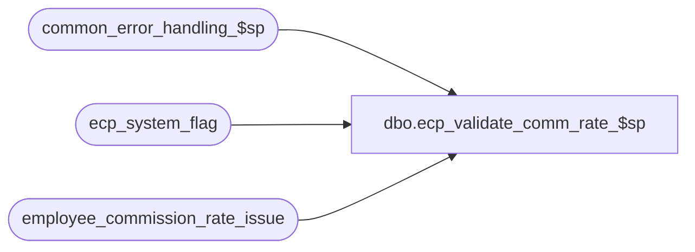

# dbo.ecp_validate_comm_rate_$sp

**Database:** auditworks_external  
**Server:** bedrockdb01  

## Architecture Diagram



## Table Dependencies

| Referenced Table |
|---|
| common_error_handling_$sp |
| ecp_system_flag |
| employee_commission_rate_issue |

## Stored Procedure Code

```sql
create proc [dbo].[ecp_validate_comm_rate_$sp]    @as_of_datetime datetime = null,
   @process_id int = null,
   @summary_only tinyint = 0
AS
/* 
Proc Name: ecp_validate_comm_rate_$sp 
Desc:   Called by front end.
        Reports back any conflicting commission rate configuration definition entries
        resulting from the explosion of the employee_commission_rate_def table maintained
        by the user into the employee_commission_rate table used by the ecp postings.
        Assumes explosion code has been run first.

HISTORY:  
Date     Name           Def#    Desc
Apr14,11 Paul          126153   Use unicode datatypes
Oct27,08 Vicci         105964   Return comma delimited list of ecp_rate_id as description of issue;  offer summary retrieval version.
Feb18,08 Vicci          98558   As-of-date option no longer supported, just reads from issue table built when conflicting rows are merged by the explosion.
Feb08,08 Vicci          97975   Set errno not just message_id when raising business rule error
Nov02,07 Vicci          95521   Raise error if config changes have not yet been exploded.
Mar29,07 Vicci		85597	  Author
*/

SET NOCOUNT ON
DECLARE @errmsg                      nvarchar(255),
        @errno                       int,
        @message_id                  int,
        @object_name                 nvarchar(255),
        @operation_name              nvarchar(100),
        @process_name                nvarchar(100),
        @process_no                  int,
        @stream_no                   tinyint,
        @user_name                   nvarchar(30)
  
SELECT @errno = 0,
       @message_id = 201068,
       @object_name = 'Unknown',
       @operation_name = 'Unknown',
       @process_name = 'ecp_validate_comm_rate_$sp',
       @process_no = 0,
       @stream_no = 1,
       @user_name = suser_sname()

IF EXISTS (SELECT 1 
             FROM ecp_system_flag
            WHERE flag_name = 'ecp_rebuild_commission_rate' AND flag_numeric_value = 1)
BEGIN
  SELECT @errmsg = 'Recent configuration changes have not yet been processed.  Please try again later.',
         @message_id = 202018,
         @errno = 202018,
         @object_name = 'ecp_system_flag',
         @operation_name = 'SELECT'
  GOTO error
END
          

/*  U.I. should also do the following:
SELECT DISTINCT i.issue_no,
         i.employee_ecp_rate_id,
         d.employee_commission_code,
         d.employee_transaction_role,
         d.item_commission_code,
         d.store_commission_code,
         d.transaction_commission_code,
         d.tier_accumulation_basis,
         d.effective_from_date,
         d.commission_rate,
         d.commission_amount_per_item,
         d.effective_to_date,
         d.last_modified_datetime
    FROM employee_commission_rate_issue i, 
         employee_commission_rate_def d
   WHERE i.employee_ecp_rate_id  = d.employee_ecp_rate_id 
*/
IF @summary_only = 1
BEGIN
  SELECT DISTINCT issue_desc 
    FROM employee_commission_rate_issue 
   ORDER BY issue_desc
END
ELSE
BEGIN
  SELECT issue_no, 
          employee_commission_code,
          employee_transaction_role,
          item_commission_code,
          store_commission_code,
          transaction_commission_code,
          tier_accumulation_basis,
         employee_ecp_rate_id,
         commission_rate,
         commission_amount_per_item,
         effective_from_date,
         effective_to_date, issue_desc
    FROM employee_commission_rate_issue
   ORDER BY issue_no, effective_from_date, effective_to_date
END

RETURN

error:

  EXEC common_error_handling_$sp @process_no, @errno, @errmsg, 0, @message_id, @process_name, @object_name, @operation_name, 1, @stream_no

  RETURN
```

