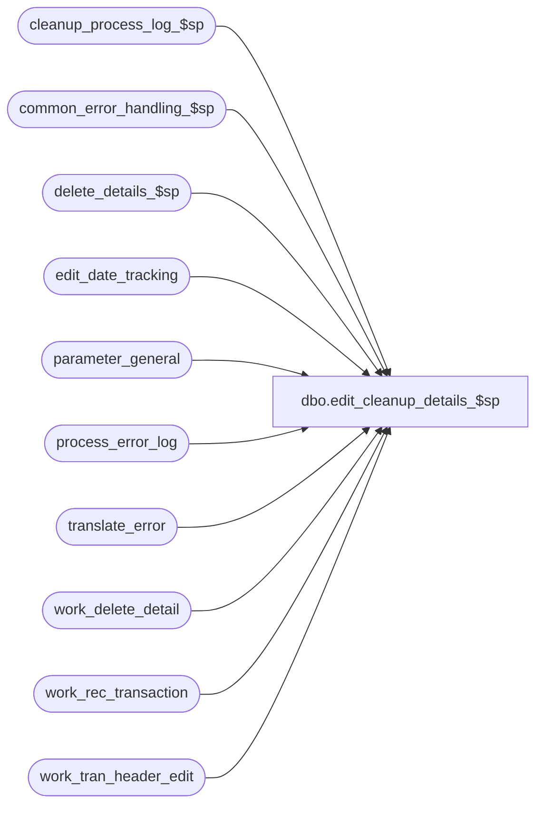

# dbo.edit_cleanup_details_$sp

**Database:** auditworks_external  
**Server:** bedrockdb01  

## Architecture Diagram



## Table Dependencies

| Referenced Table |
|---|
| cleanup_process_log_$sp |
| common_error_handling_$sp |
| delete_details_$sp |
| edit_date_tracking |
| parameter_general |
| process_error_log |
| translate_error |
| work_delete_detail |
| work_rec_transaction |
| work_tran_header_edit |

## Stored Procedure Code

```sql
create proc dbo.edit_cleanup_details_$sp 
@process_id      binary(16),
@user_id	int,
@errmsg          nvarchar(2000) OUTPUT,
@edit_process_no tinyint = 1


AS


/* 
PROC NAME: edit_cleanup_details_$sp
     DESC: To remove any incomplete transactions left after an error in edit_post_$sp 
           (before interface posting started) while processing the previous batch.
           Called from edit_post_$sp.
  HISTORY:
Date     Name             Def# Desc
Dec16,14 Paul        TFS-94103 use try catch
Nov16,12 Vicci          139679 Do not set status to missing for date-reject-id > 0;  do not set status to missing
			       for a valid date either, since a prior batch may have successfully posted transactions.
			       Instead, issue a request for edit_missing_reg_$sp to reevaluate the date.  The latter
			       will determine is status should be Missing/Closed/Unused.  If not, the orphaned status
			       record will be deleted by Edit Phase 2.
Feb05,07 Paul          DV-1355 apply 1-39RAI3 to SA5
Apr18,05 Paul          DV-1218 pass 1 in @verify_store_status when calling verify_store_status_$sp
Dec12,04 Maryam        DV-1191 Improve performance.
Oct12,04 Maryam        DV-1146 Modify the call to verify_store_status_$sp to pass 1 for @called_by_edit.
Sep23,04 David         DV-1146 Use user_id instead of user_name.
May05,04 Maryam        DV-1071 Receive @process_id and @user_name and pass it to the sub procs
Mar20,06 Daphna 1-39RAI3/69360 Pass new flag in call to verify_store_status
Jul28,03 Maryam          11627 Add delete of work_rec_transaction 
Nov26,01 Winnie        1-969YY Add logic for R3 error handling
May12,00 Paul             6302 Call verify_store_status_$sp.
Mar01,00 Phu              5900 Change @@fetch_status > 0 to @@fetch_status <> 0 for MS SQL compatibility
Jul23,99 Daphna F         5026 added call to delete_details_$sp instead of deleting
				transaction details and setting off delete trigger	
			 	on transaction_header
May19,99 Louise M.        4526 new code added to support trickle edit. 
Sep02,98 Paul S.           n/a author version 1.00
*/ 

DECLARE @audit_status		smallint,
	@cursor_open		tinyint,
	@date_reject_id		tinyint,
	@errmsg2			nvarchar(2000),
	@errline			int,
	@errno			int,
	@register_no		smallint,
	@store_no		int,
	@store_audit_status	smallint,
	@transaction_date	smalldatetime,
	@trickle_polling_flag	tinyint, 	 /* 0 = not trickle polling */	
	@object_name		nvarchar(255),
	@process_name		nvarchar(100),
	@operation_name		nvarchar(100),
	@message_id		int;

SELECT @process_name = 'edit_cleanup_details_$sp',
       @message_id = 201068;

BEGIN TRY

   SELECT @errmsg = 'Failed to read table parameter_general.',
          @object_name = 'parameter_general',
          @operation_name = 'SELECT';
SELECT @trickle_polling_flag = ISNULL(trickle_polling_flag,0)
  FROM parameter_general;

-- interface_control is deleted by edit_cleanup_interfaces_$sp.
-- Delete transaction details

  SELECT @errmsg = 'Unable to delete work_delete_detail',
         @object_name = 'work_delete_detail',
         @operation_name = 'DELETE';
DELETE work_delete_detail
 WHERE process_id = @process_id;


  SELECT @errmsg = 'Unable to populate work_delete_detail',
         @operation_name = 'INSERT';
INSERT work_delete_detail (process_id, transaction_id)
SELECT @process_id, transaction_id
  FROM work_tran_header_edit WITH (NOLOCK);


  SELECT @errmsg = 'Unable to delete work_rec_transaction',
	       @object_name = 'work_rec_transaction',
	       @operation_name = 'DELETE';
DELETE work_rec_transaction
  FROM work_rec_transaction d, work_delete_detail w WITH (NOLOCK)
 WHERE d.transaction_id = w.transaction_id
   AND w.process_id = @process_id;

  SELECT @errmsg = 'Unable to execute delete_detail_$sp',
         @object_name = 'delete_detail_$sp',
         @operation_name = 'EXECUTE';
EXEC delete_details_$sp @process_id, @user_id;

  SELECT @errmsg = 'Unable to delete translate_error',
	 @object_name = 'translate_error',
         @operation_name = 'DELETE';
DELETE translate_error
 FROM work_tran_header_edit wh WITH (NOLOCK), translate_error te
WHERE wh.store_no = te.store_no
  AND wh.register_no = te.register_no
  AND wh.entry_date_time = te.entry_date_time
  AND wh.transaction_series = te.transaction_series
  AND wh.transaction_no = te.transaction_no;

/*
Do not set audit status to missing since:
  a)  possibility that status should be missing/unused/closed
  b)  possibility that status should be deleted as in case of invalid store or reg or date with no remaining transactions
  c)  possibility that status should remain edited as in case record for which transactions from prior batch had already been posted
  d)  possibility of other streams being in the midst of updating the same store/reg/date
  
Instead leave it at 100 and remove date from list of those already evaluated for missing purposes so that:
  a) edit_missing_reg_$sp will determine if it should become missing/closed/unused
  b) edit_phase2_$sp will delete the record if no transactions remain
*/

  SELECT @errmsg = 'Unable to request that edit_missing_reg_$sp re-evaluate the date',
	 @object_name = 'edit_date_tracking';
DELETE edit_date_tracking
 WHERE sales_date IN (SELECT DISTINCT transaction_date FROM work_tran_header_edit WITH (NOLOCK));

  SELECT @errmsg = 'Failed to update process_error_log',
           @object_name = 'process_error_log',
           @operation_name = 'UPDATE';
UPDATE process_error_log
 SET verified = 1,
     verified_by_user_id = NULL --
  WHERE verified = 0
    AND process_no IN (1, 5)
    AND error_code = 108207;

  SELECT @errmsg = 'Failed to exec cleanup_process_log_$sp',
             @object_name = 'cleanup_process_log_$sp',
             @operation_name = 'EXECUTE';
EXEC cleanup_process_log_$sp 1, @edit_process_no;


RETURN;


business_error:   /* Business Rule handler. */

	SELECT @errmsg2 = @errmsg;

	/* Could include similar cleanup code to system error trap when needed (example is from move_store_$sp).
	   However, could also exclude the cleanup code here since the outer system error catch should fire again after the exec below. */

	EXEC common_error_handling_$sp 4, @errno, @errmsg, 0, @message_id, 
	  @process_name, @object_name, @operation_name, 1, @edit_process_no, 0,
	  null, 0, null, null, null, null, null, null, 0, @process_id, @user_id;
	  /* Note: when the exec above raises an error, that action also fires the system error trap (below) */
	RETURN;
END TRY

BEGIN CATCH; -- trap system errors
    /* common error handling. Appending proc name here because a rollback could occur if called within a transaction. */

        SELECT @errno = ERROR_NUMBER(),
		@errline = ERROR_LINE();

        SELECT @errmsg = CONVERT(nvarchar, @errno) + ':' + @process_name + ':' + CONVERT(nvarchar, @errline) + ':'
               + COALESCE(@errmsg, ' ') + ':' + ERROR_MESSAGE();

	 /* this condition will only be true when raise error in traps above fire this general catch */
	IF @errmsg2 IS NOT NULL
	  SELECT @errmsg = @errmsg2;

	IF @cursor_open = 1
	  BEGIN
	   CLOSE edit_cleanup_crsr;
	   DEALLOCATE edit_cleanup_crsr;
	  END;

	EXEC common_error_handling_$sp 4, @errno, @errmsg, 0, @message_id, 
	  @process_name, @object_name, @operation_name, 1, @edit_process_no, 0,
	  null, 0, null, null, null, null, null, null, 0, @process_id, @user_id;

	RETURN;
END CATCH;
```

