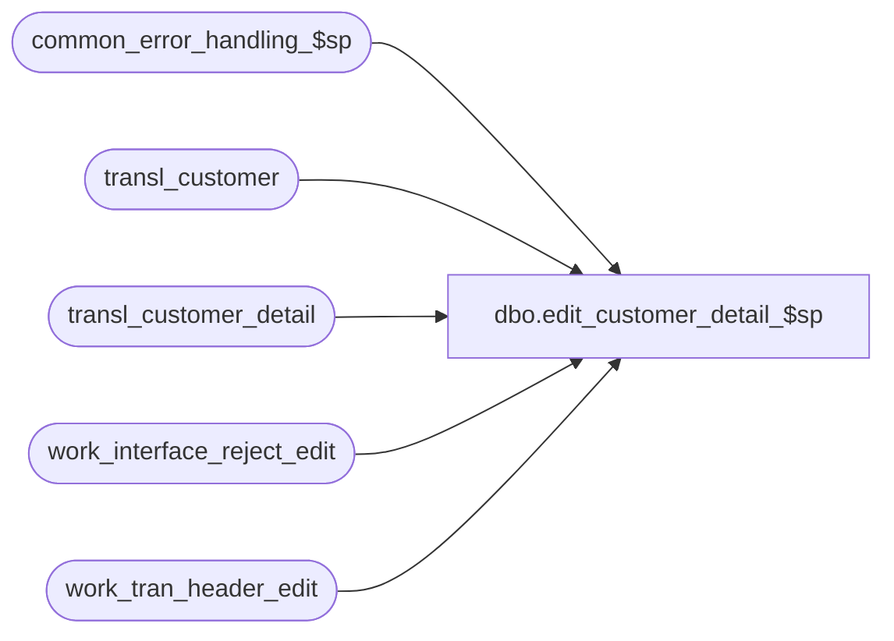

# dbo.edit_customer_detail_$sp

**Database:** auditworks_external  
**Server:** bedrockdb01  

## Architecture Diagram



## Table Dependencies

| Referenced Table |
|---|
| common_error_handling_$sp |
| transl_customer |
| transl_customer_detail |
| work_interface_reject_edit |
| work_tran_header_edit |

## Stored Procedure Code

```sql
create proc dbo.edit_customer_detail_$sp @customer_info_check	tinyint,
@errmsg			nvarchar(2000) OUTPUT,
@edit_process_no	tinyint = 1

AS

/* Proc Name: edit_customer_detail_$sp
   Desc: (EDIT) post customer details. Set more_info_flag in customer.
    Called by edit_post_$sp.

HISTORY
Date     Name           Def# Desc
Dec16,14 Paul      TFS-94103 use try catch
Oct10,14 Vicci     TFS-88075 Ensure that an "insufficient customer info" rejection is not logged when the mail-check customer is absent but
                             other customer attachments exist and all have sufficient mailing information.
Oct25,06 Phu           77931 Fix outer join for SQL 2005 Mode 90.
Dec20,05 Paul          64546 apply 61838,64259 to SA5
Apr29,05 Maryam      DV-1202 Rename from_line_id to line_id, expand transaction_id to use tran_id_datatype (Paul)
Dec12,04 Maryam      DV-1191 Improve performance.
Dec07,05 Daphna        61838 log customer_role into memo for IF reject insufficient cust data
Nov29,05 Vicci	       64259 don't reject transactions where customer attachments
			     other than mail-check are incomplete but the mail-check 
			     customer attachment exists and is complete.
Jan24,03 Paul           5752 create i/f reject if customer row does not exist
Jul12,02 Winnie      1-BUVZB Change the where clause for customer_sufficient from 0 to IS NULL
Nov26,01 Winnie	     1-969YY Add logic for R3 error handling to pass @edit_process_no
Nov05,01 David M	8901 Add distinct clause to insert to work_interface_reject_edit.
Nov06,01 Sab		8900 TRANSL edit changes for Sybase
Apr25,01 Henry		7594 Correctly set the more_info_flag in customer, add join on customer_role field.
Dec23,99 Paul		5536 Avoid duplicate error when customer_info_check > 0
Apr04,97 Paul
Jul07,96 Paul		author version 1.01

*/

DECLARE @errno 			int,
	@errmsg2			nvarchar(2000),
	@errline			int,
	@message_id		int,	
	@object_name		nvarchar(255),	
	@operation_name		nvarchar(100),
	@process_name		nvarchar(100); 	

SELECT @process_name = 'edit_customer_detail_$sp',
       @message_id = 201068;

BEGIN TRY

   SELECT @errmsg = 'Failed to create table #customer_check',
          @object_name = '#customer_check',
          @operation_name = 'CREATE TABLE' ;
CREATE TABLE #customer_check (transaction_id      numeric(14,0) not null, -- tran_id_datatype
                              line_id             numeric(5,0) null, 
                              customer_sufficient tinyint null,
                              customer_role       smallint null);

   SELECT @errmsg = 'Failed to update transl_customer',
          @object_name = 'transl_customer',
          @operation_name = 'UPDATE';
UPDATE transl_customer
   SET more_info_flag = 1
  FROM transl_customer_detail cd WITH (NOLOCK), transl_customer cu
 WHERE cu.store_no = cd.store_no
   AND  cu.register_no = cd.register_no
   AND  cu.entry_date_time = cd.entry_date_time
   AND  cu.transaction_series = cd.transaction_series
   AND  cu.transaction_no = cd.transaction_no
   AND  cu.line_id = cd.line_id
   AND  cu.customer_role = cd.customer_role;

IF @customer_info_check >= 1
  BEGIN /* Note: assumes one purchasing customer per transaction */
     SELECT @errmsg = 'Failed to update customer (sufficient=1)',
            @object_name = 'transl_customer',
            @operation_name = 'UPDATE';
   UPDATE transl_customer
      SET customer_sufficient = 1
    WHERE last_name IS NOT NULL
      AND ( address_1 IS NOT NULL OR address_2 IS NOT NULL )
      AND (( city IS NOT NULL AND state IS NOT NULL ) OR post_code IS NOT NULL )
      AND customer_sufficient IS NULL;

        SELECT @errmsg = 'Failed to insert in to table #customer_check',
               @object_name = '#customer_check',
               @operation_name = 'INSERT';
   INSERT INTO #customer_check(
          transaction_id,
          line_id,
          customer_sufficient,
          customer_role)  
   SELECT wh.transaction_id,
          c.line_id,
          c.customer_sufficient,
          c.customer_role
     FROM work_tran_header_edit wh WITH (NOLOCK)
          LEFT JOIN transl_customer c WITH (NOLOCK) ON (wh.transaction_no = c.transaction_no
                                                        AND wh.entry_date_time = c.entry_date_time
                                                        AND wh.transaction_series = c.transaction_series
                                                        AND wh.store_no = c.store_no
                                                        AND wh.register_no = c.register_no);

        SELECT @errmsg = 'Failed to remove attachments for other customer roles for transactions with mail-check customers from list of those to validate',
               @operation_name = 'DELETE';
   DELETE #customer_check
    WHERE customer_sufficient IS NULL
      AND customer_role <> 3
      AND transaction_id IN (SELECT c.transaction_id
                               FROM #customer_check c
                              WHERE c.customer_role = 3);

   /* will insert all transactions where no customer row is present. edit_interfaces_$sp
      will then reject only the tx which affect interfaces for which the check is on.
      Will also insert if customer row is present but customer_sufficient is null. */

        SELECT @errmsg = 'Failed to insert work_interface_reject_edit (reason=6)',
               @object_name = 'work_interface_reject_edit',
               @operation_name = 'INSERT';
   INSERT work_interface_reject_edit (
	  transaction_id,
	  line_id,
	  if_reject_reason,
	  interface_affected_flag,
	  memo3 )
   SELECT DISTINCT transaction_id,
	  ISNULL(line_id, 0),
	  6,
	  0,
	  customer_role
     FROM #customer_check WITH (NOLOCK)
    WHERE (line_id IS NOT NULL AND customer_sufficient IS NULL) -- customer row exists
          OR line_id IS NULL; -- no customer row exists

  END; /* customer info check */


RETURN;


business_error:   /* Business Rule handler. */

	SELECT @errmsg2 = @errmsg;

	/* Could include similar cleanup code to system error trap when needed (example is from move_store_$sp).
	   However, could also exclude the cleanup code here since the outer system error catch should fire again after the exec below. */

	EXEC common_error_handling_$sp 4, @errno, @errmsg, 0, @message_id, 
	  @process_name, @object_name, @operation_name, 1, @edit_process_no;
	  /* Note: when the exec above raises an error, that action also fires the system error trap (below) */
	RETURN;
END TRY

BEGIN CATCH; -- trap system errors
    /* common error handling. Appending proc name here because a rollback could occur if called within a transaction. */

        SELECT @errno = ERROR_NUMBER(),
		@errline = ERROR_LINE();

        SELECT @errmsg = CONVERT(nvarchar, @errno) + ':' + @process_name + ':' + CONVERT(nvarchar, @errline) + ':'
               + COALESCE(@errmsg, ' ') + ':' + ERROR_MESSAGE();

	 /* this condition will only be true when raise error in traps above fire this general catch */
	IF @errmsg2 IS NOT NULL
	  SELECT @errmsg = @errmsg2;

	EXEC common_error_handling_$sp 4, @errno, @errmsg, 0, @message_id, 
	  @process_name, @object_name, @operation_name, 1, @edit_process_no;

	RETURN;
END CATCH;
```

