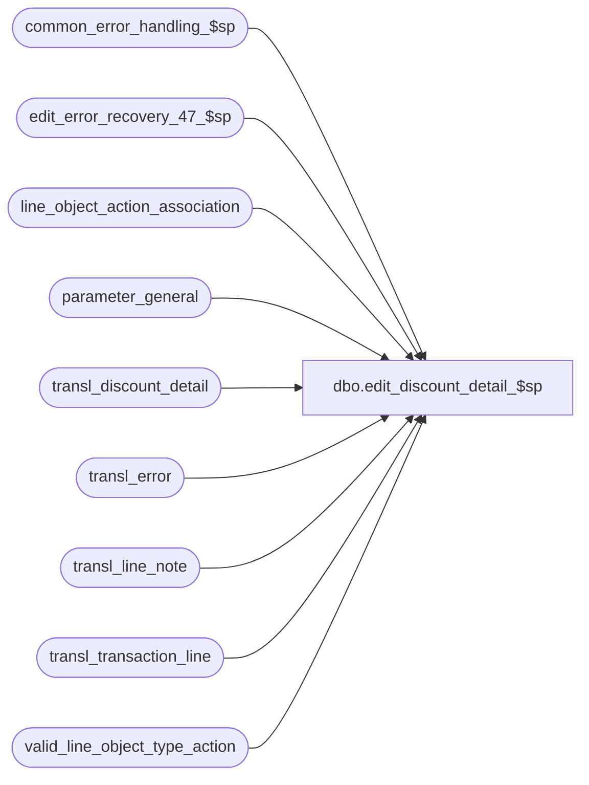

# dbo.edit_discount_detail_$sp

**Database:** auditworks_external  
**Server:** bedrockdb01  

## Architecture Diagram



## Table Dependencies

| Referenced Table |
|---|
| common_error_handling_$sp |
| edit_error_recovery_47_$sp |
| line_object_action_association |
| parameter_general |
| transl_discount_detail |
| transl_error |
| transl_line_note |
| transl_transaction_line |
| valid_line_object_type_action |

## Stored Procedure Code

```sql
create proc dbo.edit_discount_detail_$sp 
       @errmsg nvarchar(2000) OUTPUT,
       @edit_process_no	tinyint = 1


AS

/* Proc Name: edit_discount_detail_$sp
   Desc: (EDIT) to post discount details. Sets transaction_line pos_discount_amount.
    NOTE : negative sign on discount ( from translate ) is ignored except for markups.
   Called by edit_post_$sp.

HISTORY:
 Date    Name       Def# Desc
Dec16,14 Paul  TFS-94103 use try catch
Sep05,14 Vicci TFS-76395 If the translate has erroneously sent discount attachments indicating that a void discount was applied to items
                         (this is not supported by S/A since if a discount is void then by definition it not applied to any lines), 
                         then auto-correct them.  Also, log any pos_discount_serial_no overrides to a new line-note attachment 9106 to preserve the
                         information in the event the discount line is void or is later voided by the auditor.
Aug23,13 Vicci   146198 Do not include promotion name in the logging of the pos_discount_serial_no.
May22,12 Paul    135342 Corrected update statement to handle non-zero line_id_adj in mssql, updated comments 
Jan18,11 Paul    124176 Create a translate reject and drop the discount attachment row if the tran line that matches
			 the applied_by_line_id is not of line_object_type 'discount' or if the line_object is not discountable
Apr05,07 Daphna DV-1360 uplift 1-3MTFAT to SA5
Oct25,06 Phu      77931 Fix outer join for SQL 2005 Mode 90.
Jun28,06 Tim    DV-1340 Apply 72826 to SA5
May30,06 Vicci    72826 Support markups in transactions with no G/L effect
Apr29,05 Maryam DV-1202 Set the discount_amount_sign based on discount reversal flag, expand transaction_id to use tran_id_datatype (Paul)
Dec12,04 Maryam DV-1191 Improve performance.
Mar30.07 Daphna 1-3MTFAT Substring line_note to 20 char, ANSI std
May30,06 Vicci    72826 Support markups in transactions with no G/L effect
Nov26,01 Winnie	1-969YY Add logic for R3 error handling to pass @edit_process_no
Nov27,01 DavidM    8885 Added an update to transl_discount_detail to reverse discount_amount_sign if
                        line_object_action_lookup table switches from debit to credit or vice versa.
Nov06,01 Sab       8900 TRANSL edit changes for Sybase
Aug10,00 Sab/Paul  6580 Avoid group by line_id + line_id_adj since it returns bad results in Oracle 8i.
May18,00 Vicci     6359 Log serial number of discount line to discount detail of discounted items 
Mar30,00 Phu       6158 Remove alias name attached to column being updated for MS SQL compatibility
Jun22,98 Paul
Feb03,97 Paul
*/

DECLARE @errno                  int,
	@errmsg2			nvarchar(2000),
	@errline			int,
	@message_id		int,	
	@object_name		nvarchar(255),	
	@operation_name		nvarchar(100),
	@process_name		nvarchar(100),
	@rows			int,
	@translate_msg		nvarchar(255),
	@translate_msg2		nvarchar(255);

SELECT @process_name = 'edit_discount_detail_$sp',
       @message_id = 201068,
       @translate_msg = 'Discount attachment found (for line object that is not of type ''discount'') has been dropped',
       @translate_msg2 = 'Discount attachment found (for line object that is not discountable) has been dropped';

BEGIN TRY

   SELECT @errmsg = 'Failed to create table #discounts',
          @object_name = '#discounts',
          @operation_name = 'CREATE TABLE';
CREATE TABLE #discounts( transaction_id numeric(14,0) null, -- tran_id_datatype
                         store_no int not null,
                         register_no smallint not null,
                         entry_date_time datetime not null,
                         transaction_series nchar(1) not null,
                         transaction_no int not null,
                         line_id numeric(5,0) not null,
                         applied_by_line_id numeric(5,0) null,                         
                         pos_discount_level tinyint null,
                         pos_discount_type smallint not null,
                         db_cr_none smallint null,
                         applied_flag smallint null,
                         pos_discount_serial_no nvarchar(20) null,
                         pos_discount_amount numeric(12,4) not null,
                         pos_discount_amount_adj numeric(12,4) not null,
                         line_object_type tinyint null);
                         
   SELECT @errmsg = 'Failed to create table #discount_totals',
          @object_name = '#discount_totals';
CREATE TABLE #discount_totals (store_no int not null,
                               register_no smallint not null,
                               entry_date_time datetime not null,
                               transaction_series nchar(1) not null,
                               transaction_no int not null,
                               line_id numeric(5,0) not null,
                               pos_discount_amount numeric(12,4) not null);

  SELECT @errmsg = 'Failed to perform any pos_discount_serial_no overrides.  ',
         @object_name = 'transl_discount_detail',
         @operation_name = 'UPDATE';
UPDATE transl_discount_detail
   SET pos_discount_serial_no = SUBSTRING(n.line_note, 1, 20)  --to avoid changing existing code and to make sure translate programmer doesn't think they can use 9106 as a 3rd coupon/serial#.
  FROM transl_line_note n WITH (NOLOCK)
 WHERE transl_discount_detail.transaction_no = n.transaction_no
   AND transl_discount_detail.store_no = n.store_no
   AND transl_discount_detail.register_no = n.register_no
   AND transl_discount_detail.entry_date_time = n.entry_date_time
   AND transl_discount_detail.transaction_series = n.transaction_series
   AND transl_discount_detail.applied_by_line_id = n.line_id
   AND n.note_type = 9106;

   
  SELECT @errmsg = 'Failed to log any pos_discount_serial_no overrides to a line-note attachment to preserve the information in the event the discount line is void or is later voided by the auditor.  ',
         @object_name = 'transl_line_note',
         @operation_name = 'INSERT';
INSERT into transl_line_note(
       store_no,
       register_no,
       entry_date_time,
       transaction_series,
       transaction_no,
       line_id,
       note_type,
       line_note)
SELECT tl.store_no,
       tl.register_no,
       tl.entry_date_time,
       tl.transaction_series,
       tl.transaction_no,
       td.applied_by_line_id,
       9106,
       MAX(td.pos_discount_serial_no)  --note perfect since if the translate logged different ones to different lines (which would be a translate bug) only the max would be retained, but good enough.
  FROM transl_discount_detail td WITH (NOLOCK)
       INNER JOIN transl_transaction_line tl WITH (NOLOCK)
          ON tl.transaction_no = td.transaction_no
         AND tl.store_no = td.store_no
         AND tl.register_no = td.register_no
         AND tl.entry_date_time = td.entry_date_time
         AND tl.transaction_series = td.transaction_series
         AND tl.line_id = td.applied_by_line_id
        LEFT OUTER JOIN transl_line_note n WITH (NOLOCK)
          ON tl.transaction_no = n.transaction_no
         AND tl.store_no = n.store_no
         AND tl.register_no = n.register_no
         AND tl.entry_date_time = n.entry_date_time
         AND tl.transaction_series = n.transaction_series
         AND tl.line_id = n.line_id
         AND n.note_type = 9106
 WHERE td.pos_discount_serial_no IS NOT NULL
   AND n.note_type IS NULL	--i.e. don't log if it already exists
 GROUP BY tl.store_no,
       tl.register_no,
       tl.entry_date_time,
       tl.transaction_series,
       tl.transaction_no,
       td.applied_by_line_id;

  SELECT @errmsg = 'Failed to discard any attachments erroneously indicating that a void discount was applied.  ',
         @object_name = 'transl_discount_detail',
         @operation_name = 'DELETE';
DELETE transl_discount_detail
  FROM transl_transaction_line tl WITH (NOLOCK) 
 WHERE tl.line_void_flag = 1
   AND tl.transaction_no = transl_discount_detail.transaction_no
   AND tl.store_no = transl_discount_detail.store_no
   AND tl.register_no = transl_discount_detail.register_no
   AND tl.entry_date_time = transl_discount_detail.entry_date_time
   AND tl.transaction_series = transl_discount_detail.transaction_series
   AND tl.line_id = transl_discount_detail.applied_by_line_id;

-- discard any duplicated discount rows
   SELECT @errmsg = 'Failed to execute procedure edit_error_recovery_47_$sp',
          @object_name = 'edit_error_recovery_47_$sp',
          @operation_name = 'EXEC';
EXEC edit_error_recovery_47_$sp @edit_process_no;

   SELECT @errmsg = 'Failed to insert into table #discounts',
          @object_name = '#discounts',
          @operation_name = 'INSERT';
INSERT INTO #discounts(
       transaction_id,
       store_no,
       register_no,
       entry_date_time,
       transaction_series,
       transaction_no,
       line_id,
       applied_by_line_id,
       pos_discount_level,
       pos_discount_type,
       db_cr_none,
       line_object_type,
       applied_flag,
       pos_discount_serial_no,
       pos_discount_amount,
       pos_discount_amount_adj) 
SELECT tl.transaction_id,
       td.store_no,
       td.register_no,
       td.entry_date_time,
       td.transaction_series,
       td.transaction_no,
       td.line_id + td.line_id_adj,
       td.applied_by_line_id,
       tl.line_object_type,
       tl.line_object,
       tl.db_cr_none,
       tl.line_object_type,
       1 - ABS(tl.db_cr_none),
       ISNULL(td.pos_discount_serial_no, CASE WHEN CHARINDEX(':', ln.line_note) BETWEEN 1 AND 21 
            				 THEN CASE WHEN IsNumeric(SUBSTRING(ln.line_note, 1, CHARINDEX(':', ln.line_note) - 1)) = 1
            				           THEN CONVERT(nvarchar(20), CONVERT(numeric(20,0), SUBSTRING(ln.line_note, 1, CHARINDEX(':', ln.line_note) - 1)))
            				           ELSE SUBSTRING(ln.line_note, 1, CHARINDEX(':', ln.line_note) - 1)
            				           END
			                 ELSE SUBSTRING(ln.line_note, 1, 20) END),  --Since coupon-triggered promotions have a promo number logged in the format 9999999999999999:PromoName for Coalition (146198)
       SUM(td.pos_discount_amount * td.discount_amount_sign),
       SUM(td.pos_discount_amount_adj * td.discount_amount_sign)
  FROM transl_discount_detail td WITH (NOLOCK)
       INNER JOIN transl_transaction_line tl WITH (NOLOCK) ON (tl.transaction_no = td.transaction_no
                                                               AND tl.store_no = td.store_no
                                                               AND tl.register_no = td.register_no
                                                               AND tl.entry_date_time = td.entry_date_time
                                                               AND tl.transaction_series = td.transaction_series
                                                               AND tl.line_id = td.applied_by_line_id)
       LEFT JOIN transl_line_note ln WITH (NOLOCK) ON (tl.store_no = ln.store_no
                                                       AND tl.register_no = ln.register_no
                                                       AND tl.entry_date_time = ln.entry_date_time
                                                       AND tl.transaction_series = ln.transaction_series
                                                       AND tl.transaction_no = ln.transaction_no
                                                       AND tl.line_id = ln.line_id
                         AND ln.note_type = 9006)
 WHERE tl.transaction_id IS NOT NULL --
 GROUP BY tl.transaction_id,
	 td.store_no,
	 td.register_no,
	 td.entry_date_time,
	 td.transaction_series,
	 td.transaction_no,
	 td.line_id + td.line_id_adj,
	 td.applied_by_line_id,
	 tl.line_object_type,
	 tl.line_object,
	 tl.db_cr_none,
	 tl.line_object_type, 
	 1 - ABS(tl.db_cr_none),
	 ISNULL(td.pos_discount_serial_no, CASE WHEN CHARINDEX(':', ln.line_note) BETWEEN 1 AND 21 
            				   THEN CASE WHEN IsNumeric(SUBSTRING(ln.line_note, 1, CHARINDEX(':', ln.line_note) - 1)) = 1
            				             THEN CONVERT(nvarchar(20), CONVERT(numeric(20,0), SUBSTRING(ln.line_note, 1, CHARINDEX(':', ln.line_note) - 1)))
            				             ELSE SUBSTRING(ln.line_note, 1, CHARINDEX(':', ln.line_note) - 1)
            				        END
			                   ELSE SUBSTRING(ln.line_note, 1, 20) END);
SELECT @rows = @@rowcount;

IF @rows = 0
  BEGIN
	DROP TABLE #discounts;
	DROP TABLE #discount_totals;
	RETURN;
  END;

/* Set transaction_id for discount details where the applied_by_line_id exists as a line in transl_transaction_line.
   Any orphan rows in transl_discount_detail (where transaction_id = null) will be discarded later on insert
   to table discount_detail */ 
    SELECT @errmsg = 'Failed to update #discounts (transaction_id)',
          @object_name = 'transl_discount_detail',
          @operation_name = 'UPDATE';
UPDATE transl_discount_detail
   SET transaction_id = d.transaction_id,
	line_id = td.line_id + td.line_id_adj,
	applied_by_line_id = d.applied_by_line_id,
	pos_discount_level = d.pos_discount_level,
	pos_discount_type = d.pos_discount_type,
	pos_discount_amount = d.pos_discount_amount,
	applied_flag = d.applied_flag,
	pos_discount_amount_adj = d.pos_discount_amount_adj,
	discount_amount_sign = 1,
	pos_discount_serial_no = d.pos_discount_serial_no
   FROM transl_discount_detail td, #discounts d WITH (NOLOCK)
  WHERE td.store_no = d.store_no
    AND td.register_no = d.register_no
    AND td.entry_date_time = d.entry_date_time
    AND td.transaction_series = d.transaction_series
    AND td.transaction_no = d.transaction_no
    AND td.line_id + td.line_id_adj = d.line_id
    AND td.applied_by_line_id = d.applied_by_line_id
    AND td.transaction_id IS NULL; /* safety check to ensure only run once */

/* Create translate rejects if a discount attachment belongs to a tran line with a non-discount line_object_type */
    SELECT @errmsg = 'Failed to insert into transl_error',
          @object_name = 'transl_error',
          @operation_name = 'INSERT';
INSERT transl_error (
	store_no,
	register_no,
	entry_date_time,
	transaction_series,
	transaction_no,
	line_id,
	transl_reject_reason,  
	posting_end_date_time,
	transl_error_msg,
	bad_data_output)
SELECT DISTINCT
	store_no,
	register_no,
	entry_date_time,
	transaction_series,
	transaction_no,
	applied_by_line_id,
	200, 
	getdate(),
	@translate_msg,
	CONVERT(nvarchar,line_id) + '/' + CONVERT(nvarchar,applied_by_line_id) + '/' + CONVERT(nvarchar,pos_discount_amount)
  FROM #discounts WITH (NOLOCK)
  WHERE line_object_type NOT IN (16, 17, 18, 19, 22, 23)
    AND transaction_id IS NOT NULL;

SELECT @rows = @@rowcount;

IF @rows > 0
  BEGIN -- drop discount rows with non-discount line_object_type to prevent data integrity issues in subledger
	   SELECT @errmsg = 'Failed to remove invalid discount rows',
	          @object_name = 'transl_discount_detail',
	          @operation_name = 'DELETE';
	DELETE transl_discount_detail
	 FROM #discounts d WITH (NOLOCK), transl_discount_detail td
	WHERE d.line_object_type NOT IN (16, 17, 18, 19, 22, 23)
	  AND d.transaction_id IS NOT NULL
	  AND td.store_no = d.store_no
	  AND td.register_no = d.register_no
	  AND td.entry_date_time = d.entry_date_time
	  AND td.transaction_series = d.transaction_series
	  AND td.transaction_no = d.transaction_no
	  AND td.applied_by_line_id = d.applied_by_line_id;
  END;

/* Create translate rejects if a discount attachment applies to a tran line with a non-discountable line_object_type */
    SELECT @errmsg = 'Failed to insert into transl_error (2)',
          @object_name = 'transl_error',
          @operation_name = 'INSERT';
INSERT transl_error (
	store_no,
	register_no,
	entry_date_time,
	transaction_series,
	transaction_no,
	line_id,
	transl_reject_reason,  
	posting_end_date_time,
	transl_error_msg,
	bad_data_output)
SELECT DISTINCT
	td.store_no,
	td.register_no,
	td.entry_date_time,
	td.transaction_series,
	td.transaction_no,
	td.line_id,
	201, 
	getdate(),
	@translate_msg2,
	CONVERT(nvarchar,td.line_id) + '/' + CONVERT(nvarchar,td.applied_by_line_id) + '/' + CONVERT(nvarchar,td.pos_discount_amount)
  FROM transl_discount_detail td, transl_transaction_line tl, line_object_action_association loaa
  WHERE td.transaction_id IS NOT NULL
    AND tl.transaction_id IS NOT NULL
    AND tl.store_no = td.store_no
    AND tl.register_no = td.register_no
    AND tl.entry_date_time = td.entry_date_time
    AND tl.transaction_series = td.transaction_series
    AND tl.transaction_no = td.transaction_no
    AND tl.line_id = td.line_id
    AND tl.transaction_category = loaa.transaction_category
    AND tl.line_object = loaa.line_object
    AND tl.line_action = loaa.line_action
    AND loaa.discountable_group = 0; -- not discountable

SELECT @rows = @@rowcount;

IF @rows > 0
  BEGIN /* drop discount rows that apply to tran lines that have a non-discountable line_object_type
	   to prevent data integrity issues in subledger */
	   SELECT @errmsg = 'Failed to remove non-discountable discount rows',
	          @object_name = 'transl_discount_detail',
	          @operation_name = 'DELETE';
	DELETE transl_discount_detail
	 FROM transl_discount_detail td, transl_transaction_line tl, line_object_action_association loaa
	WHERE td.transaction_id IS NOT NULL
	  AND tl.transaction_id IS NOT NULL
	  AND tl.store_no = td.store_no
	  AND tl.register_no = td.register_no
	  AND tl.entry_date_time = td.entry_date_time
	  AND tl.transaction_series = td.transaction_series
	  AND tl.transaction_no = td.transaction_no
	  AND tl.line_id = td.line_id
	  AND tl.transaction_category = loaa.transaction_category
	  AND tl.line_object = loaa.line_object
	  AND tl.line_action = loaa.line_action
	  AND loaa.discountable_group = 0; -- not discountable
  END;

/* change signs for markups (usually only exist on returns) */
    SELECT @errmsg = 'Failed to update #discounts (discount_amount_sign)',
          @object_name = 'transl_discount_detail',
          @operation_name = 'UPDATE';
UPDATE transl_discount_detail
  SET discount_amount_sign = -1
  FROM transl_transaction_line tl WITH (NOLOCK), transl_discount_detail td
 WHERE td.transaction_no = tl.transaction_no
   AND td.store_no = tl.store_no
   AND td.register_no = tl.register_no
   AND td.entry_date_time = tl.entry_date_time
   AND td.transaction_series = tl.transaction_series
   AND td.line_id = tl.line_id
   AND tl.db_cr_none != 0
   AND SIGN(td.pos_discount_amount - td.pos_discount_amount_adj) = -1 * tl.db_cr_none;

/* Defect 72820  */
   SELECT @errmsg = 'Failed to update #discounts (discount_amount_sign) for markups on transactions with no G/L effect';
UPDATE transl_discount_detail
  SET discount_amount_sign = -1
  FROM transl_transaction_line tl WITH (NOLOCK), transl_discount_detail td, valid_line_object_type_action v
 WHERE td.transaction_no = tl.transaction_no
   AND td.store_no = tl.store_no
   AND td.register_no = tl.register_no
   AND td.entry_date_time = tl.entry_date_time
   AND td.transaction_series = tl.transaction_series
   AND td.line_id = tl.line_id
   AND tl.db_cr_none = 0
   AND tl.line_object_type = v.line_object_type
   AND tl.line_action = v.line_action
   AND v.default_db_cr_none <> 0
   AND SIGN(td.pos_discount_amount - td.pos_discount_amount_adj) = -1 * v.default_db_cr_none;

/* reverse discount_amount_sign if discount_reversal_flag is set in line_object_action_lookup table 
   transl_transaction_line.discount_reversal_flag gets set in edit_lines_$sp */

IF (SELECT object_action_lookup_flag 
      FROM parameter_general) != 0 
  BEGIN
        SELECT @errmsg = 'Failed to update transl_discount_detail (discount_amount_sign)',
               @object_name = 'transl_discount_detail',
		  @operation_name = 'UPDATE' ;
    UPDATE transl_discount_detail
       SET discount_amount_sign = discount_amount_sign * -1
      FROM transl_discount_detail td, transl_transaction_line tl WITH (NOLOCK)
     WHERE tl.transaction_id = td.transaction_id
       AND tl.line_id = td.line_id
       AND tl.discount_reversal_flag = 1;
  END;

/* calculate total discount for each transaction_line */
   SELECT @errmsg = 'Failed to insert into #discount_totals',
          @object_name = '#discount_totals',
          @operation_name = 'INSERT';
INSERT INTO #discount_totals(
       store_no,
       register_no,
       entry_date_time,
       transaction_series,
       transaction_no,
       line_id,
       pos_discount_amount)
SELECT td.store_no,
       td.register_no,
       td.entry_date_time,
       td.transaction_series,
       td.transaction_no,
       td.line_id,
       SUM(CONVERT(numeric(12,4),discount_amount_sign) * CONVERT(numeric(12,4),(ABS(td.pos_discount_amount - pos_discount_amount_adj))))
  FROM transl_discount_detail td WITH (NOLOCK), transl_transaction_line tl WITH (NOLOCK)
 WHERE tl.store_no = td.store_no
   AND tl.register_no = td.register_no
   AND tl.entry_date_time = td.entry_date_time
   AND tl.transaction_series = td.transaction_series
   AND tl.transaction_no = td.transaction_no
   AND tl.line_id = td.line_id
   AND applied_flag = 1
   AND td.transaction_id IS NOT NULL -- exclude any orphan discount rows
 GROUP BY td.store_no, td.register_no, td.entry_date_time, td.transaction_series, td.transaction_no, td.line_id
HAVING SUM(CONVERT(numeric(12,4),discount_amount_sign) *
	   CONVERT(numeric(12,4),(ABS(td.pos_discount_amount - pos_discount_amount_adj)))) != 0;

   SELECT @errmsg = 'Failed to update transl_transaction_line',
          @object_name = 'transl_transaction_line',
          @operation_name = 'UPDATE';
UPDATE transl_transaction_line
   SET pos_discount_amount = dt.pos_discount_amount
  FROM #discount_totals dt WITH (NOLOCK), transl_transaction_line tl
 WHERE dt.store_no = tl.store_no
   AND dt.register_no = tl.register_no
   AND dt.entry_date_time = tl.entry_date_time
   AND dt.transaction_series = tl.transaction_series
   AND dt.transaction_no = tl.transaction_no
   AND dt.line_id = tl.line_id
   AND tl.transaction_id IS NOT NULL; -- exclude orphan lines

/* Now verify that the discount detail totals match transaction_line */


/*
select d.store_no, d.register_no, d.transaction_date, d.transaction_series, d.transaction_no,
       d.transaction_id, d.applied_by_line_id, 
       MAX(dl.gross_line_amount * CASE WHEN dl.db_cr_none = 0 THEN dv.default_db_cr_none ELSE dl.db_cr_none END) disc_line_amt,
       SUM(d.pos_discount_amount * CASE WHEN ml.db_cr_none = 0 THEN mv.default_db_cr_none ELSE ml.db_cr_none END * -1) disc_detail_amt
FROM #discounts d
     INNER JOIN transl_transaction_line dl -- discount lines
        ON (d.transaction_id = dl.transaction_id AND d.applied_by_line_id = dl.line_id)
      AND dl.line_void_flag = 0
     INNER JOIN valid_line_object_type_action dv
        ON dl.line_object_type = dv.line_object_type
       AND dl.line_action = dv.line_action
     INNER JOIN transl_transaction_line ml -- merch lines
        ON d.transaction_id = ml.transaction_id
       AND d.line_id = ml.line_id
       AND ml.line_void_flag = 0
     INNER JOIN valid_line_object_type_action mv
        ON ml.line_object_type = mv.line_object_type
       AND ml.line_action = mv.line_action
WHERE d.transaction_void_flag IN (0,8)
  AND d.transaction_id IS NOT NULL -- exclude ophan lines
GROUP BY h.store_no, h.register_no, h.transaction_date, h.transaction_series, h.transaction_no, d.transaction_id, d.applied_by_line_id
HAVING    MAX(dl.gross_line_amount * CASE WHEN dl.db_cr_none = 0 THEN dv.default_db_cr_none ELSE dl.db_cr_none END) 
       <> SUM(d.pos_discount_amount * CASE WHEN ml.db_cr_none = 0 THEN mv.default_db_cr_none ELSE ml.db_cr_none END * -1)
*/

DROP TABLE #discounts;
DROP TABLE #discount_totals;


RETURN;


business_error:   /* Business Rule handler. */

	SELECT @errmsg2 = @errmsg;

	/* Could include similar cleanup code to system error trap when needed (example is from move_store_$sp).
	   However, could also exclude the cleanup code here since the outer system error catch should fire again after the exec below. */

	EXEC common_error_handling_$sp 4, @errno, @errmsg, 0, @message_id, 
	  @process_name, @object_name, @operation_name, 1, @edit_process_no;
	  /* Note: when the exec above raises an error, that action also fires the system error trap (below) */
	RETURN;
END TRY

BEGIN CATCH; -- trap system errors
    /* common error handling. Appending proc name here because a rollback could occur if called within a transaction. */

        SELECT @errno = ERROR_NUMBER(),
		@errline = ERROR_LINE();

        SELECT @errmsg = CONVERT(nvarchar, @errno) + ':' + @process_name + ':' + CONVERT(nvarchar, @errline) + ':'
               + COALESCE(@errmsg, ' ') + ':' + ERROR_MESSAGE();

	 /* this condition will only be true when raise error in traps above fire this general catch */
	IF @errmsg2 IS NOT NULL
	  SELECT @errmsg = @errmsg2;

	EXEC common_error_handling_$sp 4, @errno, @errmsg, 0, @message_id, 
	  @process_name, @object_name, @operation_name, 1, @edit_process_no;

	RETURN;
END CATCH;
```

