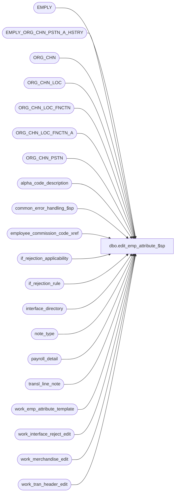

# dbo.edit_emp_attribute_$sp

**Database:** auditworks_external  
**Server:** bedrockdb01  

## Architecture Diagram



## Table Dependencies

| Referenced Table |
|---|
| EMPLY |
| EMPLY_ORG_CHN_PSTN_A_HSTRY |
| ORG_CHN |
| ORG_CHN_LOC |
| ORG_CHN_LOC_FNCTN |
| ORG_CHN_LOC_FNCTN_A |
| ORG_CHN_PSTN |
| alpha_code_description |
| common_error_handling_$sp |
| employee_commission_code_xref |
| if_rejection_applicability |
| if_rejection_rule |
| interface_directory |
| note_type |
| payroll_detail |
| transl_line_note |
| work_emp_attribute_template |
| work_interface_reject_edit |
| work_merchandise_edit |
| work_tran_header_edit |

## Stored Procedure Code

```sql
create proc dbo.edit_emp_attribute_$sp 
( @errmsg                          nvarchar(2000) OUTPUT,
  @edit_process_no                 tinyint = 1
)

AS

/*
Proc Name: edit_emp_attribute_$sp
     Desc: (EDIT) Build Employee Attribute I/F reject reasons 21 to 37.
           IMPORTANT: reject reasons 38-41 are done in edit_return_$sp.
           Called from edit_post_$sp.

 HISTORY:
Date     Name        Defect# Description
Dec16,14 Paul      TFS-94103 use try catch
Apr20,11 Vicci        105917 Explicitly convert oclfx.FNCTN_NUM logged to memo.
Jan15,10 Vicci      1-44G2XS Use CONVERT instead of STR to avoid loss of precision (invalid check)
Nov19,09 Vicci       HRB1117 Correct all position and selling area validations.
Aug11,08 Paul          87777 Uplift 101197 to SA5
May14,08 Vicci        101197 Support effective date in commission code assigment.
Oct09,07 Paul          91395 Apply 90420 to SA5, added nolock hints
Oct01,07 Phu         DV-1365 Fix invalid column name transaction_date.
Aug07,07 Phu           90420 Log employee to memo1 and employee attribute to memo2.
Jul19,07 Phu         DV-1364 Apply 85598, 87372, 89485 to SA5. Initial development.

*/

DECLARE
  @base                           numeric(17,0),
  @emp_attr_need_validation       nchar(17), -- for 17 validations
  @reject_diff                    tinyint,
  @errmsg2			nvarchar(2000),
  @errline			int,
  @errno                          int,
  @if_reject_reason               tinyint,
  @reject_index                   tinyint,
  @message_id                     int,
  @object_name                    nvarchar(255),
  @operation_name                 nvarchar(100),
  @process_name                   nvarchar(100)

SET CONCAT_NULL_YIELDS_NULL OFF;

SELECT @base = 10, @reject_diff = 20, -- do not change values
       @process_name = 'edit_emp_attribute_$sp',
       @message_id = 201068;

BEGIN TRY

-- See if_rejection_rule table for description of I/F reject 21 to 37.
-- If I/F reject 21 need to validate then the first byte in @emp_attr_need_validation is set to 1, otherwise 0.
-- If I/F reject 22 need to validate then the second byte in @emp_attr_need_validation is set to 1, otherwise 0, and so on.
  SELECT @errmsg = 'Failed to read if_rejection_reason.',
         @object_name = 'if_rejection_rule',
         @operation_name = 'SELECT';
SELECT @emp_attr_need_validation = REVERSE(RIGHT('00000000000000000' + LTRIM(CONVERT(nvarchar, SUM(POWER(@base, CONVERT(numeric(17,0), ISNULL(ir.if_rejection_reason - @reject_diff, 1)) - 1)))), 17))
  FROM if_rejection_rule ir
WHERE ir.if_rejection_reason >= 21
  AND ir.if_rejection_reason <= 37
  AND ISNULL(ir.active_rejection_rule,1) = 1
  AND EXISTS (SELECT 1 FROM if_rejection_applicability ia, interface_directory id
            WHERE ir.if_rejection_reason = ia.if_reject_reason
            AND ia.interface_id = id.interface_id
            AND id.update_timing > 0);

IF CONVERT(numeric(17,0), @emp_attr_need_validation) = 0
  RETURN;

-- User-defined employee role need validation
IF CONVERT(numeric(5,0), SUBSTRING(@emp_attr_need_validation, 1, 5)) > 0
BEGIN
    SELECT @errmsg = 'Failed to create temporary table.',
           @object_name = '#emp_attr_role',
           @operation_name = 'CREATE TABLE'
  SELECT transaction_id, transaction_date, line_id, line_note, note_type, user_defined_emp_on_file, PRMY_ORG_CHN_NUM
  INTO #emp_attr_role
  FROM work_emp_attribute_template;

    SELECT @errmsg = 'Failed to insert row for user-defined employee role.',
           @object_name = '#emp_attr_role',
           @operation_name = 'INSERT';
  INSERT INTO #emp_attr_role (
    transaction_id,
    transaction_date,
    line_id,
    line_note,
    note_type,
    user_defined_emp_on_file,
    PRMY_ORG_CHN_NUM)
  SELECT
    h.transaction_id,
    h.transaction_date,
    ln.line_id,
    ln.line_note,
    ln.note_type,
    SIGN(ISNULL(e.EMPLY_NUM, 0)),
    e.PRMY_ORG_CHN_NUM
  FROM work_tran_header_edit h WITH (NOLOCK) INNER JOIN transl_line_note ln  WITH (NOLOCK) 
         ON (h.store_no = ln.store_no AND h.register_no = ln.register_no AND h.entry_date_time = ln.entry_date_time
         AND h.transaction_series = ln.transaction_series AND h.transaction_no = ln.transaction_no)
    INNER JOIN note_type nt WITH (NOLOCK) ON (ln.note_type = nt.note_type AND nt.employee_validation = 1)
       LEFT JOIN EMPLY e WITH (NOLOCK) ON ( (ISNUMERIC(ln.line_note) = 1 AND CONVERT(INT, ln.line_note) = e.EMPLY_NUM AND e.ACTV = 1)
                                          )
  WHERE h.transaction_void_flag IN (0,8); -- not void

END;


-- Will use table work_merchandise_edit and work_tran_header_edit which have all the info needed to do the validation.

SELECT @reject_index = 0;

WHILE @reject_index < 17
BEGIN
  SELECT @reject_index = @reject_index + 1
  IF SUBSTRING(@emp_attr_need_validation, @reject_index, 1) = '0'
    CONTINUE;

  SELECT @if_reject_reason = @reject_diff + @reject_index,
         @object_name = 'work_interface_reject_edit',
         @operation_name = 'INSERT';

  -- Invalid employee for user-defined employee role
  IF @if_reject_reason = 21
  BEGIN
       SELECT @errmsg = 'Failed to insert for invalid Employee for user-defined employee role';
    INSERT work_interface_reject_edit (
      if_reject_reason,
      transaction_id,
      line_id,
      memo1,
      memo3 )
    SELECT @if_reject_reason,
      transaction_id,
      line_id,
      line_note,                   -- employee
      CONVERT(nvarchar, note_type)  -- user-defined employee role
    FROM #emp_attr_role
    WHERE user_defined_emp_on_file = 0;

  END; -- IF @if_reject_reason = 21


  -- Invalid commission code for user-defined employee role
  -- Need UNION to retrieve correct info.
  ELSE IF @if_reject_reason = 22
  BEGIN
       SELECT @errmsg = 'Failed to insert for invalid commission code for user-defined employee role';
    INSERT work_interface_reject_edit (
      if_reject_reason,
      transaction_id,
      line_id,
      memo1,
      memo2,
      memo3 )
    SELECT @if_reject_reason,
      r.transaction_id,
      r.line_id,
      r.line_note,
      x.employee_commission_code,
      CONVERT(nvarchar, note_type)
    FROM #emp_attr_role r
         LEFT OUTER JOIN employee_commission_code_xref x WITH (NOLOCK)
           ON CONVERT(int, r.line_note)= x.employee_no
          AND r.transaction_date >= x.effective_from_date AND (r.transaction_date <= x.effective_to_date OR x.effective_to_date IS NULL)
         LEFT OUTER JOIN alpha_code_description a WITH (NOLOCK)
           ON a.code_type = 15
          AND a.code_status = 'U'
          AND a.code >= '-1'
          AND x.employee_commission_code = a.code
    WHERE r.user_defined_emp_on_file = 1
      AND a.code IS NULL;

  END; -- IF @if_reject_reason = 22


  -- Invalid primary position for user-defined employee role
  ELSE IF @if_reject_reason = 23
  BEGIN
       SELECT @errmsg = 'Failed to insert for invalid primary position for user-defined employee role';
    INSERT work_interface_reject_edit (
      if_reject_reason,
      transaction_id,
      line_id,
      memo1,
      memo2,
      memo3 )
    SELECT @if_reject_reason,
      n.transaction_id,
      n.line_id,
      n.line_note,
      a.PSTN_CODE,
      CONVERT(nvarchar, n.note_type)
    FROM #emp_attr_role n
         LEFT OUTER JOIN EMPLY_ORG_CHN_PSTN_A_HSTRY a WITH (NOLOCK)
           ON CONVERT(INT, n.line_note) = a.EMPLY_NUM
          AND n.transaction_date >= a.EFCTV_DATE AND (n.transaction_date < a.EXPRTN_DATE OR a.EXPRTN_DATE IS NULL)
          AND a.PRMRY_LOC_A = 1 
         LEFT OUTER JOIN ORG_CHN_PSTN ocp WITH (NOLOCK)
           ON a.PSTN_CODE = ocp.PSTN_CODE
    WHERE n.user_defined_emp_on_file = 1
      AND ocp.PSTN_CODE IS NULL;

  END; -- IF @if_reject_reason = 23


  -- Invalid primary selling area for user-defined employee role
  ELSE IF @if_reject_reason = 24
  BEGIN
      SELECT @errmsg = 'Failed to insert for invalid primary selling area for user-defined employee role';
    INSERT work_interface_reject_edit (
      if_reject_reason,
      transaction_id,
      line_id,
      memo1,
      memo2,
      memo3 )
    SELECT DISTINCT @if_reject_reason,
      e.transaction_id,
      e.line_id,
      e.line_note,
      CONVERT(nvarchar, oclfx.FNCTN_NUM), -- different than 4.1
      CONVERT(nvarchar, e.note_type)
    FROM #emp_attr_role e
         LEFT OUTER JOIN EMPLY_ORG_CHN_PSTN_A_HSTRY a WITH (NOLOCK)
           ON CONVERT(int, e.line_note) = a.EMPLY_NUM
          AND e.transaction_date >= a.EFCTV_DATE AND (e.transaction_date < a.EXPRTN_DATE OR a.EXPRTN_DATE IS NULL)
          AND a.PRMRY_LOC_A = 1 
         LEFT OUTER JOIN ORG_CHN_LOC ocl WITH (NOLOCK)
           ON a.PRMRY_LOC_ID = ocl.LOC_ID
         LEFT OUTER JOIN ORG_CHN_LOC_FNCTN_A oclfx WITH (NOLOCK)
           ON ocl.LOC_ID = oclfx.LOC_ID
          AND oclfx.PRMRY_LOC_FNCTN_A = 1
         LEFT OUTER JOIN ORG_CHN_LOC_FNCTN oclf WITH (NOLOCK)
           ON oclfx.FNCTN_NUM = oclf.FNCTN_NUM
          AND oclf.SYS_CODE = 'DISP'
    WHERE e.user_defined_emp_on_file = 1
      AND oclf.FNCTN_NUM IS NULL;

  END; -- IF @if_reject_reason = 24


  -- Invalid home store for user-defined employee role
  ELSE IF @if_reject_reason = 25
  BEGIN
       SELECT @errmsg = 'Failed to insert for invalid home store for user-defined employee role';
    INSERT work_interface_reject_edit (
      if_reject_reason,
      transaction_id,
      line_id,
      memo1,
      memo2,
      memo3 )
    SELECT @if_reject_reason,
      e.transaction_id,
      e.line_id,
      e.line_note,
      CONVERT(nvarchar, COALESCE(a.ORG_CHN_NUM, e.PRMY_ORG_CHN_NUM)),
      CONVERT(nvarchar, e.note_type)
    FROM #emp_attr_role e
         LEFT OUTER JOIN EMPLY_ORG_CHN_PSTN_A_HSTRY a WITH (NOLOCK)
           ON CONVERT(int, e.line_note) = a.EMPLY_NUM
          AND e.transaction_date >= a.EFCTV_DATE AND (e.transaction_date < a.EXPRTN_DATE OR a.EXPRTN_DATE IS NULL)
          AND a.PRMRY_LOC_A = 1 
         LEFT OUTER JOIN ORG_CHN oc WITH (NOLOCK)
           ON COALESCE(a.ORG_CHN_NUM, e.PRMY_ORG_CHN_NUM) = oc.ORG_CHN_NUM
    WHERE e.user_defined_emp_on_file = 1 -- also imply e.ACTV = 1
      AND oc.ORG_CHN_NUM IS NULL;

  END; -- IF @if_reject_reason = 25


  -- Invalid commission code for salesperson
  ELSE IF @if_reject_reason = 26
  BEGIN
       SELECT @errmsg = 'Failed to insert for invalid commission code for salesperson';
    INSERT work_interface_reject_edit (
      if_reject_reason,
      transaction_id,
      line_id,
      memo1,
      memo2 )
    SELECT @if_reject_reason,
      m.transaction_id,
      m.line_id,
      CASE WHEN (m.salesperson_on_file > 0 AND a.code IS NULL) THEN m.salesperson ELSE m.salesperson2 END, 
      CASE WHEN (m.salesperson_on_file > 0 AND a.code IS NULL) THEN x.employee_commission_code ELSE x2.employee_commission_code END 
    FROM work_merchandise_edit m WITH (NOLOCK)
         LEFT OUTER JOIN employee_commission_code_xref x WITH (NOLOCK)
           ON m.salesperson = x.employee_no
          AND m.transaction_date >= x.effective_from_date AND (m.transaction_date <= x.effective_to_date OR x.effective_to_date IS NULL)
         LEFT OUTER JOIN alpha_code_description a WITH (NOLOCK)
           ON a.code_type = 15
          AND a.code_status = 'U'
          AND a.code >= '-1'
          AND x.employee_commission_code = a.code
         LEFT OUTER JOIN employee_commission_code_xref x2 WITH (NOLOCK)
           ON m.salesperson2 = x2.employee_no
          AND m.transaction_date >= x.effective_from_date AND (m.transaction_date <= x.effective_to_date OR x.effective_to_date IS NULL)
         LEFT OUTER JOIN alpha_code_description a2 WITH (NOLOCK)
           ON a2.code_type = 15
          AND a2.code_status = 'U'
          AND a2.code >= '-1'
          AND x2.employee_commission_code = a2.code
    WHERE m.non_void_flag >= 1
      AND (   (m.salesperson_on_file > 0 AND a.code IS NULL)
           OR (m.salesperson2_on_file > 0 AND m.salesperson2 IS NOT NULL AND a2.code IS NULL));

  END; -- IF @if_reject_reason = 26


  -- Invalid primary position for salesperson
  ELSE IF @if_reject_reason = 27
  BEGIN
       SELECT @errmsg = 'Failed to insert for invalid primary position for salesperson';
    INSERT work_interface_reject_edit (
      if_reject_reason,
      transaction_id,
      line_id,
      memo1,
      memo2 )
    SELECT @if_reject_reason,
      m.transaction_id,
      m.line_id,
      CASE WHEN (m.salesperson_on_file > 0 AND ocp.PSTN_CODE IS NULL) THEN CONVERT(nvarchar, m.salesperson) ELSE CONVERT(nvarchar, m.salesperson2) END,
      CASE WHEN (m.salesperson_on_file > 0 AND ocp.PSTN_CODE IS NULL) THEN a.PSTN_CODE ELSE a2.PSTN_CODE END 
    FROM work_merchandise_edit m WITH (NOLOCK)
         LEFT OUTER JOIN EMPLY_ORG_CHN_PSTN_A_HSTRY a WITH (NOLOCK)
           ON m.salesperson_on_file > 0
          AND m.salesperson = a.EMPLY_NUM
          AND m.transaction_date >= a.EFCTV_DATE AND (m.transaction_date < a.EXPRTN_DATE OR a.EXPRTN_DATE IS NULL)
          AND a.PRMRY_LOC_A = 1 
         LEFT OUTER JOIN ORG_CHN_PSTN ocp WITH (NOLOCK)
           ON a.PSTN_CODE = ocp.PSTN_CODE
         LEFT OUTER JOIN EMPLY_ORG_CHN_PSTN_A_HSTRY a2 WITH (NOLOCK)
           ON m.salesperson2_on_file > 0 AND m.salesperson2 IS NOT NULL
          AND m.salesperson2 = a2.EMPLY_NUM
          AND m.transaction_date >= a2.EFCTV_DATE AND (m.transaction_date < a2.EXPRTN_DATE OR a2.EXPRTN_DATE IS NULL)
          AND a2.PRMRY_LOC_A = 1 
         LEFT OUTER JOIN ORG_CHN_PSTN ocp2 WITH (NOLOCK)
           ON a2.PSTN_CODE = ocp2.PSTN_CODE
    WHERE m.non_void_flag >= 1
      AND (   (m.salesperson_on_file > 0 AND ocp.PSTN_CODE IS NULL) 
           OR (m.salesperson2_on_file = 1 AND m.salesperson2 IS NOT NULL AND ocp2.PSTN_CODE IS NULL));

  END; -- IF @if_reject_reason = 27

  -- Invalid primary selling area for salesperson
  ELSE IF @if_reject_reason = 28
  BEGIN
       SELECT @errmsg = 'Failed to insert for invalid primary selling area for salesperson';
    INSERT work_interface_reject_edit (
      if_reject_reason,
      transaction_id,
      line_id,
      memo1,
      memo2 )
    SELECT DISTINCT @if_reject_reason,
      m.transaction_id,
      m.line_id,
      CONVERT(nvarchar, m.salesperson),
      CONVERT(nvarchar, oclfx.FNCTN_NUM)  -- different than 4.1
    FROM work_merchandise_edit m WITH (NOLOCK)
         LEFT OUTER JOIN EMPLY_ORG_CHN_PSTN_A_HSTRY a WITH (NOLOCK)
           ON m.salesperson_on_file > 0
          AND m.salesperson = a.EMPLY_NUM
          AND m.transaction_date >= a.EFCTV_DATE AND (m.transaction_date < a.EXPRTN_DATE OR a.EXPRTN_DATE IS NULL)
          AND a.PRMRY_LOC_A = 1 
         LEFT OUTER JOIN ORG_CHN_LOC ocl WITH (NOLOCK)
           ON a.PRMRY_LOC_ID = ocl.LOC_ID
         LEFT OUTER JOIN ORG_CHN_LOC_FNCTN_A oclfx WITH (NOLOCK)
           ON ocl.LOC_ID = oclfx.LOC_ID
          AND oclfx.PRMRY_LOC_FNCTN_A = 1
         LEFT OUTER JOIN ORG_CHN_LOC_FNCTN oclf WITH (NOLOCK)
           ON oclfx.FNCTN_NUM = oclf.FNCTN_NUM
          AND oclf.SYS_CODE = 'DISP'
    WHERE m.non_void_flag >= 1
      AND m.salesperson_on_file > 0
      AND oclf.FNCTN_NUM IS NULL;

    -- make sure either salesperson or salesperson2 (not both) is logged for the same transaction_id, line_id.
       SELECT @errmsg = 'Failed to insert for invalid primary selling area for user-defined employee role';
    INSERT work_interface_reject_edit (
      if_reject_reason,
      transaction_id,
      line_id,
      memo1,
      memo2 )
    SELECT @if_reject_reason,
      m.transaction_id,
      m.line_id,
      CONVERT(nvarchar, m.salesperson2),
      CONVERT(nvarchar, oclfx.FNCTN_NUM)  -- different than 4.1
    FROM work_merchandise_edit m WITH (NOLOCK)
         LEFT OUTER JOIN EMPLY_ORG_CHN_PSTN_A_HSTRY a WITH (NOLOCK)
           ON m.salesperson2_on_file > 0 AND m.salesperson2 IS NOT NULL 
          AND m.salesperson2 = a.EMPLY_NUM
          AND m.transaction_date >= a.EFCTV_DATE AND (m.transaction_date < a.EXPRTN_DATE OR a.EXPRTN_DATE IS NULL)
          AND a.PRMRY_LOC_A = 1 
         LEFT OUTER JOIN ORG_CHN_LOC ocl WITH (NOLOCK)
           ON a.PRMRY_LOC_ID = ocl.LOC_ID
         LEFT OUTER JOIN ORG_CHN_LOC_FNCTN_A oclfx WITH (NOLOCK)
           ON ocl.LOC_ID = oclfx.LOC_ID
          AND oclfx.PRMRY_LOC_FNCTN_A = 1
         LEFT OUTER JOIN ORG_CHN_LOC_FNCTN oclf WITH (NOLOCK)
           ON oclfx.FNCTN_NUM = oclf.FNCTN_NUM
          AND oclf.SYS_CODE = 'DISP'
    WHERE m.non_void_flag >= 1
      AND m.salesperson2_on_file > 0 AND m.salesperson2 IS NOT NULL -- make sure that salesperson2 is provided
      AND oclf.FNCTN_NUM IS NULL
      AND NOT EXISTS (SELECT 1 FROM work_interface_reject_edit w WITH (NOLOCK)
                    WHERE w.if_reject_reason = @if_reject_reason
                    AND w.transaction_id = m.transaction_id
                    AND w.line_id = m.line_id);

  END; -- IF @if_reject_reason = 28

  -- Invalid home store for salesperson
  ELSE IF @if_reject_reason = 29
  BEGIN
       SELECT @errmsg = 'Failed to insert for invalid home store for salesperson';
    INSERT work_interface_reject_edit (
      if_reject_reason,
      transaction_id,
      line_id,
      memo1,
      memo2 )
    SELECT @if_reject_reason,
      m.transaction_id,
      m.line_id,
      CONVERT(nvarchar, m.salesperson),
      CONVERT(nvarchar, COALESCE(a.ORG_CHN_NUM, e.PRMY_ORG_CHN_NUM))
    FROM work_merchandise_edit m WITH (NOLOCK)
         INNER JOIN EMPLY e WITH (NOLOCK)  -- need to join EMPLY to get PRMY_ORG_CHN_NUM
            ON m.salesperson = e.EMPLY_NUM
         LEFT OUTER JOIN EMPLY_ORG_CHN_PSTN_A_HSTRY a WITH (NOLOCK)
           ON e.EMPLY_NUM = a.EMPLY_NUM
          AND m.transaction_date >= a.EFCTV_DATE AND (m.transaction_date < a.EXPRTN_DATE OR a.EXPRTN_DATE IS NULL)
          AND a.PRMRY_LOC_A = 1 
         LEFT OUTER JOIN ORG_CHN oc WITH (NOLOCK)
           ON COALESCE(a.ORG_CHN_NUM, e.PRMY_ORG_CHN_NUM) = oc.ORG_CHN_NUM
    WHERE m.non_void_flag >= 1
      AND m.salesperson_on_file > 0                        -- imply e.ACTV = 1
      AND oc.ORG_CHN_NUM IS NULL;

    -- make sure either salesperson or salesperson2 (not both) is logged for the same transaction_id, line_id.
       SELECT @errmsg = 'Failed to insert for invalid home store for salesperson2';
    INSERT work_interface_reject_edit (
      if_reject_reason,
      transaction_id,
      line_id,
      memo1,
      memo2 )
    SELECT @if_reject_reason,
      m.transaction_id,
      m.line_id,
      CONVERT(nvarchar, m.salesperson2),
      CONVERT(nvarchar, COALESCE(a.ORG_CHN_NUM, e.PRMY_ORG_CHN_NUM))
    FROM work_merchandise_edit m WITH (NOLOCK)
         INNER JOIN EMPLY e WITH (NOLOCK)  -- need to join EMPLY to get PRMY_ORG_CHN_NUM
            ON m.salesperson2 = e.EMPLY_NUM
         LEFT OUTER JOIN EMPLY_ORG_CHN_PSTN_A_HSTRY a WITH (NOLOCK)
           ON e.EMPLY_NUM = a.EMPLY_NUM
          AND m.transaction_date >= a.EFCTV_DATE AND (m.transaction_date < a.EXPRTN_DATE OR a.EXPRTN_DATE IS NULL)
          AND a.PRMRY_LOC_A = 1 
         LEFT OUTER JOIN ORG_CHN oc WITH (NOLOCK)
           ON COALESCE(a.ORG_CHN_NUM, e.PRMY_ORG_CHN_NUM) = oc.ORG_CHN_NUM
    WHERE m.non_void_flag >= 1
      AND m.salesperson2_on_file > 0                        -- imply e.ACTV = 1
      AND m.salesperson2 IS NOT NULL -- make sure that salesperson2 is provided
      AND oc.ORG_CHN_NUM IS NULL
      AND NOT EXISTS (SELECT 1 FROM work_interface_reject_edit w
                    WHERE w.if_reject_reason = @if_reject_reason
                    AND w.transaction_id = m.transaction_id
        AND w.line_id = m.line_id);

  END; -- IF @if_reject_reason = 29


  -- Invalid commission code for payroll employee
  ELSE IF @if_reject_reason = 30
  BEGIN
       SELECT @errmsg = 'Failed to insert for invalid commission code for payroll employee';
    INSERT work_interface_reject_edit (
      if_reject_reason,
      transaction_id,
      line_id,
      memo1,
      memo2 )
    SELECT @if_reject_reason,
      h.transaction_id,
      p.line_id,
      CONVERT(nvarchar, p.employee_no),
      x.employee_commission_code 
    FROM work_tran_header_edit h WITH (NOLOCK)
         INNER JOIN payroll_detail p WITH (NOLOCK)
            ON h.transaction_id = p.transaction_id
         INNER JOIN EMPLY e WITH (NOLOCK)
            ON p.employee_no = e.EMPLY_NUM
	   AND e.ACTV = 1
         LEFT OUTER JOIN employee_commission_code_xref x WITH (NOLOCK)
           ON e.EMPLY_NUM = x.employee_no
          AND COALESCE(p.payroll_date, h.transaction_date) >= x.effective_from_date AND (COALESCE(p.payroll_date, h.transaction_date) <= x.effective_to_date OR x.effective_to_date IS NULL)
         LEFT OUTER JOIN alpha_code_description a WITH (NOLOCK)
           ON a.code_type = 15
          AND a.code_status = 'U'
          AND a.code >= '-1'
          AND x.employee_commission_code = a.code
    WHERE h.transaction_void_flag IN (0,8) -- not void
      AND a.code IS NULL;

  END; -- IF @if_reject_reason = 30


  -- Invalid primary position for payroll employee
  ELSE IF @if_reject_reason = 31
  BEGIN
       SELECT @errmsg = 'Failed to insert for invalid primary position for payroll employee';
    INSERT work_interface_reject_edit (
      if_reject_reason,
      transaction_id,
      line_id,
      memo1,
      memo2 )
    SELECT @if_reject_reason,
      h.transaction_id,
      p.line_id,
      CONVERT(nvarchar, p.employee_no),
      a.PSTN_CODE 
    FROM work_tran_header_edit h WITH (NOLOCK)
         INNER JOIN payroll_detail p WITH (NOLOCK)
            ON h.transaction_id = p.transaction_id
         INNER JOIN EMPLY e WITH (NOLOCK)
            ON p.employee_no = e.EMPLY_NUM
	   AND e.ACTV = 1
         LEFT OUTER JOIN EMPLY_ORG_CHN_PSTN_A_HSTRY a WITH (NOLOCK)
           ON e.EMPLY_NUM = a.EMPLY_NUM
          AND COALESCE(p.payroll_date, h.transaction_date) >= a.EFCTV_DATE AND (COALESCE(p.payroll_date, h.transaction_date) < a.EXPRTN_DATE OR a.EXPRTN_DATE IS NULL)
          AND a.PRMRY_LOC_A = 1 
         LEFT OUTER JOIN ORG_CHN_PSTN ocp WITH (NOLOCK)
           ON a.PSTN_CODE = ocp.PSTN_CODE
    WHERE h.transaction_void_flag IN (0,8) -- not void
      AND ocp.PSTN_CODE IS NULL;

  END; -- IF @if_reject_reason = 31


  -- Invalid primary selling area for payroll employee
  ELSE IF @if_reject_reason = 32
  BEGIN
       SELECT @errmsg = 'Failed to insert for invalid primary selling area for payroll employee';
    INSERT work_interface_reject_edit (
      if_reject_reason,
      transaction_id,
      line_id,
      memo1,
      memo2 )
    SELECT DISTINCT @if_reject_reason,
      h.transaction_id,
      p.line_id,
      CONVERT(nvarchar, p.employee_no),
      CONVERT(nvarchar, oclfx.FNCTN_NUM)
    FROM work_tran_header_edit h WITH (NOLOCK)
         INNER JOIN payroll_detail p WITH (NOLOCK)
            ON h.transaction_id = p.transaction_id
         INNER JOIN EMPLY e WITH (NOLOCK)
            ON p.employee_no = e.EMPLY_NUM
           AND e.ACTV = 1
         LEFT OUTER JOIN EMPLY_ORG_CHN_PSTN_A_HSTRY a WITH (NOLOCK)
           ON e.EMPLY_NUM = a.EMPLY_NUM
          AND COALESCE(p.payroll_date, h.transaction_date) >= a.EFCTV_DATE AND (COALESCE(p.payroll_date, h.transaction_date) < a.EXPRTN_DATE OR a.EXPRTN_DATE IS NULL)
          AND a.PRMRY_LOC_A = 1 
         LEFT OUTER JOIN ORG_CHN_LOC ocl WITH (NOLOCK)
           ON a.PRMRY_LOC_ID = ocl.LOC_ID
         LEFT OUTER JOIN ORG_CHN_LOC_FNCTN_A oclfx WITH (NOLOCK)
           ON ocl.LOC_ID = oclfx.LOC_ID
      AND oclfx.PRMRY_LOC_FNCTN_A = 1
         LEFT OUTER JOIN ORG_CHN_LOC_FNCTN oclf WITH (NOLOCK)
           ON oclfx.FNCTN_NUM = oclf.FNCTN_NUM
          AND oclf.SYS_CODE = 'DISP'
    WHERE h.transaction_void_flag IN (0,8) -- not void
      AND oclf.FNCTN_NUM IS NULL;

  END; -- IF @if_reject_reason = 32


  -- Invalid home store for payroll employee
  ELSE IF @if_reject_reason = 33
  BEGIN
       SELECT @errmsg = 'Failed to insert for invalid home store for payroll employee';
    INSERT work_interface_reject_edit (
      if_reject_reason,
      transaction_id,
      line_id,
      memo1,
      memo2 )
    SELECT @if_reject_reason,
      h.transaction_id,
      p.line_id,
      CONVERT(nvarchar, p.employee_no),
      CONVERT(nvarchar, COALESCE(a.ORG_CHN_NUM, e.PRMY_ORG_CHN_NUM))
    FROM work_tran_header_edit h WITH (NOLOCK)
         INNER JOIN payroll_detail p WITH (NOLOCK)
            ON h.transaction_id = p.transaction_id
         INNER JOIN EMPLY e WITH (NOLOCK)
            ON p.employee_no = e.EMPLY_NUM
           AND e.ACTV = 1
         LEFT OUTER JOIN EMPLY_ORG_CHN_PSTN_A_HSTRY a WITH (NOLOCK)
           ON e.EMPLY_NUM = a.EMPLY_NUM
          AND COALESCE(p.payroll_date, h.transaction_date) >= a.EFCTV_DATE AND (COALESCE(p.payroll_date, h.transaction_date) < a.EXPRTN_DATE OR a.EXPRTN_DATE IS NULL)
          AND a.PRMRY_LOC_A = 1 
         LEFT OUTER JOIN ORG_CHN oc WITH (NOLOCK)
           ON COALESCE(a.ORG_CHN_NUM, e.PRMY_ORG_CHN_NUM) = oc.ORG_CHN_NUM
    WHERE h.transaction_void_flag IN (0,8)               -- not void
      AND oc.ORG_CHN_NUM IS NULL;

  END; -- IF @if_reject_reason = 33


  -- Invalid commission code for cashier
  ELSE IF @if_reject_reason = 34
  BEGIN
       SELECT @errmsg = 'Failed to insert for invalid commission code for cashier',
             @object_name = 'work_interface_reject_edit',
             @operation_name = 'INSERT';
    INSERT work_interface_reject_edit (
      if_reject_reason,
      transaction_id,
      line_id,
      memo1,
      memo2 )
    SELECT @if_reject_reason,
      h.transaction_id,
      0,
      CONVERT(nvarchar, h.cashier_no),
      x.employee_commission_code
    FROM work_tran_header_edit h WITH (NOLOCK)
         LEFT OUTER JOIN employee_commission_code_xref x WITH (NOLOCK)
           ON h.cashier_no = x.employee_no
          AND h.transaction_date >= x.effective_from_date AND (h.transaction_date <= x.effective_to_date OR x.effective_to_date IS NULL)
         LEFT OUTER JOIN alpha_code_description a WITH (NOLOCK)
           ON a.code_type = 15
          AND a.code_status = 'U'
          AND a.code >= '-1'
          AND x.employee_commission_code = a.code
    WHERE h.cashier_on_file_flag = 1
      AND h.transaction_void_flag IN (0,8) -- not void
      AND a.code IS NULL;

  END; -- IF @if_reject_reason = 34


  -- Invalid primary position for cashier
  ELSE IF @if_reject_reason = 35
  BEGIN
       SELECT @errmsg = 'Failed to insert for invalid primary position for cashier';
    INSERT work_interface_reject_edit (
      if_reject_reason,
      transaction_id,
      line_id,
      memo1,
      memo2 )
    SELECT @if_reject_reason,
      h.transaction_id,
      0,
      CONVERT(nvarchar, h.cashier_no),
      a.PSTN_CODE
    FROM work_tran_header_edit h WITH (NOLOCK)
         LEFT OUTER JOIN EMPLY_ORG_CHN_PSTN_A_HSTRY a WITH (NOLOCK)
           ON h.cashier_no = a.EMPLY_NUM
          AND h.transaction_date >= a.EFCTV_DATE AND (h.transaction_date < a.EXPRTN_DATE OR a.EXPRTN_DATE IS NULL)
          AND a.PRMRY_LOC_A = 1 
         LEFT OUTER JOIN ORG_CHN_PSTN ocp WITH (NOLOCK)
           ON a.PSTN_CODE = ocp.PSTN_CODE
    WHERE h.transaction_void_flag IN (0,8) -- not void
      AND h.cashier_on_file_flag = 1
      AND ocp.PSTN_CODE IS NULL;

  END; -- IF @if_reject_reason = 35

  -- Invalid primary selling area for cashier
  ELSE IF @if_reject_reason = 36
  BEGIN
       SELECT @errmsg = 'Failed to insert for invalid primary selling area for cashier';
    INSERT work_interface_reject_edit (
      if_reject_reason,
      transaction_id,
      line_id,
      memo1,
      memo2 )
    SELECT DISTINCT @if_reject_reason,
      h.transaction_id,
      0,
      CONVERT(nvarchar, h.cashier_no),
      CONVERT(nvarchar, oclfx.FNCTN_NUM) -- different than 4.1
    FROM work_tran_header_edit h WITH (NOLOCK)
         LEFT OUTER JOIN EMPLY_ORG_CHN_PSTN_A_HSTRY a WITH (NOLOCK)
           ON h.cashier_no = a.EMPLY_NUM
          AND h.transaction_date >= a.EFCTV_DATE AND (h.transaction_date < a.EXPRTN_DATE OR a.EXPRTN_DATE IS NULL)
          AND a.PRMRY_LOC_A = 1 
         LEFT OUTER JOIN ORG_CHN_LOC ocl WITH (NOLOCK)
           ON a.PRMRY_LOC_ID = ocl.LOC_ID
         LEFT OUTER JOIN ORG_CHN_LOC_FNCTN_A oclfx WITH (NOLOCK)
           ON ocl.LOC_ID = oclfx.LOC_ID
          AND oclfx.PRMRY_LOC_FNCTN_A = 1
         LEFT OUTER JOIN ORG_CHN_LOC_FNCTN oclf WITH (NOLOCK)
           ON oclfx.FNCTN_NUM = oclf.FNCTN_NUM
          AND oclf.SYS_CODE = 'DISP'
    WHERE h.transaction_void_flag IN (0,8) -- not void
      AND h.cashier_on_file_flag = 1
      AND oclf.FNCTN_NUM IS NULL;

  END; -- IF @if_reject_reason = 36

  -- Invalid home store for cashier
  ELSE IF @if_reject_reason = 37
  BEGIN
      SELECT @errmsg = 'Failed to insert for invalid home store for cashier';
    INSERT work_interface_reject_edit (
      if_reject_reason,
      transaction_id,
      line_id,
      memo1,
      memo2 )
    SELECT @if_reject_reason,
      h.transaction_id,
      0,
      CONVERT(nvarchar, h.cashier_no),
      CONVERT(nvarchar, COALESCE(a.ORG_CHN_NUM, e.PRMY_ORG_CHN_NUM))
    FROM work_tran_header_edit h WITH (NOLOCK)
         INNER JOIN EMPLY e WITH (NOLOCK)
            ON h.cashier_no = e.EMPLY_NUM
         LEFT OUTER JOIN EMPLY_ORG_CHN_PSTN_A_HSTRY a WITH (NOLOCK)
           ON e.EMPLY_NUM = a.EMPLY_NUM
          AND h.transaction_date >= a.EFCTV_DATE AND (h.transaction_date < a.EXPRTN_DATE OR a.EXPRTN_DATE IS NULL)
          AND a.PRMRY_LOC_A = 1 
         LEFT OUTER JOIN ORG_CHN oc WITH (NOLOCK)
           ON COALESCE(a.ORG_CHN_NUM, e.PRMY_ORG_CHN_NUM) = oc.ORG_CHN_NUM
    WHERE h.transaction_void_flag IN (0,8)                -- not void
      AND h.cashier_on_file_flag = 1                        -- imply e.ACTV = 1
      AND oc.ORG_CHN_NUM IS NULL;

  END; -- IF @if_reject_reason = 37

END; -- while loop

IF CONVERT(numeric(5,0), SUBSTRING(@emp_attr_need_validation, 1, 5)) > 0
BEGIN
     SELECT @errmsg = 'Failed to drop temporary table.',
           @object_name = '#emp_attr_role',
           @operation_name = 'DROP';
  DROP TABLE #emp_attr_role;
END;


RETURN;


business_error:   /* Business Rule handler. */

	SELECT @errmsg2 = @errmsg;

	/* Could include similar cleanup code to system error trap when needed (example is from move_store_$sp).
	   However, could also exclude the cleanup code here since the outer system error catch should fire again after the exec below. */

	EXEC common_error_handling_$sp 4, @errno, @errmsg, 0, @message_id, @process_name, @object_name, @operation_name, 1, @edit_process_no;
	  /* Note: when the exec above raises an error, that action also fires the system error trap (below) */
	RETURN;
END TRY

BEGIN CATCH; -- trap system errors
    /* common error handling. Appending proc name here because a rollback could occur if called within a transaction. */

        SELECT @errno = ERROR_NUMBER(),
		@errline = ERROR_LINE();

        SELECT @errmsg = CONVERT(nvarchar, @errno) + ':' + @process_name + ':' + CONVERT(nvarchar, @errline) + ':'
               + COALESCE(@errmsg, ' ') + ':' + ERROR_MESSAGE();

	 /* this condition will only be true when raise error in traps above fire this general catch */
	IF @errmsg2 IS NOT NULL
	  SELECT @errmsg = @errmsg2;

	EXEC common_error_handling_$sp 4, @errno, @errmsg, 0, @message_id, @process_name, @object_name, @operation_name, 1, @edit_process_no;

	RETURN;
END CATCH;
```

