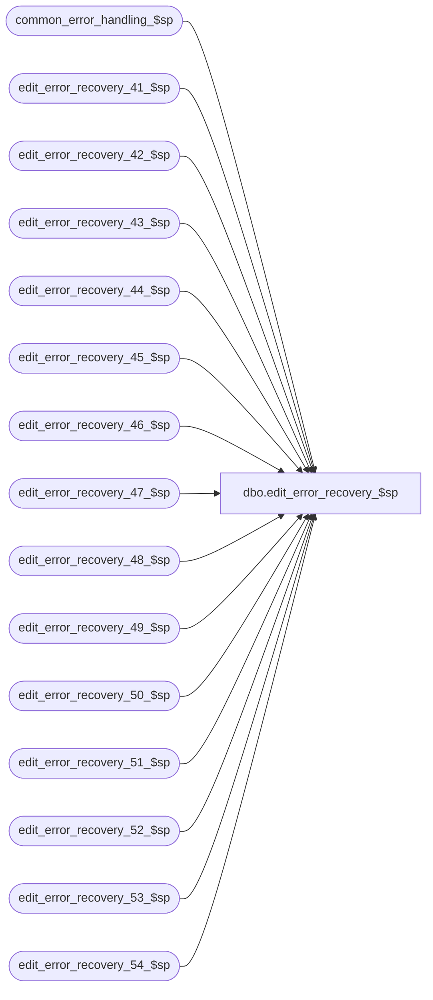

# dbo.edit_error_recovery_$sp

**Database:** auditworks_external  
**Server:** bedrockdb01  

## Architecture Diagram



## Table Dependencies

| Referenced Table |
|---|
| common_error_handling_$sp |
| edit_error_recovery_41_$sp |
| edit_error_recovery_42_$sp |
| edit_error_recovery_43_$sp |
| edit_error_recovery_44_$sp |
| edit_error_recovery_45_$sp |
| edit_error_recovery_46_$sp |
| edit_error_recovery_47_$sp |
| edit_error_recovery_48_$sp |
| edit_error_recovery_49_$sp |
| edit_error_recovery_50_$sp |
| edit_error_recovery_51_$sp |
| edit_error_recovery_52_$sp |
| edit_error_recovery_53_$sp |
| edit_error_recovery_54_$sp |

## Stored Procedure Code

```sql
create proc [dbo].[edit_error_recovery_$sp] 

 
@violated_sareject_rule smallint,
@edit_process_no tinyint = 1
AS

/* Version:1.04 Date:1997/03/21 */
/* Author: Paul S. , last modified by Andrew V. on 1998/11/23 */
/* Description: To ignore duplicate lines ( caused by translate error ) and recover
   the rest of the transactions in the batch.
   Called by edit phase1 (various programs). 
   
** HISTORY:
** Date 	Name	Def#	Desc
** Mar17,05     Maryam  DV-1202 Call edit_error_recovery_54_$sp.
** Nov 26,01 	Winnie	1-969YY	Add logic for R3 error handling
*/
   

DECLARE @errmsg			nvarchar(255),
	@errno			int,
	@rows			int,
	@object_name		nvarchar(255),
	@process_name		nvarchar(100),
	@operation_name		nvarchar(100),
	@message_id		int


SELECT @process_name = 'edit_error_recovery_$sp',
       @message_id = 201068


IF @violated_sareject_rule = 50
  BEGIN
   EXEC edit_error_recovery_50_$sp @edit_process_no

   SELECT @errno = @@error
   IF @errno != 0
     BEGIN
      SELECT @errmsg = 'Failed to execute edit_error_recovery_50_$sp',
             @object_name = 'edit_error_recovery_50_$sp',
             @operation_name = 'EXECUTE'
      GOTO error
     END
  END /* @violated_sareject_rule = 50 */


IF @violated_sareject_rule = 41
  BEGIN
   EXEC edit_error_recovery_41_$sp @edit_process_no

   SELECT @errno = @@error
   IF @errno != 0
     BEGIN
      SELECT @errmsg = 'Failed to execute edit_error_recovery_41_$sp',
             @object_name = 'edit_error_recovery_41_$sp',
             @operation_name = 'EXECUTE'
      GOTO error
     END

  END /* @violated_sareject_rule = 41 */


IF @violated_sareject_rule = 42
  BEGIN
   EXEC edit_error_recovery_42_$sp @edit_process_no

   SELECT @errno = @@error
   IF @errno != 0
     BEGIN
      SELECT @errmsg = 'Failed to execute edit_error_recovery_42_$sp',
             @object_name = 'edit_error_recovery_42_$sp',
             @operation_name = 'EXECUTE'
      GOTO error
     END

  END /* @violated_sareject_rule = 42 */


IF @violated_sareject_rule = 43
  BEGIN
   EXEC edit_error_recovery_43_$sp @edit_process_no

   SELECT @errno = @@error
   IF @errno != 0
     BEGIN
      SELECT @errmsg = 'Failed to execute edit_error_recovery_43_$sp',
             @object_name = 'edit_error_recovery_43_$sp',
             @operation_name = 'EXECUTE'
      GOTO error
     END

  END /* @violated_sareject_rule = 43 */


IF @violated_sareject_rule = 44
  BEGIN
   EXEC edit_error_recovery_44_$sp @edit_process_no

   SELECT @errno = @@error
   IF @errno != 0
     BEGIN
      SELECT @errmsg = 'Failed to execute edit_error_recovery_44_$sp',
             @object_name = 'edit_error_recovery_44_$sp',
             @operation_name = 'EXECUTE'
      GOTO error
     END

  END /* @violated_sareject_rule = 44 */


IF @violated_sareject_rule = 45
  BEGIN
   EXEC edit_error_recovery_45_$sp @edit_process_no

   SELECT @errno = @@error
   IF @errno != 0
     BEGIN
      SELECT @errmsg = 'Failed to execute edit_error_recovery_45_$sp',
             @object_name = 'edit_error_recovery_45_$sp',
             @operation_name = 'EXECUTE'
      GOTO error
     END

  END /* @violated_sareject_rule = 45 */


IF @violated_sareject_rule = 46
  BEGIN
   EXEC edit_error_recovery_46_$sp @edit_process_no

   SELECT @errno = @@error
   IF @errno != 0
     BEGIN
      SELECT @errmsg = 'Failed to execute edit_error_recovery_46_$sp',
             @object_name = 'edit_error_recovery_46_$sp',
             @operation_name = 'EXECUTE'
      GOTO error
     END

  END /* @violated_sareject_rule = 46 */


IF @violated_sareject_rule = 47
  BEGIN
   EXEC edit_error_recovery_47_$sp @edit_process_no

   SELECT @errno = @@error
   IF @errno != 0
     BEGIN
      SELECT @errmsg = 'Failed to execute edit_error_recovery_47_$sp',
             @object_name = 'edit_error_recovery_47_$sp',
             @operation_name = 'EXECUTE'
      GOTO error
     END

  END /* @violated_sareject_rule = 47 */


IF @violated_sareject_rule = 48
  BEGIN
   EXEC edit_error_recovery_48_$sp @edit_process_no

   SELECT @errno = @@error
   IF @errno != 0
     BEGIN
      SELECT @errmsg = 'Failed to execute edit_error_recovery_48_$sp',
             @object_name = 'edit_error_recovery_48_$sp',
             @operation_name = 'EXECUTE'
      GOTO error
     END

  END /* @violated_sareject_rule = 48 */


IF @violated_sareject_rule = 49
  BEGIN
   EXEC edit_error_recovery_49_$sp @edit_process_no

   SELECT @errno = @@error
   IF @errno != 0
     BEGIN
      SELECT @errmsg = 'Failed to execute edit_error_recovery_49_$sp',
             @object_name = 'edit_error_recovery_49_$sp',
             @operation_name = 'EXECUTE'
      GOTO error
     END

  END /* @violated_sareject_rule = 49 */


IF @violated_sareject_rule = 51
  BEGIN
   EXEC edit_error_recovery_51_$sp @edit_process_no

   SELECT @errno = @@error
   IF @errno != 0
     BEGIN
      SELECT @errmsg = 'Failed to execute edit_error_recovery_51_$sp',
             @object_name = 'edit_error_recovery_51_$sp',
             @operation_name = 'EXECUTE'
      GOTO error
     END

  END /* @violated_sareject_rule = 51 */


IF @violated_sareject_rule = 52
  BEGIN
   EXEC edit_error_recovery_52_$sp @edit_process_no

   SELECT @errno = @@error
   IF @errno != 0
     BEGIN
      SELECT @errmsg = 'Failed to execute edit_error_recovery_52_$sp',
             @object_name = 'edit_error_recovery_52_$sp',
             @operation_name = 'EXECUTE'
      GOTO error
     END

  END /* @violated_sareject_rule = 52 */


IF @violated_sareject_rule = 53
  BEGIN
   EXEC edit_error_recovery_53_$sp @edit_process_no

   SELECT @errno = @@error
   IF @errno != 0
     BEGIN
      SELECT @errmsg = 'Failed to execute edit_error_recovery_53_$sp',
             @object_name = 'edit_error_recovery_53_$sp',
             @operation_name = 'EXECUTE'
      GOTO error
     END

  END /* @violated_sareject_rule = 53 */


IF @violated_sareject_rule = 54
  BEGIN
   EXEC edit_error_recovery_54_$sp @edit_process_no

   SELECT @errno = @@error
   IF @errno != 0
     BEGIN
      SELECT @errmsg = 'Failed to execute edit_error_recovery_54_$sp',
             @object_name = 'edit_error_recovery_53_$sp',
             @operation_name = 'EXECUTE'
      GOTO error
     END

  END /* @violated_sareject_rule = 54 */
  
RETURN

error:
	EXEC common_error_handling_$sp 4, @errno, @errmsg, 0, @message_id, 
	@process_name, @object_name, @operation_name, 1, @edit_process_no
	RETURN
```

